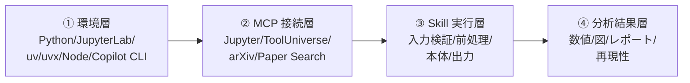

# 付録C トラブルシューティング

> **本付録の到達目標**
> - 環境構築・MCP 接続・Skill 実行・分析結果 のいずれで詰まっても、**症状→原因候補→対処** の順にたどって自力で解決できる
> - 「Copilot CLI に聞く前に自分で試す 30 秒チェック」を毎回実行できる
> - 詰まった状態をレポートするための **最小再現情報テンプレート** を持てる
>
> **この付録で扱わないこと**
> - 設計上の失敗パターン（循環設計・データ漏洩・ハルシネーション・再現性欠如）は第14章
> - 予防的な安全ルール（承認ゲート・禁止操作）は第6章
> - MCP の選択・設定の入門は付録B
> - Skill のテンプレートは付録A

---

## C.1 本付録の使い方

トラブルは 4 層のどこかで発生します。**症状が出た層** から表を引きます。



| 症状の層 | 節 |
|---|---|
| ①環境が動かない・コマンドが見つからない | [C.2](#c2-環境層のトラブル) |
| ②MCP に接続できない・見えない | [C.3](#c3-mcp-接続層のトラブル) |
| ③Skill が途中で落ちる・想定と違う結果 | [C.4](#c4-skill-実行層のトラブル) |
| ④結果が変・再現しない・不安 | [C.5](#c5-分析結果層のトラブル) |
| 問合せ・再現情報を残したい | [C.6](#c6-最小再現情報テンプレート) |

### C.1.1 コパイロットに聞く前の 30 秒チェック

エラーに遭遇したら、**まずこの 6 項目**を試してください。多くはこれで解ける、または原因が絞れます。

- [ ] エラーメッセージの **最後の 5 行** を落ち着いて読んだ
- [ ] `python --version` / `node --version` / `uv --version` / `copilot --version` を確認した
- [ ] ターミナルを **新規に開き直した**（環境変数の再読み込み）
- [ ] 直前に変更したファイル・コマンドを 1 つずつ元に戻して切り分けた
- [ ] JupyterLab はブラウザで開けるか（`http://localhost:8888/`）、MCP は **登録済み** か（`copilot mcp list`）を確認した。**登録＝接続ではない**ので、実際にツールが動くかは Copilot CLI 対話中に `/mcp` で確認するか、簡単な呼び出しを試す
- [ ] 症状を **他人に伝えられる 3 行** に要約できた（C.6 の最小再現情報）

> [!TIP]
> エラーメッセージをそのまま Copilot CLI に貼って「原因と対処を教えて」と尋ねるのは有効ですが、**提示された対処が妥当かは自分で確認**してください（第6章 Human-in-the-loop）。

---

## C.2 環境層のトラブル

### C.2.1 症状別クイック索引

| 症状 | よくある原因 | 対処節 |
|---|---|---|
| `copilot` コマンドが見つからない | Node.js が古い／未 install ／PATH 未反映 | [C.2.2](#c22-copilot-cli-が起動しない) |
| `uv` / `uvx` が見つからない | `uv` 未 install ／シェル再起動忘れ | [C.2.3](#c23-uv--uvx-が起動しない) |
| `python: command not found` | macOS/Linux の `python3` エイリアス問題 | [C.2.4](#c24-python-バージョンとエイリアス) |
| JupyterLab 起動時に `pycrdt` エラー | `jupyter-collaboration` / `pycrdt` の版不整合 | [C.2.5](#c25-jupyterlab-起動時の依存エラー) |
| ポート衝突（`OSError: [Errno 48]`） | 別プロセスが 8888 番を使用中 | [C.2.6](#c26-ポート衝突) |
| 仮想環境がアクティブにならない | シェル別のアクティベート差 | [C.2.7](#c27-仮想環境がアクティブにならない) |
| 社内プロキシ・SSL 証明書エラーで npm/pip/uv が失敗 | 社内 CA / プロキシ未設定 | [C.2.8](#c28-企業プロキシssl-インスペクションカスタム-ca) |

### C.2.2 Copilot CLI が起動しない

**確認手順**

```bash
node --version          # 22 以上を推奨
which copilot           # PATH に載っているか
copilot --version
```

**対処**

- `node --version` が 22 未満 → Node.js 公式インストーラで最新 LTS に更新
- `which copilot` が空 → `npm install -g @github/copilot` を再実行（第4章 §4.5）
- インストール直後は **ターミナルを開き直す**（PATH を再読み込み）
- Windows は WSL2 or PowerShell の管理者権限を確認

### C.2.3 `uv` / `uvx` が起動しない

**確認手順**

```bash
uv --version
uvx --version
which uv
```

**対処**

- 未 install → 公式スタンドアロンインストーラ（推奨、システム全体で `uvx` が使える）または `pipx install uv`
- install 後に反映されない → **ターミナル再起動** or `hash -r`
- 会社 PC で外部インストーラが使えない → 一時的に `pip install uv`（ただし **仮想環境の中だけで install すると、外の Copilot CLI から `uvx` が見えず MCP 起動が失敗**することがある。第4章 §4.4 参照）

### C.2.4 Python バージョンとエイリアス

**確認手順**

```bash
python --version        # 3.11 以上を推奨（本書標準）
python3 --version
```

**対処**

- `python: command not found` → macOS/一部 Linux は `python3` のみ存在。`alias python=python3` を `~/.zshrc` / `~/.bashrc` に追加
- 複数バージョンが混在 → **仮想環境** (`python3 -m venv .venv`) を作り、そこで作業する
- arXiv MCP は **Python >= 3.11** が要件（付録B B.3.3）。3.10 以下だと `uvx arxiv-mcp-server` が失敗する

### C.2.5 JupyterLab 起動時の依存エラー

**症状**：`pycrdt` / `jupyter-collaboration` 系のトレースバック

**対処**

```bash
# 本書標準環境の版に揃える（第4章 §4.3 と同じコマンド）
pip install jupyterlab==4.4.1 jupyter-collaboration==4.0.2 jupyter-mcp-tools ipykernel pycrdt
pip install pandas numpy scipy matplotlib
```

- 版を明示的に指定しないと、Jupyter MCP と組み合わせで壊れることがある
- それでも直らない場合は **仮想環境を作り直す**（`rm -rf .venv && python3 -m venv .venv && source .venv/bin/activate` 後に再 install）

### C.2.6 ポート衝突

**症状**：JupyterLab 起動時に `OSError: [Errno 48] Address already in use`

**対処**

```bash
# 8888 を使っているプロセスを特定
lsof -iTCP:8888 -sTCP:LISTEN    # macOS/Linux
# もう不要なら PID を控えて停止（自分の JupyterLab か必ず確認）
kill <PID>

# または別ポートで起動
jupyter lab --port=8899
```

- **⚠️ `pkill jupyter` は他ユーザ・他プロジェクトの Jupyter も落とすため避ける**。PID 指定で停止する
- 別ポートで起動した場合は、Copilot CLI 側の `JUPYTER_URL` も一致させる（付録B B.4.1）

### C.2.7 仮想環境がアクティブにならない

**対処**

| シェル | アクティベートコマンド |
|---|---|
| bash / zsh | `source .venv/bin/activate` |
| fish | `source .venv/bin/activate.fish` |
| Windows PowerShell | `.\.venv\Scripts\Activate.ps1` |
| Windows cmd | `.\.venv\Scripts\activate.bat` |

- プロンプトに `(.venv)` が出れば成功。出なければパス誤り or 権限（PowerShell の実行ポリシーを緩める）

### C.2.8 企業プロキシ・SSL インスペクション・カスタム CA

ARIM 参画機関では、社内プロキシや SSL インスペクションで `npm` / `pip` / `uvx` / MCP の HTTP 通信が壊れることがあります。

**確認・対処**

```bash
# 現在のプロキシ設定
echo "$HTTP_PROXY $HTTPS_PROXY $NO_PROXY"
npm config get proxy && npm config get https-proxy
pip config list
```

- npm / pip / uv には各々のプロキシ設定が要る。**シェルの `HTTPS_PROXY` だけでは不十分** なケースが多い
- SSL インスペクション環境では、社内 CA を Python / Node に教える必要がある：
  - Python（requests系）：`export REQUESTS_CA_BUNDLE=/path/to/corp-ca.pem` / `SSL_CERT_FILE`
  - Node：`export NODE_EXTRA_CA_CERTS=/path/to/corp-ca.pem`
- `NO_PROXY=localhost,127.0.0.1` を入れておかないと Jupyter MCP がループバック接続でもプロキシに行ってしまう
- **情シスに問い合わせて社内 CA を入手** するのが正攻法。自己判断で SSL 検証を無効化しない

---

## C.3 MCP 接続層のトラブル

### C.3.1 症状別クイック索引

| 症状 | よくある原因 | 対処節 |
|---|---|---|
| `copilot mcp list` に MCP が出ない | 登録失敗 / 起動失敗 | [C.3.2](#c32-mcp-が-list-に出ない--failed-表示) |
| Jupyter MCP が `connected` にならない | トークン不一致 / JupyterLab 未起動 | [C.3.3](#c33-jupyter-mcp-がつながらない) |
| ToolUniverse ツールが呼べない | API キー未設定 / 上流ツールのレート制限 | [C.3.4](#c34-tooluniverse-の個別ツールが失敗する) |
| arXiv / Paper Search がタイムアウト | ネットワーク・レート制限 | [C.3.5](#c35-文献-mcp-のタイムアウト) |
| 環境変数を設定したのに効かない | 起動シェルが違う / 展開されていない | [C.3.6](#c36-環境変数が-mcp-に届かない) |

### C.3.2 MCP が list に出ない / failed 表示

> [!NOTE]
> `copilot mcp list` は **登録済み** の MCP を表示するもので、**実行時に接続できるか** は保証しません。実行時の可否は Copilot CLI 対話中の `/mcp` や、実際にツールを呼び出してみて確認します。

**確認手順**

```bash
copilot mcp list                # 登録状況の一覧
copilot mcp get <name>          # 詳細（コマンド・引数・env）
```

**対処**

- 登録漏れ → 付録B B.4.1 の `copilot mcp add ...` を再実行
- `failed` 表示 → `command` / `args` に指定した実行ファイルが存在するか（`which uvx` 等）を確認
- 手書きした `.mcp.json` が壊れている → JSON バリデータで構文確認
- User と Workspace の両方に同名 MCP がある → どちらが優先されるか `copilot mcp get` で確認し、片方を削除

### C.3.3 Jupyter MCP がつながらない

**確認手順**（第4章 §4.6 と同じ）

1. JupyterLab が **今も起動中** か？（ブラウザで `http://localhost:8888/` が開く）
2. ポート番号は Copilot CLI 側の設定と **一致** しているか？
3. **トークン** が一致しているか？（JupyterLab 起動時にターミナルへ出る URL の `?token=...`）
4. `copilot mcp get jupyter` の `env` に `JUPYTER_URL` / `JUPYTER_TOKEN` が入っているか？

**対処**

- トークンが毎回変わって煩雑なら、`jupyter lab --port 8888 --IdentityProvider.token "my-fixed-token"` で固定（**個人開発機のみ**、共有サーバでは危険）
- 一度 `copilot mcp remove jupyter` してから `copilot mcp add jupyter --env ...` で登録し直す（**`remove` は User 設定 `~/.copilot/mcp-config.json` のみに効きます**。Workspace の `.mcp.json` に書いた場合は、そのファイルを直接編集してください。付録B B.4.1）

### C.3.4 ToolUniverse の個別ツールが失敗する

ToolUniverse 本体は接続できているが、**特定ツール呼び出し時にエラー** になるケース。

| 症状 | 原因 | 対処 |
|---|---|---|
| `401 Unauthorized` | API キー未設定 | 上流ツールが要求する **正確な環境変数名** を README で確認して設定（付録B B.5.2） |
| `429 Too Many Requests` | レート制限 | リトライ間隔を広げる／小規模データで試す |
| `403 Forbidden` | 有料プラン必須・地域制限 | 別ツール（arXiv MCP 等）に切り替える |
| ツール一覧に目当てが無い | ToolUniverse 版の差／有効化フラグ | 版を上げる or 直接その API 用の自作 MCP（FastMCP）を検討 |

> [!IMPORTANT]
> `TOOLUNIVERSE_*` のような独自プレフィックスで環境変数を設定しても効きません。上流ツールが要求する変数名（例：`OPENAI_API_KEY`, `NCBI_API_KEY`）で設定してください（付録B B.5.2）。

### C.3.5 文献 MCP のタイムアウト

**arXiv / Paper Search が応答しない**

- ネットワーク（企業プロキシ・VPN）でブロックされていないか、以下で切り分ける：
  ```bash
  curl -Iv https://arxiv.org/    # DNS / TLS / HTTP ステータスを確認
  ```
  失敗原因を **DNS 解決 / TLS 証明書 / プロキシ認証 / HTTP ステータス** のどれかに絞り込む
- レート制限に触れている可能性 → 検索クエリを絞る、時間をおいて再試行
- Paper Search はソース依存 → 特定ソース（例：Google Scholar）だけ CAPTCHA でブロックされていることがある。**別ソース**を試す（付録B B.3.4）

### C.3.6 環境変数が MCP に届かない

**確認手順**

```bash
# Copilot CLI を起動したシェルで値が「設定されているか」だけ確認（値そのものは出さない）
test -n "${JUPYTER_TOKEN:-}"    && echo "JUPYTER_TOKEN=set"    || echo "JUPYTER_TOKEN=unset"
test -n "${OPENAI_API_KEY:-}"   && echo "OPENAI_API_KEY=set"   || echo "OPENAI_API_KEY=unset"

# copilot mcp add で登録した内容を確認（既定はマスク表示）
copilot mcp get jupyter
# 値の実体を目視で照合する必要がある時のみ（ログに残さない）
# copilot mcp get jupyter --show-secrets
```

> [!WARNING]
> `echo "$OPENAI_API_KEY"` や `--show-secrets` の出力を **ターミナルに直接出す→ログに残る→Issue に貼る** という事故が頻発します。まず「set / unset」だけ確認し、値そのものを見るのは最終手段にしてください。

**対処**

- `~/.zshrc` に `export` しても、既に起動しているターミナルには **反映されない** → 新しいターミナルで Copilot CLI を再起動
- `copilot mcp add --env KEY=VALUE ...` で登録すると **その値が固定**される。シェルの env は追随しない。値変更時は `copilot mcp remove` → `add` で入れ直す
- `.mcp.json` の `env` に `${JUPYTER_TOKEN}` と書いても **展開される保証はない**（付録B B.4.1）。`copilot mcp add --env` 経由を推奨

---

## C.4 Skill 実行層のトラブル

Skill が **登録・起動はできるのに、期待通り動かない** ケース。

### C.4.1 症状別クイック索引

| 症状 | よくある原因 | 対処節 |
|---|---|---|
| Skill が呼び出されない | `description` が曖昧・`when to use` 未記載 | [C.4.2](#c42-skill-が発火しない) |
| 入力を受け付けず即失敗 | fatal 拒否条件に該当 | [C.4.3](#c43-fatal-拒否で止まる) |
| 途中で `KeyError` / `ValueError` | データ契約違反 | [C.4.4](#c44-データ契約違反) |
| 実行はできるが結果が空 | 前処理パラメータが厳しすぎる | [C.4.5](#c45-結果が空--0件) |
| 実行時間が長すぎる | 大サイズ入力 / N² アルゴリズム | [C.4.6](#c46-実行時間が長すぎる) |
| `references/` の内容が反映されない | Skill の progressive disclosure 誤解 | [C.4.7](#c47-references-が読まれない) |

### C.4.2 Skill が発火しない

**症状**：Copilot CLI で該当 Skill が使われず、汎用回答が返る

**確認**

- SKILL.md の `description` に **「いつ使うか」** が明記されているか（付録A A.2.2）
- Skill が置かれている場所が Copilot CLI から見えているか（`.github/skills/` / `~/.copilot/skills/` / Workspace の `skills/`）
- ユーザーが Skill 名を **明示的に指定** して試すと動くか？（例：「`spectrum-analysis` Skill を使って...」）

**対処**

- `description` に「〜と依頼された場合」「〜のデータを渡された場合」を追加（付録A A.2.2）
- 曖昧な依頼を試すのではなく、まず **明示指定** で動くことを確認 → 動くなら description の問題

### C.4.3 fatal 拒否で止まる

**症状**：入力を渡してすぐエラーメッセージで停止

**確認**

- SKILL.md ⑤ の fatal 拒否条件（付録A A.2.2）と `references/input-schema.md` を突き合わせる
- どの条件で拒否されたかを **エラーメッセージで名指し** されているか

**対処**

- 拒否条件を満たすように入力を整える（例：`sample_id` / `instrument_id` を追加）
- **拒否そのものを緩めない**（緩めると第14章の失敗事例に該当）。データが真に条件を満たさないなら、その旨をユーザに返すのが正解

### C.4.4 データ契約違反

**症状**：`KeyError: 'x'` / `ValueError: unit mismatch` など

**対処**

```python
# scripts/validate_input.py で早期発見（第8章）
import pandas as pd
df = pd.read_csv(input_path)
required = {"x", "y", "sample_id", "instrument_id"}
missing = required - set(df.columns)
if missing:
    raise ValueError(f"必須カラム欠落: {missing}")
```

- 契約違反は **前処理より前** に検出する（fatal 拒否と同じ層）
- 単位が違う場合は `units` メタで明示的に管理し、Skill 内部で強制変換しない（第8章 §8.11・第11章 §11.2）

### C.4.5 結果が空 / 0 件

**症状**：Skill は最後まで走るが `peaks: []` / `objects.count: 0`

**確認**

- 前処理パラメータ（prominence, threshold, min_size 等）が **入力に対して厳しすぎ** ないか
- 背景差引の設定が入力データの範囲と合っているか
- 入力データが期待した装置カテゴリに一致するか（別データ型を渡していないか）

**対処**

- `references/failure-catalog.md` の「0 件」パターンに従う（付録A A.2.2）
- パラメータを緩めて **段階的に**試す：まず一番緩い設定で何件出るかを見て、徐々に絞る
- **緩めた結果を Skill にハードコードしない**。ユーザ指定で切り替えられる形にする

### C.4.6 実行時間が長すぎる

**確認**

- 入力サイズ（行数・ピクセル数・スペクトル本数）は妥当か
- スモークテスト用のミニ入力で試すと 1 分以内に終わるか（付録A A.2.5）

**対処**

- 大サイズ入力は **分割処理** or **ダウンサンプル** を検討
- タイムアウト付きで実行する（スモークテストの `timeout=60` パターン）
- CPU 律速なら並列化、I/O 律速なら **キャッシュ**（`references/` を再取得しない）

### C.4.7 `references/` が読まれない

**症状**：Skill の説明書には書いてあるのに、AI が古い情報で動いている

**対処**

- SKILL.md 本体から `references/*.md` を **明示的にリンク** する（付録A A.2.2）
- SKILL.md は短く保ち（〜300 行）、詳細は references に置く progressive disclosure を守る
- Skill を差し替えた後は **Copilot CLI を再起動**（Skill キャッシュが残ることがある）

---

## C.5 分析結果層のトラブル

**Skill は正常に完走するが、結果が変・再現しない・信頼できない** ケース。

### C.5.1 症状別クイック索引

| 症状 | 分類 | 対処節 |
|---|---|---|
| 同じ入力なのに毎回結果が違う | 再現性欠如 | [C.5.2](#c52-同じ入力で結果が揺れる) |
| 数値が装置カタログとかけ離れる | 単位・スケール・前処理 | [C.5.3](#c53-数値が想定と大きくずれる) |
| 図に予期しないピーク・オブジェクト | 背景・セグメンテーション | [C.5.4](#c54-図に偽陽性が乗る) |
| レポートの記述が入力と食い違う | ハルシネーション | [C.5.5](#c55-レポートが入力と食い違う) |
| 半年後に再実行すると結果が違う | パッケージ版・環境差 | [C.5.6](#c56-時間をおいて再実行したら結果が変わった) |

### C.5.2 同じ入力で結果が揺れる

**確認**

- 乱数を使うステップがあるか（クラスタリング・事前学習モデル・データ拡張）
- `provenance.random_seed` が固定されているか（付録A A.2.4）
- 浮動小数点の丸め挙動が OS / BLAS 実装で違う可能性

**対処**

- seed 固定（`np.random.seed(42)` / `torch.manual_seed(42)` 等）
- **事前に許容差**を定義（第12章 §12.4 の L1 距離基準）
- 揺れの分布を測定：10 回実行して標準偏差を出し、報告に含める

### C.5.3 数値が想定と大きくずれる

**確認手順**（順に）

1. 入力の **単位** を確認（nm vs Å、cm⁻¹ vs eV、°C vs K）
2. **スケール** を確認（画像のピクセルサイズ、XRD の波長）
3. **前処理** を確認（背景差引の有無、スムージング窓幅）
4. 装置固有の **校正** が済んでいるか

**対処**

- 単位・スケール情報は **メタデータで管理**、Skill 内で暗黙変換しない
- 校正データがある装置は、Skill の fatal 拒否に「校正済みか」を含める

### C.5.4 図に偽陽性が乗る

**スペクトル型：ピークが多すぎる**

- prominence / distance / height を厳しめに → 段階的に緩める
- 背景モデル（rolling ball / SNIP / polynomial）を変更（付録A A.3.1）
- 低角側・低質量側の急落を除外範囲に

**画像型：粒子が過剰分割される**

- ノイズ除去のカーネルサイズを大きく
- 閾値・watershed の marker 距離を再設定
- **粒径分布の左裾が長く**なっているのが過剰分割の典型徴候（付録A A.3.3）

**回折型：小角に存在しないピーク**

- 背景差引を再検討（付録A A.3.4）
- λ の設定・`x_axis_type` の指定を確認

### C.5.5 レポートが入力と食い違う

**症状**：Markdown レポートに、実データに存在しない値・帰属が書かれている

**対処**

- **第14章 §14.4 ハルシネーション** に該当。設計側で予防する
- Skill は **数値だけを返し、帰属・物質同定はしない**（第7章 §7.5・付録A A.2.2 の禁止事項）
- レポート生成 Skill は **Skill 出力の JSON のみを引用元**とし、装置カテゴリの一般論を混ぜない
- レビュー時は Skill 出力 JSON と Markdown を突き合わせる（第12章の検証パス）

### C.5.6 時間をおいて再実行したら結果が変わった

**確認**

- `provenance.package_versions` に記録された版と、現在の環境の版を比較
- Python バージョンが変わっていないか
- 入力ファイルの `input_sha256` は一致するか（ファイルが微妙に書き換わっていないか）

**対処**

- 版が変わっていれば **旧版で再現** できるかを試す（`uv pip install package==old_version` で切り分け）
- 恒久対策は `references/env-lock.txt`（`pip freeze` 出力）を Skill と一緒に置く（第11章 §11.4）
- 完全再現が必要なら Docker / devcontainer 化を検討（本書標準環境の範囲外）

---

## C.6 最小再現情報テンプレート

トラブルを他人に相談する・GitHub Issue を立てる・Copilot CLI に貼るときの **最小情報セット** です。これがあれば、無駄なやり取りが激減します。

```markdown
## 症状（1〜3 行）
- 何をしたら / 何が起きた / 期待は何だったか

## 環境
- OS: {macOS 14.5 / Ubuntu 24.04 / Windows 11 + WSL2 ...}
- Python: {3.12.1}
- Node: {22.5.0}
- Copilot CLI: {copilot --version の出力}
- uv: {uv --version}
- 主要パッケージ版: numpy=X, scipy=X, pandas=X
- 標準環境ピン: jupyter-mcp-server==0.14.4 / tooluniverse==1.4.4

## MCP 状態
- `copilot mcp list` の出力（マスク後）

## 再現手順（最小）
1. …
2. …
3. …

## エラー全文（可能な範囲で）
```
（トレースバックを貼る。秘密情報を必ずマスク）
```

## 試したこと
- C.1.1 の 30 秒チェック 6 項目：✅/❌
- 該当節（例：C.3.3）の対処：試行済み / 未

## 影響範囲
- 特定 Skill のみ / MCP 全体 / 環境全体
```

> [!WARNING]
> エラー全文には **トークン・API キー・実パス・課題番号** が混ざりがちです。貼る前に **マスク**（`****` 置換）してください。特に `copilot mcp get --show-secrets` の出力は絶対に共有しない。

---

## 章末ワーク

1. **自環境ヘルスチェック**：C.1.1 の 30 秒チェック 6 項目を、いま自分の環境で実行し、全て ✅ になることを確認する。
2. **意図的故障ドリル**：以下の手順で Jupyter MCP を意図的に外し、Skill を実行してどの症状表（C.3.2 / C.3.3）にヒットするかを追い、**5 分以内で回復**するまでを行う。
   ```bash
   # 事前に現在の設定を控える（値そのものは共有しない）
   copilot mcp get jupyter
   # 外す（User 設定のみ）
   copilot mcp remove jupyter
   # ここで Skill を実行 → 症状観察

   # 回復
   copilot mcp add jupyter \
     --env JUPYTER_URL=http://localhost:8888 \
     --env JUPYTER_TOKEN="$JUPYTER_TOKEN" \
     --env ALLOW_IMG_OUTPUT=true \
     -- uvx --from 'jupyter-mcp-server==0.14.4' jupyter-mcp-server
   ```
   `copilot mcp remove` は User 設定 `~/.copilot/mcp-config.json` のみに効きます。Workspace の `.mcp.json` に書いていた場合はそのファイル側をバックアップしてから編集してください。
3. **最小再現テンプレート適用**：直近のトラブル 1 件を C.6 のテンプレートに埋めてみる。埋まらない項目があれば、次回のために取得手段を確認しておく（例：`copilot mcp list` の出力の残し方）。
4. **failure-catalog に反映**：本付録で参照した症状のうち、自分の Skill でも起きうるものを `references/failure-catalog.md` に転記する（付録A A.2.2）。

---

## 本付録のまとめ

- トラブルは **4 層**（環境 / MCP 接続 / Skill 実行 / 分析結果）のどこかで起きる。**症状の層** から表を引くのが最速
- 何より **C.1.1 の 30 秒チェック**を毎回やる。多くのトラブルはここで解けるか原因が絞れる
- 分析結果層のトラブル（再現性・数値ずれ・偽陽性・ハルシネーション）は、**設計上の失敗** に踏み込んでいる可能性が高い。**第14章** と併読すること
- 相談・Issue・Copilot への問合せは **C.6 の最小再現情報** を貼る。往復回数が激減する
- 秘密情報を貼らない・マスクする（第6章と一致）

---

## 参考資料

### 関連章
- 第4章 環境構築（本付録 C.2 の一次資料）
- 第6章 MCP の安全な使い方（Human-in-the-loop）
- 第8章 データ契約（C.4.4 の一次資料）
- 第12章 検証（C.5.2・C.5.6 の一次資料）
- 第14章 失敗パターン（設計上の失敗との責務分離）

### 関連付録
- 付録A プロンプト・Skillテンプレート集（`failure-catalog.md` テンプレート）
- 付録B MCP カタログ（C.3 の設定側資料）

### 外部参考
- GitHub Copilot CLI ドキュメント <https://docs.github.com/copilot/how-tos/copilot-cli>
- Model Context Protocol 仕様 <https://modelcontextprotocol.io/specification>
- Jupyter MCP Server <https://github.com/datalayer/jupyter-mcp-server>
- ToolUniverse <https://github.com/mims-harvard/ToolUniverse>
