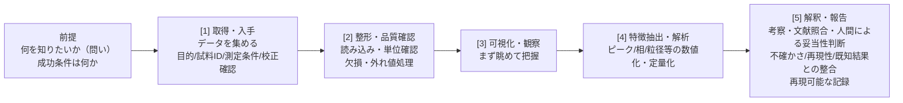
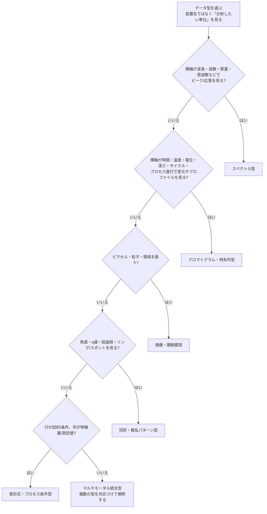
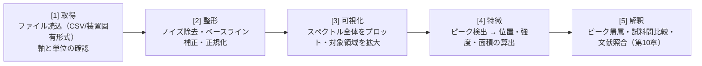
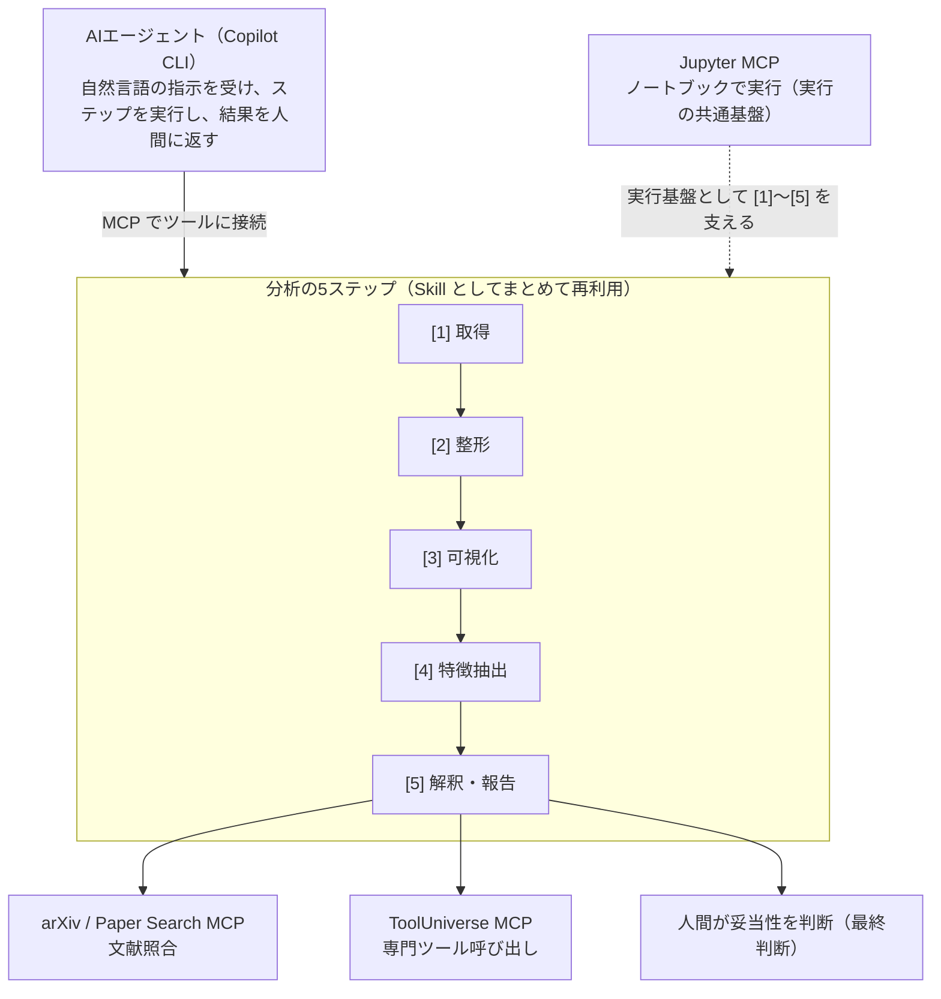

# 第2章 ARIMデータと実験ワークフローの全体像

> **本章の到達目標**
> - 装置カテゴリが違っても共通する「実験データ分析の5ステップ」を説明できる
> - 自分の扱うデータが6つの「データ型」のどれに当たるかを分類できる
> - データ型ごとに、分析Skillの骨格がどう共通化できるかをイメージできる
>
> **この章で扱うこと／扱わないこと**
> - 扱う: 分析プロセスの全体像、データ型分類、共通パターン
> - 扱わない: 個別の解析手法の詳細（ピークフィッティングのアルゴリズム等）、コード（第4章以降）

---

## 2.1 なぜ「全体像」から始めるのか

第1章では、本書のゴールが「**自分の実験データ向けにSkillを1つ以上自力で作れること**」だと述べました。しかし、いきなりツールを触る前に、まず**分析の地図**を手に入れておく必要があります。

理由は2つあります。

1. **装置は多様でも、分析の流れは驚くほど共通している** —— 質量分析でも顕微鏡でも、「データを読み、整え、見て、特徴を取り出し、解釈する」という骨格は変わりません。この共通性こそがSkill化の土台になります。
2. **自分のデータの"型"が分かれば、学ぶべきSkillの骨格が絞れる** —— 全装置を個別に学ぶのは非現実的です。データ型で束ねることで、学習も再利用も一気に効率化できます（型が主に決めるのはSkillの骨格であり、どのMCPを使うかは実行環境や参照先で別途決まります。第3章）。

本章はこの2つ——**共通プロセス**と**データ型分類**——を地図として描きます。

---

## 2.2 ARIMデータの多様性

ARIM（マテリアル先端リサーチインフラ）データポータルには、材料・ナノテク研究のあらゆる段階で生まれるデータが集まっています[脚注1]。大きく分けると次のような系統があります。

| 系統 | 代表的な装置カテゴリ |
|---|---|
| 分析・計測 | 質量分析、クロマトグラフ、磁気共鳴、各種分光（状態分析）、表面分析、回折・散乱、熱分析、バイオ装置 |
| 観察・イメージング | 光学顕微鏡、走査電子顕微鏡（SEM）、透過電子顕微鏡（TEM）、走査プローブ顕微鏡（SPM/AFM）、膜厚・粒度測定 |
| 加工・作製 | 成膜、成形、リソグラフィ、膜加工・エッチング、熱処理・ドーピング、微小加工、合成、組立・パッケージング、表面処理・洗浄 |
| 特性評価 | 機械特性、デバイス特性、磁気特性、電気化学 |
| 計算・理論 | 理論計算・シミュレーション |

一見バラバラですが、**出力されるデータの"かたち"に注目すると、少数のパターンに集約できます**。これが後述するデータ型の考え方です。

---

## 2.3 実験データ分析の共通5ステップ

装置やテーマが違っても、実験データ分析は次の5つのステップをたどります。本書のSkillは、このステップのどこか（または全体）を担うものとして設計します。分析を始める前に、その大前提として「**何を知りたいのか（問い）／何をもって成功とするのか**」を必ず定めます。



| ステップ | 内容 | 本書での主な対応章 |
|---|---|---|
| （前提） | 分析目的・問い・成功条件の設定 | 第7章 |
| [1] 取得・入手 | データの入手、メタデータ・測定条件・校正情報の確認 | 第8章 |
| [2] 整形・品質確認 | 読み込み、単位・軸の確認、欠損・外れ値処理、標準形式化 | 第8章 |
| [3] 可視化・観察 | まず全体を眺める、異常に気づく | 第9章 |
| [4] 特徴抽出・解析 | ピーク・相・粒径・特性値などの数値化 | 第9〜11章 |
| [5] 解釈・報告 | 考察、文献照合、物理的妥当性・不確かさ・再現性の確認、レポート化 | 第10・12章 |

> [!IMPORTANT]
> AIエージェント時代でも、この5ステップは消えません。変わるのは「**各ステップを人間が全部手で書く**」のか「**自然言語で指示し、エージェントが実行して人間が検証する**」のか、という進め方です。特に [5] の解釈は、**最終判断を人間が担う**（Human-in-the-loop）ことを忘れないでください。不確かさ・再現性の検証手法は第12章で詳しく扱います。

---

## 2.4 6つのデータ型

多様な装置データも、**分析上の"かたち"** で見ると6つの型に整理できます。同じ型なら、前処理・可視化・特徴抽出のパターンが共通し、Skillの骨格を使い回せます。

| データ型 | データの特徴 | 代表装置カテゴリ | 典型的な分析タスク |
|---|---|---|---|
| **スペクトル型** | 横軸=波長/波数/周波数/化学シフト/m/z など、縦軸=強度・応答量の1次元信号 | 各種分光（状態分析）、磁気共鳴、質量分析、EIS（Bode形式） | ベースライン補正、ピーク検出、面積・比の算出 |
| **クロマトグラム・時系列型** | 横軸=時間/温度/電位/深さ/サイクル/プロセス進行など（1次元プロファイル全般） | クロマトグラフ、熱分析、プロセス条件ログ、SIMS深さプロファイル | ピーク分離、保持時間、変化点・トレンド検出 |
| **画像・顕微鏡型** | 2次元（またはスタック）の画像データ | 光学顕微鏡、走査電子顕微鏡（SEM）、透過電子顕微鏡（TEM）、SPM/AFM 等 | セグメンテーション、粒径・形状計測、計数 |
| **回折・散乱パターン型** | 角度/散乱ベクトルに対する強度、ピークやリング/スポット | 回折・散乱（XRD/SAXS 等）、表面回折・散乱パターン（LEED/RHEED 等） | ピーク検出・d-spacing/格子定数の候補算出、既知DBとの候補照合支援（相同定は人間が候補を検証して判断） |
| **表形式・プロセス条件型** | 行=試料/条件、列=パラメータ/測定値の表 | 成膜、リソグラフィ、機械/電気/磁気特性 | 相関分析、条件比較、統計・回帰 |
| **マルチモーダル統合型** | 上記複数の型を組み合わせた統合解析 | 複数装置の連携（例: 分光×顕微鏡×回折） | 型をまたいだ突き合わせ・総合判断 |

> [!IMPORTANT]
> **分類は「装置名」ではなく「分析したいデータの構造」で行う**のが鉄則です。同じ装置カテゴリでも、出力によって型が変わります。特に **表面分析**（XPS/AES/SIMS/LEED/RHEED 等）はカテゴリ名が広く、単一の型に固定できません。**出力単位で 6 データ型に分類する**ことを徹底してください。迷ったら次の判定フローを使ってください。



### 迷いやすい装置カテゴリの分類例

2.2で挙げたカテゴリの多くは、出力形式によって複数の型にまたがります。代表例を示します。

| 装置・研究活動 | 主に対応する型 | 注意点 |
|---|---|---|
| 電気化学 | 時系列型（充放電・CV: 電位/時間に対する応答）／スペクトル型派生（EIS Bode: 周波数応答）／表形式型（EIS Nyquist: Z'–Z''平面の点列＋周波数メタデータ、サイクル寿命表） | 測定モードで型が変わる。EIS Nyquist は 2 次元プロット点列なので表形式派生として扱う |
| 表面分析 | スペクトル型（XPS/AES）／クロマトグラム・時系列型（SIMS 深さ方向プロファイル）／画像型（表面マッピング）／回折・散乱パターン型（LEED/RHEED 等） | カテゴリ名が広い。**単一型に固定せず、出力単位で分類**する |
| バイオ装置 | 表形式型（プレートリーダー・フローサイトメトリー）／画像型（蛍光画像）／時系列型 | 装置名でなく出力形式で判断 |
| 成膜・プロセス | 表形式・プロセス条件型（レシピ・条件表）／時系列型（成膜中ログ）／画像型（膜厚マップ） | 条件表とプロセスログを分ける |
| 熱分析 | クロマトグラム・時系列型（TG/DSC: 温度/時間に対する曲線） | 温度・時間軸の変化を追う |
| 膜厚・粒度測定 | 表形式型（D10/D50/D90などの集計値）／スペクトル型（粒径を横軸、頻度・体積比を縦軸とする1次元分布） | 集計値か分布かで判断 |
| 理論計算・シミュレーション | 表形式型（物性値）／時系列型（MDトラジェクトリ）／画像型（構造・場の可視化）／マルチモーダル型 | 出力対象で型が分かれる |

> [!NOTE]
> 1つの装置が複数の型を持つこともあります（例: ある分光装置が「スペクトル」と「マッピング画像」の両方を出す）。その場合は、**分析したい対象ごとに型を選ぶ**と考えてください。マルチモーダル統合型は第11章で扱います。

---

## 2.5 データ型ごとのSkillの骨格

なぜデータ型で束ねると便利なのか。それは、**同じ型なら共通5ステップの中身がほぼ同じ骨格になる**からです。スペクトル型を例に見てみましょう。



この骨格は、**赤外分光でもラマンでも質量分析でも、大枠は共通**です。違うのは「どの前処理を選ぶか」「ピークをどう帰属するか」といった**中身の調整**だけです。

> [!TIP]
> だからこそ、本書では「まず1つの型でSkillを完成させる」ことを勧めます。1つ作れば、同じ型の別装置には**骨格を流用し、中身を差し替える**だけで対応できます。ただし、列名・単位・校正条件・メタデータは装置ごとに必ず調整してください（第8章）。

各データ型の具体的なテンプレートは第13章と付録Aで提供します。本章では「自分のデータがどの型か」を押さえれば十分です。

---

## 2.6 分析ワークフローとSkill・MCPの対応（予告）

第1章で触れたSkillとMCPが、5ステップのどこで働くのかを、ここでは**軽く予告**します。三者の関係の詳細は第3章、各MCPの使い分けは付録Bで扱います。



- **データ型が主に絞るのは「Skillの骨格」**。どのMCPを使うかは、実行環境（Jupyter MCP）・参照先（文献MCP）・呼びたい専門ツール（ToolUniverse）で決まり、データ型だけでは決まりません。
- **Jupyter MCP**: ノートブック上で [1]〜[5] を実行する共通基盤（第5章）
- **arXiv / Paper Search MCP**: [5]解釈での文献照合（第10章）
- **ToolUniverse MCP**: 専門的な科学ツールの呼び出し（第4・11章）
- **Skill**: これら一連の流れを「再利用できる型」としてまとめたもの（第7章以降）

各MCPの詳細と使い分けは付録Bのカタログにまとめます。

---

## 2.7 本章のまとめ

- 装置は多様でも、実験データ分析は **取得→整形→可視化→特徴抽出→解釈** の共通5ステップをたどる
- 多様な装置データは **6つのデータ型** に整理でき、同じ型ならSkillの骨格を共通化できる
- まず「自分のデータがどの型か」を分類することが、学ぶべきSkillの骨格を絞る近道（MCPは実行環境・参照先で別途選ぶ）
- AIエージェント時代でも5ステップと最終判断（Human-in-the-loop）は変わらない

---

## 章末ワーク（コード不要）

次章以降に備えて、自分のデータを地図に載せてみましょう。

1. 自分が普段扱うデータを1つ選び、**2.4の判定フロー**を使ってデータ型に分類する
2. 迷った場合は**第1候補・第2候補**を書き、なぜ迷ったかも一言メモする（最終的には「今回Skill化したい分析対象」に合わせて1つ選ぶ）
3. そのデータの分析を **2.3の5ステップ**に当てはめ、各ステップで何をしているか一言ずつ書く
4. 5ステップのうち、**今いちばん手間がかかっている**ステップに印をつける（そこがSkill化の第一候補）
5. そのデータに付いている**メタデータ・測定条件**（単位、装置設定、校正情報など）を思い出せる範囲で書き出す

完了したら、以下のフォーマットで「私のデータ分類メモ」を残してください。**このメモは第8章・第9章でそのまま再利用します**。

```markdown
## 私のデータ分類メモ

- データ名:
- 装置カテゴリ:
- 分析したい対象:
- 第1候補のデータ型:
- 迷った型（あれば）:
- 分析の問い / 知りたいこと:
- 5ステップでの現在の作業:
- 最もSkill化したいステップ:
- 必須メタデータ・測定条件:
```

> [!NOTE]
> ここで選んだデータは、第9章で「最初のSkill」を作るときの題材候補になります。手元に実データがあると学習効果が大きく高まります。

> **次章予告**：第3章では、ここまで登場した **AI Agent・MCP・Skill の三者の関係**を整理し、それぞれが何を担い、人間がどこで判断するのか（役割分担）を明確にします。

---

## 参考資料

- [脚注1] ARIM データポータル 装置カテゴリ一覧 / テキストブック: https://nanonet.go.jp/data_service/page/textbook.html
