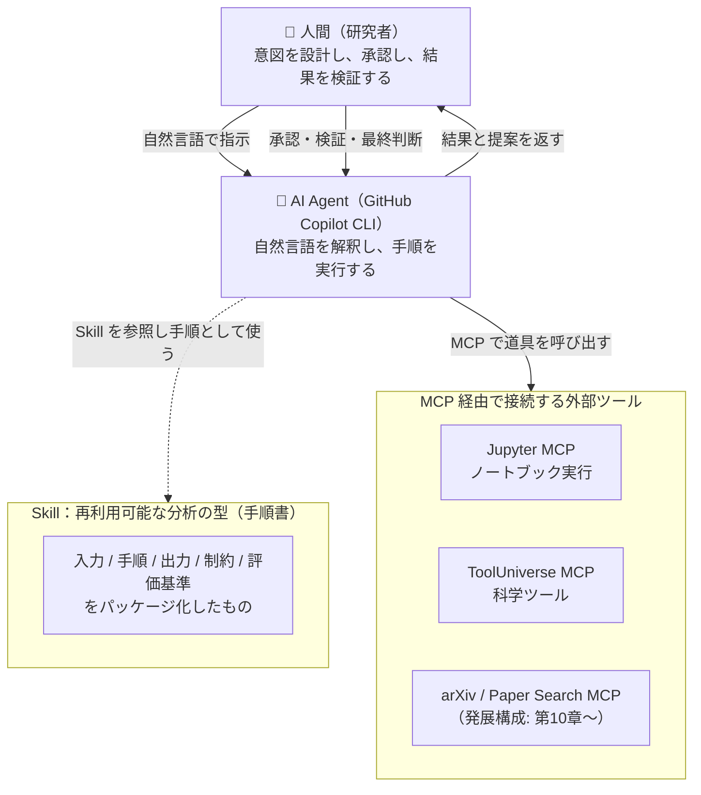
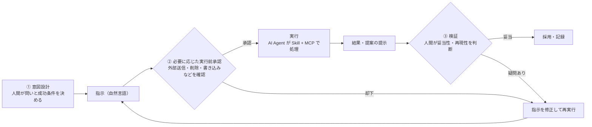

# 第3章 AI Agent・MCP・Skillの全体像

> **本章の到達目標**
> - AI Agent・MCP・Skill の3つを、それぞれ一言で説明できる
> - 三者がどう連携し、どこで役割が分かれるのかを図で説明できる
> - 「人間がどこで判断するのか（Human-in-the-loop）」を全体像の中に位置づけられる
>
> **この章で扱うこと／扱わないこと**
> - 扱う: 三者の役割と関係、Human-in-the-loop の位置づけ、用語の整理
> - 扱わない: 各ツールのインストール・設定・コード（第4章以降）、Skillの具体的な作り方（第7章以降）、安全設計の詳細（第6章）

---

## 3.1 まず、三者を一言で

第1章では「AIエージェント」と「MCP」、そして「Skill」という言葉が登場しました。第2章では、それらが分析の5ステップのどこで働くのかを軽く予告しました。本章では、この**3つの登場人物の役割と関係**をはっきりさせます。

まずは、それぞれを一言で押さえてください。

| 登場人物 | 一言でいうと | 役割のたとえ |
|---|---|---|
| **AI Agent** | 自然言語の指示を受けて、手順を考え・実行する「実行の主体」 | 指示を受けて動く**作業者** |
| **MCP** | AI Agent と外部ツール・データをつなぐ「共通コネクタ規格」 | 道具をつなぐ**共通端子（USB-C）** |
| **Skill** | 分析手順を再利用可能な形にまとめた「分析の型」 | 作業者が従う**作業手順書** |

そして、この3つの外側に必ずいるのが **人間（研究者）** です。人間は「何を知りたいか」を決め、結果を検証し、最終判断を下します。**主役は人間であり、AI Agent はそれを助ける存在**——この関係を本章の軸として覚えてください。

> [!NOTE]
> 3つの言葉は似た文脈で登場するため混同されがちです。ざっくり分けると、**AI Agent は「動く人」、MCP は「つなぐ規格」、Skill は「手順書」**です。この3つは競合するものではなく、**役割が異なるだけ**です。3.7で取り違えやすい点を整理します。

---

## 3.2 AI Agent —— 実行の主体

**AI Agent（AIエージェント）** は、大規模言語モデル（LLM）を中核として、自然言語の指示を解釈し、必要な道具を使いながら手順を実行する仕組みです[脚注1]。本書では、ターミナルで動く **GitHub Copilot CLI** を標準のAI Agentとして使います（導入は第4章）。

AI Agent には、従来のプログラムにない3つの特徴があります（第1章の再掲・整理）。

1. **自然言語で指示を受け取る** —— 「このスペクトルのピークを検出して」と書けば意図を汲む
2. **道具を、設定された範囲から選んで使う** —— 利用可能に設定された道具の中から、状況に応じて呼び出す
3. **文脈を保って反復する** —— 保持できる範囲の文脈を使い、対話的に分析を進める

ただし、AI Agent 単体では「言葉を理解して応答する」ことが中心です。**実際にノートブックを動かしたり、文献を検索したりするには、Agent が外部の道具に接続する必要があります**。本書では、その接続の共通規格として MCP を使います。また、**利用できる道具・権限・文脈長・応答レート等には環境ごとの制約がある**ことにも留意してください。

> [!IMPORTANT]
> 本書における AI Agent・LLM の利用範囲を明確にしておきます。本書では LLM を「**自然言語の指示を手順に変換し、道具を呼び出し、結果を要約・提案する**」役割で使います。**最終的な科学的判断（解析結果が正しいか、考察が妥当か）は LLM に委ねず、人間が行います**。この線引きは本書全体で一貫します（検証手法は第12章、リスクは第14章）。

---

## 3.3 MCP —— つなぐための共通規格

**MCP（Model Context Protocol）** は、AI Agent と外部のツール・データソースをつなぐための**オープンな共通規格**です[脚注2]。第1章では「USB-Cのような共通端子」とたとえました。ここではもう少しだけ踏み込みます（実装は扱いません）。

技術的には、MCP は **JSON-RPC 2.0** 形式のメッセージでやり取りするプロトコルで、代表的な接続方法（transport）に **stdio** と **HTTP** があります。本章では実装詳細には踏み込みませんが、これらは第4章以降で設定ファイル・サーバ起動方式として登場します。

MCP の世界には、大きく2つの役割があります。

| 役割 | 説明 | 本書での例 |
|---|---|---|
| **MCPサーバ** | 道具やデータを「MCPの作法」で外部に提供する側 | Jupyter MCP、ToolUniverse MCP、arXiv MCP |
| **MCPホスト** | AI Agent アプリ本体（LLM＋UI＋道具接続の管理） | GitHub Copilot CLI |
| **MCPクライアント** | MCP ホスト内で、各 MCP サーバと 1:1 で通信する部品 | Copilot CLI 内部で自動生成される |

> [!NOTE]
> **ホストとクライアントの関係**：MCP ホスト（Agent アプリ全体）が、接続する MCP サーバの数だけ MCP クライアント（通信担当）を内部に持つ、という 1:N の関係です。初学者向けには両方まとめて「Agent 側」と呼ぶことがあります。実装レベルの詳細は付録Bで扱います。

MCPサーバは、AI Agent に対しておおむね次の3つを提供します（概念として押さえれば十分です）。

- **ツール（Tools）**: AI Agent が呼び出せる操作（例: 「セルを実行する」「論文を検索する」）
- **リソース（Resources）**: AI Agent が参照できる読み取り用のデータ（例: ファイルの内容、参照用ドキュメント、データベースのスキーマ）
- **プロンプト（Prompts）**: MCPサーバが用意する定型的な指示テンプレート（本書の Skill とは別概念。3.7で区別する）

> [!NOTE]
> なぜ「共通規格」が重要なのでしょうか。もし装置ごと・ツールごとに接続方法がバラバラだと、AI Agent はそのたびに個別対応が必要になります。MCP という共通の作法があるおかげで、**新しい道具でも「MCPサーバ」として用意すれば、同じやり方で AI Agent につなげられる**のです。これが第2章で述べた「骨格の再利用」を、ツール接続の面から支えます。

> [!WARNING]
> MCP はあくまで「**つなぐ**」ための規格です。**「安全につなぐ」ための権限設計・実行前承認・禁止操作のルールは、MCP 自体とは別に用意する必要があります**。何でもつなげてしまうからこそ、機密データの外部送信や危険な操作のリスクが生じます。安全な使い方は第6章で体系的に扱います。

---

## 3.4 Skill —— 再利用可能な「分析の型」

**Skill（スキル）** は、第1章で「分析手順を再利用可能な形にまとめたもの」と定義しました。もう一歩詳しくいうと、Skill は次の要素をパッケージ化したものです（詳細な設計は第7章）。

| 要素 | 内容 | 例（スペクトル型） |
|---|---|---|
| **入力仕様** | どんなデータを受け取るか | CSV形式のスペクトル、横軸=波数、縦軸=強度 |
| **手順** | 何をどの順で行うか | 読込 → ベースライン補正 → ピーク検出 → 面積算出 |
| **出力仕様** | 何を返すか | ピーク一覧（位置・強度・面積）、プロット画像 |
| **制約・禁止事項** | やってはいけないこと | 機密データを外部送信しない、勝手にデータを補完しない |
| **評価基準** | 成功をどう判断するか | 既知ピークと一致するか、再現性があるか |

Skill があると、AI Agent は毎回ゼロから手順を組み立てる必要がなくなります。**「このSkillに従ってこのデータを分析して」と指示するだけで、決まった型で分析が進む**——これが再利用のうれしさです。第2章で見た「データ型ごとの骨格」を、実際に持ち運べる形にしたものが Skill だと考えてください。

> [!TIP]
> 「Skill＝手順書」「AI Agent＝その手順書に従って動く作業者」という関係です。環境ごとに Skill の記法や読み込み方法には差分がありますが、**入力・手順・出力・制約・評価基準という骨格は再利用できます**。同じ形式を読める別の AI Agent 環境や、同種のデータへの適用がしやすくなる——だからこそ、まず1つの型で丁寧に Skill を作ることに価値があります（第9章）。

---

## 3.5 三者の関係を1枚の図で

ここまでの3つを、人間を含めて1枚の図に統合します。**人間が意図を示し、AI Agent が Skill（手順書）に従い、MCP を通じて道具を使い、結果を人間に返す**——この循環が本書の全体像です。

この図のポイントは3つです。

1. **Skill と MCP は別物** —— Skill は「何をどうするか（手順書）」、MCP は「道具にどうつなぐか（接続規格）」。AI Agent は Skill に従いながら、MCP 経由で道具を使います。
2. **AI Agent は「実行上のハブ」** —— 人間・Skill・道具のすべてが AI Agent を介して**技術的につながる**。ただし**意思決定の中心は人間**であり、Agent は仲介役です。
3. **人間が輪を閉じる** —— 指示（入口）と検証・最終判断（出口）の両端に人間がいます。これが次節の Human-in-the-loop です。

---

## 3.6 Human-in-the-loop —— 人間はどこにいるのか

第1章で触れた **Human-in-the-loop（人間が輪の中にいる）** を、いよいよ全体像の中に位置づけます。AI Agent は強力ですが、**科学的な正しさを保証するのは人間の役目**です。人間は少なくとも次の3か所に必ず登場します。

| 人間の関与点 | 何をするか | 詳しく扱う章 |
|---|---|---|
| **① 意図設計** | 「何を知りたいか」「何をもって成功とするか」を決める | 第2章（前提）、第7章（Skill仕様） |
| **② 実行前承認** | 危険な操作（データ削除・外部送信・書き込みなど）を実行前に確認・許可する（すべての操作ではなく必要に応じて） | 第6章（安全な使い方） |
| **③ 検証** | 結果が物理的に妥当か、再現できるかを判断する | 第12章（検証・評価） |

> [!IMPORTANT]
> AI Agent が提案し、**人間が決定する**。この主従関係を崩すと、第1章で挙げた**循環設計問題**（結果も評価もAI任せで正しさを検証できなくなる）に陥ります。全体像を理解するうえで最も大切なのは、「便利な道具が増えても、**最終判断の椅子は人間のもの**」という点です。予防の考え方は第7章、失敗事例は第14章で扱います。

---

## 3.7 取り違えやすい3つのポイント

三者は役割が違うだけで競合しません。しかし、初学者がつまずきやすい混同があります。ここで整理しておきます。

| よくある混同 | 正しい理解 |
|---|---|
| 「MCP と Skill は同じもの?」 | 別物。**Skill＝分析手順（何をするか）**、**MCP＝道具への接続規格（どうつなぐか）**。Skill の手順の中で、MCP 経由の道具を使う。 |
| 「MCP の Prompts と Skill は同じもの?」 | 別物。MCP の **Prompts** はMCPサーバが用意する定型の指示テンプレート。**Skill は入力/手順/出力/制約/評価基準まで含む、より広い「分析の型」**（3.4）。 |
| 「AI Agent と LLM は同じもの?」 | LLM は AI Agent の「頭脳（言語理解の中核）」。**AI Agent は、LLM に道具の利用や反復実行の仕組みを加えた全体**を指す。 |
| 「Skill があれば人間は不要?」 | 不要にはならない。Skill は手順を定型化するが、**意図設計・承認・検証は人間が担う**（3.6）。 |
| 「MCP をつなげば安全?」 | つなぐことと安全は別。**権限・承認・禁止操作の設計が別途必要**（第6章）。 |

> [!NOTE]
> データ型（第2章）と MCP の関係も混同しやすい点です。**データ型は主に「Skillの骨格」を決めるもの**で、どのMCPを使うかは実行環境（Jupyter MCP）や参照先（文献MCP）で別途決まります。「型が決まれば使うMCPも自動で決まる」わけではありません。

---

## 3.8 全体像から各章へ

本章で描いた全体像は、以降の章で1つずつ具体化していきます。全体像と各章の対応を先に俯瞰しておきましょう。

| 全体像の要素 | 具体化する章 |
|---|---|
| AI Agent を動かす環境 | 第4章（環境構築）、第5章（最小の自然言語分析） |
| MCP を安全に使うルール | 第6章（安全な使い方・Human-in-the-loop の運用） |
| Skill の設計と作成 | 第7章（設計原則）、第8章（データ契約）、第9章（単一データ解析Skill） |
| Skill の拡張（文献・マルチモーダル） | 第10章、第11章 |
| 結果の検証とレポート化 | 第12章 |
| 横展開・運用 | 第13〜15章、付録 |

> [!TIP]
> ここから先は、いよいよ手を動かします。**全体像（誰が・何を・どこで判断するか）を頭に入れておくと、個々の作業が「全体のどこにあるのか」を見失いません**。迷ったら本章の3.5の図に戻ってきてください。

---

## 章末ワーク（コード不要）

第2章で選んだ「私のデータ分類メモ」を手元に、全体像を自分のケースに当てはめてみましょう。

1. 自分がやりたい分析を1つ思い浮かべ、**AI Agent に自然言語でどう指示するか**を1文で書いてみる
2. その分析で使いそうな**道具（ノートブック実行／文献検索／専門ツール）**を挙げ、どのMCPが対応しそうか予想する
3. その分析を**Skill（手順書）にするなら、手順を3〜5ステップ**で書き出す
4. 3.6の①②③のうち、**自分が特に注意すべき人間の関与点**はどれか、理由とともに書く

> [!NOTE]
> このワークは第7章「Skillの設計原則」への助走です。ここで書いた「指示・道具・手順・人間の関与点」は、そのまま Skill 仕様書の下書きになります。

---

## 本章のまとめ

- **AI Agent＝実行の主体**、**MCP＝つなぐ共通規格**、**Skill＝再利用可能な分析の型（手順書）**。3つは競合せず役割が異なる
- AI Agent は Skill に従い、MCP 経由で道具を使い、結果を人間に返す（3.5の全体像）
- 人間は **①意図設計・②実行前承認・③検証** の少なくとも3か所で必ず輪の中にいる（Human-in-the-loop）
- 「Skill と MCP」「AI Agent と LLM」「つなぐことと安全」の混同に注意する
- 全体像は第4章以降で1つずつ具体化される

> **次章予告**：第4章では、ここまで概念として登場した Python + JupyterLab + Jupyter MCP + GitHub Copilot CLI + ToolUniverse MCP を実際に導入し、**動作確認済みの環境**を手に入れます。いよいよハンズオンの始まりです。

---

## 参考資料

- [脚注1] 本書における「AI Agent／コーディングエージェント」の代表例は GitHub Copilot CLI (https://docs.github.com/copilot)。エージェントの中核として使われる LLM 提供サービス／API の例: Anthropic Claude (https://www.anthropic.com)、OpenAI API (https://platform.openai.com/docs)。**エージェントアプリ**と**LLM/API 提供元**は別レイヤであることに注意。
- [脚注2] Model Context Protocol（MCP）公式仕様: https://modelcontextprotocol.io/ ／ 本書のMCP解説の基準資料: https://qiita.com/hisaho/items/dc64fda8f0db972c392b
- [脚注3] 主要MCPサーバの公式情報: Jupyter MCP (https://github.com/datalayer/jupyter-mcp-server)、ToolUniverse (https://github.com/mims-harvard/ToolUniverse)、arXiv MCP / Paper Search MCP（付録B「MCPカタログ」に集約）。
