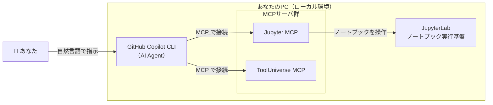

# 第4章 ハンズオン0：環境構築

> **本章の到達目標**
> - Python + JupyterLab の分析環境を用意できる
> - GitHub Copilot CLI（AI Agent）を導入し、ログインできる
> - Jupyter MCP と ToolUniverse MCP を Copilot CLI につなぎ、**動作確認済みの環境**を手に入れる
>
> **この章で扱うこと／扱わないこと**
> - 扱う: 各ツールの導入手順、接続設定、動作確認（受け入れチェック）
> - 扱わない: Skillの作り方（第7章以降）、MCPの安全設計の詳細（第6章）、本格的な分析（第5章以降）、詳細なトラブル対処（付録C）

> [!NOTE]
> 本章のコマンド例やバージョンは**本書執筆時点**のものです。各ツールは更新が速いため、うまくいかない場合は必ず公式ドキュメント（各節の脚注）を確認してください。詳しいトラブル対処は付録Cにまとめます。

---

## 4.1 この章で作る環境の全体像

第3章で描いた「AI Agent・MCP・Skill」の全体像を、いよいよ**手元のPCで動く形**にします。本章のゴールは、次の図の環境をローカルに構築し、動作確認まで終えることです。



導入するものは5つ（主要4要素＋補助ツール1つ）です。**最初からすべてを完璧に理解する必要はありません**。まず動かすことを優先し、役割は第5章以降で体得していきましょう。

| # | 導入するもの | 役割 | 本章の節 |
|---|---|---|---|
| 1 | Python + JupyterLab | 分析の実行基盤（ノートブック） | 4.3 |
| 2 | uv / uvx | MCPサーバを手軽に起動する補助ツール | 4.4 |
| 3 | GitHub Copilot CLI | ターミナルで動くAI Agent | 4.5 |
| 4 | Jupyter MCP | Copilot CLI から JupyterLab を操作するMCPサーバ | 4.6 |
| 5 | ToolUniverse MCP | 科学ツール群を呼び出すMCPサーバ | 4.7 |

---

## 4.2 前提の確認

作業を始める前に、次の3点を確認してください。

| 項目 | 必要な条件 | 確認コマンド |
|---|---|---|
| OS | Windows / macOS / Linux のいずれか（Windowsは PowerShell v6以上） | — |
| Python | 3.10 以上（3.11 / 3.12 推奨） | `python --version` |
| Node.js | 22 以上（Copilot CLI に必要）[脚注1] | `node --version` |

加えて、**GitHubアカウントと有効な GitHub Copilot サブスクリプション**が必要です[脚注1]。

> [!TIP]
> Python と Node.js が入っていない、またはバージョンが古い場合は、先にそれぞれの公式インストーラで導入・更新してください。バージョン確認コマンドがエラーになる場合は、まだインストールされていません。

---

## 4.3 ステップ1：Python + JupyterLab を用意する

まず、分析の実行基盤となる JupyterLab を用意します。**プロジェクト専用の仮想環境**を作ることを強く勧めます。他のプロジェクトとライブラリが混ざるのを防げます。

```bash
# 作業用フォルダを作って移動
mkdir arim-analysis && cd arim-analysis

# 仮想環境を作成して有効化（macOS / Linux）
python -m venv .venv
source .venv/bin/activate

# Windows (PowerShell) の場合は次の行で有効化
#   .venv\Scripts\Activate.ps1
```

仮想環境を有効化したら、JupyterLab と Jupyter MCP が必要とするパッケージを導入します[脚注2]。

```bash
pip install jupyterlab==4.4.1 jupyter-collaboration==4.0.2 jupyter-mcp-tools ipykernel pycrdt
pip install pandas numpy scipy matplotlib
```

> [!NOTE]
> `jupyter-collaboration` と `pycrdt` は、Jupyter MCP がノートブックの変更をリアルタイムに読み書きするために必要です。バージョンを固定しているのは、組み合わせによる不整合を避けるためです。将来のバージョンでも動作しますが、問題が出たら本書のバージョンに合わせてください。2行目の `pandas / numpy / scipy / matplotlib` は、第5章以降の分析セッションで使う基本ライブラリです。

続けて、この仮想環境を JupyterLab のカーネルとして登録します。これにより、後続章で**常に同じ環境（同じパッケージ）**でノートブックを実行でき、再現性が高まります。

```bash
python -m ipykernel install --user --name arim-analysis --display-name "Python (arim-analysis)"
```

導入できたら、JupyterLab を起動します。**このターミナルは起動したまま**にしておきます（別のターミナルで以降の作業を続けます）。まず接続用トークン（合言葉）を Python で生成し、環境変数に入れておきます。

```bash
# 推測されにくいトークンを生成（macOS / Linux）
export JUPYTER_TOKEN=$(python -c 'import secrets; print(secrets.token_urlsafe(32))')
echo "$JUPYTER_TOKEN"    # 表示された値を控えておく（4.6 でも使う）

# JupyterLab 起動
jupyter lab --port 8888 --IdentityProvider.token "$JUPYTER_TOKEN"
```

Windows PowerShell では次のようにします。

```powershell
$env:JUPYTER_TOKEN = python -c "import secrets; print(secrets.token_urlsafe(32))"
$env:JUPYTER_TOKEN            # 表示された値を控えておく
jupyter lab --port 8888 --IdentityProvider.token $env:JUPYTER_TOKEN
```

- `--port 8888`：接続に使うポート番号。後のMCP設定と一致させます。
- `--IdentityProvider.token`：接続用の合言葉（トークン）。上で生成した値を使います。

> [!WARNING]
> **トークンは他人と共有しない・公開リポジトリにコミットしない**。本書の後続章のコード例でも `MY_TOKEN` という**プレースホルダ**を使うことがありますが、実際には毎回**自分で生成した値**（上の `$JUPYTER_TOKEN`）に置き換えてください。トークンやデータの取り扱いは第6章で体系的に扱います。

ブラウザで JupyterLab が開けば、ステップ1は成功です。

---

## 4.4 ステップ2：uv / uvx を用意する

Jupyter MCP や ToolUniverse MCP は、**`uvx` というコマンドで手軽に起動**できます。`uvx` は高速なPythonツール実行ランナー `uv` に付属します[脚注3]。

4.3で起動したJupyterLabのターミナルはそのままにして、**新しいターミナルを開き**、同じ作業フォルダと仮想環境に入り直します。

```bash
# 2つ目のターミナルで実行
cd arim-analysis
source .venv/bin/activate        # macOS / Linux
# Windows (PowerShell): .venv\Scripts\Activate.ps1
```

この有効化済みのターミナルで、`uv` を導入します。以降の 4.5〜4.7 も、このターミナルで作業します。

> [!IMPORTANT]
> **`uv` はユーザーワイドに導入することを推奨**します。以下は venv 内 pip で導入する簡易手順ですが、この方法では **venv を有効化していないターミナル**から `uvx` が使えず、後日 Copilot CLI が MCP を起動できない事故が起きます。安定運用したい場合は公式のスタンドアロンインストーラで導入し、`~/.local/bin`（macOS/Linux）や `%USERPROFILE%\.local\bin`（Windows）を PATH に通してください[脚注3]。

```bash
pip install "uv>=0.6.14"
uv --version   # 0.6.14 以上であることを確認
uvx --version  # 新しいターミナルからも動くことを別途確認
```

バージョンが 0.6.14 未満だった場合は、次で更新します。

```bash
pip install -U "uv>=0.6.14"
uv --version
```

> [!TIP]
> `uvx <パッケージ名>` は、「そのツールを一時的に取得して実行する」コマンドです。MCPサーバをプロジェクトに常時インストールせずに使えるため、環境を汚さずに済みます。**再現性のためには、MCP 登録時に `--from 'パッケージ==バージョン'` の形でバージョンを固定**することを勧めます（4.6・4.7 の例で解説）。この後のMCP設定で `uvx` を使います。

---

## 4.5 ステップ3：GitHub Copilot CLI を導入してログインする

いよいよ AI Agent 本体、**GitHub Copilot CLI** を導入します。Node.js 22以上が前提です[脚注1]。

```bash
npm install -g @github/copilot
```

導入できたら、4.4で使っている作業フォルダ（`arim-analysis`）のターミナルで Copilot CLI を起動します。

```bash
copilot
```

初回起動時には、次の2つが順に求められます。

1. **フォルダの信頼確認**：このフォルダのファイルを Copilot が読み書き・実行してよいかを尋ねられます。内容を理解したうえで許可してください。
2. **ログイン**：未ログインの場合は `/login` と入力し、画面の指示に従って GitHub アカウントで認証します。

起動してプロンプトが表示されれば成功です。試しに簡単な質問を入力してみましょう。

```text
> こんにちは。あなたは何ができますか？
```

> [!IMPORTANT]
> Copilot CLI は、ファイルを変更・実行するツール（例: `node` や `sed` など）を使う前に、**あなたに承認を求めます**。これは第3章で述べた **②実行前承認（Human-in-the-loop）** の実装そのものです。むやみに「全部許可」を選ばず、何が実行されるかを確認する習慣をつけてください（詳細は第6章）。

---

## 4.6 ステップ4：Jupyter MCP をつなぐ

次に、Copilot CLI から JupyterLab を操作できるように **Jupyter MCP** をつなぎます。MCPサーバの接続情報は、次のような定義で表されます[脚注2]。

```json
{
  "mcpServers": {
    "jupyter": {
      "command": "uvx",
      "args": ["jupyter-mcp-server@latest"],
      "env": {
        "JUPYTER_URL": "http://localhost:8888",
        "JUPYTER_TOKEN": "MY_TOKEN",
        "ALLOW_IMG_OUTPUT": "true"
      }
    }
  }
}
```

- `command` / `args`：`uvx` で Jupyter MCP サーバを起動する指定です。
- `JUPYTER_URL`：4.3で起動した JupyterLab のURL。**ポート番号を一致**させます。
- `JUPYTER_TOKEN`：4.3で設定したトークン（`MY_TOKEN`）と**同じ値**にします。
- `ALLOW_IMG_OUTPUT`：プロットなどの画像出力を受け取るかどうか（`true` 推奨）。

Copilot CLI には、このMCPサーバを登録する `copilot mcp add` コマンドが用意されています。**4.4のターミナル**（Copilot CLIを一度終了した状態）で、次を実行します。生成した `$JUPYTER_TOKEN` を利用します。

macOS / Linux（bash / zsh）:

```bash
copilot mcp add jupyter \
  --env JUPYTER_URL=http://localhost:8888 \
  --env JUPYTER_TOKEN="$JUPYTER_TOKEN" \
  --env ALLOW_IMG_OUTPUT=true \
  -- uvx --from 'jupyter-mcp-server==0.14.4' jupyter-mcp-server
```

Windows PowerShell:

```powershell
copilot mcp add jupyter `
  --env JUPYTER_URL=http://localhost:8888 `
  --env JUPYTER_TOKEN=$env:JUPYTER_TOKEN `
  --env ALLOW_IMG_OUTPUT=true `
  -- uvx --from 'jupyter-mcp-server==0.14.4' jupyter-mcp-server
```

- `--` の後ろが起動コマンド（`uvx --from 'jupyter-mcp-server==0.14.4' jupyter-mcp-server`）に対応します。**バージョンを固定**することで再現性を確保します。
- `--env` で渡す `JUPYTER_URL` / `JUPYTER_TOKEN` は、**4.3の起動時のポート・トークンと一致**させます。
- `ALLOW_IMG_OUTPUT=true` でプロットなどの画像出力を受け取れます。

> [!NOTE]
> 上記の `jupyter-mcp-server==0.14.4` は本書執筆時点で動作確認したバージョンです。将来のバージョンで動く可能性は高いですが、動作が不安定な場合はこの版に合わせてください。

登録した内容は、ユーザー設定ファイル `~/.copilot/mcp-config.json` に、上記JSONと同じ `mcpServers` 形式で保存されます（次回以降も有効）。登録できたか確認しましょう。

```bash
copilot mcp list
```

`jupyter (local)` が表示されれば成功です。

> [!TIP]
> Copilot CLI の対話セッション中は、スラッシュコマンド `/mcp` からもMCPサーバの一覧・接続状態を確認・管理できます。画面表示はバージョンで変わることがあるため、迷ったら公式ドキュメント[脚注1]を参照してください。接続状態に出ない場合は、Copilot CLIを一度終了して再起動し、再確認します。

> [!NOTE]
> 接続に失敗する場合は、（1）JupyterLab が起動しているか、（2）ポート番号とトークンが一致しているか、（3）`uv`/`uvx` が使えるか、を順に確認してください（付録C）。

---

## 4.7 ステップ5：ToolUniverse MCP をつなぐ

同じ要領で、科学ツール群を呼び出す **ToolUniverse MCP**[脚注4] をつなぎます。接続定義は次のとおりです。

```json
{
  "mcpServers": {
    "tooluniverse": {
      "command": "uvx",
      "args": ["--refresh", "tooluniverse"],
      "env": { "PYTHONIOENCODING": "utf-8" }
    }
  }
}
```

先ほどと同様に、`copilot mcp add` で `tooluniverse` を登録します。

macOS / Linux（bash / zsh）:

```bash
copilot mcp add tooluniverse \
  --env PYTHONIOENCODING=utf-8 \
  -- uvx --from 'tooluniverse==1.4.4' tooluniverse
```

Windows PowerShell:

```powershell
copilot mcp add tooluniverse `
  --env PYTHONIOENCODING=utf-8 `
  -- uvx --from 'tooluniverse==1.4.4' tooluniverse
```

`copilot mcp list` に `tooluniverse (local)` が加われば登録は成功です。ただし、これは**登録の確認**であり、**サーバが実際に起動して応答するか**は別に検証する必要があります。次の対話プロンプトを Copilot CLI に投げて、応答内容を確かめてください。

```text
> ToolUniverse MCP に接続し、利用可能なツールを 5 つ列挙してください。
```

いくつかのツール名（例: 化学構造検索・文献検索・データベース照会 等）が列挙されれば、サーバ起動と機能疎通の両方が確認できたことになります。**初回は依存パッケージのダウンロードで数十秒〜1分ほどかかる**ことがあります。

> [!NOTE]
> ToolUniverse は1000種類以上のツール・データ・APIを束ねる大きなエコシステムです[脚注4]。本章では「つながること」だけを確認できれば十分です。**個別ツールの API キー設定は本章では扱いません**（未設定の場合、外部API依存の一部ツールは呼び出し時にエラーとなります）。API キーが必要なツールの設定・使い方は付録B・第10章で扱います。実際の活用（文献照合や専門ツール呼び出し）は第10章・第11章です。ToolUniverse は「AI Agent に設定を任せる」導入方法（公式セットアップ手順の読み込み）も提供しています。詳細は付録Bで整理します。

---

## 4.8 動作確認（受け入れチェック）

環境が正しく整ったかを、次のチェックリストで確認します。**すべて ✅ になれば、本章の成果物「動作確認済み環境」の完成**です。

| # | 確認項目 | 確認方法 | 期待される結果 |
|---|---|---|---|
| 1 | Python/Node のバージョン | `python --version` / `node --version` | 条件（4.2）を満たす |
| 2 | JupyterLab が起動する | `jupyter lab ...` を実行 | ブラウザでLabが開く |
| 3 | Copilot CLI が起動・ログイン済み | `copilot` を起動 | プロンプトが表示される |
| 4 | Jupyter MCP が登録済み | `copilot mcp list` | `jupyter (local)` が表示される |
| 5 | ToolUniverse MCP が登録済み | `copilot mcp list` | `tooluniverse (local)` が表示される |
| 6 | AI Agent からノートブックを操作できる | 下記の自然言語指示 | セルが作成・実行される |
| 7 | ノートブックのカーネルが正しい | ノートブック右上のカーネル表示 | `Python (arim-analysis)` になっている |

チェック6は、実際に AI Agent 経由でノートブックが動くかを見る**総合確認**です。Copilot CLI で次のように指示してみましょう。

```text
> Jupyter で新しいノートブックを作り、print("Hello ARIM") を実行するセルを追加して実行してください。
```

AI Agent が Jupyter MCP を使ってノートブックを作成し、セルを実行して `Hello ARIM` が出力されれば成功です。**この瞬間、第3章の全体像（人間→AI Agent→MCP→JupyterLab）が実際に動いた**ことになります。

> [!IMPORTANT]
> チェック6で AI Agent がツールの実行許可を求めてきたら、内容を確認してから承認してください。これも Human-in-the-loop の実践です（第6章）。

---

## 4.9 うまくいかないときは

環境構築は、つまずきやすいポイントがいくつかあります。代表的なものを挙げます（詳細は付録C）。

| 症状 | よくある原因 | 最初に試すこと |
|---|---|---|
| `copilot` が見つからない | Node.js が古い／PATHが通っていない | Node 22以上を確認、ターミナルを開き直す |
| Jupyter MCP がつながらない | ポート/トークン不一致、JupyterLab未起動 | 4.3の起動と 4.6の設定値を突き合わせる |
| `uvx` が見つからない | `uv` 未導入 | `pip install uv` を再実行 |
| セル実行結果が返らない | `jupyter-collaboration`/`pycrdt` 未導入 | 4.3の `pip install` を再確認 |
| 画像（プロット）が返らない | `ALLOW_IMG_OUTPUT` が false | 設定を `true` に変更 |

> [!TIP]
> エラーメッセージは、そのまま Copilot CLI に貼り付けて「この原因と対処を教えて」と尋ねるのも有効です。ただし、**提示された対処が妥当かは自分で確認**してください（Human-in-the-loop）。

---

## 章末ワーク

1. 4.8のチェックリスト1〜6をすべて実行し、結果（✅/❌）を記録する
2. ❌ があれば 4.9 と付録Cを見て解消し、再度チェックする
3. チェック6で使った自然言語の指示文を、**自分の言葉で1つ書き換えて**再実行してみる（例: 出力するメッセージを変える）
4. `/mcp` で接続中のMCPサーバ一覧を表示し、`jupyter` と `tooluniverse` が両方つながっていることをスクリーンショットまたはメモで残す

> [!NOTE]
> ここで作った「動作確認済み環境」は、第5章以降のすべてのハンズオンの土台になります。**環境が壊れたと感じたら、いつでも本章に戻って受け入れチェックをやり直してください**。

---

## 本章のまとめ

- 本章では **Python + JupyterLab + uv/uvx + Copilot CLI + Jupyter MCP + ToolUniverse MCP** をローカルに構築した
- Copilot CLI は `npm install -g @github/copilot` で導入し、`/login` で認証、`copilot mcp add`／`copilot mcp list`（対話中は `/mcp`）でMCPサーバを管理する
- Jupyter MCP・ToolUniverse MCP は `uvx` 経由で起動し、ポート番号とトークンの一致が接続の鍵
- 受け入れチェック（4.8）をすべて満たせば「動作確認済み環境」が完成
- ツールの実行前承認は Human-in-the-loop の実践（詳細は第6章）

> **次章予告**：第5章では、この環境を使って **Jupyter MCP で最小の自然言語分析**を動かします。まだ Skill 化はしません。「自然言語で分析が進む」最短の成功体験を得るのが目的です。

---

## 参考資料

- [脚注1] GitHub Copilot CLI 公式ドキュメント: インストール (https://docs.github.com/en/copilot/how-tos/set-up/install-copilot-cli)、利用方法 (https://docs.github.com/en/copilot/how-tos/use-copilot-agents/use-copilot-cli)。Node.js 22以上・Copilotサブスクリプションが前提。
- [脚注2] Jupyter MCP Server（Datalayer）公式リポジトリ: https://github.com/datalayer/jupyter-mcp-server ／ ドキュメント: https://jupyter-mcp-server.datalayer.tech/ 。パッケージ構成・接続設定は同ドキュメントの Getting Started に基づく。
- [脚注3] uv / uvx 公式ドキュメント（Astral）: https://docs.astral.sh/uv/getting-started/installation/
- [脚注4] ToolUniverse（mims-harvard）公式リポジトリ: https://github.com/mims-harvard/ToolUniverse ／ ドキュメント: https://zitniklab.hms.harvard.edu/ToolUniverse/ 。MCP接続設定は同リポジトリのInstallに基づく。
