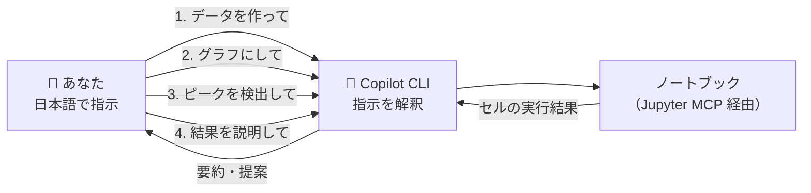

# 第5章 Jupyter MCPで最小の自然言語分析を動かす

> **本章の到達目標**
> - 第4章の環境を使い、**自然言語による指示で** データ分析の一連の流れ（読込→可視化→特徴抽出→考察）を動かし、AIが生成したコードと結果を確認できる
> - AI Agent が Jupyter MCP を通じてノートブックを操作する様子を体感する
> - 「動いた」成功体験を得て、次章以降（安全・Skill化）への足場を作る
>
> **この章で扱うこと／扱わないこと**
> - 扱う: 自然言語による最小の分析セッション、対話的な深掘り、結果の確認
> - 扱わない: Skill化（第7章以降）、安全設計の詳細（第6章）、実データの入手・整形の作法（第8章）、高度な解析手法

> [!NOTE]
> 本章は「**まず動かして成功体験を得る**」ことが目的です。細かい作法や再利用（Skill化）はまだ気にしません。ここで動いたノートブックは、第7章以降で「型（Skill）」に育てていきます。

---

## 5.1 この章のゴール：最短の成功体験

第4章で「動作確認済み環境」を手に入れました。本章ではそれを使い、**日本語の指示で AI が生成したコードを確認しつつ分析を進める** ことを体験します。ゴールは1つ、次の状態です。

> **AI Agent に日本語で指示し、AI が生成したセル・実行結果を目視確認しながら、データの読込・可視化・特徴抽出・考察までを1つのノートブックの上で進められる。**

ここでは、第2章で学んだ**共通5ステップ**（取得→整形→可視化→特徴抽出→解釈）を、コードを自分で書かずに一度通してみます。題材は、どの読者でもすぐ試せるよう**合成したスペクトルデータ**（スペクトル型）を使います。実演習は「取得（生成）＋整形」を Step1 にまとめ、Step2〜4 で可視化・特徴抽出・解釈と進みます。



> [!IMPORTANT]
> 本章では、まだ実験の実データは使いません。実データの入手・単位確認・欠損処理といった「データ契約」は第8章の主題です。ここでは**手順が通ること**を確認するのが目的なので、再現しやすい合成データを使います。

---

## 5.2 準備：環境を立ち上げる

第4章の環境を起動します。すでに起動済みならこの節は読み飛ばして構いません。詳細は第4章4.3〜4.7を参照してください。

- **ターミナル1**：`arim-analysis` ディレクトリで venv を有効化し、第4章4.3で生成した `$JUPYTER_TOKEN` を使って `jupyter lab --port 8888 --IdentityProvider.token "$JUPYTER_TOKEN"` を起動したままにする（PowerShell では `$env:JUPYTER_TOKEN`）。**`MY_TOKEN` はあくまで設定例内のプレースホルダ**であり、実行時は必ず第4章で生成したトークンに置き換えます。
- **ターミナル2**：同じディレクトリで venv を有効化し、`copilot` を起動する。
- **確認**：`copilot mcp list`（または対話中に `/mcp`）で `jupyter` が見えていること。`pandas / numpy / scipy / matplotlib` が入っていること（第4章4.3で導入済み）。

---

## 5.3 ステップ0：分析の「問い」を決める

第2章で強調したとおり、分析は「**何を知りたいか**」から始まります。今回の最小演習では、次を問いとします。

> **問い**：このスペクトルには何本のピークがあり、それぞれどの位置にあるか？

小さな問いですが、これがあることで「成功（＝ピークの位置が求まる）」がはっきりします。では、この問いに向かって自然言語で進めましょう。

---

## 5.4 ステップ1〜4：自然言語で分析を通す

ここからは Copilot CLI のプロンプトに**日本語で指示**していきます。AI Agent は Jupyter MCP を使ってノートブックにセルを作り、実行し、結果を返してくれます。5ステップのうち「取得」と「整形」は Step1 にまとめます。

### ステップ1：ノートブックとサンプルデータを用意する（取得＋整形）

まず、実験に使う合成スペクトルを作ります。実データがなくても試せるよう、AI Agent にデータ自体を作ってもらいます。答え合わせができるよう、**乱数シードを固定**し、**真のピーク設定を保存**させるのがポイントです。

```text
> analysis.ipynb という新しいノートブックを作ってください。
  カーネルは "Python (arim-analysis)" を使ってください。
  以下の合成スペクトルを DataFrame（列名: wavenumber, intensity）として作るセルを追加して実行してください。
    - 波数範囲: 200〜1000 cm^-1（1 cm^-1 刻み）
    - ピーク3本: 中心 350, 620, 880 cm^-1、振幅 1.0, 0.7, 0.5、σ = 10, 15, 12（ガウシアン）
    - ノイズ: 標準偏差 0.03 の正規乱数
    - 乱数シードは 42 で固定
  真のピーク設定（peak_id, center, amplitude, sigma）を true_peaks という DataFrame にして、末尾で display してください。
```

AI Agent は Jupyter MCP のツールを使って、次のように動きます（表示例）。

```text
● use_notebook (MCP: jupyter) · notebook_path: "analysis.ipynb"
● insert_execute_code_cell (MCP: jupyter)
  └ <合成スペクトル + true_peaks が生成される>
```

> [!TIP]
> 生成されたコードは必ず**ノートブックで目視**してください。「どんなデータを、どんな仮定で作ったのか」を把握しておくと、後の考察が正しくなります。ここも Human-in-the-loop です。カーネル表示が `Python (arim-analysis)` でなければ、右上のカーネル名から切り替えてください。

### ステップ2：まず全体を可視化する（可視化・観察）

数値をいきなり解析する前に、**まず眺める**のが第2章の教えでした。

```text
> 作成したスペクトルを折れ線グラフで表示してください。横軸に波数、縦軸に強度をとってください。
```

AI Agent がプロット用セルを追加・実行します。グラフはノートブック上で確認できます（第4章で `ALLOW_IMG_OUTPUT=true` にしたため、環境によっては Copilot CLI 側にも画像または出力要約が返ります）。ピークの当たりが目で確認できるはずです。

### ステップ3：ピークを検出する（特徴抽出）

問いの核心、ピーク検出に進みます。ここでも**検出条件を明示**してブレを抑えます。

```text
> このスペクトルのピークを検出して、それぞれの波数（ピーク位置）と強度を表にしてください。
  scipy.signal.find_peaks を使い、prominence=0.2、distance=50（サンプル）で検出してください。
  検出に使ったパラメータと考え方も1〜2行で説明してください。
```

AI Agent は `scipy.signal.find_peaks` を使うセルを提案・実行し、ピーク位置の一覧表を返します。**「どんな方法・パラメータで検出したか」を必ず添えてもらう**のがポイントです（後で妥当性を検証するため）。

### ステップ4：結果を解釈する（解釈・報告）

最後に、問いに答えます。ステップ1で作った `true_peaks` と突き合わせます。

```text
> 検出結果と、ステップ1で保存した true_peaks を並べた比較表を作ってください。
  検出されたピーク数が3本であり、各ピークの位置が true_peaks の中心から
  ±5 cm^-1 以内であれば「一致」と判定してください。最初の問い
  （何本のピークが、どの位置にあるか）に、この判定を根拠に答えてください。
```

合成データなので**正解（`true_peaks` の値）**が分かっています。上記の許容範囲（±5 cm^-1）内で 3 本のピークが検出されれば、5ステップが正しく通ったことになります。これが本章の**成功条件**です。

> [!IMPORTANT]
> ステップ4の「自分が作った設定と一致するか」の確認は、**AI Agent の出力を鵜呑みにしない**ための最小の検証です。合成データだからこそ答え合わせができます。実データでは正解がないため、物理的妥当性・再現性の検証が必要になります（第12章）。

---

## 5.5 対話的に深掘りする

AI Agent の強みは、結果を見て**そのまま次の指示を出せる**ことです。たとえば次のように続けられます。

```text
> ピークが多すぎる（ノイズを拾っている）ようです。prominence を上げて、本物のピークだけに絞ってください。
```

```text
> 各ピークについて、半値幅（FWHM）も求めて表に追加してください。
```

```text
> このノートブックの分析の流れを、先頭にmarkdownセルで手順として書き出してください。
```

このように、**対話しながら分析を育てられる**のが AI Agent 時代の分析です。第2章の5ステップを、コードではなく会話で往復している点に注目してください。

> [!NOTE]
> 途中で AI Agent がツールの実行許可を求めてきたら、内容を確認してから承認します（第4章の②実行前承認）。「全部許可」に頼りきらない習慣が、後の安全運用（第6章）につながります。

---

## 5.6 なぜ「まだSkillにしない」のか

ここまでで、スペクトルのピーク検出という分析が自然言語で一通り動きました。「これを毎回使い回したい」と思うかもしれません。まさにそれが **Skill化** です。ただし本書では、**あえてまだSkillにしません**。理由は2つあります。

1. **良いSkillには"設計"が要る** —— 入力仕様・出力形式・成功条件・禁止事項・評価基準を決めて初めて、再利用に耐えるSkillになります（第7章）。行き当たりばったりのSkillは、かえって危険です。
2. **データを整える作法が先** —— 実データは単位・欠損・メタデータがバラバラです。Skillの入口となる「データ契約」を先に学ぶ必要があります（第8章）。

> [!TIP]
> 今日動かしたノートブック（`analysis.ipynb`）は捨てないでください。第9章で「最初のSkill」を作るときの**下敷き**になります。「動くもの」があると、Skill化の学習がぐっと具体的になります。

---

## 5.7 うまくいかないときは

| 症状 | よくある原因 | 最初に試すこと |
|---|---|---|
| AI Agent が Jupyter を操作しない | MCP未接続 | `copilot mcp list` で `jupyter` を確認（第4章4.6） |
| グラフ画像が返らない | `ALLOW_IMG_OUTPUT` が false | 設定を `true` にして再接続（第4章） |
| セル実行が返ってこない | カーネル不一致・未起動 | ノートブックのカーネルを `Python (arim-analysis)` に |
| 生成コードでライブラリ不足エラー | 未インストール | 第4章4.3の `pip install` 行が最新か確認（`pandas / numpy / scipy / matplotlib` が含まれるか） |

> [!TIP]
> エラーが出たら、その内容を AI Agent に相談できます。ただし、貼り付ける前に**トークン・APIキー・パス・個人情報・未公開データが含まれていないか**を確認し、必要なら伏せ字にしてから貼り付けてください。提案の妥当性は自分で判断します（詳細な対処は付録C）。

---

## 章末ワーク

1. 5.4のステップ1〜4を実行し、**検出したピーク数・位置**が「自分が作ったデータの設定」と一致するか確認する
2. 5.5の対話例を1つ以上試し、結果がどう変わるか観察する（例: しきい値を上げる）
3. 分析の流れを、ノートブック先頭のmarkdownセルに**手順として日本語で書き出す**（第7章のSkill仕様の素材になる）
4. 第2章で選んだ「私のデータ分類メモ」を見返し、**自分のデータ型なら本章の手順のどこが変わりそうか**を1〜2行でメモする

> [!NOTE]
> ワーク3で書き出した「手順」は、第7章「Skillの設計原則」でそのまま設計の出発点になります。会話で動かした流れを言葉にしておくことが、Skill化の第一歩です。

---

## 本章のまとめ

- 第4章の環境を使い、**自然言語による指示 + AI 生成コードの目視確認** で 取得＋整形→可視化→ピーク検出→考察の4ステップ（第2章の5ステップに対応）を通せた
- AI Agent は Jupyter MCP を介してノートブックを操作し、結果を返す（第3章の全体像が実際に動く）
- 合成データを使うことで**答え合わせ**ができ、成功条件が明確になる
- まだSkill化しないのは、良いSkillには設計（第7章）とデータ契約（第8章）が先に必要だから
- AI Agent の出力は鵜呑みにせず、最小限でも検証する（Human-in-the-loop）

> **次章予告**：第6章では、ここまで「まず動かす」を優先してきた分析を、**安全に運用するためのルール**（ツール権限・実行前承認・禁止操作・データ漏洩の予防）へと引き締めます。便利さと安全はセットです。

---

## 参考資料

- [脚注1] Jupyter MCP Server（Datalayer）ツール一覧: https://jupyter-mcp-server.datalayer.tech/reference/tools/ ／ リポジトリ: https://github.com/datalayer/jupyter-mcp-server
- [脚注2] SciPy 信号処理（ピーク検出 `scipy.signal.find_peaks`）: https://docs.scipy.org/doc/scipy/reference/signal.html
