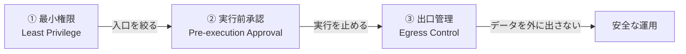

# 第6章 MCPの安全な使い方とHuman-in-the-loop

> **本章の到達目標**
> - AI Agent＋MCPを研究業務で使う際の**予防的な安全ルール**を理解する
> - Copilot CLI のツール権限・実行前承認・パス/URL 制限の仕組みを使い分けられる
> - 研究データの**外部送信リスク**を意識し、扱ってよいデータ／扱ってはいけないデータを線引きできる
> - 章末の**安全運用チェックリスト（初版）**を自分の環境に貼り付けて使える
>
> **この章で扱うこと／扱わないこと**
> - 扱う: 予防的3原則、権限フラグの使い分け、実行前承認の運用、禁止操作、データ漏洩の入口対策、チェックリスト
> - 扱わない: 事故った後の診断・原因分析（第14章）、Skill設計での禁止事項の書き方（第7章）、実行後の検証手法（第12章）、組織的な監査・ログ・責任分担（第15章）

> [!IMPORTANT]
> 本章は「**事故を起こさないための仕組み**」を扱います。「事故ってしまった事例と再発防止」は第14章、「Skillの設計で禁止事項をどう書くか」は第7章です。混同しないよう線を引いておきます。

---

## 6.1 なぜ「動く」だけでは足りないのか

第4章で環境を作り、第5章で自然言語による指示 + AI 生成コードの目視確認で分析を一周させました。ここで一度立ち止まります。本書の合格ラインは「**動く・検証済み・再現できる**」の3拍子ですが、本章ではその前提として「**安全に運用できる**」状態を作ります。動くだけで安全でない分析は、次のような事故と隣り合わせだからです。

- **意図しない外部送信** —— 未公開データや共同研究先のデータを、AI Agent が Web 検索や外部APIに渡してしまう
- **意図しない書き込み・削除** —— 「整理して」の一言で、生データファイルが上書き・移動される
- **暴走する自動実行** —— 便利さのために「全部許可」に頼り、承認をスキップした結果、後戻りできない操作が連鎖する
- **見えないコスト・API消費** —— 大量トークンを消費するツール呼び出しが繰り返される

これらは「AI Agent が悪い」のではなく、**設計されていない状態で使った**結果です。第3章の Human-in-the-loop（①意図設計・②実行前承認・③検証）を、**具体的な設定と手順に落とすのが本章の役目**です。

---

## 6.2 予防的3原則：最小権限・実行前承認・出口管理

本章の骨格として、まず3つの原則を置きます。これらはこの後の節で具体化されます。



| 原則 | 何をするか | Copilot CLI での実装例 |
|---|---|---|
| **① 最小権限** | 必要なツール・パス・URL だけ許可する | `--allow-tool='write'`、`--add-dir <path>`、`copilot mcp add --tools '<name>'` |
| **② 実行前承認** | 破壊的な操作は毎回確認する | 既定の対話モード（`--allow-all-tools` を付けない） |
| **③ 出口管理** | 外に出るデータ・接続先を制限する | `--deny-url`、機密データを扱う会話では Web 検索・外部 API を切る |

> [!NOTE]
> この3原則は「便利さを削る」ためのものではありません。**便利さを、リスクに見合った範囲に収める**ためのものです。何を許すかを自分で決められる状態が、実運用の出発点になります。

---

## 6.3 ツール権限を制御する

Copilot CLI には、**モデルに見せるツール集合**と**承認なしで実行してよいツール**を分けて制御する仕組みがあります。研究業務では、これを積極的に使います。

### 6.3.1 主な権限フラグ

Copilot CLI のツール制御は、大きく次の2レイヤーに分かれます。

- **可視性（モデルにそもそも見せるか）**：`--available-tools` / `--excluded-tools`
- **承認（見えているツールを実行するときに確認するか）**：`--allow-tool` / `--deny-tool`

主なフラグを整理します（実際のフラグ名・挙動は CLI バージョンで揺れることがあるため、必ず `copilot --help` で確認してください）。

| フラグ | 用途 | 例 |
|---|---|---|
| `--allow-tool` | 特定ツール（種類やパターン）を許可 | `--allow-tool='shell(ls)'`、`--allow-tool='write'` |
| `--deny-tool` | 特定ツール（種類やパターン）を禁止 | `--deny-tool='shell(rm:*)'`、`--deny-tool='shell(git push)'` |
| `--add-dir <path>` | ファイルアクセスを許可するディレクトリを追加 | `--add-dir ~/arim-analysis/data` |
| `--allow-url` / `--deny-url` | URL・ドメイン単位で許可／禁止 | `--deny-url=https://example.com` |
| `--allow-all-tools` | すべてのツールを承認なしで実行 | 非対話モードで必要（＝リスク大） |
| `--yolo` / `--allow-all` | すべてのパーミッションを開放 | **原則使わない** |

`--allow-tool` と `--deny-tool` は同時に指定でき、**deny が優先**されます。実務でよくある組み合わせを2つ挙げます。

```bash
# git は許すが、push だけは止める
copilot --allow-tool='shell(git:*)' --deny-tool='shell(git push)'
```

```bash
# 特定のMCPサーバは丸ごと許可、ただし一部のツールだけ禁止
copilot --allow-tool='jupyter' --deny-tool='jupyter(delete_cell)'
```

> [!WARNING]
> `--yolo` / `--allow-all` は「全部通す」フラグで、実行前承認そのものを無効化します。**研究データを扱うセッションでは絶対に使わない**でください。なお、Copilot CLI の**非対話モード（`-p` 付き）は `--allow-all-tools` を必要とする**仕様です。つまり非対話モードは実行前承認を持ちません。機密データを扱うセッションでは**原則として非対話モードを使わない**でください。どうしても使う場合は、`--deny-tool` / `--deny-url` / `--add-dir` で入力・出口を厳しく絞ってから起動します。

### 6.3.2 MCPサーバ単位の絞り込み

第4章では `copilot mcp add` で MCPサーバを登録しました。このとき、`--tools` オプションで**そのMCPサーバのどのツールを使わせるか**を絞れます（省略時は `*`＝全許可）。危険度の高いツール（削除・上書き系）を含むサーバでは、必要な分だけに絞るのが原則です。

### 6.3.3 対話中の権限確認

対話中は `/help` で使える確認系コマンドをまず洗い出してください。多くの環境で `/mcp`（登録済み MCPサーバ一覧）、`/list-dirs`（アクセス許可済みディレクトリ）、`/env`（環境変数）などが利用できます。CLI のバージョンによっては `/permissions` に相当する集約表示コマンドが用意されている場合もあります。**分析セッションを始める前に、これらのコマンドで現在の権限・パス・環境を必ず一度確認する**習慣をつけると、事故が減ります。

---

## 6.4 実行前承認：何を毎回確認するか

Copilot CLI の既定挙動は、**未許可のツールや承認が必要な操作を実行するときに確認プロンプトを出す**というものです（許可済みツールでは確認は出ません）。第3章で述べた **②実行前承認**は、この挙動を活かして実現されます。ただし「**表示されたら反射的にYes**」では意味がありません。承認前に確認すべき3点を決めておきます。

| 確認項目 | 具体的に見る場所 | Yes/No の判断基準 |
|---|---|---|
| **① 何を（What）** | 実行されるコマンド／ツール名／引数 | 想定と一致しているか。想定外のパスや引数がないか |
| **② どこで（Where）** | ファイルパス／URL／MCPサーバ名 | 生データや共有ディレクトリに書き込もうとしていないか |
| **③ 戻せるか（Reversible）** | 操作の性質（削除・上書き・送信は不可逆） | 一度実行したら元に戻せるか。バックアップはあるか |

不可逆な操作（削除・上書き・外部送信）は、**Yes を押す前に必ず一呼吸置く**ことをルール化してください。慣れると数秒で判断できます。

**誰が承認できるか（ロール別の目安）**

セッション内の一次承認は基本的に**利用者（研究者本人）**が行いますが、影響範囲が大きい操作は別のロールに委ねる、あるいは事前に禁止しておくのが安全です（詳細な役割分担は第15章の RACI に接続します）。

| 操作の種類 | 一次承認者 | 備考 |
|---|---|---|
| ノートブック内の読み取り・可視化 | 利用者 | 通常はセッション内で完結 |
| 生データの書き込み・削除 | 原則承認しない | どうしても必要な場合は maintainer と事前合意 |
| 外部送信・Web検索・外部API呼び出し | 利用者 + 必要に応じてレビュアー/PI | confidential データを扱うセッションでは事前禁止 |
| MCPサーバ追加・権限フラグ変更 | Skill maintainer | 研究室共通環境なら PI 承認 |

> [!TIP]
> 「毎回同じ操作で承認が出るのが面倒」と感じたら、それは `--allow-tool` で**その操作だけ**を許可する合図です。ただし対象は**読み取り専用・再実行可能・外部送信しない**操作に限ります（例：ファイル一覧・グラフ描画）。書き込み・削除・外部送信は、便利さと引き換えに事故率が跳ね上がるので、承認プロンプトを維持してください。

---

## 6.5 禁止操作リスト（研究者向け）

本書では、AI Agent のセッションで**許可しない・承認しない操作**を次のように定義します。これは Skill 設計時の禁止事項（第7章）とは別の、**運用側の禁止事項**です。

| カテゴリ | 具体例 | なぜ禁止か |
|---|---|---|
| **生データの書き換え** | 生データファイル（`.raw`, `.tif`, 装置出力 CSV など）を上書き・削除する | 生データは唯一の証拠。加工結果は別ファイルに書き出す |
| **秘匿性の高いデータの外部送信** | 未公開データ・共同研究データ・特許出願前データを Web 検索や外部LLM APIに投入する | 論文著者資格・特許性・NDA違反のリスク |
| **人由来データの取り扱い** | 被験者情報・個人特定情報を含むファイルを AI Agent に読ませる | 倫理審査・個人情報保護法の対象 |
| **本番装置の直接制御** | 実験装置の制御スクリプトや装置PCの設定を AI Agent 経由で変更する | 事故時に責任所在が不明確 |
| **共有ストレージへの無断書き込み** | 研究室共有ドライブ・グループフォルダに勝手にファイルを作成する | 他者の作業を破壊する可能性 |
| **無制限のパッケージインストール** | 環境に対して `pip install` を勝手に実行させる | 再現性・セキュリティ両面のリスク |
| **科学的判断の自動確定** | ピーク帰属・物質同定・相同定・Rietveld による組成/相の自動確定を AI Agent の応答だけで承認する | AI は候補提示まで。最終判断は研究者が標準試料・文献・既存手法で検証する（第14章・第15章の `common_forbidden.yaml` と整合） |

> [!IMPORTANT]
> 「禁止」と決めた操作は、`--deny-tool` や `--deny-url` で**明示的に閉じておく**のがベストです。ただし `--deny-tool` は**ツール／パターン単位の閉鎖**であり、意味レベルの完全禁止ではありません（例：`--deny-tool='shell(rm:*)'` で shell の `rm` を止めても、Python の `os.remove`、Jupyter MCP の削除ツール、`write` 系ツールでの上書きまでは止まりません）。したがって「rm を deny したから生データ削除は防げる」と誤解しないでください。生データ保護は、`--add-dir` で許可ディレクトリを分析用に限定する、生データを読み取り専用で別コピーに退避する、書き込み系ツールを絞る、といった**多層防御**で実現します。「気をつける」だけでは、いずれ疲れた日に事故ります。**設定に落として初めて予防**です。

---

## 6.6 データ漏洩を防ぐ：3つの入口

研究データが意図せず外部に出る経路は、大きく分けて3つあります。それぞれに対策があります。

### 入口1：AI Agent への添付・貼り付け

- **リスク**：機密データ（未公開の結果・特許前情報）をチャットや `--attachment` で直接渡す。あるいは AI Agent が自分で機密ディレクトリを走査してしまう
- **対策**：
  - `--add-dir <分析用ディレクトリ>` で**アクセス可能なパスを明示的に限定**する（`cd` は作業ディレクトリ変更にすぎず、アクセス境界ではありません）
  - `--allow-all-paths` / `--allow-all` は使わない
  - AI Agent に渡すデータは**匿名化・要約・サンプル化**する
  - 機密ラベル（`confidential/` プレフィックスなど）のディレクトリは絶対に `--add-dir` で許可しない

### 入口2：Web検索・外部URL経由

- **リスク**：AI Agent が「調べます」と言って、機密文字列を含むクエリを Web に投げる
- **対策**：
  - 対話中に `/permissions` と `/mcp` で有効なツール名・サーバ名を確認し、Web 検索に相当するツール（例：外部 fetch 系、外部 API 系）を `--deny-tool='<tool-or-server-pattern>'` で閉じる
  - 外部エンドポイント（実験装置ベンダーの解析API等）を使う場合、送信前に**送信内容を目視**する（実行前承認）
  - 会社・組織のプロキシで、想定外のドメインへの通信を止める

> [!IMPORTANT]
> 漏洩対象は「生データ本体」だけではありません。**試料ID・組成・プロセス条件（成膜・熱処理条件など）・装置メタデータ・測定日時・共同研究先名・課題番号・装置PCアカウント・APIトークン**は、単体でも競争優位や特許性に直結します。顕微鏡画像やスペクトル画像に埋め込まれたスケール・ラベル・EXIFメタデータも同様です。これらもクエリ・添付・出力から漏れないよう扱ってください。

### 入口3：MCPサーバ経由

- **リスク**：外部の MCPサーバ（クラウド上の解析ツールなど）にデータを転送する
- **対策**：
  - **ローカルで動く MCP** を優先（第4章の Jupyter MCP のように `uvx` でローカル起動する形）
  - 環境変数のトークンは `copilot mcp add --env` で入れ、ログや共有ファイルに書かない（`copilot mcp list` では `***` 表示になる）
  - 使わなくなった MCPサーバは `copilot mcp remove` で消す（不要な入口を残さない）

> [!TIP]
> **「このデータを AI に渡してよいか？」**を毎回考えるのは疲れます。ラベル運用（`public/` / `internal/` / `confidential/` などのディレクトリ分け）を先に決めてしまうと、**一次判定をルール化**できます。ただし、そのデータが本当に confidential なのか、外部送信してよいのかの**最終判断は人間**が行います（第3章の「実行上のハブ=Agent、意思決定=人間」）。

---

## 6.7 安全運用チェックリスト（初版）

本章の目的は、次のチェックリストを持ち帰ってもらうことです。**分析セッションを始める前**に確認してください（読者ごとに項目を足し引きして自分用にカスタマイズする前提です）。

**A. セッション開始前**

- [ ] `--add-dir` で**アクセス可能なパスを分析用ディレクトリに限定**した（`cd` は境界ではないと理解した）
- [ ] 起動フラグに `--yolo` / `--allow-all` / `--allow-all-paths` / `--allow-all-urls` が含まれていない
- [ ] 今回扱うデータの機密度を確認した（public / internal / confidential）
- [ ] confidential データを扱う場合、Web 検索・外部 MCP に相当するツールを `--deny-tool` / `--deny-url` で閉じた
- [ ] `copilot mcp list` で、不要な MCP が有効になっていないか確認した
- [ ] 非対話モード（`-p` + `--allow-all-tools`）を confidential データに対して使っていない

**B. セッション中**

- [ ] 実行前承認プロンプトで「何を／どこで／戻せるか」を確認してから Yes
- [ ] 生データファイルへの書き込みを AI Agent に許可していない
- [ ] `pip install` などの環境変更は自分で実行するか、内容を確認してから承認する
- [ ] AI Agent が Web 検索を提案したら、送信されるクエリ内容を確認する
- [ ] エラー文・ログ・スタックトレースを AI Agent に貼る前に、`JUPYTER_TOKEN` / APIキー / ローカルパス / 試料ID / 未公開データが含まれていないか確認し、必要なら伏せ字にする（第5章 §5.7 と同じ運用）

**C. セッション後（入口を閉じる）**

- [ ] セッション用に一時追加した `--add-dir` / `--allow-tool` / `--allow-url` を次回に残していない
- [ ] 一時的に追加した MCPサーバを `copilot mcp remove` で削除した
- [ ] 次のセッションのために、機密ラベル別の起動レシピを見直した

> [!NOTE]
> セッション後の**出力ノートブックに機密情報が残っていないかの確認**や、**会話ログ共有時のマスク処理**は、実行後検証（第12章）と運用ログ管理（第15章）の領域です。本章の C は「次回に危険な入口を残さない」ことに絞っています。

> [!NOTE]
> このチェックリストは「初版」です。第14章で失敗事例を学んだあと、あなた自身の環境と装置カテゴリに合わせて**育てて**いってください。第7章のSkill仕様書（禁止事項欄）にも、ここでの学びが直接反映できます。

---

## 章末ワーク

1. 現在の `copilot mcp list` を見て、**いま自分に必要な MCP だけ**が残っているか確認する。不要なものは `copilot mcp remove` で削除
2. 自分の研究データを **public / internal / confidential** の3ラベルで分類し、ディレクトリ名の付け方を決めてメモに書き出す
3. 6.5「禁止操作リスト」から、**自分の環境で `--deny-tool` / `--deny-url` を1つ以上設定**してみる（例：`--deny-tool='shell(rm:*)'`）
4. 6.7のチェックリストを自分の作業ディレクトリに `SAFETY.md` として保存し、セッション前に開く運用を試す
5. 「もし今日、confidential データを扱うなら、6.7のAで何を変えるか」を1〜2行でメモする（第14章で答え合わせします）

---

## 本章のまとめ

- **動く≠安全**。本書の合格ラインは「**動く・検証済み・再現できる**」。その前提として、動かす前に最小権限・実行前承認・出口管理の3原則で運用を引き締める
- Copilot CLI の `--allow-tool` / `--deny-tool` / `--add-dir` / `--deny-url` を使い、**必要なだけ開く**運用を基本にする
- 実行前承認では「**何を／どこで／戻せるか**」の3点を確認する。反射的なYesは事故のもと
- データ漏洩の入口は「添付・Web検索・MCPサーバ」の3つ。ラベル運用でルーチン化する
- 章末チェックリストは初版。第14章の失敗事例で育て、第7章のSkill仕様書に反映する

> **次章予告**：第7章では「動く分析」を**再利用に耐える Skill** に育てるための設計原則を扱います。入力仕様・出力形式・成功条件・**禁止事項**（本章の運用側の禁止と対になる、Skill側の禁止）・再現性条件を、テンプレートで書けるようになります。

---

## 参考資料

- [脚注1] GitHub Copilot CLI ドキュメント（権限・非対話モード・MCP管理）: https://docs.github.com/en/copilot/how-tos/set-up/install-copilot-cli
- [脚注2] Model Context Protocol 仕様（サーバ・ツールの境界）: https://modelcontextprotocol.io/
