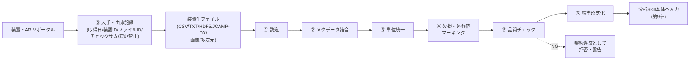

# 第8章　実験データを分析可能な形に整える

> **本章の到達目標**
> - 分析Skillに渡す前に整えておくべき「**データ契約**（data contract）」の7要素——入手・読込・メタデータ・単位・欠損・品質チェック・標準形式——を説明できる
> - 6データ型（スペクトル型／クロマトグラム・時系列型／画像・顕微鏡型／回折・散乱パターン型／表形式・プロセス条件型／マルチモーダル統合型）ごとの内部表現と保存形式の候補を挙げられる
> - 第7章 ②入力条件・③出力形式を、実装可能な**入出力スキーマ**（構造＋意味の2層）として書き下せる
> - 「**データ辞書**（data dictionary）」と「**データ読み込みSkill**」の役割を分離し、両者を設計できる

**扱うこと**：分析Skillの**入り口**（入力データを整える工程）に集中する。入手・読込・メタデータ結合・単位統一・欠損マーキング・品質チェック・標準形式化・入出力スキーマ・データ辞書。
**扱わないこと**：整えた後の分析処理（前処理→可視化→特徴抽出→考察）は第9章。物理的妥当性の実行後検証は第12章。装置カテゴリ別テンプレートは第13章。失敗事例の診断は第14章。

> [!IMPORTANT]
> 本書の合格ラインは「**動く・検証済み・再現できる**」の3拍子であり、「失敗しない」ことではない。本章では、その前提として **契約違反を明示的に拒否し、原因を追える形で由来を残す** ことをデータ準備側の役割として担保する。

---

## 8.1　なぜSkillの前に「データ契約」が必要か

第7章で、Skillは6要素（目的／入力条件／出力形式／成功条件／禁止事項／再現性条件）で設計する、と説明しました。このうち **②入力条件** が緩いと、Skillはどんなに丁寧に作っても**入り口で壊れます**。

- 波数と波長が混ざったスペクトルを渡す → ピーク位置が意味不明になる
- 欠損セルを 0 で埋めた表を渡す → 平均値・分散が実測とずれる
- 校正前の生データと校正済みデータを混在させる → 装置間比較で結論が反転する
- メタデータ（測定条件・試料ID）が本文と分離している → 再現できない

これらは「**Skillのバグ**」ではなく「**入力データの契約違反**」です。第7章 ⑦の循環設計と並ぶ、**Skill運用における2大リスク**と考えてください。

> [!IMPORTANT]
> データ契約は **分析Skill本体の外側**（データ読み込みSkill・前処理スクリプト・データ辞書）で守るべき責務です。**分析Skill本体**（第9章で作る単一データ解析Skill）は、契約に適合したデータのみを受け取り、契約違反時は**明示的に拒否**する設計にします（第7章 ⑤禁止事項・受け付けない入力）。本章で作る**データ読み込みSkill**は、①〜⑥を担当する専用のSkillです。以降、本書で「Skill」と単独で書いた場合は**分析Skill本体**を指し、「データ読み込みSkill」は明示的に呼び分けます。

---

## 8.2　データ契約の7要素

本書ではSkill入力の契約を次の7要素で表します。**分析Skillごとに1枚のデータ辞書を書き、必ずレビューする**運用にしてください。

| # | 要素 | 何を決めるか | Skill仕様書（第7章）との対応 |
|---|---|---|---|
| ⓪ | 入手・由来記録 | 元データの所在・取得日・不変性・チェックサム | ⑥再現性条件 |
| ① | 読込 | 対応するファイル形式・拡張子・エンコーディング | ②入力条件 |
| ② | メタデータ結合 | 装置・測定条件・試料IDをどこから引くか | ②入力条件・⑥再現性条件 |
| ③ | 単位統一 | 波数/波長、eV/nm、°/rad、℃/K の内部表現 | ②入力条件・③出力形式 |
| ④ | 欠損・外れ値マーキング | 「除去する」ではなく「印を残す」 | ②入力条件・⑤禁止事項 |
| ⑤ | 品質チェック | 分析Skill実行前に前提条件を満たすかを検証 | ②入力条件・⑤禁止事項 |
| ⑥ | 標準形式化 | 分析Skillが受け取る共通データ構造 | ②入力条件・③出力形式 |

> [!TIP]
> ①〜⑥は **分析Skill本体の中に実装するのではなく、その手前で実行する** のが原則です。理由は3つ——(a) 分析Skillを分析処理に集中させて再利用性を高める、(b) 契約違反を早期に検出できる、(c) 同じ整形処理を複数の分析Skillで共有できる。**①〜⑥の実装場所は、データ読み込みSkillか前処理スクリプトのいずれか**です（詳細は §8.10）。

---

## 8.3　⓪ 入手・由来記録：再現性の起点

読込に入る前に、**元データの由来（provenance）を機械可読で残す**ことが再現性の起点です。第7章 ⑥再現性条件を実データで実装する工程です。

最低限、次を記録します（`.meta.yaml` などのサイドカーファイルにまとめる運用を推奨）。

- **元ファイルのパス／ファイル名**（生ファイルは**上書き禁止**）
- **取得日時**（装置のRTCが狂っている場合は装置時刻と実時刻の両方）
- **装置ID**（第2章のARIMメタデータ運用に沿う）
- **ARIMデータポータルから取得した場合**：データID・DOI・申請番号・取得URL
- **チェックサム**（SHA-256 等）——後日のファイル改変検出用
- **取得者**（第6章のデータ機密度ラベルに応じて匿名化）

> [!IMPORTANT]
> **生ファイルは絶対に上書きしないでください。** 単位変換・欠損マーキング等はすべて派生ファイル（または標準形式）として別ディレクトリに保存し、生ファイルは読み取り専用で保管します。誤って上書きすると再現性が失われ、監査（第15章）でも追跡できなくなります。

**生データ保護の運用チェック（第6章 §6.5 の多層防御に対応）**

- raw は `raw/` に保存し、派生物は `derived/` / `standardized/` に分離
- `raw/` は OS 権限で read-only（`chmod -w`／Windows なら「読み取り専用」属性）
- Copilot CLI / Jupyter MCP には `raw/` への書き込み・削除を許可しない（`--add-dir` は分析用ディレクトリのみ、書き込み系ツールは `--deny-tool` で閉じる）
- SHA-256 は変換前後で検証し、`.meta.yaml` サイドカーに記録
- 生ファイルを編集・上書きする処理は **fatal** として扱い、Skill 側でも拒否

---

## 8.4　① 読込：装置ファイルの多様性を吸収する

ARIMで扱う装置ファイルは、**同じデータ型でも装置ごとに形式がバラバラ**です。読み込み層は「装置ごとの差分を吸収して、後段（②以降）に統一構造を渡す」ことに責任を持ちます。

| データ型 | よくあるファイル形式 | 読込時の主な落とし穴 |
|---|---|---|
| スペクトル型 | CSV、TXT、SPC、JCAMP-DX | ヘッダー行数が装置により異なる／小数点がコンマ／文字コードが CP932 |
| クロマトグラム・時系列型 | CSV、TXT、装置独自バイナリ | サンプリング周期がヘッダーだけで本文に時刻列がない |
| 画像・顕微鏡型 | TIFF、DM3/DM4、EMD、PNG | ピクセルサイズがEXIFやサイドカーに分離 |
| 回折・散乱パターン型 | XRDML、UXD、RAS、CIF | 2θとd値の混在、装置補正が済んでいるか不明 |
| 表形式・プロセス条件型 | CSV、XLSX、SQLite | 欠損セルの表現（空文字／`N/A`／`-`）が装置により異なる |
| マルチモーダル統合型 | 上記の組合せ＋HDF5/NetCDF | 参照関係がフォルダ構造にだけ表れ、機械的に追えない |

> [!NOTE]
> **保存・受け渡し形式**として **HDF5 / NetCDF / Zarr** は、メタデータ・座標・値を1ファイルにまとめられるため、標準形式化（⑥）後の永続化先として推奨します[脚注1][脚注2]。装置生ファイルを直接HDF5に変換するのではなく、①〜⑤を通した後で標準形式として保存する運用が現実的です。なお **xarray はファイル形式ではなく**、多次元ラベル付き配列を扱う Python ライブラリで、NetCDF / Zarr 等に保存できます（§8.9 で「Python内部表現」と「保存形式」を分けて整理します）。

---

## 8.5　② メタデータ結合：本文とメタを一体で扱う

> [!WARNING]
> **本文の数値だけを分析Skillに渡してはいけません。** メタデータ（装置名・測定条件・試料ID・校正情報）が欠けていると、後日「これは何のデータか」を判定できなくなり、再現性が崩壊します。

最低限、次のメタデータを **標準形式に埋め込んで** 分析Skillに渡します（第2章のARIMメタデータ運用と整合させてください）。

- 装置カテゴリ・装置ID・装置固有パラメータ（レーザー波長、加速電圧、検出器種別等）
- 測定条件（積算時間、ステップ幅、雰囲気、温度、圧力）
- 試料ID・試料前処理・保管条件（未公開の場合は匿名化キーのみ）
- 校正情報（波数校正・強度校正の有無と日付）
- 取得日時・取得者（第6章のデータ機密度ラベルに応じて匿名化）

---

## 8.6　③ 単位統一：内部表現を1つに決める

同じ物理量が複数の表現を持つ場合、**分析Skillの内部で使う単位を1つに固定**し、入力時に変換します。第7章 ②入力条件に「単位」を明示する、と書いた根拠がこれです。

| 物理量 | 主な表現 | 内部表現の例（本書の推奨） |
|---|---|---|
| スペクトル横軸 | 波数 cm⁻¹ ／ 波長 nm ／ eV | ラマン=cm⁻¹、UV-Vis=nm、XPS=eV |
| 回折角 | 2θ [°] ／ d値 [Å] ／ q [Å⁻¹] | 2θ [°] を主、d値・qは派生 |
| 温度 | ℃ ／ K | K（0点を装置校正に依存しない） |
| 時間 | 秒／分／時 | 秒 |
| 濃度 | wt% ／ mol% ／ ppm | 併記（変換不能な場合あり） |

> [!TIP]
> **単位変換は「データ読み込みSkill／前処理スクリプト」の責務**にし、分析Skill本体は「内部表現の単位」だけを扱う設計にすると、装置横断の再利用性が上がります。データ辞書には「入力可能な単位」と「内部表現の単位」を両方列挙してください。

> [!WARNING]
> **暗黙の単位変換は禁止**（第7章 §7.4 ⑤・§7.5 ⑤禁止事項と対応）。データ辞書に未登録の単位変換、変換式を記録しない変換、装置依存補正を伴う変換は **fatal** として扱い、Skill 側でも拒否します。変換を実施する場合は、以下を provenance に必ず残してください。
> - `source_unit` / `target_unit`
> - `conversion_formula`（例：`E_eV = 1239.84 / lambda_nm`）
> - `converted_by`（Skill 名・バージョン）
> - `converted_at`（ISO 8601 タイムスタンプ）

---

## 8.7　④ 欠損・外れ値・飽和：除去ではなく「マーキング」

初学者がやりがちな失敗は、欠損セルを 0 や平均値で埋めてしまうことです。これは**分析結果を静かに歪めます**。

原則は次の2点。

1. **欠損・外れ値・飽和は「フラグ列」で印を残す**（元の値は変更しない）
2. **除去・補間するかどうかは分析Skill内部の分析処理（第9章）で判断する**

| 種別 | 判定例 | フラグ列の例 |
|---|---|---|
| 欠損（missing） | セルが空、`NaN`、`N/A` | `is_missing = True` |
| 外れ値（outlier） | 前後値との差が閾値超、装置レンジ外 | `is_outlier = True` |
| 飽和（saturated） | 検出器上限に張り付き | `is_saturated = True` |
| 校正外（out-of-calibration） | 校正範囲外の波長・角度 | `is_out_of_calibration = True` |

データ読み込みSkillは**この判定までを行い**、分析Skill本体（第9章）が「どのフラグをどう扱うか」を決めます。

---

## 8.8　⑤ 品質チェック：分析Skill実行前の前提条件検証

分析Skillを呼ぶ前に、**入力データが分析Skillの「②入力条件」を満たすか**を機械的に検証します。第7章 ⑤禁止事項・受け付けない入力を、コードとして具体化する工程です。

品質チェックは **severity（重大度）** に応じて動作を分けます。

| Severity | 動作 | 例 |
|---|---|---|
| **fatal** | 分析Skillに渡さず**拒否**（エラー返却） | 欠損率30%超、単位不明、必須メタデータ欠落、校正日不明で「校正済み必須」ポリシー時 |
| **warning** | 警告ログを出したうえで渡す | 校正日が古い、点数が推奨範囲外だが動作範囲内 |
| **flag** | フラグ列を付けて渡す（分析Skillが判断） | 少数の飽和点、局所的な外れ値 |

品質チェックの例（スペクトル型 分析Skill の場合）：

- [ ] ファイル形式が想定通りか（拡張子・ヘッダー）─ **fatal**
- [ ] 横軸が単調増加／単調減少で並んでいるか ─ **fatal**
- [ ] 横軸の単位が内部表現と一致する（または変換可能）か ─ **fatal**
- [ ] データ点数が分析Skillの想定範囲（例: 256〜16384点）内か ─ **warning**（範囲外は動作するが結果劣化の可能性）
- [ ] メタデータの必須項目（装置ID・励起波長・積算時間）が揃っているか ─ **fatal**
- [ ] 欠損率が閾値（例: 5%）以下か ─ **flag**（少数）／ **fatal**（30%超）
- [ ] 校正済みフラグが立っているか ─ ポリシーにより **fatal** または **warning**

> [!IMPORTANT]
> **fatal** で落ちた入力は、分析Skillに渡さず**明示的にエラーを返す**設計にしてください。「なんとなく通してしまう」と、後段で発生する異常の原因追跡が困難になります。Skill仕様書の⑤禁止事項に、拒否理由（fatal 条件）の一覧を必ず書きます（第7章）。

---

## 8.9　⑥ 標準形式化：Python内部表現と保存形式

①〜⑤を通ったデータは、**Skillごとに定めた標準形式**に変換して渡します。ここで **Python内部表現**（分析Skillに直接渡すオブジェクト）と **保存・受け渡し形式**（ディスクに書き出す／プロジェクト間で共有するファイル形式）を混同しないでください。

**Python内部表現（分析Skillに渡すオブジェクト）**：

| データ型 | 推奨内部表現 | 主要フィールド |
|---|---|---|
| スペクトル型 | `pandas.DataFrame` または `xarray.DataArray` | `x`（内部単位）／`intensity`／`is_missing` 等フラグ／メタデータ属性 |
| クロマトグラム・時系列型 | `pandas.DataFrame` | `time_s`（秒）／各チャネル列／メタデータ属性 |
| 画像・顕微鏡型 | `numpy.ndarray` + 属性 | 画素配列／ピクセルサイズ／校正情報 |
| 回折・散乱パターン型 | `pandas.DataFrame` | `two_theta_deg`／`intensity`／派生列（d, q）／メタデータ |
| 表形式・プロセス条件型 | `pandas.DataFrame` | 列名は snake_case 統一・単位を列名に含めない（属性で保持） |
| マルチモーダル統合型 | `xarray.Dataset` または dict | 各モダリティを名前付きで格納・共通の試料IDで結合 |

**保存・受け渡し形式（ディスクへの永続化）**：

| 保存形式 | 用途 | メタデータ保持 |
|---|---|---|
| CSV | 単純な表形式・可搬性重視 | ヘッダーコメントに限定的 |
| Parquet | 大規模表形式・型情報保持 | スキーマメタデータ |
| **NetCDF / HDF5** | 多次元＋メタデータ一体（推奨）[脚注1][脚注2] | 属性として自由に付与可能 |
| Zarr | 分散・クラウド向け多次元 | 属性保持 |
| JSON + バイナリ | メタデータJSON + 数値バイナリ分離 | JSON側で保持 |

> [!TIP]
> **標準形式の設計方針**：
> - 座標軸（横軸）は明示的な列／次元にする（インデックスに埋め込まない）
> - 単位・装置情報は属性（`.attrs` / `metadata`）で保持し、列名には**入れない**
> - フラグ列は元の値と**別列**として残す
> - **Python内部表現と保存形式は別々に決める**。同じ `xarray.Dataset` を NetCDF でも Zarr でも保存できる。

---

## 8.10　入出力スキーマ：構造の契約と意味の契約

第7章 ②入力条件と ③出力形式を、機械的に検証できる**スキーマ**として書き下します。スキーマは**2層に分けて**設計します。

- **構造スキーマ**（JSON Schema[脚注4]）：必須フィールド／型／値の範囲／配列長の上下限など、**単一フィールド内で完結する制約**を表現する
- **意味検証ルール**（Python 検証コード：pandera・pydantic・独自関数）：**複数フィールド間の関係や動的な性質**（配列の単調増加、`x` と `intensity` の同一長、単位変換の可否、欠損率、時系列の連続性など）を検証する

**例：ラマンピーク検出Skillの入力スキーマ（表形式ドラフト）**

| フィールド | 型 | 必須 | 単位（内部） | 制約 | 検証層 |
|---|---|---|---|---|---|
| `x` | float 配列 | ✅ | cm⁻¹ | 各値 100〜4000、点数 512〜16384 | 構造 |
| `x` | ─ | ─ | ─ | 単調増加であること | 意味 |
| `intensity` | float 配列 | ✅ | 任意（相対強度） | 負値は許容 | 構造 |
| `intensity` | ─ | ─ | ─ | `x` と同じ長さであること | 意味 |
| `is_missing` | bool 配列 | ⬜ | - | `x` と同じ長さ／省略時は全 False | 意味 |
| `laser_wavelength_nm` | float | ✅ | nm | 400 〜 1064 | 構造 |
| `integration_time_s` | float | ✅ | 秒 | > 0 | 構造 |
| `sample_id` | string | ✅ | - | 匿名化済みID（正規表現） | 構造 |
| `calibrated` | bool | ✅ | - | False の場合は品質チェックで **fatal** 拒否 | 意味 |
| `provenance.input_sha256` | string | ✅ | - | 入力ファイルの SHA-256 | 構造 |
| `provenance.raw_file_path` | string | ✅ | - | 匿名化またはローカル相対パス | 構造 |
| `provenance.acquired_at` | string (ISO 8601) | ✅ | - | 装置時刻・実時刻の対応が取れていること | 意味 |
| `provenance.device_id` | string | ✅ | - | ARIM メタデータの装置ID | 構造 |
| `provenance.loader_version` | string | ✅ | - | データ読み込みSkillの版 | 構造 |
| `provenance.created_at` | string (ISO 8601) | ✅ | - | 標準形式ファイル作成時刻 | 構造 |

出力側も同様のスキーマを作ります（例：ピーク位置の配列、単位、信頼度、Skillのバージョン等）。**出力側にも `provenance.input_sha256` を必須で残す**ことで、第7章 ⑥再現性条件の「入力ハッシュを結果に記録」と接続します。

> [!NOTE]
> **標準形式のフィールド命名（第13章デバイステンプレートとの対応）**：
> 第13章のデバイステンプレートでは、汎用的に `x` / `y` という説明用プレースホルダーで座標軸を書くことがあります。実装では、データ辞書に定義された **canonical field name** に必ず展開してください。
> - スペクトル型：`x`（内部単位、例：`cm-1` / `nm` / `eV`）、`intensity`、`x_unit` を属性で保持
> - 回折・散乱型：`two_theta_deg` を主とし、`d_angstrom` / `q_inv_nm` は派生列として明示
> - 表形式・プロセス条件型：列名は snake_case、単位は列名に埋め込まず属性側へ

> [!NOTE]
> スキーマは **Skill仕様書（第7章のテンプレート）と一緒に管理**します。第9章のハンズオンでは、この表を JSON Schema（構造）＋ Python 検証関数（意味）に変換し、`references/input-schema.json` と `scripts/validate_input.py` として Skill ディレクトリに置く運用を紹介します（`references/` は静的資料、`scripts/` は実行可能な検証コード）。progressive disclosure：第7章 §7.5参照。

---

## 8.11　データ辞書とデータ読み込みSkillの役割分担

本章の成果物は2つあります。両者を混同しないでください。

| 成果物 | 何か | 誰のためか |
|---|---|---|
| **データ辞書**（data dictionary） | 標準形式のフィールド定義・単位・制約を人間が読む形でまとめた文書 | 人間（レビュー・引き継ぎ・監査） |
| **データ読み込みSkill** | 装置生ファイル → 標準形式への変換を自然言語で指示できるSkill | AI Agent（実データ処理） |

- **データ辞書**は Markdown で書き、GitHub 上でレビュー可能にする
- **データ読み込みSkill**は、機密度に応じて配置場所を選ぶ（第6章・第7章 §7.5と整合）
  - **共有可能な汎用loader**（一般公開データ・公開試薬など）：`.github/skills/<name>-loader/` に配置し、リポジトリ経由でチームと共有
  - **未公開データ・共同研究データ・機密情報を扱う loader**：`~/.copilot/skills/<name>-loader/` に配置し、リポジトリには入れない
- Skill本文やデータ辞書には、**実試料ID・組成・共同研究先名・内部パスを直接書かない**。プレースホルダーや匿名化キーで表現する
- `description` には「いつ使うか」（例：「〇〇装置のラマンスペクトルCSVを標準形式に変換する」）を必ず明記する（Copilot による自動発見の要）

> [!WARNING]
> **provenance の可視性を明示的に分離してください**（第6章 §6.6 の漏洩対象と対応）。次の2種類を混同すると、AI Agent のチャット応答・ログ・共有ファイル経由で機密情報が漏れます。
>
> | 種別 | 例 | 扱い |
> |---|---|---|
> | `agent_visible_metadata` | 匿名化 `sample_id`、装置カテゴリ、非機密の測定条件 | Agent に渡してよい／出力・ログに残してよい |
> | `private_provenance` | raw 絶対パス、申請番号、取得URL、取得者、共同研究先名、装置PCアカウント | ローカル・機密領域のみ／Agent 応答・ログ・出力ファイルに出さない |
>
> データ読み込みSkillは、標準形式ファイルに書き出す際に `private_provenance` を別ファイル（例：`.private.meta.yaml`）に分離し、リポジトリには含めない運用にします。

**両者が揃って初めて、第9章の分析Skill本体が安全に動きます**。

---

## 章末ワーク

1. **自装置のデータ辞書を書く**：あなたが日常扱う実験データを1つ選び、§8.9の推奨内部表現に沿って**データ辞書のドラフト**を Markdown で1枚書きなさい（フィールド名・型・単位・制約・欠損表現を必ず含めること）。
2. **品質チェック項目を列挙する**：そのデータに対して、§8.8のチェックリストを参考に **7〜10項目**の品質チェック項目を書き下し、それぞれに **fatal / warning / flag** を付けなさい。うち **fatal** は最低3項目とし、これを第7章 ⑤禁止事項に転記できる形にしなさい。
3. **入出力スキーマを書く**：§8.10の表形式スキーマに従って、そのデータを入力とするSkillの**入力スキーマ**を1つ書きなさい（フィールド10個以内、必須／任意・**構造／意味** の検証層を明示）。**第9章のハンズオンで、このスキーマをそのまま使います。**
4. **データ読み込みSkillの仕様を書く**：第7章の6要素テンプレートを使い、`<装置名>-loader` Skillのドラフトを1枚書きなさい。少なくとも **①目的**（"what + when to use" を含む `description` 文）、**②入力条件**（対応ファイル形式・エンコーディング）、**③出力形式**（§8.9で決めた内部表現）、**⑤禁止事項**（ワーク2の fatal 条件）、**⑥再現性条件**、**共有スコープ**（`.github/skills/` か `~/.copilot/skills/` か）を含めること。

---

## 本章のまとめ

- Skill運用の2大リスクは **循環設計問題**（第7章）と **データ契約違反**（本章）
- データ契約は「⓪入手」を含めて7要素：**入手／読込／メタデータ結合／単位統一／欠損マーキング／品質チェック／標準形式化**
- 生ファイルは**上書き禁止**。派生ファイル・標準形式は別ディレクトリに保存する
- 欠損・外れ値は**除去せずフラグ列で印を残す**。除去判断は分析Skill本体（第9章）に委ねる
- 単位変換は**データ読み込みSkillの責務**。分析Skill本体は内部表現の単位だけを扱う
- 品質チェックは **fatal / warning / flag** の3段階。fatal は**明示的に拒否**
- 標準形式は **Python内部表現（pandas/xarray/numpy）** と **保存形式（NetCDF/HDF5/Parquet 等）** を分けて設計する
- 入出力スキーマは **構造（JSON Schema）** と **意味（Python検証コード）** の2層で設計する
- 成果物は2つ：**データ辞書**（人間用）と **データ読み込みSkill**（Agent用）——機密度に応じて共有スコープを選ぶ

> **次章予告**
> 第9章では、本章で整えた標準形式のデータを受け取り、**単一データ解析Skill**（前処理→可視化→特徴抽出→考察）を実際にハンズオンで作ります。第8章で作った入出力スキーマとデータ辞書がそのまま Skill 仕様書に組み込まれ、動く形になります。

---

## 参考資料

- [脚注1] xarray Documentation（多次元ラベル付き配列、`.attrs` によるメタデータ保持）: https://docs.xarray.dev/
- [脚注2] HDF5（The HDF Group）: https://www.hdfgroup.org/solutions/hdf5/ ／ NetCDF（Unidata）: https://www.unidata.ucar.edu/software/netcdf/
- [脚注3] FAIR data principles（Findable / Accessible / Interoperable / Reusable）: https://www.go-fair.org/fair-principles/
- [脚注4] JSON Schema（入出力スキーマの機械的検証）: https://json-schema.org/
