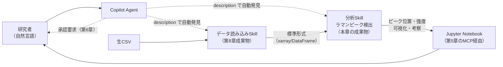

# 第9章　ハンズオン1：単一データ解析Skillを作る

> **本章の到達目標**
> - 第7章のSkill仕様書テンプレートと第8章のデータ契約を統合し、**動く SKILL.md** を1本書ける
> - Skill ディレクトリを **progressive disclosure**（SKILL.md 本体 / `references/` / `scripts/` / `assets/`）で設計できる
> - 分析処理の4ステップ（**前処理 → 可視化 → 特徴抽出 → 考察**）を Skill 本文に組み込める
> - 6つの評価基準（正確性・再現性・解釈可能性・データ漏洩リスク・レビュー容易性・転用可能性）でセルフレビューできる
> - 実行例・失敗例・改善版を追体験し、自装置のデータ型への転用手順を示せる

**扱うこと**：分析Skill本体（**Skill内部の分析処理**）の作り方。SKILL.md ／ `references/` の中身、Skillの実行、自然言語での指示、失敗例→改善サイクル。
**扱わないこと**：入力データの整形（第8章／データ読み込みSkill）、実行後の物理的妥当性検証（第12章）、装置カテゴリ別テンプレの全網羅（第13章）、失敗パターンの体系的分析（第14章）、arXiv連携（第10章）、複数モダリティ統合（第11章）。

---

## 9.1　この章で作るSkillの概要

> [!IMPORTANT]
> 本書の合格ラインは「**動く・検証済み・再現できる**」の3拍子であり、「**失敗しない**」ことではありません。本章では初めての実装Skillを作りますが、目指すのは「動く」だけの Skill ではなく、成功条件を数値で検証でき、同じ入力から同じ結果を再現できる Skill です。

本章では、第5章で自然言語プロンプトから実行した「**ラマンスペクトルのピーク検出**」を、**再利用可能な分析Skill**に格上げします。Skill化する意味は次の3点です。

- **再現性**：同じ手順が名前つきの契約として保存される（第7章 ⑥再現性条件）
- **自動発見**：Copilot が `description` を読み、必要な場面で自動的に呼び出す（第7章 §7.5 [脚注1]）
- **役割分離**：入力の整形（第8章：データ読み込みSkill）と分析処理（本章：分析Skill）が分かれる

### 完成イメージ



**成果物**：`.github/skills/raman-peak-detection/` 以下に SKILL.md ／ `references/` ／ `scripts/` の一式（後述）。

### 入力仕様 / 出力仕様 / 制約条件

第8章 §8.10 のスキーマをそのまま流用します。

- **入力**：標準形式化済みのラマンスペクトル（横軸 cm⁻¹、内部単位・メタデータ属性つき）
- **出力**：ピーク位置（cm⁻¹）／相対強度／ピーク幅／信頼度／可視化用データ／短い考察
- **制約**：波数校正済みであること／点数 512〜16384／欠損率が **5% 超で warning**・**30% 超で fatal**（詳細な fatal 条件は §9.4 ⑤ で列挙）

---

## 9.2　前提となる第7・8章の成果物

本章に入る前に、次が揃っている必要があります。揃っていない場合は該当章に戻ってください。

- ✅ **Skill仕様書ドラフト**（第7章 章末ワーク）：6要素＋`name`＋`description`
- ✅ **データ辞書**（第8章 章末ワーク1）：フィールド名／型／単位／制約
- ✅ **品質チェック項目**（第8章 章末ワーク2）：fatal/warning/flag つき
- ✅ **入力スキーマ**（第8章 章末ワーク3）：構造層＋意味層
- ✅ **データ読み込みSkill ドラフト**（第8章 章末ワーク4）：`<装置名>-loader`
- ✅ **環境**：第4章のセットアップが完了し、Jupyter MCP・Copilot CLI が動作する
- ✅ **権限・機密度判断**（第6章）：本Skillを workspace（`.github/skills/`）に置くか personal（`~/.copilot/skills/`）に置くか決定済み

> [!IMPORTANT]
> 本章のサンプルは**公開されたラマン基準物質（例：シリコン標準）を想定した公開データ**として扱います。実際に未公開試料のデータで本章を実行する場合は、第6章のデータ機密度ラベルに従い、Skill を **`~/.copilot/skills/` に配置**し、`description` にも試料固有情報を書かないでください（Copilot は description をログに残す可能性があります）。

---

## 9.3　Skillディレクトリ構造：progressive disclosure

Skill は「1枚のファイル」ではなく「1つのディレクトリ」として設計します[脚注1]。 SKILL.md 本体は**短く**（推奨500行／5000トークン以下）、詳細は必要になったときだけ読み込まれる `references/` に切り出します。

```
.github/skills/raman-peak-detection/       # workspace 配置の場合
├── SKILL.md                               # 200〜300行。目的・入力/出力・手順の要旨
├── references/                            # 詳細情報（Agentが必要時に読む）
│   ├── input-schema.json                  # 構造スキーマ（第8章 §8.10）
│   ├── output-schema.json                 # 出力スキーマ
│   ├── data-dictionary.md                 # データ辞書（第8章 §8.11）
│   └── worked-example.md                  # 実行例と期待出力
├── scripts/                               # 決定的な検証・共通処理
│   └── validate_input.py                  # 意味層の検証（配列長・単調性・欠損率）
└── assets/                                # 参照画像・雛形（任意）
    └── expected-plot-example.png
```

> [!TIP]
> **Skillに載せる／載せないの判断基準**：
> - 「毎回必ず使う」情報 → **SKILL.md 本体**
> - 「特定条件で参照する」情報（スキーマの詳細・失敗例の網羅・大きな表） → **`references/`**
> - 「決定的で AI に推論させたくない」処理（配列長チェック・単位変換） → **`scripts/` に Python で書く**
> - 分析の**判断ロジック**（ピーク検出の閾値決定など）は SKILL.md 本文に自然言語で書き、Agent がケースごとに合わせられる余地を残す

---

## 9.4　SKILL.md を書く

SKILL.md は **YAML Frontmatter** ＋ **本文（Markdown）** で構成されます[脚注1]。第7章のテンプレートと1対1で対応させます。

### Frontmatter

```yaml
---
name: raman-peak-detection
description: >
  ラマンスペクトル（横軸 cm⁻¹）から主要ピークを検出し、位置・強度・幅・信頼度を返す。
  波数校正済みの標準形式データを入力とする。
  【いつ使うか】研究者が「ラマンスペクトルのピークを検出して」「主要ピークの一覧を教えて」
  等と依頼した場合、または `.github/skills/*-loader` が出力した標準形式ラマンスペクトルが渡された場合に呼び出す。
  ベースライン補正や積み重ねスペクトル比較は対象外（別Skillで扱う）。
license: MIT
compatibility: python>=3.11, scipy>=1.11,<2.0, numpy, pandas, matplotlib
# 注：agentskills.io の allowed-tools は experimental field でクライアント実装依存。
# 本書の初版では第6章の承認ゲートを1件ずつ確認する運用にするため、
# frontmatter に allowed-tools は記載しない（すべての書き込み・実行は個別に承認）。
---
```

**説明**：

- `name` は **英小文字・数字・ハイフンのみ**の 1〜64 文字。**先頭/末尾ハイフン不可・連続ハイフン不可**、**親ディレクトリ名と完全一致**（第7章／agentskills.io[脚注1]）
- `description` に **what + when to use** を必ず含める（第7章／agentskills.io[脚注1]）。この記述で Copilot が Skill を自動発見するため、あいまいだと呼ばれません
- `compatibility` に依存ライブラリを列挙（第4章の環境と整合）
- `allowed-tools` は experimental field（クライアント実装により挙動が変わる）。本書の初版では**書かず**、第6章の Human-in-the-loop 承認ゲートで各書き込み・実行を1件ずつ確認する運用を推奨します

### 本文の骨格

本文は**分析Skillの共通4ステップ**（前処理→可視化→特徴抽出→考察）に沿って書きます。次のようなテンプレを推奨します。

```markdown
# Raman Peak Detection Skill

## ①目的
波数校正済みラマンスペクトルから主要ピークを検出し、位置・強度・幅・信頼度を返す。

## ②入力条件（データ契約）
- 標準形式：`pandas.DataFrame` または `xarray.DataArray`
- 必須フィールド：`x`（cm⁻¹, 単調増加, 512〜16384点）、`intensity`（相対強度）、
  `laser_wavelength_nm`、`integration_time_s`、`sample_id`、`calibrated=True`
- 詳細は `references/input-schema.json` および `references/data-dictionary.md` を参照

## ③出力形式
| フィールド | 型 | 単位 | 説明 |
|---|---|---|---|
| `peaks` | list of dict | - | 各ピークの位置・強度・幅・信頼度 |
| `peaks[i].position_cm_inv` | float | cm⁻¹ | ピーク中心 |
| `peaks[i].intensity` | float | 相対 | ピーク高さ |
| `peaks[i].fwhm_cm_inv` | float | cm⁻¹ | 半値全幅 |
| `peaks[i].confidence` | float | 0〜1 | 検出信頼度（§9.4 実行手順で定義） |
| `plot_path` | string | - | 可視化画像の保存パス |
| `discussion` | string | - | 検出結果の短い説明（Skillバージョン・想定用途を含む） |

## ④成功条件
- **開発時のサンプル**：シリコン基準（520 cm⁻¹ 付近の1本）を入力 → 検出ピーク1本、位置誤差 ±2 cm⁻¹ 以内
- **評価用サンプル**：3本の合成スペクトル（第5章の例）を入力 → 3本すべて検出、位置誤差 ±3 cm⁻¹ 以内
- 出力スキーマ（`references/output-schema.json`）に適合

## ⑤禁止事項・受け付けない入力（fatal 拒否条件）
- `calibrated=False` の入力（波数校正が必須）
- 単位不明・単位変換不能な `x`
- **欠損率 30% 超**（5% 超は warning：`discussion` に補間・マスク処理の有無を必ず記録）
- 必須メタデータ（`laser_wavelength_nm`, `integration_time_s`, `sample_id`）欠落
- `references/` を参照せず本文だけで判断すること
- ベースライン補正・積み重ね比較・第2主成分分析への流用（別Skill）
- **`discussion` および Agent のチャット応答で、物質同定・ピーク帰属・物理的妥当性を推測すること**（第10章の文献照合Skillおよび第12章の実行後検証に委ねる）
- **物質同定・ピーク帰属・相同定・Rietveld による組成/相の自動確定を、出力ファイルにも Agent のチャット応答にも含めない**（第7章・第15章 `common_forbidden.yaml` と整合）。候補提示までに止め、最終判断は研究者が標準試料・文献・既存手法で行う

## ⑥再現性条件
- SciPy `find_peaks(prominence=0.2, distance=50)` を既定値とする（要件により変更可、変更時はプロンプトに明記）
- Python 3.11 / SciPy 1.11 系で動作確認済み
- **標準環境バージョン**（第4章と揃える）：Python / JupyterLab / GitHub Copilot CLI / `jupyter-mcp-server==0.14.4` / `tooluniverse==1.4.4`。`pip freeze` 出力（または uv のロックファイル）を `references/env-lock.txt` として保存
- `scripts/validate_input.py` を呼び入力を検証する
- 出力 JSON に **入力ファイルの SHA-256** (`provenance.input_sha256`)、Skill バージョン (`skill_version`)、実行日時 (`run_datetime_utc`)、使用パッケージ版 (`package_versions`) を必ず記録する（第7章 §7.4 ⑥・第8章 §8.10 と対応）
- 出力の `discussion` に **Skillバージョン (v1.0.0)** と **使用パラメータ** を必ず含める

## 実行手順

1. 入力データが標準形式であることを確認する。標準形式でない場合は `<装置名>-loader` Skillを先に呼ぶよう提案する
2. `scripts/validate_input.py` を実行し、fatal 条件を1件でも満たす場合はエラーを返す（欠損率 5% 超は warning としてログに残す）
3. `intensity` に対して `scipy.signal.find_peaks(prominence=0.2, distance=50)` を適用
4. 検出された各ピークの FWHM を **cm⁻¹ 単位で** 算出する。`scipy.signal.peak_widths` はサンプル点インデックス単位で幅を返すため、`left_ips` / `right_ips` を `x` 軸へ補間して cm⁻¹ に変換する：
   ```python
   from scipy.signal import find_peaks, peak_widths
   peaks, props = find_peaks(y, prominence=0.2, distance=50)
   widths, _, left_ips, right_ips = peak_widths(y, peaks, rel_height=0.5)
   idx = np.arange(len(x))
   left_x  = np.interp(left_ips,  idx, x)
   right_x = np.interp(right_ips, idx, x)
   fwhm_cm_inv = right_x - left_x  # cm⁻¹ 単位
   ```
   等間隔サンプリングであれば `widths * np.median(np.diff(x))` でも近似できる（非等間隔では不可）
5. 各ピークの `confidence` を次式で算出する（v1.0.0 の簡易指標）。`prominences` は step 3 の `find_peaks` 戻り値 `props["prominences"]`、`noise_std` は 0 割りを防ぐため下限値を設ける：
   ```python
   from scipy.ndimage import uniform_filter1d
   ma = uniform_filter1d(intensity, size=51, mode="nearest")  # 移動平均
   noise_std = float(np.std(intensity - ma))
   noise_std = max(noise_std, 1e-12)                          # 0 割り防止
   prominences = props["prominences"]
   confidence  = np.minimum(1.0, prominences / (5 * noise_std))
   ```
   より精密な指標に置き換える場合は `discussion` にその定義を明記する
6. matplotlib で「スペクトル＋検出ピークマーカー」の図を生成し、`plot_path` に保存
7. 検出ピーク数と位置を要約した `discussion` を生成（推測を書かない・数値は step 3〜5 の結果のみ引用）
8. 出力 JSON を返し、`references/output-schema.json` への適合を確認する

## 使用例（プロンプト）

```
このラマンスペクトル（CSV）のピーク位置と幅を教えて。
prominence は既定値でよい。
物質同定・ピーク帰属・物理的妥当性の推測は行わず、検出された数値だけを要約してください。
```

Agent は以下の順で処理する：
- `raman-loader` Skill で CSV を標準形式に変換
- `raman-peak-detection` Skill を本Skillとして呼び出す
- 承認ゲート（第6章）：ファイル書き込み前に人間の承認を求める
```

---

## 9.5　`references/` を書く

**`references/input-schema.json`**（構造層、抜粋）：

```json
{
  "$schema": "https://json-schema.org/draft/2020-12/schema",
  "type": "object",
  "required": ["x", "intensity", "laser_wavelength_nm", "integration_time_s", "sample_id", "calibrated"],
  "properties": {
    "x": {"type": "array", "items": {"type": "number", "minimum": 100, "maximum": 4000}, "minItems": 512, "maxItems": 16384},
    "intensity": {"type": "array", "items": {"type": "number"}},
    "laser_wavelength_nm": {"type": "number", "minimum": 400, "maximum": 1064},
    "integration_time_s": {"type": "number", "exclusiveMinimum": 0},
    "sample_id": {"type": "string", "pattern": "^[A-Za-z0-9_-]+$"},
    "calibrated": {"const": true}
  }
}
```

**`references/output-schema.json`**（出力側の構造層、抜粋）：

```json
{
  "$schema": "https://json-schema.org/draft/2020-12/schema",
  "type": "object",
  "required": ["peaks", "plot_path", "discussion", "provenance"],
  "properties": {
    "peaks": {
      "type": "array",
      "items": {
        "type": "object",
        "required": ["position_cm_inv", "intensity", "fwhm_cm_inv", "confidence"],
        "properties": {
          "position_cm_inv": {"type": "number", "minimum": 100, "maximum": 4000},
          "intensity":       {"type": "number"},
          "fwhm_cm_inv":     {"type": "number", "minimum": 0},
          "confidence":      {"type": "number", "minimum": 0, "maximum": 1}
        }
      }
    },
    "plot_path":  {"type": "string"},
    "discussion": {"type": "string"},
    "provenance": {
      "type": "object",
      "required": ["input_sha256", "skill_version", "run_datetime_utc", "package_versions"],
      "properties": {
        "input_sha256":      {"type": "string", "pattern": "^[a-f0-9]{64}$"},
        "skill_version":     {"type": "string"},
        "run_datetime_utc":  {"type": "string"},
        "package_versions":  {"type": "object"}
      }
    }
  }
}
```

**`scripts/validate_input.py`**（意味層、単体で実行可能な最小形）：

```python
#!/usr/bin/env python3
"""ラマンピーク検出Skillの入力検証。fatal は exit code 1 で返す。"""
import json, sys
import numpy as np
import pandas as pd

REQUIRED_META = ["laser_wavelength_nm", "integration_time_s", "sample_id"]

def validate(df: pd.DataFrame, meta: dict) -> list[str]:
    errors: list[str] = []
    # メタデータ必須項目
    for k in REQUIRED_META:
        if k not in meta or meta[k] in (None, ""):
            errors.append(f"fatal: required metadata missing: {k}")
    if not meta.get("calibrated", False):
        errors.append("fatal: input is not wavenumber-calibrated (calibrated must be True)")
    # 本文の基本検証
    if "x" not in df or "intensity" not in df:
        errors.append("fatal: DataFrame must contain 'x' and 'intensity' columns")
        return errors
    x = df["x"].to_numpy()
    y = df["intensity"].to_numpy()
    if len(x) != len(y):
        errors.append("fatal: x and intensity length mismatch")
    if not np.all(np.diff(x) > 0):
        errors.append("fatal: x is not monotonically increasing")
    if not (512 <= len(x) <= 16384):
        errors.append(f"fatal: x length {len(x)} outside 512..16384")
    # 欠損率：5% 超は warning、30% 超は fatal
    # `is_missing` 列があればそれを使い、なければ x/intensity の NaN から欠損マスクを作る
    if "is_missing" in df:
        missing_mask = df["is_missing"].astype(bool).to_numpy()
    else:
        missing_mask = df[["x", "intensity"]].isna().any(axis=1).to_numpy()
    rate = float(missing_mask.mean())
    if rate > 0.30:
        errors.append(f"fatal: missing rate {rate:.1%} exceeds 30%")
    elif rate > 0.05:
        errors.append(f"warning: missing rate {rate:.1%} exceeds 5% (record in discussion)")
    return errors

def _split(errors: list[str]) -> tuple[list[str], list[str]]:
    fatals   = [e for e in errors if e.startswith("fatal:")]
    warnings = [e for e in errors if e.startswith("warning:")]
    return fatals, warnings

if __name__ == "__main__":
    if len(sys.argv) < 3:
        print("usage: validate_input.py <data.csv> <meta.json>", file=sys.stderr)
        sys.exit(2)
    df = pd.read_csv(sys.argv[1])
    with open(sys.argv[2], "r", encoding="utf-8") as f:
        meta = json.load(f)
    errors = validate(df, meta)
    fatals, warnings = _split(errors)
    print(json.dumps({"ok": not fatals, "fatals": fatals, "warnings": warnings},
                     ensure_ascii=False, indent=2))
    sys.exit(1 if fatals else 0)
```

**`references/data-dictionary.md`**：第8章 章末ワーク1 の成果物を配置します。フィールド名／型／単位／制約／欠損表現を必ず含めます。

---

## 9.6　分析処理の4ステップ

分析Skillの本体は次の4ステップで組み立てます。**このパターンは第10・11章でもそのまま踏襲**します。

| ステップ | 何をするか | 本章での具体例 |
|---|---|---|
| ① 前処理 | 標準形式データを受け取り、意味検証・単位確認・欠損マスク適用 | `validate_input.py` の実行 |
| ② 可視化 | 生スペクトルを図示し、人間がまず眼で確認できる状態にする | matplotlib で 200〜4000 cm⁻¹ の1枚 |
| ③ 特徴抽出 | ピーク検出・強度・幅などの定量値を算出 | `find_peaks` + `peak_widths` |
| ④ 考察 | 検出結果を短く要約。**推測は書かない**・**数値は③の結果のみ引用** | 「主要ピーク3本を検出。位置と幅は表参照」 |

> [!WARNING]
> ④ 考察で **AI に物質同定・ピーク帰属を推測させないでください**（例：「520 cm⁻¹はシリコンのため…」等）。これは第7章の**循環設計問題**そのものです。この制約は Skill の出力 `discussion` フィールドだけでなく、**Agent が人間に返すチャット応答全体**にも適用する必要があります（実機検証で、`discussion` は規律を保っていても、チャット応答側に「Si・ダイヤモンド近傍、C-H 伸縮域」等の推測が漏れる事例を確認）。物質同定や物理的妥当性検証は第12章の実行後検証（および必要なら第10章の文献照合Skill）に委ねます。プロンプト側で「物質同定・帰属の推測を行わない」と明示するのが確実です。

---

## 9.7　Skillを実行する

第5章と同じ Copilot CLI + Jupyter MCP の構成で、自然言語で Skill を呼び出せます。Copilot はワークスペースの `.github/skills/` を自動走査し、`description` が合致する Skill を選びます。

```bash
# workspace 配置 skill の自動発見を確認
copilot
> このディレクトリのラマンスペクトル sample.csv のピーク位置と幅を教えて。
```

期待される Agent の応答フロー（第6章の Human-in-the-loop 準拠）：

1. `● Read (sample.csv)` — 生ファイル確認
2. `● Skill: raman-loader` — 標準形式へ変換
3. `● Skill: raman-peak-detection` — 本Skill 呼び出し
4. `● use_notebook (MCP: jupyter)` — 対象ノートブックの選択
5. `● insert_execute_code_cell (MCP: jupyter)` — 検証・検出・可視化
6. `● Write (peak_report.json)` — **承認要求** → ユーザーが承認 → 書き込み

> [!NOTE]
> **本章の標準手順では非対話モードを使わない**でください。第5章で確認したとおり、Copilot CLI で非対話モード（`-p`）を使う場合は `--allow-all-tools` が必要で、これは第6章の「機密データを扱うセッションでは非対話モードを避ける」方針と衝突します。ハンズオン中は対話モードで動かし、承認ゲートを1件ずつ確認してください。どうしても非対話モードで動かす必要がある場合は、第6章に従って `--deny-tool` / `--deny-url` / `--add-dir` で入力・出口を厳しく絞ってから起動します。

---

## 9.8　評価基準6項目（セルフレビュー）

作成直後の Skill を、次の6基準で必ずレビューします。**本書の全ハンズオン章（第9・10・11章）で共通の基準**です。

| # | 基準 | チェック内容 | NG時の対処 |
|---|---|---|---|
| 1 | **正確性** | 開発サンプル・評価サンプル両方で成功条件（§9.4 ④）を満たすか | ③のパラメータ調整・成功条件の見直し |
| 2 | **再現性** | 同じ入力で同じ出力になるか。乱数種・パラメータが固定されているか | ⑥再現性条件を厳密化、`discussion` にバージョンとパラメータ明記 |
| 3 | **解釈可能性** | 出力の各フィールドが人間に理解可能か。図と数値が一致するか | 出力スキーマの列名・単位を見直し、`plot_path` を必須化 |
| 4 | **データ漏洩リスク** | Skill 本文・description に試料IDや組成が書き込まれていないか。配置スコープが機密度と整合しているか（第6章） | プレースホルダー化、配置場所を `~/.copilot/skills/` に移動 |
| 5 | **レビュー容易性** | 500行以内か、`references/` に詳細を切り出しているか、`scripts/` の検証が読みやすいか | 長すぎる SKILL.md を分割、コード分岐を Python に落とす |
| 6 | **転用可能性** | 別のスペクトル型データ（IR・UV-Vis 等）に骨格を流用できるか。装置固有ロジックが分離されているか | 装置固有部分を `references/` の設定ファイル化 |

> [!TIP]
> 6項目**すべて◯**になるまで Skill をリリース（`.github/skills/` にコミット）しないでください。特に **④ データ漏洩リスク** は事後に取り消せない項目です。第6章のデータ機密度ラベルと突き合わせて必ず判断します。

---

## 9.9　実行例・失敗例・改善版

第5章で使った合成スペクトル（3本ピーク：520, 1332, 2900 cm⁻¹）で追体験します。

### 実行例（成功）— 実機検証済み

/tmp/arim-ch9 で seed=42 の合成スペクトル（3本ピーク：520/1332/2900 cm⁻¹、Lorentzian 幅 w=4/5/12 cm⁻¹）を用いて検証した実測値です。

```
User: raman_synth.csv のピーク位置と幅を教えて（prominence=0.2, distance=50）
      物質同定・ピーク帰属・物理的妥当性の推測は行わず、検出された数値だけを要約すること。

Agent:
  ● skill(raman-peak-detection)   ← Copilot が description で自動発見
  ● Skill: raman-loader → 標準形式 (points=1024, calibrated=True)
  ● Skill: raman-peak-detection
    - validate_input.py OK
    - find_peaks: 3 peaks (prominence=0.2, distance=50)
    - peak_widths → x へ補間: FWHM 8.93 / 10.43 / 27.03 cm⁻¹
    - noise_std = 0.062  (window=51 移動平均残差)
    - plot saved: peaks.png
  出力:
    peaks: [
      {position_cm_inv: 519.65,  intensity: 0.975, fwhm_cm_inv: 8.93,  confidence: 1.00},
      {position_cm_inv: 1331.96, intensity: 0.704, fwhm_cm_inv: 10.43, confidence: 1.00},
      {position_cm_inv: 2900.88, intensity: 0.538, fwhm_cm_inv: 27.03, confidence: 1.00}
    ]
    discussion: "主要ピーク3本を検出。Skill v1.0.0, prominence=0.2, distance=50."
```

> [!NOTE]
> **理論値との比較**：Lorentzian の FWHM は `2w` なので理論値は 8/10/24 cm⁻¹。1本目・2本目はほぼ一致し、3本目のみ 27.03 と理論値 24 から約 12% 大きく出ています。原因は（a）グリッド間隔 ~2.93 cm⁻¹ による半値位置の補間誤差、（b）S/N が低い（強度 0.55 に対しノイズ std 0.062）ためです。実データでも FWHM は装置分解能に依存するため、絶対値の一致より**同一測定条件で比較したときの相対値**として扱うのが実務です（物理的妥当性の判定は第12章）。

### 失敗例と原因

| 症状 | 原因 | どこで検出できたか |
|---|---|---|
| ピークが**0本** | prominence が入力の振幅レンジに対し大きすぎ | 評価基準1（正確性）の評価サンプル |
| ピーク位置が**5〜10 cm⁻¹ ずれる** | 波数校正未実施（`calibrated=False` を素通し） | §9.4 ⑤fatal 拒否条件、§9.5 scripts で拒否 |
| ピークが**大量**（>30本） | ノイズが優勢／`prominence=0` の指定を受け入れた | ⑥再現性条件のパラメータ固定、意味検証で警告 |
| 「これはグラファイトのGバンド…」と物質同定してくる | AI が④考察またはチャット応答で推測 | §9.6 WARNING、⑤禁止事項（物質同定禁止 bullet） |
| FWHM が **サンプル点数単位**で出力される | `peak_widths` の戻り値をそのまま cm⁻¹ 扱い | §9.4 実行手順4、意味層の型・単位検証 |

### 改善版：失敗例1（0本）の修正

- **原因**：入力の相対強度が 0〜0.05 で、prominence=0.2 は達成不可能
- **対策**：SKILL.md の実行手順3で「`prominence` は入力 `intensity` の 5–10 パーセンタイル差を目安に自動決定してもよい（既定を上書きしたときは discussion に理由を明記）」と補足
- **再テスト**：評価サンプルで再度3本検出できることを確認

このように、**評価基準 → 失敗検出 → SKILL.md 修正**のループを回すのがハンズオンの本体です。

---

## 9.10　他データ型への転用

本章の Skill 骨格は、**同じ6データ型の他装置**にほぼそのまま移せます。

| 転用先 | 変わる部分 | 変わらない部分 |
|---|---|---|
| IR スペクトル | 内部単位 cm⁻¹ のまま／校正ポリシー／検出範囲 | Skill 4ステップ・評価6基準・ディレクトリ構造 |
| UV-Vis スペクトル | 内部単位 nm、`x` 範囲、ピーク幅の妥当範囲 | 同上 |
| XRD 回折パターン | 内部単位 2θ [°]、意味層で 2θ→d/q 派生列、prominence 基準 | 同上 |
| クロマトグラム | 横軸 `time_s`、ピーク幅の単位（秒） | 同上 |

**手順**：

1. 第8章のデータ辞書・入出力スキーマを新しいデータ型で書き直す（§8.11 章末ワーク1・3の再実施）
2. SKILL.md の Frontmatter `name` を `<装置名>-peak-detection` 等に変更
3. `description` の「いつ使うか」を新データ型に合わせて書き直す（**Copilot の自動発見に直結**）
4. `references/input-schema.json` と `scripts/validate_input.py` を新データ型に更新
5. 本章の評価6基準で再レビュー

**転用にかかる時間の目安**：既に第9章の Skill が動いていれば、同じスペクトル型の別装置なら 30〜60 分、別データ型（例：XRD → クロマトグラム）でも半日以内が目安です。

---

## 章末ワーク

1. **自分の分析Skillを書く**：第7章ワーク・第8章ワークで作成した仕様書・データ辞書・スキーマを統合し、`.github/skills/<name>/SKILL.md` を1本完成させなさい。§9.4 の骨格に沿い、①〜⑥＋実行手順＋使用例プロンプトを含めること。
2. **references/ と scripts/ を書く**：§9.5 の例に倣い、`input-schema.json`・`output-schema.json`・`validate_input.py`・`data-dictionary.md` を作成せよ。`validate_input.py` は fatal 条件を最低3件検出できること。
3. **セルフレビュー**：§9.8 の6基準チェックリストで自作Skillをレビューし、**NG項目を1件以上、SKILL.md / `references/` / `scripts/` のいずれかの修正で解消**しなさい（修正前後の差分を残すこと）。
4. **失敗例を1つ作って直す**：§9.9 のように、意図的に失敗する入力（例：`calibrated=False`／欠損率50%）を作り、fatal 拒否が正しく動くかを確認しなさい。
5. **転用計画**：§9.10 の表に倣い、自装置のデータ型を1つ選び、「変わる部分／変わらない部分」を各3項目以上、Markdown で書き出しなさい（第10・11章、第13章で使用）。

---

## 本章のまとめ

- 分析Skill は **ディレクトリ**：SKILL.md + `references/` + `scripts/` + `assets/` （progressive disclosure）
- SKILL.md 本文は **500行以内**。詳細は `references/` に切り出す
- 分析処理は共通4ステップ：**前処理 → 可視化 → 特徴抽出 → 考察**
- ④考察で **AI に物質同定・物理的妥当性を推測させない**（循環設計問題の回避、第7章）
- 6評価基準：**正確性・再現性・解釈可能性・データ漏洩リスク・レビュー容易性・転用可能性**
- **④データ漏洩リスクは事後取消不可**。配置スコープ（`.github/skills/` vs `~/.copilot/skills/`）と description の内容を必ずチェック
- Skill 骨格は同一データ型なら 30〜60 分で他装置に転用できる

> **次章予告**
> 第10章では、本章で作った分析Skillの出力に対して、**arXiv MCP / Paper Search MCP を使って文献照合を行う Skill**（考察強化）を追加します。第9章との差分中心の記述となり、分析Skill → 文献照合Skill の**Skill 連鎖**を実装します。

---

## 参考資料

- [脚注1] Agent Skills 仕様（SKILL.md の frontmatter・progressive disclosure・ディレクトリ構造）: https://agentskills.io/ ／ 仕様リポジトリ: https://github.com/agentskills/agentskills
- [脚注2] GitHub Copilotでエージェントスキルを使用する（Visual Studio）: https://learn.microsoft.com/ja-jp/visualstudio/ide/copilot-agent-skills?view=visualstudio
- [脚注3] SciPy `scipy.signal.find_peaks`（ピーク検出の既定パラメータ）: https://docs.scipy.org/doc/scipy/reference/generated/scipy.signal.find_peaks.html
- [脚注4] SciPy `scipy.signal.peak_widths`（半値全幅の推定）: https://docs.scipy.org/doc/scipy/reference/generated/scipy.signal.peak_widths.html
- [脚注5] JSON Schema（構造スキーマの記述形式）: https://json-schema.org/
