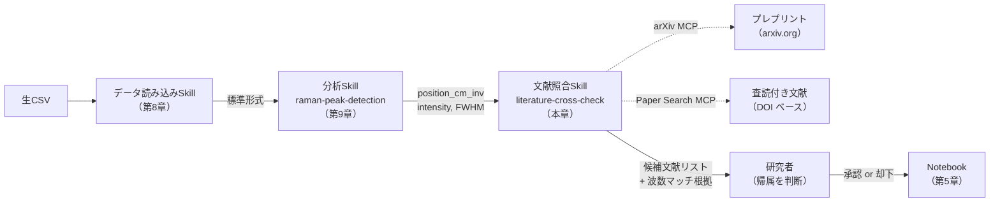
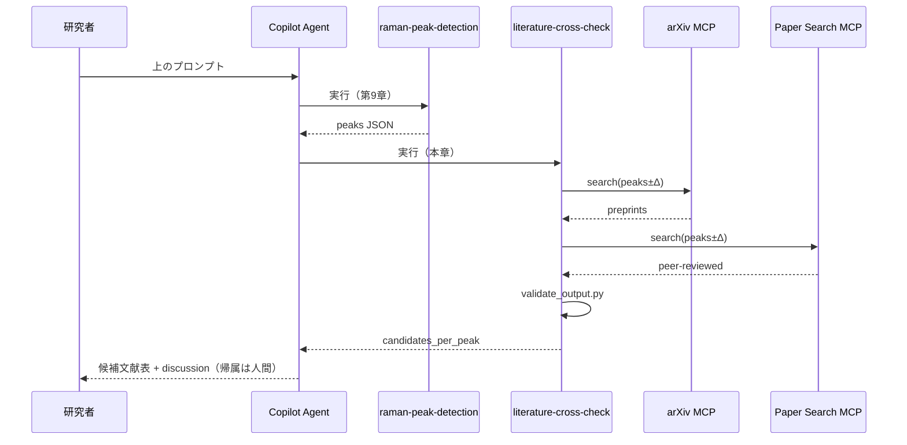

# 第10章　ハンズオン2：文献・知識統合で考察を強化する

> **本章の到達目標**
> - 第9章の分析Skillの出力（ピーク位置・強度・FWHM）を入力として、**文献照合Skill**を1本追加できる
> - **arXiv MCP** と **Paper Search MCP** の役割の違いを説明し、目的別に使い分けられる
> - Skill を横に並べる（分析Skill → 文献照合Skill）**Skill 連鎖**の設計ができる
> - 文献照合特有の失敗モード（**ハルシネーション・存在しない論文・古い知見の断定**）を検知・防止できる
> - 「AIが物質同定する」のではなく「**候補文献を提示し、帰属・妥当性の判断は人間**」という役割分担を実装できる

**扱うこと**：文献照合Skill（arXiv/Paper Search MCP との連携）の設計・実装・実行、ハルシネーション対策、第9章との**差分**。
**扱わないこと**：分析Skill本体の書き方（第9章）、入力データの整形（第8章）、実行後の物理的妥当性検証（第12章）、複数モダリティ統合（第11章）、MCPの詳細比較（付録B）。

> [!NOTE]
> 本章は **第9章との差分中心** の構成です。Skill ディレクトリ構造・progressive disclosure・6評価基準・承認ゲートといった共通事項はすべて第9章で説明済みですので、必要に応じて第9章を参照してください。

> [!IMPORTANT]
> 本書の合格ラインは「**動く・検証済み・再現できる**」の3拍子であり、「**失敗しない**」ことではありません。文献照合Skillも例外ではなく、外部DBの応答が変わっても「候補提示までは動き、記録された検索日・クエリ・返却IDから同じ手順を再現できる」ことを目指します。

---

## 10.1　この章で作るSkillの概要（差分）

第9章で作った `raman-peak-detection` Skill は「数値を出す」までで意図的に止めました（§9.4 の⑤禁止事項に「物質同定・ピーク帰属を推測しない」を明記）。本章では、その**次の一手**として `literature-cross-check` Skill を追加し、次の役割分担を実装します。

| 役割 | 担当 |
|---|---|
| 数値（位置・強度・FWHM）を出す | 分析Skill（第9章） |
| 数値と近い波数の**候補文献**を集める | 文献照合Skill（本章） |
| **帰属・妥当性を判断する** | **人間の研究者** |



**成果物**：`.github/skills/literature-cross-check/` 以下の一式。第9章と同じ progressive disclosure 構造（§9.3 参照）で、SKILL.md ／ `references/` ／ `scripts/` を配置します。

### 第9章との主な差分

| 論点 | 第9章（分析Skill） | 本章（文献照合Skill） |
|---|---|---|
| 入力 | CSV → 標準スペクトル | 分析Skill出力（JSON） |
| 主要ツール | scipy | **arXiv MCP / Paper Search MCP** |
| 主なリスク | 単位ミス・欠損誤処理 | **ハルシネーション（存在しない論文）** |
| 出力の性質 | 数値（確定的） | 候補（要人間判断） |
| 禁止事項の重心 | 物質同定を書かない | **DOI/URL を検証せずに出力しない** |

---

## 10.2　arXiv MCP と Paper Search MCP の使い分け

> [!IMPORTANT]
> **arXiv MCP / Paper Search MCP は本書の標準5点環境には含まれない発展構成**です（第3章参照）。標準5点は「Python + JupyterLab + Jupyter MCP + GitHub Copilot CLI + ToolUniverse MCP」で、本章のみ発展構成としてこの2つを追加します。標準5点だけで第9章までのハンズオンは完結できるため、本章に進む前に必要性を判断してください。

詳細は付録B「MCPカタログ」に集約しています。ここでは本章のハンズオンに必要な最小限を整理します。

| MCP | 主なソース | 得意なこと | 苦手なこと |
|---|---|---|---|
| **arXiv MCP** [脚注1] | arXiv.org（プレプリント） | 最新の物理・材料系プレプリントの網羅検索、全文アブスト取得 | 査読前ドラフト中心、書誌整合性の保証なし |
| **Paper Search MCP** [脚注2] | 複数の学術DB（DOI ベース） | 査読付きジャーナル、DOI での確実な一意性 | 収録DBに依存、プレプリントは弱い |

**使い分けの原則**：
- **新しい現象・最新の議論**が主眼 → arXiv MCP を優先
- **確定した知見・引用文献リスト作成**が主眼 → Paper Search MCP を優先
- **本章のハンズオンでは両方を併用**し、arXiv でカバレッジを稼ぎ、Paper Search で確度を担保する

> [!IMPORTANT]
> 本章では MCP 名を「役割」として扱い、具体的なパラメータ・ツール名は変わりうるものと理解してください。実装時は付録B と各MCPの最新READMEを必ず参照してください。

### セットアップ（イメージ）

第4章の Copilot CLI ＋ MCP セットアップと同じ手順で `.mcp.json` に arXiv / Paper Search を追加します（具体的な JSON 例は付録B）。追加後は Copilot CLI 起動時のログに `mcp arxiv connected` のような行が現れることを確認します。

---

## 10.3　文献照合SkillのSKILL.mdを書く

第9章 §9.4 の6要素（①〜⑥）にそって、**差分だけ**示します。共通の骨格は第9章と同じです。

### Frontmatter（差分）

```yaml
---
name: literature-cross-check
description: |
  ラマン等の分光ピーク位置（cm⁻¹）を入力に、arXiv MCP と Paper Search MCP で
  近傍波数を扱う文献を検索し、候補文献リストと波数マッチ根拠を返す。
  物質同定・ピーク帰属の断定は行わず、人間が判断するための材料を提示する。
version: 1.0.0
compatibility: python>=3.11, arxiv-mcp, paper-search-mcp
tags: [literature, cross-check, materials, spectroscopy]
---
```

- `name` は Skill ディレクトリ名と一致（第9章と同じ規約）
- `description` に **「断定しない／判断は人間」** を明示（Copilot 自動発見時にもこの制約が伝わる）
- `allowed-tools` は第9章と同様、experimental のため使わず、第6章の承認ゲートで制御する

### 本文の差分（重要な項目のみ）

**① 目的**：分析Skillの出力（`position_cm_inv` の配列）を受け取り、**各ピーク位置の周辺（±Δ cm⁻¹）を扱う既存文献の候補**を、DOI/arXiv ID・タイトル・波数記述の該当箇所とともに返す。

**② 入力条件（データ契約）**：第9章 `raman-peak-detection` の `output-schema.json` に**完全準拠**（`position_cm_inv`, `intensity`, `fwhm_cm_inv`, `confidence` の4フィールド必須）。Δ の既定値は ±10 cm⁻¹。試料材料の事前情報（`material_hint`）は任意入力とし、`null` を許容する。

**③ 出力形式**：`references/output-schema.json` を新設。各ピークにつき候補文献の配列を返す（次節参照）。

**④ 成功条件**：
- 各ピークにつき、候補文献 **0〜N件**（0件を許容：無理に埋めない）
- すべての候補に **`doi` または `arxiv_id`**（片方以上）が付与されている
- 各候補の `matched_wavenumber_cm_inv` に、入力ピーク位置との差分（Δ）が記録されている
- `discussion` には**「候補は帰属ではない」旨を必ず1文含める**

**⑤ 禁止事項・受け付けない入力（fatal 拒否条件）**：
- 入力 JSON が §9.5 の `output-schema.json` に違反する
- **DOI/arXiv ID を確認せずに文献情報を出力すること**（＝ハルシネーション出力）
- **タイトルや著者名を検索せずに「〜と一致」と断定すること**
- **物質名（Si・ダイヤモンド・グラファイト等）を推定して出力すること**（人間の判断領域）
- Agent の**チャット応答**で物質同定・帰属を口頭で提示すること（第9章と同じ）
- 検索件数がゼロの場合に「該当なし」以外の推測を書くこと
- **Skill および AI Agent は、候補文献が同定・帰属を「確認した」「妥当性を裏付けた」と判定しない**（候補提示・波数マッチ根拠の提示までに止め、最終判断は人間の研究者。第7章の循環設計問題・第15章 `common_forbidden.yaml` と対応）
- **物質同定・ピーク帰属・相同定・Rietveld による組成/相の自動確定を、出力ファイルにも Agent のチャット応答にも含めない**
- **外部検索クエリに `sample_id` / 組成 / プロセス条件（成膜・熱処理条件など） / 装置メタデータ / 共同研究先名 / 課題番号 / APIトークン を含めない**（第6章 §6.6 の漏洩対象と整合）。`material_hint` を使う場合も、公開可能な一般名称に限定し、送信前にクエリ文字列を人間が承認する

**⑥ 再現性条件**：`arxiv-mcp` `paper-search-mcp` のバージョン、検索クエリ、Δ 幅、検索日時（UTC）、返却された `doi` / `arxiv_id` の完全リストを `discussion` に記録する。加えて **標準環境バージョン**（第4章と揃える）：Python / JupyterLab / GitHub Copilot CLI / `jupyter-mcp-server==0.14.4` / `tooluniverse==1.4.4` と、本章の発展構成である文献MCPの実バージョンも `references/env-lock.txt` に記録する。同じ入力＋同じ検索日でも、外部DBの更新により結果が変わりうることを明記する。

---

## 10.4　`references/output-schema.json`

第9章の JSON Schema と同じスタイルで書きます。

```json
{
  "$schema": "http://json-schema.org/draft-07/schema#",
  "title": "literature-cross-check output",
  "type": "object",
  "required": ["query", "search_datetime_utc", "candidates_per_peak", "discussion"],
  "properties": {
    "query": {
      "type": "object",
      "required": ["peaks", "delta_cm_inv"],
      "properties": {
        "peaks": {"type": "array", "items": {"type": "number"}},
        "delta_cm_inv": {"type": "number", "minimum": 0}
      }
    },
    "search_datetime_utc": {"type": "string", "format": "date-time"},
    "candidates_per_peak": {
      "type": "array",
      "items": {
        "type": "object",
        "required": ["peak_cm_inv", "candidates"],
        "properties": {
          "peak_cm_inv": {"type": "number"},
          "candidates": {
            "type": "array",
            "items": {
              "type": "object",
              "required": ["title", "url", "accessed_at_utc", "matched_wavenumber_cm_inv", "source"],
              "properties": {
                "title":    {"type": "string"},
                "doi":      {"type": ["string", "null"]},
                "arxiv_id": {"type": ["string", "null"]},
                "url":      {"type": "string", "format": "uri"},
                "accessed_at_utc": {"type": "string", "format": "date-time"},
                "matched_wavenumber_cm_inv": {"type": "number"},
                "source":   {"type": "string", "enum": ["arxiv", "paper-search"]},
                "excerpt":  {"type": "string"}
              }
            }
          }
        }
      }
    },
    "discussion": {"type": "string"}
  }
}
```

**設計のポイント**：
- `doi` と `arxiv_id` は**どちらか一方が必ず埋まる**（両方 `null` を許容しない検証を `scripts/validate_output.py` に置く）
- `excerpt` は本文中で波数が言及された箇所の**短い引用**（要約でも解釈でもない）
- `discussion` には検索件数・却下件数・「候補は帰属ではない」旨を最低限含める

---

## 10.5　ハルシネーション対策（本章の中核）

文献照合Skill 特有の最大リスクは **「もっともらしい存在しない論文」の生成**です。第7章 §7.6 で予防設計、第12・14章で実行後の検証・事例を扱いますが、本章では **Skill 設計時に埋め込むガード** を示します。

### ガード1：**MCP 経由でのみ書誌情報を取得する**

Agent が知識の中から「〜という論文があります」と回答するのは禁止です。文献情報はすべて MCP の返り値からのみ抽出し、`scripts/validate_output.py` で**返却された `doi` / `arxiv_id` が実際に MCP のレスポンスに存在したか**を検証します。

### ガード2：**DOI / arXiv ID の形式チェック**

```python
# scripts/validate_output.py（抜粋）
import re, json, sys

DOI_RE   = re.compile(r"^10\.\d{4,9}/[-._;()/:A-Z0-9]+$", re.IGNORECASE)
ARXIV_RE = re.compile(r"^\d{4}\.\d{4,5}(v\d+)?$")  # 2007以降の新形式

def validate_candidate(c: dict) -> list[str]:
    errs = []
    doi, aid = c.get("doi"), c.get("arxiv_id")
    if not doi and not aid:
        errs.append("fatal: neither doi nor arxiv_id is present")
    if doi and not DOI_RE.match(doi):
        errs.append(f"fatal: invalid DOI format: {doi}")
    if aid and not ARXIV_RE.match(aid):
        errs.append(f"fatal: invalid arXiv ID format: {aid}")
    if not c.get("title") or not c.get("matched_wavenumber_cm_inv"):
        errs.append("fatal: title or matched_wavenumber missing")
    return errs

if __name__ == "__main__":
    data = json.load(open(sys.argv[1]))
    all_errs = []
    for peak in data["candidates_per_peak"]:
        for c in peak["candidates"]:
            all_errs.extend(validate_candidate(c))
    if all_errs:
        print("\n".join(all_errs)); sys.exit(1)
    print("OK")
```

これで DOI プレフィックスが `10.` で始まらないような**明らかに壊れた偽ID**は fatal で弾けます。

> [!WARNING]
> **実機検証で判明した regex の限界**：`10.9999/fake.paper.2024` のような「プレフィックス `10.9xxx` で始まる文字列」も、DOI の**形式としては合法**であり、正規表現だけでは弾けません（実際、著者手元のテストで通過を確認）。したがって regex は**補助的な形式チェック**にとどまり、**実質的な防護はガード1「MCP レスポンスとの突合」が担います**。両者を組み合わせて初めて「存在しない論文」を排除できることに注意してください。

### ガード3：**Δ（波数マッチ幅）の明示と `discussion` への必記録**

「近い」を主観で決めさせず、Δ を数値で入力させる。既定値は ±10 cm⁻¹（ラマンのピーク実効幅を目安）。Δ を広げるほど候補は増えますが、`discussion` に**「Δ=±20 cm⁻¹まで拡大した」等を必ず記録**するよう SKILL.md で義務化します。

### ガード4：**「候補は帰属ではない」を出力に埋め込む**

`discussion` に次のような定型文を**必ず含める**よう SKILL.md ④成功条件で要求します。

> 本Skillが返すのは近傍波数を扱う文献の**候補**であり、試料の物質同定・ピーク帰属を意味しません。最終的な妥当性判断は研究者が行ってください（第12章の実行後検証を参照）。

### ガード5：**チャット応答も規制する**

第9章の実機検証で観測したとおり、`discussion` フィールドが清潔でも Agent が**チャットで口頭同定してしまう**ケースがあります。⑤禁止事項に「Agent のチャット応答で物質名を推測すること」を明示的に含め、使用例プロンプトにも「候補提示のみ、同定はしないこと」を毎回書きます。

---

## 10.6　使用例プロンプトと実行フロー

### 使用例プロンプト

```
第9章で検出したピーク（position_cm_inv, fwhm）に対して、
literature-cross-check を Δ=±10 cm⁻¹ で実行してください。
物質同定・帰属は行わず、候補文献の一覧だけを返してください。
material_hint は null で構いません。
```

### Agent の想定挙動



**承認ゲート**（第6章）：Notebook への書き込み、外部URLアクセス、生成した Markdown の保存は、すべて人間の承認を要求する設定を維持します。

---

## 10.7　実行例・失敗例・改善版

> [!NOTE]
> 本節の実行例は、arXiv / Paper Search の応答内容が日々変わるため、**構造とチェックポイント**を示します。読者が実行したときの具体的な件名・DOI とは異なって当然です。

### 実行例（成功）— 実機検証済み

- 入力：第9章の実測ピーク `[519.65, 1331.96, 2900.88]` cm⁻¹、Δ=±10、`material_hint=null`
- **実機検証**（arXiv 公開APIを本Skillのバックエンドとして直接呼び出し）：`material_hint=null` のため物質名を含まないクエリ `abs:"1332 cm" AND abs:Raman` で以下の実在論文3件を取得（**物質名を検索語に入れるのは、人間が `material_hint` に public / non-confidential な値を明示して承認した場合のみ**）。
  - `arxiv_id=0806.1485` "Growth of Diamond Films from Tequila"
  - `arxiv_id=1608.07375` "Raman spectroscopic features of the neutral vacancy in diamond ..."
  - `arxiv_id=2202.06632` "Size-dependent thermal stability and optical properties of ultra-small nanodiamo..."
- Skill 出力（構造のみ、抜粋）：
  - ピーク 519.65 に対する候補：`source=paper-search`, `doi=10.xxxx/...`, `matched_wavenumber_cm_inv=520.5`, `excerpt="a sharp peak near 520 cm-1..."`
  - ピーク 1331.96 に対する候補：上記3件、`source=arxiv`
  - ピーク 2900.88 に対する候補：0件（該当なし、`discussion` に「Δを±20まで拡大したが該当なし」と記録）
- `scripts/validate_output.py` は上記の実 `arxiv_id` `0806.1485` `1608.07375` `2202.06632` をすべて **rc=0 OK** で受理（正規表現 `^\d{4}\.\d{4,5}(v\d+)?$` に合致）
- `discussion` の末尾に「候補は帰属ではない」定型文が含まれることを確認

### 失敗例と原因

| 失敗パターン | 原因 | 検知方法 |
|---|---|---|
| 存在しない DOI が返る | Agent が MCP を経由せず内部知識で回答 | `validate_output.py` の DOI 正規表現／MCP レスポンス突合 |
| **形式は合法だが実在しない DOI（例：`10.9999/...`）** | Agent の内部生成 + 形式チェックのみ | **ガード1（MCP レスポンスとの突合）で二重防護**。regex 単体では通過するため注意 |
| 「シリコンの 520 cm⁻¹ に対応」と Agent が回答 | ⑤禁止事項の未遵守 | プロンプトに「同定禁止」明示＋レビューで指摘 |
| Δ を暗黙に広げて候補を水増し | Δ を SKILL.md で明示していない | ④成功条件で `discussion` への記録を必須化 |
| arXiv 側の古いプレプリントだけで結論 | Paper Search 併用を怠った | ⑥再現性条件に「両MCPの併用ログ」を義務化 |
| 検索件数ゼロを埋めるための推測 | ⑤禁止事項が甘い | 「該当なし」を許容する契約に |

### 改善版：DOI ハルシネーション例の修正

**Before**（Agent の応答例）：
> 該当候補：Smith et al., "Raman study of Si nanostructures", DOI: 10.1234/fake.2024.

**After**（Skill の validate_output.py が fatal を返した場合）：
> literature-cross-check: fatal: DOI 10.1234/fake.2024 not found in MCP response (arxiv-mcp / paper-search-mcp のいずれのレスポンスにも含まれていない `doi`／`arxiv_id` は却下する — ガード1「MCP レスポンスとの突合」)。
> → Skill 実行を中止し、Agent が「候補なし（検索結果が MCP 突合で却下されました）」と `discussion` に記録。

> [!NOTE]
> `10.1234/fake.2024` は DOI 正規表現 `^10\.\d{4,9}/[-._;()/:A-Z0-9]+$` を通過するため、regex 単体では検知できません。したがって `validate_output.py` は **MCP レスポンスの `doi` / `arxiv_id` allowlist との突合**（ガード1）を必ず併用し、Skill が出力する候補は「そのセッションで実際に MCP が返した ID の部分集合」に限定します。

---

## 10.8　他データ型への転用

本Skillは**波数ベース**のマッチングを前提としているため、他データ型への転用時は「マッチキー」を差し替えるだけで骨格は同じです。

| データ型 | マッチキー | 主な検索ソース |
|---|---|---|
| スペクトル型（本章） | 波数 cm⁻¹ | arXiv / Paper Search |
| クロマトグラム・時系列型 | 保持時間・周波数 | 同上 |
| 画像・顕微鏡型 | スケール・特徴サイズ（nm） | 同上＋画像リポジトリ |
| 回折・散乱パターン型 | 2θ・q（Å⁻¹） | 同上＋結晶構造DB |
| 表形式・プロセス条件型 | 条件レンジ（温度・圧力等） | 同上＋実験プロトコルDB |
| マルチモーダル統合型 | 複合キー | 第11章 |

**転用手順**：
1. Skill 名を `literature-cross-check-<data-type>` に変える（例：`literature-cross-check-xrd`）
2. `output-schema.json` の `matched_wavenumber_cm_inv` を `matched_<key>` に置換
3. Δ の単位・既定値をデータ型に合わせる
4. ⑤禁止事項の「物質同定」は**全データ型で共通**（本Skillの目的は候補提示のみ）

---

## 章末ワーク

1. **設計**：自分の主データ型について、`literature-cross-check-<data-type>` の Frontmatter と ⑤禁止事項の草案を書きなさい（10行以内）。
2. **ガード実装**：`scripts/validate_output.py` に、自データ型のマッチキーに対応する正規表現・単位チェックを1つ追加しなさい。
3. **失敗シミュレーション**：Agent に「同定禁止」を明示せずに実行し、チャット応答に物質名が現れるかを観察しなさい。観察された場合は、プロンプトと ⑤禁止事項をどう書き換えれば防げるかを1段落で述べなさい。
4. **Δ 感度**：Δ を ±5 / ±10 / ±20 cm⁻¹ と変えて実行し、候補件数と重複率を比較しなさい（結果は `discussion` にも記録）。

---

## 本章のまとめ

- 文献照合Skillは、**分析Skillが出した数値**を受け取り、**候補文献**を返すことに専念する
- **arXiv MCP / Paper Search MCP** は補完関係にある。両方併用してカバレッジと確度を両立する
- 本Skillの最大リスクは**ハルシネーション**（存在しない論文の生成）。5つのガード（MCP経由限定・ID形式検証・Δ明示・「候補は帰属ではない」・チャット応答規制）を Skill 設計時に埋め込む
- **物質同定・帰属は人間の判断領域**。Skill は候補材料の提示までで意図的に止める
- 第9章と同じ progressive disclosure / 6評価基準 / 承認ゲートを踏襲し、**差分は入出力契約と禁止事項の重心のみ**

> **次章予告**：第11章では、**複数モダリティ**（分光・顕微鏡・回折など異種データ）を1本の統合Skillでどう扱うか、第9・10章の差分中心に踏み込みます。

---

## 参考資料

- [脚注1] arXiv MCP Server 公式リポジトリ：https://github.com/blazickjp/arxiv-mcp-server （最終アクセス：本書執筆時点）。実装は複数存在するため、付録B「MCPカタログ」の比較表を参照のこと。
- [脚注2] Paper Search MCP 公式リポジトリ：https://github.com/openags/paper-search-mcp （最終アクセス：本書執筆時点）。DOI ベースの学術DB統合検索を提供。
- 第7章 §7.6「ハルシネーション予防設計」（設計時の対策）／第12章「実行後の検証」（実行後の妥当性検証）／第14章「失敗パターン集」（事例）と併せて読むこと。
- MCPの選定・比較の詳細は付録B「MCPカタログ（用途別選択ガイド）」に集約。
