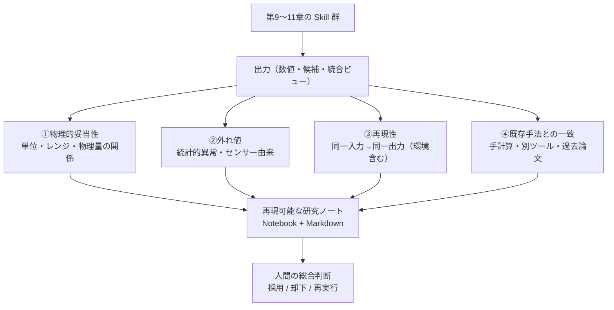

# 第12章　分析結果の検証・評価・レポート化（総合演習）

> **本章の到達目標**
> - 第9〜11章で作った Skill 群の**実行後**に、**物理的妥当性・外れ値・再現性・既存手法との一致**の 4 観点で検証する手順を持てる
> - 検証結果を**再現可能な研究ノート**（Notebook＋Markdown レポート）に落とし込める
> - 第7章の設計時評価基準と本章の実行後検証を統合した **Skill 評価チェックリスト**（15項目）を運用できる
> - **総合演習**：自分の実験データ用 Skill を「動く／検証済み／再現できる」の 3 拍子で完成させる（本書の合格ライン）

**扱うこと**：**実行後の検証**（Skill の出力を人間・機械の両面で確かめる作業）、可視化と研究ノート化、評価チェックリスト、総合演習。
**扱わないこと**：Skill の設計時の評価仕様（第7章）、入力データの整形（第8章）、Skill 内部の分析処理（第9章）、失敗パターンの体系分析（第14章）、運用・組織導入（第15章）。

> [!NOTE]
> 本章は第9〜11章を**現場で使える形に仕上げる**フェーズです。ここまでの章で「動く」「拡張できる」ようになった Skill を、「**検証できる・再現できる**」の水準に引き上げます。

---

## 12.1　なぜ「実行後の検証」が独立の章になるのか

第7章で「設計時の評価仕様」（成功条件・禁止事項・再現性条件）を書きました。しかしそれは**契約**であって、**実行結果が本当にその契約を満たしているか**は、実行後に確かめないと分かりません。とくに AI Agent 時代の分析では次の 2 つが起きやすくなります。

- **循環設計問題**：AI に「結果」も「評価基準」も任せると、間違っていても "整合が取れて見える" ため、人間が発見できない
- **見かけの再現性**：同じプロンプト・同じ Skill でも、外部依存（arXiv・MCP バージョン・パッケージ・乱数種）が変わると結果が変わる

これらを外から確かめるのが**実行後の検証**です。本章では以下 4 観点で扱います。



---

## 12.2　観点①：物理的妥当性チェック

Skill が出した数値が**物理的にありうるか**を確認します。第9章の禁止事項（物質同定しない）と矛盾しないよう、**帰属は行わず、レンジと関係の妥当性のみ**を機械的にチェックします。

| チェック | 内容 | 例（ラマン） |
|---|---|---|
| **単位** | Skill 出力の単位が入力契約と一致 | 波数が cm⁻¹ で ±数千の範囲 |
| **値のレンジ** | 装置・測定条件で物理的にありうる範囲か | ラマンは通常 100〜4000 cm⁻¹ |
| **量の関係** | 派生量が元の量と整合するか | FWHM > 0、intensity ≥ 0 |
| **保存量** | 保存すべき量が保存されているか | 積分強度がベースライン処理前後で急変していない |
| **監視値** | 装置の安定指標が閾値内 | レーザー出力・積分時間の記録がある |

### `scripts/check_physical_plausibility.py`

> [!NOTE]
> 入力の想定形状：第9〜11章 Skill の出力 JSON。`peaks` 配列（第9章形式）と、トップレベルに数値／配列がある形式（第10・11章形式）の**両方**を受け付けます。キー名は第9章の `position_cm_inv` / `fwhm_cm_inv` / `intensity` に揃えます。

```python
import json, sys

RANGES = {
    "position_cm_inv":   (50.0, 5000.0),   # 第9章 peaks[].position_cm_inv
    "fwhm_cm_inv":       (0.5,  200.0),
    "intensity":         (0.0,  None),      # 上限なし
    "grain_size_nm":     (0.1,  1e5),
    "2theta_deg":        (0.0,  180.0),
}

# 第10・11章など、canonical でない別名を canonical に寄せる
ALIASES = {
    "two_theta_deg":         "2theta_deg",
    "peak_positions_2theta": "2theta_deg",
    "raman_shift_cm_inv":    "position_cm_inv",
    "peak_position":         "position_cm_inv",
}

def _check_value(key, v, errs):
    if key not in RANGES:
        return
    lo, hi = RANGES[key]
    if not isinstance(v, (int, float)) or isinstance(v, bool):
        errs.append(f"warning: {key} is not numeric: {v!r}"); return
    if v < lo:
        errs.append(f"warning: {key}={v} below plausible range (< {lo})")
    if hi is not None and v > hi:
        errs.append(f"warning: {key}={v} above plausible range (> {hi})")

def _iter_values(obj):
    """dict/list を再帰的に走査し、(canonical_key, value) を列挙"""
    if isinstance(obj, dict):
        for k, v in obj.items():
            canonical = ALIASES.get(k, k)
            if canonical in RANGES:
                vals = v if isinstance(v, list) else [v]
                for x in vals:
                    yield canonical, x
            yield from _iter_values(v)
    elif isinstance(obj, list):
        for item in obj:
            yield from _iter_values(item)

def check(record: dict) -> list[str]:
    errs = []
    # 第9章 peaks 配列・第10章 candidates・第11章 dataset のいずれの入れ子構造も対応
    for key, v in _iter_values(record):
        _check_value(key, v, errs)
    return errs

if __name__ == "__main__":
    data = json.load(open(sys.argv[1]))
    errs = check(data)
    if errs:
        print("\n".join(errs)); sys.exit(2)  # exit=2: 妥当性チェックの warning（fatal ではない）
    print("plausibility: OK")
```

> [!IMPORTANT]
> レンジ違反は **warning（exit=2）** に留め、fatal（exit=1）にはしません。**装置固有の測定範囲は使用者しか知らない**ため、機械が勝手に "却下" せず、人間が判断できる形に残します（第6章の Human-in-the-loop）。

---

## 12.3　観点②：外れ値検出

物理的妥当性を通った数値の中にも、**同一試料の繰り返し測定**や**マッピング測定**で見て初めて分かる外れ値があります。ここでは**単純で解釈しやすい 2 手法**だけを扱います。

| 手法 | 想定シナリオ | 判定ルール |
|---|---|---|
| **中央値絶対偏差（MAD）** | 繰り返し測定の 1 点が飛ぶ | `0.6745 * |x - median| / MAD > 3.5` を外れ値とみなす（modified z-score） |
| **IQR（四分位範囲）** | マッピングで異常領域を特定 | `x < Q1 - 1.5*IQR` or `x > Q3 + 1.5*IQR` |

> [!NOTE]
> **なぜ MAD を推奨するか**：平均・標準偏差は外れ値自身に引きずられて感度が落ちますが、中央値・MAD は**外れ値耐性が高い**（ロバスト統計）。特に少数試行（3〜10 回）の測定で有効です。

> [!WARNING]
> **MAD=0 の落とし穴**：MAD がゼロになるのは「全値同一」だけではありません。**過半数（半分以上）の値が同一**でも MAD=0 になり、明白な外れ値を含んでいても判定不能になります（例：`[10, 10, 10, 99]` → MAD=0）。少数試行で同じ値が続くときは、`find_outliers.py` の結果 "no outliers detected" を鵜呑みにせず、**必ず生値をプロットして目視**してください（§12.6 の可視化はこの目的も兼ねます）。

### `scripts/find_outliers.py`

```python
import json, sys, statistics as st
from typing import Union

def mad_status(values: list) -> tuple[str, list[int]]:
    """Return (status, outlier_indices)。status ∈ {ok, inconclusive_n, inconclusive_mad, outliers}"""
    if len(values) < 4:
        return ("inconclusive_n", [])       # サンプル少：判定を保留
    med = st.median(values)
    mad = st.median([abs(v - med) for v in values])
    if mad == 0:
        return ("inconclusive_mad", [])     # ばらつき0：判定不能（過半数同一を含む）
    threshold = 3.5
    # modified z-score: 0.6745 * |x-med| / MAD > threshold
    idx = [i for i, v in enumerate(values)
           if 0.6745 * abs(v - med) / mad > threshold]
    return ("outliers", idx) if idx else ("ok", [])

if __name__ == "__main__":
    data = json.load(open(sys.argv[1]))  # {"key": [v1, v2, ...]}
    has_outliers = False
    inconclusive = False
    for k, vs in data.items():
        status, idx = mad_status(vs)
        if status == "ok":
            print(f"{k}: OK, no outliers (n={len(vs)})")
        elif status == "outliers":
            print(f"OUTLIER {k}: indices {idx} (values: {[vs[i] for i in idx]})")
            has_outliers = True
        elif status == "inconclusive_n":
            print(f"WARNING {k}: n={len(vs)} < 4, 判定保留（測定回数を増やす）")
            inconclusive = True
        else:  # inconclusive_mad
            print(f"WARNING {k}: MAD=0, 判定不能（生値をプロットして目視）")
            inconclusive = True
    # exit=0: すべて OK、exit=2: 外れ値検出または判定不能（いずれも人間の確認が必要）
    sys.exit(2 if (has_outliers or inconclusive) else 0)
```

> [!IMPORTANT]
> **`no outliers` と `外れ値検出` と `判定不能` を区別する**：終了コード `0` は「判定できて外れ値なし」、`2` は「外れ値検出**または**判定不能（人間の確認が必要）」を意味します。CI や Notebook から呼ぶ場合、`exit=2` は自動採用しないでください。§12.2 の物理的妥当性チェックと同じ設計思想です。

---

## 12.4　観点③：再現性チェック（3層で確かめる）

再現性は「同じ入力なら同じ出力」ですが、**どの層で同じか**を分けないと空回りします。

| 層 | 「同じ」の意味 | 確認方法 |
|---|---|---|
| **L1 数値レベル** | 同一環境では原則完全一致。**浮動小数点処理を含む場合は、第7章⑥で事前定義した許容差内での一致を L1 合格**とする（BLAS・並列度・ハード違いで完全一致が取れないケースがあるため） | 同一環境・同一乱数種で2回実行し diff / 許容差内比較 |
| **L2 判断レベル** | 検出ピーク数・判定結果が同じ | Notebook を kernel restart→run all で比較 |
| **L3 環境レベル** | Skill を別マシン・別日に動かして同じ | `pip freeze`・OS・Python 版を記録 |

### 再現性メタデータの必須項目（第7章⑥再現性条件の実装）

Skill 実行時に必ず記録する項目：

```json
{
  "skill_name":       "raman-peak-detection",
  "skill_version":    "1.0.0",
  "python_version":   "3.11.9",
  "os":               "Linux 6.5.0",
  "package_versions": {"scipy": "1.14.1", "numpy": "1.26.4", "pandas": "2.2.2"},
  "random_seed":      42,
  "input_hash":       "sha256:...",
  "run_datetime_utc": "2026-07-04T00:00:00Z"
}
```

> [!WARNING]
> **見かけの再現性の罠**：Notebook を上から順に実行すると通るのに、kernel restart 後に実行すると失敗する Skill があります。原因は**セル間の状態依存**（前セルで作った変数を参照している）。第9〜11章の Skill は Notebook のセル状態に依存せず、**引数だけで完結**するように書いてください。

---

## 12.5　観点④：既存手法との一致

Skill 単独では「もっともらしく見える結果」に陥りやすい。**独立に導いた基準値**と突き合わせるのが有効です。

| 基準の種類 | 例 | 注意 |
|---|---|---|
| **手計算・簡易式** | Lorentzian の理論 FWHM = 2w、Debye-Scherrer 式など | 近似が効く条件を確認 |
| **別ツール**（GUI/CLI） | 装置付属ソフト、Fityk、OriginLab | 前処理条件を揃える |
| **標準試料**（reference） | シリコン標準サンプル、NIST SRM | データポータル・供給元を明記 |
| **公表値**（peer-reviewed） | 論文の代表値（範囲・誤差込み） | 測定条件が近いものを選ぶ（第10章の候補文献） |

第9章の実機検証で得た `[519.65, 1331.96, 2900.88]` cm⁻¹ に対する、**人間が事前に用意した独立基準値**（Skill/Agent が判定するのではなく、実験者が測定前に登録する参照値）の例：
- 標準試料 A の公称ピーク：520 cm⁻¹（校正済み装置の再現性 ±1 cm⁻¹）
- 標準試料 B の公称ピーク：1332 cm⁻¹（校正済み装置の再現性 ±2 cm⁻¹）
- 2900.88 cm⁻¹：**独立基準未設定**（本書の合否判定には使わない。もし基準が必要なら、対応する標準試料の代表値を装置校正済み条件で別途取得すること）
- **一致基準の例**：`|detected - reference| ≤ 2 cm⁻¹ を "一致"、5 cm⁻¹ 超は "再検証"`

> [!IMPORTANT]
> **これは "帰属" ではありません**：本章は「事前登録した基準値と数値が近いこと」を機械的に確認する作業までです。「よって試料は標準試料 A と同一物質である」という**同定は人間の判断**であり、Skill / Agent のチャット応答にも書きません（第9〜11章の禁止事項と同じ）。

> [!WARNING]
> **文献値を基準に使う場合の追加ガード**：AI Agent に「参考文献の代表値」を出させて基準にすると、DOI・値ともに捏造される危険があります。第10章の `validate_output.py` を必ず通し、DOI/arXiv ID が **MCP レスポンスに実在**することを確認してから採用してください（regex 形式一致だけでは不十分・ch10 §10.5 ガード1）。

---

## 12.6　可視化と研究ノート化

### 可視化の 3 原則

| 原則 | 内容 |
|---|---|
| **1 図 1 主張** | 1 枚のプロットには 1 つの結論だけ載せる |
| **軸・単位・凡例の明示** | 読者が図単独でも解読できる |
| **元データへのリンク** | プロット PNG の隣に `data/sample_XXX.csv` などの参照を残す |

### 研究ノートの最小構成（Notebook 版）

Jupyter Notebook で 1 試料 = 1 ファイルを推奨（複数試料をまとめると再現性が落ちる）。

- **セル 1（Markdown）**：目的、試料 ID、測定日、装置・条件
- **セル 2（Code）**：ロード（データ読み込みSkill を呼ぶ）
- **セル 3（Code）**：分析（分析Skill を呼ぶ）
- **セル 4（Code）**：可視化（Skill 出力を plot）
- **セル 5（Markdown）**：検証結果（本章 §12.2〜12.5 の 4 観点）
- **セル 6（Markdown）**：**人間の総合判断**（採用／却下／再実行の理由）
- **セル 7（Code）**：再現性メタデータ出力（§12.4）

### 研究ノートの最小構成（Markdown レポート版）

Notebook を `.md` にエクスポートした後、次を追加：

- **表題**：試料 ID、日付、Skill 一覧＋バージョン
- **要約**（3行）：何をやって、何が分かり、次に何をするか
- **図表**（各図に caption と元データパスを記載）
- **検証結果**：4観点それぞれ「OK/warning/要再検討」
- **総合判断**（人間）：一段落で明記
- **付録**：`pip freeze`、Skill 実行ログ

> [!TIP]
> Notebook と Markdown を**両方**残すのが実務的です。Notebook は "再実行できるアーカイブ"、Markdown は "読ませる報告書" として使い分けます。

---

## 12.7　Skill 評価チェックリスト（15項目）

第7章（設計）＋第8章（データ契約）＋本章（実行後検証）を統合した完成版チェックリストです。**Skill を出荷する前**に必ず通してください。

### 設計時（第7〜8章）

- [ ] **①目的**：1文で書け、対象データ型が明記されている
- [ ] **②入力条件**：データ契約 7 要素を満たす。`sample_id` は匿名化済み ID のみを使い、`agent_visible_metadata`（AI に渡してよいメタ）と `private_provenance`（raw 絶対パス・課題番号・共同研究先名・装置PCアカウント等）を分離する（第8章 §8.11・第11章 §11.2）。**マルチモーダル Skill の場合はさらに `join_key_type` / `join_key_value` / `units` / `quantities` が入力契約に含まれる**（第11章 canonical shape）
- [ ] **③出力形式**：`references/output-schema.json` があり、JSON Schema で valid。`provenance` に `input_sha256` / `skill_version` / `run_datetime_utc` / `package_versions` を必須で含む（第7〜11章共通）。**マルチモーダルは `missing_modalities` と `provenance.modality_inputs`（各モダリティの `input_sha256` + `skill_version` 連鎖）を必須項目に含む**
- [ ] **④成功条件**：数値で書ける（曖昧な "正しく動く" は NG）
- [ ] **⑤禁止事項**：Skill 出力・Notebook・Markdown レポート・Agent チャット応答のいずれにも、**物質同定・ピーク帰属・相同定・Rietveld による組成/相の自動確定**を含まない（第9〜11章共通・第15章 `common_forbidden.yaml`）
- [ ] **⑥再現性条件**：出力に `provenance.input_sha256` / `skill_version` / `run_datetime_utc` / `package_versions` を記録。乱数を使う場合は `random_seed` を固定・記録。**浮動小数点処理を含む場合は "同一と見なす許容差" を事前に明記**（§12.4 L1）

### 実行時（第9〜11章）

- [ ] **⑦動作確認**：合成データ or 標準試料で入出力が一致
- [ ] **⑧承認ゲート**：ファイル書き込み・外部通信の前に人間承認（第6章）
- [ ] **⑨エラー処理**：fatal / warning / flag の 3 段階（第8章）

### 実行後検証（本章）

- [ ] **⑩物理的妥当性**：`check_physical_plausibility.py` warning 0 または人間が了承
- [ ] **⑪外れ値**：`find_outliers.py` の結果を確認済み
- [ ] **⑫再現性 L1**：同一環境・同一乱数種で 2 回実行し、**完全一致または事前定義した許容差内で一致**する（§12.4）
- [ ] **⑬既存手法との一致**：標準試料・手計算・別ツールの少なくとも 1 つで確認。**文献値を基準にした場合は第10章 `validate_output.py` で DOI/arXiv ID が MCP 応答に実在することを確認**
- [ ] **⑭可視化**：1 図 1 主張・軸単位凡例明示・元データリンク
- [ ] **⑮人間の総合判断**：Notebook / Markdown に採用理由が 1 段落以上ある

> [!IMPORTANT]
> **15項目すべて通ったら完成**、というより **1 つでも欠けたら他人（未来の自分を含む）が再現できない**、と理解してください。

---

## 12.8　総合演習：自分の実験データ用 Skill を完成させる

本書の**合格ライン**は「読者が自分の実験データ向けに、**動く／検証済み／再現できる** Skill を 1 つ以上作れる」ことでした（序章）。本節はその総合演習です。

### 演習ステップ（推奨順）

0. **【必須ゲート】Skill の設置場所を決める**：
    - **公開可能な公表データ**を扱う → `.github/skills/<name>/`（リポジトリ共有可能）
    - **未公開・共同研究・特許前・機密データ**を扱う → `~/.copilot/skills/<name>/`（ユーザースコープ、リポジトリに含めない）
    - どちらの場合も、Skill 本文・examples・fixtures に**試料ID・組成・未公開条件・APIトークンを直書きしない**（Data confidentiality gate）
1. **データ型を決める**（第2章の 6データ型から 1 つ）
2. **入力データを 3 件用意**（うち 1 件は "外れ値が混ざりそうなもの"）
3. **データ読み込みSkill**を書く（第8章、ステップ0で決めた場所配下 `<scope>/skills/<name>-loader/`）
4. **分析Skill**を書く（第9章、`<scope>/skills/<name>-analysis/`）
5. （任意）**文献照合Skill**（第10章）、**マルチモーダル統合Skill**（第11章）
6. **Notebook で実行**（§12.6 の 7 セル構成）
7. **本章の 4 観点で検証**（§12.2〜12.5）
8. **Skill 評価チェックリスト 15 項目**を通す（§12.7）
9. `docs/` に **Markdown レポート**を出力（§12.6）
10. **チームメンバーに再現してもらう**：別マシンで手順書だけを渡して動かす

### 合格基準（自己判定）

- [ ] チェックリスト 15 項目すべて ✅（人間の総合判断は必ず自分の言葉で書く）
- [ ] 別マシン・別ユーザーで同じ結果が得られる（L3 再現性）
- [ ] 第9〜11章の**禁止事項**（物質同定・帰属推測）を犯していない
- [ ] レポートを読めば、**なぜその結論に至ったか**が第三者に伝わる

> [!NOTE]
> 本書は「はじめての Skill を作る」ところまでを射程とします。運用（監査・ログ・権限）を組織で回すには第15章、装置カテゴリ別のテンプレは第13章、失敗事例は第14章、テンプレ集は付録Aを参照してください。

---

## 章末ワーク

1. **物理的妥当性**：`check_physical_plausibility.py` の `RANGES` に、自分の装置で扱う 3 物理量とそのレンジを追加しなさい（例：`temperature_K`, `pressure_Pa` 等）。
2. **外れ値**：`find_outliers.py` に対し、`[10, 10.1, 10.2, 10.1, 99.9]` を入力して 99.9 が外れ値として検出されることを確認しなさい。**さらに**、`[10, 10, 10, 10, 10]`（ばらつき 0）で判定不能になることも確認しなさい。**加えて**、`[10, 10, 10, 99]` を入力し「明白な外れ値なのに検出されない」ことを確認しなさい（**過半数の値が同一だと MAD=0 になり、判定できない**）。実務では、この結果を受けて（i）測定回数を増やす、（ii）平均値ではなく分位点を可視化する、のどちらで対応するかを 1 段落で書きなさい。
3. **再現性**：自分の Skill を kernel restart→run all で 2 回実行し、**L1（数値レベル）** が取れるかを確認しなさい。取れなければ原因（乱数種未固定・セル間状態依存・外部依存など）を特定して修正しなさい。**浮動小数点処理を含む場合は、事前に定めた許容差（例：相対誤差 1e-10）内での一致で合格とすること。**
4. **総合演習**：§12.8 の 10 ステップを実行し、チェックリスト 15 項目の**通過/未通過**を一覧表にまとめなさい。**未通過が 1 つでもあれば、次に何をすれば通過するかを 1 段落で書きなさい。**

---

## 本章のまとめ

- 実行後の検証は**物理的妥当性・外れ値・再現性・既存手法との一致**の 4 観点
- **物理的妥当性チェックは warning（exit=2）**、fatal ではない（装置固有条件を知るのは人間）
- 外れ値検出は **MAD**（modified z-score）を推奨。**「no outliers」と「判定不能」を混同しない**（過半数同一値だと MAD=0 → 判定不能・生値目視必須）
- 再現性は **L1（数値・許容差内）／L2（判断）／L3（環境）**の 3 層で確かめる
- 既存手法との一致は「手計算・標準試料・別ツール・公表値」から少なくとも 1 つ。**文献値は第10章の MCP 応答突合を通す**
- 研究ノートは **Notebook（再実行アーカイブ）＋ Markdown（読ませる報告書）** の両立
- **Skill 評価チェックリスト 15 項目**（設計 6 + 実行時 3 + 実行後 6）で完成度を判定
- **総合演習の合格ライン**：動く／検証済み／再現できる、の 3 拍子

> **次章予告**：第13章では、6データ型ごとの**装置カテゴリ別 Skill テンプレート**を提示します。ここまでで作った "自分の Skill" を横展開する起点になります。

---

## 参考資料

- [脚注1] [Alternatives to the Median Absolute Deviation](https://doi.org/10.1080/01621459.1993.10476408) - Median Absolute Deviation の概念と補正係数 0.6745 の根拠。Rousseeuw, P. J., & Croux, C. (1993), Journal of the American Statistical Association 88(424):1273-1283.

### 関連章

- 第6章「MCPの安全な使い方と Human-in-the-loop」（承認ゲート）／第7章「Skillの設計原則」（設計時評価）／第14章「失敗パターン集」（本章の検証で防げなかった事例）と併せて読むこと
- Notebook から Markdown への変換テンプレートは付録A「プロンプト・Skillテンプレート集」に集約する
