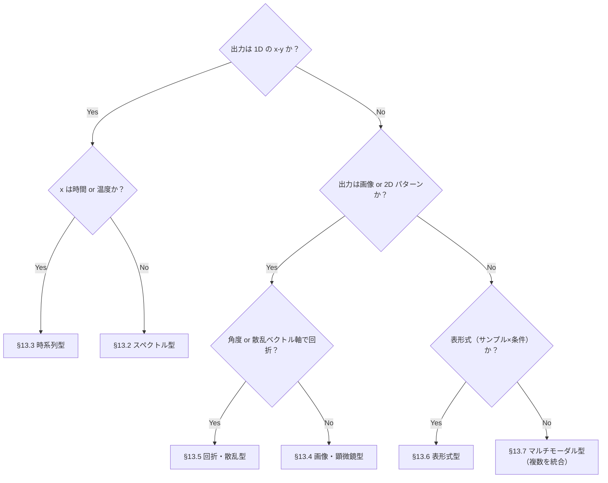

# 第13章　装置カテゴリ別の適用テンプレート

> **本章の到達目標**
> - 第2章の **6 データ型**それぞれについて、**SKILL.md の 6 要素（第7章）** を埋めた**テンプレート雛形**を持つ
> - 自分の装置カテゴリを**どのデータ型に分類し、どのテンプレートから派生させるか**を判断できる
> - テンプレートを 15〜30 分で**自装置向けに書き換える手順**（差分抽出→固有条件記述→検証）を実行できる
> - 詳細な追加テンプレート・プロンプト例は**付録A**に集約されており、本章はその起点として使えると理解する

**扱うこと**：6 データ型（スペクトル／クロマトグラム・時系列／画像・顕微鏡／回折・散乱／表形式・プロセス条件／マルチモーダル統合）**それぞれのテンプレート雛形と代表装置での適用例**、自装置への差分展開手順。
**扱わないこと**：個別装置の物理原理・測定法（それは装置マニュアル）、Skill の実装コード（第9〜11章）、実行後の検証（第12章）、失敗事例と診断（第14章）、詳細プロンプトカタログ（付録A）。

> [!NOTE]
> 本章は**カタログ的な章**です。全 6 テンプレートを通読する必要はありません。**自分の装置カテゴリが該当する 1〜2 節**を読み、§13.9 の適用手順で自 Skill 化してください。

---

## 13.1　本章の使い方

### 6 データ型とテンプレート命名規約

| データ型 | 代表装置カテゴリ | テンプレート名 |
|---|---|---|
| スペクトル型 | 各種分光、磁気共鳴、質量分析 | `spectrum-analysis` |
| クロマトグラム・時系列型 | クロマトグラフ、熱分析、プロセスログ | `timeseries-analysis` |
| 画像・顕微鏡型 | 光学顕微鏡、SEM、TEM | `image-analysis` |
| 回折・散乱パターン型 | 回折・散乱、表面分析 | `pattern-analysis` |
| 表形式・プロセス条件型 | 成膜、リソグラフィ、特性値 | `tabular-analysis` |
| マルチモーダル統合型 | 上記の組み合わせ | `multimodal-integrator` |

### 各テンプレートの構造

すべてのテンプレートは第7章の SKILL.md 6 要素で記述します。以下は共通の骨格です（次節以降、データ型ごとに具体化）。

```markdown
---
name: <data-type>-analysis-<my-instrument>
description: <対象装置>で取得した<データ型>から<分析目的>を行う。<いつ使うか>
---

# ① 目的
<主語・述語・対象範囲＋いつ使うか、を 1 文で>

# ② 入力条件
- ファイル形式: <ext, MIME>
- スキーマ: references/input-schema.json（データ契約 7 要素・第8章）
- 除外: <受け付けない条件>

# ③ 出力形式
- スキーマ: references/output-schema.json
- 主要フィールド: <数値だけを返す。ラベル・帰属は含めない>
- provenance: input_sha256 / skill_version / run_datetime_utc / package_versions / random_seed（乱数使用時）を必須で含む

# ④ 成功条件（数値で書く）
- <合成データ or 標準試料での期待値と許容差>

# ⑤ 禁止事項
- 物質同定・帰属推測をチャット応答に含めない
- <データ型固有の禁止事項>

# ⑥ 再現性条件
- 乱数種固定 / パッケージ版ロック / 許容差の事前定義（第12章 L1）
- `provenance` に `input_sha256` / `skill_version` / `run_datetime_utc` / `package_versions` / `random_seed`（乱数使用時）を必須で記録する
- 標準環境版ピン：`jupyter-mcp-server==0.14.4` / `tooluniverse==1.4.4`（第7章⑥・第9〜11章と一致）
```

> [!IMPORTANT]
> テンプレートは**そのまま動きません**（装置ごとの単位・レンジ・前処理が違うため）。本章の各節は「**書き換えるべき箇所**」を **⚡ Δ マーク** で示します。

> [!NOTE]
> 本章の合格ラインは第12章と同じく「**動く・検証済み・再現できる**」の 3 拍子であり、「失敗しない」ことではありません。テンプレートは**この 3 拍子を成立させるための最小要件**として書かれています。

---

## 13.2　スペクトル型テンプレート

**代表**：Raman、赤外分光（FTIR）、X線光電子分光（XPS）、核磁気共鳴（NMR）、質量分析（MS）。**共通構造**：横軸に物理量（波数・化学シフト・m/z など）、縦軸に強度、目的は**ピーク・バンドの位置・幅・強度の抽出**（帰属は人間）。

### テンプレート（第9章の直接派生）

```markdown
---
name: spectrum-analysis-<instrument>
description: <装置>スペクトル（<軸単位>）から主要ピークを検出し、位置・強度・幅を表形式で返す。ピーク位置を確認したいときに使う。
---

# ① 目的
<装置>スペクトル（1D、<軸単位>）から主要ピークを検出し、position/intensity/fwhm/confidence を JSON で返す。

# ② 入力条件
- 形式: CSV/TSV/装置固有バイナリ（loader Skill で正規化済み）
- スキーマ: [{ "x": <axis>, "y": <intensity> }, ...]  # ⚡Δ 軸名を装置固有に
- 制約: 単調増加の x, NaN 除去済み, 長さ ≥ 100
- ⚡Δ smoothing / baseline 補正方針（適用する場合は method と window を metadata に明記）

# ③ 出力形式
{
  "peaks": [{
    "position_<axis_unit>": <float>,   # ⚡Δ 単位を装置固有に
    "intensity": <float>,
    "fwhm_<axis_unit>": <float>,
    "confidence": <0.0-1.0>
  }],
  "provenance": {...}
}
帰属（試料名・化学種名）は返さない。

# ④ 成功条件
- ⚡Δ 標準試料（<装置固有の基準物質>）に対して主要ピーク ±⚡Δ<装置校正精度> で一致
- confidence < 0.3 のピークを含まない

# ⑤ 禁止事項
- 物質同定・帰属をチャット応答に含めない（数値のみ）
- ⚡Δ <装置固有の測定範囲外>を含む結果を採用しない
- ⚡Δ baseline / smoothing method 未指定の結果を採用しない

# ⑥ 再現性条件
- scipy version pin, random_seed=42, ⚡Δ 許容差 tolerance（例：1e-6）を事前定義
```

### 適用例：Raman／XPS／NMR の Δ 差分

| 項目 | Raman | XPS | NMR |
|---|---|---|---|
| 軸単位 | `cm_inv` (波数) | `eV` (結合エネルギー) | `ppm` (化学シフト) |
| 標準試料 | Si 520 cm⁻¹ | Au 4f7/2 = 84.0 eV | TMS 0 ppm |
| 校正精度 | ±1〜2 cm⁻¹ | ±0.1 eV | ±0.01 ppm |
| 主要禁止 | 材料同定 | 化学状態帰属 | 分子構造帰属 |
| 追加禁止 | Cosmic ray スパイクを "本物のピーク" と誤認しない | Charging shift 未補正データでの絶対値議論 | 位相・積分値の自動確定 |

### 代表参照：質量分析（MS）・磁気共鳴（NMR）の追加考慮

- **MS**：単位が m/z、`intensity` は絶対強度でなく `relative_abundance` にしたほうが実務に合う（フィールド名を Δ）
- **NMR**：多次元 NMR（2D COSY, HSQC 等）は **§13.7 マルチモーダル型ではなく、スペクトル型の 2D 拡張**として扱う。軸は `ppm_f1`, `ppm_f2` のように明示し、出力はクロスピークの位置（f1, f2）と強度のみ（構造帰属は人間）。**§13.7 は複数装置・複数測定を統合する場合のみ**使う

> [!TIP]
> 第9章のハンズオンは Raman ですが、上表の Δ を差し替えるだけで XPS / NMR / MS 用 Skill の雛形になります。テンプレート化に徹する本章の狙いはここです。

---

## 13.3　クロマトグラム・時系列型テンプレート

**代表**：ガス／液体クロマトグラフ（GC/LC）、熱分析（TGA/DSC）、プロセス条件の時系列ログ。**共通構造**：横軸に時間または昇温温度、縦軸に強度・重量・熱流など。目的は**ピーク時刻・面積・傾き変化点の抽出**。

### テンプレート

```markdown
---
name: timeseries-analysis-<instrument>
description: <装置>の時系列/温度掃引データ（<x軸単位>）からピーク位置・面積・変化点を検出する。
---

# ① 目的
1 変数の掃引データ `y(x)`（x は時間 or 温度）からピーク位置・面積、および変化点（onset/offset）を JSON で返す。

# ② 入力条件
- x_axis: {"name": <"time"|"temperature">, "unit": <"s"|"min"|"K"|"C">}  # ⚡Δ 名前と単位
- スキーマ: [{"x": <float>, "y": <float>}, ...]
- 制約: 単調増加の x, サンプリング間隔一定（不定間隔は前処理で resample）
- ⚡Δ resample method（linear/spline）と window size を metadata に明記

# ③ 出力形式
{
  "x_axis": {"name": <>, "unit": <>},               # ⚡Δ 入力と一致
  "peaks": [{
    "x_center": <>, "x_start": <>, "x_end": <>,
    "area": <>, "area_unit": <>,                    # ⚡Δ 面積の単位を明示
    "height": <>
  }],
  "change_points": [{"x": <>, "type": "onset|offset|slope_break"}],
  "provenance": {...}
}
イベント名（"分解", "脱水", "相転移", "溶出" 等）は返さない。ユーザー提供 metadata に
`event_label` が付与されている場合のみ、Skill はそのまま転記する（推定しない）。

# ④ 成功条件
- ⚡Δ 標準サンプル（<装置固有の基準物質>）の主要ピーク面積 ±⚡Δ<% 校正精度> で一致
- ノイズレベル 3σ 以下の擬似ピークを検出しない

# ⑤ 禁止事項
- 化合物同定、熱イベント帰属、溶出成分名の推定をチャット応答に含めない
- ⚡Δ ベースライン補正条件を明示せずに面積を報告しない
- x_axis.unit が入力と出力で不一致な結果を採用しない
- resample によりピーク位置・面積が変わる場合はその旨を flag に含める

# ⑥ 再現性条件
- resample method・window size・baseline method を provenance に明記、seed 固定
```

### 適用例：GC/LC／TGA/DSC／プロセスログ の Δ 差分

| 項目 | GC/LC | TGA | DSC | プロセスログ |
|---|---|---|---|---|
| 横軸単位 | `retention_time_min` | `temperature_K` or `time_s` | `temperature_K` | `time_s` |
| 縦軸 | 検出器応答 | 質量（mg or %） | 熱流（mW/mg） | センサ値 |
| 主目的（数値名） | ピーク面積・保持時間 | `mass_loss_onset_temperature`, `mass_loss_step_temperature`, `mass_loss_percent` | `peak_temperature`, `onset_temperature`, `endset_temperature`, `peak_area_J_g` | `alarm_x`, `drift_slope` |
| 校正基準 | 内部標準物質 | 標準金属（Ni, Zn 融点） | 標準金属融解熱 | センサ校正証跡 |
| 追加禁止 | 定量結果を "純度%" と断定、溶出成分名の推定 | イベント帰属（"分解"・"脱水"・"酸化"）の推定 | 転移機構帰属（"ガラス転移"・"結晶化" と推定） | 異常判定を "故障" と断定 |

> [!IMPORTANT]
> **「変化点」と「イベント名」は分ける**：Skill は `change_points[].type` に `onset/offset/slope_break` のような**中立ラベル**のみ返します。「分解温度」「脱水温度」「相転移温度」のようなイベント名は、**ユーザー提供 metadata に明記されている場合のみ転記**し、Skill が推定してはいけません（第9〜11章共通の禁止事項の系）。

> [!WARNING]
> **時系列は "見た目で分かる" 罠**：肉眼では明らかな変化点でも、装置ノイズ・データ間引き・ベースライン補正で数値が大きくズレます。§ 12.6 の 1 図 1 主張プロットで**元データと検出結果を重ねて表示**することを Skill の出力仕様に含めてください。

---

## 13.4　画像・顕微鏡型テンプレート

**代表**：光学顕微鏡（OM）、走査型電子顕微鏡（SEM）、透過電子顕微鏡（TEM）、原子間力顕微鏡（AFM）。**共通構造**：2D or 3D ピクセルデータ、目的は**粒子サイズ・粒界密度・特徴領域の統計**の抽出。

### テンプレート

```markdown
---
name: image-analysis-<instrument>
description: <装置>画像から特徴領域を検出し、面積・粒径・密度の統計を返す。
---

# ① 目的
グレースケール／マルチチャンネル画像からセグメンテーションを行い、面積分布・粒径分布・密度を JSON で返す。

# ② 入力条件
- 形式: TIFF/PNG（uncompressed 推奨）+ 実寸スケール（<pixel_size_nm>）
- 制約: 空間解像度 <spatial_resolution_nm> 以上、明確な bit depth（8/16）
- 除外: 圧縮劣化（JPEG）、明らかな飽和ピクセル比率 >5%

# ③ 出力形式
{
  "particles": [{"id": <int>, "area_nm2": <>, "diameter_eq_nm": <>, "aspect_ratio": <>}],
  "stats": {"count": <>, "mean_diameter_nm": <>, "std_diameter_nm": <>, "coverage_ratio": <>},
  "provenance": {...}
}
帰属（結晶相・欠陥種）は返さない。

# ④ 成功条件
- ⚡Δ 標準格子スケール画像で pixel_size ±⚡Δ<校正精度>（例 1%）の精度
- 手動カウントと自動カウントで n=100 に対し ±⚡Δ<%>（例 10%）一致

# ⑤ 禁止事項
- 結晶相・欠陥・組成帰属をチャット応答に含めない
- ⚡Δ スケール情報のない画像に対して寸法値を報告しない（fatal）
- ⚡Δ 前処理条件（照明ムラ/チャージング/ドリフト/ライン補正）未記録の結果を採用しない

# ⑥ 再現性条件
- Seg アルゴリズム名・パラメータ・random_seed を provenance に記録
```

### 適用例：OM／SEM／TEM／AFM の Δ 差分

| 項目 | OM | SEM | TEM | AFM |
|---|---|---|---|---|
| 空間解像度目安 | µm | 数 nm〜µm | Å〜nm | Å〜nm |
| 主目的 | 領域面積・色分布 | 粒子径・表面粗さ | 格子・欠陥形態 | 高さプロファイル |
| 校正基準 | ステージマイクロメーター | 標準格子（Si 単結晶等） | 格子像（Au 111 面） | 校正済み標準試料 |
| 追加禁止 | 生物学的種の同定 | 元素同定（EDS 併用時のみ別 Skill） | 結晶相帰属 | 表面種同定 |
| 前処理注意 | 照明ムラ補正 | チャージング補正 | ドリフト補正 | ライン補正 |

> [!IMPORTANT]
> **スケール情報のない画像は絶対に寸法値を返さない**：SEM/TEM 画像から Skill が「粒径 50 nm」と返しても、スケールバー情報が Skill に渡っていなければ**根拠がない**（多くのハルシネーション事例の温床）。⑤禁止事項に fatal 相当で明記します。

---

## 13.5　回折・散乱パターン型テンプレート

**代表**：X線回折（XRD）、電子回折、小角散乱（SAXS）。**共通構造**：横軸に角度・散乱ベクトル、縦軸に強度。目的は**ピーク位置・強度・幅から結晶学的パラメータ（格子間隔・粒径）の"数値"を抽出**（相同定は人間）。

> [!NOTE]
> **本節に含めないもの**：角度分解光電子分光（ARPES）のような energy-angle map は、1D ピーク検出だけで語れないためスペクトル型の 2D 拡張として §13.2 系で扱います。バンド帰属はしません。

### テンプレート

```markdown
---
name: pattern-analysis-<instrument>
description: <装置>の回折/散乱パターンからピーク位置・強度・幅を検出し、指定された派生量計算 method のみを実行する。
---

# ① 目的
1D 回折・散乱パターン（2θ or q）からピーク位置・強度・幅を検出し、`derived_quantities` で明示された method に必要な metadata がすべて揃った場合のみ派生量を計算して JSON で返す。

# ② 入力条件
- スキーマ: [{"x": <2theta_deg or q_nm_inv>, "y": <intensity>}, ...]
- 制約: x 単調増加
- ⚡Δ x_axis: {"name": <"2theta"|"q">, "unit": <"deg"|"nm_inv">}
- ⚡Δ wavelength_nm（Bragg 適用時に必須）
- ⚡Δ derived_quantities（要求する派生量と method を明示）

# ③ 出力形式
{
  "x_axis": {"name": <>, "unit": <>},
  "peaks": [{"x": <>, "intensity": <>, "fwhm_x": <>}],
  "derived_quantities": [
    {
      "name": "d_spacing_nm",
      "method": "Bragg",
      "required_metadata": ["wavelength_nm"],
      "values": [<>, ...]
    },
    {
      "name": "crystallite_size_nm",
      "method": "Scherrer",
      "required_metadata": ["fwhm_corrected_rad", "shape_factor_K", "instrument_broadening"],
      "values": [<>, ...]
    },
    {
      "name": "Rg_nm",
      "method": "Guinier",
      "required_metadata": ["q_range_used", "linearity_R2"],
      "values": [<>, ...]
    },
    {
      "name": "size_distribution",
      "method": "<form_factor_model_name>",
      "required_metadata": ["form_factor_model", "fit_residual"],
      "values": [...]
    }
  ],
  "provenance": {...}
}
相同定・空間群・組成は返さない。

# ④ 成功条件
- ⚡Δ 標準試料（XRD: Si 111 → 2θ=28.44° @ Cu Kα など）で ±0.05° の精度
- 派生量は `required_metadata` がすべて揃っている場合のみ返す（欠ける場合は flag/warning）

# ⑤ 禁止事項
- 結晶相同定、空間群推定、組成推定をチャット応答に含めない
- ⚡Δ 機器線幅補正なしの `crystallite_size_nm` を "確定値" として返さない（warning）
- ⚡Δ 非対称ピークに対して単一 Gaussian フィットで `crystallite_size_nm` を出さない
- ⚡Δ SAXS で form factor モデル未指定時に `size_distribution` を返さない（flag/warning）
- ⚡Δ 電子回折の単結晶パターンに Scherrer を適用しない
- **Rietveld による自動解析・自動相同定・自動定量・自動ピーク帰属を行わない**（第15章 `common_forbidden.yaml`）

# ⑥ 再現性条件
- フィット関数（Gaussian/Lorentzian/Voigt）と各派生量の method を provenance に明記
```

### 適用例：XRD／SAXS／電子回折 の Δ 差分

| 項目 | XRD | SAXS | 電子回折 |
|---|---|---|---|
| 横軸 | `2theta_deg` | `q_nm_inv` | `d_spacing_nm`（環半径から換算） |
| 波長 | X 線特性波長（Cu Kα=0.15406 nm など） | X 線 | 加速電圧から換算 |
| 主要派生量 method | Bragg（d）、Scherrer（crystallite） | Guinier（Rg）、model-based（size dist） | Bragg（d）のみ |
| 必須追加 metadata | 機器線幅、shape factor K | q_range、form factor model | 加速電圧、camera length |
| 追加禁止 | 相同定、Rietveld による自動組成推定 | Form factor モデル決め打ち、モデル無指定分布 | 単結晶パターンで Scherrer 適用、単結晶指数付け |

---

## 13.6　表形式・プロセス条件型テンプレート

**代表**：成膜・エッチング条件、リソグラフィ条件、機械／電気／磁気特性の測定表。**共通構造**：行＝サンプル、列＝条件・特性値。目的は**条件と特性の関係を数値で提示**（因果推論・機構解釈は人間）。

### テンプレート

```markdown
---
name: tabular-analysis-<domain>
description: <ドメイン>のサンプル×条件×特性の表から相関・傾向を検出する。
---

# ① 目的
表形式データ（CSV/Parquet）から欠損・外れ値を検出し、条件変数と特性変数の**単変量統計・相関係数**を返す。**因果でない連関スクリーニングスコア**（オプション）は、target・モデル・CV スキーム・リーク検査を明示した場合のみ返す。

# ② 入力条件
- 形式: CSV/Parquet、UTF-8
- 制約: サンプル ID 列必須、条件列と特性列を metadata で明示
- 除外: 単位不明列、日付フォーマット混在
- ⚡Δ 連関スクリーニングを求める場合：`target_variable`, `model_type`, `cv_scheme`, `train_test_split_seed`, `leakage_check` を metadata に明示

# ③ 出力形式
{
  "univariate": {"<col>": {"mean": <>, "std": <>, "n_missing": <>, "outlier_indices": [<>]}},
  "correlations": [{"x": <>, "y": <>, "pearson": <>, "spearman": <>, "n": <>, "missing_policy": "pairwise|listwise"}],
  "associative_screening_scores": [               # 因果でない・オプション
    {
      "feature": <>, "score": <>, "method": <>,
      "target_variable": <>, "model_type": <>,
      "cv_scheme": <>, "cv_score_mean": <>, "cv_score_std": <>,
      "leakage_check": <"passed"|"skipped"|"failed">
    }
  ],
  "provenance": {...}
}
因果・機構解釈・"重要度" という言葉は返さない（"associative screening" のみ）。

# ④ 成功条件
- 単変量統計値が pandas describe と一致
- 相関計算は欠損除外方針（pairwise/listwise）を明示
- ⚡Δ `associative_screening_scores` を返す場合、`leakage_check == "passed"` の項目のみ含める

# ⑤ 禁止事項
- 因果推論、機構解釈、ベストプロセス条件の"推奨"、"重要な変数はこれ" の断定をチャット応答に含めない
- ⚡Δ 単位不整合列を検出しないまま相関を報告しない（第8章の contract 違反）
- ⚡Δ `associative_screening_scores` を、metadata で必要項目（target/model/cv/leakage）を全て指定されないまま返さない
- 相関係数や連関スコアを "予測性能" や "因果" と読み替えて説明しない

# ⑥ 再現性条件
- pandas/numpy/scikit-learn version pin, seed 固定、CV split の乱数種を provenance に記録
```

### 適用例：成膜プロセス／リソグラフィ／機械特性 の Δ 差分

| 項目 | 成膜 | リソグラフィ | 機械／電気／磁気特性 |
|---|---|---|---|
| 条件列例 | ガス流量、圧力、温度、時間 | 露光量、現像時間、レジスト種 | 応力速度、雰囲気、周波数 |
| 特性列例 | 膜厚、屈折率、抵抗率 | CD（線幅）、粗さ | 弾性率、抵抗、透磁率 |
| 主目的 | プロセスウィンドウの数値化 | プロセスウィンドウ + 歩留り | 特性の統計とばらつき評価 |
| 追加禁止 | 因果的な "原因はこれ" 断定 | 最適点推奨（探索は別 Skill） | 材質同定・分類 |

> [!IMPORTANT]
> **条件列・特性列に文献値を混ぜる場合**：外部論文の代表値をベンチマークとして条件列や特性列に加えるときは、**必ず第10章 `validate_output.py` で DOI/arXiv ID が MCP 応答に実在することを確認**してください（regex 形式一致だけでは不十分）。AI Agent が捏造した文献値を条件列として相関計算に含めると、以降のすべての分析が汚染されます。

---

## 13.7　マルチモーダル統合型テンプレート

**代表**：Raman + XRD、光学像 + 元素マップ、in-situ の温度ログ + スペクトルなど。**共通構造**：複数のモダリティを**共通の結合キー**で突き合わせて統合ビューを作る（第11章）。

### テンプレート（第11章の canonical shape）

```markdown
---
name: multimodal-integrator-<domain>
description: <domain>における複数モダリティを結合キーで統合し、共通座標系のビューを返す。
---

# ① 目的
2 種以上のモダリティを、`join_key_type`（sample_id / sample_id_xy / sample_id_t）と `join_key_value` で結合し、統合済みビューを JSON で返す。

# ② 入力条件（第11章 canonical shape）
[{
  "modality": <string>,                       # ⚡Δ 各モダリティ Skill 名と一致
  "join_key_type": "sample_id" | "sample_id_xy" | "sample_id_t",
  "join_key_value": <shape depends on type>,
  "units":     {"<field>": "<unit>"},         # ⚡Δ フィールド名は各 Skill の出力と一致
  "quantities":{"<field>": "<canonical quantity>"},
  "payload":   {...}
}, ...]
- 制約: modalities が 2 種以上、join_key_type が全入力で一致
- ⚡Δ sample_id_xy 使用時：座標系レジストレーション policy（原点・回転・スケール補正）と xy 許容差を metadata に明記
- ⚡Δ sample_id_t 使用時：クロック同期方法と時刻許容差を metadata に明記

# ③ 出力形式（第11章 canonical）
{
  "join_key_type": <>,
  "modalities": [<>, <>, ...],
  "matched_keys": [<>, ...],
  "missing_modalities": {"<key>": [<>, ...]},
  "units": {...},
  "quantities": {...},
  "dataset": {...},          # xarray.Dataset 相当の構造
  "provenance": {
    "input_sha256": <>,                       # 統合入力全体のハッシュ
    "skill_version": <>,
    "modality_versions": {<mod>: <ver>},      # ⚡Δ 各モダリティ Skill を version pin
    "modality_inputs": {                      # ⚡Δ 第11章の連鎖必須（各モダリティの入力ハッシュ）
      "<modality>": {
        "input_sha256": <>,
        "skill_version": <>
      }
    },
    "join_policy": {...},                     # ⚡Δ xy/t 許容差・レジストレーション policy を記録
    "package_versions": {...},
    "run_datetime_utc": <>
  },
  "discussion": <string>     # 人間向けの説明、同定・帰属は含めない
}

# ④ 成功条件
- validate_join.py（第11章）を通過
- 少なくとも 1 サンプルで全モダリティが揃う（matched_keys が空でない）
- ⚡Δ xy/t 結合の場合、`join_policy` に許容差の数値が入っていること

# ⑤ 禁止事項
- 物質同定・帰属推測をチャット応答に含めない
- ⚡Δ sample_id_xy / sample_id_t の許容差ポリシー未定義時に **strict-equality JOIN の結果を "統合" と称して採用しない**（第11章の実務警告）
- ⚡Δ 各モダリティ Skill の version が固定されていない状態で統合結果を "確定" として返さない

# ⑥ 再現性条件
- Skill version + 各モダリティ Skill の version を `modality_versions` に固定
- ⚡Δ join_policy（許容差・レジストレーション・補間）を provenance に完全記録
```

### 使い分けのヒント

| 目的 | 推奨 join_key_type | 注意点 |
|---|---|---|
| バッチ単位で "同じ試料" として突合 | `sample_id` | 装置間の測定順序に注意 |
| マッピング上の同一座標を突合 | `sample_id_xy` | 座標系レジストレーション・許容差必須 |
| in-situ で同一時刻を突合 | `sample_id_t` | クロック同期・遅延補正必須 |

---

## 13.8　装置カテゴリ→データ型のマッピング判断

自分の装置が **どのテンプレートを起点にすべきか** で迷った場合、以下のフローで判定します。



> [!TIP]
> どちらでも作れる場合は、**まず 1 モダリティで単純なテンプレート（§13.2〜13.6）を作り、後から §13.7 で統合**する順序を推奨します。第9・10・11章の順序と同じ、progressive disclosure の原則です。

---

## 13.9　自装置カテゴリへの適用手順（15〜30分）

### Step 1：分類（3 分）
§13.8 のフローで自装置を分類。テンプレート節（§13.2〜13.7）を 1 つ選ぶ。

### Step 2：差分抽出（10 分）
選んだテンプレートの ⚡ Δ マーク項目と「Δ 差分表」を見て、自装置の**単位・軸名・標準試料・校正精度・追加禁止事項**を書き出す。

### Step 3：SKILL.md 雛形の書き換え（10 分）
テンプレートのプレースホルダ `<装置>` `<axis_unit>` を実値に置換。⑤禁止事項に「⚡Δ 追加禁止」を必ず 1 行以上入れる。

**この段階でデータ機密性ゲートを確定する**（第6章 §6.5-6.6・第8章 §8.11・第11章 §11.2）：

- 匿名化された `sample_id` のみを使う（実試料 ID・発注番号は入力・出力・チャット応答に載せない）
- `agent_visible_metadata`（AI に渡してよい：匿名化 ID・装置カテゴリ・非機密条件）と `private_provenance`（raw 絶対パス・課題番号・共同研究先名・装置PCアカウント・未公開プロセス条件）を分離する
- Skill 出力・Agent チャット応答・ログには前者のみを流す
- 未公開・共同研究・特許前データを扱う場合は Skill を `~/.copilot/skills/` に配置し、リポジトリに含めない

### Step 4：スキーマ・スクリプト生成（10 分）
`references/input-schema.json` と `references/output-schema.json` を書く。データ契約 7 要素（第8章）とアウトプット検証（第12章）が満たされていること。

- input-schema：Step 3 で分離した `agent_visible_metadata` と `private_provenance` を別プロパティとして定義
- output-schema：`provenance.input_sha256` / `skill_version` / `run_datetime_utc` / `package_versions` を必須にする（マルチモーダルは `modality_inputs` も必須）
- どちらのスキーマにも、`private_provenance` フィールドを Agent 可視の出力に含めない validation を書く

### Step 5：総合演習（第12章 §12.8）へ
第12章の 10 ステップに合流。最終的にチェックリスト 15 項目を通過させる。

---

## 章末ワーク

1. **分類**：自分の実験でよく使う装置を 3 つ挙げ、§13.8 のフローに従って**どのテンプレート節に属するか**を決めなさい。
2. **差分抽出**：Step 1 で選んだ 3 装置のうち 1 つについて、テンプレートの ⚡ Δ 項目（軸単位・標準試料・校正精度・追加禁止事項）を**自装置の値**で書き出しなさい。
3. **禁止事項の具体化**：自装置に固有の**"よくある誤帰属"** を 2 つ書き、テンプレート⑤禁止事項の Δ 追加行として書き足しなさい。
4. **雛形の書き換え**：Step 3 で得た SKILL.md を実際に**未 commit のドラフト**として書き、第12章のチェックリスト 15 項目のうち**設計時の 6 項目**（①〜⑥）が満たされているか自己判定しなさい。

---

## 本章のまとめ

- 6 データ型ごとに **SKILL.md 6 要素**を埋めたテンプレートを提示した
- 各テンプレートには **⚡ Δ マーク**があり、装置固有情報の書き換えポイントが可視化されている
- 装置カテゴリ→データ型のマッピングは **§13.8 のフロー**で判定する
- 自装置適用は 5 ステップ（**分類→差分抽出→書き換え→スキーマ→総合演習合流**）で 15〜30 分
- 詳細な追加テンプレート・プロンプト集は**付録A**へ集約する（本章は起点）

> **次章予告**：第14章では、ここまでで作った Skill が**現場で失敗するパターン**を体系化します。循環設計・データ漏洩・ハルシネーション・再現性欠如の 4 大カテゴリで、実例と診断チェックを提示します。

---

## 参考資料

- [脚注1] [Bestimmung der Grösse und der inneren Struktur von Kolloidteilchen mittels Röntgenstrahlen](https://eudml.org/doc/59018) - Debye-Scherrer 式（粒径推定）と機器線幅補正の必要性については、Scherrer, P. (1918) の古典が起点。本書では派生量計算ステップの**限界条件**を明示する立場をとる。
- [脚注2] [ARIM データポータル 教材ページ](https://nanonet.go.jp/data_service/page/textbook.html) - 装置カテゴリ一覧の網羅指針。

### 関連章

- 各データ型のさらに詳細なテンプレートとプロンプト例は付録A「プロンプト・Skillテンプレート集」を参照
- 本章の各テンプレートを実装した Skill が**失敗する典型パターン**は第14章
