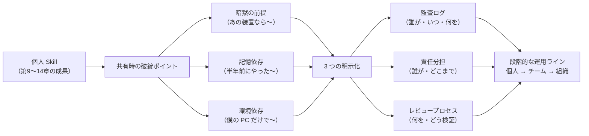
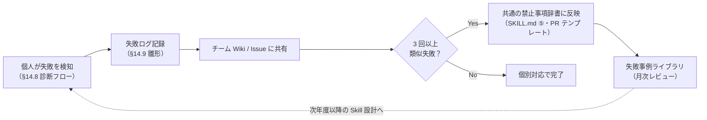

# 第15章　運用設計と組織導入（終章）

> **本章の到達目標**
> - 個人で作った Skill を**チーム・研究室・組織**で運用に乗せるための最小限の設計を持てる
> - **監査ログ・責任分担・レビュープロセス**の 3 点セットを、書籍の合格ラインを崩さない範囲で軽量に導入できる
> - 個人／チーム／組織の 3 レイヤで、第12章 15 項目・第14章 20 項目・第14章クイックゲート 8 項目の**運用配分**を決められる
> - 「**深追いしない**」原則を守り、本書の合格ライン（Skill を作る・検証する・失敗から学ぶ）を維持したまま組織展開する

**扱うこと**：個人 Skill → チーム運用 → 組織導入の段階設計。監査ログ・責任分担・レビュープロセス・失敗共有・ライセンス。第12〜14章のチェックリスト運用配分。研究室規模（〜10人）を中心に、ARIM のような施設運用にも触れる。
**扱わないこと**：企業レベルの本格的な MLOps／SecOps／ガバナンスフレームワーク（NIST AI RMF・ISO/IEC 42001 等の詳細）、AI ベンダー契約交渉、法的責任論、AI 倫理審査。本章はこれらへの**入り口**を示すに留め、深追いはしません。

> [!NOTE]
> 本章は**終章・軽め**の位置づけです。第14章までで本書の合格ライン（動く・検証済み・再現できる Skill を作れる）は達成済み。本章はそれを "**個人から周囲へ広げるとき**" に破綻させないための最小限の設計を扱います。

---

## 15.1　なぜ「運用設計」が独立の章になるのか

第9〜11章で Skill を作り、第12章で検証し、第13章でテンプレート化し、第14章で失敗パターンを整理しました。ここまでは**個人が独立に完遂できる**タスクでした。しかし現場では、Skill は次のような形で**他者と接触**します。

- 研究室内で他のメンバーに Skill を共有する
- 共同研究者に Skill 出力を渡す
- 論文の supplementary として Skill 一式を公開する
- 施設（ARIM のような共用設備）で Skill が装置間を移動する
- 学生の卒業後に Skill が研究室に残る

この "**他者との接触**" が起きた瞬間、**個人の内部だけで通用した規律**（暗黙の前提・記憶・環境）が破綻します。これを防ぐのが本章の主題です。



---

## 15.2　運用の 3 レイヤ

本章では運用を **3 レイヤ**に分けて考えます。それぞれで**何を明示化するか**、そして**第12〜14章のチェックリストをどう配分するか**を決めます。

### レイヤ 1：個人（〜1 人）

**特徴**：自分ひとりで完結する。共有・引き継ぎがない。
**運用の重点**：日常のクイックゲートで自己規律を保つ。ただし**将来の自分**への引き継ぎは前提にする（半年後の自分は他人と同じ）。

| 項目 | 運用 |
|---|---|
| チェックリスト | 第14章 §14.7 **最小版クイックゲート 8 項目** を日常運用 |
| 出荷前 | 論文投稿・共有時のみ、第12章 15 項目 + 第14章 20 項目 = **35 項目フルレビュー** |
| 監査 | Skill 実行の `provenance.json` と Notebook 版管理のみ（git commit） |
| 責任 | 全て自分 |
| レビュー | セルフレビュー（時間を空けて） |

### レイヤ 2：チーム（2〜10 人・研究室規模）

**特徴**：Skill が複数人で使われる／改変される。共通の禁止事項辞書が必要。
**運用の重点**：**誰が Skill を維持するか**を明示。失敗ログの共有。共通の禁止事項辞書。

| 項目 | 運用 |
|---|---|
| チェックリスト | 個人はクイックゲート、チーム共有 Skill は**35 項目フルレビュー**を PR 前に |
| 出荷 | 研究室内 registry（例：内部 GitHub Enterprise 上の org）で Skill 公開時にフルレビュー |
| 監査 | Skill 実行の `provenance.json` + 共通の実行ログ集約（後述の**軽量監査ログ**） |
| 責任 | Skill maintainer（1 名）+ レビュアー（1 名）を明示。**RACI マトリクス**（後述）で管理 |
| レビュー | PR ベースのピアレビュー。第12章 15 項目 + 第14章 20 項目のチェックを PR テンプレートに |
| 失敗共有 | §14.9 失敗ログを研究室 Wiki / Issue で共有。**繰り返し発生する失敗**を共通の禁止事項辞書に反映 |

### レイヤ 3：組織（10 人〜・施設・部門・全学）

**特徴**：Skill が装置間・研究室間を移動する。ライセンス・契約・データ分類制度が絡む。
**運用の重点**：**契約と分類制度**が上位にある。個々の Skill 品質は各研究室に委任。

| 項目 | 運用 |
|---|---|
| チェックリスト | 研究室単位で運用委任。組織は**メタ規約**（監査ログ形式・データ分類ラベル・AI 契約範囲）を定義 |
| 出荷 | 施設内 registry。装置間移動時は**装置カテゴリ差分**（第13章 §13.9 の 5-step）を必ず適用 |
| 監査 | 組織横断の監査ログ集約（後述）。**保存期間・アクセス制御**の規約 |
| 責任 | 施設管理者 + 各研究室 PI + Skill maintainer の三層構造 |
| レビュー | 研究室レビュー + 施設側の定期監査（年 1〜2 回） |
| 失敗共有 | 組織全体の**失敗事例ライブラリ**。匿名化して共有 |

> [!TIP]
> 3 レイヤは**組織成長に応じた選択肢**であり、必ず全てを実装する必要はありません。本書の合格ラインは**レイヤ 1（個人）まで**。レイヤ 2・3 は必要になったときに参照してください。深追いは第Ⅵ部の資料（付録・外部リソース）に譲ります。

---

> [!IMPORTANT]
> **データ機密性ゲート（全レイヤ共通・第8章 §8.11・第11章 §11.2・第13章 §13.9）**：どのレイヤでも、Agent に渡してよいのは `agent_visible_metadata`（匿名化 `sample_id`・装置カテゴリ・非機密条件）のみです。raw 絶対パス・課題番号・共同研究先名・装置PCアカウント・未公開プロセス条件などは `private_provenance` に隔離し、Skill 出力・Agent チャット応答・共有ログ・監査ログ集約・PR には**一切載せない**でください。未公開・機密データを扱う Skill は `~/.copilot/skills/` に配置し、リポジトリに含めません。

## 15.3　監査ログ：軽量版と本格版

「監査ログ」というと重いイメージがありますが、本書の合格ライン維持のためには**極めて軽量**な形で十分です。

### 15.3.1　軽量版：Skill provenance ＋ Notebook 版管理

個人・小規模チームでは、次の 2 つの組み合わせで十分な監査性を実現できます。

1. **Skill 出力の `provenance.json`**（第14章 §14.7 ⑯で必須化済み）
   - `provenance.input_sha256` / `skill_version` / `run_datetime_utc` / `package_versions` / `random_seed`（乱数使用時）
   - **マルチモーダル Skill の場合**は加えて `provenance.modality_inputs`（各モダリティの `input_sha256` + `skill_version` 連鎖・第11章 canonical）
2. **Notebook の git commit**（Skill を呼び出した Jupyter Notebook 全体をコミット）
   - `nbstripout` で出力セルを除外するか、`nbdime` で差分管理

**追加コスト**：通常運用では追加ツールほぼ不要（Skill と git があれば済む）。

> [!IMPORTANT]
> **通常運用ログと失敗検知時ログは別物**です。上記 2 点は**平常運転の監査ログ**であり、失敗を検知したら第14章 §14.9 の**失敗時スナップショット**（`input_manifest.yaml` / `references/params.yaml` / `requirements.txt` / failure log ）を追加で必ず作成してください。「provenance.json があるから失敗調査は要らない」は誤りです。
>
> | 状況 | 記録内容 |
> |---|---|
> | 平常運転 | `provenance.json` + Notebook git commit |
> | 失敗検知時 | 上記 + 第14章 §14.9 の軽量スナップショット + 失敗ログ |

### 15.3.2　中規模：Skill 実行ログの集約

チーム 10 人規模になったら、Skill 実行ログを軽量に集約すると失敗検知が早まります。

```markdown
# skill-run-log の最小フィールド（第7〜11章 provenance と一致）

- run_id                    : UUID
- skill_name                : 実行された Skill 名
- skill_version             : Skill のバージョン（provenance と一致）
- user                      : 実行者（ORCID / GitHub username 推奨）
- run_datetime_utc          : 実行時刻 UTC（provenance と一致）
- provenance_input_sha256   : 入力データの SHA-256（provenance.input_sha256 と一致）
- package_versions          : 主要パッケージバージョン（provenance と一致・辞書 or hash）
- output_sha256             : 出力データの SHA-256
- status                    : ok / error / warning
- error_message             : エラー時のみ
- modality_inputs_sha256    : マルチモーダル時のみ。各モダリティの input_sha256 を列挙（provenance.modality_inputs と一致）
```

**実装**：Skill の最終ステップで append-only ファイル（`~/.arim/skill-run-log.jsonl`）に 1 行 JSON を書き足すだけ。集約は cron で organization の共有ストレージにコピー。

**追加コスト**：初期実装 1 日程度。以降ゼロ。

### 15.3.3　組織規模：施設監査ログ

組織全体では、上記の **skill-run-log を各研究室から施設側に集約**します。ここから先は本書の範囲外なので、参考資料として次を挙げるに留めます。

- **AI RMF (NIST)**：AI Risk Management Framework の一般的な考え方[脚注2]
- **ISO/IEC 42001**：AI 管理システムの標準[脚注3]
- 各機関のデータマネジメント計画（DMP）テンプレート

本書ではここまで深追いしません。

---

## 15.4　責任分担：RACI マトリクスの軽量運用

責任分担というと**プロジェクトマネジメント**の重い枠組みを想起しがちですが、本書のスコープでは**極めて軽量な RACI**で十分です。

### 15.4.1　RACI とは（30 秒解説）[脚注1]

| 略字 | 意味 | 役割 |
|:---:|---|---|
| **R** | Responsible | 実行する人（手を動かす） |
| **A** | Accountable | 最終責任を持つ人（承認する） |
| **C** | Consulted | 事前に意見を求める人 |
| **I** | Informed | 結果を知らせる人 |

**原則**：1 タスクに **A は必ず 1 人**。R は複数可。C・I は必要に応じて。

### 15.4.2　Skill 運用の最小 RACI（研究室規模）

| タスク | Skill maintainer | レビュアー | PI | 施設管理者 | 利用者（実行者） |
|---|:---:|:---:|:---:|:---:|:---:|
| Skill の設計・実装 | **R,A** | C | I | - | - |
| Skill のレビュー・承認 | R | **R,A** | I | - | - |
| Skill の実行（日常運用） | I | - | - | - | **R,A** |
| Skill 出力の解釈・論文化 | C | C | **R,A** | - | R |
| 失敗ログの記録 | R | C | **A** | I | **R** |
| 装置間移動（施設内） | R | C | **A** | **R** | I |
| 装置間移動（施設外） | R | C | **R,A** | I | I |

**読み方**：例えば「Skill の実行（日常運用）」は、実際に Skill を回す**利用者が Responsible + Accountable**（実行結果に責任を持つ）、maintainer は Informed（実行の事実を知らせる）。利用者が maintainer 本人である場合は列を統合してかまいません。

> [!TIP]
> **原則の確認**：全タスクに A が 1 人ずつ入っているかを必ずチェックしてください。A が空欄のタスクは**責任の空白**であり、失敗時に誰も対応しない状態を招きます。

### 15.4.3　個人運用の RACI

個人運用では**全ての A は自分**ですが、**将来の自分**を第三者として扱うと有用です。

| タスク | 現在の自分 | 将来の自分（半年後） |
|---|:---:|:---:|
| Skill の設計・実装 | **R,A** | I |
| Skill 出力の解釈・論文化 | **R,A** | I |
| Skill の再利用・修正 | I | **R,A** |
| 失敗ログの記録 | **R,A** | C |

**運用の要点**：現在の自分が **I** の欄を書く時、"半年後の自分" が知りたい情報を書き残す。これは第7章⑥再現性条件 + 第14章 §14.9 失敗ログの実運用に相当します。

---

## 15.5　レビュープロセス：PR テンプレート

チームレベルでは、Skill 変更を **Pull Request (PR)** で管理し、第12章 15 項目 + 第14章 20 項目のチェックを PR テンプレートに埋め込むのが最小コストで最大効果です。

### PR テンプレート雛形

```markdown
## 変更概要
- Skill 名: <skill-name>
- 変更種類: [ ] 新規 / [ ] 修正 / [ ] リファクタ / [ ] ドキュメント
- 影響範囲: <affected users / analyses>

## 事前チェック（Skill maintainer 記入）

### 第12章：実行後検証（15 項目のうち関連するもの）
- [ ] ①物理的妥当性チェック済み
- [ ] ②外れ値検出済み
- [ ] ③再現性チェック済み（同一入力で bit-exact 一致）
- [ ] ④既存手法との一致確認済み
- [ ] ⑫MCP 応答の validate_output.py 通過（第10章利用時）
- [ ] ⑭ provenance.json に `provenance.input_sha256` → `skill_version` → `run_datetime_utc` → `package_versions` の連鎖が完備（マルチモーダルは `provenance.modality_inputs` も）

### 第14章：失敗パターン（20 項目のうち関連するもの）
- [ ] ①〜⑤循環設計（独立参照点 3 層のうち最低 1 層）
- [ ] ⑥〜⑩データ流出・評価リーク（分類ラベル・分割単位）
- [ ] ⑪〜⑮ハルシネーション（引用トレース・RANGES・スキーマ強制）
- [ ] ⑯〜⑳再現性欠如（package pin・乱数種・bit-exact）

## レビュアー確認
- [ ] SKILL.md の 6 要素（第7章）が揃っている
- [ ] `references/output-schema.json` が更新されている
- [ ] `tests/regression/` に最小再現テストが追加されている
- [ ] `CHANGELOG.md` にセマンティックバージョニング準拠のエントリがある

## 失敗ログ参照
関連する過去の失敗ログ: #issue-XX, #issue-YY
```

### 実運用のポイント

- **チェック項目の全部にチェックが要る必要はない**：新規 Skill か軽微な修正かで運用を分ける
- **レビュアーは 1 人でよい**：レイヤ 2 の想定規模（研究室 5〜10 人）では厚すぎるレビューは形骸化する
- **CI 化できるものは自動化**：`pytest` / `black` / `ruff` / スキーマ検証は CI で自動判定に

---

## 15.6　失敗共有：チーム学習ループ

第14章 §14.9 で失敗ログの個人記録を扱いました。チームレベルでは、これを**組織的学習**に変えるループが必要です。



### 共通の禁止事項辞書（例）

チームで蓄積すべき禁止事項の例です。**繰り返し発生する失敗**を反映していきます。単なる語リストではなく、**適用範囲（scope）・重大度（severity）・許容文脈（allowed_context）**を明示することで、機械検査時の false positive を抑えます。

```yaml
# common_forbidden.yaml
version: 1
rules:
  # ===== locked forbidden operation set（第9〜11・14章共通） =====
  # Skill 出力・Notebook・Markdown レポート・Agent チャット応答のいずれにも含めない
  - id: F001
    pattern: "物質同定"
    scope: chat_response_and_skill_output   # AI 応答 + Skill 構造化出力 の両方
    severity: fatal
    allowed_context: []
    source_chapter: "9-11, 14"
    remediation: "「候補」「参考ピーク」等の中立語に置き換え。同定は分析者が行う"

  - id: F002
    pattern: "ピーク帰属"
    scope: chat_response_and_skill_output
    severity: fatal
    allowed_context: []
    source_chapter: "9-11, 14"
    remediation: "「参考ピーク位置」「帰属候補（分析者確定）」等に置き換え"

  - id: F003
    pattern: "相同定"
    scope: chat_response_and_skill_output
    severity: fatal
    allowed_context: []
    source_chapter: "13 §13.5, 14"
    remediation: "回折型テンプレートは派生量 method 明示のみ。相同定は分析者"

  - id: F004
    pattern: "Rietveld auto|Rietveld 自動|自動 Rietveld|自動組成推定|自動相確定"
    scope: chat_response_and_skill_output
    severity: fatal
    allowed_context: []
    source_chapter: "13 §13.5, 14 §14.7 ⑮"
    remediation: "Rietveld 解析は分析者が手動で実施。Skill は数値抽出まで"

  # ===== 語彙レベル・応答本文限定の禁止 =====
  - id: F010
    pattern: "妥当"
    scope: chat_response
    severity: warn
    allowed_context:
      - "PR テンプレート内: 物理的妥当性チェック"
      - "章末ワーク: 妥当性の議論"
    source_chapter: "14"
    remediation: "「文献一致範囲内」「±X% 以内」等、定量化した語で書き換え"

  # ===== 設計禁止（SKILL.md ⑤ に反映） =====
  - id: D001
    pattern: "AI パラメータ推論"
    scope: skill_md_design
    severity: fatal
    allowed_context: []
    source_chapter: "14 §14.7 ⑲"
    remediation: "パラメータは YAML/JSON で明示。AI に決めさせない"

  - id: D002
    pattern: "行単位ランダム分割"
    scope: skill_md_design
    severity: fatal
    allowed_context: []
    source_chapter: "14 §14.7 ⑨"
    remediation: "群単位分割（試料 ID / バッチ ID 単位）に変更"

  - id: D003
    pattern: "全データ前処理 fit"
    scope: skill_md_design
    severity: fatal
    allowed_context: []
    source_chapter: "14 §14.7 ⑩"
    remediation: "train データのみで fit、val/test には transform のみ"

  - id: D004
    pattern: "generic RANGES 未定義"
    scope: pr_review
    severity: warn
    allowed_context: []
    source_chapter: "14 §14.7 ⑬"
    remediation: "自装置固有の RANGES を明示するか、汎用範囲を明記"
```

**scope の使い分け**：

| scope | 適用箇所 | 検査方法 |
|---|---|---|
| `chat_response_and_skill_output` | AI エージェント応答本文 **AND** Skill 構造化出力 | ランタイムフィルタ + 出力スキーマ enum / validate_output.py |
| `chat_response` | AI エージェントの応答本文のみ | ランタイムフィルタ or 事後レビュー |
| `skill_md_design` | SKILL.md ⑤「禁止事項」節 | PR 時に静的チェック |
| `pr_review` | PR テンプレートの確認項目 | レビュアーが目視確認 |

> [!TIP]
> **SKILL.md ⑤（第13章）** は `common_forbidden.yaml` のうち `scope: skill_md_design` かつ `severity: fatal` のルールを参照します。**PR テンプレート（§15.5）** は `scope: pr_review` および `chat_response` を確認項目に含めます。これで**一元化された禁止事項**が、Skill 設計時とレビュー時の両方に効きます。

これを Skill テンプレート（第13章）と PR テンプレート（§15.5）から**参照**することで、チーム全体で守るべき禁止事項が一元化されます。

---

## 15.7　ライセンスと公開

チームレベル・組織レベルで Skill を公開する場合、ライセンスの選択が必要になります。本書では**深追いしません**が、最小限のガイドを示します。

| 想定用途 | 推奨ライセンス | 理由 |
|---|---|---|
| 論文 supplementary | MIT / CC-BY 4.0 | 再利用容易・帰属明示 |
| 研究室内共有 | 内部方針に従う（多くの場合ライセンス不要） | 契約関係で処理 |
| 施設共有（ARIM 等） | 施設のポリシーに従う | 利用規約で処理 |
| コミュニティ公開 | MIT / Apache 2.0 | 商用利用可・特許明示（Apache） |

> [!WARNING]
> **AI ベンダー契約の学習除外条項**と**公開ライセンス**と**データ機密性**は**三者三様の別問題**です。
>
> - 学習除外契約：入力が **AI モデルの学習には使われない**という条件（例：Copilot Enterprise・Azure OpenAI の該当プラン）
> - 公開ライセンス：Skill コードや成果物を**第三者が再利用できる法的枠組み**
> - データ機密性：`private_provenance` を**外部送信・公開してよいかどうか**は別途判断が必要
>
> 学習除外契約下で作った Skill を公開する場合でも、**契約書上の "公開範囲" が制限されていないか**を必ず確認してください。**学習除外は「機密データを外部送信・公開してよい」という許可ではありません**。公開前に `agent_visible_metadata` と `private_provenance` の分離が徹底されているか、匿名化 `sample_id` のみが公開対象に含まれているかを確認してください（詳細は所属機関の法務・産学連携部門へ）。

---

## 15.8　「深追いしない」原則

本章では意識的に**深追いを避けています**。理由と、深追いが必要になったときの入り口を示します。

### 深追いしない理由

1. **本書の合格ラインは個人の Skill 完遂**：組織運用は "できたら望ましい" ではあるが、合格ラインではない
2. **組織ごとに規約が違う**：一般化した詳細指針は、実務では役に立たないことが多い
3. **AI 契約・ガバナンスは急速に変化**：本書執筆時点の情報は 1〜2 年で陳腐化する

### 深追いが必要になったときの入り口

| トピック | 入り口 |
|---|---|
| MLOps 全般 | [MLOps Community](https://mlops.community/) [脚注4] |
| AI ガバナンス | [NIST AI Risk Management Framework](https://www.nist.gov/itl/ai-risk-management-framework) [脚注2] |
| AI 管理システム | ISO/IEC 42001（2023 年発行）[脚注3] |
| 研究データ管理 | 所属機関の DMP（Data Management Plan）ガイドライン |
| 学習除外契約 | Copilot Enterprise / Azure OpenAI 各種契約書、所属機関の情報セキュリティ部門 |
| 公開データポータル | ARIM データポータル（https://nanonet.go.jp/data_service/page/textbook.html）[脚注5] |

---

## 15.9　本書の合格ラインの再確認

本書の合格ラインは第1章で定義した「**自分の実験データに対応する Skill を作れる**」でした。第14章までで**個人がその合格ラインに到達する道筋**を示しました。

本章（第15章）は、その合格ラインを**個人から周囲へ持ち出すとき**の最小設計を示しました。**運用の 3 レイヤ**、**監査ログの軽量版**、**RACI マトリクス**、**PR テンプレート**、**失敗共有ループ**の 5 点セットです。

これらを組織の成長ペースに合わせて段階的に導入すれば、**深追いすることなく**組織展開できます。それ以上の詳細（本格的な MLOps・AI ガバナンス）は、必要になったときに §15.8 の入り口から辿ってください。

> [!IMPORTANT]
> **合格ラインを崩さないこと**が最優先です。組織運用のために Skill の品質基準を緩めるのは本末転倒です。組織側の設計が Skill 品質と衝突する場合は、まず**組織側を調整**してください（例：学習除外契約の確認・データ分類制度の整備）。

---

## 章末ワーク

1. **自分の運用レイヤを判定**：現在の自分がレイヤ 1〜3 のどれに該当するか判定し、**今後 6 か月で移行しそうな上位レイヤ**を予想しなさい。移行時に**追加で必要になる 3 つの明示化**（監査ログ／責任分担／レビュー）を列挙しなさい。
2. **RACI マトリクスを埋める**：自分の研究室で 1 つの Skill を想定し、§15.4.2 の RACI マトリクスを実名（またはロール名）で埋めなさい。誰も **A** が付いていないタスクがあれば、それは**責任の空白**です。
3. **PR テンプレート試運用**：§15.5 の PR テンプレートを自分の環境用にカスタマイズし、**過去に自分が書いた Skill の変更 1 件**をこのテンプレートに沿ってレビューしなさい。埋まらない項目があれば、それが**運用の欠落点**です。
4. **共通禁止事項辞書の起点**：自分の研究室で 3 か月以内に発生した（または発生しそうな）失敗を 3 件挙げ、§15.6 の `common_forbidden.yaml` に追加すべきエントリを 3 件書きなさい。
5. **合格ラインの自己判定（本書総括）**：本書全体を振り返り、以下 3 点を自己判定しなさい。
   - (a) 自分の実験データに対応する Skill を**動く**状態で作れるか（第1〜9章）
   - (b) その Skill を**検証済み**状態にできるか（第12章 15 項目）
   - (c) その Skill を**再現できる状態**（失敗を検知・記録し、再発防止できる状態）に保てるか（第14章 20 項目 + §14.9 失敗ログ）
   3 つとも Yes なら**本書の合格**です。No があれば、対応する章に戻ってください。

---

## 本章のまとめ

- 運用は **3 レイヤ**（個人／チーム／組織）で段階的に設計する
- **監査ログの軽量版**（Skill provenance + Notebook git commit）で個人・小規模チームは十分
- **RACI マトリクス**で責任分担を明示。個人でも "将来の自分" を第三者として扱うと有効
- **PR テンプレート**に第12章 15 項目 + 第14章 20 項目を埋め込むと、レビューが形骸化しない
- **失敗共有ループ**で個人の失敗を組織学習に変える。共通の禁止事項辞書は SKILL.md ⑤ と PR テンプレートから参照
- **「深追いしない」原則**：本書の合格ラインは個人 Skill の完遂。組織運用は "できたら望ましい"
- 本書の合格ライン：Skill が**動く・検証済み・再現できる**（失敗を検知・記録できる）の 3 拍子

> **本書のまとめ**：AI エージェント時代の分析は、Skill を**作る・検証する・失敗から学ぶ**の 3 段構えで、個人が独立に完遂できるようになりました。本書はその道筋を、ARIM のような装置分析の現場に合わせて具体化しました。ここから先は、あなたの実験データと、あなたの Skill が主役です。深追いは必要になったときに、必要な部分だけ、外部リソースを参照してください。

---

## 参考資料

- [脚注1] [RACI matrix (Wikipedia)](https://en.wikipedia.org/wiki/Responsibility_assignment_matrix) - RACI マトリクスの起源と使い方の概説。本書では小規模研究室運用に合わせて簡略化
- [脚注2] [NIST AI Risk Management Framework](https://www.nist.gov/itl/ai-risk-management-framework) - AI Risk Management Framework の一般的な考え方。組織レベル運用の入り口
- [脚注3] [ISO/IEC 42001:2023 - Artificial intelligence management system](https://www.iso.org/standard/81230.html) - AI 管理システムの国際標準（2023 年発行、有償規格）
- [脚注4] [MLOps Community](https://mlops.community/) - MLOps 全般の実践知の入り口
- [脚注5] [ARIM データポータル](https://nanonet.go.jp/data_service/page/textbook.html) - 本書全体の主要参照先。装置カテゴリ・データ構造・共通ボキャブラリ

### 関連章と運用への落とし込み

- 本書 15 章分の到達点は、Skill プロジェクトの `README.md` に**35 項目セルフレビュー + 8 項目クイックゲート**を貼り、`common_forbidden.yaml` を運用することで、日常運用に落とし込める
- 深追いが必要になった場合は §15.8 の入り口テーブルを起点とし、本書ではこれ以上追跡しない
