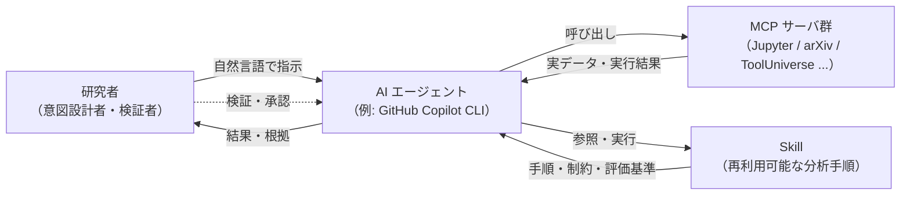

# 第1章 vol-01 の最小復習

> **本章の使い方**
> - **vol-01 完読者**：この章は読み飛ばして第2章に進んでください。用語の再確認だけしたい方は §1.9 のチェックリストを参照
> - **vol-01 未読者**：ここで最低限の前提を身につけ、第2章以降に進めます。詳細は必要になった時点で vol-01 の該当章に戻ってください
>
> **この章の到達目標**
> - vol-01 で扱った 5 つの中核概念（AI エージェント／MCP／Skill／データ契約／provenance）を最小限で説明できる
> - vol-02 のハンズオン標準環境が動くところまで、判断できる
> - vol-01 で扱った 4 つのリスク（循環設計・データ漏洩・ハルシネーション・再現性欠如）を意識してコードを書ける
>
> **この章で扱わないこと**
> - 各概念の詳細な設計論・失敗事例（vol-01 の該当章を参照）
> - 環境構築の手順そのもの（vol-01 第4章 / 付録B / 付録C）
> - Skill テンプレートのフィールド完全定義（vol-01 付録A）

---

## 1.1 この章の位置づけ

vol-02 は vol-01 の続編ですが、**単体でも読み進められる**ように設計しています。vol-01 で扱った概念のうち、vol-02 で当然のように使うものだけを、この第1章に圧縮しました。

- **完読推奨**：ただし、必須ではありません
- **参照先**：vol-01 の該当章・付録を明示するので、必要な時にだけ戻れば OK
- **分量**：10〜15 ページ（vol-01 の第3・4・7・8・14章の要点抽出）

> [!NOTE]
> vol-01 は AI エージェントで実験データ分析を行う入門書として書かれています。vol-02 は、その上に **統計・機械学習の厚み**（scikit-learn と PyMC）を積み上げるための本です。したがって「エージェントに Skill を作らせる」文化そのものは vol-01 で確立済みという前提で話を進めます。

> [!NOTE]
> **notation note（用語表記の連続性）**：vol-01 では英語表記 "AI Agent" を主に用いていましたが、vol-02 以降は日本語表記「AI エージェント」または「エージェント」を canonical とします（両者は同一概念）。したがって：
>
> - vol-01 の "AI Agent" ≡ vol-02+ の「AI エージェント」≡「エージェント」
> - 図表・コード内では簡潔さのため「Agent」も併用可（英語ラベル）
> - Skill / MCP / Human-in-the-loop 等の技術用語は英語表記のまま統一（vol-01 と共通）

---

## 1.2 3 人の登場人物：AI エージェント／MCP／Skill

vol-01 で最も重要な三者関係を、まず 1 枚の図に圧縮します。



### AI エージェント

**大規模言語モデル（LLM）を核に、道具を使って複数ステップの作業を実行する存在**です。vol-01・vol-02 では **GitHub Copilot CLI** を標準としますが、Claude Code、Cursor 等の他エージェントでも本書のパターンは概ね転用可能です。

エージェントの本質的特徴は次の 3 つです。

1. **自然言語で指示できる**：「このスペクトルの校正曲線を作って」といったレベルで動く
2. **道具（Tool）を選んで使う**：ファイル読み、コード実行、Web 検索などを状況に応じて呼び出す
3. **文脈を保って反復する**：前のセルの結果を見て次のセルを書ける

### MCP（Model Context Protocol）

**AI エージェントと外部の道具・データソースをつなぐ共通コネクタ規格**です。「USB-C が周辺機器の共通端子」と同じ発想で、AI と道具の間の共通端子として設計されています[^0-1]。

本書で頻出する MCP サーバ：

| MCP サーバ | 用途 | vol-02 での主な役割 |
|---|---|---|
| **Jupyter MCP** | JupyterLab のノートブックをエージェントから読み書き・実行 | ほぼすべての章の実行基盤 |
| **arXiv MCP** / **Paper Search MCP** | 論文検索・取得 | 手法選定・引用（vol-01 第10章と共通） |
| **ToolUniverse MCP** | 科学計算ツール群（数百）を統一 API で | 化学式計算・単位変換等の補助 |
| **FastMCP** | Python で自作 MCP を作るフレームワーク | 組織共有パターン（第16章） |

vol-02 で **新たに MCP を導入する必要はありません**。vol-01 の環境をそのまま使い、scikit-learn / PyMC は **Jupyter MCP 経由で Python コードとして実行**します。

### Skill

**分析手順を「再利用可能な形にまとめたもの」**です。単なるスクリプトと違うのは、以下を明示的に持つことです。

- **入力仕様**：どんなデータを受け付けるか
- **出力仕様**：何を返すか
- **制約条件**：どんな時は動かさないか（例：欠損率 50% 超は拒否）
- **評価基準**：成功をどう定義するか
- **手順本体**：処理の実装
- **再現性メタデータ（provenance）**：入力ハッシュ・バージョン・乱数種等

Skill を作ることで、エージェントは「毎回同じ流儀」で分析でき、結果を検証・再現できます。**vol-02 の本線は 2 本の柱と 1 つの発展課題**です：**Pillar 1 = scikit-learn Skill**、**Pillar 2 = PyMC ベイズ Skill**、そして **Advanced Capstone = 階層モデルへの拡張**。合格ラインは「柱の 2 つの Skill を自力で作れる」ことです。

> [!TIP]
> Skill の物理形態は、vol-01 では `SKILL.md` + `references/` + `tests/` の Markdown/Python ディレクトリでした。vol-02 でも同じ形を使います。**Skill = 特定のフォルダ構造**と覚えて OK。

---

## 1.3 ハンズオン標準環境

vol-01 で構築した環境をそのまま使います。**未構築の方は vol-01 第4章 §5.3〜§5.6 を参照**してください。

### 標準環境の 5 点セット

| # | 要素 | バージョン（vol-01 準拠） | 役割 |
|---|---|---|---|
| 1 | Python | 3.11 以上 | 分析エンジン |
| 2 | JupyterLab | 4.4.1 | ノートブック実行環境 |
| 3 | GitHub Copilot CLI | 最新版 | AI エージェントアプリ／MCPホスト |
| 4 | Jupyter MCP Server | 0.14.4 | エージェント⇔JupyterLab の橋 |
| 5 | Node.js | 22 以上 | Copilot CLI の実行基盤 |

インストールコマンドの要点（**下記は主要コマンドの確認用**であり、完全な手順ではありません。venv 作成／有効化、`uv` 導入、`ipykernel install` 等の全手順は vol-01 第4章 §5.3〜§5.6 を参照）：

```bash
# Python 環境（venv 作成・有効化は vol-01 ch04 参照）
pip install jupyterlab==4.4.1 jupyter-collaboration==4.0.2 jupyter-mcp-tools ipykernel pycrdt
pip install pandas numpy scipy matplotlib

# uv/uvx（未導入なら pipx 等で先に入れる。詳細は vol-01 ch04）
# 例: pipx install uv

# Copilot CLI
npm install -g @github/copilot

# JupyterLab 起動（トークンは環境変数で管理）
export JUPYTER_TOKEN=$(python -c "import secrets; print(secrets.token_urlsafe(32))")
jupyter lab --port 8888 --IdentityProvider.token "$JUPYTER_TOKEN"

# Copilot CLI に Jupyter MCP を登録
copilot mcp add jupyter \
  --env JUPYTER_URL=http://localhost:8888 \
  --env JUPYTER_TOKEN="$JUPYTER_TOKEN" \
  --env ALLOW_IMG_OUTPUT=true \
  -- uvx --from 'jupyter-mcp-server==0.14.4' jupyter-mcp-server
```

### vol-02 で追加するパッケージ

vol-02 では以下を **必要な章に入ってから** 追加インストールします。第1章時点ではまだ不要です。

- 第4〜8 章：`scikit-learn`, `seaborn`, `shap`, `pdpbox`（既にある場合が多い）
- 第10 章：`pymc`, `arviz`
- 第10 章末以降：`numpyro`, `jax`

> [!WARNING]
> `pymc` は依存関係が重く、既存環境と衝突しやすいライブラリです。**新しい仮想環境を作って隔離する**ことを強く推奨します（`python3 -m venv .venv-vol02` など）。vol-01 環境を汚さないよう、第1章の時点でこの方針だけ意識してください。

> [!IMPORTANT]
> **JupyterLab の kernel との整合**：`.venv-vol02` を作って `pymc` を入れても、JupyterLab が vol-01 の venv 上の kernel で起動している場合、Notebook から `import pymc` はできません。新 venv 側で `pip install ipykernel` 後、`python -m ipykernel install --user --name arim-vol02 --display-name "ARIM vol-02 (PyMC)"` で kernel を登録し、Notebook 右上の kernel 選択で `ARIM vol-02 (PyMC)` に切り替えてください。

---

## 1.4 データ契約：Skill の入出力を約束する

vol-01 第8章の中核概念です。**Skill に渡すデータと Skill が返すデータの「約束事」を明示する**——これがデータ契約です。

### なぜ必要か

- エージェントは「なんとなく渡されたデータ」を自由に解釈してしまう
- 装置が変わると列名・単位・スケールが変わり、同じ Skill が誤動作する
- 契約を明文化しておかないと、**エラーが「途中の変な結果」として現れて発見が遅れる**

### vol-01 の 7 要素（工程ベース、vol-01 第8章 §9.2）

vol-01 のデータ契約は **入力データを Skill に渡すまでの 7 工程**を約束事として明文化する枠組みです。スキーマ（列名・単位）はこのうち一部にすぎません。

| # | 工程 | 契約する主な内容 |
|---|---|---|
| ⓪ | **入手・由来記録** | 生ファイルパス、SHA-256、装置ID、測定日時。**生ファイル編集は fatal** |
| ① | **読込** | 対応する装置ファイル形式・エンコーディング・ヘッダ位置 |
| ② | **メタデータ結合** | 本文とメタデータをどの列で紐付けるか |
| ③ | **単位統一** | 内部表現の単位（例：`wavelength_nm`）。**未登録の暗黙変換は fatal** |
| ④ | **欠損・外れ値・飽和のマーキング** | 除去ではなくフラグ列で残す |
| ⑤ | **品質チェック** | `fatal / warning / flag` の 3 段階（次項） |
| ⑥ | **標準形式化** | Python 内部表現（DataFrame の列構造）と保存形式 |

### 入出力スキーマ（意味の契約、vol-01 §9.10）

上記 7 工程を通した後の「Skill が受け付ける DataFrame の形」を、列名・単位・型・必須性で書き下したものが**入出力スキーマ**です。第1章では最小項目だけ示します（詳細は vol-01 §9.10）：

| 項目 | 例（スペクトル型） |
|---|---|
| **データ型ラベル** | `spectrum` / `timeseries` / `image` / `pattern` / `tabular` / `multimodal` |
| **必須カラム / キー** | `wavelength_nm`, `intensity` |
| **単位** | `wavelength_nm: nanometer`, `intensity: arbitrary` |
| **値域・型** | `wavelength_nm: float, 200-1000`, `intensity: float, >=0` |
| **必須メタデータ** | 装置 ID・測定日時・オペレータ |
| **フォーマット** | CSV（UTF-8, 区切り文字 `,`, ヘッダあり） |

### 品質チェックは 3 段階（fatal / warning / flag）

vol-01 §9.8 のとおり、契約違反は一律 fatal ではありません。

| レベル | 挙動 | 例 |
|---|---|---|
| **fatal** | Skill に渡さず**明示エラーで拒否** | 必須カラム欠落、欠損率 30% 超、必須メタデータ欠落、単位不明 |
| **warning** | 警告ログ付きで渡す | 校正日が古い、点数が推奨範囲外だが動作範囲 |
| **flag** | フラグ列を付けて渡す（Skill 側で判断） | 少数の飽和点、局所的な外れ値、欠損率 5% 程度 |

**閾値（例：欠損率 5% / 30%）は Skill ごとに定義**します。vol-02 では、統計/ML 特有の項目——**分割方針、CV スキーム、標本サイズ下限、階層構造の記述**——が追加されます。第5章で詳しく扱います。

### Skill 側での典型的な使い方

```python
# 疑似コード（vol-01 の Skill 内部より、fatal 判定の例）
def load_and_validate(path: str) -> pd.DataFrame:
    df = pd.read_csv(path)
    required = ["wavelength_nm", "intensity"]
    missing = set(required) - set(df.columns)
    if missing:
        raise ContractViolation(f"必須カラム欠落: {missing}")  # fatal
    na_rate = df["intensity"].isna().mean()
    if na_rate > 0.30:
        raise ContractViolation(f"intensity 欠損率 {na_rate:.1%} 超（fatal 閾値 30%）")
    elif na_rate > 0.05:
        df["intensity_flag"] = df["intensity"].isna()  # flag として残す
    return df
```

**fatal 条件だけを即拒否**し、warning / flag はログ・フラグ付きで下流に流す——これが vol-01 の原則です。「fatal を握りつぶして通してしまう」ロジックが事故のもと。

---

## 1.5 provenance：再現できる形で結果を残す

vol-01 第9・11・12・13章で一貫して使う概念です。**Skill を実行するたびに、その実行の「素性」を記録**します。

### vol-01 の provenance スキーマ（基本形）

```json
{
  "provenance": {
    "input_sha256": "e3b0c44298fc1c149afbf4c8996fb92427ae41e4649b934ca495991b7852b855...",
    "skill_version": "1.2.0",
    "run_datetime_utc": "2026-07-04T02:30:00Z",
    "package_versions": {
      "python": "3.11.9",
      "pandas": "2.2.0",
      "numpy": "1.26.4"
    },
    "random_seed": 42
  }
}
```

| フィールド | 意味 |
|---|---|
| `input_sha256` | 入力ファイルの SHA-256（64 文字の hex） |
| `skill_version` | Skill のバージョン（SemVer） |
| `run_datetime_utc` | 実行日時（UTC、ISO 8601） |
| `package_versions` | 主要ライブラリの版 |
| `random_seed` | 乱数の種 |

**同じ入力と同じ Skill 版で実行したときに、結果差分の原因を追跡できる**——これを目的とした最小情報です（bit 単位の完全一致を保証するわけではありません）。

### vol-02 での拡張

統計/ML では、この基本形だけでは足りません。vol-02 では以下を追加します（付録A で完全スキーマ）：

- `cv_scheme`：交差検証の設計（fold 数・グループ列・shuffle・seed）
- `data_split`：train/val/test 分割の実体（fold ID or index リスト）
- `model_config`：モデル種別・ハイパーパラメータ
- `sampler_config`（PyMC）：chain 数・draws・tune・target_accept
- `backend_config`（PyMC）：`nuts_sampler`, `jax_enable_x64` 等
- `posterior_artifact`：事後分布ファイルの hash
- `diagnostics_summary`：$\hat{R}$ / ESS / divergences のサマリ

こうすることで、**Bayesian 分析でも "同じ結論に到達したか" を後から検証**できます（PyMC/NumPyro/JAX では backend・chain・乱数・ハードウェア差で完全一致しないことがあるため、目的は "再現" ではなく "差分原因の追跡" です）。

---

## 1.6 Human-in-the-loop：AI に判断を丸投げしない

vol-01 第6章の原則を一言で：**「AI エージェントは提案し、最終判断は人間が下す」**。

### 具体的な運用

| 局面 | AI がやること | 人間がやること |
|---|---|---|
| 手順の設計 | 手順候補を提案 | 目的への適合を判断 |
| コード生成 | ドラフトを書く | レビューして受け入れ |
| データの取り込み | 契約チェックを通す | 契約自体を定義 |
| 結果の解釈 | 統計指標を出す | 物理的妥当性を判断 |
| 分岐判断 | 選択肢を列挙 | 選択 |
| 危険操作 | 実行前に確認 | 承認（明示的 yes） |

### vol-02 で特に注意する 2 点

1. **循環設計問題の統計版**：エージェントに「モデル選択の指標も、選択の実行も」両方を任せると、指標を都合よく選ばれるリスクがある。**評価指標は人間が先に決めてから、エージェントに探索させる**（第5章・第8章）
2. **有意 ≠ 意義**：p 値が有意でも、事後分布が集中していても、**物理的に意味があるかは人間が判断する**（第9章・第10章）

### 分析セッション開始前の 3 点チェック（vol-01 第6章）

判断の丸投げを避けると同時に、**入口の権限を絞ります**。統計/ML 分析では、外部 API 呼び出し中に試料 ID や生データが流出するリスクがあります。

- [ ] **不要な MCP を無効化**：セッションで使わない MCP（例：arXiv、Paper Search）は `copilot mcp disable` で切る
- [ ] **Web / 外部 API アクセスを制限**：機密試料を扱う場合、Web 検索を無効化するか、送信内容を承認制にする
- [ ] **秘匿情報のマスク**：JUPYTER_TOKEN・API キー・試料 ID・ログ内パスを、共有前・チャット貼付前にマスクする

> [!IMPORTANT]
> エージェントは「動く分析」を高速に作れます。しかし「**動く ≠ 正しい**」。vol-02 では、動かした後に **統計的に正しいか、物理的に意味があるか** を確かめる工程が随所に出てきます。この工程を省略しないことが、vol-02 全体を通じた最重要ルールです。

---

## 1.7 6 データ型：装置カテゴリを型で捉える

ARIM の装置カテゴリは多岐にわたりますが、分析手順の骨格は **6 つのデータ型**に抽象化できます（vol-01 第2章）。

| データ型 | 代表装置カテゴリ | vol-02 での主な使い方 |
|---|---|---|
| **スペクトル型** | 各種分光、磁気共鳴、質量分析 | PCA・PLS 校正・ピーク面積回帰・ベイズ校正曲線 |
| **クロマトグラム・時系列型** | クロマトグラフ、熱分析、プロセスログ | 分類・外れ検出・反応速度ベイズ推定 |
| **画像・顕微鏡型** | 光学・SEM・TEM | 特徴量抽出後の分類・粒径分布ベイズ推定 |
| **回折・散乱パターン型** | XRD、SAXS、表面分析 | パターンクラスタリング・格子定数ベイズ推定 |
| **表形式・プロセス条件型** | 成膜、リソ、機械/電気/磁気特性 | 物性予測（RF/GBM）・ロット間階層モデル |
| **マルチモーダル統合型** | 上記の組み合わせ | 統合特徴予測・統合ベイズモデル |

**1 つの型で Skill を作れれば、同じ型の他装置に骨格を転用しやすい**——これが 6 データ型抽象化の狙いです。vol-02 でも各章の題材はこの型のどれかにひも付けます。

---

## 1.8 vol-01 で挙げた 4 つのリスク

vol-01 第14章の失敗パターンを 1 段落ずつ圧縮します。vol-02 でも同じリスクは残り、統計/ML 特有のバリエーションが加わります。

### 循環設計問題

「AI に評価指標も結果も任せると、都合の良い指標が選ばれ、都合の良い結論が出る」という自己参照ループ。**評価基準は Skill を設計する時に、人間が先に固定する**（vol-01 第7章／vol-02 第5章）。

### データ漏洩

- 機密データの外部送信（クラウド LLM への流出等）→ vol-01 第6章の運用ルールで予防
- **統計的データリーク**（train/test 間で同一試料が混ざる等）→ vol-02 第8章で扱う。ML/Bayesian 特有の危険

### ハルシネーション

存在しない論文・数式・API が **もっともらしく** 生成される現象。**必ず一次情報で照合する**（vol-01 第10章）。vol-02 では「もっともらしい統計指標」「もっともらしい事前分布」も含まれるので注意。

### 再現性欠如

プロンプト・環境差・乱数で結果が変わる問題。**provenance を必ず残す**（vol-01 第12章／vol-02 拡張スキーマは付録A）。

---

## 1.9 vol-01 復習チェックリスト

以下がすべて「はい」であれば、vol-02 に進めます。「うろ覚え」があれば、vol-01 の該当章に短く戻ってから第2章へ進んでください。

- [ ] **AI エージェント／MCP／Skill** の三者関係を、自分の言葉で 3 分で説明できる（→ vol-01 第3章）
- [ ] **Copilot CLI + JupyterLab + Jupyter MCP** の環境が手元で動く（→ vol-01 第4章）
- [ ] Skill の物理形態（`SKILL.md` + `references/` + `tests/`）を知っている（→ vol-01 付録A）
- [ ] **データ契約**を書ける（自分の実験データに対して 7 要素を埋められる）（→ vol-01 第8章）
- [ ] **provenance** の基本 5 フィールドを言える（→ vol-01 第9・12章）
- [ ] **Human-in-the-loop** の原則を、具体的なコードレビュー行動として説明できる（→ vol-01 第6章）
- [ ] **6 データ型**のうち、自分の主な扱うデータがどれか即答できる（→ vol-01 第2章）
- [ ] **循環設計問題**を、自分の分析で起こりうるパターンとして 1 つ以上挙げられる（→ vol-01 第14章）

---

## 本章のまとめ

- vol-01 の中核は 3 人の登場人物（AI エージェント／MCP／Skill）と、それを支える 5 つの規律（データ契約／provenance／Human-in-the-loop／6 データ型／4 リスク回避）
- vol-02 は **これらをすべて前提として、統計・機械学習の厚みを積み上げる**
- 未読者はこの章のチェックリストを埋め、必要に応じて vol-01 に戻ればよい。**すべての詳細を復習してから進む必要はない**
- 次章（第2章）では、「vol-01 の Skill に何が足りなかったのか」を掘り下げ、統計・ML が必要になる理由を示す

---

## 参考資料

### vol-01 の該当章
- [第4章 AI Agent・MCP・Skill の全体像](../vol-01/chapter-04.md)
- [第5章 環境構築](../vol-01/chapter-05.md)
- [第7章 MCP の安全な使い方](../vol-01/chapter-07.md)
- [第9章 実験データを分析可能な形に整える（データ契約）](../vol-01/chapter-09.md)
- [第10章 Skill 作成ハンズオン①（データ読込）](../vol-01/chapter-10.md)
- [第11章 Skill 作成ハンズオン②（分析）](../vol-01/chapter-11.md)
- [第12章 Skill 作成ハンズオン③（可視化・レポート）](../vol-01/chapter-12.md)
- [第13章 分析結果の検証・評価・レポート化](../vol-01/chapter-13.md)
- [第15章 失敗パターンとリスク管理](../vol-01/chapter-15.md)
- [付録A Skill テンプレート集](../vol-01/appendix-a.md)
- [付録B MCP カタログ](../vol-01/appendix-b.md)

### 外部参考
- Model Context Protocol 公式 <https://modelcontextprotocol.io/>
- GitHub Copilot CLI ドキュメント <https://docs.github.com/copilot/how-tos/copilot-cli>

[^0-1]: vol-01 第3章 §4.4「MCP は USB-C の比喩」参照。
