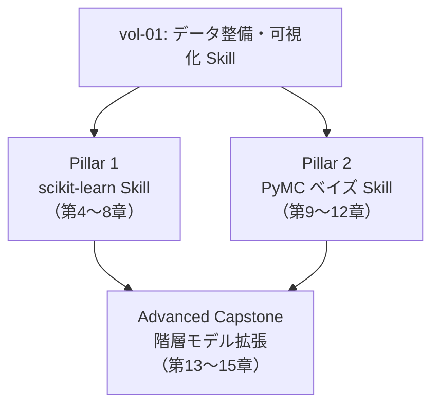

# 第1章 vol-01 の Skill に何が足りないのか

> **本章の到達目標**
> - vol-01 で作れる Skill と、そこで残る「統計・機械学習の空白」を、具体例で説明できる
> - vol-02 が積み上げる 2 本の柱（**scikit-learn Skill / PyMC ベイズ Skill**）と **発展課題（Advanced Capstone: 階層モデル）** の位置づけを言える
> - vol-02 で **扱わないこと**（深層学習・因果推論・ベイズ最適化・生成モデル・Stan の実行環境）を判別できる
>
> **本章で扱わないこと**
> - 統計手法・ML アルゴリズムの実装（第4章以降）
> - vol-01 の失敗事例そのものの詳細（vol-01 第14章）
> - scikit-learn / PyMC の使い分け設計（第3章）

---

## 1.1 vol-01 で作れた Skill と、その先にある壁

vol-01 で読者は、AI エージェント（GitHub Copilot CLI）と Jupyter MCP を組み合わせて、次のような Skill を自分で書けるようになりました。

- **データ読込 Skill**：装置固有ファイル → 標準 DataFrame への変換、契約チェック付き
- **前処理 Skill**：単位統一・欠損マーキング・平滑化・ベースライン補正
- **可視化・レポート Skill**：スペクトル・時系列・パターンの標準プロット、Markdown レポート生成

これらはどれも **「1 試料の情報を欠かさずに整理する」** ための Skill です。データ契約と provenance を書き、Human-in-the-loop で確認する——vol-01 が積み上げた文化はここまで来ています。

しかし、実際の研究の現場では、**分析の目的は「1 試料をきれいに見る」で終わらない**：

- **N 試料を測って**、どのプロセス条件が物性に効いているかを判断したい
- **同じ試料を複数回・複数装置で**測って、装置間差を分離したい
- **少ないデータから**「次にどう振る舞うか」を予測したい
- **推定値そのものだけでなく**、その値がどのくらい信頼できるかを、確率的な言葉で言いたい

これらは vol-01 の Skill だけでは扱えません。統計モデルや機械学習モデルという **「複数試料をまとめて捉える言語」** が必要になります。

> [!TIP]
> vol-01 の Skill が **単票（伝票 1 枚）** を扱う仕事だとすれば、vol-02 の Skill は **元帳（帳簿全体）** を扱う仕事です。集計・比較・予測・不確かさ評価は、単票の Skill をいくら並べても達成できません。

---

## 1.2 vol-01 の Skill だけで詰まる 4 つの局面

具体的に、どんな場面で vol-01 の Skill だけでは詰まるのかを 4 つ挙げます。第4章以降で、それぞれをどう解くかを扱います。

### 局面 1：多変数を同時に扱いたい（→ 第4〜6章：scikit-learn）

例：熱処理温度・時間・雰囲気ガス組成の 3 変数から、生成物の格子定数と結晶粒径を予測したい。

- **vol-01 での限界**：記述統計・散布図・単純な相関で「変数と結果の関係が見える」ところまでは行けるが、**変数間の交互作用**や**非線形性**を含めて予測モデルに落とし込む枠組みがない
- **vol-02 での解**：`RandomForestRegressor` や `GradientBoostingRegressor` などの多変量回帰、**PLS**（相関の強い多数の説明変数を少数の軸に圧縮して校正する方法）による多変量校正

### 局面 2：同じ試料を複数回・複数装置で測ったばらつきを分けたい（→ 第11章：PyMC 階層モデル）

例：3 台の XRD 装置で同じ標準試料を測定した。反復測定・装置間差・装置内の測定誤差を分離したい。

- **vol-01 での限界**：装置別に平均・標準偏差を出す記述統計はできるが、**分散成分（装置効果 vs 観測誤差）をモデルとして分離する枠組み**がない
- **vol-02 での解**：階層モデル（**部分プーリング**：グループごとの母数を共通事前分布で緩やかに結び付ける手法）による分散成分の分解

### 局面 3：少ないデータで、信頼度付きの予測をしたい（→ 第9〜12章：PyMC ベイズ推定）

例：10 サンプル程度の校正曲線から、次の未知試料の濃度を推定したい。

- **vol-01 での限界**：`scipy.optimize.curve_fit` でも点推定と `pcov`（共分散行列）からパラメータの近似誤差までは得られる。しかし、**未知試料の予測分布・モデル仮定の反映・小標本での不確かさを一貫して扱う枠組み**はない
- **vol-02 での解**：ベイズ校正（事前分布 + データ → 事後分布）による予測分布、95% 予測区間

### 局面 4：モデルが「本当に効いている変数」を見分けたい（→ 第8章：解釈可能性 SHAP・PDP）

例：材料組成 20 変数から硬度を予測するモデルを作った。**どの元素が効いているか**を、共同研究者に説明したい。

- **vol-01 での限界**：線形回帰の `coef_` や決定木系の `feature_importances_` は取れるが、**モデル依存の重要度を検証し、非線形・交互作用を含めて共同研究者に説明する規律**がない
- **vol-02 での解**：**SHAP 値**（各試料に対する各特徴量の寄与を Shapley 値で分解する手法）・**部分依存プロット（PDP）** による特徴量寄与の説明

これら 4 局面は、いずれも **「複数試料 × 複数変数 × 不確かさ」** を扱う必要があります。ここが vol-02 の主戦場です。

---

## 1.3 vol-02 が積み上げる 2 本の柱

vol-02 では、上記の 4 局面を解くために、**2 つの Skill 系統**を柱として据えます。加えて、両者の集大成として **1 つの発展課題（Advanced Capstone）** を用意します。

### Pillar 1：scikit-learn Skill（第4〜8章）

- **主用途**：多変量回帰・分類・クラスタリング、PLS 校正、モデル解釈
- **成果物**：`SKILL.md` + `references/` + `tests/` の形で書かれた、契約チェック・CV・provenance 付きの学習/予測 Skill
- **含まれる規律**：交差検証（CV）、データリーク防止、標準化・分割の順序、`Pipeline` の使用、SHAP / PDP による解釈
- **扱うデータ**：MatBench の表形式データセット（`matbench_expt_gap` / `matbench_steels`）、vol-01 のスペクトル型サンプル、RRUFF Raman データ

### Pillar 2：PyMC ベイズ Skill（第9〜12章）

- **主用途**：校正曲線のベイズ推定、反応速度の事後分布、**反復測定・ロット差・測定誤差**（必要に応じて装置間差）の階層モデル
- **成果物**：`SKILL.md` + `references/` + `tests/` の形で書かれた、`sampler_config` / `posterior_artifact` / `diagnostics_summary` 付きの推定/予測 Skill
- **含まれる規律**：事前分布の物理的正当化、**交差検証（CV）と同種の予測性能評価**（PSIS-LOO 等）、$\hat{R}$ / ESS / divergences の確認、事後予測チェック、`InferenceData` の永続化
- **扱うデータ**：vol-01 のスペクトル型サンプル、ARIM 風の**合成階層データ**（リポジトリルートの `data/synthetic-hierarchy/`、第2章で入手方法を提示。配置規約は付録A §A.1.1）

### Advanced Capstone：階層モデルの拡張（第13〜15章）

- **主用途**：Pillar 1 と Pillar 2 を組み合わせた、反復測定・ロット間・研究室間・（必要に応じて装置間）の階層構造を持つ現実的な材料データへの適用
- **成果物**：Skill の連結（scikit-learn による特徴量エンジニアリング → PyMC による階層モデル推定 → 統合レポート）
- **位置づけ**：**卒業課題**。第13章で扱う。第14章は失敗パターン集、第15章は運用と終章
- **扱うデータ**：合成階層データを主素材とし、実データ候補は付録C に列挙

> [!IMPORTANT]
> **合格ラインは「2 本の柱の Skill を自力で作れる」ことです**。Advanced Capstone は発展課題であり、必須ではありません。ただし現場で階層構造を持つデータ（ロット間差・装置間差）を扱う方は、capstone まで進むことを推奨します。

---

## 1.4 vol-02 のバックエンドと道具立て

第4章以降で扱う道具のうち、**「なぜそれを選ぶか」** だけをここで示します。詳細な使い分けは第3章、実装は各章です。

| 道具 | 位置づけ | 選定理由 |
|---|---|---|
| **scikit-learn** | 本書の統計/ML 標準実装 | 材料 ML の広く使われる実装、`Pipeline` による**交差検証（CV：データを分割して汎化性能を評価する手法）**・データリーク防止、SHAP との連携。代替（statsmodels / XGBoost / LightGBM 等）の位置づけは第3章 |
| **PyMC** | 本書のベイズ標準実装 | Python 主導・記述性が高い、`InferenceData` による標準化、階層モデルが自然に書ける。代替（Stan / NumPyro 単独）の位置づけは第3章 |
| **ArviZ** | ベイズの診断・可視化 | PyMC / NumPyro の結果を統一的に扱える |
| **NumPyro（第10章末以降）** | 大規模階層モデル用の高速バックエンド | JAX ベースで、大規模データ・大規模階層での速度が必要な場面のみ導入 |
| **Stan（対応表のみ）** | 論文実装との照合用 | 材料系の論文で使われる Stan コードを読む/書き換えるための対応表（付録B）。**本書では実行環境（cmdstanpy）は扱わない** |
| **SHAP / PDP** | 本書のモデル解釈手段 | scikit-learn モデルの寄与を共同研究者に説明する広く使われる手段 |

### バックエンド選択の段階導入（第10章末以降）

PyMC のバックエンドは、章によって切り替えます：

- **第10章まで**：デフォルト（PyTensor）を使う。**追加インストールなし**
- **第10章末**：NumPyro / JAX の追加インストール手順を提示（JAX の準備は 5 ページ相当）
- **第11章以降**：階層モデルで NumPyro を実測比較しつつ導入

> [!NOTE]
> **なぜ最初から NumPyro を使わないか**：PyTensor バックエンドは追加インストールなしで動き、エラーメッセージも Python 的で初学者に優しいためです。速度が必要になった時点で切り替えます。

---

## 1.5 vol-02 で扱わないこと（明示）

vol-02 は **統計 × 機械学習 × エージェント** に焦点を絞ります。以下のトピックは重要ですが、**本書では扱いません**。将来の巻・別書で扱う想定です。

| トピック | 扱わない理由 | 想定巻 |
|---|---|---|
| **深層学習**（画像/分光の end-to-end、転移学習、Foundation Model） | エージェント × 学習という別軸が必要（PyTorch/JAX/Hugging Face MCP 等） | vol-03 候補 |
| **因果推論**（DoWhy / EconML / DAG） | 前提となる実験計画・介入設計の議論が独立して必要 | vol-04 候補 |
| **ベイズ最適化・実験計画**（BoTorch / GPyOpt） | 「次にどの試料を測るか」の判断は別領域 | vol-04 候補 |
| **生成モデル**（VAE / GAN / Diffusion） | 材料生成・逆設計は別テーマ | vol-05 以降候補 |
| **Stan の実行環境**（cmdstanpy セットアップ） | PyMC で完結可能。Stan は論文読解のための「対応表」のみ扱う | 付録B のみ |

> [!WARNING]
> 「深層学習を使えば、少ないデータでもいけるはず」——この期待は **vol-02 の範囲外** です。深層学習は多量のデータ・GPU・別種の落とし穴（過学習・分布外予測・敵対的入力）を伴うため、独立した巻で扱うべきトピックです。vol-02 の 15 章で扱おうとすると、**どの手法もエージェントに任せきりの浅い章**にしかなりません。

### 「じゃあ ARIM で深層学習が必要になったらどうする？」

現時点では、次の順序で進めることを推奨します：

1. **vol-02 の scikit-learn Skill で足場を築く**：特徴量エンジニアリング・データリーク防止・CV の規律は、深層学習でも必須
2. **vol-02 の PyMC Skill で不確かさに慣れる**：深層学習でも点推定に頼らない姿勢は同じ
3. **vol-03（想定）で深層学習に進む**：PyTorch/JAX の MCP 統合、Hugging Face の学習済みモデルの安全な使い方、GPU 環境の provenance 管理

---

## 1.6 vol-02 の読者ルート

vol-02 の 15 章は、次のように読むことを想定しています。

### ルート A：vol-01 完読者・実務者（推奨）

第0章スキップ → **第1〜3章**（本書の枠組み） → **第4〜8章**（scikit-learn） → **第9〜12章**（PyMC） → **第13〜15章**（capstone / 失敗 / 運用）

- 目安：4〜6 ヶ月、週 5〜8 時間（集中して進める場合は 3〜4 ヶ月も可）

### ルート B：ML/統計は経験あり、vol-01 未読

**第0章**（最小前提）→ **第1〜3章**（vol-01 との接続を確認） → 以降はルート A と同じ

- 目安：ルート A + 1〜2 週間（第0章の理解と環境構築）

### ルート C：scikit-learn だけ先に習得したい（短期目的なら可）

第0章スキップ → 第1〜3章 → **第4〜8章のみ** → 第13章 capstone の scikit-learn 部分

- **必ず含めるべき安全条件**：**第7章（データリーク・CV の規律）は飛ばさない**。ここを飛ばした sklearn 運用は、材料研究では過学習・過信のリスクが大きい
- 想定：vol-02 の PyMC 部分は必要になった時点で再訪

### ルート D：PyMC だけ先に習得したい（短期目的なら可）

第0章スキップ → 第1〜3章 → **第9〜12章のみ** → 第13章 capstone の PyMC 部分

- **必ず含めるべき安全条件**：**第7章の「データリーク・CV の考え方」だけは読み通す**（ベイズの予測性能評価にも通用する）。加えて第4章の Skill 契約の書き方を軽く押さえる
- 想定：scikit-learn 部分は必要になった時点で再訪

---

## 1.7 vol-02 の到達点（章末に持ち帰ってほしいこと）

第15章まで進んだ読者は、次のことができるようになっている想定です：

- [ ] 自分の実験データに対して、scikit-learn の Pipeline を書き、**データリークなく** CV スコアを出せる
- [ ] SHAP / PDP を使って、**共同研究者に効いている変数を説明**できる
- [ ] PyMC で簡単な校正曲線をベイズ推定し、**95% 予測区間** を報告できる
- [ ] $\hat{R}$ / ESS / divergences を確認し、**サンプリングの健全性**を評価できる
- [ ] 階層構造（装置間差・ロット間差）を持つデータに、**階層モデル**を書ける
- [ ] Skill として `SKILL.md` + `references/` + `tests/` にまとめ、**provenance を残せる**
- [ ] 失敗パターン（データリーク・事前分布の押し付け・診断の見落とし）を、コードレビューで指摘できる

これらが達成できれば、vol-02 の目的は達成です。

---

## 1.8 本章のまとめ

- vol-01 の Skill は「単票を整える」までを担う。**複数試料 × 複数変数 × 不確かさ**を扱うには、統計/ML の Skill が必要
- vol-02 は 2 本の柱（**scikit-learn / PyMC**）を積み上げ、集大成として **階層モデルの Advanced Capstone** に到達する
- 深層学習・因果推論・ベイズ最適化・生成モデル・Stan の実行環境は **vol-02 では扱わない**。将来巻の候補
- 合格ラインは **柱の 2 つの Skill を自力で作れる**こと。capstone は発展課題
- 次章（第2章）では、**ARIM データに現れる統計的課題**——小サンプル・階層構造・反復測定・ロット差・測定誤差・物理制約——を具体的に見ていく

---

## 参考資料

### 本書内の該当章
- [第0章 vol-01 の最小復習](./chapter-00.md)
- 第2章 ARIM データに現れる統計的課題（次章）
- 第3章 Scikit-learn と PyMC の全体像・使い分け（次々章）
- 章構成の全体像：[chapter-outline.md](./chapter-outline.md)

### 外部参考
- scikit-learn 公式 <https://scikit-learn.org/>
- PyMC 公式 <https://www.pymc.io/>
- ArviZ 公式 <https://python.arviz.org/>
- NumPyro 公式 <https://num.pyro.ai/>
- MatBench <https://matbench.materialsproject.org/>
- RRUFF Raman データベース <https://rruff.info/>
