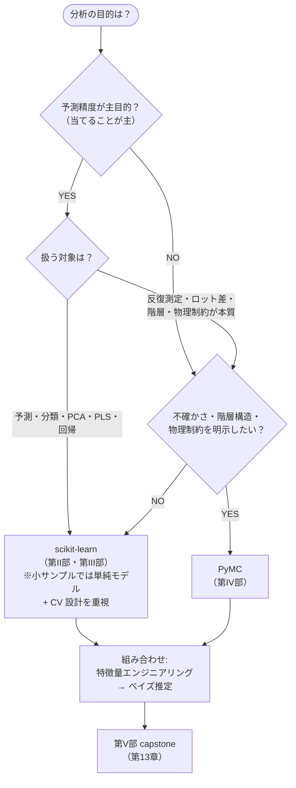

# 第3章 Scikit-learn と PyMC の全体像・使い分け

> **本章の到達目標**
> - vol-02 の 2 本の柱（**scikit-learn** と **PyMC**）の役割分担を、1 枚の使い分けマップとして説明できる
> - 代替候補（**statsmodels / XGBoost / LightGBM / Stan / NumPyro 単独**）の位置づけと、本書がそれらを主軸に採用しなかった理由を言える
> - AI エージェント（GitHub Copilot CLI）と Jupyter MCP を経由した scikit-learn / PyMC の呼び方の**方針**を知る（実装は第4章以降）
> - Stan は**対応表のみ**（付録B）で扱い、実行環境（cmdstanpy）は本書外である旨を確認する
>
> **本章で扱わないこと**
> - 具体的なコード・パラメータ設定・ハンズオン（第4章以降）
> - モデル選択の統計的詳細（AIC / BIC / WAIC / PSIS-LOO の使い分けは第7章・第10章）
> - Skill テンプレートの完全定義（付録A）

---

## 3.1 なぜ「2 本の柱」なのか（第1章・第2章の復習）

第1章では、vol-01 の Skill だけでは扱いきれない 4 局面（多変数・ばらつき分離・少データ予測・変数寄与）を挙げ、それに応える柱として **scikit-learn Skill** と **PyMC ベイズ Skill** を据えました。

第2章では、ARIM データに現れる 5 つの統計的課題（小サンプル・階層構造・反復測定・ロット差・物理制約）を分類しました。

**この 4 局面 × 5 課題を、なるべく少ない道具立てでカバーするための最小構成が「scikit-learn + PyMC」の 2 本**——これが本書の設計思想です。

> [!TIP]
> 「なぜ 3 本、4 本ではないのか」——道具の数が増えるほど、Skill の書き方・テスト・provenance の整合を保つコストが線形以上に増えます。本書は **「まず 2 本で足場を築き、必要になった時点で拡張する」** 方針を採ります。拡張候補は §3.7 で挙げます。

---

## 3.2 使い分けマップ

**scikit-learn を選ぶ場面** と **PyMC を選ぶ場面** を、1 枚のマップに落とします。境界は厳密ではなく、両者を組み合わせるケースも多い（第13章 capstone）ことを念頭に置いてください。

### 判断の目安（表）

| 状況 | scikit-learn | PyMC |
|---|---|---|
| **主目的：予測精度**（クラス分類・回帰） | ◎ | △（可能だが冗長になりがち） |
| **主目的：パラメータの意味を知る・不確かさ評価** | △（点推定と CV 誤差のみ） | ◎ |
| **小サンプル（n=数十）で予測・分類・PCA/PLS**が主目的 | ◯（単純モデル+CV設計必須、第7章） | ◯（事前分布で正則化） |
| **小サンプル（n=数十）で階層・物理制約・分散分解**を明示したい | △（暗黙的、後付け困難） | ◎ |
| **データ量**：n=数千〜数万 | ◎ | △（サンプリングに時間がかかる） |
| **階層構造・反復測定・ロット差**を明示的に分解したい | ×（暗黙的） | ◎ |
| **物理制約**（非負・関数形既知）を事前情報として反映 | ×（後付けが困難） | ◎ |
| **特徴量の解釈**（どの変数が効いているか） | ◎（SHAP / PDP） | ◯（事後分布と重要度指標） |
| **同僚エンジニアへの引き継ぎやすさ**（コード量・学習曲線） | ◎ | △（診断・事前分布設計の学習コスト） |

> [!IMPORTANT]
> **n が小さくても sklearn を選ぶ場面は多い**：n=30 のスペクトルに PLS を当てる、n=50 の表形式で PCA と単純線形回帰、といった**予測・次元削減が主目的**の場面では sklearn + 強い CV 設計（第7章）が第一選択です。PyMC が優位になるのは「n が小さい」ことよりも、**不確かさ・階層構造・物理制約を明示したい**ときです。

### 「両方使う」が最も多い

実務では、**特徴量エンジニアリングは scikit-learn、モデル本体は PyMC** という組み合わせが多くなります。第13章 capstone はこの組み合わせを想定しています。

---

## 3.3 scikit-learn の位置づけ

### scikit-learn とは

Python エコシステムで最も広く使われる機械学習ライブラリ。回帰・分類・クラスタリング・次元削減・前処理・モデル選択を、**統一 API**（`fit()` / `predict()` / `transform()`）で提供します。

- 公式：<https://scikit-learn.org/>
- ライセンス：BSD-3-Clause
- 依存（代表）：NumPy / SciPy / joblib / threadpoolctl

### 本書での主用途

- **第4章**：Skill 契約の書き方（データ分割・Pipeline・provenance のひな型）
- **第5章**：教師あり学習（線形・木・PLS）、データリーク防止の分割契約
- **第6章**：教師なし学習（PCA・クラスタリング）
- **第7章**：交差検証（CV）とデータリーク——**本書の最重要規律**
- **第8章**：モデル解釈（SHAP / PDP）

### 本書が scikit-learn を選ぶ理由

| 理由 | 補足 |
|---|---|
| **`Pipeline` による分割契約の徹底** | 前処理と学習を 1 つのオブジェクトに包み、CV で自動的にリーク防止 |
| **`GridSearchCV` / `cross_validate` の標準性** | ML の CV 実装が最初から標準化されている |
| **SHAP / PDP との連携が容易** | 材料研究で必須の「変数寄与の説明」が完結 |
| **材料 ML 論文で最も引用が多い** | MatBench ベンチマークも scikit-learn 前提で比較 |
| **エージェントに書かせやすい** | API が一貫しており、Copilot CLI の生成コードの品質が安定 |

### 代替候補と、本書が主軸にしない理由

| 代替 | 特徴 | 本書での扱い |
|---|---|---|
| **statsmodels** | 頻度論の推論（p 値・CI）が充実 | 第7章末で「頻度論的仮説検定が必要な場面」に軽く言及 |
| **XGBoost / LightGBM** | 表形式データで scikit-learn より高性能な場合が多い | 第5章または付録で発展候補として短く紹介、Skill 化の作法は同じ |
| **PyTorch / JAX (深層学習)** | 大規模データ・画像・音声で強力 | vol-03 候補（vol-02 では扱わない） |
| **AutoML（H2O / TPOT 等）** | モデル選択を自動化 | エージェント自身がモデル選択を担うため、AutoML は本書の関心外 |

> [!NOTE]
> **本書は「モデル性能の限界を追う」本ではありません**。XGBoost で 2 ポイント精度が上がっても、データリーク・provenance の不備で 30 ポイント損することがあります。**規律 > 最高性能**——これが第II部の姿勢です。

---

## 3.4 PyMC の位置づけ

### PyMC とは

Python でベイズ統計モデリングを行うための代表的ライブラリ。事前分布 + データ → 事後分布を、**MCMC（マルコフ連鎖モンテカルロ）** や **変分推論** で計算します。

- 公式：<https://www.pymc.io/>
- ライセンス：Apache 2.0
- 計算基盤・サンプラー：**PyTensor**（デフォルトの計算グラフ基盤）／ **NumPyro**・**NutPie**（NUTS サンプラー実装として `nuts_sampler=...` で選択可能。NumPyro は JAX ベース、NutPie は Rust ベース）

### 本書での主用途

- **第9章**：ベイズの基本概念（事前・事後・尤度・事後予測）
- **第10章**：単純なベイズモデル（線形回帰・ロジスティック回帰のベイズ版）、章末で NumPyro / JAX の準備
- **第11章**：階層モデル（NumPyro バックエンド、合成階層データ）
- **第12章**：MCMC の実務と限界（$\hat{R}$ / ESS / divergences、Stan との対応表参照）
- **第13章 capstone**：sklearn × PyMC の連結

### 本書が PyMC を選ぶ理由

| 理由 | 補足 |
|---|---|
| **Python 主導・記述性が高い** | モデル定義がほぼ数式通り書ける（`with pm.Model():` ブロック） |
| **`InferenceData` による標準化** | ArviZ 経由で診断・可視化が一貫 |
| **階層モデルが自然に書ける** | `pm.Normal("mu", ..., dims="lot")` のような書き方 |
| **バックエンド選択が可能** | 小規模は PyTensor、大規模は NumPyro に切り替えられる |
| **エージェントに書かせやすい** | Stan と比べて Python 一貫、Copilot CLI との相性が良い |

### 代替候補と、本書が主軸にしない理由

| 代替 | 特徴 | 本書での扱い |
|---|---|---|
| **Stan (cmdstanpy)** | ベイズの標準・論文で最も多く使われる | **付録B の対応表のみ**（cmdstanpy セットアップは本書外） |
| **NumPyro（単独）** | JAX ベースで高速、確率プログラミング DSL | 第10章末以降、**PyMC のバックエンドとして**導入。単独利用は本書外 |
| **TensorFlow Probability** | Google エコシステム、TF ベース | 本書では扱わない（vol-03 候補） |
| **Turing.jl** | Julia の主要ベイズフレームワーク | Julia は本書の範囲外 |

### Stan は「対応表のみ」

材料系・分光系の論文には Stan コードが付いていることが多く、それを読む/書き換える機会があります。本書は **PyMC で完結して学び、Stan コードを読むための対応表を付録B に用意** します。cmdstanpy のインストール・実行環境は本書では扱いません（PyMC で同じことができるため）。

> [!IMPORTANT]
> **PyMC の学習コストを甘く見ないでください**。事前分布の設計・診断の読み方・divergences への対処——scikit-learn の「fit して predict」より学ぶことが多いです。ただし一度習得すれば、**小サンプル・階層構造・物理制約**を含む材料研究では、他の道具では出せない結論に到達できます（第9章冒頭で改めて動機を語ります）。

---

## 3.5 バックエンドの段階導入（PyMC）

第0章・第1章で触れたとおり、PyMC のバックエンドは章によって切り替えます：

| 章 | サンプラー | 追加インストール | 理由 |
|---|---|---|---|
| 第9〜10章前半 | **PyTensor 上のデフォルト NUTS** | なし | 追加依存なしで動く、エラーが Python 的 |
| 第10章末（JAX 準備、5 ページ相当） | JAX / NumPyro の導入 | `pip install numpyro jax` | 第11章以降のサンプラー切り替え準備 |
| 第11章以降 | **NumPyro NUTS**（`nuts_sampler="numpyro"`） | 上記済み | 大規模階層モデルで PyTensor 版より高速 |

> [!TIP]
> サンプラー切り替えは、モデル定義コード（`with pm.Model():` の中身）は変えず **`pm.sample(..., nuts_sampler="numpyro")`** の 1 行で行えます。PyTensor は「計算グラフ基盤」、NumPyro は「NUTS の実装差し替え」——層が違う概念であることに注意してください。第10章末に PyMC 側の設定と JAX 側の準備を集約します。

---

## 3.6 AI エージェント × Jupyter MCP からの使い方（方針）

vol-01 で構築した **Copilot CLI + Jupyter MCP** の枠組みは、vol-02 でもそのまま使います。統計/ML の Skill は、**Notebook 上で動かすことを前提** に書きます。

### 典型的な作業ループ

1. **ユーザー**：目的と入力データをエージェントに提示（「MatBench の `matbench_steels` で、CV スコアを出したい」）
2. **エージェント**：既存の Skill（例：`sklearn-cv-runner`）を選び、契約を満たすように Notebook セルを組み立てる
3. **Jupyter MCP**：Notebook を実行、結果を返す
4. **エージェント**：結果を要約し、次のアクション候補（別のモデル・別の CV スキーム）を提案
5. **ユーザー**：Human-in-the-loop で選択・承認

### vol-02 で追加される規律

| 規律 | 対応章 |
|---|---|
| **CV とデータリークの契約**：Skill が受け付ける分割方法を明示 | 第4章（契約設計） / 第5章冒頭（最低限） / 第7章（詳細 CV） |
| **MCMC の診断結果を必ずレポート**：$\hat{R}$ / ESS / divergences | 第12章 |
| **サンプラー設定を provenance に残す**：chain / draws / tune / target_accept | 第10章・付録A |
| **事後分布アーティファクトの保存**：`InferenceData` を NetCDF で保存 | 第10章・付録A |

### 注意：エージェントに「モデル選択の暴走」をさせない

第1章 §1.2 で挙げた **循環設計問題の統計版** は、この作業ループで最も起きやすい落とし穴です。**評価指標は Skill 契約に事前に書き**、エージェントに「指標の選び直し」を許可しない設計にします（第4章・第7章）。

---

## 3.7 拡張候補（本書では扱わないが、必要になる場面）

| 拡張 | 動機 | 参照 |
|---|---|---|
| **深層学習**（PyTorch / JAX / Flax） | 画像・分光の end-to-end、大規模データ | vol-03 候補 |
| **因果推論**（DoWhy / EconML） | 「介入すると何が変わるか」を知りたい | vol-04 候補 |
| **ベイズ最適化**（BoTorch / GPyOpt） | 「次にどの試料を測るか」を決めたい | vol-04 候補 |
| **時系列モデル**（Prophet / statsforecast） | プロセス時系列の予測 | vol-02 では基本的な時系列扱いのみ（第2章 §2.4） |
| **記号回帰**（PySR） | 物理法則の発見 | vol-02 では扱わない（実験的） |
| **Gaussian Process 回帰**（sklearn / GPy / GPyTorch / PyMC GP モジュール） | 連続変数の補間、小サンプル回帰 | vol-02 では章として扱わない（将来巻・付録候補） |

これらはいずれも重要ですが、vol-02 の 15 章に詰め込むと「どれも浅い章」になります。**まず 2 本の柱で足場を築き、必要になった時点で拡張する**——これが本書の姿勢です。

---

## 3.8 第II部への橋渡し（章末チェックリスト）

以下がすべて「はい」であれば、第II部（第4章）に進めます。

- [ ] **scikit-learn と PyMC を「どういう場面で使い分けるか」** を、1 分で説明できる
- [ ] 自分のデータで、**scikit-learn 主体・PyMC 主体・両方併用** のどれが必要か、当たりがついている
- [ ] Stan は本書では **対応表のみ**（付録B）で扱い、実行環境は用意しないことを了解している
- [ ] PyMC の学習コストが scikit-learn より高いことを了解している（**でも materials では価値がある**）
- [ ] エージェントに **モデル選択の判断を全て任せない**（評価指標は人間が先に決める）方針を了解している

第II部（第4章〜第8章）では、まず **scikit-learn Skill の書き方** から入ります。「fit して predict」の裏で守るべき規律——特に CV とデータリーク——が主題です。

---

## 3.9 本章のまとめ

- vol-02 は **scikit-learn + PyMC** の 2 本を柱にすえ、両者の連結を capstone とする
- **予測精度が主目的で n が数百以上** → scikit-learn（第II部）、**不確かさ・階層構造・物理制約** → PyMC（第IV部）、**両方** → capstone（第V部）
- 代替候補（statsmodels / XGBoost / LightGBM / Stan / NumPyro 単独 / 深層学習）は、それぞれ本書が主軸にしない理由がある。**scope を絞ることが本書の価値**
- Stan は **付録B の対応表のみ**、cmdstanpy 環境は本書外
- AI エージェント × Jupyter MCP の作業ループは vol-01 と同じだが、**CV・診断・provenance の 4 規律**が第II部以降で加わる
- 次章（第4章）から、**scikit-learn Skill の実装**に入る

---

## 参考資料

### 本書内の該当章
- [第0章 vol-01 の最小復習](./chapter-00.md)
- [第1章 vol-01 の Skill に何が足りないのか](./chapter-01.md)
- [第2章 ARIM データに現れる統計的課題](./chapter-02.md)
- 第4章以降 実装ハンズオン（次章から）
- 付録B PyMC ↔ Stan 対応表（本書後半）

### 外部参考
- scikit-learn 公式 <https://scikit-learn.org/>
  - Pedregosa, F., et al. "Scikit-learn: Machine Learning in Python." *JMLR* **12**, 2825-2830 (2011).
- PyMC 公式 <https://www.pymc.io/>
  - Abril-Pla, O., et al. "PyMC: A Modern and Comprehensive Probabilistic Programming Framework in Python." *PeerJ Computer Science* **9**, e1516 (2023). <https://doi.org/10.7717/peerj-cs.1516>
- ArviZ 公式 <https://python.arviz.org/>
- NumPyro 公式 <https://num.pyro.ai/>
- Stan 公式 <https://mc-stan.org/>（付録B の対応表用）
- statsmodels 公式 <https://www.statsmodels.org/>
- XGBoost 公式 <https://xgboost.readthedocs.io/>
- LightGBM 公式 <https://lightgbm.readthedocs.io/>
