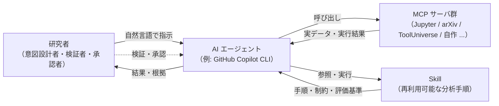

# 第0章 vol-01 / vol-02 の最小復習

> **本章の使い方**
> - **vol-01 + vol-02 完読者**：この章は読み飛ばして第1章に進んでください。用語の再確認だけしたい方は §0.11 のチェックリストを参照
> - **vol-02 のみ完読者**：§0.2〜§0.7 は既知なので、§0.8（統計/ML 診断の最小）と §0.10（vol-03 で加わる GPU 環境の予告）を中心に読んでください
> - **vol-01 のみ完読者**：§0.5〜§0.9（vol-02 で拡張された部分）を丁寧に、それ以外は流し読みで OK
> - **未読者**：ここで最低限の前提を身につけ、第1章以降に進めます。詳細は必要になった時点で該当章に戻ってください
>
> **この章の到達目標**
> - vol-01 の中核 5 概念（AI エージェント／MCP／Skill／データ契約／provenance）を最小限で説明できる
> - vol-02 で追加された 2 pillars（scikit-learn Skill／PyMC Skill）と統計/ML 診断（CV・calibration・MCMC 診断）の要点を言える
> - vol-03 で **GPU / 事前学習重み / エージェントの学習権限** が新たに登場することを認識できる
> - vol-01 + vol-02 の失敗パターン（循環設計・データ漏洩・ハルシネーション・再現性欠如・統計的リーク・BNN 未収束）を意識できる
>
> **この章で扱わないこと**
> - 各概念の詳細な設計論・失敗事例（vol-01 / vol-02 の該当章を参照）
> - 環境構築の手順そのもの（vol-01 第4章 / vol-02 第0章 / 付録B・C）
> - Skill テンプレートのフィールド完全定義（vol-02 付録A、および vol-03 付録A で深層 × Agentic 拡張）
> - 深層学習そのものの導入（第1章から本格的に扱う）

---

## 0.1 この章の位置づけ

vol-03 は vol-01 + vol-02 の続編ですが、**単体でも読み進められる**ように設計しています。vol-01 / vol-02 で扱った概念のうち、vol-03 で当然のように使うものだけを、この第0章に圧縮しました。

- **完読推奨**：ただし、必須ではありません
- **参照先**：vol-01 / vol-02 の該当章・付録を明示するので、必要な時にだけ戻れば OK
- **分量**：15 ページ程度（vol-01 第3・4・6・7・8・14章、vol-02 第0・4・9・10・13章の要点抽出）

> [!NOTE]
> vol-01 は AI エージェントで実験データ分析を行う入門書、vol-02 は **統計・機械学習の厚み**（scikit-learn と PyMC）を積み上げる本、vol-03 は **エージェントが深層学習を扱う Skill** をテーマにします。vol-03 の焦点は「深層学習の教科書」ではなく **「エージェントが深層で分析を回すとき、ARIM データで何が起きるか」** です。したがって「エージェントに Skill を作らせる」文化そのものは vol-01 で、統計/ML の作法は vol-02 で確立済みという前提で話を進めます。

---

## 0.2 3 人の登場人物：AI エージェント／MCP／Skill

vol-01 で最も重要な三者関係を、まず 1 枚の図に圧縮します。

### AI エージェント

**大規模言語モデル（LLM）を核に、道具を使って複数ステップの作業を実行する存在**です。vol-01〜03 では **GitHub Copilot CLI** を標準としますが、Claude Code、Cursor 等の他エージェントでも本書のパターンは概ね転用可能です。

エージェントの本質的特徴は次の 3 つ。

1. **自然言語で指示できる**：「このスペクトルの分類モデルを 1D CNN で作って」といったレベルで動く
2. **道具（Tool）を選んで使う**：ファイル読み、コード実行、Web 検索などを状況に応じて呼び出す
3. **文脈を保って反復する**：前のセルの結果を見て次のセルを書ける

vol-03 では、**エージェントがどこまで自律的に学習ジョブを起動してよいか**が新たな論点になります（第4章「Agentic 学習権限設計」）。

### MCP（Model Context Protocol）

**AI エージェントと外部の道具・データソースをつなぐ共通コネクタ規格**です[^0-1]。本書で頻出する MCP サーバは次のとおり。

| MCP サーバ | 用途 | vol-03 での主な役割 |
|---|---|---|
| **Jupyter MCP** | JupyterLab のノートブックをエージェントから読み書き・実行 | ほぼすべての章の実行基盤 |
| **arXiv MCP** / **Paper Search MCP** | 論文検索・取得 | 手法選定・引用（vol-01 第10章と共通） |
| **Hugging Face Hub**（外部連携） | 事前学習重みの取得 | 第7・11・12章 |
| **FastMCP** / **MCP Python SDK** | Python で自作 MCP を作る | **付録B で承認ゲート付き実装まで書き下し**（vol-02 第15章の予告を実装） |

**vol-03 で「新しい MCP を必ず追加する」必要はありません**。付録B の自作 MCP は「組織内でエージェントに承認ゲートを課したい場合」の実装例です。

### Skill

**分析手順を「再利用可能な形にまとめたもの」**です。単なるスクリプトと違うのは、以下を明示的に持つこと。

- **入力仕様**：どんなデータを受け付けるか
- **出力仕様**：何を返すか
- **制約条件**：どんな時は動かさないか（例：欠損率 50% 超は拒否、fine-tune 前重複禁止）
- **評価基準**：成功をどう定義するか（vol-02 で CV・calibration が加わり、vol-03 で attribution reliability・weights provenance が加わる）
- **手順本体**：処理の実装
- **再現性メタデータ（provenance）**：入力ハッシュ・バージョン・乱数種等（vol-02 で ML/Bayesian 拡張、vol-03 で GPU/深層/**Agentic** 拡張）

**vol-03 の本線は 2 pillars + Advanced Capstone**：**Pillar 1 = 教師あり深層 Agentic Skill**（第6章）、**Pillar 2 = 転移学習 Agentic Skill**（第7章）、そして **Advanced Capstone = Foundation Model → 深層特徴 → PyMC 階層モデル**（第13章）。合格ラインは「2 pillars の Skill を自力で作れる」ことです。

> [!TIP]
> Skill の物理形態は、vol-01〜03 共通で `SKILL.md` + `references/` + `tests/` の Markdown/Python ディレクトリです。vol-02 で `artifacts/`, `figures/` が加わり、vol-03 では **`checkpoints/` と `wandb_run/`（optional）**が加わります（付録A、および vol-02 付録A §A.1.1 の配置規約を継承）。**Skill = 特定のフォルダ構造**と覚えて OK。

---

## 0.3 vol-02 で加わった 2 pillars と統計/ML 診断

vol-02 は、vol-01 の「エージェント × Skill」文化の上に **統計・機械学習の厚み**を積み上げた巻でした。**vol-03 は 2 pillars の設計原則をそのまま深層に持ち込みます**。

### 2 pillars（vol-02）

| 柱 | 内容 | vol-03 での位置づけ |
|---|---|---|
| **Pillar 1**：scikit-learn Skill | 分類・回帰・CV 設計・calibration・feature importance | 第6章の深層版に接続。GBM/RF と深層の比較は第6章末 |
| **Pillar 2**：PyMC Skill | 事前分布 → 事後 → 診断（$\hat{R}$/ESS/divergences）→ 事後予測 | 第13章の深層特徴 × 階層モデルに接続 |
| **Advanced Capstone**（vol-02） | 合成階層データ + PyMC 階層モデル | vol-03 第13章で **同じ合成階層データ**に FM 転移 + 深層特徴を上積み |

### 統計/ML 診断の最小語彙

vol-02 で押さえた診断は、vol-03 でもそのまま使います。**用語を思い出せない場合のみ**、下記の要約で確認してください。

**分類の評価**（vol-02 第7章）

| 指標 | 意味 | vol-03 での使いどころ |
|---|---|---|
| **Accuracy / F1** | 分類全体・クラス別バランス | 第6章 深層分類の最初の可視化 |
| **ROC-AUC / PR-AUC** | 閾値独立の性能 | 第6・7章 |
| **Confusion matrix** | 誤分類パターン | 第10章 誤判定サンプルの Human 流し戻し |

**回帰の評価**（vol-02 第7章）

| 指標 | 意味 |
|---|---|
| **RMSE / MAE** | 誤差の大きさ |
| **$R^2$** | 分散説明率 |
| **予測 vs 実測プロット** | 系統誤差の視認 |

**Calibration**（vol-02 第9章、vol-03 第8章で深層に拡張）

| 概念 | 一言 |
|---|---|
| **Reliability diagram** | 予測確率 vs 実際の頻度 |
| **Brier score** | 確率予測の二乗誤差（低いほど良い） |
| **ECE**（Expected Calibration Error） | reliability diagram を数値化 |

深層のソフトマックスは **過信しがち**（temperature scaling で緩和）——vol-03 第8章で扱います。

**CV / 分割設計**（vol-02 第7章、vol-03 第5章で深層 anti-leakage に拡張）

| 用語 | 内容 |
|---|---|
| **k-fold** | 標準的な交差検証 |
| **Stratified** | クラスバランスを保つ |
| **Grouped**（Group k-fold） | **同一試料が train/test に混ざるのを防ぐ**——ARIM データで必須 |
| **Leave-one-group-out** | 装置間・オペレータ間の汎化評価 |

**MCMC 診断**（vol-02 第10-12章、vol-03 第9・13章で BNN・階層モデルに再登場）

| 診断 | 目標値 | 意味 |
|---|---|---|
| **$\hat{R}$** | $\leq 1.01$ | チェイン間の合意（未収束の警告） |
| **ESS** | $\geq 400$ 程度（分析目的次第） | 独立サンプルの実効数 |
| **Divergences** | 0 が理想 | HMC/NUTS の geometric 失敗 |

これらが「合格ライン」に達していない事後分布は、**vol-02 の哲学では結論を引き出せない**——vol-03 でも同じ規律です。

---

## 0.4 ハンズオン標準環境

vol-01 / vol-02 で構築した環境をそのまま使います。vol-03 では **GPU が加わり**ますが、CPU fallback も維持します。**未構築の方は vol-01 第4章 §4.3〜§4.6 と vol-02 第0章 §0.3 を参照**してください。

### vol-02 までの標準環境（そのまま）

| # | 要素 | バージョン | 役割 |
|---|---|---|---|
| 1 | Python | 3.11 以上 | 分析エンジン |
| 2 | JupyterLab | 4.4.1 | ノートブック実行環境 |
| 3 | GitHub Copilot CLI | 最新版 | AI エージェントアプリ／MCPホスト |
| 4 | Jupyter MCP Server | 0.14.4 | エージェント⇔JupyterLab の橋 |
| 5 | Node.js | 22 以上 | Copilot CLI の実行基盤 |

### vol-03 で追加するもの（詳細は第3章と付録C）

| 要素 | 章 | 備考 |
|---|---|---|
| **PyTorch**（2.x） | 第3章から | **CPU でも動くが、実装は GPU 前提の記述** |
| **JAX**（0.4.x）+ Flax / Optax | 第3章から | XLA バックエンド |
| **Hugging Face Transformers / Datasets** | 第7・11・12章 | 事前学習重みの取得 |
| **CUDA / cuDNN**（NVIDIA GPU の場合） | 第3章・付録C | ROCm（AMD）、MPS（Apple Silicon）の fallback は付録C |
| **wandb**（optional） | 第4章から | 実験トラッキング。**未使用でも Skill は成立する**（provenance ログで代替可） |

> [!WARNING]
> **PyTorch と JAX を同じ venv に共存させると、依存関係（CUDA バージョン等）が衝突しやすい**です。vol-02 の `.venv-vol02`（PyMC）とは別に、**PyTorch 用と JAX 用の venv を分ける**か、少なくとも各章の冒頭で「どちらを使うか」を宣言してください。第3章冒頭で運用方針を確定します。

> [!IMPORTANT]
> **GPU がない環境でも vol-03 を読み進められる**ように設計します。ハンズオン章は「**CPU で数分で回る mini-version**」と「**GPU 前提の full-version**」を両方示します。ただし、Foundation Model 転移（第7・11章）や SSL（第12章）は現実的な時間内には GPU がほぼ必須です。所属機関の共有 GPU / クラウド GPU / Google Colab の利用を検討してください。

---

## 0.5 データ契約：Skill の入出力を約束する（vol-01 + vol-02 の合流点）

vol-01 第8章の中核概念で、vol-02 第4章で **ML/Bayesian 特有の要素**が追加されました。vol-03 では **深層特有の要素**（次章以降で説明）がさらに加わります。

### vol-01 の 7 要素（工程ベース）

vol-01 のデータ契約は **入力データを Skill に渡すまでの 7 工程**を約束事として明文化する枠組みです。

| # | 工程 | 契約する主な内容 |
|---|---|---|
| ⓪ | **入手・由来記録** | 生ファイルパス、SHA-256、装置ID、測定日時。**生ファイル編集は fatal** |
| ① | **読込** | 対応する装置ファイル形式・エンコーディング・ヘッダ位置 |
| ② | **メタデータ結合** | 本文とメタデータをどの列で紐付けるか |
| ③ | **単位統一** | 内部表現の単位。**未登録の暗黙変換は fatal** |
| ④ | **欠損・外れ値・飽和のマーキング** | 除去ではなくフラグ列で残す |
| ⑤ | **品質チェック** | `fatal / warning / flag` の 3 段階 |
| ⑥ | **標準形式化** | Python 内部表現（DataFrame の列構造）と保存形式 |

### vol-02 で追加された ML/Bayesian 要素（vol-02 第4章）

| 要素 | 内容 |
|---|---|
| **分割方針** | k-fold / stratified / grouped。**同一試料が train/test に混ざるのを禁止** |
| **CV スキーム** | fold 数、グループ列、shuffle、seed |
| **標本サイズ下限** | クラスあたり最低件数、ベイズなら chain あたり有効サンプル数 |
| **階層構造の記述** | 装置・ロット・研究室の入れ子構造 |
| **事前分布契約**（PyMC） | 事前分布の物理妥当性の記述 |

### vol-03 で追加される深層要素（第4-5章で詳述）

| 要素 | 一言だけの予告 |
|---|---|
| **Augmentation 契約** | train のみで使う。**エージェントが勝手に強化しない** |
| **深層 anti-leakage split** | **事前学習データと fine-tune データの重複禁止** |
| **重みの provenance** | 使用する事前学習重みの URI と SHA-256 |
| **GPU バックエンドの記録** | CUDA / ROCm / MPS / CPU |
| **Agent の権限記録** | この Skill でエージェントが自律できる範囲 |

### 品質チェックは 3 段階（vol-01 の哲学、vol-02〜03 で継承）

| レベル | 挙動 | 例 |
|---|---|---|
| **fatal** | Skill に渡さず**明示エラーで拒否** | 必須カラム欠落、欠損率 30% 超、**train/test 間の同一試料重複**（vol-02）、**事前学習/fine-tune データ重複**（vol-03） |
| **warning** | 警告ログ付きで渡す | 校正日が古い、標本サイズが推奨範囲だが下限は満たす |
| **flag** | フラグ列を付けて渡す | 少数の飽和点、局所的な外れ値、欠損率 5% 程度 |

**fatal を握りつぶさない**——これが vol-01〜03 を通じた最重要ルールです。

---

## 0.6 provenance：再現できる形で結果を残す

vol-01 第7章・vol-02 付録A・vol-03 付録A で拡張されていく概念です。**vol-03 では GPU / 深層 / Agentic の要素が加わります**。

### vol-01 の基本 5 フィールド

| フィールド | 意味 |
|---|---|
| `input_sha256` | 入力ファイルの SHA-256（64 文字の hex） |
| `skill_version` | Skill のバージョン（SemVer） |
| `run_datetime_utc` | 実行日時（UTC、ISO 8601） |
| `package_versions` | 主要ライブラリの版 |
| `random_seed` | 乱数の種 |

### vol-02 で追加されたフィールド

| フィールド | 意味 |
|---|---|
| `cv_scheme` | 交差検証の設計（fold 数・グループ列・shuffle・seed） |
| `data_split` | train/val/test 分割の実体（fold ID or index リスト） |
| `model_config` | モデル種別・ハイパーパラメータ |
| `sampler_config` | PyMC 用：chain 数・draws・tune・target_accept |
| `backend_config` | PyMC 用：`nuts_sampler`, `jax_enable_x64` 等 |
| `posterior_artifact` | 事後分布ファイルの hash |
| `diagnostics_summary` | $\hat{R}$ / ESS / divergences のサマリ |

### vol-03 で追加されるフィールド（付録A で完全定義）

**GPU / 深層の要素**

| フィールド | 意味 |
|---|---|
| `gpu_backend` | CUDA / ROCm / MPS / CPU |
| `cudnn_deterministic` | 決定的アルゴリズムを強制したか（true / false） |
| `random_seed_per_worker` | DataLoader worker ごとの seed |
| `weights_uri` | 事前学習重みの URI（Hugging Face Hub 等） |
| `weights_sha256` | 事前学習重みの SHA-256 |
| `finetune_config` | frozen / partial / full / LoRA / PEFT の種別と対象層 |
| `augmentation_config` | train のみで使った augmentation の完全な設定 |
| `tolerance` | 完全一致でなく「差分がここまでなら再現とみなす」閾値 |

**Agentic の要素**（vol-03 の新設）

| フィールド | 意味 |
|---|---|
| `agent_authorization` | この Skill でエージェントが持つ権限レベル（推論のみ / 推論+fine-tune / 完全自律） |
| `training_job_approval` | 学習ジョブ起動時の Human 承認記録（承認者、日時、承認 ID） |
| `checkpoint_overwrite_policy` | checkpoint 上書きが許可されている条件（禁止 / 明示承認あり / 世代管理） |
| `fm_update_gate` | Foundation Model 更新の承認ゲート状態 |
| `uncertainty_stop_threshold` | 不確かさ超過時の自律停止閾値 |
| `human_review_ref` | Human レビュー記録への参照（改ざん防止） |

これらを Skill 実行のたびに記録することで、**「同じ結論に到達できるか」だけでなく「エージェントが何をどこまで自律で動かしたか」を後から検証**できます。深層学習では bit 単位の完全一致は困難なため、目的は **"再現" ではなく "差分原因の追跡"** です（第4章）。

---

## 0.7 Human-in-the-loop：AI に判断を丸投げしない

vol-01 第6章の原則を一言で：**「AI エージェントは提案し、最終判断は人間が下す」**。**vol-03 では深層特有の承認ゲートが加わります**。

### 具体的な運用（vol-01 継承）

| 局面 | AI がやること | 人間がやること |
|---|---|---|
| 手順の設計 | 手順候補を提案 | 目的への適合を判断 |
| コード生成 | ドラフトを書く | レビューして受け入れ |
| データの取り込み | 契約チェックを通す | 契約自体を定義 |
| 結果の解釈 | 統計指標を出す | 物理的妥当性を判断 |
| 分岐判断 | 選択肢を列挙 | 選択 |
| 危険操作 | 実行前に確認 | 承認（明示的 yes） |

### vol-02 で強調された 2 点

1. **循環設計問題の統計版**：エージェントに「モデル選択の指標も、選択の実行も」両方任せると、指標を都合よく選ばれるリスクがある。**評価指標は人間が先に決めてから、エージェントに探索させる**（vol-02 第4章・第7章）
2. **有意 ≠ 意義**：p 値が有意でも、事後分布が集中していても、**物理的に意味があるかは人間が判断する**（vol-02 第8章・第9章）

### vol-03 で加わる深層特有の承認ゲート（第4章で詳述）

| ゲート | 該当章 | 承認の中身 |
|---|---|---|
| **学習ジョブ起動** | 第4・6・7章 | GPU 消費、想定エポック、期待精度、停止条件を Human が承認 |
| **fine-tune 起動**（特に再 fine-tune） | 第7章 | 「今日のバッチだけで再 fine-tune するか」の Human 判断 |
| **checkpoint 上書き** | 第4・14章 | 上書き禁止 / 世代管理 / 明示承認あり、の 3 択 |
| **Foundation Model 更新** | 第11章 | 上流 FM が新バージョンに変わったとき、Skill が採用するかの Human 判断 |
| **不確かさ超過時の停止** | 第8章 | エージェントが自律決定を止めて Human に投げる閾値 |
| **augmentation の追加** | 第5・14章 | エージェントが精度向上のために augmentation を勝手に増強することの禁止 |

### 分析セッション開始前の 3 点チェック（vol-01 第6章、vol-03 も継承）

- [ ] **不要な MCP を無効化**：セッションで使わない MCP は `copilot mcp disable` で切る
- [ ] **Web / 外部 API アクセスを制限**：機密試料を扱う場合、Web 検索を無効化するか、送信内容を承認制にする
- [ ] **秘匿情報のマスク**：JUPYTER_TOKEN・API キー・試料 ID・**Hugging Face トークン**・ログ内パスを、共有前・チャット貼付前にマスクする

> [!IMPORTANT]
> エージェントは「動く分析」を高速に作れます。しかし「**動く ≠ 正しい**」。vol-02 では、動かした後に **統計的に正しいか、物理的に意味があるか** を確かめる工程が随所に登場しました。vol-03 では、そこに **「エージェントが自律で動かしてよい範囲か」** が加わります。この 3 つの確認を省略しないことが、vol-03 全体を通じた最重要ルールです。

---

## 0.8 6 データ型：装置カテゴリを型で捉える

ARIM の装置カテゴリは多岐にわたりますが、分析手順の骨格は **6 つのデータ型**に抽象化できます（vol-01 第2章）。vol-03 では **深層 × Agentic Skill の対応**を第2章・付録A で詳しくマップします。

| データ型 | 代表装置カテゴリ | vol-03 での深層 × Agentic 対応（第2章・付録A） |
|---|---|---|
| **スペクトル型** | 各種分光、磁気共鳴、質量分析 | 1D CNN 分類 / 1D Transformer / BNN による事後（第6・9章） |
| **クロマトグラム・時系列型** | クロマトグラフ、熱分析、プロセスログ | 1D CNN / Transformer / SSL（第6・12章） |
| **画像・顕微鏡型** | 光学・SEM・TEM | 2D CNN / ViT / Grad-CAM / SSL（第6・10・12章） |
| **回折・散乱パターン型** | XRD、SAXS、表面分析 | 2D CNN / パターン埋め込み（第6章） |
| **表形式・プロセス条件型** | 成膜、リソ、機械/電気/磁気特性 | TabNet / FT-Transformer / GBM との比較（第6章） |
| **マルチモーダル統合型** | 上記の組み合わせ | Foundation Model + 深層特徴 + PyMC 階層モデル（第11・13章） |

**1 つの型で Skill を作れれば、同じ型の他装置に骨格を転用しやすい**——vol-01〜03 を通じた抽象化の狙いです。

---

## 0.9 vol-01 / vol-02 で挙げたリスクと失敗パターン

vol-01 第14章と vol-02 第14章の失敗パターンを 1 段落ずつ圧縮します。**vol-03 でも同じリスクは残り、深層 × Agentic 特有のバリエーションが加わります**（第14章）。

### vol-01 の 4 リスク

**循環設計問題**：AI に評価指標も結果も任せると、都合の良い指標が選ばれ、都合の良い結論が出る自己参照ループ。**評価基準は Skill を設計する時に、人間が先に固定する**。

**データ漏洩**：機密データの外部送信（クラウド LLM への流出等）。vol-01 第6章の運用ルールで予防。**vol-03 では Hugging Face Hub への意図せぬアップロード**が新たなリスク（第14章）。

**ハルシネーション**：存在しない論文・数式・API が **もっともらしく** 生成される現象。**必ず一次情報で照合する**。vol-03 では **Foundation Model の出力自体もハルシネートしうる**（第11章）。

**再現性欠如**：プロンプト・環境差・乱数で結果が変わる問題。**provenance を必ず残す**。vol-03 では **GPU 非決定性**（cuDNN、mixed precision、DataLoader worker 順序）がここに加わります（第4章・付録C）。

### vol-02 で追加された失敗パターン

**統計的データリーク**：train/test 間で同一試料・同一ロットが混ざり、汎化性能が過大評価される（vol-02 第7・14章）。**vol-03 では事前学習データとの重複**が加わる（第5章）。

**p-hacking / モデル選択の自己汚染**：CV スコアを見ながらモデル・特徴量を選ぶループで、暗黙のリーク（vol-02 第7章）。

**BNN 未収束**：$\hat{R} > 1.01$ や divergences 多発を無視して結論を出す（vol-02 第11章）。

### vol-03 で新たに登場する失敗パターン（第14章、v0.2 で強化）

**深層一般**：GPU 差分による結果ずれ、事前学習重みの汚染、fine-tune のデータリーク、Foundation Model の分布外、hallucinatory feature attribution（Grad-CAM が「もっともらしい」だけの領域を示す）、Deep ensemble の過信、augmentation 契約違反。

**Agentic 特有**（vol-03 で新設）：エージェントが GPU を占有し続ける、勝手にモデルを更新する、checkpoint を無承認で上書き、学習ログを改ざん・省略、未承認重みで推論を続ける、Human-in-the-loop バイパス（"確認済み" フラグを勝手に立てる）、augmentation を勝手に強化して精度を偽装、Foundation Model の署名検証をスキップ、"エージェントが自律的に再学習した" ことを Human に伝えない。

**これらの失敗は「Skill が動作していること」からは見えません**——だからこそ、vol-03 では **provenance + 承認ゲート + 監査ログ**の三点セットが第4章から一貫して重視されます。

---

## 0.10 vol-03 で新たに気にすること（予告）

第1章に進む前に、**vol-03 に固有の 3 つの視点**を予告しておきます。

**(1) GPU / バックエンド差**：CPU では出なかった非決定性が、GPU では日常的に起こります。**同じコード・同じ seed でも結果が微妙に違う**——この事実を Skill 設計に織り込みます（第4章）。

**(2) 事前学習重みの provenance**：Foundation Model や公開重みを使うとき、その重みの **出所・SHA-256・ライセンス**を Skill が記録します。**"署名検証をスキップしたエージェント" は Skill 設計違反**として扱われます（第4・11・14章）。

**(3) エージェントの学習権限（Agentic Authorization）**：vol-01 の Human-in-the-loop を、深層特有の場面に敷き詰めます。**「エージェントに推論だけ許すのか、fine-tune まで許すのか、完全自律を許すのか」**を Skill ごとに宣言し、承認ゲートを配置します（第4章）。

---

## 0.11 vol-01 + vol-02 復習チェックリスト

以下がすべて「はい」であれば、vol-03 の第1章に進めます。「うろ覚え」があれば、該当章に短く戻ってから第1章へ進んでください。

### vol-01 由来

- [ ] **AI エージェント／MCP／Skill** の三者関係を、自分の言葉で 3 分で説明できる（→ vol-01 第3章）
- [ ] **Copilot CLI + JupyterLab + Jupyter MCP** の環境が手元で動く（→ vol-01 第4章）
- [ ] Skill の物理形態（`SKILL.md` + `references/` + `tests/`）を知っている（→ vol-01 付録A）
- [ ] **データ契約** の 7 工程を書ける（→ vol-01 第8章）
- [ ] **provenance** の基本 5 フィールドを言える（→ vol-01 第7章）
- [ ] **Human-in-the-loop** の原則を、具体的なコードレビュー行動として説明できる（→ vol-01 第6章）
- [ ] **6 データ型** のうち、自分の主な扱うデータがどれか即答できる（→ vol-01 第2章）
- [ ] **循環設計問題・データ漏洩・ハルシネーション・再現性欠如**を、自分の分析で起こりうるパターンとして 1 つ以上挙げられる（→ vol-01 第14章）

### vol-02 由来

- [ ] **2 pillars（scikit-learn Skill / PyMC Skill）** の Skill を 1 つ以上、自分で作った経験がある（→ vol-02 第4・9-10章）
- [ ] **CV スキーム**（k-fold / stratified / grouped）の違いと、grouped が必要な場面を言える（→ vol-02 第7章）
- [ ] **Calibration**（reliability diagram / Brier / ECE）の目的を 1 分で説明できる（→ vol-02 第9章）
- [ ] **MCMC 診断**（$\hat{R}$ / ESS / divergences）の合格ラインを言える（→ vol-02 第11章）
- [ ] **統計的データリーク**を、自分の実験データで起こりうるパターンとして 1 つ挙げられる（→ vol-02 第7・14章）
- [ ] **事前分布契約**の必要性を説明できる（→ vol-02 第10章）
- [ ] **合成階層データ**を使った capstone を、vol-02 第13章で読んだ or 実装した（→ vol-02 第13章）

### vol-03 で新たに登場する概念（第1章以降で本格化）

- [ ] **GPU バックエンド差**が結果に影響しうることを認識している（第3・4章で扱う）
- [ ] **事前学習重み**を使うときに provenance を残すべきだと理解している（第4・11章で扱う）
- [ ] **エージェントの学習権限（3 段階）** という概念に馴染みがなくても、必要性を想像できる（第4章で本格化）

---

## 本章のまとめ

- vol-01 の中核は 3 人の登場人物（AI エージェント／MCP／Skill）と、それを支える 5 つの規律（データ契約／provenance／Human-in-the-loop／6 データ型／4 リスク回避）
- vol-02 はこれらの上に **2 pillars（scikit-learn / PyMC）と統計/ML 診断（CV・calibration・MCMC 診断）** を積み上げた
- vol-03 は **これらをすべて前提として、深層 × Agentic Skill を扱う**——GPU、事前学習重み、エージェントの学習権限が新たに登場する
- 未読者はこの章のチェックリストを埋め、必要に応じて vol-01 / vol-02 に戻ればよい。**すべての詳細を復習してから進む必要はない**
- 次章（第1章）では、「**vol-02 の Skill をエージェントが深層で拡張するとき、ARIM データで何が起きるか**」を掘り下げます

---

## 参考資料

### vol-01 の該当章
- [第2章 実験データの型](../vol-01/chapter-02.md)
- [第3章 AI Agent・MCP・Skill の全体像](../vol-01/chapter-03.md)
- [第4章 環境構築](../vol-01/chapter-04.md)
- [第6章 MCP の安全な使い方](../vol-01/chapter-06.md)
- [第7章 provenance と再現性](../vol-01/chapter-07.md)
- [第8章 実験データを分析可能な形に整える（データ契約）](../vol-01/chapter-08.md)
- [第10章 文献照合とハルシネーション対策](../vol-01/chapter-10.md)
- [第14章 失敗パターンとリスク管理](../vol-01/chapter-14.md)
- [付録A Skill テンプレート集](../vol-01/appendix-a.md)

### vol-02 の該当章
- [第0章 vol-01 の最小復習](../vol-02/chapter-00.md)
- [第4章 統計/ML Skill の設計原則](../vol-02/chapter-04.md)
- [第7章 分類・回帰・CV 設計](../vol-02/chapter-07.md)
- [第9章 予測の不確かさと calibration](../vol-02/chapter-09.md)
- [第10章 PyMC ハンズオン①（事前分布と回帰）](../vol-02/chapter-10.md)
- [第11章 PyMC ハンズオン②（診断）](../vol-02/chapter-11.md)
- [第13章 合成階層データによる Advanced Capstone](../vol-02/chapter-13.md)
- [第14章 統計/ML 特有の失敗パターン](../vol-02/chapter-14.md)
- [付録A ML/Bayesian 拡張 provenance スキーマ](../vol-02/appendix-a.md)

### 外部参考
- Model Context Protocol 公式 <https://modelcontextprotocol.io/>
- GitHub Copilot CLI ドキュメント <https://docs.github.com/copilot/how-tos/copilot-cli>
- PyTorch 公式 <https://pytorch.org/>
- JAX 公式 <https://jax.readthedocs.io/>
- Hugging Face Hub <https://huggingface.co/>

[^0-1]: vol-01 第3章 §3.4「MCP は USB-C の比喩」参照。
