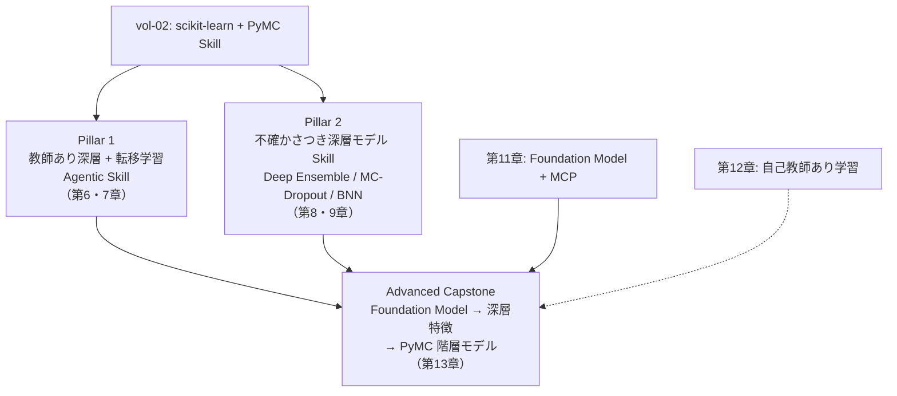

# 第1章 vol-02 の Skill をエージェントが深層で拡張するとき、ARIM データで何が起きるか

> **本章の到達目標**
> - vol-02 で作れる Skill（scikit-learn / PyMC）と、そこで残る「表現学習・大規模事前学習・装置横断」の空白を、ARIM 実データの具体場面で説明できる
> - **単に深層学習を導入すればよいのではなく、「エージェントが深層を扱うこと」自体が新たな設計課題を生む**ことを言える（GPU 非決定性・事前学習重みの provenance・エージェントの学習権限・深層特有の承認ゲート）
> - vol-03 が積み上げる 2 pillars（**教師あり深層 + 転移学習 Skill / 不確かさつき深層モデル Skill**）と Advanced Capstone（**FM → 深層特徴 → PyMC 階層モデル**）の位置づけを言える
> - Foundation Model 時代における研究室の 4 つの選択肢と、それぞれのコスト・リスクを判断できる
> - vol-03 で **扱わないこと**（深層学習の理論そのもの、大規模事前学習、生成モデル/逆設計、因果推論、分散学習）を判別できる
>
> **本章で扱わないこと**
> - 深層モデルの実装（第4-7章以降）
> - GPU 環境構築の具体的手順（第3章・付録C）
> - vol-02 の失敗事例そのものの詳細（vol-02 第14章）
> - 各 Foundation Model の詳細（第11章）

---

## 1.1 vol-02 で作れた Skill と、その先にある壁

vol-02 で読者は、AI エージェントに **統計・機械学習の Skill を書かせる**ことができるようになりました。具体的には次の 2 pillars です。

- **Pillar 1（scikit-learn Skill）**：多変量回帰・分類・PLS 校正・SHAP/PDP 解釈、**データリーク防止と CV の規律**、Pipeline
- **Pillar 2（PyMC ベイズ Skill）**：事前分布契約、事後分布、$\hat{R}$/ESS/divergences 診断、事後予測、階層モデル（partial pooling）
- **Advanced Capstone**：合成階層データを使った階層ベイズモデル

これらはどれも **「複数試料 × 複数変数 × 不確かさ」** を扱う Skill でした。データ契約・provenance・Human-in-the-loop——vol-01 で確立した文化を、統計/ML の言語で拡張したのが vol-02 です。

しかし、実際の ARIM の現場では、この 2 pillars だけでは詰まる場面が確実に出てきます。

- **SEM 画像 1 枚の中に、20 種類の微細構造**が混在している。手作業で ROI を切り出し、粒径・円形度・アスペクト比を並べても、**本質的な違い**は見えない
- **異なる装置で撮った同じサンプルの SEM 画像**を横断して比較したい。しかし装置ごとに解像度・コントラスト・ノイズが違い、**特徴量エンジニアリングでは追いつかない**
- **XRD パターンを、ラベルなしで大量に持っている**。scikit-learn の PCA では相 identification は失敗する。しかし手作業でラベル付けするには数が多すぎる
- **Foundation Model が公開されている**らしいが、**自分のデータに合うのか・どう使うのか・重みを信じてよいのか**が判断できない

これらは **vol-02 の Skill だけでは解けません**。**表現そのものをデータから学習する仕組み**——深層学習——が必要になります。

> [!TIP]
> vol-02 の Skill が **「あらかじめ人間が設計した特徴量」上で判断を回す**仕事だとすれば、vol-03 の Skill は **「特徴量そのものをデータから学ばせる」**仕事です。前者は手作業で列を作り、後者はモデルに列を作らせます。この違いは、Skill の設計原則にも、失敗パターンにも波及します。

---

## 1.2 vol-02 の Skill だけで詰まる 4 つの局面

具体的に、どんな場面で vol-02 の Skill だけでは詰まるのかを 4 つ挙げます。第2章以降で、それぞれをどう解くかを扱います。

### 局面 1：特徴量エンジニアリングが張り付く（→ 第6章：教師あり深層 Agentic Skill）

例：SEM 画像から粒径分布を分類したい。粒径だけでなく、粒界の形状・凝集パターン・欠陥密度も効いている——しかし、それらを **列名で書き下すことができない**。

- **vol-02 での限界**：`skimage` でエッジ検出・領域分割して 20〜30 種類の特徴量を作り、`RandomForest` に流せば「動く」。しかし、**装置が変わると特徴量が破綻**し、Skill として再利用できない
- **vol-03 での解**：**2D CNN や ViT に、raw の画像を直接入れる**。特徴量はモデルが学習する。**エージェントは「どこまで前処理を残し、どこから CNN に任せるか」を判断する**（第6章）

### 局面 2：装置固有性で「同じ物理量」を横断できない（→ 第2・7章：装置別 fine-tune 判断）

例：3 台の異なる SEM で同じ試料を撮った。装置間で解像度・信号強度・電子線ドリフト特性が異なる。**装置差を消したい局面**（材料の本質だけ知りたい）と、**装置差を残したい局面**（校正・装置間検証）がある。

- **vol-02 での限界**：階層モデル（第11章）で装置効果を分離することは可能。しかし、**画像そのものの装置依存性**（テクスチャ・シェーディング）は特徴量段階で消えていない
- **vol-03 での解**：**装置ごとの fine-tune**（第7章）で domain adaptation。**「装置差を augmentation で消してよい場面」と「消してはいけない場面」の判断ゲート**（第5章）——**この判断はエージェントに丸投げできない**

### 局面 3：ラベルなしデータが大量にあるのに使えない（→ 第12章：自己教師あり学習）

例：過去 5 年で 10,000 枚以上撮った顕微鏡画像がある。**ラベル付けは 200 枚**しかできていない。vol-02 の枠組みでは、教師あり性能評価に直接使えるのは主に 200 枚のラベル付きデータであり、**残り 9,800 枚から深層表現を事前学習する枠組みはまだ持っていない**。

- **vol-02 での限界**：教師なしは PCA/クラスタリング止まり（半教師あり・自己訓練も一部使えるが表現学習には至らない）。**「ラベルなしデータで表現を作り、少数のラベルで fine-tune する」枠組みがない**
- **vol-03 での解**：**SimCLR / BYOL / MoCo などの自己教師あり学習（SSL）**（第12章）で表現を作り、少数ラベルで fine-tune。ただし **GPU 1 枚での SSL は本質的な限界がある**——「事前学習を作る」vs「使う」の判断が肝（第12章）

### 局面 4：Foundation Model があるのに研究室ノウハウで使えない（→ 第11章：FM Agentic Skill）

例：MatBERT / CrystaLLM / ChemBERTa などの公開 Foundation Model が Hugging Face Hub にある。しかし、

- どの重みが「自分のデータ」に合うのか判断できない
- 重みの **出所・ライセンス・事前学習コーパス**を確かめたい
- FM の出力を **エージェントが安直に信じないか**（LLM のハルシネーション問題は FM でも起こる）不安

- **vol-02 での限界**：LLM 系 MCP（vol-01 第10章の文献照合 Skill）は使ったが、**FM の重みそのものを Skill に取り込む枠組み**はない
- **vol-03 での解**：**重みの署名検証・model card 参照・FM 更新受け入れの Human 承認ゲート**を Skill 設計に組み込む（第11章）

これら 4 局面は、いずれも **「特徴量を人間が設計する枠組み」を破らないと解けません**。ここが vol-03 の主戦場です。

---

## 1.3 「では単に深層学習を導入すればよいのか？」——Agentic 観点が必要な理由

「深層学習の教科書は世に山ほどある。それを読んで、エージェントに Skill を書かせればよいのでは？」——vol-03 の焦点はそこにありません。**エージェントが深層を扱うこと自体が、vol-02 までにはなかった新たな設計課題を生む**からです。

### 課題 A：GPU 非決定性——「同じコード・同じ seed で結果が違う」

CPU 上の scikit-learn / PyMC では、seed と環境を固定すれば、少なくとも結果差分を追跡しやすい範囲に収められました（厳密には BLAS・並列度・OS 差で完全一致しない場合もあります）。しかし GPU では、

- cuDNN の非決定的アルゴリズムがデフォルト
- Mixed precision（fp16）は加算順で結果が変わる
- DataLoader worker のシード伝播が明示的でないとバッチ順が変わる
- GPU 世代（Ampere / Hopper 等）や CUDA バージョンで微小な差が出る

**vol-02 の provenance の哲学（「差分原因の追跡ができれば OK」）は継承できます**が、`gpu_backend` / `cudnn_deterministic` / `random_seed_per_worker` / `tolerance` を Skill に明記する必要があります（第4章）。

### 課題 B：事前学習重みの provenance——「その重みは、どこの誰が、何のデータで作ったのか」

深層学習では、**自分で pre-train せずに公開重みを使う**ことが 9 割です。その重みは：

- 誰が学習させたか（機関・個人）
- どのコーパスで学習したか（**自分の test データが含まれていないか**——コンタミネーション）
- ライセンスは何か（商用可・研究のみ・派生物の扱い）
- 重みが改ざんされていないか（SHA-256）

これらを **Skill が記録し、エージェントが署名検証をスキップできない**ように設計する必要があります（第4・11章）。**「もっともらしい精度」を出す重みが、実は自分の test データを含んでいた**という悪夢は、深層学習では十分ありえます。

### 課題 C：エージェントの学習権限（Agentic Authorization）——「fine-tune はどこまで許すか」

vol-01 の Human-in-the-loop を、深層特有の場面に敷き詰めます。vol-03 の承認ゲートは大きく **3 種類**に分類できます（詳細フィールドは第0章 §0.6-0.7 と第4章で定義）

1. **計算資源を使う承認**：学習ジョブの起動、fine-tune の起動（特に「今日のバッチだけで再 fine-tune するか」）
2. **重みを変える承認**：checkpoint の上書き（禁止 / 世代管理 / 明示承認あり）、Foundation Model 更新の受け入れ
3. **判断を止める・変える承認**：不確かさ超過時の自律停止、augmentation の追加・強化

vol-03 では、Skill ごとに **`agent_authorization` の 3 段階**——**推論のみ / 承認済み範囲内の fine-tune 可 / 事前承認済みワークフロー内の自律実行可**——を宣言し、上記 3 種類のゲートを配置します（第4章）。

### 課題 D：深層特有のハルシネーション——「Grad-CAM が指す領域は本当に効いているのか」

feature attribution（Grad-CAM / integrated gradients / SHAP for deep）は、**もっともらしく見えて、実は無関係な領域をハイライトする**ことがあります[^1-1]。エージェントに解釈を書かせるとき、この「もっともらしさ」に流されないための担保が必要です（第10章）。加えて、**Foundation Model の出力自体もハルシネートしうる**——vol-01 第10章の文献照合の哲学を FM に持ち込みます（第11章）。

**これらの一部は深層学習・MLOps・XAI の一般書や実務資料でも扱われます**（GPU 非決定性の解説、モデル署名検証の実践、attribution の sanity check[^1-1] 等）。**vol-03 の焦点は、それらを個別に紹介することではなく、「エージェントが Skill として実行する」ときにどこで Human 承認を挟み、何を provenance に残し、どの自律実行を止めるかまで契約化する点**にあります。ここが vol-03 の存在意義です。

---

## 1.4 vol-03 が積み上げる 2 pillars + Advanced Capstone

vol-03 では、上記の 4 局面 × 4 課題を解くために、**2 つの Skill 系統**を柱として据えます。加えて、両者の集大成として **1 つの発展課題（Advanced Capstone）** を用意します。

### Pillar 1：教師あり深層 + 転移学習 Agentic Skill（第6・7章）

- **主用途**：分類・回帰・装置別 fine-tune・少データ材料での転移学習
- **合格ライン**：**ARIM 実データ（風の合成/匿名化データ含む）に対して、fine-tune 判断が Human-in-the-loop で承認される Skill を 1 つ以上作れる**。単に動くだけでなく、**エージェントが勝手にモデルを更新できない**契約が入っている
- **代表的な章**：第6章（1D CNN / 2D CNN / Transformer / TabNet）、第7章（frozen / partial / full / LoRA/PEFT の選択、装置別 fine-tune 判断表）

### Pillar 2：不確かさつき深層モデル Skill（第8・9章）

- **主用途**：Deep Ensemble、MC-Dropout、Bayesian Neural Net、calibration、conformal prediction
- **合格ライン**：**calibration（Brier / ECE）を測り、「不確かさが閾値を超えたらエージェントは自律決定を停止し人間に投げる」ゲートを持つ Skill を作れる**
- **代表的な章**：第8章（Deep Ensemble、reliability diagram、停止ゲート）、第9章（MC-Dropout、BNN、PyMC/NumPyro との接続、手法選択の判断表）

### Advanced Capstone：Foundation Model → 深層特徴 → PyMC 階層モデル（第13章）

- **主用途**：vol-02 第13章 capstone の深層版。**vol-02 の合成階層データの「装置・ロット・研究室」構造を継承**し、**スペクトル/画像/テキスト記述などの深層入力を追加した ARIM 風合成階層データ**を使う。FM / 深層モデルで特徴抽出し、その特徴を PyMC 階層モデルに渡して分散成分を分解する
- **エージェントの役割**：階層構造（装置・ロット・研究室）を認識して fine-tune 戦略を切り替える。承認ゲート 3 箇所（fine-tune 起動・不確かさ閾値超え・階層プーリング構造変更）
- **意義**：**vol-02 の統計文化 × vol-03 の表現学習 × vol-01 の Agentic 文化**の三つ巴。ここまでできれば「エージェントに深層 × 統計を任せる」実務レベルに到達

> [!TIP]
> **vol-02 の 2 pillars と vol-03 の 2 pillars は、内容の対応関係にあります**：Pillar 1（教師あり + 転移学習）は vol-02 の scikit-learn Pillar の深層版、Pillar 2（不確かさつき深層）は vol-02 の PyMC Pillar の深層版です。**vol-02 で不確かさに慣れた読者は Pillar 2 に、CV/データリークに慣れた読者は Pillar 1 に、それぞれ入りやすい**設計になっています。

---

## 1.5 Foundation Model 時代における研究室の選択肢

2020 年代半ばの時点で、材料・ナノテク分野でも **事前学習済みモデル・材料向け深層モデル**が急速に増えています。文脈ごとに整理すると

- **材料/化学テキスト・分子表現の Foundation Model**：MatBERT、ChemBERTa、SciBERT、MoLFormer
- **結晶・原子構造の Foundation Model / universal potential**：CrystaLLM（テキスト生成型）、M3GNet、MACE、UMA（原子間ポテンシャル系）
- **教師ありベースの代表的深層アーキテクチャ**（FM ではないが対比で挙げる）：CGCNN（結晶グラフ学習）

**CGCNN は「Foundation Model」ではなく**、結晶グラフの教師あり学習の代表アーキテクチャです。vol-03 では両者を区別して扱います（第11章）。研究室が取りうる戦略は次の 4 択に整理できます。

| 選択肢 | 概要 | GPU 要件 | Human 承認負荷 | vol-03 での扱い |
|---|---|---|---|---|
| **選択肢 1**：FM を使わず、古典 ML + 教師あり深層で押す | vol-02 の scikit-learn + vol-03 第6章の教師あり深層 | CPU で mini 版可、実用は GPU 1 枚推奨 | **中**（学習ジョブ承認、checkpoint 管理、再学習判断） | 第6章の柱、多くの研究室で第一選択 |
| **選択肢 2**：公開 FM を frozen feature extractor として使う | FM の中間層出力を特徴量として scikit-learn / PyMC に流す | **小型 NLP/FM は CPU 可**、大型 atomistic/MACE/UMA 等は GPU 推奨 | **中**（重み provenance、model card、ライセンス確認） | 第7章前半・第13章 capstone、**少データ環境の第一候補** |
| **選択肢 3**：公開 FM を fine-tune する | LoRA / PEFT / full fine-tune で自データに適合 | GPU 1〜数枚（LoRA なら小さめ） | **高**（fine-tune 起動承認 + FM 更新受け入れ判断 + データリーク検証） | 第7章後半・第11章 |
| **選択肢 4**：自前で SSL / 事前学習する | ラベルなしデータで SimCLR / MoCo 等で表現学習 | GPU 複数枚が現実的 | **高**（学習ジョブ承認 + 重み配布判断 + 事前学習コーパスの管理） | 第12章、**選ぶべき場面は限られる** |

**多くの ARIM 会員研究室にとって、現実解は選択肢 1 + 2**。**少データ環境ではまず選択肢 2（frozen feature）を第一候補とし、選択肢 3（fine-tune）は domain gap が大きく、grouped CV や外部検証データで改善が確認できる場合に限る**——これが安全な優先順位です。選択肢 4 は「大量のラベルなしデータ × 装置固有性が強い × GPU リソースあり」の 3 条件が揃った場合のみ。vol-03 は 4 択すべてを扱いますが、**判断のしどころ**——「今、自分の研究室は選択肢 X をやるべきか？」——を各章の冒頭に置くことに重心を置きます。

> [!IMPORTANT]
> **「Foundation Model を使うのが最先端」ではありません**。データが少なく装置固有性が中程度なら、選択肢 1（古典 ML + 教師あり深層）で十分な精度が出ます。**「FM を使わない」ことも十分に合理的な選択**——この判断を Skill レベルで残せることが vol-03 の目標の 1 つです。

---

## 1.6 vol-03 で扱わないこと（明示）

vol-03 は **エージェント × 深層 × ARIM データ分析** に焦点を絞ります。以下のトピックは重要ですが、**本書では扱いません**。将来の巻・別書で扱う想定です。

| トピック | 扱わない理由 | 想定巻 |
|---|---|---|
| **深層学習の理論そのもの**（back-prop の導出、最適化理論、汎化誤差の解析） | 良書が多数ある。vol-03 は「エージェントが扱う」観点に集中 | 別書に譲る |
| **大規模事前学習**（数百 GPU で数週間） | ARIM 会員研究室で現実的でない。vol-03 は「使う側」に絞る | 別テーマ |
| **生成モデル**（VAE / GAN / Diffusion / Flow） | 材料生成・逆設計は別軸が必要 | vol-05 以降候補 |
| **因果推論**（DoWhy / EconML / DAG） | vol-04 候補（vol-02 と同じ扱い） | vol-04 候補 |
| **ベイズ最適化・逐次実験計画**（BoTorch / GPyOpt 等） | 「次にどの試料を測るか」は実験計画・介入設計の議論が独立に必要 | vol-04 候補 |
| **分散学習**（DDP / FSDP / ZeRO / Megatron） | 単一 GPU で完結する範囲に絞る。組織 GPU 共有は第15章で運用のみ | 別テーマ |
| **強化学習** | 自律実験に近いが、vol-03 のスコープ外 | vol-04 以降候補 |
| **深層 × 因果 × ベイズ最適化の統合** | 各要素の熟成後に統合すべきトピック | vol-05 以降候補 |

> [!WARNING]
> 「深層学習を極めれば、少ないデータでもいけるはず」——この期待は **vol-03 でも慎重に扱います**。深層学習は多量のデータ・GPU・別種の落とし穴（分布外予測・敵対的入力・attribution の hallucination）を伴います。**vol-03 は「少データでも深層に踏み込む場面がある」ことを認めつつ、「深層に踏み込まなくてよい場面」も明示**します（第2章・第7章）。

### 「じゃあ ARIM で生成モデル・逆設計・ベイズ最適化・因果推論が必要になったらどうする？」

現時点では、次の順序で進めることを推奨します。

1. **vol-03 の 2 pillars で表現学習と不確かさに慣れる**：生成モデルも逆設計も、表現学習と不確かさが土台
2. **vol-04（想定）で因果推論・ベイズ最適化・逐次実験計画に進む**：介入設計・実験計画・DAG・「次にどの試料を測るか」
3. **vol-05 以降（想定）で生成モデル・逆設計に進む**：VAE / Diffusion / Flow などの生成モデル、および生成モデルを用いた逆設計（**ベイズ最適化による逐次実験計画は vol-04 側で扱う**）

---

## 1.7 vol-03 の読者ルート

vol-03 の 16 章は、次のように読むことを想定しています。

### ルート A：vol-01 + vol-02 完読者・実務者（推奨）

第0章スキップ（or チェックリストのみ）→ **第1〜3章**（vol-03 の枠組み） → **第4〜7章**（設計原則 + 教師あり深層 + 転移学習） → **第8〜10章**（不確かさ + 解釈） → **第11〜12章**（FM + SSL） → **第13〜15章**（capstone + 失敗 + 運用）

- 目安：4〜6 ヶ月、週 5〜8 時間

### ルート B：vol-02 完読者、vol-01 は概要のみ

**第0章の vol-01 由来チェック**を確認 → 以降はルート A と同じ

- 目安：ルート A + 1〜2 週間

### ルート C：深層は経験あり、vol-01/02 は未読

**第0章**をきちんと読む → **第1〜3章**（vol-02 との接続を確認） → **第4章の設計原則と Agentic 学習権限**を丁寧に → 以降はルート A

- **必ず含めるべき安全条件**：**vol-02 第7章のデータリーク・CV の規律**、**vol-02 第9-12章の不確かさの語彙**は本を持って参照できるようにする。深層 × ARIM では両方が必要
- 目安：ルート A + 3〜4 週間

### ルート D：教師あり深層 Skill だけ先に習得したい（短期目的）

第0章スキップ → 第1〜3章 → **第4-7章のみ** → 第13章 capstone の教師あり部分

- **必ず含めるべき安全条件**：**第4章の Agentic 学習権限設計、第5章の augmentation 契約、第14章の Agentic 特有失敗**は飛ばさない
- 想定：不確かさ・FM・SSL は必要になった時点で再訪

### ルート E：不確かさ + calibration Skill だけ先に習得したい（短期目的）

第0章スキップ → 第1〜3章 → **第8-10章のみ** → 第13章 capstone の不確かさ部分

- **必ず含めるべき安全条件**：**第4章の設計原則、第10章の Grad-CAM の落とし穴、第14章の Deep Ensemble 過信**は飛ばさない
- 想定：転移学習・FM は必要になった時点で再訪

---

## 1.8 vol-03 の到達点（章末に持ち帰ってほしいこと）

第15章まで進んだ読者は、次のことができるようになっている想定です。

- [ ] 自分の実験データに対して、**教師あり深層 Skill**（Pillar 1）を、GPU/深層 provenance と Agentic 学習権限つきで書ける
- [ ] 装置別 fine-tune 判断表を作り、「今日のバッチだけで再 fine-tune するか」の **Human 承認ゲート**を Skill に組み込める
- [ ] **不確かさつき深層モデル Skill**（Pillar 2）で Deep Ensemble / MC-Dropout / BNN を作り、**「不確かさ超過時にエージェントが自律決定を停止する」ゲート**を実装できる
- [ ] Grad-CAM / integrated gradients の **hallucination 対策**を Skill レベルで持てる
- [ ] Foundation Model を Hugging Face Hub から取得し、**重みの署名検証・model card 参照・FM 更新受け入れの Human 承認ゲート**を Skill に組み込める
- [ ] `SKILL.md` + `references/` + `scripts/` + `tests/` + `examples/` + `checkpoints/` に、**GPU / 深層 / Agentic 拡張 provenance**（`gpu_backend`, `weights_sha256`, `agent_authorization`, `training_job_approval`, `checkpoint_overwrite_policy`, `fm_update_gate`, `uncertainty_stop_threshold`, `human_review_ref` 等）を残せる
- [ ] **深層 × Agentic 特有の失敗**（GPU 占有、勝手なモデル更新、checkpoint 無承認上書き、HITL バイパス、attribution hallucination 等）をコードレビューで指摘できる
- [ ] **vol-02 の合成階層データ**を FM 転移 + PyMC 階層モデルで完成させる capstone を実装できる
- [ ] 研究室が取るべき戦略（選択肢 1〜4）を、**データ量・ラベル量・装置固有性・GPU 可用性・重みライセンス・Human 承認負荷**の軸で判断できる

これらが達成できれば、vol-03 の目的は達成です。

---

## 1.9 本章のまとめ

- vol-02 の 2 pillars（scikit-learn / PyMC）は「複数試料 × 複数変数 × 不確かさ」まで扱えるが、**表現学習・大規模事前学習・装置横断**では詰まる
- 4 局面（特徴量エンジニアリングの限界／装置固有性の横断／ラベルなしデータの活用／Foundation Model の取り扱い）が vol-03 の主戦場
- **単に深層学習を導入するだけでは不十分**——GPU 非決定性、事前学習重みの provenance、エージェントの学習権限、深層特有のハルシネーションという 4 課題が、Agentic 観点を必要とする
- vol-03 の 2 pillars は **教師あり深層 + 転移学習** と **不確かさつき深層モデル**。集大成は **FM → 深層特徴 → PyMC 階層モデル** の Advanced Capstone
- Foundation Model 時代の研究室戦略は 4 択（使わない／frozen feature／fine-tune／自前 SSL）。**「FM を使わない」も十分に合理的**
- 深層学習の理論そのもの・大規模事前学習・生成モデル・因果推論・分散学習・強化学習は **vol-03 では扱わない**。将来巻の候補
- 合格ラインは **2 pillars の Skill を自力で作れる**こと。capstone は発展課題
- 次章（第2章）では、**ARIM データに深層を持ち込むときの Agentic 特有の課題**——装置固有性 × fine-tune 判断、実験ノート連動、少データ現場での自動化価値と危険、augmentation 契約、なぜ点推定だけでは足りないか——を具体的に見ていく

---

## 参考資料

### 本書内の該当章
- [第0章 vol-01 / vol-02 の最小復習](./chapter-00.md)
- 第2章 ARIM データに深層を持ち込むときの Agentic 特有の課題（次章）
- 第3章 PyTorch / JAX / Hugging Face の Agentic 使い分け（次々章）
- 章構成の全体像：[chapter-outline.md](./chapter-outline.md)

### vol-02 の該当章
- [第1章 vol-01 の Skill に何が足りないのか](../vol-02/chapter-01.md)（本章の対応章）
- [第13章 総合ハンズオン（Advanced Capstone）：sklearn → PyMC → 階層モデル](../vol-02/chapter-13.md)（vol-03 capstone の元）
- [第14章 統計/ML 特有の失敗パターン](../vol-02/chapter-14.md)

### 外部参考
- PyTorch 公式 <https://pytorch.org/>
- JAX 公式 <https://jax.readthedocs.io/>
- Hugging Face Hub <https://huggingface.co/>
- MatBench <https://matbench.materialsproject.org/>
- NFFA-EUROPE SEM <https://b2share.eudat.eu/records/80df8606fcdb4b2bae1656f0dc6db8ba>（付録C で扱う演習データ候補の 1 つ）

[^1-1]: feature attribution の信頼性については、Adebayo et al. "Sanity Checks for Saliency Maps" (NeurIPS 2018, <https://arxiv.org/abs/1810.03292>) が古典的な警鐘。vol-03 第10章で詳しく扱う。
