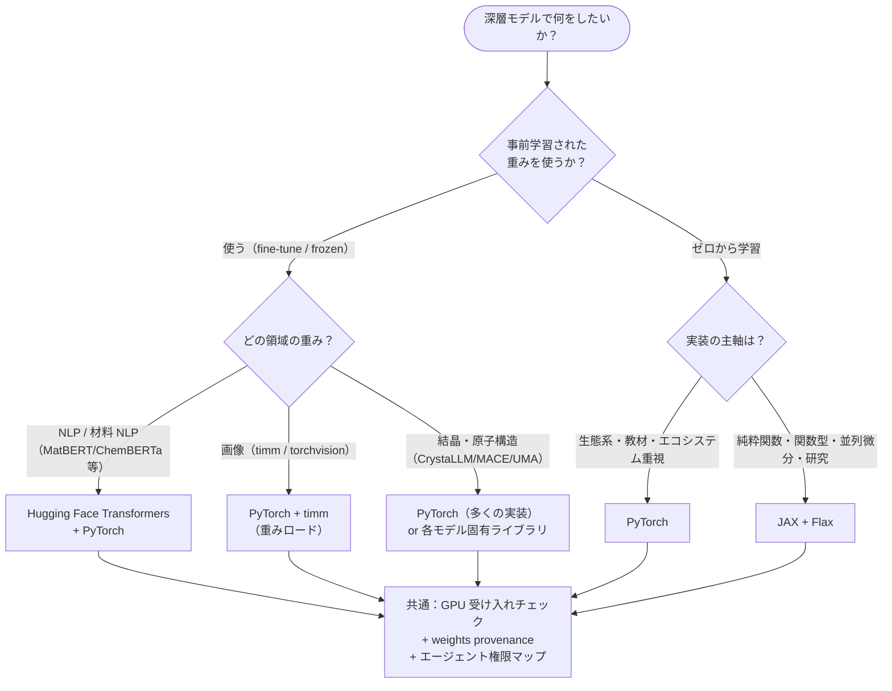
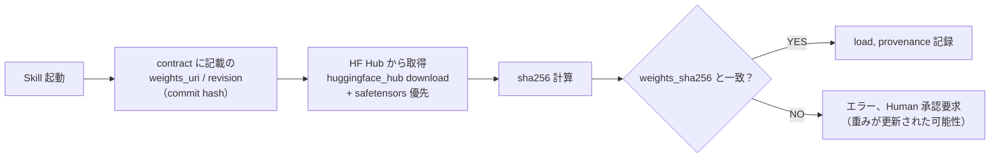

# 第3章 PyTorch / JAX / Hugging Face の Agentic 使い分け

> **本章の到達目標**
> - **PyTorch・JAX/Flax・Hugging Face** という 3 つの柱の役割分担を、**vol-02 の 2 本柱（scikit-learn + PyMC）** との対比で理解する
> - **Jupyter MCP 経由**で Copilot CLI エージェントがこれらのライブラリをどこまで自律的に叩けるか、**エージェント権限マップ**として整理する
> - **GPU バックエンド**（CUDA / ROCm / MPS）と **CPU fallback** の受け入れチェックを、Skill の起動時に走らせる仕組みを設計できる
> - **Hugging Face Hub からの重み配布**において、`weights_uri` + `weights_sha256` + `weights_license` を Skill provenance に落とし込める
>
> **本章で扱わないこと**
> - PyTorch/JAX の API 詳細（第4章以降のハンズオンで学ぶ）
> - モデルアーキテクチャ（CNN / Transformer / ViT）の内部構造（第6章）
> - fine-tuning / LoRA の実装（第7章）
> - Hugging Face Diffusers（本書は判別・回帰・埋め込みが主軸、生成モデルは扱わない）

---

## 3.1 なぜ「3 本の柱」なのか（vol-02 との比較）

vol-02 は **scikit-learn + PyMC** の 2 本柱でした。**目的が「予測精度」なら sklearn、「不確かさ・階層構造」なら PyMC** という切り分けで、実務の大半をカバーできました。

vol-03 では **深層学習 + Foundation Model** を扱うために、柱を 3 本に増やします。

| 柱 | 主な役割 | vol-02 との対比 |
|---|---|---|
| **PyTorch** | 生態系の広さ、教材の多さ、事実上の学界標準 | sklearn に相当する「主軸の実装ライブラリ」 |
| **JAX / Flax** | 関数型 + XLA コンパイル、明示的な純粋関数、研究向けの微分機能 | PyMC の関数型思想（NumPyro が JAX 上）と親和 |
| **Hugging Face**（Transformers + Hub + Datasets） | **事前学習重みの流通**、Tokenizer / Feature Extractor、Pipeline API | vol-02 にはなかった、「他人の学習成果を借りる」層 |

> [!TIP]
> **なぜ 4 本、5 本ではないのか**——道具の数が増えるほど、Skill の書き方・GPU provenance・エージェント権限マップの整合を保つコストが線形以上に増えます。本書は **「まず 3 本で足場を築き、必要になったときに拡張する」** 方針を採ります。拡張候補（PyTorch Lightning / Keras 3 / Diffusers / AllenNLP など）は §3.10 に列挙します。

---

## 3.2 使い分けマップ

### 判断フロー



### 判断の目安（表）

| 状況 | PyTorch | JAX/Flax | Hugging Face |
|---|---|---|---|
| **他人の事前学習重みを使う**（FM 転移） | ◎ | △（HF 変換が必要な場合あり） | ◎（Hub 経由） |
| **1D CNN / 2D CNN を ARIM 実データで**教師あり学習 | ◎ | ◯ | — |
| **Transformer / ViT を fine-tune** | ◎（timm / transformers） | ◯（Flax 実装は増加中） | ◎（PyTorch 実装が主流） |
| **不確かさつき深層モデル**（deep ensemble / MC-Dropout / BNN） | ◎ | ◎（NumPyro との統合で強い） | △ |
| **研究プロトタイピング**（新しい loss / 新しい微分計算） | ◯ | ◎（`grad`, `vmap`, `pmap`） | — |
| **教材・チュートリアル・書籍の量** | ◎ | ◯ | ◎ |
| **エージェントに触らせやすい**（安定 API / 例外の分かりやすさ） | ◎ | ◯（`jit` 内の error は難解になりがち） | ◎（`pipeline()` は特に easy） |
| **vol-02 PyMC / NumPyro との親和** | △ | ◎（NumPyro は JAX 上） | — |

### 「組み合わせて使う」が最も多い

実務では **重みの読み込みは HF Hub、モデル定義と学習は PyTorch、不確かさ推定の一部を JAX/NumPyro に切り出す** という組み合わせが最頻です。第13章 capstone はこの組み合わせを想定しています。

---

## 3.3 PyTorch の位置づけ

### PyTorch とは

- Meta 発、現在は Linux Foundation 傘下の **PyTorch Foundation** が運営[^pytorch]
- **動的計算グラフ**（define-by-run）、Python 中心の設計、豊富なエコシステム（`torchvision` / `torchaudio` / `timm` / `torchmetrics`）
- 材料 NLP・結晶グラフ・原子ポテンシャル系（CrystaLLM / MACE / UMA）の実装の**大半が PyTorch**

[^pytorch]: PyTorch は 2022 年に Meta から独立し PyTorch Foundation（Linux Foundation 傘下）に移管された。https://pytorch.org/foundation

### 本書での主用途

- **第6章** 教師あり深層 Skill（1D CNN / 2D CNN / ViT / Tabular）
- **第7章** 転移学習・fine-tuning
- **第8章** deep ensemble（Pillar 2 の主実装）
- **第10章** attribution（Captum が PyTorch 前提）

### 本書が PyTorch を主軸にする理由

1. **教材が多く、エージェントが参照しやすい**：PyTorch 例が豊富で、Copilot CLI が既存パターンを見つけやすい
2. **timm / transformers / Captum / torchmetrics** の生態系が揃っている
3. **fine-tune のワークフロー例が豊富**（少データ材料での実例も含む）

### 代替候補と、本書が主軸にしない理由

| 候補 | 本書が主軸にしない理由 |
|---|---|
| PyTorch Lightning | 抽象化のレイヤーが増え、**Skill provenance の記録位置が変わる**。§3.10 拡張候補 |
| Keras 3（backend = jax / torch / tensorflow） | 実装が新しく、材料 NLP / 原子構造系の事前学習重みが少ない |
| TensorFlow 単独 | 材料研究界隈のコード資産が PyTorch に集中している |

---

## 3.4 JAX / Flax の位置づけ

### JAX / Flax とは

- Google Research 発の **関数型数値計算ライブラリ**。NumPy 互換 API + `grad` / `jit` / `vmap` / `pmap` による自動微分・XLA コンパイル・ベクトル化・並列化[^jax]
- **Flax**：JAX 上の Neural Network API（`nn.Module` 相当）
- **NumPyro**：PyMC/Stan と同じ確率的プログラミング、**vol-02 で対応表のみ扱った**枠組み

[^jax]: JAX は "pure function" 前提の設計で、副作用のある関数は `jit` 内で予期せぬ挙動を起こす。エージェントが自律的にコードを書くとき、この pure-function 制約が **勝手な in-place 更新を防ぐ利点**と、**エラーが理解しにくい欠点**の両方を持つ。

### 本書での主用途

- **第9章** MC-Dropout / BNN の一部実装（NumPyro との連結）
- **第8-9章** 不確かさ推定（Pillar 2）で PyTorch と比較参照
- **第13章 capstone** 内で **PyMC / NumPyro** への橋渡し（vol-02 との親和）

### 本書が JAX を「第2の柱」にする理由

- **NumPyro (JAX 上) は vol-02 PyMC の思想と親和**：pure function・関数型・XLA
- **`vmap` による deep ensemble の効率化**：`N` 個のモデルを 1 つの JIT カーネルにまとめられる
- **研究コード**が JAX 実装で公開される頻度が上昇（例：DeepMind 系、GraphCast）

### 代替候補との比較

| 候補 | 位置づけ |
|---|---|
| PyTorch 単独 | 事足りることも多いが、`torch.func.vmap` も利用可能ながら JAX の変換体系ほど中心的ではなく、一部制約がある |
| JAX 単独（Flax なし） | Neural Network の boilerplate が増える。Flax（または Equinox）推奨 |
| Equinox | Flax より軽量。§3.10 拡張候補 |

---

## 3.5 Hugging Face の位置づけ

### Hugging Face とは

- **Transformers**：Transformer 系モデルの Python 実装、PyTorch / JAX / TensorFlow をバックエンドに選択可能
- **Hub**：モデル重み・データセット・Space（デモ）の**流通プラットフォーム**
- **Datasets**：データセット読み込み API
- **Tokenizers / Feature Extractors**：入力前処理の標準化

### 本書での主用途

- **第6章** 1D Transformer / ViT の骨格取得（`transformers` から）
- **第7章** frozen feature extractor としての FM 利用（第1章 §1.5 の FM 分類参照）：
  - **NLP 系 FM**：MatBERT / ChemBERTa / SciBERT / MoLFormer は HF Hub 経由で入手、`AutoModel` + `AutoTokenizer` の共通 API で扱える
  - **結晶・原子構造系 FM**：CrystaLLM / M3GNet / MACE / UMA はモデル固有ライブラリ中心（HF Hub にも一部あるが、API が統一されていない）
- **第11章** Foundation Model + hallucination 対策（Hub の重み provenance 検証）

### 本書が HF を「第3の柱」にする理由

1. **事前学習重みの事実上の配布路**：MatBERT / ChemBERTa / MoLFormer など NLP 系 FM が Hub 経由（結晶・原子構造系はモデル固有）
2. **Tokenizer / Feature Extractor が付属**：材料 NLP の前処理が一貫
3. **`pipeline()` API がエージェントに扱いやすい**：ただし、後述の**セキュリティ設定**が必須（§3.9）

### 注意点

| 注意 | 対処 |
|---|---|
| **重みの参照方式**：`revision` は branch（可変）/ tag（原則不変）/ commit hash（不変）を指定できる | Skill 契約では **必ず commit hash** を指定、`weights_sha256` を照合（付録A） |
| **事前学習データのライセンス**：arXiv 由来テキスト等が含まれる場合、商用利用・特許出願で問題化 | `pretraining_dataset_license` を provenance に記録（第2章 §2.9） |
| **重みライセンス**：Apache-2.0 / MIT / CC-BY-NC / 独自 と幅広い | `weights_license` を provenance に必須化（付録A） |
| **モデルカード（README）が古い**：性能値が別データで測られている | 自研究室データで再検証（第7章 grouped CV） |

---

## 3.6 GPU バックエンドと CPU fallback

### バックエンドの選択肢

| バックエンド | 環境 | 本書での扱い |
|---|---|---|
| **CUDA** | NVIDIA GPU | 主軸（大半の事前学習重みが検証済み） |
| **ROCm** | AMD GPU | 対応表のみ、動作確認は読者環境で |
| **MPS** | Apple Silicon（M シリーズ） | 対応表のみ、開発時の軽い動作確認用 |
| **CPU** | GPU なし環境 | **CI と受け入れテスト**の主軸、小規模データでの学習も可能 |

### 受け入れチェック（Skill 起動時に走らせる）

深層 Skill は起動時に以下を確認し、`provenance` に記録します（GPU バックエンドに関わる主要フィールドのみを抜粋。**完全なフィールド一覧は §3.7 と付録 A**）。

```python
# 概念コード（第4章で実装）
def check_backend():
    return {
        # --- GPU バックエンド関連（本節の主題） ---
        "gpu_backend": "cuda" | "rocm" | "mps" | "cpu",
        "cuda_version": "12.1" if cuda else None,
        "cudnn_version": "8.9" if cuda else None,
        "cudnn_deterministic": True,
        "cudnn_benchmark": False,
        "torch_deterministic_algorithms": True,
        "cublas_workspace_config": ":4096:8",
        "gpu_memory_gb": 24.0 if cuda else None,
        "random_seed_per_worker": 42,
        # --- 重み関連（§3.7 で詳述）は check_backend の外で計測 ---
        # weights_uri, weights_sha256, weights_license,
        # pretraining_dataset_license, tolerance は Skill 契約側で管理
    }
```

### CPU fallback の設計原則

- **推論のみの Skill** は原則 CPU で動くことを Skill 契約で担保する。ただし、**大型 FM**（原子構造系 MACE / UMA、あるいは大型 NLP FM）は CPU では RAM 不足・非現実的な推論時間になる場合があるため、**「CPU 非対応」を契約に明記**する例外を認める（第4章）
- **学習を含む Skill** は「GPU が使えないときは明示的にエラーを返す」または「小規模テスト用の CPU 実行モードを別 Skill として持つ」
- **CI では CPU モードで**、seed 固定・小サンプル・エポック数削減で回す（第4章）

> [!IMPORTANT]
> **エージェントに GPU を勝手に消費させない**——共有 GPU 環境では、エージェントの学習ジョブ起動は **第4章の学習権限設計**（推論のみ / 承認済み範囲内 fine-tune 可 / 事前承認ワークフロー内自律実行可）で制約します。

---

## 3.7 Hugging Face Hub の重み配布とハッシュ検証

> [!NOTE]
> 本節の「検証」は **SHA-256 によるハッシュ整合性の確認**であり、暗号学的な「署名（signature）」ではありません。真の署名（Sigstore / GPG / 署名付きマニフェスト等）は現状 HF Hub の標準機能ではなく、将来的な拡張候補です。本書は **hash + license + provenance 記録**で実用上の再現性・追跡可能性を担保する立場を採ります。

### Skill が重みを取得する流れ



### 契約に必須のフィールド

| フィールド | 例 | なぜ必要か |
|---|---|---|
| `weights_uri` | `huggingface.co/lbnlp/MatBERT-base` | どこから取得したか |
| `revision` | **Git commit hash**（例：`3fa2b1c...`）を推奨。branch 名（`main` 等）は可変のため契約には不適 | 同じリポジトリでも branch 更新で重みが変わりうる |
| `weights_sha256` | `d4c3b2...` | ダウンロード時の完全性検証（署名ではない） |
| `weights_license` | `Apache-2.0` | 商用利用・再配布の可否 |
| `pretraining_dataset_license` | `不明` を含めて記録 | 事前学習データが法的問題を起こしうる |
| `safetensors_available` | `true / false` | pickle ベース重み読み込みのリスク管理（§3.9） |

### エージェントに Hub アクセスを許すか

**Read-only ダウンロード**は許容範囲（ただしセキュリティ制約付き、§3.9）、**アップロード（`push_to_hub`）は本書では全レベルで禁止**——これが基本方針です。

---

## 3.8 AI エージェント × Jupyter MCP からの使い方

vol-01・vol-02 で構築した **Copilot CLI + Jupyter MCP** の枠組みは vol-03 でもそのまま使います。深層 Skill も **Notebook 上で動かすことを前提**に書きます。

### 典型的な作業ループ（vol-02 との差分）

1. **ユーザー**：目的と入力データをエージェントに提示（例：「ARIM 風合成 SEM で ViT を frozen feature extractor として使い、装置別に stratified split で分類したい」）
2. **エージェント**：既存の Skill（例：`vit-frozen-feature-classifier`）を選び、契約を満たすように Notebook セルを組み立てる
3. **エージェント → 受け入れチェック**：GPU / cuDNN / 重み sha256 の照合を最初のセルで走らせる（§3.6）
4. **Jupyter MCP**：Notebook を実行、GPU 使用量をログ
5. **エージェント**：結果 + calibration + attribution + 学習曲線を要約
6. **ユーザー**：Human-in-the-loop で **checkpoint 保存の可否・次アクション**を承認（第4章 学習権限設計）

### vol-03 で追加される規律

| 規律 | 対応章 |
|---|---|
| **GPU 受け入れチェック**：起動時に backend / cuDNN 設定を照合 | 第3章 §3.6 / 第4章（契約） |
| **重み provenance**：`weights_uri / revision / sha256 / license` | 第3章 §3.7 / 付録A |
| **augmentation 契約**：train のみで使う、agent が強度変更しない | 第5章 |
| **calibration + Agentic 停止ゲート**：不確かさ閾値で自律を止める | 第8-9章 |
| **checkpoint 上書き承認ゲート**：Human 承認なしに上書き禁止 | 第4章 |

### エージェントに「モデル選択の暴走」をさせない（vol-02 から継承）

vol-02 第3章で挙げた **循環設計問題** は、深層でさらに深刻化します。**評価指標・停止基準を Skill 契約に事前に書き**、エージェントに「指標の選び直し」「fine-tune ハイパーパラメータの勝手な変更」を許可しない設計にします（第4・第7章）。

---

## 3.9 エージェント権限マップ（どこまで自律的に叩けるか）

第4章で詳しく設計する **3 段階権限**（レベル 1：推論のみ／レベル 2：承認済み範囲内で fine-tune 可／レベル 3：事前承認ワークフロー内で自律実行可）を、ライブラリ操作別に予告します。

| 操作 | レベル 1 | レベル 2 | レベル 3 | 備考 |
|---|:---:|:---:|:---:|---|
| `model.eval()` + 推論 | ✅ | ✅ | ✅ | 全レベル可 |
| `torch.load` で既存 checkpoint 読み込み | ⚠️ 条件付き | ⚠️ 条件付き | ⚠️ 条件付き | **`weights_only=True` または safetensors 経由**、+ sha256 検証必須。`weights_only=False` は Human 承認 |
| `safetensors.load_file` で重み読み込み | ✅ | ✅ | ✅ | pickle 実行を含まないため安全。sha256 検証は必須 |
| `HuggingFace pipeline()` で推論 | ⚠️ 条件付き | ⚠️ 条件付き | ⚠️ 条件付き | **commit hash 固定 + `trust_remote_code=False` + safetensors 優先 + sha256 検証**が全て満たされる場合のみ許可。デフォルト branch のまま呼び出すのは禁止 |
| `model.train()` + 学習ループ | ❌ | ✅ | ✅ | 事前承認ワークフロー内 |
| `torch.save` で新 checkpoint 保存（別名） | ❌ | ✅ | ✅ | 追記のみ |
| `torch.save` で既存 checkpoint **上書き** | ❌ | ❌ | ✅ | Human 承認ゲート必須 |
| `huggingface_hub.download`（読み取り） | ✅ | ✅ | ✅ | commit hash 固定 + sha256 検証 |
| `huggingface_hub.push_to_hub`（アップロード） | ❌ | ❌ | ❌ | **本書は全レベルで禁止**、外部公開は Human のみ |
| Hub の重み revision（commit hash）を変更 | ❌ | ❌ | ❌ | 契約の revision を書き換えるのは Human のみ |
| augmentation の種類・強度を変更 | ❌ | ❌ | ❌ | augmentation 契約による（第5章） |
| 学習率・エポック数を変更 | ❌ | 契約範囲内 | 契約範囲内 | 契約が「範囲」を規定 |

> [!WARNING]
> **pickle と `torch.load`**：`torch.load` はデフォルトで pickle を使って重みをデシリアライズするため、悪意ある checkpoint を読み込むと**任意コード実行**が発生します。エージェントに `torch.load` を許すときは、必ず以下のいずれかを満たします：
> - `weights_only=True` を明示的に指定（PyTorch 2.x）
> - **safetensors 形式**の重みに切り替える（pickle を含まず、実行リスクなし）
> - 事前に **sha256** 検証と、信頼できる配布元（Hub の公式リポジトリ等）の確認

> [!WARNING]
> **上書き系操作 3 つ**（既存 checkpoint 上書き / Hub アップロード / augmentation 変更）は、Skill 単位ではなく **ワークフロー全体の承認**が必要です（第4章）。エージェントがこれらを実行しようとしたら、必ず Human に判断を求める設計にします。また、上記の pickle リスクにより **`torch.load` は「読み取り」であっても無条件では許さない**設計になります。

---

## 3.10 拡張候補・扱わないこと

| 拡張 | 動機 | 参照 |
|---|---|---|
| **PyTorch Lightning** | ボイラープレート削減 | 抽象層が Skill provenance の位置を変える。本書は生 PyTorch |
| **Keras 3**（multi-backend） | 一貫 API | 材料 NLP / 原子構造系の重み流通が限定的 |
| **Equinox**（JAX 上） | Flax より軽量 | 教材の少なさから本書は Flax |
| **Diffusers**（生成モデル） | 逆設計 | 生成 × Agentic は vol-05 候補 |
| **DeepChem** | 材料・化学特化ラッパ | ラッパ層により provenance 記録箇所が増えるため、本書では扱わない |
| **AllenNLP** | NLP フレームワーク | HF Transformers に集約 |
| **JAX-MD / TorchMD** | 分子動力学 | 本書は「予測・分類・埋め込み」に scope 限定 |

---

## 3.11 まとめ + 章末チェック

- vol-03 は **PyTorch + JAX/Flax + Hugging Face** の 3 本柱で深層 × Agentic を扱う
- **PyTorch** は生態系・教材の広さで主軸、**JAX/Flax** は関数型と NumPyro 親和で第2の柱、**HF** は重み流通の事実上のインフラ
- **GPU 受け入れチェック**（backend / cuDNN 設定 / メモリ）を Skill 起動時に走らせ、provenance に記録
- **HF Hub の重み**は `weights_uri / revision（commit hash） / sha256 / license / pretraining_dataset_license / safetensors_available` を Skill 契約に必須化。「署名」ではなく**ハッシュ検証**である点を明確に扱う
- **セキュリティ**：`torch.load` は pickle リスクにより **`weights_only=True` または safetensors 経由**、`pipeline()` は **commit hash + `trust_remote_code=False` + safetensors** が満たされる場合のみ許可
- **エージェント権限マップ**：推論と読み取りは条件付きで可、学習と書き込みは段階的に、Hub アップロード / augmentation 変更 / revision 変更は Human 専管
- 次章（第4章）から、**深層 × Agentic Skill の設計原則**——特に GPU provenance と Agentic 学習権限設計——に入る

### 章末チェックリスト

- [ ] **PyTorch / JAX / HF を「どういう場面で使い分けるか」** を、1 分で説明できる
- [ ] 自分のデータで、**主に使うのは PyTorch か HF pipeline か**、当たりがついている
- [ ] **GPU 受け入れチェック**が何をチェックするか（backend / cuDNN 設定 / メモリ）を挙げられる
- [ ] **HF Hub からの重み取得**で記録すべき 6 フィールドを挙げられる（`weights_uri / revision（commit hash） / sha256 / license / pretraining_dataset_license / safetensors_available`）
- [ ] **`torch.load` の pickle リスク**と回避策（`weights_only=True` / safetensors）を説明できる
- [ ] **`pipeline()` の安全条件**（commit hash + `trust_remote_code=False` + safetensors）を挙げられる
- [ ] **エージェントに絶対に許さない操作 3 つ**（既存 checkpoint 上書き / Hub アップロード / augmentation 契約違反）を了解している
- [ ] Skill provenance は **vol-01/02 の基本形 + vol-03 の GPU/深層/Agentic 拡張** で書くことを了解している

---

## 参考資料

### 本書内の該当章
- 第0章 vol-01/02 の最小復習
- 第1章 §1.5 Foundation Model 時代の 4 選択肢
- 第2章 §2.5 GPU 非決定性と重み provenance
- 第2章 §2.9 演習用データセット（含 HF Hub のライセンス実務）
- 第4章 深層 × Agentic Skill 設計原則、学習権限設計（次章）
- 付録A GPU / 深層 / Agentic provenance スキーマ

### 外部参考

- PyTorch 公式: https://pytorch.org/
- PyTorch 決定性ガイド: https://pytorch.org/docs/stable/notes/randomness.html
- JAX 公式: https://jax.readthedocs.io/
- Flax 公式: https://flax.readthedocs.io/
- Equinox: https://docs.kidger.site/equinox/
- Hugging Face Transformers: https://huggingface.co/docs/transformers/
- Hugging Face Hub: https://huggingface.co/docs/hub/
- Hugging Face Hub ライセンス: https://huggingface.co/docs/hub/repositories-licenses
- safetensors（pickle 非依存の安全な重みフォーマット）: https://huggingface.co/docs/safetensors
- timm: https://github.com/huggingface/pytorch-image-models
- Captum: https://captum.ai/
- NumPyro: https://num.pyro.ai/
- MatBERT: https://github.com/lbnlp/matbert
- ChemBERTa: https://github.com/seyonechithrananda/bert-loves-chemistry
- CrystaLLM: https://github.com/lantunes/CrystaLLM
