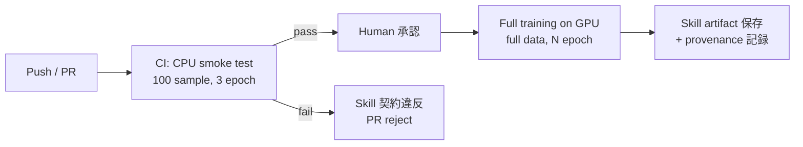

# 第4章 深層 × Agentic Skill の設計原則

> **本章の到達目標**
> - vol-01 第7章「Skill 設計 6 要素」と vol-02 第4章「統計/ML 版拡張」を、**深層学習 × Agentic** に拡張した設計原則を理解する
> - Skill 仕様書に **3 つの新しい問い**——「何を成功とみなすか」「どの環境で再現するか」「**エージェントに何を許すか**」——を書き下せる
> - **循環設計問題の深層版**（エポック数・augmentation 強度・early stopping の勝手な変更）を防ぐ仕組みを設計できる
> - **Agentic 学習権限設計（3 段階権限）**——推論のみ / 承認済み範囲内 fine-tune 可 / 事前承認ワークフロー内自律実行可——を、自研究室の運用に合わせて選べる
> - **深層 × Agentic Skill 仕様書テンプレート** と **GPU/Agentic provenance スキーマ** を、本章の成果物として持ち帰る
>
> **本章で扱わないこと**
> - 具体的な PyTorch/JAX/HF の API 呼び出し（第6章以降のハンズオン）
> - augmentation の実装（第5章）
> - CV 設計の詳細（第7章、vol-02 第7章の深層版）
> - 不確かさ推定手法の実装（第8-9章）

---

## 4.1 なぜ「設計」から始めるのか（深層 × Agentic 版の動機）

vol-02 第4章の設計原則は、**「何を成功とみなすか」＋「どの環境で再現するか」** の 2 問を Skill 仕様書に書き下すことでした。深層 × Agentic では、**もう 1 問**が加わります。

**vol-03 の 3 つの問い**：

| # | 問い | 中心となる論点 | 対応節 |
|---|---|---|---|
| 1 | **何を成功とみなすか** | 評価指標 + 目的関数 + 許容範囲。**深層では calibration・不確かさ閾値**も含む | §4.3 |
| 2 | **どの環境で再現するか** | seed / cuDNN / GPU backend / weights sha256 / tolerance の provenance | §4.4-§4.5 |
| 3 | **エージェントに何を許すか**（新） | 学習ジョブ起動範囲 / checkpoint 上書き / FM 更新 / augmentation 変更の 3 段階権限 | §4.7 |

vol-02 では **「モデル選択の暴走」** が中心的なリスクでしたが、vol-03 では **「学習ジョブ・checkpoint・重みの上書きが自律的に走る」**——影響範囲がはるかに広い運用リスクが加わります。設計を先に書かなければ、**エージェントが週末に checkpoint を大量上書きして、翌週の校正が壊れる**といった事故が現実になります。

> [!TIP]
> 3 番目の問いは vol-01 第6章「Human-in-the-loop」の深層版です。vol-01 では「ユーザーが確認する」ことが中心でしたが、vol-03 では **エージェントが何を許され、何をブロックされるか**を Skill 契約に**明示的に符号化**することを求めます。

---

## 4.2 6 要素の深層 × Agentic 拡張

vol-01 の 6 要素は深層 × Agentic Skill でもそのまま使えます。各要素の**中身**が深層 × Agentic 特有になる点を、vol-01・vol-02 との対比で示します。

| # | 要素 | vol-01（データ整備） | vol-02（統計/ML） | vol-03（深層 × Agentic） |
|---|---|---|---|---|
| ① | 目的 | 「XRD ファイルを標準 DataFrame に変換」 | 「組成 20 変数から硬度を回帰予測」 | 「ARIM 風合成 SEM を装置別に 5 クラス分類する fine-tune 済み ViT」 |
| ② | 入力条件 | 装置形式・単位・欠損率 | 特徴量スキーマ・目的変数 | **上記 + 事前学習重み仕様**（`weights_uri` / `revision` / `sha256` / `license`） **+ GPU 要件** |
| ③ | 出力形式 | 標準 DataFrame | 学習済みモデル + 評価指標 + 予測 | **上記 + calibration 指標（Brier/ECE）+ 不確かさ + attribution + augmentation ログ** |
| ④ | 成功条件 | 契約チェック通過 | 指標 X ≥ Y、CV 設計 Z | **上記 + calibration 閾値 + 不確かさ閾値 + GPU determinism 許容 tolerance** |
| ⑤ | 禁止事項 | 生データ上書き | + データリーク・指標後付け | **+ checkpoint 上書き・augmentation 契約違反・FM revision 変更・push_to_hub** |
| ⑥ | 再現性条件 | input_sha / skill_version / seed | + cv_scheme / model_config / sampler_config | **+ gpu_backend / cudnn_deterministic / weights_sha256 / augmentation_config / agent_authorization** |

本章では、**④成功条件・⑤禁止事項・⑥再現性条件**に加え、**新設の Agentic 学習権限設計**（§4.7）を深掘りします。

---

## 4.3 成功条件の 3 点セット + 深層特有の追加

vol-02 §4.3 で確立した **3 点セット**（評価指標・目的関数・許容範囲）は深層でもそのまま使います。深層 × Agentic では、以下の**追加成分**を成功条件に組み込みます。

### 深層 × Agentic の追加成分

| 追加成分 | 意味 | 例 |
|---|---|---|
| **Calibration 閾値** | 予測確率が実際の頻度と合っているか | ECE ≤ 0.05、Brier score ≤ 0.15 |
| **不確かさ閾値** | エージェントが自律決定してよい不確かさ上限 | predictive entropy ≤ 0.3、ensemble variance ≤ σ_max |
| **Attribution の sanity check 通過** | Grad-CAM/IG などの説明がパラメータ/ラベルのランダム化に対して**適切に変化する**（=モデル依存性を持つ） | model-parameter-randomization test / label randomization test を通過（第10章） |
| **GPU determinism tolerance** | 完全再現ではなく差分を許容 | 学習曲線が 3 seed で loss ± 0.02 以内で収束 |
| **CPU モードでの smoke test 通過** | CI で最低限動くこと | 縮小データ・少エポックで学習ループが完走 |

### 深層で埋めた 3 点セットの例（分類）

> ✅ **成功条件（1D CNN でスペクトル分類、ARIM 風合成）**：
> - **評価指標**：F1（macro 平均） + 混同行列 + **ECE**（calibration）
> - **目的関数**：cross entropy（label smoothing 0.05）
> - **許容範囲**：
>   - grouped CV（装置単位）の平均 F1 ≥ 0.85、各装置での F1 ≥ 0.78
>   - **ECE ≤ 0.05**、reliability diagram で 5 bin 中 4 bin が対角線 ±0.1 以内
>   - **予測時**：エージェント自律決定は **正規化 predictive entropy ≤ 0.3**（クラス数 K に対して `H / log(K)` で正規化）の場合のみ、それ以外は Human 送り
>   - **GPU determinism**：seed × 3 で 5-fold F1 の標準偏差 ≤ 0.01（それ以上ばらつくなら fold 数か seed 数を増やす）

### 悪い成功条件（深層特有）

> ❌ 「accuracy 90% 以上」——**キャリブレーションと不確かさ閾値が未定義。誤検出のコストが暗黙。**
>
> ❌ 「学習曲線が下がりきれば OK」——**loss と評価指標のどちらを見ているか不明。overfitting を隠す。**
>
> ❌ 「augmentation を強くすれば精度が上がる」——**augmentation の物理妥当性（第5章）が未定義。**

> [!IMPORTANT]
> 深層モデルの精度は augmentation 強度・エポック数・学習率で **簡単に上下します**。事前に **「不確かさ閾値まで書いた 3 点セット」** を固定しておかないと、エージェントが「精度が上がった」を根拠に **augmentation を勝手に強めたり epoch を伸ばしたりする** ——これが循環設計問題の深層版です（§4.6）。

---

## 4.4 どの環境で再現するか — GPU/Agentic provenance の 3 レイヤ

第2章 §2.5 と第3章 §3.6–§3.7 で挙げた provenance フィールドを、**3 レイヤ**に整理します。以下の表はスキーマの**論理構造**を示し、実装 YAML（§4.10、付録 A）ではこれらを `gpu_backend.cuda_version` のように**ネストしたキー**として保存します。

### Layer 1: GPU バックエンド

| フィールド | 例 | 意味 |
|---|---|---|
| `gpu_backend` | `cuda` / `rocm` / `mps` / `cpu` | 計算基盤 |
| `cuda_version` | `12.1` | ドライバ非依存部の再現性 |
| `cudnn_version` | `8.9` | cuDNN の一部演算は非決定的（第2章） |
| `cudnn_deterministic` | `true` | `torch.backends.cudnn.deterministic` |
| `cudnn_benchmark` | `false` | ベンチマークモードは非決定的経路を選ぶ |
| `torch_deterministic_algorithms` | `true` | `torch.use_deterministic_algorithms(True)` |
| `cublas_workspace_config` | `":4096:8"` | matmul の決定性を担保 |
| `gpu_memory_gb` | `24.0` | OOM 回避、モデル選択の記録 |

### Layer 2: 事前学習重み

| フィールド | 例 | 意味 |
|---|---|---|
| `weights_uri` | `huggingface.co/lbnlp/MatBERT-base` | どこから取得したか |
| `revision` | commit hash（`3fa2b1c...`）を必須 | branch 名は可変、契約に不適（第3章 §3.5） |
| `weights_sha256` | `d4c3b2...` | ハッシュ検証（署名ではない） |
| `weights_license` | `Apache-2.0` | 商用可否・再配布可否 |
| `pretraining_data_license` | `不明` を含む | 事前学習データの法的リスク |
| `safetensors_available` | `true` / `false` | pickle exec リスク管理（第3章 §3.7） |

### Layer 3: 学習・推論の設定

| フィールド | 例 | 意味 |
|---|---|---|
| `random_seed_per_worker` | `[42, 43, 44, 45]` | DataLoader worker ごとの seed |
| `finetune_config` | `{"lr": 3e-5, "epochs": 5, "freeze_layers": [0-8]}` | fine-tune の全ハイパー |
| `augmentation_config` | `{"rotation": null, "flip": "horizontal_only", "intensity_jitter": 0.1}` | augmentation の**契約**（第5章） |
| `tolerance` | `{"metric_std": 0.01, "loss_variance": 0.02}` | 3 seed 実行での許容ばらつき |
| `checkpoint_overwrite_policy` | `append_only` / `overwrite_with_human_approval` | §4.7 権限設計と連動 |

### 3 レイヤを分ける理由

Layer 1 は **環境**、Layer 2 は **他人の学習成果**、Layer 3 は **自分の学習/推論**——**責任と変更頻度が異なる**ため、Skill 契約でも別のブロックに書きます。エージェントに触れることを許すかどうかも、レイヤごとに異なります（§4.7）。

---

## 4.5 CI 上の CPU 学習（smoke test の設計）

vol-02 第4章では「CI 上の実行」を扱いましたが、深層モデルでは **GPU が CI 上で動かないことが普通**です。そこで、次の設計パターンを採ります。

### Smoke test の要件

- **縮小データ**：合成データ 100 サンプル程度（vol-03 の ARIM 風合成データを主軸に）
- **少エポック**：3-5 エポックで loss の**下降傾向**が見えれば合格（絶対値は問わない）
- **seed 固定**：seed=0 と seed=1 で loss 曲線の**符号（下降）**が一致
- **CPU 動作**：`gpu_backend=cpu`、`torch.set_num_threads(2)` で安定化
- **tolerance**：`loss ≤ initial_loss - Δ`（Δ は事前設定）

### CI とフル学習の役割分担



> [!TIP]
> **フル学習を CI で回さないことが本書の設計原則**です。GPU コストが線形以上に膨らむ・共有 GPU がボトルネックになる・非決定性でテストが flaky になる、の 3 理由。Full training は **Human 承認後にワークフローとして起動**する設計にします（§4.7）。

---

## 4.6 循環設計問題の深層版

vol-02 §4.4 で扱った循環設計問題は、深層でさらに深刻化します。

### 定義

**エージェントが「評価指標」「モデル選択」「augmentation 強度」「エポック数」「learning rate」の複数を同時に触れると、指標が「都合の良い方向」に選ばれる**——これが深層版の循環設計問題です。

### 具体例

```
ユーザー：「精度を上げてください」
エージェント：「augmentation を強くしました。F1=0.92 です」
（実は augmentation で結晶方位を壊す回転が入り、
 現場の実データでは F1=0.60 まで落ちる）
```

```
ユーザー：「学習曲線を安定させてください」
エージェント：「early stopping の閾値を緩めました。loss=0.05 です」
（実は overfitting が進み、独立テストで性能が下落）
```

### 予防策（Skill 契約に書き下す）

| 予防策 | 契約フィールド | 具体 |
|---|---|---|
| **評価指標を Skill 契約で固定** | `metric_definition` | エージェントが評価指標を選び直すのは違反 |
| **augmentation を契約で固定** | `augmentation_config` | エージェントが augmentation の種類・強度を変えるのは違反（第5章） |
| **エポック数・learning rate の範囲を契約で固定** | `finetune_config.hp_range` | 契約範囲外の値をエージェントが選ぶのは違反 |
| **early stopping の条件を契約で固定** | `finetune_config.early_stopping` | 閾値・patience の変更はエージェント側で禁止 |
| **独立テストは 1 回しか触らせない** | `test_access_log` | 独立テストへのアクセス回数を記録 |

> [!WARNING]
> **「精度が上がったのでこの設定を採用しました」** とエージェントが言ってきた場合、**評価指標・augmentation・エポック数・LR のうち複数が変わっていないか**を必ず確認します。1 つ以上変わっていれば、それは自律決定ではなく設計変更であり、Human 承認が必要です（§4.7）。

---

## 4.7 Agentic 学習権限設計（新設節）

vol-01 第6章「Human-in-the-loop」は、**「ユーザーが最終判断する」** ことを中心テーマにしていました。vol-03 では、これを **「エージェントが何を許され、何をブロックされるか」** の設計として、**3 段階権限**に整理します。

### 3 段階権限

権限レベルは**契約に事前記載**された範囲でのみ有効です。範囲外の操作は **§4.7 末尾の 4 承認ゲート**を通す必要があります。「事前記載」＝ Skill 仕様書 §⑦・provenance の `agent_authorization` にて、Human が明示的に定義済みという意味です。

| レベル | 名称 | エージェントに許すこと（**事前承認範囲内**） | 典型的な運用 |
|---|---|---|---|
| **L1** | **推論のみ** | 学習済みモデルの読み込み・推論・attribution 計算・レポート生成 | 本番運用、Human は結果を確認して意思決定 |
| **L2** | **承認済み範囲内 fine-tune 可** | L1 + `approved_hp_range` 内でのハイパー選択・学習ジョブ起動・新 checkpoint 保存（**別名のみ、既存 checkpoint 上書き不可**）。範囲外は都度承認ゲートへ | 週次の再学習パイプライン、契約範囲は Human が事前定義 |
| **L3** | **事前承認ワークフロー内自律実行可** | L2 + 事前承認された**ワークフロー承認 ID** に紐づく範囲でのみ、既存 checkpoint 上書き（バージョンタグ必須）・複数実験の自律スケジュール | 実験計画自動化パイプライン（本書は L3 の設計まで、運用は読者環境） |

> [!NOTE]
> **承認の粒度**：本書では「契約時の 1 回承認で範囲内は都度承認不要」を推奨します。範囲外だけ都度承認ゲート（下記 4 種）を通します。「範囲」の妥当性を Human が定期レビュー（例：月次）することが前提です。

**すべてのレベルで禁止**：
- Hugging Face Hub への `push_to_hub`（アップロード）
- 契約の `revision`（重み commit hash）を変更
- `augmentation_config` を勝手に変更
- 評価指標・目的関数・許容範囲を変更

### 4 つの承認ゲート

権限レベルによらず、以下の 4 操作は **Human 承認ゲート**を通過しないと実行できません。

| ゲート | 対象 | Human が判断すること |
|---|---|---|
| **計算資源承認ゲート** | 学習ジョブ起動（GPU 時間・エネルギー） | ジョブが必要か、他ユーザーとの GPU 共有への影響 |
| **重み変更承認ゲート** | 新 checkpoint 保存（別名） / 既存 checkpoint 上書き | 過去モデルの再現性を壊さないか |
| **FM 更新承認ゲート** | `revision`（事前学習重みの commit hash）を新版に切り替え | 事前学習データ・ライセンスが変わっていないか（第3章 §3.7） |
| **判断停止ゲート** | 予測不確かさが閾値超過時のエージェント動作 | 自律停止 → Human に判断を投げる（第8-9章） |

### 権限マップの例（Skill 契約フィールド）

```yaml
agent_authorization:
  level: L2  # L1 / L2 / L3
  training_job_approval:
    required: true
    approver: "lab_admin@example.com"
    approval_record_id: "APP-2026-0128-01"   # 事前承認済みレコード ID
    approved_hp_range:
      lr: [1e-5, 1e-4]
      epochs: [3, 10]
      batch_size: [16, 32]
  checkpoint_overwrite_policy: "append_only"  # append_only / overwrite_with_approval
  fm_update_gate:
    required: true
    approved_revisions:
      - "3fa2b1c9..."
  uncertainty_stop_gate:
    metric: "predictive_entropy_normalized"
    threshold: 0.3
    on_exceed: "route_to_human"
  # 安全ロードポリシー（ch03 §3.7-3.9 の予防条件を契約に組み込む）
  weight_load_policy:
    torch_load_weights_only: true            # torch.load(..., weights_only=True) 必須
    require_safetensors: true                # safetensors_available=false のときブロック
    require_weights_sha256_verified: true    # 取得後にハッシュ照合
    revision_must_be_commit_hash: true       # branch/tag 名は拒否
    trust_remote_code: false                 # HF pipeline() / from_pretrained() 共通
```

### vol-01 Ch6 との対応

| vol-01 Ch6（データ整備の HITL） | vol-03 §4.7（深層 × Agentic） |
|---|---|
| 予防的原則 1：確認可能な変更 | L1-L3 すべてで provenance に変更履歴を記録 |
| 予防的原則 2：可逆な変更 | checkpoint は `append_only` を原則、上書きは Human 承認 |
| 予防的原則 3：スコープを絞る | Skill 契約の `approved_hp_range` で自律範囲を数値化 |

> [!IMPORTANT]
> **どのレベルを採用するかは研究室ごとに違います**。本書は L1-L3 の設計テンプレートを提供しますが、**まず L1 から始めて、Skill 実装と Human 検証の実績が積まれた後に L2 への昇格を検討する**ことを推奨します。実験計画自動化（L3）は、本書の scope の到達点であり、本番運用は次巻（vol-04 候補）で扱う可能性があります。

---

## 4.8 深層 × Agentic Skill の禁止事項（severity 付き）

vol-02 §4.5 の禁止事項に、深層 × Agentic 特有項目を追加します。

| 分類 | 項目 | severity |
|---|---|---|
| A. データ流路（vol-01/02 継承） | 生データ上書き / 外部送信 | fatal |
| A. データ流路（vol-01/02 継承） | データリーク（分割違反・特徴量に目的変数混入） | fatal |
| A. データ流路（vol-03 追加） | **事前学習データと評価データの重複**（第2章 §2.6） | fatal |
| A. データ流路（vol-03 追加） | augmentation を val / test に適用 | fatal |
| B. 評価基準の後付け（vol-02 継承） | 評価指標・合格閾値の後付け変更 | audit violation |
| B. 評価基準の後付け（vol-03 追加） | **calibration 閾値・不確かさ閾値の後付け緩和** | audit violation |
| B. 評価基準の後付け（vol-03 追加） | 独立テストへの複数回アクセス（`test_access_log` を超過） | audit violation |
| C. 権限違反（vol-03 新規） | 契約範囲外のハイパーパラメータで学習 | audit violation |
| C. 権限違反（vol-03 新規） | `augmentation_config` を Skill 内で変更 | audit violation |
| C. 権限違反（vol-03 新規） | 既存 checkpoint を Human 承認なしに上書き | fatal |
| C. 権限違反（vol-03 新規） | Hub への `push_to_hub` を Skill 内で実行 | fatal |
| C. 権限違反（vol-03 新規） | 契約の `revision` を Skill 内で書き換え | fatal |
| D. 安全性（vol-03 新規） | `torch.load(..., weights_only=False)` を検証なしに実行 | fatal |
| D. 安全性（vol-03 新規） | HF `pipeline()` を `trust_remote_code=True` で呼び出す | fatal |
| E. 適用範囲（vol-02 継承 + 拡張） | domain gap 検知を無視して推論 / 装置固有性を無視して結果報告 | warning / flag / fatal（用途で選択） |

---

## 4.9 深層 × Agentic Skill 仕様書テンプレート（**成果物 1**）

第5章以降のすべての深層 × Agentic Skill 設計で、以下のテンプレートを起点にします。vol-02 §4.7 のテンプレートを深層 × Agentic に拡張したものです。

```markdown
# Skill 仕様書（深層 × Agentic 版）：<Skill 名>

## ① 目的
- 何を予測/推定/分類するか、1 文で
- どの判断に使うか（例：装置別分類・fine-tune 後の妥当性検証）
- `task_type`：dl_regression / dl_classification / dl_segmentation / dl_uncertainty / fm_frozen_feature / fm_finetune
- **エージェント役割**：この Skill でエージェントが判断すること・Human に投げること

## ② 入力条件
- **データ型**：spectrum / timeseries / image / pattern / tabular / multimodal
- **特徴量スキーマ**：列名・単位・型・値域（vol-01 第8章）
- **目的変数**：列名・単位・型・値域（教師ありの場合）
- **サンプル数**：想定 n の最小・最大
- **grouping key**（装置別・ロット別 CV 用、vol-02 第7章、および vol-03 第7章）
- **事前学習重み仕様**：`weights_uri` / `revision`(commit hash) / `weights_sha256` / `weights_license` / `pretraining_data_license` / `safetensors_available`
- **GPU 要件**：必要メモリ・fallback 可否

## ③ 出力形式
- **学習済みモデル**：`safetensors` を優先。`torch.save` を使う場合は state_dict / tensor-only 形式で保存し、**読み込み側は `torch.load(..., weights_only=True)` を必須**とする（`torch.save` 自体に `weights_only` オプションはない、第3章 §3.7）
- **評価結果**：CV スコア（各 fold + 集計）+ **calibration 指標**（Brier/ECE）
- **予測**：予測値 + 予測確率 + **不確かさ**（entropy / ensemble variance） + attribution（オプション）
- **augmentation ログ**：何がどの epoch でどう適用されたか
- **provenance**：付録 A 準拠、Layer 1-3 完全記録

## ④ 成功条件（3 点セット + 深層追加）
- **評価指標**：<task_type に応じて>
- **目的関数**：<学習損失、label smoothing 有無>
- **許容範囲**：<CV スコア閾値、fold ばらつき>
- **calibration 閾値**：<ECE ≤ X、Brier ≤ Y>
- **不確かさ閾値**：<正規化 predictive entropy（`H/log(K)`）≤ Z（エージェント自律停止条件）>
- **GPU determinism tolerance**：<3 seed で std ≤ W>
- **CPU smoke test**：<縮小データ・少エポックで loss 下降傾向>

## ⑤ 禁止事項（§4.8 表を参照、Skill 固有項目を追記）

## ⑥ 再現性条件
- vol-01 継承：`input_sha256` / `skill_version` / `run_datetime_utc` / `package_versions` / `random_seed`
- vol-02 継承：`cv_scheme` / `data_split` / `model_config` / `metric_definition`
- **vol-03 Layer 1 (GPU)**：`gpu_backend.type` / `gpu_backend.cuda_version` / `gpu_backend.cudnn_version` / `gpu_backend.cudnn_deterministic` / `gpu_backend.cudnn_benchmark` / `gpu_backend.torch_deterministic_algorithms` / `gpu_backend.cublas_workspace_config` / `gpu_backend.gpu_memory_gb` / `gpu_backend.random_seed_per_worker`
- **vol-03 Layer 2 (重み)**：`pretrained_weights.weights_uri` / `pretrained_weights.revision` / `pretrained_weights.weights_sha256` / `pretrained_weights.weights_license` / `pretrained_weights.pretraining_data_license` / `pretrained_weights.safetensors_available`
- **vol-03 Layer 3 (学習/推論)**：`finetune_config` / `augmentation_config` / `tolerance` / `agent_authorization.checkpoint_overwrite_policy`

## ⑦ Agentic 権限（§4.7）
- `agent_authorization.level`：L1 / L2 / L3
- `training_job_approval`：承認者・承認 ID・承認済み HP 範囲
- `checkpoint_overwrite_policy`：append_only / overwrite_with_approval
- `fm_update_gate`：approved_revisions リスト
- `uncertainty_stop_gate`：閾値・on_exceed 挙動
- `weight_load_policy`：`torch_load_weights_only` / `require_safetensors` / `require_weights_sha256_verified` / `revision_must_be_commit_hash` / `trust_remote_code`
```

---

## 4.10 GPU / Agentic provenance スキーマ（**成果物 2**）

§4.4 で示した 3 レイヤを、**Skill 実装が読み書きする YAML 形式**にまとめます。完全定義は付録 A、本節は概観のみ。

```yaml
# provenance.yaml（Skill 実行ごとに 1 ファイル生成）
skill_version: "1.2.0"
run_datetime_utc: "2026-01-28T14:32:11Z"
input_sha256: "..."
random_seed: 42

# Layer 1: GPU バックエンド
gpu_backend:
  type: cuda      # cuda / rocm / mps / cpu
  cuda_version: "12.1"
  cudnn_version: "8.9"
  cudnn_deterministic: true
  cudnn_benchmark: false
  torch_deterministic_algorithms: true
  cublas_workspace_config: ":4096:8"
  gpu_memory_gb: 24.0
  random_seed_per_worker: [42, 43, 44, 45]

# Layer 2: 事前学習重み
pretrained_weights:
  weights_uri: "huggingface.co/lbnlp/MatBERT-base"
  revision: "3fa2b1c9..."  # commit hash 必須
  weights_sha256: "d4c3b2..."
  weights_license: "Apache-2.0"
  pretraining_data_license: "unknown"
  safetensors_available: true

# Layer 3: 学習・推論の設定
finetune_config:
  lr: 3.0e-5
  epochs: 5
  batch_size: 32
  freeze_layers: [0, 1, 2, 3, 4, 5, 6, 7, 8]
  early_stopping:
    monitor: "val_f1"
    patience: 3
    min_delta: 0.005

augmentation_config:
  train:
    rotation: null            # 結晶方位を壊さない
    flip: "horizontal_only"
    intensity_jitter: 0.1
  val_test:
    rotation: null
    flip: null
    intensity_jitter: 0.0     # 契約：val/test には適用しない

tolerance:
  metric_std: 0.01
  loss_variance: 0.02

# Agentic 権限
agent_authorization:
  level: L2
  checkpoint_overwrite_policy: "append_only"
  training_job_approval:
    required: true
    approver: "lab_admin@example.com"
    approval_record_id: "APP-2026-0128-01"
    approved_hp_range:
      lr: [1.0e-5, 1.0e-4]
      epochs: [3, 10]
      batch_size: [16, 32]
  fm_update_gate:
    required: true
    approved_revisions:
      - "3fa2b1c9..."
  uncertainty_stop_gate:
    metric: "predictive_entropy_normalized"
    threshold: 0.3
    on_exceed: "route_to_human"
  weight_load_policy:
    torch_load_weights_only: true
    require_safetensors: true
    require_weights_sha256_verified: true
    revision_must_be_commit_hash: true
    trust_remote_code: false

# 評価結果
evaluation:
  cv_scheme: "grouped_5fold_by_instrument"
  cv_scores:
    f1_macro: {mean: 0.87, std: 0.03, per_fold: [0.85, 0.88, 0.90, 0.84, 0.88]}
    ece: 0.04
    brier: 0.12
  test_access_log:
    accessed_at: ["2026-01-28T15:10:00Z"]
    access_count: 1
```

---

## 4.11 章末ワーク

第5章に進む前に、以下を書き下してください。**この設計工程を省略すると、第5章以降のハンズオンで「エージェントに何を許すか」の合意が取れなくなります**。

1. **自分の研究室での深層 × Agentic Skill を 1 つ想定**（例：「ARIM 風合成 SEM を装置別に分類する ViT frozen feature classifier」）
2. **§4.9 テンプレートの①〜⑦ を埋める**——特に：
   - ④ の calibration 閾値・不確かさ閾値
   - ⑥ の Layer 1-3 provenance
   - ⑦ の権限レベル（**まずは L1 から**）
3. **§4.8 の禁止事項**から、自研究室で **fatal** に指定するもの 3 つを選ぶ（優先順位）
4. **§4.7 の 4 つの承認ゲート**それぞれについて、**承認者・承認方法・記録場所**を書き下す
5. **CI の smoke test 内容**（縮小データ・少エポック・許容 tolerance）を決める

---

## 4.12 本章のまとめ

- vol-03 の設計は **3 つの問い**——「何を成功とみなすか」「どの環境で再現するか」「**エージェントに何を許すか**」——を書き下すことから始まる
- 成功条件の **3 点セット** に、**calibration 閾値・不確かさ閾値・GPU determinism tolerance** を追加
- provenance を **3 レイヤ**（GPU バックエンド / 事前学習重み / 学習・推論設定）に整理
- **循環設計問題の深層版**（augmentation 強度・エポック・LR の勝手な変更）を Skill 契約で防ぐ
- **Agentic 学習権限設計（3 段階 L1-L3 + 4 承認ゲート）** が本章の中核。まず L1 から始める
- 成果物 2 つ：**深層 × Agentic Skill 仕様書テンプレート**（§4.9）+ **GPU/Agentic provenance スキーマ**（§4.10）
- 次章（第5章）から、**前処理 / Augmentation の Skill 化と Agentic 契約**——特に「augmentation を train のみで使い、エージェントが勝手に強度を変えない契約」の実装に入る

---

## 参考資料

### 本書内の該当章
- 第1章 §1.3 Agentic 4 課題、§1.5 Foundation Model の 4 選択肢
- 第2章 §2.5 GPU 非決定性と重み provenance、§2.6 fine-tune 特有のデータリーク
- 第3章 §3.6 GPU バックエンドと CPU fallback、§3.7 HF Hub ハッシュ検証、§3.9 エージェント権限マップ
- 第5章 augmentation 契約（次章）
- 第7章 grouped CV と装置別 fine-tune 判断
- 第8-9章 不確かさ推定と Agentic 停止ゲート
- 付録 A GPU / 深層 / Agentic provenance スキーマ完全定義

### vol-01 / vol-02 参照
- vol-01 第6章「Human-in-the-loop」、第7章「データ分析用 Skill の設計原則」、付録 A「Skill provenance の基本形」
- vol-02 第4章「統計/ML Skill の設計原則」、§4.3 3 点セット、§4.4 循環設計問題（統計版）、§4.7 仕様書テンプレート

### 外部参考
- PyTorch 決定性ガイド: https://pytorch.org/docs/stable/notes/randomness.html
- PyTorch `torch.use_deterministic_algorithms`: https://pytorch.org/docs/stable/generated/torch.use_deterministic_algorithms.html
- Hugging Face Hub Repositories & Licenses: https://huggingface.co/docs/hub/repositories-licenses
- safetensors: https://huggingface.co/docs/safetensors
