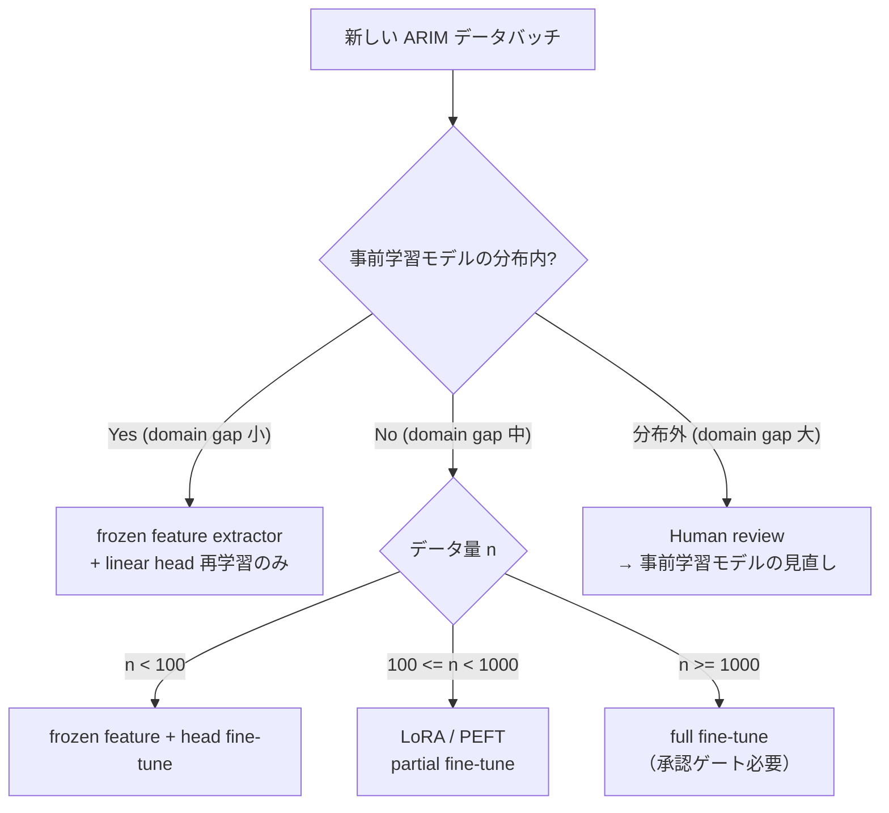
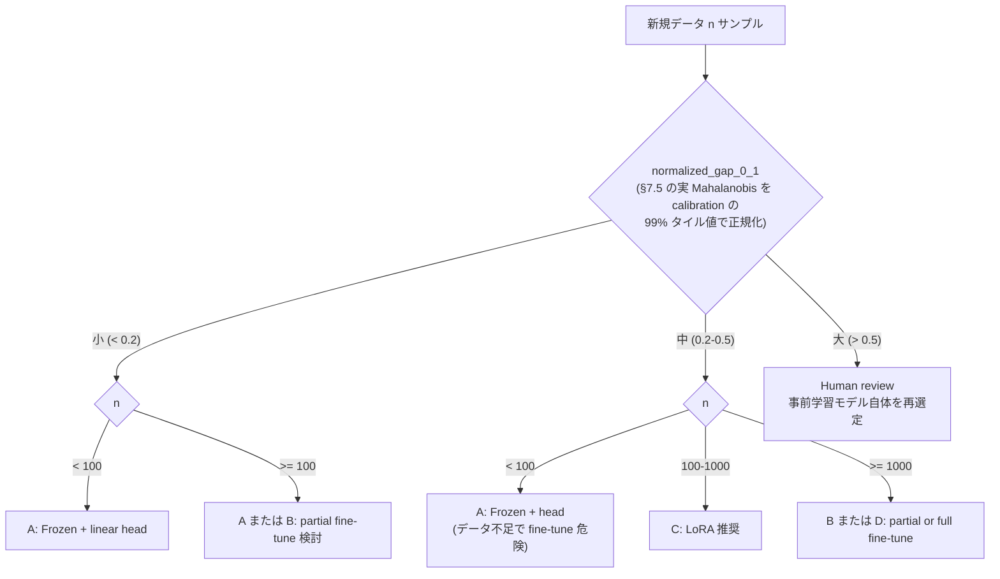
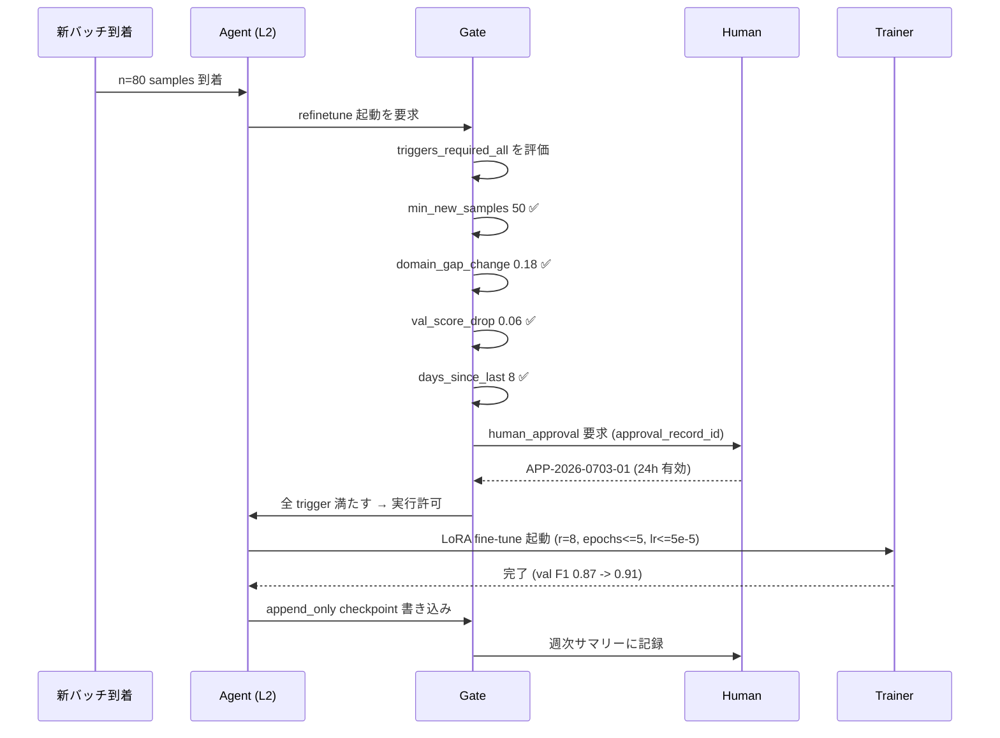

# 第7章 転移学習 / fine-tuning を Skill 化する — Agentic 判断つき

> [!NOTE]
> **本章の到達目標**
> - **転移学習 4 戦略**（frozen feature extractor / partial fine-tune / full fine-tune / LoRA・PEFT）を、データ規模・装置固有性・計算資源から**機械的に**選び分けられる
> - **事前学習重みの分布外検知**（feature-level domain gap early warning）を Skill に組み込める
> - **装置ごとに fine-tune 戦略を切り替える判断表**を書ける（同じデータ型でも装置が違えば戦略が変わる）
> - **「今日のバッチだけで再 fine-tune するか」の承認ゲート**を設計できる
> - **少データ材料での fine-tune 評価戦略**（vol-02 第7章 CV 設計を深層に、grouped × few-shot × 事前学習の 3 軸）を実装できる
> - **エージェントに fine-tune を実行させる Skill** において、勝手にモデルを更新できない契約を書ける
>
> **本章で扱わないこと**
> - Foundation Model の内部構造・アーキテクチャ詳細 → **第11章**（FM）
> - 事前学習そのもの（大規模データからの自己教師あり学習） → **第12章**（SSL）
> - 不確かさの本格的な扱い（BNN / Deep Ensemble / Predictive Entropy） → **第8-9章**
> - ハイパーパラメータの Bayesian Optimization → **vol-04**（第7章末の道しるべ）

---

## 7.1 この章で作る Skill

3 つの **転移学習 Agentic Skill** と 1 つの **判断表** を作ります。

| Skill | データ型 | ベース戦略 | 想定装置 |
|---|---|---|---|
| **`spectrum_transfer_1d`** | 1D スペクトル（IR / Raman） | 事前学習 1D CNN → head 交換 + partial fine-tune | 装置 A（校正済み） / 装置 B（新規） |
| **`sem_transfer_2d`** | 2D 画像（SEM） | ImageNet 事前学習 ResNet18 → LoRA fine-tune | SEM 装置 α / β / γ |
| **`tabular_transfer`** | Tabular（組成・実験条件） | 事前学習 FT-Transformer → frozen feature + linear head | 装置横断（tabular） |

さらに、**判断表と承認ゲート**を成果物として設計します。

- **成果物 4**：装置別 fine-tune 戦略判断表（`instrument_finetune_decision_table.yaml`）
- **成果物 5**：日次 re-fine-tune 承認ゲート仕様（`daily_refinetune_gate.yaml`）

各 Skill は第4章の 7 セクション仕様書、第5章の 2 契約（`deep_split_contract` + `augmentation_contract`）、第6章の `training_config.yaml` を継承した上で、**転移学習に特有の追加契約 3 種**を導入します：

1. **`pretrained_weights` provenance**（第4章 Layer 2 の厳格版）
2. **`domain_gap_gate`**（feature-level 分布外検知）
3. **`refinetune_authorization`**（日次 / バッチ単位の再学習権限）

---

## 7.2 なぜこの章が必要か — vol-02 第7章の限界と ARIM の現実

### vol-02 第7章 vs vol-03 第7章

vol-02 第7章では **CV 設計とデータリーク検知** を扱いました。それは「モデルは自分で学習する」前提でした。しかし現実の ARIM データでは：

- **単一装置の実験室スケール**では、深層モデルを **from-scratch で学習するデータが足りない**（第6章 §6.7 の議論）
- 一方で **公開の事前学習モデル**（ImageNet, ChemBERTa, Uni-Mol, Raman-FM 等）は装置分布の外にある
- **装置ごとに fine-tune 戦略を変える**必要がある：装置 A では frozen feature で十分、装置 B では partial fine-tune が必要、装置 C では LoRA、といった判断が発生する



**Agentic 特有の課題**：

- **エージェントが勝手に fine-tune を起動**：GPU 時間・エネルギー・checkpoint の管理を無視して自律実行し、結果として整合性が崩れる
- **エージェントが domain gap を無視**：事前学習分布から遠いデータに対しても「fine-tune すれば大丈夫」と誤った自信を持つ
- **エージェントが日次 re-fine-tune を暴走**：新バッチ到着のたびに再学習し、モデルが日毎に変わる（provenance が追えない）

この章は、これら 3 つの Agentic 特有問題を **契約と承認ゲート** で解決します。

---

## 7.3 転移学習 4 戦略の比較と選択基準

### 4 戦略の定義

| 戦略 | 説明 | 更新される重み | 計算コスト | 破壊リスク |
|---|---|---|---|---|
| **A. Frozen feature extractor + linear head** | 事前学習モデルを固定、最終層のみ線形分類器で学習 | linear head の重みのみ | 極低 | ほぼゼロ |
| **B. Partial fine-tune (last N layers)** | 最終 N 層のみ更新、他は frozen | 最終 N 層 + head | 低〜中 | 中 |
| **C. LoRA / PEFT** | 各層に低ランク adapter を挿入し、adapter のみ更新 | adapter 重み（元重み変更なし） | 中 | 低（元重み保持） |
| **D. Full fine-tune** | 全層を更新 | 全重み | 高 | 高（catastrophic forgetting） |

### 選択マップ



> [!NOTE]
> **上記の閾値（n < 100, gap < 0.2 等）は教材上の経験則**です。実際は事前学習分布・タスク種別・augmentation の効き方・GBM ベースラインとの比較で境界が動きます。**この判断表は Skill 設計のための出発点**であり、**必ず自データで frozen ベースライン → LoRA → full の順に検証**してから採用してください。

> [!IMPORTANT]
> **domain gap のスケールと指標について**：本章では 2 種類の domain gap を使い分けます。
> - **`normalized_gap_0_1`**（0-1 範囲、§7.3 の選択マップおよび §7.6 の判断表で使用）：**教材上の相対指標**。実装は Mahalanobis を calibration set の 99% タイル値で正規化するなど、値域を 0-1 に押し込めた形。
> - **`mahalanobis_squared`**（実距離、§7.5 の gate 計算で使用）：`sklearn.covariance.*.mahalanobis()` が返す squared Mahalanobis 距離。値域は 0 〜 ∞。
>
> 契約 YAML では `method` フィールドで明示し、**同じ変数名で異なるスケールを扱わない**ようにしてください。

### エージェントに任せられる/任せられない

| 判断場面 | L1 | L2 | L3 | 説明 |
|---|:---:|:---:|:---:|---|
| Skill 実行（推論） | ✅ | ✅ | ✅ | どの level でも推論は可 |
| **frozen feature の linear head 再学習** | ❌ | ✅ | ✅ | L2 は事前承認範囲内で可 |
| **LoRA fine-tune の起動** | ❌ | ✅ | ✅ | `refinetune_authorization` 内で可 |
| **partial fine-tune の起動** | ❌ | ⚠️ | ✅ | L2 は `daily_refinetune_gate` などの Human 承認 gate を通せば可 |
| **full fine-tune の起動** | ❌ | ❌ | ⚠️ | L3 の事前承認ワークフローに **full fine-tune が明示的に scope 内**でかつ都度 Human sign-off がある場合のみ可（本章は Ch04 §4.7 L3 定義より厳格化） |
| **事前学習モデルの差し替え** | ❌ | ❌ | ❌ | 全レベル禁止（Human 契約変更） |
| **domain gap 閾値の変更** | ❌ | ❌ | ❌ | 全レベル禁止 |

> [!WARNING]
> **full fine-tune は L3 でも Human sign-off 必須**とする理由：full fine-tune は事前学習重みを不可逆に上書きし、後続 Skill（推論・attribution）の provenance が変わります。Ch04 §4.7 では L3 は「事前承認ワークフロー ID 内で既存 checkpoint 上書き可」でしたが、**本章では full fine-tune に限り Ch04 より厳格化**し、pre-approved workflow ID に加えて実行直前の Human sign-off も要求します。「元に戻せない変更」は必ず Human ゲートを通す設計です（第4章 §4.7 の 4 承認ゲート思想の徹底）。

---

## 7.4 事前学習重みの provenance 契約（第4章 Layer 2 の厳格版）

第4章では `pretrained_weights` の provenance を **Layer 2** として定義しました。転移学習では **この Layer 2 を最も厳しく検証**します。

```yaml
# pretrained_weights_contract.yaml
pretrained_weights:
  source_type: "hf_hub"                    # hf_hub / local_registry / signed_url
  weights_uri: "hf://microsoft/resnet-18"  # example URI（実在性は各自確認、社内 registry の場合は local_registry）
  revision: "a1b2c3d4e5f6..."              # commit hash 必須（tag 名不可）
  weights_sha256: "9f8e7d6c5b4a..."        # 事前計算した SHA256（config 内に直接記録）
  weights_license: "MIT"
  pretraining_data_license: "ImageNet-1k (research only)"
  safetensors_available: true              # true でなければ **fatal (load block)**（Ch06 §6.3 と整合）
  # 追加契約：pretraining の分布記述
  pretraining_distribution:
    modality: "natural_image_rgb_224x224"
    class_semantics: "generic_object_recognition"
    n_pretrain_samples: 1281167
    intended_downstream:
      - "natural_image_classification"
      - "transfer_to_texture_analysis"
    NOT_intended_for:
      - "scientific_grayscale_imaging"     # SEM は NOT_intended の例
      - "electron_microscopy"
  # 追加契約：改変の禁止事項
  modification_policy:
    push_to_hub: false                     # 全レベル禁止（第4章 §4.8 継承）
    revision_change_by_agent: false        # revision 変更は L3 でも不可
    weight_replacement: false              # weight_source 変更は全レベル禁止
    trust_remote_code: false               # 常に false

# 起動時契約 assert（第6章 §6.3 の startup_asserts に追加）
weight_load_policy:
  torch_load_weights_only: true
  require_safetensors: true
  require_weights_sha256_verified: true    # 転移学習では常に true
  revision_must_be_commit_hash: true       # 転移学習では常に true
  trust_remote_code: false
  domain_gap_check_before_training: true   # §7.5 の gate を「重み load 後・学習開始前」に実行
  # 起動順（実装者向け）:
  #   1. revision が commit hash 形式か検証
  #   2. safetensors 存在確認 (fatal if missing)
  #   3. weights_sha256 事前計算値との照合 (fatal on mismatch)
  #   4. torch.load(weights_only=True) で安全 load、trust_remote_code=false
  #   5. penultimate feature 抽出
  #   6. domain_gap_gate 評価（§7.5）
  #   7. gate が pass すれば学習/推論を許可
```

> [!IMPORTANT]
> **`pretraining_distribution.NOT_intended_for` フィールドは転移学習の Skill で最重要の防御**です。SEM 画像に対して ImageNet 事前学習を使うのは技術的には可能ですが、**NOT_intended リストに `"electron_microscopy"` が入っていれば、Skill は起動時に warning を出し、Human 確認を必須化**します（後述の §7.5 domain gap gate と連動）。

---

## 7.5 Domain gap early warning — feature-level OOD 検知

事前学習モデルは「学習分布内」のデータに対してのみ性能を保証します。新規 ARIM データが分布外なら、**少データ fine-tune による改善保証はなく、性能低下・不安定化のリスクが高い**（大規模 labeled data があれば分布外でも改善する場合はある）。

### なぜ入力ピクセル空間ではなく feature 空間で検知するのか

- **入力空間**：SEM 画像 vs 自然画像は明らかに違うが、統計だけでは domain gap の大きさを定量できない
- **Feature 空間（penultimate layer 出力）**：事前学習モデルが「認識できているか」を直接測れる。calibration set との距離で domain gap を数値化できる

### Domain gap の計算方法

```python
# domain_gap_score.py
import torch
import numpy as np
from sklearn.covariance import LedoitWolf   # 高次元少サンプルで安定（EmpiricalCovariance は避ける）

def compute_domain_gap_mahalanobis_squared(
    pretrained_model: torch.nn.Module,
    calibration_features: np.ndarray,   # 事前学習分布の代表サンプル feature（Human が事前に用意）
    new_batch: torch.Tensor,            # 新規データ（min_batch_size 以上）
    covariance_estimator: str = "ledoit_wolf",
) -> float:
    """
    事前学習分布と新規データの feature-level squared Mahalanobis 距離を計算。

    注意：
    - 返り値は **squared** Mahalanobis 距離（sklearn の mahalanobis() の仕様）。
      値域 [0, ∞)。§7.5 の閾値 (warn/review/stop) はこの squared 値に対する目安。
    - `LedoitWolf` shrinkage 共分散を使うことで、高次元 feature (>= 256 次元) に
      対する少サンプル (n < 500) calibration でも安定する。
    - `EmpiricalCovariance` はサンプル数 << 次元では特異に近づき信頼できない。
    """
    pretrained_model.eval()
    with torch.no_grad():
        new_features = _extract_penultimate(pretrained_model, new_batch).cpu().numpy()

    if covariance_estimator == "ledoit_wolf":
        cov = LedoitWolf().fit(calibration_features)
    else:
        raise ValueError("high-dim feature には LedoitWolf / OAS shrinkage を推奨")

    # 新規バッチ平均と calibration 平均の squared Mahalanobis 距離
    return float(cov.mahalanobis(new_features.mean(0, keepdims=True))[0])


def compute_normalized_gap_0_1(
    mahalanobis_squared_value: float,
    calibration_99th_percentile: float,
) -> float:
    """
    §7.3 選択マップ / §7.6 判断表用の正規化 gap。
    calibration set 内で計算した Mahalanobis squared の 99% タイル値で正規化し、
    値を [0, 1] にクリップする（1.0 超は 1.0 に）。
    """
    return float(min(mahalanobis_squared_value / calibration_99th_percentile, 1.0))
```

### Domain gap gate 契約

```yaml
# domain_gap_gate.yaml
domain_gap_gate:
  enabled: true
  method: "mahalanobis_squared"            # squared Mahalanobis（sklearn 仕様）
  covariance_estimator: "ledoit_wolf"      # 高次元向け shrinkage（EmpiricalCovariance 禁止）
  feature_dim: 512                         # penultimate 次元（例：ResNet18 は 512）
  min_calibration_samples_per_dim: 0.5     # 少なくとも次元数 × 0.5 のサンプルを推奨
  calibration_set:
    source: "curated_by_human"
    n_samples: 200                         # example; feature_dim との比を上記制約で確認
    reference_uri: "arim://calibration/2026-Q1"
    reference_sha256: "..."
    calibration_99th_percentile: 12.5      # normalized_gap_0_1 の正規化定数
                                           #  （calibration set 内 squared Mahalanobis の 99% タイル）
  thresholds:                              # squared Mahalanobis の目安（**example; calibration 必須**）
    warn: 3.0                              # gap 小、fine-tune 可
    review: 5.0                            # gap 中、Human 確認 → LoRA 推奨
    stop: 8.0                              # gap 大、事前学習モデル自体を再選定
  # 上記閾値は模擬 512 次元 feature の例。必ず自 calibration set の分布から
  # (median, 95% タイル, 99% タイル) を求めて再校正すること
  action_on_warn: "log_and_continue"
  action_on_review: "route_to_human"
  action_on_stop: "block_finetune"
  # 起動時に必ず実行
  run_before_training: true                # 重み load 後・学習開始前
  run_before_inference: true               # 推論時にもチェック（第14章で参照）
  # 推論時ガード（run_before_inference: true のときの補助設定）
  inference_guard:
    min_batch_size_for_gap_check: 8        # 単一サンプルでは batch mean が不安定
    fallback_for_single_sample: "log_only" # log_only / block / route_to_human
    cache_gap_by_batch_id: true            # 同一 batch_id への再計算を抑制
    action_on_inference_review: "flag_prediction_and_continue"
```

> [!TIP]
> **calibration_set は Human が curate する**必要があります。「事前学習データからランダムに 200 サンプル」ではなく、「その事前学習モデルが実際に**認識できていたサンプル**（高 confidence + 正解）」を選びます。ImageNet の場合、公開されている representative samples リストを使うか、事前学習モデルの val set から high-confidence correct を抽出します。

### エージェントに任せられる判断

| 判断場面 | L2 | 説明 |
|---|:---:|---|
| gap 計算の実行 | ✅ | 決定的処理、契約に従うのみ |
| `action_on_warn` の実行（ログ記録） | ✅ | 決定的 |
| `action_on_review` で Human に送る | ✅ | 決定的 |
| **閾値の変更** | ❌ | 全レベル禁止 |
| **calibration_set の差し替え** | ❌ | 全レベル禁止 |

---

## 7.6 装置別 fine-tune 戦略判断表

同じデータ型（例：SEM 画像）でも、装置ごとに fine-tune 戦略が変わります。これを **成果物 4**：`instrument_finetune_decision_table.yaml` として定式化します。

```yaml
# instrument_finetune_decision_table.yaml — SEM 3 装置の例
schema_version: "1.0"
domain: "SEM_image_classification"
gap_metric: "normalized_gap_0_1"           # §7.3 選択マップと同じ相対スケール（§7.5 の Mahalanobis を calibration の 99% タイル値で正規化）
pretrained_base:
  uri: "hf://microsoft/resnet-18"          # example URI
  revision: "a1b2c3d4..."

# 装置ごとの判断ロジック
instruments:
  - id: "SEM_alpha"                         # 装置 α（校正済み・大量データあり）
    calibration_status: "well_calibrated"
    n_samples_available: 5000
    domain_gap_last_measured: 0.3           # normalized_gap_0_1
    recommended_strategy: "partial_fine_tune_last_2_layers"
    reason: |
      装置 α は校正済みで n = 5000 と豊富。domain gap も小さい (0.3)。
      partial fine-tune で最終 2 層のみ更新すれば十分。full は overkill。
    agent_min_level: "L2"                   # L1/L2/L3 taxonomy 内
    required_gate: "training_job_approval"  # partial は §7.3 と一致：Human 承認 gate 必須
    approval_required: true                 # 事前承認 (approval_record_id) が必要
    agent_can_execute_daily: false          # 日次 re-fine-tune は禁止（partial は日次に不向き）

  - id: "SEM_beta"                          # 装置 β（新規・少データ）
    calibration_status: "recently_calibrated"
    n_samples_available: 150
    domain_gap_last_measured: 0.5
    recommended_strategy: "lora_r8"
    reason: |
      装置 β は新規導入で n = 150 と少なく、domain gap 中程度 (0.5)。
      LoRA (rank=8) で adapter のみ学習し、元重みを保持することでリスクを最小化。
    agent_min_level: "L2"
    required_gate: "daily_refinetune_gate"  # 日次 gate 経由なら L2 で可
    approval_required: true
    agent_can_execute_daily: true

  - id: "SEM_gamma"                         # 装置 γ（未校正・分布外リスク大）
    calibration_status: "not_calibrated"
    n_samples_available: 30
    domain_gap_last_measured: 0.9
    recommended_strategy: "human_review_required"
    reason: |
      装置 γ は未校正、n = 30 と極少、domain gap 大 (0.9)。
      fine-tune するとむしろ性能悪化のリスク大。
      Human が (a) 装置を校正 (b) 事前学習モデル自体を差し替え を判断すべき。
    agent_min_level: "none"                 # エージェント実行不可（Human のみ）
    required_gate: "manual_only"
    approval_required: true
    agent_can_execute_daily: false

# 判断ロジック（Skill 起動時に自動評価）
decision_logic:
  inputs:
    - instrument_id
    - n_samples_available
    - domain_gap_score                      # normalized_gap_0_1
  algorithm: "lookup_table_with_gap_override"
  # domain_gap が recommended より大きくなったら strategy を降格
  gap_override:
    "0.0-0.2": "no_downgrade"
    "0.2-0.5": "downgrade_to_lora_or_frozen"
    "0.5-0.8": "route_to_human"
    "0.8+": "block"
```

> [!IMPORTANT]
> **この判断表は Human が装置ごとに書きます**。エージェントは表を読んで自動判断できますが、**表そのものを書き換えることは全レベルで禁止**です。装置校正状態の変化・データ蓄積の進捗に応じて、Human が定期的に見直します（推奨：四半期ごと）。

---

## 7.7 「今日のバッチだけで再 fine-tune」承認ゲート

Agentic 環境でよくある落とし穴：**新しいデータバッチが届くたびに、エージェントが自動で再学習を起動**する。これは以下の問題を起こします：

- **モデルが日毎に変わる**：昨日の予測と今日の予測が違う理由が provenance で追えない
- **GPU 資源の食い潰し**：他ユーザーの学習ジョブを阻害
- **統計的に不健全**：日々のバッチは小さくノイズが大きく、単日データで fine-tune するとモデルが振動
- **catastrophic forgetting**：日次 fine-tune を積み重ねると、当初の性能が失われる

**成果物 5**：`daily_refinetune_gate.yaml` で防御します。

```yaml
# daily_refinetune_gate.yaml
# 数値はすべて **example; must be calibrated per instrument/task**
daily_refinetune_gate:
  # 起動条件（すべて満たさないと fine-tune できない）
  triggers_required_all:
    - name: "min_new_samples"
      threshold: 50                        # example: 50 サンプル以上溜まっていること
    - name: "domain_gap_change"
      threshold_relative: 0.15             # example: 前回学習時から gap が 15% 以上変化
      baseline_gap_reference:              # ⚠️ agent が silently reset することを防ぐ
        source: "last_approved_training_provenance"
        field: "transfer_learning.domain_gap_at_start"
        immutable_by_agent: true
        require_provenance_hash: true      # 参照 provenance の SHA を照合
    - name: "current_val_score_drop"
      threshold: 0.05                      # example: 現在モデルの val F1 が 0.05 以上悪化
    - name: "days_since_last_finetune"
      min_days: 7                          # example: 前回から少なくとも 7 日空ける
    - name: "human_approval"
      approver_role: "lab_admin"
      approval_record_id_required: true
      max_approval_age_hours: 24           # 24 時間以内の approval のみ有効

  # 実行制約
  execution_constraints:
    allowed_strategies_for_daily:          # 日次 gate では以下の戦略のみ許可
      - "lora_r8"
      - "lora_r16"
                                           # partial / full は日次では禁止（別の
                                           # training_job_approval gate 経由）
    max_epochs_hard_cap: 5                 # example: 日次では 5 epoch まで
    max_learning_rate: 5.0e-5              # example: 日次では小さめの LR
    checkpoint_policy: "append_only_dated" # 日付付き append_only
    previous_checkpoint_must_be_preserved: true

  # 監視
  monitoring:
    log_all_attempts: true
    weekly_summary_to_human: true          # 毎週 Human に「今週の fine-tune サマリー」
    consecutive_finetune_warning: 3        # 3 日連続で fine-tune 起動があれば warn
    rollback_on_val_degradation: true      # 前 checkpoint より悪ければ自動 rollback

  # エージェント権限
  agent_authorization:
    l1_can_trigger: false
    l2_can_trigger_with_human_approval: true
    l3_can_trigger_within_preapproved_window: true
    # 全レベル：triggers_required_all を 1 つでも満たさなければ block
```

### エージェント判断シーケンス（Mermaid）



> [!WARNING]
> **triggers_required_all を 1 つでも欠かせば fine-tune はブロック**されます。エージェントが「なんとなく」再学習を起動できないように設計しています。特に **human_approval の `max_approval_age_hours: 24`** は重要で、「昨日の承認で今日走らせる」を防ぎます。

---

## 7.8 少データ材料での fine-tune 評価戦略（grouped × few-shot × 事前学習）

vol-02 第7章の CV 設計を深層に持ち込みますが、**転移学習では 3 つの新しい課題**が加わります：

### 課題 1：事前学習データと評価データの leakage

事前学習モデル（例：Raman-FM）が公開データセット D で訓練されているとき、あなたの評価データが D の一部でないか要確認です。

```yaml
# split_contract.yaml に追加
pretraining_data_overlap_check:
  method: "hash_and_near_duplicate"        # 完全一致だけでは crop/resize/smoothing の重複を見逃す
  exact_hash:
    algorithm: "sha256"
    pretrain_dataset_hashes_source: "arim://finetune_leakage/2026-Q1"
  near_duplicate:
    perceptual_hash_for_images: true       # pHash / dHash 等
    spectral_similarity_threshold: 0.98    # 例：cosine similarity（IR/Raman 等）
    embedding_similarity_threshold: 0.95   # 事前学習 encoder の embedding cosine
  action_on_exact_overlap: "exclude_from_test"
  action_on_near_duplicate: "route_to_human_or_exclude"
  minimum_test_size_after_exclusion: 30    # 除外後 test が 30 未満なら fatal
```

### 課題 2：装置別 grouped CV × few-shot の並列評価

少データ n < 500 で fine-tune するときは、**装置ごとの grouped CV** に加えて、**few-shot 学習**（1-shot / 5-shot / 10-shot）でも評価します。

```python
# few_shot_eval.py 骨格
from sklearn.model_selection import GroupKFold

def evaluate_finetune_strategy(
    model, X, y, groups,   # groups = instrument_id
    n_shot_list=(1, 5, 10, 50),
) -> dict:
    """
    装置別 grouped CV × n-shot の 2 軸で fine-tune 戦略を評価。
    - 各 fold で、train 側から n サンプル/クラスのみ使用
    - 残りの train データは使わない（少データ現場をシミュレート）
    """
    results = {}
    gkf = GroupKFold(n_splits=len(set(groups)))
    for n_shot in n_shot_list:
        scores = []
        for train_idx, test_idx in gkf.split(X, y, groups=groups):
            train_subset = _sample_n_per_class(X[train_idx], y[train_idx], n_shot)
            fine_tuned = _finetune(model, train_subset)
            score = _eval(fine_tuned, X[test_idx], y[test_idx])
            scores.append(score)
        results[f"n_shot_{n_shot}"] = {
            "mean": float(np.mean(scores)),
            "std": float(np.std(scores)),
            "per_instrument": scores,
        }
    return results
```

### 課題 3：事前学習分布シフトの評価

fine-tune 前後で、domain gap がどう変化したかを記録します（fine-tune で分布シフトが起きるのは正常だが、**過度なシフト = catastrophic forgetting** の兆候）。

```yaml
# finetune_evaluation_report.yaml
finetune_evaluation:
  before_finetune:
    domain_gap_score: 0.35
    val_f1_macro: 0.78
  after_finetune:
    domain_gap_score: 0.42        # 少しシフト（想定内）
    val_f1_macro: 0.87            # 向上
    catastrophic_forgetting_check:
      pretrain_task_score_before: 0.92
      pretrain_task_score_after: 0.88   # 4pt 低下（許容範囲）
      threshold_for_warning: 0.10
      status: "ok"
  grouped_cv_by_instrument:
    SEM_alpha: {mean: 0.89, std: 0.03}
    SEM_beta:  {mean: 0.84, std: 0.06}
    SEM_gamma: {mean: 0.61, std: 0.12}   # γ は不安定 → §7.6 判断表通り
  few_shot_scores:
    n_shot_5:  0.72
    n_shot_10: 0.81
    n_shot_50: 0.86
```

---

## 7.9 転移学習の provenance 拡張

第4章の 3 レイヤ provenance に、**転移学習 3 追加項目**を加えます。

```yaml
# provenance.yaml — 転移学習拡張版
schema_version: "1.1"

# Layer 1: GPU（第4章継承）
gpu_backend: {...}

# Layer 2: 事前学習重み（§7.4 で厳格化）
pretrained_weights: {...}

# Layer 3: 学習設定（第6章継承）
finetune_config: {...}
augmentation_config: {...}

# Layer 4: 転移学習追加項目（vol-03 §7.9 新設）
transfer_learning:
  strategy: "lora_r8"                     # A/B/C/D のどれか、または詳細名
  domain_gap_at_start: 0.42
  domain_gap_at_end: 0.44
  frozen_layer_names:                     # frozen または LoRA 対象外の層
    - "layer1.*"
    - "layer2.*"
  trainable_params_count: 45000
  trainable_params_percent: 0.4           # 全パラメータ中 0.4%
  base_weights_hash_before: "9f8e7d..."
  base_weights_hash_after: "9f8e7d..."    # LoRA なら base 変わらず一致
  adapter_weights_hash: "1a2b3c..."       # LoRA / PEFT の場合
  finetune_data:
    n_samples_used: 150
    sampling_scheme: "grouped_by_instrument"
    catastrophic_forgetting_delta: 0.04
  refinetune_history:                     # 過去の日次 fine-tune 履歴
    - date: "2026-06-25"
      approval_record_id: "APP-2026-0625-02"
      val_f1_delta: 0.03
    - date: "2026-07-02"
      approval_record_id: "APP-2026-0702-01"
      val_f1_delta: 0.04
    - date: "2026-07-03"
      approval_record_id: "APP-2026-0703-01"
      val_f1_delta: 0.04
  consecutive_finetune_warning_triggered: false
```

---

## 7.10 失敗パターンと改善版

| 失敗 | 原因 | 改善版 |
|---|---|---|
| fine-tune 後に性能悪化 | domain gap 大に対して full fine-tune を強行 | §7.5 gate で `action_on_review: route_to_human`、または LoRA に降格 |
| モデルが日毎に変わり provenance が追えない | 日次 auto-refinetune | §7.7 `daily_refinetune_gate` で `min_days: 7` + human_approval 必須 |
| 装置 γ で性能が出ない | 全装置一律の戦略 | §7.6 判断表で装置ごとに戦略を切り替え |
| Catastrophic forgetting（pretrain タスクスコア大幅低下） | 少データで full fine-tune | LoRA に降格、`catastrophic_forgetting_check` を契約に追加 |
| 事前学習データとの leakage | 評価データが pretrain データに含まれる | §7.8 `pretraining_data_overlap_check` を split_contract に追加 |
| エージェントが `revision` を勝手に変えた | `modification_policy.revision_change_by_agent` が未設定 | §7.4 の modification_policy 契約を追加 |
| LoRA adapter だけ差し替えて base 重みハッシュ検証を怠る | adapter が別の base に対して作られていた | provenance に `base_weights_hash_before` を必須化、起動時に照合 |
| calibration_set が古い | 装置校正後も同じ calibration set を使い続けた | §7.5 `reference_uri` と `reference_sha256` を四半期ごとに更新 |
| **normalized_gap_0_1 と mahalanobis_squared を混同** | 契約 YAML の `gap_metric` フィールド未指定 | §7.5 の `method` を必ず指定、§7.3 選択マップ・§7.6 判断表は明示的に `normalized_gap_0_1` を使う |
| **LoRA fine-tune 後に base 重み hash が変わっていた** | frozen 指定漏れ・実装バグ | 起動時に `base_weights_hash_before == base_weights_hash_after` を **fatal assert**（LoRA/PEFT 戦略時のみ） |
| **共分散推定が高次元少サンプルで不安定** | EmpiricalCovariance を使った | `LedoitWolf` / `OAS` に切替、`min_calibration_samples_per_dim` を契約に追加 |
| **エージェントが baseline_gap_reference を silently reset** | reference を再計算する権限を持っていた | §7.7 `baseline_gap_reference.immutable_by_agent: true` + `require_provenance_hash: true` |
| **near-duplicate leakage を見逃した** | 完全 hash 一致のみでチェック | §7.8 `method: "hash_and_near_duplicate"`（perceptual hash + embedding similarity） |
| **単一サンプル推論で domain gap gate が誤動作** | batch mean の Mahalanobis が不安定 | §7.5 `inference_guard.min_batch_size_for_gap_check` を設定、単サンプルは `log_only` |

---

## 7.11 この章のチェックリスト

Skill 実装前・レビュー時のチェック（第4章の 7 セクション + 第5章の 2 契約 + 第6章の `training_config.yaml` に加えて）：

- [ ] 転移学習 4 戦略（frozen / partial / LoRA / full）から機械的に選択できる
- [ ] `pretrained_weights` に `revision` を commit hash で記録している
- [ ] `weights_sha256` を事前計算し contract に記録している
- [ ] `pretraining_distribution.NOT_intended_for` を書いている
- [ ] `domain_gap_gate` で feature-level OOD 検知を組み込んでいる
- [ ] `domain_gap_gate.method` で `mahalanobis_squared` / `normalized_gap_0_1` を明示的に指定している
- [ ] 共分散推定に `LedoitWolf` / `OAS` を使っている（EmpiricalCovariance は不採用）
- [ ] `calibration_set` が Human curate 済みで、`reference_sha256` が記録されている
- [ ] `calibration_99th_percentile` から `normalized_gap_0_1` を計算している
- [ ] 装置別 fine-tune 判断表（`instrument_finetune_decision_table.yaml`）を書いている
- [ ] 判断表の各装置に `agent_min_level` + `required_gate` + `approval_required` の 3 フィールドを揃えている（`L2_with_daily_gate` のような taxonomy 外の記述は禁止）
- [ ] 日次 re-fine-tune 承認ゲート（`daily_refinetune_gate.yaml`）を書いている
- [ ] `triggers_required_all` に human_approval が含まれ、`max_approval_age_hours` を設定している
- [ ] `baseline_gap_reference.immutable_by_agent: true` を設定し、agent が baseline を silent reset できないようにしている
- [ ] `allowed_strategies_for_daily` を LoRA 系のみに制限している（partial / full は日次禁止）
- [ ] `pretraining_data_overlap_check` を split_contract に追加している（`hash_and_near_duplicate`）
- [ ] 装置別 grouped CV × few-shot 評価を実行している
- [ ] `catastrophic_forgetting_check` を評価レポートに含めている
- [ ] provenance に `transfer_learning` セクション（Layer 4）を追加している
- [ ] **LoRA / PEFT 戦略時は `base_weights_hash_before == base_weights_hash_after` を fatal assert している**
- [ ] `adapter_weights_hash` に加えて `adapter_base_weights_hash` を記録し、adapter がどの base 用か照合している
- [ ] full fine-tune を L3 でも Human sign-off 必須にしている（pre-approved workflow scope 内かつ都度承認）
- [ ] 事前学習モデルの差し替え / domain gap 閾値変更を全レベルで禁止している
- [ ] 推論時 domain gap の `min_batch_size_for_gap_check` を設定している

---

## 7.12 ワーク・まとめ・参考資料

### 演習

1. **戦略選択の判断練習**：ARIM 風合成 IR スペクトルで、n = 80 / n = 500 / n = 3000 の 3 ケースについて、`spectrum_transfer_1d` で選ぶべき戦略（A/B/C/D）を §7.3 の選択マップから決めよ。domain gap は 0.3 とする。
2. **判断表の作成**：あなたが実際に使っている装置（または想像上の 3 装置）について、`instrument_finetune_decision_table.yaml` の 3 エントリを書け。校正状態・想定サンプル数・想定 domain gap を仮置きし、`recommended_strategy` を決めよ。
3. **承認ゲートのシミュレーション**：`daily_refinetune_gate` の `triggers_required_all` について、以下のシナリオで gate が pass / block のどちらか判定せよ。
   - シナリオ A：n_new=60, gap_change=0.20, val_drop=0.03, days_since=10, approval_age=12h
   - シナリオ B：n_new=80, gap_change=0.18, val_drop=0.06, days_since=8, approval なし
   - シナリオ C：n_new=100, gap_change=0.25, val_drop=0.08, days_since=8, approval_age=30h
4. **provenance レビュー**：仮の `provenance.yaml` を作り、`base_weights_hash_before == base_weights_hash_after` になるべき戦略（LoRA）と、変わって良い戦略（full fine-tune）を書き分けよ。
5. **catastrophic forgetting の検出**：`pretrain_task_score_before = 0.92`, `pretrain_task_score_after = 0.75` のとき、`threshold_for_warning: 0.10` の設定でどの status になるか、また改善策を 3 つ挙げよ。

### まとめ

- 転移学習 4 戦略（**frozen / partial / LoRA / full**）は、`n × domain_gap` の 2 軸で機械的に選べる。full fine-tune は L3 でも Human sign-off 必須
- **事前学習重みの provenance は最も厳しく**：`revision` は commit hash、`weights_sha256` は事前計算、`NOT_intended_for` を明記
- **`domain_gap_gate`** は feature-level（penultimate layer）で計算し、`warn / review / stop` の 3 段階アクション
- **装置別判断表**（`instrument_finetune_decision_table.yaml`）は Human が四半期ごとに更新
- **日次 re-fine-tune 承認ゲート**は `triggers_required_all` の 5 条件（新サンプル数 / gap 変化 / val 低下 / 日数 / 24h 以内 human approval）
- **少データ評価**は grouped × few-shot × 事前学習 leakage check の 3 軸
- **provenance に `transfer_learning` セクション（Layer 4）** を追加。`refinetune_history` で日次履歴を蓄積

### 参考資料

**本書内**：
- 第4章 §4.4-4.10（provenance 3 レイヤ、Agentic 学習権限 L1-L3、4 承認ゲート）
- 第5章 §5.5-5.7（augmentation プリミティブと L1-L3 権限）
- 第6章 §6.3, §6.9（`training_config.yaml`、10 判断場面）
- 第8章（不確かさと OOD の本格実装、`val_ood_score` の実装候補）
- 第11章（Foundation Model 章、事前学習の内部構造）
- 第14章（深層 × Agentic 特有の失敗、fine-tune のデータリーク）

**vol-01/02**：
- vol-01 第6章（Human-in-the-loop の設計原則）
- vol-02 第7章（CV 設計とデータリーク検知）
- vol-02 第10章（Skill 仕様書 7 セクション）

**外部**：
- LoRA — Hu et al., 2021 [https://arxiv.org/abs/2106.09685](https://arxiv.org/abs/2106.09685)
- PEFT ライブラリ — Hugging Face [https://github.com/huggingface/peft](https://github.com/huggingface/peft)
- Mahalanobis distance for OOD detection — Lee et al., 2018 [https://arxiv.org/abs/1807.03888](https://arxiv.org/abs/1807.03888)
- Catastrophic forgetting — Kirkpatrick et al., 2017 (EWC) [https://arxiv.org/abs/1612.00796](https://arxiv.org/abs/1612.00796)
- Foundation Model 転移学習の展望 — Bommasani et al., 2021 [https://arxiv.org/abs/2108.07258](https://arxiv.org/abs/2108.07258)
- torch.load `weights_only=True` の重要性 — PyTorch security advisory [https://pytorch.org/docs/stable/notes/serialization.html](https://pytorch.org/docs/stable/notes/serialization.html)
- safetensors 仕様 — Hugging Face [https://github.com/huggingface/safetensors](https://github.com/huggingface/safetensors)
