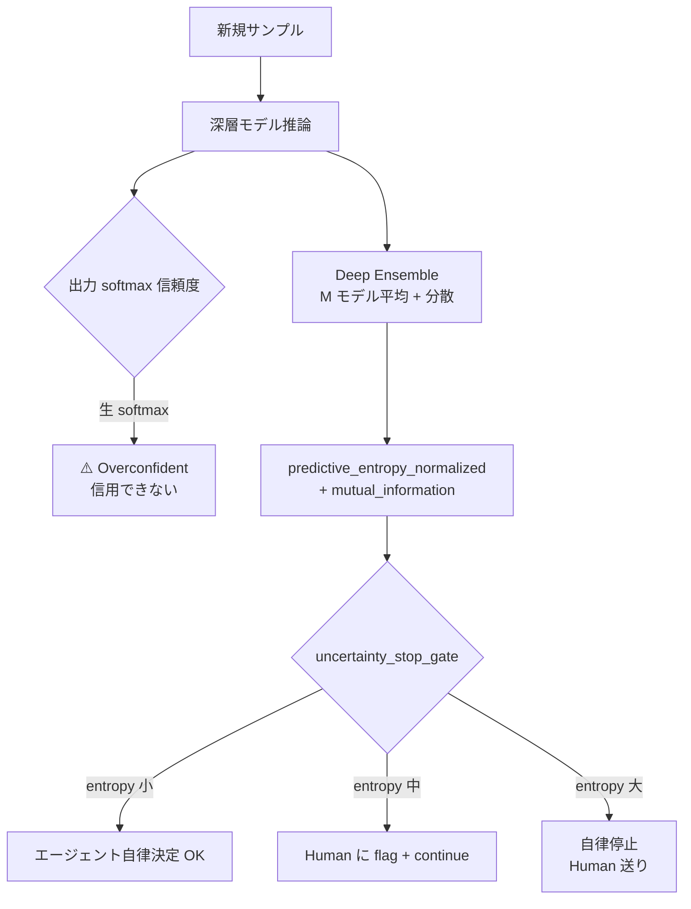
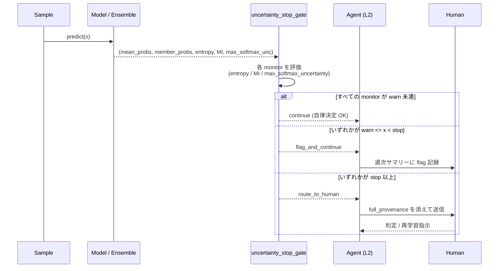

# 第8章 深層モデルの不確かさ入門 — Agentic 停止条件つき

> [!NOTE]
> **本章の到達目標**
> - **calibrated softmax の限界**（confidence ≠ probability）を数値例で説明できる
> - **calibration 指標**（Brier / ECE / reliability diagram）を実装し、Skill の受け入れ基準に組み込める
> - **temperature scaling** による post-hoc calibration を Skill 化できる
> - **Deep Ensemble Skill** を M モデルで実装し、`predictive_entropy_normalized` / `mutual_information`（epistemic）/ `expected_entropy`（aleatoric）を計算できる
> - **`uncertainty_stop_gate` 契約**を書き、エージェントが不確かさ閾値超過時に自律停止して Human に投げるゲートを設計できる
> - 第6章 §6.3 の `val_ood_score` の forward reference を、この章で **具体実装として回収**する
> - 第7章の `domain_gap_gate`（feature-level OOD）と、この章の `uncertainty_stop_gate`（output-level uncertainty）の**役割分担**を書き分けられる
>
> **本章で扱わないこと**
> - **MC-Dropout / BNN**（Bayes by Backprop / VI / SG-MCMC）→ **第9章**（Deep Ensemble との使い分け表を含む）
> - **PyMC / NumPyro による本格ベイズ推論** → **第10-12章**（vol-02 継承 + 深層特徴の接続）
> - **conformal prediction の詳細** → **第9章末で使い分け表のみ触れる**
> - **Grad-CAM / SHAP / attribution** → **第10章**（解釈と誤判定流し戻し UX）

---

## 8.1 この章で作る Skill

3 つの **不確かさ Agentic Skill** と 1 つの **停止ゲート契約**を作ります。

| Skill / 成果物 | 役割 | 入出力 |
|---|---|---|
| **`calibration_check`** | 学習済みモデルの calibration 品質を測る | 入力: model + val set → 出力: ECE / Brier / reliability diagram |
| **`temperature_scaling`** | post-hoc temperature scaling で calibration を改善 | 入力: model + calibration set → 出力: 温度パラメータ T + wrapped model |
| **`deep_ensemble`** | M モデルの Deep Ensemble を訓練・推論・不確かさ分解 | 入力: model factory + M + data → 出力: 平均予測 / 分散 / 分解 |
| **`uncertainty_stop_gate`**（契約） | 推論時に不確かさ閾値超過で自律停止 → Human 送り | 入力: predictive distributions → 出力: action (continue / route_to_human / block) |

前提として、第4章 provenance 3 レイヤ、第5-6 章の契約群、第7章の `domain_gap_gate` を継承します。

---

## 8.2 なぜこの章が必要か — vol-02 第9-10 章との対比

vol-02 では PyMC による本格ベイズ推論（第10-12章）で不確かさを扱いました。しかし深層モデルでは：

- **PyMC でネットワーク重みを直接推論するのは計算コストが非現実的**（数百万〜数十億パラメータ）
- **深層モデルの softmax 出力は "確率" ではなく "confidence"** — calibration を測らないと数字が意味を持たない
- **単一 checkpoint の点推定では、認識できていないことを認識できない**（epistemic uncertainty が消える）

一方で Agentic 環境では：

- エージェントが `predict()` の 1 スカラー確信度を鵜呑みにして自律判断すると **危険**
- Human に投げる基準を「confidence < 0.7 なら」で決めると overconfidence 問題で **不発**（本当は 0.9 でも間違っている）
- **不確かさ閾値超過で停止するゲート**を Skill に組み込まないと、暴走する



---

## 8.3 Calibrated softmax の限界 — 「confidence 0.95」は 95% ではない

深層モデルの softmax 出力は「学習時の cross-entropy を最小化した結果の確率らしき数値」であり、**真の予測確率とは一致しません**。

### §8.3 confidence bin の「予測との差」

**注**：下表の「予測との差」は各 bin の accuracy と bin **中央値** confidence（例：bin `0.9-1.0` は中央 0.95）の差です。

学習済み ResNet を CIFAR-10 で評価すると（Guo et al., 2017 系の典型結果パターン）：

| 予測 confidence | サンプル数 | 実際の正解率 | 予測との差 |
|---|---|---|---|
| 0.5-0.6 | 500 | 0.55 | +0.00 |
| 0.6-0.7 | 800 | 0.58 | -0.07 |
| 0.7-0.8 | 1200 | 0.68 | -0.07 |
| 0.8-0.9 | 2500 | 0.79 | -0.06 |
| 0.9-1.0 | 5000 | 0.88 | **-0.07** |

**「confidence 0.9-1.0 のうち、実際に正解なのは 88%」**——つまり深層モデルは自信過剰（overconfident）です。

> [!IMPORTANT]
> **上表は教材上の典型パターン**であり、実測ではモデル・データセット・学習設定で大きく変わります。**必ず自データで reliability diagram を描いてから閾値を決めてください**。

### なぜ overconfident になるのか

1. **Cross-entropy loss は confidence を 1 に押し上げる圧力を持つ**（間違っていても押し上げる）
2. **BatchNorm / dropout / weight decay が寄与するが、根本原因は capacity 過剰**
3. **augmentation を除いた「素の train」で最終 epoch を回すと悪化**

### 結果：エージェントが softmax を鵜呑みにするとどうなるか

```python
# ❌ 危険なパターン
prediction = model(x)                     # (batch, n_classes)
confidence = prediction.softmax(-1).max()
if confidence > 0.7:
    agent_autonomous_action()             # ⚠️ 実際は正解率 65% でも走る
else:
    route_to_human()
```

正しくは、**calibration を測定してから閾値を決める**（§8.4）、**temperature scaling で補正**（§8.5）、**Deep Ensemble で分散を測る**（§8.6）、そして **`uncertainty_stop_gate` 契約で停止条件を明文化**（§8.8）します。

---

## 8.4 Calibration 指標 — Brier / ECE / reliability diagram

### Brier score

$$
\mathrm{Brier} = \frac{1}{N} \sum_{i=1}^{N} \sum_{k=1}^{K} (p_{ik} - y_{ik})^2
$$

- $p_{ik}$: サンプル $i$ のクラス $k$ の予測確率
- $y_{ik}$: one-hot 正解（0 or 1）
- **範囲**: 0（完璧）〜 2。**K-class one-hot 定義では K=2 でも 0〜2**（各サンプル最大寄与 $2$：予測 $[1,0]$ vs 正解 $[0,1]$）。二値分類で scalar $p \in [0,1]$ に対して $(p-y)^2$ を使う慣例では 0〜1。契約では**どちらの定義を使うか必ず明記**すること
- 予測が正確でも overconfident なら悪化する

### Expected Calibration Error (ECE)

confidence を M bin に区切り、各 bin での |accuracy − confidence| の加重平均：

$$
\mathrm{ECE} = \sum_{m=1}^{M} \frac{|B_m|}{N} \, \bigl| \, \mathrm{acc}(B_m) - \mathrm{conf}(B_m) \, \bigr|
$$

ここでは $B_m = \{ i \mid c_i \in ((m-1)/M, m/M] \}$（左端除外の半開区間）とします。softmax の max confidence は通常 $1/K$ 以上なので左端除外の影響は無視できます。$M$（bin 数）は **各 bin に十分なサンプルがある場合のみ 10-15 を採用**し、クラス不均衡・少データではサンプル数を bin ごとに報告するか、等頻度 bin に切り替えてください。

- **範囲**: 0（完璧）〜 1
- **典型的な採用基準**：ECE < 0.05 なら calibration OK（**例示；タスク・重要度で変わる**）
- Bin 数 M は 10〜15 が慣例（少なすぎると鈍感、多すぎると個別 bin が空）

### Reliability diagram

x 軸 = confidence bin、y 軸 = accuracy を描画。**対角線に近い**ほど calibration が良好。

```python
# calibration_metrics.py
import numpy as np

def expected_calibration_error(probs: np.ndarray, labels: np.ndarray, n_bins: int = 15) -> float:
    """
    probs: (N, K) 予測確率、labels: (N,) 正解クラス
    """
    confidences = probs.max(axis=1)
    predictions = probs.argmax(axis=1)
    accuracies = (predictions == labels).astype(float)

    bin_edges = np.linspace(0.0, 1.0, n_bins + 1)
    ece = 0.0
    for lo, hi in zip(bin_edges[:-1], bin_edges[1:]):
        in_bin = (confidences > lo) & (confidences <= hi)
        if in_bin.sum() == 0:
            continue
        acc_bin = accuracies[in_bin].mean()
        conf_bin = confidences[in_bin].mean()
        ece += (in_bin.sum() / len(probs)) * abs(acc_bin - conf_bin)
    return float(ece)


def brier_score(probs: np.ndarray, labels: np.ndarray) -> float:
    """
    probs: (N, K), labels: (N,)
    """
    n_classes = probs.shape[1]
    one_hot = np.eye(n_classes)[labels]
    return float(((probs - one_hot) ** 2).sum(axis=1).mean())
```

### Skill 契約への組み込み

```yaml
# calibration_acceptance.yaml
calibration_acceptance:
  ece_threshold: 0.05                     # example; タスクで再校正
  brier_threshold: 0.15                   # example; K=5 分類の目安
  reliability_diagram_output: "reports/reliability_YYYY-MM-DD.png"
  n_bins: 15
  compute_on: "val_set"                   # test への計算は禁止（第5章 anti-leakage）
  action_on_fail:
    - "run_temperature_scaling"           # §8.5 で自動実行
    - "if_still_fail_route_to_human"
```

---

## 8.5 Temperature Scaling — Post-hoc calibration の最小実装

学習済みモデルをそのままに、**softmax 前のロジットをスカラー T で割る**だけの後処理で ECE を大きく改善できます（Guo et al., 2017）。

$$
p_i = \mathrm{softmax}(z_i / T)
$$

- $T > 1$: 出力を「なだらか」に（overconfident を緩和）
- $T < 1$: 出力を「尖らせる」（underconfident を補正）
- **重みは変更しない**ため、accuracy に影響を与えない（argmax は不変）

```python
# temperature_scaling.py
import torch
import torch.nn as nn
import torch.optim as optim

class TemperatureScaledModel(nn.Module):
    """
    Post-hoc temperature scaling。
    重要：
      - base_model の重みは frozen（`requires_grad_(False)`）。
      - fit_temperature には eval モード・no_grad で抽出した logits を渡す。
      - temperature を log 空間で持ち、常に正を保証（argmax 不変を保つ）。
    """
    def __init__(self, base_model: nn.Module):
        super().__init__()
        self.base_model = base_model
        for p in self.base_model.parameters():
            p.requires_grad_(False)                   # base 重み frozen
        # log_temperature を parameter にすることで T = exp(log_T) > 0 を保証
        self.log_temperature = nn.Parameter(torch.zeros(1))

    @property
    def temperature(self) -> torch.Tensor:
        return self.log_temperature.exp()

    def forward(self, x):
        self.base_model.eval()                        # 推論時常に eval
        with torch.no_grad():
            logits = self.base_model(x)
        return logits / self.temperature

    def fit_temperature(self, logits: torch.Tensor, labels: torch.Tensor, max_iter: int = 50):
        """
        calibration set の logits + labels から log_temperature のみを最適化。
        logits は事前に `base_model.eval()` + `torch.no_grad()` で抽出しておく：

            base_model.eval()
            with torch.no_grad():
                logits = torch.cat([base_model(x).detach() for x, _ in calib_loader])
                labels = torch.cat([y for _, y in calib_loader])
        """
        nll_criterion = nn.CrossEntropyLoss()
        optimizer = optim.LBFGS([self.log_temperature], lr=0.01, max_iter=max_iter)

        def closure():
            optimizer.zero_grad()
            loss = nll_criterion(logits / self.temperature, labels)
            loss.backward()
            return loss

        optimizer.step(closure)
        return float(self.temperature.item())
```

### Skill 契約

```yaml
# temperature_scaling_contract.yaml
temperature_scaling:
  enabled: true
  calibration_set:
    source: "val_split_of_current_training"   # test 使用は fatal
    n_samples_min: 500                         # 少なすぎると T 推定が不安定
  optimizer:
    name: "LBFGS"
    max_iter: 50
  acceptance:
    ece_after_scaling_threshold: 0.03          # example
    # accuracy 変化ではなく個別予測の変化を数える（argmax 保存の厳密チェック）
    prediction_change_count_max: 0             # tie 以外の変化は 0 でなければ fatal
    allow_tie_only_changes: true               # 完全同点の場合のみ変化許容
    accuracy_change_max_delta: 0.0             # 補助チェック（0 が理想）
  temperature_constraint:
    positive_only: true                        # log 空間で持つことで自動保証
  provenance:
    log_temperature_value: true
    log_calibration_set_hash: true
  agent_authorization:
    l1: "inference_with_scaled_model_only"
    l2: "can_refit_temperature_on_new_val_set"
    l3: "same_as_l2"
  # temperature の学習後変更は L3 でも都度承認必須
  refit_approval_required: true
```

---

## 8.6 Deep Ensemble Skill — M モデルで不確かさを分解

Deep Ensemble は「異なる seed / 初期化で M 個のモデルを独立に学習し、推論時に平均と分散を取る」手法です（Lakshminarayanan et al., 2017）。

- **簡単**：学習コードそのまま × M
- **強力**：多くのベンチマークで MC-Dropout / BNN を上回る calibration と OOD 検出性能
- **並列化容易**：M 個の学習ジョブは独立

### 実装骨格

```python
# deep_ensemble.py
import torch
from typing import Callable, List

class DeepEnsemble:
    def __init__(self, model_factory: Callable[[int], torch.nn.Module], m: int):
        """
        model_factory(seed) は seed から独立学習済みモデルを返す関数。
        m は ensemble 数（推奨 5-10）。
        """
        self.models: List[torch.nn.Module] = []
        for seed in range(m):
            _set_seeds(seed)                            # 第4章 Layer 1: worker seed 実 seed を記録
            self.models.append(model_factory(seed))

    def predict_distribution(self, x: torch.Tensor) -> dict:
        """
        M モデルの softmax を集計。
        戻り値:
          mean_probs      : (batch, K)  M モデル平均
          member_probs    : (M, batch, K) 各モデル出力
          predictive_entropy: (batch,)   総不確かさ H[E[p]]
          expected_entropy  : (batch,)   aleatoric 近似 E[H[p]]
          mutual_information: (batch,)   epistemic 近似 H[E[p]] - E[H[p]]
        """
        member_probs = torch.stack([
            m(x).softmax(-1) for m in self.models
        ], dim=0)                                        # (M, batch, K)
        mean_probs = member_probs.mean(dim=0)            # (batch, K)

        # 総 predictive entropy
        eps = 1e-12
        predictive_entropy = -(mean_probs * (mean_probs + eps).log()).sum(-1)  # (batch,)
        # aleatoric 近似（各モデルの entropy 平均）
        member_entropy = -(member_probs * (member_probs + eps).log()).sum(-1)  # (M, batch)
        expected_entropy = member_entropy.mean(0)                              # (batch,)
        # epistemic 近似
        mutual_information = predictive_entropy - expected_entropy             # (batch,)

        return {
            "mean_probs": mean_probs,
            "member_probs": member_probs,
            "predictive_entropy": predictive_entropy,
            "expected_entropy": expected_entropy,
            "mutual_information": mutual_information,
        }
```

### Uncertainty 分解の解釈

| 量 | 意味 | 高いとき |
|---|---|---|
| **`predictive_entropy`** ($H[\mathbb{E}[p]]$) | 総不確かさ | このサンプルは全体的に判別困難 |
| **`expected_entropy`** ($\mathbb{E}[H[p]]$) | aleatoric（データノイズ）近似 | 個々のモデルがそれぞれ高 entropy で迷っている（データが本質的にあいまい）。**モデル間の意見の分かれは `mutual_information` で見る** |
| **`mutual_information`** ($H[\mathbb{E}[p]] - \mathbb{E}[H[p]]$) | epistemic（モデル不確かさ）近似 | モデル間で意見が分かれている（学習データ不足の可能性） |

> [!NOTE]
> **この分解は近似**です。「aleatoric = ノイズ、epistemic = 知識不足」という厳密な因果分解にはなりません（Deep Ensemble の epistemic は "分散" 由来で、真の posterior 上の不確かさとは限らない）。実務上は「両者を並置して監視する」が現実的です。

> [!IMPORTANT]
> **`_set_seeds(seed)` の実装要件**：Python `random`・NumPy・PyTorch CPU/CUDA・DataLoader worker seed（第4章 Layer 1）を **すべて** 設定します。それでも Deep Ensemble メンバー間の**真の独立性は保証されず**、data order・augmentation RNG・pretrained 初期化・checkpoint 共有などで多様性が崩れる可能性があります。契約に以下を追加してください：
>
> ```yaml
> ensemble_diversity:
>   record_member_seed: true
>   record_data_order_seed_per_member: true
>   record_augmentation_seed_per_member: true
>   require_distinct_initialization_hash: true      # 初期重み hash が全 M で異なる
>   min_pairwise_disagreement_on_val: "task_specific"  # 相関崩壊の早期検出
> ```

### 正規化 entropy（Ch06 §6.3 の forward reference を回収）

第6章 §6.3 で「`predictive_entropy_normalized > 0.3` で自律停止」と参照した数値の正体：

$$
\mathrm{predictive\_entropy\_normalized} = \frac{H[\mathbb{E}[p]]}{\log K}
$$

$K$ はクラス数。$\log K$ で割ることで **値域を [0, 1] に正規化**、クラス数が違うタスク間で閾値を比較できます。

```python
def predictive_entropy_normalized(mean_probs: torch.Tensor) -> torch.Tensor:
    """mean_probs: (batch, K) -> (batch,) in [0, 1]"""
    eps = 1e-12
    K = mean_probs.shape[-1]
    assert K > 1, "entropy normalization requires K > 1"
    H = -(mean_probs * (mean_probs + eps).log()).sum(-1)
    log_k = torch.log(torch.tensor(K, dtype=H.dtype, device=H.device))  # device 揃える
    return H / log_k
```

---

## 8.7 `val_ood_score` の実装候補 — 第6章の forward reference 回収

第6章 §6.3 では `ood_stop_gate.monitor = "val_ood_score_placeholder"` として **forward reference** にしていました。この章で 4 つの実装候補を提示します。

| 実装 | 計算コスト | 追加モデル | 特徴 |
|---|---|---|---|
| **A. Max-softmax uncertainty** | 極低 | なし | `1 - max(softmax)`。値域 [0, 1-1/K]、方向は「大きいほど危険」。overconfidence の影響を受けるが baseline として便利 |
| **B. Predictive entropy (normalized)** | 極低 | なし | Deep Ensemble または単一モデルで計算可 |
| **C. Deep Ensemble mutual information** | 中 | Deep Ensemble | epistemic の近似指標。OOD で高くなる |
| **D. Mahalanobis on penultimate** | 中 | calibration set | 第7章 §7.5 の domain_gap と同じ手法（**役割は違う**、§8.10 で整理） |

### 推奨：Deep Ensemble 前提なら B + C の併用

```yaml
# val_ood_score_implementation.yaml
val_ood_score:
  primary_metric: "predictive_entropy_normalized"    # §8.6 の実装
  secondary_metric: "mutual_information"             # epistemic 監視
  thresholds:                                        # example; calibration set から derive
    warn: 0.3                                        # 上位 20% あたりを想定
    stop: 0.5                                        # 上位 5% あたりを想定
  aggregation_over_batch: "max"                      # バッチ内の worst-case を採用
  calibration_set:
    source: "val_split_of_current_training"
    reference_sha256: "..."
```

**単一モデル運用（Deep Ensemble 未使用）の場合**は A + B のみで代替できます。ただし epistemic の情報は失われるため、`domain_gap_gate`（第7章 §7.5）との併用が必須です。

---

## 8.8 `uncertainty_stop_gate` 契約 — Agentic 自律停止の設計

推論時に不確かさが閾値を超えたらエージェントは **自律決定を停止し Human に投げる**。この振る舞いを契約化します。

```yaml
# uncertainty_stop_gate.yaml
uncertainty_stop_gate:
  enabled: true
  # 監視する指標（複数可、いずれかが閾値超過で発動）
  monitors:
    - metric: "predictive_entropy_normalized"
      threshold_warn: 0.3
      threshold_stop: 0.5
    - metric: "mutual_information"                   # epistemic
      threshold_warn: 0.15
      threshold_stop: 0.30
    - metric: "max_softmax_uncertainty"              # = 1 - max_softmax_probability
      direction: "higher_is_riskier"                  # 明示的な方向（実装バグ防止）
      threshold_warn: 0.35                            # つまり max_softmax_probability < 0.65 で warn
      threshold_stop: 0.55                            # つまり max_softmax_probability < 0.45 で stop
  # calibration の前提
  requires_calibration_check_first: true             # ECE < ece_threshold でないと gate 無効
  requires_temperature_scaling_if_ece_high: true

  # 動作
  action_on_warn: "flag_and_continue_with_annotation"
  action_on_stop: "route_to_human_with_full_provenance"
  # stop 発動時に Human に渡す情報
  human_handoff_payload:
    - "sample_id"
    - "triggered_metric_names"                       # どの monitor が発動したか
    - "thresholds_used"                              # 発動時の閾値
    - "predicted_class_with_confidence"
    - "top_k_classes_with_probabilities"             # k=3 程度
    - "predictive_entropy_normalized"
    - "mutual_information"
    - "max_softmax_uncertainty"
    - "ensemble_member_predictions"
    - "domain_gap_score"                             # §7.5 と併記
    - "recent_calibration_ece"
    - "temperature_value"                            # §8.5 の T
    - "model_version"
    - "calibration_set_hash"
    - "raw_input_or_sanitized_view_uri"              # Human が実サンプルを確認できるように
    - "recommended_next_action"                      # 推奨アクション（Human は上書き可）
    - "allowed_human_actions"                        # Human が選べる action リスト
    - "provenance_uri"

  # エージェント権限
  agent_authorization:
    l1: "can_only_observe_gate_output"
    l2: "can_execute_action_on_warn_but_not_disable"
    l3: "same_as_l2"
    disable_gate_all_levels: forbidden               # 全レベル無効化禁止
    threshold_change_by_agent: forbidden             # 全レベル閾値変更禁止

  # 監査
  audit:
    log_every_gate_evaluation: true
    weekly_summary_to_human: true
    consecutive_stop_warning: 5                       # 5 回連続 stop で weekly より早く警告
```

### エージェント判断シーケンス



> [!IMPORTANT]
> **`uncertainty_stop_gate` は Skill を跨いで共通化**します。1D CNN Skill（第6章）でも、転移学習 Skill（第7章）でも、Foundation Model Skill（第11章）でも、この契約フォーマットを再利用します。閾値は Skill ごとに calibrate しますが、フィールドスキーマは統一します。

---

## 8.9 単一モデル vs Deep Ensemble vs 事後 calibration — 判断表

| 状況 | 推奨 | 理由 |
|---|---|---|
| **正解率が最優先、不確かさは補助** | 単一モデル + temperature scaling | 計算コスト最小、calibration は改善可 |
| **Human-in-the-loop で自律停止が必要** | **Deep Ensemble (M=5)** | epistemic 分解が可能、OOD 検出も強い |
| **少データで epistemic を強く出したい** | Deep Ensemble (M=5-10) or MC-Dropout（第9章） | M を増やすほど安定 |
| **GPU / 時間が極めて制約** | 単一モデル + temperature scaling + max-softmax gate | Deep Ensemble は諦める、代わりに `domain_gap_gate`（第7章）を厳しめに |
| **PyMC 階層に接続したい** | Deep Ensemble の平均予測を層別 feature に（第13章）| 深層特徴の不確かさは第13章 capstone で |

### エージェントに任せてよい判断

| 判断場面 | L1 | L2 | L3 | 説明 |
|---|:---:|:---:|:---:|---|
| Deep Ensemble メンバー数 M の変更 | ❌ | ❌ | ⚠️ | L3 でも事前承認が必要（provenance 全体が変わる） |
| `predictive_entropy_normalized` の閾値変更 | ❌ | ❌ | ❌ | 全レベル禁止 |
| temperature 値の再学習（新 val set で） | ❌ | ✅ | ✅ | L2 は `refit_approval_required: true` の下で可 |
| Gate 発動時の Human 送り | ❌ | ✅ | ✅ | 決定的動作、L2 で可 |
| Gate 無効化 | ❌ | ❌ | ❌ | 全レベル禁止 |

---

## 8.10 `domain_gap_gate`（第7章）と `uncertainty_stop_gate`（本章）の役割分担

両者は **どちらも「怪しいサンプルで止まる」** ですが、**測っている対象と発動タイミングが違います**。

| 観点 | `domain_gap_gate` (§7.5) | `uncertainty_stop_gate` (§8.8) |
|---|---|---|
| **測るもの** | feature-level：penultimate 出力が事前学習分布からどれくらい離れているか | output-level：softmax 出力の不確かさ（entropy / MI / max-softmax） |
| **発動タイミング** | 学習前・推論時（両方） | 推論時のみ |
| **計算方法** | Mahalanobis / cosine / FID-like | predictive entropy / mutual information / max-softmax |
| **必要なもの** | Human curated calibration set + shrinkage covariance | 学習済みモデル + calibration set |
| **fine-tune を止められるか** | ✅ block_finetune 可能 | ❌ 学習停止には使わない |
| **Deep Ensemble が必要か** | 不要（単一モデルの penultimate で計算） | epistemic 分解には Ensemble 必須 |
| **典型的な発動理由** | 「そもそも事前学習モデルに認識できない領域」 | 「認識できるが確信が持てない」 |

### 両者を並置する契約

```yaml
# combined_ood_and_uncertainty.yaml
# 第7章 domain_gap_gate は pass / review / stop の tri-state を返す
sample_admission_policy:
  step_1_domain_gap:                  # 第7章 §7.5
    reference: "domain_gap_gate.yaml"
    on_pass: "run_step_2"
    on_review: "route_to_human_with_optional_uncertainty_context"
                                      # step 2 を実行するが結果は Human 参考用
                                      # step 1 の review 判定を step 2 で覆すことは禁止
    on_stop: "block_inference"        # ここで止まったら uncertainty 測る意味がない
  step_2_uncertainty:                 # 本章 §8.8
    reference: "uncertainty_stop_gate.yaml"
    run_when_step_1: ["pass", "review_for_context_only"]
    cannot_override_step_1_review_or_stop: true
    on_stop: "route_to_human"
```

> [!TIP]
> **段階チェックの順序を逆にしない**。「先に uncertainty 見て、それが低ければ通す」だと、domain gap が大きく本来は認識できていないサンプルを、たまたま overconfident に「認識できた」と判定して通してしまう可能性があります。**必ず「feature-level 分布内か」→「output-level 確信度は十分か」の順**。

---

## 8.11 失敗パターンと改善版

| 失敗 | 原因 | 改善版 |
|---|---|---|
| confidence 0.9 のサンプルが 30% 誤答 | 生 softmax を鵜呑み | §8.4 ECE 測定 → §8.5 temperature scaling |
| ECE 0.02 なのに OOD で誤動作 | in-distribution calibration だけ見た | `domain_gap_gate` と併用（§8.10） |
| Deep Ensemble を M=2 で運用 | コスト削減 | M ≥ 5 推奨、`consecutive_stop_warning` で監視 |
| ensemble の全モデルが同じ seed でスタート | model_factory 実装バグ | `_set_seeds(seed)` を必須化、provenance に M 個の seed を記録 |
| `predictive_entropy_normalized` を対数 K で割り忘れ | 実装ミス | クラス数が違う Skill 間で閾値が比較不能に。単体テストを書く |
| temperature scaling で accuracy が変わった | argmax が保持されない実装 | temperature は logits を割るだけ。他の変更を混ぜない |
| Gate 発動が多すぎて Human 疲弊 | 閾値が厳しすぎ or 学習不足 | まず ECE を下げる → 閾値再校正 → データ追加 |
| Gate を「一時的に無効化」した後戻し忘れ | manual override | 契約で `disable_gate_all_levels: forbidden`、監査ログ必須 |
| calibration set と test set が重複 | anti-leakage 違反 | 第5章 `deep_split_contract` で分離を fatal assert |
| epistemic uncertainty が単一 checkpoint で推定できないのに主張 | Deep Ensemble/MC-Dropout なしで epistemic を語る | 単一モデルなら `max_softmax` + `domain_gap_gate` のみに絞る |
| **Ensemble メンバーが seed 違いでも相関している** | data order・augmentation seed・初期化 hash が共有 | `ensemble_diversity` 契約に `require_distinct_initialization_hash: true` と `min_pairwise_disagreement_on_val`、`record_data_order_seed_per_member` を追加 |
| **ECE / 閾値が seed 間で不安定** | calibration set が小さい / 特定 seed の偶然 | 複数 seed で calibration set を切り、ECE の平均・分散を報告。閾値は 95% CI で保守的に決める |
| **閾値が時間と共に drift する（装置変化・分布シフト）** | 一度校正した閾値を放置 | 月次で ECE / 閾値を再校正するタスクを設ける、`weekly_summary_to_human` に監視項目を追加 |
| **クラス不均衡下で ECE bin が空になる** | bin 数固定 15 で少数クラス消失 | 適応 bin（等頻度）に切替、または `n_bins` を減らす。bin ごとのサンプル数もレポート |
| **temperature scaling を汚染された calibration set で学習** | val に test の一部が混入した | Ch05 anti-leakage assert に加えて calibration_set_hash を provenance に記録し、再現時に照合 |
| **Deep Ensemble 推論時に model.eval() 忘れ** | dropout が active のまま推論 | 推論エントリで全メンバーを `eval()` に強制。`assert not m.training for m in ensemble.models` |

---

## 8.12 この章のチェックリスト

- [ ] 学習済みモデルに対して val set で ECE / Brier を計算している
- [ ] ECE > 0.05（または task-specific 閾値）なら temperature scaling を適用している
- [ ] Temperature 適用後、accuracy が変わっていないことを確認している
- [ ] Deep Ensemble を採用する場合、M ≥ 5 で seed を別々にしている
- [ ] 各 ensemble メンバーの seed を provenance に記録している
- [ ] `predictive_entropy` / `expected_entropy` / `mutual_information` を分けて計算している
- [ ] `predictive_entropy_normalized = H / log K` で正規化している
- [ ] 第6章 §6.3 の `val_ood_score` を §8.7 の実装候補で具体化している
- [ ] `uncertainty_stop_gate` を Skill 契約に組み込んでいる
- [ ] `uncertainty_stop_gate` の閾値変更を全レベル禁止している
- [ ] `disable_gate_all_levels: forbidden` を設定している
- [ ] Gate 発動時の `human_handoff_payload` を明示している
- [ ] `domain_gap_gate` と `uncertainty_stop_gate` の**両者を並置**し、順序を「feature-level → output-level」にしている
- [ ] calibration set と test set が重複していない（第5章 anti-leakage 契約で fatal assert）
- [ ] Deep Ensemble を持たない単一モデル運用では、epistemic を主張していない

---

## 8.13 ワーク・まとめ・参考資料

### 演習

1. **ECE 計算の実装**：CIFAR-10 で公開されている pre-trained ResNet の softmax 出力（val 5000 サンプル）に対して、`expected_calibration_error(n_bins=15)` を実装・計算せよ。教材上のパターンでは ECE ≈ 0.08 になる想定。
2. **Temperature scaling の効果測定**：上記モデルに対して val の 500 サンプルで T を最適化し、残り 4500 サンプルで ECE 改善を測定せよ。T ≈ 1.5-2.5 になれば期待通り。
3. **Deep Ensemble の実装**：第6章の 1D CNN を M=5 で ensemble し、`predictive_entropy_normalized` と `mutual_information` を計算せよ。OOD として意図的に augmentation を強化したサンプルを混ぜ、両指標が上がるか確認せよ。
4. **Gate 契約の設計**：あなたが実装したい Skill（例：SEM 画像分類）について、`uncertainty_stop_gate.yaml` を書け。`monitors` の 3 指標について、warn / stop 閾値の初期値を calibration set の 80% / 95% タイル値から derive せよ。
5. **並置 gate のシナリオシミュレーション**：以下 3 サンプルについて、`sample_admission_policy` の 2 段階チェックが pass / stop するか判定せよ。
   - サンプル A: normalized_gap 0.1, predictive_entropy_normalized 0.2 → ?
   - サンプル B: normalized_gap 0.4, predictive_entropy_normalized 0.15 → ?
   - サンプル C: normalized_gap 0.15, predictive_entropy_normalized 0.55 → ?

### まとめ

- **Softmax confidence ≠ 予測確率**。ECE / Brier / reliability diagram で必ず measure する
- **Temperature scaling** は accuracy を保ちつつ ECE を下げる最小コストの post-hoc 法
- **Deep Ensemble (M=5-10)** で `predictive_entropy` / `mutual_information` を分解できる。epistemic 監視の第一選択
- **`predictive_entropy_normalized = H / log K`** で値域 [0, 1]、クラス数を跨いで閾値比較可
- **第6章 `val_ood_score` の実装候補 4 種**（max-softmax / normalized entropy / mutual info / Mahalanobis）から選ぶ
- **`uncertainty_stop_gate`** は監視指標・閾値・action・authorization を明文化した契約。Skill 間で共通化する
- **第7章 `domain_gap_gate`（feature-level）と本章 `uncertainty_stop_gate`（output-level）は役割が違う**。並置して「feature → output」の順序で評価する
- **Gate 無効化は全レベル禁止**。閾値変更は事前 Human 承認が必要

### 参考資料

**本書内**：
- 第4章 §4.4-4.10（provenance 3 レイヤ、Agentic 学習権限 L1-L3）
- 第5章（`deep_split_contract` の calibration/test 分離）
- 第6章 §6.3（`val_ood_score` forward reference の起点）
- 第7章 §7.5（`domain_gap_gate`：feature-level OOD）
- 第9章（MC-Dropout / BNN、conformal prediction 比較表）
- 第10章（誤判定流し戻し UX、attribution）
- 第13章（capstone：深層特徴 × PyMC 階層に不確かさを渡す）
- 第14章（Deep Ensemble の過信・BNN の未収束）

**vol-01/02**：
- vol-02 第9章（予測区間、conformal prediction 基礎）
- vol-02 第10-12章（PyMC の $\hat{R}$ / ESS / PPC など診断）

**外部**：
- Guo et al. — "On Calibration of Modern Neural Networks", ICML 2017 [https://arxiv.org/abs/1706.04599](https://arxiv.org/abs/1706.04599)
- Lakshminarayanan et al. — "Simple and Scalable Predictive Uncertainty Estimation using Deep Ensembles", NeurIPS 2017 [https://arxiv.org/abs/1612.01474](https://arxiv.org/abs/1612.01474)
- Ovadia et al. — "Can You Trust Your Model's Uncertainty?", NeurIPS 2019 [https://arxiv.org/abs/1906.02530](https://arxiv.org/abs/1906.02530)
- Kendall & Gal — "What Uncertainties Do We Need in Bayesian Deep Learning?", NeurIPS 2017 [https://arxiv.org/abs/1703.04977](https://arxiv.org/abs/1703.04977)
- Naeini et al. — "Obtaining Well Calibrated Probabilities Using Bayesian Binning", AAAI 2015 [https://cdn.aaai.org/ojs/9602/9602-13-13130-1-2-20201228.pdf](https://cdn.aaai.org/ojs/9602/9602-13-13130-1-2-20201228.pdf)
- Hendrycks & Gimpel — "A Baseline for Detecting Misclassified and OOD Examples", ICLR 2017 [https://arxiv.org/abs/1610.02136](https://arxiv.org/abs/1610.02136)
