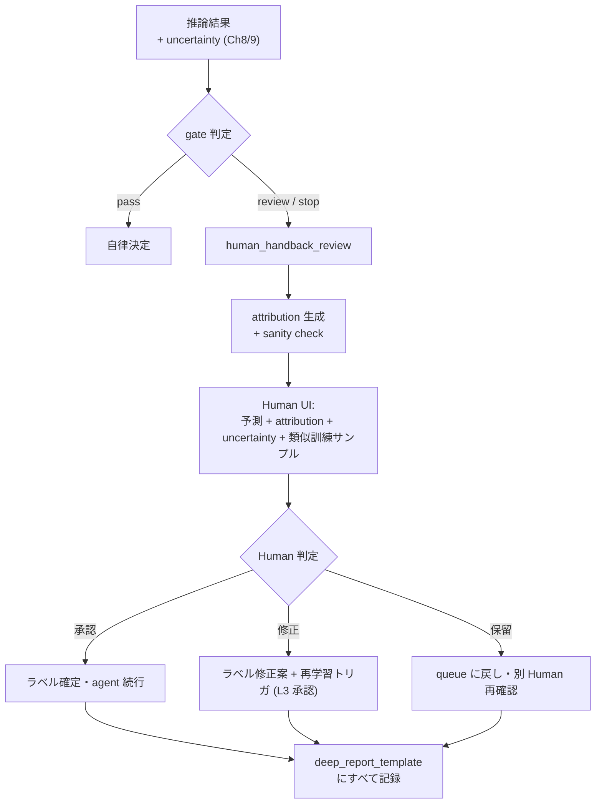
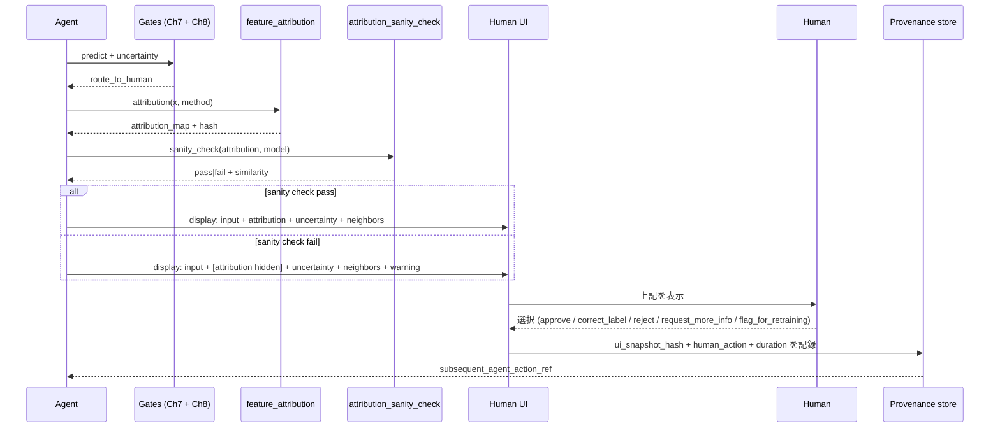

# 第10章 深層モデルの検証・可視化・レポート化 — Human-in-the-loop 拡張

> [!NOTE]
> **本章の到達目標**
> - **Grad-CAM / Integrated Gradients / SHAP for deep** の 3 系統を区別し、それぞれの前提と限界を書き分けられる
> - **`feature_attribution` Skill** を実装し、attribution そのものの信頼性を測るサニティチェック（sanity checks for saliency maps）を契約に組み込める
> - **attribution hallucination の対策プロトコル**（model randomization test, data randomization test, cascading randomization）を Skill 化できる
> - **reliability diagram** を深層モデルに適用し、第8章 `calibration_check` の出力を Human 説明資料に接続できる
> - **Human-in-the-loop 拡張**：誤判定サンプルを Human に流し戻し、Human が attribution を検証してラベル修正案を返す UX を Skill 契約に落とせる
> - **深層レポートテンプレート**（環境固定 + weights sha + augmentation config + attribution artifacts + Human review log）を書ける
> - vol-01 第6章「予防的 Human-in-the-loop 3 原則」を**深層モデル特有の誤判定流し戻し UX**として拡張できる
>
> **本章で扱わないこと**
> - **Foundation Model の hallucination** → **第11章**（LLM/FM 特有の retrieval-augmented 検証）
> - **SSL / 対比学習の attribution** → **第12章**（表現空間の解釈）
> - **CAM 系の理論詳細**（Grad-CAM++ / Score-CAM / Ablation-CAM 等） → 参考文献
> - **深層一般 × Agentic 失敗事例集** → **第14章**（本章では設計側の予防を扱う）

---

## 10.1 この章で作る Skill

3 つの **解釈・検証 Agentic Skill** と 1 つの **深層レポートテンプレート**を作ります。

| Skill / 成果物 | 役割 | 入出力 |
|---|---|---|
| **`feature_attribution`** | Grad-CAM / IG / SHAP の 3 手法を統一 API で呼び出し、attribution artifact を保存 | 入力: model + sample + method → 出力: attribution map + provenance |
| **`attribution_sanity_check`** | attribution の hallucination を検出（model randomization / data randomization） | 入力: 元 attribution + 乱数化後 attribution → 出力: similarity score + pass/fail |
| **`human_handback_review`**（契約 + Skill） | 誤判定・不確かさ超過サンプルを Human に流し戻し、Human 判定・ラベル修正案を回収 | 入力: flagged sample + attribution + uncertainty → 出力: Human review record（ラベル修正 / 保留 / 却下） |
| **`deep_report_template`** | 環境・重み・augmentation・attribution・Human review をまとめた再現可能レポート | 入力: 全 provenance → 出力: HTML / PDF レポート |

前提として、第4章 3 レイヤ provenance + 第7章 Layer 4 + 第9章 `bayesian_inference_config`、第8章 `uncertainty_stop_gate`、第7章 `domain_gap_gate` を継承します。**本章のレポートは第4-9 章のすべての契約状態を集約する監査可能ドキュメント**として設計します。

---

## 10.2 なぜこの章が必要か — vol-01 第6章の深層拡張

vol-01 第6章では「予防的 Human-in-the-loop 3 原則」を導入しました：**(1) 疑わしいときは Human**、**(2) 決めるのは Human**、**(3) 記録は改ざん不可**。深層モデルではこれが以下の理由で不十分になります：

- **モデルの内部が説明不能**：Human が「なぜこの予測になったか」を理解できないと、判定を信頼できず、フィードバックもできない
- **attribution 自体が hallucinate する**：Grad-CAM や SHAP の出力が「モデルの真の依存性」ではなく、単に "それらしい" 領域をハイライトすることがある（Adebayo et al., 2018）
- **誤判定サンプルの Human 流し戻し UX がない**：第8章 gate で "route_to_human" と言われても、Human 側に「何を見て、何を判定し、どう記録するか」の構造がなければ機能しない
- **深層レポートは事後再現が困難**：重み・環境・augmentation・attribution 生成条件がすべて揃わないと、6 か月後の監査に耐えない



> [!IMPORTANT]
> **本章は "解釈可能性" ではなく "検証可能性 + Human へ流し戻す UX + 再現可能レポート" の章です**。Grad-CAM の理論よりも、**attribution を Human が信じるための担保**と、**流し戻し後の Human 判定を Skill に組み込む方法**が主題です。

---

## 10.3 Attribution 3 系統の位置づけ

深層モデルの特徴 attribution 手法は大きく 3 系統：

| 系統 | 代表手法 | 対象モデル | 計算コスト | Human 直感性 |
|---|---|---|---|---|
| **CAM 系**（勾配 × 活性化） | Grad-CAM, Grad-CAM++, Score-CAM | CNN（局所受容野） | 低（forward + 1 backward） | 高（ヒートマップ） |
| **勾配積分系** | Integrated Gradients (IG), SmoothGrad | 任意の微分可能モデル | 中（N 個の interpolation） | 中〜高 |
| **摂動系** | SHAP (DeepSHAP / KernelSHAP), Occlusion, LIME | 任意（black-box 可） | 高（N 個の摂動サンプル） | 中（シャップ値の解釈が必要） |

### 使い分け早見表

| 目的 | 推奨 |
|---|---|
| CNN の畳み込み層で「どの空間領域が効いた」を見る | **Grad-CAM** |
| axiomatic な性質（completeness, sensitivity）が欲しい | **Integrated Gradients** |
| モデル非依存で shapley 値ベースの寄与を出したい | **SHAP** |
| CNN 以外の Transformer / MLP 系 | IG または SHAP（Grad-CAM は不適） |
| Human に「ここが根拠」と直感的に示したい | Grad-CAM ヒートマップ + IG による細部確認 |

> [!WARNING]
> **Grad-CAM は Transformer 系に "そのままでは" 適用できません**。Vision Transformer には attention rollout や Transformer-specific CAM 変種を使います。契約で「モデル系統に応じた手法選択」を強制すること（§10.5）。

---

## 10.4 Attribution hallucination — 3 つのサニティチェック

**Adebayo et al. (2018) "Sanity Checks for Saliency Maps"** が示した重要な指摘：一部の attribution 手法は、**モデルの重みをランダム化しても** / **ラベルをランダム化してもほぼ同じ attribution map を出す**。つまり "モデルの依存性" ではなく **単なる入力の edge / texture** を可視化しているだけの場合がある。

### 3 つのサニティチェック

| チェック | 手順 | 期待される結果 |
|---|---|---|
| **Model randomization test** | 学習済み重みを層ごとにランダム重みに置換し、attribution を再計算 | ランダム化した層以下の attribution が**大きく変わる**（similarity 低下） |
| **Cascading randomization** | 出力層から順に層をランダム化していき、attribution の遷移を見る | ランダム化が進むにつれ attribution が**段階的に劣化** |
| **Data randomization test** | ラベルをランダムシャッフルして学習し、attribution を比較 | ランダムラベル学習モデルの attribution は元モデルと**似ていない**べき |

### 実装（`attribution_sanity_check`）

```python
# attribution_sanity_check.py
import copy
import torch
import torch.nn as nn
from typing import Callable


def _spearman_correlation(a: torch.Tensor, b: torch.Tensor) -> dict:
    """
    Tie-aware Spearman rank correlation between two flattened attribution maps.
    return:
      rho: float or NaN
      valid: bool  (False if either input is degenerate: too few unique values or ~0 variance)
    Saliency maps の類似度としては **abs(rho)** を使うこと（符号反転も依存性を意味しうる）。
    """
    import numpy as np
    a_np = a.detach().cpu().numpy().ravel().astype(np.float64)
    b_np = b.detach().cpu().numpy().ravel().astype(np.float64)

    # degenerate 検出：unique value 数が極端に少ないか std がほぼ 0 のマップは信頼できない
    def _degenerate(x):
        return len(np.unique(x)) < 10 or x.std() < 1e-8
    if _degenerate(a_np) or _degenerate(b_np):
        return {"rho": float("nan"), "valid": False, "reason": "degenerate_map"}

    # scipy が利用可能なら scipy.stats.spearmanr（tie 対応）。ここでは numpy でランク平均で代替。
    try:
        from scipy.stats import rankdata
        a_rank = rankdata(a_np, method="average")
        b_rank = rankdata(b_np, method="average")
    except ImportError:
        a_rank = a_np.argsort().argsort().astype(np.float64)
        b_rank = b_np.argsort().argsort().astype(np.float64)

    a_c = a_rank - a_rank.mean()
    b_c = b_rank - b_rank.mean()
    denom = np.linalg.norm(a_c) * np.linalg.norm(b_c)
    if denom < 1e-12:
        return {"rho": float("nan"), "valid": False, "reason": "zero_variance"}
    rho = float((a_c * b_c).sum() / denom)
    return {"rho": rho, "valid": True, "reason": None}


def model_randomization_test(
    model: nn.Module,
    x: torch.Tensor,
    attribution_fn: Callable[[nn.Module, torch.Tensor], torch.Tensor],
    layers_to_randomize: list[str],
    seed: int = 0,
) -> dict:
    """
    元モデルの attribution と、指定層をランダム化したモデルの attribution を比較。
    重要：
      - GPU parameter には GPU 側 generator を使う（device 不一致回避）
      - BatchNorm running stats 等の buffer もランダム化対象に含めるかを契約で明示
      - サニティ判定は abs(rho) を使う（符号反転も saliency の依存性として扱う）
    return:
      original_attribution, randomized_attribution, similarity, pass
      randomized_layer_names, randomized_buffer_names, seed
    """
    original_attr = attribution_fn(model, x).detach()

    randomized_model = copy.deepcopy(model)
    randomized_params: list[str] = []
    randomized_buffers: list[str] = []

    def _gen_for(device):
        g = torch.Generator(device=device)
        g.manual_seed(seed)
        return g

    with torch.no_grad():
        for name, p in randomized_model.named_parameters():
            if any(name.startswith(prefix) for prefix in layers_to_randomize):
                g = _gen_for(p.device)
                p.copy_(torch.empty_like(p).normal_(generator=g))
                randomized_params.append(name)
        # BatchNorm 等の running stats（buffer）もランダム化対象に含める
        for name, buf in randomized_model.named_buffers():
            if any(name.startswith(prefix) for prefix in layers_to_randomize):
                if buf.dtype.is_floating_point and buf.numel() > 0:
                    g = _gen_for(buf.device)
                    buf.copy_(torch.empty_like(buf).normal_(generator=g))
                    randomized_buffers.append(name)

    randomized_attr = attribution_fn(randomized_model, x).detach()
    sim = _spearman_correlation(original_attr, randomized_attr)
    similarity_abs = abs(sim["rho"]) if sim["valid"] else float("nan")

    return {
        "original_attribution": original_attr,
        "randomized_attribution": randomized_attr,
        "spearman_similarity": sim["rho"],
        "spearman_similarity_abs": similarity_abs,
        "similarity_valid": sim["valid"],
        "invalid_reason": sim["reason"],
        "pass": bool(sim["valid"] and similarity_abs < 0.3),
        "randomized_params": randomized_params,
        "randomized_buffers": randomized_buffers,
        "seed": seed,
    }
```

### 契約 YAML

```yaml
# attribution_sanity_check.yaml
skill: "attribution_sanity_check"
version: "1.0.0"

requires:
  attribution_method: "grad_cam | integrated_gradients | shap_deep"
  reference_model: "trained_model_frozen"
  randomization_seed: "recorded_in_provenance"

tests:
  - name: "model_randomization_top_layer"
    layers: ["classifier", "head"]
    similarity_max: 0.3
  - name: "model_randomization_cascading"
    strategy: "top_down_layer_by_layer"
    trend_expected: "monotonic_decrease"
  - name: "data_randomization"
    procedure: "retrain_with_shuffled_labels_to_fit_criterion"
    fit_criterion:
      train_loss_ratio_max: 1.5              # 元モデルの train loss × 1.5 以下まで学習させる
                                             # （"short epochs" だと単にアンダーフィットで sanity check 無効）
      min_epochs_fraction: 0.5               # 少なくとも元モデル epoch の 50%
    similarity_max: 0.3                      # |rho| で判定
  - name: "buffer_randomization_required"
    include_running_stats: true              # BatchNorm running_mean/var も randomization 対象
    documented_in_provenance: true

acceptance:
  all_tests_must_pass: true
  reject_attribution_if_any_test_fails: true

agent_authorization:
  L1: "run_and_report"
  L2: "run_and_report"
  L3: "modify_similarity_thresholds_with_prior_approval"

provenance:
  record_all_similarity_scores: true
  record_seed: true
  record_reference_attribution_hash: true
  record_randomization_hash: true
```

> [!IMPORTANT]
> **`similarity_max: 0.3` は暫定値**です。手法・タスク・モデルアーキテクチャで適切な閾値は変わります。**新規タスクでは "既知の spurious correlation を仕込んだ toy example" で校正**すること。エージェントが閾値を勝手に変えることは L3 でも事前承認必須。

---

## 10.5 `feature_attribution` Skill の統一 API

3 系統を統一 API で呼び出し、attribution artifact + サニティチェック結果を保存します。

```python
# feature_attribution.py
from dataclasses import dataclass
from typing import Literal
import torch
import torch.nn as nn

AttributionMethod = Literal["grad_cam", "integrated_gradients", "shap_deep"]


@dataclass
class AttributionRequest:
    method: AttributionMethod
    target_class: int | None = None          # None なら argmax(pred)
    grad_cam_target_layer: str | None = None # method == "grad_cam" のときのみ
    ig_baseline: str = "zero"                # "zero" | "blur" | "uniform_noise"
    ig_steps: int = 50
    shap_background_size: int = 100


def feature_attribution(
    model: nn.Module,
    x: torch.Tensor,
    req: AttributionRequest,
) -> dict:
    """
    3 系統を統一 API で呼び出す。以下は骨子。実装は captum / grad-cam ライブラリを使用。

    重要：
      - CNN 以外に grad_cam を要求されたら fatal（§10.3 warning）
      - target_class が None なら決定論的 forward で argmax を解決し、provenance に必ず記録
      - IG baseline の選択は結果に大きく影響するため provenance に必ず記録
    """
    assert isinstance(model, nn.Module)
    _validate_method_vs_architecture(model, req)

    prev_training = model.training
    model.eval()
    try:
        # target_class を **決定論的に** 解決してから provenance に固定
        with torch.no_grad():
            logits = model(x)
            probs = logits.softmax(-1)
        resolved_target_class = int(logits.argmax(-1).flatten()[0].item()) \
            if req.target_class is None else int(req.target_class)
        logits_snapshot_hash = _hash_tensor(logits.detach())

        req_resolved = AttributionRequest(**{**req.__dict__, "target_class": resolved_target_class})

        if req_resolved.method == "grad_cam":
            attribution = _grad_cam(model, x, req_resolved)
        elif req_resolved.method == "integrated_gradients":
            attribution = _integrated_gradients(model, x, req_resolved)
        else:  # shap_deep
            attribution = _shap_deep(model, x, req_resolved)
    finally:
        model.train(prev_training)

    return {
        "method": req_resolved.method,
        "target_class": resolved_target_class,           # 必ず int 値で記録
        "target_class_was_auto_resolved": req.target_class is None,
        "logits_snapshot_hash": logits_snapshot_hash,
        "probs_top1": float(probs.max(-1).values.flatten()[0].item()),
        "attribution": attribution.detach(),
        "attribution_hash": _hash_tensor(attribution),
        "request_params": req_resolved.__dict__,
    }


# アーキテクチャ ↔ 手法の許容関係を明示レジストリ化。
# ここに列挙されないアーキテクチャで grad_cam を要求すると fatal。
_GRAD_CAM_ALLOWED_ARCHITECTURES = {"resnet", "vgg", "densenet", "efficientnet", "convnext"}
_GRAD_CAM_FORBIDDEN_ARCHITECTURES = {"vit", "swin", "deit", "beit", "mlp_mixer"}


def _validate_method_vs_architecture(model: nn.Module, req: AttributionRequest) -> None:
    """
    Grad-CAM は「Conv があれば OK」ではない：ViT の patch embedding は Conv だが不適。
    以下を fatal:
      - モデル系統が forbidden リストにある
      - grad_cam_target_layer が未指定
      - 指定された target_layer が model に存在しない、または spatial feature 層でない
    Transformer 系は Transformer-specific attribution（attention rollout 等）を使うこと。
    """
    arch_hint = getattr(model, "architecture_family", None)  # モデルが自己申告する場合
    if req.method == "grad_cam":
        if arch_hint is not None and arch_hint in _GRAD_CAM_FORBIDDEN_ARCHITECTURES:
            raise AssertionError(
                f"grad_cam is forbidden for {arch_hint}; "
                "use Transformer-specific attribution (attention rollout / TransCAM) instead"
            )
        has_conv = any(isinstance(m, (nn.Conv1d, nn.Conv2d, nn.Conv3d)) for m in model.modules())
        assert has_conv, "grad_cam requires a model containing Conv layers (§10.3)"
        assert req.grad_cam_target_layer is not None, "grad_cam_target_layer must be specified"

        # target_layer が実在し、spatial 出力を持つ層であることを確認
        target = dict(model.named_modules()).get(req.grad_cam_target_layer)
        assert target is not None, f"grad_cam_target_layer '{req.grad_cam_target_layer}' not found in model"
        assert isinstance(target, (nn.Conv1d, nn.Conv2d, nn.Conv3d, nn.BatchNorm2d, nn.ReLU, nn.Sequential)), \
            f"grad_cam_target_layer '{req.grad_cam_target_layer}' is not a spatial feature layer"
```

### 契約 YAML

```yaml
# feature_attribution.yaml
skill: "feature_attribution"
version: "1.0.0"

requires:
  model_frozen_during_attribution: true
  method_matches_architecture: true      # code で fatal assert
  target_class_specified_or_argmax: true

parameters:
  method:
    default: "grad_cam"
    options: ["grad_cam", "integrated_gradients", "shap_deep"]
  ig_baseline:
    default: "zero"
    options: ["zero", "blur", "uniform_noise", "domain_specific"]
    documented_impact: "baseline choice materially affects IG magnitude"
    provenance_required:
      - "baseline_type"
      - "baseline_seed_if_stochastic"          # uniform_noise / blur random seed
      - "baseline_tensor_hash"                 # 実際に使った baseline の hash
      - "input_normalization_domain"           # 例: "imagenet_mean_std", "spectrum_minmax_0_1"
      - "human_approved_rationale"             # zero が normalized data manifold 外にある場合の説明
    warn_if:
      zero_baseline_outside_data_manifold: true   # スペクトル min-max 正規化で zero が manifold 外
  ig_steps:
    default: 50
    min: 20
    max: 200

outputs:
  attribution_map: "tensor"
  attribution_hash: "sha256"
  request_params: "dict"

post_processing:
  must_run_sanity_check_before_showing_to_human: true    # attribution_sanity_check を必ず前段に

agent_authorization:
  L1: "run_with_default_params"
  L2: "run_and_choose_method_within_allowed"
  L3: "modify_baseline_or_steps_with_prior_approval"

provenance:
  layer_attribution:                       # 第4章 3 レイヤ + Ch07 Layer 4 + Ch09 bayesian_inference_config
                                           # と同じ「拡張ブロック」パターン
    method: "grad_cam | integrated_gradients | shap_deep"
    method_selection_reason: "text"
    request_params: "full dict"
    attribution_hash: "sha256"
    sanity_check_result_ref: "path_to_attribution_sanity_check_output"
    target_class: "int"
    target_layer_for_grad_cam: "layer_name or null"
```

---

## 10.6 Reliability Diagram（第8章 `calibration_check` の可視化）

第8章で ECE / Brier score を計算しました。Human 説明資料には **reliability diagram**（横軸 predicted probability bin、縦軸 empirical accuracy）を必ず添えます。

```python
# reliability_diagram.py
import numpy as np


def assign_calibration_bins(
    confidences: np.ndarray,
    n_bins: int = 15,
    strategy: str = "uniform",
) -> dict:
    """
    ECE 計算と reliability diagram で **共有** する bin 割当関数。
    - bin 定義は Ch8 と合わせて (lo, hi]（左開右閉）
    - strategy="quantile" の場合、重複 edge を検出して effective bin 数を返す

    Ch8 の ECE 関数もこの関数を呼び出すこと。両者が別実装だと bin 定義が食い違い、
    Human 資料の数字が本文と合わなくなる。
    """
    if strategy == "uniform":
        bin_edges = np.linspace(0.0, 1.0, n_bins + 1)
        duplicate_edges = 0
    else:  # quantile
        raw_edges = np.quantile(confidences, np.linspace(0.0, 1.0, n_bins + 1))
        raw_edges[0], raw_edges[-1] = 0.0, 1.0
        unique_edges = np.unique(raw_edges)
        duplicate_edges = len(raw_edges) - len(unique_edges)
        bin_edges = unique_edges
    effective_n_bins = len(bin_edges) - 1

    # (lo, hi] semantics: 各 conf c に対して最大の m で bin_edges[m] < c <= bin_edges[m+1]
    # np.searchsorted(side="left") で bin_edges[m] < c を満たす最小 m を得て、-1 で境界に含める
    bin_ids = np.searchsorted(bin_edges, confidences, side="left") - 1
    bin_ids = np.clip(bin_ids, 0, effective_n_bins - 1)
    # 完全一致で 0 になったもの（c == 0.0）は bin 0 に含める
    return {
        "bin_edges": bin_edges,
        "bin_ids": bin_ids,
        "effective_n_bins": effective_n_bins,
        "duplicate_edges": duplicate_edges,
        "strategy": strategy,
        "inclusivity": "(lo, hi]",
    }


def reliability_diagram_data(
    probs: np.ndarray,               # (N, K) predicted probabilities
    labels: np.ndarray,              # (N,) true class indices
    n_bins: int = 15,
    strategy: str = "uniform",       # "uniform" | "quantile"（クラス不均衡時は quantile 推奨）
) -> dict:
    """
    bin ごとに (confidence_mean, accuracy, count) を返す。
    第8章 ECE と bin 定義を共有（assign_calibration_bins 経由）。
    """
    predictions = probs.argmax(-1)
    confidences = probs.max(-1)
    correct = (predictions == labels).astype(np.float32)

    binning = assign_calibration_bins(confidences, n_bins=n_bins, strategy=strategy)
    bin_edges = binning["bin_edges"]
    bin_ids = binning["bin_ids"]
    effective_n_bins = binning["effective_n_bins"]

    out = {
        "bin_low": [], "bin_high": [], "conf_mean": [], "accuracy": [], "count": [],
        "strategy": strategy,
        "effective_n_bins": effective_n_bins,
        "duplicate_edges": binning["duplicate_edges"],
        "inclusivity": binning["inclusivity"],
    }
    for m in range(effective_n_bins):
        mask = bin_ids == m
        n_m = int(mask.sum())
        out["bin_low"].append(float(bin_edges[m]))
        out["bin_high"].append(float(bin_edges[m + 1]))
        out["count"].append(n_m)
        if n_m == 0:
            out["conf_mean"].append(float("nan"))
            out["accuracy"].append(float("nan"))
        else:
            out["conf_mean"].append(float(confidences[mask].mean()))
            out["accuracy"].append(float(correct[mask].mean()))
    return out
```

### Human 説明資料への埋め込み

reliability diagram は以下 3 情報を必ず併記：

- **bin 定義**（uniform / quantile、n_bins）— 第8章 ECE と揃える
- **各 bin のサンプル数**（sparse な bin は解釈注意）
- **temperature scaling 前後**（§8.5）— 校正の効果を Human に示す

> [!TIP]
> **reliability diagram を Human に見せるだけでは不十分**です。「diagonal から離れている = miscalibrated」を口頭で説明する Skill が別途必要。`deep_report_template` §10.8 で「reliability diagram → 3 文の自動解釈」を組み込みます。

---

## 10.7 Human-in-the-loop 拡張：誤判定流し戻し UX

第8章 gate で `route_to_human` になったサンプルを、Human が判定できる形で提示する Skill。

### `human_handback_review` の Skill 契約

```yaml
# human_handback_review.yaml
skill: "human_handback_review"
version: "1.0.0"

trigger:
  from_uncertainty_stop_gate: true                # Ch8 §8.8
  from_domain_gap_gate: true                      # Ch7 §7.5（review 判定）
  from_calibration_drift: true                    # Ch10 §10.9 レポート監視

human_ui_required_fields:
  # Human が「見て・判断できる」ための最小構成
  always_shown:
    - "sample_id"
    - "raw_input_view"                              # 画像なら thumbnail、スペクトルなら plot
    - "predicted_class_with_top_k_probabilities"    # k=5 程度
    - "predictive_entropy_normalized"
    - "mutual_information"
    - "max_softmax_uncertainty"
    - "domain_gap_score"                            # Ch7 との連動
    - "attribution_sanity_check_result"             # §10.4 の pass/fail と類似度
    - "nearest_training_samples"                    # k=5、Human が「似たサンプルはこう分類された」を確認
    - "recent_calibration_diagram_ref"              # §10.6
    - "model_version_and_provenance_summary"
    - "triggered_gate_names_and_thresholds"
  shown_only_if_sanity_pass:
    - "attribution_map"                             # §10.5 の grad_cam 等
  shown_only_if_sanity_fail:
    - "attribution_hidden_reason"                   # 例: "spearman |rho| = 0.42 > 0.3"
    - "sanity_fail_summary"                         # どのテストで fail、similarity score

human_actions_allowed:
  - approve_prediction                              # 予測が正しい
  - correct_label                                   # 別のラベルに修正（下記 required_fields_for 参照）
  - reject_sample                                   # このサンプルは学習に使わない
  - request_more_info                               # queue に戻して別 Human に回す
  - flag_for_model_retraining                       # L3 承認ワークフローへ

required_fields_for:
  correct_label:                                    # append-only, 学習データ即時変更は禁止
    - "corrected_label"                             # 修正後のラベル
    - "label_ontology_version"
    - "reviewer_confidence"                         # low | medium | high
    - "rationale_free_text"
    - "proposal_only_flag: true"                    # データ即時 mutation は不可
                                                    # 学習データ反映は curator/L3 承認を経由

acceptance:
  attribution_map_shown_iff_sanity_pass: true       # pass 時のみ表示、fail 時は非表示
  hallucinating_samples_must_be_flagged: true      # sanity fail サンプルは attribution を表示せず uncertainty のみ提示
  human_must_view_uncertainty_and_sanity_result: true  # UI で表示済みかログで検証
  review_duration_used_as_qc_signal_only: true     # 短時間 review は「監査 QC 信号」であり自動無効化条件ではない
                                                    # random audit sampling で品質チェック
  required_view_events_logged: true                # どのフィールドを表示・スクロールしたかログ

agent_authorization:
  L1: "prepare_ui_and_wait_for_human"
  L2:
    action: "prepare_ui_and_record_human_decision_append_only"
    forbidden: "directly_mutating_training_data_or_labels"      # curate/L3 承認経由のみ
  L3:
    action: "same_as_L2 + trigger_retraining_after_separate_curator_approval"
    forbidden: "auto_apply_correct_label_to_training_set_without_curator_sign_off"
  never_allowed:
    - "auto_approve_without_human"                # Ch4 §4.7 の absolute rule
    - "modify_human_review_record_after_write"    # 監査要件
    - "reduce_ui_snapshot_hash_scope"             # 表示内容の改ざん不可性

provenance:
  layer_human_review:                             # 拡張ブロック
    human_reviewer_id_hashed: true
    review_timestamp: true
    ui_snapshot_hash: true                        # 何を見せたかの改ざん不可性
    displayed_attribution_hash_or_null: true      # sanity fail 時は null
    attribution_display_state: "shown | hidden_due_to_sanity_fail"
    displayed_sanity_check_result: true
    displayed_field_view_events: true             # スクロール・focus ログで required 表示を検証
    human_action_selected: "one of human_actions_allowed"
    correct_label_payload_if_any:                 # correct_label 選択時のみ
      corrected_label: true
      label_ontology_version: true
      reviewer_confidence: true
      rationale_free_text: true
      proposal_only_flag: true
    human_free_text_comment_optional: true
    review_duration_seconds: true                 # QC 信号（自動無効化には使わない）
    subsequent_agent_action_ref: "id"
```

> [!IMPORTANT]
> **`attribution_hallucinating_samples_must_be_flagged`** は特に重要です。サニティチェック（§10.4）に失敗した attribution を Human に見せると、Human は "誤った説明" を信じてしまい、逆に判定精度が下がる（Poursabzi-Sangdeh et al., 2021）。**Fail サンプルでは attribution を表示せず uncertainty と最近傍訓練サンプルのみを提示**します。

### Human 流し戻しシーケンス



---

## 10.8 深層レポートテンプレート `deep_report_template`

第4-10 章の全 provenance + Human review + attribution + uncertainty を集約する監査可能レポート。

### レポート構造

```yaml
# deep_report_template.yaml
sections:
  - id: "0_summary"
    content:
      - model_task
      - report_period
      - overall_metrics
      - counts_of_human_handbacks
      - counts_of_gate_stops

  - id: "1_environment"
    reference: "Ch4 Layer 1"
    fields:
      - "gpu_backend.*"
      - "cudnn_deterministic"
      - "torch_deterministic_algorithms"
      - "random_seed_per_worker"

  - id: "2_pretrained_weights"
    reference: "Ch4 Layer 2 + Ch7 §7.4"
    fields:
      - "weights_uri"
      - "revision (commit hash)"
      - "weights_sha256 (verified: true/false)"
      - "weights_license"
      - "pretraining_dataset_license"

  - id: "3_training_and_inference"
    reference: "Ch4 Layer 3 + Ch7 Layer 4 (transfer) + Ch9 bayesian_inference_config"
    fields:
      - "finetune_config"
      - "augmentation_config"
      - "transfer_learning.*"
      - "bayesian_inference_config.*   # if applicable"

  - id: "4_uncertainty_and_calibration"
    reference: "Ch8 + Ch9"
    fields:
      - "calibration_ece"
      - "brier_score"
      - "reliability_diagram_image_ref"
      - "temperature_value"
      - "uncertainty_method_selected"        # from Ch9 selection table
      - "uncertainty_stop_gate_thresholds"

  - id: "5_gate_activity"
    reference: "Ch7 + Ch8"
    fields:
      - "domain_gap_gate_pass_review_stop_counts"
      - "uncertainty_stop_gate_activation_counts"
      - "combined_admission_policy_state"

  - id: "6_attribution"
    reference: "§10.5"
    fields:
      - "method_used"
      - "sanity_check_pass_rate"
      - "sample_attribution_gallery_ref"
      - "hallucinating_samples_count"

  - id: "7_human_review"
    reference: "§10.7"
    fields:
      - "human_handbacks_total"
      - "action_distribution"                # approve / correct_label / reject / ...
      - "median_review_duration_seconds"
      - "correct_label_rate_indicating_model_error"
      - "flagged_for_retraining_count"

  - id: "8_provenance_integrity"
    fields:
      - "all_provenance_files_hash_chain_valid"
      - "any_missing_layer_detected"        # 監査で fatal
      - "any_agent_authorization_violation_detected"

  - id: "9_narrative_auto_generated"
    reference: "§10.6 TIP"
    content:
      - reliability_diagram_interpretation_3_sentences
      - uncertainty_trend_interpretation_3_sentences
      - human_handback_reason_top_3

immutability:
  once_signed_by_human: true
  amendments_allowed_via: "appended_change_log_only"
  hash_chain_required: true

agent_authorization:
  L1: "generate_and_display"
  L2: "generate_and_submit_for_human_review"
  L3: "generate_and_countersign"
  never_allowed:
    - "modify_prior_signed_report"          # 監査
    - "omit_any_section"                    # fatal if any section missing
```

### 生成コード（骨子）

```python
# deep_report.py — 実装骨子
def generate_deep_report(
    provenance_bundle: dict,   # Ch4-9 の provenance を全て含む
    attribution_bundle: dict,  # §10.5-10.7 の attribution artifacts
    human_review_bundle: dict, # §10.7 の Human 判定ログ
    previous_report_hash: str | None,
    renderer_version: str,
    output_format: str = "html",
) -> str:
    # 全 bundle と renderer をカバーする **report manifest** を先に構築し、hash chain の根とする
    manifest = {
        "provenance_bundle_hash": _hash_content(provenance_bundle),
        "attribution_bundle_hash": _hash_content(attribution_bundle),
        "human_review_bundle_hash": _hash_content(human_review_bundle),
        "previous_report_hash": previous_report_hash,
        "renderer_version": renderer_version,
    }
    manifest_hash = _hash_content(manifest)

    _assert_all_required_sections_present(provenance_bundle, attribution_bundle, human_review_bundle)
    _assert_hash_chain_valid(provenance_bundle)
    _assert_attribution_artifact_hashes_match(attribution_bundle)   # UI snapshot と保存物の一致
    _assert_ui_snapshot_hashes_present(human_review_bundle)         # 全レビューに snapshot hash
    _assert_no_agent_auth_violation(provenance_bundle)

    body = _render_sections(provenance_bundle, attribution_bundle, human_review_bundle)
    narrative = _generate_narrative_3_sentences_per_topic(body)      # slot-fill 固定テンプレート
    report = _compose(body, narrative, manifest, output_format)
    report_root_hash = _hash_content((report, manifest_hash))
    _register_in_immutable_store(report, manifest, report_root_hash)
    return report
```

> [!WARNING]
> **`_generate_narrative_3_sentences_per_topic` は決定論的テンプレートで書く**こと。LLM に自由生成させると hallucination が入り、監査レポートとして無効化されます。「reliability diagram の bin X〜Y でズレが Z」のような slot-fill 型固定テンプレートに限定します。

---

## 10.9 レポートの継続監視 — calibration drift と Human review 傾向

深層モデルは運用中に **calibration drift**（時間経過で ECE が上昇）や **Human review 傾向の変化**（"correct_label" が急増 = モデル誤り増加）を起こします。

### 監視 Skill `deep_operational_monitor`

```yaml
# deep_operational_monitor.yaml
skill: "deep_operational_monitor"
version: "1.0.0"

monitors:
  - name: "calibration_drift"
    metric: "weekly_ece"
    baseline: "rolling_reference_ece_last_4_weeks_pre_deployment"   # training-time 単発ではなく rolling window
    alert_relative_increase: 0.5            # ベースライン比 +50% で alert
    min_samples_per_window: 200             # サンプル数不足時は alert 抑止
    confidence_interval: "bootstrap_95pct"  # 単点比較ではなく CI で判定
    stratify_by: ["instrument", "class"]    # 全体は OK でも装置別/クラス別にズレがないか
    delayed_label_policy: "wait_up_to_14_days_then_compute"

  - name: "human_correct_label_rate_spike"
    metric: "correct_label_count / handback_count"
    window: "rolling_7_days"
    alert_threshold_absolute: 0.3           # 30% 以上が correct_label なら alert
    min_handbacks_in_window: 30             # 分母が小さいときは alert 抑止
    denominator_zero_behavior: "no_alert"
    stratify_by: ["reviewer_cohort", "class"]

  - name: "attribution_sanity_check_fail_rate_spike"
    metric: "sanity_fail_count / total_attributions"
    alert_threshold: 0.2                    # 20% 以上失敗で alert
    min_samples_per_window: 100
    stratify_by: ["method"]                 # grad_cam / IG / shap 別

  - name: "gate_stop_rate_spike"
    metric: "uncertainty_stop_gate_activation / total_predictions"
    alert_relative_increase: 1.0            # 倍以上で alert
    min_predictions_per_window: 500
    stratify_by: ["instrument"]

on_alert:
  - notify_human
  - freeze_agent_autonomous_decisions_at_L2   # L2 は L1 相当に一時降格
  - trigger_deep_report_special_edition
  - never_auto_retrain                        # 再学習は必ず Human 承認 (Ch7/9 継承)

agent_authorization:
  L1: "read_only"
  L2: "read_only"
  L3:
    can_adjust: "monitor_alert_thresholds_with_prior_approval_and_appended_change_log"
    cannot_adjust:                            # Ch8 gate 閾値は全レベル不可（Ch8 §8.9 継承）
      - "uncertainty_stop_gate_thresholds"
      - "domain_gap_gate_thresholds"          # Ch7 §7.5 継承
      - "attribution_sanity_check_similarity_thresholds"   # §10.4 継承
    cannot_use_threshold_change_to_clear_active_alert: true  # alert を隠すための閾値変更禁止
```

---

## 10.10 vol-01 第6章 3 原則の深層拡張表

| vol-01 3 原則 | 深層拡張（本章） |
|---|---|
| **疑わしいときは Human** | Ch7 domain_gap_gate + Ch8 uncertainty_stop_gate + §10.9 drift monitor が **多層で** trigger、単一 confidence 閾値に頼らない |
| **決めるのは Human** | §10.7 `human_handback_review` で最小提示情報を規定、attribution / uncertainty / neighbors すべてを見た上での判定を強制。sanity check fail 時は attribution 非表示 |
| **記録は改ざん不可** | §10.8 `deep_report_template` の hash chain、`once_signed_by_human` の不変性、appended change log のみ許可、agent は署名済みレポートを変更不可 |

---

## 10.11 失敗パターンと対策

| 失敗 | 症状 / 兆候 | 対策 |
|---|---|---|
| Grad-CAM を Transformer に適用して意味不明な map | attribution map が入力と無関係 | §10.5 `_validate_method_vs_architecture` で fatal |
| Sanity check を通さず attribution を Human に提示 | Human が hallucinating attribution を信じる | §10.7 `attribution_hallucinating_samples_must_be_flagged` |
| IG の baseline を勝手に変える | attribution 値が別物になる | provenance に必ず記録、L2 は変更不可 |
| reliability diagram の bin 定義が ECE と食い違う | Human 資料の数字が本文と合わない | §10.6 で bin_edges strategy を明示、ECE と同一関数から生成 |
| Human review が数秒で終わる（形式的承認） | `review_duration_seconds` が異常に短い | `human_review_time_min_seconds: 5` acceptance |
| 深層レポートの一部セクション欠落 | 監査時に "その項目は記録されなかった" | §10.8 `never_allowed: omit_any_section` fatal |
| 署名済みレポートを agent が上書き | 監査ログが変わる | `never_allowed: modify_prior_signed_report`、hash chain |
| narrative を LLM 自由生成 | hallucination が監査対象に混入 | §10.8 warning、slot-fill 固定テンプレートのみ |
| drift monitor 発動でも autonomous 継続 | Ch8 gate と同じ暴走リスク | §10.9 `freeze_agent_autonomous_decisions_at_L2` |
| 誤判定サンプルを Human に流さず agent が押し切る | `bypass_human_handback` | §10.7 `never_allowed: auto_approve_without_human` |
| Human が correct_label を大量に返し始めたのに再学習しない | drift 検知遅延 | §10.9 `human_correct_label_rate_spike` monitor |
| attribution artifact のハッシュ検証をスキップ | Human に見せた map と保存された map が違う可能性 | §10.7 `displayed_attribution_hash` を UI snapshot に含める |

---

## 10.12 まとめ

- Attribution は **CAM / IG / SHAP** の 3 系統。モデル系統との整合を Skill で fatal assert
- Attribution は hallucinate しうる（Adebayo 2018）。**model / data / cascading randomization** の 3 サニティチェックを契約に組み込み、fail サンプルは Human に attribution を表示しない
- Reliability diagram の bin は第8章 ECE と同一関数から生成。**temperature 前後を併記**
- **`human_handback_review`** は Human が「予測 + attribution + uncertainty + 類似訓練サンプル」を見た上で判定する UX を規定。判定は改ざん不可
- **`deep_report_template`** は Ch4-10 の全 provenance を集約。hash chain + `once_signed_by_human` で監査可能
- **`deep_operational_monitor`** で calibration drift / correct_label 増加 / sanity check fail 率 / gate stop 増加を継続監視、alert 時は L2 → L1 一時降格
- vol-01 第6章の 3 原則を、深層特有の **多層 gate + attribution 検証 + hash chain レポート**として拡張

## 10.13 章末チェックリスト

- [ ] `feature_attribution` は architecture-method 整合を fatal assert しているか
- [ ] `attribution_sanity_check` の 3 テスト（model / cascading / data randomization）がすべて通っているか
- [ ] Sanity check fail 時に attribution を Human に**見せていない**か
- [ ] reliability diagram の bin 定義が第8章 ECE と一致しているか
- [ ] `human_handback_review` の UI snapshot hash が provenance に記録されているか
- [ ] `deep_report_template` の全セクションが揃っているか（omit_any_section = fatal）
- [ ] narrative が slot-fill 固定テンプレートで生成されているか（LLM 自由生成禁止）
- [ ] `deep_operational_monitor` の alert 発動で agent 権限が一時降格するか
- [ ] Human review duration が min_seconds を満たしているか
- [ ] レポート署名後の変更が append-only change log に限定されているか

## 10.14 ワーク

**W10-1**: 第6章の CNN に対し `feature_attribution(method="grad_cam")` を実装し、`attribution_sanity_check` を回せ。cascading randomization で attribution similarity が単調減少することを確認し、失敗した場合は原因を書け。

**W10-2**: `reliability_diagram_data` を第8章の `calibration_check` と統合し、temperature scaling 前後の 2 枚を並べた HTML を出力せよ。3 文の自動解釈を slot-fill で書け。

**W10-3**: `human_handback_review` の UI モック（Streamlit / Gradio 等）を作り、`attribution_hallucinating_samples_must_be_flagged` の動作（sanity fail 時に attribution を非表示にすること）を確認せよ。

**W10-4**: `deep_report_template` を第6-9 章のダミー provenance で埋め、hash chain を検証するテストを書け。1 か所のフィールドを改ざんしたら chain が破綻することを示せ。

**W10-5**: `deep_operational_monitor` の 4 monitor を、ARIM 風合成データで 4 週間分シミュレートせよ。calibration drift alert が発火する条件を作為的に作り、agent 権限が L2 → L1 に降格するログを確認せよ。

## 10.15 参考資料

- Adebayo, J., et al. (2018). Sanity Checks for Saliency Maps. NeurIPS.
- Selvaraju, R. R., et al. (2017). Grad-CAM: Visual Explanations from Deep Networks via Gradient-based Localization. ICCV.
- Sundararajan, M., Taly, A., & Yan, Q. (2017). Axiomatic Attribution for Deep Networks (Integrated Gradients). ICML.
- Lundberg, S. M., & Lee, S.-I. (2017). A Unified Approach to Interpreting Model Predictions (SHAP). NeurIPS.
- Kokhlikyan, N., et al. (2020). Captum: A unified and generic model interpretability library for PyTorch. arXiv.
- Poursabzi-Sangdeh, F., et al. (2021). Manipulating and Measuring Model Interpretability. CHI.
- Guo, C., et al. (2017). On Calibration of Modern Neural Networks (reliability diagram). ICML.
- 本書 第4章（3 レイヤ provenance）、第7章（domain_gap_gate + Layer 4）、第8章（uncertainty_stop_gate + calibration）、第9章（bayesian_inference_config）
- vol-01 第6章（予防的 Human-in-the-loop 3 原則）
- vol-01 第7章（provenance 5 要素）
