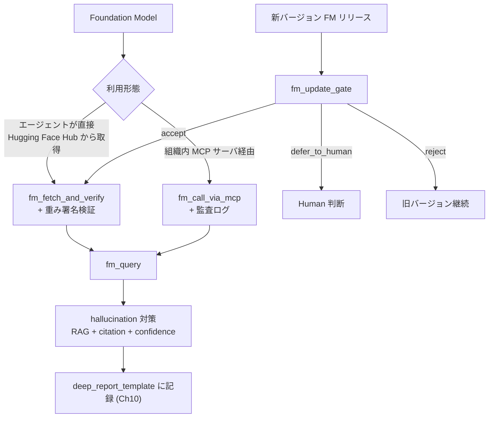
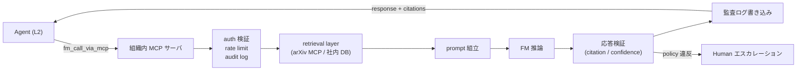
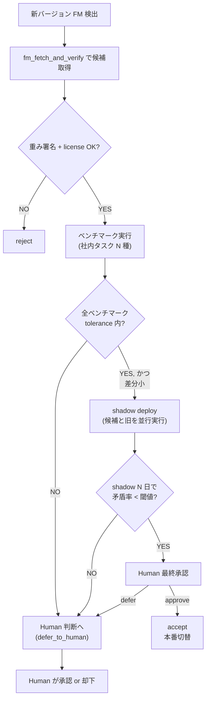

# 第11章 材料 Foundation Model と MCP 連携 — Agentic 呼び出し契約

> [!NOTE]
> **本章の到達目標**
> - **MatBERT / CrystaLLM / ChemBERTa** の 3 系統を区別し、材料タスクごとの使い分けを書き分けられる
> - **Hugging Face Hub からの取得と重み署名検証**を第4章 Layer 2 の厳格版として実装できる
> - **LLM 系 MCP との連携パターン**を、権限分離・監査ログ付きで設計できる
> - **`fm_query` Skill** を書き、エージェントが FM に問い合わせるときの hallucination 対策プロトコル（retrieval-augmented 検証 + confidence 明示 + citation 強制）を実装できる
> - **`fm_update_gate` 契約**を書き、Foundation Model の更新（新バージョン / 新重み）をエージェントが受け入れるかの判断ゲートを作れる
> - vol-01 第10章の文献照合 Skill を **FM 出力の検証**に拡張できる
> - vol-02 第15章「モデル配布の議論」を FM に適用し、**FM 特有の配布 / 更新リスク**を Skill 契約に落とせる
>
> **本章で扱わないこと**
> - **SSL / 対比学習で FM を作る側の議論** → **第12章**
> - **FM を使った capstone**（深層特徴 → PyMC 階層） → **第13章**
> - **FM 特有の運用失敗事例集** → **第14章**（本章は設計側の予防）
> - **組織展開と責任分担** → **第15章**

---

## 11.1 この章で作る Skill

3 つの **Foundation Model 用 Agentic Skill** と 1 つの **更新受け入れゲート**を作ります。

| Skill / 成果物 | 役割 | 入出力 |
|---|---|---|
| **`fm_fetch_and_verify`** | Hugging Face Hub から FM を取得し、重み署名 / ライセンス / provenance を検証 | 入力: repo_id + revision → 出力: verified weights + fm_provenance |
| **`fm_query`** | FM に問い合わせ、hallucination 対策プロトコルつきで応答を返す | 入力: prompt + retrieval sources + citation policy → 出力: response + citations + confidence |
| **`fm_update_gate`**（契約 + Skill） | FM の新バージョン / 新重みを受け入れるかを判断 | 入力: new_fm_manifest + benchmark_results → 出力: accept / defer_to_human / reject |
| **`fm_call_via_mcp`** | 組織内 MCP サーバ経由で LLM 系 FM を呼び出す（付録B に実装） | 入力: mcp endpoint + payload → 出力: response + audit_log |

前提として、第4章 3 レイヤ provenance + Ch7 Layer 4 + Ch9 `bayesian_inference_config` + Ch10 `layer_attribution` / `layer_human_review`、第10章 `deep_report_template` を継承。**本章では FM 用の拡張ブロック `foundation_model_provenance` を導入**します（Ch07 Layer 4 と同じ拡張パターン）。

---

## 11.2 なぜこの章が必要か — vol-01 第10章と vol-02 第15章の合流

vol-01 第10章では **arXiv / Paper Search MCP** による文献照合 Skill を作り、「AI が生成した内容を人間が検証する」プロトコルを確立しました。vol-02 第15章では「モデル配布」の判断基準（誰が配って、誰が受け取り、どう検証するか）を議論しました。

Foundation Model は、これら 2 つの議論の**合流点**です：

- **FM は生成 AI であり、hallucination が起きる**（vol-01 の文献照合 Skill と同じ問題）
- **FM は "他人の学習成果" を再配布する仕組み**（vol-02 のモデル配布の議論と同じ問題）
- **FM は更新頻度が高く、重み差替えがエージェントの動作を静かに変える**（Ch7 の pretrained weights より頻度と影響が大きい）
- **FM は組織内 MCP 経由で呼ばれることが多く、監査ログの設計が別途必要**



> [!IMPORTANT]
> **本章は "FM を使う側" の設計の章です**。「FM が何ができるか」より「エージェントが FM を安全に呼ぶための契約と検証」が主題。FM そのものの内部理解は第12章（SSL/対比学習で FM を作る側）で扱います。

---

## 11.3 MatBERT / CrystaLLM / ChemBERTa の位置づけ

材料 × Foundation Model の主要 3 系統：

| モデル | ベース | 事前学習データ | 得意タスク | ライセンス | 特徴 |
|---|---|---|---|---|---|
| **MatBERT** | BERT | 材料科学論文 200 万件 | 論文からの材料特性抽出、NER、テキスト分類 | Apache-2.0 系 | テキスト理解特化、生成なし |
| **CrystaLLM** | GPT-2 系 | CIF 形式の結晶構造 100 万件 | 結晶構造生成、CIF 補完、条件付き生成 | Apache-2.0 系 | 生成モデル、hallucination 対策必須 |
| **ChemBERTa** | RoBERTa | SMILES 77M | 分子物性予測、分子表現学習 | MIT 系 | SMILES 特化、生成能力は限定的 |

### 使い分け早見表

| タスク | 推奨 FM | 補足 |
|---|---|---|
| 論文から材料組成を抽出（NER） | **MatBERT** | 生成不要、埋め込み or 分類ヘッド追加 |
| 結晶構造の候補生成 | **CrystaLLM** | 生成 → **必ず** 物理検証（対称性、密度、結合角）でフィルタ |
| 分子から物性予測（回帰 / 分類） | **ChemBERTa** | 埋め込み → 線形 or MLP ヘッド |
| 未知組成の合成可能性判断 | 単独 FM では不十分 | 複数 FM + retrieval + Human 承認 |
| 論文からの引用元検索 | **MatBERT + BM25 / arXiv MCP** | vol-01 第10章の拡張 |

> [!WARNING]
> **CrystaLLM のような生成モデルは特に hallucination リスクが高い**です。CIF を生成しても、原子座標や対称性が物理的に整合しない場合が多い。§11.6 の hallucination 対策プロトコルは生成系 FM で必須。

### CrystaLLM 生成物の物理検証（`crystal_physical_validation`）

CrystaLLM の CIF 出力は必ず以下のフィルタを通す。1 つでも fail した候補は破棄：

```yaml
# crystal_physical_validation.yaml（fm_query の生成系分岐で必須）
skill: "crystal_physical_validation"
version: "1.0.0"

validators:
  cif_parser_valid:
    tool: "pymatgen.io.cif.CifParser"
    tool_version: ">=2024.6"
    fail_label: "cif_parse_error"
  charge_neutrality:
    tolerance_abs_electrons: 0.05
    fail_label: "non_neutral_composition"
  density_range:
    min_g_per_cm3: 0.5                              # 気相〜金属の範囲を広めに
    max_g_per_cm3: 25.0                             # Os の理論上限を超えたら破棄
    fail_label: "density_out_of_range"
  bond_length_check:
    method: "sum_of_covalent_radii * factor"
    min_factor: 0.7                                 # 実測共有結合半径和の 70% 未満は不整合
    max_factor: 1.5
    fail_label: "bond_length_unphysical"
  bond_angle_check:
    min_deg: 40.0                                   # 40 度未満は幾何的に不整合
    fail_label: "bond_angle_unphysical"
  symmetry_consistency:
    tool: "spglib"
    symprec: 0.1
    require_declared_spacegroup_matches: true
    fail_label: "spacegroup_mismatch"
  allowed_elements:
    whitelist_or_domain_specific: true              # 組織で定義
    fail_label: "disallowed_element"

acceptance:
  all_validators_pass_or_labeled: true
  discard_on_any_fail: true

provenance:
  crystal_physical_validation_provenance:
    validator_versions: "dict of tool -> version"
    per_validator_result: "list"
    discarded_candidates_count: "int"
    accepted_candidates_count: "int"
```

> [!WARNING]
> 上記の閾値は **開発用のデフォルト**です。実運用では対象元素系・空間群・温度条件でチューニングし、`crystal_physical_validation_provenance` に記録してください。

---

## 11.4 Hugging Face Hub からの取得と重み署名検証

Ch7 で pretrained weights の provenance を厳格化しましたが、FM では以下が加わります：

### FM 取得時の厳格チェック

> [!IMPORTANT]
> **manifest 信頼ルート（Trust Root）**：`expected_manifest` はエージェントが任意に生成できる dict ではなく、**組織の manifest レジストリ**（署名済み append-only ストア）から `manifest_id` で取得します。エージェントは承認済み manifest ID を指定するのみで、内容を書き換えることはできません。レジストリ側で `human_approver` の quorum 署名と immutable timestamp を保持します。

```python
# fm_fetch_and_verify.py
import hashlib
import re
from huggingface_hub import snapshot_download, HfApi

# 40-hex 完全 SHA のみ許容（短縮 SHA / tag / branch / "main" / "latest" は全て拒否）
_COMMIT_SHA_RE = re.compile(r"^[0-9a-f]{40}$")


def _sha256_file(path: str, chunk: int = 1 << 20) -> str:
    h = hashlib.sha256()
    with open(path, "rb") as f:
        for block in iter(lambda: f.read(chunk), b""):
            h.update(block)
    return h.hexdigest()


def _load_approved_manifest(manifest_id: str, manifest_registry) -> dict:
    """
    署名済み manifest レジストリから承認済み manifest を取得。
    レジストリ側で quorum 署名・timestamp の改ざん不能性を担保。
    エージェントは manifest_id のみ指定でき、内容の生成はできない。
    """
    entry = manifest_registry.get(manifest_id)
    assert entry is not None, f"unknown manifest_id: {manifest_id}"
    assert manifest_registry.verify_signatures(entry), \
        "manifest signature invalid or approver quorum not met"
    return entry["manifest"]


def fm_fetch_and_verify(
    repo_id: str,
    revision: str,                           # 40-hex 完全 commit SHA 必須
    manifest_id: str,                        # 承認済み manifest のレジストリ ID
    manifest_registry,                       # 署名検証機能つきレジストリ
    hf_token: str | None = None,
) -> dict:
    """
    Hugging Face Hub から FM を取得し、事前に承認された manifest と照合する。

    approved manifest（レジストリから取得）例：
      {
        "safetensors_files": [
          {"filename": "model.safetensors", "sha256": "abc..."},
          {"filename": "tokenizer.json", "sha256": "def..."},
        ],
        "model_card_file_sha256": "...",         # ダウンロード対象の README.md 固定 hash
        "license": "apache-2.0",
        "pretraining_data_license": "cc-by-4.0",
        "pretraining_data_summary": "materials science papers 2M",
        "model_family": "matbert",
        "revision_commit_hash": "<40-hex SHA>",
        "human_approvers": ["hashed_id_1", "hashed_id_2"],
        "human_approval_timestamp": "2026-...",
      }
    """
    # 1) revision は 40-hex 完全 SHA のみ許容（"main" / tag / branch / 短縮 SHA は全て fatal）
    assert _COMMIT_SHA_RE.match(revision), \
        f"revision must be a full 40-hex commit SHA (got: {revision!r})"

    # 2) manifest は必ずレジストリから取得（agent が dict を注入することは不可能）
    expected_manifest = _load_approved_manifest(manifest_id, manifest_registry)
    assert revision == expected_manifest["revision_commit_hash"], \
        "revision does not match approved manifest"

    # 3) Hub API 側の解決済み SHA が revision と一致することを確認
    api = HfApi(token=hf_token)
    model_info = api.model_info(repo_id=repo_id, revision=revision)
    resolved_sha = getattr(model_info, "sha", None)
    assert resolved_sha == revision, \
        f"Hub API resolved sha mismatch: got {resolved_sha}, expected {revision}"

    # 4) Hub API の live 応答は "advisory"。承認判断は manifest 側に固定されている
    #    ライセンス "cross-check" は Hub 側が manifest と食い違わないことのサニティチェック
    declared_license_hub = getattr(model_info, "cardData", {}).get("license") if model_info else None
    if declared_license_hub is not None:
        assert declared_license_hub == expected_manifest["license"], \
            f"license mismatch: hub says {declared_license_hub}, manifest says {expected_manifest['license']}"

    # 5) 重み + tokenizer + model card ファイルを download（allow_patterns で厳格制限）
    files_to_fetch = [f["filename"] for f in expected_manifest["safetensors_files"]] + ["README.md"]
    local_dir = snapshot_download(
        repo_id=repo_id,
        revision=revision,
        allow_patterns=files_to_fetch,
        token=hf_token,
    )

    # 6) safetensors 以外の形式（.bin, .pt, .ckpt）は絶対に読まない
    for entry in expected_manifest["safetensors_files"]:
        assert entry["filename"].endswith(".safetensors") or entry["filename"] == "tokenizer.json", \
            f"only .safetensors and tokenizer.json allowed, got {entry['filename']}"

    # 7) 全ファイルの sha256 を expected と照合（重み + tokenizer）
    verified_files = []
    for entry in expected_manifest["safetensors_files"]:
        path = f"{local_dir}/{entry['filename']}"
        actual = _sha256_file(path)
        assert actual == entry["sha256"], \
            f"sha256 mismatch for {entry['filename']}: expected {entry['sha256']}, got {actual}"
        verified_files.append({"filename": entry["filename"], "sha256": actual, "path": path})

    # 8) model card 本体（README.md）の hash も固定 — Hub 上で書き換え可能なため
    #    live API の cardData ではなく、pinned revision の README.md ファイル hash で照合
    readme_path = f"{local_dir}/README.md"
    readme_hash = _sha256_file(readme_path)
    assert readme_hash == expected_manifest["model_card_file_sha256"], \
        f"model card file hash mismatch: expected {expected_manifest['model_card_file_sha256']}, got {readme_hash}"

    return {
        "local_dir": local_dir,
        "verified_files": verified_files,
        "revision": revision,
        "manifest_id": manifest_id,
        "declared_license_from_manifest": expected_manifest["license"],
        "manifest_used": expected_manifest,
        "model_card_file_sha256": readme_hash,
    }
```

### 契約 YAML

```yaml
# fm_fetch_and_verify.yaml
skill: "fm_fetch_and_verify"
version: "1.0.0"

requires:
  revision_must_be_40hex_commit_sha: true         # fatal on 'main' / tag / branch / 短縮 SHA
  hub_api_resolved_sha_must_match_revision: true  # HfApi.model_info().sha == revision
  manifest_from_signed_registry_only: true        # agent-supplied dict 禁止
  manifest_approver_quorum_min: 2                 # 承認者は 2 名以上
  safetensors_only: true                          # .bin / .pt / .ckpt 拒否
  trust_remote_code_forbidden: true               # HF の任意コード実行禁止

acceptance:
  all_file_sha256_match: true
  model_card_file_sha256_matches_manifest: true   # pinned README.md の hash 照合
  license_from_manifest_matches_hub_advisory: true  # Hub は advisory、決定は manifest
  no_unknown_files_downloaded: true               # allow_patterns で厳格制限

agent_authorization:
  L1: "fetch_and_report"
  L2: "fetch_and_load_for_inference"
  L3:
    can_propose_new_manifest: true
    cannot_bypass_manifest_check: "forbidden_all_levels"
  never_allowed:
    - "fetch_without_manifest"
    - "load_bin_or_pt_files"
    - "trust_remote_code_true"
    - "auto_update_revision"

provenance:
  foundation_model_provenance:                    # 第4章 3 レイヤ + Ch7 Layer 4 + Ch9 + Ch10 と同じ
                                                  # 「追加ブロック」パターン
    repo_id: "str"
    revision_commit_hash: "str (40-hex SHA)"
    hub_api_resolved_sha: "str"                   # 検証済み一致
    declared_license: "str (from manifest, not live API)"
    pretraining_data_license: "str"
    pretraining_data_summary: "str"
    model_family: "matbert | crystallm | chemberta | other"
    files_with_sha256: "list[{file, kind, sha256}]"    # kind ∈ {weights, tokenizer, config, generation_config}
    # 派生ビュー（読み取り専用）：kind == 'weights' の filter
    safetensors_files_with_sha256: "list (derived view of files_with_sha256 where kind='weights')"
    model_card_file_sha256: "str"                 # pinned README.md の hash
    manifest_id: "str (registry ID)"
    manifest_approvers_hashed: "list (quorum >= 2)"
    manifest_approval_timestamp: "iso8601"
    fetch_timestamp: "iso8601"
```

> [!IMPORTANT]
> **`files_with_sha256` が正本**です（付録B B.4.4 の manifest schema と一致）。**tokenizer / config / generation_config も weights と同じ file-level sha256 で pin**します（tokenizer / config が改ざんされると同一重みでも挙動が変わるため——付録B B.4.4 rubber-duck 修正 Blocking-3 参照）。`safetensors_files_with_sha256` は後方互換のための派生ビューで、`files_with_sha256` の `kind='weights'` サブセットに等しくなります。

> [!WARNING]
> **`revision: "main"` や tag での取得は禁止**です。tag / branch は後から書き換え可能で、同じ「バージョン」で違う重みが降ってくる可能性があります。**必ず commit hash（SHA）を manifest に固定**してください。

---

## 11.5 LLM 系 MCP との連携パターン

組織内で FM を運用する場合、直接 Hub から fetch するのではなく **組織内 MCP サーバ経由**で呼び出す構成が一般的です。これにより：

- **権限分離**：エージェントは直接重みに触れず、MCP が推論結果のみ返す
- **監査ログ**：全問い合わせ / 応答が MCP で記録される
- **RAG の埋め込み**：MCP が retrieval を先に実行し、context を prompt に埋め込む
- **rate limit / cost 管理**：GPU 資源を organization レベルで統制



### MCP レベルの権限分離

| MCP メソッド | エージェント権限（Ch4 §4.7） | 呼び出し条件 |
|---|---|---|
| `fm.query` | L1〜L3 全員可（推論のみ） | — |
| `fm.embed` | L1〜L3 全員可 | — |
| `fm.finetune` | L3 + 事前承認ワークフロー必須 | 承認済み finetune 計画 ID |
| `fm.load_weights` | エージェント直接呼び出し禁止（MCP 管理者のみ） | MCP admin token 必須 |
| `fm.list_versions` | L1〜L3（読み取りのみ） | — |
| `fm.set_default_version` | 全レベル禁止（`fm_update_gate` の Human 承認経由のみ） | **署名済み `fm_update_gate_decision` ID + reviewer quorum 署名**が payload に含まれ、MCP サーバ側で検証。エージェント経由の chain-call でも通らない |

> [!IMPORTANT]
> **MCP サーバ側の enforcement**：`fm.set_default_version` は decision ID 検証ポリシーを MCP server-side で保持し、agent がどのレベルからも indirect に成功しないようにします。全呼び出しで **caller identity + method + decision ID + timestamp** を append-only ログに記録し、エージェントの権限昇格を検出可能にします。

付録B で **MCP Python SDK による実装ミニマル例**を示します。

---

## 11.6 `fm_query` — hallucination 対策プロトコル

FM に問い合わせるときの Skill。**vol-01 第10章文献照合 Skill を FM 出力に適用**します。

### プロトコル 4 原則

1. **Retrieval-augmented 前提**：FM 単体には答えさせない。関連文献 / 社内 DB を retrieval し context に埋める
2. **Citation 強制**：応答の各 claim に retrieval 結果へのポインタを要求
3. **Confidence 明示**：FM に「わからない場合は "unknown"」と答える権利を与え、Human 側で dispatch
4. **Verification loop**：FM 応答を retrieval 結果と再照合し、矛盾があれば flag

### 実装

```python
# fm_query.py
from dataclasses import dataclass


@dataclass
class RetrievalHit:
    source_id: str        # 例: arxiv:2401.xxxxx, internal_doc:12345
    excerpt: str
    chunk_id: str         # corpus 内 chunk の一意 ID
    chunk_sha256: str     # 本文の hash（再現性）
    embedding_model_id: str
    embedding_index_version: str
    corpus_snapshot_id: str
    rank: int
    score: float
    retrieved_at: str


def _lexical_faithfulness(
    text: str,
    cited_ids: list[str],
    hits: list[RetrievalHit],
    ngram_size: int = 3,
) -> float:
    """
    faithfulness score ∈ [0.0, 1.0]（値が大きいほど retrieval と整合）。

    定義：
      1. text から claim 文を抽出（`.` / `。` / `\\n` 区切り）
      2. 各文について、その文が引用している source_id に対応する excerpt を集める
      3. 文の n-gram（token 単位、Unicode 対応の正規化後）と excerpt の n-gram の Jaccard 類似度を計算
      4. 全 claim 文についての平均を返す（citation を持たない文は 0 として平均に含める）

    Calibration：
      - 参照実装は SciBERT tokenizer + n=3 token n-gram + Jaccard
      - Domain 別に閾値（threshold_stop）は再校正すること（本 skill 契約の 0.4 は開発用）

    Fallback：
      - retrieval hits が空、あるいは cited_ids が空の場合は 0.0 を返す
      - 文抽出に失敗した場合は `NaN` を返さず 0.0（安全側 = route_to_human 側）
    """
    # 実装骨子は本文参照。参照実装は付録B（materials_fm_helpers.py）
    ...


def fm_query(
    prompt: str,
    retrieve_fn,                            # (prompt) -> list[RetrievalHit]
    fm_call_fn,                             # (system, prompt) -> {"text": ..., "logprobs": ...}
    response_language: str = "ja",          # 応答言語（system prompt に注入）
    max_hits: int = 8,
    retrieval_min_hits: int = 3,            # 契約と一致させる
    require_citations: bool = True,
    faithfulness_stop_threshold: float = 0.4,
    confidence_warn_threshold: float = 0.6,
) -> dict:
    """
    hallucination 対策プロトコルつきの FM 呼び出し。
    """
    hits = retrieve_fn(prompt)[:max_hits]

    # 事前ガード：retrieval hit が最小要件を満たさない場合、FM を呼ばず Human 送り
    if len(hits) < retrieval_min_hits:
        return {
            "response_text": "",
            "citations": [],
            "hallucination_flags": ["insufficient_retrieval_hits"],
            "confidence_estimate": 0.0,
            "faithfulness_score": 0.0,
            "combined_gate": "stop",
            "action": "route_to_human_no_source_available",
        }

    context = _format_hits_with_ids(hits)

    # answer_status は機械可読な control token として固定（言語に依存させない）
    system = (
        f"You are a materials science assistant. "
        f"Answer in {response_language}. "
        f"Answer ONLY from the provided sources. "
        f"Every factual claim MUST cite one of the provided source_ids in the form [source_id]. "
        f'If the sources do not contain the answer, respond with exactly this JSON: '
        f'{{"answer_status": "unknown"}}'
    )
    full_prompt = f"{context}\n\nQuestion: {prompt}"
    response = fm_call_fn(system=system, prompt=full_prompt)
    text = response["text"]

    # UNKNOWN 応答は control token（JSON）で検出、言語に依存しない
    if _is_unknown_control_token(text):
        return {
            "response_text": text,
            "citations": [],
            "hallucination_flags": [],
            "confidence_estimate": 0.0,
            "faithfulness_score": 0.0,
            "combined_gate": "warn",           # 応答なしはハルシネーションではない
            "action": "route_to_human_no_source_available",
        }

    # citation 抽出 + retrieval 照合
    cited_ids = _extract_bracketed_source_ids(text)
    known_ids = {h.source_id for h in hits}
    unknown_citations = [cid for cid in cited_ids if cid not in known_ids]

    # 「引用のない claim」を粗く検出（各文が [source_id] を含むか）
    uncited_claim_sentences = _detect_uncited_claim_sentences(text)

    # claim-level validation：各文の主張が、実際に cited excerpt によって支持されているか
    #   citation が real でも、excerpt に書かれていない主張は「unsupported claim」として別扱い
    unsupported_claims = _detect_unsupported_claims(text, cited_ids, hits)

    hallucination_flags = []
    missing_or_invalid = require_citations and (unknown_citations or uncited_claim_sentences)
    if missing_or_invalid:
        hallucination_flags.append("missing_or_invalid_citation")
    if unsupported_claims:
        hallucination_flags.append("unsupported_claim_despite_citation")

    # verification loop: 各 citation が対応 excerpt と語彙的に整合するか（faithfulness 近似）
    faithfulness = _lexical_faithfulness(text, cited_ids, hits)
    if faithfulness < faithfulness_stop_threshold:
        hallucination_flags.append("low_lexical_faithfulness")

    # confidence は logprob と faithfulness の組合せ（実装は簡易）
    logprob_confidence = response.get("mean_logprob_confidence", 0.5)
    confidence_estimate = 0.5 * logprob_confidence + 0.5 * faithfulness

    # Ch08 uncertainty_stop_gate 互換の tri-state 統合ゲート
    #   stop 優先：任意の stop 条件で stop、warn は confidence のみで昇格
    combined_gate = "pass"
    if hallucination_flags or missing_or_invalid:
        combined_gate = "stop"
    elif confidence_estimate < confidence_warn_threshold:
        combined_gate = "warn"

    return {
        "response_text": text,
        "citations": cited_ids,
        "retrieval_hits_used": [h.source_id for h in hits],
        "unknown_citations": unknown_citations,
        "uncited_claim_sentences": uncited_claim_sentences,
        "unsupported_claims": unsupported_claims,
        "hallucination_flags": hallucination_flags,
        "faithfulness_score": faithfulness,
        "confidence_estimate": confidence_estimate,
        "combined_gate": combined_gate,                 # "pass" | "warn" | "stop"
        "action": (
            "route_to_human" if combined_gate == "stop"
            else "review_recommended" if combined_gate == "warn"
            else "continue"
        ),
    }
```

### 契約 YAML

```yaml
# fm_query.yaml
skill: "fm_query"
version: "1.0.0"

requires:
  retrieval_before_fm_call: true                  # RAG 必須。FM 単体呼び出しは fatal
  retrieval_min_hits: 3                           # hit 0 では回答させない
  citation_required_in_response: true
  unknown_response_allowed_and_encouraged: true

hallucination_gate:
  monitors:
    - metric: "insufficient_retrieval_hits"
      action_if_present: "route_to_human_no_source_available"
      description: "hits < retrieval_min_hits の場合、FM を呼ばず即 Human 送り"
    - metric: "missing_or_invalid_citation"
      action_if_present: "route_to_human"
    - metric: "unsupported_claim_despite_citation"
      action_if_present: "route_to_human"
      description: "citation は real でも excerpt に主張が支持されない claim（fabrication）"
    - metric: "faithfulness_score"
      threshold_stop: 0.4                         # 40% 未満なら停止
      direction: "higher_is_safer"
    - metric: "confidence_estimate"
      threshold_warn: 0.6

combined_gate:                                    # Ch08 uncertainty_stop_gate と同じ tri-state
  states: ["pass", "warn", "stop"]
  stop_precedence: true                           # 任意の stop 条件で stop
  warn_only_condition: "confidence_estimate < 0.6 かつ他の stop 条件なし"
  pass_condition: "全 stop 条件回避 かつ confidence >= warn 閾値"

acceptance:
  every_claim_has_citation: true
  citations_resolve_to_retrieval_hits: true
  claims_supported_by_cited_excerpts: true        # claim-level validation
  no_fabricated_source_ids: true

agent_authorization:
  L1: "query_and_report_only"
  L2: "query_and_use_response_within_domain_scope"
  L3:
    can_query_extended_scope: "with_prior_approval"
    cannot_disable_hallucination_gate: "forbidden_all_levels"
  never_allowed:
    - "call_fm_without_retrieval"
    - "post_edit_fm_response_to_add_citations"
    - "silently_drop_uncited_sentences"

provenance:
  fm_query_provenance:
    prompt_hash: "sha256"
    response_language: "str (e.g., ja, en)"
    retrieval_hits:                               # 各 hit の再現性フィールドを列挙
      - source_id: "str"
        chunk_id: "str"
        chunk_sha256: "str"
        embedding_model_id: "str"
        embedding_index_version: "str"
        corpus_snapshot_id: "str"
        retriever_config_hash: "str"
        rank: "int"
        score: "float"
    fm_response_text_hash: "sha256"
    citations_extracted: "list"
    unknown_citations: "list"
    unsupported_claims: "list"
    hallucination_flags: "list"
    faithfulness_score: "float"
    confidence_estimate: "float"
    combined_gate: "pass | warn | stop"
    action_taken: "continue | review_recommended | route_to_human | route_to_human_no_source_available"
    fm_model_provenance_ref: "id (from fm_fetch_and_verify)"
```

> [!IMPORTANT]
> **`post_edit_fm_response_to_add_citations` の禁止**は極めて重要です。エージェントが「citation なしの claim」に事後で citation を貼ると、検証プロトコル全体が崩壊します。**FM の生 response と、citation 抽出結果は分けて保存**し、後付けでは editable にしません。

---

## 11.7 `fm_update_gate` — FM 更新の受け入れ判断

FM は数週間〜数か月で新バージョンが出ます。エージェントが自動で受け入れると、下流タスクの動作が静かに変わります。

### 判断フロー



### 契約 YAML

```yaml
# fm_update_gate.yaml
skill: "fm_update_gate"
version: "1.0.0"

trigger:
  new_revision_detected: true
  scheduled_review_interval_days: 30

verification_pipeline:
  step_1_signature:
    reference: "fm_fetch_and_verify.yaml"
    fatal_on_fail: true
  step_2_benchmarks:
    tasks: "organization_defined_benchmark_suite"
    min_tasks: 3
    per_task_tolerance:
      metric_delta_max_relative: 0.05         # ベースライン比 ±5% 内
    stratify_by: ["instrument", "task_type"]
  step_3_shadow_deploy:
    sampling_semantics:
      mode: "duplicated_shadow_traffic"           # 本番 request を「複製」して両モデルで実行
      user_facing_traffic_uses: "old_only"        # 新 FM は user 応答には未反映
      eligible_traffic_filter: "production_queries_of_the_target_task"
    parallel_call_ratio: 0.1                      # 本番 request の 10% を複製して並行実行
    duration_days: 7
    min_shadow_samples_total: 5000                # 期間だけでなく最小サンプル数を要求
    min_samples_per_stratum: 200                  # instrument / task_type の各層で
    stratify_by: ["instrument", "task_type"]
    disagreement_metric:
      formula: "1 - agreement_rate"
      agreement_rate: "count(old.answer == new.answer) / count(both_answered)"
      denominator_excludes: ["both_returned_unknown", "either_errored"]
      confidence_interval: "wilson_95pct"
      max_disagreement_rate: 0.05                 # CI 上限が 0.05 を超えたら fail
    expected_baseline_disagreement: 0.02          # 事前想定
    detectable_effect_size: 0.03                  # 検出したい実効差
    early_stop_if_worse: true
    early_stop_trigger: "wilson_lower_ci > max_disagreement_rate"
  step_4_human_approval:
    required: true
    reviewers_min: 2
    provenance_snapshot_shown: true
    downstream_impact_analysis_shown: true    # 依存 Skill の影響予測

decision_matrix:
  all_steps_pass_and_human_approve: "accept"
  benchmark_fail_or_shadow_fail: "defer_to_human"
  signature_fail: "reject"
  human_reject: "reject_and_log_rationale"

rollback_contract:                                # accept 後の regression 対応
  monitored_metrics_after_accept:
    - "downstream_hallucination_flag_rate"
    - "downstream_confidence_distribution_shift"
    - "downstream_review_duration"                # Ch10 の QC signal
  rollback_trigger:
    hallucination_flag_rate_relative_increase_max: 0.20
    monitoring_window_days: 7
  rollback_procedure:
    who_can_trigger: "MCP admin OR on-call engineer with quorum >= 2"
    action: "fm.set_default_version <- previous_approved_version"
    requires_signed_emergency_decision: true      # rollback も fm_update_gate_decision の一種
    audit_event: "fm_rollback (append-only)"
  old_version_retention:
    minimum_days_after_accept: 30                 # rollback 可能な期間
  silent_downgrade_forbidden: true

agent_authorization:
  L1: "read_only_report"
  L2: "run_verification_pipeline_but_not_switch"
  L3:
    can_recommend_accept: true
    cannot_switch_production_without_human: "forbidden_all_levels"
  never_allowed:
    - "auto_accept_without_human"
    - "skip_shadow_deploy"
    - "reduce_benchmark_min_tasks"
    - "silently_downgrade_after_accept"

provenance:
  fm_update_gate_decision:
    old_fm_provenance_ref: "id"
    new_fm_provenance_ref: "id"
    benchmark_results_hash: "sha256"
    shadow_deploy_disagreement_rate: "float"
    human_reviewers_hashed: "list"
    decision: "accept | defer_to_human | reject"
    decision_timestamp: "iso8601"
    downstream_impact_summary_ref: "id"
```

> [!WARNING]
> **FM 更新の "静かな受け入れ" は最も危険な失敗モードの 1 つ**です。新 FM は同じインタフェースで違う応答を返し、下流の Skill・レポート・Human 判断がすべて "旧 FM の癖" に依存している可能性があります。`fm_update_gate` は Ch7 `pretrained_weights` の pre-check より **一段厳しく**設計（shadow deploy を挟む）。

---

## 11.8 vol-01 第10章文献照合 Skill との接続

vol-01 第10章では arXiv / Paper Search MCP を使い、AI 生成テキストの各主張を論文と照合しました。本章 `fm_query` はこれを **FM 出力に対する retrieval + citation + faithfulness** に拡張しています。

| 論点 | vol-01 第10章 | vol-03 第11章 |
|---|---|---|
| 対象 | AI 生成の文献レビュー | FM 応答全般（生成 or 要約 or 抽出） |
| Retrieval source | arXiv API | arXiv MCP + 社内 DB + Hugging Face Datasets |
| Citation | 論文 DOI / arXiv ID | 一般化された `source_id` |
| Hallucination 検知 | 論文の実在チェック | citation 実在 + faithfulness + confidence |
| 監査 | 記録 | Ch10 `deep_report_template` に統合 |

**共通哲学**：*生成物は生成物であって事実ではない。事実は必ず外部ソースから引く。*

---

## 11.9 vol-02 第15章「モデル配布」との接続

vol-02 第15章では「モデルを配る側」と「受け取る側」の責任分担を議論しました。FM は以下の点で特殊です：

| 論点 | vol-02 一般モデル配布 | 本章 FM |
|---|---|---|
| 更新頻度 | 数か月〜1年 | 数週間〜数か月 |
| 更新影響 | 特定タスク | 下流全 Skill |
| 検証コスト | ベンチマーク再実行 | ベンチマーク + shadow deploy 必須 |
| ライセンス | 明示的な同意プロセス | 変更されうる（Hub 上で書き換え可能） |
| Human 承認 | 導入時のみ | 導入時 + 各更新時 |

本章 `fm_update_gate` は vol-02 第15章のフレームを **FM の高頻度更新に耐える形**に強化したものです。

---

## 11.10 失敗パターンと対策

| 失敗 | 症状 / 兆候 | 対策（参照する契約フィールド） |
|---|---|---|
| `revision: "main"` / 短縮 SHA で fetch | 同じバージョン名で違う重みが降ってくる | `revision_must_be_40hex_commit_sha: true` + `hub_api_resolved_sha_must_match_revision` |
| `.bin` / `.pt` を trust_remote_code で読む | 任意コード実行の脆弱性 | `safetensors_only` + `trust_remote_code_forbidden` + `load_bin_or_pt_files: never_allowed` |
| ライセンス表示を Hub API から取得したが manifest と不一致 | 監査でライセンス違反発覚 | `license_from_manifest_matches_hub_advisory` + `model_card_file_sha256_matches_manifest` |
| エージェントが自作 manifest を渡して検証をバイパス | 承認プロセス空洞化 | `manifest_from_signed_registry_only` + `manifest_approver_quorum_min: 2` |
| Retrieval 0 件で FM 呼び出し | citation 皆無で hallucination | `insufficient_retrieval_hits` monitor（`fm_query` 事前ガード） |
| FM 単体呼び出しで hallucination | citation なし応答が下流に流れる | `retrieval_before_fm_call: true` fatal + `call_fm_without_retrieval: never_allowed` |
| citation が実在しない ID | ハルシネーション典型例 | `unknown_citations` を `missing_or_invalid_citation` flag に |
| citation は real だが excerpt が主張を支持しない | subtle fabrication | `unsupported_claim_despite_citation` flag（claim-level validation） |
| citation を後付けで貼る | プロトコル崩壊 | `post_edit_fm_response_to_add_citations: never_allowed` |
| `fm_update_gate` の shadow deploy をスキップ | 静かな挙動変化 | `skip_shadow_deploy: never_allowed` + `min_shadow_samples_total` + `min_samples_per_stratum` |
| FM 更新を自動 accept | 下流破壊 | `auto_accept_without_human: never_allowed` + `reviewers_min: 2` |
| Accept 後の regression を silent downgrade | 監査不能 | `rollback_contract` + `silent_downgrade_forbidden` + `old_version_retention.minimum_days_after_accept` |
| CrystaLLM が物理的に不整合な CIF を出力 | 対称性・密度・結合角が破綻 | `crystal_physical_validation` の 7 validator（cif_parser / charge / density / bond_length / bond_angle / symmetry / allowed_elements） |
| Faithfulness score だけを信じて Human 送りしない | subtle hallucination を見逃す | `combined_gate` tri-state + 任意の stop 条件 で `route_to_human` |
| MCP 経由呼び出しの監査ログが欠落 | 誰が何を FM に聞いたか追跡不能 | MCP 側で全問い合わせを **caller identity + method + decision ID + timestamp** で append-only ログに（付録B） |
| FM が UNKNOWN を返すべき場面で無理に答える | user pleasing hallucination | system prompt で control token `{"answer_status": "unknown"}` を明示 + logprob 低下時の flag |
| pretraining data license を manifest に書かず配布 | 下流ライセンス違反 | `pretraining_data_license` manifest 必須 |
| FM ベンチマークが1つのタスクのみ | 特定タスクの偽陽性で accept | `min_tasks: 3` + `stratify_by` + `reduce_benchmark_min_tasks: never_allowed` |

---

## 11.11 まとめ

- Foundation Model は **vol-01 文献照合 + vol-02 モデル配布** の議論の合流点
- **MatBERT / CrystaLLM / ChemBERTa** はタスク特性で使い分け、生成系（CrystaLLM）は物理検証必須
- **`fm_fetch_and_verify`** は commit hash + safetensors 限定 + manifest 事前承認で pretrained weight 検証を FM に強化
- **`fm_query`** は retrieval-augmented + citation 強制 + faithfulness で hallucination を検知
- **`fm_update_gate`** は signature → benchmark → shadow deploy → Human 承認の 4 段階
- MCP 経由呼び出しで **権限分離 + 監査ログ**、実装は付録B
- FM 特有の失敗パターン 13 件を Skill 契約で予防

## 11.12 章末チェックリスト

- [ ] FM の `revision` は commit hash か（tag / main / branch 拒否）
- [ ] safetensors ファイルのみ許可しているか、trust_remote_code は False か
- [ ] manifest が Human 事前承認済みで sha256 + license が固定されているか
- [ ] `fm_query` は retrieval 前提で citation 必須か
- [ ] hallucination_flags が複数 monitor で並置され、任意 1 つで Human 送りか
- [ ] `post_edit_fm_response_to_add_citations` が never_allowed か
- [ ] `fm_update_gate` は signature → benchmark → shadow deploy → Human の 4 段階を全て通っているか
- [ ] FM 更新の shadow deploy 期間・並行比率・矛盾率閾値が契約に明記されているか
- [ ] MCP 経由呼び出しで全問い合わせが append-only 監査ログに書かれているか
- [ ] CrystaLLM 等の生成系で物理検証 filter を通しているか

## 11.13 ワーク

**W11-1**: MatBERT を Hugging Face Hub から取得し、`fm_fetch_and_verify` の manifest 事前承認 + sha256 検証フローを実装せよ。manifest の 1 バイトを改ざんしたときに fatal assert が発火することを確認せよ。

**W11-2**: 材料論文の要約タスクで `fm_query` を実装し、citation 抽出と faithfulness score を計算せよ。10 件のうち何件が `route_to_human` に落ちるかを報告せよ。

**W11-3**: 架空の "新バージョン MatBERT" を用意し、`fm_update_gate` の 4 段階を回して decision matrix の 4 パターン（accept / defer / reject / signature_fail）を全て再現せよ。

**W11-4**: CrystaLLM で結晶構造を 100 個生成し、物理検証 filter（対称性 + 密度 + 結合角）で何個が破棄されるかを計測せよ。filter を Skill 契約に落とせ。

**W11-5**: MCP 経由の `fm.query` を付録B の Python SDK 実装を使って呼び出し、監査ログが append-only で改ざん不能であることを検証するテストを書け。

## 11.14 参考資料

- Beltagy, I., et al. (2020). SciBERT: Pretrained Language Model for Scientific Text. EMNLP.
- Trewartha, A., et al. (2022). Quantifying the advantage of domain-specific pre-training on named entity recognition tasks in materials science (MatBERT).
- Antunes, L. M., Butler, K. T., & Grau-Crespo, R. (2024). Crystal structure generation with autoregressive large language modelling (CrystaLLM). Nature Communications.
- Chithrananda, S., Grand, G., & Ramsundar, B. (2020). ChemBERTa: Large-Scale Self-Supervised Pretraining for Molecular Property Prediction. arXiv.
- Lewis, P., et al. (2020). Retrieval-Augmented Generation for Knowledge-Intensive NLP Tasks. NeurIPS.
- Model Card guidelines — Mitchell, M., et al. (2019). Model Cards for Model Reporting. FAT*.
- 本書 第4章（3 レイヤ provenance）、第7章（pretrained weights + Layer 4）、第10章（deep_report_template + human_handback_review）
- vol-01 第10章（arXiv / Paper Search MCP による文献照合）
- vol-02 第15章（モデル配布と組織的責任分担）
- 本書 付録B（MCP Python SDK による組織内サーバ実装）
