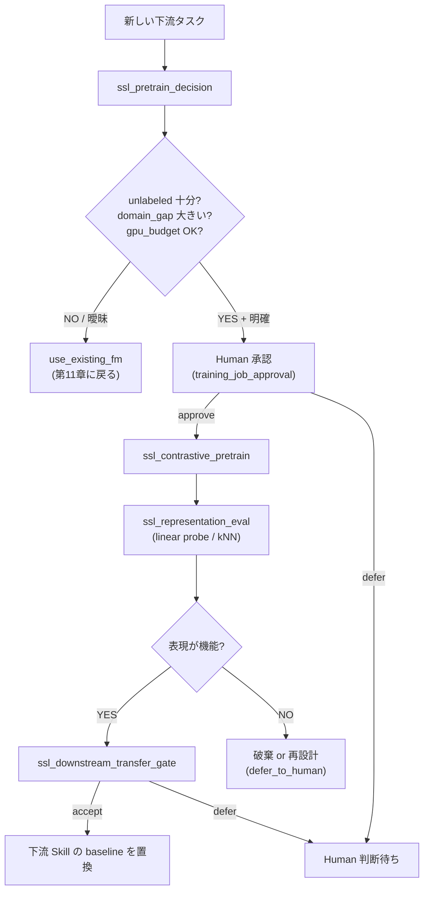

# 第12章 自己教師あり学習と対比学習を Skill 化する — 「作る側」の判断契約

> [!NOTE]
> **本章の到達目標**
> - **SimCLR / BYOL / MoCo** の 3 系統を区別し、材料応用における使い分けを書き分けられる
> - **「事前学習を作る」vs「既存 Foundation Model を使う」の判断ゲート**を Skill 化できる
> - **ラベルなし顕微鏡データからの表現学習**を、augmentation 契約・checkpoint 上書き承認・GPU 予算とセットで設計できる
> - **小規模 SSL の限界**（GPU 1 枚 / 数千枚 / 数日）を数値で示し、エージェントに「SSL を提案する / しない」の根拠を持たせられる
> - **`ssl_pretrain_decision`** で SSL 実行前の Human 承認ゲートを設計できる
> - **`ssl_representation_eval`** で「事前学習が機能したか」を linear probe / kNN で客観評価できる
>
> **本章で扱わないこと**
> - **既存 FM の呼び出しと重み署名検証** → **第11章**（本章は「自組織で FM を作る側」）
> - **FM を使った capstone**（深層特徴 → PyMC 階層） → **第13章**
> - **深層 × Agentic の特有失敗（GPU 占有・checkpoint 改ざん・augmentation 契約違反）** → **第14章**（本章は設計側の予防）
> - **大規模 SSL（数十〜数百 GPU / 数億枚）** → 本書の想定外（Meta / DeepMind 論文を参照）

---

## 12.1 この章で作る Skill

4 つの **SSL / 対比学習用 Agentic Skill** を作ります。

| Skill / 成果物 | 役割 | 入出力 |
|---|---|---|
| **`ssl_pretrain_decision`** | 「事前学習を作るべきか、既存 FM を使うべきか」を意思決定する判断ゲート | 入力: unlabeled_count + labeled_count + domain_gap + gpu_budget → 出力: `pretrain` \| `use_existing_fm` \| `defer_to_human` |
| **`ssl_contrastive_pretrain`** | SimCLR / BYOL / MoCo で自組織の unlabeled 画像から表現を学習 | 入力: dataset + method + augmentation_config + training_job_approval → 出力: encoder checkpoint + provenance |
| **`ssl_representation_eval`** | 学習された表現が下流タスクで機能するかを linear probe / kNN / few-shot で評価 | 入力: encoder + labeled_downstream → 出力: eval_report + representation_quality_flag |
| **`ssl_downstream_transfer_gate`**（契約） | SSL 重みを下流 Skill の baseline と置き換えてよいかの判断 | 入力: baseline metric + ssl metric + calibration → 出力: accept \| defer_to_human \| reject |

前提として、第4章 3 レイヤ provenance + Ch7 Layer 4 + Ch9 `bayesian_inference_config` + Ch10 `layer_attribution` / `layer_human_review` + Ch11 `foundation_model_provenance` を継承。**本章では SSL 用の拡張ブロック `ssl_pretrain_provenance` と `ssl_representation_eval_provenance` を導入**します（Ch11 と同じ拡張パターン）。

---

## 12.2 なぜこの章が必要か — 「作る側」に立つ判断

第11章までは **既存 Foundation Model を "使う側"** の設計でした。しかし、以下の場面では **自組織で SSL 事前学習を作る**方が合理的になります：

- 対象がニッチで、既存 FM の pretraining data に類似データが含まれていない（例：特殊な電子顕微鏡像、特定装置固有のノイズパターン）
- ラベルは少数しかないが、**ラベルなしデータが大量にある**（顕微鏡は画像を撮り続けている）
- ドメインギャップが大きく（Ch7 `domain_gap_gate` で defer 判定）、fine-tune では埋まらない

しかし、**SSL 事前学習は GPU 予算 / 時間 / エンジニアリング工数を大きく消費**し、エージェントが自律的に「事前学習を回そう」と判断してよい範囲を厳密に定義しないと、GPU クラスタが SSL job で埋め尽くされます。



> [!IMPORTANT]
> **本章の主題は「SSL のアルゴリズム解説」ではなく「SSL を Agentic Skill として安全に回す契約」**です。SimCLR の loss 式は §12.4 で最小限、判断ゲート・augmentation 契約・GPU 予算・承認プロセスに紙面を割きます。

---

## 12.3 SimCLR / BYOL / MoCo の位置づけ

SSL 対比学習の主要 3 系統：

| 手法 | Negative サンプル | Momentum encoder | Batch size 依存 | 材料応用の適性 |
|---|---|---|---|---|
| **SimCLR** | 同 batch 内の他サンプル | なし | **非常に強い**（4096+ 推奨） | GPU 1 枚では厳しい。中規模 SSL の入門に |
| **BYOL** | 使わない（negative-free） | あり | 弱め（256〜） | 小規模 SSL に向く。degenerate collapse に注意 |
| **MoCo v2/v3** | queue（大規模メモリバンク） | あり | 弱め（256〜） | GPU 1 枚でも実用的、材料 SEM で実績あり |

### 使い分け早見表

| 条件 | 推奨手法 | 補足 |
|---|---|---|
| GPU 8 枚以上・batch 4096+ 可能 | **SimCLR** | 論文再現しやすい、比較のベースライン |
| GPU 1〜4 枚・batch 256〜1024 | **MoCo v3** | Queue で negative を確保、実装成熟 |
| GPU 1 枚・batch 256 以下 | **BYOL** | Negative 不要、ただし collapse 検知必須 |
| 事前学習後は既存 FM と組み合わせたい | どれでも可 | 表現は encoder のみ引き継ぐ |
| ラベルなしデータ < 5,000 枚 | SSL 非推奨 | `ssl_pretrain_decision` で `use_existing_fm` |

> [!WARNING]
> **BYOL の representation collapse** は SSL 特有の "静かな失敗" です。loss は下がるが表現は全て同一ベクトルに退化。§12.6 `ssl_representation_eval` の linear probe が chance level に留まることで検知します。

---

## 12.4 対比学習の最小定式化

理解を最小限に留めるため、SimCLR の NT-Xent loss だけを示します：

```
loss_i = -log( exp(sim(z_i, z_i+) / τ) / Σ_{k≠i} exp(sim(z_i, z_k) / τ) )
```

- `z_i, z_i+`：同一画像に異なる augmentation をかけた 2 表現（**positive pair**）
- `z_k`：batch 内他サンプル（**negative pair**）
- `τ`：温度（0.1〜0.5、材料 SEM では 0.2〜0.3 が経験則）
- `sim`：cosine similarity

**重要な帰結**：SSL の性能は **augmentation の質**にほぼ全て依存します。augmentation が下流タスクの invariance と矛盾すると、事前学習は下流を悪化させます（例：向きが物性と結びつく材料で random rotation を強く入れると失敗）。

### 材料 SEM で「使ってはいけない augmentation」

| Augmentation | 一般画像では OK | 材料 SEM では |
|---|---|---|
| 色相反転 / channel shuffle | OK | **禁止**（グレースケール想定、意味論が崩壊） |
| Vertical flip | OK | **タスク依存**（重力方向に意味があれば禁止） |
| Random rotation 360° | 多くの場合 OK | **タスク依存**（結晶方位が特徴なら制限） |
| CutMix / MixUp | 分類で OK | 表現学習では基本的に不使用（対比学習の pair 意味論を壊す） |
| Gaussian noise | OK | OK（装置ノイズを模擬する範囲で） |
| Random crop | OK | OK（ただし crop 後にスケールバー情報が失われる問題は別途処理） |

> [!IMPORTANT]
> **augmentation は "Skill 契約" の一部**として YAML に固定し、Human 承認なしにエージェントが変更できないようにします（§12.5 `augmentation_config_hash`）。

---

## 12.5 `ssl_pretrain_decision` — 事前学習を "回す vs 回さない" 判断

SSL 事前学習は **GPU 予算 / エンジニアリング工数 / 数日〜数週間の時間** を消費します。エージェントが自律的に「SSL を回そう」と判断してよい条件を、契約で厳密化します。

### 判断ロジック

```python
# ssl_pretrain_decision.py
from dataclasses import dataclass


@dataclass
class SSLPretrainInputs:
    unlabeled_count: int
    labeled_count: int
    domain_gap_score: float          # Ch7 domain_gap_gate の出力（0.0=近い, 1.0=遠い）
    existing_fm_available: bool      # 対象ドメイン向け FM が既にあるか
    gpu_hours_available: float       # 承認済み GPU 予算（時間）
    gpu_hours_estimated: float       # 本 SSL 実行に必要と見積もる時間
    labeled_downstream_defined: bool # 下流タスク（評価用）が明確か


def ssl_pretrain_decision(inp: SSLPretrainInputs) -> dict:
    """
    「事前学習を作る」vs「既存 FM を使う」vs「Human 判断」を決める。

    契約：
      - unlabeled が 5,000 未満なら pretrain 不可（少なすぎて表現が学習できない）
      - GPU 予算が estimated を下回るなら defer（未承認予算での起動禁止）
      - 下流タスクが未定義なら評価不能 → defer
      - existing_fm があり domain_gap < 0.4 なら use_existing_fm を推奨
      - domain_gap >= 0.6 かつ unlabeled >= 20,000 なら pretrain 推奨
      - それ以外は defer_to_human（曖昧領域は人間判断）
    """
    reasons = []

    if inp.unlabeled_count < 5000:
        reasons.append("unlabeled_too_small")
        return _decision("use_existing_fm", reasons)

    if not inp.labeled_downstream_defined:
        reasons.append("no_downstream_task_defined")
        return _decision("defer_to_human", reasons)

    if inp.gpu_hours_estimated > inp.gpu_hours_available:
        reasons.append("insufficient_gpu_budget")
        return _decision("defer_to_human", reasons)

    if inp.existing_fm_available and inp.domain_gap_score < 0.4:
        reasons.append("existing_fm_close_enough")
        return _decision("use_existing_fm", reasons)

    if inp.domain_gap_score >= 0.6 and inp.unlabeled_count >= 20000:
        reasons.append("large_domain_gap_and_sufficient_unlabeled")
        return _decision("pretrain", reasons)

    reasons.append("ambiguous_region")
    return _decision("defer_to_human", reasons)


def _decision(action: str, reasons: list[str]) -> dict:
    return {
        "action": action,                   # "pretrain" | "use_existing_fm" | "defer_to_human"
        "reasons": reasons,
        "requires_human_approval_before_pretrain": (action == "pretrain"),
    }
```

### 契約 YAML

```yaml
# ssl_pretrain_decision.yaml
skill: "ssl_pretrain_decision"
version: "1.0.0"

requires:
  domain_gap_score_from_ch7_domain_gap_gate: true    # 独立計算した数字は不可
  gpu_budget_pre_approved: true                      # 予算は Human 承認済みのみ
  downstream_task_defined: true                      # 評価軸なしに pretrain 起動禁止

thresholds:
  unlabeled_min: 5000
  unlabeled_pretrain_recommended: 20000
  domain_gap_use_existing_max: 0.4
  domain_gap_pretrain_recommended_min: 0.6

decision_matrix:
  pretrain:
    condition: "domain_gap >= 0.6 AND unlabeled >= 20000 AND gpu_ok AND downstream_defined"
    always_requires_human_approval: true
  use_existing_fm:
    condition: "existing_fm AND domain_gap < 0.4"
    or_condition: "unlabeled < 5000"
  defer_to_human:
    condition: "ambiguous region or missing prerequisites"

agent_authorization:
  L1: "read_decision_only"
  L2: "read_and_prepare_pretrain_plan_but_not_launch"
  L3:
    can_recommend_pretrain: true
    cannot_launch_pretrain_without_human: "forbidden_all_levels"
    cannot_bypass_gpu_budget_check: "forbidden_all_levels"
  never_allowed:
    - "launch_pretrain_without_approval"
    - "override_unlabeled_min"
    - "invent_domain_gap_score"
    - "silently_shrink_downstream_task"

provenance:
  ssl_pretrain_decision_provenance:
    unlabeled_count: "int"
    labeled_count: "int"
    domain_gap_score: "float (from ch7)"
    domain_gap_provenance_ref: "id"
    existing_fm_available: "bool"
    existing_fm_provenance_ref: "id (if exists)"
    gpu_hours_estimated: "float"
    gpu_hours_available: "float"
    gpu_budget_approver_hashed: "str"
    decision: "pretrain | use_existing_fm | defer_to_human"
    reasons: "list"
    decision_timestamp: "iso8601"
```

> [!WARNING]
> **`domain_gap_score` を独立計算しない**でください。第7章 `domain_gap_gate` が出した数字とその provenance を必ず引き渡します。エージェントが独立に "domain_gap は 0.3 くらい" と推定すると、SSL 判断が systematic bias を持ちます。

---

## 12.6 `ssl_contrastive_pretrain` — augmentation 契約と checkpoint 上書き承認

事前学習の実装は既存ライブラリ（`solo-learn`, `lightly`, `pytorch-lightning-bolts`）で十分ですが、**Skill として運用するには以下 4 点が本質的**です：

1. **augmentation_config を YAML で固定**し、hash を provenance に残す
2. **training_job_approval**（Ch4 §4.7 の agent authorization）で Human 承認済みでないと起動しない
3. **checkpoint_overwrite_policy** で既存重みを勝手に上書きしない
4. **GPU 予算 monitor** で見積もり超過時に停止

### 契約 YAML

```yaml
# ssl_contrastive_pretrain.yaml
skill: "ssl_contrastive_pretrain"
version: "1.0.0"

requires:
  ssl_pretrain_decision_result: "pretrain"           # 直前の decision が pretrain 以外は起動不可
  training_job_approval_signed: true                 # Human 承認済み job ID 必須
  augmentation_config_pre_approved: true             # augmentation は Human 承認済み hash と一致
  downstream_task_reference: true                    # 評価対象の下流タスク ID を必須引き渡し

method:
  choices: ["simclr", "byol", "mocov3"]
  default: "mocov3"                                  # GPU 1 枚を想定
  batch_size_min:
    simclr: 1024
    byol: 256
    mocov3: 256
  epochs_default: 200
  early_stop_on_collapse: true                       # BYOL/MoCo で collapse 検知時に停止

augmentation_config_required_fields:
  - "resize_size"
  - "crop_size"
  - "crop_scale_min_max"
  - "horizontal_flip_prob"
  - "vertical_flip_prob"                             # 材料では通常 0.0（重力方向）
  - "rotation_max_deg"                               # 材料では通常 15〜30 deg 制限
  - "color_jitter_disabled_for_grayscale": true      # SEM グレースケールでは強制 true
  - "gaussian_blur_sigma_min_max"
  - "gaussian_noise_sigma_max"
  - "config_hash": "sha256"                          # 契約と一致することを確認

checkpoint_overwrite_policy:
  never_overwrite_existing_uri: true                 # 上書き禁止、新 URI 生成
  uri_pattern: "s3://ssl-checkpoints/{project}/{method}/{unlabeled_dataset_id}/{run_id}"
  require_signed_new_uri: true

gpu_budget_monitor:
  budget_hours: "from ssl_pretrain_decision"
  soft_stop_at_ratio: 0.9                            # 予算の 90% 到達で warn
  hard_stop_at_ratio: 1.0                            # 100% 到達で強制停止
  require_reapproval_if_stopped: true

collapse_detection:                                  # BYOL / MoCo で必須
  method: "std_of_representations_per_batch"
  stop_if_std_below: 0.01                            # 表現が退化した典型症状
  min_epochs_before_check: 20                        # 初期エポックの安定期は除外

agent_authorization:
  L1: "read_config_only"
  L2: "prepare_and_dry_run_but_not_launch"
  L3:
    can_launch_with_signed_approval: true
    cannot_modify_augmentation_config: "forbidden_all_levels"
    cannot_overwrite_existing_checkpoint: "forbidden_all_levels"
    cannot_extend_gpu_budget_without_reapproval: "forbidden_all_levels"
  never_allowed:
    - "launch_without_training_job_approval"
    - "silently_change_augmentation"
    - "overwrite_checkpoint_uri"
    - "disable_collapse_detection"
    - "continue_after_hard_gpu_stop"

acceptance:
  collapse_check_passed_at_end: true
  gpu_hours_within_budget: true
  augmentation_config_hash_matches_approved: true
  checkpoint_written_to_new_uri: true

provenance:
  ssl_pretrain_provenance:                           # 拡張ブロック（Ch11 pattern）
    method: "simclr | byol | mocov3"
    encoder_arch: "str (e.g., resnet50, vit_b_16)"
    projection_head_config: "dict"
    unlabeled_dataset_id: "str"
    unlabeled_dataset_snapshot_hash: "sha256"
    unlabeled_count: "int"
    augmentation_config_yaml_hash: "sha256"
    batch_size: "int"
    epochs_completed: "int"
    temperature_tau: "float (SimCLR/MoCo)"
    ema_momentum: "float (BYOL/MoCo)"
    optimizer_config: "dict"
    lr_schedule: "dict"
    seed_per_worker: "list of int"
    gpu_backend: "cuda | rocm | mps"
    cudnn_deterministic: "bool"
    gpu_hours_consumed: "float"
    gpu_hours_budget: "float"
    training_job_approval_id: "str"
    checkpoint_uri: "str"
    checkpoint_sha256: "str"
    downstream_task_reference_id: "str"
    collapse_detection_final_std: "float"
```

> [!WARNING]
> **`augmentation_config` を "エージェントが自律的にチューニングする" のは禁止**です。augmentation の変更は下流タスクの invariance を変えるため、Human 承認プロセスに戻す必要があります。エージェントは augmentation 案を提示できますが、変更した config で起動することは全レベル forbidden。

---

## 12.7 `ssl_representation_eval` — 「事前学習が機能したか」を客観評価

SSL は loss が下がるだけでは意味がありません。**下流タスクの少数ラベルで linear probe / kNN を回して表現の質を測る**のが標準です。

### 評価プロトコル

```python
# ssl_representation_eval.py
import numpy as np
from sklearn.linear_model import LogisticRegression
from sklearn.neighbors import KNeighborsClassifier


def ssl_representation_eval(
    encoder,
    labeled_downstream_loader,
    n_labels_per_class_grid: list[int] = (5, 20, 100),
    knn_k: int = 20,
    linear_probe_max_iter: int = 1000,
    baseline_random_encoder_metrics: dict = None,  # 対照実験用（同 arch のランダム初期化）
) -> dict:
    """
    encoder が学習した表現を、下流タスクの少数ラベルで評価。

    出力：
      - linear_probe accuracy（few-shot: 5 / 20 / 100 labels/class）
      - kNN accuracy
      - representation_quality_flag: "good" | "marginal" | "collapsed"
      - baseline_delta（vs ランダム初期化 encoder）
    """
    encoder.eval()
    embeddings, labels = _extract_embeddings(encoder, labeled_downstream_loader)

    # 表現の分散（collapse 判定用）
    per_dim_std = np.std(embeddings, axis=0)
    mean_std = float(np.mean(per_dim_std))
    collapsed = mean_std < 0.01

    results = {"linear_probe": {}, "knn": {}}
    for n in n_labels_per_class_grid:
        sub_emb, sub_lbl = _stratified_subsample(embeddings, labels, n_per_class=n)
        clf = LogisticRegression(max_iter=linear_probe_max_iter)
        clf.fit(sub_emb, sub_lbl)
        acc = clf.score(embeddings, labels)
        results["linear_probe"][n] = float(acc)

    knn = KNeighborsClassifier(n_neighbors=knn_k)
    knn.fit(embeddings, labels)
    results["knn"][knn_k] = float(_leave_one_out_knn(knn, embeddings, labels))

    # baseline_delta（提供されていれば計算）
    baseline_delta = None
    if baseline_random_encoder_metrics is not None:
        baseline_delta = {
            "linear_probe_100": (
                results["linear_probe"][100]
                - baseline_random_encoder_metrics["linear_probe_100"]
            )
        }

    # quality flag（chance level を大幅に超えているか）
    n_classes = int(len(set(labels)))
    chance = 1.0 / n_classes
    lp100 = results["linear_probe"][max(n_labels_per_class_grid)]
    if collapsed:
        flag = "collapsed"
    elif lp100 < chance * 1.5:
        flag = "collapsed"                          # 表現が学習されていないと同じ
    elif baseline_delta is not None and baseline_delta["linear_probe_100"] < 0.05:
        flag = "marginal"                           # ランダム encoder より 5pt 未満しか改善しない
    else:
        flag = "good"

    return {
        "linear_probe_acc_by_n": results["linear_probe"],
        "knn_acc": results["knn"],
        "mean_embedding_std": mean_std,
        "collapsed": collapsed,
        "baseline_delta": baseline_delta,
        "representation_quality_flag": flag,
        "chance_level": chance,
    }
```

### 契約 YAML（要旨）

```yaml
# ssl_representation_eval.yaml
skill: "ssl_representation_eval"
version: "1.0.0"

requires:
  encoder_provenance_ref: true                       # どの pretrain 実行に対する評価か
  labeled_downstream_dataset_id: true
  baseline_random_encoder_comparison: true           # ランダム encoder との比較必須

evaluation:
  n_labels_per_class_grid: [5, 20, 100]              # few-shot 3 段階
  knn_k: 20
  collapse_std_threshold: 0.01
  marginal_baseline_delta_max: 0.05                  # 5pt 未満は marginal

decision:
  quality_flag_mapping:
    good: "representation is usable"
    marginal: "may be usable but does not clearly beat random encoder"
    collapsed: "representation degenerated, discard checkpoint"

agent_authorization:
  L1: "read_eval_report"
  L2: "run_eval_on_approved_downstream"
  L3:
    can_recommend_transfer: true
    cannot_hide_marginal_or_collapsed_result: "forbidden_all_levels"
  never_allowed:
    - "cherry_pick_downstream_task_to_hide_collapse"
    - "compare_ssl_encoder_to_untrained_baseline_only"
    - "silently_drop_low_n_results"

provenance:
  ssl_representation_eval_provenance:
    encoder_provenance_ref: "id"
    labeled_downstream_dataset_id: "str"
    labeled_downstream_snapshot_hash: "sha256"
    linear_probe_acc_by_n: "dict"
    knn_acc: "dict"
    mean_embedding_std: "float"
    baseline_random_encoder_metrics: "dict"
    baseline_delta: "dict"
    representation_quality_flag: "good | marginal | collapsed"
    eval_timestamp: "iso8601"
```

> [!IMPORTANT]
> **`baseline_random_encoder_comparison` を義務化**する理由は、ランダム初期化の同一アーキテクチャ encoder でも意外に高い linear probe accuracy が出ることがあるためです。**「事前学習が効いた」ことを示すには、必ずランダム encoder との差分**を報告します。

---

## 12.8 `ssl_downstream_transfer_gate` — 下流 baseline 置換の判断

SSL encoder が eval で "good" と出ても、**下流 Skill の baseline を置き換えるかは別判断**です。以下 4 条件で判定：

| 条件 | 閾値 |
|---|---|
| 下流タスク metric の改善 | baseline 比 +5% 以上 |
| Calibration（Ch8 ECE）の悪化なし | ECE 相対増加 < 20% |
| Representation quality flag | `good` のみ acceptable |
| Human 承認 | 必須（automated accept 禁止） |

### 契約 YAML（要旨）

```yaml
# ssl_downstream_transfer_gate.yaml
skill: "ssl_downstream_transfer_gate"
version: "1.0.0"

requires:
  baseline_downstream_metrics: true
  ssl_encoder_downstream_metrics: true
  calibration_delta_from_ch8: true                   # ECE 相対変化
  ssl_representation_eval_result: "good"

decision_matrix:
  metric_improvement_min: 0.05                       # baseline 比 +5%
  ece_relative_increase_max: 0.20                    # 20% を超える悪化は不可
  representation_quality_required: "good"
  human_approval_required: true

  outcomes:
    accept: "全条件クリア + Human approve"
    defer_to_human: "1 条件でも境界、または marginal representation"
    reject: "metric 悪化 or ECE 20% 超悪化 or collapsed"

agent_authorization:
  L3:
    can_recommend_transfer: true
    cannot_switch_baseline_without_human: "forbidden_all_levels"
    cannot_silently_downgrade_calibration: "forbidden_all_levels"
  never_allowed:
    - "auto_replace_baseline"
    - "cherry_pick_metric_to_hide_ece_regression"
    - "ignore_marginal_representation"

provenance:
  ssl_downstream_transfer_gate_decision:
    baseline_metric: "float"
    ssl_metric: "float"
    metric_improvement: "float"
    baseline_ece: "float"
    ssl_ece: "float"
    ece_relative_change: "float"
    representation_quality_flag: "str"
    decision: "accept | defer_to_human | reject"
    human_reviewers_hashed: "list"
    decision_timestamp: "iso8601"
```

---

## 12.9 小規模 SSL の限界 — GPU 1 枚で何ができるか

材料研究室で現実的な設定を数値で示します：

| 資源 | 条件 | 実務目安 |
|---|---|---|
| GPU 1 枚（RTX 4090 相当） | MoCo v3 / ResNet-50 / batch 256 | 100k 枚 × 200 epoch で **約 5〜7 日** |
| GPU 1 枚 | MoCo v3 / ResNet-50 / batch 256 | 10k 枚 × 200 epoch で **約 12〜18 時間** |
| GPU 1 枚 | BYOL / ResNet-18 / batch 256 | 5k 枚 × 300 epoch で **約 6〜10 時間** |
| GPU 8 枚 | SimCLR / ResNet-50 / batch 4096 | 100k 枚 × 200 epoch で **約 1 日** |

**含意**：

- **GPU 1 枚では 5,000〜100,000 枚が現実的な上限**。それ以下は既存 FM、それ以上はクラスタ SSL を検討
- **ViT ベースの SSL は GPU 1 枚では非推奨**（batch サイズ確保が困難、pretrained ViT 経由の方が実用的）
- **200 epoch 未満で打ち切ると collapse リスクが上がる**（early stop は collapse 検知経由で行う）

> [!WARNING]
> **エージェントが "とりあえず SSL を回してみる" と提案するのは危険**です。GPU 1 枚を 1 週間占有する判断は、`ssl_pretrain_decision` の `pretrain` 分岐 + Human 承認を必ず通します。

---

## 12.10 エージェントが SSL 起動を提案してよい場面

`ssl_pretrain_decision` が `pretrain` を返しても、それは **推奨** であって **起動命令ではありません**。エージェントが SSL 起動を **人間に提案してよい**具体シーン：

| シーン | エージェントの提案内容 |
|---|---|
| 新しい装置で unlabeled 画像が 5 万枚溜まった | 「既存 FM の domain_gap は 0.7 で大きい。MoCo v3 で ResNet-50 の SSL を提案。GPU 予算見積 60 時間」 |
| 下流タスクで既存 FM の linear probe が chance level ギリギリ | 「既存 FM の表現が下流に効いていない可能性。SSL 事前学習を検討値としてご提案」 |
| ラベルは 100 枚しかないが unlabeled が 20 万枚ある | 「few-shot linear probe を最終評価にする前提で、MoCo v3 SSL を提案」 |

**逆に、エージェントが SSL を提案してはいけない場面**：

- unlabeled が 5,000 未満（`ssl_pretrain_decision` が却下）
- GPU 予算が未承認
- 下流タスクが未定義
- 既存 FM の linear probe が既に "good"
- 現在の期限内に評価まで完走できない見込み

---

## 12.11 失敗パターンと対策

| 失敗 | 症状 / 兆候 | 対策（参照する契約フィールド） |
|---|---|---|
| unlabeled < 5000 で SSL 起動 | collapse か chance level | `ssl_pretrain_decision.thresholds.unlabeled_min` + `override_unlabeled_min: never_allowed` |
| augmentation を勝手にチューニング | 下流 invariance が壊れる | `augmentation_config_pre_approved` + `silently_change_augmentation: never_allowed` |
| checkpoint を既存 URI に上書き | 前回実行の重みが失われる | `checkpoint_overwrite_policy.never_overwrite_existing_uri` + `overwrite_checkpoint_uri: never_allowed` |
| BYOL representation collapse を見逃す | loss は下がるが linear probe が chance | `collapse_detection.stop_if_std_below: 0.01` + `ssl_representation_eval.collapsed` flag |
| GPU 予算超過で silent に継続 | 他ジョブ圧迫、クラスタ運用崩壊 | `gpu_budget_monitor.hard_stop_at_ratio: 1.0` + `continue_after_hard_gpu_stop: never_allowed` |
| ランダム encoder 比較なしで "SSL 成功" と報告 | 事前学習効果が測れていない | `baseline_random_encoder_comparison: true` + `compare_ssl_encoder_to_untrained_baseline_only: never_allowed` |
| Marginal representation で下流置換 | 実質改善なしで運用切替 | `ssl_downstream_transfer_gate.representation_quality_required: "good"` + `ignore_marginal_representation: never_allowed` |
| ECE 悪化を隠して metric 改善だけ報告 | Calibration が退化 | `ece_relative_increase_max: 0.20` + `cherry_pick_metric_to_hide_ece_regression: never_allowed` |
| SSL 起動時に downstream task 未定義 | 評価軸なしで GPU 消費 | `downstream_task_defined: true` + `no_downstream_task_defined` を defer 直行 |
| domain_gap を独立推定 | systematic bias で SSL 判断歪む | `domain_gap_score_from_ch7_domain_gap_gate: true` + `invent_domain_gap_score: never_allowed` |
| 色相 augmentation を SEM に適用 | グレースケール仮定崩壊、SSL 学習不成立 | `color_jitter_disabled_for_grayscale: true` |
| Human 承認なしで training job 起動 | 権限逸脱・監査崩壊 | `training_job_approval_signed: true` + `launch_without_training_job_approval: never_allowed` |

---

## 12.12 まとめ

- SSL は **「作る側」の判断が主題**：`ssl_pretrain_decision` で SSL を回すか既存 FM を使うかを厳格化
- **SimCLR / BYOL / MoCo** は GPU 予算・batch サイズで使い分け、GPU 1 枚なら **MoCo v3 が第一候補**
- **augmentation は Skill 契約の一部**、Human 承認なしにエージェントが変更できない
- **checkpoint 上書き禁止**、GPU 予算 hard_stop、collapse 検知を契約で強制
- **`ssl_representation_eval`** はランダム encoder との比較を義務化し、"効いた" を客観化
- **`ssl_downstream_transfer_gate`** は metric 改善 + calibration 悪化なし + Human 承認の 3 点セット
- SSL 特有の失敗パターン 12 件を Skill 契約で予防

## 12.13 章末チェックリスト

- [ ] `ssl_pretrain_decision` を通してから SSL 起動しているか（自律起動禁止）
- [ ] `domain_gap_score` は第7章 `domain_gap_gate` の出力を使っているか（独立推定禁止）
- [ ] `augmentation_config` の hash が Human 承認済みと一致しているか
- [ ] `checkpoint_overwrite_policy.never_overwrite_existing_uri` が有効か
- [ ] GPU 予算の soft_stop / hard_stop が設定され、hard_stop 後の継続禁止か
- [ ] BYOL / MoCo で `collapse_detection` が有効か
- [ ] `ssl_representation_eval` でランダム encoder との比較をしているか
- [ ] linear probe / kNN / few-shot の 3 種を並行報告しているか
- [ ] `ssl_downstream_transfer_gate` の 4 条件（metric / ECE / quality / Human）を全部通っているか
- [ ] SEM グレースケール想定なら `color_jitter_disabled_for_grayscale: true` か

## 12.14 ワーク

**W12-1**: `ssl_pretrain_decision` を実装せよ。unlabeled = {3k, 10k, 50k}, domain_gap = {0.2, 0.5, 0.8}, existing_fm = {True, False}, gpu_hours_available/estimated = {50/30, 20/30} の全組合せで decision と reasons を出力し、判断表を作成せよ。

**W12-2**: ARIM 風合成 SEM 画像（vol-02 の `data/synthetic-hierarchy/` を拡張）で unlabeled 5,000 枚を用意し、MoCo v3 で ResNet-18 を SSL せよ。GPU 1 枚での実測時間・GPU 使用率・最終 collapse std を報告せよ。

**W12-3**: W12-2 の encoder を `ssl_representation_eval` で評価せよ。同アーキのランダム encoder と比較し、few-shot linear probe (5/20/100 labels/class) の改善幅を報告せよ。

**W12-4**: BYOL を意図的に collapse させる augmentation（例：identity 変換を positive pair に使う）で実行し、`ssl_representation_eval.collapsed` flag が発火することを確認せよ。

**W12-5**: `ssl_downstream_transfer_gate` の decision matrix を実装し、accept / defer_to_human / reject の 3 パターンをそれぞれ再現するテストケースを書け（metric improvement, ECE regression, quality flag の組合せで）。

## 12.15 参考資料

- Chen, T., Kornblith, S., Norouzi, M., & Hinton, G. (2020). A Simple Framework for Contrastive Learning of Visual Representations (SimCLR). ICML.
- Grill, J.-B., et al. (2020). Bootstrap Your Own Latent (BYOL): A New Approach to Self-Supervised Learning. NeurIPS.
- He, K., Fan, H., Wu, Y., Xie, S., & Girshick, R. (2020). Momentum Contrast for Unsupervised Visual Representation Learning (MoCo v1). CVPR.
- Chen, X., Xie, S., & He, K. (2021). An Empirical Study of Training Self-Supervised Vision Transformers (MoCo v3). ICCV.
- Ericsson, L., Gouk, H., Loy, C. C., & Hospedales, T. M. (2022). Self-Supervised Representation Learning: Introduction, Advances, and Challenges. IEEE SPM.
- solo-learn ライブラリ: https://github.com/vturrisi/solo-learn
- lightly ライブラリ: https://github.com/lightly-ai/lightly
- 本書 第7章（domain_gap_gate）、第8章（calibration/ECE）、第10章（deep_report_template）、第11章（fm_fetch_and_verify との対比）
- vol-01 第6章（Human-in-the-loop 承認プロセス）
- vol-02 第13章（合成階層データ）
- 本書 第13章（capstone で SSL encoder → PyMC 階層に接続する可能性）
