# 第13章 総合ハンズオン（Advanced Capstone）— Foundation Model → 深層特徴 → PyMC 階層モデル

> [!NOTE]
> **本章の到達目標**
> - **ARIM 風合成階層データ**（装置間・ロット間・研究室間）に対して、**Foundation Model の深層特徴** → **PyMC 階層モデル**の統合 Skill を組み立てられる
> - **エージェントが階層構造を認識して fine-tune 戦略を切り替える**判断を実装できる（装置差が大きい層では fine-tune、小さい層は frozen feature）
> - **「深層特徴の不確かさ」と「階層のプーリング」の共存**を PyMC で表現できる
> - **3 つの Human-in-the-loop 承認ゲート**（fine-tune 起動・不確かさ閾値超え・階層プーリング構造変更）を Skill 契約に統合できる
> - vol-02 第13章 capstone（PyMC 階層）と本書 Ch4-12 の全 Skill を **1 本の統合契約**にまとめられる
>
> **本章で扱わないこと**
> - **深層モデルの新規学習**（本章は Ch11 FM + Ch7 fine-tune + Ch12 SSL の成果を統合するのみ）
> - **PyMC の詳細**（vol-02 第10-12章 + Ch11 階層モデルを参照）
> - **失敗パターンの網羅** → **第14章**（本章は成功シナリオを組み立てる）
> - **組織展開** → **第15章**

---

## 13.1 この章で作る統合 Skill

**1 つの capstone Skill（`hierarchical_deep_bayes`）**と、その内部で orchestrate される **4 つのサブ Skill**を作ります。

| Skill / 成果物 | 役割 | 依存する章 |
|---|---|---|
| **`capstone_hierarchy_detection`** | データから装置 / ロット / 研究室の階層構造を検出し、層ごとに fine-tune 戦略を決定 | Ch4, Ch7 |
| **`capstone_deep_feature_extraction`** | FM で深層特徴を抽出（fine-tune or frozen を層ごとに切替）+ 不確かさ伝搬 | Ch7, Ch8, Ch9, Ch11, Ch12 |
| **`capstone_hierarchical_bayes`** | PyMC 階層モデルで深層特徴 → 材料物性を推定、posterior で不確かさを表現 | vol-02 Ch10-12, Ch11 |
| **`capstone_three_gate_orchestrator`** | 3 つの Human-in-the-loop 承認ゲートを統合管理（fine-tune 起動 / 不確かさ閾値超え / 階層構造変更） | Ch4 §4.7, Ch10, Ch11 |
| **`hierarchical_deep_bayes`**（capstone） | 上記 4 つを 1 本の契約に統合。ARIM 風合成階層データを入力、posterior + 監査レポートを出力 | 全章 |

**継承 DNA**（Ch4-12 の provenance 拡張ブロックを全て継承）：
- Layer 1-3 (Ch4)
- `layer_4_pretrained_weights` (Ch7)
- `bayesian_inference_config` (Ch9)
- `layer_attribution` + `layer_human_review` (Ch10)
- `foundation_model_provenance` + `fm_query_provenance` (Ch11)
- `ssl_pretrain_provenance` + `ssl_representation_eval_provenance` (Ch12)
- **本章で新設**: `capstone_integrated_provenance`

---

## 13.2 なぜ統合が難しいか — 深層 × 階層 × 不確かさ の三重奏

以下の 3 つは、それぞれ独立には確立された技術ですが、**統合したときに整合させるのが難しい**：

1. **深層 FM は "1 サンプル = 1 ベクトル"** を返す。階層構造（装置 / ロット / 研究室）の情報は特徴に埋まっていない
2. **PyMC 階層モデルは "低次元共変量 + 階層ラベル"** で書かれる想定。数百次元の深層特徴を直接投入すると事前分布設計が破綻
3. **不確かさは 2 種類ある**：深層側の不確かさ（Ch8-9）と、Bayesian posterior の不確かさ（vol-02 Ch10-12）。**両者を同じスケールで語れない**

```mermaid
flowchart LR
    A["ARIM 風合成階層データ<br/>(装置 x ロット x 研究室)"] --> B["capstone_hierarchy_detection<br/>(Ch4 + Ch7)"]
    B --> C{"層ごとの<br/>domain_gap 判定"}
    C -->|"gap 大"| D["fine-tune with Ch7<br/>(training_job_approval)"]
    C -->|"gap 小"| E["frozen feature"]
    D --> F["capstone_deep_feature_extraction<br/>(Ch11 FM + Ch8/9 不確かさ)"]
    E --> F
    F --> G["深層特徴 + per-sample uncertainty"]
    G --> H["capstone_hierarchical_bayes<br/>(PyMC 階層モデル)"]
    H --> I["posterior + trace diagnostics"]
    I --> J["capstone_three_gate_orchestrator<br/>(3 gates: fine-tune / uncertainty / pooling)"]
    J -->|"gate 全通過"| K["最終 report + Ch10 deep_report_template"]
    J -->|"gate NG"| L["Human 判断"]
```



> [!IMPORTANT]
> **本章の主題は "3 つを繋げる契約"** です。個別技術の詳細は各章に譲り、**接続面の整合性**（特徴の次元、不確かさのスケール、階層ラベルの引き渡し、監査ログの統合）に紙面を割きます。

---

## 13.3 ARIM 風合成階層データの構造

vol-02 第13章の合成階層データを **画像 × 階層**に拡張します：

| 階層 | 例 | 個数 |
|---|---|---|
| 研究室（lab） | LabA / LabB / LabC | 3 |
| 装置（instrument）※ lab に nested | LabA-SEM1, LabA-SEM2, LabB-SEM1, ... | 各 lab に 2〜3 台 |
| ロット（lot）※ instrument に nested | 撮影セッション | 各装置に 5〜10 lot |
| 画像（sample）※ lot に nested | 個別 SEM 画像 | 各 lot に 50〜200 枚 |

**合成の設計原則**：

- 装置ごとに **明るさ / コントラスト / ノイズ特性**が異なる（実装置固有性を模擬）
- ロットごとに **サンプル準備の微差**による drift を持たせる
- **材料物性（target）は lab 依存 + 装置依存の階層構造**を持つ
- 一部の装置は **他装置と domain_gap が大きい**（fine-tune 判断が分かれる）

### 合成データ生成契約（要旨）

```python
# 生成関数の骨子（実装は付録 A / vol-02 データ生成の拡張）
def generate_arim_hierarchy_dataset(
    n_labs: int = 3,
    n_instruments_per_lab: tuple = (2, 3, 2),
    n_lots_per_instrument: int = 8,
    n_samples_per_lot: int = 100,
    material_property_hierarchy: dict = None,  # 階層構造の真値
    instrument_domain_shift: dict = None,      # 装置ごとの明るさ/ノイズ
    seed: int = 42,
) -> "ARIMHierarchyDataset":
    ...
```

> [!NOTE]
> 合成データは **本章の学習を隔離する装置**です。実 ARIM データは装置固有性が強すぎ、階層構造の "正解" が観測不能なため、本章の練習には合成データを使い、実データは読者の現場に持ち込む前提です。

---

## 13.4 `capstone_hierarchy_detection` — 階層検出と fine-tune 戦略

エージェントが **層ごとに fine-tune するか frozen で行くか**を判断する Skill。

### アルゴリズム

各階層（lab / instrument / lot）について：

1. サンプルを層ラベルで分割
2. 層内 vs 層間で **Ch7 `domain_gap_gate`** を実行
3. 層間 domain_gap が大きい階層 → **fine-tune 候補**
4. 層間 domain_gap が小さい階層 → **frozen feature で共有**

### 契約 YAML

```yaml
# capstone_hierarchy_detection.yaml
skill: "capstone_hierarchy_detection"
version: "1.0.0"

requires:
  hierarchy_labels_provided: true                   # lab / instrument / lot / sample の完全ラベル
  ch7_domain_gap_gate_available: true               # 層ごとに呼び出すため
  minimum_samples_per_group: 30                     # 層内比較の統計的最小

decision_logic:
  for_each_hierarchy_level:
    - level: "lab"
    - level: "instrument"
    - level: "lot"
  per_level_action:
    domain_gap_low_all_pairs: "frozen_feature_shared_across_this_level"
    domain_gap_high_any_pair: "fine_tune_candidate_this_level"
    domain_gap_mixed: "defer_to_human_this_level"
  overall_strategy:
    fine_tune_hierarchy_levels: "list (subset of lab/instrument/lot)"
    frozen_hierarchy_levels: "complement"

acceptance:
  ch7_score_computed_for_all_level_pairs: true
  provenance_ref_recorded_per_level: true

agent_authorization:
  L1: "read_hierarchy_detection_report"
  L2: "propose_strategy_but_not_execute"
  L3:
    can_recommend_fine_tune_scope: true
    cannot_launch_fine_tune_without_gate1: "forbidden_all_levels"
    cannot_merge_hierarchy_levels_silently: "forbidden_all_levels"
  never_allowed:
    - "override_ch7_domain_gap_result"
    - "collapse_lab_and_instrument_levels"
    - "invent_hierarchy_labels"

provenance:
  capstone_hierarchy_detection_provenance:
    hierarchy_levels_detected: "list"
    per_level_domain_gap:                            # 各層で Ch7 結果を保存
      - level: "str"
        pairwise_gaps: "dict of {(a,b): score}"
        pairwise_ch7_actions: "dict of {(a,b): action}"
        recommendation: "frozen | fine_tune_candidate | defer_to_human"
        ch7_provenance_refs: "list"
    overall_strategy:
      fine_tune_levels: "list"
      frozen_levels: "list"
    strategy_timestamp: "iso8601"
```

> [!WARNING]
> **`lab` レベルで fine-tune 候補と判定されたら、実装レベルでは `instrument` 別 fine-tune を強く推奨**します。研究室間で装置校正が別なら、混ぜて fine-tune すると装置差が押し潰されて posterior に不適切な影響が出ます。

---

## 13.5 `capstone_deep_feature_extraction` — FM 特徴 + 不確かさ伝搬

Ch11 の FM を使って深層特徴を抽出し、**per-sample uncertainty** を並列に出す Skill。

### 実装骨子

```python
# capstone_deep_feature_extraction.py
import torch
import numpy as np


def capstone_deep_feature_extraction(
    fm_model,                                       # Ch11 fm_fetch_and_verify で取得済み
    dataset,                                        # 階層ラベル付き
    fine_tune_scope: dict,                          # Ch4 hierarchy detection の結果
    uncertainty_method: str = "mc_dropout",         # Ch9 の方法名
    n_mc_samples: int = 30,
    device: str = "cuda",
) -> dict:
    """
    fm_model から深層特徴を抽出。
    fine_tune_scope で指定された層は fine-tune 済み head を使い、
    それ以外は frozen backbone を使う。
    per-sample uncertainty も並列に出す。
    """
    fm_model.eval()
    features_by_sample = []
    uncertainties_by_sample = []
    hierarchy_labels = []

    for batch in dataset:
        images = batch["image"].to(device)
        labels = batch["hierarchy"]                 # dict of lab/instrument/lot/sample_id

        # fine-tune スコープに応じて分岐
        if _should_use_finetuned(labels, fine_tune_scope):
            head = _select_finetuned_head(labels, fine_tune_scope)
            feat = head(fm_model.backbone(images))
        else:
            with torch.no_grad():
                feat = fm_model.backbone(images)   # frozen path

        # per-sample uncertainty（Ch9 MC-Dropout 相当）
        if uncertainty_method == "mc_dropout":
            unc = _mc_dropout_uncertainty(
                fm_model, images, n_mc_samples=n_mc_samples
            )
        elif uncertainty_method == "deep_ensemble":
            unc = _deep_ensemble_uncertainty(fm_model, images)
        else:
            raise ValueError(f"unknown uncertainty_method: {uncertainty_method}")

        features_by_sample.append(feat.cpu().numpy())
        uncertainties_by_sample.append(unc.cpu().numpy())
        hierarchy_labels.append(labels)

    return {
        "features": np.concatenate(features_by_sample, axis=0),
        "uncertainties": np.concatenate(uncertainties_by_sample, axis=0),
        "hierarchy_labels": hierarchy_labels,
        "uncertainty_method": uncertainty_method,
        "fine_tune_scope_applied": fine_tune_scope,
        "feature_dim": features_by_sample[0].shape[-1],
    }
```

### 特徴の次元削減（PyMC 投入前）

深層特徴は通常 512〜2048 次元。PyMC 階層モデルに直接投入すると事前分布設計が破綻するため、**PCA / partial least squares / Autoencoder**で 8〜32 次元に圧縮します。

```yaml
# feature_reduction_config.yaml (capstone 内部)
skill_step: "feature_dim_reduction"
method: "pca | pls | autoencoder"
target_dim: 16                                       # PyMC 事前分布と釣り合う次元
require_variance_explained_min: 0.80                 # PCA では 80% 以上
fit_only_on_train_split: true                        # test 情報漏洩防止
provenance_recorded: "reduction_transformer_hash"
```

### 契約 YAML

```yaml
# capstone_deep_feature_extraction.yaml
skill: "capstone_deep_feature_extraction"
version: "1.0.0"

requires:
  fm_model_provenance_ref: true                     # Ch11 fm_fetch_and_verify の出力
  fine_tune_scope_from_hierarchy_detection: true    # capstone_hierarchy_detection の出力
  uncertainty_method_in_ch9_registry: true          # MC-Dropout / BNN / Ensemble のいずれか
  feature_reduction_fit_only_on_train_split: true   # 漏洩防止

uncertainty_gate:                                    # Ch8 uncertainty_stop_gate と互換
  combined_gate_states: ["pass", "warn", "stop"]
  stop_precedence: true
  per_sample_uncertainty_threshold_warn: 0.6
  per_sample_uncertainty_threshold_stop: 0.85
  action_on_stop: "route_to_human_gate2"             # Gate 2 に escalate

acceptance:
  features_dim_matches_reduction_target: true
  uncertainties_shape_matches_features_shape: true
  fine_tune_scope_applied_matches_input_scope: true
  no_feature_leakage_train_to_test: true

agent_authorization:
  L1: "read_features_only"
  L2: "extract_with_signed_scope"
  L3:
    can_propose_uncertainty_method: true
    cannot_change_fine_tune_scope_after_gate1: "forbidden_all_levels"
    cannot_reuse_features_across_projects_without_approval: "forbidden_all_levels"
  never_allowed:
    - "extract_without_hierarchy_scope"
    - "silently_swap_uncertainty_method"
    - "fit_reduction_on_test_data"
    - "drop_uncertainty_field"

provenance:
  capstone_deep_feature_extraction_provenance:
    fm_model_provenance_ref: "id"
    fine_tune_scope: "dict"
    fine_tune_scope_provenance_ref: "id"
    uncertainty_method: "mc_dropout | bnn | deep_ensemble"
    uncertainty_method_provenance_ref: "id"          # Ch9 の該当実行 ID
    n_mc_samples: "int"
    feature_reduction:
      method: "pca | pls | autoencoder"
      target_dim: "int"
      variance_explained: "float (if pca)"
      transformer_hash: "sha256"
      fit_split: "train"
    per_sample_uncertainty_stats:
      mean: "float"
      p95: "float"
      max: "float"
      warn_ratio: "float"
      stop_ratio: "float"
    features_shape: "list [n_samples, feature_dim]"
    uncertainties_shape: "list [n_samples]"
    extraction_timestamp: "iso8601"
```

> [!IMPORTANT]
> **`per_sample_uncertainty_threshold_stop: 0.85` を超えるサンプルが 5% 以上ある場合**、下流の PyMC 階層モデルはそのサンプルを **`known_high_uncertainty` フラグ付きで投入**し、posterior の重み付けを弱めます（§13.6 で詳述）。

---

## 13.6 `capstone_hierarchical_bayes` — 深層特徴 × 階層プーリング

vol-02 第11章の階層モデルを **深層特徴入力に対応**させます。

### モデル設計

- 各サンプル $i$（研究室 $\ell$, 装置 $j$, ロット $k$, sample $s$）に対して、**縮約された深層特徴 $\mathbf{z}_i \in \mathbb{R}^{16}$** と観測 uncertainty $\sigma_{\mathrm{deep}, i}$ が入る
- 材料物性 $y_i$ を階層 GLM で表現：

$$
y_i \sim \mathrm{Normal}(\mu_i, \sigma_{\mathrm{obs}}^2 + w \cdot \sigma_{\mathrm{deep}, i}^2)
$$

$$
\mu_i = \alpha_{\ell(i)} + \gamma_{\ell(i), j(i)} + \delta_{\ell(i), j(i), k(i)} + \mathbf{z}_i^\top \boldsymbol{\beta}
$$

- $\alpha_\ell$: 研究室効果（partial pooling with Normal(μ_α, σ_α)）
- $\gamma_{\ell, j}$: 装置効果（研究室内 partial pooling）
- $\delta_{\ell, j, k}$: ロット効果（装置内 partial pooling）
- $\boldsymbol{\beta}$: 深層特徴の係数
- $w$: **深層 uncertainty をどの程度観測ノイズに加算するかの重み**（fixed か partial pooling）

### 契約 YAML

```yaml
# capstone_hierarchical_bayes.yaml
skill: "capstone_hierarchical_bayes"
version: "1.0.0"

requires:
  features_from_capstone_deep_feature_extraction: true
  hierarchy_labels_complete: true                    # lab/instrument/lot/sample 全て
  reduction_target_dim_recorded: true                # 事前分布設計の透明性
  uncertainty_propagation_configured: true           # deep uncertainty をノイズに加算するか

model_family: "hierarchical_glm_with_deep_features"

pooling_strategy:
  lab_level: "partial"
  instrument_level: "partial_within_lab"
  lot_level: "partial_within_instrument"
  sample_level: "no_pooling_use_deep_uncertainty_only"

priors:
  alpha_lab: "Normal(mu_alpha, sigma_alpha), sigma_alpha ~ HalfNormal(1.0)"
  gamma_instrument: "Normal(0, sigma_gamma), sigma_gamma ~ HalfNormal(1.0)"
  delta_lot: "Normal(0, sigma_delta), sigma_delta ~ HalfNormal(0.5)"
  beta_deep: "Normal(0, 1.0)"                         # 特徴を標準化前提
  sigma_obs: "HalfNormal(1.0)"
  deep_uncertainty_weight_w: "HalfNormal(0.5)"

deep_uncertainty_integration:
  formula: "observation_variance = sigma_obs^2 + w * sigma_deep_i^2"
  known_high_uncertainty_flag_handling:
    threshold_from_ch8_stop: 0.85
    treatment: "downweight_by_1_over_sigma_deep_squared_and_flag_in_posterior_summary"

sampler_config:
  backend: "pymc"
  algorithm: "nuts"
  chains: 4
  target_accept: 0.9
  draws: 2000
  tune: 1000
  cores: 4
  random_seed_per_chain: "list of int"

diagnostics_required:
  r_hat_max: 1.01
  ess_min_ratio_of_draws: 0.4
  divergences_max: 0
  bfmi_min: 0.3
  action_on_diagnostic_fail: "route_to_human_gate3"

acceptance:
  posterior_summary_computed: true
  diagnostics_all_pass: true
  known_high_uncertainty_samples_reported_separately: true

agent_authorization:
  L1: "read_posterior_summary"
  L2: "run_sampler_with_signed_config"
  L3:
    can_propose_pooling_change: true
    cannot_change_pooling_structure_without_gate3: "forbidden_all_levels"
    cannot_hide_divergences: "forbidden_all_levels"
    cannot_downgrade_diagnostic_thresholds_silently: "forbidden_all_levels"
  never_allowed:
    - "collapse_hierarchy_to_avoid_divergences"
    - "flatten_priors_to_hide_convergence_issues"
    - "drop_known_high_uncertainty_samples"

provenance:
  capstone_hierarchical_bayes_provenance:
    features_provenance_ref: "id"
    model_family: "str"
    pooling_strategy: "dict"
    priors: "dict"
    sampler_config: "dict"
    posterior_artifact_uri: "str (arviz netcdf or similar)"
    posterior_artifact_sha256: "str"
    diagnostics:
      r_hat: "dict"
      ess: "dict"
      divergences: "int"
      bfmi: "float"
    deep_uncertainty_weight_w_posterior: "dict"
    known_high_uncertainty_samples_count: "int"
    inference_timestamp: "iso8601"
```

> [!WARNING]
> **`collapse_hierarchy_to_avoid_divergences: never_allowed`** は本章で最も重要な never_allowed の 1 つです。divergences が出たら階層を collapse（no pooling / complete pooling に降格）するのは統計的に禁忌で、Gate 3（Human 承認）を通す必要があります。

---

## 13.7 `capstone_three_gate_orchestrator` — 3 つの Human-in-the-loop ゲート

**本章の核心**は、以下 3 つの Gate が **順番に** Human 承認を要求する点です：

| Gate | 発火タイミング | Human に見せる情報 |
|---|---|---|
| **Gate 1: Fine-tune 起動承認** | `capstone_hierarchy_detection` が fine_tune_candidate を返した直後 | Ch7 domain_gap の pairwise 表 + fine-tune スコープ提案 + GPU 予算見積 |
| **Gate 2: 不確かさ閾値超え** | `capstone_deep_feature_extraction` の stop_ratio が閾値超過 | High-uncertainty sample のリスト + Ch10 attribution マップ + 該当装置の recent history |
| **Gate 3: 階層プーリング構造変更** | `capstone_hierarchical_bayes` の diagnostics 不合格または pooling 変更提案 | R̂ / ESS / divergences レポート + pooling structure diff + trace plot |

### Gate 発火ロジック

```python
# capstone_three_gate_orchestrator.py
def capstone_three_gate_orchestrator(
    hierarchy_result: dict,
    extraction_result: dict = None,
    bayes_result: dict = None,
    human_approvals: dict = None,
) -> dict:
    """
    3 つの Gate を順番に評価。
    どの Gate も、Human 承認が signed で来ていない限り以降には進めない。
    """
    gates_status = {"gate1": None, "gate2": None, "gate3": None}

    # Gate 1
    if hierarchy_result["fine_tune_recommended"]:
        if not _has_signed_approval(human_approvals, "gate1"):
            return _pause_for_human(
                gate="gate1",
                reason="fine_tune_recommended",
                payload={
                    "pairwise_ch7_table": hierarchy_result["per_level_domain_gap"],
                    "proposed_scope": hierarchy_result["overall_strategy"]["fine_tune_levels"],
                    "gpu_budget_estimate": hierarchy_result.get("gpu_budget_estimate"),
                },
            )
        gates_status["gate1"] = "approved"

    # Gate 2
    if extraction_result is not None:
        stop_ratio = extraction_result["per_sample_uncertainty_stats"]["stop_ratio"]
        if stop_ratio >= 0.05:
            if not _has_signed_approval(human_approvals, "gate2"):
                return _pause_for_human(
                    gate="gate2",
                    reason="uncertainty_stop_ratio_over_threshold",
                    payload={
                        "stop_ratio": stop_ratio,
                        "high_uncertainty_samples": extraction_result["high_uncertainty_sample_ids"],
                        "attribution_ref": extraction_result.get("attribution_provenance_ref"),
                        "recent_instrument_history_ref": extraction_result.get("instrument_history_ref"),
                    },
                )
        gates_status["gate2"] = "approved" if stop_ratio >= 0.05 else "not_triggered"

    # Gate 3
    if bayes_result is not None:
        if not bayes_result["diagnostics_all_pass"] or bayes_result.get("pooling_change_proposed"):
            if not _has_signed_approval(human_approvals, "gate3"):
                return _pause_for_human(
                    gate="gate3",
                    reason=(
                        "diagnostics_failed" if not bayes_result["diagnostics_all_pass"]
                        else "pooling_change_proposed"
                    ),
                    payload={
                        "diagnostics": bayes_result["diagnostics"],
                        "current_pooling": bayes_result["pooling_strategy"],
                        "proposed_pooling": bayes_result.get("proposed_pooling"),
                        "trace_plot_uri": bayes_result.get("trace_plot_uri"),
                    },
                )
        gates_status["gate3"] = "approved"

    return {
        "status": "all_gates_passed",
        "gates": gates_status,
        "next_action": "generate_final_report",
    }
```

### 契約 YAML

```yaml
# capstone_three_gate_orchestrator.yaml
skill: "capstone_three_gate_orchestrator"
version: "1.0.0"

requires:
  three_gates_defined: true
  each_gate_has_signed_approval_slot: true
  human_approvers_min_per_gate: 1                    # Gate 3 は通常 2 名推奨

gate_definitions:
  gate1_fine_tune_launch:
    trigger: "fine_tune_recommended"
    approver_role_required: "ml_lead OR pi"
    payload_must_include: ["pairwise_ch7_table", "proposed_scope", "gpu_budget_estimate"]
  gate2_uncertainty_stop:
    trigger: "stop_ratio >= 0.05"
    approver_role_required: "domain_expert OR pi"
    payload_must_include: ["stop_ratio", "high_uncertainty_samples", "attribution_ref"]
  gate3_pooling_or_diagnostics:
    trigger: "diagnostics_fail OR pooling_change_proposed"
    approver_role_required: "statistician AND pi"
    reviewers_min: 2
    payload_must_include: ["diagnostics", "current_pooling", "proposed_pooling", "trace_plot_uri"]

acceptance:
  no_gate_bypassed: true
  all_approvals_signed_and_registry_verified: true

agent_authorization:
  L1: "read_gate_status"
  L2: "prepare_gate_payload_and_notify_human"
  L3:
    can_propose_scope_or_pooling_change: true
    cannot_self_approve_any_gate: "forbidden_all_levels"
    cannot_reorder_gates: "forbidden_all_levels"
    cannot_bypass_gate_by_downgrading_thresholds: "forbidden_all_levels"
  never_allowed:
    - "auto_approve_any_gate"
    - "skip_gate_1_when_fine_tune_recommended"
    - "skip_gate_2_when_stop_ratio_over_threshold"
    - "skip_gate_3_when_diagnostics_fail"
    - "self_sign_as_approver"

provenance:
  capstone_three_gate_orchestrator_provenance:
    gates_evaluated: "list"
    gate1_status: "not_triggered | approved | rejected"
    gate2_status: "not_triggered | approved | rejected"
    gate3_status: "not_triggered | approved | rejected"
    approvers_per_gate:
      gate1: "list of hashed IDs"
      gate2: "list of hashed IDs"
      gate3: "list of hashed IDs (min 2)"
    approval_registry_signatures_verified: true
    gate_evaluation_timestamps: "list of iso8601"
```

> [!IMPORTANT]
> **エージェントが自分で承認者になることは全レベル forbidden**（`self_sign_as_approver`）。approval registry が Ch11 で導入した署名検証を行い、承認者 ID の hash が Human の登録済み ID と一致することを確認します。

---

## 13.8 統合 Skill `hierarchical_deep_bayes` — 全体契約

上記 4 つを **1 本の統合契約**にまとめます。

```yaml
# hierarchical_deep_bayes.yaml (capstone integrated)
skill: "hierarchical_deep_bayes"
version: "1.0.0"

sub_skills_orchestrated:
  - "capstone_hierarchy_detection"
  - "capstone_deep_feature_extraction"
  - "capstone_hierarchical_bayes"
  - "capstone_three_gate_orchestrator"

execution_order:                                     # 順序固定
  1: "capstone_hierarchy_detection"
  2: "capstone_three_gate_orchestrator (gate1 eval)"
  3: "capstone_deep_feature_extraction (if gate1 approved or not triggered)"
  4: "capstone_three_gate_orchestrator (gate2 eval)"
  5: "capstone_hierarchical_bayes (if gate2 approved or not triggered)"
  6: "capstone_three_gate_orchestrator (gate3 eval)"
  7: "generate_final_report_via_ch10_deep_report_template"

integrated_provenance_chain:                         # Ch4-12 の provenance を全て継承
  layer_1_data: "from vol-02 datasets"
  layer_2_augmentation: "from Ch4"
  layer_3_split: "from Ch4"
  layer_4_pretrained_weights: "from Ch7 (if fine-tune applied)"
  foundation_model_provenance: "from Ch11"
  ssl_pretrain_provenance: "from Ch12 (if SSL encoder used)"
  bayesian_inference_config: "from Ch9 (uncertainty method)"
  layer_attribution: "from Ch10 (for gate2 payload)"
  layer_human_review: "from Ch10 (for all 3 gates)"
  capstone_hierarchy_detection_provenance: "this chapter"
  capstone_deep_feature_extraction_provenance: "this chapter"
  capstone_hierarchical_bayes_provenance: "this chapter"
  capstone_three_gate_orchestrator_provenance: "this chapter"

final_report_generation:
  template: "ch10_deep_report_template"
  additional_sections_required:
    - "hierarchy_summary_diagram"
    - "fine_tune_scope_rationale"
    - "per_sample_uncertainty_distribution"
    - "posterior_summary_by_hierarchy_level"
    - "three_gate_audit_trail"
    - "known_high_uncertainty_samples_list"
    - "reproducibility_manifest_hash_chain"

acceptance:
  all_sub_skills_provenance_present: true
  all_three_gates_status_recorded: true
  posterior_diagnostics_pass_or_gate3_approved: true
  reproducibility_manifest_hashes_chain_verified: true

agent_authorization:
  L1: "read_final_report"
  L2: "execute_sub_skills_up_to_gate1_pause"
  L3:
    can_execute_with_gate_approvals: true
    cannot_reorder_execution_steps: "forbidden_all_levels"
    cannot_skip_gate_orchestrator_between_steps: "forbidden_all_levels"
    cannot_generate_report_before_all_gates_resolved: "forbidden_all_levels"
  never_allowed:
    - "execute_bayes_before_gate2_resolved"
    - "generate_report_before_gate3_resolved"
    - "reuse_sub_skill_output_across_projects_without_provenance_re_verification"
    - "collapse_provenance_chain_to_simplify_report"

provenance:
  capstone_integrated_provenance:
    sub_skill_provenance_refs:
      hierarchy_detection: "id"
      feature_extraction: "id"
      hierarchical_bayes: "id"
      three_gate_orchestrator: "id"
    hash_chain:                                      # 各 sub_skill provenance の hash を連結
      chain_algorithm: "sha256_of_concatenated_hashes"
      chain_root: "sha256"
    execution_timestamps: "list"
    final_report_uri: "str"
    final_report_sha256: "str"
```

---

## 13.9 全体フロー実装（オーケストレーション骨子）

```python
# hierarchical_deep_bayes.py
def hierarchical_deep_bayes(
    dataset,
    fm_provenance_ref: str,
    approval_registry,
) -> dict:
    """
    capstone: 全 Skill を順番に呼び出し、3 Gate を通しながら最終レポートを生成。
    """
    approvals = approval_registry.get_pending(project_id=dataset.project_id)

    # Step 1: 階層検出
    h = capstone_hierarchy_detection(dataset)

    # Step 2: Gate 1 評価
    orchestrator_state = capstone_three_gate_orchestrator(
        hierarchy_result=h, human_approvals=approvals
    )
    if orchestrator_state["status"] != "all_gates_passed" and orchestrator_state.get("gate") == "gate1":
        return orchestrator_state                    # Human 待ちで一時停止

    # Step 3: 深層特徴抽出
    ext = capstone_deep_feature_extraction(
        fm_model=_load_fm(fm_provenance_ref),
        dataset=dataset,
        fine_tune_scope=h["overall_strategy"],
        uncertainty_method="mc_dropout",
    )

    # Step 4: Gate 2 評価
    orchestrator_state = capstone_three_gate_orchestrator(
        hierarchy_result=h, extraction_result=ext, human_approvals=approvals
    )
    if orchestrator_state["status"] != "all_gates_passed" and orchestrator_state.get("gate") == "gate2":
        return orchestrator_state

    # Step 5: PyMC 階層モデル
    bayes = capstone_hierarchical_bayes(
        features=ext["features"],
        uncertainties=ext["uncertainties"],
        hierarchy_labels=ext["hierarchy_labels"],
    )

    # Step 6: Gate 3 評価
    orchestrator_state = capstone_three_gate_orchestrator(
        hierarchy_result=h, extraction_result=ext, bayes_result=bayes,
        human_approvals=approvals,
    )
    if orchestrator_state["status"] != "all_gates_passed" and orchestrator_state.get("gate") == "gate3":
        return orchestrator_state

    # Step 7: 最終レポート（Ch10 deep_report_template）
    report = _generate_final_report_ch10(
        hierarchy=h, extraction=ext, bayes=bayes, gates=orchestrator_state
    )
    return {
        "status": "complete",
        "report_uri": report["uri"],
        "capstone_integrated_provenance": _build_provenance_chain(h, ext, bayes, orchestrator_state),
    }
```

---

## 13.10 エージェント役割の具体シーン

capstone における エージェントの動きを、実際の対話シーンで示します：

| フェーズ | エージェントの行動 | Human の役割 |
|---|---|---|
| 階層検出 | 「lab 間で domain_gap = 0.72、instrument 間で 0.55、lot 間で 0.18 でした。lab / instrument を fine-tune 候補、lot は frozen で提案します」 | pairwise 表を確認し、Gate 1 を承認 |
| 深層抽出 | 「MC-Dropout で per-sample uncertainty を計算しました。stop_ratio = 8.3% です（閾値 5% 超過）」 | 該当サンプルの attribution マップと該当装置の recent history を確認し、Gate 2 を承認（または該当装置のサンプル除外を指示） |
| Bayes 推論 | 「R̂ 最大 1.008、ESS 最小比率 0.52、divergences 3 件。Gate 3 のご判断をお願いします」 | trace plot を確認し、divergences 3 件は許容 or reparameterization 提案。承認 or 差し戻し |
| 最終レポート | 「Ch10 deep_report_template で最終レポートを生成しました。hash chain が検証済みです」 | レポートに sign-off |

---

## 13.11 失敗パターンと対策

| 失敗 | 症状 / 兆候 | 対策（参照する契約フィールド） |
|---|---|---|
| Gate をエージェントが self-approve | 監査崩壊 | `self_sign_as_approver: never_allowed` + `approval_registry_signatures_verified` |
| Divergences が出たら pooling を collapse | 階層情報を失う統計的禁忌 | `collapse_hierarchy_to_avoid_divergences: never_allowed` + Gate 3 経由必須 |
| 高不確かさサンプルを silent に drop | 分布尾の情報を失う | `drop_known_high_uncertainty_samples: never_allowed` + `known_high_uncertainty_samples_reported_separately` |
| 特徴次元削減を test data で fit | 情報漏洩 | `fit_only_on_train_split: true` + `fit_reduction_on_test_data: never_allowed` |
| 深層 uncertainty を PyMC ノイズに加算し忘れ | posterior が過信 | `uncertainty_propagation_configured: true` + `formula` 明記 |
| Fine-tune スコープを Gate 1 後にエージェントが変更 | 承認された scope からの逸脱 | `cannot_change_fine_tune_scope_after_gate1: forbidden_all_levels` |
| 実行順序を並列化して整合性を破壊 | provenance chain が構築できない | `cannot_reorder_execution_steps: forbidden_all_levels` |
| Provenance chain を "簡潔化" のため省略 | 監査不能 | `collapse_provenance_chain_to_simplify_report: never_allowed` + `hash_chain` 検証 |
| Gate 2 承認前に Bayes を走らせる | uncertainty をレビューせず posterior に埋め込む | `execute_bayes_before_gate2_resolved: never_allowed` |
| Gate 3 未解決でレポート発行 | 未承認の推論結果を公開 | `generate_report_before_gate3_resolved: never_allowed` |
| 事前分布を flatten して divergences 回避 | データ駆動の見かけ、実は事前弱化 | `flatten_priors_to_hide_convergence_issues: never_allowed` |
| Sub-skill 出力を別プロジェクトで再利用 | provenance の対象が変わっているのに監査不能 | `reuse_sub_skill_output_across_projects_without_provenance_re_verification: never_allowed` |

---

## 13.12 まとめ

- 深層 × 階層 × 不確かさ の **3 者統合は接続面の契約が全て**
- **`capstone_hierarchy_detection`** で層ごとに fine-tune / frozen を決定（Ch7 domain_gap_gate を全 pair で実行）
- **`capstone_deep_feature_extraction`** で FM 特徴 + per-sample uncertainty を並列化、Ch8 stop_gate と互換
- **`capstone_hierarchical_bayes`** で PyMC 階層 GLM に深層特徴と uncertainty を投入、`collapse_hierarchy_to_avoid_divergences` は禁忌
- **`capstone_three_gate_orchestrator`** で 3 つの Human 承認ゲートを厳格化（fine-tune / uncertainty / pooling）
- **`hierarchical_deep_bayes`** 統合 Skill が Ch4-12 の provenance chain を hash で連結、監査可能性を担保
- 失敗パターン 12 件を Skill 契約で予防

## 13.13 章末チェックリスト

- [ ] `capstone_hierarchy_detection` で各階層に Ch7 domain_gap_gate が pairwise で走ったか
- [ ] fine-tune スコープが Gate 1 で Human 承認されたか
- [ ] Gate 1 承認後にエージェントが scope を書き換えていないか
- [ ] 深層特徴の per-sample uncertainty が stop_gate 互換で計算されているか
- [ ] stop_ratio >= 5% で Gate 2 が発火したか（該当時）
- [ ] 特徴次元削減が train split のみで fit されているか
- [ ] Bayes モデルの観測ノイズに deep uncertainty が加算されているか（`w * sigma_deep^2`）
- [ ] R̂ / ESS / divergences / BFMI の 4 診断が全て通ったか（不通なら Gate 3）
- [ ] Gate 3 で pooling 構造変更が承認されているか（該当時）
- [ ] `capstone_integrated_provenance.hash_chain` が Ch4-12 の provenance を全て包含しているか
- [ ] 最終レポートが Ch10 `deep_report_template` に沿っており hash chain 検証済みか
- [ ] Gate をエージェントが self-approve していないか（`self_sign_as_approver: never_allowed`）

## 13.14 ワーク

**W13-1**: ARIM 風合成階層データ（3 lab × 2〜3 instrument × 8 lot × 100 sample）を vol-02 のジェネレータを拡張して作成せよ。装置ごとの明るさ / コントラストにわざと差を持たせ、`capstone_hierarchy_detection` で lab / instrument / lot の per-level domain_gap が期待通り出ることを確認せよ。

**W13-2**: MatBERT または MoCo v3 で学習済みの encoder を使い、W13-1 のデータから `capstone_deep_feature_extraction` で深層特徴 + MC-Dropout uncertainty を抽出せよ。stop_ratio を計測し、5% を超えるサンプルの attribution マップを Ch10 の Skill で可視化せよ。

**W13-3**: W13-2 の特徴 + uncertainty を入力に、`capstone_hierarchical_bayes` で PyMC 階層 GLM を fit せよ。observation variance に deep uncertainty を加算する / しないの 2 パターンで posterior を比較し、加算した場合の lab-level effect の CI がどう変わるかを報告せよ。

**W13-4**: `capstone_three_gate_orchestrator` を実装し、Gate 1 / 2 / 3 の各パターン（trigger あり / なし / 却下）を再現するテストケースを 6 通り書け。`self_sign_as_approver` を試行した際に assert が発火することを確認せよ。

**W13-5**: 統合 Skill `hierarchical_deep_bayes` を最後まで走らせ、`capstone_integrated_provenance.hash_chain` を出力せよ。Ch4 Layer 1-3 → Ch7 Layer 4 → Ch11 fm_provenance → Ch9 uncertainty → Ch10 attribution → capstone 4 provenance が全て hash で繋がることを確認せよ。

## 13.15 参考資料

- Gelman, A., et al. (2013). Bayesian Data Analysis (3rd ed.), Chapters 5, 11 (階層モデル + partial pooling)
- McElreath, R. (2020). Statistical Rethinking (2nd ed.), Chapters 13-14 (multilevel models)
- Kendall, A., & Gal, Y. (2017). What Uncertainties Do We Need in Bayesian Deep Learning for Computer Vision? NeurIPS.
- Wilson, A. G., & Izmailov, P. (2020). Bayesian Deep Learning and a Probabilistic Perspective of Generalization. NeurIPS.
- 本書 全章（Ch4-12）— 特に Ch4（provenance 3 レイヤ）、Ch7（domain_gap_gate + fine-tune）、Ch8-9（uncertainty）、Ch10（deep_report_template + human_review）、Ch11（FM）、Ch12（SSL）
- vol-01 第6章（Human-in-the-loop 承認プロセス）
- vol-02 第10-12章（PyMC / MCMC 診断 / 階層モデル）、第13章（capstone: 合成階層データ + PyMC）
- 本書 付録A（Skill テンプレート集）
