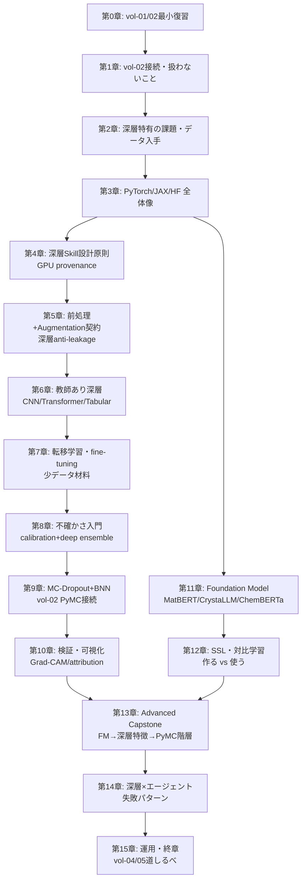

# 「AI エージェント時代の深層学習分析入門」章構成（v0.1 企画ドラフト）

> vol-03 は vol-01「AI エージェント時代のデータ分析入門」および vol-02「AI エージェント時代の統計・機械学習分析入門」の続編。
> vol-01 が「動く Skill を 1 つ自力で作る」まで、vol-02 が「その Skill に統計的・機械学習的な厚みを持たせ、不確かさまで含めて主張できる分析」に踏み込んだのに対し、
> vol-03 は **深層学習・事前学習モデル（Foundation Model）・GPU provenance** を Skill に載せて、
> **少データ材料タスクを「表現学習 + 不確かさ + 階層」で解ける状態** まで踏み込む。

## 版履歴

### v0.1（初版企画ドラフト）
- **F1**: vol-02 第15章 §15.8 の道しるべを起点に、2 pillars + advanced capstone を **「fine-tune Skill / 不確かさつき深層 Skill / 深層特徴 × PyMC 階層モデル capstone」** で構成
- **F2**: 深層特有の provenance 拡張（seed / cuDNN determinism / GPU backend / weights sha / tolerance）を **付録A に vol-02 A + 差分**として明示
- **F3**: Foundation Model は **「使う」立場を主軸**（MatBERT / CrystaLLM / ChemBERTa）、「作る」立場（SSL/対比学習）は 1 章のみ
- **F4**: **MCP サーバ実装（Python SDK 版）**を付録B に格上げ（vol-02 第15章で「vol-03 の付録候補」と予告された箇所）
- **F5**: 生成モデル（VAE / GAN / Diffusion）は本書のスコープ外、vol-05 以降候補として第1章・第15章で道しるべを示す
- **F6**: 大規模分散学習・マルチノード training は本書のスコープ外（研究室規模〜単一 GPU / 単一ノード）

## 前提

- **対象読者**: ARIM データポータル会員のデータ分析者（材料・ナノテク研究者）。Python / Jupyter 経験あり。**vol-01 + vol-02 完読が推奨**、未読でも第0章の最小復習（15 ページ）で読み進められる構造
- **vol-01 / vol-02 との関係**:
  - **vol-01 完読推奨**: Skill 設計 6 要素、データ契約、Human-in-the-loop、provenance の基本
  - **vol-02 完読推奨**: 特に第4章（Skill 設計原則）、第7章（CV とデータリーク）、第10-12章（PyMC / MCMC 診断）、第11章（階層モデル）
  - vol-02 の provenance 拡張（`cv_scheme`, `sampler_config`, `backend_config`, `posterior_artifact`, `diagnostics_summary` 等）に、vol-03 は **深層特有フィールド**を追加（`gpu_backend`, `cudnn_deterministic`, `random_seed_per_worker`, `weights_uri`, `weights_sha256`, `finetune_config`, `augmentation_config`, `tolerance` 等）
- **最終ゴール（合格ライン）**:
  - **Pillar 1**: **PyTorch または JAX/Flax を核にした「教師あり深層学習 + 転移学習」Skill** を 1 つ以上（画像 / スペクトル / 表形式のいずれか）動く・検証済み・再現できる形で作れる
  - **Pillar 2**: **不確かさつき深層モデル Skill**（deep ensemble もしくは MC-Dropout もしくは Bayesian Neural Net）を 1 つ以上作れる。calibration（Brier / ECE）まで含む
  - **Advanced Capstone**: 上記 2 本を統合した **「事前学習モデル → 深層特徴抽出 → PyMC 階層モデル」の複合 Skill**（vol-02 第13章 capstone の深層版）を作れる
- **分量目安**: 実践書（250〜300 ページ規模、vol-02 と同等）
- **期限**: 6 か月
- **ハンズオン標準環境**（vol-02 に追加）:
  - vol-02 標準 + `torch`, `torchvision`, `torchaudio`（PyTorch 系）
  - `jax`, `jaxlib`, `flax`, `optax`（JAX 系。vol-02 第10章末で導入済み）
  - `transformers`, `datasets`, `accelerate`, `huggingface_hub`（Hugging Face エコシステム）
  - `scikit-learn`（vol-02 継続、深層特徴 → 線形/ツリーの後段用）
  - `shap`, `captum`, `grad-cam`（解釈可能性・可視化）
  - **GPU**: CUDA（NVIDIA）／ROCm（AMD）／MPS（Apple Silicon）に対応。**CI 環境は CPU で完結**することを要件化
  - **MLflow または Weights & Biases**（optional・第14章で「実験ログ管理を選ぶかどうか」の判断基準）
- **データセット方針**:
  - **短例・章内ハンズオン**: vol-01 / vol-02 のサンプルデータ・MatBench・RRUFF を流用
  - **本格演習**:
    - 画像 → **NFFA-EUROPE SEM Dataset**（走査電子顕微鏡画像の公開ベンチマーク）／**UHCS microstructure dataset**（超高炭素鋼の顕微鏡画像）
    - スペクトル → **RRUFF Raman** の 1D CNN / Transformer 分類（vol-02 の PCA/PLS を上書きせず、比較として提示）
    - 表形式 → **MatBench**（vol-02 と同じ、深層 TabNet / FT-Transformer との比較）
    - Foundation Model → **MatBERT**（材料テキスト）、**CrystaLLM**（結晶構造）、**ChemBERTa**（化学 SMILES）—— Hugging Face Hub 経由で取得
  - **不確かさ演習**: 各データセットに対して deep ensemble / MC-Dropout の分散を評価
  - **capstone（Ch13）**: vol-02 の合成階層データ（`data/synthetic-hierarchy/`、配置規約は付録A §A.1.1）を再利用し、深層特徴を上に載せる
  - ライセンス・引用ルールは第2章で扱う
- **参照**:
  - PyTorch 公式: https://pytorch.org/
  - JAX / Flax 公式: https://jax.readthedocs.io/ / https://flax.readthedocs.io/
  - Hugging Face Transformers: https://huggingface.co/docs/transformers/
  - MatBERT: https://github.com/lbnlp/matbert
  - CrystaLLM: https://github.com/lantunes/CrystaLLM
  - ChemBERTa: https://github.com/seyonechithrananda/bert-loves-chemistry
  - NFFA-EUROPE SEM Dataset: https://b2share.eudat.eu/records/80df8606fcdb4b2bae1656f0dc6db8ba
  - UHCS microstructure dataset: https://materialsdata.nist.gov/handle/11256/964
  - Captum（PyTorch 解釈可能性）: https://captum.ai/
  - MLflow: https://mlflow.org/ / Weights & Biases: https://wandb.ai/
  - Model Context Protocol Python SDK: https://github.com/modelcontextprotocol/python-sdk
  - vol-01 / vol-02 リポジトリ（本書の前提）

## 本書で扱わないこと（明示）

vol-03 は scope を絞る。以下は将来巻の候補として第1章・第15章で道しるべを示すのみ。

| トピック | 扱わない理由 | 想定巻 |
|---|---|---|
| **因果推論**（DoWhy / EconML / DAG） | 前提となる実験計画・介入設計の議論が独立して必要 | vol-04 候補 |
| **ベイズ最適化・逐次実験計画**（BoTorch / GPyOpt） | 「次にどの試料を測るか」の判断は別領域。深層モデルの surrogate はスコープ外 | vol-04 候補 |
| **生成モデル**（VAE / GAN / Diffusion、材料生成・逆設計） | 学習された潜在空間からの生成は独立テーマ | vol-05 以降候補 |
| **大規模分散学習・マルチノード training** | 研究室規模を主対象とするため。単一 GPU / 単一ノードに絞る | 別書候補（MLOps 系） |
| **Foundation Model のスクラッチ事前学習**（LLM 事前学習コーパス設計、大規模計算資源運用） | 材料 FM は既存重みを利用する立場。事前学習の設計は別領域 | vol-05 以降候補 |
| **Reinforcement Learning**（RLHF、実験ロボティクス） | 実験計画（vol-04）とロボティクスの交差領域 | 別書候補 |
| **深層学習アルゴリズムそのものの数学的導出** | Optimization / backprop の詳細は既存教科書に譲る（本書は Skill 化に集中） | — |

## 6 データ型と深層学習手法の対応

vol-02 の対応表を継承しつつ、深層層を追加：

| データ型 | vol-01 で整えたもの | vol-02 で扱えるようになったもの | vol-03 で扱うもの |
|---|---|---|---|
| スペクトル型 | 単位・波数校正・欠損補間・メタ | PCA, PLS, ピーク回帰, 校正曲線 (PyMC), 装置間階層 | **1D CNN / Transformer** 分類・回帰、**Raman Foundation Model の転移**、自己教師あり事前学習 |
| クロマトグラム・時系列型 | 時刻同期・ベースライン | 分類、外れ試料検出、反応速度階層 | **時系列 CNN / Transformer**、自己教師あり事前学習、深層特徴 + PyMC 階層 |
| 画像・顕微鏡型 | メタ・解像度・キャリブレーション | 特徴量後の回帰/分類、粒径階層 | **CNN / Vision Transformer** 分類、**転移学習**（ImageNet / SEM 事前学習）、Grad-CAM |
| 回折・散乱パターン型 | 単位・角度校正 | パターンクラスタリング、格子定数事後分布 | 2D CNN によるパターン分類、**Rietveld パラメータの深層代替**（微分可能物理層は言及のみ）|
| 表形式・プロセス条件型 | データ contract・単位統一 | 物性予測、感度分析、ロット/オペレータ階層 | **TabNet / FT-Transformer**（vol-02 GBM との比較）、深層特徴 + PyMC 階層 |
| マルチモーダル統合型 | ID キー・時刻同期 | 統合特徴量からの予測 | **CLIP 系マルチモーダル埋め込み**、**画像 + 表形式の同時 fine-tune** |

## 章構成（案）

**分量目安の合計**：本編 250〜300 ページ + 付録 40〜50 ページ

### 第0章 vol-01 / vol-02 最小復習（目安 15 ページ）

| 章 | タイトル | 責務 | 成果物 |
|---|---|---|---|
| 第0章 | vol-01 / vol-02 の最小復習 | Skill / MCP / データ契約 / provenance / 6 データ型 / 統計/ML 診断（CV, calibration, MCMC 診断）を 15 ページに圧縮。vol-01/02 完読者は読み飛ばし可 | vol-03 に入る最低限の前提 |

### 第I部　なぜ「深層 × エージェント」なのか（目安 25〜30 ページ）

| 章 | タイトル | 責務（扱う／扱わない） | 成果物 |
|---|---|---|---|
| 第1章 | vol-02 の Skill に何が足りないのか | 特徴量エンジニアリングの限界、少データ材料での表現学習、Foundation Model 時代の学習の民主化、vol-02 との接続、vol-03 のゴール（2 pillars + capstone）、**本書で扱わないこと**の明示 | 本書の到達点と読者ルート |
| 第2章 | 深層学習が材料データで直面する課題 | GPU 非決定性、事前学習重みの provenance、少データ・分布外、fine-tune 特有のデータリーク、augmentation の契約、**なぜ点推定だけでは足りないか（不確かさへの再訪）**。演習用データ（NFFA/UHCS/MatBench）の紹介とライセンス | 自分のデータの深層タスク分類、演習用データの入手 |
| 第3章 | PyTorch と JAX/Flax の全体像・使い分け、Hugging Face の位置づけ | 2 つの柱の位置づけ（PyTorch は生態系広さ、JAX は関数型と xla 最適化）、Jupyter MCP 経由の使用方針、GPU バックエンド（CUDA / ROCm / MPS）と CPU fallback、Hugging Face Hub の重み配布と署名 | 使い分けマップ、GPU 環境の受け入れチェック |

### 第II部　深層学習 Skill の設計と教師あり学習（目安 65〜75 ページ）

| 章 | タイトル | 責務 | 成果物 |
|---|---|---|---|
| 第4章 | 深層学習 Skill の設計原則 | vol-02 第4章の GPU 拡張。**「何を成功とみなすか」＋「どの環境で再現するか」**——評価指標（accuracy / MAE / RMSE / ROC-AUC / mAP 等）、**seed / cuDNN determinism / GPU backend / weights sha / tolerance の provenance**、CI 上の CPU 学習、循環設計問題の深層版、augmentation 契約の位置づけ | 深層 Skill 仕様書テンプレート、GPU provenance スキーマ |
| 第5章 | 画像・スペクトル・表形式の前処理と Augmentation の Skill 化 | データローダ設計、augmentation の contract（train のみで使い、test/val には使わない・stratified split との整合）、**深層版 anti-leakage split contract**（fine-tune 前の事前学習データとの重複禁止、CLIP-like モデルでの text-image leakage）。第5章冒頭に「augmentation × leakage」の 5 つの落とし穴 | Augmentation Skill、深層 anti-leakage 契約 |
| 第6章 | 教師あり深層学習を Skill 化する | **CNN 分類・回帰**（画像 SEM / スペクトル 1D）、**Transformer 骨格**（Vision Transformer / 1D Transformer の骨格比較）、**TabNet / FT-Transformer**（表形式）。3 例をハンズオン化。vol-02 GBM との比較を並列に | 教師あり深層学習 Skill（画像 / スペクトル / 表形式） |
| 第7章 | 転移学習・fine-tuning を Skill 化する | frozen feature extractor vs full fine-tune vs LoRA/PEFT の判断、head 交換、**少データ材料での評価戦略**（vol-02 第7章の CV 設計を深層に持ち込む）、**事前学習重みの分布外検知**（domain gap の early warning） | 転移学習 Skill、少データ評価チェックリスト |

### 第III部　不確かさと解釈（目安 45〜55 ページ）

| 章 | タイトル | 責務 | 成果物 |
|---|---|---|---|
| 第8章 | 深層モデルの不確かさ入門 | vol-02 第9-10章の続き。**calibrated softmax の限界**、Brier score / ECE / reliability diagram、**deep ensemble**（PyTorch/JAX 両実装）。**この章では PyMC は最小限**、深層特有の視点に絞る | 不確かさ表現の言語化、deep ensemble Skill |
| 第9章 | MC-Dropout と Bayesian Neural Net の Skill 化 | MC-Dropout の実装、**BNN**（Bayes by Backprop / Variational Inference / SG-MCMC）、vol-02 第10-12章の PyMC/NumPyro との接続、Pyro / NumPyro の位置づけ、**「BNN vs deep ensemble vs conformal prediction」の使い分け**表 | MC-Dropout Skill、BNN Skill、判断表 |
| 第10章 | 深層モデルの検証・可視化・レポート化 | **Grad-CAM / integrated gradients / SHAP for deep**、feature attribution の hallucination 対策、reliability diagram、Human-in-the-loop の質を上げる拡張、**再現可能な深層レポート**（環境固定 + weights sha + augmentation config） | 解釈可能性 Skill、深層レポートテンプレート |

### 第IV部　Foundation Model と表現学習（目安 45〜55 ページ）

| 章 | タイトル | 責務 | 成果物 |
|---|---|---|---|
| 第11章 | 材料 Foundation Model と MCP 連携 | **MatBERT / CrystaLLM / ChemBERTa** の位置づけと使い分け、Hugging Face Hub からの取得と**重みの署名検証**、**LLM 系 MCP との連携パターン**（Anthropic MCP、Hugging Face MCP）、**エージェントが FM に問い合わせるときの hallucination 対策**（vol-01 第10章の文献照合 Skill の拡張） | Foundation Model 呼び出し Skill、重み provenance |
| 第12章 | 自己教師あり学習と対比学習の Skill 化 | **SimCLR / BYOL / MoCo** の材料応用、**「事前学習を作る」vs「使う」の判断**、ラベルなし顕微鏡データからの表現学習、**小規模 SSL** の実務（GPU 1 枚での限界） | SSL Skill、事前学習判断表 |
| 第13章 | 総合ハンズオン（Advanced Capstone）：Foundation Model → 深層特徴 → PyMC 階層モデル | **MatBench または RRUFF で FM 転移学習を体験**したうえで、**深層特徴を PyMC 階層モデルの入力とする capstone を完成**させる。vol-02 第13章 capstone の深層版。**「深層特徴の不確かさ」と「階層のプーリング」の共存**を明示 | 統合 Skill（capstone） |

### 第V部　運用・失敗・展望（目安 40〜50 ページ）

| 章 | タイトル | 責務 | 成果物 |
|---|---|---|---|
| 第14章 | 深層 × エージェント特有の失敗パターン | GPU 差分（cuDNN / TF32）による結果ずれ、事前学習重みの汚染（学習セットとテストセットの pre-training データが重複）、**fine-tune のデータリーク**（事前学習コーパスに評価データが含まれる）、Foundation Model の分布外、hallucinatory feature attribution、augmentation 契約違反、**experiment tracking を入れるべき判断基準** | 深層 × エージェント失敗チェックリスト |
| 第15章 | 組織展開と終章 — GPU リソース共有・モデル配布 | GPU リソースの共有と権限（研究室単位 vs ARIM 施設）、**モデル配布（重み + provenance + 使用制限）**、監査ログ、**vol-01+02+03 の到達点**、**vol-04（因果・実験計画）・vol-05 以降（生成モデル・逆設計）への道しるべ** | 組織展開方針、次巻ロードマップ |

### 付録（目安 40〜50 ページ）

| 付録 | タイトル | 内容 |
|---|---|---|
| 付録A | 深層学習 Skill テンプレート集 | 画像分類 / 画像回帰 / スペクトル分類 / 表形式回帰 / 転移学習 / SSL / BNN の Skill 雛形。**vol-02 の provenance を GPU/深層向けに拡張**したスキーマ（`gpu_backend`, `cudnn_deterministic`, `random_seed_per_worker`, `weights_uri`, `weights_sha256`, `finetune_config`, `augmentation_config`, `tolerance`, `experiment_tracker_ref` 等）を含む。**Skill / リポジトリ配置規約は vol-02 A §A.1.1 を継承**（深層章では `checkpoints/` サブディレクトリを追加） |
| 付録B | PyTorch / JAX / Hugging Face チートシートと **MCP サーバ実装（Python SDK 版）** | よく使う API、ローダ・スケジューラ・チェックポイント管理、Hugging Face Hub 認証、**MCP Python SDK で組織内 MCP サーバを実装するミニマル例**（vol-02 第15章で予告された「作るべきかどうかの判断」の実装編）。**cmdstanpy 等 vol-02 が扱わなかったもの同様、非決定的 backend / 非公開重み の取り扱いは扱わない** |
| 付録C | GPU トラブルシューティングと**深層学習用公開データセット候補** | CUDA バージョン不整合、OOM、cuDNN 非決定性の抑制、mixed precision の落とし穴、DataLoader worker のシード伝播、Hugging Face Hub 認証、**加えて、深層学習に使える公開データセット候補**（NFFA-EUROPE SEM、UHCS microstructure、Materials Project、Open Catalyst、AFLOW、NOMAD 等）の入手・ライセンス・注意点を列挙 |

## 責務分離マップ（重複防止）

### vol-03 内での分離

| 論点 | 予防・設計側 | 実行・事例側 |
|---|---|---|
| 評価指標選択 | 第4章（何を成功とみなすか） | 第10章（可視化・診断で確認） |
| 深層 anti-leakage 契約 | 第5章冒頭・第7章（fine-tune の事前学習重複） | 第14章（事例） |
| GPU 非決定性 | 第4章（provenance）・第14章 | 付録C |
| Augmentation | 第5章（契約） | 第14章（違反事例） |
| 不確かさ | 第8章（deep ensemble）・第9章（BNN） | 第14章（過信事例）・第10章（可視化） |
| Foundation Model | 第11章（使う）・第12章（作る） | 第14章（分布外・重み汚染） |
| provenance 拡張 | 付録A（完全スキーマ） | 第4章（設計）・第14章（欠落事例） |
| 実験ログ管理 | 第14章の判断基準表 | 付録B（MLflow/W&B の位置づけ） |

### vol-02 との分離

| 論点 | vol-02 側 | vol-03 側 |
|---|---|---|
| Skill 設計原則 | 統計/ML の指標・分割（第4章） | GPU/backend/weights の provenance（第4章） |
| 不確かさ | PyMC / MCMC（第9-12章） | deep ensemble / MC-Dropout / BNN（第8-9章）＋深層特徴 × PyMC 階層（第13章）|
| データ契約 | 統計/ML 用（vol-02 第4章） | 深層追加要素——augmentation 契約、事前学習重複禁止（第5章） |
| 失敗パターン | データリーク / p-hacking / 収束不良（vol-02 第14章） | GPU 差分 / 重み汚染 / hallucinatory attribution（第14章） |
| capstone | 合成階層データ + PyMC（vol-02 第13章） | 事前学習モデル + 深層特徴 + PyMC 階層（vol-03 第13章） |
| provenance スキーマ | ML/Bayesian 拡張（vol-02 付録A） | GPU/深層拡張（vol-03 付録A、vol-02 継承 + 差分） |
| MCP 実装 | 判断基準まで（vol-02 第15章） | Python SDK でのミニマル実装（vol-03 付録B） |

### vol-01 との分離

| 論点 | vol-01 側 | vol-03 側 |
|---|---|---|
| 装置別テンプレート | 6 データ型テンプレート（vol-01 第13章） | 6 データ型 × 深層手法の対応マップ（vol-03 第2章・付録A） |
| 文献照合 Skill | arXiv / Paper Search MCP（vol-01 第10章） | Foundation Model MCP（vol-03 第11章、hallucination 対策は共通） |
| provenance の基本形 | `input_sha256`, `skill_version`, `run_datetime_utc`, `package_versions`, `random_seed`（vol-01 第7章） | 上記 + vol-02 拡張 + vol-03 GPU/深層拡張（付録A に完全スキーマ） |

## 各ハンズオン章の共通構成

vol-01 / vol-02 と同形式。**第6章で丁寧に説明し、以降の第7・第9・第11・第13章は差分中心**。

- この章で作る Skill の概要
- 入力仕様 / 出力仕様 / 制約条件（vol-02 拡張 provenance + vol-03 GPU/深層拡張に準拠）
- **深層特有の評価基準**（calibration / attribution reliability / augmentation validity / weights provenance）
- 実行例 / 失敗例 / 改善版
- 他データ型・他バックエンド（PyTorch ↔ JAX）への転用方法

## 特に注意する重点管理項目

| 項目 | 予防・設計 | 事例・検証 |
|---|---|---|
| GPU 非決定性を "動いた" と誤解 | 第4章（determinism 設定）・付録C | 第14章 |
| 事前学習重みの分布外 / 汚染 | 第7章（domain gap の early warning）・第11章 | 第14章 |
| Augmentation 契約違反（test/val にも適用） | 第5章 | 第14章 |
| Fine-tune 時のデータリーク（事前学習コーパスに評価データ） | 第5章・第7章 | 第14章 |
| Deep ensemble の分散を "不確かさ" と過信 | 第8章 | 第14章 |
| Feature attribution の hallucination | 第10章 | 第14章 |
| Foundation Model の hallucination（vol-01 第10章の拡張） | 第11章 | 第14章 |
| BNN の未収束 / 事前分布の暴走 | 第9章（vol-02 第12章と共通） | 第14章 |
| CI 環境で GPU 前提のコードが落ちる | 第4章（CPU fallback 必須） | 付録C |
| provenance の GPU 情報欠落 | 付録A 拡張スキーマ | 第14章 |
| Foundation Model の重み配布ライセンス違反 | 第11章 | 第15章 |

## 章間依存図（Mermaid）

## 開発ロードマップ（暫定）

| フェーズ | 期間目安 | 内容 |
|---|---|---|
| **Phase 0**: 企画確定 | 2 週間 | v0.1（本書）→ v0.2（rubber-duck review）→ v0.3（社内レビュー反映） |
| **Phase 1**: データセット準備 | 3 週間 | NFFA-EUROPE / UHCS のダウンロードスクリプト、MatBERT / CrystaLLM / ChemBERTa の Hugging Face Hub 検証、GPU 環境の受け入れチェックリスト |
| **Phase 2**: 第0-3章（導入） | 3 週間 | vol-01/02 最小復習、深層特有の課題整理、PyTorch/JAX/HF 全体像 |
| **Phase 3**: 第4-7章（教師あり + 転移学習） | 8 週間 | Skill 設計原則、augmentation、CNN/Transformer/Tabular、fine-tuning |
| **Phase 4**: 第8-10章（不確かさ + 解釈） | 5 週間 | deep ensemble、MC-Dropout、BNN、Grad-CAM |
| **Phase 5**: 第11-13章（FM + capstone） | 5 週間 | Foundation Model、SSL、深層特徴 × PyMC 階層 capstone |
| **Phase 6**: 第14-15章（失敗・運用） | 3 週間 | 失敗パターン、組織展開、vol-04/05 道しるべ |
| **Phase 7**: 付録A/B/C | 3 週間 | テンプレート集、MCP Python SDK 実装、GPU トラブルシューティング |
| **Phase 8**: 全編 rubber-duck review + 実機検証 + 修正 | 4 週間 | 章別レビュー、実機テスト、外部参照ファクトチェック |
| **合計** | **約 6 か月** | vol-02 と同等の実践書 |

## リスクと対策

| リスク | 影響 | 対策 |
|---|---|---|
| **GPU 環境の可搬性**：読者ごとに CUDA バージョンが異なる、Apple Silicon の MPS 対応が遅れる | ハンズオンが動かない | CPU fallback を **必須要件**化（第4章）。Colab / Kaggle ノートブック提供、Docker image の準備、`torch.backends.mps` の早期検証 |
| **Foundation Model の重み配布・ライセンス変更**：MatBERT / CrystaLLM の Hugging Face 上での可用性 | 演習が実行不能に | 執筆時点での Hub URL とライセンスを付録C に記録、代替モデル（SciBERT 等）の言及、Hub 上での重み削除時のフォールバック手順 |
| **深層学習の再現性の根本的困難**：cuDNN / TF32 / autocast の非決定性 | 「同じコードなのに結果が違う」で読者が混乱 | 第4章冒頭で「完全一致は目指さない、tolerance を設計する」を明示。vol-02 の MCMC 診断と同じ姿勢（結果の"幅"を評価する） |
| **Foundation Model の hallucination**：エージェントが FM の出力を鵜呑みに | 誤った推論を Skill が出力 | 第11章で vol-01 第10章の文献照合 Skill の拡張として、**FM 出力の検証手順**を必ず入れる |
| **6 か月で 15 章 + 付録は野心的**：vol-02 の実績（本編 16 章 + 付録 3 で約 6 か月）で確認済みだが、深層は実機検証コストが高い | 期日超過 | 実機検証を **Phase 2-7 の各フェーズ末に埋め込む**（vol-02 のように最後にまとめない）。Skill 数を絞る（画像 + スペクトルのみで開始、表形式は付録扱いも検討） |
| **vol-04 との境界**：ベイズ最適化・実験計画をどこまで匂わせるか | 内容が拡散 | **第7章で「fine-tune の候補選択」に BO を使わない**ことを明示。第15章で vol-04 への道しるべを丁寧に |

## 次のアクション

1. **本企画書（v0.1）を rubber-duck review**：特に「6 データ型 × 深層手法」対応表、責務分離マップ、扱わないこと表の妥当性
2. **v0.2 反映**：レビュー結果を織り込み、リスク対策を具体化
3. **Phase 1（データセット準備）着手**：NFFA-EUROPE / UHCS のダウンロード確認、MatBERT の Hugging Face 上での可用性検証
4. **第0章と第1章のドラフト着手**：vol-02 の第0章・第1章の構成を踏襲して 10〜15 ページを目安に

---

**参考**: 本企画書は vol-02 `chapter-outline.md`（v0.3）と vol-02 第15章 §15.8「vol-03（深層 × エージェント）への道しるべ」を起点として策定した。
