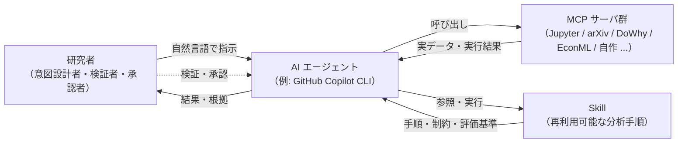

# 第0章 vol-01 / vol-02 / vol-03 の最小復習

> **本章の使い方**
> - **vol-01 + vol-02 + vol-03 完読者**：復習部分は読み飛ばして構いません。ただし、**vol-04 独自の前提**が本章に埋め込まれているため、次の 4 箇所だけは目を通してください：**§0.4 の vol-04 で追加される環境要素**、**§0.6-0.7 の vol-04 で加わる causal × DoE provenance フィールド**、**§0.8 の 3 層介入承認ゲートの予告**、**§0.10-0.11 の因果 × Agentic 特有の失敗パターンと 3 予告**
> - **vol-02 まで完読・vol-03 未読**：vol-03 の深層章は必須ではありませんが、**§0.4（Agentic 権限の 3 段階）と §0.8（Human-in-the-loop）** は vol-04 の 3 層介入承認ゲートに直結します。ここは丁寧に読んでください。他は流し読みで OK
> - **vol-01 のみ完読**：§0.3〜§0.9（vol-02 で拡張された部分）と §0.4 の Agentic 権限（vol-03 由来）を丁寧に、それ以外は流し読みで OK
> - **未読者**：ここで最低限の前提を身につけ、第1章以降に進めます。詳細は必要になった時点で該当章に戻ってください
>
> **この章の到達目標**
> - vol-01 の中核 5 概念（AI エージェント／MCP／Skill／データ契約／provenance）を最小限で説明できる
> - vol-02 で追加された 2 pillars（scikit-learn Skill／PyMC Skill）と統計/ML 診断（CV・calibration・MCMC 診断）・**階層モデル**の要点を言える
> - vol-03 で **GPU / 事前学習重み / エージェントの学習権限 3 段階** が導入されたことを説明できる
> - vol-04 で **因果的判断の 3 層権限（DAG 承認・変数選択承認・介入実行承認）** が新たに登場することを認識できる
> - vol-01〜03 の失敗パターン（循環設計・データ漏洩・ハルシネーション・再現性欠如・統計的リーク・BNN 未収束・GPU 非決定性・Agentic 権限逸脱）を意識できる
>
> **この章で扱わないこと**
> - 各概念の詳細な設計論・失敗事例（vol-01 / vol-02 / vol-03 の該当章を参照）
> - 環境構築の手順そのもの（vol-01 第4章 / vol-02 第0章 / vol-03 第3章・付録C）
> - Skill テンプレートのフィールド完全定義（vol-02 付録A、vol-03 付録A、vol-04 付録A で因果 × DoE × Agentic 拡張）
> - 因果推論・実験計画そのものの導入（第1章から本格的に扱う）
> - 因果推論用語の完全定義（付録D「因果推論用語集」に集約）

---

## 0.1 この章の位置づけ

vol-04 は vol-01 + vol-02 + vol-03 の続編ですが、**単体でも読み進められる**ように設計しています。vol-01 / vol-02 / vol-03 で扱った概念のうち、vol-04 で当然のように使うものだけを、この第0章に圧縮しました。

- **vol-01 + vol-02 完読推奨**、**vol-03 は必須ではありません**（vol-03 第8章の深層特徴を CATE の共変量として使う応用節が第8章にありますが、これは発展です）
- **参照先**：vol-01 / vol-02 / vol-03 の該当章・付録を明示するので、必要な時にだけ戻れば OK
- **分量**：15 ページ程度（vol-01 第3・4・6・7・8・14章、vol-02 第0・4・9・10・11・13章、vol-03 第0・4・11章の要点抽出）

> [!NOTE]
> vol-01 は AI エージェントで実験データ分析を行う入門書、vol-02 は **統計・機械学習の厚み**（scikit-learn と PyMC 階層モデル）を積み上げる本、vol-03 は **エージェントが深層学習を扱う Skill**、そして vol-04 は **エージェントが観測データから "なぜ" と "もし" を主張する Skill** を作るテーマです。vol-04 の焦点は「因果推論の教科書」ではなく **「エージェントが因果推論と実験計画を回すとき、ARIM データで何が起きるか」** です。したがって「エージェントに Skill を作らせる」文化そのものは vol-01 で、統計/ML の作法は vol-02 で、深層 × Agentic の作法は vol-03 で確立済みという前提で話を進めます。

---

## 0.2 3 人の登場人物：AI エージェント／MCP／Skill

vol-01 で最も重要な三者関係を、まず 1 枚の図に圧縮します。

**エージェントの本質的特徴**（vol-01 継承）は 3 つ——自然言語で指示できる、道具（Tool）を選んで使う、文脈を保って反復する。vol-04 では、**「エージェントに DAG 提案までは許すが、変数選択の判定や介入実行は Human 承認を必須にする」** という因果的判断特有の権限設計が新たな論点になります（第4章「因果 × Agentic Skill の設計原則」）。

**MCP（Model Context Protocol）** は AI エージェントと外部の道具・データソースをつなぐ共通コネクタ規格[^0-1]。vol-04 で頻出する MCP は次のとおり。

| MCP サーバ | 用途 | vol-04 での主な役割 |
|---|---|---|
| **Jupyter MCP** | JupyterLab のノートブックをエージェントから読み書き・実行 | ほぼすべての章の実行基盤 |
| **arXiv MCP** / **Paper Search MCP** | 論文検索・取得 | 手法選定・引用（vol-01 第10章と共通） |
| **FastMCP** / **MCP Python SDK** | Python で自作 MCP を作る | **付録B で因果推論・DoE 固有の MCP パターンを実装**（3 層介入承認ゲートを MCP レベルで組み込む） |

**vol-04 で「新しい MCP を必ず追加する」必要はありません**。付録B の自作 MCP は「組織内でエージェントに因果的判断の 3 層承認ゲートを課したい場合」の実装例です。

**Skill** は分析手順を「再利用可能な形にまとめたもの」——入力仕様 / 出力仕様 / 制約条件 / 評価基準 / 手順本体 / 再現性メタデータ（provenance）を明示的に持ちます。**vol-04 の本線は 2 pillars + Advanced Capstone**（vol-04 chapter-outline.md v0.2 準拠）：**Pillar 1 = 観測データからの因果効果推定 Skill**（第5-9章、DAG が明示され identification 戦略が provenance に残り、unmeasured confounder への感度分析まで含む）、**Pillar 2 = 古典的実験計画 (DoE) を Skill 化**（第10-12章、randomization と blocking が provenance に残る）、そして **Advanced Capstone = 観測データで DAG 仮説化 → DoE で介入検証 → 反実仮想シミュレーションで最適条件提案**（第13章、13a と 13b の 2 節構成）。合格ラインは「2 pillars の Skill を自力で作れる」ことです。

> [!TIP]
> Skill の物理形態は、vol-01〜03 共通で `SKILL.md` + `references/` + `scripts/` + `tests/` + `examples/` のディレクトリ。vol-02 で `artifacts/` / `figures/` が加わり、vol-03 で `checkpoints/` / `wandb_run/` が加わりました。**vol-04 では `causal_graphs/`（DAG 定義ファイルと SHA-256 pin）と `doe_designs/`（実験計画表と randomization seed）**が加わります（付録A）。**Skill = 特定のフォルダ構造**という規約は継続。

---

## 0.3 vol-02 で加わった 2 pillars と統計/ML 診断・階層モデル

vol-02 は、vol-01 の「エージェント × Skill」文化の上に **統計・機械学習の厚み**を積み上げた巻でした。**vol-04 は 2 pillars の設計原則をそのまま因果推論と DoE に持ち込みます**。

### 2 pillars（vol-02）と vol-04 での接続

| 柱 | 内容 | vol-04 での位置づけ |
|---|---|---|
| **Pillar 1**：scikit-learn Skill | 分類・回帰・CV 設計・feature importance | 第6-8章の因果 ML 推定器（DR-Learner、DML、Meta-Learners）に接続 |
| **Pillar 2**：PyMC Skill | 事前分布 → 事後 → 診断（$\hat{R}$/ESS/divergences）→ 事後予測 | 第7章の Bayesian 因果推定（CausalPy）、第12章の Bayesian DoE、第13章の反実仮想事後解析に接続 |
| **Advanced Capstone**（vol-02） | 合成階層データ + PyMC 階層モデル | vol-04 第10-11章の DoE で装置差・オペレータ差を blocking factor として組み、第8章 CATE の階層で継承 |

### 統計/ML 診断の最小語彙（vol-02 継承、vol-04 でもそのまま使用）

**分類の評価**（vol-02 第7章）：Accuracy / F1 / ROC-AUC / PR-AUC / Confusion matrix。**vol-04 では uplift modeling の評価（Qini curve, uplift AUC）**が第8章で加わります。

**回帰の評価**（vol-02 第7章）：RMSE / MAE / $R^2$ / 予測 vs 実測プロット。**vol-04 では ATE / ATT / CATE の推定量の評価**が第6-8章で加わります。

**不確かさの基礎**（vol-02 第9章、vol-03 第8-9章で深層 calibration と BNN posterior に本格拡張）

| 概念 | 一言 | vol-04 での使いどころ |
|---|---|---|
| **CI**（信頼区間） | 頻度論の区間表現 | 第6-8章の ATE / CATE 推定量の区間 |
| **CrI**（信用区間） | 事後分布の区間表現 | 第7章 CausalPy、第12章 Bayesian DoE |
| **事前分布** | 何を、いつ、どう書くか | 第12章の Bayesian DoE で情報利得計算 |
| **posterior predictive**（事後予測） | データ空間で確かめる | 第13章の反実仮想シミュレーション |

**CV / 分割設計**（vol-02 第7章、vol-03 第5章で深層 anti-leakage に拡張）：k-fold / Stratified / **Grouped** / Leave-one-group-out。**vol-04 では因果 ML のクロスフィッティング**（DML の cross-fitting）が第6章で加わります。

**MCMC 診断**（vol-02 第12章、vol-03 第9章で BNN に再登場）

| 診断 | 目標値 | vol-04 での使いどころ |
|---|---|---|
| **$\hat{R}$** | $\leq 1.01$ | 第7章 CausalPy、第12章 Bayesian DoE |
| **ESS** | $\geq 400$ 程度 | 同上 |
| **Divergences** | 0 が理想 | 第12章 Bayesian DoE の事後で divergences があれば結論を出さない |
| **BFMI** | $\geq 0.3$ | 同上 |

これらが「合格ライン」に達していない事後分布は、**vol-02 の哲学では結論を引き出せない**——vol-04 でも同じ規律です。**階層モデルで divergences が出たときは、中心化 → 非中心化パラメータ化への変更が定石**（vol-02 第11・12章）は、**第10-11章の DoE で装置差 / オペレータ差を blocking factor として組むとき**にも適用されます。

### 階層モデル（vol-02 第11章）と vol-04 の DoE / CATE の接続

vol-02 第11章の階層モデルは、vol-04 で 2 箇所に活用されます：

1. **DoE の blocking factor（第10-11章）**：装置差・オペレータ差・ロット差を blocking factor として組み込むとき、階層事前分布で部分プーリング。装置ごとの効果を「完全独立」でも「完全共通」でもなく、**partial pooling で推定**
2. **CATE の階層（第8章）**：試料組成ごと・装置ごとの CATE を階層事前分布で共有し、少数観測でも安定した推定を得る

**装置差・ロット差の扱い**は vol-02 と vol-04 で一貫しています——DAG 上で「confounder として調整するか」「mediator として分解するか」「random effect として吸収するか」を Human が判定します（第5章）。

---

## 0.4 vol-03 で加わった深層 × Agentic 権限（vol-04 の 3 層承認ゲートへの橋）

vol-03 は、vol-01/02 の Skill 文化の上に **深層学習と Foundation Model** を持ち込みました。**vol-04 の 3 層介入承認ゲートは、vol-03 の Agentic Authorization を因果推論文脈に拡張したもの**です。

### vol-03 の Agentic Authorization 3 段階（第4章）

| 権限レベル | エージェントが自律できること | Human 承認が必須なこと |
|---|---|---|
| **推論のみ** | 訓練済みモデルで推論を回す | 学習ジョブ起動、weights 更新 |
| **承認済み範囲内の fine-tune 可** | 事前承認された data / config で fine-tune | 新規 config、新規 data、範囲外の hyperparameter |
| **事前承認済みワークフロー内の自律実行可** | 承認済み SOP に沿った反復実験 | SOP 逸脱、FM 更新、外部送信 |

**いずれのレベルでも、科学的結論の最終判断・未承認 checkpoint 上書き・FM 更新・外部送信は常に Human 承認ゲートの対象**（vol-01 Ch6 継承、vol-03 第4章で深層拡張、vol-04 第4章で因果拡張）。

### vol-04 で加わる因果的判断の 3 層権限（第4章で本格化）

vol-03 の 3 段階権限は「学習ジョブ」に対する権限でした。vol-04 では **「因果的判断」に対する 3 層権限**が加わります。

| 層 | 権限フィールド | 承認の中身 |
|---|---|---|
| **1: DAG 構造** | `dag_authorization` | エージェントが提案した DAG（confounder / mediator / collider の割り付け）を Human が承認 |
| **2: 変数選択** | `variable_selection_authorization` | どの変数を confounder として調整するか / mediator として分解するか / collider として避けるかを Human が承認 |
| **3: 介入実行** | `intervention_execution_authorization` | 因果的主張に基づいて **実際に介入を実行する** ことを Human が承認 |

**観測データからの推定（ATE/ATT/CATE の計算）は自律**でよいが、**DAG 構造変更と変数選択は準自律（Human review 必須）**、**実際の介入実行は必ず Human 承認**——この 3 層は第4章で仕様書テンプレート化され、付録B で MCP レベルの実装として提示されます。

**なぜ 3 層に分解するか**：観測データから ATE を計算する Skill は、DAG が固定されていれば数学的に決定的です。しかし DAG そのものは仮説であり、confounder の割り付けは identification 戦略の根幹を左右します。「エージェントが DAG を勝手に書き換える」「confounder を勝手に削除する」といった失敗は第14章で扱いますが、**予防は "3 層に分けて別々に承認を取る" こと**です。

---

## 0.5 ハンズオン標準環境

vol-01 / vol-02 / vol-03 で構築した環境をそのまま使います。**vol-04 では因果推論・DoE ライブラリが加わります**。**未構築の方は vol-01 第4章 §4.3〜§4.6、vol-02 第0章 §0.3、vol-03 第3章 を参照**してください。

### vol-03 までの標準環境（そのまま）

| # | 要素 | バージョン | 役割 |
|---|---|---|---|
| 1 | Python | 3.11 以上 | 分析エンジン |
| 2 | JupyterLab | 4.4.1 | ノートブック実行環境 |
| 3 | GitHub Copilot CLI | 最新版 | AI エージェントアプリ／MCPホスト |
| 4 | Jupyter MCP Server | 0.14.4 | エージェント⇔JupyterLab の橋 |
| 5 | Node.js | 22 以上 | Copilot CLI の実行基盤 |
| 6 | PyMC | vol-02 継承 | Bayesian 統計モデル |
| 7 | scikit-learn | vol-02 継承 | ML の骨格 |
| 8 | PyTorch / JAX（optional） | vol-03 継承 | 深層特徴を CATE 共変量として使う場合 |

### vol-04 で追加するもの（詳細は第3章と付録B）

| ライブラリ | 章 | 役割 |
|---|---|---|
| **dowhy** | 第5-9章 | DAG 定義 / identification / refutation の柱 |
| **econml** | 第6-8章 | ML-based estimator（DR-Learner、DML、Meta-Learners） |
| **causal-learn** | 第5章 | 探索型 DAG 構造学習 |
| **causalpy** | 第7章 | Bayesian causal impact / synthetic control（PyMC ベース） |
| **pgmpy** | 第5章・付録A | 確率的グラフィカルモデル、DAG テンプレート |
| **linearmodels** | 第7章 | DiD / IV 推定 |
| **scikit-uplift** | 第8章 | uplift modeling（材料選抜への転用） |
| **pyDOE2** | 第10-11章 | 古典 DoE（要因計画・分割区画・応答曲面） |
| **smt** | 第11章 | Kriging surrogate（応答曲面の後半） |
| **GraphViz** | 第5章 | DAG 可視化 |

**CI 環境は CPU で完結**を必須要件とします（vol-03 と同じ方針）。因果推論・DoE の主要計算は表形式データが主戦場で GPU は不要——ただし第8章で深層特徴を CATE 共変量として使う応用節では PyTorch/JAX が必要になります（optional）。

> [!IMPORTANT]
> **DoWhy と EconML は API 設計が異なる**（DoWhy は identification + estimation + refutation の統合フレームワーク、EconML は estimator のスタンドアロン集）。第3章「ライブラリ地図」で使い分けを整理しますが、**「Skill としてどちらを主軸にするか」は事前に決めて Skill の入出力契約に書く**必要があります（第4章）。

> [!TIP]
> vol-02 の `.venv-vol02`（PyMC）に dowhy / econml / causal-learn を追加インストール可能です。ただし scikit-learn のバージョン互換性を確認してください（EconML は sklearn の特定バージョン範囲を要求します）。詳細は第3章。

---

## 0.6 データ契約：Skill の入出力を約束する（vol-01 + vol-02 + vol-03 の合流点）

vol-01 第8章の中核概念で、vol-02 第4章で **ML/Bayesian 特有の要素**、vol-03 で **深層特有の要素** が追加されました。vol-04 では **因果推論・実験計画特有の要素**（次章以降で説明）がさらに加わります。

### vol-01 の 7 要素（工程ベース）

vol-01 のデータ契約は **入力データを Skill に渡すまでの 7 工程**を約束事として明文化する枠組みです（⓪入手・由来記録 → ①読込 → ②メタデータ結合 → ③単位統一 → ④欠損・外れ値マーキング → ⑤品質チェック → ⑥標準形式化）。**生ファイル編集は fatal**、**未登録の暗黙単位変換は fatal**——vol-04 でも継続。

### vol-02 で追加された ML/Bayesian 要素（vol-02 第4章）

分割方針（k-fold / stratified / grouped、**同一試料が train/test に混ざるのを禁止**）、CV スキーム、標本サイズ下限、階層構造の記述、事前分布契約。

### vol-03 で追加された深層要素（vol-03 第4-5章）

Augmentation 契約（train のみ、エージェントが勝手に強化しない）、深層 anti-leakage split（**事前学習データと fine-tune データの重複禁止**、コーパス不明な公開 FM は provenance に `pretraining_corpus_known: false` を明記）、重みの provenance、GPU バックエンドの記録、Agent の権限記録。

### vol-04 で追加される因果 × DoE × Agentic 要素（第4-5章で詳述）

| 要素 | 一言だけの予告 |
|---|---|
| **DAG 契約** | 使用する DAG の URI と SHA-256 で pin。**エージェントが勝手に書き換えない**（`dag_authorization` ゲート） |
| **識別戦略の明示** | backdoor / frontdoor / IV / DiD / RDD / synthetic control のいずれを採用するか。**エージェントが勝手に切り替えない** |
| **confounder / mediator / collider の割り付け** | 変数ごとの因果的役割を明示。`variable_selection_authorization` ゲート |
| **positivity と SUTVA の宣言** | 因果的識別に必要な仮定を Skill が明示的に checked / not-checked で記録 |
| **DoE の randomization seed** | DoE 生成時の randomization seed を provenance に。**上書き禁止** |
| **blocking factor の明示** | 装置差・オペレータ差を blocking として組んだか、confounder として調整したかを明示 |
| **反実仮想の外挿範囲** | `counterfactual_scope_gate`——外挿範囲を Mahalanobis 距離閾値 + CATE 予測分散閾値で判定 |

### 品質チェックは 3 段階（vol-01 の哲学、vol-02〜04 で継承）

| レベル | 挙動 | vol-04 での新たな例 |
|---|---|---|
| **fatal** | Skill に渡さず**明示エラーで拒否** | **DAG に collider を通る誤った path**（backdoor 違反）、**positivity 違反（treatment/control のオーバーラップが不十分）**、**randomization seed の欠落** |
| **warning** | 警告ログ付きで渡す | **少ない実験サンプルでの CATE 推定**、**refutation test が一部未実施** |
| **flag** | フラグ列を付けて渡す | **外挿範囲境界付近の予測**（`counterfactual_scope_gate` の閾値近傍） |

**fatal を握りつぶさない**——これが vol-01〜04 を通じた最重要ルールです。

---

## 0.7 provenance：再現できる形で結果を残す

vol-01 第7章「⑥再現性条件」と付録Aの provenance 必須フィールドを起点に、vol-02 → vol-03 → vol-04 で拡張されていく概念です。**vol-04 では因果 × DoE × Agentic の要素が加わります**。

### vol-01〜03 の基本フィールド（そのまま継承）

- **vol-01**：`input_sha256`, `skill_version`, `run_datetime_utc`, `package_versions`, `random_seed`
- **vol-02**：`cv_scheme`, `data_split`, `model_config`, `sampler_config`, `backend_config`, `posterior_artifact`, `diagnostics_summary`
- **vol-03**：`gpu_backend`, `cudnn_deterministic`, `weights_uri`, `weights_sha256`, `finetune_config`, `augmentation_config`, `agent_authorization`, `training_job_approval`, `checkpoint_overwrite_policy`

### vol-04 で追加されるフィールド（付録A で完全定義）

**因果推論の要素**

| フィールド | 意味 |
|---|---|
| `causal_graph_uri` | 使用した DAG 定義ファイルの URI |
| `causal_graph_sha256` | DAG 定義ファイルの SHA-256（改ざん防止） |
| `treatment_variable` | 介入変数の名前 |
| `outcome_variable` | 結果変数の名前 |
| `confounders_declared` | confounder として調整した変数のリスト |
| `identification_strategy` | back-door / front-door / IV / DiD / RDD / synthetic control |
| `estimator_family` | PSM / IPW / DR / doubly-robust ML / DR-Learner / DML / synthetic control |
| `unmeasured_confounder_sensitivity` | E-value / Rosenbaum bounds の実施結果 |
| `refutation_tests_passed` | placebo / random common cause / subset validation の通過状況 |
| `counterfactual_scope_gate` | 反実仮想の外挿範囲判定（Mahalanobis 距離閾値 + CATE 予測分散閾値） |

**実験計画 (DoE) の要素**

| フィールド | 意味 |
|---|---|
| `experimental_design_provenance` | DoE 種別（full/fractional factorial、CCD、Box-Behnken、L8/L18 直交表 等） |
| `randomization_seed` | randomization 実施時の seed（上書き禁止） |
| `blocking_factors` | blocking として組んだ因子のリスト |
| `bayesian_doe_prior` | Bayesian DoE（第12章）の事前分布 |

**Agentic の要素**（vol-03 の `agent_authorization` を因果 × DoE 文脈に拡張）

| フィールド | 意味 |
|---|---|
| `dag_authorization` | DAG 構造変更承認の記録（承認者、日時、承認 ID） |
| `variable_selection_authorization` | confounder/mediator/collider 判定承認の記録 |
| `intervention_execution_authorization` | 実際の介入実行承認の記録（**因果的主張の最終ゲート**） |

これらを Skill 実行のたびに記録することで、**「同じ結論に到達できるか」だけでなく「エージェントが何をどこまで自律で動かしたか」「Human はどの因果的判断をどのタイミングで承認したか」を後から検証**できます。

> [!NOTE]
> **v0.1 から v0.2 で削除されたフィールド**：`sequential_experiment_stop_condition` は **vol-05（ベイズ最適化・逐次実験計画）に完全に移譲**されました。vol-04 の DoE は **一括計画（one-shot Bayesian DoE を含む）** に scope を限定し、逐次 BO は vol-05 で扱います。

---

## 0.8 Human-in-the-loop：AI に判断を丸投げしない

vol-01 第6章の原則を一言で：**「AI エージェントは提案し、最終判断は人間が下す」**。**vol-04 では因果的判断特有の 3 層承認ゲートが加わります**。

### 具体的な運用（vol-01 継承、vol-02〜03 で拡張）

| 局面 | AI がやること | 人間がやること |
|---|---|---|
| 手順の設計 | 手順候補を提案 | 目的への適合を判断 |
| コード生成 | ドラフトを書く | レビューして受け入れ |
| データの取り込み | 契約チェックを通す | 契約自体を定義 |
| 結果の解釈 | 統計指標・因果推定量を出す | 物理的・因果的妥当性を判断 |
| 分岐判断 | 選択肢を列挙 | 選択 |
| 危険操作 | 実行前に確認 | 承認（明示的 yes） |

### vol-02 で強調された 2 点、vol-03 で加わった深層 4 点、vol-04 で加わる因果 3 点

**vol-02**：循環設計問題の統計版（**評価指標は人間が先に決めてから、エージェントに探索させる**）、有意 ≠ 意義（**物理的に意味があるかは人間が判断**）。

**vol-03**：学習ジョブ起動、fine-tune 起動、checkpoint 上書き、FM 更新——それぞれ Human 承認が必要な深層特有の局面（vol-03 第4章）。

**vol-04 で加わる因果特有の承認ゲート**（第4章で詳述）

| ゲート | 該当章 | 承認の中身 |
|---|---|---|
| **DAG 承認** (`dag_authorization`) | 第5・13章 | エージェントが提案した DAG（confounder/mediator/collider 割り付け）を Human が承認 |
| **変数選択承認** (`variable_selection_authorization`) | 第5-8・13章 | どの変数を confounder として調整するかの Human 判断 |
| **介入実行承認** (`intervention_execution_authorization`) | 第4・13・14章 | 因果的主張に基づく **実際の介入実行** の Human 承認（介入の最終ゲート） |
| **DoE 実行承認** | 第10-11・13章 | randomization plan、blocking、標本サイズを Human が承認してから DoE を実行 |
| **反実仮想 scope 判定** (`counterfactual_scope_gate`) | 第8-9・13章 | 反実仮想シミュレーションが外挿範囲を越えていないかの自動判定（越えていれば Human review） |
| **refutation pass 未達時の結論停止** | 第9章 | E-value・Rosenbaum bounds・placebo test が pass しない場合、Skill が結論を出さない契約 |

### 分析セッション開始前の 3 点チェック（vol-01 第6章、vol-04 も継承）

- [ ] **不要な MCP を無効化**：セッションで使わない MCP は `copilot mcp disable` で切る
- [ ] **Web / 外部 API アクセスを制限**：機密試料を扱う場合、Web 検索を無効化するか、送信内容を承認制にする
- [ ] **秘匿情報のマスク**：JUPYTER_TOKEN・API キー・試料 ID・**因果推定の中間結果**（未承認の因果的主張を外部送信しない）を、共有前・チャット貼付前にマスクする

> [!IMPORTANT]
> エージェントは「動く分析」を高速に作れます。しかし「**動く ≠ 正しい**」、そして vol-04 では「**動く ≠ 因果的に正しい**」がさらに深刻です。相関 ≠ 因果、identification が成立していないと ATE 推定値そのものが無意味——vol-04 では、動かした後に **統計的に正しいか、物理的に意味があるか、因果的に識別可能か、エージェントが自律で動かしてよい範囲か** の 4 つの確認が最重要ルールです。

---

## 0.9 6 データ型：装置カテゴリを型で捉える

ARIM の装置カテゴリは多岐にわたりますが、分析手順の骨格は **6 つのデータ型**に抽象化できます（vol-01 第2章）。vol-04 では **因果 × DoE × Agentic Skill との対応**を第2章・付録A で詳しくマップします。

| データ型 | vol-03 までの主な扱い | vol-04 で扱う因果 × DoE Skill |
|---|---|---|
| **スペクトル型** | 1D CNN / Transformer / BNN 事後 | **前処理条件（温度・雰囲気）→ スペクトル特徴変化の因果効果推定 Skill**、**装置差を confounder として調整した DR-Learner** |
| **クロマトグラム・時系列型** | 1D CNN / Transformer / SSL | **反応条件 → 生成物分布の因果推定 Skill**、**DiD で "バッチ変更前後" の効果推定** |
| **画像・顕微鏡型** | 2D CNN / ViT / Grad-CAM / SSL | **前処理条件 → 微細構造（粒径・欠陥密度）の因果推定 Skill**、**画像特徴を confounder / mediator として組み込む** |
| **回折・散乱パターン型** | 2D CNN / パターン埋め込み | **合成条件 → 結晶相の因果推定 Skill**、**格子歪みを mediator とした間接効果分解** |
| **表形式・プロセス条件型** | TabNet / FT-Transformer / GBM | **本巻の主戦場**——DoWhy + EconML による完全な因果推論 Skill、DoE Skill（要因計画、応答曲面、タグチ、Bayesian DoE） |
| **マルチモーダル統合型** | Foundation Model + 深層特徴 + PyMC 階層 | **多モーダル confounder 調整**、**mediator が多モーダル**、**vol-03 第11章の FM 特徴を CATE 共変量として活用**（第8章） |

**表形式が vol-04 の主戦場**——ARIM の実験条件データは基本的に表形式で、因果推論と DoE はここで最も自然に適用できます。他のデータ型は「実験条件（表形式）を treatment、装置出力（各データ型）を outcome」という枠組みで因果推論の入出力に組み込まれます。

---

## 0.10 vol-01 / vol-02 / vol-03 で挙げたリスクと失敗パターン

vol-01 第14章、vol-02 第14章、vol-03 第14章の失敗パターンを 1 段落ずつ圧縮します。**vol-04 でも同じリスクは残り、因果 × Agentic 特有のバリエーションが加わります**（第14章 3 セクション構成）。

### vol-01 の 4 リスク（因果文脈でのバリエーション付き）

**循環設計問題**：AI に評価指標も結果も任せると、都合の良い指標が選ばれ、都合の良い結論が出る自己参照ループ。**vol-04 では「エージェントが DAG を勝手に書き換えて、都合の良い ATE を出す」** が新種の循環設計問題です（第14章）。

**データ漏洩**：機密データの外部送信。**vol-04 では、未承認の因果的主張（"この装置差は因果的である"）を外部送信するリスク**が加わります。

**ハルシネーション**：**vol-04 では「エージェントが存在しない confounder を勝手に "調整済み" と主張する」「refutation を skip したのに "pass" と報告する」** が新種のハルシネーションです（第14章）。

**再現性欠如**：**vol-04 では、DAG 定義ファイルが version 管理されていない・randomization seed が上書きされている**——これらは因果的結論を再現不能にする致命的リスクです。

### vol-02 で追加された失敗パターン

**統計的データリーク**：train/test 間で同一試料・同一ロットが混ざる——**vol-04 では、causal ML の cross-fitting でこれが起きると identification が壊れます**（第6章）。**MCMC 未収束**：$\hat{R} > 1.01$、divergences 多発を無視して結論を出す——**vol-04 の Bayesian DoE（第12章）と CausalPy（第7章）でも同じ規律**。

### vol-03 で追加された失敗パターン

**GPU 非決定性**、**事前学習重みの汚染**、**Agentic 権限逸脱**——**vol-04 では、causal ML の estimator が深層特徴を使う場合（第8章）に GPU 非決定性が入り込む**、**エージェントが承認なく DAG を書き換える** が対応する Agentic 権限逸脱です。

### vol-04 で新たに登場する失敗パターン（第14章、3 セクション構成）

**因果推論一般（第14章 セクション 1）**：DAG の misspecification、collider bias、positivity violation、外挿の unwarranted、CATE の過剰個別化、refutation スキップ。

**DoE 一般（第14章 セクション 2）**：randomization の破綻、blocking の失敗、応答曲面の外挿誤用、タグチ SN 比の誤解釈。

**Agentic 特有（第14章 セクション 3、vol-04 で新設）**：エージェントが DAG を勝手に書き換える、confounder を勝手に削除する、感度分析を skip、"介入した" を勝手に記録、reproducibility seed を上書き、CATE 推薦を Human 未承認で外部に送信、応答曲面を勝手に外挿、Bayesian DoE の事前分布を勝手に緩める。

**これらの失敗は「Skill が動作していること」からは見えません**——だからこそ、vol-04 では **provenance + 3 層承認ゲート + refutation pass 契約**の三点セットが第4章から一貫して重視されます。

---

## 0.11 vol-04 で新たに気にすること（予告）

第1章に進む前に、**vol-04 に固有の 4 つの視点**を予告しておきます。

**(1) 相関 ≠ 因果**：vol-01〜03 の予測 Skill は「相関構造」を捉えていました。vol-04 では **「介入したらどうなるか」「もし違う条件だったらどうなっていたか」** を主張します——この主張は observational data だけからは自動的には出てこず、**DAG と identification 戦略という追加の仮説** が必要になります（第1・5章）。

**(2) DAG と識別戦略（Identification Strategy）**：観測データから因果を主張するには、DAG（confounder / mediator / collider の割り付け）と identification 戦略（backdoor / frontdoor / IV / DiD / RDD / synthetic control）を Human が事前に固定する必要があります。**エージェントが DAG を提案することは許容しますが、その承認は Human が行います**（`dag_authorization`）。第5章で本格化。

**(3) 因果的判断の 3 層権限（Intervention Authorization の 3 層分解）**：vol-01 の Human-in-the-loop を、因果推論特有の 3 局面（DAG / 変数選択 / 介入実行）に敷き詰めます。**「エージェントに ATE 計算まで許すのか、変数選択の判定まで許すのか、介入実行まで許すのか」** を Skill ごとに宣言し、承認ゲートを配置します（第4章）。**いずれのレベルでも、実際の介入実行は Human 承認ゲートを迂回できません**。

**(4) 反実仮想の外挿範囲（Counterfactual Scope Gate）**：「もし温度を 50 度上げていたらどうなったか」といった反実仮想は、観測データの範囲を越えた瞬間に不確定になります。**vol-04 では反実仮想の外挿範囲を Mahalanobis 距離閾値 + CATE 予測分散閾値で判定する `counterfactual_scope_gate` を Skill に組み込みます**（第8-9章）。エージェントは範囲外で "自信あり" の予測を返してはいけません。

---

## 0.12 vol-01 + vol-02 + vol-03 復習チェックリスト

以下がすべて「はい」であれば、vol-04 の第1章に進めます。「うろ覚え」があれば、該当章に短く戻ってから第1章へ進んでください。

### vol-01 由来

- [ ] **AI エージェント／MCP／Skill** の三者関係を、自分の言葉で 3 分で説明できる（→ vol-01 第3章）
- [ ] **Copilot CLI + JupyterLab + Jupyter MCP** の環境が手元で動く（→ vol-01 第4章）
- [ ] Skill の物理形態（`SKILL.md` + `references/` + `scripts/` + `tests/` + `examples/`、vol-02 以降の `artifacts/` / `figures/`、vol-03 の `checkpoints/`、**vol-04 で加わる `causal_graphs/` / `doe_designs/`**）を知っている
- [ ] **データ契約** の 7 工程を書ける（→ vol-01 第8章）
- [ ] **provenance** の基本 5 フィールドを言える（→ vol-01 第7章と付録A）
- [ ] **Human-in-the-loop** の原則を、具体的なコードレビュー行動として説明できる（→ vol-01 第6章）
- [ ] **6 データ型** のうち、自分の主な扱うデータがどれか即答できる（→ vol-01 第2章）
- [ ] **循環設計問題・データ漏洩・ハルシネーション・再現性欠如**を、自分の分析で起こりうるパターンとして 1 つ以上挙げられる（→ vol-01 第14章）

### vol-02 由来

- [ ] **2 pillars（scikit-learn Skill / PyMC Skill）** の Skill を 1 つ以上、自分で作った経験がある（→ vol-02 第4・9-10章）
- [ ] **CV スキーム**（k-fold / stratified / grouped）の違いと、grouped が必要な場面を言える（→ vol-02 第7章）
- [ ] **不確かさ表現**（CI / CrI / 事前分布 / posterior predictive）の違いを説明できる（→ vol-02 第9章）
- [ ] **MCMC 診断**（$\hat{R}$ / ESS / divergences / BFMI）の合格ラインを言える（→ vol-02 第12章）
- [ ] **階層モデル / partial pooling** が、装置差・ロット差・研究室差をどう扱うか説明できる（→ vol-02 第11章）
- [ ] **統計的データリーク**を、自分の実験データで起こりうるパターンとして 1 つ挙げられる（→ vol-02 第7・14章）
- [ ] **合成階層データ**を使った capstone を、vol-02 第13章で読んだ or 実装した（→ vol-02 第13章）

### vol-03 由来（vol-03 は必須ではないが、深層特徴を CATE 共変量に使う応用節で活用）

- [ ] **Agentic Authorization の 3 段階**（推論のみ / 承認済み範囲内の fine-tune 可 / 事前承認済みワークフロー内の自律実行可）を説明できる（→ vol-03 第4章）
- [ ] **事前学習重み**を使うときに provenance を残すべきだと理解している（→ vol-03 第4・11章）
- [ ] **Foundation Model 更新**は Human 承認が必要だと知っている（→ vol-03 第11章）

### vol-04 で新たに登場する概念（第1章以降で本格化）

- [ ] **相関 ≠ 因果** の区別を、自分の実験データで起こりうる例として 1 つ挙げられる（第1章で扱う）
- [ ] **DAG（confounder / mediator / collider）** という概念に馴染みがなくても、必要性を想像できる（第5章で本格化）
- [ ] **3 層介入承認ゲート（DAG / 変数選択 / 介入実行）** という概念に馴染みがなくても、必要性を想像できる（第4章で本格化）
- [ ] **反実仮想**（"もし違う条件だったらどうなっていたか"）という考え方が、予測とは違うことを認識している（第5・8・13章）
- [ ] **DoE（Design of Experiments）** の名前くらいは聞いたことがある——ない場合は、まず「複数の実験条件を系統的に組み合わせる計画表」と理解して第10章を待つ

---

## 本章のまとめ

- vol-01 の中核は 3 人の登場人物（AI エージェント／MCP／Skill）と、それを支える 5 つの規律（データ契約／provenance／Human-in-the-loop／6 データ型／4 リスク回避）
- vol-02 はこれらの上に **2 pillars（scikit-learn / PyMC）と統計/ML 診断（CV・calibration・MCMC 診断）と階層モデル** を積み上げた
- vol-03 は **深層 × Agentic Skill**——GPU、事前学習重み、Agentic Authorization の 3 段階——を導入した
- vol-04 は **これらをすべて前提として、因果推論 × 実験計画 × Agentic Skill を扱う**——DAG、identification 戦略、3 層介入承認ゲート、反実仮想の外挿範囲、Bayesian DoE、6 データ型 × 因果 × DoE の対応が新たに登場する
- 未読者はこの章のチェックリストを埋め、必要に応じて vol-01 / vol-02 / vol-03 に戻ればよい。**すべての詳細を復習してから進む必要はない**
- 次章（第1章）では、「**vol-01〜03 の Skill に何が足りないのか——予測から "なぜ" と "もし" へ**」を掘り下げます

---

## 参考資料

### vol-01 の該当章
- [第2章 実験データの型](../vol-01/chapter-02.md)
- [第3章 AI Agent・MCP・Skill の全体像](../vol-01/chapter-03.md)
- [第4章 環境構築](../vol-01/chapter-04.md)
- [第6章 MCP の安全な使い方](../vol-01/chapter-06.md)
- [第7章 データ分析用Skillの設計原則](../vol-01/chapter-07.md)
- [第8章 実験データを分析可能な形に整える（データ契約）](../vol-01/chapter-08.md)
- [第10章 文献照合とハルシネーション対策](../vol-01/chapter-10.md)
- [第14章 失敗パターンとリスク管理](../vol-01/chapter-14.md)
- [付録A Skill テンプレート集](../vol-01/appendix-a.md)

### vol-02 の該当章
- [第0章 vol-01 の最小復習](../vol-02/chapter-00.md)
- [第4章 統計/ML Skill の設計原則](../vol-02/chapter-04.md)
- [第7章 分類・回帰・CV 設計](../vol-02/chapter-07.md)
- [第9章 不確かさ入門：頻度論の限界と Bayesian への橋](../vol-02/chapter-09.md)
- [第10章 PyMC ハンズオン①（事前分布と回帰）](../vol-02/chapter-10.md)
- [第11章 階層モデル：反復測定・ロット差・測定誤差](../vol-02/chapter-11.md)
- [第12章 MCMC の実務と限界：判断と修正](../vol-02/chapter-12.md)
- [第13章 合成階層データによる Advanced Capstone](../vol-02/chapter-13.md)
- [第14章 統計/ML 特有の失敗パターン](../vol-02/chapter-14.md)
- [付録A ML/Bayesian 拡張 provenance スキーマ](../vol-02/appendix-a.md)

### vol-03 の該当章
- [第0章 vol-01 / vol-02 の最小復習](../vol-03/chapter-00.md)
- [第4章 深層 × Agentic Skill の設計原則](../vol-03/chapter-04.md)
- [第8章 深層 calibration と reliability](../vol-03/chapter-08.md)
- [第9章 不確かさつき深層モデル（Deep ensemble / MC-Dropout / BNN）](../vol-03/chapter-09.md)
- [第11章 材料 Foundation Model の Agentic 活用](../vol-03/chapter-11.md)
- [第14章 深層 × Agentic 特有の失敗パターン](../vol-03/chapter-14.md)
- [付録A GPU / 深層 / Agentic 拡張 provenance スキーマ](../vol-03/appendix-a.md)

### vol-04 の該当章（本巻）
- [第1章 vol-01〜03 の Skill に何が足りないのか — 予測から "なぜ" と "もし" へ](./chapter-01.md)（次章）
- [第4章 因果 × Agentic Skill の設計原則](./chapter-04.md)（3 層介入承認ゲートの本格化）
- [第5章 DAG と識別戦略](./chapter-05.md)（SCM と反実仮想の骨格を含む）
- [第13章 総合ハンズオン（Advanced Capstone）](./chapter-13.md)
- [付録A 因果 × Agentic Skill テンプレート集](./appendix-a.md)
- [付録D 因果推論用語集](./appendix-d.md)（v0.2 新設）

### 外部参考
- Model Context Protocol 公式 <https://modelcontextprotocol.io/>
- GitHub Copilot CLI ドキュメント <https://docs.github.com/copilot/how-tos/copilot-cli>
- DoWhy <https://www.pywhy.org/dowhy/>
- EconML <https://econml.azurewebsites.net/>
- CausalPy <https://causalpy.readthedocs.io/>
- causal-learn <https://causal-learn.readthedocs.io/>
- pgmpy <https://pgmpy.org/>
- pyDOE2 <https://github.com/clicumu/pyDOE2>
- SMT <https://smt.readthedocs.io/>
- Judea Pearl "The Book of Why" — 因果推論の思想的入門
- Hernán & Robins "Causal Inference: What If" — 因果推論の実務的教科書（無料 PDF あり）
- Montgomery "Design and Analysis of Experiments" — DoE の古典

[^0-1]: vol-01 第3章 §3.3「MCP —— つなぐための共通規格」参照。
