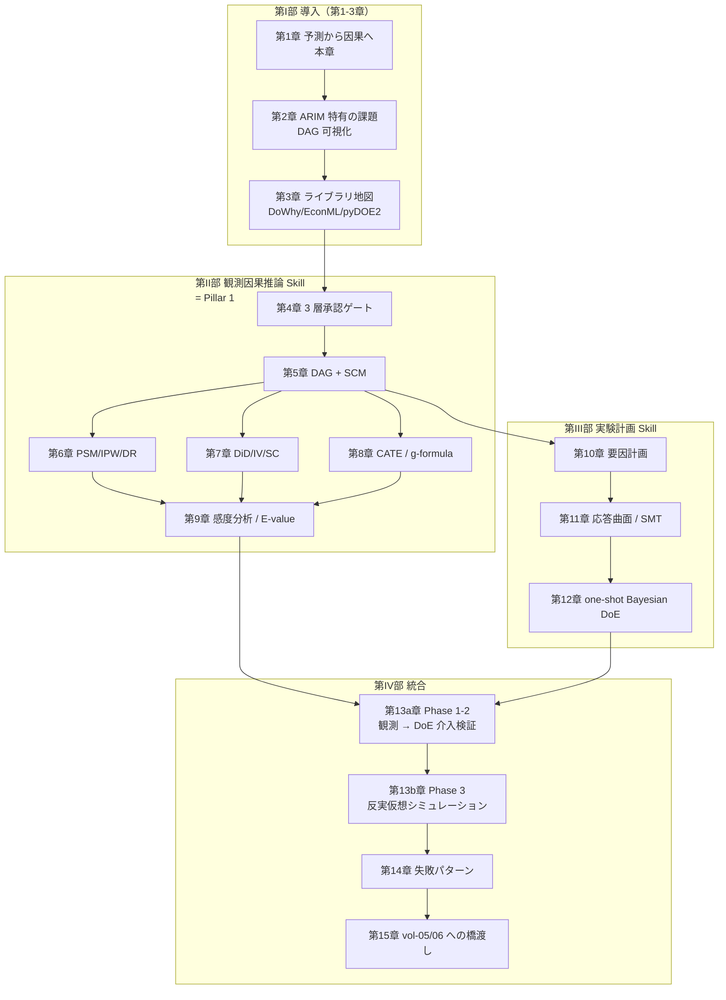

# 第1章 vol-01〜03 の Skill に何が足りないのか — 予測から "なぜ" と "もし" へ

> **本章の到達目標**
> - vol-01〜03 で作れた **予測 Skill の限界**を、ARIM 実データの具体場面で説明できる
> - **「相関 ≠ 因果」を Agentic 現場で守る**とはどういうことか、AI エージェントに何を許してよく何を許してはいけないかの境界を言える
> - ARIM データにおける **causal question（因果的問い）** の典型を 4 つ以上挙げられる
> - 本書のゴール（**2 pillars = 観測因果推論 Skill + 古典 DoE Skill / Advanced Capstone = 3 段の統合 Skill**）を自分の言葉で説明できる
> - **"予測 → 介入 → 反実仮想" のラダー**（Pearl の 3 階層）を材料実験文脈で説明できる
> - vol-04 で **扱わないこと**（逐次 BO は vol-05、生成モデル逆設計は vol-06、深層因果推論の理論、強化学習的介入自律実行、do-calculus 完全版、社会科学固有の識別戦略）を判別できる
>
> **本章で扱わないこと**
> - DAG の形式的定義（第5章）
> - 各種 estimator の実装（第6-8章）
> - 実験計画法の具体（第10-12章）
> - 3 層介入承認ゲートの実装詳細（第4章）

---

## 1.1 vol-01〜03 で作れた Skill と、その先にある壁

vol-01〜03 で読者は、AI エージェントに **予測を作らせる 3 段の Skill 体系**を築いてきました。

- **vol-01（Foundations）**：Skill という物理形態、MCP、データ契約、provenance、Human-in-the-loop、6 データ型テンプレート
- **vol-02（Stats/ML）**：**2 pillars = scikit-learn Skill / PyMC Skill**、CV 規律、階層モデル、事後予測、MCMC 診断
- **vol-03（Deep Learning）**：**2 pillars = 教師あり深層 + 転移学習 / 不確かさつき深層モデル**、Foundation Model の provenance、GPU 非決定性、深層特有の 4 承認ゲート（学習ジョブ / fine-tune / checkpoint 上書き / FM 更新）

これらはどれも、**「入力 $X$ から出力 $Y$ を予測する」** ラインの Skill でした——たとえば「XRD パターン $X$ から結晶相 $Y$ を分類する」「合成条件 $X$ から生成物物性 $Y$ を回帰する」「SEM 画像 $X$ から粒径分布 $Y$ を推定する」。

しかし、実際の ARIM の現場に立つと、**予測 Skill だけでは答えられない問い**が次々に出てきます。次のような問いを、あなたの Skill は解けますか？

- **前処理温度を 400 °C から 500 °C に上げると、生成物の結晶化度は本当に上がるのか？**（単に相関しているだけで、実は装置差が原因かもしれない）
- **オペレータ A の試料は成功率が高い。オペレータの手技が効いているのか、担当試料に偏りがあるのか？**
- **バッチ変更前後で欠陥密度が変わった。バッチ材料変更の因果効果はどれくらいか？**（時期的にプロセス条件も変わっているかもしれない）
- **もし温度を 50 °C 高くしていたら、今のサンプルはどうなっていたか？**（実際に温度を変えて再合成せずに答えたい）

これらは **予測 Skill だけでは解けません**。**介入したときの効果を推定する仕組み**と、**「もし違う条件だったら」を計算する仕組み**——因果推論——が必要になります。そして「次にどの条件で実験を打つか」を体系的に設計する仕組み——実験計画（DoE）——も。

> [!TIP]
> vol-01〜03 の Skill が **「観察されたパターン」に基づく判断**を出す仕事だとすれば、vol-04 の Skill は **「観察されたパターンの背後にある仕組み」に基づく判断**を出す仕事です。前者は「$P(Y \mid X)$ を推定する」、後者は「$P(Y \mid \mathrm{do}(X))$ を推定する」。$\mathrm{do}(\cdot)$ の意味は第5章で正確に定義しますが、ここでは **「介入を実際に行った場合」** と理解してください。

---

## 1.2 予測 Skill だけで詰まる 4 つの局面

具体的に、どんな場面で vol-01〜03 の予測 Skill だけでは詰まるのかを 4 つ挙げます。第2章以降で、それぞれをどう解くかを扱います。

### 局面 1：相関しているが介入すると期待通りに動かない（→ 第5-7章：識別戦略と観測因果推論）

例：**「前処理温度と生成物結晶化度の相関を予測 Skill が捕まえた。ではエージェントに『温度を上げよ』と提案させてよいか？」**

- **vol-01〜03 の Skill の限界**：$P(Y \mid X)$ を高精度で推定できても、それは **観測されたコホートの相関**にすぎません。装置ごとに温度と結晶化度の両方に影響する **未観測の交絡因子（例：装置の熱勾配特性）** があると、実際に温度だけを変えても予測通りには動きません
- **vol-04 の解**：DAG を明示し、backdoor 基準を満たす **adjustment set**（confounder のリスト）を確定してから、Propensity Score / IPW / Doubly Robust / DR-Learner / DML で **因果効果**を推定します（第5-6章）。DAG は Human が承認し（`dag_authorization`）、変数選択も Human 承認（`variable_selection_authorization`）を通します（第4章）

### 局面 2：バッチ・装置更新前後の効果を測りたい（→ 第7章：DiD / IV / Synthetic Control）

例：**「バッチ材料 B に切り替えた後、欠陥密度が下がった。バッチ変更の因果効果はどれくらいか？」**

- **vol-01〜03 の Skill の限界**：バッチ変更後のデータで予測 Skill を再学習すれば「性能が上がった」ことは言えても、**バッチ変更単独の効果**は分離できません。同時期にプロセス条件、オペレータの慣れ、季節要因も変化しているかもしれません
- **vol-04 の解**：**Difference-in-Differences（DiD）**、**Instrumental Variables（IV）**、**Synthetic Control** など、**準実験デザイン**の識別戦略で「バッチ変更単独の効果」を推定します（第7章）。**DiD / IV は主に `linearmodels`、Synthetic Control や Bayesian causal impact は `CausalPy`** で使い分けて Skill 化します

### 局面 3：反実仮想「もしそうしていたら」に答えたい（→ 第5・8・9章：SCM + counterfactual scope gate）

例：**「今の失敗試料について、もし温度を 50 °C 高くしていたら成功していたか？」**

- **vol-01〜03 の Skill の限界**：予測 Skill は $\hat{Y} = f(X = 500\,°C)$ を返せますが、これは **「同じ集団の中で温度 500 °C の試料の平均出力」** です。**「この特定の試料」** について「温度を実際に上げていたら」の反実仮想には答えていません
- **vol-04 の解**：**SCM（Structural Causal Model）** で反実仮想を計算し、**CATE（Conditional Average Treatment Effect）** は共変量条件下の平均効果として補助的に使います（第5章 SCM 節、第8章 CATE と g-formula 節、第9章 感度分析・scope gate 判定基準）。**CATE / uplift は「同じ共変量を持つ集団の平均処置効果」であり、単独では「この 1 試料の反実仮想」を確定しません**——単位反実仮想には SCM の構造方程式・consistency・外挿範囲判定が必要です。**外挿範囲を越えた反実仮想は禁じ手**——`counterfactual_scope_gate`（Mahalanobis 距離閾値 + CATE 予測分散閾値、カテゴリ・画像特徴は embedding 距離併用）で自動判定します（第8-9章）

### 局面 4：次に打つ実験を体系的に設計したい（→ 第10-12章：古典 DoE と one-shot Bayesian DoE）

例：**「5 因子×3 水準を全部組み合わせると 243 条件。予算で回せるのは 20 条件。どの 20 条件を選ぶべきか？」**

- **vol-01〜03 の Skill の限界**：探索空間の削減は SHAP や PDP で「効いていそうな変数」を可視化できても、**randomization と blocking が provenance に残る形で実験計画そのものを Skill 化する**枠組みはありません
- **vol-04 の解**：**要因計画（full/fractional factorial）**、**応答曲面法（CCD / Box-Behnken）**、**タグチメソッド**、および **one-shot Bayesian DoE**（事前分布 → 実験計画一括生成 → 事後解析）を Skill 化します（第10-12章）。randomization seed と blocking factor は provenance に残します

> [!NOTE]
> **逐次 BO（次にどの試料を測るか、を毎回動的に決める）は vol-04 では扱いません**（vol-05）。vol-04 の DoE は **一括計画（one-shot）** に scope を限定します。理由は第0章・0.7 節および §1.7 を参照。

これら 4 局面は、いずれも **「予測を出す」枠組みを破らないと解けません**。ここが vol-04 の主戦場です。

---

## 1.3 "予測 → 介入 → 反実仮想" のラダー（Pearl の 3 階層）

因果推論を学ぶときに最初に把握しておくべき地図が、Judea Pearl の **causal hierarchy（因果的階層、Ladder of Causation）** です。**vol-01〜03 の Skill はすべて Level 1 に属していた**——vol-04 で Level 2、Level 3 を扱います。

| Level | 名称 | 問いの型 | 数式表現 | vol-01〜03 で扱えた | vol-04 で扱う |
|---|---|---|---|:-:|:-:|
| **1** | **Association**（相関） | 「これを見たら何が言える？」 | $P(Y \mid X = x)$ | ✅ すべての予測 Skill | — |
| **2** | **Intervention**（介入） | 「これを実際にしたらどうなる？」 | $P(Y \mid \mathrm{do}(X = x))$ | ❌ 部分的にランダム化実験のみ | ✅ 第5-8章（観測因果推論）、第10-12章（DoE） |
| **3** | **Counterfactual**（反実仮想） | 「もし違う条件だったら、この特定の試料はどうなっていた？」 | $P(Y_{X=x'} \mid X=x, Y=y)$ | ❌ | ✅ 第5章（SCM）、第8章（CATE / g-formula）、第9章（scope gate 判定基準） |

**Level を混同することが、Agentic 現場での最大のリスク**です。エージェントは Level 1 の予測モデルを高精度で作れます——そして、そのまま Level 2 や Level 3 の主張に **暗黙に飛躍する**危険があります。「予測モデルが `Y = f(X)` を出せる → 温度を上げれば結晶化度が上がる」と言った瞬間に Level 1 → Level 2 の飛躍が起きています。この飛躍が正当化されるには、**DAG と identification 戦略が必要**——それが vol-04 の骨格です。

ARIM 実験文脈で 3 階層を並べると次のようになります。

| Level | 問い | ARIM 実データ例 | 必要な追加情報 |
|---|---|---|---|
| **Level 1** | 「温度 500 °C の試料は、平均でどれくらいの結晶化度？」 | XRD ピーク強度と温度の相関 | 観測データのみ |
| **Level 2** | 「温度を実際に 500 °C に上げると、どれくらい結晶化度が上がる？」 | 温度介入時の効果（ATE / ATT / CATE） | **DAG + adjustment set / IV / DiD / RDD** |
| **Level 3** | 「今 400 °C で失敗したこの試料が、もし 500 °C だったら成功していた？」 | 個別試料の反実仮想 | **SCM + 外挿範囲判定（`counterfactual_scope_gate`）** |

> [!IMPORTANT]
> Pearl の階層は「上位ほど強い主張」であり、**上位の主張を上位の道具なしで出すことは、Agentic 現場ではハルシネーションと同義**です。エージェントに「Level 1 の予測モデルの出力から Level 2 の介入提案を作らせる」ことは、原則として **`intervention_execution_authorization` ゲートを迂回した因果的主張** です——第4章で厳格に扱います。

---

## 1.4 「相関 ≠ 因果」を Agentic 現場で守るということ

「相関 ≠ 因果」は統計学の教科書の 1 行目に書かれる常識です。しかし **Agentic 現場では、エージェントの自然な出力パターンが自動的にこの原則を破ります**——そこが vol-04 で最も気を使う点です。

### 4 つの典型的な逸脱パターン

**逸脱 1：予測モデルの feature importance を「効いた要因」と表現する**

- **起こる場面**：エージェントに XGBoost / SHAP / PDP を回させた出力を、エージェントが「温度が最も効いた」と自然言語でまとめる
- **問題**：feature importance / SHAP は **予測精度への寄与**であって、**介入したときの効果**ではありません。装置差が真の driver でも、温度が装置差の proxy なら SHAP は温度に大きな値をつけます
- **vol-04 の対処**：Skill の出力仕様に **「予測寄与」と「因果効果」を混同する自然言語出力を禁止する契約**を書きます（第4章）。エージェントは feature importance を出してよいが、介入提案には結びつけない

**逸脱 2：予測モデルの逆問題を「最適条件の提案」と扱う**

- **起こる場面**：予測モデル $\hat{Y} = f(X)$ の入力空間を最適化して「$\hat{Y}$ が最大になる $X^*$」を求め、それを「最適合成条件」と提案する
- **問題**：これは Level 1 → Level 2 → Level 3 の 2 段飛ばしです。予測モデルは観測データ内の相関構造しか捉えていません——**外挿範囲外の $X^*$**、**未観測 confounder が別値をとる**、**介入時に他変数が同時に動く**、いずれも予測モデルは考慮していません
- **vol-04 の対処**：「最適条件提案」は **反実仮想 Skill（第13b章）** の成果物として扱い、**必ず `counterfactual_scope_gate` を通す + 介入実行承認を要求する** 契約に組み込みます

**逸脱 3：時系列・バッチ変更前後の変化を、変更単独の効果と主張する**

- **起こる場面**：バッチ変更前後で欠陥密度が下がった → 「バッチ変更が原因」とエージェントが結論する
- **問題**：時期的にプロセス条件やオペレータ習熟も変化しているかもしれません。**pre/post 比較だけでは変更単独の効果は識別できません**
- **vol-04 の対処**：**DiD / Synthetic Control / Interrupted Time Series** など準実験デザインを Skill 化し、**識別戦略を provenance に必ず記録**します（第7章）

**逸脱 4：エージェントが DAG を "勝手に" 修正する**

- **起こる場面**：エージェントが Skill 実行中に「この共変量は confounder ではなく mediator では？」と気づき、DAG を書き換えて adjustment set を変える
- **問題**：**因果推論の結論は DAG に依存する**——DAG を変えれば ATE の値も変わります。エージェントが DAG を無承認で書き換えると、**因果的主張が透明性を失います**
- **vol-04 の対処**：`dag_authorization` ゲート——**DAG の変更は必ず Human 承認**、承認 ID と日時を provenance に記録（第4章）

### Agentic 現場でのハルシネーション定義（vol-04 版）

vol-02〜03 では「学習データ範囲外での自信ある予測」や「モデル信頼度が低い出力の断定的表現」をハルシネーションと呼んでいました。**vol-04 では因果推論固有のハルシネーションを 3 つ追加**します。

| ハルシネーション種別 | 定義 | vol-04 の対処 |
|---|---|---|
| **Causal drift**（因果ドリフト） | エージェントが Skill 実行中に DAG を無承認で変更 | `dag_authorization` ゲート |
| **Hallucinated counterfactual**（外挿反実仮想） | 学習データの範囲外で反実仮想を "自信あり" で返す | `counterfactual_scope_gate`（第8-9章） |
| **Hallucinated identification**（識別戦略の混同） | エージェントが backdoor 前提の推定量を frontdoor / IV 前提の DAG に適用する（またはその逆） | `identification_strategy` を provenance で pin、Skill 変更時に必ず再認証 |

これらは vol-06 の「Hallucinated composition detection」（生成モデルが物理法則違反の材料を提案する）と同じ思想——**「動いているように見える」出力から異常を検出する仕組み**——を、因果推論文脈で展開したものです。

---

## 1.5 ARIM 実データにおける causal question の典型

vol-04 の Skill を「自分の研究テーマ」に転用するために、ARIM 実データで頻出する causal question を型別に整理します。第2章で自分のデータをこの分類に当てはめてもらいます。

### Type A：単一条件の介入効果（ATE / ATT）

| 問い | データ | 主な識別戦略 | 該当章 |
|---|---|---|---|
| 前処理温度を X °C 上げると、結晶化度は平均でどれくらい変わるか？ | 表形式・スペクトル型 | Backdoor（PSM/IPW/DR） | 第6章 |
| バッチ材料 B に切り替えると、欠陥密度は平均でどれくらい変わるか？ | 表形式・画像型 | DiD / Synthetic Control | 第7章 |
| **温度介入の効果**を推定するとき、装置差 A/B の混入をどう扱うか？ | 表形式・スペクトル型 | 装置差を confounder として調整 | 第6章 |
| 装置 A/B の測定バイアスそのものを推定したい | 表形式・スペクトル型 | 装置を treatment とし、標準試料・paired calibration・blocking で識別 | 第6・10章 |

### Type B：条件別の介入効果（CATE）

| 問い | データ | 主な識別戦略 | 該当章 |
|---|---|---|---|
| 高圧試料と低圧試料で、温度介入の効果は違うか？ | 表形式 | DR-Learner / DML | 第8章 |
| 装置ごとに、オペレータ差が効く効き方は違うか？ | 表形式・多モード | Meta-Learners（T/S/X-Learner） | 第8章 |
| SEM 画像特徴（表面粗さ etc）で条件付けたときの CATE | 画像 → 表 | 深層特徴を CATE 共変量として活用 | 第8章（vol-03 第8章の cross-ref） |

### Type C：因果構造の探索

| 問い | データ | 主な識別戦略 | 該当章 |
|---|---|---|---|
| どの前処理変数が結晶化度に直接効き、どれが装置差経由で効くか？ | 表形式 | causal-learn / pgmpy による探索型 DAG | 第5章 |
| 前処理温度は結晶化度に直接効くのか、mediator（粒径分布）経由か？ | 表形式 + 画像 | 媒介分析（frontdoor 基準は条件が揃う場合のみ、第5章で詳述） | 第5-6章 |

### Type D：反実仮想（Level 3）

| 問い | データ | 主な識別戦略 | 該当章 |
|---|---|---|---|
| もし温度を 50 °C 高くしていたら、この失敗試料は成功していたか？ | 表形式・複合 | SCM + g-formula + counterfactual_scope_gate | 第5・8・9・13b章 |
| もしオペレータ A ではなく B が担当していたら、成功率はどれくらい変わったか？ | 表形式 | SCM + g-formula（CATE / uplift は補助的な heterogeneity 推定） | 第8章 |

### Type E：介入設計（DoE）

| 問い | データ | 主な設計 | 該当章 |
|---|---|---|---|
| 5 因子 × 3 水準で 20 条件だけ試すなら、どの 20 条件を選ぶ？ | 実験計画 | Fractional factorial | 第10章 |
| 応答曲面を推定して最適条件を見つけたい | 実験計画 | CCD / Box-Behnken / SMT | 第11章 |
| 事前分布ありで実験計画を一括生成したい | 実験計画 | One-shot Bayesian DoE | 第12章 |

第2章で **「自分のデータで最も答えたい問いはどの Type か」** を分類することから始めます。

---

## 1.6 本書のゴール（2 pillars + Advanced Capstone）

vol-04 の合格ラインを、vol-02/03 と同じ **2 pillars + Advanced Capstone** の枠組みで再掲します。

### Pillar 1：観測データからの因果効果推定 Skill（第5-9章）

材料実験の前処理条件・装置設定・オペレータ差のいずれかについて、**因果効果推定 Skill を 1 つ以上作れる**こと。要件：

- [ ] **DAG が明示されている**（`causal_graph_uri` + `causal_graph_sha256` に pin）
- [ ] **identification 戦略が provenance に残っている**（backdoor / frontdoor / IV / DiD / RDD / synthetic control のどれか）
- [ ] **`positivity / SUTVA / consistency / exchangeability` の 4 仮定が declared / assessed で記録されている**（**"checked" と主張できるのは主に positivity**。SUTVA / consistency / exchangeability は declared / plausibility-assessed として記録）
- [ ] **unmeasured confounder への感度分析が estimand / outcome / design に応じて完了**（例：E-value、Rosenbaum bounds、DR/DML への sensitivity extension など。適用不可の場合は理由を provenance に記録）
- [ ] **refutation tests（placebo / random common cause / subset validation）が pass**（**pass は因果効果の証明ではなく、指定した反証シナリオに耐えたことを示す**）
- [ ] **3 層承認ゲート（`dag_authorization` / `variable_selection_authorization` / `intervention_execution_authorization`）が実装**

### Pillar 2：古典的実験計画（DoE）Skill（第10-12章）

要因計画・分割区画・応答曲面・タグチメソッド・one-shot Bayesian DoE のいずれかを **Skill 化して 1 つ以上作れる**こと。要件：

- [ ] **randomization seed が provenance に残る**（上書き禁止）
- [ ] **blocking factor が明示**（何を block したか、何を confounder として調整したか）
- [ ] **標本サイズ計算が provenance に記録**
- [ ] **DoE 実行承認ゲートが実装**（randomization plan / blocking / 標本サイズを Human が承認してから実行）

### Advanced Capstone：3 段の統合 Skill（第13a・13b章）

上記 2 本を統合した以下の複合 Skill を、ARIM 風合成実験データで完成させる：

**Phase 1（Ch13a）**：観測データで DAG を仮説化 → 因果効果推定（Pillar 1）
**Phase 2（Ch13a）**：仮説を検証する DoE を設計 → 介入検証（Pillar 2）
**Phase 3（Ch13b）**：反実仮想シミュレーションで最適条件を提案（`counterfactual_scope_gate` 通過必須）

**5 phase の Human 承認ゲート**：Phase 1 前に `dag_authorization`、Phase 1 中に `variable_selection_authorization`、Phase 2 前に DoE 実行承認、Phase 2 中に `intervention_execution_authorization`、Phase 3 中に `counterfactual_scope_gate` 判定と最終介入承認。

> [!TIP]
> 「1 つ以上作れる」というのは、**自分の研究テーマで、自分のデータで動く Skill を 1 つ作る**という意味です。合成データで練習を済ませた後、必ず自前データで再現してください。合成データで動く ≠ 実データで動く、は vol-01〜03 でも繰り返してきた原則です。

---

## 1.7 vol-04 で扱わないこと（明示）

vol-04 は **「観測データから因果を主張し、次の介入を提案する Skill」** に scope を絞ります。以下は将来巻や別書の候補として、道しるべを示すのみ。

| トピック | 扱わない理由 | 想定巻 / 参照 |
|---|---|---|
| **逐次ベイズ最適化（次にどの試料を測るか、を毎回動的に決める）** | 「観測 → 介入 → 反実仮想」ラダーとは独立軸。GP surrogate ベースの active learning は次巻の主題 | **vol-05**（第12章末尾で 1 ページ橋渡し） |
| **生成モデル・材料逆設計（VAE / GAN / Diffusion / MatterGen / CDVAE / DiffCSP）** | 「望む物性を持つ材料を生成する」は独立テーマ。反実仮想（Level 3）と逆設計は近縁だが、潜在空間からの生成は別軸 | **vol-06** |
| **深層学習ベースの因果推論の理論**（TARNet / CFR / Causal Forest 単独章） | 道具として ML-based estimator の中で扱う（EconML の DR-Learner ベース）——専用理論章は設けない | — |
| **強化学習・介入の逐次自律実行** | 「エージェントが実験を勝手に実行する」は本書のスコープ外。介入の実行は常に Human 承認 | 別書候補 |
| **形式的な do-calculus 完全版** | 既存教科書（Pearl 2009、Hernán & Robins）に譲る。本書は Skill 化と provenance に集中 | 参考文献参照 |
| **社会科学・疫学に固有の識別戦略の深堀り**（政策評価固有の RDD、自然実験ドメイン論） | 材料実験に特化。RDD / DiD の骨格は扱うが、ドメイン深堀りはしない | — |

---

## 1.8 vol-04 の章構成マップ（一覧）

第2章以降で扱う内容の全体像を、ここで一度俯瞰しておきます。

- **第I部（第1-3章）**：本章 + 第2章「ARIM 特有の課題」+ 第3章「ライブラリ地図」で導入を完結
- **第II部（第4-9章）= Pillar 1**：第4章「3 層承認ゲート」→ 第5章「DAG + SCM」→ 第6章「PSM/IPW/DR」→ 第7章「DiD/IV/SC」→ 第8章「CATE + g-formula」→ 第9章「感度分析」
- **第III部（第10-12章）= Pillar 2**：第10章「要因計画」→ 第11章「応答曲面」→ 第12章「one-shot Bayesian DoE」
- **第IV部（第13-15章）= 統合**：第13a章（Phase 1-2）→ 第13b章（Phase 3 反実仮想）→ 第14章「失敗パターン」→ 第15章「vol-05/06 への橋渡し」
- **付録 A-D**：A「Skill テンプレート集（DAG 提案 + 介入承認フロー worked example つき）」、B「因果 × DoE 固有の MCP パターン」、C「合成データ生成」、D「因果推論用語集」

---

## 1.9 本章のまとめ — 予測 Skill と因果 Skill の役割分担

| 観点 | vol-01〜03 の予測 Skill | vol-04 の因果 Skill / DoE Skill |
|---|---|---|
| **問い** | 「これを見たら何が言える？」 | 「これを実際にしたらどうなる？」「もし違う条件だったら？」 |
| **数式** | $P(Y \mid X)$ | $P(Y \mid \mathrm{do}(X))$、$P(Y_{X=x'} \mid X=x, Y=y)$ |
| **必要な追加情報** | 予測精度・不確かさ | **DAG + identification 戦略 + 4 仮定（positivity/SUTVA/consistency/exchangeability）** |
| **主な出力** | 予測値、分類ラベル、SHAP | **ATE / ATT / CATE、反実仮想 $Y_{X=x'}$、実験計画** |
| **エージェント自律範囲** | 学習ジョブ承認・fine-tune 承認 | **DAG 承認 / 変数選択承認 / 介入実行承認**（3 層） |
| **ハルシネーション定義** | 学習データ範囲外で自信あり | 上記 + **Causal drift / 外挿反実仮想 / 識別戦略の混同** |
| **主な失敗** | 汎化性能不足、GPU 非決定性、リーク | **DAG misspecification、collider を adjustment に含める、外挿反実仮想、refutation スキップ** |
| **fatal 条件（データ契約）** | 同一試料の train/test 混入 | 上記 + **backdoor 基準違反、positivity 違反、randomization seed 欠落** |

**予測 Skill は vol-04 でも捨てません**。むしろ、Pillar 1 の中で **outcome model / nuisance model として予測 Skill を再利用**します（DR-Learner の第一段階、DML の nuisance 推定など）。vol-04 は予測 Skill を **「因果効果推定の部品」として組み込む**ことで、Skill の階層を 1 段上げる巻です。

---

## 1.10 次章に進む前のチェックリスト

以下がすべて「はい」であれば、第2章「ARIM 特有の課題」に進めます。「うろ覚え」があれば、該当節に短く戻ってから第2章へ進んでください。

- [ ] Pearl の 3 階層（Association / Intervention / Counterfactual）を材料実験文脈で説明できる（→ §1.3）
- [ ] $P(Y \mid X)$ と $P(Y \mid \mathrm{do}(X))$ が違う理由を、装置差の例で言える（→ §1.2 局面 1、§1.3）
- [ ] Agentic 現場で「相関 → 因果」の逸脱が起きる 4 パターン（feature importance、逆問題、pre/post、DAG 修正）を列挙できる（→ §1.4）
- [ ] vol-04 固有のハルシネーション 3 種（causal drift / 外挿反実仮想 / 識別戦略の混同）を言える（→ §1.4）
- [ ] ARIM 実データの causal question 5 Type（ATE、CATE、DAG 探索、反実仮想、DoE）を分類できる（→ §1.5）
- [ ] 本書のゴール（Pillar 1 = 因果効果推定 Skill、Pillar 2 = DoE Skill、Advanced Capstone = 3 段統合）を言える（→ §1.6）
- [ ] 扱わないこと（逐次 BO は vol-05、生成モデル逆設計は vol-06、do-calculus 完全版など）を判別できる（→ §1.7）
- [ ] 第I〜IV部と付録 A-D の位置づけを俯瞰できる（→ §1.8）

第2章では、**あなた自身のデータ**に対して、**「どの causal question の Type か」「confounder は何か」「装置差は confounder か mediator か」「DAG は書けるか」**を実際に紙に書いてもらいます。第1章の理論的な地図を、第2章で具体的な足場に落とし込みます。

---

## 参考資料

### 本書内クロスリファレンス

**vol-01（Foundations）**
- [第3章 AI エージェント / MCP / Skill の三者関係](../vol-01/chapter-03.md)
- [第6章 Human-in-the-loop](../vol-01/chapter-06.md)
- [第7章 provenance と再現性](../vol-01/chapter-07.md)
- [第8章 データ契約](../vol-01/chapter-08.md)

**vol-02（Stats/ML）**
- [第4章 Skill 設計原則](../vol-02/chapter-04.md)
- [第7章 CV とデータリーク](../vol-02/chapter-07.md)
- [第11章 階層モデル](../vol-02/chapter-11.md)
- [第14章 失敗パターン](../vol-02/chapter-14.md)

**vol-03（Deep Learning）**
- [第4章 深層 × Agentic Skill 設計](../vol-03/chapter-04.md)
- [第8章 深層 calibration と reliability](../vol-03/chapter-08.md)
- [第9章 不確かさ（BNN posterior と E-value の対比が本巻 Ch9 と接続）](../vol-03/chapter-09.md)
- [第14章 深層 × Agentic 失敗パターン](../vol-03/chapter-14.md)

**vol-04（本巻）**
- [第0章 vol-01/02/03 の最小復習](./chapter-00.md)
- [第2章 ARIM 特有の課題](./chapter-02.md)（次章）
- [第4章 因果 × Agentic Skill の設計原則（3 層承認ゲート）](./chapter-04.md)
- [第5章 DAG と識別戦略（SCM と反実仮想の骨格を含む）](./chapter-05.md)
- [第13a・13b章 Advanced Capstone（3 段統合）](./chapter-13a.md)
- [付録A 因果 × Agentic Skill テンプレート集](./appendix-a.md)
- [付録D 因果推論用語集](./appendix-d.md)

### 外部参考

- Judea Pearl "The Book of Why" — 因果推論の思想的入門（3 階層の解説）
- Judea Pearl "Causality: Models, Reasoning, and Inference" (2009) — do-calculus の形式的取り扱い
- Hernán & Robins "Causal Inference: What If" — 因果推論の実務的教科書（無料 PDF: <https://miguelhernan.org/whatifbook>）
- Peters, Janzing & Schölkopf "Elements of Causal Inference" — 機械学習視点の因果推論
- Athey & Imbens "Machine Learning Methods That Economists Should Know About" — ML-based estimator のレビュー
- Montgomery "Design and Analysis of Experiments" — DoE の古典
- DoWhy <https://www.pywhy.org/dowhy/>
- EconML <https://econml.azurewebsites.net/>
- CausalPy <https://causalpy.readthedocs.io/>
- causal-learn <https://causal-learn.readthedocs.io/>
- pgmpy <https://pgmpy.org/>
- linearmodels <https://bashtage.github.io/linearmodels/>
- scikit-uplift <https://www.uplift-modeling.com/>
- pyDOE2 <https://github.com/clicumu/pyDOE2>
- SMT <https://smt.readthedocs.io/>
- GraphViz <https://graphviz.org/>

[^1-1]: Pearl の 3 階層は原著 (2018) "The Book of Why" 第1章に、より形式的な取り扱いは Pearl (2009) "Causality" の第1章にある。$P(Y \mid \mathrm{do}(X))$ と $P(Y \mid X)$ が異なる条件は第5章で backdoor 基準として扱う。
