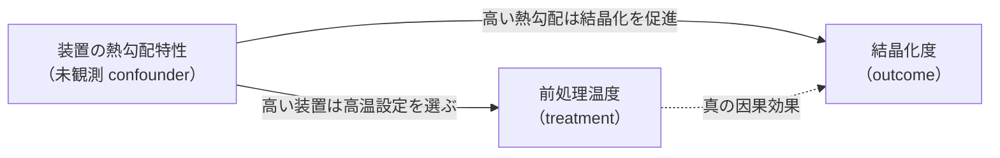
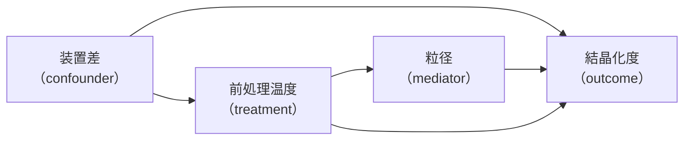
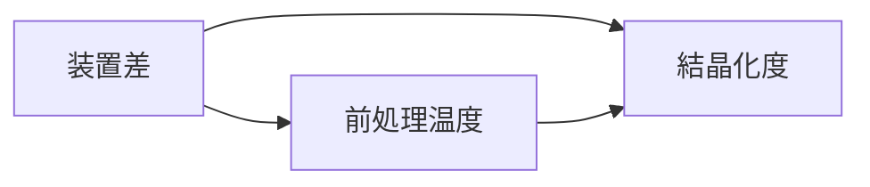
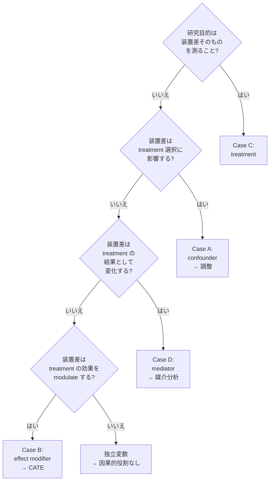

# 第2章 ARIM データで因果を主張するときの Agentic 特有の課題

> **本章の到達目標**
> - **観測研究における confounder** を、材料実験の 6 データ型それぞれで具体例つきで挙げられる
> - **DAG を紙とペンで描ける**（confounder / mediator / collider の割り付けを含む）
> - **装置差・オペレータ差・バッチ差**を、confounder・mediator・collider・effect modifier のどれとして扱うべきかを、研究目的に応じて判断できる
> - **少データ現場（ARIM の典型）** で因果的識別が困難になる 4 つの理由を言え、対処の道しるべを説明できる
> - **エージェントが DAG を勝手に書き換える 4 つの典型パターン**と、それぞれの承認ゲート（`dag_authorization` / `variable_selection_authorization`）＋ Skill 版数管理での防ぎ方を言える
> - 本書で使う **合成 causal 演習データ**（`data/synthetic-causal/`）の構造を理解し、自分の環境に取り込める
> - 章末演習で **「自分のデータ」の小規模 DAG（T-Y-C）を描き、Type A〜E に分類**した状態で第3章に進める
>
> **本章で扱わないこと**
> - DAG 記法の形式的定義（第5章）
> - Backdoor 基準・frontdoor 基準の証明（第5章）
> - 具体的な estimator の実装（第6-8章）
> - 3 層承認ゲートの実装コード（第4章）

---

## 2.1 「観測研究」とは何が違うのか — 予測と因果の分岐点

vol-01〜03 では、データの由来を **観測（observational）** と **実験（experimental）** に厳密に区別してきませんでした。予測 Skill の観点では、「学習データと展開先データの分布が近ければ動く」ことが重要で、そのデータが観測なのか実験なのかは二次的だったからです。

**vol-04 ではこの区別が決定的に重要になります。** 因果的主張の強さは、データの取り方に強く依存するからです。

### 3 つのデータ由来

| 由来 | 定義 | ARIM での例 | 因果的主張の強度 |
|---|---|---|---|
| **観測研究**（observational） | 研究者は介入せず、既に起きた事象を記録する | ARIM データポータルから取得した既存の実験ログ、装置ログ、過去プロジェクトの結果 | 弱い（DAG + 識別戦略が必要） |
| **準実験**（quasi-experimental） | 介入は起きるが、割付は研究者制御でない（外部要因で決まる） | バッチ材料の切り替え、装置更新、規格改定などの「時期による切れ目」 | 中（DiD / IV / RDD / Synthetic Control で識別可能） |
| **無作為化実験**（randomized） | 研究者が介入を割り付け、割付が確率的に決まる | DoE で設計した実験、ランダム化した合成条件試験 | 強い（randomization そのものが identification） |

**ARIM の主戦場は観測研究**です。プラットフォーム上にある大部分のデータは「過去に誰かが取った実験結果」であり、割付は研究者制御でありません。ここが本章で強調する **Agentic 特有の課題** の出発点になります。

> [!IMPORTANT]
> 「ARIM のデータで因果を主張する」の 9 割は **観測研究の枠組み**で行われる、と最初に腹をくくってください。**「実験室で無作為化実験をやり直せば済む」わけではない**——予算・試料・装置時間・倫理（生体・希少試料）の制約で、多くの因果的問いは観測データで挑むしかありません。**だからこそ Skill 化する価値がある**——DAG と識別戦略と provenance を Skill に埋め込めば、次の観測研究者が同じ罠を踏まなくて済みます。

### なぜ観測研究では因果的主張が難しいのか

観測研究では、**treatment（介入変数）** と **outcome（結果変数）** の両方に影響する **未観測の第三変数（confounder）** が存在する可能性があります。この confounder を無視すると、単純な相関が「介入効果」として過大／過小評価されます。

材料実験の典型例：



もし装置の熱勾配特性 $D$ が未観測なら、$T$ と $Y$ の相関には **$T \leftarrow D \rightarrow Y$ の backdoor path** が含まれます。予測 Skill は $D$ を暗黙に proxy として使っていて動きますが、**「$T$ を実際に上げたら $Y$ が上がる」は保証されません**。

vol-04 は、こうした未観測 confounder を **DAG で明示化**し、**backdoor 基準**（第5章）に基づいて adjustment set を選び、感度分析で結論の頑健性を測る Skill を構築します。

---

## 2.2 6 データ型別の confounder 実例

第0章・第1章で挙げた **6 データ型**（vol-01 第2章由来）それぞれで、**因果推論を難しくする典型 confounder** を具体例で確認します。第2章末の演習では、自分のデータでこの表を埋めてもらいます。

### 事前に 1 つ、worked mini-DAG

表 2.1 を読む前に、1 つ具体的な DAG を頭に置いておきます。

**問い**：前処理温度を上げると結晶化度は上がるか？



- **adjustment set**（総合効果を推定したいとき）：`{装置差}`
- **adjustment に入れない**：mediator の粒径（入れると **direct effect** のみが残り、total effect が消える）
- **DAG に描いても adjustment に入れない collider の例**：**「この試料が追加測定に回されたか」**——温度が異常でも、結晶化度が異常でも追加測定される（両者からの矢印が刺さる collider）

この 3 つの区別（confounder / mediator / collider）を持ったまま、表 2.1 を読んでください。

### 表 2.1：データ型 × 典型 confounder × treatment × outcome

| データ型 | よくある treatment | よくある outcome | 典型 confounder | 典型 mediator | 典型 collider（**selection**／adjustment 禁止） |
|---|---|---|---|---|---|
| **スペクトル型** | 前処理温度、雰囲気ガス | ピーク強度、半値幅 | 装置キャリブレーション、標準試料の由来、測定日 | 前駆体の分解生成物、粒径 | 「この試料が追加精密測定に回されたか」——異常な条件でも異常なスペクトルでも追加測定される |
| **クロマトグラム・時系列型** | 反応条件、触媒配合 | 生成物分布、収率 | バッチ差、季節（湿度）、担当オペレータ | 中間生成物濃度、反応温度プロファイル | 「この試料が再合成キューに回されたか」——treatment 異常と outcome 異常の両方が原因 |
| **画像・顕微鏡型** | 熱処理条件、成膜圧力 | 粒径分布、欠陥密度 | 装置解像度、電子線ドリフト、試料ドリフト、撮影時刻 | 表面粗さ、結晶配向 | 「この試料が SEM に加えて TEM でも撮られたか」——珍しい条件と特異な形態の両方が撮影選択に効く |
| **回折・散乱パターン型** | 合成温度、圧力、時間 | 格子定数、結晶相 | 装置角度精度、標準試料 offset、beam alignment | 格子歪み、応力 | 「Rietveld 精密化を実施したか」——treatment の希少性と outcome の異常性の両方が精密化選択に効く |
| **表形式・プロセス条件型** | 全プロセス変数の任意 | 全物性の任意 | オペレータ、ロット、季節、装置世代 | 中間物性値、副生成物量 | 「この試料が論文・DB に登録されたか」——「新規条件」と「良い物性」の両方が登録選択に効く |
| **マルチモーダル統合型** | 統合プロセス全体 | 統合物性 | 上記の各モダリティ固有 confounder が **同時に効く** | 各モダリティの中間表現 | 「複数モダリティで一貫解析キューに載ったか」——treatment・outcome の両方が観察選択に効く |

**読み方のコツ**：

- **confounder**：treatment と outcome の**両方**に因果的影響を及ぼす変数。DAG では $T \leftarrow C \rightarrow Y$
- **mediator**：treatment から outcome への因果を **経由する** 変数。DAG では $T \rightarrow M \rightarrow Y$
- **collider**：treatment と outcome の **共通の結果** となる変数。DAG では $T \rightarrow K \leftarrow Y$。**collider を adjustment に含めると collider stratification bias が生じる**（M-bias / butterfly bias はその特殊・拡張パターンとして第5章で扱う）
- **注意**：**post-treatment / downstream / derived な変数がすべて collider とは限りません**——mediator や outcome proxy、selection variable もあります。DAG 上の矢印を確定するまでは「調整候補」にしない、が実務原則です

> [!WARNING]
> エージェントに「効いていそうな変数を全部入れて回帰しろ」と指示すると、**collider や mediator が adjustment set に混入して、真の因果効果が歪みます**。「変数を多く入れる = 良い」は予測モデルの発想であり、**因果推論では逆**——「backdoor 基準を満たす最小の adjustment set」が正解です（第5章）。

---

## 2.3 装置差・オペレータ差・バッチ差の扱い — confounder か mediator か

ARIM 実験で最頻出の悩みが **「装置差・オペレータ差・バッチ差」の因果的位置づけ**です。これは研究目的によって答えが変わります。

### 装置差の 4 通りの位置づけ

同じ「装置差」でも、研究目的によって DAG 上の役割が変わります。

**Case A：装置差は confounder**

- 研究目的：「前処理温度の効果」を推定したい
- 装置差は temperature の選択にも、outcome にも影響する
- DAG：$D \rightarrow T$、$D \rightarrow Y$ → **backdoor path**
- 対処：装置差を **adjustment set に含める**（propensity model にも入れる）



**Case B：装置差は effect modifier（heterogeneity source）**

- 研究目的：「装置ごとに前処理温度の効果が違うか」を知りたい
- 装置差は temperature の効果の大きさを変える
- DAG：$T \rightarrow Y$、$D$ は $T \rightarrow Y$ の効果を modulate する
- 対処：装置別に **CATE を推定**（第8章 Meta-Learners）

**Case C：装置差は treatment そのもの**

- 研究目的：「装置 A と装置 B の測定バイアスの差」を知りたい
- 装置差 = treatment
- DAG：$D \rightarrow Y$（$D$ が treatment）
- 対処：**同一標準試料を両装置で測って paired comparison**、または DoE で装置を factor 化（第10章）

**Case D：装置設定・装置状態は mediator**

- 研究目的：「新しい標準操作手順（SOP）の効果」を推定したい
- 新 SOP は装置設定を変える → 装置設定が outcome に効く
- DAG：$T \rightarrow D_{\text{setting}} \rightarrow Y$（$D_{\text{setting}}$ は $T \rightarrow Y$ の経路上）
- 対処：**mediator を adjustment に含めると "直接効果" のみが残り、SOP の総合効果が歪む**——媒介分析（第5章）で indirect / direct 効果を分解
- **注意**：**固定された装置 ID そのものは通常 mediator ではない**。mediator になり得るのは、SOP によって変化する **装置設定・校正状態・測定プロトコル** です

### 判断フロー



**オペレータ差・バッチ差・季節差**も同じ 4 case の判断フローで整理できます。

> [!TIP]
> 「装置差は confounder だから調整する」は **半分正しく、半分誤り**です。研究目的が変われば同じ装置差が mediator にも treatment にもなります。**エージェントには「調整して」と指示する前に、DAG 上の役割を人間が先に決める**——これが `variable_selection_authorization` ゲート（第4章）の中身です。

---

## 2.4 少データ現場での識別困難性 — ARIM の典型

ARIM の因果推論は、社会科学や疫学と比べて **標本サイズが桁違いに小さい**——数千サンプルではなく **数十〜数百サンプル**が典型です。この少データ現場で観測因果推論に挑むとき、4 つの困難性が同時に襲ってきます。

### 困難 1：positivity 違反が起きやすい

**positivity（正値性、common support）** とは、「adjustment set の各値において、treatment が両群（介入群と対照群）に一定確率で観察される」という仮定です。二値 treatment では $P(T = 1 \mid X = x) \in (0, 1) \; \forall x$。**連続 treatment**（温度・圧力・時間・濃度など ARIM の主戦場）では、二値定義そのままでは使えません——**各 $X = x$ において、介入したい範囲の温度・圧力に観測密度が存在すること**（generalized propensity / conditional density の common support）が必要です。

- **少データでの現れ方**：装置 A では常に高温を選ぶ、装置 B では常に低温を選ぶ——このとき「装置 = A かつ低温」「装置 = B かつ高温」の観察がない
- **結果**：装置ごとの propensity score が 0 または 1 に張り付き、IPW 重みが発散
- **対処**：propensity score のトリミング（`positivity: assessed, trimming: enabled` を provenance に）、または identification 戦略を DiD / IV に切り替え（第7章）

### 困難 2：unmeasured confounder が閉じ込められない

- **少データでの現れ方**：backdoor path を閉じるに必要な変数を全て測ってはいない、ドメイン知識で proxy を選ぶしかない
- **対処**：`unmeasured_confounder_sensitivity`（E-value、Rosenbaum bounds、DR/DML sensitivity extension など）を必ず provenance に記録。**「感度分析なしの因果効果」は Skill として拒否**（第4章 fatal 条件）

### 困難 3：CATE 推定の統計的不安定性

- **少データでの現れ方**：DR-Learner、DML の nuisance model（treatment model と outcome model）が overfit する
- **対処**：**cross-fitting**（第6章）、正則化された第一段階モデル、**外挿範囲を `counterfactual_scope_gate` で厳しく判定**（第8章）

### 困難 4：refutation test の power が低い

- **少データでの現れ方**：placebo test を回しても、標本が少なく差が有意にならず「pass」——しかし power が足りないだけかもしれない
- **対処**：refutation の統計的 power を計算し、`refutation_tests_passed` フィールドに **power も併記**。**「power 不足での pass は pass ではない」**——第9章

### 識別仮定 × ARIM 固有の破綻モード

positivity 以外の 3 仮定も ARIM 現場では容易に破綻します。§0.6 の 4 仮定を ARIM 特有の失敗モードに落とし込むと以下のようになります。

| 仮定 | ARIM での典型的失敗モード | 最初のチェック |
|---|---|---|
| **positivity** | 装置 A ばかりで高温、装置 B ばかりで低温——overlap 不足 | propensity score のトリミング前分布、conditional density |
| **SUTVA**（干渉なし） | **同一炉での複数試料合成が互いに影響**（queue effects、汚染、バッチ間 cross-talk） | batch/run ID の分布、複数試料同時処理の記録 |
| **consistency** | 「500 °C」が **昇温速度・雰囲気・炉ゾーン・SOP 版で異なる中身**を持つ | SOP 版 / ramp rate / atmosphere のメタデータ |
| **exchangeability** | **試料選択バイアス**（成功しそうな条件だけ実験、失敗は捨てる） | 感度分析（E-value 等）、drop-out ログ |

**「識別が成立するか」は 4 仮定の掛け算**——1 つでも破綻すれば因果的主張は正当化できません。少データ ARIM の Skill は、**4 仮定それぞれの破綻可能性を declared / assessed で provenance に記録する契約**を最初から持ちます。

### 少データ対処の道しるべ

| 困難 | 主な対処 | 該当章 |
|---|---|---|
| positivity 違反 | Trimming、識別戦略の切り替え | 第6・7章 |
| unmeasured confounder | E-value、Rosenbaum bounds、代替感度分析 | 第9章 |
| CATE 統計的不安定 | Cross-fitting、正則化、scope gate | 第6・8章 |
| refutation の低 power | Power 計算、複数 refutation の組み合わせ | 第9章 |
| SUTVA / consistency 破綻 | メタデータ拡張、data contract の再交渉 | 第4・14章 |

> [!IMPORTANT]
> 少データ現場での因果推論は、**「無理な問いには No と答える Skill」を作ること**が最も重要です。予測 Skill は「精度が低くても数値は返す」でよかった——因果推論 Skill は「識別が成立しないなら数値を返さない」が正解です。fatal / warning / flag の 3 段階チェック（第0章 §0.6）は、vol-04 では **「識別成立可否」に厳しく適用**されます。

> [!TIP]
> 少データ・階層構造・不確かさの明示的定量化が要求される場面では、**第3章 §3.4 の Bayesian causal / PyMC 接続**が有力な選択肢になります——vol-02 で扱った階層モデル資産をそのまま因果効果の事前分布・階層構造として再利用できます（第7章 CausalPy、第12章 Bayesian DoE で展開）。

---

## 2.5 エージェントが DAG を「勝手に」書き換える 4 つの典型

vol-04 の Agentic 特有リスクの筆頭は、**エージェントが Skill 実行中に DAG を無承認で書き換える**ことです。第1章 §1.4 で **causal drift** と呼んだハルシネーションの実体を、4 つの典型パターンで具体化します。

### パターン 1：エージェントが「変数を追加すれば予測精度が上がる」と判断して DAG に collider を挿入

- **状況**：Skill 実行中、エージェントが outcome model の R² を上げるために、`「この試料が追加測定に回されたか」` などの selection collider を共変量に追加
- **問題**：この変数は treatment と outcome の共通結果（collider）——**adjustment に入れると collider stratification bias が発生**（M-bias / butterfly bias はその特殊・拡張パターンとして第5章で扱う）
- **防ぎ方**：`variable_selection_authorization` ゲートで **共変量追加を必ず Human に問う**。Skill の入出力契約に「共変量は事前定義された `confounders_declared` リストからのみ選ぶ」条項

### パターン 2：エージェントが探索型 DAG（causal-learn）の出力を無承認で採用

- **状況**：causal-learn の PC アルゴリズムが提案した DAG を、エージェントが `dag_of_record_uri` を上書きして採用
- **問題**：探索型 DAG は **assumption（faithfulness / no unmeasured confounder / linearity 等）に強く依存**——ドメイン知識を持つ Human の承認なしに採用してよい対象ではない
- **防ぎ方**：`dag_authorization` ゲートで **DAG 変更を必ず Human に問う**。「エージェントは DAG を提案する Skill、Human は承認する Skill」の役割分離（第5章）

### パターン 3：エージェントが「mediator を confounder に格上げ」

- **状況**：$T \rightarrow M \rightarrow Y$ の mediator $M$ を、エージェントが「effect を過大評価しているから」という理由で adjustment に追加
- **問題**：mediator を adjustment に入れると **direct effect のみが残り、総合効果（total effect）が観察されなくなる**——これは意図した推定量と食い違う
- **防ぎ方**：Skill の provenance に **`estimand_type`（total effect / direct effect / indirect effect）** を必ず記録。エージェントの adjustment 提案は estimand と整合するかを自動チェック

### パターン 4：エージェントが identification 戦略を "silently" 変更

- **状況**：backdoor 前提の Skill が動かない（positivity 違反）→ エージェントが Skill 内部で IV に切り替えて数値を返す
- **問題**：IV は別の identification 仮定（instrument の関連性、除外可能性）を要求する——**無承認の切り替えは "hallucinated identification"**（第1章）
- **防ぎ方**：`identification_strategy` を provenance に pin し、**変更時は `dag_authorization` を経由した Skill の再認証**（新しい Skill バージョンとして扱う）。エージェントは承認済みの Skill を切り替えられるが、Skill 内部で戦略を変えることは禁止（第3章 §3.5、第4章）

### 4 パターンと承認ゲートの対応

| パターン | 主に迂回されるゲート | 検知フィールド |
|---|---|---|
| 1. Collider を追加 | `variable_selection_authorization` | `confounders_declared` との差分 |
| 2. 探索 DAG を無承認採用 | `dag_authorization` | `dag_of_record_sha256` の変化 |
| 3. Mediator を格上げ | `dag_authorization` + `variable_selection_authorization`（変数の役割変更は DAG 上の意味も変える） | `estimand_type` との整合性、DAG diff |
| 4. Identification 戦略の silent 切替 | `dag_authorization` + Skill 版数管理（第4章） | `identification_strategy` の変化 |

いずれも **provenance フィールドの変化を diff として検出できる**設計になっています——vol-03 で導入した `agent_authorization` の思想を、因果推論固有のフィールドで具体化したものです。

---

## 2.6 演習用データセット — 合成 causal データの構造

本書のハンズオンで使う **合成 causal データ**を紹介します。**真の DAG と真の ATE / CATE が既知**なので、Skill が推定した値と真値の乖離を検証できます。

### `data/synthetic-causal/` の構造

```
data/synthetic-causal/
├── README.md                     # データ由来、真の DAG、真の ATE/CATE
├── dags/                         # 各シナリオの真の DAG（GraphViz .dot）
│   ├── scenario_A_backdoor.dot
│   ├── scenario_B_did.dot
│   ├── scenario_C_iv.dot
│   ├── scenario_D_mediation.dot
│   ├── scenario_E_collider.dot
│   └── scenario_F_multimodal.dot
├── tabular/                      # 6 データ型のうち表形式主軸
│   ├── train.parquet
│   ├── holdout.parquet
│   └── ground_truth_ate.json    # 真の ATE / CATE / heterogeneity 情報
├── spectral/                     # スペクトル型小規模例
├── image/                        # 画像型小規模例
├── xrd/                          # 回折型小規模例
├── timeseries/                   # 時系列型小規模例
├── multimodal/                   # マルチモーダル統合型小規模例
└── generation_scripts/          # 主要データの生成スクリプト（再現用）
    ├── generate_tabular.py       # 表形式（scenario A-E）
    ├── generate_multimodal.py    # scenario F
    ├── generate_small_modalities.py  # spectral/image/xrd/timeseries 小規模例
    └── requirements.txt
```

- **主軸は表形式**——第5-12章の主要演習は表形式データで行います
- **他 5 データ型は "小規模例"**——第2章末の演習、第8章の深層特徴 CATE、第13a章 Capstone で使います

### 6 つのシナリオ

| シナリオ | 主な学習ポイント | 使用章 |
|---|---|---|
| **A：Backdoor 調整** | 装置差を confounder として調整 → 真の ATE 復元 | 第6章 |
| **B：DiD 準実験** | バッチ変更前後の DiD で介入効果を識別 | 第7章 |
| **C：IV** | 装置キャリブレーション日を instrument に（**exclusion restriction が成り立つよう合成**。実データでは calibration date は測定品質・オペレータ習熟に直接効く可能性があるため IV 候補としては要注意——第7章） | 第7章 |
| **D：Mediation** | 媒介分析での direct / indirect 効果の分解（**frontdoor 識別は第5章で条件が揃う場合として別扱い**） | 第5-6章 |
| **E：Collider** | Collider を adjustment に入れた場合の collider stratification bias | 第5章 |
| **F：マルチモーダル confounder** | スペクトルと画像の両方が confounder | 第8章 |

**真の ATE / CATE 値**：全シナリオで真値を JSON で配布します。Skill が推定した値との差を **|estimate - truth| / |truth|** で評価し、感度分析結果と併せて `evaluation.json` に記録します。

### データ入手方法

<!-- TODO: 出版時に公式リポジトリ URL に置換 -->
```bash
git clone https://github.com/<org>/synthetic-causal-arim data/synthetic-causal
cd data/synthetic-causal
pip install -r generation_scripts/requirements.txt
python generation_scripts/generate_tabular.py --seed 42 --n 500
```

- `--seed 42` を **本書全体で標準**とします（provenance の `random_seed` と合致）
- `--n 500` は表形式のデフォルト。少データ現場を体感したいときは `--n 100`

> [!NOTE]
> 合成データの真の DAG は **本書リポジトリでは伏せず公開**します。目的は「Skill が真の因果効果をどれだけ復元できるか」を検証すること——「エージェントが真の DAG を推測できるか」ではありません。実データ演習では真の DAG は不明で、その状況は第13a章 Capstone で扱います。

---

## 2.7 章末演習 — 「自分のデータ」で DAG を描く

第3章に進む前に、以下の演習を実施してください。**紙とペンで描くことを推奨**します（エージェントに描かせないでください——`dag_authorization` の練習を兼ねます）。

### 演習 2.1：小規模 DAG（T-Y-C）のスケッチ

自分の研究テーマから、**treatment 1 個、outcome 1 個、confounder 候補 1〜3 個**を挙げてください。DAG を紙に描き、以下を明記：

- [ ] treatment $T$ の変数名と物理的意味
- [ ] outcome $Y$ の変数名と物理的意味
- [ ] confounder 候補 $C_1, C_2, \ldots$ とその物理的経路
- [ ] mediator 候補があれば $M$
- [ ] collider 候補があれば $K$（**adjustment に入れないこと**）
- [ ] **$T, Y, C_i, M, K$ の間の矢印を明示的に描く**（DAG の可読性）
- [ ] **adjustment set**：`{ ... }`（backdoor 基準を満たす最小集合）
- [ ] **adjustment に入れない mediator**：`{ ... }`
- [ ] **adjustment に入れない collider**：`{ ... }`
- [ ] **目標 estimand**：total effect / direct effect / indirect effect のいずれか

### 演習 2.2：装置差・オペレータ差・バッチ差の分類

自分の実験環境で「差」が出る要因を 3 つ挙げ、§2.3 の 4 case 判断フローで **Case A/B/C/D** のどれかを判定してください：

- [ ] 要因 1（例：装置差）— Case ___
- [ ] 要因 2（例：オペレータ差）— Case ___
- [ ] 要因 3（例：バッチ差）— Case ___

### 演習 2.3：Type A〜E への分類

第1章 §1.5 の 5 Type のうち、**自分のデータで最も答えたい問いはどの Type か**を選び、その問いを 1 文で書いてください：

- [ ] 選んだ Type（A: ATE / B: CATE / C: DAG 探索 / D: 反実仮想 / E: DoE）
- [ ] 具体的な問い（1 文）

### 演習 2.4：少データ困難性の自己診断

演習 2.1 で描いた DAG について、§2.4 の 4 困難のうち **最も自分に効きそうな困難** を 1 つ選び、対処の初手を書いてください：

- [ ] 最も効きそうな困難（positivity / unmeasured confounder / CATE 不安定 / refutation 低 power のいずれか）
- [ ] 初手（1 文）

### 提出フォーマット（推奨）

`docs/exercises/ch02_my_causal_map.md` に保存してください。第13a章 Capstone で、この最初の紙とペンの DAG が、そのプロジェクトの成果物に化けます。**vol-01〜03 では紙メモは「あってもなくてもよい」でしたが、vol-04 では紙 DAG は成果物の一部**——`dag_of_record_uri` の起点になります。

---

## 2.8 次章に進む前のチェックリスト

以下がすべて「はい」であれば、第3章「因果推論と実験計画のライブラリ地図」に進めます。

- [ ] 観測研究 / 準実験 / 無作為化実験の 3 由来を、ARIM 例で 1 個ずつ挙げられる（→ §2.1）
- [ ] confounder / mediator / collider の DAG 図を、材料実験の具体例で描ける（→ §2.2）
- [ ] 装置差の 4 case（confounder / effect modifier / treatment / mediator）を、判断フローで分類できる（→ §2.3）
- [ ] 少データ現場での 4 困難（positivity / unmeasured confounder / CATE 不安定 / refutation 低 power）を挙げ、対処の道しるべを言える（→ §2.4）
- [ ] エージェントが DAG を勝手に書き換える 4 パターンを列挙できる（→ §2.5）
- [ ] 合成 causal データの 6 シナリオを言え、`data/synthetic-causal/` の入手コマンドを覚えている（→ §2.6）
- [ ] 演習 2.1〜2.4 を完了し、`docs/exercises/ch02_my_causal_map.md` に保存済み（→ §2.7）

第3章では、**DoWhy / EconML / CausalPy / pgmpy / causal-learn / linearmodels / scikit-uplift / pyDOE2 / SMT** の使い分けと、**エージェントに各ライブラリを叩かせる際の権限マップ**を提示します。第2章で「自分の問い」を描いたので、第3章では「その問いに使う道具」を選ぶことになります。

---

## 参考資料

### 本書内クロスリファレンス

**vol-01（Foundations）**
- [第2章 6 データ型](../vol-01/chapter-02.md)
- [第8章 データ契約](../vol-01/chapter-08.md)

**vol-02（Stats/ML）**
- [第4章 Skill 設計原則（Ch2 の演習 DAG は Skill 契約の起点）](../vol-02/chapter-04.md)
- [第7章 CV とデータリーク（少データでの分割規律）](../vol-02/chapter-07.md)

**vol-03（Deep Learning）**
- [第4章 深層 × Agentic Skill 設計（4 承認ゲートと本巻の 3 層拡張の対比）](../vol-03/chapter-04.md)
- [第14章 深層 × Agentic 失敗パターン（causal drift の親戚）](../vol-03/chapter-14.md)

**vol-04（本巻）**
- [第0章 vol-01/02/03 の最小復習](./chapter-00.md)
- [第1章 予測から "なぜ" と "もし" へ](./chapter-01.md)
- [第3章 ライブラリ地図（次章）](./chapter-03.md)
- [第4章 3 層承認ゲート](./chapter-04.md)
- [第5章 DAG と識別戦略](./chapter-05.md)
- [第6章 PSM / IPW / DR](./chapter-06.md)
- [第7章 DiD / IV / Synthetic Control](./chapter-07.md)
- [第8章 CATE と g-formula](./chapter-08.md)
- [第9章 感度分析](./chapter-09.md)
- [第13a章 Advanced Capstone Phase 1-2](./chapter-13a.md)
- [付録A Skill テンプレート](./appendix-a.md)
- [付録C 合成データ生成](./appendix-c.md)
- [付録D 因果推論用語集](./appendix-d.md)

### 外部参考

- Hernán & Robins "Causal Inference: What If" — 観測研究における confounder / positivity / consistency の実務的定義（無料 PDF: <https://miguelhernan.org/whatifbook>）
- Pearl "Causality" (2009) — Collider / M-bias / butterfly bias の形式的取扱い
- VanderWeele "Explanation in Causal Inference: Methods for Mediation and Interaction" — 媒介分析と mediator の取扱い
- Rosenbaum "Observational Studies" — 観測研究における感度分析の古典
- causal-learn <https://causal-learn.readthedocs.io/> — 探索型 DAG の PC アルゴリズム
- pgmpy <https://pgmpy.org/> — ベイジアンネット表現

[^2-1]: 「装置差は confounder か mediator か」の判断は、社会科学における「変数の役割は分析目的に依存する」原則（e.g., VanderWeele 2015）の材料実験版である。**同じ変数が Case A/B/C/D で役割を変える**ことは因果推論の初学者が最も混乱する点で、第5章で改めて DAG 記法として厳密に扱う。
