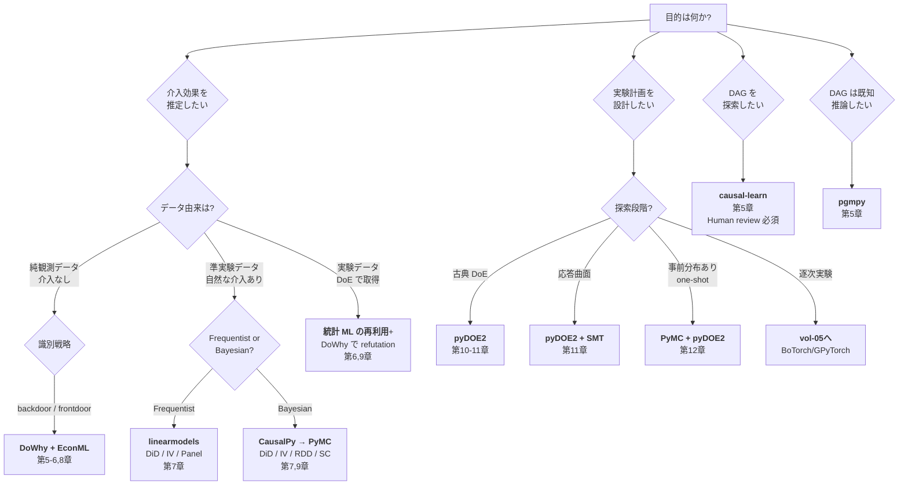

# 第3章 因果推論と実験計画のライブラリ地図 — Agentic 使い分け

> **本章の到達目標**
> - 因果推論の主要 Python ライブラリ（**DoWhy / EconML / CausalPy / pgmpy / causal-learn / linearmodels**）の**責務と守備範囲**を 1 行で説明できる
> - 実験計画の主要 Python ライブラリ（**pyDOE2 / SMT**）の位置づけを説明でき、vol-05（BO・逐次実験）で追加になるものと切り分けられる
> - Bayesian causal 系（**CausalPy → PyMC**）の接続点を理解し、vol-02 第 9-12 章の階層モデル資産を再利用する道筋を持てる
> - **エージェントがどのライブラリまで自律的に叩けるか**を、3 層承認ゲート（`dag_authorization` / `variable_selection_authorization` / `intervention_execution_authorization`、第4章）と対応づけて決められる
> - 章末で **「自分の研究テーマに対して、まずどのライブラリで Skill を作るか」**を 1 枚のフローチャートで判断できる
>
> **本章で扱わないこと**
> - 各ライブラリの API 詳細（付録 B のチートシートと第 5-12 章のハンズオン）
> - Skill 実装コード（第 4 章と付録 A のテンプレート）
> - 逐次実験計画（BO の acquisition）用ライブラリ（vol-05）
> - 生成モデル・逆設計用ライブラリ（vol-06）

---

## 3.1 なぜ「ライブラリ地図」を先に描くのか

第1章で **予測 → 介入 → 反実仮想** のラダーを、第2章で **DAG と Agentic 特有の課題**を見てきました。これで「何をやりたいか」の輪郭は掴めたはずですが、実装に入る前に **もう一段の整理**が必要です。

**なぜか？** 因果推論と DoE の Python 生態系は、vol-01〜03 で扱った予測系（scikit-learn / PyTorch / PyMC）と比べて **役割分担が明示的**で、ライブラリを跨いだ「使い分け」が Skill 設計そのものを規定するからです。

- **DoWhy は "identification + refutation" の司令塔**、estimator は自作 or EconML に委譲する
- **EconML は "推定器の実装"** に集中し、identification や refutation はほとんど関知しない
- **CausalPy は Bayesian 準実験（DiD / IV / RDD / Synthetic Control）を PyMC 上で動かす**、DoWhy とは別系統
- **pgmpy は "ベイジアンネットの構造"**、causal-learn は "DAG 探索"、両者は近縁だが目的が違う
- **pyDOE2 は "古典 DoE"、SMT は "surrogate + Kriging"**、Bayesian DoE は PyMC で自作するか SMT を組み合わせる

この分業は、「1 つの巨大ライブラリで全部やる」設計ではなく、**「Skill ごとに最適な library stack / route を 1 つ選ぶ」設計**を促します（`library_stack` の詳細は §3.7）。エージェントに与える権限も、この分業に沿って設計するのが自然です。

**本章のゴール**：ライブラリの選定を「エージェントが自律的に切り替えていい範囲」と「Human が承認する範囲」に区切って、第4章以降の Skill 設計に橋渡しすることです。

---

## 3.2 因果推論ライブラリ 6 種の責務マップ

まず 1 表で全体像を掴みます。

### Table 3.1：因果推論ライブラリ責務マップ

| ライブラリ | 主な責務 | 得意領域 | 依存関係 | vol-04 での位置 |
|---|---|---|---|---|
| **DoWhy** | **Identification + Refutation の司令塔**。指定された DAG と変数役割に基づいて **識別可能性と候補 adjustment set を判定**し、refutation ツール（`placebo_treatment_refuter`, `random_common_cause`, `data_subset_refuter` 等）を提供 | 観測データからの ATE / ATT 推定パイプラインの骨格 | networkx, pandas, EconML（optional） | **第5・6・9章の主軸** |
| **EconML** | ML-based estimator の実装。DR-Learner / DML / Meta-Learners (S/T/X/DR/R) / Causal Forest / DeepIV 等 | CATE 推定、high-dimensional confounder | scikit-learn；深層 estimator（DeepIV 等）は estimator ごとに追加バックエンド | **第6・8章の主軸** |
| **CausalPy** | Bayesian 準実験。DiD / IV / RDD / Synthetic Control / Interrupted Time Series を PyMC ベースで実装 | 少データ・階層構造・不確かさ定量化を伴う準実験 | PyMC, ArviZ | **第7・9章、vol-02 との橋渡し** |
| **pgmpy** | ベイジアンネットの構造と推論。DAG を確率グラフとして扱い、条件付き分布 / MAP / do-operator を計算 | 明示的な DAG がある小-中規模データ、教育用途 | networkx, pandas | **第5章（DAG 記法）、付録 A** |
| **causal-learn** | DAG 探索アルゴリズム。PC / FCI / GES / LiNGAM 等 | 事前知識が乏しい探索的段階（**Human review 必須**） | numpy, scipy | **第5章、第14章（探索の失敗）** |
| **linearmodels** | 線形計量経済モデル。**Panel data / DiD / IV の frequentist 実装** | frequentist DiD, 2SLS IV, fixed-effects panel | pandas, statsmodels | **第7章（CausalPy と並置）** |

**Table 3.1 の読み方（3 つの束）**：

1. **DoWhy + EconML の束**：DoWhy が identification と refutation を、EconML が estimator を担当する。両者は API レベルで結合しており、`dowhy.CausalModel.estimate_effect(..., method_name="backdoor.econml....", method_params=...)` の形で EconML の Learner を差し込める
2. **CausalPy + linearmodels + PyMC の束**：準実験（DiD / IV / RDD / Synthetic Control）を、**frequentist（linearmodels）と Bayesian（CausalPy）で並置**する。vol-02 で PyMC を使った読者は CausalPy に自然に接続できる
3. **pgmpy + causal-learn の束**：DAG そのものを扱う。**pgmpy は "既知の DAG を推論する"、causal-learn は "DAG を探索する"** で、両者は補完関係

**表に載せていないライブラリの位置**：

- **scikit-uplift**：uplift modeling（材料選抜への転用文脈）は **第8章 CATE 応用節に限定**し、汎用の因果ライブラリとしては Table 3.1 から除外
- **dowhy-gcm / cdt (causal-discovery-toolbox)**：v0.2 outline では明示責務が薄く、vol-04 の scope 外とします

### なぜ 1 ライブラリで済まないのか

「1 つの巨大ライブラリで全部やる」設計もあり得ますが、**因果推論では意図的に分業されています**——理由は 3 つ：

- **Identification と Estimation は本質的に別問題**：DAG が変われば estimator も変わるが、estimator が変わっても DAG は変わらない。**DoWhy が identification を、EconML が estimation を担当する**分業はこの構造を反映しています
- **Frequentist と Bayesian の哲学の違い**：DiD / IV は両アプローチで実装が大きく異なる。**linearmodels（frequentist）と CausalPy（Bayesian）を並置**することで、読者は解釈の選択肢を持てます
- **DAG 探索の unsafeness**：causal-learn の PC / FCI 出力は **強い仮定（faithfulness, no unmeasured confounder）**に依存する。「探索専用ライブラリ」として **DoWhy から意図的に分離されている**——エージェントに探索を自動化させる設計は危険（第14章）

---

## 3.3 実験計画（DoE）ライブラリ 2 種の責務マップ

DoE 側は因果推論より生態系が小さく、vol-04 では 2 ライブラリに絞ります。

### Table 3.2：DoE ライブラリ責務マップ

| ライブラリ | 主な責務 | 得意領域 | 依存関係 | vol-04 での位置 |
|---|---|---|---|---|
| **pyDOE2** | 古典 DoE の**設計行列生成**が主責務。Full factorial / Fractional factorial / Central Composite / Box-Behnken / Latin Hypercube / Plackett-Burman / 直交表（L4/L8/L9/L16/L18/L27）。**randomization と blocking の provenance 管理は pandas + numpy と Skill 契約側で担保**（第10章） | 実験計画表の生成 | numpy, scipy | **第10・11章の主軸** |
| **SMT (Surrogate Modeling Toolbox)** | Surrogate model 群。**Kriging (GP) / Radial Basis / KPLS / Polynomial** | 応答曲面フィッティング、少-中サンプルでの補間 | numpy, scipy, scikit-learn | **第11章（応答曲面）** |

**Bayesian DoE（第12章）は独立ライブラリではなく PyMC + pyDOE2 の組み合わせで実装します**——one-shot 設計に限定し、逐次実験計画（BO）は vol-05 で BoTorch / GPyTorch を導入します。

### タグチメソッド（品質工学）の位置

タグチメソッド（第11章）は **pyDOE2 の直交表機能**（L4, L8, L9, L16, L18, L27）で実装します。SN 比計算は pandas + numpy で自作します——専用ライブラリはありません。

### DoE ライブラリの落とし穴（vol-04 で扱う）

- **pyDOE2 の randomization は seed 依存**：Skill の provenance に seed を必ず記録（第10章）
- **SMT の Kriging は外挿に弱い**：応答曲面の予測範囲を `counterfactual_scope_gate`（**第4章で契約項目として定義、第8-9章で operational 判定、第11章で SMT 応答曲面に適用**）で制限（第14章で失敗事例）
- **タグチ SN 比の誤解釈**：SN 比は「頑健性の代理指標」であり因果的パラメータではない（第14章）

---

## 3.4 Bayesian causal 系の接続 — vol-02 資産の再利用

vol-02 第 9-12 章で PyMC を使って階層モデル・混合モデル・変分推論を扱った読者にとって、**CausalPy と Bayesian DoE は既存資産の直接拡張**です。

### 3 段階の接続点

| 段階 | vol-02 の資産 | vol-04 での用途 | 対応章 |
|---|---|---|---|
| **1. 事前分布** | PyMC の `Normal / HalfNormal / StudentT / LKJCholeskyCov` | 因果効果の事前分布、DoE の初期パラメータ事前 | 第7・12章 |
| **2. 階層モデル** | vol-02 第11章（装置差の partial pooling） | CATE の階層（装置ごと・組成ごと）、DoE の blocking factor | 第8・10章 |
| **3. 事後推論** | vol-02 第10章の NUTS / ADVI | 因果効果の posterior、Bayesian DoE の情報利得計算 | 第7・12章 |

### CausalPy と PyMC の関係

**CausalPy は PyMC-first の準実験ライブラリ**で、内部モデルとして PyMC ベースの `pymc_models`（例：`LinearRegression`）や scikit-learn/OLS 系モデルを差し替えられます。以下は要点：

- 典型的な使い方：`import causalpy as cp; result = cp.DifferenceInDifferences(data, formula="...", model=cp.pymc_models.LinearRegression())`
- **formula はモデル式**（Wilkinson 記法）を指定するもの、**prior の差し替えは `pymc_models` 側のモデルクラス（またはカスタムモデル）で行う**——formula だけで prior を差し込むわけではない
- **vol-04 では CausalPy を第一選択**とし、複雑な階層構造が必要な場合のみ PyMC 直書きに落とす（第7章で判断基準を示す）

### PyMC 直書きへのフォールバック基準

以下のいずれかに該当する場合、CausalPy ではなく PyMC 直書きを選びます：

- **3 階層以上の階層構造**：装置 → オペレータ → 試料の 3 階層など
- **非標準の likelihood**：Poisson / Negative Binomial / Zero-Inflated / カスタム
- **同時推定**：DiD と別の因果効果を 1 モデルで推定する

これらは**エージェントが自動判定するには危険**な選択です——Skill の識別戦略 pin（`identification_strategy`、第4章）で固定し、**変更は `dag_authorization` を経由**します。

---

## 3.5 エージェント権限マップ — どのライブラリまで自律で叩けるか

ここまでのライブラリ配置を、第4章で導入する **3 層承認ゲート**にマッピングします。以下は仕様の要旨（詳細は第4章）。

### Table 3.3：ライブラリ × 権限マップ

| ライブラリ | エージェント権限 | 承認ゲート | 理由 |
|---|---|---|---|
| DoWhy（refutation, identification 判定） | **自律** | 不要 | 既存の DAG を "使う" 側 |
| DoWhy（DAG 変更） | 準自律 | **`dag_authorization`** | DAG 構造の変更は因果推論の根本を変える |
| EconML（DR-Learner / DML / Meta-Learners の適用） | **自律** | 不要 | 事前定義された estimand に対する estimator の適用 |
| EconML（confounder リストの変更） | 準自律 | **`variable_selection_authorization`** | 変数選択は identification の妥当性に直結 |
| CausalPy（DiD / IV / RDD の適用） | **自律** | 不要 | 事前定義された identification 戦略の実行 |
| CausalPy / linearmodels（DiD の pre/post window、IV 候補、RDD の cutoff/bandwidth、Synthetic Control の donor pool 変更） | 準自律 | **`variable_selection_authorization`**（識別に使う変数集合の変更） | design parameter の変更は identification 仮定を変える |
| CausalPy（識別戦略の切替：DiD → IV 等） | 準自律 | **`dag_authorization`** | 別の identification 仮定への変更 |
| pgmpy（既知 DAG での推論） | **自律** | 不要 | 承認済み DAG での確率計算 |
| pgmpy / causal-learn（DAG 提案） | 準自律 | **`dag_authorization`** | 探索結果を採用するかは Human 判断 |
| linearmodels（Panel / IV / DiD） | **自律** | 不要 | 事前定義された計量経済モデルの適用 |
| pyDOE2（計画表の生成） | **自律** | 不要 | seed と設計パラメータを固定した上での生成 |
| pyDOE2（設計パラメータの変更：因子数・水準数） | 準自律 | **`variable_selection_authorization`** | 実験の意味論を変える |
| SMT（応答曲面フィッティング） | **自律** | 不要 | 事前定義された surrogate の学習 |
| SMT（外挿範囲の判定） | 準自律 | **`counterfactual_scope_gate`**（Ch4 で定義、Ch8-9 で判定、Ch11 で適用） | 外挿は閾値実装で自動判定＋逸脱時 Human review |
| **実際の実験実行（介入）** | Human 実行 | **`intervention_execution_authorization`** | 常に Human 承認（第4章） |

### 権限マップの読み方

- **「事前定義」がキーワード**：エージェントの自律範囲は、**Human があらかじめ承認した仕様（DAG / estimand / 因子リスト / seed）** 内での操作に限る
- **仕様の変更は常に承認ゲートを経由**：DAG 変更 = `dag_authorization`、変数選択変更 = `variable_selection_authorization`、外挿 = `counterfactual_scope_gate`
- **介入実行は常に Human**：シミュレーション・反実仮想計算は自律だが、**実際の実験装置を動かす行為**は必ず `intervention_execution_authorization` で Human 承認

### 権限マップと Skill 版数管理

第2章 §2.5 パターン 4（identification 戦略の silent 切替）で見たように、**Skill 内部で戦略を変えることは禁止**です。ライブラリを跨いだ切替（例：DoWhy backdoor → CausalPy IV）は、**新しい Skill バージョンとして扱い**、`dag_authorization` を経由します。

---

## 3.6 「まずどのライブラリで Skill を作るか」判断フロー

自分の研究テーマに対して、最初に手を出す **library stack / route** を 1 つ選ぶための判断フローです。



### フローチャートの使い方

1. **目的から出発**：介入効果推定 / 実験計画 / DAG 探索 / DAG 推論 の 4 分岐
2. **データ由来と識別戦略で分岐**：純観測 / 準実験 / 実験、backdoor / 準実験手法（DiD, IV, RDD, Synthetic Control）
3. **Frequentist / Bayesian の哲学**：既存資産（vol-02 で PyMC 経験あり）と組織方針で選ぶ
4. **単一 Skill = 単一の因果責務・単一の承認境界**：1 つの Skill は「identification + estimation + refutation」など複数ライブラリにまたがってよい（例：DoWhy + EconML）が、**責務・identification 戦略・estimand は 1 つに固定**し、使用ライブラリは `library_stack` に明記する（§3.7、第4章の Skill 単位性）

### 迷ったときの初手（vol-04 の推奨）

| 状況 | 初手 | 理由 |
|---|---|---|
| ARIM 観測データで ATE を出したい | **DoWhy + EconML** | Identification と refutation の両輪、生態系が最も成熟 |
| 少データ・階層構造あり | **CausalPy → PyMC** | vol-02 の階層モデル資産を活用、不確かさ定量化が自然 |
| バッチ変更前後の比較 | **linearmodels（Frequentist）** | DiD の解釈が標準的、共同研究者に説明しやすい |
| 前処理条件を最適化したい | **pyDOE2 + SMT** | 因子計画 → 応答曲面 → 最適条件の 3 段階が確立 |
| 事前情報を活かして計画したい | **PyMC + pyDOE2**（one-shot） | 逐次まで踏み込むなら vol-05 へ |

---

## 3.7 ライブラリ選定のための Skill 契約テンプレート

第4章で導入する Skill 契約の**因果 × 実験計画拡張**を、ライブラリ選定と絡めて先取り紹介します（完全版は第4章）。

```yaml
skill:
  name: ate_estimation_backdoor_v1
  version: 1.0.0
  purpose: |
    ARIM 装置差を confounder として調整し、
    処理条件 T の outcome Y への平均処理効果 ATE を推定する
  library_stack:
    identification: dowhy==0.11.1
    estimation: econml==0.15.0
    refutation: dowhy==0.11.1
  identification_strategy: backdoor
  dag_of_record_uri: "artifact://dags/ate_v1.dot"    # canonical 名（旧名 causal_graph_uri は Ch4 §4.4 で dag_of_record_uri に統一）
  dag_of_record_sha256: "abc123..."
  confounders_declared: [device_id, operator, batch_id]
  estimand_type: total_effect
  declared_required_tests:                           # canonical enum 名（旧名 refutation_tests_required は DoWhy Python API 名、Ch9 §9.7.1 で概念名ベースに統一）
    - placebo                                        # canonical enum
    - random_common_cause                            # canonical enum
    - data_subset_validation                         # canonical enum
  authorization_gates:
    dag_authorization:
      required_for: [causal_graph_uri_change, identification_strategy_change]
      approver: research_lead
    variable_selection_authorization:
      required_for: [confounders_declared_change, design_parameter_change]
      approver: research_lead
    intervention_execution_authorization:
      required_for: [physical_experiment_execution]
      approver: pi_and_facility_manager
    counterfactual_scope_gate:
      metric: mahalanobis_distance
      threshold: 3.0
      fallback: human_review
```

**契約が明示するもの**：

- **library_stack**：識別・推定・検算にそれぞれどのライブラリを使うか（**Skill の因果責務は 1 つに固定した上で、必要なライブラリは明記して混在可**）
- **identification_strategy**：backdoor / frontdoor / IV / DiD / RDD / Synthetic Control のいずれか（変更は `dag_authorization`）
- **estimand_type**：total_effect / direct_effect / indirect_effect（第2章 §2.5 パターン 3）
- **declared_required_tests**：canonical enum 名（`placebo` / `random_common_cause` / `data_subset_validation` / `e_value` / `rosenbaum_bounds` / `scope_gate_reverification` 等、Ch9 §9.7.1 canonical）。Skill は refutation pass しない限り結果を返さない（第9章）。旧名 `refutation_tests_required`（DoWhy Python API 名）から統一。
- **authorization_gates**：3 層承認 + `counterfactual_scope_gate`。`required_for` は machine-executable な enum 名（アンダースコア区切り）で列挙する

**第4章で完全展開する項目**：`experimental_design_provenance`（DoE 章の Skill 契約）、`randomization_seed`、`blocking_factors`。**`sequential_experiment_stop_condition` は vol-04 では扱わず、vol-05 の逐次実験計画の契約項目として導入します**（本書では Ch4 でも展開しません）。

---

## 章末チェックリスト

- [ ] **Table 3.1（因果 6 種）** と **Table 3.2（DoE 2 種）** を暗記した——それぞれのライブラリの 1 行責務を言える
- [ ] **DoWhy と EconML の分業関係**を説明できる（identification vs estimation）
- [ ] **CausalPy と linearmodels の並置理由**を説明できる（Bayesian vs Frequentist、階層 vs シンプル）
- [ ] **pgmpy と causal-learn の使い分け**を説明できる（既知 DAG での推論 vs DAG 探索）
- [ ] **Table 3.3（権限マップ）** から、自分が最初に作る Skill が **`dag_authorization` / `variable_selection_authorization` / `counterfactual_scope_gate` のどれに触れるか**を挙げられる
- [ ] **§3.6 のフローチャート**を辿って、**自分の研究テーマに対する初手 library stack / route を 1 つ**選んだ
- [ ] **§3.7 の契約テンプレート**を自分のテーマに埋めた（identification_strategy / estimand_type / confounders_declared / declared_required_tests の 4 項目）
- [ ] causal-learn の探索型 DAG 出力を **無承認で採用しない**方針を理解した（第2章 §2.5 パターン 2 と接続）
- [ ] **SMT の外挿 = `counterfactual_scope_gate`** で制御することを理解した（Ch4 で定義、Ch8-9 で判定、Ch11 で適用）

---

## 章末演習

### 演習 3.1：自分の研究テーマのライブラリ選定

自分の研究テーマ（第2章 演習 2.1 で描いた DAG）に対して、以下を埋めてください：

- [ ] **目的**：介入効果推定 / 実験計画 / DAG 探索 のどれか
- [ ] **§3.6 フローチャートを辿って選んだ初手 library stack / route**：`_________`
- [ ] **識別戦略**：backdoor / frontdoor / IV / DiD / RDD / Synthetic Control のどれか
- [ ] **Frequentist / Bayesian の選択と理由**：`_________`
- [ ] **§3.7 契約テンプレートを埋めたときに触れる承認ゲート**：3 層承認ゲート（`dag_authorization` / `variable_selection_authorization` / `intervention_execution_authorization`）と `counterfactual_scope_gate` のいずれか

### 演習 3.2：Skill 契約 mini 版の起草

§3.7 のテンプレートから、以下 6 フィールドだけを埋めた mini 版契約を作成してください：

- `name`（例：`ate_backdoor_arim_device_v1`）
- `library_stack.identification` / `library_stack.estimation`
- `identification_strategy`
- `confounders_declared`（第2章の DAG で決めた集合）
- `estimand_type`
- `authorization_gates` のうち、この Skill で必要となるもの（少なくとも 1 つ）

### 演習 3.3：ライブラリ切替の思考実験

自分の Skill が動かない状況を想定してください（例：positivity 違反、少データで CausalPy が収束しない、SMT の外挿が要求される）。以下を考察：

- [ ] **どのライブラリに切り替えるか**（複数候補も可）
- [ ] **切替に伴って発火する承認ゲート**（`dag_authorization` / `variable_selection_authorization`）
- [ ] **切替を "Skill バージョン更新" として扱う理由**（第2章 §2.5 パターン 4）

---

## 参考資料

### 内部 cross-reference

- 第1章：予測 → 介入 → 反実仮想のラダー、5 causal question Type、本書のゴール
- 第2章：DAG の Agentic 特有課題、演習用データ、4 typical failure pattern
- **第4章（次章）**：因果 × Agentic Skill 設計原則、3 層承認ゲートの完全仕様、Skill 契約の全フィールド
- 第5章：DAG 記法、SCM、backdoor / frontdoor 基準、causal-learn 探索型 DAG の位置
- 第6章：DoWhy + EconML の実装、propensity / IPW / DR
- 第7章：linearmodels（Frequentist DiD / IV）と CausalPy（Bayesian）の並置
- 第8章：EconML CATE、SMT の応答曲面と `counterfactual_scope_gate`
- 第9章：DoWhy refutation ツール、E-value、vol-03 第9章の不確かさ論
- 第10-11章：pyDOE2、SMT、タグチメソッド
- 第12章：PyMC + pyDOE2 による Bayesian DoE（one-shot）
- **vol-02 第 9-12 章**：PyMC の階層モデル・NUTS / ADVI（本章 §3.4 の資産再利用）
- **vol-03 第 4 章**：深層学習の Agentic 権限 3 段階（本章 §3.5 の下地）
- 付録 A：因果 × Agentic Skill テンプレート集（契約フル版）
- 付録 B：DoWhy / EconML / CausalPy / pgmpy / pyDOE2 の API チートシート
- 付録 D：因果推論用語集（v0.2 新設）

### 外部 URL

- DoWhy 公式ドキュメント：<https://www.pywhy.org/dowhy/>
- EconML 公式ドキュメント：<https://econml.azurewebsites.net/>
- CausalPy 公式ドキュメント：<https://causalpy.readthedocs.io/>
- pgmpy 公式ドキュメント：<https://pgmpy.org/>
- causal-learn 公式ドキュメント：<https://causal-learn.readthedocs.io/>
- linearmodels 公式ドキュメント：<https://bashtage.github.io/linearmodels/>
- pyDOE2 GitHub：<https://github.com/clicumu/pyDOE2>
- SMT (Surrogate Modeling Toolbox) 公式ドキュメント：<https://smt.readthedocs.io/>
- PyMC 公式ドキュメント：<https://www.pymc.io/>
- Pearl, J. (2009). *Causality: Models, Reasoning, and Inference* (2nd ed.). Cambridge University Press.（DoWhy / EconML の理論的下地）
- Sharma, A., & Kiciman, E. (2020). "DoWhy: An End-to-End Library for Causal Inference." *arXiv:2011.04216*. <https://arxiv.org/abs/2011.04216>
