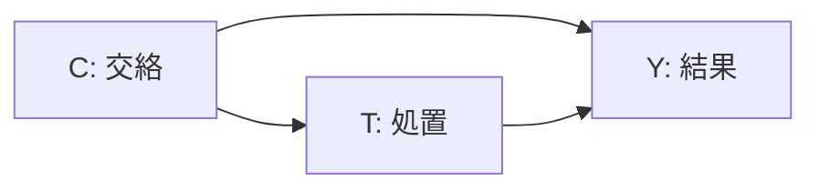
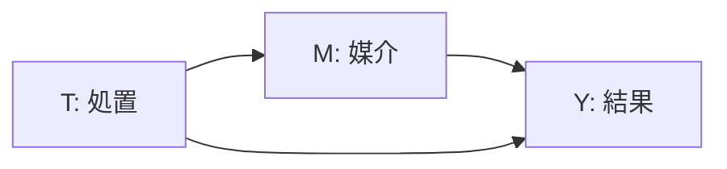
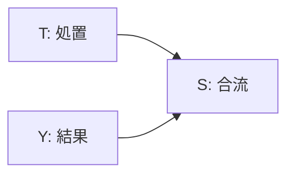
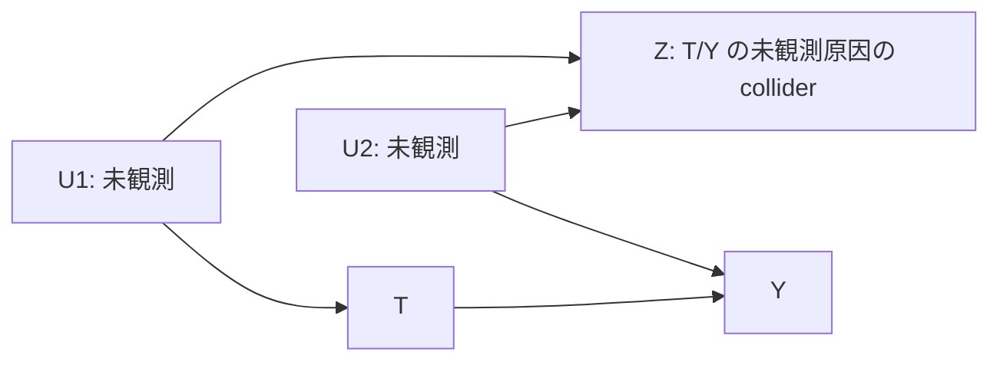
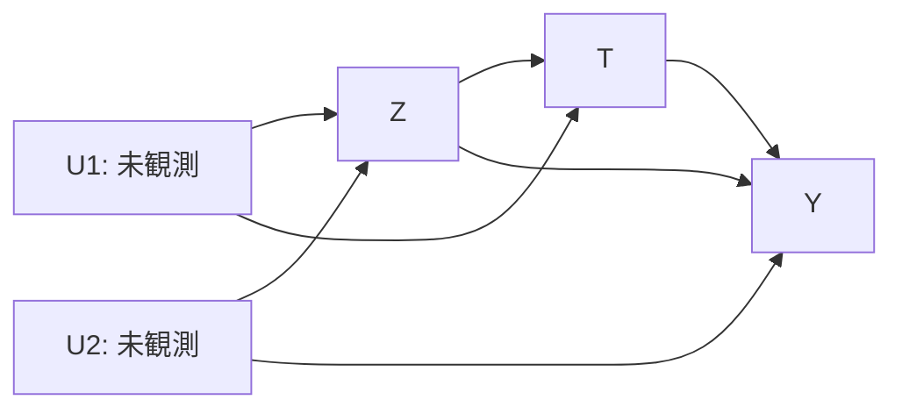
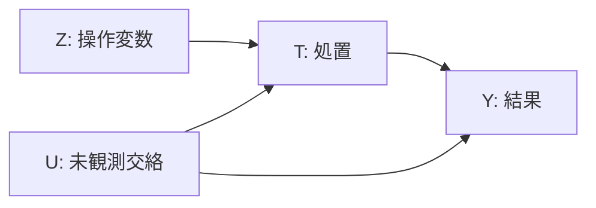

# 第5章 DAG と識別戦略 — Skill 化する前に決めること（SCM と反実仮想の骨格を含む）

> **本章の到達目標**
> - **DAG（Directed Acyclic Graph）の 5 つの基本要素**——confounder / mediator / collider / M-bias / butterfly bias——を材料実験の文脈で識別できる
> - **backdoor 基準・frontdoor 基準**によって、観測データから ATE を identifiable にする adjustment set を選べる
> - **IV（操作変数）・DiD（差分の差分）・RDD（回帰不連続）**の**骨格**（前提と識別戦略）を、ARIM の実例で語れる
> - **SCM（Structural Causal Model）と反実仮想の骨格**（Pearl の 3 階層——観測 / 介入 / 反実仮想）を材料実験の文脈で理解し、**Ch13b Phase 3** への橋渡しをつくる
> - **エージェントが DAG を提案する Skill と Human が承認する Skill を分離**する設計を書き下せる
> - **causal-learn による探索型 DAG** と **pgmpy によるベイジアンネット表現**を、それぞれ「どの Skill で / どの権限で」使うかを判断できる
>
> **本章で扱わないこと**
> - Skill 契約テンプレート（第4章）
> - 具体的 estimator の実装（第6-8章：Propensity / IPW / DR / CATE / DiD / IV / Synthetic Control）
> - refutation の実装（第9章）
> - DoE 設計行列の生成（第10-11章）
> - 逐次実験計画・BO acquisition（vol-05）

---

## 5.1 なぜ DAG を Skill 化の**前**に決めるのか

第2章 §2.3 で見たとおり、**DAG は「データが生成された物語」の視覚表現**です。ATE / CATE / DiD / IV いずれの推定においても、**DAG が変われば identifiable な estimand も、必要な adjustment set も、正しい estimator も変わります**。したがって：

> **DAG を pin してから Skill を書く**——これが vol-04 の一貫した設計原則です。

第4章 §4.4 で導入した「因果 provenance 3 レイヤ」の**L1（identification-level）と L2（identification assumptions）は、本質的にすべて DAG を土台に成立**しています。**Skill を書き始める前に、DAG と識別戦略を Human が確定させる**——これがなければ、`dag_authorization` ゲートも `variable_selection_authorization` ゲートも意味を持ちません。

**エージェントに DAG そのものを勝手に書かせるのは危険**です（第2章 §2.5 Pattern 1）。したがって本章では、**エージェントに何を任せて、Human が何を握るか**を DAG 操作のレベルで分離します。

### 本章の 4 部構成

| 部 | 節 | 主題 |
|---|---|---|
| 第1部 | 5.2, 5.3 | **DAG 記法**（confounder / mediator / collider / M-bias / butterfly bias）と **backdoor / frontdoor 基準** |
| 第2部 | 5.4 | **IV / DiD / RDD の骨格**（骨格のみ；実装は Ch6-7） |
| 第3部 | 5.5 | **SCM と反実仮想の骨格**（Pearl の 3 階層。Ch13b Phase 3 の土台） |
| 第4部 | 5.6, 5.7 | **DAG を提案する Skill と承認する Skill の分離**、**causal-learn / pgmpy の使い分け** |

---

## 5.2 DAG 記法の 5 要素（confounder / mediator / collider / M-bias / butterfly bias）

DAG の**ノード**は変数、**有向エッジ**は「因果の向き」を表します。**因果推論で最低限区別すべきパターンは 5 つ**です。

### 5.2.1 Confounder（交絡因子）

**定義**：処置 $T$ と結果 $Y$ の**両方に因果的な矢を持つ**変数 $C$。



- **未調整だと**：$T \to Y$ の効果推定にバイアスが乗る（**交絡バイアス**）
- **調整方法**：backdoor 基準を満たす集合に $C$ を含めて条件付ける（回帰・matching・IPW など）
- **ARIM 例**：装置差、オペレータ差、試料バッチ、環境温湿度

### 5.2.2 Mediator（媒介変数）

**定義**：処置 $T$ の**結果として**生じ、そこから $Y$ に影響する変数 $M$。



- **調整すべきでない**：$M$ を confounder のように調整すると、**直接効果しか見えなくなり総効果を過小評価**します（**over-adjustment bias**）
- **frontdoor 基準では逆に $M$ を使う**（§5.3.2）
- **ARIM 例**：熱処理条件が結晶構造を経て特性に影響する場合の「結晶構造」

### 5.2.3 Collider（合流因子）

**定義**：処置 $T$ と結果 $Y$（またはそれらに関連する変数）の**両方から矢を受ける**変数 $S$。



- **調整すべきでない**：$S$ を条件付けると、**非因果経路 $T \to S \leftarrow Y$ が "開き"、$T$ と $Y$ の間に見せかけの相関（selection バイアス）**が生まれる
- **ARIM 例**：「装置測定に成功したサンプルだけ」で分析する場合の "測定成功フラグ"（処置と結果の両方の影響を受ける）

### 5.2.4 M-bias

**定義**：$T$ の**前**に発生した変数 $Z$ が、**未観測変数 $U_1, U_2$ の合流点（collider）**であり、$U_1$ は $T$ 側、$U_2$ は $Y$ 側に影響する構造。



- **重要**：$Z$ は「$T$ と $Y$ の共通原因（confounder）」**ではない**。$Z$ 自身は $T$ と $Y$ に矢を向けていない
- **一見 confounder に見える $Z$ を調整すると**：$Z$ は $U_1, U_2$ の collider なので、**$Z$ で条件付けると $U_1$ と $U_2$ の間に見せかけの相関が生まれ、$T \leftarrow U_1 \text{--} U_2 \to Y$ という非因果経路が "開く"** → **逆にバイアスが増える**
- **教訓**：**「$T$ より前の変数だから調整して良い」は誤り**。DAG の構造を見なければ判断できない
- **ARIM 例**：試料の産地情報 $Z$ が、**未観測の "過去の研究方針" $U_1$**（→ 装置選定 $T$）と**未観測の "測定機器履歴" $U_2$**（→ 特性 $Y$）の合流点になっている場合

### 5.2.5 Butterfly bias（M-bias と confounding の同時併存）

**定義**：同じ変数 $Z$ が、**confounder の役割**と **collider の役割**を同時に持つ構造（M と confounding が重なった蝶型）。



- **調整しても・しなくても**バイアスが残る難所
- **対処**：**IV や DiD など別の identification 戦略**へ切替、または**ドメイン知識で $U_1, U_2$ の proxy を追加観測**する
- **ARIM 例**：装置状態が processing 条件選択と最終特性の両方に影響し、装置状態は未観測の較正履歴（$U_1$）と経年劣化（$U_2$）を介する場合

> [!IMPORTANT]
> **5 パターンの見分けは、変数の名前ではなく DAG の局所構造で決まります**。同じ「温度」でも、confounder のこともあれば mediator のこともあり、collider のこともある——これが**第2章 §2.5 Pattern 1（DAG rewriting）が危険**な理由です。**DAG は Human が pin し、エージェントは提案までに留める**（§5.6）。

### 5.2.6 5 パターンの調整可否早見表

| パターン | ATE / total effect 推定での扱い | frontdoor での使用 | 主な誤用 |
|---|---|---|---|
| **Confounder** | **調整必須** | 該当なし | 未調整 → 交絡バイアス |
| **Mediator** | **調整禁止**（total effect のとき）／直接効果推定でのみ調整 | **使用可**（§5.3.2） | Total effect で mediator を "confounder として" 調整 → over-adjustment |
| **Collider** | **調整禁止** | 該当なし | 選別・生存バイアス、"測定成功" 条件付け |
| **M-bias（$Z$）** | **原則調整禁止**（$Z$ 自体は confounder ではない） | 該当なし | "pre-treatment だから" と機械的に調整 |
| **Butterfly bias（$Z$）** | 調整しても・しなくてもバイアス残存 | 該当なし → **IV / DiD 等の代替戦略**が必要 | 通常の adjustment に依存する |

---

## 5.3 backdoor 基準と frontdoor 基準 — identifiability の骨格

DAG が pin されたら、次に「どの変数集合で条件付ければ ATE が identifiable になるか」を決めます。**Pearl の do-calculus** の基礎となる **2 つの基準**を骨格として押さえます。

### 5.3.1 backdoor 基準

**backdoor path**：$T$ から $Y$ への**因果的でない**（arrows into $T$ を含む）経路。

**backdoor 基準**：ある集合 $Z$ が以下を満たせば、$Z$ で条件付けることで $T \to Y$ の因果効果を identifiable にできる：
1. $Z$ は $T$ の子孫を含まない
2. $Z$ は $T$ から $Y$ への**すべての backdoor path**をブロックする

**推定式**（backdoor adjustment formula）：
$$P(Y \mid do(T = t)) = \sum_z P(Y \mid T = t, Z = z) \, P(Z = z)$$

**ARIM 実装イメージ**：
- 処置 $T$ = 熱処理温度、結果 $Y$ = 硬度
- backdoor path：$T \leftarrow \text{装置} \to \text{較正状態} \to Y$
- adjustment set：$Z = \{\text{装置}, \text{較正状態}\}$
- 実装：$Z$ を共変量として回帰（Ch6）、または propensity score にして IPW（Ch6）

### 5.3.2 frontdoor 基準

**backdoor が使えない**（未観測交絡 $U$ が $T$ と $Y$ の両方に影響）ときの救済策。**mediator $M$ を経由**して identification を試みます。

**frontdoor 基準**：mediator $M$ が以下を満たせば identifiable：
1. $M$ は $T$ から $Y$ へのすべての**directed path** を intercept する
2. $T$ から $M$ に backdoor path がない
3. $T$ で条件付ければ $M$ から $Y$ への backdoor がすべてブロックされる

**推定式**（frontdoor adjustment formula、離散変数の場合）：
$$P(Y \mid do(T = t)) = \sum_m P(M = m \mid T = t) \sum_{t'} P(Y \mid M = m, T = t') P(T = t')$$

> [!NOTE]
> **離散なら和、連続なら積分**——ARIM のように処置・mediator が連続量（温度・組成比・粒径）の場合は $\int$ に置き換えます。実装では条件付き密度推定または回帰の期待値計算になります。

**ARIM 実装イメージ**：
- 処置 $T$ = 前駆体組成、結果 $Y$ = 導電率、未観測 $U$ = 装置履歴
- mediator $M$ = 結晶粒径（$T$ の結果、$Y$ の原因、$U$ からは独立）
- $T \to M$ と $M \to Y$（$T$ で条件付き）をそれぞれ推定して composition

> [!NOTE]
> **frontdoor は「mediator が識別を救う唯一の場面」**であり、§5.2.2 の「mediator を confounder として調整するな」とは**逆方向の使い方**です。**Skill 契約では、mediator を "adjustment 用"（禁止）で使うのか "frontdoor 用"（許可）で使うのかを明示**する必要があります（第4章 Table 4.4 item 4）。

### 5.3.3 identifiability の判断表

| 状況 | 使う基準 | 必要な変数 | 識別される estimand | ARIM 典型例 |
|---|---|---|---|---|
| すべての交絡が観測可能 | **backdoor** | 交絡集合 $Z$ | ATE / ATT | 装置・較正状態が記録済み |
| 未観測交絡があり、mediator を経由できる | **frontdoor** | mediator $M$ | ATE | 前駆体 → 結晶構造 → 特性 |
| 未観測交絡があり、外生的な shifter がある | **IV**（§5.4.1） | 操作変数 $Z$ | **LATE**（追加仮定で ATE） | 装置更新（外生ショック） |
| 未観測交絡があり、時間軸で before/after 比較できる | **DiD**（§5.4.2） | 処置群・対照群 × 時期 | ATT | プロトコル変更前後 |
| 処置が閾値ルールで決まる | **RDD**（§5.4.3） | running variable $X$、閾値 $c$ | **cutoff 近傍の LATE** | 検査基準値による選別 |
| いずれも困難 | 準実験不可 → **DoE で介入** | ランダム化割当 | ATE | Ch10-11 の実験計画 |

---

## 5.4 IV / DiD / RDD の骨格

3 つの準実験手法は、いずれも「observational data で介入効果を identifiable にする」ための戦略です。**実装は Ch7**、本章では**骨格と DAG 表現**のみ扱います。

### 5.4.1 IV（Instrumental Variables、操作変数法）

**骨格**：**未観測交絡 $U$** があっても、**$T$ にだけ影響し $Y$ には直接影響しない**外生変数 $Z$（instrument）を使えば、**特定の estimand が identifiable** になります。

**3 つの仮定**：
1. **Relevance**：$Z \to T$ は非ゼロ
2. **Exclusion restriction**：$Z \to Y$ の直接効果はない（すべて $T$ 経由）
3. **Exchangeability**：$Z$ と $U$ は独立（$Z$ は "randomizer" のように振る舞う）

> [!IMPORTANT]
> **IV が identify する estimand は ATE ではありません**：
> - **基本形（Imbens & Angrist）**：**LATE（Local Average Treatment Effect）**——$Z$ によって処置が変化した**compliers 部分集団**での平均効果
> - **線形 2SLS**：**線形構造仮定下の 2SLS estimand**（効果均質性か線形性が加われば ATE と一致）
> - **ATE を得るには**、効果均質性（homogeneous treatment effect）や連続 IV の場合の追加仮定が必要
>
> Skill 契約では `estimand_type: late | 2sls_linear | ate`（**ate は追加仮定明記時のみ**）を明示（第4章 §4.9 テンプレート）。

**DAG**：



**ARIM 例**：
- 処置 $T$ = 新プロトコル採用、結果 $Y$ = 生成物純度、未観測 $U$ = オペレータ熟練度
- 操作変数 $Z$ = **装置更新タイミング**（外生的にプロトコル切替を促した外部要因）
- identify されるのは**装置更新に反応してプロトコル切替した装置群での LATE**
- 実装：2SLS（Two-Stage Least Squares）、linearmodels（Ch7）

### 5.4.2 DiD（Difference-in-Differences、差分の差分）

**骨格**：処置群と対照群の**時間トレンドが並行**（parallel trends assumption）なら、処置前後の差分の差分が ATT を identifiable。

**推定量**：
$$\text{ATT} = \{E[Y_{\text{treated}, \text{after}}] - E[Y_{\text{treated}, \text{before}}]\} - \{E[Y_{\text{control}, \text{after}}] - E[Y_{\text{control}, \text{before}}]\}$$

**ARIM 例**：
- 装置 A（処置群、2026 年に較正プロトコル刷新）と装置 B（対照群、変更なし）
- 2025 年（before）と 2026 年後半（after）の測定精度を比較
- **並行トレンド**の可視化と placebo test（Ch9）が必須

### 5.4.3 RDD（Regression Discontinuity Design、回帰不連続デザイン）

**骨格**：処置 $T$ が **running variable $X$ の閾値 $c$ で決定的に切り替わる**とき、$X = c$ **近傍で局所的な**処置効果が identifiable。

**前提**：閾値近傍で $X$ を能動的に manipulate できない（continuity of potential outcomes）

> [!IMPORTANT]
> **RDD が identify するのは cutoff 近傍の局所効果（LATE at cutoff）**であり、集団全体の ATE ではありません。cutoff から離れた領域への外挿は**追加仮定なしには保証されません**——これは第4章 §4.5 の `counterfactual_scope_gate` が扱う「外挿範囲」問題そのものです。Skill 契約では `estimand_type: late_at_cutoff` を明示。

**ARIM 例**：
- 検査基準：純度 $X < 99.5\%$ なら再処理（$T = 1$）、$X \geq 99.5\%$ ならそのまま（$T = 0$）
- $X = 99.5\%$ 近傍で「再処理された最上位群」と「されなかった最下位群」を比較 → **cutoff 近傍での再処理効果**を identify

### 5.4.4 3 手法の使い分け

| 手法 | 前提 | 使える ARIM シナリオ | 主要ライブラリ（Ch7） |
|---|---|---|---|
| **IV** | 外生的 shifter が存在 | 装置更新・規制変更・部材品切れ等の外生ショック | linearmodels, DoWhy |
| **DiD** | 並行トレンド | プロトコル変更前後の処置群 vs 対照群 | linearmodels, CausalPy |
| **RDD** | 閾値ルール、閾値近傍の連続性 | 検査基準・スペック基準による選別 | CausalPy, rdrobust |

> [!WARNING]
> **前提が壊れると identification 自体が破綻**します。**Skill 契約に `identification_strategy` を pin し、前提の assessment レポート（`identification_report_uri`）を artifact に含める**——これは第4章 §4.3 で導入した設計です。**エージェントが暗黙に IV → DiD に切り替えるのは fatal（Table 4.4 item 2）**。

---

## 5.5 SCM と反実仮想の骨格（Pearl の 3 階層）— Ch13b Phase 3 への橋渡し

第2章 §2.7 で「反実仮想（"もし処置していなかったら"）」に触れました。**SCM（Structural Causal Model）**は、反実仮想を**数学的に扱う枠組み**です。**Ch13b Phase 3** で SCM ベースの反実仮想シミュレーションを実装するため、ここでは**骨格**（形式的定義の最小限）を導入します。

### 5.5.1 SCM の定義

**決定論的 SCM** は 3 つの組で定義される：
$$\mathcal{M} = \langle U, V, F \rangle$$

- $U$：**exogenous variables**（外生変数、モデル外の要因）
- $V$：**endogenous variables**（内生変数、モデル内の観測変数）
- $F$：$V$ の各要素 $V_i$ を、$U$ と $V \setminus \{V_i\}$ の関数で表す**構造方程式**の集合 $\{f_1, f_2, \ldots\}$

**確率的 SCM**（反実仮想計算に必要な形）は、さらに $U$ の分布を加えた 4 つの組：
$$\mathcal{M} = \langle U, V, F, P(U) \rangle$$

- $P(U)$：外生変数の同時分布——Ch13b Phase 3 の**abduction ステップで posterior 更新**の対象になる
- $U_i$ 間に**相関や共有 $U$** を許すことで、**latent confounding**（未観測交絡）を表現可能

**ARIM 材料実験の SCM 骨格（例）**：
- $U = \{u_{\text{装置履歴}}, u_{\text{環境ノイズ}}\}$、$P(U)$ は Ch13b で事前分布として指定
- $V = \{T = \text{熱処理温度}, C = \text{装置}, M = \text{結晶粒径}, Y = \text{硬度}\}$
- $F$：
  - $C = f_C(u_{\text{装置履歴}})$
  - $T = f_T(C, u_{\text{環境ノイズ}})$
  - $M = f_M(T, C)$
  - $Y = f_Y(M, C, u_{\text{環境ノイズ}})$

**DAG は $F$ から自動的に生成**されます（親変数 → 子変数のエッジ）。**$U_i$ 間の依存や共有 $U$ を導入すると、対応する DAG に双方向 edge や bidirected arrow が現れる**——これが FCI が返す PAG（§5.7.1）の構造的表現です。

### 5.5.2 Pearl の因果階層（3 rungs of causation）

**SCM は 3 つの階層の問いに答えられる**：

| Rung | 問い | 表現 | ARIM 例 |
|---|---|---|---|
| **1. Association**（観測） | 「もし〜を観測したら？」 | $P(Y \mid T)$ | 高温処理サンプルの硬度分布 |
| **2. Intervention**（介入） | 「もし〜を意図的に設定したら？」 | $P(Y \mid do(T))$ | 温度を強制的に $T=800°C$ にしたら硬度は？ |
| **3. Counterfactual**（反実仮想） | 「もし過去の $T$ を変えていたら？」 | $P(Y_{T=t'} \mid T=t, Y=y)$ | このサンプル（実際は $T=600°C$ で硬度 $y$ だった）が、もし $T=800°C$ だったら硬度は？ |

**重要な区別**：
- **Rung 2 = ATE / CATE**：**集団平均**の反実仮想（Ch6-8）
- **Rung 3 = 個別反実仮想**：**個別サンプル**についての反事実、SCM が必要（Ch13b）
- **Rung 3 は Rung 2 より強い仮定を要求**（すべての $f_i$ と $U$ の分布の同定）

### 5.5.3 反実仮想の 3 ステップ計算

Pearl の**abduction–action–prediction**：

1. **Abduction**：観測値 $T = t, Y = y$ から exogenous $U$ の事後分布 $P(U \mid T=t, Y=y)$ を推定
2. **Action**：構造方程式で $T \leftarrow t'$ に強制置換（$T$ の親を切断）
3. **Prediction**：更新した SCM で $Y$ の分布 $P(Y_{T=t'} \mid T=t, Y=y)$ を計算

**Ch13b Phase 3 での実装**：
- SCM を PyMC / DoWhy で表現
- Abduction は事後分布サンプリング
- Action は intervention (`do` 演算)
- Prediction は forward simulation
- **その結果を `counterfactual_scope_gate` で判定**（Ch8 §8.5 の operational 実装、第4章 §4.5 の契約定義）

> [!IMPORTANT]
> **反実仮想は "external validity" の問題を最も強く受ける**——観測データにない領域（新規組成・未経験プロセス）についての反実仮想は、**構造方程式の外挿**に依存します。**第4章 §4.5 の `counterfactual_scope_gate` は、この外挿を 2 段階の severity で扱います**：
> - **boundary（Table 4.4 item 12a、warning）**：閾値近傍 → 結果は出すが `low_confidence` フラグを付与
> - **fail / extrapolation（Table 4.4 item 12b、fatal）**：閾値を明確に逸脱 → **結果を出さず fail-close**、Human review を要求
>
> **Ch13b で SCM を扱う際、必ずこのゲートを通す**——これが vol-04 の運用ルールです。

### 5.5.4 SCM を書くための最小仕様（Ch13b 用テンプレート）

```yaml
# scm_specification.yaml (Ch13b で使用)
scm:
  exogenous_variables:
    - name: u_device_history
      distribution: normal(0, sigma_device)
    - name: u_environmental
      distribution: normal(0, sigma_env)
  endogenous_variables:
    - name: C_device
      parents: [u_device_history]
      structural_function: linear   # または nonlinear / gp / bnn
    - name: T_temperature
      parents: [C_device, u_environmental]
      structural_function: nonlinear
    - name: M_grain_size
      parents: [T_temperature, C_device]
      structural_function: gp   # ガウス過程（Ch11）
    - name: Y_hardness
      parents: [M_grain_size, C_device, u_environmental]
      structural_function: nonlinear
  identification_dag_ref: "arxiv:xxx/DAG_v3.mmd"
  identification_dag_sha256: "0xabc..."
```

> [!NOTE]
> **SCM の各 $f_i$ を "どのモデルで表現するか"**——線形回帰・GP・BNN——は**モデリング判断**であり、その選択自体が provenance に残ります。Ch13b では PyMC で $f_i$ をベイズモデルとして書き、posterior に基づき反実仮想サンプリングします。

---

## 5.6 DAG を提案する Skill と Human が承認する Skill の分離

第4章 §4.6 で導入した**3 層承認ゲート**の第1層 `dag_authorization` は、**DAG の変更・確定は Human 承認**でした。これを **Skill レベルで 2 種類に分離**します。

### 5.6.1 Skill 型 1：`dag_proposal_skill`（エージェント自律）

**目的**：観測データからの DAG **候補**を提案する
**権限**：エージェント自律実行可能
**成果物**：DAG 候補ファイル（`.mmd` / `.gml` / CPDAG / PAG）、根拠レポート、**provenance bundle**

```yaml
skill_type: dag_proposal_skill
authorization_level: agent_autonomous
inputs:
  - dataset_uri
  - dataset_sha256                    # 入力データの pin
  - preprocessing_pipeline_uri
  - preprocessing_pipeline_sha256     # 前処理も pin（第4章 data_lineage 連動）
  - domain_prior_uri                  # ドメイン知識制約（例：「装置 → 温度」の向き固定）
  - domain_prior_sha256
  - dag_of_record_previous_uri        # 差分をとる元（存在すれば）
  - dag_of_record_previous_sha256
outputs:
  - dag_candidate_uri
  - dag_candidate_sha256
  - graph_type                        # dag | cpdag | pag（§5.7.1 参照）
  - dag_diff_uri                      # 既存 DAG からの差分レポート
  - proposal_report_uri               # なぜこの DAG を提案したかの説明
  - proposal_bundle_sha256            # 入力+アルゴリズム+出力の統合 hash
  - search_algorithm_provenance:
      algorithm: pc | ges | lingam | fci
      random_seed: <int>              # 乱数依存アルゴリズムの seed
      library_version: <string>
      hyperparameters: {...}
prohibited_actions:
  - overwrite_existing_dag_of_record  # 記録済み DAG を書き換えない（fatal）
  - promote_cpdag_or_pag_to_record    # CPDAG/PAG のまま dag_of_record に昇格させない（fatal）
  - modify_domain_prior_silently      # domain prior の暗黙変更（fatal）
```

### 5.6.2 Skill 型 2：`dag_approval_skill`（Human 承認、Skill 化された workflow）

**目的**：DAG 候補を審査し、`dag_of_record` に昇格させる
**権限**：Human 承認必須（`dag_authorization` ゲート）
**成果物**：正式版 DAG、承認証跡

```yaml
skill_type: dag_approval_skill
authorization_level: human_required
authorization_gate: dag_authorization
inputs:
  - dag_candidate_uri
  - dag_candidate_sha256
  - graph_type                        # dag | cpdag | pag（cpdag/pag は追加の方向づけ手続きが必要）
  - proposal_report_uri
  - proposal_bundle_sha256            # 提案側 bundle の整合性を再検証
  - dataset_sha256                    # 提案時の入力を再確認
  - preprocessing_pipeline_sha256
  - domain_prior_sha256
  - dag_diff_uri                      # 変更点の review 用
  - reviewer_comments_uri             # 署名済みレビューコメント
outputs:
  - dag_of_record_uri
  - dag_of_record_sha256
  - graph_type: dag                   # 昇格後は必ず完全 DAG
  - orientation_evidence_uri          # CPDAG/PAG から DAG に方向づけした根拠
  - approval_evidence:
      - reviewer_signatures           # 電子署名（PKI / GPG）
      - approval_timestamp
      - approved_dag_version
      - dissenting_opinions_uri       # 少数意見も別文書で記録
      - reviewer_ids                  # 監査追跡用
prohibited_actions:
  - approve_without_reviewer_signatures       # fatal
  - approve_cpdag_or_pag_directly             # fatal（先に方向づけ手続き必須）
  - approve_when_bundle_sha_mismatch          # fatal（提案時から入力が変わっている）
  - adjust_for_post_treatment_variable_without_marking_as_mediator  # fatal（Ch14 §14.1.1 で back-register、§5.2.5 post-treatment adjustment）
  - adjust_for_collider_declared_in_dag       # fatal（Ch14 §14.1.2 で back-register、§5.2.3 collider bias）
  - modify_adjustment_set_after_downstream_start  # fatal（Ch14 §14.1.2 で back-register、Phase 2/3 開始後の集合改変）
  - claim_dag_of_record_without_hypothesis_uri_and_e_value_probe  # fatal（Ch14 §14.1.1）
approver: causal_review_board
approver_independence:
  conflict_policy: independent_reviewer_required_if_approver_is_data_producer
  fallback_approver: facility_causal_review_board
```

### 5.6.3 2 種類の分離が生む便益

| 便益 | 説明 |
|---|---|
| **監査可能性** | 「エージェントが提案したもの」と「Human が承認したもの」が別 artifact として残る |
| **反復可能性** | DAG 候補を複数出させて Human が選ぶ workflow が明確 |
| **責任分担** | 提案の質はエージェント（+ アルゴリズム）、採用の責任は Human |
| **失敗の localization** | 誤った DAG が採用された場合、原因は "提案" と "承認" のどちらか特定できる |

> [!TIP]
> 第2章 §2.5 Pattern 1（DAG rewriting）は、**提案 Skill と承認 Skill を分けずに 1 つの Skill で "改訂＋採用" まで行っていた**ことに由来します。**Skill 型を分ければ、そもそも "silent rewriting" は Skill 契約違反として検知**できます。

---

## 5.7 causal-learn と pgmpy の使い分け

DAG 提案 Skill と、承認済み DAG の運用 Skill——それぞれに適したライブラリが異なります。

### 5.7.1 causal-learn — 探索型 DAG 学習

**位置づけ**：観測データから DAG **候補**を統計的に探索するライブラリ

**主要アルゴリズム**と**出力グラフ型**：

| アルゴリズム | 出力 | 意味 |
|---|---|---|
| **PC** | **CPDAG**（Completed Partially Directed Acyclic Graph） | Markov 同値類——一部の edge の方向は未確定 |
| **GES** | **CPDAG** | 同上（BIC などのスコア関数で greedy 探索） |
| **LiNGAM** | **DAG** | 線形・非ガウス性の仮定下で方向が identifiable |
| **FCI** | **PAG**（Partial Ancestral Graph） | 未観測交絡を許容、方向はさらに部分的 |

**Skill 対応**：`dag_proposal_skill` の実装ライブラリ

**Skill 契約に含めるべき項目**：
```yaml
search_algorithm_provenance:
  algorithm: pc | ges | lingam | fci
  output_graph_type: cpdag | pag | dag   # 昇格の可否判定に必須
  ci_test: fisherz | chisq | gsq         # PC の場合
  score_function: bic | bdeu             # GES の場合
  alpha: 0.05                             # 有意水準
  random_seed: <int>
  library_version: <string>
  domain_prior_edges:                     # 固定エッジ（Human 制約）
    - [device, temperature]
```

> [!WARNING]
> **causal-learn の出力は "候補" であって "真の DAG" ではありません**。
> - PC / GES の出力は **CPDAG**（Markov 同値類）——一部の edge の方向は Markov 同値な複数 DAG で区別できません
> - FCI の出力は **PAG** で、方向づけはさらに限定的
> - **`dag_of_record` として運用するには完全 DAG が必要**——CPDAG / PAG のままでは backdoor / frontdoor 判定が不完全になる
> - **方向づけ完成には (1) domain prior、(2) 介入実験、(3) LiNGAM 等の追加仮定** のいずれかが必要
>
> Skill 契約側では `graph_type` を必須項目とし、`promote_cpdag_or_pag_to_record` を fatal 禁止事項に指定（§5.6.1）。**Human 承認ゲート `dag_authorization` で "方向づけ完成の evidence" (`orientation_evidence_uri`) を必ず添付**。

### 5.7.2 pgmpy — ベイジアンネットワーク表現と推論

**位置づけ**：**承認済み DAG** の上で確率推論（条件付き分布・介入分布）を行うライブラリ

**主要機能**：
- ベイジアンネットワークとしての DAG 表現（`BayesianNetwork`）
- CPD（Conditional Probability Distribution）の学習と保持
- variable elimination・belief propagation による推論
- **`do` operator の実装**（Rung 2：介入分布の計算）

**Skill 対応**：`dag_of_record` を運用する Skill、Ch6-8 の estimator Skill での **Rung 1-2** 推論

> [!IMPORTANT]
> **pgmpy は Rung 1（観測）と Rung 2（介入分布）が主戦場**であり、**Rung 3（個別反実仮想）の abduction–action–prediction は主担当ではありません**。Rung 3 は **PyMC / DoWhy の SCM 表現**で構造方程式レベルの反実仮想サンプリングを行うのが本筋です（Ch13b Phase 3）。

**Skill 契約に含めるべき項目**：
```yaml
runtime_representation:
  library: pgmpy
  network_uri: "s3://arim-causal/dag_of_record_v3.pkl"
  network_sha256: "0xdef..."
  cpd_source: learned_from_data | expert_specified | hybrid
  supported_rungs: [1, 2]                # Rung 3 は PyMC/DoWhy 側
```

### 5.7.3 使い分け早見表

| 目的 | ライブラリ | Skill 型 | 権限 |
|---|---|---|---|
| DAG **候補**を観測データから探索 | causal-learn | `dag_proposal_skill` | エージェント自律 |
| DAG の **domain prior** を pin する | pgmpy（BayesianNetwork） | `dag_of_record_skill` | Human 承認済み |
| 承認済み DAG で **条件付き / 介入分布**を計算 | pgmpy | 各 estimator Skill（Ch6-8） | エージェント自律（DAG 変更なし） |
| **SCM ベース反実仮想**（Rung 3）を実行 | **PyMC + DoWhy**（主）／ pgmpy は DAG 表現のみ | Ch13b SCM Skill | エージェント自律 + scope gate |
| **数値推定** の estimator を実装 | DoWhy / EconML / CausalPy / linearmodels | Ch6-8 Skill | エージェント自律（DAG 変更なし） |

> [!NOTE]
> **causal-learn と pgmpy は "上流（DAG 提案）と下流（DAG 運用）" の分業**です。causal-learn を運用に使ったり、pgmpy で DAG を勝手に書き換えたりすることは**Skill 契約違反**（Table 4.4 item 1 に相当）。

---

## まとめ — 本章のチェックリスト

- [ ] **§5.2 DAG 5 要素**（confounder / mediator / collider / M-bias / butterfly bias）を自分のデータで指摘できる
- [ ] **§5.3 backdoor / frontdoor 基準**の違いと、mediator の "adjustment 禁止 vs frontdoor 用" 使い分けを理解した
- [ ] **§5.4 IV / DiD / RDD の骨格**（前提と DAG）を、ARIM 実例で 1 分で語れる
- [ ] **§5.5 Pearl の 3 階層**（観測 / 介入 / 反実仮想）を区別し、SCM が Rung 3 に必要なことを理解した
- [ ] **§5.5.3 反実仮想の abduction–action–prediction 3 ステップ**を書き下せる
- [ ] **§5.6 DAG 提案 Skill と DAG 承認 Skill の分離**を、自分の workflow に適用できる
- [ ] **§5.7 causal-learn と pgmpy の使い分け**を、Skill 型と権限で説明できる

---

## 章末演習

### 演習 5.1：自分のデータの DAG を描く

自分の ARIM データ（または演習用合成データ、付録 C）について、以下を実施：

- [ ] 変数を 5-10 個列挙し、それぞれを 5 パターン（confounder / mediator / collider / M-bias / butterfly bias）のいずれかに分類
- [ ] Mermaid 記法で DAG を描く
- [ ] backdoor 基準を満たす adjustment set を最低 1 つ特定
- [ ] frontdoor 基準が使える mediator が存在するか判定
- [ ] IV / DiD / RDD のいずれかが適用可能な場面があるか検討

**提出物**：`dag_v1.mmd` + adjustment set 一覧 + 根拠 500 字

### 演習 5.2：識別戦略の判断表

以下のシナリオそれぞれで、**どの identification 戦略を使うか**を根拠付きで答えてください：

1. 装置 A と装置 B で同じ試料バッチを測定、装置 A のみ較正プロトコルを更新した
2. 新しい前駆体組成が導電率に与える効果を、未観測の "原料ロット差" があるなかで推定したい
3. 検査で純度 99% 未満のサンプルだけ再処理される。再処理の効果を評価したい
4. すべての交絡因子が観測されているが、mediator を経由した効果と直接効果を分離したい

（解答は Ch7-9 で照合）

### 演習 5.3：SCM の設計（Ch13b の準備）

演習 5.1 の DAG を SCM として書き下してください：

- [ ] $U$（外生変数）を最低 2 つ列挙、各分布を仮定
- [ ] $V$（内生変数）と親変数を明記
- [ ] 各 $f_i$ に想定される model family（linear / GP / BNN 等）を記す
- [ ] Rung 2（介入）と Rung 3（個別反実仮想）で聞きたい問いを 1 つずつ書く
- [ ] **`counterfactual_scope_gate` の閾値**を、**boundary（warning）と fail（fatal）の 2 段階**で仮設定（第4章 §4.5 テンプレート、Table 4.4 item 12a/12b、Ch8 で operational 化）：distance / density / variance の 3 メトリック × 2 threshold

### 演習 5.4：DAG 提案 Skill と DAG 承認 Skill の分離

自分の workflow に対して、§5.6.1-5.6.2 のテンプレートを埋めた **2 つの Skill 契約**を作成してください：

- [ ] `dag_proposal_skill.yaml`（causal-learn 前提）
- [ ] `dag_approval_skill.yaml`（`dag_authorization` gate、`approver_independence` policy 含む）

---

## 参考資料

### 内部 cross-reference

- 第2章：ARIM 特有の DAG 課題（装置差・オペレータ差・少データ）、Pattern 1（DAG rewriting）
- 第3章：causal-learn と pgmpy の位置づけ、権限マップ
- **第4章**：`dag_authorization` / `variable_selection_authorization` ゲート、`counterfactual_scope_gate` の契約定義、Table 4.4 の禁止事項
- 第6-8章：backdoor（Ch6）、frontdoor（Ch6-7）、IV/DiD（Ch7）、CATE と g-formula（Ch8）の実装
- 第9章：identification 前提の refutation テスト
- **第13章 (13b Phase 3)**：SCM ベース反実仮想シミュレーション、本章 §5.5 の実装先
- 付録 A：DAG 提案 Skill、SCM Skill、g-formula Skill テンプレート
- 付録 D：DAG 記法用語集（confounder / mediator / collider / M-bias / butterfly bias / positivity / SUTVA / SCM / do-calculus / backdoor / frontdoor / IV / DiD / RDD）

### 外部参考文献

- Pearl, J. (2009). *Causality: Models, Reasoning, and Inference* (2nd ed.). Cambridge University Press. — SCM と do-calculus の原典
- Pearl, J., & Mackenzie, D. (2018). *The Book of Why*. Basic Books. — 因果階層の入門
- Peters, J., Janzing, D., & Schölkopf, B. (2017). *Elements of Causal Inference*. MIT Press. — SCM の数学的基礎
- Hernán, M. A., & Robins, J. M. (2020). *Causal Inference: What If*. Chapman & Hall/CRC. — backdoor / IV / g-methods の教科書
- causal-learn documentation: https://causal-learn.readthedocs.io/
- pgmpy documentation: https://pgmpy.org/
- DoWhy documentation: https://www.pywhy.org/dowhy/

---

**本章の位置づけ**：DAG と identification 戦略、SCM の骨格を pin することで、Ch6-8 の estimator 実装が「どの DAG の上で / どの identification 戦略で / どの外挿範囲で」動くかが明確になります。次章（Ch6）では、backdoor 基準を満たす adjustment set が確定した観測データに対し、**Propensity Score / IPW / DR** による ATE / ATT 推定を Skill 化していきます。
