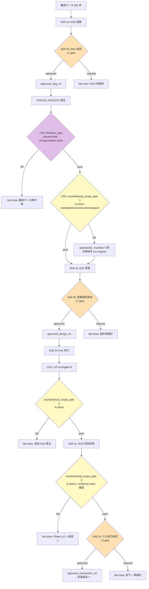

# 第13章　総合ハンズオン (Advanced Capstone) — 観測 DAG 仮説化 → DoE 検証 → 反実仮想で最適条件提案

> **本章の使い方**
> - 第13章は **第5〜12章の統合 worked example** です。ARIM の合成データを題材に、**「観測データから因果仮説を立てる → DoE で検証する → SCM 反実仮想で最適条件を提示する」** という 3 相の実務ワークフローを **1 つの capstone Skill 群** として組み上げます。
> - 章は **2 節構成**：
>   - **§13a（Phase 1–2）**：観測データの DAG 仮説化 → CATE 推定（Ch5–8）→ DoE で検証（Ch10–12）
>   - **§13b（Phase 3）**：SCM ベース反実仮想シミュレーション → 最適条件提示 → **3 層承認**（`dag_authorization` → `variable_selection_authorization` → `intervention_execution_authorization`）を **operational に発火**
> - **エージェントは 3 箇所で人間承認を求めます**：この 3 承認が本章の中核設計であり、Ch4 §4.6 の 3 層権限を Ch13 で初めて**すべて連続発火**させます。
>
> **この章の到達目標**
>
> - Ch5 の DAG → Ch6 の ATE → Ch8 の CATE → Ch10-11 の DoE → Ch12 の Bayesian DoE → Ch5 §5.5 の SCM 反実仮想を **一本の Skill パイプライン**として構成できる
> - 3 相それぞれで **どの Skill が「提案」を担い、どの Skill が「承認」を担うか**を明示できる（proposal / approval 分離、Ch10 §10.7.3 / Ch11 §11.4.2 / Ch12 §12.6.3 の踏襲）
> - `counterfactual_scope_gate` を **観測（Ch9）と DoE（Ch11）と SCM（Ch13b）の 3 場面で発火**させる Skill 実装差分を説明できる
> - **3 層承認の evidence chain**（`dag_authorization` → `variable_selection_authorization` → `intervention_execution_authorization` の provenance 連鎖）を Skill 契約として書ける
> - **失敗時の fail-close 経路**（Ch4 §4.6.3 fallback ルート）を各 Phase で示せる
>
> **この章で扱わないこと**
>
> - 新しい統計手法・DoE 手法（Ch5-12 で導入済み）
> - Ch14 で扱う失敗パターンの網羅リスト（本章は "成功シナリオ + fail-close 経路" に集中）
> - ARIM 実データそのもの（合成データで再現可能な worked example に統一、実データ持込は付録 C）
> - 詳細な MCP 実装コード（付録 B 参照）
> - 逐次 BO / acquisition function（Ch12 §12.11 で vol-05 に委譲済み）

---

## 13.1 総合シナリオ — ARIM 有機薄膜太陽電池の V_OC 最適化

**題材**：新規ドナー材料 D-X を用いた有機薄膜太陽電池（OSC）の開放電圧 $V_{\text{OC}}$ 最適化。**過去 2 年間の観測データ 500 件**（複数装置・複数オペレータ・製膜条件バラつきあり）が蓄積され、**追加実験予算は 24 runs**。目的：**$V_{\text{OC}}$ を最大化する製膜条件を提案する**。

### 13.1.1 3 相ワークフロー

| Phase | 目的 | 主担当章 | 3 層承認 |
|---|---|---|---|
| **Phase 1** | 観測 DAG 仮説化 + ATE / CATE 推定 | Ch5 / Ch6 / Ch8 | `dag_authorization`（DAG 承認） |
| **Phase 2** | 仮説を検証する DoE 設計・実行 | Ch10 / Ch11 / Ch12 | `variable_selection_authorization`（変数選択承認） |
| **Phase 3** | SCM 反実仮想で最適条件提示 | Ch5 §5.5 / Ch8 §8.5 | `intervention_execution_authorization`（介入実行承認） |

**重要**：3 承認は **時系列に順序**されます。Phase 1 の DAG が承認されないと Phase 2 の変数選択は開始不可、Phase 2 の DoE 検証結果が承認されないと Phase 3 の介入提案は不可。Ch4 §4.6.4 の "evidence chain" 契約を **Ch13 で初めて全連鎖として発火**させます。

### 13.1.2 データセット構造

```yaml
observational_dataset:
  n_rows: 500
  columns:
    # 処置候補（意思決定変数）— factors[].role: primary_intervention
    - substrate_temperature_c            # 40-120 °C  # role: primary_intervention
    - solvent_ratio_dcb                  # 0-1（DCB:CB 混合比）  # role: primary_intervention
    - annealing_time_min                 # 0-30 min  # role: primary_intervention
    # 応答 — role: outcome
    - v_oc_v                             # 0.5-1.5 V（目的変数）  # role: primary_outcome
    - efficiency_percent                 # PCE  # role: secondary_outcome
    # 潜在的 confounder / covariate — role: backdoor_adjustment
    - instrument_id                      # {A, B, C}（3 装置）  # role: backdoor_adjustment (blocking factor)
    - operator_id                        # {O1..O5}（5 オペレータ）  # role: backdoor_adjustment (blocking factor)
    - film_thickness_nm                  # 50-250 nm（mediator 候補）  # role: mediator_candidate
    - humidity_percent                   # 30-70%（confounder 候補）  # role: backdoor_adjustment
    - date_of_run                        # 時系列（unmeasured confounder 検出用）  # role: temporal_probe
  identification_strategy: observational_backdoor  # Phase 1 は backdoor で開始
  # === factors[].role の enum（Ch5 §5.2 / Ch10 §10.2.2 canonical）===
  # primary_intervention: 意思決定変数（DoE の factor 候補）
  # primary_outcome / secondary_outcome: 目的変数
  # backdoor_adjustment: DAG の親の親（confounder）
  # mediator_candidate: 処置と outcome の中間変数（Ch5 §5.2.2）
  # blocking_factor: DoE の blocking（Ch10 §10.4）
  # temporal_probe: unmeasured confounder 検出用
```

---

## 13.2 Phase 1 — 観測データから DAG 仮説化 → CATE 推定 (§13a)

### 13.2.1 Skill 分離（Ch5 §5.6 パターン）

Phase 1 は **DAG 提案 Skill** と **DAG 承認 Skill** の 2 段構えで動きます（Ch5 §5.6 の分離パターン）：

```yaml
skill_1a_dag_proposal:
  role: agent_autonomous                     # Human 事前承認なしで実行可
  action_class: propose_only                 # 「提案」であって「決定」ではない
  input:
    observational_dataset_uri: <string>
    prior_dag_hypotheses_uri: <string>        # 過去の文献 / 施設 dag_of_record
  output:
    proposed_causal_graph_uri: <string>       # 提案 DAG（未承認）
    proposed_causal_graph_sha256: <string>
    identification_strategy_candidates:       # 各 DAG に対する識別戦略候補
      - randomized_experiment                 # not applicable (観測データ)
      - observational_backdoor                # ← Phase 1 で使用
      - iv_two_stage_least_squares            # not applicable (IV なし)
      - synthetic_control                     # not applicable
    unmeasured_confounder_candidates:         # 検出された潜在 confounder
      - date_of_run                           # 時系列トレンド
      - lab_environment_uncontrolled          # unmeasured
    refutation_test_recommendations:
      - random_common_cause
      - data_subset_validation
      - e_value                               # Ch9 §9.2

skill_1b_dag_approval:
  role: human_required                       # Human 承認必須
  gate_level: L1_dag_authorization           # Ch4 §4.6.1 L1 gate
  approver: research_lead                    # facility_causal_review_board へ escalation 可
  input:
    proposed_causal_graph_uri: <string>
    proposed_causal_graph_sha256: <string>   # 上流 Skill が pin
  output:
    dag_authorization_provenance:
      approved: true | false | conditional
      approved_dag_uri: <string>              # ← 以降のすべての Skill が参照
      approved_dag_sha256: <string>
      approver: <string>
      approved_at: <timestamp>
      approval_conditions: <list>             # conditional の場合の追加検証項目
      rejection_reason: <string>              # false の場合
```

**契約**：Skill 1a が **出力**するのは `proposed_causal_graph_*` のみで、下流 Skill が参照するのは Skill 1b が発行する `approved_dag_*`。SHA256 pin により **DAG の silent 差替え**を fatal 化。

### 13.2.2 提案される DAG（3 候補）

Skill 1a は**複数候補**を提案し、Skill 1b が 1 つを選ぶ設計です（single-DAG committing bias 回避、Ch5 §5.2 で議論）：

```yaml
candidate_dags:
  - id: dag_v1_minimal
    description: |
      substrate_temperature → v_oc
      humidity → v_oc
      instrument → v_oc
      humidity ← date_of_run                  # 時系列 confounder
    backdoor_adjustment_set: [humidity, instrument, operator]
    complexity: 3_edges
  - id: dag_v2_with_mediator
    description: |
      dag_v1 + substrate_temperature → film_thickness → v_oc
    backdoor_adjustment_set: [humidity, instrument, operator]  # mediator は含めない
    complexity: 4_edges
    note: film_thickness を adjustment に含めると mediator bias 発生
  - id: dag_v3_with_collider
    description: |
      dag_v2 + solvent_ratio → film_thickness ← substrate_temperature
      film_thickness → v_oc
    backdoor_adjustment_set: [humidity, instrument, operator]
    complexity: 5_edges
    note: film_thickness は solvent_ratio と substrate_temperature の collider。film_thickness を adjustment に含めると collider bias 発生（Ch5 §5.2.3）。M-bias（Ch5 §5.2.4）は $Z$ が **未観測** の $U_1, U_2$ の collider である別パターンで、本 dag_v3 とは異なる。
```

Human 承認者は 3 候補の中から `dag_v2_with_mediator` を選択（現実的にありうる構造 + mediator を明示）。以降、`approved_dag_uri = dag_v2_with_mediator` として固定。

### 13.2.3 ATE 推定（Ch6）→ CATE 推定（Ch8）

**substrate_temperature** の 2 水準比較（低温 60 °C vs 高温 100 °C）を離散化して ATE 推定：

```yaml
ate_estimation_provenance:                    # Ch6 §6.5 準拠
  estimator: doubly_robust
  estimator_library: econml.dr.LinearDRLearner
  estimator_version: econml==0.15.1
  estimator_sha256: <string>
  identification_strategy: observational_backdoor
  approved_dag_uri: <dag_v2 URI>              # ← Skill 1b が発行済み
  approved_dag_sha256: <string>
  adjustment_set: [humidity, instrument_id, operator_id]  # DAG 承認で固定
  ate_estimate: 0.087                         # V (V_OC が +0.087 V)
  ate_ci_95: [0.061, 0.113]
  positivity_by_stratum:                      # Ch4 §4.4.1 canonical
    - stratum: {instrument: A}
      p_hat_range: [0.15, 0.85]
      pass: true
    - stratum: {instrument: B}
      p_hat_range: [0.08, 0.72]
      pass: true
    - stratum: {instrument: C}
      p_hat_range: [0.02, 0.35]                # ⚠️ 境界的
      pass: conditional
```

**CATE 推定**：Ch8 §8.4 で装置別 × オペレータ別の CATE：

```yaml
cate_estimation_provenance:
  estimator: causal_forest
  estimator_library: econml.grf.CausalForest
  n_trees: 500
  feature_importance:
    instrument_id: 0.42                       # 最大
    operator_id: 0.28
    humidity: 0.18
    date_of_run: 0.12                         # ⚠️ 時系列トレンド疑い
  cate_by_instrument:
    A: 0.121                                  # 高 CATE
    B: 0.083
    C: 0.024                                  # 低 CATE、positivity 境界
  counterfactual_scope_gate:                  # Ch4 §4.5.2 / Ch9 §9.6 canonical mapping form
    mahalanobis_check:
      distance_cluster_conditional: 2.4       # instrument 別 cluster
      cluster_assignment_uri: <string>
      threshold: 3.0
      cluster_conditional: true
    variance_check:
      predicted_cate_variance: 0.11
      threshold: 0.15
    knn_density_check:
      k: 20
      knn_min: 5
      n_training_points_within_radius: 3      # ⚠️ instrument=C 領域で <5 → fail
      knn_radius: 0.10
    support_envelope_check:
      outside_support_dimensions: [instrument_C_propensity_range]  # C は propensity 0.02-0.35 で境界外
      envelope_report_uri: <string>
    threshold_calibration:                    # Ch4 §4.5.2 canonical
      method: leave_one_out_empirical
      calibration_evidence_uri: <string>
      calibration_approved_at: <timestamp>
    aggregate_policy:
      pass_requires: all_four_pass
      conditional_pass_output: non_actionable_diagnostic_only
      fail_action: fail_close_and_exclude_stratum_from_phase_2  # instrument=C 除外は本 gate の action
    gate_status: fail                         # ← knn_density / support_envelope が fail
    fallback: human_review
    fallback_approver: research_lead
    fallback_message_template: |              # Ch4 §4.5.2 canonical
      CATE Skill が instrument=C で action を提案しましたが、
      knn_density_check と support_envelope_check が失敗しました。
      instrument=C は観測データが少なく（k-NN half-radius 内 3 点 < 閾値 5）、
      propensity range も [0.02, 0.35] と境界的（positivity_by_stratum: conditional）で、
      対応する CATE 推定は extrapolation risk が高い状態です。
      failing_checks: {failing_checks}
      選択肢:
        (a) instrument=C を Phase 2 DoE の対象から除外
        (b) instrument=C の観測データを追加収集
        (c) research_lead に escalation
```

**この段階でのアクション**：`gate_status: fail` → Human 承認者が `(a) instrument=C を Phase 2 対象から除外` を選択。Phase 2 の DoE は **instrument ∈ {A, B}** に限定。

### 13.2.4 refutation（Ch9）

Ch9 §9.7.1 canonical の 10-enum のうち適用可能なもの：

```yaml
refutation_gate_provenance:                   # Ch9 §9.7.1
  declared_required_tests:
    - e_value                                 # Ch9 §9.2
    - random_common_cause                     # Ch9 §9.4
    - data_subset_validation                  # Ch9 §9.5
    - scope_gate_reverification               # Ch9 §9.6
  test_results:
    e_value:
      status: pass
      e_value_observed: 2.3                   # E-value 2.3 → unmeasured confounder が RR 2.3 相当以上でないと結論反転しない
      evidence_uri: <string>
    random_common_cause:
      status: pass
      simulated_ate_delta: 0.008              # threshold 0.02
      evidence_uri: <string>
    data_subset_validation:
      status: pass
      subset_ate_range: [0.061, 0.098]
      evidence_uri: <string>
    scope_gate_reverification:
      status: fail                            # ← instrument=C で fail 継承
      evidence_uri: <string>
  aggregate_status: partial_diagnostic_only    # Ch9 aggregate_policy
  applicability_manifest_uri: <string>          # instrument=C の除外を pre-register
```

**Phase 1 完了時の状態**：
- `approved_dag_uri` = dag_v2_with_mediator
- ATE = 0.087 V（instrument ∈ {A, B} で positivity pass）
- CATE = {A: 0.121, B: 0.083}
- **Phase 2 の DoE は instrument ∈ {A, B} かつ substrate_temperature ∈ [60, 100] °C に限定**
- 3 層承認の **L1 (`dag_authorization`) 完了**

---

## 13.3 Phase 2 — DoE で仮説を検証 (§13a 続き)

### 13.3.1 Skill 分離

Phase 2 は Ch10 §10.7.3 の proposal / approval 分離 + Ch11 §11.4.2 の T2→T3 昇格パターンをそのまま踏襲：

```yaml
skill_2a_doe_proposal:
  role: agent_autonomous
  action_class: propose_only
  input:
    approved_dag_uri: <string>                # Phase 1 の evidence chain
    approved_dag_sha256: <string>
    cate_estimation_provenance_uri: <string>
    experimental_budget: 24                    # runs
    factors_from_dag:                          # DAG から自動抽出
      - substrate_temperature_c                # primary
      - solvent_ratio_dcb                      # primary
      - annealing_time_min                     # primary
      - instrument_id                          # blocking（{A, B} のみ）
      - operator_id                            # blocking
  output:
    proposed_design_alternatives:              # 3 案並置
      - id: design_1_ccd_bayesian
        design_type: central_composite_bayesian_doe
        n_runs: 24                             # 2^3 factorial + 6 axial + 2 center
        estimator_tier: T3_gp_mle               # Ch11 §11.1.1
      - id: design_2_full_factorial_replicated
        design_type: full_factorial_2level_replicated
        n_runs: 24                             # 2^3 × 3 replicates
        estimator_tier: T1_linear_model
      - id: design_3_bbd
        design_type: box_behnken_design
        n_runs: 15
        estimator_tier: T2_gbm

skill_2b_variable_selection_approval:
  role: human_required
  gate_level: L2_variable_selection_authorization  # Ch4 §4.6.1 L2 gate
  approver: research_lead
  input:
    proposed_design_alternatives: <list>
  output:
    variable_selection_authorization_provenance:
      approved: true | false | conditional
      approved_design_uri: <string>
      approved_design_sha256: <string>
      approved_estimator_tier: T3_gp_mle       # ← 昇格の場合 Ch6 §6.7.1 L4 event
      # 昇格時（前承認 tier と異なる）は tier_upgrade_provenance を必須にする（Ch6 §6.7.1 / Ch11 §11.4.2）
      tier_upgrade_provenance:                 # approved_estimator_tier が前承認から変わる場合のみ
        from_tier: T2_gbm                       # 例: 前 approval からの遷移
        to_tier: T3_gp_mle
        estimator_contract_change_gate:         # Ch6 §6.7.1 L4 approval-type gate
          approval_type: approval
          approver: research_lead
          approved_at: <timestamp>
          estimator_diff_report_uri: <string>   # Ch6 §6.7.3
          estimator_diff_report_sha256: <string>
        new_skill_version_issued: 2.0.0         # Ch11 §11.4.2 `approve_tier_upgrade_without_new_skill_version` fatal 回避
      approver: <string>
      approved_at: <timestamp>
      approval_conditions:
        - randomization_seed_pinned_at: <timestamp>
        - assignment_log_uri_pre_registered: <string>
        - preregistration_manifest_sha256: <string>
```

### 13.3.2 承認された DoE 設計

Human 承認者は `design_1_ccd_bayesian` を選択（Ch12 の Bayesian DoE を採用、事前分布は過去 500 件を informative prior 化）：

```yaml
approved_design_provenance:                   # Ch10 §10.8 canonical + Ch12 §12.8 拡張
  design_id: design_1_ccd_bayesian
  design_type: central_composite_bayesian_doe
  design_matrix_uri: <string>
  design_matrix_sha256: <string>              # ← 24 行の設計行列を pin
  factors:
    - name: substrate_temperature_c
      role: primary                            # Ch4 §4.9
      levels: [60, 80, 100]
      coded_range: [-1, +1]
    - name: solvent_ratio_dcb
      role: primary
      levels: [0.0, 0.5, 1.0]
      coded_range: [-1, +1]
    - name: annealing_time_min
      role: primary
      levels: [10, 20, 30]
      coded_range: [-1, +1]
    - name: instrument_id
      role: blocking
      levels: [A, B]                           # instrument=C は Phase 1 で除外
    - name: operator_id
      role: blocking
      levels: [O1, O2, O3]
  n_runs: 24
  center_point_repeats: 2
  alpha_value: 1.68179283050743                # Ch11 S-3 canonical (ALPHA_K3_ROTATABLE = 2**0.75)

  # === Bayesian 部分（Ch12 §12.8）===
  prior_specification_provenance:
    prior_type: hierarchical
    prior_family:                              # Ch12 §12.2.2 canonical: theta/mu/tau naming
      theta: normal                             # 効果パラメータ（beta 相当）
      mu: normal                                # 群平均（mu_0 相当）
      tau: half_cauchy                          # 群間分散（sigma_0 相当）
    prior_hyperparameters:                    # Ch12 N-2 canonical: leaf は scalar hyperparameters
      mu_0_mu: 0.85                            # 過去 500 件の平均 V_OC（μ の平均）
      mu_0_sigma: 0.12                          # μ の標準偏差
      tau_scale: 0.05                          # τ (HalfCauchy) の scale — 装置間変動
      sigma_0_scale: 0.03                       # σ_0 (HalfCauchy) の scale — 観測ノイズ
    prior_source: previous_experiment          # 過去 500 件
    prior_source_uri: <string>                 # 観測データ manifest
    prior_source_sha256: <string>
    prior_predictive_check_uri: <string>
    prior_predictive_check_sha256: <string>
    approved_by: research_lead
    approved_at: <timestamp>
    frozen_at: <timestamp>

  eig_estimation_contract:                     # Ch12 §12.4.3
    method: laplace                            # linear-Gaussian pass
    n_outer: 1                                 # laplace は決定論的
    n_inner: 1
    mc_variance_estimate: 0.0                  # Ch12 N-1 canonical
    mc_variance_ratio: 0.0
    convergence_check: not_applicable_for_deterministic_laplace
    seed: 42

  # === Randomization & assignment log ===
  randomization_seed: 20260706123045
  randomization_seed_pinned_at: <timestamp>
  assignment_log_uri: <string>
  assignment_log_sha256: <string>
  seed_match: true                             # Ch10 §10.5.3 stage 1（provenance.seed ↔ assignment_log header ↔ per-row seed）
  design_hash_match: true                      # stage 2
  permutation_reproducibility: true            # stage 3
  execution_records_binding: not_yet_bound     # stage 4（実行後に bind）
  assignment_log_header_recorded: true          # 追加 check（Ch10 §10.5.3 fatal `assignment_log_missing_header_record` 検出）

  # === Mixed model（Ch10 N-5）===
  mixed_model_specification_uri: <string>
  mixed_model_specification_sha256: <string>
  mixed_model_specification_schema: pymc_hierarchical_model
  mixed_model_random_effects_declared: [instrument_id, operator_id]
  mixed_model_fixed_effects_declared: [substrate_temperature_c, solvent_ratio_dcb, annealing_time_min]

  # === Information gain baseline（Ch10 N-4 / Ch11 N-7）===
  information_gain_baseline:
    baseline_design_type: full_factorial_2level
    baseline_efficiency: 1.0
    efficiency_ratio_achieved: 1.85            # CCD の D-efficiency
    n_runs_ratio: 3.0                          # 24 / 8 (full factorial 2^3)

  # === Preregistration（Ch4 §4.8 / Ch9 §9.7.1）===
  preregistration_manifest_uri: <string>
  preregistration_manifest_sha256: <string>
```

### 13.3.3 DoE 実行 → 応答曲面フィッティング → counterfactual_scope_gate

24 runs 実行後、Ch11 の GP surrogate（T3 tier）でフィッティング + Ch11 §11.7.2 の 4-check gate：

```yaml
response_surface_provenance:                   # Ch11 §11.5.3
  surrogate_model_provenance:
    model_family: gaussian_process_kriging
    library: smt
    library_version: smt==2.5.0
    kernel:
      type: squared_exponential
      theta_optimizer: differential_evolution
      theta_initialization_rationale: coded_space_1.0_default  # Ch11 S-2 canonical
    trained_on_design_matrix_sha256: <string>
    predictive_variance_at_training_points_ci_gt_noise: true    # Ch11 N-1
    variance_lower_bound_at_training_points: 0.0003
    optimum_on_design_boundary: false          # Ch11 N-4
    alpha_boundary_tolerance: 0.95

  fitted_optimum:
    x_star_coded: [0.42, -0.18, 0.61]
    x_star_natural:
      substrate_temperature_c: 88.4
      solvent_ratio_dcb: 0.41
      annealing_time_min: 24.1
    predicted_v_oc: 0.982
    prediction_ci_95: [0.958, 1.006]

  counterfactual_scope_gate:                    # Ch11 §11.7.2 canonical mapping form
    mahalanobis_check:
      method: posterior_predictive_mahalanobis
      distance_cluster_conditional: 1.8         # instrument 別 cluster
      cluster_assignment_uri: <string>
      threshold: 3.0
      cluster_conditional: true
    variance_check:
      method: gp_predictive_variance
      predicted_variance: 0.024
      threshold: 0.05                            # 訓練時 max variance の 2 倍
    knn_density_check:
      k: 5                                       # 訓練 N=24 のため小さめ（Ch11 §11.7.2 準拠）
      knn_min: 2
      n_training_points_within_radius: 4
      knn_radius: 0.10
    support_envelope_check:
      method: convex_hull_or_ellipsoid
      outside_support_dimensions: []             # x* は凸包内
      envelope_report_uri: <string>
      strict: true
    threshold_calibration:                       # Ch4 §4.5.2 canonical
      method: leave_one_out_empirical            # or conformal（N=24 で有効）
      calibration_evidence_uri: <string>
      calibration_approved_at: <timestamp>
    aggregate_policy:
      pass_requires: all_four_pass
      conditional_pass_output: non_actionable_diagnostic_only
      fail_action: fail_close_and_reject_optimum_recommendation
    gate_status: pass
    fallback: human_review                        # gate_status=pass だが定義自体は要
    fallback_approver: research_lead
    fallback_message_template: |                  # Ch4 §4.5.2 canonical (fail 時発火)
      Response surface Skill が x*={x_star_natural} を提案（design {design_id}）。
      予測 V_OC = {predicted_v_oc} [{prediction_ci_95}]
      設計凸包: {design_hull_summary}
      failing_checks: {failing_checks}
      GP predictive variance at x*: {predicted_variance}
      approved_design_sha256: {approved_design_sha256}
      選択肢:
        (a) 推奨点を却下
        (b) x* での confirmation runs を追加発注し設計領域を拡張
        (c) research_lead に escalation
      ⚠️ 設計凸包外の外挿を actionable として報告することは fatal（§13.5 参照）。
```

### 13.3.4 Phase 2 完了時の evidence chain

```yaml
phase_2_completion:
  approved_dag_uri: <phase 1 output>
  approved_design_uri: <phase 2 output>
  variable_selection_authorization_uri: <phase 2 output>
  next_phase_input:
    x_star_natural: {substrate_temperature_c: 88.4, ...}
    counterfactual_scope_gate_pass: true
    response_surface_provenance_uri: <string>
  next_phase_gate_required: L3_intervention_execution_authorization  # ← Phase 3
```

**Phase 2 完了時の状態**：
- DoE 24 runs 完了、GP surrogate T3 fit
- $x^*$ = (T=88.4 °C, ratio=0.41, time=24.1 min) で予測 $V_{\text{OC}}$ = 0.982 V
- `counterfactual_scope_gate` 全 4-check pass
- 3 層承認の **L2 (`variable_selection_authorization`) 完了**

---

## 13.4 Phase 3 — SCM 反実仮想シミュレーションと最適条件提示 (§13b)

### 13.4.1 なぜ Phase 3 が必要か — 応答曲面と SCM の違い

Phase 2 の GP surrogate は **「観測分布のもとで $x^*$ での $V_{\text{OC}}$ を予測」**する回帰モデルです。しかし ARIM 施設で実際に $x^*$ を **介入的に設定** した場合、次の 2 種類の追加リスクが残ります：

1. **未観測 confounder による bias**（Ch5 §5.5 SCM Pearl 3-tier の tier 2 と tier 3 の違い）：観測データの $P(V_{\text{OC}} \mid x)$ と介入下の $P(V_{\text{OC}} \mid do(x))$ は一致しない可能性がある
2. **Distribution shift**：DoE は制御実験だが、実運用では operator が変わる、humidity 変動が拡大するなど、DoE 分布外での作動が起きる

**SCM 反実仮想**（Ch5 §5.5、Ch8 §8.5）は、Phase 1 で承認された DAG + Phase 2 で fit した mediator モデルを組み合わせ、**"もし今の運用条件で $x^*$ を介入したら $V_{\text{OC}}$ はどうなるか"** を **反実仮想として** シミュレートします。

### 13.4.2 Skill 分離

```yaml
skill_3a_scm_counterfactual_proposal:
  role: agent_autonomous
  action_class: propose_only
  input:
    approved_dag_uri: <phase 1>
    approved_design_uri: <phase 2>
    response_surface_provenance_uri: <phase 2>
    x_star_natural: {...}                       # Phase 2 の推奨点
    scm_specification_uri: <string>              # SCM 構造方程式
  output:
    proposed_counterfactual_provenance:
      scm_type: structural_causal_model
      scm_library: dowhy==0.11.1                # Ch5 §5.5 準拠
      scm_specification_sha256: <string>
      pearl_tier: 3_counterfactual              # Ch5 §5.5 Pearl 3-tier
      intervention: do(substrate_temperature=88.4, solvent_ratio=0.41, annealing_time=24.1)
      counterfactual_query: "P(V_OC > 0.95 | do(x*))"
      point_estimate: 0.978
      credible_interval_95: [0.951, 1.005]
      # SCM 特有: mediator の効果を分解
      total_effect: 0.098
      direct_effect: 0.062                       # x → V_OC の直接パス
      indirect_effect: 0.036                     # x → film_thickness → V_OC
      mediator_effect_decomposition_provenance: <string>

skill_3b_intervention_execution_approval:
  role: human_required
  gate_level: L3_intervention_execution_authorization  # Ch4 §4.6.1 L3 gate
  approver: research_lead                      # facility_causal_review_board にも通知
  input:
    proposed_counterfactual_provenance: <string>
    counterfactual_scope_gate_scm: <inline>
  output:
    intervention_execution_authorization_provenance:
      approved: true | false | conditional
      approved_intervention_uri: <string>       # ← 実運用系へ渡す最終 artifact
      approved_intervention_sha256: <string>
      approver: <string>
      approved_at: <timestamp>
      approval_conditions:
        - executable_operation_window: <timestamp_range>
        - reversibility_confirmed: true
        - fallback_plan_uri: <string>
      evidence_chain:                            # Ch4 §4.6.4 canonical
        dag_authorization_uri: <phase 1>
        variable_selection_authorization_uri: <phase 2>
        intervention_execution_authorization_uri: <this>
      evidence_chain_sha256: <string>
```

### 13.4.3 SCM 反実仮想の counterfactual_scope_gate（第 3 の発火）

Phase 3 の gate は Phase 1（観測 CATE）・Phase 2（応答曲面）と **operational に別物**：

| Phase | Gate 対象 | 主 check | Ch 参照 |
|---|---|---|---|
| Phase 1 | 観測 CATE の外挿範囲 | covariate hull, positivity | Ch9 §9.6 |
| Phase 2 | 応答曲面の外挿範囲 | posterior predictive mahalanobis, variance | Ch11 §11.7.2 |
| Phase 3 | SCM 反実仮想の識別可能性 | intervention support, mediator path stability | 本節 |

```yaml
counterfactual_scope_gate_scm:                  # Phase 3 版（SCM 特有 5-check、canonical mapping form）
  # === Phase 1/2 と共通の 4 軸（Ch4 §4.5.2 canonical、SCM-operational 版）===
  mahalanobis_check:
    method: intervention_support_mahalanobis    # do(x*) が観測 support の中心にあるか
    distance_cluster_conditional: 1.9           # instrument 別 cluster
    cluster_assignment_uri: <string>
    threshold: 3.0
    cluster_conditional: true
  variance_check:
    method: scm_counterfactual_variance         # SCM tier-3 の反実仮想分散
    counterfactual_variance: 0.028
    threshold: 0.05
  knn_density_check:
    method: intervention_support_knn_in_observed
    k: 15                                        # 観測 N=500 に応じたスケール
    knn_min: 5
    n_training_points_within_radius: 42
    knn_radius: 0.10
  support_envelope_check:
    method: intervention_support_envelope
    outside_support_dimensions: []
    envelope_report_uri: <string>
    intervention_support_fraction: 0.87          # do(x*) の observed support 内比率
    fraction_threshold: 0.80
  # === Phase 3 特有の第 5 軸（SCM ならではの識別可能性 check）===
  scm_identifiability_check:                    # Phase 3 のみの追加 axis
    mediator_path_stability:                    # x → mediator パス係数の DoE 前後変化
      observed_slope_delta: 0.04
      threshold: 0.10
      pass: true
    scm_posterior_predictive_check:              # SCM 構造方程式のデータ再現度
      predictive_score: 0.94
      threshold: 0.80
      pass: true
    dag_of_record_consistency:                   # 承認 DAG と施設 dag_of_record の衝突
      pass: true
      evidence_uri: <string>
    # === 感度分析（Ch10 N-4 / Ch11 B-5 canonical、check ではなく provenance として並置）===
    sensitivity_analysis:
      method: e_value
      effect_direction: positive
      effect_scale: transformed_continuous_with_smd_to_rr_conversion
      ci_bound_closest_to_null: 0.951
      smd_to_rr_conversion: chinn_2000
      threshold:
        minimum_e_value: 1.5
      e_value_observed: 2.1
      pass: true
  threshold_calibration:                          # Ch4 §4.5.2 canonical
    method: scm_counterfactual_bootstrap_calibration
    calibration_evidence_uri: <string>
    calibration_approved_at: <timestamp>
  aggregate_policy:
    pass_requires: all_five_pass                  # 4 共通軸 + 1 SCM 特有軸（scm_identifiability_check）
    conditional_pass_requires:
      - mahalanobis_check_pass
      - variance_check_pass
      - knn_density_check_pass
      - support_envelope_check_pass
      - scm_identifiability_check_pass
    conditional_pass_output: non_actionable_diagnostic_only
    fail_action: fail_close_and_reject_intervention_proposal
  gate_status: pass | conditional_pass | fail
  fallback: human_review
  fallback_approver: research_lead
  fallback_message_template: |                    # Ch4 §4.5.2 canonical
    SCM 反実仮想 Skill が intervention x* = {x_star} を提案しました。
    Phase 1 承認 DAG: {approved_dag_sha256}
    Phase 2 承認 design: {approved_design_sha256}
    predicted V_OC = {point_estimate} [95% CI: {credible_interval_95}]
    failing_checks: {failing_checks}
    mediator direct/indirect effect: {direct_effect} / {indirect_effect}
    E-value: {e_value_observed}
    scm_specification_sha256: {scm_specification_sha256}
    選択肢:
      (a) intervention を却下する
      (b) mediator path を追加検証する DoE を発注する（Phase 2 再実行）
      (c) DAG 再検討のため Phase 1 へ差し戻す
      (d) research_lead / facility_causal_review_board にエスカレートする
    ⚠️ 未承認 intervention の実行実施は fatal（§13.5 参照）。
```

**Phase 3 gate の operational 独自性**：4 軸は Ch4 §4.5.2 canonical と parity（mapping key 同一）だが、`method` フィールドが **SCM 特有の実装**（`intervention_support_mahalanobis` / `scm_counterfactual_variance` / `intervention_support_knn_in_observed` / `intervention_support_envelope`）を指す点、および第 5 軸 `scm_identifiability_check`（mediator path stability + SCM PPC + DAG consistency）が Phase 1 / Phase 2 gate に存在しない点で **operational に別物**。Ch14 の失敗パターン章はこの schema を直接参照する。

**3 gate 活性化の canonical diff（S-1）**：`counterfactual_scope_gate` は本章で 3 回発火するが、mapping keys / method values / threshold source / aggregate policy が operationally 異なる。この差分を「同じ名前だから同じ意味」と誤読すると、fatal `reuse_counterfactual_scope_gate_check_names_across_phases_without_operational_distinction`（§13.5）に該当する：

| 観点 | Phase 1 (§13.2.3, Ch9 §9.6) | Phase 2 (§13.3.3, Ch11 §11.7.2) | Phase 3 (§13.4.3, Ch13 §13.4.3) |
|------|--------|--------|--------|
| データ源 | 観測データ 500 obs | 応答曲面 posterior（24 runs + informative prior） | SCM 反実仮想 posterior |
| `mahalanobis_check.method` | `distance_cluster_conditional`（cluster 分位点） | `posterior_predictive_mahalanobis`（PPC 分布） | `intervention_support_mahalanobis`（介入 arm 特有） |
| `variance_check.method` | 経験的 CATE variance | `gp_predictive_variance`（GP kernel 由来） | `scm_counterfactual_variance`（SCM PPC 由来） |
| `knn_density_check.k` | k=20（N=500） | k=5（N=24） | k=5（N=24 + counterfactual arm） |
| `support_envelope_check` | non-strict（観測 support envelope） | strict（DoE 設計 support envelope） | strict（`intervention_support_envelope`、介入 arm outside 禁止） |
| `threshold_calibration` | 過去 500 件から empirical calibration | Ch11 §11.7 GP posterior calibration | Ch13 SCM prior + response surface hybrid calibration |
| 第 5 軸 | なし（4-check） | なし（4-check + threshold_calibration） | `scm_identifiability_check`（**5-check**：mediator_path_stability + scm_posterior_predictive_check + dag_of_record_consistency + sensitivity_analysis） |
| `aggregate_policy.pass_requires` | `all_four_pass` | `all_four_pass_with_calibration` | `all_five_pass` |
| `fail_action` | `fail_close_and_pre_register_applicability_manifest` | `fail_close_and_request_additional_doe` | `fail_close_and_route_back_to_phase_1_or_phase_2` |

### 13.4.4 Human 承認と evidence chain の最終化

Phase 3 承認時、`intervention_execution_authorization_provenance.evidence_chain` に Phase 1・Phase 2 の承認 provenance URI が全て埋まります。これは Ch4 §4.6.4 の **evidence chain canonical** を Ch13 で **初めて全連鎖として発火** させる箇所です：

```yaml
evidence_chain:
  # === L1: DAG 承認（Phase 1） ===
  dag_authorization_uri: s3://arim-provenance/pj00001/dag_auth_20260315.yaml
  dag_authorization_sha256: 3a7f...
  approved_dag_uri: s3://arim-dag/dag_v2_with_mediator.yaml
  approved_dag_sha256: 91bc...

  # === L2: 変数選択承認（Phase 2） ===
  variable_selection_authorization_uri: s3://arim-provenance/pj00001/varsel_auth_20260401.yaml
  variable_selection_authorization_sha256: 7e2a...
  approved_design_uri: s3://arim-doe/design_ccd_bayesian_20260401.yaml
  approved_design_sha256: c4f9...

  # === L3: 介入実行承認（Phase 3） ===
  intervention_execution_authorization_uri: s3://arim-provenance/pj00001/inter_auth_20260601.yaml
  intervention_execution_authorization_sha256: 8b1d...
  approved_intervention_uri: s3://arim-intervention/x_star_20260601.yaml
  approved_intervention_sha256: 5f6e...

  # === Cross-linked provenance ===
  response_surface_provenance_uri: s3://arim-surrogate/gp_kriging_20260501.yaml
  refutation_gate_provenance_uri: s3://arim-refutation/refutation_20260315.yaml
  counterfactual_scope_gate_history:
    - phase: phase_1_observational_cate
      gate_status: fail                          # instrument=C 除外
      timestamp: <phase 1>
    - phase: phase_2_response_surface
      gate_status: pass
      timestamp: <phase 2>
    - phase: phase_3_scm_counterfactual
      gate_status: pass
      timestamp: <phase 3>

  # === evidence_chain_sha256 の決定論的計算契約（B-6）===
  evidence_chain_sha256_algorithm: sha256_json_canonical_rfc8785  # RFC 8785 JSON Canonicalization Scheme
  evidence_chain_sha256_input_fields:          # 決定論的順序（改変で hash 変化）
    - dag_authorization_uri
    - dag_authorization_sha256
    - approved_dag_uri
    - approved_dag_sha256
    - variable_selection_authorization_uri
    - variable_selection_authorization_sha256
    - approved_design_uri
    - approved_design_sha256
    - intervention_execution_authorization_uri
    - intervention_execution_authorization_sha256
    - approved_intervention_uri
    - approved_intervention_sha256
    - response_surface_provenance_uri
    - refutation_gate_provenance_uri
    - "counterfactual_scope_gate_history[*].{phase, gate_status, timestamp}"
    # === Ch14 §14.4/§14.5 で back-register: audit_manifest 組み込み ===
    - audit_manifest_uri                        # Ch14 §14.4 canonical
    - audit_manifest_sha256                     # Ch14 §14.4 canonical（audit_manifest immutability の chain 化）
  evidence_chain_sha256: 8b1d3c...              # 上記フィールドを canonical JSON 化して sha256
```

**再現性契約**：`evidence_chain_sha256` の計算は **RFC 8785 JSON Canonicalization Scheme** に固定。異なる実装（Python / Rust / Node.js）でも同一の hash が得られる。`<timestamp>` は ISO 8601 UTC (`YYYY-MM-DDTHH:MM:SSZ`) に正規化。この pinning により、演習 13.4 の "silent DAG 差替え検出" が **operational に検証可能** になる。

**Phase 3 完了時の状態**：
- SCM 反実仮想で $x^*$ の predicted $V_{\text{OC}}$ = 0.978 V [0.951, 1.005]
- 5-check `counterfactual_scope_gate` pass
- Direct effect 0.062 V + indirect effect 0.036 V（mediator 経由）に分解
- 3 層承認 evidence chain 完成、**L3 (`intervention_execution_authorization`) 完了**
- 実運用系（LIMS / 装置制御）へ `approved_intervention_uri` を渡す準備完了

---

## 13.5 Phase 全体を通じた prohibited_actions

Capstone Skill 群における **fatal 禁止事項**（Ch4-12 継承 + Ch13 特有）：

```yaml
prohibited_actions:
  # === Phase 1 ===
  - propose_dag_without_hypothesis_uri            # Ch5 §5.6
  - modify_approved_dag_after_downstream_start    # fatal（Phase 2 開始後の DAG 差替え）
  - report_cate_without_positivity_by_stratum     # Ch4 §4.4.1

  # === Phase 2 ===
  - execute_doe_without_dag_authorization         # ← Ch13 中核 fatal（L1 未承認で L2 開始）
  - modify_design_matrix_after_randomization_seed_pinned  # Ch10 §10.5.3
  - swap_estimator_tier_between_design_and_analysis       # Ch11 §11.4.2

  # === Phase 3 ===
  - execute_intervention_without_variable_selection_authorization  # ← Ch13 中核 fatal（L2 未承認で L3 開始）
  - execute_intervention_without_evidence_chain_complete           # ← Ch13 中核 fatal（L1/L2/L3 のいずれか欠落）
  - modify_scm_specification_after_counterfactual_gate_pass        # fatal（gate 通過後 SCM 改変）
  - skip_phase_3_gate_when_phase_2_gate_pass_only                  # fatal（Phase 2 pass = Phase 3 pass ではない）
  - report_intervention_recommendation_without_mediator_decomposition  # fatal（mediator 効果を隠蔽）

  # === Evidence chain ===
  - report_intervention_action_with_broken_evidence_chain          # ← Ch13 中核 fatal
  - modify_evidence_chain_after_approval                            # fatal（改竄）
  - reuse_evidence_chain_across_projects_without_re_authorization   # fatal（他プロジェクトへの流用）
  - modify_evidence_chain_sha256_input_fields_after_publication     # fatal（B-6: hash 計算入力の後付け改変）

  # === Scope gate 一貫性 ===
  - bypass_scope_gate_reverification_between_phases                                       # fatal（Phase 遷移時に scope gate をスキップ）
  - reuse_counterfactual_scope_gate_check_names_across_phases_without_operational_distinction  # fatal（Phase 1/2/3 で同じ mapping key を operationally 同一の意味で流用）

  # === Ch14 §14.4/§14.5 で back-register: audit_manifest immutability ===
  - modify_audit_manifest_input_fields_after_publication  # fatal（B-5: audit_manifest_uri/sha256 の hash 計算入力の後付け改変）
```

---

## 13.6 3 相の Skill 間契約フロー図



**橙色**：3 層承認ゲート（Human 承認必須）。**紫色**：`refutation_gate`（因果識別の代替性テスト、Ch9 §9.7）。**黄色**：`counterfactual_scope_gate` 発火点（3 箇所で operational に異なる — Phase 1 は 4-check、Phase 2 は 4-check + threshold_calibration、Phase 3 は 5-check）。`refutation_gate` と `counterfactual_scope_gate` は **別の gate** であり、Phase 1 では両方 pass しないと Phase 2 へ進めない。

---

## 13.7 Ch13 で確立する Skill 契約テンプレート

以下は Ch13 が定義する **capstone 契約**（付録 A に完全版）：

```yaml
capstone_intervention_skill_contract:
  # === Skill 定義 ===
  skill_name: capstone_causal_doe_scm_intervention
  skill_version: 1.0.0
  library_stack:
    dag: pgmpy==0.1.24 / causal-learn==0.1.3.8
    cate: econml==0.15.1
    doe: pyDOE2==1.3.0 / smt==2.5.0
    bayesian_doe: pymc==5.10.0
    scm: dowhy==0.11.1
  action_class: propose_only                       # Skill 単体では実行しない
  role: agent_autonomous                            # 提案生成は自律的
  required_human_gates:
    - L1_dag_authorization                          # Ch4 §4.6.1
    - L2_variable_selection_authorization
    - L3_intervention_execution_authorization

  # === Evidence chain 要件 ===
  evidence_chain_requirements:
    all_three_authorizations_required: true
    sha256_pinning_for_all_provenance_uris: true
    cross_project_reuse_forbidden: true             # §13.5 fatal
    temporal_ordering:                              # L1 → L2 → L3 の時系列必須
      L1_before_L2: strict
      L2_before_L3: strict
      no_l3_without_l1_and_l2: strict

  # === Counterfactual scope gate（3 回発火）===
  counterfactual_scope_gate_activations:
    - phase: phase_1_observational_cate
      check_count: 4
      schema: ch9_section_9_6
    - phase: phase_2_response_surface
      check_count: 4
      schema: ch11_section_11_7_2
    - phase: phase_3_scm_counterfactual
      check_count: 5
      schema: ch13_section_13_4_3

  # === Facility scope escalation ===
  facility_scope_escalation:
    applies_to:                                    # Ch4 §4.6.2 canonical field name
      - approved_intervention_becomes_facility_standard  # Ch4 §4.6.2 enum に back-register 済み
    default_approver: facility_causal_review_board
```

---

## 13.8 章末チェックリスト

**Phase 1（§13.2）**
- [ ] `skill_1a_dag_proposal` は `role: agent_autonomous` かつ `action_class: propose_only` である
- [ ] `skill_1b_dag_approval` は `gate_level: L1_dag_authorization` かつ `role: human_required` である
- [ ] 提案 DAG は複数候補を並置し、single-DAG committing bias を回避している（Ch5 §5.2）
- [ ] `approved_dag_sha256` が pin されている
- [ ] Ch9 §9.7.1 canonical enum の `declared_required_tests` から適用可能なもののみ選び、非適用は `applicability_manifest` で pre-register 済み
- [ ] `counterfactual_scope_gate`（Phase 1 版、4-check）が発火し、fail-close 経路が明示されている

**Phase 2（§13.3）**
- [ ] Phase 1 の `approved_dag_uri` を **`variable_selection_authorization` の入力**として参照している（evidence chain）
- [ ] `execute_doe_without_dag_authorization` は fatal として定義されている
- [ ] `approved_design_provenance` が Ch10 §10.8 canonical + Ch12 §12.8 拡張を満たしている
- [ ] Bayesian DoE を使う場合、`prior_specification_provenance` の 11 フィールドが埋まっている（Ch12 §12.2.2）
- [ ] `alpha_value = 1.68179283050743`（Ch11 S-3 canonical）である
- [ ] `assignment_log` 4-stage detection（Ch10 §10.5.3）が満たされている
- [ ] `counterfactual_scope_gate`（Phase 2 版、4-check + threshold_calibration）が発火している

**Phase 3（§13.4）**
- [ ] `skill_3a_scm_counterfactual_proposal` は Ch5 §5.5 の Pearl 3-tier で **tier 3（counterfactual）** に位置付けている
- [ ] mediator effect の direct / indirect decomposition が provenance に埋まっている
- [ ] `execute_intervention_without_variable_selection_authorization` は fatal として定義されている
- [ ] `counterfactual_scope_gate`（Phase 3 版、**5-check**）が発火し、Phase 1/2 とは operational に異なる checks を使っている
- [ ] `evidence_chain` に L1 / L2 / L3 の全 3 authorization URI + SHA256 が埋まっている
- [ ] `execute_intervention_without_evidence_chain_complete` は fatal として定義されている

**全体（§13.5-§13.7）**
- [ ] `report_intervention_action_with_broken_evidence_chain` は fatal である
- [ ] evidence chain の temporal ordering（L1 → L2 → L3）が strict に強制されている
- [ ] `counterfactual_scope_gate` の 3 回発火が、operational に異なる schema を使っている（Ch9 §9.6 / Ch11 §11.7.2 / Ch13 §13.4.3）
- [ ] `facility_scope_escalation.applies_to` enum に `approved_intervention_becomes_facility_standard` が Ch4 §4.6.2 に back-register 済み
- [ ] Phase 1/2/3 の各 `counterfactual_scope_gate` に `fallback_message_template` が定義され、operator への告知文が明示されている
- [ ] Phase 1/2/3 の各 `counterfactual_scope_gate.aggregate_policy.fail_action` が **異なる operational action** を指している（Phase 1: `fail_close_and_pre_register_applicability_manifest` / Phase 2: `fail_close_and_request_additional_doe` / Phase 3: `fail_close_and_route_back_to_phase_1_or_phase_2`）
- [ ] `bypass_scope_gate_reverification_between_phases` および `reuse_counterfactual_scope_gate_check_names_across_phases_without_operational_distinction` が fatal として定義されている
- [ ] `evidence_chain_sha256_algorithm: sha256_json_canonical_rfc8785` および `evidence_chain_sha256_input_fields` が明示されている
- [ ] `modify_evidence_chain_sha256_input_fields_after_publication` が fatal として定義されている

---

## 章末演習

### 演習 13.1（Phase 1 の CATE 推定と positivity 判定）

§13.2.3 の CATE 推定コードを合成データ上で実行し、instrument=C の `positivity_by_stratum` が `conditional` になる原因を可視化せよ。propensity score の分布ヒストグラムを装置別に描き、`positivity_threshold: 0.05` を破っている領域を色分けせよ。

### 演習 13.2（Phase 2 の Bayesian DoE と情報利得）

§13.3.2 の `prior_specification_provenance` を pymc で構築し、`information_gain_baseline.efficiency_ratio_achieved` を計算せよ。過去 500 件から informative prior を作った場合と、`prior_type: non_hierarchical` かつ weakly informative の場合で `efficiency_ratio_achieved` がどう変わるかを比較せよ。

### 演習 13.3（Phase 3 の SCM 反実仮想と mediator 分解）

§13.4.3 の SCM に対し dowhy の `estimate_effect` メソッドで `total_effect` / `direct_effect` / `indirect_effect` を計算せよ。film_thickness を mediator（Ch5 §5.2.2）ではなく confounder（Ch5 §5.2.1）として扱った場合の推定値との差分を評価し、mediator 誤配置が最適条件 $x^*$ にどう影響するかを議論せよ。さらに、film_thickness を collider（Ch5 §5.2.3）として adjustment set に含めた場合に生じる bias 方向を、backdoor criterion に照らして説明せよ（M-bias §5.2.4 とは別パターンである点にも触れよ）。

### 演習 13.4（3 層承認 evidence chain の SHA pinning）

§13.4.4 の `evidence_chain` を実装し、Phase 2 完了後に Phase 1 の DAG を silent に差し替えたときに `evidence_chain_sha256` が変化することを確認せよ。この検出を CI/CD に組み込む Skill テンプレを設計せよ（`modify_approved_dag_after_downstream_start` fatal 検出）。

### 演習 13.5（fail-close 経路の設計）

§13.6 の flow 図の 5 つの fail-close 経路（Z1-Z5）それぞれについて、**具体的な fallback_message_template** を書け。特に Z3（Phase 2 gate fail）と Z4（Phase 3 gate fail）で、**追加 DoE 発注 vs Phase 1 差戻し** の判定基準を Skill 契約として書き下せ。

---

## 参考資料

- **本書 第4章**：3 層介入承認ゲートの canonical 定義（本章で全連鎖として発火）
- **本書 第5章**：DAG 提案 / 承認 Skill 分離、SCM Pearl 3-tier（§5.5、本章 Phase 3 の基盤）
- **本書 第6章**：ATE / IPW / DR estimator（本章 §13.2.3）
- **本書 第8章**：CATE / g-formula（本章 §13.2.3 + Phase 3 の外挿制御）
- **本書 第9章**：`refutation_gate` / `counterfactual_scope_gate` の観測データ版（本章 Phase 1）
- **本書 第10-11章**：DoE / 応答曲面 / GP surrogate（本章 Phase 2）
- **本書 第12章**：Bayesian DoE の informative prior（本章 §13.3.2 で使用）
- **本書 第14章**（次章）：本章の 3 層承認をバイパスした場合の失敗パターン
- **付録 A**：本章 §13.7 の完全版 Skill 契約テンプレート
- **付録 B**：3 層承認フローの MCP 実装

外部文献：

- Pearl, J. (2009). *Causality: Models, Reasoning, and Inference (2nd ed.)*. Cambridge University Press. — SCM 3-tier ladder
- Hernán, M. A., & Robins, J. M. (2020). *Causal Inference: What If*. CRC Press. — g-formula の教科書
- Rubin, D. B. (2005). Causal inference using potential outcomes: Design, modeling, decisions. *Journal of the American Statistical Association*, 100(469), 322–331. — potential outcomes framework
- VanderWeele, T. J. (2015). *Explanation in Causal Inference: Methods for Mediation and Sensitivity Analysis*. Oxford University Press. — mediator effect decomposition
