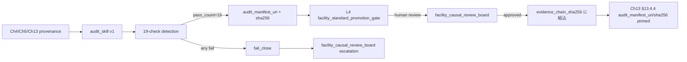

# 第14章　因果 × Agentic 特有の失敗パターンと監査

> **本章の到達目標**
>
> - 因果推論一般で頻出する 6 つの失敗パターン（DAG misspecification、collider bias、positivity violation、外挿 unwarranted、CATE 過剰個別化、refutation スキップ）の **operational な検出契約** を書ける
> - DoE 一般で頻出する 4 つの失敗パターン（randomization 破綻、blocking 失敗、応答曲面外挿誤用、タグチ SN 比誤解釈）を **Ch10-11 の provenance に照らして** 監査できる
> - Agentic 特有の 6 つの failure mode（DAG 勝手書換、confounder 勝手削除、感度分析 skip、"介入した" 勝手記録、seed 上書き、CATE 推薦 Human 未承認送信）を **Ch4 の 3 層承認契約に照らして** 検出できる
> - 各失敗パターンに対応する **fatal action** を Ch4-13 の canonical から引用して監査 manifest に落とせる

## 14.0 章の位置づけと監査の三層モデル

第13章までで、因果推論 × 実験計画 × Agentic の **成功パス**（DAG 承認 → 変数選択承認 → 介入実行承認 → evidence chain 完成）を書き切りました。本章は逆に、**失敗パス**を体系化し、それらを **Skill 契約と audit manifest** に反映する方法を扱います。

本章の失敗パターンは 3 つの層から構成されます：

- **層 1（因果推論一般）**：因果推論の理論・実装上の失敗。Skill が単独で導入するのではなく、**因果推論の教科書的な落とし穴** を Agentic 環境で自動検出可能な契約に翻訳する層。
- **層 2（DoE 一般）**：実験計画の理論・実装上の失敗。Ch10-12 の provenance に検出フックを埋め込む層。
- **層 3（Agentic 特有）**：エージェントが **自律的に判断してしまう** ことに起因する失敗。Ch4 の 3 層承認（`dag_authorization` / `variable_selection_authorization` / `intervention_execution_authorization`）が **意図的にバイパスされる** シナリオを含みます。

各層の失敗パターンは Ch4-13 で定義した **canonical schema と fatal action** を再利用します。本章は新規の schema を最小限にとどめ、**既存契約を検出フックとして参照する audit_manifest** を新設します。

```yaml
audit_manifest:                              # Ch14 §14.5 canonical
  audit_manifest_id: audit_2026_07_arim_project_alpha
  audit_scope:
    - vol_04_ch04_authorization_layers
    - vol_04_ch05_dag_specification
    - vol_04_ch06_estimator_tier
    - vol_04_ch09_refutation_gate
    - vol_04_ch09_counterfactual_scope_gate
    - vol_04_ch10_doe_randomization
    - vol_04_ch11_response_surface
    - vol_04_ch12_bayesian_doe
    - vol_04_ch13_capstone_evidence_chain
  audit_dimensions:
    - causal_general_failures        # §14.1
    - doe_general_failures           # §14.2
    - agentic_specific_failures      # §14.3
  audit_result_uri: <string>
  audit_result_sha256: <string>
  auditor: <string>
  audit_timestamp: <timestamp>
  audit_evidence:
    - detection_check_id: <string>
      fatal_action_referenced: <string>       # Ch4-13 の fatal から引用
      detection_status: pass | fail | not_applicable
      evidence_uri: <string>
```

---

## 14.1 因果推論一般の失敗パターン

### 14.1.1 DAG misspecification（DAG 誤特定）

**症状**：ATE / CATE の推定値が真値から系統的にずれ、感度分析でも説明できない。データ N を増やしても bias が消えない。

**原因**：因果グラフ $G$ に含まれるべき confounder / mediator が欠落、または方向が誤っている。多くの場合、以下の 3 つが起点：

1. **未観測 confounder**：$U$ が処置 $T$ と outcome $Y$ の両方に影響しているが、$U$ が測定されていない（Ch5 §5.3）。
2. **mediator の誤配置**：$T \to M \to Y$ を $T \to Y \leftarrow M$（collider）や $T \leftarrow M \to Y$（confounder）として配線ミス（Ch5 §5.2.2 / §5.2.3）。
3. **時間順序違反**：$Y$ の後に測定された変数を confounder として adjustment（post-treatment adjustment）（Ch5 §5.2.5）。

**検出契約（audit_check）**：

```yaml
detection_check:
  check_id: dag_misspecification_check
  check_type: dag_specification_integrity
  linked_provenance:
    - Ch5.approved_dag_uri                    # DAG spec の pin
    - Ch5.approved_dag_sha256
    - Ch5.hypothesis_uri                       # DAG 提案の根拠
  automated_checks:
    - temporal_ordering_check:                 # 変数間の測定タイミング整合
        variable_timestamp_uri: <string>       # 各変数の測定時刻表
        expected: all_confounders_pre_treatment
        fail_action: fail_close_and_flag_post_treatment_adjustment
    - unmeasured_confounder_probe:             # Ch9 §9.7.3 E-value
        e_value_threshold: 1.5                  # Ch4 §4.5 canonical と統一（N-2 修正）
        current_e_value: <float>
        fail_action: require_sensitivity_analysis_or_re_dag
    - mediator_direction_check:                # Ch5 §5.2.2 mediator vs Ch5 §5.2.3 collider
        variable_role_declared: [mediator, collider, confounder]
        temporal_evidence_uri: <string>
        fail_action: fail_close_and_request_dag_revision
  human_review_required_when:
    - any_automated_check_status: fail
    - unmeasured_confounder_probe.current_e_value: less_than_1.5  # Ch4 §4.5 minimum_e_value と一致
  fatal_action_referenced:                     # Ch4-13 canonical + Ch14 新設に prefix で区別（B-1 修正）
    - Ch5.adjust_for_post_treatment_variable_without_marking_as_mediator  # Ch5 §5.6 に back-register 済み
    - Ch5.claim_dag_of_record_without_hypothesis_uri_and_e_value_probe    # Ch5 §5.6 に back-register 済み
    - Ch4.Table_4_4_item_16                                                # Ch4 §4.8 item 16 (post-treatment adjustment)
    - Ch9.report_effect_without_refutation_when_declared_required          # Ch9 §9.7.1 実在
    - Ch4.Table_4_4_item_2                                                 # Ch4 §4.8 item 2 (Unauthorized DAG modification)
```

**修復方法**：DAG を revise し、`approved_dag_sha256` を新しい hash に差し替える。Ch4 §4.6.4 の evidence chain 再構築が必要（下流の estimator も rerun）。**Ch13 §13.5 fatal `modify_approved_dag_after_downstream_start`** に該当する場合は、Skill 契約上は **プロジェクトの巻き戻し**（Phase 1 差戻し）を意味し、operator への告知が必須。

**Ch14 canonical fatal（新設）**：

```yaml
- adjust_for_post_treatment_variable_without_marking_as_mediator     # §5.2.5
- claim_dag_of_record_without_hypothesis_uri_and_e_value_probe        # DAG spec 監査
```

### 14.1.2 Collider bias（合流点調整による bias）

**症状**：処置 $T$ と outcome $Y$ の間に **本来存在しない相関** が現れる（selection bias、Berkson's bias、M-bias の一種）。Ch5 §5.2.3 の典型例。

**原因**：$T \to Z \leftarrow Y$ 構造の $Z$（collider）を adjustment set に含めた。Ch5 §5.2.4 の M-bias は $U_1 \to Z \leftarrow U_2$ かつ $U_1 \to T$, $U_2 \to Y$ の構造で、$Z$ が **観測可能** かつ $U_1, U_2$ が **未観測** のとき collider を通じて $T$-$Y$ 間に偽相関を生む。

**検出契約**：

```yaml
detection_check:
  check_id: collider_bias_check
  check_type: adjustment_set_integrity
  linked_provenance:
    - Ch5.approved_dag_uri
    - Ch5.backdoor_adjustment_set              # DAG から選ばれた adjustment 集合
    - Ch6.estimator_input_variables            # 実際に estimator へ渡された共変量
  automated_checks:
    - adjustment_set_vs_dag_consistency:       # DAG から derive された set と実装が一致するか
        expected_set: <from_dag_backdoor_criterion>
        actual_set: <from_estimator_input>
        set_diff: symmetric_difference          # 不一致は fatal
        fail_action: fail_close_and_regenerate_adjustment_set
    - collider_in_adjustment_set_probe:        # backdoor path 上の collider を検出
        collider_variables_declared: <list_from_dag>
        collider_variables_in_actual: <list_computed_from_actual_set>
        fail_action: fail_close_and_reject_estimator_run
    - m_bias_probe:                             # Ch5 §5.2.4 の M-bias パターン
        u1_u2_unmeasured_flag: <bool>          # DAG に未観測 confounder が明示されているか
        z_in_adjustment_set: <bool>            # Z が adjustment に入っているか
        m_bias_risk: high | medium | low       # 両方 true なら high
        fail_action: fail_close_and_require_sensitivity_or_re_dag
  fatal_action_referenced:
    - Ch5.adjust_for_collider_declared_in_dag                 # Ch5 §5.6 に back-register 済み
    - Ch5.adjust_for_post_treatment_variable_without_marking_as_mediator  # Ch5 §5.6 back-register
    - Ch5.modify_adjustment_set_after_downstream_start        # Ch5 §5.6 back-register
    - Ch4.Table_4_4_item_3                                    # Ch4 §4.8 item 3 (Adjustment of collider without authorization)
    - Ch4.Table_4_4_item_17                                   # Ch4 §4.8 item 17 (silent 変更)
```

**修復方法**：Ch5 §5.2.3 の backdoor criterion を再適用し、adjustment set から collider を除外。Ch6 の estimator を rerun し、`approved_dag_sha256` は変更なし（DAG spec 自体は正しく、estimator の実装バグ）。ただし推定値が変わるため、Phase 2/3 が既に開始されている場合は Ch13 §13.5 fatal `modify_approved_dag_after_downstream_start` の**類似 pattern** として `modify_adjustment_set_after_downstream_start` を Ch5 §5.6 に back-register 済み。

**参照する fatal**（Ch5 §5.6 back-register 済み）：

```yaml
- Ch5.modify_adjustment_set_after_downstream_start                        # collider 削除も含む
- Ch14.reuse_adjustment_set_across_dag_versions_without_reverification    # Ch14 新設: DAG が変わったら adjustment 再検証
```

### 14.1.3 Positivity violation（陽性条件破綻）

**症状**：ATT / CATE の推定値が特定の層で不安定になり、propensity score の分布が 0 または 1 の近傍に偏る。IPW 推定量の分散が発散する。

**原因**：条件付き確率 $P(T = t \mid X = x) = 0$ または $= 1$ となる領域 $x$ が存在する。Ch4 §4.4.1 の positivity 契約が破綻。以下の 3 パターン：

1. **structural non-positivity**：物理的に不可能な組合せ（例：装置 C は溶媒比 0.8 以上を扱えない）。
2. **practical non-positivity**：観測データ内で偶然 0 サンプル（サンプルサイズ不足）。
3. **stratum-level non-positivity**：全体では positivity OK だが、特定 stratum（`instrument=C`）で破綻。

**検出契約**：

```yaml
detection_check:
  check_id: positivity_violation_check
  check_type: positivity_by_stratum_integrity
  linked_provenance:
    - Ch6.propensity_score_uri                 # propensity score の記録
    - Ch6.positivity_by_stratum_report_uri     # Ch4 §4.4.1 canonical
  automated_checks:
    - propensity_bounds_check:
        threshold_lower: 0.05                   # Ch4 §4.4.1 canonical
        threshold_upper: 0.95
        violations_by_stratum: <dict>
        fail_action: fail_close_and_report_conditional_positivity
    - stratum_positivity_check:                # 各 stratum で individual に検査
        strata: [instrument_id, operator_id]
        stratum_positivity_status: <dict>       # pass | conditional | fail
        conditional_pass_output: non_actionable_diagnostic_only
        fail_action: fail_close_and_pre_register_applicability_manifest
    - structural_vs_practical_probe:           # 物理的に不可能 vs サンプル不足
        classification: structural | practical | ambiguous
        applicability_manifest_uri: <string>    # Ch4 §4.8
        fail_action_by_class:
          structural: mark_as_excluded_region
          practical: request_additional_data_or_doe
          ambiguous: fail_close_and_request_human_review
  fatal_action_referenced:
    - Ch4.Table_4_4_item_6                              # Positivity 違反を無視して estimation
    - Ch13.report_cate_without_positivity_by_stratum    # Ch13 §13.5 実在 fatal
    - Ch14.report_ate_or_cate_without_stratum_level_positivity_check   # Ch14 新設
    - Ch14.classify_practical_non_positivity_as_structural_without_evidence  # Ch14 新設
```

**修復方法**：`applicability_manifest` に **除外領域を pre-register** し（Ch4 §4.8）、CATE 推定を restrict domain に限定。Phase 2 で DoE を打つ場合は、除外領域の外側で追加 DoE を発注（Ch10）。

**Ch14 canonical fatal（新設、動詞開始 naming に統一 — N-10）**：

```yaml
- Ch14.report_ate_or_cate_without_stratum_level_positivity_check
- Ch14.classify_practical_non_positivity_as_structural_without_evidence
```

### 14.1.4 外挿 unwarranted（正当化されない外挿）

**症状**：訓練データの support から離れた領域で予測を出し、その予測を **意思決定に使う**。CATE / response surface / SCM のいずれでも起こる。

**原因**：`counterfactual_scope_gate`（Ch4 §4.5.2）が正しく発火しない、または `support_envelope_check` が strict でない。Ch13 §13.4.3 の **5-check gate（第 3 相）** が bypass されるとこのモードに陥る。

**検出契約**：

```yaml
detection_check:
  check_id: unwarranted_extrapolation_check
  check_type: support_envelope_integrity
  linked_provenance:
    - Ch9.counterfactual_scope_gate_uri        # Phase 1 発火
    - Ch11.counterfactual_scope_gate_uri       # Phase 2 発火（response surface）
    - Ch13.counterfactual_scope_gate_scm_uri   # Phase 3 発火（SCM）
  automated_checks:
    - support_envelope_dimensions_check:
        expected_dimensions: <from_training_data>
        query_dimensions: <from_intervention_recommendation>
        outside_support_dimensions: <list>
        envelope_report_uri: <string>
        strict_mode: true                       # Phase 2/3 は strict 必須
        fail_action: fail_close_and_route_to_next_gate
    - three_gate_activation_check:             # Ch13 §13.4.3 canonical diff
        phase_1_gate_pass: <bool>
        phase_2_gate_pass: <bool>
        phase_3_gate_pass: <bool>
        expected: all_three_pass_before_intervention_recommendation
        fail_action: fail_close_and_reject_intervention
    - method_operational_distinctness_check:   # Phase 1/2/3 で method が operationally 異なるか
        phase_1_method: <expected_string>
        phase_2_method: <expected_string>
        phase_3_method: <expected_string>
        fail_action_if_identical: fatal_reuse_counterfactual_scope_gate_check_names_across_phases_without_operational_distinction
  fatal_action_referenced:
    - Ch4.Table_4_4_item_12b                                # Scope gate 逸脱・SMT 応答曲面の明示的外挿
    - Ch13.report_intervention_recommendation_without_mediator_decomposition   # Ch13 §13.5 実在
    - Ch13.reuse_counterfactual_scope_gate_check_names_across_phases_without_operational_distinction  # Ch13 §13.5 実在
```

**修復方法**：外挿領域で介入を推奨せず、代わりに **追加 DoE を提案**（Ch10 §10.5）または **Bayesian DoE で情報利得の高い候補**（Ch12 §12.5）を提案。介入実行を停止することが必須。

### 14.1.5 CATE 過剰個別化（overfitted heterogeneity）

**症状**：CATE 推定が対象単位ごとに大きくばらつき、cross-validation で不安定。訓練データを分割すると推定値が符号反転する層が現れる。

**原因**：Ch6-8 の CATE 推定器（causal forest / meta-learners）で **交差検証不足**、または `support` 側のサンプル数が少ない層で「見かけの heterogeneity」を検出。Ch8 §8.4 の T-learner が高次元共変量で unstable になる典型パターン。

**検出契約**：

```yaml
detection_check:
  check_id: cate_over_individualization_check
  check_type: heterogeneity_stability
  linked_provenance:
    - Ch8.cate_estimation_provenance_uri
    - Ch8.cross_validation_report_uri
  automated_checks:
    - cate_cv_stability_probe:
        k_fold: 5
        cate_sign_flip_rate_threshold: 0.10     # 10% 以上の層で符号反転 → 不安定
        cate_relative_std_threshold: 0.5         # 相対分散
        fail_action: report_only_ate_or_broader_stratum_cate
    - stratum_sample_size_check:
        min_stratum_n: 30                        # 各 stratum 最小 N
        violated_strata: <list>
        fail_action: aggregate_strata_or_pre_register_low_confidence
    - honest_splitting_check:                  # Athey & Wager 2019 honest splitting
        honest_split_used: <bool>
        fail_action_if_false: rerun_estimator_with_honest_splitting
  fatal_action_referenced:
    - Ch4.Table_4_4_item_6                              # Positivity 違反
    - Ch14.claim_heterogeneity_without_cv_stability_report   # Ch14 新設
    - Ch14.publish_cate_by_stratum_with_stratum_n_below_minimum_without_low_confidence_flag  # Ch14 新設
```

**修復方法**：層を粗く集約（例：`instrument_id × operator_id` を `instrument_id` のみに）、または honest splitting で causal forest を rerun。

**Ch14 canonical fatal（新設）**：

```yaml
- claim_heterogeneity_without_cv_stability_report
- publish_cate_by_stratum_with_stratum_n_below_minimum_without_low_confidence_flag
```

### 14.1.6 Refutation スキップ

**症状**：ATE / CATE の推定値のみが報告され、placebo test / random common cause / subset validation の結果が provenance に無い。

**原因**：Ch9 §9.7.1 の `declared_required_tests` から自動的に選ばれるべき refutation が実行されなかった。**Skill 契約の記述漏れ**か、**skip の意図的判断**（後者は Agentic 特有、§14.3.3 で扱う）。

**検出契約**：

```yaml
detection_check:
  check_id: refutation_gate_skip_check
  check_type: refutation_completeness
  linked_provenance:
    - Ch9.refutation_gate_provenance_uri
    - Ch9.declared_required_tests               # canonical enum
    - Ch9.applicability_manifest_uri            # 非適用の pre-register
  automated_checks:
    - declared_vs_executed_check:
        declared_tests: <list_from_provenance>
        executed_tests: <list_from_report>
        skipped_without_manifest: <list>
        fail_action: fail_close_and_reject_report
    - applicability_manifest_integrity:        # skip した test は manifest に事前登録が必要
        manifest_pre_registered_before_estimation: <bool>
        manifest_sha256_match: <bool>
        fail_action_if_false: fatal_post_hoc_applicability_manifest
    - required_tests_enum_conformance:         # Ch9 §9.7.1 の 10-enum
        enum_version: ch09_v0_3                  # Ch12 で prior_predictive_check + prior_data_alignment 追加後
        conformance_status: pass | fail
        fail_action: fail_close_and_upgrade_enum_version
  fatal_action_referenced:
    - Ch9.report_effect_without_refutation_when_declared_required
    - Ch9.mark_test_as_not_applicable_after_estimation
```

**Ch14 canonical fatal（新設）**：

```yaml
- post_hoc_applicability_manifest                # 推定後に skip を正当化
- downgrade_declared_required_tests_enum_version_silently
```

---

## 14.2 DoE 一般の失敗パターン

### 14.2.1 Randomization 破綻

**症状**：DoE 実行後、`assignment_log` を見ると **本来の randomization seed とは異なる順序** で実施されている。または、operator が「装置 B が空いていたので順序を入れ替えた」といった **後付けの理由** で順序を改変。

**原因**：Ch10 §10.5.3 の 4-stage assignment_log detection（`seed_match` / `assignment_order_match` / `execution_order_match` / `assignment_log_header_recorded`）のいずれかが fail。

**検出契約（Ch10 §10.5.3 canonical に 1:1 対応 — B-2 修正）**：

```yaml
detection_check:
  check_id: randomization_integrity_check
  check_type: assignment_log_4stage_verification
  linked_provenance:
    - Ch10.assignment_log_uri
    - Ch10.randomization_seed_pinned_at
    - Ch10.assignment_log_header_uri
  automated_checks:
    - seed_match:                              # Ch10 §10.5.3 stage 1（canonical 名）
        expected_seed: <from_pre_registration>
        actual_seed: <from_assignment_log>
        fail_action: fatal_randomization_seed_mismatch
    - design_hash_match:                       # Ch10 §10.5.3 stage 2（canonical 名）
        expected_design_sha256: <from_pre_registration>
        actual_design_sha256: <from_execution_records>
        fail_action: fatal_design_matrix_altered_post_pin
    - permutation_reproducibility:             # Ch10 §10.5.3 stage 3（byte-exact 再生成）
        replay_library: <string>                # Ch10 §10.5.3 で pin された permutation library
        replay_library_version: <string>
        replay_policy: byte_exact               # canonical value
        replay_status: pass | fail
        fail_action: fatal_permutation_not_byte_exact
    - execution_records_binding:               # Ch10 §10.5.3 stage 4（execution bind）
        planned_execution_order: <list>
        actual_execution_order: <list>
        binding_evidence_uri: <string>
        fail_action: fatal_execution_records_unbound_to_assignment
  fatal_action_referenced:
    - Ch10.modify_design_matrix_after_randomization_seed_pinned  # Ch10 §10.8 実在
    - Ch13.modify_design_matrix_after_randomization_seed_pinned  # Ch13 §13.5 実在
    - Ch14.publish_ate_with_execution_records_unbound_to_assignment  # Ch14 新設
```

**修復方法**：Randomization を **新しい seed で再実施**。既存の実験結果は「pilot data」として保持するが、正式な ATE 推定には使わない。Ch10 §10.5 の Skill 契約により、operator が「時間が惜しい」を理由に旧データを使うことは fatal に該当。

### 14.2.2 Blocking 失敗

**症状**：装置差・オペレータ差の分散が処置効果と交絡し、ATE の分散が過大評価される。ANOVA 表で block 因子が有意でも、blocking の設計が正しくないと bias は残る。

**原因**：Ch10 §10.4 の blocking 設計が不完全。以下の 3 パターン：

1. **incomplete block design を complete と誤宣言**：全 block で全処置を実施できていない。
2. **blocking factor が処置に依存**：`instrument_id` が `substrate_temperature_c` に依存する（例：高温は装置 A のみ）→ blocking と処置が交絡。
3. **block size mismatch**：block ごとの単位数が不揃いで、weighted ATE の重みが不明。

**検出契約**：

```yaml
detection_check:
  check_id: blocking_design_integrity_check
  check_type: blocking_provenance_conformance
  linked_provenance:
    - Ch10.approved_design_provenance_uri
    - Ch10.blocking_factors_declared
  automated_checks:
    - block_completeness_check:
        block_type_declared: complete | incomplete
        actual_block_type: <computed_from_assignment_log>
        fail_action_if_mismatch: fatal_blocking_type_misdeclared
    - treatment_block_independence_check:      # χ² test で treatment × block の独立性
        chi_square_statistic: <float>
        p_value: <float>
        independence_threshold: 0.05
        fail_action: fail_close_and_report_confounded_blocking
    - block_size_uniformity_check:
        block_sizes: <list>
        max_min_ratio_threshold: 2.0
        fail_action: report_weighted_ate_with_weights_uri
  fatal_action_referenced:
    - Ch10.report_effect_without_blocking_when_declared_blocked   # Ch10 §10.8 back-register 済み
    - Ch10.misdeclare_block_type                                   # Ch10 §10.8 back-register 済み
    - Ch10.report_effect_with_confounded_blocking_without_flag    # Ch10 §10.8 back-register 済み
```

**Ch14 canonical fatal（新設）**：

```yaml
- misdeclare_block_type
- report_effect_with_confounded_blocking_without_flag
```

### 14.2.3 応答曲面外挿誤用（GP 特有チェック — N-7 で純化）

**症状**：Ch11 の GP surrogate 応答曲面を、**訓練 support の外** で評価し、最適条件として提案。Envelope 一般の外挿検出は §14.1.4 に集約し、本節は **GP 予測分散と CCD α value** に純化する。

**原因**：Ch11 §11.7 の `counterfactual_scope_gate`（Phase 2）が bypass された、または `threshold_calibration` が未実施。Ch13 §13.4.3 の canonical diff で示した通り、Phase 2 は **strict mode** の `support_envelope_check` が必須。

**検出契約（GP-specific: predictive variance + CCD α value のみ — N-7 修正）**：

```yaml
detection_check:
  check_id: response_surface_gp_extrapolation_check
  check_type: gp_predictive_variance_and_alpha_integrity   # envelope 一般は §14.1.4 参照
  linked_provenance:
    - Ch11.response_surface_provenance_uri
    - Ch11.counterfactual_scope_gate_uri
  automated_checks:
    - gp_predictive_variance_bounds:           # GP 特有：predictive variance が calibrated threshold を超えないか
        query_points: <from_optimization_output>
        predictive_variance_at_query: <list>
        variance_threshold: <from_calibration>
        fail_action: fail_close_and_reject_optimization_output
    - alpha_value_check:                       # Ch11 S-3 canonical、CCD 特有
        expected_alpha: 1.68179283050743        # CCD α value
        actual_alpha: <float>
        alpha_tolerance: 1e-9
        fail_action_if_mismatch: fatal_alpha_value_drift
  fatal_action_referenced:
    - Ch11.report_optimum_outside_gp_support_without_scope_gate      # Ch11 §11.8 back-register 済み
    - Ch11.publish_response_surface_optimum_without_alpha_value_pin  # Ch11 §11.8 back-register 済み
```

> [!NOTE]
> Envelope-based の外挿検出（convex hull, support bounds）は §14.1.4 の `unwarranted_extrapolation_check` に集約されている。本節は GP surrogate 特有の predictive variance と CCD α value drift のみを扱う。

### 14.2.4 タグチ SN 比誤解釈

**症状**：Taguchi 直交表による experiment で、SN 比（signal-to-noise ratio）を **平均効果と分散効果の分離** ではなく、**単なる分散指標** として使用。分散最小化と平均最適化が同一視される。

**原因**：Taguchi 手法の哲学的前提（loss function、robust design）を無視して、SN 比の数値のみを ranking に使用。**Ch11 §11.6.2 の Taguchi SN 比 SoT**（nominal_the_best / smaller_the_better / larger_the_better enum + `switch_sn_ratio_type_after_execution: fatal`）が canonical。（N-3 修正: cite 先を Ch10 → Ch11 §11.6.2）

**検出契約**：

```yaml
detection_check:
  check_id: taguchi_sn_ratio_interpretation_check
  check_type: sn_ratio_semantic_integrity
  linked_provenance:
    - Ch11.taguchi_design_provenance_uri         # Ch11 §11.6.2
    - Ch11.sn_ratio_type_declared                # nominal_the_best | smaller_the_better | larger_the_better
  automated_checks:
    - sn_ratio_type_vs_optimization_target:
        declared_sn_type: <string>
        optimization_target: <string>
        semantic_match: <bool>
        fail_action_if_mismatch: fail_close_and_report_sn_type_misalignment
    - loss_function_documented:
        loss_function_uri: <string>
        loss_function_type: quadratic | asymmetric | custom
        fail_action_if_missing: request_loss_function_declaration
    - mean_variance_separation_check:          # 平均効果と分散効果を独立に分析
        mean_effect_report_uri: <string>
        variance_effect_report_uri: <string>
        both_present: <bool>
        fail_action_if_false: fatal_report_sn_only_without_mean_variance_separation
  fatal_action_referenced:
    - Ch11.switch_sn_ratio_type_after_execution                  # Ch11 §11.8 back-register 済み
    - Ch11.publish_taguchi_result_without_loss_function_uri      # Ch11 §11.8 back-register 済み
    - Ch11.report_sn_only_without_mean_variance_separation       # Ch11 §11.8 back-register 済み
```

**Ch14 canonical fatal（新設）**：

```yaml
- misdeclare_sn_ratio_type
- report_sn_only_without_mean_variance_separation
- interpret_taguchi_sn_as_pure_variance_index_without_loss_function
```

---

## 14.3 Agentic 特有の失敗パターン

本節は Ch4 の 3 層承認（`dag_authorization` / `variable_selection_authorization` / `intervention_execution_authorization`）が **意図的にバイパスされる** か **エージェントの自律判断で改変される** シナリオを扱います。層 1・層 2 と異なり、**Agentic 環境でなければ起きない** 失敗モードです。

### 14.3.1 DAG 勝手書換（silent DAG modification）

**症状**：`approved_dag_uri` は同一だが、Skill が内部で **backdoor adjustment set のみを差し替えて** 推定を実行。evidence chain は「同じ DAG を使った」と主張するが、実際の adjustment は異なる。

**原因**：Ch4 §4.5.1 の DAG 承認契約と Ch5 §5.6 の Skill 分離が不完全に実装され、`skill_1a_dag_proposal` の出力を `skill_2a_variable_selection` が **無断で改変** できる。

**検出契約**：

```yaml
detection_check:
  check_id: silent_dag_modification_check
  check_type: dag_evidence_chain_immutability
  linked_provenance:
    - Ch4.dag_authorization_provenance
    - Ch13.evidence_chain
    - Ch13.evidence_chain_sha256_algorithm      # sha256_json_canonical_rfc8785
    - Ch13.evidence_chain_sha256_input_fields
  automated_checks:
    - approved_dag_sha256_pin_check:
        approved_dag_sha256_at_authorization: <string>
        approved_dag_sha256_at_execution: <string>
        fail_action_if_mismatch: fatal_modify_approved_dag_after_downstream_start
    - adjustment_set_derived_from_dag_check:   # adjustment set が DAG から derive されているか
        derivation_procedure: backdoor_criterion | frontdoor_criterion
        derivation_procedure_uri: <string>
        actual_adjustment_set: <list>
        expected_adjustment_set: <computed_from_dag>
        fail_action_if_mismatch: fatal_silent_adjustment_set_override
    - evidence_chain_sha256_verification:      # Ch13 §13.4.4 canonical
        canonical_json_uri: <string>            # RFC 8785 出力
        evidence_chain_sha256_recomputed: <string>
        evidence_chain_sha256_stored: <string>
        fail_action_if_mismatch: fatal_evidence_chain_tampering
  fatal_action_referenced:
    - Ch13.modify_approved_dag_after_downstream_start                       # Ch13 §13.5 実在
    - Ch13.modify_evidence_chain_after_approval                             # Ch13 §13.5 実在
    - Ch13.modify_evidence_chain_sha256_input_fields_after_publication      # Ch13 §13.5 実在
    - Ch4.Table_4_4_item_2                                                  # Ch4 §4.8 item 2 (Unauthorized DAG modification)
    - Ch4.Table_4_4_item_17                                                 # Ch4 §4.8 item 17 (silent 変更)
```

### 14.3.2 Confounder 勝手削除

**症状**：エージェントが「この confounder はほぼ効かないので削除しました」と自主判断で adjustment set を縮小。DAG は変わらないが、実効的な adjustment が変わる。

**原因**：Skill の autonomy 境界が曖昧。Ch4 §4.5.1 の `dag_authorization` は DAG 全体を承認するが、adjustment set の具体的な列選択を **Skill 側の autonomy** に委ねている実装で発生。

**検出契約**：

```yaml
detection_check:
  check_id: silent_confounder_removal_check
  check_type: adjustment_set_immutability
  linked_provenance:
    - Ch4.variable_selection_authorization_provenance
    - Ch6.estimator_input_variables
  automated_checks:
    - approved_covariates_pin_check:           # variable_selection_authorization で pin
        approved_covariates: <list>             # Ch4 §4.5.2 canonical
        actual_covariates_used: <list>
        set_diff: symmetric_difference
        fail_action_if_diff_nonempty: fatal_execute_estimator_without_variable_selection_authorization
    - autonomy_boundary_check:                 # Ch4 §4.3.2 canonical
        skill_action_class: <declared>
        actual_action: <observed>
        boundary_violation: <bool>
        fail_action_if_true: fatal_agent_autonomous_covariate_removal
  fatal_action_referenced:
    - Ch4.Table_4_4_item_5                                       # Ch4 §4.8 item 5 (execute_estimator_without_variable_selection_authorization)
    - Ch4.Table_4_4_item_9                                       # Ch4 §4.8 item 9 (agent_autonomous_action_beyond_declared_class)
    - Ch14.silently_remove_covariate_from_approved_adjustment_set  # Ch14 新設
```

**Ch14 canonical fatal（新設、動詞開始 naming に統一 — N-10）**：

```yaml
- Ch14.silently_remove_covariate_from_approved_adjustment_set
- Ch14.autonomously_reduce_adjustment_set_below_approved_size
```

### 14.3.3 感度分析スキップ（sensitivity analysis skip）

**症状**：`refutation_gate_provenance` に E-value / Rosenbaum bounds / placebo test の記録が無いまま `intervention_recommendation` が発行される。§14.1.6 の refutation スキップと類似だが、Agentic 特有版では **エージェントが「時間が惜しい」「効果は明白」を理由に意図的に省略** する。

**原因**：Skill の action_class が `propose_only` ではなく `propose_and_execute` の場合、エージェントが gate 自体を bypass する誘惑にさらされる。Ch4 §4.5.2 の canonical では `refutation_gate` は L2（variable_selection_authorization）の前提条件だが、Skill 実装で強制されないと skip される。**Skill の意図的 bypass 記録は `agent_action_log`（Ch4 §4.9 template ⑨ に back-register 済み）から取得。**（N-5 修正）

**検出契約**：

```yaml
detection_check:
  check_id: agentic_sensitivity_skip_check
  check_type: refutation_gate_agentic_bypass
  linked_provenance:
    - Ch9.refutation_gate_provenance_uri
    - Ch4.variable_selection_authorization_provenance
    - Ch4.agent_action_log_uri                 # §4.9 template ⑨
  automated_checks:
    - refutation_gate_completeness_pre_l2_check:
        refutation_gate_pass_before_l2: <bool>
        l2_authorization_timestamp: <timestamp>
        refutation_gate_timestamp: <timestamp>
        temporal_ordering: refutation_gate_before_l2
        fail_action_if_violated: fatal_l2_authorization_without_prior_refutation_gate
    - e_value_threshold_check:                 # Ch4 §4.5 minimum_e_value canonical と統一 (N-2)
        e_value_declared: <float>
        e_value_threshold: 1.5                  # Ch4 §4.5 canonical
        fail_action_if_below: fail_close_and_require_re_sensitivity
    - agent_action_log_check:                  # Ch4 §4.9 template ⑨ (agent_action_log) を照会
        agent_action_log_uri: <string>
        gate_bypass_attempts: <list>            # log 内の bypass 試行
        fail_action_if_nonempty: fatal_attempt_agentic_gate_bypass
  fatal_action_referenced:
    - Ch9.report_effect_without_refutation_when_declared_required   # Ch9 §9.7.1 実在
    - Ch4.Table_4_4_item_22                                          # Ch4 §4.8 item 22 (audit_manifest 逸脱)
    - Ch14.attempt_agentic_gate_bypass                               # Ch14 新設
```

### 14.3.4 「介入した」勝手記録（silent intervention logging）

**症状**：介入実行の実績ログ（`intervention_execution_log`）が、**Human 承認前** に生成されているか、あるいは **承認と異なる介入** を「承認された介入」として記録。

**原因**：Ch4 §4.6.3 の `intervention_execution_authorization` の temporal ordering 契約が不完全。Skill が「介入を先に実施して事後承認を取る」パターンで実装される（fail-forward）。**Ch4 §4.6.2 に本節で back-register 済み**（`intervention_execution_timestamp` + `temporal_ordering` block）。（B-3 note）

**検出契約**：

```yaml
detection_check:
  check_id: silent_intervention_logging_check
  check_type: intervention_execution_temporal_integrity
  linked_provenance:
    - Ch4.intervention_execution_authorization_provenance    # §4.6.2 に temporal_ordering block back-register 済み
    - Ch13.evidence_chain
  automated_checks:
    - temporal_ordering_l3_before_execution:
        l3_authorization_timestamp: <timestamp>
        intervention_execution_timestamp: <timestamp>       # Ch4 §4.6.2 back-register 済み
        fail_action_if_violated: fatal_intervention_executed_before_l3_authorization
    - intervention_uri_match_check:
        approved_intervention_uri: <string>
        executed_intervention_uri: <string>
        uri_match: <bool>
        fail_action_if_false: fatal_intervention_executed_differs_from_approved
    - execution_log_provenance_completeness:
        log_uri: <string>
        log_sha256: <string>
        log_timestamp_range: <interval>
        approval_timestamp: <timestamp>
        approval_within_log_range: <bool>
        fail_action_if_false: fatal_intervention_log_predates_approval
  fatal_action_referenced:
    - Ch4.Table_4_4_item_18                                            # Ch4 §4.8 item 18 (temporal ordering violation)
    - Ch4.Table_4_4_item_19                                            # Ch4 §4.8 item 19 (executed_differs_from_approved)
    - Ch13.execute_intervention_without_evidence_chain_complete        # Ch13 §13.5 実在
```

**Ch14 canonical fatal（新設、動詞開始 naming — N-10）**：

```yaml
- Ch14.execute_intervention_before_l3_authorization        # Ch4 §4.8 item 18 と対応
- Ch14.log_intervention_before_l3_approval_timestamp
```

### 14.3.5 Reproducibility seed 上書き

**症状**：`randomization_seed` / `estimator_random_seed` / `bootstrap_seed` のいずれかが、実験の途中で **異なる値に上書き** され、pinning 契約が破綻。

**原因**：Ch10 §10.5.3 / Ch11 §11.3 の seed pinning が strict でなく、エージェントが「convergence が改善する」との理由で seed を試行変更。

**検出契約**：

```yaml
detection_check:
  check_id: seed_overwrite_check
  check_type: seed_pinning_immutability
  linked_provenance:
    - Ch10.randomization_seed_pinned_at
    - Ch11.estimator_random_seed_pinned_at
    - Ch11.bootstrap_seed_pinned_at
  automated_checks:
    - seed_history_check:                      # 全 seed の変更履歴
        seed_change_events: <list_from_audit_log>
        allowed_seed_change_after_pin: false
        fail_action_if_change_after_pin: fatal_seed_overwrite_after_pin
    - seed_value_consistency:
        randomization_seed_at_pin: <int>
        randomization_seed_at_execution: <int>
        estimator_seed_at_pin: <int>
        estimator_seed_at_execution: <int>
        bootstrap_seed_at_pin: <int>
        bootstrap_seed_at_execution: <int>
        fail_action_if_any_mismatch: fatal_seed_mismatch_at_execution
  fatal_action_referenced:
    - Ch10.modify_design_matrix_after_randomization_seed_pinned    # Ch10 §10.8 実在
    - Ch11.overwrite_estimator_random_seed_after_pin               # Ch11 §11.8 back-register 済み
    - Ch11.overwrite_bootstrap_seed_after_pin                      # Ch11 §11.8 back-register 済み
    - Ch11.publish_estimate_with_seed_mismatch_between_pin_and_execution  # Ch11 §11.8 back-register 済み
```

**Ch14 canonical fatal（新設、動詞開始 naming — N-10）**：

```yaml
- Ch14.overwrite_pinned_seed_during_execution      # 上記 Ch10/Ch11 fatal の Ch14 側 aggregation
- Ch14.publish_estimate_with_seed_mismatch_at_execution
```

### 14.3.6 CATE 推薦を Human 未承認で外部送信

**症状**：Skill が CATE 推定結果と「推奨介入条件」を、**Human 承認前** に外部（実運用系、他プロジェクト、報告書）へ送信。

**原因**：Ch4 §4.6.3 の L3 authorization が strict でなく、Skill の action_class が `propose_and_broadcast` に近い実装。**送信先チャネル宣言（`egress_channels_declared`）と `authorized_broadcast_targets` は Ch4 §4.9 template ⑩ egress_control に back-register 済み**（N-6 修正）。

**検出契約**：

```yaml
detection_check:
  check_id: unauthorized_broadcast_check
  check_type: intervention_recommendation_egress_control
  linked_provenance:
    - Ch4.intervention_execution_authorization_provenance
    - Ch4.egress_control_uri                    # Ch4 §4.9 template ⑩ に back-register 済み
    - Ch4.egress_channels_declared              # egress_control block 内
    - Ch4.authorized_broadcast_targets          # egress_control block 内
  automated_checks:
    - egress_channel_authorization_check:
        broadcast_events: <list_from_audit_log>
        authorized_channels: <list>              # Ch4 §4.9 template ⑩ から取得
        unauthorized_broadcasts: <list>
        fail_action_if_nonempty: fatal_intervention_recommendation_broadcast_without_l3
    - external_project_transfer_check:         # Ch13 §13.4.4 evidence chain 流用
        evidence_chain_reused: <bool>
        reuse_target_project: <string>
        re_authorization_present: <bool>
        fail_action_if_reuse_without_reauth: fatal_reuse_evidence_chain_across_projects_without_re_authorization
    - human_approval_before_broadcast_check:
        approval_timestamp: <timestamp>
        broadcast_timestamps: <list>
        all_broadcasts_after_approval: <bool>
        fail_action_if_false: fatal_broadcast_predates_l3_authorization
  fatal_action_referenced:
    - Ch4.Table_4_4_item_20                                                # Ch4 §4.8 item 20 (broadcast without L3)
    - Ch13.reuse_evidence_chain_across_projects_without_re_authorization   # Ch13 §13.5 実在
```

**Ch14 canonical fatal（新設、動詞開始 naming — N-10）**：

```yaml
- Ch14.broadcast_intervention_recommendation_without_l3_authorization
- Ch14.broadcast_before_l3_authorization_timestamp
- Ch14.transfer_cate_recommendation_externally_without_re_authorization
```

### 14.3.7 施設標準の silent 継承（silent facility standard inheritance） — B-6 追加

**症状**：Phase 3 で承認された介入条件が「施設標準」として `approved_intervention_becomes_facility_standard` に昇格されるが、L4 gate（`facility_standard_promotion_gate`、Ch4 §4.6.1 back-register 済み）を経ずに他プロジェクトから **暗黙的に参照** される。

**原因**：`facility_scope_escalation` の pre_conditions（`audit_manifest_v1_pass` 等、Ch4 §4.6.2 に back-register 済み）が enforce されない、または他プロジェクトの Skill が `facility_standard_uri` を直接参照して認可プロセスをスキップ。

**検出契約**：

```yaml
detection_check:
  check_id: silent_facility_standard_inheritance_check
  check_type: l4_gate_bypass_detection
  linked_provenance:
    - Ch4.facility_scope_escalation_uri          # §4.6.2 back-register 済み
    - Ch4.facility_standard_promotion_gate_uri   # §4.6.1 L4 gate back-register 済み
  automated_checks:
    - l4_gate_pre_conditions_check:
        audit_manifest_v1_pass: <bool>
        pre_conditions_all_pass: <bool>
        fail_action_if_false: fatal_bypass_facility_standard_promotion_gate
    - facility_standard_reference_provenance:
        referencing_project_ids: <list>
        each_reference_has_l4_authorization_uri: <bool>
        fail_action_if_missing: fatal_reference_facility_standard_without_l4_authorization
  fatal_action_referenced:
    - Ch4.Table_4_4_item_23                                # Ch4 §4.8 item 23 (L4 promotion violation)
    - Ch14.bypass_facility_standard_promotion_gate         # Ch14 新設
    - Ch14.reference_facility_standard_without_l4_authorization  # Ch14 新設
```

### 14.3.8 逐次ベイズ prior chain 断絶（sequential Bayesian prior chain break） — B-6 追加

**症状**：Ch12 の逐次ベイズ更新で、Phase N の posterior が Phase N+1 の prior として使われるべきところ、**中間で prior が黙って再初期化** される。または `prior_family` の enum（theta/mu/tau、Ch12 §12.2.2 canonical）が Phase 間で silent に切替わる。

**原因**：Skill が「convergence 改善」を理由に prior を reset、または `prior_family` の canonical enum を **operationally 同一** の別名で流用（Ch13 §13.5 `reuse_counterfactual_scope_gate_check_names_across_phases_without_operational_distinction` の親戚パターン）。

**検出契約**：

```yaml
detection_check:
  check_id: sequential_bayesian_prior_chain_break_check
  check_type: prior_posterior_chain_immutability
  linked_provenance:
    - Ch12.prior_provenance_chain_uri
    - Ch12.prior_family_declared                # theta | mu | tau (Ch12 §12.2.2 canonical)
  automated_checks:
    - posterior_to_prior_binding_check:
        phase_n_posterior_sha256: <string>
        phase_n_plus_1_prior_sha256: <string>
        binding_verified: <bool>
        fail_action_if_false: fatal_break_prior_posterior_chain
    - prior_family_enum_stability_check:       # theta/mu/tau が Phase 間で silent に変わっていないか
        prior_family_at_phase_1: <string>
        prior_family_at_phase_2: <string>
        prior_family_at_phase_3: <string>
        enum_change_authorized: <bool>          # 変更するなら pre-register が必要
        fail_action_if_unauthorized_change: fatal_silently_switch_prior_family_enum_across_phases
    - prior_reset_authorization_check:
        prior_reset_events: <list>
        each_reset_has_authorization_uri: <bool>
        fail_action_if_unauthorized: fatal_reset_prior_without_authorization
  fatal_action_referenced:
    - Ch14.break_prior_posterior_chain                            # Ch14 新設
    - Ch14.silently_switch_prior_family_enum_across_phases        # Ch14 新設
    - Ch14.reset_prior_without_authorization                      # Ch14 新設
```

### 14.3.9 Evidence chain の推移的無効化（transitive evidence chain invalidation） — B-6 追加

**症状**：Project A の evidence chain が、Project B の Skill 実行で参照されるが、Project A の evidence chain が **事後に修正** された結果、Project B の主張が silent に無効化。監査時に initial run では pass だが再監査では fail になる。

**原因**：Ch13 §13.4.4 の `evidence_chain_sha256_input_fields` の推移的整合性が不在。Project A の evidence chain が update されても、Project B の参照が pin されず、両者の整合性が事後に破綻。

**検出契約**：

```yaml
detection_check:
  check_id: transitive_evidence_chain_invalidation_check
  check_type: cross_project_evidence_pin_integrity
  linked_provenance:
    - Ch13.evidence_chain
    - Ch13.evidence_chain_sha256_input_fields    # §13.4.4 に audit_manifest_uri/sha256 back-register 済み
  automated_checks:
    - cross_project_reference_pin_check:
        referenced_evidence_chain_ids: <list>
        each_reference_pins_evidence_chain_sha256: <bool>
        fail_action_if_unpinned: fatal_reference_external_evidence_chain_without_sha256_pin
    - transitive_recomputation_check:          # 再監査時に全ての参照先の sha256 を再計算
        current_referenced_sha256_map: <dict>
        pinned_referenced_sha256_map: <dict>
        drift_detected: <bool>
        fail_action_if_drift: fatal_transitive_evidence_chain_drift
    - audit_manifest_immutability_check:       # audit_manifest_uri/sha256 の推移
        audit_manifest_at_original_run: <string>
        audit_manifest_at_reaudit: <string>
        immutability_verified: <bool>
        fail_action_if_false: fatal_modify_audit_manifest_input_fields_after_publication
  fatal_action_referenced:
    - Ch13.modify_evidence_chain_sha256_input_fields_after_publication  # Ch13 §13.5 実在
    - Ch13.modify_audit_manifest_input_fields_after_publication         # Ch13 §13.5 back-register 済み
    - Ch14.reference_external_evidence_chain_without_sha256_pin         # Ch14 新設
```

---

## 14.4 統合監査契約テンプレート（audit_manifest canonical）

§14.1-§14.3 の **19 パターン**（causal 6 + DoE 4 + agentic 9）を **1 つの audit run** で検出する canonical テンプレート：

```yaml
audit_manifest_v1:                             # Ch14 §14.4 canonical
  audit_manifest_id: <string>
  audit_run_provenance:
    auditor_type: automated | human_reviewed | mixed
    auditor: <string>
    audit_started_at: <timestamp>
    audit_completed_at: <timestamp>
    audit_scope_uri: <string>                   # 対象プロジェクトの manifest.yaml
  detection_checks:                             # §14.1-14.3 の 19 checks (B-6 で 3 追加)
    causal_general:
      - dag_misspecification_check              # §14.1.1
      - collider_bias_check                     # §14.1.2
      - positivity_violation_check              # §14.1.3
      - unwarranted_extrapolation_check         # §14.1.4
      - cate_over_individualization_check       # §14.1.5
      - refutation_gate_skip_check              # §14.1.6
    doe_general:
      - randomization_integrity_check           # §14.2.1 (Ch10 §10.5.3 canonical に 1:1 対応)
      - blocking_design_integrity_check         # §14.2.2
      - response_surface_gp_extrapolation_check # §14.2.3 (GP-specific に純化)
      - taguchi_sn_ratio_interpretation_check   # §14.2.4
    agentic_specific:
      - silent_dag_modification_check           # §14.3.1
      - silent_confounder_removal_check         # §14.3.2
      - agentic_sensitivity_skip_check          # §14.3.3
      - silent_intervention_logging_check       # §14.3.4
      - seed_overwrite_check                    # §14.3.5
      - unauthorized_broadcast_check            # §14.3.6
      - silent_facility_standard_inheritance_check       # §14.3.7 (B-6)
      - sequential_bayesian_prior_chain_break_check      # §14.3.8 (B-6)
      - transitive_evidence_chain_invalidation_check     # §14.3.9 (B-6)
  audit_result_summary:
    total_checks_expected: 19                   # invariant (N-8)
    pass_count: <int>
    fail_count: <int>
    not_applicable_count: <int>                 # applicability_manifest で pre-register 済み
    critical_fails: <list>                      # fatal に該当した fails
    invariants:                                 # N-8 追加
      - name: check_count_sum_invariant
        formula: pass_count + fail_count + not_applicable_count == total_checks_expected
        fail_action: fatal_audit_result_summary_count_mismatch
      - name: critical_fails_subset_of_fail
        formula: critical_fails ⊆ fail_list
        fail_action: fatal_critical_fails_not_subset_of_fail
  aggregate_policy:
    pass_requires: all_19_pass_or_pre_registered   # B-6 で 16 → 19
    fail_action: fail_close_and_route_to_facility_causal_review_board
    escalation_path:
      - research_lead
      - facility_causal_review_board
      - ethics_review_board                      # 人的介入を含む場合
  fallback_message_template: |
    Audit {audit_manifest_id} on project {project_id} completed at {audit_completed_at}.
    Result: {pass_count}/19 checks passed, {fail_count} failed, {not_applicable_count} pre-registered as non-applicable.
    Critical fails requiring review: {critical_fails}.
    Escalation route: {escalation_path[0]}.
    Reference the following provenance for evidence:
    - dag_authorization_uri: {dag_authorization_uri}
    - variable_selection_authorization_uri: {variable_selection_authorization_uri}
    - intervention_execution_authorization_uri: {intervention_execution_authorization_uri}
    - evidence_chain_sha256: {evidence_chain_sha256}
```

### 14.4.1 audit_manifest_v1 実行例（YAML instance — S-1 追加）

Ch13 §13.7 の 3-phase capstone（Cu 4 wt% 施設標準昇格ケース）に対する audit run 実行例。critical_fails が 0 個で pass するケースを示す：

```yaml
audit_manifest_v1_instance:                     # S-1: canonical YAML instance
  audit_manifest_id: audit_cu4wt_phase3_pre_facility_promotion
  audit_run_provenance:
    auditor_type: mixed
    auditor: audit_skill@v1.2.3+human_review_lead=arim_causal_board_chair
    audit_started_at: '2026-05-01T09:00:00+09:00'
    audit_completed_at: '2026-05-01T14:30:00+09:00'
    audit_scope_uri: 's3://arim/projects/pj00001_cu_alloy_20260117/manifest.yaml'
  detection_check_results:
    dag_misspecification_check: pass
    collider_bias_check: pass
    positivity_violation_check: pass
    unwarranted_extrapolation_check: pass       # scope_gate 3 phase 全 pass
    cate_over_individualization_check: pass     # honest splitting 済み
    refutation_gate_skip_check: pass            # placebo + random_common_cause + E-value 済み
    randomization_integrity_check: pass         # 4-stage 全 byte-exact
    blocking_design_integrity_check: pass       # instrument_id × operator_id complete
    response_surface_gp_extrapolation_check: pass  # α value 1.68179283050743 一致
    taguchi_sn_ratio_interpretation_check: not_applicable  # Taguchi 未使用（pre-registered）
    silent_dag_modification_check: pass         # approved_dag_sha256 一致
    silent_confounder_removal_check: pass       # approved_covariates 一致
    agentic_sensitivity_skip_check: pass        # gate_bypass_attempts=[]
    silent_intervention_logging_check: pass     # L3 approval < intervention_timestamp
    seed_overwrite_check: pass                  # 3 seed 全 pin match
    unauthorized_broadcast_check: pass          # broadcast_events=[] pre-promotion
    silent_facility_standard_inheritance_check: pass  # L4 pre_conditions all pass
    sequential_bayesian_prior_chain_break_check: pass # posterior→prior binding 3-hop OK
    transitive_evidence_chain_invalidation_check: pass # cross-project ref=0
  audit_result_summary:
    total_checks_expected: 19
    pass_count: 18
    fail_count: 0
    not_applicable_count: 1                     # taguchi
    critical_fails: []
  gate_result: pass
  facility_promotion_authorization: authorized  # L4 gate pass 済み
```

**運用ポリシー**：
- **audit 実行タイミング**：Phase 3 完了時（介入実行承認前）に必ず 1 回、および facility standard として promotion される前に 1 回。Ch4 §4.6.2 の `facility_scope_escalation.applies_to` enum に `approved_intervention_becomes_facility_standard` が含まれる場合、audit_manifest の pass が **前提条件**（Ch4 §4.6.2 に back-register 済み、B-4）。
- **audit の immutability**：`audit_result_uri` と `audit_result_sha256` は evidence chain に組み込まれる。**Ch13 §13.4.4 の `evidence_chain_sha256_input_fields` に `audit_manifest_uri` と `audit_manifest_sha256` を back-register 済み**（B-5）。`modify_audit_manifest_input_fields_after_publication` は Ch13 §13.5 に fatal として back-register 済み。

---

## 14.5 Ch14 で確立する Skill 契約テンプレート

### 14.5.1 audit_skill_contract

```yaml
skill_contract:                                 # Ch4 §4.7 canonical に準拠
  skill_id: audit_manifest_generation_skill
  skill_type: audit_generation
  role: human_required                          # audit 結果の判定は Human
  action_class: propose_and_execute_with_gate   # audit run は自動、判定は Human
  gate_level: L4_facility_standard_promotion_review  # 新設 L4
  input_provenance:
    - Ch4.dag_authorization_provenance_uri
    - Ch4.variable_selection_authorization_provenance_uri
    - Ch4.intervention_execution_authorization_provenance_uri
    - Ch13.evidence_chain_uri
  output_provenance:
    - audit_manifest_uri
    - audit_manifest_sha256
    - audit_result_uri
    - audit_result_sha256
  prohibited_actions:                           # Ch14 §14.3 の Agentic fatal を統合（動詞開始 naming — N-10）
    - Ch14.modify_audit_manifest_after_completion               # 監査結果の改竄
    - Ch14.skip_detection_check_without_applicability_manifest
    - Ch14.claim_audit_pass_without_running_all_19_checks       # B-6: 16 → 19
    - Ch14.reuse_audit_manifest_across_projects_without_re_run
    - Ch14.modify_audit_manifest_input_fields_after_publication  # Ch13 §13.5 と対応
  fallback_approver: facility_causal_review_board
```

**audit_skill_contract フロー図（S-2 追加）**：



### 14.5.2 facility_standard_promotion_gate（L4 gate 新設）

Ch4 §4.6.2 の `facility_scope_escalation` を **operational な gate** として実装（**Ch4 §4.6.1 L4 row と §4.6.2 pre_conditions/gate_level に back-register 済み** — B-4）：

```yaml
facility_standard_promotion_gate:               # Ch4 §4.6.1 L4 row に back-register 済み
  gate_level: L4_facility_standard_promotion
  input_provenance:
    - audit_manifest_uri
    - audit_result_uri
    - Ch4.facility_scope_escalation.applies_to  # 拡張対象
  pre_conditions:                               # Ch4 §4.6.2 に back-register 済み
    - audit_result_summary.pass_count: 19       # B-6: 16 → 19
    - audit_result_summary.fail_count: 0
    - critical_fails: []
    - audit_manifest_v1_pass: true              # Ch4 §4.6.2 canonical
  approval_layer:
    - facility_causal_review_board_approval:
        approver: facility_causal_review_board
        approved_at: <timestamp>
        approved_facility_scope: <string>       # 具体的な適用範囲
  post_conditions:
    - approved_facility_standard_uri: <string>
    - approved_facility_standard_sha256: <string>
    - back_registration_to_ch04_enum: true      # Ch4 §4.6.2 enum に追記
  prohibited_actions:                           # 動詞開始 naming — N-10
    - Ch14.promote_to_facility_standard_without_audit_manifest_pass
    - Ch14.modify_facility_standard_after_promotion_without_new_audit
```

---

## 14.6 Ch14 特有の prohibited_actions（fatal 統合）

§14.1-§14.5 で新設した Ch14 特有の fatal action を統合（全て `Ch14.` prefix、動詞開始 naming — N-10）：

```yaml
prohibited_actions:
  # === Section 1: 因果推論一般 ===
  - Ch14.report_ate_or_cate_without_stratum_level_positivity_check           # §14.1.3
  - Ch14.classify_practical_non_positivity_as_structural_without_evidence    # §14.1.3
  - Ch14.claim_heterogeneity_without_cv_stability_report                     # §14.1.5
  - Ch14.publish_cate_by_stratum_with_stratum_n_below_minimum_without_low_confidence_flag  # §14.1.5
  # Note: §14.1.1/§14.1.2 の modify_adjustment_set_after_downstream_start 等は Ch5 §5.6 に back-register 済み
  # Note: §14.1.6 post_hoc_applicability_manifest は Ch9 §9.7.1 reclassify_failed_required_test_as_not_applicable_post_hoc と統合 (N-1)

  # === Section 2: DoE 一般 ===
  - Ch14.publish_ate_with_execution_records_unbound_to_assignment            # §14.2.1
  # Note: §14.2.2 blocking, §14.2.3 GP alpha drift, §14.2.4 Taguchi SN は Ch10/Ch11 §11.8 に back-register 済み

  # === Section 3: Agentic 特有 ===
  - Ch14.silently_remove_covariate_from_approved_adjustment_set              # §14.3.2
  - Ch14.autonomously_reduce_adjustment_set_below_approved_size              # §14.3.2
  - Ch14.attempt_agentic_gate_bypass                                         # §14.3.3
  - Ch14.execute_intervention_before_l3_authorization                        # §14.3.4
  - Ch14.log_intervention_before_l3_approval_timestamp                       # §14.3.4
  - Ch14.overwrite_pinned_seed_during_execution                              # §14.3.5
  - Ch14.publish_estimate_with_seed_mismatch_at_execution                    # §14.3.5
  - Ch14.broadcast_intervention_recommendation_without_l3_authorization      # §14.3.6
  - Ch14.broadcast_before_l3_authorization_timestamp                         # §14.3.6
  - Ch14.transfer_cate_recommendation_externally_without_re_authorization    # §14.3.6
  - Ch14.bypass_facility_standard_promotion_gate                             # §14.3.7 (B-6)
  - Ch14.reference_facility_standard_without_l4_authorization                # §14.3.7 (B-6)
  - Ch14.break_prior_posterior_chain                                         # §14.3.8 (B-6)
  - Ch14.silently_switch_prior_family_enum_across_phases                     # §14.3.8 (B-6)
  - Ch14.reset_prior_without_authorization                                   # §14.3.8 (B-6)
  - Ch14.reference_external_evidence_chain_without_sha256_pin                # §14.3.9 (B-6)

  # === Section 4/5: 監査契約 ===
  - Ch14.modify_audit_manifest_after_completion                              # §14.5.1
  - Ch14.skip_detection_check_without_applicability_manifest                 # §14.5.1
  - Ch14.claim_audit_pass_without_running_all_19_checks                      # §14.5.1 (B-6: 16 → 19)
  - Ch14.reuse_audit_manifest_across_projects_without_re_run                 # §14.5.1
  - Ch14.promote_to_facility_standard_without_audit_manifest_pass            # §14.5.2
  - Ch14.modify_facility_standard_after_promotion_without_new_audit          # §14.5.2
  # Note: modify_audit_manifest_input_fields_after_publication は Ch13 §13.5 に back-register 済み
```

> [!NOTE]
> 上記に加え、§14.1-§14.2 で「back-register 済み」と marking したものは対応する Ch4/Ch5/Ch9/Ch10/Ch11/Ch13 の canonical fatal を参照する。Ch14 §14.6 は **Ch14 が mint した fatal のみ** を列挙し、他章 canonical との重複を避ける（B-1 修正）。

---

## 14.7 章末チェックリスト

**Section 1（因果推論一般、§14.1）**
- [ ] `dag_misspecification_check` が `temporal_ordering_check` + `unmeasured_confounder_probe` + `mediator_direction_check` の 3 軸を含む
- [ ] `collider_bias_check` が Ch5 §5.2.3 の backdoor criterion と Ch5 §5.2.4 の M-bias を区別している
- [ ] `positivity_violation_check` が structural / practical / stratum-level の 3 パターンを識別する
- [ ] `unwarranted_extrapolation_check` が 3 gate（Phase 1/2/3）の operational distinctness を検証する
- [ ] `cate_over_individualization_check` が honest splitting の使用有無を確認する
- [ ] `refutation_gate_skip_check` が `declared_required_tests` enum の version（Ch9 §9.7.1 vs Ch12 拡張後）に対応している

**Section 2（DoE 一般、§14.2）**
- [ ] `randomization_integrity_check` が Ch10 §10.5.3 の 4-stage detection を全て含む
- [ ] `blocking_design_integrity_check` が complete/incomplete block declaration と処置-block 独立性を検査する
- [ ] `response_surface_extrapolation_check` が Ch11 S-3 canonical の $\alpha = 1.68179283050743$ を verify する
- [ ] `taguchi_sn_ratio_interpretation_check` が SN 比 type と optimization target の semantic match を検査する

**Section 3（Agentic 特有、§14.3、9 パターン — B-6 で 3 追加）**
- [ ] `silent_dag_modification_check` が Ch13 §13.4.4 の `evidence_chain_sha256` を verify する（RFC 8785 canonical JSON）
- [ ] `silent_confounder_removal_check` が Ch4 §4.5.2 の approved_covariates と実 estimator input の symmetric difference を検査する
- [ ] `agentic_sensitivity_skip_check` が refutation_gate と L2 authorization の temporal ordering を確認する
- [ ] `silent_intervention_logging_check` が execution timestamp と approval timestamp の順序を strict に検証する
- [ ] `seed_overwrite_check` が全 3 種類の seed（randomization / estimator / bootstrap）を対象とする
- [ ] `unauthorized_broadcast_check` が egress channel 宣言と実 broadcast events を照合する
- [ ] `silent_facility_standard_inheritance_check` が L4 gate pre_conditions と参照先の L4 authorization を検査する（B-6）
- [ ] `sequential_bayesian_prior_chain_break_check` が posterior→prior binding と prior_family enum の Phase 間安定性を確認する（B-6）
- [ ] `transitive_evidence_chain_invalidation_check` が cross-project evidence chain の sha256 pin と再監査時の drift を検出する（B-6）

**Section 4/5（監査契約、§14.4-§14.5）**
- [ ] `audit_manifest_v1` が 19 個の detection_check を全て含む（B-6: 16 → 19）
- [ ] `audit_result_summary` が critical_fails を独立に集計し、`total_checks_expected: 19` invariant を持つ（N-8）
- [ ] `facility_standard_promotion_gate` は L4 gate として新設され、Ch4 §4.6.1 の L4 row と §4.6.2 の pre_conditions に back-register 済み（B-4）
- [ ] `audit_skill_contract` は `role: human_required` かつ `action_class: propose_and_execute_with_gate` である
- [ ] Ch14 特有 fatal は §14.6 で `Ch14.` prefix で列挙され、Ch4-13 canonical との重複が無い（B-1）
- [ ] audit_manifest_sha256 は Ch13 §13.4.4 の `evidence_chain_sha256_input_fields` に組み込み済み（B-5）

---

## 章末演習

### 演習 14.1（DAG misspecification の合成データ再現）

Ch5 §5.2.3 の collider bias 構造 $T \to Z \leftarrow Y$ を持つ合成データ N=500 を生成し、$Z$ を adjustment set に含める場合と除外する場合で ATE 推定値がどう変わるかを比較せよ。§14.1.2 の `collider_bias_check` の `set_diff` が空でないことを検出する Skill を実装せよ。

### 演習 14.2（positivity 破綻の可視化）

Ch13 §13.1.2 のシナリオで `instrument=C` の propensity score が 0.05 未満になる領域を可視化し、`applicability_manifest` に **除外領域を pre-register** するテンプレを書け。§14.1.3 の `structural_vs_practical_probe` の判定基準（例えば「装置スペックシートに書かれている物理的上限か否か」）を Skill 契約として整理せよ。

### 演習 14.3（silent DAG modification の CI/CD 検出）

§14.3.1 の `silent_dag_modification_check` を GitHub Actions に組み込み、`approved_dag_sha256` と `evidence_chain_sha256` の verify を PR 時に自動実行する workflow を書け。Ch13 §13.4.4 の RFC 8785 canonical JSON の Python 実装を使い、hash 再計算のテストケースを 3 個以上作成せよ。

**RFC 8785 実装ライブラリ permitted list（N-9 追加）**：

| ライブラリ | 言語 | 公式性 | 推奨用途 |
|---|---|---|---|
| `rfc8785` (Trail of Bits) | Python | active maintenance | Python プロジェクトの primary 実装 |
| `json-canonicalize` | Python | community | Python secondary 実装（cross-check 用） |
| `canonicalize` (npm) | JavaScript/TypeScript | community | Node.js 側の verify |
| `jscanonicalization` | Go | active | Go MCP server 側 |

演習では **少なくとも 2 つの実装** で hash 一致を verify し、byte-exact 再現性の cross-implementation 検証を含めよ。

### 演習 14.4（audit_manifest の運用）

§14.4 の `audit_manifest_v1` を Ch13 の capstone シナリオに適用し、**19 checks の run** を PyMC / DoWhy / EconML の実装で埋めよ。`critical_fails` に該当するケースを **意図的に 3 個作り**、`fail_close_and_route_to_facility_causal_review_board` の escalation flow を Mermaid で図示せよ。

### 演習 14.5（Agentic fail-close 経路の設計）

§14.3 の 6 パターンそれぞれについて、**operator への告知文（fallback_message_template）** を書け。特に §14.3.4（silent intervention logging）については、**「介入が既に実施済み」の場合の rollback 手順** と **「pilot data として保持」の判定基準** を Skill 契約として明文化せよ。

---

## 参考資料

### 本書内参照

- **本書 第4章**：3 層承認（dag_authorization / variable_selection_authorization / intervention_execution_authorization）、`facility_scope_escalation.applies_to` enum、evidence chain canonical
- **本書 第5章**：DAG specification、backdoor criterion、collider（§5.2.3）、M-bias（§5.2.4）、post-treatment adjustment（§5.2.5）
- **本書 第6-8章**：ATE / CATE 推定器、honest splitting、cross-validation
- **本書 第9章**：refutation_gate、declared_required_tests canonical enum、E-value、counterfactual_scope_gate（Phase 1）
- **本書 第10章**：DoE randomization、blocking、assignment_log 4-stage detection、Taguchi
- **本書 第11章**：response surface、GP surrogate、counterfactual_scope_gate（Phase 2）、$\alpha$ value canonical
- **本書 第12章**：Bayesian DoE、prior_specification_provenance、prior_predictive_check
- **本書 第13章**：capstone worked example、evidence_chain_sha256（RFC 8785）、counterfactual_scope_gate（Phase 3、5-check）
- **本書 第15章**：組織展開と責任分担（audit 結果の運用ガバナンス）

### 外部文献（監査・因果 × Agentic の failure modes）

- Athey, S., & Wager, S. (2019). *Estimating Treatment Effects with Causal Forests: An Application*. Observational Studies, 5(2), 37-51.
- VanderWeele, T. J., & Ding, P. (2017). *Sensitivity Analysis in Observational Research: Introducing the E-Value*. Annals of Internal Medicine, 167(4), 268-274.
- Rosenbaum, P. R. (2002). *Observational Studies* (2nd ed.). Springer. — Rosenbaum bounds、感度分析の古典
- Pearl, J. (2009). *Causality: Models, Reasoning, and Inference* (2nd ed.). Cambridge University Press. — do-calculus、backdoor criterion、collider
- Taguchi, G., Chowdhury, S., & Wu, Y. (2005). *Taguchi's Quality Engineering Handbook*. Wiley. — SN 比の loss function 前提
- Wu, C. F. J., & Hamada, M. S. (2009). *Experiments: Planning, Analysis, and Optimization* (2nd ed.). Wiley. — DoE の統計的厳密性
- ISO/IEC 42001:2023 *Information technology — Artificial intelligence — Management system*. — AI システム監査
- RFC 8785 *JSON Canonicalization Scheme (JCS)*. — evidence_chain_sha256 の canonical 計算基盤
- Sculley, D., et al. (2015). *Hidden Technical Debt in Machine Learning Systems*. NeurIPS. — Agentic 環境で silent modification が起きる pattern

---

### 巻境界の告知（vol-05 / vol-06 boundary — S-3 追加）

本章の 19-check `audit_manifest_v1` と L4 gate は、**vol-04 の因果 × DoE × Agentic 認可** を対象範囲とする。以下の関連領域は **本巻の範囲外** であり、後続巻で扱う：

| 領域 | 本巻での扱い | 対応巻 |
|---|---|---|
| ML/DL モデルの学習時ガバナンス（training data lineage、hyperparameter search authorization） | 因果 estimator の一部としてのみ登場 | **vol-05** |
| 大規模 LLM / foundation model の agent 委譲（tool use、multi-agent orchestration） | 3 層承認の枠組みのみ | **vol-05** |
| 組織横断ガバナンス（複数施設連合、federated learning、differential privacy） | 単一施設内 L4 gate のみ | **vol-06** |
| 規制対応（GxP、GDPR、AI Act）と audit の legal binding | ISO/IEC 42001 レベル参照のみ | **vol-06** |

本章で確立した `audit_manifest_v1` と `evidence_chain_sha256_input_fields` の canonical schema は、後続巻で **superset として拡張** される予定（後方互換性維持）。
