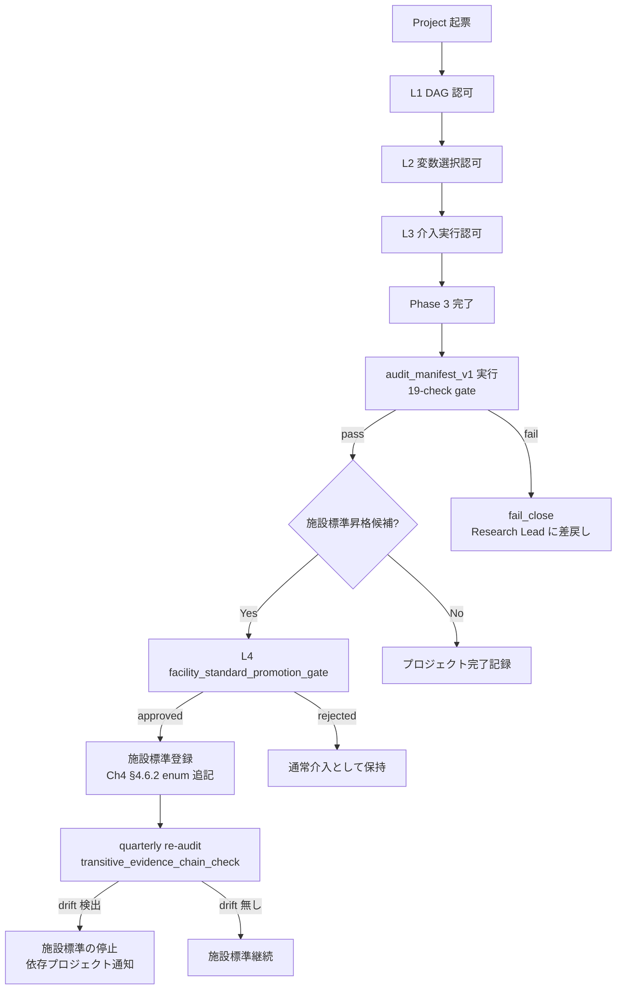

# 第15章　組織展開と終章 — 因果的主張の責任分担・実験計画の組織運用・次巻への道しるべ

> [!NOTE]
> **章の位置付け**：本章は vol-04 の終章として、Ch4-Ch14 で確立した **3 層承認 + L4 昇格 gate + 19-check audit_manifest** を **単一プロジェクト内の技術契約** から **組織横断の運用ガバナンス** に持ち上げる。技術詳細の追加は行わず、既に canonical 化された仕組み（Ch4 §4.6.1-§4.6.2、Ch13 §13.4.4、Ch14 §14.4-§14.5）を **どの役割が・いつ・どの権限で** 実施するかを整理する。**新しい fatal / gate / provenance schema は定義しない**。

## 15.1 vol-04 の到達点 — 4 つの canonical レイヤ

vol-04 が読者に手渡した canonical schema は以下の 4 層に整理できる：

| Layer | Canonical 要素 | 定義章 | 運用主体 |
|---|---|---|---|
| **L1: 認可 (Authorization)** | `dag_authorization` / `variable_selection_authorization` / `intervention_execution_authorization` | Ch4 §4.5-§4.6 | Research Lead |
| **L2: 因果識別 (Identification)** | DAG / adjustment_set / refutation_gate / counterfactual_scope_gate | Ch5 / Ch9 / Ch13 | Skill (propose) + Research Lead (approve) |
| **L3: 実験契約 (Experimental Contract)** | assignment_log 4-stage / response_surface_gate / Bayesian prior chain | Ch10 / Ch11 / Ch12 | Skill (execute) + DoE Reviewer |
| **L4: 監査 (Audit) と施設昇格** | audit_manifest_v1 (19 checks) / evidence_chain_sha256 (RFC 8785) / facility_standard_promotion_gate | Ch13 §13.4.4 / Ch14 §14.4-§14.5 | Facility Causal Review Board |

**vol-04 の中心命題**：これら 4 層は **evidence_chain_sha256** を hash 束として **推移的に接続** されており、任意の下流主張（介入推奨・施設標準・巻を跨ぐ再利用）は **上流の全 hash を再計算して verify できる**。技術契約と組織契約の境界を **hash-verifiable** に定義した点が vol-04 の技術的達成である。

## 15.2 責任分担マトリクス — RACI と 3 層承認の対応

Ch4 §4.6 の 3 層 + Ch14 §14.5 の L4 を RACI（Responsible / Accountable / Consulted / Informed）で展開：

| 承認レイヤ | Skill | Research Lead | DoE Reviewer | Facility Causal Review Board | Ethics Board |
|---|---|---|---|---|---|
| **L1 dag_authorization** | R (propose_only) | **A** | C | I | — |
| **L2 variable_selection_authorization** | R (propose_only) | **A** | C | I | — |
| **L3 intervention_execution_authorization** | R (propose_only) | C | R (DoE 適合性) | **A** | C (人的介入時) |
| **L4 facility_standard_promotion_gate** | R (audit_manifest 生成) | C | C | **A** | C (施設全体波及時) |

**運用原則**：
- **A (Accountable) は常に人間**。Skill は **A になれない**。Ch4 §4.3.2 の autonomy 境界と一致。
- **L3 と L4 の A 分離**：L3 は単一プロジェクトの介入承認、L4 は **他プロジェクトへの推移的影響** を伴う施設標準化。前者は Research Lead、後者は施設 review board が accountable。
- **Skill の R は "propose_only"**：実行権限は下流の A から下ろされる。Ch4 §4.9 template ⑨ (agent_action_log) に **全 propose 履歴が記録** される。

## 15.3 施設運用のガバナンスサイクル

Ch14 の audit_manifest_v1 を単一プロジェクトの gate から **施設運用の周期的レビュー機構** に持ち上げる：



**周期監査の要件**（Ch14 §14.3.9 transitive_evidence_chain_invalidation_check の運用版）：

| 監査タイミング | 対象 | 実施主体 | 出力 |
|---|---|---|---|
| プロジェクト完了時 | 単一プロジェクトの 19 checks | Skill (automated) + Research Lead | audit_manifest_uri |
| 施設標準昇格前 | L4 pre_conditions | Facility Causal Review Board | facility_standard_promotion_authorization |
| **四半期**（施設標準として稼働中） | 全稼働施設標準の transitive check | Facility Causal Review Board | quarterly_audit_report |
| **年次**（vol-04 canonical 全体） | canonical schema の drift、fatal enum の版更新 | Facility Causal Review Board + Skill 開発チーム | annual_governance_report |

## 15.4 因果的主張の対外開示ポリシー

Ch14 §14.3.6 unauthorized_broadcast_check と Ch4 §4.9 template ⑩ egress_control を、**論文投稿・特許出願・産業応用開示** に展開：

| 開示チャネル | 必要な承認レイヤ | 開示可能な主張 | 開示不可の主張 |
|---|---|---|---|
| **社内報告** | L2 まで | ATE / CATE の推定値、DAG 提案 | 反実仮想介入推奨、施設標準候補 |
| **学会発表** | L3 まで | 上記 + 反実仮想シミュレーション結果 | 未承認の施設標準、他プロジェクトへの推移的推奨 |
| **査読論文** | L3 + evidence_chain_sha256 pin | 上記 + refutation_gate 全 pass の裏付け | 未実行 refutation を「省略」と記載すること |
| **特許出願** | L4 + 施設標準登録 | 施設標準として operational な介入条件 | audit_manifest_v1 未 pass の候補条件 |
| **産業移転** | L4 + 追加倫理審査 | 上記 + 他組織への transitive re-authorization | quarterly re-audit 未実施の施設標準 |

**運用の要点**：
- **開示媒体ごとの evidence pin**：査読論文には `evidence_chain_sha256` を **副資料（supplementary）に含める**。RFC 8785 canonical JSON の再現手順を演習 14.3 の permitted list に沿って記述。
- **審査プロセスとの整合**：投稿論文が査読で「refutation 不足」を指摘された場合、`applicability_manifest` の **事前登録** の有無で切り分ける。事後追加は Ch9 §9.7.1 fatal `reclassify_failed_required_test_as_not_applicable_post_hoc` に該当。
- **産業移転時の再認可**：他組織への技術移転は Ch14 §14.3.9 の transitive check を **移転先組織の Facility Causal Review Board** で再実行し、`re_authorization_uri` を発行する。

## 15.5 Skill 更新と canonical schema のバージョニング

vol-04 canonical は unversioned では無く、以下の 3 種の変更を **明示的な version bump** で管理する：

| 変更種別 | Version 増分 | 例 | 移行ポリシー |
|---|---|---|---|
| **canonical enum の追加** | minor (v1.0 → v1.1) | `declared_required_tests` に新 test 種を追加 | 後方互換、既存 evidence_chain は再計算不要 |
| **fatal action の追加** | minor | 新しい prohibited_actions を追加 | 既存プロジェクトは grandfathered、新規のみ適用 |
| **evidence_chain_sha256_input_fields の変更** | **major** (v1.x → v2.0) | 新 field を hash 計算に追加 | **全 evidence_chain の再計算必須**、旧 hash は "legacy_pin" として保持 |

**major version bump は極めて希** — vol-04 canonical では **v1.0 を初期版** とし、vol-05 で扱う逐次 BO / vol-06 で扱う federated learning が evidence_chain の semantics を拡張する場合のみ v2.0 を発行する予定。

Skill 側の実装バージョン（`skill@v1.2.3` 等）は canonical version とは独立に管理し、両者の対応は **compatibility matrix** として施設で公開する：

```yaml
compatibility_matrix:                          # 施設運用ドキュメント
  canonical_version: vol04_v1.0
  compatible_skill_versions:
    dag_approval_skill: [">=v1.0.0", "<v2.0.0"]
    doe_generation_skill: [">=v1.2.0", "<v2.0.0"]
    audit_manifest_generation_skill: [">=v1.0.0", "<v2.0.0"]
  fallback_on_mismatch: fail_close_and_route_to_facility_causal_review_board
```

## 15.6 vol-05 / vol-06 への道しるべ

vol-04 は **単一プロジェクト内の因果 × DoE × Agentic 認可** を対象とし、以下は **本巻の範囲外** として後続巻に委譲する（Ch14 §14.6 巻境界 note を運用文脈で再整理）：

### vol-05：逐次実験計画とベイズ最適化

vol-04 Ch12 は **one-shot Bayesian DoE**（事前分布 → 実験計画一括生成 → 事後分布）に限定したが、vol-05 では以下を扱う：

- **Bayesian Optimization**：獲得関数（EI / UCB / Thompson sampling）と逐次的な次候補選択
- **Multi-fidelity / Multi-task BO**：異なる精度・異なる目的関数を跨いだ情報統合
- **Active Learning としての因果推論**：CATE の不確実性を最も減らす介入を逐次選択
- **勾配情報の活用**：AutoDiff + BO でパラメータ空間の勾配を推定

**vol-04 canonical との接続**：逐次 BO では `evidence_chain_sha256` の **推移的計算**（Phase N の posterior が Phase N+1 の prior、Ch14 §14.3.8）が **周期的に発火** するため、Ch14 の `sequential_bayesian_prior_chain_break_check` が vol-05 の基本 gate となる。

### vol-06：生成モデル・逆設計・組織横断ガバナンス

vol-04 は「与えられた変数空間で最適介入を探す」問題を扱ったが、vol-06 では **変数空間そのものを生成する** 問題を扱う：

- **Generative Materials Design**：VAE / diffusion / flow-based で材料候補を生成
- **Inverse Design**：目標特性から材料構造を逆推論（vol-03 予測モデルの逆問題）
- **Constrained Generation**：合成可能性・毒性・特許回避などの制約下での生成
- **組織横断ガバナンス**：複数施設連合、federated learning、differential privacy
- **規制対応**：GxP / GDPR / AI Act と audit の legal binding

**vol-04 canonical との接続**：生成モデルの出力は「未観測領域の介入候補」となるため、Ch4 §4.5.2 の `counterfactual_scope_gate` が **strict mode** で必須。生成物が施設境界を跨ぐ場合、Ch14 §14.3.7 silent_facility_standard_inheritance_check が **施設連合の transitive audit** として拡張される。

## 15.7 ARIM 施設としての因果推論運用 — 3 つの実装原則

本節は ARIM 施設（および同種の共用研究インフラ）における vol-04 canonical の運用実装を、3 つの原則にまとめる：

### 原則 1：Data Sharing と Identification Strategy Review の統合

ARIM のデータ共有ポリシー（他機関ユーザへの実験データ提供）と、vol-04 の identification 戦略レビュー（DAG 認可）を **単一プロセス** として統合する：

- データ提供申請書に **DAG 仮説と adjustment_set 候補** を記載
- 施設側は Ch5 §5.6 の `dag_approval_skill` を **申請審査 Skill** として運用し、`hypothesis_uri` と `e_value_probe` を含む審査結果を返す
- 提供データは **hypothesis_uri とペア** で管理し、他仮説での事後利用は「reuse_evidence_chain_across_projects_without_re_authorization」に該当

### 原則 2：Facility Causal Review Board の常設化

vol-04 で頻出する Facility Causal Review Board は、以下の 3 名構成を推奨：

| 役割 | 責務 | 選任基準 |
|---|---|---|
| **Chair (統計方法論)** | DAG / refutation / audit_manifest の技術判定 | vol-02（PyMC）と vol-04 全体の理解 |
| **Domain Expert (実験実施系)** | Ch10-11 の DoE 実務判定、施設固有の物性制約 | ARIM 装置群の物理的可搬性の理解 |
| **Skill Governance (Agentic 認可)** | Ch4 §4.3.2 の autonomy 境界、egress_control、evidence_chain_sha256 | vol-03 Agentic 章と本巻 Ch4/Ch14 の理解 |

board 会合は **四半期定例 + 臨時（L4 昇格候補発生時）** とし、議事録は evidence chain に組み込む（`facility_causal_review_board_minutes_uri`）。

### 原則 3：Skill 契約の Facility-wide Registry

施設内で運用される全 Skill を **単一 registry** で管理し、以下を登録：

- Skill ID、version、canonical_version 対応
- `role` / `action_class` / `gate_level`（Ch4 §4.7 canonical）
- `prohibited_actions` の完全列挙
- `fallback_approver`
- 直近 audit_manifest の URI と結果

registry は **read-only for Skill、write-only for board** とし、Skill 側から自己書換不可。Ch14 §14.6 `modify_facility_standard_after_promotion_without_new_audit` の運用実装となる。

## 15.8 章末：vol-04 が読者に手渡すもの

vol-04 の 15 章を通じて、読者は以下を手にする：

1. **技術契約**：ATE / CATE / DiD / IV / SCM / g-formula の実装と、それぞれの identification 前提の gate
2. **実験契約**：randomization / blocking / response surface / Bayesian DoE の provenance と reproducibility
3. **認可契約**：3 層承認 + L4 昇格 + evidence_chain_sha256 による hash-verifiable な組織契約
4. **監査契約**：19-check audit_manifest_v1 と transitive re-audit
5. **運用契約**：RACI マトリクス、開示ポリシー、canonical versioning、施設 board 常設

これらは相互に **hash 束で接続** されており、任意の下流主張（論文・特許・施設標準・巻を跨ぐ再利用）が **上流の全 provenance を verify 可能** な形で成立している。

**vol-04 の中心的主張** — 因果推論と実験計画は「統計技法の集合」ではなく、**組織における意思決定の hash-verifiable な契約体系** である。Agentic 化された研究環境において、この契約体系を明示的に運用することが、再現可能で説明可能な科学の前提条件となる。

vol-05 と vol-06 で扱う逐次実験計画・生成モデル・組織横断ガバナンスは、本巻の canonical を **superset として拡張** する形で構築される。読者は本巻を **技術書としてではなく、施設運用マニュアルの草案** として活用されたい。

---

## 章末チェックリスト（運用実装のセルフチェック）

**Layer 別確認**
- [ ] L1-L4 の 4 層 canonical schema を全て理解し、それぞれの canonical 定義章を参照できる
- [ ] RACI マトリクス（§15.2）で自組織の役割配置が定義されている
- [ ] Facility Causal Review Board が 3 名構成で常設されている
- [ ] Skill Registry が施設内で単一の source of truth として運用されている

**運用サイクル**
- [ ] audit_manifest_v1 の四半期 re-audit がスケジュール化されている
- [ ] 施設標準昇格候補が発生した際の L4 gate 発火手順が文書化されている
- [ ] quarterly transitive_evidence_chain_check の結果を依存プロジェクトに通知する経路がある

**対外開示**
- [ ] 論文投稿時に evidence_chain_sha256 を supplementary に含める手順が SOP 化されている
- [ ] 特許出願前に L4 gate pass を確認するチェックポイントがある
- [ ] 産業移転時の transitive re-authorization フローが移転先組織との覚書に含まれている

**バージョニング**
- [ ] canonical_version と skill_version の compatibility_matrix が施設で公開されている
- [ ] canonical major version bump の際の evidence_chain 全再計算プロセスが定義されている

**次巻準備**
- [ ] vol-05（逐次 BO）で拡張される sequential_bayesian_prior_chain_break_check の運用想定を board で共有済み
- [ ] vol-06（生成モデル・federated）で拡張される counterfactual_scope_gate の strict mode 適用範囲を検討中

---

## 参考資料

### 本書内参照

- **本書 第1章**：予測 → 介入 → 反実仮想のラダー、vol-04 の位置付け
- **本書 第4章**：3 層承認 canonical、L4 gate row（§4.6.1）、facility_scope_escalation（§4.6.2）、Table 4.4 fatal 一覧（§4.8）、Skill 契約テンプレート ⑨⑩（§4.9）
- **本書 第5章**：DAG 提案 Skill、prohibited_actions（§5.6）
- **本書 第9章**：refutation_gate、declared_required_tests enum
- **本書 第10-12章**：DoE / response surface / Bayesian DoE 契約
- **本書 第13章**：capstone worked example、evidence_chain_sha256_input_fields（§13.4.4）、Phase 3 巻き戻し fatal（§13.5）
- **本書 第14章**：audit_manifest_v1 19 checks（§14.4）、L4 facility_standard_promotion_gate（§14.5.2）、Ch14 canonical fatal（§14.6）

### 外部文献（組織運用・ガバナンス）

- ISO/IEC 42001:2023 *Information technology — Artificial intelligence — Management system*. — AI システム監査の国際標準
- ISO 9001:2015 *Quality management systems — Requirements*. — 品質管理システムの一般枠組み（施設運用と接続）
- NIST AI Risk Management Framework (AI RMF 1.0), 2023. — AI リスク管理の govern / map / measure / manage 4 機能
- ARIM Program Guidelines (物質・材料研究機構), 2024. — ARIM 事業のデータ共有ポリシー原典
- Sculley, D., et al. (2015). *Hidden Technical Debt in Machine Learning Systems*. NeurIPS. — 組織的な silent modification の pattern
- Pearl, J., & Mackenzie, D. (2018). *The Book of Why*. Basic Books. — 因果推論の組織的展開の思想的基盤
- Deming, W. E. (1986). *Out of the Crisis*. MIT Press. — quality-oriented management の古典（PDCA と本章のガバナンスサイクルの類似性）

### 次巻への案内

- **vol-05**：逐次 Bayesian Optimization、Multi-fidelity BO、Active Causal Inference、勾配情報活用
- **vol-06**：生成モデル、逆設計、federated learning、differential privacy、規制対応（GxP / GDPR / AI Act）
