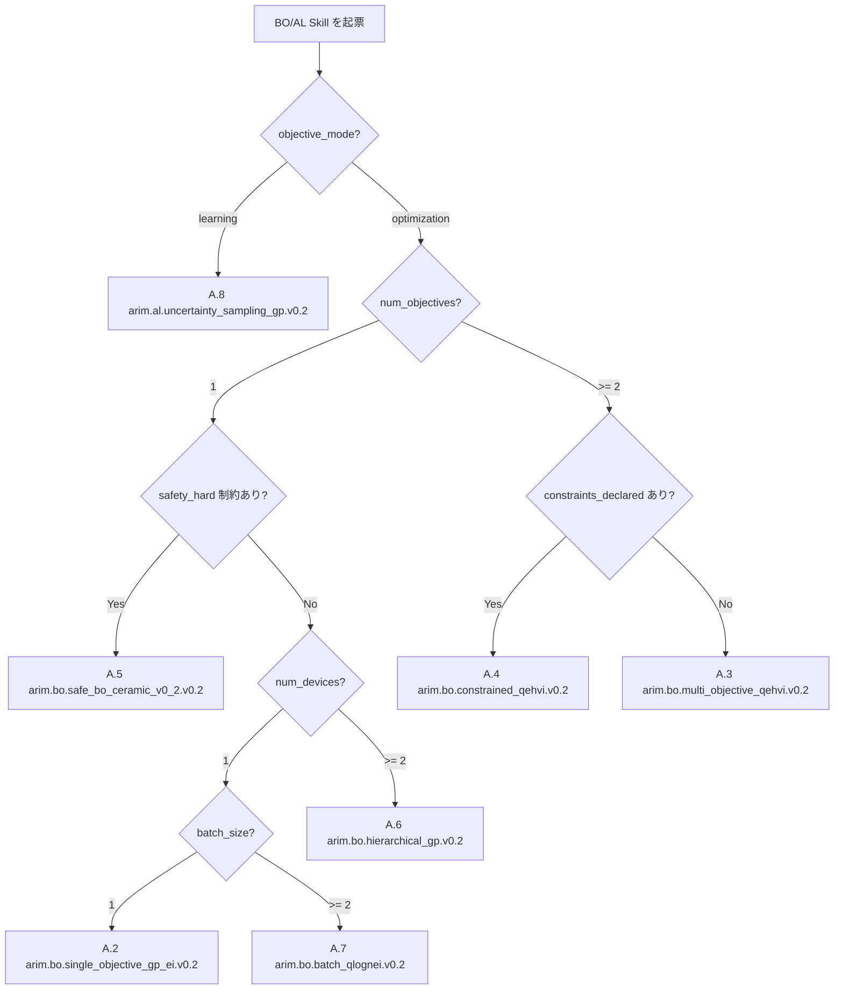

# 付録 A: BO × Agentic Skill テンプレート集

> [!NOTE]
> 本付録は、vol-05 本文（第 5〜13 章）で確立した **21 フィールド provenance 契約** と **Ch5 §5.3 experiment_launch_authorization** を、実運用可能な **Agentic Skill テンプレート** に落とし込んだリファレンスである。vol-04 付録 A（因果 × Agentic Skill）と対を成し、BO/AL 側の Skill 起票時に「どの契約フィールドを埋めるか／どの Ch15 §15.2 失敗モードから守るか」を機械的に決定できることを目的とする。
>
> 各 Skill テンプレートは次の 6 部構成に統一されている:
> (a) 目的 (purpose) / (b) canonical inputs schema (yaml) / (c) canonical outputs schema (yaml, 21 フィールド全体を含む) / (d) `experiment_launch_authorization` 契約スニペット / (e) Ch15 §15.2 で保護対象となる失敗モード / (f) 最小 Python skeleton (BoTorch / GPyTorch API パターン)。

> [!IMPORTANT]
> **canonical schema 準拠ルール（vol-05 全体で不変）**:
> - `authorization_id` の canonical 形式は `elauth_YYYYMMDD_HHMMSS_iter<n>`（Ch16 §16.1.1 H-R2-1 注記）。旧表記 `exp_launch_` は用いない。
> - `sharing_authorization_id` は `shauth_YYYYMMDD_HHMMSS_seq<n>`（キャレットなし、Ch16 §16.4 施設運用側 field）。
> - `status` enum は **4 値** `pending | approved | denied | revoked`（Ch16 §16.1.1 H7 注記）。Ch5 §5.3 本文の 3 値表現は上書きされる。
> - Ch13 §13.2 active learning acquisition は **6 canonical 値** のみ: `predictive_variance | predictive_entropy | query_by_committee | expected_model_change | mutual_information_bald | integrated_variance_reduction`。
> - Ch15 §15.2 の Agentic 失敗名は F<n> プレフィックスを付けず、bare 形式で `prohibited_actions` に列挙する。
> - `event_hash` は RFC 8785 JCS + SHA-256（canonical anchor: `vol-05:ch10:event_canonical_serialization`）。genesis event の `previous_event_hash` は `null`、以降は append-only。
> - vol-04 因果 DAG への参照は `vol-04:appendix-c:causal_dag_ceramic_v1` 固定 URI で行う。

---

## A.1 テンプレート索引

Skill ID は Ch16 §16.9 facility_bo_skill_registry 準拠で `arim.bo.<type>.v<semver>` / `arim.al.<type>.v<semver>` 形式に統一する。v0.2 は vol-05 第 2 版（本書）に対応する。

| §    | Skill ID                                       | 目的                                         | SoT 章 (Ch)             | surrogate_model_family        | acquisition_spec.name                       |
| ---- | ---------------------------------------------- | -------------------------------------------- | ----------------------- | ----------------------------- | ------------------------------------------- |
| A.2  | `arim.bo.single_objective_gp_ei.v0.2`          | 単目的 BO（GP + qLogEI）                     | Ch6 / Ch7               | `single_task_gp`              | `qLogEI`（動的切替禁止、Ch15 §15.2.1）     |
| A.3  | `arim.bo.multi_objective_qehvi.v0.2`           | 多目的 BO（Pareto 探索）                     | Ch9                     | `single_task_gp` (per obj)    | `qLogEHVI` / `qLogNEHVI` / `qParEGO`        |
| A.4  | `arim.bo.constrained_qehvi.v0.2`               | 制約付き BO（feasibility surrogate 併用）    | Ch10 §10.2-§10.4        | `single_task_gp` (obj+constr) | `qLogNEHVI + constraints`                   |
| A.5  | `arim.bo.safe_bo_ceramic_v0_2.v0.2`            | Safe BO（hard_constraints_ceramic_v0_2）     | Ch10 §10.5-§10.6        | `single_task_gp` + safety GP  | `SafeOpt-like` + `hard_constraints` filter  |
| A.6  | `arim.bo.hierarchical_gp.v0.2`                 | 階層 GP（拠点横断・MTGP）                    | Ch11                    | `hierarchical_gp` / `multi_task_gp` | `qLogNEI` (per task index)             |
| A.7  | `arim.bo.batch_qlognei.v0.2`                   | Batch BO（pending fantasize + 多様性）       | Ch12                    | `single_task_gp`              | `qLogNEI`（`batch_size > 1`）              |
| A.8  | `arim.al.uncertainty_sampling_gp.v0.2`         | Active Learning（objective_mode: learning）  | Ch13                    | `single_task_gp` / `fixed_noise_gp` | AL 6 canonical のいずれか             |

> [!NOTE]
> **本索引の使い方**: 起票時は `objective_mode`（Ch7 §7.5 / Ch13 §13.3）→ `num_objectives` → `constraints_declared` → `safety_hard` → `num_devices` → `batch_size` の順に決定木を辿り、A.10 のフローチャートで該当 Skill を選ぶ。複合ケース（例: 制約付き batch multi-obj）は Ch14 §14.3 integrated iteration template を優先し、本付録の Skill は個別コンポーネントとして参照する。

---

## A.2 単目的 BO Skill: `arim.bo.single_objective_gp_ei.v0.2`

### (a) 目的

単一のスカラ目的関数 \(f(x)\) を、Gaussian Process 代理モデル + qLogEI 獲得関数で最適化する。Ch6 §6.4 kernel_spec（Matérn 5/2 + ARD + GammaPrior(3,6)）と Ch7 §7.4 acquisition_spec を canonical に固定し、Ch15 §15.2.1（Skill による動的獲得関数切替）を構造的に禁止する。

### (b) canonical inputs schema

```yaml
skill_id: arim.bo.single_objective_gp_ei.v0.2
inputs:
  objective_mode: optimization
  num_objectives: 1
  objective_direction: maximize
  search_space_bounds:
    # canonical anchor: vol-05:ch14:§14.2.1 ceramic_search_space_v0_2
    variables:
      x_temperature:   {type: continuous,  low: 200.0, high: 800.0, unit: degC}
      x_pressure:      {type: continuous,  low: 0.1,   high: 5.0,   unit: MPa}
      x_hold_time:     {type: continuous,  low: 30.0,  high: 180.0, unit: min}
      x_mass_frac_A:   {type: continuous,  low: 0.1,   high: 0.6,   unit: "1"}
      x_mass_frac_B:   {type: continuous,  low: 0.1,   high: 0.5,   unit: "1"}
      x_atmosphere:    {type: categorical, choices: [Ar, N2, Air]}
    linear_constraints:
      - {name: mass_frac_sum, expr: "x_mass_frac_A + x_mass_frac_B", operator: "<=", threshold: 0.85, source: causal_dag_derivation}
  observed_data_ref: dataset://arim/ceramic_run_v3/train.parquet
  kernel_spec:
    kind: Matern
    nu: 2.5
    ard_num_dims: 6
    lengthscale_prior:
      family: Gamma
      concentration: 3.0
      rate: 6.0
    outputscale_prior:
      family: Gamma
      concentration: 2.0
      rate: 0.15
    noise_prior:
      family: Gamma
      concentration: 1.1
      rate: 0.05
  acquisition_spec:
    name: qLogEI
    q: 1
    num_restarts: 10
    raw_samples: 512
    best_f_source: observed_max
  retraining_policy:
    trigger: every_iteration
    warm_start_from_previous: true
  stop_condition:
    logic: "OR"
    conditions:
      - {type: budget, threshold: 40}
      - {type: convergence, threshold: 1.0e-4}
      - {type: regret_threshold, threshold: 0.95}
    hrd_declared: true
  sequential_seed_provenance:
    seed_root: 20260704
    seed_derivation: sha256(seed_root || iteration_index)
```

### (c) canonical outputs schema (21 フィールド 全体)

```yaml
provenance:
  # ---- Group A: immutable pins (9 core + 2 extensions = 11 fields) ----
  iteration_index: 7
  search_space_bounds: [ref: inputs.search_space_bounds]
  bo_library_stack: botorch_direct
  bo_library_stack_metadata:
    library_version: "botorch==0.11.3, gpytorch==1.12, torch==2.4.0"
    model_backend: gpytorch.ExactGP
    acquisition_impl: botorch.acquisition.logei.qLogExpectedImprovement
    generation_strategy_uri: null  # Ax 経由時のみ設定
    reproducibility:
      lockfile_sha256: 3f1c...9a2b
      resolved_at: "2026-07-04T10:15:22Z"
  surrogate_model_family: single_task_gp
  kernel_spec: [ref: inputs.kernel_spec]
  acquisition_spec: [ref: inputs.acquisition_spec]
  surrogate_treatment_of_facility_variance: not_applicable
  retraining_policy: [ref: inputs.retraining_policy]
  sequential_seed_provenance: [ref: inputs.sequential_seed_provenance]
  tensor_encoding_contract:
    x_dtype: float64
    y_dtype: float64
    categorical_encoding: onehot
    normalization: unit_cube
  # ---- Group B: append-only (4 core + 1 extension = 5 fields) ----
  observed_data:
    n_points: 24
    hash_sha256: 7ab2...cc11
  pending_experiments: []
  budget_remaining:
    iterations: 33
    monetary_jpy: 850000
    wall_clock_hours: 62.5
  hallucination_events: []
  batch_size: 1
  # ---- Group C: sequential-mutable (2 fields) ----
  next_candidate:
    x:
      x_temperature: 720.0
      x_pressure: 2.3
      x_hold_time: 90.0
      x_mass_frac_A: 0.42
      x_mass_frac_B: 0.31
      x_atmosphere: Ar
    acquisition_value: 0.0273
    estimated_cost:
      calendar_hours: 30
      money_jpy: 45000
  surrogate_diagnostics:
    log_marginal_likelihood: -18.42
    lengthscales:
      x_temperature: 0.31
      x_pressure: 0.58
    noise_variance: 0.012
  # ---- Group D: gate/audit (3 fields) ----
  experiment_launch_authorization:
    authorization_id: elauth_20260704_101530_iter7
    status: pending
    requested_by: "^skill:arim.bo.single_objective_gp_ei/v0.2"
    approver_required: "^human:staff_042"
    parent_authorization_id: vol-04:L3_intervention_execution_authorization:l3_auth_20260701_090000_iter1
    budget_precheck:
      iterations_ok: true
      monetary_ok: true
    event_hash: "sha256:5c1d...ef03"
    previous_event_hash: "sha256:3a90...11bb"
  stop_condition: [ref: inputs.stop_condition]
  hallucinated_recommendation_detection:
    within_bounds: true
    within_hard_constraints: true
    extrapolation_score: 0.18
    hallucination_flag:
      flag: false
      reasons: []
      scores:
        variance: 0.012
        mahalanobis: 1.2
        length_scale_ratio: 0.6
```

### (d) `experiment_launch_authorization` 契約スニペット (Ch5 §5.3)

```yaml
experiment_launch_authorization:
  authorization_id: elauth_20260704_101530_iter7
  status: pending  # enum: pending | approved | denied | revoked (Ch16 §16.1.1 H7)
  requested_by: "^skill:arim.bo.single_objective_gp_ei/v0.2"
  approver_required: "^human:staff_042"
  parent_authorization_id: vol-04:L3_intervention_execution_authorization:l3_auth_20260701_090000_iter1
  requested_at: "2026-07-04T10:15:30Z"
  approved_at: null
  budget_precheck:
    iterations_remaining: 33
    monetary_remaining_jpy: 850000
    wall_clock_remaining_hours: 62.5
    passes_all: true
  hrd_declared: true
  event_hash: "sha256:5c1d...ef03"
  previous_event_hash: "sha256:3a90...11bb"
```

> [!WARNING]
> `status` の初期値は必ず `pending`。Skill が単独で `approved` に遷移させることは Ch15 §15.2.3（execute_without_approval）に該当し fatal 違反。人間承認者による書き込みは `writer_identity = ^human:<staff_id>` の event 記録が必須。

### (e) Ch15 §15.2 保護対象失敗モード

```yaml
prohibited_actions:
  Ch15.acquisition_dynamic_switch_by_skill: fatal
  Ch15.extrapolation_reported_confidently: fatal
  Ch15.execute_without_approval: fatal
  Ch15.iteration_seed_overwrite: fatal
  Ch15.stop_condition_relax_by_skill: fatal
  Ch15.contract_pin_and_pipeline_order_break: fatal
  Ch15.contract_pin_meta_integrity_break: fatal
  Ch15.objective_mode_switch_by_skill: fatal
```

### (f) 最小 Python skeleton

```python
from botorch.models import SingleTaskGP
from botorch.fit import fit_gpytorch_mll
from botorch.acquisition.logei import qLogExpectedImprovement
from botorch.optim import optimize_acqf
from gpytorch.mlls import ExactMarginalLogLikelihood
from gpytorch.kernels import MaternKernel, ScaleKernel
from gpytorch.priors import GammaPrior

def build_surrogate(train_X, train_Y, kernel_spec):
    base = MaternKernel(
        nu=kernel_spec["nu"],
        ard_num_dims=kernel_spec["ard_num_dims"],
        lengthscale_prior=GammaPrior(
            kernel_spec["lengthscale_prior"]["concentration"],
            kernel_spec["lengthscale_prior"]["rate"],
        ),
    )
    covar = ScaleKernel(
        base,
        outputscale_prior=GammaPrior(
            kernel_spec["outputscale_prior"]["concentration"],
            kernel_spec["outputscale_prior"]["rate"],
        ),
    )
    model = SingleTaskGP(train_X, train_Y, covar_module=covar)
    mll = ExactMarginalLogLikelihood(model.likelihood, model)
    fit_gpytorch_mll(mll)
    return model

def propose_next(model, bounds, best_f, acq_spec):
    assert acq_spec["name"] == "qLogEI", "acquisition_dynamic_switch prohibited (Ch15 §15.2.1)"
    acqf = qLogExpectedImprovement(model=model, best_f=best_f)
    x_next, val = optimize_acqf(
        acq_function=acqf,
        bounds=bounds,
        q=acq_spec["q"],
        num_restarts=acq_spec["num_restarts"],
        raw_samples=acq_spec["raw_samples"],
    )
    return x_next, val
```

---

## A.3 多目的 BO Skill: `arim.bo.multi_objective_qehvi.v0.2`

### (a) 目的

複数目的（例: 密度 vs 破壊靭性）の Pareto front を、qLogEHVI / qLogNEHVI / qParEGO のいずれか固定された `acquisition_spec.name` で探索する。Ch9 §9.4 の `objectives_spec` と `reference_point` を canonical にピン留めし、Ch15 §15.2.7（scalarization weight change by skill）を構造的に禁止する。

### (b) canonical inputs schema

```yaml
skill_id: arim.bo.multi_objective_qehvi.v0.2
inputs:
  objective_mode: optimization
  num_objectives: 2
  objectives_spec:
    version: "v0.2"
    mode: multi_objective
    objectives:
      - name: y_density
        unit: g_per_cm3
        direction: maximize
        target_range: [2.10, 4.50]
        surrogate_ref: gp_density
      - name: y_toughness
        unit: MPa_sqrt_m
        direction: maximize
        target_range: [3.20, 8.00]
        surrogate_ref: gp_toughness
    scalarization:
      allowed: false
    reference:
      reference_point: [2.10, 3.20]
      reference_point_rationale: "実用下限値：density 2.10 未満 / toughness 3.20 未満は実用不可"
      hypervolume_scale: raw_units
  search_space_bounds: [ref: A.2 canonical 6-var ceramic]
  observed_data_ref: dataset://arim/ceramic_run_v3/multi.parquet
  kernel_spec: [ref: A.2 kernel_spec]  # per-objective GP に同一 kernel を適用
  acquisition_spec:
    name: qLogNEHVI
    q: 1
    num_restarts: 20
    raw_samples: 1024
    prune_baseline: true
    alpha: 0.0
    hyperparameters:
      ref_point_source: objectives_spec.reference.reference_point
  retraining_policy:
    trigger: every_iteration
    warm_start_from_previous: true
  stop_condition:
    logic: "OR"
    conditions:
      - {type: budget, threshold: 40}
      - {type: convergence, threshold: 1.0e-3}
      - {type: regret_threshold, threshold: 0.284}
    hrd_declared: true
```

### (c) canonical outputs schema (差分)

```yaml
provenance:
  surrogate_model_family: single_task_gp  # per-objective, ModelListGP でラップ
  acquisition_spec:
    name: qLogNEHVI
    q: 1
    num_restarts: 20
    raw_samples: 1024
    prune_baseline: true
    alpha: 0.0
  next_candidate:
    x: {ref: 6-var canonical}
    acquisition_value: 0.0084
    expected_hv_gain: 0.0091
    estimated_cost:
      calendar_hours: 30
      money_jpy: 45000
  surrogate_diagnostics:
    per_objective:
      - name: y_density
        log_marginal_likelihood: -12.31
        noise_variance: 0.006
      - name: y_toughness
        log_marginal_likelihood: -9.87
        noise_variance: 0.014
    current_hypervolume: 0.284
  hallucinated_recommendation_detection:
    within_bounds: true
    reference_point_violation: false
    dominated_by_current_pareto: false
```

### (d) `experiment_launch_authorization` 契約スニペット

```yaml
experiment_launch_authorization:
  authorization_id: elauth_20260704_113045_iter12
  status: pending
  requested_by: "^skill:arim.bo.multi_objective_qehvi/v0.2"
  approver_required: "^human:staff_042"
  parent_authorization_id: vol-04:L3_intervention_execution_authorization:l3_auth_20260701_090000_iter1
  budget_precheck:
    passes_all: true
  hrd_declared: true
  hv_gain_precheck:
    expected_hv_gain: 0.0091
    hv_delta_floor_met: true
  event_hash: "sha256:8b2f...4d10"
  # previous_event_hash: 前 iteration event から継承（この差分では省略）
```

### (e) Ch15 §15.2 保護対象失敗モード

```yaml
prohibited_actions:
  Ch15.acquisition_dynamic_switch_by_skill: fatal
  Ch15.scalarization_weight_change_by_skill: fatal
  Ch15.extrapolation_reported_confidently: fatal
  Ch15.execute_without_approval: fatal
  Ch15.stop_condition_relax_by_skill: fatal
  Ch15.contract_pin_and_pipeline_order_break: fatal
  Ch15.contract_pin_meta_integrity_break: fatal
  Ch15.objective_mode_switch_by_skill: fatal
```

### (f) 最小 Python skeleton

```python
from botorch.models import SingleTaskGP, ModelListGP
from botorch.acquisition.multi_objective.logei import qLogNoisyExpectedHypervolumeImprovement

def build_multi_output_surrogate(train_X, train_Y_list, kernel_spec):
    models = [SingleTaskGP(train_X, y.unsqueeze(-1)) for y in train_Y_list]
    for m in models:
        mll = ExactMarginalLogLikelihood(m.likelihood, m)
        fit_gpytorch_mll(mll)
    return ModelListGP(*models)

def propose_next_moo(model, bounds, train_X, train_Y, ref_point, acq_spec):
    assert acq_spec["name"] in {"qLogEHVI", "qLogNEHVI", "qParEGO", "qNParEGO"}, \
        "acquisition_dynamic_switch prohibited (Ch15 §15.2.1)"
    acqf = qLogNoisyExpectedHypervolumeImprovement(
        model=model,
        ref_point=ref_point,
        X_baseline=train_X,
        prune_baseline=acq_spec["prune_baseline"],
        alpha=acq_spec["alpha"],
    )
    x_next, val = optimize_acqf(
        acqf, bounds=bounds,
        q=acq_spec["q"],
        num_restarts=acq_spec["num_restarts"],
        raw_samples=acq_spec["raw_samples"],
    )
    return x_next, val
```

---

## A.4 制約付き BO Skill: `arim.bo.constrained_qehvi.v0.2`

### (a) 目的

明示的な feasibility 制約 \(c_k(x) \le 0\) を持つ問題に対し、目的 GP と制約 GP を `ModelListGP` で束ね、`qLogNEHVI + constraints` で feasible な次候補のみ提案する。Ch10 §10.2-§10.4 の `constraints_declared`（hard / soft 区分）を canonical に固定する。

### (b) canonical inputs schema

```yaml
skill_id: arim.bo.constrained_qehvi.v0.2
inputs:
  objective_mode: optimization
  num_objectives: 2
  objectives_spec: [ref: A.3 objectives_spec]
  search_space_bounds: [ref: A.2 canonical 6-var ceramic]
  constraints_declared:
    - name: c_max_temperature_load
      kind: hard
      expression: "x_temperature <= 750.0"
      surrogate_required: false
      violation_action: reject_candidate
    - name: c_thermal_gradient
      kind: hard
      expression: "surrogate(y_thermal_grad) <= 15.0"
      surrogate_required: true
      surrogate_name: y_thermal_grad
      violation_action: reject_candidate
    - name: c_cost_per_run
      kind: soft
      expression: "cost_estimate(x) <= 50000"
      violation_action: penalize
      penalty_lambda: 1.0
  observed_data_ref: dataset://arim/ceramic_run_v3/constrained.parquet
  kernel_spec: [ref: A.2 kernel_spec]
  acquisition_spec:
    name: "qLogNEHVI + constraints"
    q: 1
    num_restarts: 20
    raw_samples: 1024
    prune_baseline: true
  retraining_policy: [ref: A.2 retraining_policy]
  stop_condition:
    logic: "OR"
    conditions:
      - {type: budget, threshold: 40}
      - {type: convergence, threshold: 1.0e-3}
      - {type: regret_threshold, threshold: 0.284}
    hrd_declared: true
```

### (c) canonical outputs schema (差分)

```yaml
provenance:
  surrogate_model_family: single_task_gp  # obj + constraint surrogate all GP
  acquisition_spec:
    name: "qLogNEHVI + constraints"
  next_candidate:
    x: {ref: 6-var canonical}
    acquisition_value: 0.0067
    estimated_cost:
      calendar_hours: 30
      money_jpy: 45000
  hallucinated_recommendation_detection:
    within_bounds: true
    hard_constraint_precheck:
      c_max_temperature_load: pass
      c_thermal_gradient:
        surrogate_mean: 12.4
        surrogate_std: 1.1
        prob_feasible: 0.98
        pass: true
    soft_constraint_penalties:
      c_cost_per_run:
        estimated_penalty: 0.0
  surrogate_diagnostics:
    per_output:
      - name: y_density
        log_marginal_likelihood: -12.31
      - name: y_toughness
        log_marginal_likelihood: -9.87
      - name: y_thermal_grad
        log_marginal_likelihood: -14.02
```

### (d) `experiment_launch_authorization` 契約スニペット

```yaml
experiment_launch_authorization:
  authorization_id: elauth_20260704_142010_iter14
  status: pending
  requested_by: "^skill:arim.bo.constrained_qehvi/v0.2"
  approver_required: "^human:staff_042"
  parent_authorization_id: vol-04:L3_intervention_execution_authorization:l3_auth_20260701_090000_iter1
  constraint_precheck:
    hard_constraints_all_pass: true
    prob_feasible_min: 0.98
    prob_feasible_threshold: 0.95
  budget_precheck: {passes_all: true}
  hrd_declared: true
  event_hash: "sha256:c74e...29a1"
  # previous_event_hash: 前 iteration event から継承（この差分では省略）
```

> [!IMPORTANT]
> hard 制約に対する `prob_feasible < 0.95` の候補は Skill 側で自動的に破棄され、Ch5 §5.3 の `budget_precheck` に到達する前に打ち切られる。この閾値は `constraint_precheck.prob_feasible_threshold` に明示的に記録される（Ch10 §10.3）。

### (e) Ch15 §15.2 保護対象失敗モード

```yaml
prohibited_actions:
  Ch15.acquisition_dynamic_switch_by_skill: fatal
  Ch15.extrapolation_reported_confidently: fatal
  Ch15.execute_without_approval: fatal
  Ch15.stop_condition_relax_by_skill: fatal
  Ch15.contract_pin_and_pipeline_order_break: fatal
  Ch15.contract_pin_meta_integrity_break: fatal
  Ch15.objective_mode_switch_by_skill: fatal
```

### (f) 最小 Python skeleton

```python
from botorch.acquisition.multi_objective.logei import qLogNoisyExpectedHypervolumeImprovement

def build_constrained_surrogate(train_X, train_Y_obj_list, train_C_list, kernel_spec):
    obj_models = [SingleTaskGP(train_X, y.unsqueeze(-1)) for y in train_Y_obj_list]
    con_models = [SingleTaskGP(train_X, c.unsqueeze(-1)) for c in train_C_list]
    for m in obj_models + con_models:
        fit_gpytorch_mll(ExactMarginalLogLikelihood(m.likelihood, m))
    return ModelListGP(*(obj_models + con_models))

def propose_next_constrained(model, bounds, train_X, ref_point, num_obj, acq_spec):
    # constraint callables: expects <= 0 feasibility
    constraint_callables = [
        (lambda Z, k=k: Z[..., num_obj + k])
        for k in range(model.num_outputs - num_obj)
    ]
    acqf = qLogNoisyExpectedHypervolumeImprovement(
        model=model,
        ref_point=ref_point,
        X_baseline=train_X,
        prune_baseline=acq_spec["prune_baseline"],
        constraints=constraint_callables,
    )
    x_next, val = optimize_acqf(
        acqf, bounds=bounds,
        q=acq_spec["q"],
        num_restarts=acq_spec["num_restarts"],
        raw_samples=acq_spec["raw_samples"],
    )
    return x_next, val
```

---

## A.5 Safe BO Skill: `arim.bo.safe_bo_ceramic_v0_2.v0.2`

### (a) 目的

安全上の hard 制約（Ch10 §10.6 `hard_constraints_ceramic_v0_2`）を絶対に違反しない **Safe BO** を実装する。BoTorch native の Safe BO は限定的なため、`hard_constraints_ceramic_v0_2` filter を primary defense として、feasible seed set からの Lipschitz 拡張型で安全領域を成長させる（SafeOpt-like）。

### (b) canonical inputs schema

```yaml
skill_id: arim.bo.safe_bo_ceramic_v0_2.v0.2
inputs:
  objective_mode: optimization
  num_objectives: 1
  objective_direction: maximize
  search_space_bounds: [ref: A.2 canonical 6-var ceramic]
  safety_config:
    contract_pin: vol-05:ch10:hard_constraints_ceramic_v0_2
    hard_constraints:
      - name: c_no_thermal_runaway
        expression: "surrogate(y_thermal_grad) + 2.0 * surrogate_std(y_thermal_grad) <= 15.0"
        upper_bound: 15.0
        beta: 2.0
      - name: c_stress_bound
        expression: "surrogate(y_stress) + 2.0 * surrogate_std(y_stress) <= 45.0"
        upper_bound: 45.0
        beta: 2.0
    feasible_seed_set_ref: dataset://arim/ceramic_seed/feasible_v0_2.parquet
    lipschitz_bounds:
      y_thermal_grad: 0.08
      y_stress: 0.12
    expansion_policy: safeopt_like
  kernel_spec: [ref: A.2 kernel_spec]
  acquisition_spec:
    name: "qLogEI + safeopt_filter"
    q: 1
    num_restarts: 20
    raw_samples: 1024
  retraining_policy: [ref: A.2 retraining_policy]
  stop_condition:
    logic: "OR"
    conditions:
      - {type: budget, threshold: 40}
      - {type: convergence, threshold: 0.02}
      - {type: regret_threshold, threshold: 0.95}
    hrd_declared: true
```

### (c) canonical outputs schema (差分)

```yaml
provenance:
  surrogate_model_family: single_task_gp  # obj + per-safety GP
  next_candidate:
    x: {ref: 6-var canonical}
    acquisition_value: 0.0158
    estimated_cost:
      calendar_hours: 30
      money_jpy: 45000
  hallucinated_recommendation_detection:
    within_bounds: true
    hard_constraint_precheck:
      c_no_thermal_runaway:
        mean: 12.4
        std: 1.1
        upper_confidence: 14.6
        pass: true
        beta_used: 2.0
      c_stress_bound:
        mean: 32.0
        std: 3.8
        upper_confidence: 39.6
        pass: true
        beta_used: 2.0
    safe_set_expansion:
      previous_volume_fraction: 0.184
      current_volume_fraction: 0.192
      delta: 0.008
  surrogate_diagnostics:
    per_output:
      - name: y_target
        log_marginal_likelihood: -18.42
      - name: y_thermal_grad
        log_marginal_likelihood: -14.02
      - name: y_stress
        log_marginal_likelihood: -11.58
```

### (d) `experiment_launch_authorization` 契約スニペット

```yaml
experiment_launch_authorization:
  authorization_id: elauth_20260704_155501_iter9
  status: pending
  requested_by: "^skill:arim.bo.safe_bo_ceramic_v0_2/v0.2"
  approver_required: "^human:staff_safety_lead"
  parent_authorization_id: vol-04:L3_intervention_execution_authorization:l3_auth_20260701_090000_iter1
  safety_precheck:
    contract_pin: vol-05:ch10:hard_constraints_ceramic_v0_2
    all_hard_constraints_pass: true
    upper_confidence_within_bounds: true
    beta_used: 2.0
  budget_precheck: {passes_all: true}
  hrd_declared: true
  event_hash: "sha256:fa22...8e04"
  # previous_event_hash: 前 iteration event から継承（この差分では省略）
```

> [!WARNING]
> Safe BO は Ch15 §15.2.3（execute_without_approval）に加え、Ch15 §15.2.10（contract_pin_meta_integrity_break）の主要ターゲット。`safety_config.contract_pin` は Skill 起票時に固定され、iteration 途中で書き換えられた場合は fatal 違反として即座に revoke される。

### (e) Ch15 §15.2 保護対象失敗モード

```yaml
prohibited_actions:
  Ch15.execute_without_approval: fatal
  Ch15.extrapolation_reported_confidently: fatal
  Ch15.contract_pin_meta_integrity_break: fatal
  Ch15.iteration_seed_overwrite: fatal
  Ch15.stop_condition_relax_by_skill: fatal
  Ch15.acquisition_dynamic_switch_by_skill: fatal
  Ch15.contract_pin_and_pipeline_order_break: fatal
  Ch15.objective_mode_switch_by_skill: fatal
```

### (f) 最小 Python skeleton

```python
def is_safe(candidate_x, safety_models, hard_constraints):
    for hc, model in zip(hard_constraints, safety_models):
        posterior = model.posterior(candidate_x)
        mean = posterior.mean.squeeze(-1)
        std = posterior.variance.sqrt().squeeze(-1)
        ucb = mean + hc["beta"] * std
        if not (ucb <= hc["upper_bound"]).all():
            return False
    return True

def propose_next_safe(obj_model, safety_models, bounds, best_f,
                     hard_constraints, acq_spec, n_filter_candidates=5000):
    # 1. Sobol 系列で candidate 集合を生成
    # 2. hard_constraints_ceramic_v0_2 filter で safe 集合に絞り込み
    # 3. safe 集合上で qLogEI 最大化
    acqf = qLogExpectedImprovement(model=obj_model, best_f=best_f)
    candidates = draw_sobol_samples(bounds=bounds, n=n_filter_candidates, q=1)
    safe_mask = torch.tensor([
        is_safe(c, safety_models, hard_constraints) for c in candidates
    ])
    assert safe_mask.any(), "no safe candidate found; contract_pin defense triggered"
    x_next, val = optimize_acqf(
        acqf, bounds=bounds, q=acq_spec["q"],
        num_restarts=acq_spec["num_restarts"], raw_samples=acq_spec["raw_samples"],
    )
    assert is_safe(x_next, safety_models, hard_constraints), \
        "post-optimization safety re-check failed"
    return x_next, val
```

---

## A.6 階層 BO Skill: `arim.bo.hierarchical_gp.v0.2`

### (a) 目的

複数拠点（例: 東京・つくば・大阪）で並列に BO を回すとき、拠点間の系統差を hierarchical GP（BoTorch では `MultiTaskGP` が実装候補）で明示的にモデル化する。`surrogate_treatment_of_facility_variance: hierarchical_shrinkage` を canonical にピン留めし、拠点別の擬独立 GP と全プール GP の中間として運用する（Ch11 §11.3）。

### (b) canonical inputs schema

```yaml
skill_id: arim.bo.hierarchical_gp.v0.2
inputs:
  objective_mode: optimization
  num_objectives: 1
  objective_direction: maximize
  search_space_bounds: [ref: A.2 canonical 6-var ceramic]
  task_index_spec:
    variable: facility_id
    encoding: integer
    encoding_contract_ref: "vol-05:ch12:tensor_encoding_contract"
    task_map:
      tokyo: 0
      tsukuba: 1
      osaka: 2
    validation_rules:
      contiguous_indices: true
      num_tasks_equals_map_size: true
      reject_unknown_facility_id: requires_human_approval
      exclude_from_continuous_normalization: true
      exclude_from_ard: true
    new_task_policy: requires_human_approval
  parallel_facility_policy:
    allocation: proportional_to_budget
    initial_budget_per_facility_jpy:                                   # Group A pin (immutable initial allocation).
      tokyo: 400000
      tsukuba: 300000
      osaka: 150000
    budget_remaining_by_facility:                                      # A.6 Group B extension (mutable). Ch5 §5.2 の Core Group B `budget_remaining` (dict of iterations/monetary_jpy/wall_clock_hours) を per-facility に拡張。表 A.9 の row 14 に補足フットノート。
      tokyo: 220000
      tsukuba: 145000
      osaka: 0                                                          # osaka は予算枯渇
      _aggregation_rule: "sum(*) は Core `budget_remaining.monetary_jpy` と一致すること（invariant）"
  observed_data_ref: dataset://arim/ceramic_multi_site/train.parquet
  kernel_spec:
    kind: Matern
    nu: 2.5
    ard_num_dims: 6
    task_covar_prior:
      family: LKJ
      eta: 1.5
    lengthscale_prior:
      family: Gamma
      concentration: 3.0
      rate: 6.0
  acquisition_spec:
    name: qLogNEI
    q: 1
    num_restarts: 15
    raw_samples: 1024
    prune_baseline: true
    per_task_evaluation: true
  retraining_policy:
    trigger: every_iteration
    warm_start_from_previous: true
  stop_condition:
    logic: "OR"
    conditions:
      - {type: budget, threshold: 60}
      - {type: convergence, threshold: 0.01}
      - {type: regret_threshold, threshold: 0.95}
    hrd_declared: true
```

### (c) canonical outputs schema (差分)

```yaml
provenance:
  surrogate_model_family: multi_task_gp
  surrogate_treatment_of_facility_variance: hierarchical_shrinkage
  kernel_spec: [ref: inputs.kernel_spec]
  acquisition_spec:
    name: qLogNEI
    per_task_evaluation: true
  next_candidate:
    x_by_facility:
      tokyo: {x_temperature: 700.0, x_pressure: 2.3, ...}
      tsukuba: {x_temperature: 730.0, x_pressure: 2.0, ...}
      osaka: null  # 予算枯渇のため今回は割り当てなし
    estimated_cost:
      tokyo: {calendar_hours: 30, money_jpy: 45000}
      tsukuba: {calendar_hours: 28, money_jpy: 42000}
      osaka: {calendar_hours: 0, money_jpy: 0}
  surrogate_diagnostics:
    task_covariance_matrix:
      tokyo_tsukuba: 0.72
      tokyo_osaka: 0.65
      tsukuba_osaka: 0.81
    per_task_log_marginal_likelihood:
      tokyo: -8.42
      tsukuba: -9.11
      osaka: -6.83
  # Group B: append-only iteration state（Core `budget_remaining` を per-facility に展開）
  budget_remaining_by_facility:                    # A.6 Group B extension (mutable)。iteration ごとに append 更新
    tokyo: 175000                                   # 前 iteration の 220000 から 45000 消費
    tsukuba: 103000                                 # 前 iteration の 145000 から 42000 消費
    osaka: 0
    _invariant: "sum(*) == provenance.budget_remaining.monetary_jpy (Core Group B と一致)"
  hallucinated_recommendation_detection:
    within_bounds: true
    per_task_extrapolation_score:
      tokyo: 0.11
      tsukuba: 0.17
      osaka: 0.24
    # 階層 Skill では hallucination_flag.flag = any(per_task_extrapolation_score > threshold) で集約（Ch11 政策）
    hallucination_flag:
      flag: false
      reasons: []
      scores: {aggregation_rule: "any(per_task > threshold)", max_per_task_score: 0.24, threshold: 0.30}
```

### (d) `experiment_launch_authorization` 契約スニペット

```yaml
experiment_launch_authorization:
  authorization_id: elauth_20260704_170830_iter18
  status: pending
  requested_by: "^skill:arim.bo.hierarchical_gp/v0.2"
  approver_required: "^human:staff_042"
  parent_authorization_id: vol-04:L3_intervention_execution_authorization:l3_auth_20260701_090000_iter1
  per_facility_authorization:
    tokyo:
      status: pending
      approver_required: "^human:staff_tokyo_lead"
    tsukuba:
      status: pending
      approver_required: "^human:staff_tsukuba_lead"
    osaka:
      status: denied
      reason: budget_exhausted
  budget_precheck:
    tokyo: {passes_all: true}
    tsukuba: {passes_all: true}
    osaka: {passes_all: false, reason: monetary_exhausted}
  hrd_declared: true
  event_hash: "sha256:b91c...ab77"
  # previous_event_hash: 前 iteration event から継承（この差分では省略）
```

### (e) Ch15 §15.2 保護対象失敗モード

```yaml
prohibited_actions:
  Ch15.acquisition_dynamic_switch_by_skill: fatal
  Ch15.execute_without_approval: fatal
  Ch15.extrapolation_reported_confidently: fatal
  Ch15.stop_condition_relax_by_skill: fatal
  Ch15.contract_pin_and_pipeline_order_break: fatal
  Ch15.contract_pin_meta_integrity_break: fatal
  Ch15.iteration_seed_overwrite: fatal
  Ch15.objective_mode_switch_by_skill: fatal
```

### (f) 最小 Python skeleton

```python
from botorch.models import MultiTaskGP
from botorch.acquisition.logei import qLogNoisyExpectedImprovement

def build_hierarchical_surrogate(train_X_with_task, train_Y, task_index_spec, kernel_spec):
    # task_map から task feature 位置は末尾列（tensor_encoding_contract 由来）
    task_feature_position = train_X_with_task.shape[-1] - 1
    model = MultiTaskGP(
        train_X=train_X_with_task,
        train_Y=train_Y,
        task_feature=task_feature_position,
    )
    mll = ExactMarginalLogLikelihood(model.likelihood, model)
    fit_gpytorch_mll(mll)
    return model

def propose_next_per_facility(model, bounds_no_task, train_X, task_index_spec,
                              parallel_policy, acq_spec, budget_remaining_by_facility):
    # `budget_remaining_by_facility` は A.6 Group B extension (dict of facility_id -> jpy).
    # Core Group B `budget_remaining.monetary_jpy` = sum(*) の invariant を Skill 側で保証すること。
    candidates = {}
    task_map = task_index_spec["task_map"]  # {facility_id: int}
    num_tasks = len(task_map)
    task_feature_position = bounds_no_task.shape[-1]  # task 列は末尾に追加
    # task 次元を bounds に append し optimize_acqf の fixed_features に整合させる
    bounds_with_task = torch.cat(
        [bounds_no_task, torch.tensor([[0.0], [num_tasks - 1]])], dim=-1
    )
    for task_name, task_idx in task_map.items():
        if budget_remaining_by_facility.get(task_name, 0) <= 0:  # Group B budget_remaining を参照（`initial_budget_per_facility_jpy` は pin）
            candidates[task_name] = None
            continue
        # task 次元を固定して optimize
        acqf = qLogNoisyExpectedImprovement(
            model=model, X_baseline=train_X, prune_baseline=acq_spec["prune_baseline"],
        )
        # task 列を task_idx に固定する制約付き最適化
        x_next, val = optimize_acqf(
            acqf, bounds=bounds_with_task, q=acq_spec["q"],
            num_restarts=acq_spec["num_restarts"], raw_samples=acq_spec["raw_samples"],
            fixed_features={task_feature_position: task_idx},
        )
        candidates[task_name] = x_next
    return candidates
```

---

## A.7 Batch BO Skill: `arim.bo.batch_qlognei.v0.2`

### (a) 目的

1 iteration で `batch_size > 1` の候補を同時提案する。`pending_experiments` に対し fantasize（Monte Carlo posterior sample）で仮の観測値を代入し、`qLogNEI` の逐次 argmax でバッチ内多様性を確保する（Ch12 §12.3-§12.4）。`batch_diversity_policy_v0_2` を canonical にピン留めする。

### (b) canonical inputs schema

```yaml
skill_id: arim.bo.batch_qlognei.v0.2
inputs:
  objective_mode: optimization
  num_objectives: 1
  objective_direction: maximize
  search_space_bounds: [ref: A.2 canonical 6-var ceramic]
  observed_data_ref: dataset://arim/ceramic_run_v3/train.parquet
  kernel_spec: [ref: A.2 kernel_spec]
  acquisition_spec:
    name: qLogNEI
    q: 4
    num_restarts: 20
    raw_samples: 1024
    prune_baseline: true
  batch_size: 4
  batch_diversity_policy:
    version: "v0.2"
    batch_size: 4
    strategy: sequential_greedy  # enum: joint_acquisition | sequential_greedy | thompson_sampling | local_penalization
    minimum_pairwise_distance:
      metric: standardized_euclidean
      threshold: 0.3
      threshold_source: human_declared
      enforcement: post_hoc_skill_validation
    fallback_on_violation: sequential_greedy_replan
    diversity_metrics_logged: true
  pending_experiments_policy:
    fantasize_pending: true
    lock_pending_during_iteration: true
  retraining_policy: [ref: A.2 retraining_policy]
  stop_condition: [ref: A.2 stop_condition]
```

### (c) canonical outputs schema (差分)

```yaml
provenance:
  surrogate_model_family: single_task_gp
  acquisition_spec:
    name: qLogNEI
    q: 4
  batch_size: 4
  pending_experiments:
    version: "v0.2"
    # NOTE: 各 entry の expected_completion はオプション（この例では submission と iteration が近接するため省略）
    # NOTE: `pending_experiments` snapshot は iter10 の batch を submit した「後」の状態。
    #       acquisition に渡す `X_pending` は iter10 開始時（iter9 完了時点）の pre-iteration snapshot を使う。
    #       従って以下 entry の `authorization_id: elauth_..._iter9` は iter10 で fantasize 対象となった前 iteration のもの。
    entries:
      - experiment_id: "exp-2026-0704-A01"
        facility_id: facility_A
        x: {ref: 6-var}
        submitted_at: "2026-07-04T18:30:12Z"
        authorization_id: elauth_20260703_141520_iter9
      - experiment_id: "exp-2026-0704-A02"
        facility_id: facility_A
        x: {ref: 6-var}
        submitted_at: "2026-07-04T18:30:12Z"
        authorization_id: elauth_20260703_141520_iter9
      - experiment_id: "exp-2026-0704-A03"
        facility_id: facility_A
        x: {ref: 6-var}
        submitted_at: "2026-07-04T18:30:12Z"
        authorization_id: elauth_20260703_141520_iter9
      - experiment_id: "exp-2026-0704-A04"
        facility_id: facility_A
        x: {ref: 6-var}
        submitted_at: "2026-07-04T18:30:12Z"
        authorization_id: elauth_20260703_141520_iter9
    fantasize_policy:
      method: botorch_internal_fantasize  # enum: botorch_internal_fantasize | posterior_sample | posterior_mean | fixed_value
      num_samples: 128
    cancellation_policy: requires_human_approval
    tensor_encoding_contract:
      derivation_deterministic: true
  next_candidate:
    batch:
      - slot: 0
        x: {ref: 6-var}
        acquisition_value: 0.0248
      - slot: 1
        x: {ref: 6-var}
        acquisition_value: 0.0211
      - slot: 2
        x: {ref: 6-var}
        acquisition_value: 0.0189
      - slot: 3
        x: {ref: 6-var}
        acquisition_value: 0.0173
    estimated_cost:
      per_slot: 45000        # 4 slot × 45000 = 180000
      batch_overhead: 20000  # 一括セットアップ・共通試薬など
      calendar_hours: 30     # slot が並列実行される想定（合計壁時計時間）
      total_money_jpy: 200000
  hallucinated_recommendation_detection:
    within_bounds: true
    per_slot_extrapolation_score: [0.14, 0.19, 0.22, 0.17]
    batch_min_pairwise_distance: 0.31
    hallucination_flag:
      flag: false
      reasons: []
      scores: {aggregation_rule: "any(per_slot > threshold)", max_per_slot_score: 0.22, threshold: 0.30}
```

### (d) `experiment_launch_authorization` 契約スニペット

```yaml
experiment_launch_authorization:
  authorization_id: elauth_20260704_183012_iter10
  status: pending
  requested_by: "^skill:arim.bo.batch_qlognei/v0.2"
  approver_required: "^human:staff_042"
  parent_authorization_id: vol-04:L3_intervention_execution_authorization:l3_auth_20260701_090000_iter1
  per_slot_authorization:
    - slot: 0
      status: pending
    - slot: 1
      status: pending
    - slot: 2
      status: pending
    - slot: 3
      status: pending
  batch_precheck:
    batch_size_declared: 4
    batch_min_pairwise_distance: 0.31
    diversity_floor_met: true
  budget_precheck:
    iterations_ok: true
    monetary_ok: true
    monetary_required_jpy: 200000
  hrd_declared: true
  event_hash: "sha256:40aa...9b21"
  # previous_event_hash: 前 iteration event から継承（この差分では省略）
```

> [!WARNING]
> `pending_experiments` は Ch15 §15.2.5（pending_cancel_by_skill）の主要ターゲット。iteration 内での Skill による pending キャンセルは fatal。承認後の revoke は `^human:` writer による書き込みのみ許容される（Ch5 §5.3 event stream）。

### (e) Ch15 §15.2 保護対象失敗モード

```yaml
prohibited_actions:
  Ch15.acquisition_dynamic_switch_by_skill: fatal
  Ch15.execute_without_approval: fatal
  Ch15.pending_cancel_by_skill: fatal
  Ch15.iteration_seed_overwrite: fatal
  Ch15.stop_condition_relax_by_skill: fatal
  Ch15.extrapolation_reported_confidently: fatal
  Ch15.contract_pin_and_pipeline_order_break: fatal
  Ch15.contract_pin_meta_integrity_break: fatal
  Ch15.objective_mode_switch_by_skill: fatal
```

### (f) 最小 Python skeleton

```python
from botorch.acquisition.logei import qLogNoisyExpectedImprovement

def propose_batch_qlognei(model, bounds, train_X, pending_X, acq_spec, batch_policy):
    # X_pending 経由で fantasize（BoTorch は内部で MC posterior sample）
    acqf = qLogNoisyExpectedImprovement(
        model=model,
        X_baseline=train_X,
        X_pending=pending_X,
        prune_baseline=acq_spec["prune_baseline"],
    )
    x_batch, vals = optimize_acqf(
        acqf, bounds=bounds,
        q=acq_spec["q"],
        num_restarts=acq_spec["num_restarts"],
        raw_samples=acq_spec["raw_samples"],
    )
    # batch_diversity_policy_v0_2: 最小ペア距離の precheck
    dists = torch.cdist(x_batch, x_batch)
    dists.fill_diagonal_(float("inf"))
    min_pairwise = dists.min().item()
    assert min_pairwise >= batch_policy["minimum_pairwise_distance"]["threshold"], \
        "batch diversity floor violated (Ch12 §12.2)"
    return x_batch, vals, min_pairwise
```

---

## A.8 Active Learning Skill: `arim.al.uncertainty_sampling_gp.v0.2`

### (a) 目的

**探索目的が「目的関数の最適化」ではなく「代理モデルの精度改善」** である場合の Skill（Ch13 §13.3 `objective_mode: learning`）。BO Skill と峻別され、`acquisition_spec.name` は必ず Ch13 §13.2 の 6 canonical AL acquisition のいずれかを取る。Ch15 §15.2.8（objective_mode switch by skill）を構造的に禁止する。

### (b) canonical inputs schema

```yaml
skill_id: arim.al.uncertainty_sampling_gp.v0.2
inputs:
  objective_mode: learning
  target_output_name: y_density
  search_space_bounds: [ref: A.2 canonical 6-var ceramic]
  observed_data_ref: dataset://arim/ceramic_run_v3/al_train.parquet
  kernel_spec: [ref: A.2 kernel_spec]
  acquisition_spec:
    name: predictive_variance
    q: 1
    num_restarts: 10
    raw_samples: 512
    allowed_canonical:
      - predictive_variance
      - predictive_entropy
      - query_by_committee
      - expected_model_change
      - mutual_information_bald
      - integrated_variance_reduction
  retraining_policy:
    trigger: every_iteration
    warm_start_from_previous: true
  stop_condition_for_learning:
    logic: "OR"
    conditions:
      - {type: budget, threshold: 40}
      - {type: convergence, threshold: 5.0e-4}
      - {type: regret_threshold, threshold: 0.08}  # holdout_rmse_ceiling
    hrd_declared: true
```

### (c) canonical outputs schema (差分)

```yaml
provenance:
  surrogate_model_family: single_task_gp
  acquisition_spec:
    name: predictive_variance
    q: 1
  next_candidate:
    x: {ref: 6-var}
    acquisition_value: 0.041  # 予測分散
    expected_variance_reduction: 0.0028
    estimated_cost:
      calendar_hours: 30
      money_jpy: 45000
  surrogate_diagnostics:
    log_marginal_likelihood: -18.42
    holdout_rmse: 0.091
    holdout_r2: 0.87
    calibration_ece: 0.032
  hallucinated_recommendation_detection:
    within_bounds: true
    extrapolation_score: 0.15
    variance_source_check: aleatoric_vs_epistemic
```

### (d) `experiment_launch_authorization` 契約スニペット

```yaml
experiment_launch_authorization:
  authorization_id: elauth_20260704_195522_iter22
  status: pending
  requested_by: "^skill:arim.al.uncertainty_sampling_gp/v0.2"
  approver_required: "^human:staff_042"
  parent_authorization_id: vol-04:L3_intervention_execution_authorization:l3_auth_20260701_090000_iter1
  learning_precheck:
    holdout_rmse_current: 0.091
    holdout_rmse_ceiling: 0.08
    ceiling_met: false  # まだ学習を続ける必要あり
    variance_delta_previous: 0.0028
    variance_delta_floor: 0.0005
    plateau_reached: false
  budget_precheck: {passes_all: true}
  hrd_declared: true
  event_hash: "sha256:61ea...7c99"
  # previous_event_hash: 前 iteration event から継承（この差分では省略）
```

### (e) Ch15 §15.2 保護対象失敗モード

```yaml
prohibited_actions:
  Ch15.acquisition_dynamic_switch_by_skill: fatal
  Ch15.objective_mode_switch_by_skill: fatal
  Ch15.execute_without_approval: fatal
  Ch15.extrapolation_reported_confidently: fatal
  Ch15.stop_condition_relax_by_skill: fatal
  Ch15.contract_pin_and_pipeline_order_break: fatal
  Ch15.contract_pin_meta_integrity_break: fatal
```

### (f) 最小 Python skeleton

```python
AL_CANONICAL = {
    "predictive_variance",
    "predictive_entropy",
    "query_by_committee",
    "expected_model_change",
    "mutual_information_bald",
    "integrated_variance_reduction",
}

def build_al_surrogate(train_X, train_Y, kernel_spec):
    return build_surrogate(train_X, train_Y, kernel_spec)  # A.2 と同じ

def propose_next_al(model, bounds, acq_spec):
    assert acq_spec["name"] in AL_CANONICAL, \
        f"non-canonical AL acquisition {acq_spec['name']} (Ch13 §13.2)"
    if acq_spec["name"] == "predictive_variance":
        def acq_fn(X):
            posterior = model.posterior(X)
            return posterior.variance.squeeze(-1)
    elif acq_spec["name"] == "predictive_entropy":
        def acq_fn(X):
            posterior = model.posterior(X)
            # Gaussian entropy = 0.5 * log(2 * pi * e * var)
            return 0.5 * torch.log(2 * math.pi * math.e * posterior.variance.squeeze(-1))
    else:
        raise NotImplementedError(f"skeleton omits {acq_spec['name']}")
    # optimize_acqf に相当する処理を acq_fn について実施
    # NOTE: wrap acq_fn as botorch.acquisition.AnalyticAcquisitionFunction subclass before optimize_acqf
    x_next, val = optimize_scalar_acq(acq_fn, bounds=bounds, q=acq_spec["q"])
    return x_next, val
```

---

## A.9 Skill × Provenance フィールド 使用マップ

各 Skill が 21 フィールドをどう使うかを一覧化する。**📝** = Skill 起票時に固定される immutable pin、**⚙️** = 実行毎に生成される operational 出力、**🔁** = append-only（iteration 追記）、**—** = 該当なし。

| # | フィールド (Group)                                          | A.2 single | A.3 multi | A.4 constr | A.5 safe | A.6 hier | A.7 batch | A.8 AL |
| - | ----------------------------------------------------------- | ---------- | --------- | ---------- | -------- | -------- | --------- | ------ |
| 1 | `iteration_index` (A pin)                                   | 📝         | 📝        | 📝         | 📝       | 📝       | 📝        | 📝     |
| 2 | `search_space_bounds` (A pin)                               | 📝         | 📝        | 📝         | 📝       | 📝       | 📝        | 📝     |
| 3 | `bo_library_stack` (A pin)                                  | 📝         | 📝        | 📝         | 📝       | 📝       | 📝        | 📝     |
| 4 | `bo_library_stack_metadata` (A pin, 拡張)                   | 📝         | 📝        | 📝         | 📝       | 📝       | 📝        | 📝     |
| 5 | `surrogate_model_family` (A pin)                            | 📝         | 📝        | 📝         | 📝       | 📝       | 📝        | 📝     |
| 6 | `kernel_spec` (A pin)                                       | 📝         | 📝        | 📝         | 📝       | 📝       | 📝        | 📝     |
| 7 | `acquisition_spec` (A pin)                                  | 📝         | 📝        | 📝         | 📝       | 📝       | 📝        | 📝     |
| 8 | `surrogate_treatment_of_facility_variance` (A pin)          | 📝         | 📝        | 📝         | 📝       | 📝       | 📝        | 📝     |
| 9 | `retraining_policy` (A pin)                                 | 📝         | 📝        | 📝         | 📝       | 📝       | 📝        | 📝     |
| 10 | `sequential_seed_provenance` (A pin, 拡張)                 | 📝         | 📝        | 📝         | 📝       | 📝       | 📝        | 📝     |
| 11 | `tensor_encoding_contract` (A pin)                         | 📝         | 📝        | 📝         | 📝       | 📝       | 📝        | 📝     |
| 12 | `observed_data` (B append)                                 | 🔁         | 🔁        | 🔁         | 🔁       | 🔁       | 🔁        | 🔁     |
| 13 | `pending_experiments` (B append)                           | —          | —         | —          | —        | 🔁       | 🔁        | —      |
| 14 | `budget_remaining` (B append) †                            | 🔁         | 🔁        | 🔁         | 🔁       | 🔁       | 🔁        | 🔁     |
| 15 | `hallucination_events` (B append)                          | 🔁         | 🔁        | 🔁         | 🔁       | 🔁       | 🔁        | 🔁     |
| 16 | `batch_size` (B append, 拡張)                              | 📝(=1)     | 📝(=1)    | 📝(=1)     | 📝(=1)   | 📝       | 📝        | 📝(=1) |
| 17 | `next_candidate` (C output)                                | ⚙️         | ⚙️        | ⚙️         | ⚙️       | ⚙️       | ⚙️        | ⚙️     |
| 18 | `surrogate_diagnostics` (C output)                         | ⚙️         | ⚙️        | ⚙️         | ⚙️       | ⚙️       | ⚙️        | ⚙️     |
| 19 | `experiment_launch_authorization` (D gate)                 | ⚙️         | ⚙️        | ⚙️         | ⚙️       | ⚙️       | ⚙️        | ⚙️     |
| 20 | `stop_condition` (D gate)                                  | 📝         | 📝        | 📝         | 📝       | 📝       | 📝        | 📝     |
| 21 | `hallucinated_recommendation_detection` (D gate) *         | 📝+⚙️      | 📝+⚙️     | 📝+⚙️      | 📝+⚙️    | 📝+⚙️    | 📝+⚙️     | 📝+⚙️  |

\* Row 21 `hallucinated_recommendation_detection` は Ch5 §5.2 に従い `hallucination_flag: {flag, reasons, scores}` をサブフィールドとして内包する（bare bool 値は禁止）。

† Row 14 `budget_remaining` は A.6 hierarchical Skill でのみ per-facility 拡張 `budget_remaining_by_facility` (dict of facility_id → jpy) を Group B に持ち込む。Core Group B `budget_remaining.monetary_jpy = sum(budget_remaining_by_facility.*)` の invariant を Skill 側で保証すること（他 6 Skill では Core フィールドのみ）。

> [!NOTE]
> **`pending_experiments`（#13）** は A.6 hierarchical と A.7 batch でのみ non-empty。他 Skill では常に `[]`（空配列）を出力する。**`batch_size`（#16）** は A.6/A.7 以外では `1` に固定される（📝 pin）。**`hallucination_flag`** は Ch5 §5.2 に従い `{flag: bool, reasons: [str], scores: dict}` の dict 型で出力され、`hallucinated_recommendation_detection`（#21）のサブフィールドとして表現される（bare bool 値は禁止）。**Group D は Ch5 §5.2 で 3 フィールド**（`experiment_launch_authorization` / `stop_condition` / `hallucinated_recommendation_detection`）として定義されており、A.9 では #19 / #20 / #21 として個別行で表現する。合計 21 行 (Core 18 + 3 extensions), hallucination_flag は hallucinated_recommendation_detection のサブフィールドとして表現。
>
> **差分表示の継承ルール**: A.3/A.4/A.5/A.7/A.8 では `surrogate_treatment_of_facility_variance: not_applicable` を A.2 から継承する（差分表示に含めない）。同様に `hierarchical_shrinkage` は A.6 でのみ設定される。**`hallucination_flag` （`hallucinated_recommendation_detection` の subfield）** も A.2 の dict 形式（`{flag, reasons, scores}`）を全 Skill が継承し、差分は per-Skill 特有の score のみ示す（例：A.6 は `per_task_extrapolation_score`、A.7 は `per_slot_extrapolation_score`）。**`sequential_seed_provenance` （Group A extension、seed 上書き禁止契約）** は A.2 canonical inputs から全 Skill が継承する（`Ch15.iteration_seed_overwrite: fatal` の対象契約であり、A.5/A.6 も差分に明示しないが継承済み）。

---

## A.10 テンプレートの選び方 (Mermaid フローチャート)



> [!IMPORTANT]
> **複合ケースの扱い**: 「制約 × batch × multi-obj」のような 2 つ以上の条件が同時成立する場合、本付録の単体 Skill を組み合わせるのではなく、**Ch14 §14.3 integrated iteration template** を優先すること。integrated template は本付録 Skill を内部コンポーネント（`skill_id` 参照）として呼び出す形で構成される。フローチャートは決定木の第 1 レイヤであり、実運用では Ch14 統合パターンに接続する。

**選定チェックリスト（決定木の各分岐）**:

- **Q1 (`objective_mode`)**: `learning` は Ch13 §13.3 の holdout RMSE / calibration ECE を stop_condition に持つ場合のみ。誤って `optimization` の予測分散最大化を AL と呼ばない。
- **Q2 (`num_objectives`)**: 経営 KPI が同時に複数評価される場合は必ず 2 以上とし、線形和で 1 目的化しない（Ch9 §9.4 recommendation）。
- **Q3 (`safety_hard`)**: 「違反時に人身・設備損傷が起きる」場合のみ Safe BO。単なるコスト超過は soft 制約（A.4 経路）。
- **Q4 (`constraints_declared`)**: hard 制約が 1 件でもあれば A.4、hard は無く soft のみなら A.3 で penalize.
- **Q5 (`num_devices`)**: 「同一プロトコルの拠点並列」でも系統差が事前に示唆される場合は A.6。系統差が既知で無視可能なら A.2/A.3/A.4 で単一拠点扱い。
- **Q6 (`batch_size`)**: 実験サイクル時間が長く同時実行が価値を生む場合のみ A.7。

---

## 章末チェックリスト

Skill 起票／レビュー時に以下を機械的に確認する。すべて **YES / N/A** で埋まらない限り Skill は canonical に準拠しない。

- [ ] **Skill ID**: `arim.bo.<type>.v0.2` / `arim.al.<type>.v0.2` 形式で、Ch16 §16.9 facility_bo_skill_registry の regex `^arim\.(bo|al)\.[a-z0-9_]+\.v\d+\.\d+$` にマッチするか。
- [ ] **21 フィールド網羅**: canonical outputs schema に Group A (11) + Group B (5) + Group C (2) + Group D (3) = 21 フィールドが列挙されているか（未使用の場合も `null` / `[]` で明示）。`hallucination_flag` は `hallucinated_recommendation_detection` のサブフィールドとして数える。
- [ ] **`authorization_id` 形式**: `elauth_YYYYMMDD_HHMMSS_iter<n>`（Ch16 §16.1.1 H-R2-1）に準拠しているか。旧形式 `exp_launch_` を含んでいないか。
- [ ] **`sharing_authorization_id` 形式**: 使用する場合 `shauth_YYYYMMDD_HHMMSS_seq<n>`（キャレットなし、Ch16 §16.4.1 / §16.4.3）に準拠しているか。
- [ ] **`status` enum**: `pending | approved | denied | revoked` の 4 値のみを使用しているか（Ch16 §16.1.1 H7）。3 値表記（`pending | approved | denied`）は誤り。
- [ ] **identity 形式**: `writer_identity` / `requested_by` / `approver_required` が `^human:<staff_id>` または `^skill:<name>/<version>` の形式に準拠しているか。
- [ ] **acquisition_spec.name**: 単目的は `{qLogEI, qLogNEI, qUCB, qPI, qKG, qMES, qTS, qPES}`、多目的は `{qLogEHVI, qLogNEHVI, qParEGO, qNParEGO}`、AL は Ch13 §13.2 の 6 canonical のいずれかに限定されているか。
- [ ] **AL 6 canonical**: A.8 系 Skill で `predictive_variance | predictive_entropy | query_by_committee | expected_model_change | mutual_information_bald | integrated_variance_reduction` 以外の名前が使われていないか。
- [ ] **`prohibited_actions` の bare 形式**: Ch15 §15.2.x の失敗名を F<n> プレフィックスなしで（例: `Ch15.acquisition_dynamic_switch_by_skill: fatal`）列挙しているか。
- [ ] **`hrd_declared: true`**: `experiment_launch_authorization` および `stop_condition` の両方に `hrd_declared` が明示されているか（Ch7 §7.5 / Ch5 §5.3）。
- [ ] **`budget_precheck.passes_all`**: 承認前に予算 3 軸（iteration / monetary / wall_clock）がすべて precheck されているか。
- [ ] **`event_hash` チェーン**: RFC 8785 JCS + SHA-256（`vol-05:ch10:event_canonical_serialization`）で計算され、`previous_event_hash` が直前 event を参照しているか（genesis のみ `null`）。
- [ ] **`parent_authorization_id`**: `vol-04:L3_intervention_execution_authorization:l3_auth_YYYYMMDD_HHMMSS_iter<n>` 形式の親承認を参照しているか。
- [ ] **`contract_pin` の meta-integrity**: A.5 Safe BO で `safety_config.contract_pin: vol-05:ch10:hard_constraints_ceramic_v0_2` が iteration 間で不変か（Ch15 §15.2.10）。
- [ ] **`sequential_seed_provenance`**: `seed_derivation` が `sha256(seed_root || iteration_index [|| batch_slot])` の形で記述され、Skill による overwrite（Ch15 §15.2.4）が構造的に不可能か。
- [ ] **`pending_experiments` の Skill 側書き換え禁止**: iteration 内での Skill による pending キャンセル（Ch15 §15.2.5）が Skill コードに存在しないか。
- [ ] **`stop_condition` の緩和禁止**: `budget_total` / `hv_delta_floor` / `holdout_rmse_ceiling` などの閾値を Skill が実行時に緩めていないか（Ch15 §15.2.6）。
- [ ] **`objective_mode` の Skill 側切替禁止**: A.2〜A.7 は `optimization` 固定、A.8 は `learning` 固定で、iteration 途中の切替（Ch15 §15.2.8）が存在しないか。
- [ ] **`scalarization` 重み固定**: A.3 で `qParEGO` を使う場合、scalarization の重みが iteration 毎に Skill によって書き換えられていないか（Ch15 §15.2.7）。
- [ ] **`hallucinated_recommendation_detection`**: `within_bounds` / `within_hard_constraints` / `extrapolation_score` が canonical outputs に含まれ、閾値超過時に `hallucination_flag.flag: true` に遷移するか（`hallucination_flag` は Ch5 §5.2 に従い `{flag, reasons, scores}` の dict 型）。
- [ ] **BoTorch API 準拠**: Python skeleton が `SingleTaskGP` / `MultiTaskGP` / `ModelListGP` / `qLog*` acquisition の canonical API を用い、内部ラッパで API を隠蔽していないか。
- [ ] **vol-04 因果 DAG 参照**: 使用する場合 `vol-04:appendix-c:causal_dag_ceramic_v1` の canonical URI で参照しているか。

> [!NOTE]
> 上記チェックリスト全項目の合格は Skill を facility_bo_skill_registry（Ch16 §16.9）に登録するための最低条件である。運用中に fatal 違反が検出された場合は、Skill を即座に `deprecated` 状態へ遷移させ、`^human:` writer による revoke event を event_hash チェーンに追記する。

---

**（付録 A 終わり）**
