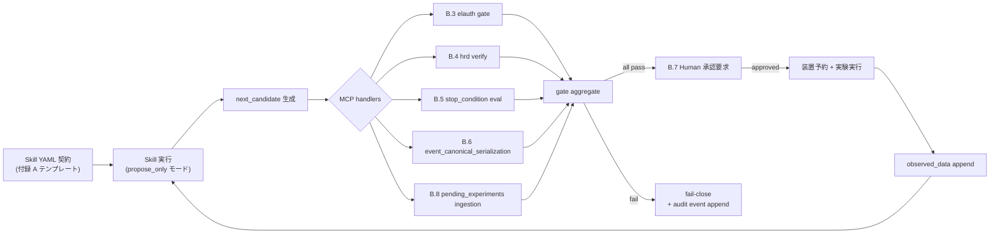

# 付録 B: BoTorch / GPyTorch / Ax / Emukit / modAL チートシートと MCP サーバ実装（BO 版）

> [!NOTE]
> 本付録は、vol-05 の BO / Active Learning Skill を **runtime で hash-verifiable に enforce する MCP handler 実装リファレンス** である。vol-04 付録 B（因果 × DoE 向け MCP）と対を成し、以下 2 つを提供する:
>
> - **B.2**: BoTorch / GPyTorch / Ax / Emukit / modAL の **API チートシート**（GP fit → acquisition → 候補提案の最小フロー）
> - **B.3〜B.8**: 付録 A の Skill テンプレートを **MCP パターン 6 種** に落とし込み、"候補提示までは自律、実験実行判断は必ず Human" を MCP レベルで組む
>
> 各 MCP パターンは (a) 目的 / (b) Skill → MCP request schema / (c) MCP → Skill response schema / (d) Python handler skeleton（FastMCP 高レベル SDK の `@mcp.tool()` async pattern）/ (e) 保護する Ch15 §15.2 失敗モード / (f) audit hooks（`event_hash` チェーン、`authorization_events_stream` への append）の 6 部構成に統一されている。

> [!IMPORTANT]
> **canonical schema 準拠ルール**（付録 A と共通、vol-05 全体で不変）:
>
> - `authorization_id`: `elauth_YYYYMMDD_HHMMSS_iter<n>`（Ch5 §5.3 / Ch16 §16.1.1 H-R2-1）
> - `parent_authorization_id`: `vol-04:L3_intervention_execution_authorization:l3_auth_YYYYMMDD_HHMMSS_iter<n>`
> - `sharing_authorization_id`: `shauth_YYYYMMDD_HHMMSS_seq<n>`（Ch16 §16.4）
> - `status` enum: **4 値** `pending | approved | denied | revoked`（Ch16 §16.1.1 H7）
> - identity: `^skill:<name>/<version>` または `^human:<staff_id>`
> - `event_hash`: `"sha256:" + hexdigest(RFC 8785 JCS(payload))`（canonical anchor: `vol-05:ch10:event_canonical_serialization`）
> - Skill ID: `arim.bo.<type>.v0.2` / `arim.al.<type>.v0.2`（Skill ID 内の version は dot 区切り。identity 文字列 `^skill:<name>/vX.Y` は slash 区切り。両者を変換する canonical helper は B.3 §(d) `skill_id_to_identity()` を参照）
> - Ch15 §15.2 失敗名は F&lt;n&gt; プレフィックスを付けず bare 形式で列挙する
> - MCP SDK は **FastMCP 高レベル SDK**（`mcp.server.fastmcp.FastMCP` + `@mcp.tool()`）を採用する。low-level `Server` + `@server.call_tool` パターンは必要に応じて差し替え可能

---

## B.1 全体構成 — MCP と Skill 契約の対応

vol-05 の BO / AL Skill 契約は **付録 A の 21 フィールド provenance** を YAML で保持するが、これを **runtime で hash-verifiable に enforce** するのが MCP handler の役割である。Skill は候補生成までを自律的に行い、`experiment_launch_authorization` gate の前段で必ず MCP handler を経由し、gate pass 後は装置予約・実行判断を Human に委譲する。



**MCP handler の 6 大責務**:

1. **契約 schema 準拠検証**: 付録 A の 21 フィールドの型・enum 値・identity 形式を機械検証する
2. **provenance dereference**: `parent_authorization_id` の存在と `parent_l3_status == approved` を検証
3. **hallucination flag canonical 判定**: variance + Mahalanobis + within_bounds を統一基準で評価（Ch7 §7.5 集中実装）
4. **stop_condition OR-composition 評価**: `budget | convergence | regret_threshold` 3 スコープ一括評価
5. **`event_hash` チェーン維持**: RFC 8785 JCS + SHA-256 決定論計算、`previous_event_hash` を append-only リンク
6. **fail-close 強制**: Ch15 §15.2 fatal 検出時に Skill 停止 + `authorization_events_stream` に fail event を append

**Skill と MCP の責務分離**:

| Skill 側の責務 | MCP handler 側の責務 |
|---|---|
| GP fit / acquisition 最適化 / 候補生成 | `event_hash` の canonical 計算・チェーン検証 |
| kernel_spec の hyperparameter prior 選択 | `authorization_id` 発行と status 遷移記録 |
| `next_candidate.x` の値決定 | `hallucination_flag.flag` の bool 判定（3 判定合成） |
| 21 フィールド provenance の payload 構築 | `stop_condition` の OR 評価 / Human 承認 UI 通知 / fatal 時 Skill 停止 |

> [!IMPORTANT]
> **propose_only モードの契約**: BO Skill は **`action_class: propose_only`** で起動し、`experiment_launch_authorization.status` を書き換える権限を持たない。MCP handler のみが `^human:` writer からの承認 event を受け付けて status を遷移させる。これは Ch15 §15.2.3（execute_without_approval）を構造的に防ぐ最深防護である。

---

## B.2 API チートシート

各ライブラリで **GP fit → acquisition → 候補提案** の最小フローを 3〜5 スニペットずつ示す。すべて付録 A の canonical schema（Ch14 §14.2.1 の 6 変数セラミック search space）を前提とする。

> [!NOTE]
> **categorical エンコーディング**: `x_atmosphere` は Ch14 §14.2.1 canonical で categorical `{Ar, N2, Air}`。
> BoTorch では **ordinal encoding**（`Ar=0`, `N2=1`, `Air=2`）で 6-D tensor に埋め込み、`kernel_spec` の対応列に **hamming kernel** を適用する（付録 A §A.2 L64-66 参照）。
> 従って以下のコード例では `x_atmosphere` の値は文字列ではなく整数リテラルで示す。
> 例: `x = [720.0, 2.3, 90.0, 0.42, 0.31, 0]  # 最後は Ar=0, N2=1, Air=2`

### B.2.1 BoTorch — 単目的 qLogEI

```python
import torch
from botorch.models import SingleTaskGP
from botorch.fit import fit_gpytorch_mll
from botorch.acquisition.logei import qLogExpectedImprovement
from botorch.optim import optimize_acqf
from gpytorch.mlls import ExactMarginalLogLikelihood

# train_X: (n, 6), train_Y: (n, 1), both float64, unit_cube normalized
model = SingleTaskGP(train_X, train_Y)
mll = ExactMarginalLogLikelihood(model.likelihood, model)
fit_gpytorch_mll(mll)

acqf = qLogExpectedImprovement(model=model, best_f=train_Y.max())
bounds = torch.stack([torch.zeros(6, dtype=torch.float64),
                      torch.ones(6, dtype=torch.float64)])
x_next, val = optimize_acqf(
    acq_function=acqf, bounds=bounds,
    q=1, num_restarts=10, raw_samples=512,
)
# x_next: (1, 6), val: scalar tensor
```

### B.2.2 BoTorch — 多目的 qLogNEHVI

```python
from botorch.models import ModelListGP
from botorch.acquisition.multi_objective.logei import (
    qLogNoisyExpectedHypervolumeImprovement,
)

# train_Y_list: list of (n, 1) tensors, one per objective
gp_density   = SingleTaskGP(train_X, train_Y_list[0])
gp_toughness = SingleTaskGP(train_X, train_Y_list[1])
model = ModelListGP(gp_density, gp_toughness)
for m in model.models:
    fit_gpytorch_mll(ExactMarginalLogLikelihood(m.likelihood, m))

ref_point = torch.tensor([2.10, 3.20], dtype=torch.float64)  # canonical
acqf = qLogNoisyExpectedHypervolumeImprovement(
    model=model, ref_point=ref_point, X_baseline=train_X,
    prune_baseline=True, alpha=0.0,
)
x_next, val = optimize_acqf(
    acq_function=acqf, bounds=bounds,
    q=1, num_restarts=20, raw_samples=1024,
)
```

### B.2.3 BoTorch — Batch qLogNEI + fantasize

```python
from botorch.acquisition.logei import qLogNoisyExpectedImprovement

# pending_experiments から X_pending を取り出し、qLogNEI の posterior sample に折り込む
X_pending = torch.tensor(pending_x_list, dtype=torch.float64)  # (n_pending, 6)

acqf = qLogNoisyExpectedImprovement(
    model=model, X_baseline=train_X,
    X_pending=X_pending,      # ← posterior sample として acquisition に折り込む (fantasy-based approximation)
    prune_baseline=True,
)
# NOTE: qLogNoisyExpectedImprovement は X_pending を posterior sample として acquisition に折り込む
#       (fantasy-based approximation)。厳密な fantasy posterior conditioning + re-optimization とは異なる。
#       canonical `pending_experiments.fantasize_policy.method: botorch_internal_fantasize` は
#       この qLogNEI + X_pending 実装を指す。
x_next_batch, val = optimize_acqf(
    acq_function=acqf, bounds=bounds,
    q=4, num_restarts=20, raw_samples=1024,
    sequential=True,          # sequential_greedy (canonical batch_diversity_policy strategy)
)
# x_next_batch: (4, 6)
```

### B.2.4 BoTorch — MultiTaskGP（階層 GP、拠点横断）

```python
from botorch.models import MultiTaskGP

# train_X_with_task: (n, 7)  末尾列が facility index (0=A, 1=B, ...)
task_feature = train_X_with_task.shape[-1] - 1
model = MultiTaskGP(
    train_X=train_X_with_task, train_Y=train_Y,
    task_feature=task_feature,
)
fit_gpytorch_mll(ExactMarginalLogLikelihood(model.likelihood, model))

# facility A で最適化: task 列を 0 に固定
bounds_with_task = torch.cat(
    [bounds, torch.tensor([[0.0], [1.0]], dtype=torch.float64)], dim=-1,
)
acqf = qLogNoisyExpectedImprovement(model=model, X_baseline=train_X_with_task)
x_next, val = optimize_acqf(
    acq_function=acqf, bounds=bounds_with_task,
    q=1, num_restarts=10, raw_samples=512,
    fixed_features={task_feature: 0},  # facility A に固定
)
```

### B.2.5 GPyTorch — 明示的な kernel spec（Matérn 5/2 + ARD + GammaPrior）

```python
import gpytorch
from gpytorch.kernels import MaternKernel, ScaleKernel
from gpytorch.priors import GammaPrior

class ExactGPMatern52ARD(gpytorch.models.ExactGP):
    def __init__(self, train_X, train_Y, likelihood, ard_num_dims=6):
        super().__init__(train_X, train_Y, likelihood)
        self.mean_module = gpytorch.means.ConstantMean()
        base = MaternKernel(
            nu=2.5, ard_num_dims=ard_num_dims,
            lengthscale_prior=GammaPrior(3.0, 6.0),
        )
        self.covar_module = ScaleKernel(
            base, outputscale_prior=GammaPrior(2.0, 0.15),
        )
    def forward(self, x):
        return gpytorch.distributions.MultivariateNormal(
            self.mean_module(x), self.covar_module(x),
        )

likelihood = gpytorch.likelihoods.GaussianLikelihood(
    noise_prior=GammaPrior(1.1, 0.05),
)
model = ExactGPMatern52ARD(train_X, train_Y.squeeze(-1), likelihood)
# 診断: model.covar_module.base_kernel.lengthscale, model.likelihood.noise
```

### B.2.6 Ax — AxClient + GenerationStrategy

> [!NOTE]
> 以下は Ax 0.3.x 系の `Models` レジストリ API に基づく。Ax 0.4+ では
> `GenerationStrategy` + `Generators` namespace に再構成されているため、
> production 導入時は Ax のバージョンに合わせて import path を調整すること。

```python
from ax.service.ax_client import AxClient, ObjectiveProperties
from ax.modelbridge.generation_strategy import GenerationStrategy, GenerationStep
from ax.modelbridge.registry import Models

gs = GenerationStrategy(steps=[
    GenerationStep(model=Models.SOBOL,   num_trials=8,  min_trials_observed=8),
    GenerationStep(model=Models.BOTORCH_MODULAR, num_trials=-1),
])
ax_client = AxClient(generation_strategy=gs, random_seed=20260704)
ax_client.create_experiment(
    name="arim_ceramic_bo",
    parameters=[
        {"name": "x_temperature", "type": "range", "bounds": [200.0, 800.0], "value_type": "float"},
        # ... 残り 5 変数
    ],
    objectives={"y_density": ObjectiveProperties(minimize=False)},
)
parameters, trial_index = ax_client.get_next_trial()   # 付録 A の next_candidate.x に相当
```

### B.2.7 Emukit — LoopState と batch

```python
from emukit.core import ContinuousParameter, ParameterSpace
from emukit.model_wrappers import GPyModelWrapper
from emukit.bayesian_optimization.loops import BayesianOptimizationLoop
from emukit.bayesian_optimization.acquisitions import ExpectedImprovement
import GPy

space = ParameterSpace([ContinuousParameter("x_temperature", 200.0, 800.0), ])  # 他 5 変数省略
model = GPyModelWrapper(GPy.models.GPRegression(train_X, train_Y))
loop = BayesianOptimizationLoop(
    model=model, space=space, acquisition=ExpectedImprovement(model), batch_size=1,
)
loop.run_loop(user_function=None, stopping_condition=1)   # 1 iteration のみ
next_x = loop.loop_state.X[-1]
```

### B.2.8 modAL — Active Learning（GP regressor 用 std-based sampling）

```python
# sklearn.gaussian_process.GaussianProcessRegressor は predict_proba を持たないため、
# modAL の built-in uncertainty_sampling (classifier 前提) は使えない。
# regression 用の std-based custom strategy を明示定義する。
import numpy as np
from modAL.models import ActiveLearner
from sklearn.gaussian_process import GaussianProcessRegressor
from sklearn.gaussian_process.kernels import Matern


def gp_std_sampling(regressor, X_pool):
    _, std = regressor.predict(X_pool, return_std=True)
    idx = int(np.argmax(std))
    return idx, X_pool[idx]


learner = ActiveLearner(
    estimator=GaussianProcessRegressor(kernel=Matern(nu=2.5), random_state=20260704),
    query_strategy=gp_std_sampling,
    X_training=train_X, y_training=train_Y.ravel(),
)
query_idx, query_x = learner.query(X_pool)   # returns (index, sample); X_pool: (n_pool, 6)
```

> [!NOTE]
> **API 責務境界**: BoTorch / GPyTorch は「モデルと acquisition」、Ax は「実験管理と generation strategy」、Emukit は「loop state 抽象化」、modAL は「AL に特化した query strategy」を扱う。付録 A の Skill テンプレートは BoTorch 直呼びを canonical としており、Ax 経由の場合は `bo_library_stack: ax_wraps_botorch` に変更、`bo_library_stack_metadata.generation_strategy_uri` を必ず記録すること。

---

## B.3 MCP パターン 1: `experiment_launch_authorization` gate handler

### (a) 目的

BO Skill が生成した `next_candidate` を **`authorization_id` 発行前に verify** し、Skill を **propose_only モード** に強制する。Skill 自身が `status: approved` を書き込むことを構造的に不可能にし、Ch15 §15.2.3（execute_without_approval）を防ぐ。本 handler は Ch5 §5.3 の 4 要件（parent L3 リンク / 両ゲート pass / bypass 禁止 / 承認スコープ限定）を機械実施する。

### (b) Skill → MCP request schema

```yaml
mcp_request_elauth_gate:
  version: "v0.2"
  skill_id: "arim.bo.single_objective_gp_ei.v0.2"
  skill_execution_id: "skill-exec-20260704-101530"
  role: "agent_autonomous"
  action_class: "propose_only"                       # ★ Skill は execute しない
  iteration_index: 7
  run_id: "run-2026-0704-A01"
  parent_authorization_id: "vol-04:L3_intervention_execution_authorization:l3_auth_20260701_090000_iter1"
  next_candidate:
    x: {x_temperature: 720.0, x_pressure: 2.3, x_hold_time: 90.0,
        x_mass_frac_A: 0.42, x_mass_frac_B: 0.31, x_atmosphere: 0}   # Ar=0, N2=1, Air=2 (ordinal, Ch14 §14.2.1)
    acquisition_value: 0.0273
    estimated_cost: {calendar_hours: 30, money_jpy: 45000}
  budget_remaining: {iterations: 33, monetary_jpy: 850000, wall_clock_hours: 62.5}
  search_space_bounds_ref: "vol-05:ch14:ceramic_search_space_v0_2"
  contract_pin:
    kernel_spec_sha256: "5c1d0aef03..."
    acquisition_spec_sha256: "3a90bb11..."
  requested_at: "2026-07-04T10:15:30Z"
  previous_event_hash: "sha256:3a90bb11..."          # 前 iteration の tail event
```

### (c) MCP → Skill response schema

```yaml
mcp_response_elauth_gate:
  gate_status: "pass"                                # enum: pass | fail | conditional_pass
  gate_level: "experiment_launch_authorization"
  authorization_id: "elauth_20260704_101530_iter7"   # canonical form
  status: "pending"                                  # enum: pending | approved | denied | revoked
  approver_required: "^human:staff_042"
  event_hash: "sha256:5c1def03..."                   # 本 event の canonical hash
  previous_event_hash: "sha256:3a90bb11..."
  verified_at: "2026-07-04T10:15:31Z"
  verifier_signature: null  # reserved for ed25519 keystore integration; unpopulated in v0.2
  budget_precheck:
    passes_all: true
    post_launch_remaining_monetary_jpy: 805000
  parent_l3_check:
    parent_authorization_id: "vol-04:L3_intervention_execution_authorization:l3_auth_20260701_090000_iter1"
    parent_l3_status: "approved"
  # fail 時のみ以下を含める
  fatal: null                                        # e.g. "Ch15.execute_without_approval"
  action: null                                       # e.g. "fail_close"
```

### (d) MCP handler skeleton（Python, `mcp` SDK 風）

```python
import hashlib, json, re
from datetime import datetime, timezone
from mcp.server.fastmcp import FastMCP
from mcp.types import TextContent

mcp = FastMCP("arim-bo-mcp")  # B.3-B.8 の 6 handler を同一 server instance にまとめて登録
CANONICAL_STATUS = frozenset({"pending", "approved", "denied", "revoked"})
AUTH_ID_REGEX = re.compile(r"^elauth_\d{8}_\d{6}_iter\d+$")
IDENTITY_REGEX = re.compile(
    r"^(skill:[a-z0-9_.]+/v\d+\.\d+"
    r"|human:[a-zA-Z0-9_]+"
    r"|service:[a-z0-9_]+)$"
)  # service: prefix は MCP-internal system writers 用 (created_by の HITL 免除)


def skill_id_to_identity(skill_id: str) -> str:
    """canonical: skill_id `arim.bo.single_objective_gp_ei.v0.2`
       → identity `skill:arim.bo.single_objective_gp_ei/v0.2` (append `^` at use site).

    Skill ID は末尾に `.v<major>.<minor>` を持つ dot 区切り形式、
    identity 文字列は `skill:<name>/v<major>.<minor>` の slash 区切り形式。
    """
    if not re.search(r"\.v\d+\.\d+$", skill_id):
        raise ValueError(
            f"non-canonical skill_id (missing .vX.Y suffix): {skill_id!r}"
        )
    base, major, minor = skill_id.rsplit(".", 2)  # arim.bo.name / v0 / 2
    return f"skill:{base}/{major}.{minor}"


def compute_event_hash(payload: dict) -> str:
    """Ch10 §10.5.2 canonical: RFC 8785 JCS + SHA-256, 'sha256:' prefix."""
    canonical = json.dumps(payload, sort_keys=True, separators=(",", ":"),
                           ensure_ascii=False).encode("utf-8")
    return "sha256:" + hashlib.sha256(canonical).hexdigest()


def issue_authorization_id(iteration_index: int, ts: datetime) -> str:
    return f"elauth_{ts.strftime('%Y%m%d_%H%M%S')}_iter{iteration_index}"


@mcp.tool()
async def experiment_launch_authorization_gate(request: dict) -> list[TextContent]:
    """
    Ch5 §5.3 4 要件を機械実施:
      1. vol-04 L3 parent リンク / 2. 両ゲート pass /
      3. bypass 禁止 / 4. 承認スコープ限定
    """
    # 0. action_class は propose_only に強制
    if request.get("action_class") != "propose_only":
        return _fail("Ch15.execute_without_approval",
                     "skill must be propose_only")

    # 1. parent L3 の存在と status verify
    parent_id = request.get("parent_authorization_id")
    if not parent_id or not parent_id.startswith(
        "vol-04:L3_intervention_execution_authorization:"
    ):
        return _fail("Ch15.execute_without_approval",
                     "parent_authorization_id missing or malformed")
    parent_record = await fetch_provenance(parent_id)
    if parent_record.get("status") != "approved":
        return _fail("Ch15.execute_without_approval",
                     f"parent_l3_status={parent_record.get('status')}")

    # 2. budget precheck (Ch5 §5.5 スコープ 1)
    br, ec = request["budget_remaining"], request["next_candidate"]["estimated_cost"]
    passes_all = (
        br["iterations"] - 1 >= 0
        and br["monetary_jpy"] - ec["money_jpy"] >= 0
        and br["wall_clock_hours"] - ec["calendar_hours"] >= 0
    )
    if not passes_all:
        return _fail("Ch15.stop_condition_relax_by_skill", "budget_precheck failed")

    # 3. contract_pin meta-integrity (Ch15 §15.2.10)
    stored = await fetch_contract_pin(request["run_id"], "kernel_spec")
    if request["contract_pin"]["kernel_spec_sha256"] != stored:
        return _fail("Ch15.contract_pin_meta_integrity_break",
                     "kernel_spec_sha256 mismatch")

    # 4. authorization_id 発行と event append
    now = datetime.now(timezone.utc)
    auth_id = issue_authorization_id(request["iteration_index"], now)
    if not AUTH_ID_REGEX.match(auth_id):
        return _fail("Ch5.authorization_id_malformed", f"non-canonical id: {auth_id}")

    payload = {
        "authorization_id": auth_id,
        "transition": {"from": None, "to": "pending"},
        "requested_by": f"^{skill_id_to_identity(request['skill_id'])}",
        "candidate_hash": _hash_candidate(request["next_candidate"]),
        "iteration_index": request["iteration_index"],
        "parent_authorization_id": parent_id, "parent_l3_status": "approved",
        "run_id": request["run_id"],
        "skill_execution_id": request["skill_execution_id"],
        "created_at": now.strftime("%Y-%m-%dT%H:%M:%SZ"),
        "created_by": "^service:mcp_gate_service",  # ^service: reserved namespace, HITL bypass
    }
    event_hash = compute_event_hash(payload)
    await append_to_authorization_events_stream({
        "event_id": f"evt-auth-{now.strftime('%Y%m%d-%H%M%S')}-iter{request['iteration_index']}",
        "event_hash": event_hash,
        "previous_event_hash": request.get("previous_event_hash"),
        **payload,
    })

    return [TextContent(type="text", text=json.dumps({
        "gate_status": "pass",
        "gate_level": "experiment_launch_authorization",
        "authorization_id": auth_id, "status": "pending",
        "approver_required": "^human:staff_042",
        "event_hash": event_hash,
        "previous_event_hash": request.get("previous_event_hash"),
        "verifier_signature": None,
        "verified_at": now.strftime("%Y-%m-%dT%H:%M:%SZ"),
        "budget_precheck": {"passes_all": True,
            "post_launch_remaining_monetary_jpy": br["monetary_jpy"] - ec["money_jpy"]},
        "parent_l3_check": {"parent_authorization_id": parent_id,
                            "parent_l3_status": "approved"},
    }))]


def _fail(fatal_name: str, reason: str) -> list[TextContent]:
    return [TextContent(type="text", text=json.dumps({
        "gate_status": "fail", "fatal": fatal_name,
        "action": "fail_close", "reason": reason,
    }))]


def _hash_candidate(candidate: dict) -> str:
    c = json.dumps(candidate["x"], sort_keys=True, separators=(",", ":"),
                   ensure_ascii=False)
    return "sha256:" + hashlib.sha256(c.encode("utf-8")).hexdigest()
```

### (e) 保護する Ch15 §15.2 失敗モード

- `Ch15.execute_without_approval` (§15.2.3) — `action_class != propose_only` / parent L3 欠落 / bypass の試みを fatal で遮断
- `Ch15.stop_condition_relax_by_skill` (§15.2.6) — Skill が実行時に `budget_remaining` を増やす試みを budget_precheck で捕捉
- `Ch15.contract_pin_meta_integrity_break` (§15.2.10) — kernel_spec_sha256 / acquisition_spec_sha256 の実行時不一致を検出

### (f) audit hooks

- `authorization_events_stream` に **`pending` genesis event** を append（`previous_event_hash` は前 iteration の tail、`writer_identity = ^service:mcp_gate_service`）
- 承認 UI 経由で `^human:staff_042` が `approved` event を追加すると status が遷移する
- fail 時は `experiment_launch_authorization_log` に `attempt_result: rejected_by_precondition_check` event を append
- 全 event の `event_hash` は `compute_event_hash()` で決定論的、run_id を anchor に replay 可能

---

## B.4 MCP パターン 2: `hallucinated_recommendation_detection` handler

### (a) 目的

付録 A の `hallucinated_recommendation_detection` フィールドは Ch5 §5.6 で「宣言レベル」を定義し、Ch7 §7.5 で「operational 3 判定（variance / Mahalanobis / length_scale_ratio）の合成基準」を定める。本 handler は **3 判定を canonical に合成** し、`hallucination_flag.flag: bool` を集中判定する（Skill 実装間の判定差を排除）。

### (b) Skill → MCP request schema

```yaml
mcp_request_hrd_verify:
  version: "v0.2"
  skill_id: "arim.bo.single_objective_gp_ei.v0.2"
  iteration_index: 7
  authorization_id: null  # populated post-hoc by B.3 elauth_gate; hrd_verify runs before auth issuance (§15.2.9 canonical ordering)
  run_id: "run-2026-0704-A01"                        # join key (§15.2.9 audit linkage)
  skill_execution_id: "sk_exec_20260704T1015Z_iter7"
  next_candidate:
    x: {ref: "6-var ceramic canonical"}              # 付録 A.2 参照
  surrogate_diagnostics:
    lengthscales: {x_temperature: 0.31, x_pressure: 0.58, x_hold_time: 0.44,
                   x_mass_frac_A: 0.27, x_mass_frac_B: 0.29, x_atmosphere: 0.51}
    noise_variance: 0.012
  prediction_at_candidate:
    posterior_mean: 0.87
    posterior_variance: 0.012                        # ← 判定 1 の raw 値
  train_X_stats:
    mean_vector: [0.5, 0.4, 0.45, 0.35, 0.30, 0.5]
    inv_covariance_matrix_ref: "artifact://run-2026-0704-A01/iter7/cov_inv"
  search_space_bounds_ref: "vol-05:ch14:ceramic_search_space_v0_2"
  hard_constraints_ref: "vol-05:ch10:hard_constraints_ceramic_v0_2"
  thresholds:
    variance_threshold: 0.10                         # Ch7 §7.5 canonical
    mahalanobis_threshold: 3.0
    length_scale_ratio_threshold: 1.0
```

### (c) MCP → Skill response schema

```yaml
mcp_response_hrd_verify:
  gate_status: "pass"                                # pass | fail | conditional_pass
  hrd_verified: true
  within_bounds: true
  within_hard_constraints: true
  extrapolation_score: 0.18                          # 0.0 (interp) → 1.0 (extrap)
  hallucination_flag:
    flag: false                                      # Skill Group D output に反映
    reasons: []                                      # e.g. ["mahalanobis_exceeded"]
    scores:                                          # numeric only
      variance: 0.012
      mahalanobis: 1.2
      length_scale_ratio: 0.6
    aggregation_rule: "any(score > threshold)"       # scores とは sibling
  action_on_flag: null                               # flag=true 時のみ "return_needs_human_review"
  event_hash: "sha256:abc123..."
```

### (d) MCP handler skeleton

```python
@mcp.tool()
async def hallucinated_recommendation_detection_verify(request: dict) -> list[TextContent]:
    """
    Ch7 §7.5 operational 3 判定を canonical に合成:
      1. posterior_variance > variance_threshold
      2. Mahalanobis distance > mahalanobis_threshold
      3. length_scale_ratio > length_scale_ratio_threshold
    aggregation_rule: any(score > threshold)
    """
    th, diag = request["thresholds"], request["surrogate_diagnostics"]
    pred = request["prediction_at_candidate"]

    variance_score = pred["posterior_variance"]
    variance_exceeded = variance_score > th["variance_threshold"]

    mahalanobis_score = await compute_mahalanobis(
        x=request["next_candidate"]["x"],
        mean=request["train_X_stats"]["mean_vector"],
        inv_cov_ref=request["train_X_stats"]["inv_covariance_matrix_ref"],
    )
    mahalanobis_exceeded = mahalanobis_score > th["mahalanobis_threshold"]

    ls = diag["lengthscales"]
    # 各次元 i について _distance_over_lengthscale(candidate_x, ls, i) を評価し、
    # 全次元にわたる最大 length-scale ratio を取る（次元ごとの外挿性を検出）。
    lsr_max = max(
        _distance_over_lengthscale(request["next_candidate"]["x"], ls, i)
        for i in range(len(ls))
    )
    lsr_exceeded = lsr_max > th["length_scale_ratio_threshold"]

    bounds = await fetch_bounds(request["search_space_bounds_ref"])
    within_bounds = _check_bounds(request["next_candidate"]["x"], bounds)
    hard_c = await fetch_hard_constraints(request["hard_constraints_ref"])
    within_hard = _check_hard_constraints(request["next_candidate"]["x"], hard_c)

    reasons = []
    if variance_exceeded:      reasons.append("variance_exceeded")
    if mahalanobis_exceeded:   reasons.append("mahalanobis_exceeded")
    if lsr_exceeded:           reasons.append("length_scale_ratio_exceeded")
    if not within_bounds:      reasons.append("out_of_bounds")
    if not within_hard:        reasons.append("hard_constraint_violation")
    flag = len(reasons) > 0

    extrapolation_score = min(1.0, (
        0.3 * min(1.0, variance_score / th["variance_threshold"])
        + 0.4 * min(1.0, mahalanobis_score / th["mahalanobis_threshold"])
        + 0.3 * min(1.0, lsr_max / th["length_scale_ratio_threshold"])
    ))

    payload = {
        "authorization_id": request["authorization_id"],
        "iteration_index": request["iteration_index"],
        "run_id": request["run_id"],
        "skill_execution_id": request["skill_execution_id"],
        "created_at": datetime.now(timezone.utc).strftime("%Y-%m-%dT%H:%M:%SZ"),
        "created_by": f"^{skill_id_to_identity(request['skill_id'])}",
        "flag": flag, "reasons": reasons,
        "scores": {"variance": variance_score, "mahalanobis": mahalanobis_score,
                   "length_scale_ratio": lsr_max},
        "aggregation_rule": "any(score > threshold)",
        "extrapolation_score": extrapolation_score,
    }
    event_hash = compute_event_hash(payload)
    if flag:
        now_ev = datetime.now(timezone.utc)
        await append_to_hallucination_events({
            **payload,
            "event_id": f"evt-hrd-{now_ev.strftime('%Y%m%d-%H%M%S')}-iter{request['iteration_index']}",
            "event_hash": event_hash,
            "previous_event_hash": await fetch_stream_tail_hash(
                "hallucination_events", request["run_id"]),
        })

    return [TextContent(type="text", text=json.dumps({
        "gate_status": "pass" if not flag else "conditional_pass",
        "hrd_verified": True,
        "within_bounds": within_bounds,
        "within_hard_constraints": within_hard,
        "extrapolation_score": extrapolation_score,
        "hallucination_flag": {"flag": flag, "reasons": reasons,
                               "scores": payload["scores"],
                               "aggregation_rule": payload["aggregation_rule"]},
        "action_on_flag": "return_needs_human_review" if flag else None,
        "event_hash": event_hash,
    }))]
```

### (e) 保護する Ch15 §15.2 失敗モード

- `Ch15.extrapolation_reported_confidently` (§15.2.2) — 外挿領域を「自信あり」と誤報告する Skill 実装差を canonical 判定で吸収
- `Ch15.hallucination_flag_missing` (§15.2.2) — `hallucinated_recommendation_detection` の bare bool 記録を許さず、`{flag, reasons, scores}` dict 型を強制（Ch5 §5.2）

### (f) audit hooks

- `flag=true` のとき `hallucination_events` stream（Group B の append-only field）に `previous_event_hash` を伴って event を append し、B.6 canonical replay chain の verify 対象に加える
- 本 event は §15.2.9 canonical ordering により `authorization_id` を持たない（elauth_gate は後段）。承認 UI での「外挿警告」紐付けは `(run_id, iteration_index, skill_execution_id)` の join key で `authorization_events_stream` と結合する
- `action_on_flag: "return_needs_human_review"` は Skill 契約（Ch5 §5.6）と一致する canonical 値である

---

## B.5 MCP パターン 3: `stop_condition` OR-composition evaluator

### (a) 目的

Ch5 §5.5 の canonical 3 スコープ `budget | convergence | regret_threshold` を **OR 論理で結合評価** する。Skill が閾値を実行時に緩めるのを防ぐため（Ch15 §15.2.6）、stop_condition dict の `hash pin` を毎 iteration 開始時に verify し、条件充足時は次候補生成を封じる。

### (b) Skill → MCP request schema

```yaml
mcp_request_stop_condition_eval:
  version: "v0.2"
  skill_id: "arim.bo.single_objective_gp_ei.v0.2"
  skill_execution_id: "sk_exec_20260704T1015Z_iter7"
  iteration_index: 7
  run_id: "run-2026-0704-A01"
  stop_condition:
    version: "v0.2"
    logic: "OR"
    conditions:
      - type: "budget"
        calendar_hours_min: 0
        money_jpy_min: 0
      - type: "convergence"
        lookback_iterations: 5
        relative_change_threshold: 0.01
      - type: "regret_threshold"
        target_value: 0.95
        objective: "y_density"
    hrd_declared: true
  stop_condition_hash_pin: "sha256:d1e2f3..."         # run 起動時に pin
  current_state:
    budget_remaining:
      iterations: 33
      monetary_jpy: 850000
      wall_clock_hours: 62.5
    recent_best_history:                              # 直近 M+1 iteration の best-so-far (M=lookback)
      - {iteration: 2, y_best: 0.75}
      - {iteration: 3, y_best: 0.78}
      - {iteration: 4, y_best: 0.83}
      # ... iteration 5-7 略 (0.85, 0.87, 0.87)
    current_best: {y_best: 0.87, objective: "y_density"}
```

### (c) MCP → Skill response schema

```yaml
mcp_response_stop_condition_eval:
  gate_status: "pass"                                # pass = handler が正常完了（should_stop で継続/停止を判断） / fail = handler 内部 fatal
  should_stop: false
  stop_condition_hash_verified: true
  evaluated_conditions:
    - {type: "budget",            satisfied: false, details: {monetary_jpy_remaining: 850000, wall_clock_hours_remaining: 62.5}}
    - {type: "convergence",       satisfied: false, details: {relative_change: 0.024, threshold: 0.01}}
    - {type: "regret_threshold",  satisfied: false, details: {current_best: 0.87, target_value: 0.95}}
  logic: "OR"
  aggregate_satisfied: false
  event_hash: "sha256:e4f5g6..."
```

### (d) MCP handler skeleton

```python
@mcp.tool()
async def stop_condition_evaluate(request: dict) -> list[TextContent]:
    """
    Ch5 §5.5 canonical 3 スコープを OR 評価。
    stop_condition_hash_pin を毎回 verify し、Skill が閾値緩和したら fatal。
    """
    sc = request["stop_condition"]

    # 0. hash pin verify (Ch15 §15.2.6)
    if compute_event_hash(sc) != request["stop_condition_hash_pin"]:
        return _fail("Ch15.stop_condition_relax_by_skill",
                     "stop_condition_hash_pin mismatch")

    state = request["current_state"]
    evaluated = []
    for cond in sc["conditions"]:
        # NOTE: state.budget_remaining.wall_clock_hours は残時間、cond.calendar_hours_min は
        #       下限しきい値。同じ「時間」でも「残」と「min」で命名が非対称なので、
        #       比較時は必ず「remaining <= min」の向きで揃える（Ch5 §5.5 canonical）。
        if cond["type"] == "budget":
            satisfied = (
                state["budget_remaining"]["monetary_jpy"] <= cond["money_jpy_min"]
                or state["budget_remaining"]["wall_clock_hours"] <= cond["calendar_hours_min"]
            )
            evaluated.append({"type": "budget", "satisfied": satisfied,
                "details": {
                    "monetary_jpy_remaining": state["budget_remaining"]["monetary_jpy"],
                    "wall_clock_hours_remaining": state["budget_remaining"]["wall_clock_hours"]}})
        elif cond["type"] == "convergence":
            hist, M = state["recent_best_history"], cond["lookback_iterations"]
            if len(hist) < M + 1:
                satisfied, rel_change = False, None
            else:
                y_now, y_past = hist[-1]["y_best"], hist[-M-1]["y_best"]
                rel_change = abs(y_now - y_past) / max(abs(y_past), 1e-9)
                satisfied = rel_change < cond["relative_change_threshold"]
            evaluated.append({"type": "convergence", "satisfied": satisfied,
                "details": {"relative_change": rel_change,
                            "threshold": cond["relative_change_threshold"]}})
        elif cond["type"] == "regret_threshold":
            satisfied = state["current_best"]["y_best"] >= cond["target_value"]
            evaluated.append({"type": "regret_threshold", "satisfied": satisfied,
                "details": {"current_best": state["current_best"]["y_best"],
                            "target_value": cond["target_value"]}})
        elif cond["type"] == "MC_variance_saturation":
            return _fail("Ch5.forbidden_stop_condition_type",
                         "MC_variance_saturation is out of scope")
        else:
            return _fail("Ch5.forbidden_stop_condition_type",
                         f"unknown stop_condition type: {cond['type']}")

    aggregate = (any(e["satisfied"] for e in evaluated) if sc["logic"] == "OR"
                 else all(e["satisfied"] for e in evaluated))
    payload = {
        "run_id": request["run_id"],
        "iteration_index": request["iteration_index"],
        "skill_execution_id": request["skill_execution_id"],
        "created_at": datetime.now(timezone.utc).strftime("%Y-%m-%dT%H:%M:%SZ"),
        "created_by": f"^{skill_id_to_identity(request['skill_id'])}",
        "logic": sc["logic"], "evaluated_conditions": evaluated,
        "aggregate_satisfied": aggregate,
    }
    event_hash = compute_event_hash(payload)
    now_ev = datetime.now(timezone.utc)
    await append_to_stop_condition_eval_events({
        **payload,
        "event_id": f"evt-stop-{now_ev.strftime('%Y%m%d-%H%M%S')}-iter{request['iteration_index']}",
        "event_hash": event_hash,
        "previous_event_hash": await fetch_stream_tail_hash(
            "stop_condition_eval_events", request["run_id"]),
    })

    return [TextContent(type="text", text=json.dumps({
        "gate_status": "pass", "should_stop": aggregate,
        "stop_condition_hash_verified": True,
        "evaluated_conditions": evaluated,
        "logic": sc["logic"], "aggregate_satisfied": aggregate,
        "event_hash": event_hash,
    }))]
```

### (e) 保護する Ch15 §15.2 失敗モード

- `Ch15.stop_condition_relax_by_skill` (§15.2.6) — `stop_condition_hash_pin` の実行時 verify で Skill による閾値緩和を fatal 検出
- `Ch5.forbidden_stop_condition_type` — `MC_variance_saturation` など Ch5 §5.5 スコープ外の type を早期に fatal

### (f) audit hooks

- `stop_condition_eval_events` stream（run_id 単位 append-only）に評価結果を append
- `aggregate_satisfied: true` になった iteration では以降の `experiment_launch_authorization_gate` 呼び出しを reject する（次候補生成の自律継続を封じる）
- Human が新 run（新 run_id）で `stop_condition` を書き換える場合は、それが Ch15 §15.2.6 の是正契約（新 run 開始）と一致することを audit で確認する

---

## B.6 MCP パターン 4: `event_canonical_serialization` handler

### (a) 目的

Ch10 §10.5.2 の canonical anchor `vol-05:ch10:event_canonical_serialization`（RFC 8785 JCS + SHA-256）を **単一の MCP tool として集中実装** する。すべての append-only event stream（authorization_events_stream / hallucination_events / cancellation_events / stop_condition_eval_events / acquisition_change_events など）は本 handler と同じ canonical serialization 規約（flat envelope, RFC 8785 JCS + SHA-256, ensure_ascii=False, sort_keys=True）で `event_hash` を計算し、`previous_event_hash` チェーンを維持する。本 handler は canonical 実装の reference であり、各 stream handler はこの規約に従って独立に `compute_event_hash` を呼ぶ（もしくは本 tool を invoke して集中化することもできる）。

### (b) Skill → MCP request schema

```yaml
mcp_request_event_canonicalize:
  version: "v0.2"
  stream_name: "authorization_events_stream"         # canonical stream id
  event_id: "evt-auth-20260704-101530-iter7"
  previous_event_hash: "sha256:3a90bb11..."          # null iff genesis
  event_body:                                        # flat dict: envelope + business fields (siblings, NOT nested)
    run_id: "run-2026-0704-A01"
    skill_execution_id: "skill-exec-20260704-101530"
    created_at: "2026-07-04T10:15:30Z"               # ISO 8601 UTC canonical
    created_by: "^service:mcp_gate_service"          # authorization genesis は ^service: writer（Skill 直接 write は B.3 で fatal reject）
    authorization_id: "elauth_20260704_101530_iter7"
    transition: {from: null, to: "pending"}
    candidate_hash: "sha256:9f2ac7b3..."
    iteration_index: 7
```

### (c) MCP → Skill response schema

```yaml
mcp_response_event_canonicalize:
  event_hash: "sha256:5c1def03..."
  event_hash_input_bytes: 342                         # canonical bytes 長 (debug)
  canonical_representation:
    encoding: "UTF-8"
    sort_keys: true
    separators: [",", ":"]
    standard: "RFC 8785 JCS"
  chain_verified: true                                # previous_event_hash が既存 tail と一致
  appended_at: "2026-07-04T10:15:31Z"
```

### (d) MCP handler skeleton

```python
@mcp.tool()
async def event_canonical_serialize_and_append(request: dict) -> list[TextContent]:
    """
    Ch10 §10.5.2 canonical anchor:
      1. event_body (flat dict: envelope + business fields) を RFC 8785 JCS で serialize
      2. sha256 hexdigest に "sha256:" prefix を付与
      3. previous_event_hash が stream の tail event_hash と一致するか verify
      4. append-only insert (書換は fatal), 保存も flat dict
    event_body には event_id / event_hash / previous_event_hash を含めない (循環回避)。
    envelope フィールド (run_id / skill_execution_id / created_at / created_by) は
    business フィールドと sibling で並ぶ (nested payload は使わない、B.4/B.5/B.8 と揃える)。
    """
    event_body = request["event_body"]

    # 1. writer identity check
    if not IDENTITY_REGEX.match(event_body["created_by"].lstrip("^")):
        return _fail("Ch5.writer_identity_malformed",
                     f"created_by={event_body['created_by']}")

    # 2. canonical bytes 生成 (flat dict をそのまま hash)
    canonical_bytes = json.dumps(event_body, sort_keys=True,
                                 separators=(",", ":"),
                                 ensure_ascii=False).encode("utf-8")
    event_hash = "sha256:" + hashlib.sha256(canonical_bytes).hexdigest()

    # 3. chain verify
    stream_name = request["stream_name"]
    tail = await fetch_stream_tail_hash(stream_name, event_body["run_id"])
    if request["previous_event_hash"] != tail:
        return _fail("Ch10.event_hash_chain_break",
                     f"expected previous={tail}, got={request['previous_event_hash']}")

    # 4. append-only insert — flat 保存 (envelope + business + chain fields が sibling)
    now = datetime.now(timezone.utc)
    try:
        await append_only_insert(stream_name, {
            **event_body,
            "event_id": request["event_id"],
            "event_hash": event_hash,
            "previous_event_hash": request["previous_event_hash"],
        })
    except AppendOnlyViolation:
        return _fail("Ch10.append_only_write_violation",
                     "attempted overwrite of existing event")

    return [TextContent(type="text", text=json.dumps({
        "event_hash": event_hash,
        "event_hash_input_bytes": len(canonical_bytes),
        "canonical_representation": {
            "encoding": "UTF-8", "sort_keys": True,
            "separators": [",", ":"], "standard": "RFC 8785 JCS"},
        "chain_verified": True,
        "appended_at": now.strftime("%Y-%m-%dT%H:%M:%SZ"),
    }))]


async def verify_chain_for_run(stream_name: str, run_id: str) -> bool:
    """canonical chain replay: recompute every event_hash from stored flat fields
    and verify previous_event_hash linkage.
    stored fields = envelope (run_id, skill_execution_id, created_at, created_by, event_id)
                  + business (per-stream) + chain (event_hash, previous_event_hash).
    replay 時は chain-metadata (event_id / event_hash / previous_event_hash) を
    strip し、hash 計算対象と一致させる。"""
    events = await read_stream(stream_name, filter={"run_id": run_id})
    prev = None
    for e in events:
        if e["previous_event_hash"] != prev:
            return False
        # recompute over the flat event body, stripping chain / envelope-only fields
        body = {k: v for k, v in e.items()
                if k not in {"event_id", "event_hash", "previous_event_hash"}}
        if compute_event_hash(body) != e["event_hash"]:
            return False
        prev = e["event_hash"]
    return True
```

### (e) 保護する Ch15 §15.2 失敗モード

- `Ch10.event_hash_chain_break` — `previous_event_hash` の不整合を genesis event を除いて fatal 検出
- `Ch10.append_only_write_violation` — 既存 event の書換・削除・順序改変を fatal 検出（Ch15 §15.2.10 contract_pin_meta_integrity_break と対を成す）
- `Ch5.writer_identity_malformed` — `^skill:` / `^human:` / `^service:` 以外の writer による event 書込を早期 reject（`^service:` は MCP-internal system writers に限定、Ch5 §5.2 canonical）

### (f) audit hooks

- 全 event stream（authorization / hallucination / cancellation / stop_condition_eval / acquisition_change / duplicate_candidate / seed_change / dag_revision / experiment_reservation 等）は本 handler を経由する
- run 単位で `verify_chain_for_run()` を実行することで、Ch15 §15.3 audit checklist の replay test が canonical に行える
- root_of_trust anchor（Ch15 §15.2.10）に対する tail event の照合は上位 audit Skill から本 handler の replay API を呼び出して実施

---

## B.7 MCP パターン 5: BO Skill × Human 承認ゲート統合フロー

### (a) 目的

B.3〜B.6 の 4 handler を **1 iteration 内で連鎖起動** し、"候補提示までは Skill が自律・実行判断は必ず Human" を MCP レベルで組む。Skill は `next_candidate` を propose するのみで、`^human:` writer が UI 経由で `approved` event を書き込むまで実験実行不可、という invariant を強制する。

### (b) Skill → MCP request schema（iteration 開始時の統合起動）

```yaml
mcp_request_bo_iteration_flow:
  version: "v0.2"
  skill_id: "arim.bo.single_objective_gp_ei.v0.2"
  skill_execution_id: "skill-exec-20260704-101530"
  run_id: "run-2026-0704-A01"
  iteration_index: 7
  action_class: "propose_only"
  parent_authorization_id: "vol-04:L3_intervention_execution_authorization:l3_auth_20260701_090000_iter1"
  provenance:                                        # 付録 A 21 フィールドの subset
    next_candidate:
      x: {ref: "6-var ceramic canonical"}
      acquisition_value: 0.0273
      estimated_cost: {calendar_hours: 30, money_jpy: 45000}
    surrogate_diagnostics:
      lengthscales: {x_temperature: 0.31, x_pressure: 0.58}
      noise_variance: 0.012
    prediction_at_candidate: {posterior_mean: 0.87, posterior_variance: 0.012}
    budget_remaining: {iterations: 33, monetary_jpy: 850000, wall_clock_hours: 62.5}
    stop_condition_ref: "run-2026-0704-A01:stop_condition_hash_pin"
    hard_constraints_ref: "vol-05:ch10:hard_constraints_ceramic_v0_2"
    contract_pin:
      kernel_spec_sha256: "5c1d0aef03..."
      acquisition_spec_sha256: "3a90bb11..."
  human_approver_pool: ["^human:staff_042", "^human:staff_089"]
  timeout_seconds: 172800                            # 48h（Ch15 §15.2.3 approval_recent 閾値）
```

### (c) MCP → Skill response schema

```yaml
mcp_response_bo_iteration_flow:
  aggregate_gate_status: "pending_human_approval"    # enum: pending_human_approval | fail | approved | denied
  authorization_id: "elauth_20260704_101530_iter7"
  handler_results:
    stop_condition_eval: {should_stop: false, event_hash: "sha256:e4f5g6..."}
    hrd_verify:
      hrd_verified: true
      hallucination_flag: {flag: false, reasons: [], scores: {...}}
      event_hash: "sha256:abc123..."
    elauth_gate: {status: "pending", event_hash: "sha256:5c1def03..."}
  human_approval_ui:
    ticket_id: "hitl-2026-0704-101530"
    ticket_url: "https://arim-hitl.example/ticket/hitl-2026-0704-101530"
    approver_pool: ["^human:staff_042", "^human:staff_089"]
    expires_at: "2026-07-06T10:15:30Z"
  next_action_for_skill: "await_approval_event"      # Skill は launch を保留
  # 失敗 / 停止時 variants (see _finalize_flow):
  # aggregate_gate_status: "denied"  # stop_condition 充足 → 継続打ち切り
  # aggregate_gate_status: "fail"    # HRD/契約違反等 → fail-close
  # authorization_id: null (fail 系では常に null)
  # fatal_or_reason: "<Ch<n>.<slug>>"  # 失敗理由の canonical slug
```

### (d) MCP handler skeleton（連鎖起動オーケストレータ）

```python
# NOTE: call_local_tool は runtime が提供する cross-tool invocation primitive の placeholder
#       （MCP client SDK 経由 / in-process dispatch / FastMCP の内部 tool registry lookup など、
#       deployment に応じて差し替える）。戻り値は canonical に `list[TextContent]` を仮定し、
#       _invoke で JSON payload を dict に取り出して以降のフローで扱う。
def _finalize_flow(request: dict, agg_status: str, reason_or_fatal: str,
                   results: dict) -> list[TextContent]:
    """failure / denied ケースの canonical response builder.
    aggregate_gate_status ∈ {approved(pending), denied, fail}."""
    return [TextContent(type="text", text=json.dumps({
        "aggregate_gate_status": agg_status,
        "authorization_id": None,
        "handler_results": results,
        "fatal_or_reason": reason_or_fatal,
        "run_id": request.get("run_id"),
        "iteration_index": request.get("iteration_index"),
    }))]


async def _invoke(tool_name: str, args: dict) -> dict:
    """runtime dispatch primitive. list[TextContent] を dict に unwrap する。
    empty / malformed 応答は fail-close 用の sentinel dict を返す（B.7 側で検出）。"""
    try:
        raw = await call_local_tool(tool_name, args)  # returns list[TextContent]
        return json.loads(raw[0].text)
    except Exception as e:  # fail-close: あらゆる例外を sentinel に変換して B.7 側で検出
        return {"gate_status": "fail",
                "fatal": f"B.7.invoke_failure:{tool_name}:{type(e).__name__}"}


@mcp.tool()
async def bo_iteration_gate_flow(request: dict) -> list[TextContent]:
    """
    B.5 (stop_condition) → B.4 (hrd_verify) → B.3 (elauth_gate) を順序固定で連鎖起動。
    どの段階で fail しても以降を skip し fail-close する。
    最終的に status=pending の event を発行し Human 承認 UI にチケットを送る。
    """
    prov, run_id = request["provenance"], request["run_id"]
    results = {}

    # Step 1: stop_condition
    stop_res = await _invoke("stop_condition_evaluate", {
        "run_id": run_id, "iteration_index": request["iteration_index"],
        "skill_id": request["skill_id"],
        "skill_execution_id": request["skill_execution_id"],
        "stop_condition": await fetch_stop_condition(prov["stop_condition_ref"]),
        "stop_condition_hash_pin": await fetch_hash_pin(prov["stop_condition_ref"]),
        "current_state": await build_current_state(run_id),
    })
    results["stop_condition_eval"] = stop_res
    if stop_res.get("gate_status") == "fail":
        return _finalize_flow(request, "fail", stop_res.get("fatal"), results)
    if stop_res.get("should_stop"):
        return _finalize_flow(request, "denied", "stop_condition satisfied", results)

    # Step 2: hrd_verify
    hrd_res = await _invoke("hallucinated_recommendation_detection_verify", {
        "next_candidate": prov["next_candidate"],
        "surrogate_diagnostics": prov["surrogate_diagnostics"],
        "prediction_at_candidate": prov["prediction_at_candidate"],
        "train_X_stats": await fetch_train_x_stats(run_id),
        "search_space_bounds_ref": "vol-05:ch14:ceramic_search_space_v0_2",
        "hard_constraints_ref": prov["hard_constraints_ref"],
        "thresholds": {"variance_threshold": 0.10, "mahalanobis_threshold": 3.0,
                       "length_scale_ratio_threshold": 1.0},
        "iteration_index": request["iteration_index"], "authorization_id": None,
        "run_id": run_id,
        "skill_execution_id": request["skill_execution_id"],
        "skill_id": request["skill_id"],
    })
    results["hrd_verify"] = hrd_res
    if hrd_res.get("gate_status") == "fail":
        # S3 _invoke sentinel or handler internal fatal を先に検出（Steps 1/3 と対称）
        return _finalize_flow(request, "fail", hrd_res.get("fatal"), results)
    if not hrd_res.get("within_hard_constraints"):
        return _finalize_flow(request, "fail", "Ch10.hard_constraint_violation", results)

    # Step 3: elauth_gate (status=pending event 発行)
    elauth_res = await _invoke("experiment_launch_authorization_gate", {
        **request, "next_candidate": prov["next_candidate"],
        "budget_remaining": prov["budget_remaining"], "contract_pin": prov["contract_pin"],
        "previous_event_hash": await fetch_stream_tail_hash(
            "authorization_events_stream", run_id),
        "requested_at": datetime.now(timezone.utc).strftime("%Y-%m-%dT%H:%M:%SZ"),
    })
    results["elauth_gate"] = elauth_res
    if elauth_res.get("gate_status") == "fail":
        return _finalize_flow(request, "fail", elauth_res.get("fatal"), results)

    # Step 4: HITL ticket 発行
    ticket = await create_hitl_ticket({
        "authorization_id": elauth_res["authorization_id"],
        "approver_pool": request["human_approver_pool"],
        "expires_at": _iso_plus(request["timeout_seconds"]),
        "hrd_flag": hrd_res["hallucination_flag"]["flag"],
        "hrd_reasons": hrd_res["hallucination_flag"]["reasons"],
    })

    return [TextContent(type="text", text=json.dumps({
        "aggregate_gate_status": "pending_human_approval",
        "authorization_id": elauth_res["authorization_id"],
        "handler_results": results,
        "human_approval_ui": {
            "ticket_id": ticket["ticket_id"], "ticket_url": ticket["ticket_url"],
            "approver_pool": request["human_approver_pool"],
            "expires_at": ticket["expires_at"],
        },
        "next_action_for_skill": "await_approval_event",
    }))]
```

### (e) 保護する Ch15 §15.2 失敗モード

- `Ch15.execute_without_approval` (§15.2.3) — Skill は `await_approval_event` で待機し、`^human:` writer による approval event 到来まで launch 不可
- `Ch15.contract_pin_and_pipeline_order_break` (§15.2.9) — stop_condition → hrd_verify → elauth_gate の順序を handler 側で固定し Skill が並び替えできない
- `Ch15.stop_condition_relax_by_skill` (§15.2.6) — 連鎖 Step 1 で stop_condition の hash_pin を先に verify

### (f) audit hooks

- 3 handler が発行した event_hash を `handler_results` に含めて返却し、Skill 側 provenance の Group D フィールドに 1:1 で対応させる
- HITL ticket は独立 store（人間承認 UI）で管理し、UI からの approval 書込は `authorization_events_stream` に `transition: {from: pending, to: approved}` の event を append する（writer = `^human:`）
- timeout（48h）を超えた ticket は自動的に `denied` event を append し、Skill は次 iteration を新規 run として起動する必要がある

---

## B.8 MCP パターン 6: `pending_experiments` state ingestion

### (a) 目的

付録 A.7 Batch BO Skill (`arim.bo.batch_qlognei.v0.2`) が `qLogNEI` に `X_pending` を渡して fantasize させる際、**未完了実験の状態を pre-iteration snapshot として一元管理** する handler を提供する。Skill が pending を勝手にキャンセルする Ch15 §15.2.5 の防護を、cancellation 権限を MCP handler に集約することで実現する。

### (b) Skill → MCP request schema

```yaml
mcp_request_pending_experiments_ingest:
  version: "v0.2"
  skill_id: "arim.bo.batch_qlognei.v0.2"
  run_id: "run-2026-0704-A01"
  iteration_index: 10
  snapshot_type: "pre_iteration"                     # enum: pre_iteration | post_submission
  requested_at: "2026-07-04T18:30:00Z"
  operation: "read"                                  # enum: read | cancel_request
  cancel_request:                                    # operation=cancel_request のみ必須
    experiment_id: null
    reason: null
    requested_by: null
```

### (c) MCP → Skill response schema

```yaml
mcp_response_pending_experiments_ingest:
  gate_status: "pass"
  snapshot:
    version: "v0.2"
    snapshot_at: "2026-07-04T18:30:00Z"
    entries:
      - experiment_id: "exp-2026-0703-A01"
        facility_id: "facility_A"
        x: {ref: "6-var canonical"}
        submitted_at: "2026-07-03T14:15:20Z"
        expected_completion: "2026-07-05T14:15:20Z"
        authorization_id: "elauth_20260703_141520_iter9"
        status: "running"                            # running | queued | completed | cancelled
      - experiment_id: "exp-2026-0703-A02"
        facility_id: "facility_A"
        x: {ref: "6-var canonical"}
        submitted_at: "2026-07-03T14:15:20Z"
        authorization_id: "elauth_20260703_141520_iter9"
        status: "running"
    fantasize_policy: {method: "botorch_internal_fantasize", num_samples: 128}
    cancellation_policy: "requires_human_approval"
  cancel_request_result: null                        # operation=read のとき null。cancel_request のとき
                                                     #   {"cancel_event_id","cancelled_experiment_id","event_hash","previous_event_hash","status","idempotent"?}
  snapshot_hash: "sha256:pe4d123..."                 # operation=read のとき: snapshot 整合性 token (unpersisted)
                                                     # operation=cancel_request のとき: null
                                                     # 実際の cancellation event chain の hash は
                                                     #   cancel_request_result.event_hash を参照すること
```

### (d) MCP handler skeleton

```python
@mcp.tool()
async def pending_experiments_ingest(request: dict) -> list[TextContent]:
    """
    付録 A.7 batch fantasize 用 pre_iteration snapshot + cancellation ゲート。
    Skill による cancel_request (writer_identity ^skill:) は必ず reject する
    (Ch15 §15.2.5)。承認済み cancel は ^human: writer の event として
    cancellation_events stream に既に記録済みでなければならない。
    """
    op = request["operation"]

    # 1. read: pre_iteration snapshot を read-only で返す
    if op == "read":
        # WORM snapshot は upstream(experiment reservation) が pin する immutable record。
        # fetch は (entries, snapshot_at) を返し、両者ともに snapshot_at は WORM 上の値。
        entries, worm_snapshot_at = await fetch_pending_experiments_snapshot(
            run_id=request["run_id"], snapshot_type=request["snapshot_type"])
        # 決定論的な整合性 token を作るため、payload は WORM の snapshot_at と
        # entries の canonical hash を含める（now() は含めない → 何回 read しても同一 hash）。
        entries_root = compute_event_hash({"entries": entries})
        payload = {
            "run_id": request["run_id"],
            "iteration_index": request["iteration_index"],
            "snapshot_type": request["snapshot_type"],
            "entries_count": len(entries),
            "entries_root": entries_root,      # entries 内容全体を canonical に被覆
            "snapshot_at": worm_snapshot_at,   # WORM immutable timestamp（再取得しても不変）
        }
        return [TextContent(type="text", text=json.dumps({
            "gate_status": "pass",
            "snapshot": {
                "version": "v0.2", "snapshot_at": worm_snapshot_at,
                "entries": entries,
                "fantasize_policy": {"method": "botorch_internal_fantasize",
                                     "num_samples": 128},
                "cancellation_policy": "requires_human_approval",
            },
            "cancel_request_result": None,
            "snapshot_hash": compute_event_hash(payload),  # 決定論的 integrity token（WORM 由来なので replay 一致）
        }))]

    # 2. cancel_request: writer_identity が ^skill: なら fatal
    if op == "cancel_request":
        cr = request["cancel_request"]
        writer = cr["requested_by"].lstrip("^")
        if writer.startswith("skill:"):
            return _fail("Ch15.pending_cancel_by_skill",
                         f"requested_by={cr['requested_by']} not allowed")
        # ^human: / ^service: のみ許可、かつ IDENTITY_REGEX で厳密検証（空 staff_id / 空白等を弾く）
        if not (writer.startswith("human:") or writer.startswith("service:")):
            return _fail("Ch5.writer_identity_malformed",
                         f"requested_by={cr['requested_by']}")
        if not IDENTITY_REGEX.match(writer):
            return _fail("Ch5.writer_identity_malformed",
                         f"requested_by={cr['requested_by']} does not match IDENTITY_REGEX")

        # idempotency: 同一 experiment_id への重複 cancel_request は
        # 既存 event を返して no-op（Ch15 §15.2.5 の "one-shot" 保証を実装レベルで担保）。
        existing = await find_cancellation_event(request["run_id"], cr["experiment_id"])
        if existing is not None:
            return [TextContent(type="text", text=json.dumps({
                "gate_status": "pass", "snapshot": None, "snapshot_hash": None,
                "cancel_request_result": {
                    "cancel_event_id": existing["event_id"],
                    "cancelled_experiment_id": cr["experiment_id"],
                    "event_hash": existing["event_hash"],
                    "previous_event_hash": existing["previous_event_hash"],
                    "status": "cancel_already_recorded",
                    "idempotent": True,
                },
            }))]

        payload = {
            "experiment_id": cr["experiment_id"],
            "cancelled_by": cr["requested_by"],
            "reason": cr["reason"], "run_id": request["run_id"],
            "skill_execution_id": request.get("skill_execution_id"),
            "iteration_index": request.get("iteration_index"),
            "created_at": datetime.now(timezone.utc).strftime("%Y-%m-%dT%H:%M:%SZ"),
            "created_by": cr["requested_by"],  # already a `^human:`/`^service:` identity
        }
        event_hash = compute_event_hash(payload)
        prev_hash = await fetch_stream_tail_hash("cancellation_events", request["run_id"])
        cancel_event_id = f"evt-cancel-{cr['experiment_id']}"
        await append_to_cancellation_events({
            "event_id": cancel_event_id,  # experiment_id は一意なので iter suffix 不要（cancel は one-shot）
            **payload,
            "event_hash": event_hash,
            "previous_event_hash": prev_hash,
        })
        return [TextContent(type="text", text=json.dumps({
            "gate_status": "pass", "snapshot": None,
            "snapshot_hash": None,  # cancel branch では snapshot は返さない
            "cancel_request_result": {
                "cancel_event_id": cancel_event_id,
                "cancelled_experiment_id": cr["experiment_id"],
                "event_hash": event_hash,
                "previous_event_hash": prev_hash,
                "status": "cancel_recorded",
            },
        }))]

    return _fail("B.8.unknown_operation", f"operation={op}")
```

### (e) 保護する Ch15 §15.2 失敗モード

- `Ch15.pending_cancel_by_skill` (§15.2.5) — writer_identity `^skill:` からの cancel_request を早期 reject
- `Ch15.stale_pending_observations_missed` (§15.2.5) — snapshot は `(run_id, snapshot_type, pre_iteration_timestamp)` を key とする **immutable な DB record** として pin される（append-only + WORM で書換不可）。Skill が snapshot を "更新" して fantasize から一部を除外することを構造的に不可能にする（§15.2.5 pending_cancel_by_skill と同族の pending 状態改ざん防護）

### (f) audit hooks

- `read` operation は snapshot event を append しない（snapshot 自体が DB-level immutable なので改ざん防護は WORM 制約で担保される）。返却される `snapshot_hash` は snapshot 整合性 token であり、Skill 側で fantasize 入力 hash と付き合わせて replay 時の一致を確認する用途に用いる
- `cancel_request` は `cancellation_events` stream に append され、`experiment_status_transition_events` と紐付けて Ch15 §15.2.5 の stale/pending 状態改ざん検出と一致させる
- snapshot の `entries` に含まれる `authorization_id` は元 iteration の `elauth_YYYYMMDD_HHMMSS_iter<n>` を保持し、監査時に元 iteration の approval event へ辿れる
- snapshot 自体の pin owner: experiment reservation / scheduler system が pre_iteration boundary で **WORM insert** し、本 handler は read-only で参照する（本 handler は snapshot を write しない）

---

## 章末チェックリスト

MCP handler の実装／レビュー時、以下を機械的に確認する。

### 共通（B.3〜B.8 全 handler）

- [ ] **MCP tool 命名**が本付録の canonical 名（`experiment_launch_authorization_gate` / `hallucinated_recommendation_detection_verify` / `stop_condition_evaluate` / `event_canonical_serialize_and_append` / `bo_iteration_gate_flow` / `pending_experiments_ingest`）と一致するか
- [ ] **identity 形式**: `writer_identity` / `requested_by` / `created_by` / `approver_required` が `^(skill:[a-z0-9_.]+/v\d+\.\d+|human:[a-zA-Z0-9_]+|service:[a-z0-9_]+)$` に準拠しているか（`service:` は MCP-internal system writers 用 canonical prefix）
- [ ] **status enum 4 値**（`pending | approved | denied | revoked`）以外を返さないか（Ch16 §16.1.1 H7）
- [ ] **authorization_id 形式**: `^elauth_\d{8}_\d{6}_iter\d+$` regex を発行するか
- [ ] **parent_authorization_id**: `vol-04:L3_intervention_execution_authorization:l3_auth_YYYYMMDD_HHMMSS_iter<n>` を verify するか
- [ ] **event_hash**: `"sha256:" + hex` 形式で返し、canonical serialization は `json.dumps(payload, sort_keys=True, separators=(",", ":"), ensure_ascii=False)` の 4 引数固定か
- [ ] **payload に `event_id` / `event_hash` / `previous_event_hash` を含めない**（Ch10 §10.5.2 循環回避）
- [ ] **timestamp** を全て ISO 8601 UTC `YYYY-MM-DDTHH:MM:SSZ` に統一

### B.3 elauth_gate 固有

- [ ] `action_class: propose_only` 以外を `Ch15.execute_without_approval` で fail するか
- [ ] parent L3 の `parent_authorization_id` 存在と `parent_l3_status == approved` を両方 verify するか
- [ ] `budget_precheck.passes_all` を iterations / monetary / wall_clock の 3 軸で評価するか
- [ ] `contract_pin.kernel_spec_sha256` / `acquisition_spec_sha256` を実行時 verify（Ch15 §15.2.10）するか
- [ ] `authorization_events_stream` に genesis event（`from: null, to: pending`）を append するか

### B.4 hrd_verify 固有

- [ ] Ch7 §7.5 canonical 3 判定（variance / Mahalanobis / length_scale_ratio）を全評価し `aggregation_rule: "any(score > threshold)"` を固定しているか
- [ ] `hallucination_flag` を `{flag: bool, reasons: [str], scores: dict}` の dict 型で返すか（bare bool 禁止、Ch5 §5.2）
- [ ] `within_hard_constraints: false` を `Ch10.hard_constraint_violation` で fatal に落とすか
- [ ] `action_on_flag: "return_needs_human_review"` のみを canonical に返し `ignore` / `retry_with_different_acquisition` を返さないか（Ch5 §5.6）

### B.5 stop_condition 固有

- [ ] `stop_condition_hash_pin` を毎回 verify し Ch15 §15.2.6 で fatal 検出するか
- [ ] `MC_variance_saturation` 等 Ch5 §5.5 スコープ外を早期 reject するか
- [ ] `logic: OR` を canonical default とし、条件充足時に以降の elauth_gate を封じるか

### B.6 event_canonical_serialization 固有

- [ ] `writer_identity_restriction` を stream ごとに設定（authorization は `^human:` default）しているか
- [ ] append-only を DB レベルで enforce（UPDATE / DELETE 禁止）しているか
- [ ] `previous_event_hash` 不整合を `Ch10.event_hash_chain_break` で fatal 返却するか
- [ ] `verify_chain_for_run()` API を提供し Ch15 §15.3 audit replay に対応するか

### B.7 iteration_flow 固有

- [ ] `stop_condition → hrd_verify → elauth_gate` の順序を Skill が並び替え不可能にしているか（Ch15 §15.2.9）
- [ ] HITL ticket に `timeout_seconds: 172800`（48h）を canonical default で設定しているか（Ch15 §15.2.3）
- [ ] timeout 超過時に `denied` event を自動 append し、次 iteration を新規 run 起動する契約を含むか

### B.8 pending_experiments 固有

- [ ] `operation: cancel_request` に対し `requested_by: ^skill:` を `Ch15.pending_cancel_by_skill` で fatal 返却するか
- [ ] `snapshot_type: pre_iteration` を iteration 内 immutable として DB enforce しているか
- [ ] `entries[].authorization_id` を canonical form `elauth_YYYYMMDD_HHMMSS_iter<n>` で保持しているか

> [!IMPORTANT]
> 上記全項目の合格は本 MCP handler を facility_bo_skill_registry（Ch16 §16.9）に紐付けて production 運用する最低条件である。Ch15 §15.3 audit checklist の 15.2.1〜15.2.10 は本付録 6 handler のいずれかが単独または組合せで防護している。運用中に fatal 違反が検出された場合は、fail-close の後 `authorization_events_stream` に revoke event を `^human:` writer で追記し、Skill を `deprecated` へ遷移させる。

---

**（付録 B 終わり）**
