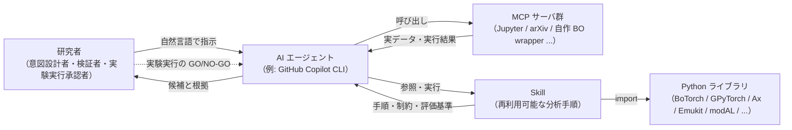

# 第1章 vol-01 / vol-02 / vol-03 / vol-04 の最小復習

> **本章の使い方**
> - **vol-01〜04 完読者**：復習部分は読み飛ばして構いません。ただし、**vol-05 独自の前提**が本章に埋め込まれているため、次の 4 箇所だけは目を通してください：**§1.4 の vol-05 で追加される環境要素**、**§1.6-1.7 の vol-05 で加わる BO × 逐次 × Agentic provenance フィールド**、**§1.8 の実験実行承認ゲート（`experiment_launch_authorization`）の予告**、**§1.10-1.11 の BO × Agentic 特有の失敗パターンと 4 予告**
> - **vol-04 まで完読・vol-03 未読**：vol-03 の深層章は必須ではありませんが、**§1.4（Agentic 権限の 3 段階）** は vol-05 の実験実行承認ゲートに直結します。ここは丁寧に読んでください。他は流し読みで OK
> - **vol-02 まで完読・vol-04 未読**：**vol-04 完読は強く推奨**します。特に **§1.3〜§1.4 の vol-04 で追加された `authorization_gates` L1-L4 と `refutation_gate` / `counterfactual_scope_gate`** は、vol-05 の BO 逐次ループが「因果的に valid な search space の中で回る」ための前提です。vol-04 の該当章に短く戻ってから第2章へ進んでください
> - **未読者**：ここで最低限の前提を身につけ、第2章以降に進めます。詳細は必要になった時点で該当章に戻ってください
>
> **この章の到達目標**
> - vol-01 の中核 5 概念（AI エージェント／MCP／Skill／データ契約／provenance）を最小限で説明できる
> - vol-02 で追加された 2 pillars（scikit-learn Skill／PyMC Skill）と統計/ML 診断（CV・確率的 calibration の基礎・MCMC 診断）・**階層モデル**の要点を言える
> - vol-03 で **GPU / 事前学習重み / エージェントの学習権限 3 段階** が導入されたことを説明できる
> - vol-04 で **因果的判断の 4 階層権限（L1: DAG / L2: 変数選択 / L3: 介入実行 / L4: 施設標準昇格）と refutation_gate 10 tests（ch09_v0_3）、audit_manifest_v1 19 checks** が確立されたことを認識できる
> - vol-05 で **実験実行承認ゲート（`experiment_launch_authorization`）と surrogate 外挿検知（`hallucinated_recommendation_detection`）** が新たに登場することを認識できる
> - vol-01〜04 の失敗パターン（循環設計・データ漏洩・ハルシネーション・再現性欠如・統計的リーク・BNN 未収束・GPU 非決定性・Agentic 権限逸脱・DAG 改ざん・positivity 違反）を意識できる
>
> **この章で扱わないこと**
> - 各概念の詳細な設計論・失敗事例（vol-01 / vol-02 / vol-03 / vol-04 の該当章を参照）
> - 環境構築の手順そのもの（vol-01 第4章 / vol-02 第0章 / vol-03 第3章 / vol-04 第0章）
> - Skill テンプレートのフィールド完全定義（vol-02 付録A、vol-03 付録A、vol-04 付録A / 付録B、vol-05 は付録A / 付録B で BO 拡張）
> - ベイズ最適化・active learning そのものの導入（第2章から本格的に扱う）
> - GP surrogate の数学的完全展開（第6章、既存教科書 Rasmussen & Williams に譲る立場）

---

## 1.1 この章の位置づけ

vol-05 は vol-01 + vol-02 + vol-03 + vol-04 の続編ですが、**本編を BO / active learning / 逐次実験計画に絞り込む**ため、既刊の詳細に立ち入らず、**vol-05 で当然のように使う概念だけをこの第1章に圧縮**しています。

- **vol-01 + vol-02 完読推奨**、**vol-04 完読を強く推奨**（DoE の骨格と因果推論を前提とする節が複数）、**vol-03 は必須ではありません**（第8章末で深層 surrogate に言及するのみ）
- **参照先**：vol-01 / vol-02 / vol-03 / vol-04 の該当章・付録を明示するので、必要な時にだけ戻れば OK
- **分量**：15 ページ程度（vol-01 第3・4・6・7・8・14章、vol-02 第0・4・9・10・11・13章、vol-03 第0・4・11章、vol-04 第0・4・5・9・10・14章の要点抽出）

> [!NOTE]
> vol-01 は AI エージェントで実験データ分析を行う入門書、vol-02 は **統計・機械学習の厚み**（scikit-learn と PyMC 階層モデル）を積み上げる本、vol-03 は **エージェントが深層学習を扱う Skill**、vol-04 は **エージェントが観測データから "なぜ" と "もし" を主張する Skill**、そして vol-05 は **エージェントが逐次的に "次にどの実験を実行するか、どこで止めるか" を提案する Skill** を作るテーマです。vol-05 の焦点は「ベイズ最適化の教科書」ではなく **「エージェントが BO と active learning を回すとき、ARIM データで何が起きるか、Human はどこで承認を差し込むか」** です。したがって「エージェントに Skill を作らせる」文化そのものは vol-01 で、統計/ML の作法は vol-02 で、深層 × Agentic の作法は vol-03 で、因果 × DoE × Agentic の作法は vol-04 で確立済みという前提で話を進めます。

---

## 1.2 3 人の登場人物：AI エージェント／MCP／Skill

vol-01 で最も重要な三者関係を、まず 1 枚の図に圧縮します。

> [!NOTE]
> **MCP とライブラリの境界**：BoTorch / GPyTorch / Ax / Emukit / modAL などは通常の **Python ライブラリ** で、Skill から直接 `import` して使います（MCP サーバではありません）。組織方針として「エージェントが直接ライブラリを呼ぶことを制限し、実験実行承認ゲート付きの MCP 経由でしか候補提案できないようにしたい」場合に、**自作 MCP（BO wrapper）** でラップします——実装パターンは付録B。

**エージェントの本質的特徴**（vol-01 継承）は 3 つ——自然言語で指示できる、道具（Tool）を選んで使う、文脈を保って反復する。vol-05 では、**「エージェントに surrogate 学習と acquisition 計算までは許すが、候補の実験実行は Human 承認を必須にする」** という逐次実験計画特有の権限設計が新たな論点になります（第5章「BO × Agentic Skill の設計原則」）。

**MCP（Model Context Protocol）** は AI エージェントと外部の道具・データソースをつなぐ共通コネクタ規格[^1-1]。vol-05 で頻出する MCP は次のとおり。

| MCP サーバ | 用途 | vol-05 での主な役割 |
|---|---|---|
| **Jupyter MCP** | JupyterLab のノートブックをエージェントから読み書き・実行 | ほぼすべての章の実行基盤 |
| **arXiv MCP** / **Paper Search MCP** | 論文検索・取得 | 手法選定・引用（vol-01 第10章と共通） |
| **FastMCP** / **MCP Python SDK** | Python で自作 MCP を作る | **付録B で BO × 逐次 × Agentic 固有の MCP パターンを実装**（実験実行承認ゲートを MCP レベルで組み込む） |

**vol-05 で「新しい MCP を必ず追加する」必要はありません**。付録B の自作 MCP は「組織内でエージェントに実験実行承認ゲートを課したい場合」の実装例です。

**Skill** は分析手順を「再利用可能な形にまとめたもの」——入力仕様 / 出力仕様 / 制約条件 / 評価基準 / 手順本体 / 再現性メタデータ（provenance）を明示的に持ちます。**vol-05 の本線は 2 pillars + Advanced Capstone**（vol-05 chapter-outline.md v0.2 準拠）：**Pillar 1 = 単目的 BO Skill**（第5-8章、GP surrogate + EI/UCB、iteration ループが provenance に完全記録される）、**Pillar 2 = 多目的 BO / 多制約 BO Skill**（第9-12章、qEHVI / cEI / safe BO のいずれか、Pareto front の外挿範囲がエージェントに管理されている）、そして **Advanced Capstone = vol-04 の因果構造で search space を絞り、階層 GP でマルチ装置に対応し、Human 承認ループで BO を回す複合 Skill**（第14章、14a / 14b の 2 節構成）。合格ラインは「2 pillars の Skill を自力で作れる」ことです。

> [!TIP]
> Skill の物理形態は、vol-01〜04 共通で `SKILL.md` + `references/` + `scripts/` + `tests/` + `examples/` のディレクトリ。vol-02 で `artifacts/` / `figures/` が加わり、vol-03 で `checkpoints/` / `wandb_run/`、vol-04 で `causal_graphs/` / `doe_designs/` が加わりました。**vol-05 では `surrogate_state/`（GP fit の checkpoint と kernel hyperparameter posterior）と `iteration_log/`（各 iteration の候補提案・Human 承認・実測結果の履歴）**が加わります（付録A）。**Skill = 特定のフォルダ構造**という規約は継続。

---

## 1.3 vol-02 で加わった 2 pillars と統計/ML 診断・階層モデル

vol-02 は、vol-01 の「エージェント × Skill」文化の上に **統計・機械学習の厚み**を積み上げた巻でした。**vol-05 は 2 pillars の設計原則をそのまま BO と active learning に持ち込みます**。

### 2 pillars（vol-02）と vol-05 での接続

| 柱 | 内容 | vol-05 での位置づけ |
|---|---|---|
| **Pillar 1**：scikit-learn Skill | 分類・回帰・CV 設計・feature importance | 第8章の Random Forest surrogate、第13章の active learning（uncertainty sampling / query by committee） |
| **Pillar 2**：PyMC Skill | 事前分布 → 事後 → 診断（$\hat{R}$/ESS/divergences）→ 事後予測 | 第6章 GP の kernel hyperparameter 事前分布、第8章の BNN surrogate、第11章の階層 GP |
| **Advanced Capstone**（vol-02） | 合成階層データ + PyMC 階層モデル | 第11章の Multi-task GP（装置ごとに異なる目的関数を階層事前分布で共有）、第14章 capstone の階層構造 |

### 統計/ML 診断の最小語彙（vol-02 継承、vol-05 でもそのまま使用）

**分類の評価**（vol-02 第7章）：Accuracy / F1 / ROC-AUC / PR-AUC。**vol-05 では active learning の停止判定**が第13章で加わります。

**回帰の評価**（vol-02 第7章）：RMSE / MAE / $R^2$ / 予測 vs 実測プロット。**vol-05 では surrogate の calibration**（負対数尤度、Coverage）が第6章で加わります。

**不確かさの基礎**（vol-02 第9章、vol-03 第8-9章で深層 calibration と BNN posterior に本格拡張、vol-04 第9章で refutation に接続）

| 概念 | 一言 | vol-05 での使いどころ |
|---|---|---|
| **CI**（信頼区間） | 頻度論の区間表現 | 第8章 RF surrogate の quantile band |
| **CrI**（信用区間） | 事後分布の区間表現 | 第6章 GP 事後、第8章 BNN surrogate、第11章 階層 GP |
| **事前分布** | 何を、いつ、どう書くか | 第6章 GP kernel hyperparameter、第11章 階層 GP の shrinkage |
| **posterior predictive**（事後予測） | データ空間で確かめる | 第6章 GP 予測分布、第7章 acquisition 計算の基礎 |

**CV / 分割設計**（vol-02 第7章、vol-03 第5章で深層 anti-leakage に拡張、vol-04 第6章で因果 ML の cross-fitting に拡張）：k-fold / Stratified / **Grouped** / Leave-one-group-out。**vol-05 では GP の hyperparameter tuning で leave-one-out**（LOOCV）が第6章で加わります。

**MCMC 診断**（vol-02 第12章、vol-03 第9章で BNN、vol-04 第12章で Bayesian DoE、vol-05 第8章で BNN surrogate に再登場）

| 診断 | 目標値 | vol-05 での使いどころ |
|---|---|---|
| **$\hat{R}$** | $\leq 1.01$ | 第8章 BNN surrogate、第11章 階層 GP の hyperparameter posterior |
| **ESS** | $\geq 400$ 程度 | 同上 |
| **Divergences** | 0 が理想 | 第11章 階層 GP で divergences が出たら中心化 → 非中心化パラメータ化 |
| **BFMI** | $\geq 0.3$ | 同上 |

これらが「合格ライン」に達していない事後分布は、**vol-02 の哲学では結論を引き出せない**——vol-05 でも同じ規律です。**階層モデルで divergences が出たときは、中心化 → 非中心化パラメータ化への変更が定石**（vol-02 第11・12章）は、**第11章の階層 GP で装置差・研究室差を shrinkage で組むとき**にも適用されます。

### 階層モデル（vol-02 第11章）と vol-05 の階層 GP の接続

vol-02 第11章の階層モデルは、vol-05 で 2 箇所に活用されます：

1. **Multi-task GP の kernel prior（第11章）**：装置ごとに異なる目的関数を coregionalization kernel + 階層事前分布で共有し、少数観測の装置でも他装置の情報を借りて安定した surrogate を得る
2. **BNN surrogate（第8章）**：層ごとの重み prior に階層事前分布を入れ、hierarchical Bayesian NN として扱う（vol-03 第9章の BNN の応用）

**装置差の扱い**は vol-02〜04 で一貫しています——vol-04 では DAG 上で「confounder として調整するか」、vol-05 では「階層 GP で shrinkage するか」「search space の入力次元として明示するか」を Human が判定します（第11章）。

---

## 1.4 vol-03 で加わった深層 × Agentic 権限と vol-04 の因果 × Agentic ゲート

vol-03 は Skill 文化の上に **深層学習と Foundation Model** を持ち込み、vol-04 は **因果推論と DoE** を Agentic に組み込みました。**vol-05 の実験実行承認ゲート（`experiment_launch_authorization`）は、vol-03 の Agentic Authorization と vol-04 の 4 階層承認ゲートを "逐次実験実行" 文脈に拡張したもの**です。

### vol-03 の Agentic Authorization 3 段階（第4章）

| 権限レベル | エージェントが自律できること | Human 承認が必須なこと |
|---|---|---|
| **推論のみ** | 訓練済みモデルで推論を回す | 学習ジョブ起動、weights 更新 |
| **承認済み範囲内の fine-tune 可** | 事前承認された data / config で fine-tune | 新規 config、新規 data、範囲外の hyperparameter |
| **事前承認済みワークフロー内の自律実行可** | 承認済み SOP に沿った反復実験 | SOP 逸脱、FM 更新、外部送信 |

### vol-04 の 4 階層承認ゲート `authorization_gates`（第4章 §4.6）

vol-04 では因果的判断特有の 4 階層権限が確立されました：

| 階層 | 表示名 / canonical enum | 承認の中身 |
|---|---|---|
| **L1: 識別レイヤ** | `dag_authorization` / `L1_dag_authorization` | DAG（confounder / mediator / collider の割り付け）を Human が承認 |
| **L2: 変数選択レイヤ** | `variable_selection_authorization` / `L2_variable_selection_authorization` | どの変数を confounder として調整するか / mediator として分解するか / collider として避けるかを Human が承認 |
| **L3: 介入レイヤ** | `intervention_execution_authorization` / `L3_intervention_execution_authorization` | 因果的主張に基づいて **実際に介入を実行する** ことを Human が承認 |
| **L4: 施設標準昇格** | `facility_standard_promotion_gate` / `L4_facility_standard_promotion` | 承認済み介入を **施設全体で再利用可能なテンプレート** として登録することを Facility Causal Review Board が承認 |

さらに vol-04 では **`refutation_gate`（Ch9 §9.7.1 canonical enum `ch09_v0_3`、10 tests）** と **`audit_manifest_v1`（Ch14 §14.4、19 checks = causal 6 + doe 4 + agentic 9）** が確立されました——これらは vol-05 でも **BO の "候補提案が因果的に valid な search space に収まっている" 前提条件** として引き継がれます（第14章 capstone）。

### vol-05 で加わる実験実行承認ゲート（第5章で本格化）

vol-03 の 3 段階権限は「学習ジョブ」、vol-04 の 4 階層は「因果的判断」に対する権限でした。vol-05 では **「逐次実験実行」に対する承認ゲート**が加わります。

| 局面 | 権限フィールド | 承認・自律の中身 |
|---|---|---|
| **surrogate 学習** | 自律 | GP / RF / BNN の fit、hyperparameter 事後推論 |
| **acquisition 計算** | 自律 | EI / UCB / KG / MES / TS / PES の evaluation |
| **候補の絞り込み提案** | 準自律（Human review 必須） | acquisition 最大化点 top-k の提示、根拠と外挿検知結果の添付 |
| **実験実行** | `experiment_launch_authorization` | 実際に実験装置を予約・起動し、材料を消費する行為 |

**surrogate 学習と acquisition 計算は自律**でよいが、**候補提案は準自律（Human review 必須）**、**実際の実験実行は必ず Human 承認**——この境界は第5章で仕様書テンプレート化され、付録B で MCP レベルの実装として提示されます。

> [!IMPORTANT]
> **`experiment_launch_authorization` と vol-04 L3 `intervention_execution_authorization` の関係**：`experiment_launch_authorization` は **BO 逐次ループ用の実験起動承認記録**（iteration_index / batch_size / 装置予約 ID / 承認者・日時を含む）です。物理実験を伴う候補の場合、**vol-04 L3 `intervention_execution_authorization` を bypass することはできません**——`experiment_launch_authorization` は L3 の承認 ID を `parent_authorization_id` として **必ず内包**し、L3 が pass していない候補には発行されません。つまり **L3 が因果的判断としての介入承認、`experiment_launch_authorization` が逐次ループ実行としての追加承認レイヤ**——両方 pass が必須です（第5章で仕様化、付録B の MCP 実装で強制）。

**なぜ実験実行を分離するか**：材料実験は消耗と時間コストが高く、いったん実行すると取り返しがつきません。BO の acquisition は「情報利得」で選ばれますが、**実験実行の判断には安全性・予算・装置スケジュール・戦略的優先度**という acquisition が捉えない次元が含まれます。「エージェントが acquisition を最大化する候補を勝手に実行する」失敗は第15章で扱いますが、**予防は "候補提示までは自律、実行判断は Human" のゲートを Skill に組み込むこと**です。

---

## 1.5 ハンズオン標準環境

vol-01 / vol-02 / vol-03 / vol-04 で構築した環境をそのまま使います。**vol-05 では BO / active learning ライブラリが加わります**。**未構築の方は vol-01 第4章、vol-02 第0章、vol-03 第3章、vol-04 第0章 §0.5 を参照**してください。

### vol-04 までの標準環境（そのまま）

| # | 要素 | バージョン | 役割 |
|---|---|---|---|
| 1 | Python | 3.11 以上 | 分析エンジン |
| 2 | JupyterLab | 4.4.1 | ノートブック実行環境 |
| 3 | GitHub Copilot CLI | 最新版 | AI エージェントアプリ／MCPホスト |
| 4 | Jupyter MCP Server | 0.14.4 | エージェント⇔JupyterLab の橋 |
| 5 | Node.js | 22 以上 | Copilot CLI の実行基盤 |
| 6 | PyMC | vol-02 継承 | Bayesian 統計モデル |
| 7 | scikit-learn | vol-02 継承 | ML の骨格 |
| 8 | PyTorch / JAX（optional） | vol-03 継承 | 深層特徴を surrogate 入力に使う場合（第8章末） |
| 9 | dowhy / econml / causal-learn / causalpy / pgmpy | vol-04 継承 | 因果推論（第14章 capstone で search space 絞り込みに活用） |
| 10 | pyDOE2 / smt / linearmodels | vol-04 継承 | 初期実験計画（BO 開始前の DoE） |

### vol-05 で追加するもの（詳細は第4章と付録B）

| ライブラリ | 章 | 役割 |
|---|---|---|
| **botorch** | 第5-14章 | BO のデファクト実装（PyTorch ベース） |
| **gpytorch** | 第6-8・11章 | GP surrogate の骨格（BoTorch の内部で使用） |
| **ax-platform** | 第12章 | Facebook Ax、BO の実験管理層（BoTorch の上位。**本書は主に BoTorch を扱い、Ax は batch 管理節で言及**） |
| **emukit** | 第13章 | active learning / experimental design |
| **scikit-optimize (skopt)** | 第7章 | 軽量 BO、Random Forest surrogate |
| **hebo** | 第8章 | HEBO ラッパ、非 GP surrogate の代替 |
| **modAL** | 第13章 | active learning、query by committee（v0.2 で標準環境に追加） |
| **numpyro / pymc** | 第8・11章 | Bayesian surrogate（vol-02 継承、第11章の階層 GP で活用） |

**CI 環境は CPU で完結**を必須要件とします（vol-03 と同じ方針）。BO の主要計算（GP fit、acquisition maximization）は表形式データが主戦場で GPU は不要——ただし第8章末で深層 surrogate（DKL）を扱う応用節では PyTorch/JAX が必要になります（optional）。

> [!IMPORTANT]
> **BoTorch と Ax は同一チームだが層が違う**（BoTorch は BO のライブラリ、Ax は実験管理と可視化を含む上位フレームワーク）。第4章「ライブラリ地図」で使い分けを整理しますが、**「Skill としてどちらを主軸にするか」は事前に決めて Skill の入出力契約に書く**必要があります（第5章）。本書は主に BoTorch を扱い、Ax は Ch12 の batch experiment tracking で言及します（v0.2 実務ノート）。

> [!TIP]
> vol-04 の `.venv-vol04`（DoWhy + PyMC）に botorch / gpytorch / ax / emukit / modAL を追加インストール可能です。BoTorch は PyTorch の特定バージョン範囲を要求するため、詳細は第4章の互換性表を参照してください。**v0.2 で `entmoot` は用途不明のため標準環境から削除**しました。

---

## 1.6 データ契約：Skill の入出力を約束する（vol-01〜04 の合流点）

vol-01 第8章の中核概念で、vol-02 で ML/Bayesian、vol-03 で深層、vol-04 で因果 × DoE 特有の要素が追加されました。vol-05 では **BO × 逐次 × Agentic 特有の要素**（次章以降で説明）がさらに加わります。

### vol-01 の 7 要素（工程ベース）

vol-01 のデータ契約は **入力データを Skill に渡すまでの 7 工程**を約束事として明文化する枠組みです（⓪入手・由来記録 → ①読込 → ②メタデータ結合 → ③単位統一 → ④欠損・外れ値マーキング → ⑤品質チェック → ⑥標準形式化）。**生ファイル編集は fatal**、**未登録の暗黙単位変換は fatal**——vol-05 でも継続、特に **BO の search space の単位ずれ（`unit/bounds drift`、第15章で失敗パターン化）** は fatal です。

### vol-02〜04 で追加された要素（要点抽出）

- **vol-02（第4章）**：CV スキーム、階層構造の記述、事前分布契約
- **vol-03（第4-5章）**：Augmentation 契約、深層 anti-leakage split、重みの provenance、GPU バックエンドの記録
- **vol-04（第4-5章）**：DAG 契約と SHA-256 pin、識別戦略の明示、positivity / SUTVA / consistency / exchangeability の宣言、DoE の randomization seed、blocking factor、反実仮想の外挿範囲（`counterfactual_scope_gate`）

### vol-05 で追加される BO × 逐次 × Agentic 要素（第5章で詳述）

| 要素 | 一言だけの予告 |
|---|---|
| **search space の pin** | 探索範囲（連続変数の bounds、離散/カテゴリの候補集合、混合空間の構造）を URI + SHA-256 で pin。**エージェントが勝手に拡大しない**。単位ずれ（例：温度が °C か K か）を **契約時点で明示** |
| **surrogate の provenance** | `surrogate_model_family`（GP / RF / BNN）、`kernel_spec`（RBF / Matérn 3/2 / 5/2 / product / additive）、ARD 有無、hyperparameter 事前分布、fit スクリプトの SHA-256 を pin。**エージェントが勝手に kernel を切り替えない** |
| **acquisition の pin** | `acquisition_function`（EI / UCB / PI / KG / MES / Thompson Sampling / PES）を pin。**エージェントが動的に切り替える場合は事前登録された切替ルール（Ch7）に従うこと** |
| **iteration ループの provenance** | `iteration_index`, `batch_size`, `pending_experiments`, `budget_remaining`, `stop_condition` を各 iteration で記録。**上書き禁止、append-only** |
| **`sequential_seed_provenance`** | 各 iteration で使用した randomization seed の履歴。**iteration seed の上書きは fatal**（第15章 Agentic 失敗） |
| **`experiment_launch_authorization`** | 各候補の実験実行承認記録（承認者、日時、承認 ID、装置予約 ID） |
| **`hallucinated_recommendation_detection`** | surrogate の外挿誤用検知結果。GP の予測分散閾値・入力から近傍学習点までの Mahalanobis 距離・length scale 越え検知の **合成基準**（第7章「外挿検知の operational 定義」節で operational 定義） |
| **`stop_condition`** | budget / convergence / regret threshold のいずれか（第14章 §14.4 で operational 化）。**Skill 起動時に pin し、実行中の緩和は fatal**（第15章） |

### 品質チェックは 3 段階（vol-01 の哲学、vol-02〜05 で継承）

| レベル | 挙動 | vol-05 での新たな例 |
|---|---|---|
| **fatal** | Skill に渡さず**明示エラーで拒否** | **search space 単位ずれ**、**iteration seed の上書き**、**stop_condition の実行中緩和**、**候補が safe BO の制約を破っている**、**surrogate 学習データと候補評価点の重複（duplicate candidates）** |
| **warning** | 警告ログ付きで渡す | **hyperparameter posterior に divergences が残る**、**GP length scale が search space 幅を超えている** |
| **flag** | フラグ列を付けて渡す | **外挿範囲境界付近の候補**（`hallucinated_recommendation_detection` の閾値近傍）、**pending experiments が未完了で新規候補を要求** |

**fatal を握りつぶさない**——これが vol-01〜05 を通じた最重要ルールです。

---

## 1.7 provenance：再現できる形で結果を残す

vol-01 第7章「⑥再現性条件」と付録Aの provenance 必須フィールドを起点に、vol-02 → vol-03 → vol-04 → vol-05 で拡張されていく概念です。**vol-05 では BO × 逐次 × Agentic の要素が加わります**。

### vol-01〜04 の基本フィールド（そのまま継承）

- **vol-01**：`input_sha256`, `skill_version`, `run_datetime_utc`, `package_versions`, `random_seed`
- **vol-02**：`cv_scheme`, `data_split`, `model_config`, `sampler_config`, `backend_config`, `posterior_artifact`, `diagnostics_summary`
- **vol-03**：`gpu_backend`, `cudnn_deterministic`, `weights_uri`, `weights_sha256`, `finetune_config`, `augmentation_config`, `agent_authorization`, `training_job_approval`, `checkpoint_overwrite_policy`
- **vol-04**：`dag_of_record_uri`, `dag_of_record_sha256`, `identification_strategy`, `estimand_type`, `mediation_role`, `confounders_declared`, `declared_required_tests`（`ch09_v0_3` — 10 tests）, `sensitivity_analysis`, `authorization_gates`（L1-L4）, `counterfactual_scope_gate`, `experimental_design_provenance`, `randomization_seed_provenance`, `audit_manifest_v1`（19 checks）

### vol-05 で追加されるフィールド（付録A で完全定義）

**Surrogate と acquisition の要素**

| フィールド | 意味 |
|---|---|
| `surrogate_model_family` | GP / Random Forest / BNN / Deep Kernel Learning のいずれか |
| `kernel_spec` | GP kernel（RBF / Matérn 3/2 / 5/2 / product / additive）と ARD 有無、length scale 事前分布 |
| `surrogate_hyperparameter_posterior_uri` | GP hyperparameter の事後 artifact（MAP or fully Bayesian） |
| `acquisition_function` | EI / UCB / PI / KG / MES / Thompson Sampling / PES |
| `acquisition_config` | acquisition の hyperparameter（UCB の β、EI の ξ、KG の Monte Carlo 数） |
| `surrogate_fit_script_sha256` | GP fit スクリプトの SHA-256（改ざん防止） |

**逐次ループの要素**

| フィールド | 意味 |
|---|---|
| `iteration_index` | 現在の BO iteration 番号（0-based、append-only） |
| `batch_size` | 1 iteration あたりの候補提案数（q-EI の q） |
| `search_space_uri` | search space 定義ファイルの URI |
| `search_space_sha256` | search space の SHA-256（変更禁止、拡大は `estimator_contract_change_gate` 相当の承認要） |
| `search_space_bounds` | 各変数の下限・上限・単位（**単位ずれ検知の基礎**） |
| `constraints_declared` | 制約条件（実行可能領域、安全条件） |
| `pending_experiments` | まだ実行結果が返っていない候補のリスト |
| `budget_remaining` | 残り実験可能回数・予算 |
| `stop_condition` | budget / convergence / regret threshold のいずれか（第14章 §14.4 で operational 化。追加候補は第14章の SoT に従う） |
| `sequential_seed_provenance` | iteration ごとの randomization seed 履歴（上書き禁止） |

**Agentic の要素**（vol-03 の `agent_authorization` と vol-04 の `authorization_gates` を BO × 逐次文脈に拡張）

| フィールド | 意味 |
|---|---|
| `experiment_launch_authorization` | 各候補の実験実行承認記録（承認者、日時、承認 ID、装置予約 ID）——**BO の最終ゲート** |
| `hallucinated_recommendation_detection` | surrogate の外挿誤用検知結果（GP 予測分散 + Mahalanobis 距離 + length scale 越え検知の合成、Ch7 で operational 定義） |
| `acquisition_switch_log` | acquisition が dynamic に切り替わった履歴（事前登録された切替ルールに従っているかの検証用） |

これらを Skill 実行のたびに記録することで、**「同じ結論に到達できるか」だけでなく「エージェントが何をどこまで自律で動かしたか」「Human はどの iteration でどの候補を承認 / 却下したか」「surrogate が外挿していないか」を後から検証**できます。

> [!NOTE]
> **vol-04 v0.2 で vol-04 から削除された `sequential_experiment_stop_condition`** は、vol-05 で **`stop_condition`** として本格化します。vol-04 の DoE は一括計画（one-shot Bayesian DoE を含む）、vol-05 は逐次適応型計画——この分業が両巻の scope 境界です。

---

## 1.8 Human-in-the-loop：AI に判断を丸投げしない

vol-01 第6章の原則を一言で：**「AI エージェントは提案し、最終判断は人間が下す」**。**vol-05 では逐次実験計画特有の "実験実行承認ゲート" が加わります**。

### 具体的な運用（vol-01 継承、vol-02〜04 で拡張）

| 局面 | AI がやること | 人間がやること |
|---|---|---|
| 手順の設計 | 手順候補を提案 | 目的への適合を判断 |
| コード生成 | ドラフトを書く | レビューして受け入れ |
| データの取り込み | 契約チェックを通す | 契約自体を定義 |
| 結果の解釈 | 統計指標・因果推定量・acquisition 値を出す | 物理的・因果的・戦略的妥当性を判断 |
| 分岐判断 | 選択肢を列挙 | 選択 |
| 危険操作 | 実行前に確認 | 承認（明示的 yes） |

### vol-02〜04 で強調された点、vol-05 で加わる BO 特有の 3 点

**vol-02**：循環設計問題の統計版、有意 ≠ 意義。**vol-03**：学習ジョブ起動、fine-tune 起動、checkpoint 上書き、FM 更新——それぞれ Human 承認が必要な深層特有の局面（vol-03 第4章）。**vol-04**：4 階層承認ゲート（L1-L4）、`refutation_gate` pass 未達時の結論停止、`counterfactual_scope_gate` の外挿判定。

**vol-05 で加わる BO × 逐次特有の承認ゲート**（第5章で詳述）

**（A）実験実行承認ゲート**（`experiment_launch_authorization`、**BO の最終ゲート**）

| ゲート | 該当章 | 承認の中身 |
|---|---|---|
| **候補提示承認** | 第5・14章 | エージェントが提案した候補 top-k と根拠（acquisition 値、予測 mean/std、外挿検知結果）を Human が確認 |
| **実験実行承認** | 第5・14章 | 実際に装置を予約・起動し、材料を消費する **実験実行** の Human 承認（実験の最終ゲート）——装置予約 ID を provenance に記録 |
| **stop_condition 判定** | 第5・14・15章 | budget / convergence / regret / MC variance のいずれかで stop 判定。**Skill が自律で判定するが、"stop すべきでない" 主張は Human 承認要** |

**（B）Surrogate / Acquisition Safety Gate**（**逐次計算の妥当性への関門**）

| ゲート | 該当章 | 承認・判定の中身 |
|---|---|---|
| **外挿検知ゲート** (`hallucinated_recommendation_detection`) | 第7・8・15章 | surrogate が外挿範囲で "自信あり" の候補を返していないかの自動判定（越えていれば flag + Human review） |
| **safe BO 制約ゲート** | 第10章 | 候補が安全条件を破っていないかの自動判定（破っていれば絶対に候補を返さない、fatal） |
| **acquisition 切替ゲート** | 第7・15章 | dynamic に acquisition を切り替える場合、事前登録された切替ルール（例：iteration 5 まで UCB、以降 EI）に従っているかの判定 |

### 分析セッション開始前の 3 点チェック（vol-01 第6章、vol-02〜05 で継承）

- [ ] **不要な MCP を無効化**：セッションで使わない MCP は `copilot mcp disable` で切る
- [ ] **Web / 外部 API アクセスを制限**：機密試料を扱う場合、Web 検索を無効化するか、送信内容を承認制にする
- [ ] **秘匿情報のマスク**：JUPYTER_TOKEN・API キー・試料 ID・**未承認の BO 候補**（未承認の実験計画を外部送信しない）を、共有前・チャット貼付前にマスクする

> [!IMPORTANT]
> エージェントは「動く BO ループ」を高速に作れます。しかし「**動く ≠ 正しい**」、vol-04 の「**動く ≠ 因果的に正しい**」に続き、vol-05 では「**動く ≠ 探索が有意義**」「**動く ≠ 実験実行して安全**」がさらに深刻です。BO ≠ 実験自動化、acquisition 最大化 ≠ 科学的最適候補——vol-05 では、動かした後に **統計的に正しいか、surrogate が外挿していないか、safety 制約を破っていないか、エージェントが実験実行まで自律で回してよい範囲か** の 4 つの確認が最重要ルールです。

---

## 1.9 6 データ型：装置カテゴリを型で捉える

ARIM の装置カテゴリは多岐にわたりますが、分析手順の骨格は **6 つのデータ型**に抽象化できます（vol-01 第2章）。vol-05 では **BO × 逐次 × Agentic Skill との対応**を第3章・付録A で詳しくマップします。

| データ型 | vol-04 までの主な扱い | vol-05 で扱う BO × 逐次 Skill |
|---|---|---|
| **スペクトル型** | 因果推定、DoE、DR-Learner | **合成条件 → スペクトル特徴（ピーク位置・強度）の目的最適化 Skill**、**マルチ装置階層 GP** |
| **クロマトグラム・時系列型** | 因果推定、DiD、時系列 CATE | **反応条件 → 収率最大化 Skill**、**時間進行を制約に組み込む逐次計画** |
| **画像・顕微鏡型** | 因果推定、CATE、Grad-CAM | **粒径・欠陥密度の目的最適化 Skill**、**画像特徴を BO の応答変数として使う** |
| **回折・散乱パターン型** | 因果推定、mediator 分解 | **結晶性最大化・特定相の生成率最大化 Skill** |
| **表形式・プロセス条件型** | 因果推論 + DoE の主戦場 | **BO の主戦場**——単目的 / 多目的 / 制約付き / マルチ装置 の全パターン |
| **マルチモーダル統合型** | 多モーダル confounder 調整、FM 特徴 | **多モーダル観測を surrogate 入力にする発展**、**制約が多モーダル** |

**表形式が vol-05 の主戦場**——ARIM の実験条件データは基本的に表形式で、BO はここで最も自然に適用できます。他のデータ型は「実験条件（表形式）を入力、装置出力（各データ型から抽出した特徴）を目的関数」という枠組みで BO の入出力に組み込まれます。

---

## 1.10 vol-01〜04 で挙げたリスクと失敗パターン

vol-01 第14章、vol-02 第14章、vol-03 第14章、vol-04 第14章の失敗パターンを 1 段落ずつ圧縮します。**vol-05 でも同じリスクは残り、BO × Agentic 特有のバリエーションが加わります**（第15章、2 セクション構成）。

### vol-01 の 4 リスク（BO 文脈でのバリエーション付き）

**循環設計問題**：AI に評価指標も結果も任せると、都合の良い指標が選ばれ、都合の良い結論が出る自己参照ループ。**vol-05 では「エージェントが acquisition を勝手に切り替えて、都合の良い候補を出す」**（`acquisition_switch_log` 未記録の切替）が新種の循環設計問題です（第15章）。

**データ漏洩**：機密データの外部送信。**vol-05 では、未承認の BO 候補（"次にこの条件で実験する"）や search space の bounds を外部送信するリスク**が加わります。

**ハルシネーション**：**vol-05 では「エージェントが外挿領域を "自信あり" と報告する」「pending experiments を勝手にキャンセルする」「surrogate 予測分散が閾値超えなのに候補を返す」** が新種のハルシネーションです（第15章）。

**再現性欠如**：**vol-05 では、iteration seed が上書きされている・search space の bounds が iteration 途中で変わっている・pending experiments の状態が不整合**——これらは BO ループを再現不能にする致命的リスクです。

### vol-02 で追加された失敗パターン

**統計的データリーク**：train/test 間で同一試料・同一ロットが混ざる——**vol-05 では、surrogate の train データと候補評価点が同一（duplicate candidates）の場合に GP 予測分散がゼロに崩壊**（第15章）。**MCMC 未収束**：$\hat{R} > 1.01$、divergences 多発を無視して結論を出す——**vol-05 の BNN surrogate（第8章）と階層 GP（第11章）でも同じ規律**。

### vol-03 で追加された失敗パターン

**GPU 非決定性**、**事前学習重みの汚染**、**Agentic 権限逸脱**——**vol-05 では、DKL / neural surrogate（第8章末）で GPU 非決定性が入り込む**、**エージェントが承認なく実験を実行する** が対応する Agentic 権限逸脱です。

### vol-04 で登場した因果 × DoE 失敗パターン（vol-05 でも継続監視）

DAG の misspecification、positivity violation、collider bias、refutation スキップ、randomization 破綻、blocking 失敗、応答曲面の外挿誤用——vol-05 の第14章 capstone では、これらが起きていない DAG と DoE を **前提** として BO を回します。特に **`refutation_gate` pass 済みの estimator が定めた search space の中で BO を回す**という因果 → BO のフローが第14章 Phase 1 で明示されます。

### vol-05 で新たに登場する失敗パターン（第15章、2 セクション構成）

**BO 一般（第15章 セクション 1）**：GP の外挿誤用、length scale の暴走（search space 幅を超える length scale）、acquisition の局所解（EI の 0 領域に張り付く）、Pareto front の疑似収束（hypervolume が saturate したが実は探索不足）、safe BO の制約違反、**stale / pending observations の扱い漏れ**（v0.2 追加）、**duplicate candidates**（同一点の重複提案、v0.2 追加）、**unit / bounds drift**（search space の単位ずれ、v0.2 追加）、**budget misaccounting**（実験コストの合計誤集計、v0.2 追加）。

**Agentic 特有（第15章 セクション 2、vol-05 で新設）**：エージェントが acquisition を "動的" に勝手に切り替える、外挿領域を "自信あり" と報告、Human 承認なしに次の候補を実行、iteration seed を上書き、pending experiments を勝手にキャンセル、stop condition を勝手に緩める、多目的スカラー化重みを勝手に変更、safe BO の制約を "警告のみ" と誤解して破る。

**これらの失敗は「BO ループが動作していること」からは見えません**——だからこそ、vol-05 では **provenance（`iteration_index` / `pending_experiments` / `sequential_seed_provenance` / `experiment_launch_authorization`）+ 実験実行承認ゲート + 外挿検知**の三点セットが第5章から一貫して重視されます。

---

## 1.11 vol-05 で新たに気にすること（予告）

第2章に進む前に、**vol-05 に固有の 4 つの視点**を予告しておきます。

**(1) 一括計画 → 逐次適応**：vol-04 の DoE は「計画を一括生成する」でした。vol-05 では **「観測結果を見ながら次を決める」** のが実務。1 iteration の観測から surrogate を更新し、次の候補を acquisition で選ぶ——このループそのものが Skill の単位になります（第2・5章）。「エージェントに 1 サイクル任せると走り続ける」ため、**iteration ごとに Human 承認を差し込む** 設計が根幹です（`experiment_launch_authorization`）。

**(2) Surrogate は "予測モデル" ではなく "情報源"**：vol-01〜03 の予測 Skill は「点予測 + 不確かさ」を出すことが目的でした。vol-05 の surrogate は **「acquisition で次の候補を選ぶための情報源」**——予測精度そのものよりも、**予測分散の calibration と外挿検知**が重要です。「GP の点予測は当たっているが分散が過小」という場合、BO は外挿領域に自信を持って踏み込み、**hallucinated recommendation** を返します（第7章で operational 定義、第15章で失敗パターン化）。

**(3) 実験実行承認ゲート（`experiment_launch_authorization`）**：vol-01〜04 の Human-in-the-loop を、逐次実験計画特有の "実験実行" 局面に敷き詰めます。**「エージェントに候補提示まで許すのか、Human 承認を経て実行まで許すのか、承認済みワークフロー内で自律実行まで許すのか」** を Skill ごとに宣言し、承認ゲートを配置します（第5章）。**いずれのレベルでも、実際の実験実行そのものが Human 承認ゲートを迂回することはありません**。

**(4) 外挿検知の operational 定義（`hallucinated_recommendation_detection`）**：「GP が予測分散を大きく出したから外挿」だけでは不十分——**予測分散閾値 + 入力から近傍学習点までの Mahalanobis 距離閾値 + length scale 越え検知の合成基準**で外挿を検知します（第7章「外挿検知の operational 定義」節で operational 定義、第8章で BNN / RF に拡張）。**エージェントは外挿範囲で "自信あり" の予測を返してはいけません**——vol-04 の `counterfactual_scope_gate` の BO 版に相当します。

---

## 1.12 vol-01 + vol-02 + vol-03 + vol-04 復習チェックリスト

以下がすべて「はい」であれば、vol-05 の第2章に進めます。「うろ覚え」があれば、該当章に短く戻ってから第2章へ進んでください。

### vol-01 由来

- [ ] **AI エージェント／MCP／Skill** の三者関係を、自分の言葉で 3 分で説明できる（→ vol-01 第3章）
- [ ] **Copilot CLI + JupyterLab + Jupyter MCP** の環境が手元で動く（→ vol-01 第4章）
- [ ] Skill の物理形態（`SKILL.md` + `references/` + `scripts/` + `tests/` + `examples/`、vol-02 以降の `artifacts/` / `figures/`、vol-03 の `checkpoints/`、vol-04 の `causal_graphs/` / `doe_designs/`、**vol-05 で加わる `surrogate_state/` / `iteration_log/`**）を知っている
- [ ] **データ契約** の 7 工程を書ける（→ vol-01 第8章）
- [ ] **provenance** の基本 5 フィールドを言える（→ vol-01 第7章と付録A）
- [ ] **Human-in-the-loop** の原則を、具体的なコードレビュー行動として説明できる（→ vol-01 第6章）
- [ ] **6 データ型** のうち、自分の主な扱うデータがどれか即答できる（→ vol-01 第2章）
- [ ] **循環設計問題・データ漏洩・ハルシネーション・再現性欠如**を、自分の分析で起こりうるパターンとして 1 つ以上挙げられる（→ vol-01 第14章）

### vol-02 由来

- [ ] **2 pillars（scikit-learn Skill / PyMC Skill）** の Skill を 1 つ以上、自分で作った経験がある（→ vol-02 第4・9-10章）
- [ ] **CV スキーム**（k-fold / stratified / grouped）の違いと、grouped が必要な場面を言える（→ vol-02 第7章）
- [ ] **不確かさ表現**（CI / CrI / 事前分布 / posterior predictive）の違いを説明できる（→ vol-02 第9章）
- [ ] **MCMC 診断**（$\hat{R}$ / ESS / divergences / BFMI）の合格ラインを言える（→ vol-02 第12章）
- [ ] **階層モデル / partial pooling** が、装置差・ロット差・研究室差をどう扱うか説明できる（→ vol-02 第11章）
- [ ] **統計的データリーク**を、自分の実験データで起こりうるパターンとして 1 つ挙げられる（→ vol-02 第7・14章）

### vol-03 由来（vol-03 は必須ではないが、深層 surrogate 応用節で活用）

- [ ] **Agentic Authorization の 3 段階**（推論のみ / 承認済み範囲内の fine-tune 可 / 事前承認済みワークフロー内の自律実行可）を説明できる（→ vol-03 第4章）
- [ ] **事前学習重み**を使うときに provenance を残すべきだと理解している（→ vol-03 第4・11章）
- [ ] **Foundation Model 更新**は Human 承認が必要だと知っている（→ vol-03 第11章）
- [ ] **BNN posterior**（Deep Ensemble / MC-Dropout / BNN いずれか）の calibration 概念を知っている（→ vol-03 第9章）

### vol-04 由来（**vol-05 では強く前提**）

- [ ] **相関 ≠ 因果** の区別を、自分の実験データで起こりうる例として 1 つ挙げられる（→ vol-04 第1章）
- [ ] **DAG（confounder / mediator / collider）** という概念に馴染みがあり、`dag_of_record_uri` + SHA-256 pin の意義を説明できる（→ vol-04 第5章）
- [ ] **4 階層承認ゲート（L1: DAG / L2: 変数選択 / L3: 介入実行 / L4: 施設標準昇格）** を説明できる（→ vol-04 第4章 §4.6）
- [ ] **`refutation_gate` の 10 tests（`ch09_v0_3`）**——e_value / rosenbaum_bounds / placebo / random_common_cause / unobserved_common_cause_strength / data_subset_validation / scope_gate_reverification / ite_prediction_coverage_refutation / prior_predictive_check / prior_data_alignment——のうち少なくとも 5 つを言える（→ vol-04 第9章）
- [ ] **`counterfactual_scope_gate` の 4 判定**（Mahalanobis 距離 / 予測分散 / kNN density / support envelope）を説明できる（→ vol-04 第4章 §4.5 / 第8章）
- [ ] **`audit_manifest_v1` の 19 checks**（causal 6 + doe 4 + agentic 9）を、少なくとも構造として説明できる（→ vol-04 第14章 §14.4）
- [ ] **DoE の randomization seed の 4-stage detection**（seed_match / design_hash_match / permutation_reproducibility / execution_records_binding）を知っている（→ vol-04 第10章 §10.5.3）

### vol-05 で新たに登場する概念（第2章以降で本格化）

- [ ] **BO（Bayesian Optimization）** の名前くらいは聞いたことがある——ない場合は、まず「観測を見ながら次の実験を選ぶ数理的枠組み」と理解して第2章を待つ
- [ ] **surrogate model**（近似モデル）の概念に馴染みがなくても、必要性を想像できる（第6章で本格化）
- [ ] **acquisition function**（次候補選択の情報利得指標）に馴染みがなくても、必要性を想像できる（第7章で本格化）
- [ ] **実験実行承認ゲート（`experiment_launch_authorization`）** という概念に馴染みがなくても、必要性を想像できる（第5章で本格化）
- [ ] **外挿検知（`hallucinated_recommendation_detection`）** という概念が、vol-04 の `counterfactual_scope_gate` の BO 版であると認識できる（第7章で operational 定義）

---

## 本章のまとめ

- vol-01 の中核は 3 人の登場人物（AI エージェント／MCP／Skill）と、それを支える 5 つの規律（データ契約／provenance／Human-in-the-loop／6 データ型／4 リスク回避）
- vol-02 はこれらの上に **2 pillars（scikit-learn / PyMC）と統計/ML 診断（CV・確率的 calibration の基礎・MCMC 診断）と階層モデル** を積み上げた
- vol-03 は **深層 × Agentic Skill**——GPU、事前学習重み、Agentic Authorization の 3 段階——を導入した
- vol-04 は **因果 × DoE × Agentic Skill**——DAG、identification 戦略、4 階層承認ゲート（L1-L4）、`refutation_gate` の 10 tests、`counterfactual_scope_gate`、`audit_manifest_v1` の 19 checks——を確立した
- vol-05 は **これらをすべて前提として、BO × 逐次 × Agentic Skill を扱う**——surrogate（GP / RF / BNN）、acquisition（EI / UCB / KG / MES / TS / PES）、実験実行承認ゲート（`experiment_launch_authorization`）、外挿検知（`hallucinated_recommendation_detection`）、iteration ループの provenance、6 データ型 × BO × 逐次の対応が新たに登場する
- 未読者はこの章のチェックリストを埋め、必要に応じて vol-01 / vol-02 / vol-03 / vol-04 に戻ればよい。**すべての詳細を復習してから進む必要はない**——特に vol-04 の 4 階層承認ゲートと refutation_gate は vol-05 の BO capstone で明示的に前提となる
- 次章（第2章）では、「**予測 → 因果 → 逐次 のラダーで vol-01〜04 に何が足りないか**」を掘り下げ、BO と逐次実験計画の位置づけを明確にします

---

## 参考資料

### vol-01 の該当章

- [第2章 実験データの型](../vol-01/chapter-02.md)
- [第3章 AI Agent・MCP・Skill の全体像](../vol-01/chapter-03.md)
- [第4章 環境構築](../vol-01/chapter-04.md)
- [第6章 MCP の安全な使い方](../vol-01/chapter-06.md)
- [第7章 データ分析用Skillの設計原則](../vol-01/chapter-07.md)
- [第8章 実験データを分析可能な形に整える（データ契約）](../vol-01/chapter-08.md)
- [第10章 文献照合とハルシネーション対策](../vol-01/chapter-10.md)
- [第14章 失敗パターンとリスク管理](../vol-01/chapter-14.md)
- [付録A Skill テンプレート集](../vol-01/appendix-a.md)

### vol-02 の該当章

- [第0章 vol-01 の最小復習](../vol-02/chapter-00.md)
- [第4章 統計/ML Skill の設計原則](../vol-02/chapter-04.md)
- [第7章 分類・回帰・CV 設計](../vol-02/chapter-07.md)
- [第9章 不確かさ入門：頻度論の限界と Bayesian への橋](../vol-02/chapter-09.md)
- [第10章 PyMC ハンズオン①（事前分布と回帰）](../vol-02/chapter-10.md)
- [第11章 階層モデル：反復測定・ロット差・測定誤差](../vol-02/chapter-11.md)
- [第12章 MCMC の実務と限界：判断と修正](../vol-02/chapter-12.md)
- [第13章 合成階層データによる Advanced Capstone](../vol-02/chapter-13.md)
- [付録A ML/Bayesian 拡張 provenance スキーマ](../vol-02/appendix-a.md)

### vol-03 の該当章

- [第0章 vol-01 / vol-02 の最小復習](../vol-03/chapter-00.md)
- [第4章 深層 × Agentic Skill の設計原則](../vol-03/chapter-04.md)
- [第8章 深層 calibration と reliability](../vol-03/chapter-08.md)
- [第9章 不確かさつき深層モデル（Deep ensemble / MC-Dropout / BNN）](../vol-03/chapter-09.md)
- [第11章 材料 Foundation Model の Agentic 活用](../vol-03/chapter-11.md)
- [付録A GPU / 深層 / Agentic 拡張 provenance スキーマ](../vol-03/appendix-a.md)

### vol-04 の該当章（**vol-05 の前提**）

- [第0章 vol-01 / vol-02 / vol-03 の最小復習](../vol-04/chapter-00.md)
- [第4章 因果 × Agentic Skill の設計原則](../vol-04/chapter-04.md)（`authorization_gates` L1-L4、`sensitivity_analysis`、Table 4.4 fatal 名レジストリ）
- [第5章 DAG と識別戦略](../vol-04/chapter-05.md)（`dag_of_record_uri`、SCM と反実仮想の骨格）
- [第9章 感度分析と Refutation](../vol-04/chapter-09.md)（`refutation_gate` `ch09_v0_3` の 10 tests）
- [第10章 古典的実験計画の Skill 化](../vol-04/chapter-10.md)（randomization seed 4-stage detection）
- [第13章 総合ハンズオン（Advanced Capstone）](../vol-04/chapter-13.md)
- [第14章 因果 × Agentic 特有の失敗パターンと監査](../vol-04/chapter-14.md)（`audit_manifest_v1` の 19 checks）
- [付録A 因果 × Agentic Skill テンプレート集](../vol-04/appendix-a.md)
- [付録D 因果推論用語集](../vol-04/appendix-d.md)

### vol-05 の該当章（本巻）

- [第2章 予測 → 因果 → 逐次 のラダーで vol-01〜04 に何が足りないか](./chapter-02.md)（次章）
- [第4章 BO / active learning ライブラリ地図](./chapter-04.md)（BoTorch と Ax の gap 実務ノート）
- [第5章 BO × Agentic Skill の設計原則](./chapter-05.md)（`experiment_launch_authorization` の本格化）
- [第7章 Acquisition function の Skill 化と外挿検知の operational 定義](./chapter-07.md)（`hallucinated_recommendation_detection`）
- [第14章 総合ハンズオン（Advanced Capstone、2 節構成）](./chapter-14.md)
- [第15章 BO × Agentic 特有の失敗パターンと監査](./chapter-15.md)
- [付録A BO × Agentic Skill テンプレート集](./appendix-a.md)

### 外部参考

- Model Context Protocol 公式 <https://modelcontextprotocol.io/>
- GitHub Copilot CLI ドキュメント <https://docs.github.com/copilot/how-tos/copilot-cli>
- BoTorch <https://botorch.org/>
- GPyTorch <https://gpytorch.ai/>
- Ax <https://ax.dev/>
- Emukit <https://emukit.github.io/>
- scikit-optimize <https://scikit-optimize.github.io/>
- HEBO (Huawei) <https://github.com/huawei-noah/HEBO>
- modAL <https://modal-python.readthedocs.io/>
- Olympus benchmark suite <https://aspuru-guzik-group.github.io/olympus/>
- Frazier "A Tutorial on Bayesian Optimization" (arXiv:1807.02811) <https://arxiv.org/abs/1807.02811>
- Shahriari et al. "Taking the Human Out of the Loop: A Review of Bayesian Optimization" (Proc. IEEE 2016) — 本書は逆に **Human を戻す** 立場
- Rasmussen & Williams "Gaussian Processes for Machine Learning" — GP の古典（無料 PDF あり）

[^1-1]: vol-01 第3章 §3.3「MCP —— つなぐための共通規格」参照。
