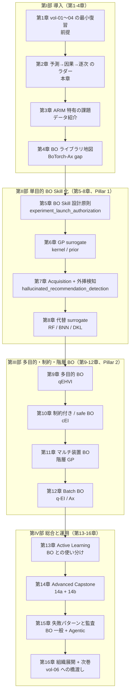

# 第2章 vol-01〜04 の Skill に何が足りないのか — 予測から "次にどこを打つか" へ

> **本章の到達目標**
> - vol-04 で作れた **一括計画型 DoE Skill と観測因果推論 Skill の限界**を、ARIM 実データの具体場面で説明できる
> - **「acquisition 最大化 ≠ 科学的最適候補」を Agentic 現場で守る**とはどういうことか、AI エージェントに何を許してよく何を許してはいけないかの境界を言える
> - ARIM データにおける **sequential question（逐次的問い）** の典型を 4 つ以上挙げられる
> - 本書のゴール（**2 pillars = 単目的 BO Skill + 多目的/制約付き BO Skill / Advanced Capstone = vol-04 因果構造 + 階層 GP + Human 承認 BO の統合 Skill**）を自分の言葉で説明できる
> - **"予測 → 因果 → 逐次" のラダー**を材料実験文脈で説明できる
> - vol-05 で **扱わないこと**（生成モデル逆設計は vol-06、深層 BO の全面展開、強化学習ベース実験自律実行、多階層プラント最適化、GP 数学的完全展開）を判別できる
>
> **本章で扱わないこと**
> - GP surrogate の形式的定義（第6章）
> - Acquisition function の実装（第7章）
> - Batch BO / 多目的 / 制約付き BO の具体（第9-12章）
> - 実験実行承認ゲートの実装詳細（第5章）
> - Ax と BoTorch の gap 詳細（第4章）

---

## 2.1 vol-01〜04 で作れた Skill と、その先にある壁

vol-01〜04 で読者は、AI エージェントに **観測を分析させ、因果を主張させ、一括で介入計画を立てさせる 4 段の Skill 体系**を築いてきました。

- **vol-01（Foundations）**：Skill、MCP、データ契約、provenance、Human-in-the-loop、6 データ型
- **vol-02（Stats/ML）**：**2 pillars = scikit-learn Skill / PyMC Skill**、CV 規律、階層モデル、事後予測、MCMC 診断
- **vol-03（Deep Learning）**：**2 pillars = 教師あり深層 + 転移学習 / 不確かさ付き深層モデル**、Foundation Model の provenance、GPU 非決定性、深層特有の 4 承認ゲート
- **vol-04（Causal × DoE）**：**2 pillars = 観測因果推論 Skill / 古典 DoE Skill**、DAG と identification 戦略、**4 階層承認ゲート（L1: DAG / L2: 変数選択 / L3: 介入実行 / L4: 施設標準昇格）**、`refutation_gate`（`ch09_v0_3`、10 tests）、`counterfactual_scope_gate`、`audit_manifest_v1`（19 checks）

これらはどれも、**「観測データが手元にある前提で、それに対して何を主張するか / どんな計画を立てるか」** のラインの Skill でした——「XRD スペクトルから結晶相を予測する」「装置差を confounder として ATE を推定する」「5 因子 × 3 水準の実験計画を一括生成する」といった具合に。

しかし、実際の ARIM の現場に立つと、**一括計画型 Skill だけでは答えられない問い**が次々に出てきます。次のような問いを、あなたの Skill は解けますか？

- **20 条件の実験計画を一括生成した。最初の 5 条件を実行したら、想定と違う結果が出た。残り 15 条件をそのまま進めてよいのか？**（計画通り進めるか、修正するかの判断根拠がない）
- **1 回の合成に 3 日かかる。次に打つ 1 条件をどう選ぶのが最適か？**（factorial の計画表からランダムに 1 つ選ぶのは合理的ではない）
- **多目的最適化：硬度と密度を同時に最大化したい。Pareto front はどこにあるのか？** また **どの候補を Human が承認すべきか？**
- **safe BO：温度上限 500 °C を絶対に超えてはいけない。それでも探索を進めたい。**エージェントが安全条件を破らない保証はあるのか？

これらは **vol-04 までの一括計画型 Skill だけでは解けません**。**観測結果を見ながら次の候補を提案する仕組み**——ベイズ最適化（BO）と active learning——が必要になります。そして、その仕組みを **エージェントが自律的に回すのを Human 承認ゲートで抑える設計**——実験実行承認ゲート——も。

> [!TIP]
> vol-01〜03 の Skill が **「観察されたパターン」に基づく判断**を出す仕事、vol-04 の Skill が **「観察されたパターンの背後にある仕組み」に基づく判断**を出す仕事だとすれば、vol-05 の Skill は **「次にどこを観察すればもっと分かるか / もっと良い結果に近づけるか」を提案する仕事**です。前者は「$P(Y \mid X)$」「$P(Y \mid \mathrm{do}(X))$」を推定する Skill、後者は「$\arg\max_X \alpha(X ; \mathcal{D})$」（acquisition function の最大化点）を提案する Skill。$\alpha(\cdot)$ の意味は第7章で正確に定義しますが、ここでは **「今の観測データを踏まえて、次に測るとどれくらい情報が得られるかを評価する関数」** と理解してください。

---

## 2.2 一括計画・観測因果推論だけで詰まる 4 つの局面

具体的に、どんな場面で vol-01〜04 の Skill だけでは詰まるのかを 4 つ挙げます。第3章以降で、それぞれをどう解くかを扱います。

### 局面 1：実験に時間・コストがかかり、途中で計画を見直したい（→ 第5-8章：単目的 BO）

例：**「合成 1 サイクルに 3 日、測定に 2 日。予算で回せるのは 15 サイクル。5 サイクル終えたら surrogate が想定と違うことを示唆——残り 10 サイクルはどう選ぶ？」**

- **vol-04 の Skill の限界**：DoE は **一括計画（one-shot）** に scope 限定でした（vol-04 第0章 §0.7 で明示）。CCD / Box-Behnken / fractional factorial は 15 サイクル全部を **事前に決める**設計です。5 サイクル目で「実は温度 500 °C 付近が最重要」と分かっても、残りの計画表を書き換える枠組みはありません
- **vol-05 の解**：**GP surrogate + acquisition function** で、**現時点までの観測データから次に打つべき 1 条件を提案**する Skill を作ります（第5-8章）。iteration ごとに Human 承認を挟み（`experiment_launch_authorization`）、surrogate 再学習と acquisition 再計算を回します。**サイクル時間 × 予算**という制約が明示的に `budget_remaining` / `stop_condition` として provenance に残ります

### 局面 2：多目的トレードオフを "エージェントが勝手にスカラー化する" 危険（→ 第9章：qEHVI と Pareto front）

例：**「硬度と密度を同時に最大化したい。Human 側の重み付けは "だいたい 6:4" と曖昧」**

- **vol-04 の Skill の限界**：CCD 応答曲面を 2 目的で回すことはできますが、**Pareto front を明示的に管理する枠組み**は vol-04 にはありません。エージェントに「多目的最適化して」と頼むと、**エージェントが勝手に $Y_1 + \lambda Y_2$ にスカラー化して単目的にしてしまう**危険が生じます
- **vol-05 の解**：**qEHVI（expected hypervolume improvement）** で Pareto front を明示的に扱う Skill を作ります（第9章）。**「エージェントが勝手にスカラー化しない」契約**を Skill の入出力仕様に書き、目的関数重み付けは Human が明示的に指定するまで Skill が **単一値の目的にまとめない**規律を組み込みます

### 局面 3：安全条件を絶対に破らずに探索を進めたい（→ 第10章：制約付き BO / safe BO）

例：**「温度上限 500 °C、圧力上限 10 MPa は絶対に破ってはいけない。それでも収率を最大化したい」**

- **vol-04 の Skill の限界**：DoE の因子水準を「事前に人手で 500 °C 以下」に制限すれば安全条件は守れますが、**探索範囲の境界で "500 °C ぎりぎりまで攻める" 提案**を Skill が返せる保証はありません。また、**「試してみたら安全でなかった」を後で分かる場合（潜在的な制約）** に対応できません
- **vol-05 の解**：**cEI（constrained EI）** と **safe BO**（Sui et al. 2015 系）で、**「安全条件を破る候補は Skill が絶対に返さない」契約**を組み込みます（第10章）。Skill の失敗モードとしての制約破りは第15章で明示的に fatal と定義します

### 局面 4：マルチ装置・マルチタスクで一括計画では扱えない（→ 第11-12章：階層 GP + Batch BO）

例：**「ARIM 施設内に 3 台の同型装置。装置ごとに微妙にキャリブレーションが違う。並行して探索したい」**

- **vol-04 の Skill の限界**：vol-04 第11章の階層モデルは **観測データの分析** に階層 GP を使う枠組みでした。**"3 台並行して次を提案する"** サイクルには対応していません。また、装置差を confounder として調整するのは vol-04 の因果推論の範疇でしたが、**"次に打つ候補選択に装置差を活かす"** 発想はありませんでした
- **vol-05 の解**：**Multi-task GP + coregionalization kernel** で装置ごとの目的関数を階層事前分布で共有し、**Batch BO（q-EI / q-EHVI）** で 3 台並行の候補提案を Skill 化します（第11-12章）。装置固有の観測が少ない装置でも、他装置の情報を借りて surrogate を安定化させます

> [!NOTE]
> **深層 BO（Deep Kernel Learning / Neural BO の全面展開）は vol-05 では扱いません**（第8章末で 1 ページのみ言及）。BO の主戦場は依然として GP + tabular で、材料現場では表形式データが中心だからです。生成モデル・逆設計は vol-06。

これら 4 局面は、いずれも **「一括計画」枠組みを破らないと解けません**。ここが vol-05 の主戦場です。

---

## 2.3 "予測 → 因果 → 逐次" の 3 段ラダー

vol-04 では Judea Pearl の **causal hierarchy（3 階層）**（Association / Intervention / Counterfactual）を導入しました。vol-05 はこれと **直交する軸** として、**「一括計画 → 逐次適応」の軸**を加えます——両軸の 2 次元で本書 vol-05 の位置が定まります。

| Level | 名称 | 問いの型 | vol-01〜03 で扱えた | vol-04 で扱った | vol-05 で扱う |
|---|---|---|:-:|:-:|:-:|
| **L1** | **Association**（相関） | 「これを見たら何が言える？」 | ✅ 全予測 Skill | — | — |
| **L2** | **Intervention**（介入） | 「これを実際にしたらどうなる？」 | 部分的（RCT） | ✅ 観測因果推論 + 一括 DoE | ✅ 逐次 DoE / BO（介入を **段階的に**選ぶ） |
| **L3** | **Counterfactual**（反実仮想） | 「もし違う条件だったら？」 | ❌ | ✅ SCM / g-formula | 補助的（BO の surrogate 予測は counterfactual の近似だが、vol-05 は最適化に集中） |

そして、**"計画の粒度"** の直交軸：

| 計画の粒度 | 意味 | vol-04 で扱った | vol-05 で扱う |
|---|---|:-:|:-:|
| **一括（one-shot）** | 実験計画を事前にすべて決める | ✅ Full/fractional factorial、CCD、Box-Behnken、one-shot Bayesian DoE | 初期実験として活用 |
| **逐次（sequential / iterative）** | 観測を見ながら次の 1 条件（または 1 バッチ）を決める | ❌ | ✅ BO / active learning（Pillar 1 + Pillar 2） |

**L2 × 逐次** が vol-05 の主戦場です。**「介入を段階的に選ぶ」** —— これは vol-04 の一括 DoE から確実に踏み込んだ 1 段です。ARIM 実験文脈で 3 段のラダーを並べると次のようになります。

| Level × 粒度 | 問い | ARIM 実データ例 | 必要な追加情報 |
|---|---|---|---|
| **L1 × 一括** | 「温度 500 °C の試料は、平均でどれくらいの結晶化度？」 | XRD ピーク強度と温度の相関 | 観測データのみ |
| **L2 × 一括** | 「温度を実際に 500 °C に上げると、どれくらい結晶化度が上がる？」 | 温度介入時の効果 | **DAG + adjustment set / DoE の一括計画** |
| **L2 × 逐次** | 「次の 1 サイクルは、どの (温度, 圧力, 時間) の組み合わせで打つ？」 | 逐次実験の候補選択 | **GP surrogate + acquisition + `experiment_launch_authorization`** |
| **L3 × 一括** | 「今 400 °C で失敗したこの試料が、もし 500 °C だったら？」 | 個別試料の反実仮想 | **SCM + `counterfactual_scope_gate`** |

> [!IMPORTANT]
> vol-04 で確立した「Level を混同すると Agentic ハルシネーション」の規律は vol-05 でも継続します。**加えて vol-05 では「粒度を混同すると別種のハルシネーション」** が起きます——たとえば「一括計画で立てた 15 条件を、5 条件目の観測後にエージェントが勝手に修正する」ことは、**元の DoE の randomization / blocking を破壊**します。逐次 BO を回すなら **最初から逐次 BO Skill として設計する**——これが第5章の設計原則です。

---

## 2.4 「acquisition 最大化 ≠ 科学的最適候補」を Agentic 現場で守るということ

vol-04 の「相関 ≠ 因果」に対応する、vol-05 固有の危険が **「acquisition 最大化 ≠ 科学的最適候補」** です。acquisition function は数学的に定義された情報利得指標——**科学的に意味のある実験候補と一致する保証はない**、という原則です。

### 4 つの典型的な逸脱パターン

**逸脱 1：acquisition 最大化点を「最適合成条件」と自然言語で表現する**

- **起こる場面**：EI が最大の点を Skill が返し、エージェントが自然言語で「最適な次の条件はこれです」とまとめる
- **問題**：EI 最大化点は **「今の surrogate posterior のもとで最大の期待改善を持つ点」** です。「科学的に最適」でも「実行して安全」でもありません。特に **surrogate が外挿している領域** で EI が大きくなることが多く、そのまま Human に提示すると誤解を招きます
- **vol-05 の対処**：Skill の出力仕様に **「acquisition 最大化点」と「科学的最適候補」を混同する自然言語出力を禁止する契約**を書きます（第5章）。エージェントは EI 値と根拠（予測 mean / std / 外挿検知結果）を出してよいが、**"最適" とは言わない**規律

**逸脱 2：surrogate の外挿領域を "自信あり" と報告する**

- **起こる場面**：GP の予測分散が学習点近傍では小さく、外挿領域でも「そこそこ小さい」（length scale が大きい場合）——エージェントが「$\hat{Y}(X^*) = 5.2 \pm 0.3$」と報告する
- **問題**：GP の予測分散は kernel と length scale の関数であって、**真の予測不確実性ではありません**。length scale が過大に推定されると、外挿領域でも予測分散が過小になり、**hallucinated recommendation** が発生します
- **vol-05 の対処**：`hallucinated_recommendation_detection`——**予測分散閾値 + 入力から近傍学習点までの Mahalanobis 距離閾値 + length scale 越え検知の合成基準**（第7章「外挿検知の operational 定義」節）。3 判定の少なくとも 1 つで境界超過なら Skill が候補提案を保留し、Human に review を要求します

**逸脱 3：Human 承認なしに実験を実行してしまう**

- **起こる場面**：エージェントに「次の候補を提案して、それを装置に予約して」と一気に頼み、承認ゲートを迂回する Skill 設計になっている
- **問題**：材料実験は消耗と時間コストが高く、いったん実行すると取り返しがつきません。**「動くから安全」ではありません**——動くほど危険です
- **vol-05 の対処**：`experiment_launch_authorization` ゲート——**候補提示 → Human review → 明示的な承認 → 装置予約 → 実行** の一連が provenance に必ず残る Skill 設計（第5章、付録B の MCP 実装で強制）

**逸脱 4：エージェントが acquisition を "動的" に勝手に切り替える**

- **起こる場面**：エージェントが Skill 実行中に「EI が探索不足だから UCB に切り替えるべき」と判断し、`acquisition_function` を書き換える
- **問題**：**BO の結論（推奨候補）は acquisition function に依存**——EI と UCB では推奨点が異なります。エージェントが無承認で切り替えると、**iteration ごとに acquisition が変わり、収束の意味が不明**になります
- **vol-05 の対処**：`acquisition_function` を Skill 起動時に pin。**dynamic 切替は事前登録された切替ルールに従うこと**（例：iteration 5 まで UCB、以降 EI に固定）、切替履歴を `acquisition_switch_log` に append-only 記録（第5・7章、第15章で失敗パターン化）

### Agentic 現場でのハルシネーション定義（vol-05 版）

vol-02〜03 の「学習データ範囲外での自信ある予測」、vol-04 の「causal drift」「hallucinated counterfactual」「hallucinated identification」に加えて、**vol-05 では BO 特有のハルシネーションを 4 つ追加**します。

| ハルシネーション種別 | 定義 | vol-05 の対処 |
|---|---|---|
| **Hallucinated recommendation**（外挿推薦） | surrogate が外挿範囲で "自信あり" の候補を返す | `hallucinated_recommendation_detection`（第7章） |
| **Acquisition drift**（acquisition ドリフト） | エージェントが Skill 実行中に acquisition を無承認で切替 | `acquisition_function` の pin + `acquisition_switch_log` |
| **Pending experiment drift** | pending experiments を無承認でキャンセル / 再定義 | `pending_experiments` の append-only 契約（第5章）、第15章で fatal 化 |
| **Stop-condition creep** | エージェントが stop_condition を実行中に緩める（「もう少しだけ回そう」） | `stop_condition` の Skill 起動時 pin、緩和は fatal（第15章） |

これらは vol-04 の「hallucinated counterfactual」（外挿反実仮想）と同じ思想——**"動いているように見える" 出力から異常を検出する仕組み**——を、逐次実験計画文脈で展開したものです。

---

## 2.5 ARIM 実データにおける sequential question の典型

vol-05 の Skill を「自分の研究テーマ」に転用するために、ARIM 実データで頻出する sequential question を型別に整理します。第3章で自分のデータをこの分類に当てはめてもらいます。

### Type A：単目的 BO（連続変数）

| 問い | データ | 主な acquisition | 該当章 |
|---|---|---|---|
| 前処理温度 (300-700 °C) の連続空間で結晶化度を最大化したい | 表形式・スペクトル型 | EI / UCB | 第5-7章 |
| 反応時間 (0.5-24 h) と温度 (300-700 °C) の 2 因子空間で収率最大 | 表形式 | EI / KG（少ないサンプル） | 第7章 |
| PVD 蒸着レートを固定し、基板温度で膜品質を最大化 | 表形式・画像型 | UCB / TS | 第7章 |

### Type B：多目的 BO / 制約付き BO

| 問い | データ | 主な設計 | 該当章 |
|---|---|---|---|
| 硬度と密度を同時に最大化（Pareto front を出したい） | 表形式 | qEHVI | 第9章 |
| 温度上限 500 °C を絶対に破らず収率最大化 | 表形式 | cEI + safe BO | 第10章 |
| 硬度・密度・製造コストの 3 目的（うち製造コスト最小化） | 表形式 | qEHVI + 変換された 3 目的 | 第9-10章 |

### Type C：マルチ装置・マルチタスク BO

| 問い | データ | 主な設計 | 該当章 |
|---|---|---|---|
| ARIM 施設内 3 台の同型装置で並行に探索 | 表形式 | Multi-task GP + Batch BO | 第11-12章 |
| 装置 A で完了した探索を、装置 B に転移して初期観測を減らす | 表形式 | Transfer learning GP | 第11章 |
| 装置ごとに目的関数が異なる（測定モードが違う）が、共通探索空間 | 表形式・多モード | 階層 GP + 装置固有 head | 第11章 |

### Type D：Active Learning（BO とは目的が違う）

| 問い | データ | 主な設計 | 該当章 |
|---|---|---|---|
| 分類 Skill の学習で、次にラベル付けするサンプルはどれ？ | 画像・スペクトル | Uncertainty sampling / Query by committee | 第13章 |
| 回帰 Skill の予測分散を全域で下げたい（最適化ではなく学習） | 表形式 | Expected model change / MES | 第13章 |
| 生成物の分光スペクトル全域で surrogate を安定化させたい | スペクトル | modAL / Emukit | 第13章 |

### Type E：因果構造で search space を絞った BO

| 問い | データ | 主な設計 | 該当章 |
|---|---|---|---|
| vol-04 で `refutation_gate` pass した DAG に基づき、confounder を search space から除外 | 表形式 | Causal-informed BO | 第14章 capstone |
| L3 承認済みの介入変数のみを search space に含める | 表形式 | Causal + safe BO | 第14章 capstone |
| 階層 GP でマルチ装置対応 + causal search space 絞り込み + Human 承認ループ | 表形式・多モード | 統合 capstone | 第14章 (14a + 14b) |

第3章で **「自分のデータで最も答えたい問いはどの Type か」** を分類することから始めます。

---

## 2.6 本書のゴール（2 pillars + Advanced Capstone）

vol-05 の合格ラインを、vol-02〜04 と同じ **2 pillars + Advanced Capstone** の枠組みで再掲します。

### Pillar 1：単目的 BO Skill（第5-8章）

材料実験の 1 つの目的関数（結晶化度、収率、膜品質など）について、**GP surrogate + acquisition function による単目的 BO Skill を 1 つ以上作れる**こと。要件：

- [ ] **surrogate が明示されている**（`surrogate_model_family` = GP / RF / BNN、`kernel_spec`、hyperparameter 事前分布が provenance に pin）
- [ ] **acquisition function が pin**（`acquisition_function` = EI / UCB / PI / KG / MES / TS / PES のいずれか、`acquisition_config` の hyperparameter も）
- [ ] **search space が pin**（`search_space_uri` + `search_space_sha256`、`search_space_bounds` に単位含む）
- [ ] **iteration ループの provenance が完全**（`iteration_index`, `batch_size`, `pending_experiments`, `budget_remaining`, `stop_condition`, `sequential_seed_provenance` が append-only）
- [ ] **外挿検知が operational**（`hallucinated_recommendation_detection`、第7章の合成基準）
- [ ] **実験実行承認ゲートが実装**（`experiment_launch_authorization`、物理実験の場合は vol-04 L3 `intervention_execution_authorization` を `parent_authorization_id` として内包）

### Pillar 2：多目的 BO / 多制約 BO Skill（第9-12章）

複数目的または制約条件を持つ材料開発について、**Pareto front / safe region を明示的に管理する多目的 BO Skill を 1 つ以上作れる**こと。要件：

- [ ] **多目的の場合**：`qEHVI` またはそれと等価な acquisition、Pareto front 判定条件、**エージェントが勝手にスカラー化しない契約**
- [ ] **制約付きの場合**：`cEI` または `safe BO`、`constraints_declared` の provenance、**安全条件破りは fatal**
- [ ] **Batch BO の場合**：`q-EI` / `q-EHVI` / Local penalization、`batch_size` の provenance、`pending_experiments` の管理
- [ ] **マルチ装置の場合**：Multi-task GP の kernel prior、階層事前分布の shrinkage、装置ごとの `search_space_bounds`

### Advanced Capstone：3 段の統合 Skill（第14a・14b章）

上記 2 本を **vol-04 の因果構造** と統合した以下の複合 Skill を、ARIM 風合成実験データで完成させる：

**Phase 1（Ch14a、基本 BO ループ）**：vol-04 の DAG から effective search space を導出 → 単一装置 GP surrogate → single-objective BO で 3 iteration まで丁寧に回す。各 iteration で Human 承認、`budget_remaining` と `stop_condition` を operational 化。

**Phase 2（Ch14b、発展）**：階層 GP でマルチ装置対応、multi-objective + constrained BO で 10 iteration まで拡張、後半 5 iteration のスクリプトは付録 D。**Batch × Multi-objective × Constrained の統合ケース**を明示的に扱う。

**5 phase の Human 承認ゲート**：Phase 1 前に vol-04 L1 `dag_authorization` の再確認、Phase 1 中に search space 承認、各 iteration で `experiment_launch_authorization`（物理実験を伴う場合は vol-04 L3 も）、Phase 2 中に Pareto front 承認、Phase 2 終了時に L4 `facility_standard_promotion` の候補審査。

> [!TIP]
> 「1 つ以上作れる」というのは、**自分の研究テーマで、自分のデータで動く Skill を 1 つ作る**という意味です。合成データ（Branin / Hartmann / ARIM 風合成 BO データ、付録 C）で練習を済ませた後、必ず自前データで再現してください。合成データで動く ≠ 実データで動く、は vol-01〜04 でも繰り返してきた原則です。特に BO は **少データ現場での surrogate 挙動** が主戦場なので、自前データでの検証が本質的です。

---

## 2.7 vol-05 で扱わないこと（明示）

vol-05 は **「観測を見ながら次にどの実験を打つかを提案する Skill」** に scope を絞ります。以下は将来巻や別書の候補として、道しるべを示すのみ。

| トピック | 扱わない理由 | 想定巻 / 参照 |
|---|---|---|
| **生成モデル・材料逆設計（VAE / GAN / Diffusion / MatterGen / CDVAE / DiffCSP）** | 「望む物性を持つ材料を生成する」は独立テーマ。BO は探索空間内の最適化、生成モデルは潜在空間からの生成——別軸 | **vol-06** |
| **深層 BO の全面展開（Deep Kernel Learning、Neural BO、Transformer-based surrogate）** | 材料現場では GP + tabular が主戦場。DKL は第8章末で 1 節のみ言及 | 第8章末尾 / vol-06 参考 |
| **強化学習ベースの実験自律実行** | 「エージェントが実験を勝手に実行する」は本書のスコープ外。実験実行は常に Human 承認 | 別書候補 |
| **多階層プラント最適化・工場ライン最適化** | ARIM は研究施設向け。工場スケールの最適化は独立分野 | 別書候補 |
| **GP の数学的完全展開**（kernel の Reproducing Kernel Hilbert Space 論、posterior consistency の証明） | Rasmussen & Williams "GPML" に譲る。本書は Skill 化と provenance に集中 | 参考文献参照 |
| **BO の regret bound / 収束論の証明** | Srinivas et al. 2010 / Frazier tutorial 2018 に譲る。本書は実用と Agentic gate に集中 | 参考文献参照 |
| **BOCS / 純粋な組合せ空間の BO 直接適用**（分子構造・グラフ空間の最適化） | 材料合成条件は主に連続 + 離散混合。純組合せ空間は生成モデル領域 | 第12章で判断表のみ、生成側は vol-06 |
| **社会科学・A/B テスト固有の逐次戦略**（Multi-armed Bandit の全面展開） | 材料実験に特化。TS は第7章で扱うが、Bandit ドメインの深堀りはしない | — |

---

## 2.8 vol-05 の章構成マップ（一覧）

第3章以降で扱う内容の全体像を、ここで一度俯瞰しておきます。

**Skill としての合格ラインは第II部末（第8章）と第III部末（第12章）**。第14章の Advanced Capstone は「2 pillars を統合し、vol-04 の因果構造と組み合わせて 1 サイクル回す」ことが目標です。

**付録**：
- 付録A：BO × Agentic Skill テンプレート集（vol-04 の provenance を BO × 逐次向けに拡張）
- 付録B：BoTorch / GPyTorch / Ax / Emukit / modAL チートシート + **MCP サーバ実装（BO 版）**
- 付録C：BO 演習データ（ARIM 風合成 BO データ、Olympus benchmark、Branin / Hartmann / Ackley）
- 付録D：Capstone 発展スクリプト集（Ch14b の後半 5 iteration、batch × multi × constrained 統合ケース）

---

## 2.9 本章のまとめ — 一括計画 Skill と逐次 Skill の役割分担

- vol-01〜03 の予測 Skill、vol-04 の観測因果推論 Skill と一括 DoE Skill は、いずれも **「観測データが手元にある前提で分析・計画する」** ラインでした
- vol-05 の逐次 BO / active learning Skill は、それらの上に **「観測結果を見ながら次を決める」** 層を積み上げます
- **一括計画（vol-04）と逐次適応（vol-05）は代替関係ではなく補完関係**——初期実験は DoE で一括生成し、以降を BO で逐次探索する、というハイブリッド運用が実務では自然です（第14章 capstone で実演）
- vol-05 特有のリスクは **「acquisition 最大化 ≠ 科学的最適候補」**、**「surrogate 外挿を "自信あり" と誤報告」**、**「Human 承認なしの実験実行」**、**「acquisition / stop_condition の勝手な変更」**——これらは第15章で網羅的に扱います
- 本書の合格ラインは **2 pillars（単目的 BO / 多目的または制約付き BO）を自分のデータで 1 つ以上作れる**こと、Advanced Capstone は **vol-04 の因果構造 + 階層 GP + Human 承認ループを統合した BO サイクル**を回せることです

---

## 2.10 次章に進む前のチェックリスト

以下がすべて「はい」であれば、第3章「ARIM データで BO を回すときの Agentic 特有の課題」に進めます。

### 概念の理解

- [ ] **一括計画（one-shot）と逐次適応（sequential）の違い**を、自分の実験プロトコルの用語で説明できる
- [ ] **acquisition 最大化と "科学的最適候補" を混同する危険**を、自分の分析で起こりうるパターンとして 1 つ挙げられる
- [ ] **`experiment_launch_authorization` と vol-04 L3 `intervention_execution_authorization` の関係**（物理実験を伴う場合は L3 が `parent_authorization_id`）を説明できる
- [ ] **`hallucinated_recommendation_detection`** の 3 判定（予測分散 / Mahalanobis 距離 / length scale 越え）の名前を言える
- [ ] **Pearl の 3 階層 × 一括/逐次 の直交 2 軸**で、自分の研究の主戦場がどこかを指せる

### 自分のデータへの当てはめ

- [ ] 自分のデータで **最も答えたい sequential question の Type**（A: 単目的 BO / B: 多目的または制約 / C: マルチ装置 / D: Active Learning / E: 因果構造で絞った BO）を 1 つ選べる
- [ ] 自分の実験の **1 サイクル時間**と **1 サイクルコスト** を数値で言える（BO 適用性判定の基礎、第3章で使う）
- [ ] 自分の探索空間の **連続変数の bounds（下限・上限・単位）** と **離散/カテゴリ変数の候補集合** を書き出せる
- [ ] 自分の実験の **絶対に破ってはいけない安全条件**（温度上限・圧力上限・化学的制約）を 1 つ以上挙げられる
- [ ] 自分の施設の **並行運用可能な装置数** と **装置間キャリブレーション差の想定**（似ている / かなり違う / 未評価）を言える

### vol-04 との接続

- [ ] 自分のデータで **vol-04 の DAG（`refutation_gate` pass 済み）が使えるか、または新規に組む必要があるか** を判断できる
- [ ] BO の探索空間から **confounder を除外**（絞り込み）または **treatment 候補として含める**（介入変数として設計）のどちらが自分のケースかを判断できる

「うろ覚え」があれば、該当章に短く戻ってから第3章へ進んでください。特に **vol-04 の `refutation_gate` / `counterfactual_scope_gate` の理解が弱い場合**、第14章 capstone で詰まります——vol-04 第9章と第4章 §4.5 を復習してから戻るのが安全です。

---

## 参考資料

### vol-01〜04 の該当章（本章での主な参照）

- [vol-01 第7章 データ分析用Skillの設計原則](../vol-01/chapter-07.md)（Skill の物理形態）
- [vol-01 第14章 失敗パターンとリスク管理](../vol-01/chapter-14.md)（ハルシネーション定義）
- [vol-02 第7章 分類・回帰・CV 設計](../vol-02/chapter-07.md)（surrogate の calibration の基礎）
- [vol-03 第4章 深層 × Agentic Skill の設計原則](../vol-03/chapter-04.md)（Agentic Auth 3 段階）
- [vol-04 第1章 vol-01〜03 の Skill に何が足りないのか](../vol-04/chapter-01.md)（Pearl の 3 階層、本章の構造祖）
- [vol-04 第4章 因果 × Agentic Skill の設計原則](../vol-04/chapter-04.md)（`authorization_gates` L1-L4）
- [vol-04 第9章 感度分析と Refutation](../vol-04/chapter-09.md)（`refutation_gate` `ch09_v0_3`）
- [vol-04 第10章 古典的実験計画の Skill 化](../vol-04/chapter-10.md)（randomization seed 4-stage）
- [vol-04 第14章 因果 × Agentic 特有の失敗パターン](../vol-04/chapter-14.md)（`audit_manifest_v1`）

### vol-05 の該当章（本巻の予告参照）

- [第3章 ARIM データで BO を回すときの Agentic 特有の課題](./chapter-03.md)（次章）
- [第5章 BO × Agentic Skill の設計原則](./chapter-05.md)（`experiment_launch_authorization` 本格化）
- [第7章 Acquisition function の Skill 化と外挿検知の operational 定義](./chapter-07.md)（`hallucinated_recommendation_detection`）
- [第9章 多目的 BO を Skill 化する](./chapter-09.md)（qEHVI）
- [第10章 制約付き BO と safe BO](./chapter-10.md)（cEI）
- [第14章 総合ハンズオン（Advanced Capstone、2 節構成）](./chapter-14.md)
- [第15章 BO × Agentic 特有の失敗パターンと監査](./chapter-15.md)

### 外部参考

- Frazier, P. I. "A Tutorial on Bayesian Optimization" (arXiv:1807.02811, 2018) <https://arxiv.org/abs/1807.02811> — BO 実務入門の定番
- Shahriari, B. et al. "Taking the Human Out of the Loop: A Review of Bayesian Optimization" (Proc. IEEE 2016) — 本書は **逆に Human を戻す**立場
- Rasmussen, C. E. & Williams, C. K. I. "Gaussian Processes for Machine Learning" (MIT Press, 2006, 無料 PDF あり) — GP の古典
- Sui, Y. et al. "Safe exploration for optimization with Gaussian processes" (ICML 2015) — safe BO の原論文
- Srinivas, N. et al. "Gaussian Process Optimization in the Bandit Setting" (ICML 2010) — GP-UCB の regret bound
- BoTorch documentation <https://botorch.org/> — 本書の主要ライブラリ
- Ax documentation <https://ax.dev/> — BO 実験管理層
- Olympus benchmark suite <https://aspuru-guzik-group.github.io/olympus/> — 材料 BO の benchmark
