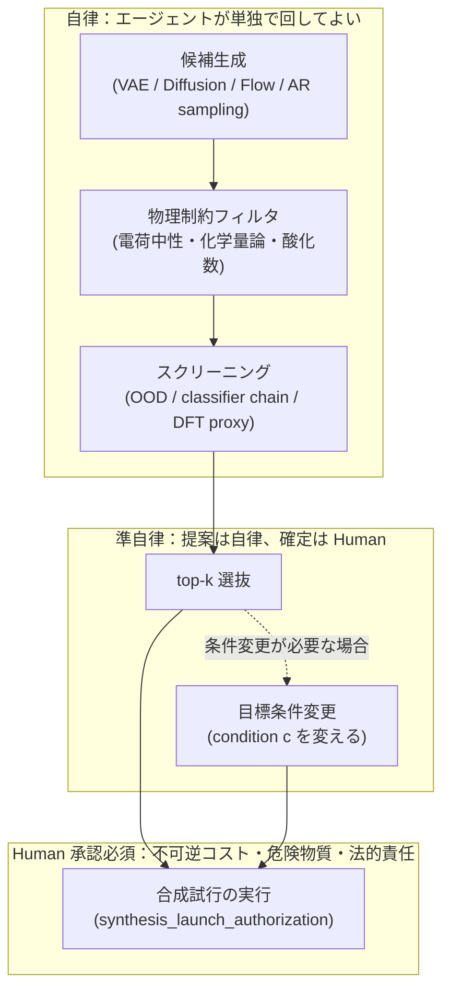

# 第1章 予測 → 因果 → 逐次 → 逆設計 のラダーで vol-01〜05 に何が足りないか

> **本章の使い方**
> - **vol-01〜05 完読者**：§1.2 の復習は読み飛ばして構いません。ただし、**vol-06 独自の前提**が本章に埋め込まれているため、次の 4 箇所には必ず目を通してください：**§1.3 の "既知 search space の探索" と "新規候補の生成" のパラダイム差**、**§1.5 の生成モデル特有の hallucination リスクと `hallucinatory_composition_detection` の operational 定義**、**§1.6 の vol-06 で追加される provenance フィールド予告**、**§1.7 の生成 × 逆設計版 Agentic 権限 3 段階と `synthesis_launch_authorization`**
> - **vol-05 未読・vol-04 完読**：**§1.3 の "BO は既知 search space の探索" は付録 D の BO 最小知識**（10 ページ）と併読してください。第11章の生成候補ランキングまでに vol-05 の要点を補えるよう構成しています
> - **vol-04 未読・vol-05 完読**：**§1.3 と §1.5 の distributional coverage / positivity の議論は付録 D の因果推論最小知識**と併読してください。第10章の OOD detection まで進める前に、vol-04 の refutation の位置づけを把握してください
> - **vol-03 は必須前提**：生成モデルの骨格（encoder / decoder / 潜在空間 / 自己教師あり学習）は vol-03 第7・11・12 章の延長線上にあります。vol-03 未読の場合、本書を読み進める前に vol-03 を完読してください
>
> **本章の到達目標**
> - vol-05 の BO Skill が **「既知の search space の中で次に打つ 1 条件を提案する」** 仕事だったこと、そこに **「新規候補を生成して search space 自体を広げる」** 一段が足りていないことを説明できる
> - **予測 → 因果 → 逐次 → 逆設計** の 4 段ラダーを、ARIM 実データの具体場面で挙げられる
> - vol-06 で扱う 5 種類の生成モデル（VAE / Diffusion / GAN / normalizing flow / autoregressive）の位置づけを、学習コスト・条件付け容易性・分布外制御・確率密度評価の 4 軸で言える
> - vol-06 特有の hallucination——**`hallucinatory_composition_detection`**（学習データからの Mahalanobis 距離 + PCA 再構成誤差 + 物理制約違反率の合成スコア）——の operational 意味を説明できる
> - 生成 × 逆設計版の **Agentic 権限 3 段階**（自律：生成・物理フィルタ・スクリーニング／準自律：top-k 選抜・目標条件変更／**Human 承認必須：合成試行の実行**）を境界付きで説明できる
> - vol-06 で **扱わないこと**（FM 規模の事前学習、強化学習ロボティクス、LLM ベース候補生成、DFT 実行、生成モデル数学の完全展開）を判別できる
>
> **本章で扱わないこと**
> - 生成モデル各手法の数学的定義（第5-7章）
> - `synthesis_launch_authorization` の schema 完全定義（第4章、付録B の MCP 実装）
> - `hallucinatory_composition_detection` の実装コード（第5章の VAE Skill、第10章の OOD detection Skill）
> - Safety governance 3-layer 契約の完全展開（第4・15 章、付録C）
> - 材料 Foundation Model（CDVAE / DiffCSP / MatterGen）の fetch スクリプト（第3・6 章）

---

## 1.1 この章の位置づけ — なぜ vol-06 が必要か

vol-01〜05 で読者は、AI エージェントに **観測・予測・因果・逐次探索** の 4 段のラダーを Skill として作らせる文化を築いてきました。しかし、ARIM データポータルの現場で研究者が本当にやりたいことの多くは、その先の **「まだ観測されていない材料を提案する」** に到達して初めて意味を持ちます。

- 「Li イオン伝導率が 10 mS/cm を超える新しい固体電解質を作りたい。既知組成は既に列挙されており、BO でも探索し尽くした」
- 「目標の XRD パターンを持つ結晶構造を提案してほしい。ただし、電荷中性と Wyckoff 位置の制約を破らないもの」
- 「目標の SEM 微細構造画像を再現する合成条件を逆推定したい」

これらは **vol-05 の BO Skill だけでは解けません**。BO は **既知の search space の中で次の 1 条件を提案する** 仕事であり、**search space の外にある新しい候補を「作り出す」仕組みを持ちません**（vol-05 §2.2）。この一段を埋めるのが **生成モデル × 逆設計 の Skill** であり、それを Agentic に運用する規律が vol-06 の主題です。

> [!NOTE]
> vol-01〜05 の 5 巻は「観測されたデータから何を主張できるか / 次にどこを観測するか」の系譜でした。**vol-06 は "まだ観測されていない候補を数値モデルから生成する" 一段を追加します**。ここで初めて、エージェントの Skill は **潜在空間から任意にサンプルできる**という強力かつ危険な能力を手にします——「危険」の中身が §1.5 のテーマです。

---

## 1.2 vol-01〜05 のラダーの復習（1 節に圧縮）

詳細は付録 D（vol-04/05 未読者のための最小知識、10 ページ）に切り出しています。ここでは vol-06 の議論に必要な最小のポイントだけを 5 巻分並べます。

### vol-01：観測・予測 Skill と provenance の骨格

- **Skill = 特定のフォルダ構造**（`SKILL.md` + `references/` + `scripts/` + `tests/` + `examples/`）
- **AI エージェント × MCP × Skill** の三者関係、Human は意図設計者・検証者・実験実行承認者
- **provenance 5 必須フィールド**（`input_sha256` / `skill_version` / `run_datetime_utc` / `package_versions` / `random_seed`；vol-01 付録 A）
- ARIM の **6 データ型**（スペクトル／クロマト・時系列／画像・顕微鏡／回折・散乱／表形式・プロセス条件／マルチモーダル）

### vol-02：統計・不確かさ・階層モデル

- **2 pillars**：scikit-learn Skill / PyMC Skill
- CV 規律、事前分布 → 事後 → 事後予測、MCMC 診断（$\hat{R}$ ≤ 1.01、ESS ≥ 400、divergences = 0）
- **階層モデル**（vol-06 では生成モデルの事後解析と、階層条件付き生成の骨格として再登場）

### vol-03：深層学習・Foundation Model・エージェントの学習権限 3 段階

- **深層 Skill の 4 承認ゲート**（データ契約 / モデル訓練 / 事前学習重み利用 / GPU 実行）
- 材料 Foundation Model（CDVAE / DiffCSP / MatterGen）を **既存重み利用の立場**で扱う——**FM 規模の事前学習は本書スコープ外**（vol-06 も継承）
- 自己教師あり学習の哲学（vol-06 の潜在空間学習と共通）
- **Agentic 権限 3 段階**（自律 / 準自律 / Human 承認）の原型

### vol-04：因果推論・DoE・L1-L4 権限・refutation_gate・positivity

- **`authorization_gates` 4 階層**（L1: DAG / L2: 変数選択 / L3: 介入実行 / L4: 施設標準昇格）
- `refutation_gate`（`ch09_v0_3`、10 tests）と `counterfactual_scope_gate`
- **positivity 仮定**（介入対象群に十分な観測が存在するか）——vol-06 **第10章** で **「生成候補が学習分布内か」の distributional coverage 判定枠組み**として再解釈
- `audit_manifest_v1`（19 checks）

### vol-05：BO・active learning・`experiment_launch_authorization`・`hallucinated_recommendation_detection`

- **2 pillars**：単目的 BO Skill / 多目的・制約付き BO Skill、GP surrogate + acquisition function（EI / UCB / qEHVI / cEI）
- **`experiment_launch_authorization`**：iteration ごとに Human 承認を差し込む契約
- **`hallucinated_recommendation_detection`**：GP surrogate が外挿領域を "自信あり" と誤報告することを検知する Skill 契約（宣言レベルは vol-05 §5.6、operational 3 判定は vol-05 §7.7）
- 階層 GP × Multi-task BO（マルチ装置対応）

> [!TIP]
> **vol-05 の `hallucinated_recommendation_detection` が vol-06 でどう拡張されるか**が、本章のクライマックスです（§1.5）。BO では「surrogate の外挿を検知する」ことが hallucination 対策の主軸でしたが、**生成モデルでは "潜在空間から任意にサンプルできる" ため、hallucination は "偶発" ではなく "構造" になります**。ここで **`hallucinatory_composition_detection`** という別の Skill 契約を新設します。

---

## 1.3 なぜ既刊のラダーだけでは "新しい材料を提案する" ができないか

vol-05 の BO Skill を丁寧に思い出すと、次のような形をしていました。

```
入力：search space（例：温度 300-800 °C × 圧力 1-10 MPa × 組成比 [0, 1]^3）
     観測データ（既に測定した (X_i, y_i) のペア）

処理：GP surrogate を fit → acquisition function を search space 上で最大化
     → 次に打つ 1 条件（X_next）を提案

出力：X_next と根拠（predicted mean / std、EI 値、外挿検知結果）
```

ここで **search space は既知の連続領域**であり、Skill はその **内部** から次点を提案します。「まったく新しい組成系（例：4 元系から 5 元系へ）」や「まったく新しい結晶構造」を提案する能力は BO Skill にはありません——search space をそう定義していないからです。

### "既知の x を評価する" vs "新しい x を生成する"

この差は数学的にも Agentic 運用的にも本質的です。次表に整理します。

| 軸 | BO Skill（vol-05） | 生成モデル Skill（vol-06） |
|---|---|---|
| **入出力** | 既知 search space $\mathcal{X}$ の 1 点 $x^* \in \mathcal{X}$ を選ぶ | 潜在空間 $\mathcal{Z}$ から新規候補 $x_{\text{new}} \sim p_\theta(x)$ をサンプリング |
| **主張の型** | 「既知空間の中で $x^*$ が最も期待改善が大きい」 | 「学習分布に整合し、条件 $c$ を満たす候補 $x_{\text{new}}$ をこの確率で提示する」 |
| **失敗モード** | surrogate の外挿による過信（`hallucinated_recommendation_detection`） | **潜在空間の任意点から非物理・分布外・危険な候補を "自信あり" と生成**（`hallucinatory_composition_detection`） |
| **Human 承認点** | 実験実行（`experiment_launch_authorization`） | **合成試行の実行**（`synthesis_launch_authorization`）——測定より重い |
| **provenance** | surrogate state / iteration log | + `generative_model_family` / `latent_dim` / `condition_variables_declared` / `filter_rules_applied` / `top_k_returned` / … |
| **不可逆性** | 測定サイクルは繰り返せる（試料は残る） | **合成失敗は試料も予算も失う。危険物質を作ってしまう可能性**もある |

> [!IMPORTANT]
> BO は「既知空間の内挿・境界近傍」で動く仕組みで、外挿を **hallucination として警告する**規律でした。**生成モデルは "外挿" と "分布内サンプリング" の境界が曖昧**——潜在空間の任意点は必ず何かをデコードするため、「これは外挿だ」と自動で告げる機構が Skill 契約として必要になります。§1.5 の `hallucinatory_composition_detection` はそのための設計です。

### 予測 → 因果 → 逐次 → 逆設計 の 4 段ラダー

vol-04 の Pearl causal hierarchy と vol-05 の「一括計画 → 逐次適応」軸に、vol-06 は **「既存候補評価 → 新規候補生成」軸**を加えます。3 軸を並べると、本書 vol-06 の位置がはっきりします。

| Level | 名称 | 問いの型 | 主に扱う巻 |
|---|---|---|:-:|
| **L1** | 予測（Association） | 「これを見たら何が言える？」 | vol-01/02/03 |
| **L2** | 因果（Intervention） | 「これを実際にしたらどうなる？」 | vol-04 |
| **L3** | 逐次（Sequential Intervention） | 「次にどこを打つ？いつ止める？」 | vol-05 |
| **L4** | **逆設計（Inverse Design / Generation）** | 「**まだ観測されていない候補を、条件を満たすように生成せよ**」 | **vol-06** |

L4 は L1-L3 の上に立ちます——生成された候補は **予測 Skill で物性を評価**し、**因果 Skill で分布外・positivity を判定**し、**逐次 Skill で top-k をランキング**します（第10・11 章）。逆設計は既刊ラダーを "置き換える" のではなく、"最上段" として乗せる位置づけです。

---

## 1.4 生成モデル × Agentic の位置づけ

vol-06 で扱う生成モデルは 5 種類——**VAE / Diffusion / GAN / normalizing flow / autoregressive**。それぞれの学習コスト・条件付け容易性・分布外制御・確率密度評価の 4 軸を粗く並べると次のようになります（詳細と選択判断表は第7章末）。

| モデル | 学習コスト | 条件付け容易性 | 分布外制御 | 確率密度評価 | vol-06 内での位置 |
|---|---|---|---|---|---|
| **VAE**（cVAE 含む） | 低〜中 | 高（cVAE で明示） | ELBO で下限あり | 事後 $q_\phi(z\|x)$ で近似 | **第5章の主題**（組成 VAE、教育目的の小規模スクラッチ） |
| **Diffusion**（DDPM / DDIM） | 中〜高 | 高（classifier-free guidance） | score matching で分布内サンプリング強い | 難しい（近似のみ） | **第6章の主題**（結晶 Diffusion、既存 FM 活用） |
| **GAN** | 中 | 中（cGAN） | 弱い（mode collapse） | 不可 | 第7章末で **選択肢としてのみ言及**（材料応用は限定的） |
| **Normalizing Flow** | 中 | 中 | 可逆写像で分布内保証しやすい | **可能**（exact） | 第7章前半（組成 flow、教育目的スクラッチ） |
| **Autoregressive**（SMILES-like） | 中 | 高（prefix conditioning） | 学習分布依存 | 可能（chain rule） | 第7章後半（組成列 AR） |

**本書スコープの確認**：

- **既存 FM 活用が主軸**：MatterGen（HF Hub 公式）、CDVAE（GitHub 配布）、DiffCSP（Google Drive 配布）を第6章で活用
- **教育目的の小規模スクラッチ学習**：組成 VAE（第5章）と組成 Flow / AR（第7章）は数百〜数千サンプルで単一 CPU / 単一 GPU 完結
- **FM 規模の事前学習は扱わない**（vol-03 継承、outline v0.2 明示）

> [!NOTE]
> 「生成モデルを Skill 化する」とは **モデルを研究することではなく、モデルを Agentic な運用契約で包むこと**を意味します。数式の展開・SOTA との精度比較は既存の教科書・論文に譲り、本書は **provenance / 承認ゲート / hallucination 検知 / safety filter** を Skill として設計する側に集中します。

---

## 1.5 Agentic 特有の hallucination リスク（本書の最大の焦点）

vol-06 の設計判断のうち、**最も注意深く扱うべき論点**がここです。

### vol-05 の `hallucinated_recommendation_detection` が担ってきた役割

vol-05 §5.6（宣言）と §7.7（operational 3 判定）で `hallucinated_recommendation_detection` は次の役割を持っていました。

- **入力**：BO Skill が提案した次候補 $X^*$、GP surrogate、学習データ
- **判定**：vol-05 §7.7 canonical の 3 判定 **OR 合成**——**予測分散 $V_{\text{norm}}$** ∨ **Mahalanobis 距離 $D_{\text{Mah}}$** ∨ **length scale 比 $L_{\text{ratio}}$**——のいずれかが閾値を超えたら hallucination flag を立てる
- **出力**：hallucination flag（true / false）、3 判定の内訳（外挿距離、length scale 適正性、予測分散の相対値）

BO では **「外挿を検知する」** が hallucination 対策の主軸で、`surrogate` が **既知データ点からどれだけ離れているか**を測れば済みました。

### 生成モデルでは hallucination が構造的に発生する

生成モデルは **潜在空間 $\mathcal{Z}$ からサンプリング**します。$z \sim \mathcal{N}(0, I)$ でも $z \sim p(z \mid c)$ でも、**サンプルは常に何かをデコードして "候補" として返します**。ここに 3 つの構造的問題があります。

1. **潜在空間の任意点は必ず観測空間の "何か" を返す**——それが学習分布に整合するかは事前には保証されない
2. **条件 $c$ を強く付けても、条件付き分布 $p(x \mid c)$ の裾（学習データが薄い領域）に落ちる**候補は非物理的になりやすい
3. **VAE の decoder / Diffusion の逆過程は連続関数**——境界を "警告" する内部信号がない

つまり、**生成モデルは "hallucination しない mode" を持たない**。したがって、外側から **Skill 契約として** 検知を組み込む必要があります。

### `hallucinatory_composition_detection` の operational 定義

outline v0.2 で明示された **`hallucinatory_composition_detection`** の operational 定義を、章の中で早めに刻んでおきます（第5章の VAE Skill、第10章の OOD detection Skill で完全実装）。

> [!IMPORTANT]
> **vol-05 → vol-06 の parallel な軸付け替え + 合成規則の差し替え**
> vol-05 §7.7 も「予測分散 + Mahalanobis + length scale 比」の **3 判定 OR 合成** でした。vol-06 は **軸と合成規則の両方を差し替える**：
> - vol-05: 予測分散 $V_{\text{norm}}$ / Mahalanobis 距離 $D_{\text{Mah}}$ / length scale 比 $L_{\text{ratio}}$ —— **OR 合成**（いずれか閾値超で flag）
> - vol-06: PCA 再構成誤差 / Mahalanobis 距離（組成空間）/ 物理制約違反率 —— **重み付き和の閾値**（$0.4 z_M + 0.4 z_R + 0.2 v > \tau$）
>
> 「3 判定」という設計哲学は連続しつつ、生成モデルには surrogate の内部指標が存在しないため、代替する 3 軸と合成規則を差し替えます（詳細は第5・10 章）。

| 判定要素 | 意味 | ざっくり閾値（第5・10 章で確定） |
|---|---|---|
| **学習データからの Mahalanobis 距離** | 特徴空間で $x_{\text{new}}$ が学習分布中心からどれだけ離れているか | $D_M^2 > \chi^2_{d, 0.99}$ で外れ値扱い |
| **PCA 再構成誤差** | 学習データ主成分で $x_{\text{new}}$ を再構成した残差 | 学習データ 99 パーセンタイル超で外れ値扱い |
| **物理制約違反率** | 電荷中性・化学量論・酸化数など rule-based チェック | 違反 1 件以上で reject |
| **合成スコア** | 上記 3 者の重み付き和（例：$0.4 \cdot z_M + 0.4 \cdot z_R + 0.2 \cdot v$） | 閾値超で hallucination flag |

これを Skill 契約に落とすと、次のような provenance が最低限必要になります（YAML block 1、詳細は第4章）。

```yaml
skill:
  id: "arim.gen.ood_detection.v0.1"
  version: "v0.1"
hallucinatory_composition_detection:
  method: "mahalanobis_plus_pca_plus_physical"
  mahalanobis:
    reference_dataset: "arim.synthetic-generative.compositions.v1"
    threshold_chi2_quantile: 0.99
  pca:
    n_components: 8
    reconstruction_error_threshold_percentile: 99
  physical_rules_applied:
    - "charge_neutrality"
    - "stoichiometry_integer_multiplier"
    - "oxidation_state_bounds"
  composite_score_weights:
    mahalanobis: 0.4
    reconstruction: 0.4
    physical_violation: 0.2
  composite_score_threshold: 0.75
provenance:
  # §1.5 の focus は hallucinatory_composition_detection config。
  # 5 必須フィールド（input_sha256 / skill_version / run_datetime_utc / package_versions / random_seed）は
  # §1.2 と第4章の完全定義に譲る。ここでは chain / 時刻の 2 フィールドのみ抜粋。
  event_hash: "sha256:0000000000000000000000000000000000000000000000000000000000000000"
  generated_at: "2026-07-07T10:56:13+09:00"
```

> [!WARNING]
> **`hallucinatory_composition_detection` は "Skill が返す候補を Human が見る前に必ず経由する" ゲート**です。エージェントに「hallucination 判定を skip して top-k を返す」ことを許すと、この Skill 契約は崩壊します（第14章の失敗パターン）。閾値と重みは **明示的に provenance に残す**——後から "閾値を勝手に緩めた" ことを検出できるようにするためです。

### Safety screening は filter だけでは不十分

outline v0.2 の Blocking-7 で最重要視されたのが **Safety governance の格上げ**でした。整理すると次の三層構造になります（詳細は第4章 / 第15章 / 付録 C）。

| Layer | 責務 | 主要契約 |
|---|---|---|
| **Layer 1：Skill レイヤの静的 filter list** | 毒性・爆発性・法規制物質の rule-based reject | `safety_screening_passed`（**必要条件**） |
| **Layer 2：組織レイヤの dual-use review** | dual-use（軍事転用・輸出規制）を組織倫理委員会等で審査 | `dual_use_review_completed`, reviewer_role |
| **Layer 3：施設レイヤの法的責任と ARIM ポリシー** | 施設ポリシー・法的責任・最終 Human 承認 | `synthesis_launch_authorization` |

> [!IMPORTANT]
> **`safety_screening_passed = true` は "危険ではない" を意味しません**。それは **「Layer 1 の filter を通過した」ことのみ**を意味します。真の危険判定は **Layer 2 の組織 dual-use review + Layer 3 の施設 governance と Human 承認**で担保されます——本書は随所でこの区別を刻みます。エージェントが「filter を通ったから安全」と自然言語で報告することは、Skill 出力仕様レベルで禁止します（第4章）。なお `screening_model_family` / `top_k_returned` は Safety layer ではなく **物性予測 (Ch9) と候補ランキング (Ch11) のフィールド**であり、責務は明確に分離されます。

---

## 1.6 vol-06 で追加される provenance フィールド予告

vol-05 provenance に上乗せする vol-06 固有フィールドを、章の早い段階で予告しておきます（完全定義は第4章、付録 A）。

| フィールド | 意味 | 定義章 |
|---|---|---|
| `generative_model_family` | `vae` \| `diffusion` \| `gan` \| `normalizing_flow` \| `autoregressive` | 第4章 |
| `latent_dim` | 潜在空間の次元数（integer） | 第4章 |
| `training_data_provenance` | 学習データセット ID + version + hash | 第4章 |
| `condition_variables_declared` | 条件付き生成で受け付ける条件変数の宣言（**v0.1 の `condition_variables` は誤記、修正済**） | 第4章 |
| `generation_temperature` | サンプリング温度 / guidance scale（**エージェントが勝手に上げない**契約） | 第4・6 章 |
| `filter_rules_applied` | 適用した物理制約 rule のリスト | 第4・8 章 |
| `screening_model_family` | DFT proxy / classifier chain の識別子 | 第4・9 章 |
| `top_k_returned` | Skill が Human に返す上位 k 件（k を勝手に増やさない） | 第4・11 章 |
| `inverse_design_authorization` | 逆設計 Skill の起動権限（自律 / 準自律 / Human 承認） | 第4章 |
| **`synthesis_launch_authorization`** | **合成試行の実行承認ゲート——必ず Human**。不可逆コスト・危険物質・法的責任 | 第4章、付録B |
| `hallucinatory_composition_detection` | Mahalanobis + PCA + 物理制約違反 の合成スコア（**config**: method/weights/thresholds と **result**: composite_score/flag の両方を含む dict）。他 Skill から invoke する場合は Ch3 §3.6 の `*_delegated_to` pattern で参照。canonical schema は Ch4 | 第4・5・10 章 |
| `safety_screening_passed` | Layer 1 filter 通過フラグ（**必要条件、十分条件ではない**） | 第4・15 章、付録 C |
| `dual_use_review_completed` | Layer 2 組織 dual-use 審査の完了フラグ + reviewer_role | 第4・15 章、付録 C |

> [!NOTE]
> **`condition_variables_declared` は outline v0.1 の `condition_variables` の誤記修正版**です（outline v0.2 Non-Blocking で修正）。「Skill が受け付ける条件」と「実行時に渡された条件」を混同させないため、Skill 側の **宣言** であることを名前で明示します。

---

## 1.7 エージェント権限の 3 段階（生成 × 逆設計版）

vol-03/04/05 第4章の Agentic 権限 3 段階を、生成 × 逆設計に適合させます。

> [!NOTE]
> 本節は **pipeline stage 軸** で権限 3 段階を定義します。**library/FM 呼出し軸**（Diffusers/Lightning の呼出し、FM の 3 経路 fetch など）は Ch3 §3.5 で直交軸として独立に再定義され、両軸交差時は「より制約強い段階が支配」します。また、pipeline stage の canonical 完全分解（SF/F/H/S1/S2/T/D/P/A の 9 stage）は Ch2 §2.7 で示されます。



3 段の境界を、vol-05 の `experiment_launch_authorization` と対比しながら押さえます。

| 権限段階 | 実行者 | 対応 Skill 契約 | vol-05 の対応物 |
|---|---|---|---|
| **自律** | エージェント単独 | `filter_rules_applied` / `screening_model_family` / `hallucinatory_composition_detection` | surrogate 学習・acquisition 計算 |
| **準自律** | エージェントが提案、Human が確定 | `top_k_returned` / `condition_variables_declared` / `inverse_design_authorization` | 次候補提示（Human 承認前） |
| **Human 承認** | Human のみが GO/NO-GO を判断 | **`synthesis_launch_authorization`** | `experiment_launch_authorization` |

### 測定実験 vs 合成試行：なぜ重みが違うのか

vol-05 の `experiment_launch_authorization` と vol-06 の `synthesis_launch_authorization` は名前も構造も似ていますが、**カバーするリスクは非対称**です。

| 軸 | 測定実験（vol-05） | 合成試行（vol-06） |
|---|---|---|
| **不可逆性** | 中（試料は残る、再測定可） | **高（試料も予算も失う）** |
| **危険物質の生成可能性** | 低（既知組成の測定条件変更） | **高（潜在空間から未知組成を提案）** |
| **法的責任** | 装置安全（施設ポリシー） | **dual-use・輸出管理・環境法規** |
| **人身リスク** | 主に装置側 | **合成中の暴露・爆発リスク** |
| **Skill 出力での自然言語** | 「次に測る候補は X」 | 「候補 X を提示（**"合成せよ" とは言わない**）」 |

> [!IMPORTANT]
> `synthesis_launch_authorization` は **vol-05 の `experiment_launch_authorization` より強い契約**です。Skill 側は「合成推奨」「実行してください」等の自然言語を **出力仕様レベルで禁止**します（第4章）。エージェントは候補を **提示** するのみ、GO/NO-GO は必ず Human——outline "本書で扱わないこと" と整合します。

---

## 1.8 扱わないこと（章末で明示）

vol-06 は **「エージェントが材料候補を生成し、Human が合成試行を承認する Skill」** に scope を絞ります（outline v0.2 の「本書で扱わないこと」と整合）。

| トピック | 扱わない理由 | 想定巻 |
|---|---|---|
| **FM 規模の事前学習** | vol-03 継承。**教育目的の小規模スクラッチ**（数百〜数千サンプル、単一 GPU 完結）は Ch5/Ch7 で扱う | vol-03 継承 |
| **強化学習・自律実験ロボティクス** | 「エージェントが合成装置を直接叩く」は本書外。合成実行は Human 承認必須 | 別書候補 |
| **LLM ベースの "材料アイデア生成"** | LLM ハルシネーションの妥当性判定が本書の因果的判定と対立するため、数値モデルの生成に集中 | 別書候補 |
| **DFT / MD シミュレーションの並行実行** | スクリーニングに DFT proxy モデルは使うが、DFT 実行そのものは扱わない | — |
| **生成モデル数学の完全展開**（ELBO 変分展開、SDE 定式化 …） | 既存教科書に譲る。本書は Skill 化と provenance に集中 | — |
| **大規模分散・多 GPU 学習** | vol-03 と同じく単一 GPU / 単一ノード規模に絞る | 別書候補 |

---

## 1.9 本書全体のフロー

vol-06 は 4 部構成、全 15 章 + 付録 4 部（A/B/C/D、outline v0.2 で付録 D を新設）。本章はその Part I の入口です。

```mermaid
flowchart LR
    subgraph PI["Part I：位置づけ・課題・ライブラリ地図（Ch1-3）"]
        C1["Ch1：予測→因果→逐次→逆設計 のラダー<br/>（本章）"]
        C2["Ch2：ARIM データでの Agentic 特有課題"]
        C3["Ch3：生成モデルライブラリ地図"]
    end
    subgraph PII["Part II：生成モデル Skill 化（Ch4-7）"]
        C4["Ch4：生成 × Agentic Skill 設計原則<br/>（synthesis_launch_authorization ここで完全定義）"]
        C5["Ch5：VAE Skill 化<br/>（組成 VAE + hallucinatory_composition_detection）"]
        C6["Ch6：Diffusion Skill 化<br/>（結晶生成、既存 FM 活用）"]
        C7["Ch7：Flow / AR Skill 化"]
    end
    subgraph PIII["Part III：スクリーニングと逆設計 Skill 化（Ch8-11）"]
        C8["Ch8：物理制約フィルタ Skill"]
        C9["Ch9：DFT proxy / classifier chain"]
        C10["Ch10：OOD detection + distributional coverage"]
        C11["Ch11：生成候補の surrogate ランキング（vol-05 連携）"]
    end
    subgraph PIV["Part IV：Capstone・応用・失敗・組織展開（Ch12-15）"]
        C12["Ch12：Capstone（5-Phase）"]
        C13["Ch13a/b：分子（SMILES）と結晶構造"]
        C14["Ch14：失敗パターン<br/>（生成一般 + Agentic 特有）"]
        C15["Ch15：組織展開・Safety governance"]
    end
    PI --> PII --> PIII --> PIV
```



**読み進めるための最短経路**（vol-05 完読者向け）：Ch1 → Ch4（Skill 設計原則）→ Ch5（VAE、まず 1 本手を動かす）→ Ch11（BO 連携）→ Ch12（Capstone）→ Ch14（失敗パターン）。Ch2/Ch3 は必要に応じて戻る。

**vol-04 側から来た読者向け**：Ch1 → 付録 D（BO 最小知識）→ Ch4 → Ch10（OOD detection、vol-04 の distributional coverage 再解釈）→ Ch5 → Ch12。

---

## 1.10 章末チェックリスト

本章の到達目標を、以下 7 項目で自己検証してください。5 項目以上「はい」で第2章へ進めます。

- [ ] vol-05 の BO Skill が **「既知 search space の内側で次の 1 条件を提案する」** 仕事だったこと、**新規候補生成は含まれていなかった**ことを説明できる
- [ ] **予測 → 因果 → 逐次 → 逆設計** の 4 段ラダーに、L4（逆設計）が既刊にない一段として乗ることを、ARIM 実データの具体例で挙げられる
- [ ] vol-06 で扱う 5 種類の生成モデル（VAE / Diffusion / GAN / Flow / AR）の位置づけと、**FM 規模の事前学習は扱わない / 教育目的の小規模スクラッチは扱う**の境界を言える
- [ ] **`hallucinatory_composition_detection`** の operational 定義（**Mahalanobis + PCA 再構成誤差 + 物理制約違反 の合成スコア**）を自分の言葉で説明できる
- [ ] 生成 × 逆設計版の **Agentic 権限 3 段階**（自律：生成・フィルタ・スクリーニング／準自律：top-k 選抜・目標条件変更／**Human 承認：合成試行の実行**）の境界を、`synthesis_launch_authorization` の名前と共に言える
- [ ] **`safety_screening_passed` は "必要条件、十分条件ではない"** ことを、Layer 1（Skill 静的 filter）／ Layer 2（組織 dual-use review）／ Layer 3（施設ポリシー・法的責任）の三層で説明できる
- [ ] vol-06 で **扱わないこと**（FM 規模事前学習、強化学習ロボティクス、LLM ベース候補生成、DFT 実行、生成モデル数学の完全展開）を判別できる

> [!TIP]
> 「7 項目のうち 3 つ以下」なら、§1.5（hallucination）と §1.7（権限 3 段階）を再読してください。vol-06 の残りの章はこの 2 節を前提に組まれています。

---

## 1.11 参考資料

**本書内クロスリファレンス**

- vol-03 §11：材料 Foundation Model、既存重み利用の立場
- vol-03 §12：自己教師あり学習、潜在空間の哲学
- vol-04 §4.6.2：L1-L4 `authorization_gates` の発火条件・承認者（canonical shape は §4.9 template ⑧）
- vol-04 §9：`refutation_gate`（`ch09_v0_3`、10 tests）と positivity
- vol-05 §2：一括計画 → 逐次適応の軸、`experiment_launch_authorization` の予告
- vol-05 §5.6 / §7.7：`hallucinated_recommendation_detection`（宣言レベル + operational 3 判定）
- vol-06 §4：`synthesis_launch_authorization` / `hallucinatory_composition_detection` / Safety governance 3-layer の完全定義
- vol-06 §5：組成 VAE Skill、`hallucinatory_composition_detection` の実装例
- vol-06 §10：OOD detection + distributional coverage（vol-04 refutation の再解釈）
- vol-06 §11：生成候補の surrogate ランキング（vol-05 BO Skill 連携）
- vol-06 付録 A：provenance フィールド完全定義（vol-05 拡張）
- vol-06 付録 B：`synthesis_launch_authorization` の MCP 実装パターン
- vol-06 付録 C：Safety governance の組織契約サンプル、open dataset ライセンス比較表
- vol-06 付録 D：vol-04/05 未読者のための最小知識（10 ページ）

**外部参考文献**（本章内で言及した範囲、詳細は各章で追加）

- Kingma & Welling, "Auto-Encoding Variational Bayes"（ICLR 2014）
- Ho, Jain & Abbeel, "Denoising Diffusion Probabilistic Models"（NeurIPS 2020）
- Xie, Fu, Ganea, Barzilay & Jaakkola, "Crystal Diffusion Variational Autoencoder for Periodic Material Generation"（ICLR 2022）
- Jiao et al., "Crystal Structure Prediction by Joint Equivariant Diffusion (DiffCSP)"（NeurIPS 2023）
- Zeni et al., "MatterGen: A Generative Model for Inorganic Materials Design"（2023）
- Materials Project：https://materialsproject.org/
- OQMD：https://oqmd.org/
- JARVIS-DFT：https://jarvis.nist.gov/

---

**次章予告**（第2章）：**ARIM データで生成モデルを回すときの Agentic 特有の課題**——少データ現場での overfitting・mode collapse、非物理的候補、"合成可能性" の定量化困難、そして「エージェントが安全性チェックをスキップする」危険パターンを、演習用データと共に扱います。
