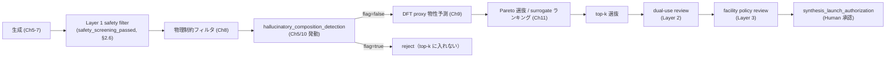

# 第2章 ARIM データで生成モデルを回すときの Agentic 特有の課題

> **本章の使い方**
> - **vol-05 完読者**：vol-05 第3章「ARIM データで BO を回すときの Agentic 特有の課題」の姉妹章として書かれています。vol-05 が **測定コスト × 装置差 × acquisition 暴走** の 3 軸で課題を並べたのに対し、vol-06 は **合成コスト（不可逆）× 非物理的候補 × 危険物質** の 3 軸で並びます——**§2.1 の対比表**を読み、既刊との違いを掴んでください。
> - **vol-05 未読・vol-04 完読**：本章の §2.4（合成可能性の定量化）は vol-04 第10章の DoE 判断と接続します。vol-05 の acquisition・surrogate 議論は付録 D の BO 最小知識に切り出しているため、§2.7 の「hallucinated 候補の top-k 混入」を読む前に付録 D を参照してください。
> - **vol-03 完読必須**：VAE・Diffusion・latent posterior collapse の直感は vol-03 第7・11・12 章に依存します。
>
> **本章の到達目標**
> - ARIM の典型的な少データ現場（材料 domain の **100〜1000 サンプル**）で、VAE / Diffusion がどのように **overfitting・mode collapse** を起こすかを、trainer.loss / validity rate / condition adherence の 3 指標の乖離として説明できる
> - 生成モデルが **非物理的候補**（電荷不整合、化学量論違反、酸化数逸脱、格子不安定性）を返す構造的理由を、VAE の潜在空間 / Diffusion のノイズ空間の性質から言える
> - **`hallucinatory_composition_detection`** の 3 判定合成規則（**Mahalanobis + PCA 再構成誤差 + 物理制約違反率の重み付き和**、$0.4 z_M + 0.4 z_R + 0.2 v > \tau$）が、vol-05 §7.7 の 3 判定 OR 合成と **軸・合成規則の両方で差し替わっている** ことを説明できる（第1章 §1.5 の予告の実装的意味）
> - 「合成可能性スコア」（SC/SA/RA-Score、hull distance、ICSD historical existence）は **proxy であって合成 GO/NO-GO の決定基準ではない** ことを、Skill 契約の `synthesizability_proxy_score` の返却規約として言える
> - **Safety governance 3-layer**（Layer 1 静的 filter、Layer 2 組織 dual-use review、Layer 3 施設ポリシーと法的責任）の分担を、「filter を通ったから安全」という誤解釈と対比して説明できる
> - エージェントが `hallucination_flag=true` の候補を **top-k に混入させない** 契約（Ch11 の候補ランキング前段で `hallucinatory_composition_detection` が必ず走る）の運用上の意味を言える
> - 演習用の **ARIM 風合成材料データ**（`data/synthetic-generative/`）と、公開データセット（Materials Project / OQMD / JARVIS-DFT / AFLOW / QM9）の使い分けを判断できる
> - 自分の研究テーマのデータについて、**生成モデル適用性の 8 項目チェックリスト**（§2.8）を通せる
>
> **本章で扱わないこと**
> - 生成モデル各手法の数学的骨格（第5〜7章）
> - `hallucinatory_composition_detection` の実装コード（第5章 VAE Skill、第10章 OOD detection Skill）
> - Safety governance 3-layer 契約の完全定義（第4章 / 第15章 / 付録 C）
> - 合成可能性ベンチマークの実装（第8章 物理制約フィルタ Skill）
> - 演習データの生成スクリプトそのもの（付録 C）

---

## 2.1 章の位置づけ — なぜ「生成 × ARIM × Agentic」が既刊と違うか

vol-05 第3章は「ARIM データで BO を回すときの Agentic 特有の課題」を、**少データ現場の GP surrogate 暴走 × 装置差 × 実験コスト × acquisition の 5 逸脱** の 4 軸で並べました。vol-06 の生成モデル × 逆設計は、この 4 軸に **一段別の負荷** が乗ります——**合成試行の不可逆性、非物理的候補が構造的に出る性質、そして危険物質を "自信あり" と提案しうるリスク**です。

| 論点 | vol-05 BO の性格 | vol-06 生成 × 逆設計の性格 | 追加される Agentic リスク |
|---|---|---|---|
| **候補の出所** | 既知 search space の内側から acquisition が選ぶ | 潜在空間から **任意にサンプル可能** な生成器が「新規候補」を出す | 学習分布外を無警告で出す |
| **候補の物理妥当性** | search space を人間が設計している段階で担保 | **生成器が rule を学ぶかは保証されない**（電荷中性・化学量論も統計的学習対象） | 非物理的候補が top-k に混じる |
| **実行の不可逆性** | 測定は概ね再測可（試料は残る） | **合成試行は試料も予算も消費**、危険物質は法的責任も | Human 承認 (`synthesis_launch_authorization`) が vol-05 より重い |
| **安全性の担保** | 装置安全（施設ポリシー、設定範囲） | **化学的安全（毒性・爆発・dual-use）+ 施設ポリシー + 法規制** | 「filter を通ったから安全」の誤解釈 |
| **失敗コスト** | iteration 1 回の測定枠と時間 | **試料 + 装置枠 + 廃棄コスト + 事故リスク** | 危険候補を "提示" した記録が残ることの説明責任 |

> [!TIP]
> vol-05 の acquisition 暴走は「**内挿の中で軸を勘違い**する」失敗、vol-06 の生成暴走は「**外挿の中で軸そのものを新規に作る**」失敗です。前者は surrogate の内部指標（予測分散、length scale）でヘッジできましたが、**生成モデルには同種の内部指標が存在しません**——だから §2.4 と §2.7 の Skill 契約が別軸で必要になります。

本章は Part I の 2 章目として、この 5 軸の差分を **6 つの Agentic 特有課題**（§2.2〜§2.7）+ **演習データ紹介**（§2.8）で言語化します。個別 Skill の実装は Part II 以降、Safety governance の完全定義は第4 / 15 章と付録 C に譲ります。

> （**§2.4 と §2.7 は hallucination 軸の "検知規則" と "パイプライン運用契約" の対**として構成されます。）

---

## 2.2 課題 1：少データ現場での生成の overfitting・mode collapse

### ARIM の典型データ規模

ARIM 施設で 1 研究テーマあたりに集まる材料 domain のデータ規模は、多くの現場で **100〜1000 サンプル** です。**5 元系以上の組成空間**を対象にする研究では、10 万〜100 万点の理論空間に対して観測点 100 点というスパース状況が普通です。

| データ規模 | 適用可能な生成モデル | 現実的な運用 |
|---|---|---|
| **< 100 サンプル** | VAE の**教育目的**スクラッチのみ | 実運用は避け、**vol-04 の DoE + factorial** で観測拡充 |
| **100〜300 サンプル** | 組成 VAE（低次元潜在、$\dim z \le 8$） | 分布内サンプリングのみ、**外挿は禁じる** |
| **300〜1000 サンプル** | cVAE、小規模 Diffusion（教育用途） | 条件付き生成が動き始める規模、mode collapse は依然頻出 |
| **1000〜10000 サンプル** | Diffusion、Normalizing Flow、AR | 実運用可能。**ただし条件変数の値域被覆に注意** |
| **> 10000 サンプル** | 既存 FM（CDVAE / DiffCSP / MatterGen）微調整 | vol-03 の Foundation Model 継承（第3・6 章） |

> **注（Ch3 で詳述）**: FM の fetch 経路は非対称——MatterGen (`microsoft/mattergen`) のみ HF Hub 公式、CDVAE は GitHub、DiffCSP は著者 Google Drive。詳細は Ch3。

### 学習曲線の頻出破綻パターン

少データ現場で生成モデルを素朴に学習させると、**trainer.loss は綺麗に下がるのに validity rate が上がらない**という乖離が頻繁に起きます。以下は VAE / Diffusion で共通する 4 破綻パターンです。

#### 破綻 1：latent posterior collapse（VAE）

- **見え方**：ELBO の KL 項が **ほぼゼロに張り付く**。エンコーダが $q(z|x) \approx p(z)$ を返すようになり、**潜在空間が入力情報を運ばない**。デコーダは学習データの平均を吐き続ける
- **原因**：少データ + 表現力の高いデコーダ（多層 MLP）で、KL を払うより decoder の bias で再構成する解が局所最適になる
- **見つけ方**：`kl_per_dim` を可視化 → 全次元でほぼ 0 なら collapse。あるいは **潜在サンプル $z \sim p(z)$ をデコードした validity rate が学習点再構成の validity rate より 10 倍以上悪い**

#### 破綻 2：condition adherence の欠落（cVAE / classifier-free guidance Diffusion）

- **見え方**：条件変数 $c$（例：目標バンドギャップ 2.0 eV）を渡しても、生成候補の $c$ 適合率がランダム同等
- **原因**：条件変数の値域が学習データで **偏っている**（例：観測 100 点のうち 90 点がバンドギャップ 1.0〜1.5 eV、$c = 2.0$ 領域はほぼ観測なし）
- **見つけ方**：**条件ヒストグラム**を学習データで先に作る。条件 bin ごとに 10 サンプル未満の bin は「条件付き生成の空白帯」

#### 破綻 3：mode collapse（Diffusion / GAN 系）

- **見え方**：生成候補の **uniqueness rate が 20% を切る**（生成 100 個のうち unique は 20 個以下）。学習データ中の頻出組成の周辺に生成が集中
- **原因**：Diffusion の逆過程が学習データの mode に強く引き込まれる（少データほど mode の谷が浅い）
- **見つけ方**：**Wasserstein 距離**（学習分布 vs 生成分布）を組成 fingerprint で計算、または simple には **N-gram コサイン類似度** の分布

#### 破綻 4：condition ignore + validity 高（Diffusion の guidance scale 過小）

- **見え方**：guidance scale が小さすぎると **無条件生成に近い挙動**——validity は保たれるが条件 $c$ を無視。逆に大きすぎると condition adherence は上がるが validity と uniqueness が破綻
- **原因**：classifier-free guidance の $s$ 過小 / 過大。**エージェントが勝手に $s$ をチューニングすると再現できない**
- **見つけ方**：`condition_adherence_error` を $s \in \{1, 2, 5, 10, 20\}$ でスイープし、Pareto フロントを Human に提示（第6章）

### Skill 契約への影響

これらは Skill の出力仕様に **明示的な健全性指標** を持つ形で契約化します（詳細は第4章）。

```yaml
skill:
  id: "arim.gen.vae.v0.1"
  version: "v0.1"
generative_health_thresholds:
  validity_rate_min: 0.80          # 生成候補のうち rule-based validity を通す割合
  uniqueness_rate_min: 0.60        # 生成候補のうち unique な組成の割合
  novelty_rate_min: 0.30           # 学習データに存在しない組成の割合
  mode_coverage_min: 0.70          # 学習分布の主要モードを再現する割合
  condition_adherence_error_max: 0.15   # cVAE / classifier-free guidance のみ
  kl_per_dim_min: 0.01             # posterior collapse 検知の下限
provenance:
  # 本章の全 YAML は canonical provenance の focus 部分抜粋。
  # 5 必須フィールド (input_sha256 / skill_version / run_datetime_utc / package_versions / random_seed)
  # は vol-01 付録 A / 第4章の完全定義に譲る。
  event_hash: "sha256:0000000000000000000000000000000000000000000000000000000000000000"
  generated_at: "2026-07-07T11:23:41+09:00"
```

> [!IMPORTANT]
> **`validity_rate_min` / `mode_coverage_min` は Skill の入力契約であって、実行後に確認する post-hoc 診断ではありません**。閾値を割り込んだ学習セッションは Skill が候補を返さない設計にします（第4・5章）。エージェントに「validity が低いが top-k は返しておく」ことを許した瞬間、下流の物理制約フィルタ・OOD 判定が全部無意味になります。

---

## 2.3 課題 2：非物理的候補の生成

### 何が非物理か

生成モデルが返す候補には、次のような **物理的に無効** なものが自然と混じります——学習データが有限で、rule が hard constraint であるほど発生頻度が上がります。

| 違反種別 | 例 | 検出 rule（Ch8 で完全定義） |
|---|---|---|
| **電荷不整合** | LiFe$_{1.3}$O$_2$（酸化数バランス破綻） | Pymatgen `BVAnalyzer` / 電荷中性チェック |
| **化学量論違反** | 整数比を持たない Li$_{0.517}$Co$_{0.483}$O（表現形式によるが素朴生成では発生） | 有理数分母上限（例：$\le 12$） |
| **酸化数逸脱** | Cu$^{4+}$、Mn$^{9+}$ のような未観測状態 | 元素ごとの酸化数許容集合 |
| **格子不安定性** | 空間群対称性を無視した Wyckoff 位置、原子間距離 0.5 Å 以下 | Pymatgen `SpacegroupAnalyzer` + 最近接距離 |
| **化学的許容範囲逸脱** | Li:F = 1:100 のような極端組成 | 元素比の物理的レンジ |

### なぜ VAE / Diffusion は物理制約を "学習" しにくいか

これは実装のバグではなく、**構造的な理由**があります：

1. **データが有限**：観測 100〜1000 点で「電荷中性を破らない」空間全体を暗黙学習させるのは無理。学習セットの negative example（電荷を破った失敗例）はほぼ存在しない
2. **制約が hard constraint**：電荷中性は「連続値の近似」ではなく「整数比の代数的一致」。連続緩和されたモデルは境界に確率質量を持つ
3. **softmax でも境界に質量**：組成を one-hot × 連続比で表現する場合、softmax 出力は 0 と 1 の境界（ちょうど整数比）には確率質量が張り付かない
4. **潜在空間の距離 ≠ 物理的距離**：VAE 潜在空間の Euclid 距離は「意味的類似度」であって、物理制約の充足度ではない

> [!NOTE]
> **「学習を工夫すれば物理制約を守る生成器が作れる」というのは半分正しく、半分は罠**です。penalty term / physics-informed decoder / constrained sampling などのアプローチは活発に研究されていますが、実運用では **生成器に完全担保させるより、生成後に rule-based filter で reject する** ほうが provenance が clean で、Skill 契約として堅牢です（Ch8）。

### Skill 契約への影響：責務分離

vol-06 は次のように責務を分離します（outline v0.2 non-blocking suggestion、Ch5-7 vs Ch8）：

| 章 | 責務 | やらないこと |
|---|---|---|
| **Ch5-7（生成器）** | **分布内サンプリング**（学習分布に近い候補を出す）、条件付け | 物理制約の完全担保 |
| **Ch8（物理制約フィルタ）** | rule-based reject（Pymatgen）、多段フィルタ順序と provenance | 生成モデルの再学習 |

```yaml
# Ch5 VAE Skill の出力（抜粋）
skill:
  id: "arim.gen.vae.v0.1"
outputs:
  candidates:
    - composition: "Li0.5Fe1.3O2"
      latent_z: [0.12, -0.44, ...]
      generator_confidence: 0.87
      # 物理妥当性はここでは判定しない（Ch8 の責務）
```

```yaml
# Ch8 物理制約フィルタ Skill が上を受けて
skill:
  id: "arim.gen.physics_filter.v0.1"
filter_rules_applied:
  - "charge_neutrality"
  - "stoichiometry_integer_multiplier"
  - "oxidation_state_bounds"
outputs:
  candidates:
    - composition: "LiFeO2"       # 電荷整合するものだけ通過
      physics_flags:
        charge_neutral: true
        stoichiometry_ok: true
```

> [!TIP]
> **Ch5 の生成器 Skill に「物理制約を守れ」と入力契約を課すのは責務混同**です。生成器の validity rate は「rule を守った候補が何割か」の**内部指標**であり、下流 Ch8 が独立に検証する **外部指標**とは別の量。この分離が崩れると、Ch14 の失敗パターン「エージェントが物理制約フィルタを skip する」が発火します。

---

## 2.4 課題 3：学習分布外の候補を "自信あり" と誤報告するリスク

### vol-05 との対比：surrogate の内部指標が使えない

vol-05 §7.7 の `hallucinated_recommendation_detection` は、GP surrogate の **内部指標**（予測分散、Mahalanobis 距離、length scale 比）を 3 判定 **OR 合成** で使えました——「いずれか閾値超で flag」。**生成モデルにはこの内部指標が存在しません**：

- **予測分散 → なし**：生成器は $x$ を出すのが仕事で、$p(x)$ の点推定を返さない（Flow は例外だが、多くの実運用では diffuse に扱う）
- **length scale → なし**：kernel を持たない
- **Mahalanobis → 定義可能**：ただし、それだけでは非物理性を捉えない

だからと言って **「生成モデルなら OOD 検知は不要」ではありません**——むしろ **生成モデルは潜在空間の任意点からサンプル可能** で、常に外挿の可能性を抱えます。

### `hallucinatory_composition_detection`：3 判定 + 重み付き和

第1章 §1.5 で予告した operational 定義を、Ch2 で改めて位置づけます——**vol-05 の 3 判定 OR 合成から、軸と合成規則の両方が差し替わっている** ことが本章の要点です。

| 判定要素 | 意味 | vol-05 の対応物 | 大まかな閾値 |
|---|---|---|---|
| **Mahalanobis 距離** $D_M$ | 特徴空間での学習分布中心からの距離 | 同名（surrogate の X 空間で計算） | $D_M^2 > \chi^2_{d, 0.99}$ |
| **PCA 再構成誤差** $R$ | 学習データ PCA での再構成残差 | 予測分散の代替 | 学習 99 percentile 超 |
| **物理制約違反率** $v$ | rule-based チェックの違反件数比 | vol-05 では該当なし | $v > 0$ で reject 相当 |
| **合成スコア** | 重み付き和 $S = 0.4 z_M + 0.4 z_R + 0.2 v$ | vol-05 の "OR 合成" と別軸 | $S > \tau = 0.75$ で flag |

ここで $z_M, z_R$ はそれぞれ $D_M, R$ の standardization です（詳細は第5・10 章）。

> **注**: $z_M, z_R$ の standardization 定義（例：学習分布上の [0,1] min-max、あるいは percentile 変換）は Ch5・Ch10 で完全定義。本章では合成規則の**構造**（3 軸重み付き和・OR ではない）を掴むことに focus。閾値 τ=0.75 は canonical default (Ch1 §1.5 と一致)。

> [!IMPORTANT]
> **第1章 §1.5 の「軸と合成規則の両方を差し替え」の実装的意味**：vol-05 は 3 判定 **OR**（いずれか閾値超で flag）、vol-06 は 3 判定 **重み付き和**（$0.4 z_M + 0.4 z_R + 0.2 v > 0.75$）です。**なぜ OR ではなく重み付き和か**——生成モデルでは軸間に相関があり（Mahalanobis 大 → 通常 PCA 再構成誤差も大）、OR だと重複カウントで false positive が過剰になります。物理制約違反 $v$ は複数 rule の違反件数比（rate ∈ [0, 1]）ですが、実データでは 0/1 に疎に分布しやすく実効的な情報量が低いため重み小さめ（0.2）に。閾値 $\tau$ と重みは Skill の provenance に必ず pin します（後から緩められないため）。

> **注（$v$ の役割）**: §2.7 の canonical 順序では F (Ch8) が同じ 3 rule で先行 reject するため、H 到達候補では通常 $v = 0$。$v$ は F が skip・不在の場合の defense-in-depth として保持され、また Ch10 独自の追加 rule（Ch10 で完全定義）が入る余地を残しています。単独軸としての "$v > 0$ で reject 相当" は axis 単独評価時の目安で、composite では $0.2 v$ に diluted され最終判定は τ=0.75 で行われます。

```yaml
skill:
  id: "arim.gen.ood_detection.v0.1"
  version: "v0.1"
hallucinatory_composition_detection:
  method: "mahalanobis_plus_pca_plus_physical"
  mahalanobis:
    reference_dataset: "arim.synthetic-generative.compositions.v1"
    threshold_chi2_quantile: 0.99
  pca:
    n_components: 8
    reconstruction_error_threshold_percentile: 99
  physical_rules_applied:
    - "charge_neutrality"
    - "stoichiometry_integer_multiplier"
    - "oxidation_state_bounds"
  composite_score_weights:
    mahalanobis: 0.4
    reconstruction: 0.4
    physical_violation: 0.2
  composite_score_threshold: 0.75
provenance:
  event_hash: "sha256:0000000000000000000000000000000000000000000000000000000000000000"
  generated_at: "2026-07-07T11:23:41+09:00"
```

> [!WARNING]
> **`hallucinatory_composition_detection` は Ch11 の候補ランキングの前段で必ず走る**契約です（詳細は §2.7）。エージェントに「hallucination 判定を skip して top-k を返す」ことを許すと、Ch5-7 の生成器がどれほど validity rate が高くても、外挿範囲の危険候補が Human に届きます——第14章の失敗パターンで taxonomy 化します。

---

## 2.5 課題 4：「合成可能性」の定量化の困難さ

### proxy 指標の家族

「この候補は合成できるか」は、材料科学の中でも定量化が最も難しい問いの一つです。実運用で用いられる **proxy 指標**は次の 2 系統に大別されます（第8章で完全定義）。

**分子側（有機分子・SMILES）**：
- **SC-Score**（Synthetic Complexity Score）：分子の "作りにくさ" を深層学習で回帰
- **SA-Score**（Synthetic Accessibility Score）：Ertl-Schuffenhauer の fragment-based heuristic
- **RA-Score**（Retrosynthetic Accessibility）：AI 逆合成計画器（AiZynthFinder 等）の成功率

**結晶側（無機結晶構造）**：
- **熱力学的 hull distance**：DFT で計算した安定化エネルギーが convex hull からどれだけ上か（$E_{\text{hull}} < 50$ meV/atom は "作れる可能性がある" の目安）
- **ICSD historical existence**：Inorganic Crystal Structure Database に類似構造が過去報告されているか

### なぜ proxy であって決定基準ではないか

これらの指標はいずれも **合成可否の必要条件ですらありません**——実際の合成可否は以下の因子で決まります：

1. **前駆体の入手可能性**（試薬の販売、精製の可否、コスト）
2. **合成装置の物理制約**（達成可能温度・圧力・雰囲気）
3. **時間予算**（1 バッチの合成時間 × プロセス最適化に必要な iteration 数）
4. **人的リソース**（合成担当者のスキル、施設の営業時間）
5. **法規制と施設ポリシー**（危険物質、輸出管理、廃棄物処理）
6. **知的財産と契約**（企業秘密、共同研究契約）

つまり proxy スコアが良好でも合成できないケース（前駆体が高価 or 販売終了）、逆に proxy スコアが悪くても合成可能なケース（既知反応の類推で作れる）が常に混じります。

> [!IMPORTANT]
> **`synthesizability_proxy_score` は Skill が返すが、合成 GO/NO-GO には使わない**——これが vol-06 の Skill 契約の中核規約の一つです。Skill 出力に proxy スコアを含めるのは Human の判断材料として、**Skill 側は「合成可能」「合成推奨」等の自然言語を出力仕様レベルで禁止**します（Ch4）。GO/NO-GO は §2.6 の Safety governance 3-layer と `synthesis_launch_authorization` で決まります。

### Skill 契約への影響

```yaml
skill:
  id: "arim.gen.synthesizability_proxy.v0.1"
  version: "v0.1"
proxy_indicators:
  - name: "sc_score"
    range: [1.0, 5.0]
    interpretation: "higher is harder to synthesize"
  - name: "e_hull_distance_meV_per_atom"
    range: [0.0, 500.0]
    interpretation: "lower is more thermodynamically favorable"
  - name: "icsd_analog_count"
    range: [0, 10000]
    interpretation: "count of structurally similar historical entries"
outputs_disallowed_natural_language:
  # Skill が返してはいけない表現
  - "この候補は合成可能です"
  - "推奨候補です"
  - "実験を進めてください"
synthesis_decision_owner: "human"  # 合成 GO/NO-GO の所在は必ず Human
provenance:
  event_hash: "sha256:0000000000000000000000000000000000000000000000000000000000000000"
  generated_at: "2026-07-07T11:23:41+09:00"
```

---

## 2.6 課題 5：エージェントが安全性チェックをスキップする危険

### LLM ベースエージェントの構造的な誤解釈

生成モデルを Agent から叩かせる運用では、LLM が **「filter を通ったから安全」** と誤解釈する事例が典型パターンです：

- **観察**：`safety_screening_passed = true` の flag だけを見て、エージェントが自然言語で「安全性は確認されています」と Human に報告
- **誤解**：filter list は **既知の危険物質**に対する rule であり、**未知の危険候補**（学習分布外、dual-use、爆発性中間体）を捕まえるものではない
- **結果**：Human が「エージェントが確認済み」と信じて `synthesis_launch_authorization` を発行、実際には Layer 2/3 のレビュー未実施

### Safety governance 3-layer（第1章 §1.5 の予告の完全再掲）

第1章 §1.5 で予告した 3 層構造を、本章で改めて刻みます——**vol-06 全体で最も繰り返し強調される規約**です。

| Layer | 責務 | 契約 | エージェント権限 |
|---|---|---|---|
| **Layer 1：静的 filter list** | 毒性・爆発性・法規制物質の rule-based reject | `safety_screening_passed`（**必要条件**） | 自律（filter 実行） |
| **Layer 2：組織の dual-use review** | 二重用途研究・輸出管理・環境法規のレビュー | `dual_use_review_completed`（追加要件、Ch4） | 準自律（提示のみ） |
| **Layer 3：施設ポリシーと法的責任** | ARIM 施設固有の合成禁止品目、責任者による承認 | `synthesis_launch_authorization`（最終） | **Human 承認必須** |

### dual-use の具体的な軸

Layer 1 の filter だけで十分でない典型例：

- **爆発性中間体**：目標分子自体は無害だが、合成経路の中間体が過酸化物・アジド類
- **毒性代謝物**：目標材料は良品でも、生成条件で有害副生物（HF・HCN・As 化合物）
- **放射性**：ラジオアイソトープを含む候補、施設のライセンス範囲外
- **軍事転用**：エネルギー材料、暗号材料、高性能磁性体の一部
- **希少・戦略物資**：レアアース・レアメタルの輸出管理

これらは **化学構造の rule-based チェックだけでは検出不能** な場合があります——中間体は合成経路依存、毒性代謝物は反応条件依存、dual-use は用途依存で法的解釈が絡みます。

### Skill 契約への影響

```yaml
skill:
  id: "arim.gen.safety_screening.v0.1"
  version: "v0.1"
safety_layers:
  layer_1_static_filter:
    filter_list_id: "arim.safety.filters.v1"
    provenance: "appendix_c"
    interpretation: "必要条件、十分条件ではない"
  layer_2_dual_use_review:
    reviewer_role: "organizational_dual_use_committee"
    required_for: ["novel_composition", "energetic_material_class", "restricted_element"]
    # 実運用では review 完了後に provenance に dual_use_review_completed: true と
    # reviewer_role が追記される（Ch4 で完全定義）
  layer_3_facility_policy:
    policy_document_id: "arim.facility.policy.v1"
    authorization_gate: "synthesis_launch_authorization"
    owner: "human"
# 本 Skill は Layer 1 filter を自律実行し、Layer 2/3 は Human ワークフロー
# への hand-off point（declaration）として持つ。実 invocation の分割契約は Ch4。
outputs_disallowed_natural_language:
  - "この候補は安全です"
  - "safety_screening を通過したので合成可能です"
provenance:
  event_hash: "sha256:0000000000000000000000000000000000000000000000000000000000000000"
  generated_at: "2026-07-07T11:23:41+09:00"
```

> [!WARNING]
> **`safety_screening_passed = true` は "危険ではない" を意味しません**——Layer 1 filter を通過したことのみを意味します。エージェントが「安全性は確認されている」等の自然言語を Skill 出力として返すことは、Ch4 の Skill 出力仕様で禁止します。Ch14 の失敗パターン「Safety governance をバイパスして filter を通せば OK と誤解釈する」は、この規約違反として taxonomy 化されます。

---

## 2.7 課題 6：エージェントが hallucinated 候補を top-k に混入させる

### 「filter を通れば必ず top-k に入れる」は間違い

Ch11 の生成候補 surrogate ランキングで、素朴な実装では次の順序になりがちです：

1. Ch5-7 の生成器で 1000 候補を生成
2. Ch8 の物理制約フィルタで validity NG を reject → 800 候補
3. Ch9 で DFT proxy 物性予測
4. Ch11 で surrogate ランキング → top-k 選抜

**この順序では `hallucinatory_composition_detection` が発火しません**——step 4 の直後に top-k が Human に届き、**Mahalanobis 大 + PCA 再構成誤差大の候補**（学習分布から遠く外挿している）が top-k に混じる可能性があります。

### 正しい発動順序

第1章 §1.5 で予告した通り、**Ch11 の候補ランキングの前段で `hallucinatory_composition_detection` が必ず走る**契約にします：



> [!NOTE]
> 上の mermaid は naive 実装（`hallucinatory_composition_detection` を後段に置く／完全省略する）を、**§2.6 の Layer 1〜3 safety governance + §2.4 の hallucination gate** で補強した canonical パイプラインです。Ch14 の失敗パターン taxonomy はこの canonical 順序からの逸脱を系統的に分類します。

### Skill 契約への影響

```yaml
skill:
  id: "arim.gen.candidate_ranking.v0.1"
  version: "v0.1"
# 本 Skill は F→H→(Ch9 呼出)→ranking→top-k を担当。
# Layer 1 safety filter (§2.6) は本 Skill 開始前に別 Skill として実行済み前提、
# DFT proxy 物性予測 (Ch9) は H と surrogate_ranking の間で別 Skill として呼出。
pipeline_order:
  # hallucination 判定は surrogate ランキングの前段で必ず走る
  - "physics_filter"
  - "hallucinatory_composition_detection"   # ここで flag=true の候補は事前 reject
  - "surrogate_ranking"
  - "top_k_selection"
top_k_returned: 5
disallowed_operations:
  # エージェントが自律で行ってはいけない操作
  - "reorder_pipeline"                # 順序を勝手に変えない
  - "skip_hallucination_detection"    # 判定を skip しない
  - "override_hallucination_flag"     # flag=true を強制的に false にしない
provenance:
  event_hash: "sha256:0000000000000000000000000000000000000000000000000000000000000000"
  generated_at: "2026-07-07T11:23:41+09:00"
```

> [!IMPORTANT]
> **「validity と surrogate スコアが良い候補を全部 top-k に入れる」はエージェントの直感に馴染む**（LLM の学習分布に「上位候補を全部見せる」パターンが多い）——だからこそ Skill 契約で **`hallucination_flag=true` は事前 reject** を強制します。この規約が破れると、Human は「エージェントが厳選した top-5」だと信じて外挿範囲の危険候補に `synthesis_launch_authorization` を発行しかねません。Ch14 の失敗パターン taxonomy に登録します。

---

## 2.8 演習用データ紹介 — 自分のデータの生成モデル適用性を判定する

### 主軸：ARIM 風合成材料データ（本書オリジナル）

本書の生成モデル演習は、**ARIM 風合成材料データ**（`data/synthetic-generative/`、付録 C 収録）を主軸に据えます。**外部データセットに依存しない再現性** と **合成可能性フラグ・真の物性を持つ** ことが特徴です。

#### データセット構成

| データ | ファイル | サンプル数 | 用途 | 使用章 |
|---|---|---|---|---|
| **組成データ（3 元系）** | `data/synthetic-generative/compositions_ternary.csv` | 500 | 組成 VAE、cVAE、Flow | Ch5, Ch7 |
| **組成データ（4 元系）** | `data/synthetic-generative/compositions_quaternary.csv` | 1500 | Diffusion（小規模） | Ch6 |
| **結晶構造** | `data/synthetic-generative/structures/*.cif` | 200 | 結晶 Diffusion | Ch6 |
| **微細構造画像** | `data/synthetic-generative/micrographs/*.png` | 300 | 画像 VAE（第13章） | Ch13 |
| **物性ラベル** | 上記各 CSV に同梱 | — | 条件付き生成の $c$ | Ch5-7 |
| **合成可能性フラグ** | 上記各 CSV に同梱（`synthesizable: bool`） | — | proxy スコア学習 | Ch8 |

#### データ形式（抜粋）

`compositions_ternary.csv`：
```
composition,x_Li,x_Fe,x_O,formation_energy_meV_per_atom,band_gap_eV,synthesizable
LiFeO2,0.25,0.25,0.50,-1234.5,2.31,true
Li2FeO3,0.286,0.143,0.571,-1105.2,1.89,true
...
```

`structures/*.cif`：格子定数 + 原子位置を持つ Crystallographic Information File。**Pymatgen で直接読み込める**。

#### 危険物質・dual-use の除外

`data/synthetic-generative/` の全データは **合成時に安全性 filter を通したエリア** から生成しています——付録 C の filter list（爆発性・毒性・放射性・dual-use）で reject される元素・組成は含みません。演習中に生成器が付近の外挿を出すことは可能ですが、Ch8/Ch4 の Skill 契約で捕まえる設計です。

### 対比：公開データセットの位置づけ

学習分布 diversity の演習や、既存 Foundation Model の微調整（Ch3, Ch6）では、以下の公開データセットを併用します——**ライセンス・API 版数・snapshot date** の記録が必須です（詳細比較は付録 C）。

| データセット | 内容 | 主なライセンス | 演習での用途 |
|---|---|---|---|
| **Materials Project** | 無機結晶 15 万件、DFT 物性 | CC-BY 4.0 | Ch6 結晶 Diffusion、Ch11 surrogate |
| **OQMD** | 無機結晶 100 万件、DFT | CC-BY 4.0（要確認） | Ch6 大規模学習の比較 |
| **JARVIS-DFT** | NIST の DFT database | US Gov Public Domain | Ch9 DFT proxy |
| **AFLOW** | 結晶構造 350 万件 | AFLOW ライセンス | Ch10 OOD 参照分布 |
| **QM9** | 有機分子 13 万件、量子化学 | CC BY 4.0 | Ch13a 分子 VAE |

> [!NOTE]
> **公開データセットのライセンスは頻繁に改定されます**。付録 C は 2026 年時点のスナップショットで、実運用では **各データセットの最新規約を必ず確認**してください。特に「生成モデルの学習利用可否」と「生成候補の商用利用可否」は個別に条項があります。

### 自分のデータの生成モデル適用性判定チェックリスト

以下 8 項目を通せるデータは、Ch5-11 の Skill 契約に**そのまま**乗せられます。1 項目でも不通なら該当 Skill の入力契約を修正する必要があります（Ch4 で完全定義）。

| # | 項目 | 判定基準 | 該当 Skill |
|---|---|---|---|
| **1** | **サンプル数** | 100 未満：VAE 教育目的のみ／1000 以上：Diffusion / cVAE 実用可 | Ch5-7 全般 |
| **2** | **物性ラベルの網羅性** | 条件付き生成で使う条件変数の値域が観測されているか（値域 bin 10 サンプル未満の bin がないか） | Ch5-7 の cVAE 契約 |
| **3** | **物理制約の明示可能性** | Pymatgen / RDKit で rule 化できる制約が言語化されているか | Ch8 filter |
| **4** | **匿名化可能性** | 企業秘密・共同研究契約・個人情報を除去可能か（試料 ID hash、オペレータ ID 除外） | 付録 C |
| **5** | **合成可能性ラベルの有無** | 各サンプルに合成成否のラベル（成功／失敗／未試行）があるか | Ch8 proxy 学習 |
| **6** | **危険物質・dual-use の初期スクリーニング** | 学習データ自体が Layer 1 filter を通っているか | §2.6, 付録 C |
| **7** | **観測装置・オペレータ・バッチの記録** | vol-04/05 と同じく、装置差の provenance 記録があるか（生成器の学習分布の shift 検知に必要） | 付録 A |
| **8** | **データ配布ライセンス** | 学習利用可否、生成候補の派生物ライセンス継承の条項があるか | 付録 C |

自分のデータで判定を通すと、**Ch4 の Skill 契約テンプレート** の入力仕様書がほぼ埋まります。vol-05 第3章 §3.7 の 5 問と合わせて、Part II 以降のハンズオンに進む準備が完了します。

---

## 2.9 章末チェックリスト

本章の到達目標を、以下 8 項目で自己検証してください。**6 項目以上「はい」で第3章へ進めます**。

- [ ] **§2.2 の 4 破綻パターン**（posterior collapse、condition adherence 欠落、mode collapse、guidance scale の過小/過大）を、自分のデータで起こりうるものとして 1 つ以上挙げられる
- [ ] **§2.3 の非物理的候補**の 5 種類（電荷不整合／化学量論違反／酸化数逸脱／格子不安定／化学的許容範囲逸脱）を Pymatgen で検出する rule として言語化できる
- [ ] **§2.3 の責務分離**（Ch5-7 の生成器は分布内サンプリング担当、Ch8 が物理制約フィルタ担当）を、なぜ生成器に完全担保させないかの構造的理由と共に説明できる
- [ ] **§2.4 の `hallucinatory_composition_detection`** の合成規則（**$0.4 z_M + 0.4 z_R + 0.2 v > 0.75$**）が、vol-05 §7.7 の 3 判定 OR 合成と **軸と合成規則の両方で差し替わっている** ことを、第1章 §1.5 の予告と対応付けて説明できる
- [ ] **§2.5 の合成可能性 proxy**（SC/SA/RA-Score、hull distance、ICSD historical existence）が **合成 GO/NO-GO の決定基準ではない** ことを、実際の合成可否を決める 6 因子と共に言える
- [ ] **§2.6 の Safety governance 3-layer**（Layer 1 静的 filter / Layer 2 組織 dual-use review / Layer 3 施設ポリシーと `synthesis_launch_authorization`）を、「filter を通ったから安全」の誤解釈と対比して説明できる
- [ ] **§2.7 のパイプライン順序**（生成 → 物理フィルタ → `hallucinatory_composition_detection` → surrogate ランキング → top-k → Human 承認）で、**`hallucination_flag=true` の候補は事前 reject** の契約意味を説明できる
- [ ] **§2.8 の適用性チェックリスト 8 項目**を、自分の研究テーマのデータに対して通してみた

> [!TIP]
> 「8 項目のうち 4 つ以下」なら、§2.4（`hallucinatory_composition_detection`）と §2.6（Safety governance 3-layer）を再読してください。この 2 節は Part II 以降のすべての Skill 契約の前提です。特に §2.4 は vol-05 §7.7 との軸・合成規則差し替えを掴んでいないと、Ch5 の VAE Skill と Ch10 の OOD detection Skill が別物として見えてしまいます。

---

## 2.10 参考資料

### vol-06 の該当章（本章での主な参照）

> [!NOTE]
> vol-06 の第3章以降および付録は執筆中（planned）。以下のリンクは章確定後に有効化されます。

- [第1章 予測 → 因果 → 逐次 → 逆設計 のラダー](./chapter-01.md)（§1.5 の `hallucinatory_composition_detection` operational 定義予告、§1.7 の権限 3 段階）
- 第3章 生成モデルライブラリ地図（planned、Diffusers / PyTorch Lightning / Pymatgen / RDKit / matminer / CDVAE / DiffCSP / MatterGen）
- 第4章 生成 × Agentic Skill の設計原則（planned、`synthesis_launch_authorization` 完全定義、Safety governance 3-layer 契約、Skill 出力仕様での自然言語禁止）
- 第5章 VAE を Skill 化（planned、`hallucinatory_composition_detection` の実装、posterior collapse への対処）
- 第6章 Diffusion を Skill 化（planned、guidance scale 既定値表、結晶 Diffusion、MatterGen fetch）
- 第7章 Flow / AR を Skill 化（planned、生成手法選択判断表）
- 第8章 物理制約フィルタと合成可能性スクリーニング（planned、SC/SA/RA-Score、hull distance）
- 第10章 OOD detection + distributional coverage（planned、Mahalanobis + PCA + 物理制約の完全実装、vol-04 refutation の再解釈）
- 第11章 生成候補の surrogate ランキング（planned、`hallucination_flag=true` の事前 reject、vol-05 BO Skill 連携）
- 第14章 失敗パターンと監査（planned、Ch2 の 6 課題に対応する Agentic 失敗の taxonomy）
- 第15章 組織展開と終章（planned、Safety governance 3-layer の完全展開、危険候補の遮断責任）
- 付録 A：provenance フィールド完全定義（planned）
- 付録 B：`synthesis_launch_authorization` の MCP 実装（planned）
- 付録 C：ARIM 風合成材料データ生成スクリプト、危険物質 filter list、Safety governance 契約書テンプレート、公開データセットライセンス比較表（planned）

### vol-05 の該当章（前提）

- [第3章 ARIM データで BO を回すときの Agentic 特有の課題](../vol-05/chapter-03.md)（本章の構造祖、§3.2 の GP surrogate 暴走 4 種、§3.5 の 5 逸脱）
- vol-05 §7.7：`hallucinated_recommendation_detection`（3 判定 OR 合成、本章 §2.4 の対比源）
- vol-05 §5.6：`hallucinated_recommendation_detection` の宣言レベル

### vol-04 の該当章（前提）

- vol-04 §4.6.2：L1-L4 `authorization_gates`
- vol-04 §9：`refutation_gate`（vol-06 Ch10 で「学習データの identification 妥当性」に再解釈）
- vol-04 §10-11：DoE / factorial / RSM（生成モデル不向き判定時のフォールバック）

### 外部参考（本章内で言及）

- Kingma & Welling, "Auto-Encoding Variational Bayes"（ICLR 2014）— posterior collapse の元となる ELBO 定式化
- Ho, Jain & Abbeel, "Denoising Diffusion Probabilistic Models"（NeurIPS 2020）— mode collapse と guidance scale
- Ho & Salimans, "Classifier-Free Diffusion Guidance"（NeurIPS Workshop 2021）— condition adherence の実装
- Ertl & Schuffenhauer, "Estimation of synthetic accessibility score"（J. Cheminformatics 2009）— SA-Score
- Coley et al., "SCScore: Synthetic Complexity Learned from a Reaction Corpus"（J. Chem. Inf. Model. 2018）— SC-Score
- Genheden et al., "AiZynthFinder"（J. Cheminformatics 2020）— RA-Score の背景
- Pymatgen `BVAnalyzer` / `SpacegroupAnalyzer`：https://pymatgen.org/
- Materials Project / OQMD / JARVIS-DFT / AFLOW / ICSD — **URL とライセンス比較は付録 C**
- 二重用途研究のガイダンス（NSABB, WHO, 各国輸出管理法規）— Layer 2/3 の背景

---

**次章予告**（第3章）：**生成モデルライブラリ地図 — Agentic 使い分け**——Diffusers / PyTorch Lightning / Pymatgen / RDKit / matminer の位置づけ、CDVAE / DiffCSP / MatterGen 等の材料 Foundation Model、エージェントがどこまで自律的に叩けるか、vol-03 材料 FM との連携を扱います。
