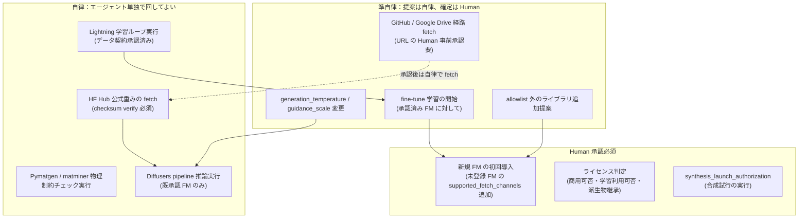
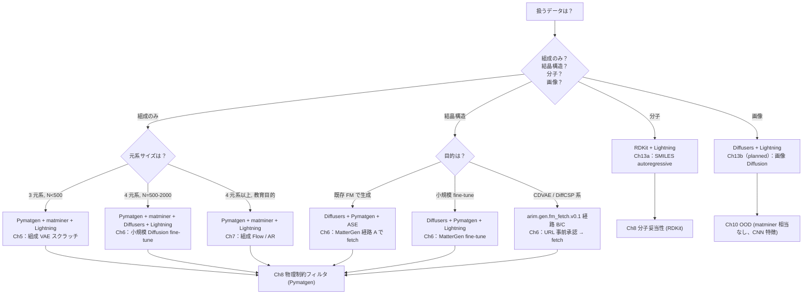

# 第3章 生成モデルライブラリ地図 — Agentic 使い分け

> **本章の使い方**
> - **vol-01〜05 完読者・vol-03 完読必須**：材料 Foundation Model（CDVAE / DiffCSP / MatterGen）は vol-03 §11 で **予測入力（surrogate）** として扱われました。本章は同じ FM 群を **生成器そのもの** として再登場させ、**配布経路の非対称性**（HF Hub 公式 / GitHub 著者配布 / Google Drive 直リンクの 3 経路）という vol-03 では焦点化しなかった論点を扱います
> - **vol-05 完読者**：vol-05 は scikit-learn / GPy / BoTorch 等の Python ライブラリ群が **PyPI / conda-forge に均質に流通** している前提で書かれていました。**vol-06 の FM は流通経路が均質ではありません**——§3.1 と §3.4 でこの差を最初に押さえてください
> - **Ch3 単独で読める最小構成**：§3.4（3 経路 fetch の比較表）→ §3.5（Agentic 自律境界）→ §3.7（決定樹）だけでも、Ch5-15 のライブラリ選択判断に必要な骨格は掴めます
>
> **本章の到達目標**
> - **Diffusers / PyTorch Lightning** の役割分担（前者：Diffusion pipeline 実行、後者：教育目的スクラッチ学習の骨格）を、Ch5-7 の章対応で言える
> - **Pymatgen / matminer / ASE / RDKit** の 4 ライブラリを、扱うデータ型（結晶 / 組成特徴量 / 原子構造 / 分子）と Ch5-13 の使用箇所で対応付けられる
> - 材料 FM の **3 経路 fetch**（HF Hub 公式 / GitHub 著者配布 / Google Drive 直リンク）を、**checksum 検証手段・ライセンス明示レベル・再現性リスク**の 3 軸で比較できる
> - vol-05 との差（**材料 FM 独特の配布経路の非対称性**）を、なぜこの非対称性が **Agentic 自律境界を狭める** のかと共に説明できる
> - **エージェントの自律境界**——「HF Hub 公式重みの fetch は自律 / GitHub・Google Drive 経路は準自律（fetch URL の Human 事前承認要）/ 新規 FM の初回導入は Human 承認」——を Ch1 §1.7 の権限 3 段階と接続して言える
> - **vol-03 FM 連携パターン**——(a) vol-03 FM 特徴を Ch9 surrogate 入力に継承、(b) MatterGen 生成候補を vol-03 FM で物性再スコア——を provenance の並記形式で言える
> - Layer 1 filter（§2.6）は **FM 生成 "後"** に走る前提であり、**FM 学習データ由来の危険物質混入は Layer 2 dual-use review** で捕捉することを説明できる
>
> **本章で扱わないこと**
> - 各 FM の理論的内部構造（CDVAE の等変性、DiffCSP の joint equivariant score matching 等）——第6章と外部論文に譲る
> - `arim.gen.fm_fetch.v0.1` の完全実装（checksum リスト、retry ロジック、Wayback 併用）——付録 B に譲る
> - open dataset ライセンス比較表——付録 C に譲る（本章では概略のみ）
> - `synthesis_launch_authorization` の schema 完全定義——第4章と付録 B に譲る

---

## 3.1 なぜ「ライブラリ地図」が必要か — vol-05 との構造差

vol-05 の BO Skill では、ライブラリ選択は比較的単純な問題でした：**scikit-learn / GPy / BoTorch / Ax はすべて PyPI か conda-forge に均質に流通**し、pin 済みバージョンで再現性が担保できました。エージェントに「BoTorch 最新版を fetch して」と依頼すれば、**checksum・署名・依存解決すべてが `pip` / `conda` に任せられました**。

**vol-06 は同じ仕組みで書けません**。理由は 2 つあります。

1. **生成モデル汎用フレームワーク層は vol-05 と同じ流通経路**（Diffusers / PyTorch Lightning は HF Hub と PyPI）で扱えます
2. **材料 Foundation Model 層は流通経路が非対称**——MatterGen だけが HF Hub 公式配布、CDVAE と DiffCSP は GitHub README + 著者配布リンク経由。同一世代の SOTA FM が **3 種類の異なる流通経路**に散らばっています

エージェントに fetch を丸投げすると、次の 3 リスクが同時発生します。

| リスク | 具体例 | 影響 |
|---|---|---|
| **checksum なし fetch** | Google Drive の直リンクを `wget` で取り、SHA256 検証を skip | 重みがサイレント差し替えされていても検知不能 |
| **ライセンス見落とし** | GitHub README の License 節をエージェントが読まずに商用利用 | 派生物のライセンス継承違反 |
| **FM 学習データの外挿域を無視** | MatterGen が Materials Project 由来重み → ARIM 独自組成系で生成 → 分布外候補 | Ch1 §1.5 の hallucination が構造的に発生 |

Ch3 の目的は、これらのリスクを **Skill 契約と Agentic 自律境界** に落とし込む前段として、**ライブラリと FM の位置づけを 1 枚の地図で示す** ことです。

> [!IMPORTANT]
> **vol-05 との差の理由を明示**：vol-05 §7 のライブラリ選択議論は「BoTorch vs Ax vs 自作」という **均質流通の同一層内での比較** でした。vol-06 の本章は **層構造の異なる 2 層（生成汎用 vs 材料 FM）** を横断し、さらに **材料 FM 層内での配布経路の非対称性** を扱います。この非対称性が Agentic 権限段階を狭める（§3.5）——エージェントが GitHub / Google Drive 経路を自律で叩けない——ことが、本章最大の帰結です。

---

## 3.2 生成モデル汎用フレームワーク層（Diffusers / PyTorch Lightning）

材料ドメインに依存しない、生成モデル汎用の 2 フレームワークから見ます。

### Diffusers（Hugging Face）

- **役割**：Diffusion モデルの pipeline 実行フレームワーク。`DDPMPipeline` / `DDIMScheduler` 等を通じて **generation loop を標準化**
- **配布経路**：PyPI（`pip install diffusers`）+ HF Hub のカスタム pipeline
- **本書での主用途**：**Ch6 の結晶 Diffusion**、および `microsoft/mattergen` のカスタム pipeline ロード
- **Agentic 呼出し**：**自律呼出し可**（PyPI pin 済み、HF Hub の公式 pipeline は checksum 検証 API あり）

### PyTorch Lightning

- **役割**：**学習ループ・validation ループ・チェックポイント管理・分散対応** の骨格。生成モデルのスクラッチ学習で "boilerplate を書かない" ためのフレームワーク
- **配布経路**：PyPI（`pip install pytorch-lightning`）
- **本書での主用途**：**Ch5 の組成 VAE（教育目的スクラッチ）** / **Ch6 の小規模結晶 Diffusion fine-tune** / **Ch7 の Flow・AR 学習**
- **Agentic 呼出し**：**自律呼出し可**（学習実行は §3.5 の準自律：Ch4 の学習権限ゲートと連動）

### 使い分け表

| 場面 | Diffusers | PyTorch Lightning | Agentic 権限 |
|---|---|---|---|
| **Ch5 組成 VAE スクラッチ学習** | — | ✅ 主軸 | 自律（学習）／準自律（重み保存承認） |
| **Ch6 結晶 Diffusion（既存 MatterGen 活用）** | ✅ 主軸 | — | 自律（推論）／準自律（fine-tune 開始） |
| **Ch6 結晶 Diffusion（小規模 fine-tune）** | ✅ pipeline | ✅ 学習骨格 | 準自律（fine-tune 承認要） |
| **Ch7 Flow / AR 学習** | — | ✅ 主軸 | 自律（学習）／準自律（重み保存承認） |
| **Ch13a 分子 SMILES autoregressive** | — | ✅ 主軸 | 自律（学習） |

> [!NOTE]
> Diffusers は **"pipeline as artifact"** を採る（scheduler + UNet + config が 1 ディレクトリ）ため、HF Hub からの fetch は **単一 SHA256** で完結します。PyTorch Lightning は **フレームワークのみ**で、学習後の重みは自前で保存・provenance 記録する必要があります（第4章 §4.x の `training_data_provenance` フィールド）。

---

## 3.3 材料ドメインライブラリ層（Pymatgen / matminer / ASE / RDKit）

材料生成モデルの入出力・後処理を担う 4 ライブラリを、扱うデータ型と使用章で対応付けます。

> [!NOTE]
> **ASE の追加理由**：本書 outline（L141）の当初 5 ライブラリ列挙（Diffusers / Lightning / Pymatgen / RDKit / matminer）に対し、本章では **ASE** を追加して 6 ライブラリ体制としています。Ch6 の結晶 Diffusion 後処理（生成された原子座標の格子変形・簡易 relaxation）および Ch8 の物理制約フィルタでの原子構造操作（対称性を保った座標調整）で ASE の参照が必須になるためで、本書 canonical に含めます。

### 4 ライブラリの責務分担

| ライブラリ | 主データ型 | 主機能 | 本書での使用箇所 |
|---|---|---|---|
| **Pymatgen** | 結晶構造・組成 | 物理制約チェック（電荷中性・化学量論・酸化数）、CIF I/O、対称性解析 | **Ch8**（物理制約フィルタ）、Ch6（結晶生成後処理）、Ch10（OOD 特徴量） |
| **matminer** | 組成 → 特徴量 | Magpie descriptor 等、組成から数百次元の物理化学特徴量 | **Ch8/Ch9**（surrogate 入力）、Ch10（Mahalanobis 特徴空間） |
| **ASE** | 原子構造 | 原子座標操作、格子変形、簡易 optimizer との interface | Ch6（結晶 Diffusion 後処理）、Ch8（構造 relaxation の骨格） |
| **RDKit** | 分子構造 | SMILES ↔ 分子オブジェクト、化学妥当性判定、分子 descriptor | **Ch13a**（分子 VAE / autoregressive） |

### ライブラリ許可リスト（config 例）

Skill 契約側でライブラリ依存を明示し、**エージェントが未申告のライブラリを勝手に import しない** ことを担保します。次は Ch4 で完全定義される Skill config の抜粋です（YAML block 1）。

```yaml
skill:
  id: "arim.gen.library_allowlist.v0.1"
  version: "v0.1"
# 本 Skill config は「本書 vol-06 のどの Skill が、どのライブラリを、どの範囲で使ってよいか」の宣言。
# エージェントは allowlist 外のライブラリを import してはならない（Ch14 の失敗パターン）。
library_allowlist:
  generative_framework_layer:
    - name: "diffusers"
      version_pin: ">=0.27,<0.30"
      allowed_operations: ["pipeline_load", "generation_inference", "scheduler_config"]
      forbidden_operations: ["upload_to_hub", "network_call_beyond_hub"]
    - name: "pytorch-lightning"
      version_pin: ">=2.2,<2.5"
      allowed_operations: ["trainer_fit", "checkpoint_save", "validation_loop"]
      forbidden_operations: ["remote_logger_without_consent"]
  materials_domain_layer:
    - name: "pymatgen"
      version_pin: ">=2024.5,<2027"
      allowed_operations: ["structure_io", "composition_validation", "symmetry_analysis"]
    - name: "matminer"
      version_pin: ">=0.9,<1.1"
      allowed_operations: ["featurizer_apply"]
      forbidden_operations: ["citrination_api_call_without_consent"]
    - name: "ase"
      version_pin: ">=3.22,<3.25"
      allowed_operations: ["atoms_io", "cell_manipulation"]
    - name: "rdkit"
      version_pin: ">=2024.3,<2026"
      allowed_operations: ["smiles_parse", "mol_validation", "descriptor_calc"]
optional_layer:
  # Ch6 結晶グラフ拡張節でのみ許可（それ以外の Skill では forbidden）
  - name: "dgl"
    scope_restricted_to: ["arim.gen.crystal_graph.*"]
  - name: "torch-geometric"
    scope_restricted_to: ["arim.gen.crystal_graph.*"]
provenance:
  # allowlist 判定は Ch4 で package_versions（5 必須フィールドの 1 つ）と突合される
  event_hash: "sha256:0000000000000000000000000000000000000000000000000000000000000000"
  generated_at: "2026-07-07T11:49:55+09:00"
```

> [!TIP]
> `library_allowlist` は Ch1 §1.6 の provenance 13 field 群には含まれませんが、**`package_versions`（vol-01 由来の 5 必須フィールドの 1 つ）と組で運用**します。allowlist が「使ってよいライブラリの宣言」、`package_versions` が「実際に使われたライブラリと版数の記録」——両者の整合を Ch4 の Skill 契約テンプレートで検証します。

### Ch5-13 での使用マップ

| 章 | 主データ | Pymatgen | matminer | ASE | RDKit |
|:-:|---|:-:|:-:|:-:|:-:|
| Ch5（組成 VAE） | 組成 | ✅ 出力検証 | ✅ 特徴量 | — | — |
| Ch6（結晶 Diffusion） | 結晶構造 | ✅ CIF I/O | — | ✅ 座標後処理 | — |
| Ch7（Flow / AR） | 組成 | ✅ | ✅ | — | — |
| Ch8（物理制約フィルタ） | 組成・結晶 | ✅ **主軸** | — | ✅ | — |
| Ch9（DFT proxy） | 組成 → 物性 | — | ✅ **主軸** | — | — |
| Ch10（OOD detection） | 組成特徴 | — | ✅ | — | — |
| Ch11（surrogate ランキング） | — | — | — | — | — |
| Ch13a（分子生成） | 分子 SMILES | — | — | — | ✅ **主軸** |

---

## 3.4 材料 Foundation Model の 3 経路 fetch

vol-06 のライブラリ地図で **最も特殊**なのがこの層です。同じく "SOTA 材料生成 FM" と括られる CDVAE / DiffCSP / MatterGen が、**3 種類の異なる流通経路**に散らばっています。

### 3 経路の比較表

| 経路 | 代表 FM | 配布元 | checksum 検証手段 | ライセンス明示レベル | 再現性リスク |
|---|---|---|---|---|---|
| **A: HF Hub 公式** | `microsoft/mattergen` | Hugging Face Hub | ✅ HF Hub API が SHA256 提供 | ✅ HF Hub の `license` メタデータ | **低**（バージョン tag pinning 可） |
| **B: GitHub README + 著者配布リンク** | `txie-93/cdvae` | GitHub リポジトリ + 著者提供 URL | ⚠️ README に手動記載（ないことも） | ⚠️ リポジトリ LICENSE ファイル参照要 | **中**（配布 URL が失効する可能性） |
| **C: Google Drive 直リンク** | `jiaor17/DiffCSP` の重み | 著者の Google Drive | ❌ Drive UI では SHA256 提供なし（README 記載に依存） | ⚠️ Drive にはメタデータなし、GitHub 側で参照 | **高**（Drive 側で削除・差替え・共有権限変更のリスク） |

### 本書の方針：checksum 検証つき fetch スクリプト提供

3 経路すべてに対応する fetch スクリプト（`scripts/fetch_fm.py`、付録 B で完全実装）を本書リポジトリで配布します。エージェントは **本スクリプト経由でのみ FM を取得できる**設計です（§3.5 の Skill 契約）。

fetch スクリプトの Skill 側 wrapper 抜粋（YAML block 2）：

```yaml
skill:
  id: "arim.gen.fm_fetch.v0.1"
  version: "v0.1"
# 本 Skill は 3 経路すべての FM fetch を単一の interface で扱う。
# 呼出し例：agent が "MatterGen v1.0 の重みが欲しい" と要求 → 本 Skill が 経路 A で fetch。
supported_fetch_channels:
  - channel: "hf_hub_official"
    example_fm: "microsoft/mattergen"
    checksum_verification: "hf_hub_api_sha256"
    license_check: "hf_hub_metadata_license_field"
    agentic_autonomy: "autonomous"      # §3.5 で自律
  - channel: "github_author_link"
    example_fm: "txie-93/cdvae"
    checksum_verification: "readme_declared_sha256_or_reject"
    license_check: "github_license_file_parse"
    agentic_autonomy: "semi_autonomous"  # §3.5 で準自律（Human から fetch URL 事前承認）
  - channel: "google_drive_direct"
    example_fm: "jiaor17/DiffCSP weights"
    checksum_verification: "readme_declared_sha256_or_reject"
    license_check: "github_license_file_parse"  # Drive にメタなし、GitHub 側参照
    agentic_autonomy: "semi_autonomous"  # §3.5 で準自律
fetch_contract:
  # 全経路共通：SHA256 が事前宣言と一致しなければ即座に reject
  checksum_mismatch_action: "abort_and_alert_human"
  # 経路 B/C ではエージェントが Human から URL 承認を得ずに fetch してはならない
  url_approval_required_for_channels:
    - "github_author_link"
    - "google_drive_direct"
  # 新規 FM の初回導入は経路によらず Human 承認
  first_time_introduction_action: "human_approval_required"
disallowed_operations:
  - "wget_without_checksum"
  - "skip_license_check"
  - "override_url_approval_gate"
  - "use_unknown_channel"   # supported_fetch_channels 外の経路
provenance:
  # Ch1 §1.6 の 13 fields のうち、本 Skill が記録するのは以下：
  # - generative_model_family（fetch した FM の family）
  # - training_data_provenance（FM の学習データ来歴、fetch 時に読み取り）
  # - inverse_design_authorization（fetch 権限 3 段階の記録）
  # - safety_screening_passed は本 Skill では立てない（生成後に別 Skill で立てる）
  # - dual_use_review_completed は本 Skill では立てない（Layer 2 で立てる）
  event_hash: "sha256:0000000000000000000000000000000000000000000000000000000000000000"
  generated_at: "2026-07-07T11:49:55+09:00"
```

> [!WARNING]
> **経路 C（Google Drive）はもっとも脆弱です**。Drive の共有権限は著者の判断で変更・削除可能で、`wget` の応答が突然 HTML ログイン画面になることがあります。本書は「経路 C で取得した重みは **必ずローカル SHA256 をリポジトリ内 `references/fm_checksums.yaml` で管理**」を規約とします（付録 B）。エージェントが「Drive リンクを直接叩いた」ことは Ch14 の失敗パターン taxonomy に登録されます。

> [!NOTE]
> **`inverse_design_authorization` の値表記について**：本 YAML の `agentic_autonomy` および Ch1 §1.6 で予告した `inverse_design_authorization` field の値は、canonical には英語 enum（`autonomous` / `semi_autonomous` / `human_approval_required`）を機械値として使用します。Ch1 §1.7 の日本語ラベル「自律 / 準自律 / Human 承認」は表示用（読者向けの説明表記）であり、Skill 出力・provenance には英語 enum を用いる規約です（Ch4 で完全定義）。

### vol-05 との差の理由（本章で最も強調すべき点）

vol-05 の全ライブラリは PyPI / conda-forge / HF Hub のいずれかに **均質に**流通していました。**vol-06 で経路 B/C が存在する理由**は、材料 FM が (i) 研究者個人の GitHub 中心の文化、(ii) HF Hub 移行に必要な作業（model card 整備・ライセンス明示・checksum 提供）が個人研究者コストで賄えない、という **エコシステム側の構造要因**にあります。**技術的な選択ではなく、経路の非対称性が現実**——だから Skill 契約は 3 経路すべてに対応せざるを得ません。

---

## 3.5 Agentic 自律境界 — 何をエージェントに任せ、何を Human に返すか

Ch1 §1.7 は **pipeline stage 軸**（候補生成 → filter → screening → top-k → 合成）で権限 3 段階を定義しました。本節はそれに直交する **library/FM 呼出し軸** で独立に 3 段階を再定義します。両軸が交差する Skill 呼出しでは、**より制約の強い段階が支配**します（例：pipeline stage 軸で準自律・library 呼出し軸で Human 承認 → 実効は Human 承認）。

### 権限境界の Mermaid



### 3 段階の対応表

| 権限段階 | 具体アクション | 対応 Skill 契約フィールド | vol-03/05 との対応 |
|---|---|---|---|
| **自律** | HF Hub 公式重み fetch（checksum verify）／Pymatgen 物理制約 rule 実行／Diffusers 推論 | `filter_rules_applied` / `screening_model_family` / `generative_model_family` | vol-03 §11 の FM 推論、vol-05 §7 の surrogate 学習 |
| **準自律** | GitHub / Drive 経路 fetch（URL 事前承認）／`generation_temperature` 変更／fine-tune 開始 | `inverse_design_authorization`（値：`semi_autonomous`）／`generation_temperature`（変更履歴） | vol-05 の次候補提示 |
| **Human 承認** | 新規 FM 初回導入／ライセンス判定／**`synthesis_launch_authorization`** | `inverse_design_authorization`（値：`human_approval_required`）／**`synthesis_launch_authorization`** | vol-05 の `experiment_launch_authorization` の合成版 |

### なぜ経路 B/C が「準自律」であって「自律」ではないか

- **配布 URL の失効可能性**：GitHub README のリンクが著者判断で変更・削除される。「同じ URL に同じ重み」は保証されない
- **checksum の宣言レベルが README 依存**：エージェントが README を読み違えると、checksum なしで fetch → サイレント差替えを検知不能
- **ライセンス条項の埋没**：LICENSE ファイルの位置・命名がリポジトリごとに違う。エージェントの自然言語 parse では読み落としリスク

これらは Human が **fetch URL を事前承認する**（＝現時点でのその URL の妥当性を人間の目で確認する）ことで初めて許容されます。**技術的な安全性の問題ではなく、"配布経路が信頼境界の外にある" という運用上の事実**が準自律を強制します。

> [!IMPORTANT]
> **`inverse_design_authorization` の運用**：Ch1 §1.6 でこのフィールドを「自律 / 準自律 / Human 承認」の 3 値と予告しました。本章の帰結として、値は **Skill 呼出しごとに変わりうる**——同じ `arim.gen.fm_fetch.v0.1` Skill でも、**呼出す FM の配布経路で自律度が変わる**。この動的な権限決定は Ch4 の `authorization_gates`（vol-04 §4.6.2 canonical shape を継承）と接続されます。

---

## 3.6 vol-03 材料 FM との連携

vol-03 §11 は材料 FM を **「学習済み重みを予測入力（surrogate）として利用する立場」**で扱いました。vol-06 は同じ FM 群を **「生成器そのものとして利用する立場」**に置き換えます。両者は排他ではなく、**同一プロジェクトで併用可能**です。

### 2 つの連携パターン

| パターン | 説明 | vol-03 側の役割 | vol-06 側の役割 |
|---|---|---|---|
| **(a) 継承**：vol-03 FM 特徴を Ch9 surrogate 入力に | vol-03 §11 で使った FM の中間層 embedding を、vol-06 Ch9 の DFT proxy 学習の入力特徴として再利用 | 特徴抽出器（frozen） | proxy 学習の入力 |
| **(b) 新規**：MatterGen 生成候補を vol-03 FM で物性再スコア | vol-06 Ch6 の MatterGen が生成した候補結晶を、vol-03 §11 の FM で物性予測（Ch11 の surrogate ランキングの一部） | 物性予測器 | 生成器 |

### provenance 継承の並記形式

パターン (b) では **2 つの FM が同時に登場**します。vol-03 の `foundation_model_id` と vol-06 の `generative_model_family` を **並記**して provenance に残します（YAML block 3）：

> [!NOTE]
> **`generative_model_id` の位置づけ**：本 YAML の `generative_model_id` は Ch1 §1.6 で予告した provenance 13 field には含まれません。Ch4 で `generative_model_family` の下位詳細（family + id + version の 3 段構成）として canonical 定義される予定の先取り記載です。本章では並記形式を示すために先行して使用しますが、schema 完全定義は Ch4 に譲ります。

```yaml
skill:
  id: "arim.gen.candidate_rescore.v0.1"
  version: "v0.1"
# 本 Skill は MatterGen 生成候補を vol-03 FM で再スコアする（パターン b）。
# 2 つの FM が同時に登場するため、provenance は両方を明示的に並記する。
generative_model_family: "diffusion"           # vol-06 側：生成器の family
generative_model_id: "microsoft/mattergen"     # vol-06 側：具体 FM
foundation_model_id: "vol03_ch11_material_fm_v1.2"  # vol-03 側：予測用 FM の識別子（vol-03 §11 の provenance と一致）
training_data_provenance:
  # 両 FM の学習データ来歴を並記
  - source: "materials_project_snapshot_2024_11"
    role: "generative_pretrain"
    for_model: "microsoft/mattergen"
  - source: "vol03_arim_augmented_2025_09"
    role: "predictive_finetune"
    for_model: "vol03_ch11_material_fm_v1.2"
condition_variables_declared:
  - name: "target_band_gap_eV"
    range: [1.0, 3.5]
  - name: "target_formation_energy_meV_per_atom"
    range: [-2000, 0]
top_k_returned: 10
inverse_design_authorization: "semi_autonomous"
# hallucination gate は本 Skill 内では走らない（Ch11 で別 Skill として走る）
# Ch1 §1.5 の hallucinatory_composition_detection field は「検知結果 (composite score + threshold)」を持つ field であり、
# 本 Skill のような delegated pointer 用途では別 field 名（*_delegated_to）で表現する。
# なお命名規約 *_delegated_to の canonical 化は Ch4 で確定予定（本節が Ch3 発の先取り）。
hallucinatory_composition_detection_delegated_to:
  skill: "arim.gen.ood_detection.v0.1"
  invocation_stage: "before_surrogate_ranking"
provenance:
  event_hash: "sha256:0000000000000000000000000000000000000000000000000000000000000000"
  generated_at: "2026-07-07T11:49:55+09:00"
```

> [!NOTE]
> **`foundation_model_id` は vol-03 § 11 の provenance フィールド**、`generative_model_family` / `generative_model_id` は vol-06 の新規フィールド（Ch1 §1.6 で予告）。**2 つを混同すると provenance の意味論が壊れます**——同じ "FM" でも役割（予測 vs 生成）が違えば別フィールドで記録する、が本書の規約です。

---

## 3.7 ライブラリ使い分け決定樹

読者が実際のプロジェクトで **何のライブラリを使うか** を判断できる決定樹を示します。



**運用の要点**：

- **エージェントが決定樹を辿る際も §3.5 の権限境界が生きる**——例えば「S3：CDVAE fetch」に到達したら、エージェントは **fetch URL の Human 事前承認を求める** Skill 呼出しになります
- **決定樹の分岐点で allowlist 外のライブラリが必要になったら、§3.3 の library_allowlist 変更が Human 承認必須**（§3.5 の準自律 B4）

---

## 3.8 Safety governance との接点

Ch1 §1.5 と Ch2 §2.6 で Safety 3-layer を導入しました。本章は **FM 側の特殊事情** を追加します。

### Layer 1 filter は FM 生成 "後" に走る

**Layer 1 filter（§2.6）は本章の FM fetch 前に Skill レベルで走る前提ではありません**。FM は組成・構造を生成する側であり、Layer 1 filter は **生成後の候補**に適用します（Ch2 §2.7 canonical pipeline の第 2 ステップ）。

Ch3 が新たに導入するのは **FM fetch という前段 1 ステップ**のみです。以降のパイプライン全体は Ch2 §2.7 canonical の枠内に収まります：

```
FM fetch (Ch3 追加前段, arim.gen.fm_fetch.v0.1)
   ↓
[ここから Ch2 §2.7 canonical pipeline]
G (Ch6 生成)
 → SF (Ch2 §2.6/Ch4/Ch15/付録C safety_screening, arim.gen.safety_screening.v0.1) ← Layer 1
 → F  (Ch8 物理制約フィルタ)
 → H  (Ch5/Ch10 hallucinatory_composition_detection)
 → S1 (Ch9 surrogate 1)
 → S2 (Ch11 surrogate 2 / ランキング)
 → T  (top-k 選定)
 → D  (dual-use review, Layer 2)
 → P  (facility policy review, Layer 3)
 → A  (合成試行, synthesis_launch_authorization)
```

すなわち Ch3 の責務は「Ch2 canonical pipeline の **先頭に 1 ステップ（FM fetch）を挿入する**」ことに留まり、SF 以降は Ch2 canonical をそのまま踏襲します。Layer 1 は SF（safety_screening）、物理制約は F（Ch8 固有ステップで Layer 1 とは別）、hallucination は H で扱う——という Ch2 の役割分担を Ch3 側で歪めません。

### FM 学習データ由来の危険物質は Layer 2 で捕捉

FM の学習データに **危険物質（爆発性・毒性・dual-use 該当）** が含まれている可能性は、Layer 1 filter では原理的に防げません——filter は生成候補にかかるのに対し、学習データ由来のバイアスは **モデル重みの中に埋め込まれる**からです。

これは **Layer 2 dual-use review の責務**として捕捉します——**FM の data card / model card / 論文** をレビュー担当が確認し、`dual_use_review_completed` に reviewer_role とレビュー結果を記録します（Ch1 §1.6、Ch4 完全定義）。

### FM ごとの学習データ由来リスク notes

| FM | 主学習データ | Layer 2 review で確認すべき点 |
|---|---|---|
| **MatterGen** | Materials Project 由来（Alex-20 / MP-20 派生） | Materials Project の DFT 計算対象は主に **安定・準安定な既知構造**——dual-use 該当元素は明示的に除外されていない。生成候補の元素セットに **U/Pu/軍事転用可能元素**が含まれないか、data card から個別確認 |
| **CDVAE** | Materials Project / Perov-5 / Carbon-24 | Perov-5 / Carbon-24 は特定材料系に絞られる。ARIM 独自組成系に fine-tune した場合、**元 FM の学習データ由来バイアス** が残存 |
| **DiffCSP** | Materials Project / MP-20 | MatterGen と同様。**論文の Related Work にライセンス条項が埋め込まれている**ケースがあり、reviewer は論文本文まで読む |

> [!IMPORTANT]
> **Layer 2 review は "初回導入時" と "FM バージョン更新時" に必須**です（§3.5 の Human 承認 C1）。エージェントが新規 FM を fetch する際、**data card / model card / 論文の該当セクションを Skill 出力に含める** ことを Ch4 の Skill 契約で強制します——「reviewer が読むべき材料が Skill 出力に揃っている」状態を保つのが本規約の帰結です。

---

## 3.9 章末チェックリスト

本章の到達目標を、以下 8 項目で自己検証してください。**6 項目以上「はい」で第4章へ進めます**。

- [ ] **Diffusers（pipeline 実行）と PyTorch Lightning（学習骨格）** の役割分担を、Ch5-7 のどの章でどちらを主軸にするかと対応付けて言える
- [ ] **Pymatgen / matminer / ASE / RDKit** の 4 ライブラリを、扱うデータ型（結晶 / 特徴量 / 原子構造 / 分子）と Ch5-13 の使用箇所で対応付けられる
- [ ] 材料 FM の **3 経路 fetch**（A: HF Hub 公式 / B: GitHub 著者配布 / C: Google Drive 直リンク）を、checksum 検証・ライセンス明示・再現性リスクの 3 軸で比較できる
- [ ] **vol-05 との差**（材料 FM 独特の配布経路の非対称性）を、なぜこの非対称性が Agentic 権限段階を狭めるかと共に説明できる
- [ ] **Agentic 自律境界**——HF Hub 公式は自律、GitHub / Drive は準自律（URL 事前承認）、新規 FM 初回導入・ライセンス判定・`synthesis_launch_authorization` は Human 承認——を Ch1 §1.7 と接続して言える
- [ ] **vol-03 FM 連携**の (a) 継承 / (b) 新規 の 2 パターンを、`foundation_model_id`（vol-03）と `generative_model_family`（vol-06）の並記形式と共に言える
- [ ] **Layer 1 filter は FM 生成 "後" に走る**こと、**FM 学習データ由来の危険物質は Layer 2 dual-use review で捕捉**することを、なぜ Layer 1 では捕まえられないかの理由と共に説明できる
- [ ] §3.7 の **決定樹** を、自分の研究テーマのデータ（組成 / 結晶 / 分子 / 画像）で辿り、必要ライブラリと Ch 番号のリストを作れる

> [!TIP]
> 「8 項目のうち 4 つ以下」なら、§3.4（3 経路 fetch）と §3.5（Agentic 自律境界）を再読してください。この 2 節は Ch4 の Skill 契約テンプレートと Ch6 の MatterGen fetch 実装の直接前提です。

---

## 3.10 参考資料

### 本書内クロスリファレンス

- **vol-06 §1.5〜1.7**：`hallucinatory_composition_detection` operational 定義、provenance 13 field 予告、Agentic 権限 3 段階
- **vol-06 §2.6〜2.7**：Safety governance 3-layer、canonical pipeline（本章 §3.8 で FM 側の特殊事情を追加）
- **vol-06 §4**（planned）：`synthesis_launch_authorization` 完全定義、`authorization_gates` 継承（vol-04 §4.6.2 canonical shape）、library_allowlist と `package_versions` の突合
- **vol-06 §5**（planned）：組成 VAE Skill、Pymatgen / matminer / Lightning の実装
- **vol-06 §6**（planned）：結晶 Diffusion Skill、MatterGen 経路 A fetch、CDVAE / DiffCSP 経路 B/C fetch
- **vol-06 §7**（planned）：Flow / AR Skill、Lightning 学習骨格
- **vol-06 §8**（planned）：Pymatgen 物理制約フィルタ Skill
- **vol-06 §9**（planned）：DFT proxy / classifier chain、matminer 特徴量
- **vol-06 §10**（planned）：OOD detection、matminer 特徴空間での Mahalanobis
- **vol-06 §11**（planned）：surrogate ランキング、vol-03 FM 再スコアの Ch11 側実装
- **vol-06 §13a**（planned）：分子 SMILES autoregressive、RDKit 妥当性判定
- **vol-06 §14**（planned）：Ch3 で言及した失敗パターン（wget without checksum、URL 承認の skip、allowlist 外 import）の taxonomy 登録
- **vol-06 §15**（planned）：組織展開、Safety governance 3-layer の完全展開
- **vol-06 付録 A**（planned）：provenance フィールド完全定義（本章 §3.6 の並記形式含む）
- **vol-06 付録 B**（planned）：`arim.gen.fm_fetch.v0.1` 完全実装、checksum リスト、Wayback 併用フォールバック
- **vol-06 付録 C**（planned）：open dataset ライセンス比較表、FM data card レビューテンプレート
- **vol-06 付録 D**（planned）：vol-04/05 未読者のための最小知識

- **vol-03 §11**：材料 Foundation Model の予測入力（surrogate）としての利用、`foundation_model_id` provenance
- **vol-03 §12**：自己教師あり学習、潜在空間の哲学（vol-06 生成器と共通）
- **vol-04 §4.6.2**：L1-L4 `authorization_gates` の発火条件・承認者（canonical shape は §4.9 template ⑧、vol-06 §3.5 の権限段階が継承）
- **vol-04 §4.9**：`authorization_gates` の完全 template
- **vol-05 §5.6**：`hallucinated_recommendation_detection` 宣言レベル（vol-06 §1.5 の parallel な軸差し替え元）
- **vol-05 §7.7**：`hallucinated_recommendation_detection` operational 3 判定 OR 合成（vol-06 §1.5 の重み付き和への差し替え元）

### 外部参考文献

**フレームワーク**

- Diffusers（Hugging Face）：https://huggingface.co/docs/diffusers/
- PyTorch Lightning：https://lightning.ai/

**材料ドメインライブラリ**

- Pymatgen：https://pymatgen.org/
- matminer：https://hackingmaterials.lbl.gov/matminer/
- ASE：https://wiki.fysik.dtu.dk/ase/
- RDKit：https://www.rdkit.org/

**材料 Foundation Model（3 経路の実例）**

- **経路 A**：MatterGen — Zeni et al. "MatterGen: A Generative Model for Inorganic Materials Design"（2023）、HF Hub `microsoft/mattergen`、GitHub `microsoft/mattergen`
- **経路 B**：CDVAE — Xie, Fu, Ganea, Barzilay & Jaakkola "Crystal Diffusion Variational Autoencoder for Periodic Material Generation"（ICLR 2022）、GitHub `txie-93/cdvae`（README 経由で著者配布リンク参照）
- **経路 C**：DiffCSP — Jiao et al. "Crystal Structure Prediction by Joint Equivariant Diffusion"（NeurIPS 2023）、GitHub `jiaor17/DiffCSP`（重みは著者 Google Drive）

**公開データセット**（詳細比較は付録 C）

- Materials Project：https://materialsproject.org/
- OQMD：https://oqmd.org/
- JARVIS-DFT：https://jarvis.nist.gov/
- AFLOW：http://aflowlib.org/

**関連理論**

- Kingma & Welling, "Auto-Encoding Variational Bayes"（ICLR 2014）
- Ho, Jain & Abbeel, "Denoising Diffusion Probabilistic Models"（NeurIPS 2020）

---

**次章予告**（第4章）：**生成 × Agentic Skill の設計原則**——本章で示したライブラリ地図と権限境界を、**`synthesis_launch_authorization` の完全定義**、**`authorization_gates` 継承（vol-04 canonical）**、**Safety governance 3-layer 契約**、**Skill 出力仕様での自然言語禁止**という具体的な Skill 契約テンプレートに落とし込みます。本章 §3.3 の `library_allowlist` と `package_versions`、§3.4 の `arim.gen.fm_fetch.v0.1`、§3.6 の provenance 並記形式が、Ch4 の Skill 契約テンプレートの主要構成要素になります。
