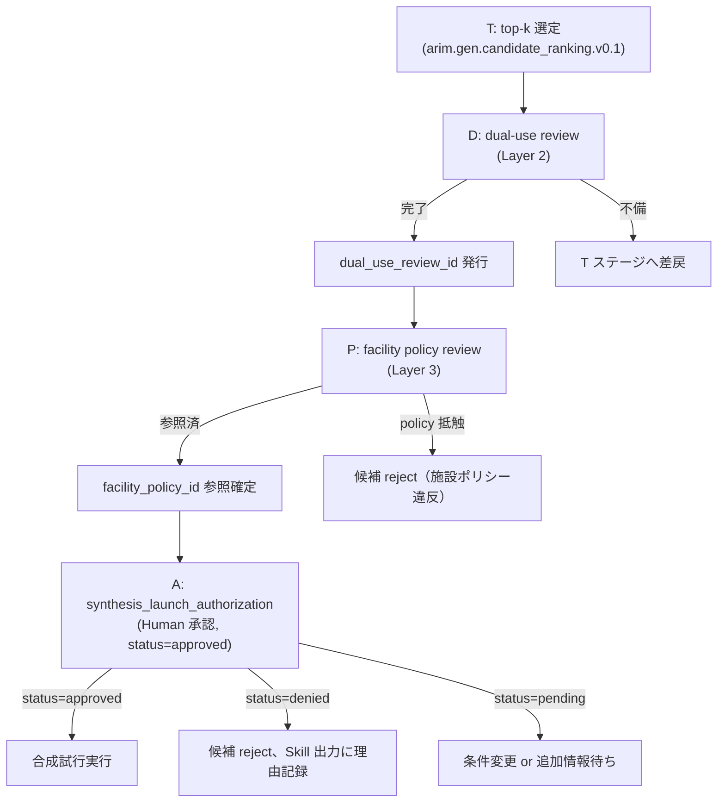
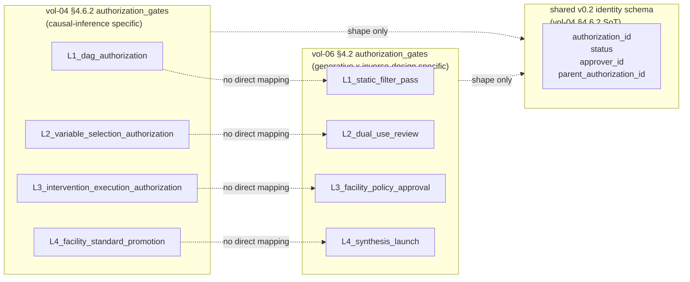

# 第4章 生成 × Agentic Skill の設計原則

> **本章の使い方**
> - **Ch1〜3 の予告を回収する canonical 章**です。Ch1 §1.5 の `hallucinatory_composition_detection` operational 定義、Ch1 §1.6 の 13 provenance fields、Ch1 §1.7 と Ch3 §3.5 の権限段階、Ch2 §2.6 の Safety governance 3-layer、Ch2 §2.7 の canonical pipeline、Ch3 §3.6 の `*_delegated_to` 命名——これらの **完全 schema と契約書レベルの定義を、本章 1 章にすべて集約**します。
> - **Ch5-15 と付録 A**：以降の各章 Skill 契約は本章 §4.2 の template ⑧ を継承します。個別 Skill 章（Ch5-13）は本章の完全定義を **差分のみで参照**します。付録 A は本章のフィールド 1 つずつを更に細分化した schema reference です。
> - **vol-04 §4.6.2 / §4.9 との継承関係**：vol-04 の `authorization_gates` canonical shape（L1-L4）を、vol-06 の Safety 3-layer と synthesis 承認に**上乗せ拡張**します。§4.8 で対応表を示します。
> - **YAML block は全て `yaml.safe_load` で parse 可**：本書の CI で機械検証されます。読者が自プロジェクトに写経する際も、Python 標準の YAML パーサで検査可能です。
>
> **本章の到達目標**
> - **生成 × Agentic Skill 仕様書テンプレート**（§4.2 骨格）を、vol-04 §4.9 template ⑧ + vol-06 の 13 provenance fields + Safety 3-layer + 自然言語禁止契約 + pipeline anchor の統合体として書ける
> - **13 provenance fields**（Ch1 §1.6 予告）を、`generative_model_family = {family, id, version}` 3-tier canonical まで含めて schema 定義できる
> - **`synthesis_launch_authorization`** を、vol-04 §4.6.2 の L1-L4 の**どれと対応付き、どれを上乗せするか**を明示して書ける
> - **`hallucinatory_composition_detection`** を **config 態 / result 態 / delegated pointer 態** の 3 態で使い分けられる（Ch3 §3.6 の `*_delegated_to` を canonical 化）
> - **Safety governance 3-layer 契約書**（Ch2 §2.6 予告）を、Layer 1（Skill 静的 filter）/ Layer 2（組織 dual-use review）/ Layer 3（施設ポリシー）の完全 schema と hand-off 規約で書ける
> - **自然言語出力の禁止契約**（Ch2 §2.6 予告）を、禁止フレーズ list と許可フレーズ list、`outputs_disallowed_natural_language` field の canonical shape で運用できる
> - **9 Skill ID canonical**（Part I までに登場した `arim.gen.*.v0.1`）を、Ch2 §2.7 canonical pipeline の SF/F/H/S1/S2/T/D/P/A ステージへ anchor できる
>
> **本章で扱わないこと**
> - 各 Skill の実装コード（Ch5-13 の個別章、付録 A）
> - `arim.gen.fm_fetch.v0.1` の checksum 検証スクリプト（付録 B）
> - 危険物質 filter list の具体内容（付録 C）
> - MCP handler での provenance 検証実装（付録 B）
> - 施設ポリシー文書（`arim.facility.policy.v1`）の全文（付録 C テンプレート）

---

## 4.1 なぜ Ch4 が canonical template 章か

Part I（Ch1〜3）は **予告と概念導入**の章群でした。Ch1 §1.6 では 13 provenance fields の **一覧のみ**を予告し、完全 schema は「Ch4」と明記して先送りしました。Ch2 §2.4 では `hallucinatory_composition_detection` の **合成規則**（$0.4 z_M + 0.4 z_R + 0.2 v > 0.75$）を確定させましたが、**config 態と result 態の schema 完全定義**は Ch4 に委ねました。Ch3 §3.6 では **`*_delegated_to` pattern** を導入しましたが、その **canonical 化**は Ch4 に委ねました。

本章の役割は **これらすべての先送りを 1 章で回収する**ことです：

| Part I の予告 | 該当章節 | Ch4 での回収先 |
|---|---|---|
| 13 provenance fields の完全一覧のみ提示 | Ch1 §1.6 | §4.3（完全 schema） |
| `hallucinatory_composition_detection` operational 定義（3 判定 + 重み付き和） | Ch1 §1.5 / Ch2 §2.4 | §4.5（config/result/delegated 3 態） |
| Safety governance 3-layer の存在宣言 | Ch1 §1.5 / Ch2 §2.6 | §4.6（契約書レベル完全展開） |
| `synthesis_launch_authorization` の権限最上位フィールド | Ch1 §1.7 | §4.4（完全 schema + Mermaid） |
| vol-04 §4.6.2 L1-L4 との継承 | Ch3 §3.5 §3.10 | §4.8（対応表） |
| `*_delegated_to` pattern（`generative_model_id` の 3-tier 含む） | Ch3 §3.6 | §4.5 delegated 態 + §4.3 3-tier |
| Skill 出力での自然言語禁止 | Ch1 §1.7 / Ch2 §2.5 §2.6 | §4.7（禁止 / 許可フレーズ list） |
| canonical pipeline SF/F/H/S1/S2/T/D/P/A | Ch2 §2.7 | §4.9（9 Skill ID の anchor 表） |
| `inverse_design_authorization` の enum | Ch1 §1.6 §1.7 | §4.4（enum canonical + JP labels） |

Ch5 以降の Skill 章は、**本章の完全定義を差分のみで参照**します。すなわち Ch5 の組成 VAE Skill は「`hallucinatory_composition_detection` の config 態を実装、result 態を返す」と書くだけで、schema 詳細は本章 §4.5 に譲ります。**単一 canonical schema を Ch4 に固定することで、Ch5-15 と付録 A の記述量を大幅に圧縮**する——これが本章の設計判断です。

> [!IMPORTANT]
> 本章の YAML block は **すべての Ch5-15 章 Skill 契約の親テンプレート**です。個別 Skill が本章の shape に **反しない拡張**（追加フィールド）は許容されますが、**本章で `required` と宣言されたフィールドの削除・型変更・意味論変更**は禁止です。Ch14 の失敗パターン taxonomy は「本章 canonical からの逸脱」を系統的に登録します。

---

## 4.2 生成 × Agentic Skill 仕様書テンプレート（骨格）

本節は vol-04 §4.9 の Skill template ⑧ を **vol-06 の生成 × 逆設計拡張**まで完全に埋めた骨格を示します。以降 §4.3〜§4.7 は本 template の各フィールドの **完全定義**です。

**YAML block 1 — 生成 × Agentic Skill 仕様書テンプレート（骨格）**

```yaml
# =============================================================
# arim.gen.<skill_type>.v0.1 — 生成 × Agentic Skill テンプレート
# 継承関係:
#   - vol-01 provenance 5 必須（input_sha256 / skill_version /
#     run_datetime_utc / package_versions / random_seed）
#   - vol-03 §11 foundation_model_id（予測用 FM の識別子）
#   - vol-04 §4.6.2 / §4.9 authorization_gates（L1-L4 canonical shape）
#   - vol-06 §4.3 13 provenance fields
#   - vol-06 §4.6 Safety 3-layer
#   - vol-06 §4.7 outputs_disallowed_natural_language
#   - vol-06 §4.9 pipeline_position
# =============================================================
skill:
  id: "arim.gen.<skill_type>.v0.1"
  version: "v0.1"
  description: "生成 × Agentic Skill テンプレート。詳細は Ch4 §4.2 を参照。"

# --- パイプライン内位置（Ch2 §2.7 canonical stage への anchor） ---
pipeline_position:
  stage: "H"                        # G | SF | F | H | S1 | S2 | T | D | P | A | PRE のいずれか
                                    # PRE = pre-pipeline stage（library_allowlist / fm_fetch 等、
                                    # Ch2 §2.7 canonical pipeline の前段で動く Skill 用、§4.9 参照）
  upstream_stages: ["F"]            # 直前ステージ（依存）
  downstream_stages: ["S1"]         # 直後の successor stage のみ（immediate downstream）。
                                    # Safety 関連の全 downstream（SF/F/H）を列挙する場合は
                                    # Ch5 §5.7 の VAE 例（G stage）を参照——G stage の場合は
                                    # SF+F+H 全てへ hand-off するため ["SF","F","H"] と宣言する。

# --- 入力仕様 ---
input_schema:
  # 候補集合 or 単一候補、条件変数など
  candidates:
    type: "list_of_dict"
    required_keys: ["composition", "structure_id"]
  conditions:
    type: "dict"
    schema_ref: "condition_variables_declared"  # §4.3 参照

# --- 出力仕様 ---
output_schema:
  # 生成候補 or フィルタ通過候補 or 判定結果
  candidates_out:
    type: "list_of_dict"
    required_keys: ["composition", "score", "flags"]
  detection_result:
    type: "dict"
    schema_ref: "hallucinatory_composition_detection.result"  # §4.5

# --- 生成 × 逆設計 13 provenance fields（§4.3 完全定義） ---
generative_model_family:
  family: "diffusion"
  id: "microsoft/mattergen"
  version: "1.0.0"
latent_dim: 128
training_data_provenance:
  dataset_id: "materials_project_snapshot_2024_11"
  version: "2024.11"
  sha256: "sha256:0000000000000000000000000000000000000000000000000000000000000000"
  license: "CC-BY-4.0"
condition_variables_declared:
  - name: "target_band_gap_eV"
    range: [1.0, 3.5]
    type: "float"
  - name: "target_formation_energy_meV_per_atom"
    range: [-2000, 0]
    type: "float"
generation_temperature: 1.0
guidance_scale: 3.0
filter_rules_applied:
  - "charge_neutrality"
  - "stoichiometry_integer_multiplier"
  - "oxidation_state_bounds"
screening_model_family:
  family: "megnet"
  id: "materialsvirtuallab/megnet"
  version: "1.3.2"
top_k_returned: 5
inverse_design_authorization: "semi_autonomous"
synthesis_launch_authorization:
  # §4.4 完全定義（Human 承認記録、v0.2 canonical identity schema を vol-04 §4.6.2 から継承）
  authorization_id: "l4_auth_YYYYMMDD_HHMMSS_iter<n>"
  status: "pending"                  # canonical enum: pending | approved | denied | revoked
  approver_id: null                  # canonical regex: ^human:
  approver_id_regex: "^human:"
  parent_authorization_id: "vol-06:L3_facility_policy_approval:<authorization_id>"
  # v0.1 compat + vol-06 独自 field
  reviewer_role: null
  reviewer_id: null
  facility_policy_id: null
  dual_use_review_id: null
  timestamp: null
hallucinatory_composition_detection:
  # §4.5 完全定義（config 態）
  method: "mahalanobis_plus_pca_plus_physical"
  composite_score_threshold: 0.75
safety_screening_passed: false     # §4.6 Layer 1 の通過フラグ、必要条件
dual_use_review_completed: false   # §4.6 Layer 2 の完了フラグ

# --- 権限ゲート（vol-06 独自 canonical、shape のみ vol-04 §4.6.2 v0.2 に整合、§4.8 参照） ---
# NOTE: vol-04 §4.6.2 の L1-L4 は causal-inference specific（DAG/confounder/intervention）で、
#       vol-06 では **継承せず** 、Safety governance 3-layer の実装として vol-06 独自の canonical
#       gate 群を新設する。dict-shape / v0.2 identity schema（authorization_id / status /
#       approver_id）のみ vol-04 §4.6.2 と共通。詳細は §4.8。
authorization_gates:
  L1_static_filter_pass:
    # Layer 1（Skill 静的 filter）通過。発火条件は `safety_screening_passed=true`。
    required_for:
      - safety_screening_passed_becomes_true
    approver_id: "agent:arim.gen.safety_screening.v0.1"   # Layer 1 は自律 Skill が発火
    authorization_id: "l1_auth_YYYYMMDD_HHMMSS_iter<n>"
    status: "pending"                # canonical enum: pending | approved | denied | revoked
    approver_id_regex: "^agent:"     # Layer 1 のみ agent 発火（Human なし）
    parent_authorization_id: null
  L2_dual_use_review:
    # Layer 2（組織 dual-use review）完了。発火条件は `dual_use_review_completed=true`。
    required_for:
      - dual_use_review_completed_becomes_true
    reviewer_role: "organizational_dual_use_committee"
    approver_id: "human:<staff_id>"
    authorization_id: "l2_auth_YYYYMMDD_HHMMSS_iter<n>"
    status: "pending"
    approver_id_regex: "^human:"     # v0.2 canonical（vol-04 §4.6.2 と共通）
    parent_authorization_id: "vol-06:L1_static_filter_pass:<authorization_id>"
  L3_facility_policy_approval:
    # Layer 3（施設ポリシー承認）。`facility_policy_id` の pointer が必須。
    required_for:
      - facility_policy_id_pinned
    reviewer_role: "facility_safety_officer"
    facility_policy_id: "arim.facility.policy.v1"
    approver_id: "human:<staff_id>"
    authorization_id: "l3_auth_YYYYMMDD_HHMMSS_iter<n>"
    status: "pending"
    approver_id_regex: "^human:"
    parent_authorization_id: "vol-06:L2_dual_use_review:<authorization_id>"
  L4_synthesis_launch:
    # 最終合成試行承認（`synthesis_launch_authorization` 本体、§4.4 で完全定義）。
    # A ステージのみ発火、他 stage では required=false。
    required_for:
      - synthesis_launch_authorization
    reviewer_role: "facility_synthesis_lead"
    approver_id: "human:<staff_id>"
    authorization_id: "l4_auth_YYYYMMDD_HHMMSS_iter<n>"
    status: "pending"
    approver_id_regex: "^human:"
    parent_authorization_id: "vol-06:L3_facility_policy_approval:<authorization_id>"

# --- 自然言語出力の禁止契約（§4.7 canonical 10 phrase と完全同期） ---
outputs_disallowed_natural_language:
  - "この候補は安全です"
  - "合成可能です"
  - "危険ではありません"
  - "dual-use ではありません"
  - "safety_screening を通過したので合成可能です"
  - "推奨候補です"
  - "実験を進めてください"
  - "この候補で問題ありません"
  - "合成推奨です"
  - "安全性は確認されています"

# --- provenance 5 必須（vol-01 継承） ---
provenance:
  input_sha256: "sha256:0000000000000000000000000000000000000000000000000000000000000000"
  skill_version: "v0.1"
  run_datetime_utc: "2026-07-07T03:30:22Z"
  package_versions:
    diffusers: "0.31.0"
    torch: "2.4.1"
    pymatgen: "2024.11.13"
  random_seed: 20260707
  event_hash: "sha256:0000000000000000000000000000000000000000000000000000000000000000"
```

> [!NOTE]
> **template の運用**：個別 Skill 章（Ch5-13）は本 template の **必要フィールドを埋め、不要フィールドを `null` または省略**します。例えば `arim.gen.vae.v0.1`（Ch5）は `guidance_scale` を持たず（VAE には guidance がない）、`arim.gen.candidate_ranking.v0.1`（Ch11）は `generative_model_family` を持たず、代わりに `screening_model_family` と `top_k_returned` を主軸とします。**「フィールドを持つ / 持たない」自体が Skill の役割を宣言する情報**として provenance に残ります。

---

## 4.3 生成の provenance 完全定義（13 fields canonical schema）

Ch1 §1.6 で予告した 13 fields を、本節で完全 schema 化します。以下 13 項目は **Part II 以降のすべての生成 × Agentic Skill が参照する canonical**です。

> [!NOTE]
> **13 vs 14 field 数の明示**：Ch1 §1.6 で予告した 13 field のうち `generation_temperature` / `guidance_scale` は本節で **2 field に canonical 分離**します（実質 14 field）。両者は sampling hyperparameter として同族ですが、`generation_temperature` は VAE / Flow / AR 系、`guidance_scale` は Diffusion 系 classifier-free guidance と対象生成器が異なるため、**schema 分離が canonical**です（§4.3.5 参照）。Ch1 §1.6 の「13 fields 予告」を **本節で 14 fields 化** する差分は、Ch5-13 の各 Skill 実装で explicit に扱います。

### 13 fields 一覧

| # | フィールド | 型 | 必須条件 | 定義章節 |
|---|---|---|---|---|
| 1 | `generative_model_family` | dict（3-tier: family/id/version） | 生成 Skill で必須 | §4.3.1 |
| 2 | `latent_dim` | integer | VAE/Flow/AR で必須、Diffusion で任意 | §4.3.2 |
| 3 | `training_data_provenance` | dict（dataset_id/version/sha256/license） | 生成 Skill で必須 | §4.3.3 |
| 4 | `condition_variables_declared` | list of dict | 条件付き生成 Skill で必須 | §4.3.4 |
| 5 | `generation_temperature` | float（範囲制約） | 生成 Skill で必須 | §4.3.5 |
| 6 | `guidance_scale` | float（範囲制約） | classifier-free guidance で必須 | §4.3.5 |
| 7 | `filter_rules_applied` | list of rule_id | フィルタ Skill で必須 | §4.3.6 |
| 8 | `screening_model_family` | dict（3-tier） | screening Skill で必須 | §4.3.7 |
| 9 | `top_k_returned` | integer（上限契約） | ランキング Skill で必須 | §4.3.8 |
| 10 | `inverse_design_authorization` | enum（3 値） | すべての生成 × 逆設計 Skill で必須 | §4.3.9 |
| 11 | `synthesis_launch_authorization` | dict（Human 承認記録） | A ステージで必須 | §4.4 |
| 12 | `hallucinatory_composition_detection` | dict（3 態） | H ステージで必須、他 Skill で delegated | §4.5 |
| 13 | `safety_screening_passed` + `dual_use_review_completed` | bool + bool | 全 Skill で必須（値 false 許容） | §4.6 |

以下、各フィールドの canonical schema を示します。

### 4.3.1 `generative_model_family` — 3-tier canonical

Ch3 §3.6 で先取りして導入した `generative_model_id`（vol-06 の新規フィールド）は、本節で **`generative_model_family` の下位詳細** として吸収されます。canonical shape は **{family, id, version} の 3-tier dict** です。

- `family`：生成モデルの family enum（下記参照）
- `id`：具体 model の識別子（HF Hub repo 名 / GitHub URL / 内部 registry ID）
- `version`：model の version 文字列（semver 準拠推奨、著者配布の場合は release tag / commit sha）

**family enum の canonical**（Ch1 §1.6 で予告した 5 値）：

| enum 値 | JP label | 該当章 |
|---|---|---|
| `vae` | Variational Autoencoder | Ch5 |
| `diffusion` | Diffusion Model | Ch6 |
| `gan` | GAN（本書では扱わないが、他書との相互運用のため予約） | — |
| `normalizing_flow` | Normalizing Flow | Ch7 |
| `autoregressive` | Autoregressive（SMILES-like） | Ch7, Ch13a |

> [!NOTE]
> **なぜ 3-tier か**：`family` だけでは「同じ diffusion family でも MatterGen / CDVAE / DiffCSP」の区別が provenance で消失します。`id` だけでは「同じ `microsoft/mattergen` でも v1.0.0 と v1.1.0」の再現性が保証されません。3-tier で **family（アーキテクチャの型） / id（具体重み） / version（時点）** を分離することで、provenance の意味論が完全化します。Ch3 §3.6 の並記形式（`foundation_model_id` と `generative_model_id` の並記）は、本 canonical 化で **`generative_model_family.id`** に統合されます。

### 4.3.2 `latent_dim`

- 型：integer
- 意味：潜在空間の次元数（VAE の $z$ 次元、Flow の base distribution 次元、AR の hidden dim 等）
- 制約：Diffusion では **必ずしも必要ではない**（DDPM は image space 直接、latent diffusion は latent space 経由）。空値は `null` 明示、省略ではなく `null` を推奨

### 4.3.3 `training_data_provenance`

学習データの来歴を 4 tuple で残します：

```yaml
training_data_provenance:
  dataset_id: "materials_project_snapshot_2024_11"  # データセット識別子
  version: "2024.11"                                # snapshot version
  sha256: "sha256:..."                              # データ本体の hash
  license: "CC-BY-4.0"                              # ライセンス識別子
```

Ch3 §3.6 の並記形式（(a) 継承パターンで 2 つの FM が並ぶ場合）は、`training_data_provenance` を **list of dict** に拡張して並記します：

```yaml
training_data_provenance:
  - dataset_id: "materials_project_snapshot_2024_11"
    version: "2024.11"
    sha256: "sha256:..."
    license: "CC-BY-4.0"
    role: "generative_pretrain"
    for_model: "microsoft/mattergen"
  - dataset_id: "vol03_arim_augmented_2025_09"
    version: "2025.09"
    sha256: "sha256:..."
    license: "arim_internal_v1"
    role: "predictive_finetune"
    for_model: "vol03_ch11_material_fm_v1.2"
```

### 4.3.4 `condition_variables_declared`

Ch1 §1.6 の脚注で明示した通り、**「Skill が受け付ける条件」の宣言**であり、実行時に渡された条件の記録ではありません。実行時の条件は provenance 別フィールド（`condition_values_used`、付録 A で定義予定）に残します。

```yaml
condition_variables_declared:
  - name: "target_band_gap_eV"
    range: [1.0, 3.5]
    type: "float"
    unit: "eV"
  - name: "target_crystal_system"
    enum: ["cubic", "tetragonal", "orthorhombic"]
    type: "enum"
```

### 4.3.5 `generation_temperature` / `guidance_scale` レンジ制約

`generation_temperature`（VAE decoder / Flow sampling / AR softmax の温度）と `guidance_scale`（Diffusion の classifier-free guidance の強度）は、**エージェントが勝手に変更しない**ことを Skill 契約で強制します（Ch2 §2.2 破綻 4、Ch14 で失敗 taxonomy 登録）。

- 推奨レンジ（教科書的既定値、Ch6 §6.5 で具体表）：
  - VAE `generation_temperature`：0.8 - 1.2
  - Diffusion `guidance_scale`：1.0 - 7.5（3.0 が保守既定）
- 契約：**レンジ外への変更は準自律（Ch3 §3.5 権限段階の B2）で、必ず Human に事前提示**

### 4.3.6 `filter_rules_applied`

Ch8 の物理制約フィルタが適用した rule の識別子リストです。canonical rule 名は Ch8 で完全定義されますが、本節では以下 3 rule を **Part I からの canonical set** として固定します：

- `charge_neutrality`：電荷中性
- `stoichiometry_integer_multiplier`：整数比化学量論
- `oxidation_state_bounds`：酸化数の物理範囲

追加 rule は Ch8 以降で拡張可能ですが、**上記 3 rule は Ch2 §2.7 canonical pipeline の F ステージで必ず走る**契約です。

### 4.3.7 `screening_model_family` — 3-tier canonical

`generative_model_family` と同じ 3-tier shape で、Ch9 の DFT proxy / classifier chain の識別に使います。

```yaml
screening_model_family:
  family: "megnet"          # megnet | m3gnet | mace | classifier_chain
  id: "materialsvirtuallab/megnet"
  version: "1.3.2"
```

### 4.3.8 `top_k_returned` — 上限契約

Ch11 のランキング Skill が Human に返す上位候補数の**上限**を宣言します。エージェントが「validity + surrogate score が良い候補を全部見せたい」と自律で k を増やす違反を Ch14 の失敗パターンとして taxonomy 化します。

- 型：integer、範囲：1 - 20（vol-06 canonical、Ch11 で拡張議論）
- 契約：**k を宣言値より大きくして返すことは Skill 出力仕様違反**

### 4.3.9 `inverse_design_authorization` — enum canonical + JP labels

Ch1 §1.7 と Ch3 §3.5 の **pipeline stage 軸 × library/FM 呼出し軸の交差点**で決まる権限を、enum 3 値で宣言します。

| enum 値（English canonical） | JP display label | 該当 Ch2 §2.7 stage |
|---|---|---|
| `autonomous` | 自律 | G / SF / F / H / S1 |
| `semi_autonomous` | 準自律 | S2 / T |
| `human_approval_required` | Human 承認必須 | D / P / A |

> [!IMPORTANT]
> **English canonical + JP display の分離**：エージェントの Skill 呼出しは常に English enum で行い、Human 向け UI 表示のみ JP label に mapping します。「自律」等の日本語文字列を直接 provenance に書くことは禁止します（後段の LLM parse で意味論が壊れるため）。JP display map は本書 UI 実装に依存し、canonical schema には含めません。

---

## 4.4 合成試行承認ゲート `synthesis_launch_authorization`

vol-04 §4.6.2 の **v0.2 canonical identity schema**（`authorization_id` / `status` / `approver_id`）の shape のみを継承し、vol-06 独自の **Layer 3 施設ポリシー参照義務**を必須 gate として上乗せします。vol-04 の L1-L4 gate 名（causal-inference specific）は vol-06 では継承せず、§4.8 の対比表で並存関係を明示します。

### canonical shape

**YAML block 2 — `synthesis_launch_authorization` canonical schema**

```yaml
synthesis_launch_authorization:
  # ----- v0.2 canonical identity schema（vol-04 §4.6.2 SoT を継承） -----
  # 本 identity schema は vol-04 §4.6.2 v0.2 canonical を継承
  # （`authorization_id` / `status` / `approver_id` の 3 field）。
  # vol-04 と shape のみ共通、gate 名 space は vol-06 独自（§4.8 参照）。
  authorization_id: "l4_auth_20260707_121500_iter1"   # canonical format: l{n}_auth_YYYYMMDD_HHMMSS_iter<n>
  status: "approved"                                  # canonical enum: pending | approved | denied | revoked
  approver_id: "human:staff_id_0042"                  # canonical regex: ^human:
  approver_id_regex: "^human:"                        # validation regex declaration (vol-04 §4.6.2 と共通)
  parent_authorization_id: null                       # Ch4 では null 例（chain 例は Ch12 Capstone）
  # ----- vol-06 独自 field（合成試行固有） -----
  # 承認 request の起点
  requested_at: "2026-07-07T03:30:22Z"
  requested_by_skill: "arim.gen.candidate_ranking.v0.1"
  requested_for:
    # 何を合成しようとしているか（候補 ID の list）
    candidate_ids: ["cand_0001", "cand_0002"]
    top_k_returned: 5
  # 承認 chain（Layer 2 → Layer 3 → 最終 Human）
  dual_use_review_id: "dur_20260707_001"          # Layer 2 完了記録の pointer
  facility_policy_id: "arim.facility.policy.v1"    # Layer 3 参照必須
  facility_policy_reviewed_at: "2026-07-07T04:00:00Z"
  # 最終 Human 承認
  reviewer_role: "facility_synthesis_lead"
  reviewer_id: "user_0042"                         # v0.1 compat（approver_id と併記）
  status_reason: "Layer 2/3 review passed; candidates within facility policy scope."
  timestamp: "2026-07-07T04:15:00Z"
  # 有効期限（承認後この時刻を過ぎたら再承認要）
  expires_at: "2026-07-14T04:15:00Z"
```

> [!IMPORTANT]
> **`status` enum の canonical（v0.2 準拠）**：本節では `status: pending | approved | denied | revoked` の 4 値のみを canonical とします。旧 draft の `decision: approved | rejected | deferred` は **v0.2 canonical 違反**として本 canonical に統一しました（`rejected` → `denied`、`deferred` → `pending` に mapping）。vol-04 §4.6.2 の shared identity schema と機械照合可能にするための shape 統一です。

### Ch1 §1.7 権限 3 段階との対応

Ch1 §1.7 の権限 3 段階（**自律で候補生成 → 準自律で top-k 選抜 → Human 承認で合成実行**）は、本節の `synthesis_launch_authorization` で **最下段の Human 承認を実装**します。

| Ch1 §1.7 段階 | 該当 Ch2 §2.7 stage | Skill 契約フィールド |
|---|---|---|
| 自律：候補生成・物理フィルタ・スクリーニング | G / SF / F / H / S1 | `inverse_design_authorization: autonomous` |
| 準自律：top-k 選抜・目標条件変更 | S2 / T | `inverse_design_authorization: semi_autonomous` |
| **Human 承認必須：合成試行の実行** | **A** | **`synthesis_launch_authorization`（本節）** |

### 承認 flow



> [!WARNING]
> **`synthesis_launch_authorization` は vol-05 §5.6 の `experiment_launch_authorization` より強い契約**です（Ch1 §1.7 の非対称表を参照）。差の実装的な帰結：
> - vol-05：測定実験の GO/NO-GO、Layer 3 参照は「装置安全」が主軸
> - **vol-06：合成試行の GO/NO-GO、Layer 3 参照は「dual-use・輸出管理・環境法規・施設ポリシー」の 4 軸**が必須で、`facility_policy_id` の pointer なしに Human 承認を出せない
>
> エージェントが `facility_policy_id: null` のまま `status: approved` を書き込むことは Ch4 canonical 違反、Ch14 失敗パターン taxonomy 登録対象です。

---

## 4.5 `hallucinatory_composition_detection` canonical schema（3 態）

Ch1 §1.5 で予告し、Ch2 §2.4 で合成規則を確定させた本フィールドを、**3 態の canonical schema** で完全定義します。**同じフィールド名を 3 つの使い方で区別する**——この設計判断が本節の要点です。

> [!NOTE]
> **`mode` field の canonical 化（Ch1 §1.6 差分）**：Ch1 §1.6 の記述「`hallucinatory_composition_detection` は config と result の両方を含む dict」は、本節で **`mode` field で config 態 / result 態に排他的分離** に精緻化します。同一 dict が config と result を同時に持つことはなく、`mode: "config"` の record と `mode: "result"` の record を **provenance 上で別 record として並置** する canonical に変わります。委譲時は §4.5 delegated 態（別フィールド名 `*_delegated_to`）で表現します。

### 3 態の使い分け表

| 態 | 誰が持つか | 何を含むか | 該当 Skill |
|---|---|---|---|
| **Config 態** | 判定 Skill 自身（H ステージ） | method / weights / thresholds / rules 等の **判定設定** | `arim.gen.ood_detection.v0.1`（Ch5/10） |
| **Result 態** | 判定 Skill の実行後 provenance | composite_score / z_M / z_R / v / flag / triggered_rules 等の **判定結果** | 同上、Skill 出力に追加 |
| **Delegated pointer 態** | 判定を **別 Skill に委譲**する Skill | 委譲先 Skill ID と invocation_stage の **pointer のみ**（別フィールド名） | Ch3 §3.6 の `arim.gen.candidate_rescore.v0.1` 等 |

> [!IMPORTANT]
> **Delegated pointer 態のフィールド名は `hallucinatory_composition_detection` **ではなく** `hallucinatory_composition_detection_delegated_to`** です。Ch3 §3.6 で先取り導入し、本節で canonical 化します。**「同名フィールドを 3 通りに解釈する」ことを禁止**します——config か result か pointer かで名前を分けることで、provenance の LLM parse が壊れません。

### Config 態 canonical

**YAML block 3 — `hallucinatory_composition_detection` config 態**

```yaml
hallucinatory_composition_detection:
  # 態の識別子（明示）
  mode: "config"
  # 判定手法（Ch2 §2.4 で確定した 3 軸 + 重み付き和）
  method: "mahalanobis_plus_pca_plus_physical"
  # 軸 A: Mahalanobis
  mahalanobis:
    reference_dataset: "arim.synthetic-generative.compositions.v1"
    threshold_chi2_quantile: 0.99
  # 軸 B: PCA 再構成誤差
  pca:
    n_components: 8
    reconstruction_error_threshold_percentile: 99
  # 軸 C: 物理制約違反率（同 rule 集合を Ch8 F ステージも使うが、H は defense-in-depth）
  physical_rules_applied:
    - "charge_neutrality"
    - "stoichiometry_integer_multiplier"
    - "oxidation_state_bounds"
  # 合成規則: 0.4 z_M + 0.4 z_R + 0.2 v > 0.75 （Ch1 §1.5 / Ch2 §2.4 canonical）
  composite_score_weights:
    mahalanobis: 0.4
    reconstruction: 0.4
    physical_violation: 0.2
  composite_score_threshold: 0.75
```

### Result 態 canonical

**YAML block 4 — `hallucinatory_composition_detection` result 態**

```yaml
hallucinatory_composition_detection:
  mode: "result"
  # 判定結果（Skill 実行後の候補ごとに 1 レコード）
  candidate_id: "cand_0007"
  composite_score: 0.832            # 0.4 * 0.95 + 0.4 * 0.88 + 0.2 * 0.5 = 0.832
  z_M: 0.95
  z_R: 0.88
  v: 0.5
  flag: true                        # composite_score (0.832) > threshold (0.75) で true
  triggered_rules:                  # 物理制約違反した rule 名 list（v=0.5 = 一部違反）
    - "oxidation_state_bounds"
  # 参照した config の pointer（同 Skill invocation 内の config へ back-reference）
  config_ref:
    skill: "arim.gen.ood_detection.v0.1"
    skill_version: "v0.1"                        # delegated 態 pointer と整合、Ch5 §5.6 で literal 化
    invocation_id: "inv_20260707_143000"         # canonical format: inv_YYYYMMDD_HHMMSS
                                                 # （timestamp-based、authorization_id と同形式、
                                                 #  付録 A で正規表現定義予定）
```

### Delegated pointer 態 canonical

**YAML block 5 — `hallucinatory_composition_detection_delegated_to`（Ch3 §3.6 canonical 化）**

```yaml
# Ch3 §3.6 で先取り導入。本節で canonical 化。
# 判定を別 Skill に委譲する場合、本 Skill の provenance には
# 「委譲先の pointer」のみを持ち、config/result は持たない。
hallucinatory_composition_detection_delegated_to:
  skill: "arim.gen.ood_detection.v0.1"
  skill_version: "v0.1"
  invocation_stage: "H"                          # Ch2 §2.7 canonical stage enum（G|SF|F|H|S1|S2|T|D|P|A|PRE）
```

> [!NOTE]
> **なぜ 3 態が必要か**：Ch2 §2.7 canonical pipeline の H ステージを担う Skill（Ch5/10 の `arim.gen.ood_detection.v0.1`）は **config を持ち result を返す**。一方 Ch3 §3.6 の `arim.gen.candidate_rescore.v0.1` のように **H ステージを他 Skill に委譲する Skill** は、自身の provenance に config を持たず（Skill 責務違反）、result も持ちません（実行してないため）。代わりに **pointer のみ**を持つことで、「委譲先 Skill がどの stage で呼ばれるか」の pipeline 位置情報のみを残します。

> [!IMPORTANT]
> **stage 別の態選択規約（§4.2 template 適用時の canonical 判定）**：
> - **H stage Skill**（`arim.gen.ood_detection.v0.1` 等）：§4.2 template 直下の `hallucinatory_composition_detection` block を **config 態＋result 態** で literal に保持する
> - **G / F / S1 / PRE stage Skill**（`arim.gen.vae.v0.1` (Ch5)、`arim.gen.physics_filter.v0.1` (Ch8)、`arim.gen.candidate_ranking.v0.1` (Ch11) 等）：§4.2 template 直下の `hallucinatory_composition_detection` block を **`hallucinatory_composition_detection_delegated_to` に置換する**（Ch5 §5.7 で最初の application、Ch3 §3.6 canonical pattern）
> - 同一 Skill が config と delegated 両方を持つことは Skill 責務違反として **禁止**（provenance parse 破綻の原因）

---

## 4.6 Safety governance 3-layer 完全契約書

Ch1 §1.5 / Ch2 §2.6 で導入した Safety 3-layer を、**契約書レベルで完全展開**します。本節が本章で最も文量を割く節です——vol-06 全体の safety 規約は本節を最終参照点とします。

### 3-layer の責務と契約フィールド

| Layer | 責務 | 実装 Skill | 出力フィールド | Human 関与 |
|---|---|---|---|---|
| **Layer 1** | 毒性・爆発性・法規制物質の rule-based reject | `arim.gen.safety_screening.v0.1`（Ch2 §2.7 SF stage） | `safety_screening_passed`（bool、必要条件） | なし（自律） |
| **Layer 2** | dual-use / 輸出管理 / 環境法規のレビュー | Skill 出力の hand-off、実行は組織委員会 | `dual_use_review_completed`（bool）+ `dual_use_review_id` | 準自律（Skill 提示、組織審査） |
| **Layer 3** | 施設ポリシー・法的責任・最終 Human 承認 | Skill 出力の hand-off、実行は施設安全責任者 + 施設長 | `facility_policy_id` + `synthesis_launch_authorization` | Human 承認必須 |

### Layer 1 — Skill 静的 filter 完全 schema

Ch2 §2.7 canonical pipeline の SF ステージを担う `arim.gen.safety_screening.v0.1` の完全 schema です。

**YAML block 6 — Layer 1 `arim.gen.safety_screening.v0.1` full schema**

```yaml
skill:
  id: "arim.gen.safety_screening.v0.1"
  version: "v0.1"
  description: "Layer 1 静的 filter による危険物質 rule-based reject。付録 C 参照。"

pipeline_position:
  stage: "SF"
  upstream_stages: ["G"]
  downstream_stages: ["F"]

# --- Layer 1 の中核契約 ---
safety_layer: "layer_1_static_filter"
filter_list_id: "arim.safety.filters.v1"      # 付録 C で定義
filter_list_provenance:
  source: "appendix_c"
  version: "v1.0.0"
  sha256: "sha256:0000000000000000000000000000000000000000000000000000000000000000"
  last_reviewed_at: "2026-06-01T00:00:00Z"
  reviewer_role: "facility_safety_officer"
filter_categories:
  - "explosive_functional_groups"
  - "acute_toxicity_elements"
  - "radioactive_isotopes"
  - "restricted_export_dual_use"
  - "arim_facility_prohibited"

# --- interpretation（規約） ---
interpretation: "必要条件、十分条件ではない"
outputs_disallowed_natural_language:
  - "この候補は安全です"
  - "safety_screening を通過したので合成可能です"
  - "危険ではありません"

# --- hand-off declaration ---
# Layer 1 は自律で走るが、Layer 2/3 は本 Skill の invocation では起動しない。
# Skill 契約として「後段 D/P stage で dual_use_review と facility_policy_review が
# 必ず走ること」を hand-off point として宣言する。
handoff_to:
  layer_2:
    stage: "D"
    reviewer_role: "organizational_dual_use_committee"
    required_field: "dual_use_review_id"
  layer_3:
    stage: "P"
    reviewer_role: "facility_safety_officer"
    required_field: "facility_policy_id"

# --- 出力 ---
output_schema:
  safety_screening_passed:
    type: "bool"
    interpretation: "true = Layer 1 filter 通過、危険候補ではない **とは言えない**"
  rejected_candidates:
    type: "list_of_dict"
    required_keys: ["candidate_id", "triggered_filter_category", "triggered_rule_id"]
```

### Layer 2 — 組織 dual-use review 完全 schema

Layer 2 は **Skill が実装するものではなく、組織 workflow が実装するもの**です。ただし、Skill 契約側は Layer 2 完了記録の shape を canonical で持ちます。

**YAML block 7 — Layer 2 `dual_use_review` 完了記録の canonical shape**

```yaml
# Layer 2 dual_use_review completed record（組織 workflow 出力の canonical shape）
# 注: 本 record は authorization_gate とは別 schema。`decision:` field は組織 workflow 固有の
# canonical で、authorization_gates の `status:` (canonical 4-enum) とは意味論が異なる。
dual_use_review:
  review_id: "dur_20260707_001"
  reviewed_at: "2026-07-07T03:45:00Z"
  reviewer_role: "organizational_dual_use_committee"
  reviewer_ids: ["reviewer_007", "reviewer_012", "reviewer_019"]  # 複数レビュアの記録
  reviewed_candidates: ["cand_0001", "cand_0002", "cand_0003"]
  reviewed_dimensions:
    - "military_diversion_potential"
    - "export_control_classification"
    - "environmental_regulation_compliance"
    - "biosafety_or_chemical_weapons_convention"
  decision: "approved"                           # approved | rejected | conditional
  decision_notes: "候補は輸出管理該当外、環境法規適合、CWC 抵触なし。"
  # 参照した FM/データの学習データ由来リスク notes（Ch3 §3.8 の trace）
  fm_data_card_reviewed: true
  fm_data_card_ref: "microsoft/mattergen model card (2024-09)"
  # 対応する Layer 1 の pointer（back-reference）
  layer_1_passed_ref:
    skill: "arim.gen.safety_screening.v0.1"
    filter_list_id: "arim.safety.filters.v1"
```

### Layer 3 — 施設ポリシー完全 schema

Layer 3 は **施設固有の運用文書**（ARIM 施設ポリシー）を参照する義務です。Skill 契約側は文書の pointer のみを持ちます。

**YAML block 8 — Layer 3 `facility_policy` 参照の canonical shape**

```yaml
# Layer 3 facility policy review record
facility_policy_review:
  facility_policy_id: "arim.facility.policy.v1"       # 施設ポリシー文書の識別子
  facility_policy_version: "v1.2.0"
  facility_policy_sha256: "sha256:0000000000000000000000000000000000000000000000000000000000000000"
  reviewed_at: "2026-07-07T04:00:00Z"
  reviewer_role: "facility_safety_officer"
  reviewer_id: "user_0042"
  policy_sections_referenced:
    - "3.2_prohibited_substances"
    - "5.1_synthesis_authorization"
    - "7.4_dual_use_handoff"
  # 権限所有者
  owner: "human"                                       # Layer 3 は必ず Human
  authorization_gate: "synthesis_launch_authorization" # §4.4 と対応
  # 対応する Layer 2 の pointer
  layer_2_completed_ref:
    dual_use_review_id: "dur_20260707_001"
```

### 契約書テンプレート — どの Skill が Layer 1 を実装し、Layer 2/3 を hand-off するか

| Skill | Layer 1 実装 | Layer 2 hand-off 宣言 | Layer 3 hand-off 宣言 |
|---|---|---|---|
| `arim.gen.safety_screening.v0.1`（SF） | ✅ 実装 | ✅ 宣言 | ✅ 宣言 |
| `arim.gen.physics_filter.v0.1`（F、Ch8） | — | ✅ 宣言（safety_screening 参照） | ✅ 宣言 |
| `arim.gen.ood_detection.v0.1`（H、Ch5/10） | — | ✅ 宣言 | ✅ 宣言 |
| `arim.gen.synthesizability_proxy.v0.1`（S1、Ch8） | — | ✅ 宣言 | ✅ 宣言 |
| `arim.gen.candidate_ranking.v0.1`（T、Ch11） | — | ✅ 宣言 | ✅ 宣言 |
| （組織 D stage workflow） | — | ✅ 実行 | ✅ 宣言 |
| （施設 P stage workflow） | — | — | ✅ 実行 |
| （Human A stage `synthesis_launch_authorization`） | — | — | ✅ 承認 |

> [!IMPORTANT]
> **hand-off point の shape 統一**：Layer 1 実装 Skill は Layer 2/3 の実行主体ではありませんが、**「後段でこれらの review が必ず走ること」を Skill 契約に宣言**します。この宣言が provenance に残ることで、Ch14 の失敗パターン「Skill が Layer 1 を通しただけで A stage を skip」を検出できます——`safety_screening_passed=true` のみで `dual_use_review_id` と `facility_policy_id` が両方 null の状態で `synthesis_launch_authorization.status=approved` になっているのを CI で catch します。

---

## 4.7 自然言語出力の禁止契約

Ch2 §2.6 で予告した「エージェントが `filter を通ったから安全` と言わない」規約を canonical 化します。

### 禁止フレーズ list（canonical）

以下フレーズを Skill 出力（自然言語 field）に含めることは、**Ch4 canonical 違反、Ch14 失敗パターン taxonomy 登録対象**です。

| # | 禁止フレーズ | 誤解を招く先 |
|---|---|---|
| 1 | 「この候補は安全です」 | 全 Layer の判定を集約したかのような誤解 |
| 2 | 「合成可能です」 | 合成可能性 proxy と合成 GO/NO-GO の混同 |
| 3 | 「危険ではありません」 | Layer 1 filter を全危険判定と誤解 |
| 4 | 「dual-use ではありません」 | Layer 2 review を経ずに dual-use 判定 |
| 5 | 「safety_screening を通過したので合成可能です」 | Layer 1 → 合成の直結 |
| 6 | 「推奨候補です」 | Skill 提示の Human 承認事前確定 |
| 7 | 「実験を進めてください」 | エージェントが Human に指示 |
| 8 | 「この候補で問題ありません」 | Layer 判定の未整理 |
| 9 | 「合成推奨です」 | 6 と同 |
| 10 | 「安全性は確認されています」 | Layer 1-3 の混同 |

### 許可フレーズ list（canonical）

同義の情報を **canonical field 値で表現**したフレーズは許可されます。

| # | 許可フレーズ | 対応 field |
|---|---|---|
| 1 | 「Layer 1 filter を通過しました」 | `safety_screening_passed: true` |
| 2 | 「`safety_screening_passed=true` です」 | 同上 |
| 3 | 「Layer 2 dual-use review は未完了です（`dual_use_review_completed=false`）」 | `dual_use_review_completed: false` |
| 4 | 「`hallucinatory_composition_detection.flag=false` です（composite_score=0.42）」 | Result 態 |
| 5 | 「候補は top-k=5 で選定されました」 | `top_k_returned: 5` |
| 6 | 「`synthesis_launch_authorization` は Human 承認待ちです」 | `status: pending` |
| 7 | 「filter category `explosive_functional_groups` に該当し reject されました」 | Layer 1 出力の rejected_candidates |

**共通の許可原則**：**canonical field 名と値を明示的に含める**発話は許可されます。**field を集約して「安全 / 危険」の自然言語判定に飛躍する**発話は禁止されます。

### Skill YAML の `outputs_disallowed_natural_language` field canonical

Skill 契約側は、その Skill が自然言語 output を返す場合、`outputs_disallowed_natural_language` field に **自身が返さないフレーズ list** を明示します（§4.2 template ⑧、§4.6 Layer 1 skill）。

**YAML block 9 — `outputs_disallowed_natural_language` field の canonical shape**

```yaml
outputs_disallowed_natural_language:
  # 本 Skill が自然言語 output に含めないフレーズ list（Ch4 §4.7 canonical）
  - "この候補は安全です"
  - "合成可能です"
  - "危険ではありません"
  - "dual-use ではありません"
  - "safety_screening を通過したので合成可能です"
  - "推奨候補です"
  - "実験を進めてください"
  - "この候補で問題ありません"
  - "合成推奨です"
  - "安全性は確認されています"
outputs_allowed_natural_language_pattern:
  # 許可される発話パターン（canonical field 名の直接引用）
  - "Layer <n> <field_name> = <value> です"
  - "<field_name> は <value> でした"
  - "top_k_returned=<k> で候補を選定しました"
```

> [!WARNING]
> **本 field は Skill の自然言語 output layer に対する契約**であり、Skill が内部で LLM を使う場合、**LLM の system prompt に本 list を strict guardrails として渡す**ことを付録 B の MCP handler で実装します。Ch14 失敗パターン taxonomy には「LLM が自然言語で禁止フレーズを出力」を専用エントリで登録します。

---

## 4.8 vol-04 authorization_gates との対比（**継承ではなく並存**）

vol-04 §4.6.2 の `authorization_gates` L1-L4 canonical は **causal-inference specific** な gate 群（DAG artifact / confounder / intervention execution / facility standard promotion）であり、**vol-06 では継承せず、Safety governance 3-layer の実装として vol-06 独自の canonical gate 群を新設**します。両者は `authorization_gates:` という **field 名と v0.2 identity schema shape**（`authorization_id` / `status` / `approver_id` / `parent_authorization_id`）のみを共有し、**gate 名 space は完全に別**です。

### vol-04 canonical vs vol-06 canonical の対比

| vol-04 §4.6.2 canonical gate | vol-04 の意味 | vol-06 canonical gate | vol-06 の意味 |
|---|---|---|---|
| `L1_dag_authorization` | DAG artifact 変更承認（causal specific） | `L1_static_filter_pass` | Layer 1 静的 filter 通過（`safety_screening_passed=true` が発火条件） |
| `L2_variable_selection_authorization` | confounder / mediator / collider 選定承認 | `L2_dual_use_review` | Layer 2 組織 dual-use review 完了（`dual_use_review_completed=true` が発火条件） |
| `L3_intervention_execution_authorization` | 物理実験の介入実行承認 | `L3_facility_policy_approval` | Layer 3 施設ポリシー承認（`facility_policy_id` の pointer が必須） |
| `L4_facility_standard_promotion` | 施設標準への artifact promotion | `L4_synthesis_launch` | 最終合成試行承認（`synthesis_launch_authorization` 本体、§4.4） |

> [!IMPORTANT]
> **なぜ「継承」ではなく「並存」か**：vol-04 の L1-L4 は **causal-inference の provenance 軸**（DAG / confounder / intervention / facility promotion）で切られており、vol-06 の生成 × 逆設計 pipeline（G → SF → F → H → S1 → S2 → T → D → P → A）とは **切り口の軸が違います**。同じ「合成試行承認」を vol-04 の gate に無理に mapping すると、causal `intervention_execution` と generative `synthesis_launch` が混ざり、provenance の意味論が壊れます。したがって vol-06 は **shape のみ shared identity schema を継承し、gate 名 space は独立**という設計判断を取りました。両 vol の gate は同一 `authorization_gates:` field に **共存**しますが、名前空間の prefix（`vol-04:` / `vol-06:`）で区別します（`parent_authorization_id` の canonical 記法参照）。

### 対応 Mermaid（並存関係の可視化）



### Safety governance 3-layer と vol-06 gate の対応

vol-06 の Safety governance 3-layer（§4.6）と vol-06 canonical gate の対応は以下の通り：

| vol-06 Safety Layer | 実行主体 | 対応する vol-06 canonical gate |
|---|---|---|
| Layer 1（Skill 静的 filter） | `arim.gen.safety_screening.v0.1`（自律） | `L1_static_filter_pass` |
| Layer 2（組織 dual-use review） | 組織 dual-use committee（Human） | `L2_dual_use_review` |
| Layer 3（施設ポリシー） | 施設安全責任者（Human） | `L3_facility_policy_approval` |
| （最終 Human 承認） | 施設合成 lead（Human） | `L4_synthesis_launch`（= `synthesis_launch_authorization` §4.4） |

### 実装上の含意

- **gate 名 space の独立**：vol-04 と vol-06 の gate 名は **完全に別** です。`L1_dag_authorization`（vol-04）と `L1_static_filter_pass`（vol-06）は **接頭辞 `L1` が同じでも意味は無関係** です。同一 pipeline が両 vol を混在させる場合（例：Ch12 Capstone）、`parent_authorization_id` は `vol-XX:GATE_NAME:<authorization_id>` の namespace prefix 形式で区別します
- **shape のみ共通**：`authorization_gates:` の **複数形 field 名 / dict-shaped 値 / v0.2 identity schema**（`authorization_id` / `status` / `approver_id` / `parent_authorization_id` / `approver_id_regex`）のみが vol-04 §4.6.2 SoT を継承します。`status` enum は 4 値 `pending | approved | denied | revoked` に統一（`decision: approved | rejected | deferred` は非 canonical）
- **Layer 1 の agent 発火**：vol-06 の `L1_static_filter_pass` のみは **Skill が自律で発火** します（`approver_id_regex: "^agent:"`）。他 3 gate（L2-L4）は Human 承認必須（`approver_id_regex: "^human:"`、vol-04 §4.6.2 と共通）
- **causal × generative 混在 pipeline**：Ch12 Capstone のように vol-04 の causal analysis と vol-06 の inverse design が同一 pipeline に共存する場合、`authorization_gates:` dict は **両 vol の gate 名を並置**します（例：`L3_intervention_execution_authorization` と `L3_facility_policy_approval` が同一 dict に共存）。namespace prefix `vol-04:` / `vol-06:` により機械照合可能

> [!IMPORTANT]
> **既刊 vol-04 読者への注意**：vol-04 では L1-L4 が **causal inference 軸**の gate でしたが、vol-06 の L1-L4 は **generative × inverse design 軸**の別 gate 群です。「L1-L4」という短縮形は本書では常に **`{vol}:{gate_name}` の完全形と併記**して曖昧性を排除します（例：本文で `vol-06:L1_static_filter_pass` / `vol-04:L1_dag_authorization`）。また、vol-06 の Safety 3-layer（Layer 1-3）と vol-06 canonical gate（L1-L4）は **1 対 1 対応ではなく、Layer 1 が L1、Layer 2 が L2、Layer 3 が L3 + L4 の 4 gate に分岐**します（L4 が Layer 3 の内側の最終 Human 承認 gate）。「Layer」と「L」の両表記は本書全体で継続使用しますが、混同を避けるため常に上記対応表を参照してください。

---

## 4.9 Skill ID 一覧と pipeline stage anchor

Part I（Ch1-3）までに登場した 9 Skill ID の canonical 一覧を、Ch2 §2.7 canonical pipeline stage（SF/F/H/S1/S2/T/D/P/A）へ anchor します。Ch5 以降は本表の Skill ID を再宣言せず、本節を参照します。

### 9 Skill ID canonical 一覧

| # | Skill ID | 該当章 | pipeline stage | 主フィールド |
|---|---|---|---|---|
| 1 | `arim.gen.ood_detection.v0.1` | Ch5, Ch10 | **H** | `hallucinatory_composition_detection`（config 態） |
| 2 | `arim.gen.vae.v0.1` | Ch5 | **G** | `generative_model_family: vae`, `latent_dim` |
| 3 | `arim.gen.physics_filter.v0.1` | Ch8 | **F** | `filter_rules_applied` |
| 4 | `arim.gen.candidate_ranking.v0.1` | Ch11 | **T** | `top_k_returned`, `screening_model_family` |
| 5 | `arim.gen.synthesizability_proxy.v0.1` | Ch2 §2.5, Ch8 | **S1** | proxy_indicators, `synthesis_decision_owner: human` |
| 6 | `arim.gen.safety_screening.v0.1` | Ch2 §2.6, Ch4 §4.6 | **SF** | `safety_screening_passed`, `filter_list_id` |
| 7 | `arim.gen.library_allowlist.v0.1` | Ch3 §3.3 | **PRE**（pipeline 前段、package 検証） | `package_versions` allowlist |
| 8 | `arim.gen.fm_fetch.v0.1` | Ch3 §3.4, 付録B | **PRE**（pipeline 前段、FM fetch） | `training_data_provenance`, checksum |
| 9 | `arim.gen.candidate_rescore.v0.1` | Ch3 §3.6 | **S1**（vol-03 FM 再スコア） | `foundation_model_id` + `generative_model_family`, `*_delegated_to` |

### pipeline stage への anchor（Ch2 §2.7 と一致）

Ch2 §2.7 の canonical pipeline を再掲し、各 stage を担う Skill ID を anchor します。

```
[PRE ステージ — Ch3 §3.8 canonical、Ch2 §2.7 pipeline の前段]
  arim.gen.library_allowlist.v0.1  (stage: PRE, package_versions 検証)
  arim.gen.fm_fetch.v0.1           (stage: PRE, FM 経路 A/B/C fetch, checksum verify)

[Ch2 §2.7 canonical pipeline]
G  (生成)                         → arim.gen.vae.v0.1 (Ch5)
                                    arim.gen.diffusion.v0.1 (Ch6, 本表未登録、Ch6 で ID 確定)
                                    arim.gen.flow.v0.1 (Ch7, 同)
                                    arim.gen.autoregressive.v0.1 (Ch7, 同)
SF (safety filter, Layer 1)      → arim.gen.safety_screening.v0.1
F  (物理制約フィルタ)             → arim.gen.physics_filter.v0.1
H  (hallucination gate)          → arim.gen.ood_detection.v0.1
S1 (surrogate 1, DFT proxy)      → arim.gen.synthesizability_proxy.v0.1
                                    arim.gen.candidate_rescore.v0.1 (Ch3 §3.6, vol-03 FM 再スコア併走)
S2 (surrogate 2, ranking 前段)   → Ch11 で確定
T  (top-k 選定)                  → arim.gen.candidate_ranking.v0.1
D  (dual-use review, Layer 2)    → 組織 workflow（Skill ID なし）
P  (facility policy, Layer 3)    → 施設 workflow（Skill ID なし）
A  (合成試行, Human 承認)         → synthesis_launch_authorization (§4.4)
```

> [!NOTE]
> **未登録 Skill ID の扱い**：Ch6 の `arim.gen.diffusion.v0.1` 等は Ch6 で ID 確定します。本節は Part I までに **明示的に ID が登場した 9 Skill** の canonical であり、Ch5-13 で追加登録される Skill ID は本節を参照して同じ 3-tier 構造（`arim.gen.<type>.v0.1`）で命名します。

---

## 4.10 章末チェックリスト

本章の到達目標を、以下 9 項目で自己検証してください。**7 項目以上「はい」で第5章へ進めます**。

- [ ] **§4.2 の Skill 仕様書テンプレート**を、vol-04 §4.9 template ⑧ + vol-06 の 13 provenance fields + Safety 3-layer + `outputs_disallowed_natural_language` + `pipeline_position` の統合として書ける
- [ ] **§4.3 の 13 provenance fields**を canonical schema で列挙し、`generative_model_family` の **3-tier（family / id / version）** の意味を Ch3 §3.6 の並記形式との連続性で説明できる（`generation_temperature` / `guidance_scale` の 14 field 化 canonical 分離を含む）
- [ ] **§4.4 の `synthesis_launch_authorization`**を、vol-04 §4.6.2 の **v0.2 canonical identity schema**（`authorization_id` / `status` / `approver_id`）の shape 継承と、**Layer 3 施設ポリシー参照義務**の上乗せの両方の観点で書ける
- [ ] **v0.2 identity schema**（`authorization_id: l{n}_auth_YYYYMMDD_HHMMSS_iter<n>` / `status: pending|approved|denied|revoked` / `approver_id: ^human:` / `parent_authorization_id: vol-XX:GATE:<id>`）を **vol-04 §4.6.2 SoT から継承しているか** — §4.2 template と §4.4 canonical shape の両方で確認
- [ ] **§4.5 の `hallucinatory_composition_detection` 3 態**（config / result / delegated pointer）の使い分けを、**delegated 態はフィールド名を `*_delegated_to` に変える**理由と `mode` field による排他的分離と共に説明できる
- [ ] **§4.6 の Safety governance 3-layer 完全契約書**（Layer 1 実装 Skill + Layer 2 組織 workflow + Layer 3 施設 workflow）の hand-off 規約を、Ch2 §2.6 予告との対応で書ける
- [ ] **§4.7 の自然言語出力禁止契約**の禁止フレーズ 10 個と許可フレーズ 7 個を、**canonical field 名の直接引用は許可、集約判定への飛躍は禁止**の原則で説明できる
- [ ] **§4.8 の vol-04 との対比表**（`L1_dag_authorization` ↔ `L1_static_filter_pass`、`L2_variable_selection_authorization` ↔ `L2_dual_use_review`、`L3_intervention_execution_authorization` ↔ `L3_facility_policy_approval`、`L4_facility_standard_promotion` ↔ `L4_synthesis_launch`）を、**「継承ではなく並存」の設計原則**と `vol-XX:` namespace prefix 規約と共に書ける
- [ ] **§4.9 の 9 Skill ID canonical**を、Ch2 §2.7 canonical pipeline の PRE/SF/F/H/S1/S2/T stage へ anchor できる（`library_allowlist` / `fm_fetch` は PRE、他 7 Skill は SF-T stage）

> [!TIP]
> 「9 項目のうち 5 つ以下」なら、§4.3（13→14 fields）と §4.6（Safety 3-layer 契約書）と §4.8（vol-04 との並存関係）を再読してください。この 3 節は Ch5-15 と付録 A のすべての Skill 契約の親テンプレートです。特に §4.6 の hand-off 規約は Ch14 の失敗パターン taxonomy 全体の判定基準になります。

---

## 4.11 参考資料

### 本書内クロスリファレンス

- **vol-06 §1.5**：`hallucinatory_composition_detection` operational 定義予告（本章 §4.5 で 3 態 canonical 化）
- **vol-06 §1.6**：13 provenance fields 一覧予告（本章 §4.3 で完全 schema 化）
- **vol-06 §1.7**：Agentic 権限 3 段階 pipeline stage 軸（本章 §4.4 で `synthesis_launch_authorization` として完全定義）
- **vol-06 §2.4**：`hallucinatory_composition_detection` 合成規則確定（$0.4 z_M + 0.4 z_R + 0.2 v > 0.75$、本章 §4.5 config 態で継承）
- **vol-06 §2.5**：合成可能性 proxy と `synthesis_decision_owner: human` の canonical（本章 §4.9 Skill ID 5 と対応）
- **vol-06 §2.6**：Safety governance 3-layer 予告（本章 §4.6 で契約書レベル完全展開）
- **vol-06 §2.7**：canonical pipeline SF/F/H/S1/S2/T/D/P/A（本章 §4.9 で 9 Skill ID を anchor）
- **vol-06 §3.5**：library/FM 呼出し軸の権限 3 段階（本章 §4.3.9 `inverse_design_authorization` と直交）
- **vol-06 §3.6**：`*_delegated_to` pattern 先取り導入（本章 §4.5 delegated 態で canonical 化）
- **vol-06 §3.8**：Layer 1 filter は FM 生成後に走る規約（本章 §4.6 SF ステージと一致）
- **vol-06 §5**（planned）：`arim.gen.vae.v0.1` 完全実装、`hallucinatory_composition_detection` config 態の実装
- **vol-06 §6**（planned）：`arim.gen.diffusion.v0.1` ID 確定、guidance_scale 既定値表
- **vol-06 §7**（planned）：`arim.gen.flow.v0.1` / `arim.gen.autoregressive.v0.1` ID 確定
- **vol-06 §8**（planned）：`arim.gen.physics_filter.v0.1` 完全実装、`filter_rules_applied` の追加 rule
- **vol-06 §9**（planned）：`screening_model_family` 3-tier canonical の実装
- **vol-06 §10**（planned）：`arim.gen.ood_detection.v0.1` の Ch10 側実装（軸 A/B/C の完全計算）
- **vol-06 §11**（planned）：`arim.gen.candidate_ranking.v0.1` 完全実装、`top_k_returned` 上限契約の運用
- **vol-06 §14**（planned）：本章 canonical からの逸脱を系統的に taxonomy 化する失敗パターン章
- **vol-06 §15**（planned）：組織展開、Safety governance 3-layer の運用実例
- **vol-06 付録 A**（planned）：本章 13 fields の各フィールドを付録レベルで細分化した schema reference
- **vol-06 付録 B**（planned）：`arim.gen.fm_fetch.v0.1` 実装、`outputs_disallowed_natural_language` の LLM system prompt 実装
- **vol-06 付録 C**（planned）：`arim.safety.filters.v1` 危険物質 filter list、Safety governance 契約書テンプレート、`arim.facility.policy.v1` 施設ポリシーテンプレート

### vol-01〜05 の該当章（本章の前提）

- **vol-01 付録 A**：provenance 5 必須フィールド（`input_sha256` / `skill_version` / `run_datetime_utc` / `package_versions` / `random_seed`）——本章 §4.2 template で継承
- **vol-03 §11**：材料 Foundation Model の `foundation_model_id`（vol-03 側の予測用 FM 識別子）——本章 §4.3.1 で `generative_model_family.id` との並記規約
- **vol-04 §4.6.2**：`authorization_gates` L1-L4 canonical shape——本章 §4.4 / §4.8 で継承と対応
- **vol-04 §4.9**：Skill template ⑧ の完全 shape——本章 §4.2 の親テンプレート
- **vol-05 §5.6**：`hallucinated_recommendation_detection` 宣言レベル——本章 §4.5 の parallel な軸差し替え元
- **vol-05 §5.6**：`experiment_launch_authorization`——本章 §4.4 の `synthesis_launch_authorization` の parallel（非対称、より強い契約）
- **vol-05 §7.7**：`hallucinated_recommendation_detection` operational 3 判定 OR 合成——本章 §4.5 の重み付き和への差し替え元

### 外部参考

- **YAML 1.2 spec**：https://yaml.org/spec/1.2.2/ ——本章 YAML block は yaml.safe_load 準拠
- **JSON Schema Draft 2020-12**：https://json-schema.org/ ——付録 A で本章フィールドの JSON Schema 化を検討
- **NIST Special Publication 800-171**（輸出管理関連）——Layer 2 dual-use review の参考
- **化学兵器禁止条約（CWC）**：https://www.opcw.org/chemical-weapons-convention ——Layer 2 で明示的にレビュー対象

---

**次章予告**（第5章）：**VAE を Skill 化する — 潜在空間で組成候補を生成**。本章 §4.9 で ID 登録した `arim.gen.vae.v0.1`（G ステージ）と `arim.gen.ood_detection.v0.1`（H ステージ）の実装章です。本章 §4.3 の `generative_model_family: vae` と `latent_dim` の完全 schema、§4.5 の `hallucinatory_composition_detection` config 態の実装、§4.2 template ⑧ の VAE 用フィールド埋め方——すべて本章を参照点として、Ch5 は差分のみで組成 VAE Skill を完成させます。Ch5 冒頭では **本章のどの節を再読すべきか**が明示されます。
