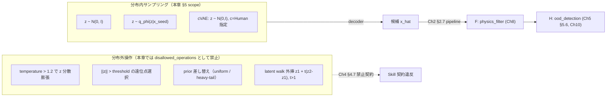
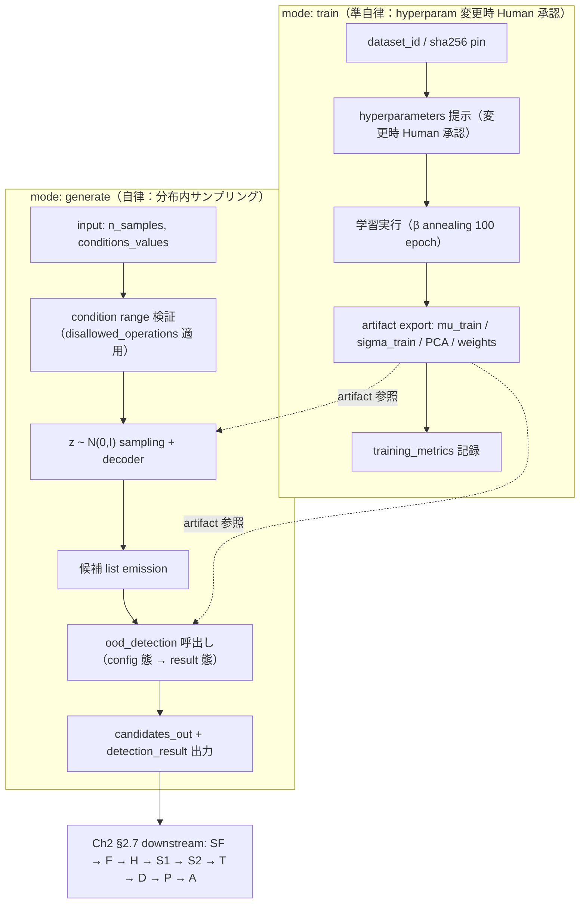

# 第5章 VAE を Skill 化する — 潜在空間で組成候補を生成

> **本章の使い方**
> - **Part II の最初の具体実装章**です。Ch4 の canonical template（§4.2 骨格、§4.3 13+1 provenance fields、§4.5 `hallucinatory_composition_detection` 3 態、§4.6 Safety 3-layer、§4.7 禁止フレーズ 10 list、§4.9 9 Skill ID 一覧）を **literal に継承** し、`arim.gen.vae.v0.1` として実装します。
> - **教育目的の小規模スクラッチ学習**：ARIM 風 3-4 元系合成データ（数百〜数千サンプル）で単一 GPU 内完結する VAE / cVAE の骨格を、Skill 契約の中で示します。研究本番の学習は本章 scope 外です（vol-03 §11 の材料 FM 経由が実践 route）。
> - **本章の scope**：**「生成器の学習」と「分布内サンプリング」** に責務を絞ります。生成後の物理制約チェックは Ch8、OOD 検知の完全計算（軸 A/B/C）は Ch10、guidance scale / diffusion の温度議論は Ch6、Flow / AR は Ch7 に委譲します。
> - **YAML block は全て `yaml.safe_load` 準拠**：本書 CI で機械検証されます。
>
> **本章の到達目標**
> - VAE 骨格（encoder / decoder / ELBO）を、Ch4 §4.3 の `generative_model_family.family = "vae"` / `latent_dim` / `generation_temperature` の canonical field に一対一で対応付けて説明できる
> - **組成 VAE** を 3-4 元系合成データで単一 GPU 内スクラッチ学習し、`training_data_provenance` の 4-tuple（`dataset_id` / `version` / `sha256` / `license`）に沿って provenance を残せる
> - **cVAE**（条件付き VAE）を `condition_variables_declared` field で実装し、「エージェントは条件を勝手に変えない」契約を Ch4 §4.7 禁止フレーズと接続できる
> - **分布内サンプリング と 分布外候補** を Skill レベルで区別し、分布外操作を `disallowed_operations` に登録する
> - **`hallucinatory_composition_detection`** の Ch4 §4.5 config 態を **Skill として実装**し、Mahalanobis / PCA 再構成誤差 / 物理制約違反率の 3 軸を Ch2 §2.4 合成規則（$0.4 z_M + 0.4 z_R + 0.2 v > 0.75$）で集約できる
> - **`arim.gen.vae.v0.1`** の完全 Skill YAML を、Ch4 §4.2 template を全フィールド埋めた形で書ける
>
> **本章で扱わないこと**
> - Diffusion / Flow / AR の骨格と Skill 実装（Ch6-7）
> - 生成候補の物理制約チェック（Ch8、`arim.gen.physics_filter.v0.1` F ステージ）
> - OOD 検知の完全計算（Ch10、軸 A/B/C の実装詳細）
> - `arim.gen.candidate_ranking.v0.1` による top-k 選抜（Ch11）
> - 危険物質 filter list 内容（付録 C）と MCP handler 実装（付録 B）
> - Agentic 失敗パターンの taxonomy（Ch14）

---

## 5.1 なぜ VAE から始めるか

生成モデルの主要 4 family（VAE / Diffusion / Normalizing Flow / Autoregressive）のうち、Part II の **最初の実装対象** に VAE を選ぶ理由は次の 3 点です。

### 理由 1：encoder-decoder + 潜在空間の明示性

VAE は $x \to q_\phi(z|x) \to z \to p_\theta(x|z) \to \hat{x}$ という **encoder → 潜在空間 → decoder** の対称構造を持ちます。Ch4 §4.3.2 で canonical 化した `latent_dim` field は VAE の $z$ の次元そのものであり、**provenance field と数式が 1 対 1 対応** します。Diffusion では latent space は必ずしも明示されず（DDPM は image space 直接）、Flow では base distribution が主役、AR では latent は hidden state に埋め込まれます。**「潜在空間で組成候補を生成する」という本書のタイトルフレーズと最も直接的に対応する** のが VAE です。

### 理由 2：ELBO の 2 項が「復元 vs 分布合致」として直感的

VAE の学習目的関数 ELBO は **復元項 −（学習分布への合致の程度、KL 項）** の 2 項に分解できます。Ch2 §2.4 で確定した `hallucinatory_composition_detection` の合成規則が「学習分布からの距離（Mahalanobis） + 学習分布での再現性（PCA reconstruction） + 物理妥当性」の重み付き和だったこととの **哲学的一致** が生じます。VAE の学習と OOD 検知が「学習分布を再現する程度」を共通軸に持つため、**判定 Skill（H ステージ）の実装を VAE の副産物として構築できる** ——本章 §5.6 で示す実装的な帰結です。

### 理由 3：小規模データでも学習可能（ARIM 実験規模との整合）

Diffusion / MatterGen 系は数十万〜数百万サンプルの pretrain が前提です（vol-03 §11 で議論した「材料 FM」の scale）。一方 VAE は **数百〜数千サンプル、単一 GPU で数十 epoch** で学習が回ります。ARIM 施設の 1 プロジェクトが持つ組成 × 物性ペアの規模（Ch2 §2.2 破綻 1 で議論した「少データ現場」）と直接整合します。**教育目的で「エンドツーエンドを自分で回す」** ことが本章で成立するのは、この計算コストの軽さゆえです。

### 本章の scope と他章委譲

| 論点 | 本章 §5 | 委譲先 |
|---|---|---|
| VAE / cVAE 骨格と Skill 化 | ✅ | — |
| 分布内サンプリングの実装 | ✅ | — |
| `hallucinatory_composition_detection` の **Skill 実装**（config 態） | ✅ | — |
| OOD 検知の完全計算（軸 A/B/C）と閾値較正 | 概説のみ | Ch10 |
| 生成候補の物理制約チェック（電荷中性・化学量論等） | 委譲宣言のみ | **Ch8** |
| Diffusion / Flow / AR の実装 | — | Ch6 / Ch7 |
| top-k 選抜と Human 承認 | 契約 hand-off のみ | Ch11 / Ch4 §4.4 |
| 危険物質 Layer 1 filter | 継承宣言のみ | Ch4 §4.6 / 付録 C |

> [!NOTE]
> **Part II 内での本章の位置**：Ch5 は Ch4 canonical template の **最初の literal 実装例** です。Ch6-7 の Diffusion / Flow / AR 章は「本章の shape を継承し、生成器の family と特徴だけを差し替える」という差分中心構成になります。したがって **本章の記述量が Part II で最も多く**、Ch6-7 は本章を親テンプレートとして参照する軽量章になります。

---

## 5.2 VAE 骨格の最小復習

本節は vol-03 未読者向けの緊急救援ではなく、**Ch4 canonical field への anchor** としての最小復習です。深掘りは vol-03 §7 と §12 を参照してください。

### encoder / decoder / prior

- **encoder** $q_\phi(z|x) = \mathcal{N}(z; \mu_\phi(x), \sigma_\phi^2(x))$：入力 $x$（本章では組成ベクトル）を **潜在変数 $z$ の分布パラメータ** に写す
- **decoder** $p_\theta(x|z)$：$z$ から $x$ を再生する
- **prior** $p(z) = \mathcal{N}(0, I)$：$z$ の事前分布として標準正規

Ch4 §4.3.2 canonical field `latent_dim` は上記 $z$ の次元数と 1 対 1 対応します。本章の実装例では `latent_dim = 16`（3-4 元系組成の少データ現場で posterior collapse を抑える保守既定）を採用します。

### ELBO — 2 項分解

学習目的関数は **evidence lower bound** で与えられます：

$$
\mathcal{L}_{\text{ELBO}}(x) = \underbrace{\mathbb{E}_{q_\phi(z|x)}[\log p_\theta(x|z)]}_{\text{復元項}} - \underbrace{\beta \cdot D_{\text{KL}}[q_\phi(z|x) \| p(z)]}_{\text{KL 項}}
$$

- **復元項**：decoder が $z$ から $x$ をどれだけ再構成できるか（本章では組成ベクトルの MSE）
- **KL 項**：$q_\phi(z|x)$ を prior $p(z)$ に押し付ける正則化
- **$\beta$**：KL 項の重み。**β-VAE**（$\beta > 1$ で表現の disentangle を強化）と **KL annealing**（学習初期に $\beta$ を小さく、徐々に増やす）を本章 §5.9 で扱う

### reparameterization trick

$z \sim \mathcal{N}(\mu, \sigma^2)$ の sample を $z = \mu + \sigma \odot \epsilon$（$\epsilon \sim \mathcal{N}(0, I)$）に置き換えることで、$\mu, \sigma$ に関する勾配が backprop 可能になります。本章の実装（§5.3）はこれを standard に採用します。

### posterior collapse のリスク（先取り）

$\beta$ が大き過ぎるか decoder が強力過ぎると、encoder が $q_\phi(z|x) \approx p(z)$ に潰れて **$z$ に情報が乗らなくなる**（posterior collapse）。少データ現場では特に発生しやすく、本章 §5.9 で **KL annealing** と **β schedule** の実装で対処します。

### vol-03 §12 との接続

> [!NOTE]
> **vol-03 §12（自己教師あり学習）との共通哲学**：VAE の encoder が「入力から低次元 latent 表現を作る」機構は、vol-03 §12 の自己教師あり事前学習が「入力から下流タスクに転移可能な表現を作る」機構と **潜在空間の学習という共通哲学** で繋がります。両者の差は損失設計（VAE は復元 + KL、自己教師あり学習は contrastive / masked 復元）と目的（VAE は生成、自己教師ありは表現学習）にありますが、**「latent 空間が学習分布を圧縮している」という点で `hallucinatory_composition_detection` の判定基盤を共有** します。Ch7 で Normalizing Flow / AR を扱う際に本 note を再訪します。

---

## 5.3 組成 VAE の教育的実装

本節では **ARIM 風 3-4 元系合成組成データ**（数百〜数千サンプル、真の物性 + 合成可能性フラグを付随）で VAE を単一 GPU 上でスクラッチ学習する骨格を示します。**目的は「教育的な最小構成を Skill 契約と一体で示す」** ことであり、研究本番の学習ではありません。

### データセット — `arim.synthetic-generative.compositions.v1`

Ch4 §4.5 config 態で `reference_dataset: "arim.synthetic-generative.compositions.v1"` として anchor した合成データです。本章では最小仕様のみ示し、生成スクリプト全文は付録 C に委譲します。

- **元素系**：Li / Na / K / Mg / Ca / Al / Fe / Ni / Cu / Zn / Ti / O / F / S / N から 3-4 元系を組む
- **サンプル数**：教育既定 1,024（訓練 819 / 検証 205、8:2 分割）、拡張時 4,096 まで
- **入力表現**：15 元素の mole fraction ベクトル（$\sum = 1$、simplex 上の点、$x \in \mathbb{R}^{15}$）
- **付随物性**：合成 band_gap（eV）、formation_energy（meV/atom）——cVAE 条件用
- **合成可能性フラグ**：`synthesizable: bool`（Ch8 で活用、本章では学習フィルタに使わない）

### encoder / decoder の最小構成

| 層 | 入力次元 | 出力次元 | 活性化 |
|---|---|---|---|
| encoder linear 1 | 15 | 64 | ReLU |
| encoder linear 2 | 64 | 32 | ReLU |
| encoder head_μ | 32 | 16（= `latent_dim`） | — |
| encoder head_logvar | 32 | 16 | — |
| decoder linear 1 | 16 | 32 | ReLU |
| decoder linear 2 | 32 | 64 | ReLU |
| decoder linear 3 | 64 | 15 | Softmax（simplex 制約） |

Softmax を最終層に置くことで、decoder 出力が組成 simplex（$\sum x_i = 1$, $x_i \ge 0$）に自然に載ります。**物理制約チェック**（電荷中性・整数比等）は本章 scope 外で、Ch8 の F ステージに委譲します。

### 損失関数

$$
\mathcal{L}(x) = \| \hat{x} - x \|_2^2 + \beta(t) \cdot D_{\text{KL}}[q_\phi(z|x) \| \mathcal{N}(0, I)]
$$

- **復元項**：組成ベクトルの MSE（Softmax 出力なので cross-entropy でも可、本章は MSE を既定）
- **KL 項**：$\beta$ は KL annealing schedule で 0 → 1 に線形増加

### β annealing schedule（教育既定）

| epoch 範囲 | $\beta$ | 意図 |
|---|---|---|
| 0 - 20 | 0.0 | 復元優先、latent に情報を載せる |
| 20 - 50 | 0.0 → 1.0（線形） | KL を段階的に導入、posterior collapse 回避 |
| 50 - 100 | 1.0 | 標準 VAE として収束 |

### PyTorch Lightning での骨格コード（教育目的、抜粋）

```python
import torch
import torch.nn as nn
import torch.nn.functional as F
import pytorch_lightning as pl

class CompositionVAE(pl.LightningModule):
    def __init__(self, latent_dim=16, beta_start=0.0, beta_end=1.0,
                 anneal_start_epoch=20, anneal_end_epoch=50):
        super().__init__()
        self.save_hyperparameters()
        self.encoder = nn.Sequential(nn.Linear(15, 64), nn.ReLU(),
                                     nn.Linear(64, 32), nn.ReLU())
        self.head_mu = nn.Linear(32, latent_dim)
        self.head_logvar = nn.Linear(32, latent_dim)
        self.decoder = nn.Sequential(nn.Linear(latent_dim, 32), nn.ReLU(),
                                     nn.Linear(32, 64), nn.ReLU(),
                                     nn.Linear(64, 15))
    def _beta(self):
        e = self.current_epoch
        if e < self.hparams.anneal_start_epoch: return self.hparams.beta_start
        if e >= self.hparams.anneal_end_epoch: return self.hparams.beta_end
        t = (e - self.hparams.anneal_start_epoch) / (
             self.hparams.anneal_end_epoch - self.hparams.anneal_start_epoch)
        return self.hparams.beta_start + t * (self.hparams.beta_end - self.hparams.beta_start)
    def forward(self, x):
        h = self.encoder(x); mu = self.head_mu(h); logvar = self.head_logvar(h)
        z = mu + torch.exp(0.5 * logvar) * torch.randn_like(mu)  # reparam
        return F.softmax(self.decoder(z), dim=-1), mu, logvar
    def training_step(self, batch, _):
        x = batch["composition"]
        x_hat, mu, logvar = self(x)
        rec = F.mse_loss(x_hat, x, reduction="sum") / x.size(0)
        kl = -0.5 * torch.sum(1 + logvar - mu.pow(2) - logvar.exp()) / x.size(0)
        loss = rec + self._beta() * kl
        self.log_dict({"rec": rec, "kl": kl, "beta": self._beta(), "loss": loss})
        return loss
    def configure_optimizers(self):
        return torch.optim.Adam(self.parameters(), lr=1e-3)
```

### 学習リソース既定表（単一 GPU 内完結）

| 項目 | 教育既定 | 拡張上限 | 備考 |
|---|---|---|---|
| サンプル数 | 1,024 | 4,096 | 付録 C の生成スクリプトで拡張 |
| GPU | 単一 GPU（例：RTX 3060 12GB） | 単一 A100 40GB | Colab 無償 tier で十分 |
| Epoch | 100 | 300 | 検証 loss の early stopping で調整 |
| Batch size | 64 | 256 | サンプル数に応じて |
| 学習時間 | 数分 | 数十分 | 教育目的、本番研究は vol-03 §11 FM 経由 |

> [!NOTE]
> **なぜ「教育目的の小規模」に絞るか**：Ch2 §2.2 破綻 1（少データ現場での overfitting）と Ch3 §3.4（材料 FM の 3 経路 fetch）の議論から、**研究本番の生成 FM 学習は vol-03 §11 の MatterGen / DiffCSP / CDVAE の経路**が実践 route です。本章はあくまで **Skill 契約と数式・実装の対応を体で理解する** ための最小構成に絞ります。実データを持ち込む際は vol-03 §11 と本書付録 C の生成スクリプトを参照してください。

---

## 5.4 cVAE（条件付き VAE）

Ch4 §4.3.4 で canonical 化した `condition_variables_declared` field を **実装** します。目標物性（band_gap, formation_energy）を latent と decoder 入力に concat する **最小構成の cVAE** を示します。

### 数式

encoder / decoder に条件 $c$（本章では 2 次元：`target_band_gap_eV` と `target_formation_energy_meV_per_atom`）を渡します：

- encoder：$q_\phi(z | x, c)$（入力を $[x; c]$ の concat）
- decoder：$p_\theta(x | z, c)$（入力を $[z; c]$ の concat）

### `condition_variables_declared` の実装宣言

**YAML block 1 — cVAE `condition_variables_declared` field**

```yaml
# arim.gen.vae.v0.1 の cVAE mode における条件変数宣言（Ch4 §4.3.4 canonical）
condition_variables_declared:
  - name: "target_band_gap_eV"
    range: [0.5, 6.0]         # 実際に学習データに含まれる band_gap の [min, max]
    type: "float"
    unit: "eV"
    # 学習時の正規化：(v - mean) / std を latent と concat する前に適用
    normalization:
      mean: 2.1
      std: 1.4
      applied_at: "input"
  - name: "target_formation_energy_meV_per_atom"
    range: [-3500, 500]
    type: "float"
    unit: "meV/atom"
    normalization:
      mean: -1200
      std: 800
      applied_at: "input"
# 「本 Skill は宣言外の条件を受け付けない」契約（Ch4 §4.7 の禁止に接続）
condition_extensibility:
  allow_agent_to_add_conditions: false
  additional_conditions_require: "human_approval"
```

### encoder / decoder への concat（実装骨格の差分）

```python
class ConditionalCompositionVAE(CompositionVAE):
    def __init__(self, latent_dim=16, condition_dim=2, **kw):
        super().__init__(latent_dim=latent_dim, **kw)
        self.encoder = nn.Sequential(nn.Linear(15 + condition_dim, 64), nn.ReLU(),
                                     nn.Linear(64, 32), nn.ReLU())
        self.decoder = nn.Sequential(nn.Linear(latent_dim + condition_dim, 32), nn.ReLU(),
                                     nn.Linear(32, 64), nn.ReLU(),
                                     nn.Linear(64, 15))
    def forward(self, x, c):
        h = self.encoder(torch.cat([x, c], dim=-1))
        mu = self.head_mu(h); logvar = self.head_logvar(h)
        z = mu + torch.exp(0.5 * logvar) * torch.randn_like(mu)
        return F.softmax(self.decoder(torch.cat([z, c], dim=-1)), dim=-1), mu, logvar
```

### 「エージェントが条件を勝手に変えない」契約

Ch2 §2.2 破綻 4（temperature 暴走）と同様に、**cVAE の条件変数もエージェントが自律で書き換えることは Ch4 §4.7 禁止フレーズ「実験を進めてください」「推奨候補です」への飛躍と等価** です。本章の Skill 契約では以下を **`disallowed_operations`** として登録します：

- 生成前に **条件値を `condition_variables_declared.range` 外に自律で拡張** すること（例：Human が指定した `target_band_gap_eV: 2.0` を、生成成功率向上のため勝手に 3.5 に変える）
- 生成後に **条件値を書き換えて記録** すること（provenance 偽装）
- 生成前に **`condition_extensibility.additional_conditions_require: human_approval` を無視** して新規条件を追加すること

これらは §5.7 の Skill YAML `disallowed_operations` に list として明示します。

---

## 5.5 分布内サンプリングと分布外候補の区別

VAE を学習後、サンプリングは **2 通りの操作** があります。本章は **前者のみ** を実装し、後者は Skill 契約で明示的に禁止します。

### 分布内サンプリング（本章 scope）

- **標準サンプリング**：$z \sim p(z) = \mathcal{N}(0, I)$ から draw して decoder で $\hat{x}$ を得る
- **posterior サンプリング**：$z \sim q_\phi(z | x_{\text{seed}})$（seed 候補周辺の摂動）
- **cVAE 条件付き**：$z \sim p(z), \hat{x} \sim p_\theta(x | z, c)$（$c$ は Human 指定）

これらは **学習分布内** の点を返すことが期待されます。本章の Skill `arim.gen.vae.v0.1` の generation mode はこれらのみを実装します。

### 分布外操作（本章では禁止、他 Skill にも委譲しない）

- **temperature 上昇**：`generation_temperature > 1.2` で $z$ の分散を人為的に膨らませ、学習分布から外れた候補を狙う
- **manifold 外 sampling**：`||z|| > threshold` の遠位点を意図的に選ぶ
- **prior 差し替え**：$p(z) = \mathcal{N}(0, I)$ を uniform や重い裾の分布に差し替える
- **latent walk の外挿**：既知候補 $z_1, z_2$ の外挿方向 $z_1 + t(z_2 - z_1), t > 1$ に飛ばす

これらの分布外操作は **「学習分布から遠い候補を意図的に得る」** ものであり、以下の 2 つの理由から本章では実装しません：

1. **`hallucinatory_composition_detection`（H ステージ）が検知対象とする候補群を、生成器自身が意図的に生成することは責務逸脱**（H ステージが検知して reject する対象を、G ステージが自ら量産することになり、pipeline の意味論が壊れる）
2. **「学習分布外だが物理的に妥当な候補」を狙う逆設計は、VAE の生成 mode 拡張ではなく Ch10 の分布妥当性判定 Skill と Ch11 の surrogate ranking の組み合わせで扱う**

### 2 サンプリングモードの区別図



### Ch5 の責務境界と他章委譲の再掲

| 論点 | Ch5 の扱い | 委譲先 |
|---|---|---|
| 分布内サンプリング実装 | ✅ | — |
| 分布外操作の **禁止宣言**（Skill 契約 `disallowed_operations`） | ✅ | — |
| 分布外候補の **物理制約妥当性** チェック | 委譲宣言のみ | **Ch8** |
| 分布外候補の **OOD 検知精度** 較正（軸 A/B/C の閾値較正） | 概説のみ | **Ch10** |
| 「学習分布外だが有用な候補」を **意図的に探索** する逆設計 | scope 外 | **Ch10 + Ch11** |

---

## 5.6 `hallucinatory_composition_detection` の Skill 実装

Ch4 §4.5 で canonical 化した 3 態のうち **config 態 と result 態** を、本章で **Skill として実装** します。判定 Skill の ID は **`arim.gen.ood_detection.v0.1`**（Ch4 §4.9 で登録済、Ch2 §2.7 pipeline の H ステージ担当）で、Ch5 と Ch10 の両方で扱います。**Ch5 では VAE 学習の副産物としての実装骨格** を、**Ch10 では軸 A/B/C の完全計算と閾値較正** を扱います。

> [!IMPORTANT]
> **本節の config 態 / result 態 YAML の所有者**：以下の config 態・result 態 YAML は Ch5 の VAE Skill (`arim.gen.vae.v0.1`) 自身が保持するのではなく、**H stage Skill である `arim.gen.ood_detection.v0.1` の Skill 契約** である（Ch4 §4.5 canonical、Ch3 §3.6 pattern）。Ch5 の VAE Skill は §5.7 で `hallucinatory_composition_detection_delegated_to` により本 Skill を invoke するのみで、config/result 態を自身の provenance に literal で持つことはしない。
>
> **本節および §5.7 の Ch4 canonical schema からの silent 拡張一覧**（付録 A の schema reference に統合予定、Ch10 でも継承）：
>
> **§5.6 `hallucinatory_composition_detection` schema 拡張**（Ch4 §4.5 canonical への追加）：
> - `mahalanobis.{reference_dataset_version, reference_dataset_sha256, mu_train_artifact_id, mu_train_sha256, sigma_train_artifact_id, sigma_train_sha256, latent_dim}` — 学習後 pin の provenance field 群
> - `pca.{pca_artifact_id, pca_artifact_sha256}` — PCA artifact の pin と sha256
> - `physical_rules_delegated_to` — 軸 C 実装を Ch8 F stage Skill に委譲する pointer（Ch3 §3.6 `_delegated_to` pattern）
> - result 態 `config_ref.skill_version` — Ch4 §4.5 canonical に back-port 済（delegated 態 pointer の `skill_version` と整合、下記 result 態 YAML に literal で反映）
>
> **§5.4 / §5.7 `condition_variables_declared` / `condition_extensibility` schema 拡張**（Ch4 §4.3.4 canonical への追加、付録 A で back-port 予定）：
> - `condition_variables_declared[].normalization: {mean, std, applied_at}` — cVAE の training-time 条件正規化の pin（§5.4 で導入、§5.7 で literal 化）。Ch4 §4.3.4 は現状 `name / range / type` のみを canonical としており、正規化 field は本章で先行導入
> - `condition_extensibility` top-level（`allow_agent_to_add_conditions: bool` / `additional_conditions_require: enum`）— 「エージェントが条件を勝手に追加しない」契約（§5.4）。Ch4 §4.3.4 未定義、本章で先行導入
>
> **§5.7 Skill YAML schema 拡張**（Ch4 §4.2 template / §4.3 canonical への追加、付録 A に canonical 追加予定）：
> - `filter_rules_delegated_to: {skill, skill_version, invocation_stage}` — G stage Skill が F ステージを実装しない場合の委譲 pointer（Ch3 §3.6 `*_delegated_to` pattern の application）。Ch4 §4.3.6 は `filter_rules_applied` のみ canonical、本章で `_delegated_to` 態を追加
> - `<hyperparameter>_range_allowed: [lo, hi]`（例：`generation_temperature_range_allowed: [0.8, 1.2]`）— hyperparameter の許容レンジ宣言（`disallowed_operations.temperature_out_of_range` の enforcement 参照点）。Ch4 §4.3.5 は宣言値のみ canonical、本章で range field を追加

### なぜ本章で `ood_detection` を扱うか

§5.1 理由 2 で述べた通り、VAE の encoder は $q_\phi(z|x)$ を通じて **学習分布の低次元 latent 表現** を持ちます。この latent 表現から **Mahalanobis 距離** と **PCA 再構成誤差** を計算することは、VAE の学習と同じ計算資源で可能です。Ch10 が別 family（Normalizing Flow / density estimation）で独立に実装するのに対し、**Ch5 は VAE 副産物として最も自然に実装できる** ため本章に置きます。

### 軸 A：Mahalanobis 距離

$$
d_M(z_{\text{new}}) = \sqrt{(z_{\text{new}} - \mu_{\text{train}})^T \Sigma_{\text{train}}^{-1} (z_{\text{new}} - \mu_{\text{train}})}
$$

- **$\mu_{\text{train}}$, $\Sigma_{\text{train}}$**：学習セット全体を encoder に通した $\{z_i\}$ の **平均と共分散**
- **正規化スコア $z_M$**：$d_M$ を **$\chi^2$ 分布の 99% 分位点** で normalize（`threshold_chi2_quantile: 0.99`）
- **pin と sha256 記録**：学習後に $\mu_{\text{train}}, \Sigma_{\text{train}}$ を **artifact として pin**、sha256 を provenance に記録（下記 config 態 YAML 参照）

### 軸 B：PCA 再構成誤差

$$
\varepsilon_R(x_{\text{new}}) = \| x_{\text{new}} - U_k U_k^T x_{\text{new}} \|_2
$$

- **$U_k$**：学習セットの top-$k$ 主成分（本章既定 $k = 8$）
- **正規化スコア $z_R$**：$\varepsilon_R$ を学習セット上の分布の **99 パーセンタイル** で normalize（`reconstruction_error_threshold_percentile: 99`）

### 軸 C：物理制約違反率

Ch4 §4.5 config 態で canonical 化した 3 rule（`charge_neutrality` / `stoichiometry_integer_multiplier` / `oxidation_state_bounds`）の違反数を rule 総数で割った値。Ch2 §2.4 定義通り。**本章では violation rate の計算骨格のみ示し、rule の完全実装は Ch8** に委譲します。

### 合成スコア（Ch2 §2.4 canonical、Ch4 §4.5 config 態継承）

$$
\text{composite\_score} = 0.4 \cdot z_M + 0.4 \cdot z_R + 0.2 \cdot v
$$

$\text{composite\_score} > 0.75$ で `flag: true`（hallucinated 候補と判定）。

### Config 態 YAML（`arim.gen.ood_detection.v0.1` の Skill 契約）

**YAML block 2 — `hallucinatory_composition_detection` config 態（本章での実装値付き）**

```yaml
hallucinatory_composition_detection:
  mode: "config"
  method: "mahalanobis_plus_pca_plus_physical"
  # ----- 軸 A: Mahalanobis -----
  mahalanobis:
    reference_dataset: "arim.synthetic-generative.compositions.v1"
    reference_dataset_version: "v1.0.0"
    reference_dataset_sha256: "sha256:0000000000000000000000000000000000000000000000000000000000000000"
    # 学習後に pin する statistics（Ch5 §5.6 の実装で export）
    mu_train_artifact_id: "artifact:mu_train_20260707_143012"
    mu_train_sha256: "sha256:0000000000000000000000000000000000000000000000000000000000000000"
    sigma_train_artifact_id: "artifact:sigma_train_20260707_143012"
    sigma_train_sha256: "sha256:0000000000000000000000000000000000000000000000000000000000000000"
    latent_dim: 16                          # Ch4 §4.3.2 canonical と一致
    threshold_chi2_quantile: 0.99
  # ----- 軸 B: PCA 再構成誤差 -----
  pca:
    n_components: 8
    reconstruction_error_threshold_percentile: 99
    pca_artifact_id: "artifact:pca_train_20260707_143012"
    pca_artifact_sha256: "sha256:0000000000000000000000000000000000000000000000000000000000000000"
  # ----- 軸 C: 物理制約違反率（rule 実装は Ch8 に委譲） -----
  physical_rules_applied:
    - "charge_neutrality"
    - "stoichiometry_integer_multiplier"
    - "oxidation_state_bounds"
  physical_rules_delegated_to:
    skill: "arim.gen.physics_filter.v0.1"
    skill_version: "v0.1"
    invocation_stage: "F"
  # ----- 合成スコア（Ch2 §2.4 canonical） -----
  composite_score_weights:
    mahalanobis: 0.4
    reconstruction: 0.4
    physical_violation: 0.2
  composite_score_threshold: 0.75
```

### Result 態 YAML（`arim.gen.vae.v0.1` の生成後に emit される）

**YAML block 3 — `hallucinatory_composition_detection` result 態（本章での emission 例）**

```yaml
hallucinatory_composition_detection:
  mode: "result"
  # 候補ごとに 1 record（本例では cand_0007 の判定）
  candidate_id: "cand_0007"
  composite_score: 0.57                    # 0.4*0.55 + 0.4*0.71 + 0.2*0.35 = 0.574 → 0.57
  z_M: 0.55
  z_R: 0.71
  v: 0.35
  flag: false                              # 0.57 <= 0.75 なので分布内候補と判定
  triggered_rules: []                      # v > 0 だが閾値未満、軽度違反として null list
  # 参照した config の back-reference
  config_ref:
    skill: "arim.gen.ood_detection.v0.1"
    skill_version: "v0.1"
    invocation_id: "inv_20260707_143512"
```

### Ch3 §3.6 `_delegated_to` pattern との対比

| 章 | 態 | field 名 | 実装状態 |
|---|---|---|---|
| **Ch3 §3.6** | delegated pointer 態 | `hallucinatory_composition_detection_delegated_to` | pointer のみ、実装なし |
| **本章 §5.6** | config 態 + result 態 | `hallucinatory_composition_detection`（`mode: "config"` / `mode: "result"`） | **本体実装（Skill として）** |
| **Ch10** | config 態 + result 態 | 同上 | 軸 A/B/C の完全計算と閾値較正 |

本章の実装は **`arim.gen.vae.v0.1` 自身が判定 Skill を invoke** する形（VAE の生成候補ごとに `arim.gen.ood_detection.v0.1` を呼び、result 態を Skill 出力の provenance に追加）で運用します。

---

## 5.7 `arim.gen.vae.v0.1` Skill YAML 完全形

Ch4 §4.2 template を **全フィールド埋めた** 完全 Skill YAML を本節で示します。以降 Ch5-13 の Skill 章はこの形を親テンプレートとして参照します。

**YAML block 4 — `arim.gen.vae.v0.1` full Skill 契約書**

```yaml
# =============================================================
# arim.gen.vae.v0.1 — 組成 VAE / cVAE Skill（Ch5 canonical 実装）
# 継承: Ch4 §4.2 template ⑧ を literal に継承
# =============================================================
skill:
  id: "arim.gen.vae.v0.1"
  version: "v0.1"
  description: "組成 VAE / cVAE による分布内サンプリング。Ch5 canonical 実装。"

# --- Ch2 §2.7 canonical pipeline stage anchor ---
pipeline_position:
  stage: "G"                              # canonical enum: G|SF|F|H|S1|S2|T|D|P|A|PRE
  upstream_stages: ["PRE"]                # library_allowlist / fm_fetch (PRE stage, Ch3 §3.8 canonical)
  downstream_stages: ["SF", "F", "H"]

# --- 入力仕様 ---
input_schema:
  mode:
    type: "enum"
    values: ["train", "generate"]
  # train mode 入力
  training_data:
    type: "dict"
    required_keys: ["dataset_id", "version", "sha256", "license"]
    condition: "required if mode=train"
  hyperparameters:
    type: "dict"
    schema:
      latent_dim: {type: "int", range: [4, 64]}
      beta_start: {type: "float"}
      beta_end: {type: "float"}
      anneal_start_epoch: {type: "int"}
      anneal_end_epoch: {type: "int"}
      max_epochs: {type: "int", range: [1, 500]}
      batch_size: {type: "int"}
      lr: {type: "float"}
  # generate mode 入力
  n_samples:
    type: "int"
    range: [1, 1000]
    condition: "required if mode=generate"
  conditions_values:
    type: "dict"
    schema_ref: "condition_variables_declared"
    condition: "required if cVAE mode"

# --- 出力仕様 ---
output_schema:
  # train mode 出力
  trained_model_artifact_id:
    type: "string"
    condition: "emitted if mode=train"
  training_metrics:
    type: "dict"
    keys: ["final_rec_loss", "final_kl", "final_beta", "epoch_reached"]
  # generate mode 出力
  candidates_out:
    type: "list_of_dict"
    required_keys: ["candidate_id", "composition", "latent_z_sample"]
    max_length_field: "n_samples"
  detection_result:
    type: "list_of_dict"
    schema_ref: "hallucinatory_composition_detection.result"
    description: "候補ごとに 1 record、Ch4 §4.5 result 態を継承"

# --- 生成 × 逆設計 13+1 provenance fields（Ch4 §4.3 完全定義） ---
generative_model_family:
  family: "vae"                           # Ch4 §4.3.1 canonical enum
  id: "arim.ch5.composition_vae_v0.1"
  version: "v0.1.0"
latent_dim: 16                            # Ch4 §4.3.2
training_data_provenance:
  dataset_id: "arim.synthetic-generative.compositions.v1"
  version: "v1.0.0"
  sha256: "sha256:0000000000000000000000000000000000000000000000000000000000000000"
  license: "arim_educational_v1"
condition_variables_declared:             # Ch4 §4.3.4、cVAE mode で有効
  - name: "target_band_gap_eV"
    range: [0.5, 6.0]
    type: "float"
    unit: "eV"
    normalization:                        # §5.4 で宣言された training-time 正規化
      mean: 2.1
      std: 1.4
      applied_at: "input"
  - name: "target_formation_energy_meV_per_atom"
    range: [-3500, 500]
    type: "float"
    unit: "meV/atom"
    normalization:
      mean: -1200
      std: 800
      applied_at: "input"
condition_extensibility:
  allow_agent_to_add_conditions: false
  additional_conditions_require: "human_approval"
generation_temperature: 1.0               # Ch4 §4.3.5 保守既定、レンジ [0.8, 1.2]
generation_temperature_range_allowed: [0.8, 1.2]
guidance_scale: null                      # VAE では未使用（Ch4 §4.3.5 差分）
filter_rules_applied: []                  # 本 Skill は F ステージを実装しない（Ch8 に委譲）
filter_rules_delegated_to:
  skill: "arim.gen.physics_filter.v0.1"
  skill_version: "v0.1"
  invocation_stage: "F"
screening_model_family: null              # 本 Skill は screening を実装しない
top_k_returned: null                      # 本 Skill は ranking を実装しない（Ch11 に委譲）
inverse_design_authorization: "autonomous"  # Ch4 §4.3.9 enum、G ステージなので autonomous
synthesis_launch_authorization: null      # Ch4 §4.4、A ステージのみ発火、本 Skill では null
hallucinatory_composition_detection_delegated_to:
  # H ステージは arim.gen.ood_detection.v0.1 に委譲 (Ch4 §4.5 canonical, Ch3 §3.6 pattern)
  skill: "arim.gen.ood_detection.v0.1"
  skill_version: "v0.1"
  invocation_stage: "H"
safety_screening_passed: false            # Ch4 §4.6 Layer 1 は SF ステージ、本 Skill では未通過
dual_use_review_completed: false          # Ch4 §4.6 Layer 2 は D ステージ

# --- 権限ゲート（Ch4 §4.2 canonical、Ch4 §4.8 の vol-06 独自 gate 名 space） ---
authorization_gates:
  L1_static_filter_pass:
    required_for: ["safety_screening_passed_becomes_true"]
    approver_id: "agent:arim.gen.safety_screening.v0.1"
    authorization_id: "l1_auth_20260707_143512_iter1"
    status: "pending"
    approver_id_regex: "^agent:"
    parent_authorization_id: null
  L2_dual_use_review:
    required_for: ["dual_use_review_completed_becomes_true"]
    reviewer_role: "organizational_dual_use_committee"
    approver_id: "human:<staff_id>"
    authorization_id: "l2_auth_20260707_143512_iter1"
    status: "pending"
    approver_id_regex: "^human:"
    parent_authorization_id: "vol-06:L1_static_filter_pass:l1_auth_20260707_143512_iter1"
  L3_facility_policy_approval:
    required_for: ["facility_policy_id_pinned"]
    reviewer_role: "facility_safety_officer"
    facility_policy_id: "arim.facility.policy.v1"
    approver_id: "human:<staff_id>"
    authorization_id: "l3_auth_20260707_143512_iter1"
    status: "pending"
    approver_id_regex: "^human:"
    parent_authorization_id: "vol-06:L2_dual_use_review:l2_auth_20260707_143512_iter1"
  L4_synthesis_launch:
    required_for: ["synthesis_launch_authorization"]
    reviewer_role: "facility_synthesis_lead"
    approver_id: "human:<staff_id>"
    authorization_id: "l4_auth_20260707_143512_iter1"
    status: "pending"
    approver_id_regex: "^human:"
    parent_authorization_id: "vol-06:L3_facility_policy_approval:l3_auth_20260707_143512_iter1"

# --- 自然言語出力禁止契約（Ch4 §4.7 canonical 10 phrase と完全同期） ---
outputs_disallowed_natural_language:
  - "この候補は安全です"
  - "合成可能です"
  - "危険ではありません"
  - "dual-use ではありません"
  - "safety_screening を通過したので合成可能です"
  - "推奨候補です"
  - "実験を進めてください"
  - "この候補で問題ありません"
  - "合成推奨です"
  - "安全性は確認されています"

# --- Ch5 独自: 分布外操作の禁止契約（§5.5 参照） ---
disallowed_operations:
  - name: "temperature_out_of_range"
    description: "generation_temperature を generation_temperature_range_allowed 外に自律で変更"
    enforcement: "hard_reject"
  - name: "prior_replacement"
    description: "prior p(z)=N(0,I) を uniform / heavy-tail に自律で差し替え"
    enforcement: "hard_reject"
  - name: "condition_out_of_declared_range"
    description: "condition_variables_declared.range 外の条件値を自律で設定"
    enforcement: "hard_reject"
  - name: "condition_forgery_after_generation"
    description: "生成後に condition_values_used を書き換えて provenance に記録"
    enforcement: "hard_reject_and_audit_log"
  - name: "manifold_outlier_sampling"
    description: "||z|| > threshold の遠位点を意図的に選ぶ latent walk 外挿"
    enforcement: "hard_reject"

# --- provenance 5 必須（vol-01 継承） ---
provenance:
  input_sha256: "sha256:0000000000000000000000000000000000000000000000000000000000000000"
  skill_version: "v0.1"
  run_datetime_utc: "2026-07-07T14:35:12Z"
  package_versions:
    torch: "2.4.1"
    pytorch_lightning: "2.4.0"
    numpy: "2.0.2"
    scikit-learn: "1.5.2"
  random_seed: 20260707
  event_hash: "sha256:0000000000000000000000000000000000000000000000000000000000000000"
```

> [!NOTE]
> **本 Skill YAML の観察点**：
> - `pipeline_position.stage: "G"` で Ch2 §2.7 canonical と一致。upstream に `PRE`、downstream に `SF, F, H` を宣言することで、Ch4 §4.6 の hand-off 規約を継承
> - `guidance_scale: null` で「VAE には guidance がない」を明示（Ch4 §4.3.5 の 14 field 化 canonical の実運用例）
> - `filter_rules_applied: []` + `filter_rules_delegated_to` で「本 Skill は F ステージを実装しない」を Ch3 §3.6 の `_delegated_to` pattern で表現
> - `hallucinatory_composition_detection_delegated_to`: H を `arim.gen.ood_detection.v0.1` へ委譲（`filter_rules_delegated_to` と同型、Ch4 §4.5 delegated 態 canonical、Ch3 §3.6 pattern）
> - `synthesis_launch_authorization: null` で「A ステージではないため本 Skill では発火しない」を明示
> - `disallowed_operations` は本章 §5.5 の分布外操作禁止を Skill 契約に literal 化

---

## 5.8 学習と推論の Skill 呼出しフロー

`arim.gen.vae.v0.1` は `mode: "train"` と `mode: "generate"` の 2 mode を持ちます。**両者は権限が異なる** ため、Skill 呼出しフローも分離します。

### 学習 mode（Human 承認要素あり）

- **dataset_id / version / sha256 の pin**：`training_data_provenance` に literal で記録
- **hyperparameters の Human 提示と承認**：`latent_dim` / `beta_end` / `max_epochs` 等は Skill 内定既定を使うが、**変更する場合は準自律（Ch3 §3.5 B2）で Human に事前提示**
- **artifact export**：学習後に $\mu_{\text{train}}, \Sigma_{\text{train}}$ / PCA 行列 / model weights を artifact として pin、sha256 を provenance に記録
- **wandb / Lightning logs**：`training_metrics` の履歴を wandb project に記録（Skill 契約に含めるかは付録 B）

### 推論 mode（分布内サンプリングは自律）

- **input**：`n_samples`、`conditions_values`（cVAE mode）
- **execution**：`generation_temperature` は宣言値 1.0 で固定、`condition_values` は `condition_variables_declared.range` 内であることを Skill が事前検証
- **output**：候補 list + 各候補の `hallucinatory_composition_detection.result` 態（config 態を invoke して emit）
- **downstream hand-off**：Ch4 §4.6 の Layer 1（SF）→ F（Ch8）→ H（本章 §5.6 の判定 Skill）→ S1（Ch8）→ T（Ch11）へ

### Mermaid — 学習と推論の分離フロー



> [!NOTE]
> **学習 mode の Human 承認境界**：`latent_dim` を既定 16 から変更するのは **準自律**（Ch3 §3.5 B2）です。ただし `latent_dim` を **極端に小さく（例：2）** した結果、posterior collapse で `hallucinatory_composition_detection` の Mahalanobis 統計が偽陰性方向に偏る可能性があります。**「hyperparameter 変更 → OOD 統計の較正 → Human 承認」の連鎖** は Ch10 で扱います。

---

## 5.9 よくある失敗と対処

本節は **VAE 骨格自体の失敗パターン** に絞ります。Agentic 特有の失敗（エージェントが物理制約フィルタをスキップ / condition を勝手に変更 / hallucinated 候補を top-k に含める）は **Ch14 の taxonomy** に委譲します。

### 失敗 1：posterior collapse（KL 消失）

- **症状**：学習中 KL loss が 0 付近に張り付く、生成候補が学習データの平均に似た同じような組成ばかりになる
- **原因**：$\beta$ が学習初期から大きい、decoder が強力過ぎて encoder に情報を要求しない
- **対処**：
  - **KL annealing**：本章 §5.3 の schedule（0 → 1 に線形、20-50 epoch）を厳守
  - **β-VAE の $\beta < 1$**：0.5-0.8 の範囲で復元優先
  - **free bits**：KL の下限を強制することで潜在情報を保護

### 失敗 2：復元精度低下（reconstruction blur）

- **症状**：decoder が simplex 上の平均に近い softmax 出力しか出さず、候補多様性が失われる
- **原因**：`latent_dim` が小さ過ぎる、decoder 容量不足、`beta_end` が大き過ぎる
- **対処**：
  - `latent_dim` を 16 → 24-32 に増加
  - decoder layer 数 / channel 数を増加
  - `beta_end` を 1.0 → 0.5-0.8 に低下

### 失敗 3：memorization（生成候補が学習データ複製）

- **症状**：生成候補が学習セットの記録と一致度が異常に高い（uniqueness rate が低下）
- **原因**：データ拡張不足、正則化不足、`max_epochs` 過剰
- **対処**：
  - 学習データを付録 C の生成スクリプトで 4,096 まで拡張
  - dropout 追加（encoder / decoder に 0.1-0.2）
  - early stopping（検証 loss で 20 epoch 改善なしで停止）

### 失敗 4：条件無視（cVAE の condition adherence 低下）

- **症状**：cVAE で `target_band_gap_eV: 2.0` を指定しても、生成候補の推定 band_gap 分布が条件を無視して学習データ全体の分布に近い
- **原因**：条件 $c$ の情報量が latent $z$ に比べて相対的に小さい、正規化不足
- **対処**：
  - 条件を decoder の **全 layer に repeat concat**（FiLM 的な conditioning）
  - 条件正規化を厳格化（本章 §5.4 の `normalization.mean` / `std` を再計算）
  - condition dropout（学習時に条件を 10% 確率で masking）

### 失敗 5：$\mu_{\text{train}}, \Sigma_{\text{train}}$ の provenance 逸失

- **症状**：Ch5 §5.6 の Mahalanobis 統計が「artifact 参照が切れた」状態で流通、再現不能
- **原因**：artifact の sha256 記録漏れ、artifact storage の retention policy 短過ぎ
- **対処**：
  - `mu_train_artifact_id` / `sha256` を **学習 mode 完了時に必ず emit**
  - Ch14 失敗 taxonomy に「OOD 検知の statistics 逸失」を登録

> [!WARNING]
> **Ch14 forward**：Agentic 特有の失敗（エージェントが上記対処を「学習が遅いから」の理由で勝手にスキップ、`beta_end` を勝手に 0 に変更して posterior collapse を再導入、`latent_dim` を勝手に増加して計算資源逼迫）は Ch14 の taxonomy に集約します。**本章 §5.9 は「アルゴリズム自体の失敗」、Ch14 は「エージェントの権限逸脱による失敗」** という切り分けです。

---

## 5.10 章末チェックリスト

本章の到達目標を、以下 8 項目で自己検証してください。**6 項目以上「はい」で第6章へ進めます**。

- [ ] **§5.1**：VAE を Part II の最初に扱う理由（encoder-decoder 対称性 / ELBO の 2 項分解 / 小規模データ整合）を、Ch4 §4.3.2 の `latent_dim` canonical との対応で説明できる
- [ ] **§5.2**：VAE の ELBO（復元項 - $\beta$ KL 項）と reparameterization trick を、posterior collapse リスクと $\beta$ annealing の必要性まで含めて説明できる
- [ ] **§5.3**：組成 VAE を単一 GPU 内で **教育目的の小規模スクラッチ学習** する構成（`latent_dim: 16`、$\beta$ 0→1 annealing、100 epoch、1,024 サンプル）を、Ch4 §4.3.3 の `training_data_provenance` 4-tuple と一体で書ける
- [ ] **§5.4**：cVAE の `condition_variables_declared` field を、`normalization` と `condition_extensibility` を含めて実装宣言でき、Ch4 §4.7 禁止フレーズと「エージェントが条件を勝手に変えない」契約の関係を説明できる
- [ ] **§5.5**：分布内サンプリング（$z \sim \mathcal{N}(0,I)$、posterior、cVAE 条件付き）と分布外操作（temperature 上昇 / manifold 外 / prior 差し替え / latent walk 外挿）を区別し、**分布外操作は Skill 契約で `disallowed_operations` に登録** できる
- [ ] **§5.6**：`hallucinatory_composition_detection` の Ch4 §4.5 config 態を **Skill として実装**でき、軸 A（Mahalanobis, $\mu / \Sigma$ の pin と sha256）/ 軸 B（PCA n_components=8, 99 percentile）/ 軸 C（物理制約違反率、Ch8 に委譲）と Ch2 §2.4 合成規則（$0.4 z_M + 0.4 z_R + 0.2 v > 0.75$）を integration できる
- [ ] **§5.7**：`arim.gen.vae.v0.1` の完全 Skill YAML を、Ch4 §4.2 template の 13+1 provenance fields / 4 authorization gates（L1-L4 canonical）/ 10 phrase `outputs_disallowed_natural_language` / `pipeline_position.stage: "G"` を全て埋めた形で書ける
- [ ] **§5.8-§5.9**：学習 mode（準自律：hyperparam 変更時 Human 承認）と推論 mode（自律：分布内サンプリング）の Skill 呼出しフローを分離でき、posterior collapse / memorization / condition 無視 / provenance 逸失の 5 失敗パターンに対処できる（Agentic 特有失敗は Ch14 forward）

> [!TIP]
> 「8 項目のうち 4 つ以下」なら、§5.3（教育目的の小規模学習）と §5.6（`hallucinatory_composition_detection` config/result 態の Skill 実装）と §5.7（Skill YAML 完全形）を再読してください。この 3 節が Ch6-7（Diffusion / Flow / AR）の親テンプレートとして機能します。特に §5.7 は Ch6 以降の差分記述の基準点です。

---

## 5.11 参考資料

### 本書内クロスリファレンス

- **vol-06 §1.5 / §2.4 / §4.5**：`hallucinatory_composition_detection` operational 定義 → 合成規則確定 → 3 態 canonical schema。本章 §5.6 で **Skill として本体実装**
- **vol-06 §1.6 / §4.3**：13+1 provenance fields 予告 → canonical schema。本章 §5.7 Skill YAML で全フィールド実装例
- **vol-06 §1.7 / §3.5 / §4.4**：Agentic 権限 3 段階と `inverse_design_authorization` / `synthesis_launch_authorization`。本章 §5.7 で `autonomous`（G ステージ）を実装
- **vol-06 §2.6 / §4.6**：Safety governance 3-layer 契約書。本章 §5.7 で 4 authorization gates（L1-L4 canonical）を hand-off 宣言
- **vol-06 §2.7 / §4.9**：canonical pipeline SF/F/H/S1/S2/T/D/P/A/PRE。本章 §5.7 で `pipeline_position.stage: "G"` を anchor
- **vol-06 §3.6**：`*_delegated_to` pattern。本章 §5.6 で `physical_rules_delegated_to`、§5.7 で `filter_rules_delegated_to` として運用
- **vol-06 §4.2**：Skill 仕様書テンプレート。本章 §5.7 の親テンプレート（literal 継承）
- **vol-06 §4.7**：自然言語出力禁止契約 10 phrase。本章 §5.7 `outputs_disallowed_natural_language` に完全同期
- **vol-06 §6**（forward）：Diffusion Model の Skill 化、`guidance_scale` レンジ表。本章の Skill YAML shape を継承し、`generative_model_family.family: "diffusion"` に差し替え
- **vol-06 §7**（forward）：Flow / AR の Skill 化。本章と同 shape、`generative_model_family.family: "normalizing_flow"` / `"autoregressive"` に差し替え
- **vol-06 §8**（forward）：物理制約フィルタ Skill `arim.gen.physics_filter.v0.1`。本章 §5.6 の `physical_rules_delegated_to` と §5.7 の `filter_rules_delegated_to` の実装先
- **vol-06 §10**（forward）：分布妥当性判定 Skill、軸 A/B/C の完全計算と閾値較正。本章 §5.6 の config 態を継承し、Normalizing Flow / density estimation 系での実装差分
- **vol-06 §11**（forward）：離散候補 surrogate ランキング。本章 §5.7 の `top_k_returned: null` の実装先
- **vol-06 §12**（forward）：Capstone。本章の VAE を Phase 1 の生成器として組み込む
- **vol-06 §13a**（forward）：分子 VAE / SELFIES による分子逆設計、QM9 ベンチマーク。本章の骨格を分子系に拡張
- **vol-06 §14**（forward）：Agentic 特有の失敗 taxonomy。本章 §5.5 の分布外操作 `disallowed_operations` の逸脱パターン、§5.9 の対処を無視した Skill 実装違反を集約
- **vol-06 付録 A**（forward）：Skill テンプレート集、本章 Skill YAML の細分化された schema reference
- **vol-06 付録 C**（forward）：合成データ生成スクリプト、`arim.synthetic-generative.compositions.v1` の完全実装

### vol-01〜05 の該当章（本章の前提）

- **vol-01 付録 A**：provenance 5 必須フィールド。本章 §5.7 Skill YAML `provenance:` で継承
- **vol-03 §7**：ニューラルネット骨格。本章 §5.2 の encoder / decoder の親概念
- **vol-03 §11**：材料 Foundation Model。本章の教育目的スクラッチ学習に対し、本番研究の実践 route
- **vol-03 §12**：自己教師あり学習と潜在空間。本章 §5.2 note で「latent 空間の学習」という共通哲学を確認
- **vol-04 §4.6.2 / §4.9**：`authorization_gates` v0.2 canonical identity schema。本章 §5.7 で 4 gates の shape を継承（gate 名 space は vol-06 独自、Ch4 §4.8 参照）

### 外部参考

- **Kingma, D. P. & Welling, M.** "Auto-Encoding Variational Bayes." **ICLR 2014**. https://arxiv.org/abs/1312.6114 —— VAE の originating paper
- **Higgins, I. et al.** "β-VAE: Learning Basic Visual Concepts with a Constrained Variational Framework." **ICLR 2017**. https://openreview.net/forum?id=Sy2fzU9gl —— β-VAE と disentangle
- **Bowman, S. R. et al.** "Generating Sentences from a Continuous Space." **CoNLL 2016**. https://arxiv.org/abs/1511.06349 —— KL annealing と posterior collapse の初出議論
- **Sohn, K., Yan, X., & Lee, H.** "Learning Structured Output Representation using Deep Conditional Generative Models." **NeurIPS 2015**. https://papers.nips.cc/paper/5775-learning-structured-output-representation-using-deep-conditional-generative-models —— cVAE
- **PyTorch Lightning**：https://lightning.ai/docs/pytorch/stable/ —— 本章 §5.3 の骨格コード実装
- **matminer**：https://hackingmaterials.lbl.gov/matminer/ —— 組成 → 特徴量、Ch4 §4.3.7 `screening_model_family` の入力側で活用（本章では未使用、Ch8 で本格利用）
- **scikit-learn PCA**：https://scikit-learn.org/stable/modules/generated/sklearn.decomposition.PCA.html —— 本章 §5.6 軸 B の実装

---
