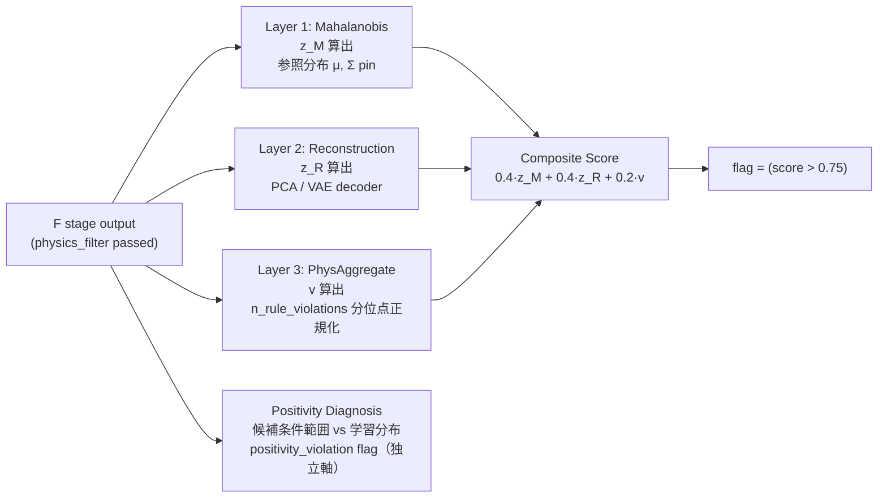

# 第10章 生成候補の分布的妥当性判定を Skill に組み込む — OOD detection と distributional coverage

> [!NOTE]
> **本章の位置づけ**
> - **Ch4 §4.5 の `hallucinatory_composition_detection` 3 態 schema**（config / result / delegated_to）と、**Ch5 §5.4 の VAE 副産物としての H ステージ実装**を、独立 Skill `arim.gen.ood_detection.v0.1` として **完全計算・完全 pin** します。
> - **合成規則は Ch2 §2.4 で確定した canonical**：$\text{composite\_score} = 0.4 \cdot z_M + 0.4 \cdot z_R + 0.2 \cdot v > 0.75$ で `flag = True` とする。本章では $z_M, z_R, v$ の各軸を独立に構築し、**参照分布 snapshot の sha256 pin と cross-validation** で "気付かぬ swap" を構造的に禁止します。
> - **Ch8 の F ステージ physics_filter との責務分離**：F ステージが返す `n_rule_violations` を H ステージが受け取り、参照分布内の分位点で $v \in [0, 1]$ に正規化します（**F の生値を H に垂れ流さない**——正規化 basis pin を要求）。
> - **軸 B（因果 positivity）**：outline §10 軸 B の canonical。生成候補の条件範囲が学習データの positivity（$P(\text{treatment}=t \mid X=x) > 0$）を満たすかを診断し、**満たさない候補は composite flag と独立に "positivity_violation" として Ch11 に伝達**します（top-k から自動除外はしない——Human 承認境界の判断のため）。

> [!WARNING]
> **本章が扱わないこと**
> - **軸 A の VAE 実装**（Ch5 §5.4-§5.6 に委譲）：本 Skill は VAE 副産物の統計を受け取る **implementation family = "vae_derived"** も canonical にサポートしますが、VAE 学習・latent 抽出そのものは Ch5 の責務です。
> - **物理制約 rule 一覧**（Ch8 §8.3-§8.4）：本 Skill は F ステージが算出した `n_rule_violations` を受け取り正規化するのみで、rule 定義や違反判定ロジックは Ch8 の責務です。
> - **top-k 選抜**（Ch11）：本 Skill は `flag` を返すのみで、`flag=True` 候補を候補集合から除去する権限を持ちません。除去は Ch11 `arim.gen.candidate_ranking.v0.1` の T ステージが担当します（**reject 禁止契約は Ch8 §8.5 synthesizability_proxy と同じ設計原則**）。
> - **`arim.gen.dft_proxy.v0.1`（Ch9）との pipeline 順序**：`H → S1 (synthesizability_proxy と dft_proxy が並列) → S2 → T` が canonical（Ch9 §9.6 pipeline_position で `stage: "S1"` を pin）。DFT proxy と synthesizability proxy は共に **H を通過した候補を並列に受け取る S1 併走 Skill** であり、本 Skill は両者の **前段** に配置されます（§10.6 YAML `pipeline_position` で pin）。

---

## 10.1 なぜ独立した H ステージ Skill が必要か

Ch4 §4.5 で 3 態 schema を定義し、Ch5 §5.4-§5.6 で VAE 副産物として実装可能性を示しました。本節では **独立 Skill 化する 3 つの動機** を pin し、Ch5 実装と Ch10 実装の役割分担を確定します。

### 10.1.1 動機 1：生成モデル family 非依存の H stage が必要

Ch5 は VAE 副産物として Mahalanobis 統計と PCA 再構成誤差を計算しました。しかし本書の生成モデル family は VAE だけではありません：

- **Ch6：組成 Diffusion / cVAE**（VAE 系だが latent 空間の統計が異なる）
- **Ch7：Flow / AR**（Normalizing Flow は明示的 density $p(x)$、AR は $\prod p(x_i \mid x_{<i})$ を返す）

**Diffusion 系は explicit density を持たない**（score-based / noise prediction）ため、Ch5 の VAE 副産物路線を直接転用できません。**Flow 系は log-density を直接返す**ため、Mahalanobis 統計より **NF ベースの negative log-likelihood (NLL) 正規化**の方が自然です。

生成モデル family 非依存の H stage Skill が必要です：本章では以下 3 つの implementation family を canonical に用意します：

| family | 軸 A ($z_M$) | 軸 B ($z_R$) | 対応する Ch |
|---|---|---|---|
| `vae_derived` | VAE encoder $\mu, \Sigma$ ベース Mahalanobis | VAE decoder 再構成誤差 | Ch5 副産物路線 |
| `pca_mahalanobis` | matminer 特徴量に対する PCA 空間 Mahalanobis | PCA 再構成誤差 | Ch6/8 系（外部 featurizer） |
| `normalizing_flow` | NF が返す NLL の分位点正規化を $z_M$ に流用（$z_R$ は同じ NLL の別分位点） | 同上（NF は分布モデルが 1 本のため両軸 tied） | Ch7 Flow 系 |

`vae_derived` は Ch5 の VAE 学習と同じ MCP で共有し、`pca_mahalanobis` は Ch8 matminer 特徴量抽出と同じ MCP で共有します。**選択は input `implementation_family` で明示 pin**し、動的推定を禁止します（§10.6 YAML）。

### 10.1.2 動機 2：F ステージ結果を "参照分布内で" 正規化する必要

Ch2 §2.4 canonical では $v$ を「物理制約違反率」と定義しました。Ch8 F ステージ `physics_filter` が返す `n_rule_violations` は **candidate ごとの絶対整数**（例：3 rules 違反）です。これを $v \in [0, 1]$ に正規化する必要がありますが、**正規化の basis** をどう pin するかで意味が変わります：

- **Naive：$v = \min(1, n / N_{\text{max}})$**（$N_{\text{max}}$ は Ch8 rule 総数）
  - 問題：ほとんどの候補が 0-2 個しか違反しないため、$v$ の実効レンジが極端に狭くなる
- **Canonical：参照分布上の分位点正規化**
  - 学習データ（validation set 上で F ステージを走らせたときの `n_rule_violations` 分布）の **95 パーセンタイル**を basis に取り、$v = \min(1, n / n_{95})$
  - 分布内候補の $v \approx 0$、分布外候補は $v \to 1$

**canonical は後者**。前者を採用すると、$v$ が常に 0 に近く composite_score が $0.4 z_M + 0.4 z_R$ の 2 軸縮退となり、Ch2 §2.4 の 3 軸設計の意図が失われます。**参照分布 basis は sha256 で pin**し、runtime `n_95` と YAML 値を突合します（§10.4 実装、§10.6 YAML）。

### 10.1.3 動機 3：因果 positivity は composite score とは別軸で伝達

vol-04 では因果推論の identification 条件として **positivity**（$P(T=t \mid X=x) > 0$）を要求しました。生成候補の条件変数（$c$）が学習データの positivity 領域外にある場合、**そのままダウンストリームで因果推論に使うと identification が破綻**します。

vol-04 未読者向けに補足：positivity は「観測データにその条件のサンプルが存在すること」を要請する条件です。逆設計で生成された候補が学習データの条件範囲外にあると、その候補の物性を「学習分布内候補と同じ因果的解釈で扱うこと」ができなくなります。

しかし positivity 違反は **composite_score とは別の意味の "OOD"** であり：

- composite_score OOD：**生成分布の妥当性**（生成モデルが正しく学習分布内候補を返しているか）
- positivity 違反：**因果解釈可能性**（この候補を学習データと同じ因果構造で扱えるか）

両者を単純に統合すると、composite_score が低い（≈ 生成分布内）にも関わらず条件範囲外の候補を Ch11 が top-k に含めるリスクがあります。**canonical 設計**：本 Skill は composite_score と独立に `positivity_violation` flag を返し、Ch11 はこれを **Human 承認境界フラグ（top-k 自動除外の根拠にしない、§10.7.2 canonical）** として扱います。Pareto ranking は composite_score / ood_score 由来の軸のみで構成し、positivity_violation は metadata として並記します（**Top-k 除外は Human 承認境界**、Ch3 §3.5 B3）。

---

## 10.2 3-layer 内部構造：Mahalanobis / Reconstruction / Physical-Violation-Aggregate

本 Skill の内部は Ch4 §4.5 config 態の 3 軸に対応する 3 レイヤ構造を持ちます：



各レイヤは **独立関数** として実装し、参照分布 snapshot（$\mu, \Sigma$ / PCA components / physical violation 分位点）は **Skill 起動時に literal に pin**して runtime dict と cross-validate します。**参照 snapshot の swap は `disallowed_operations.swap_reference_snapshot_at_inference` で hard_reject** します（Ch8/9 と同じ設計）。

Composite score と positivity は **独立に出力**され、後段 Ch11 で異なる用途に使われます：

- `flag = (composite_score > 0.75)`：Ch11 Pareto の第 3 軸（`ood_score = 1.0 - composite_score` として "分布内らしさ" スコア）
- `positivity_violation = True/False`：Ch11 に metadata として並記される Human 承認境界フラグ（top-k 自動除外の根拠にはしない、§10.7.2 canonical）

**両者は独立**：composite low ∧ positivity high の候補は「生成分布内だが因果解釈できない」＝Ch11 top-k から外すかは Human 承認、composite high ∧ positivity low の候補は「生成分布外だが条件範囲内」＝統計軸で reject 候補、双方 low は「クリーン」、双方 high は「二重 OOD」——このマトリクスは §10.7 責務マトリクスに整理します。

---

## 10.3 canonical schema：config 態と result 態

Ch4 §4.5 で導入した `hallucinatory_composition_detection` 3 態 schema を本章で **完全 pin** します。

### 10.3.1 config 態（Skill 起動時）

```yaml
hallucinatory_composition_detection:
  mode: "config"                                        # Ch4 §4.5 canonical 態識別子（literal）
  implementation_family: "pca_mahalanobis"     # vae_derived | pca_mahalanobis | normalizing_flow（canonical 3 択、literal pin）
  # 軸 A: Mahalanobis
  mahalanobis:
    feature_space: "matminer_element_property_stats"   # 特徴量空間 pin（family により決定）
    threshold_chi2_quantile: 0.99                       # d_M^2 を chi^2 分位点で normalize
    reference_mu_sha256: "sha256:<64-hex>"              # 参照分布 μ（外部 artifact、実 dict も cross-validate）
    reference_sigma_sha256: "sha256:<64-hex>"           # 参照分布 Σ（同上）
    # NF family (method=nf_nll_dual) 専用：z_M threshold（§10.5.2 dual pattern、Round 21）
    nf_nll_zM_threshold_p99_value: null                 # NF NLL 分布 p99（z_M 用、reference_nf_nll_dist と exact equality 検査）
  # 軸 B: Reconstruction
  reconstruction:
    method: "pca"                                       # pca | vae_decoder | nf_nll_dual（family 対応）
    n_components: 8                                     # method=pca のとき
    reconstruction_error_threshold_percentile: 99       # 分位点正規化 basis
    reconstruction_error_threshold_p99_value: 0.42      # 参照 dist の p99（起動時に np.percentile(dist, 99) と 1e-9 tol 一致検査、Round 21）
    reference_components_sha256: "sha256:<64-hex>"      # 参照 PCA components（family により差し替え可）
    # non-NF (pca/vae_decoder) 専用：p99 threshold の根拠 dist snapshot（Round 21）
    reference_reconstruction_error_dist_sha256: "sha256:<64-hex>"
    # NF family (method=nf_nll_dual) 専用：z_R threshold + NLL dist snapshot（Round 21、§10.5.2）
    nf_nll_zR_threshold_p95_value: null                 # NF NLL 分布 p95（z_R 用、p95 < p99 canonical）
    reference_nf_nll_dist_sha256: null                  # NF NLL 分布 snapshot（起動時 p99/p95 exact equality 検査、mahalanobis.nf_nll_zM_threshold_p99_value と同一 dist を参照）
  # 軸 C: Physical-Violation aggregate（F stage 結果の正規化）
  physical_violation_aggregate:
    upstream_source: "arim.gen.physics_filter.v0.1"     # 供給元 Skill（F stage、literal 固定）
    normalization_percentile: 95                        # n_rule_violations の 95 パーセンタイル basis
    reference_violation_p95: 3                          # 参照分布 95 パーセンタイル（int, non-negative）
    reference_violation_dist_sha256: "sha256:<64-hex>"  # 参照 violation 分布 snapshot
  # 合成規則: Ch2 §2.4 canonical、変更禁止 literal
  aggregation_rule:
    weights:
      mahalanobis: 0.4
      reconstruction: 0.4
      physical_violation: 0.2
    threshold: 0.75
  # 軸 B（因果 positivity、独立軸）
  positivity_diagnosis:
    enabled: true                                       # default true。false は明示的 opt-out（Ch11 前段で警告 log）
    condition_variables: ["target_band_gap_eV"]          # list[str]、cVAE/cDiffusion の condition_variables_declared と同一集合必須（enabled=true では非空必須、空は fail-fast §10.8.6）
    support_snapshot_sha256: "sha256:<64-hex>"          # 学習データの条件変数 support 領域 snapshot
    method: "kde_support_check"                         # kde_support_check | histogram_bin_check（canonical 2 択）
```

### 10.3.2 result 態（Skill 実行後）

```yaml
hallucinatory_composition_detection:
  mode: "result"                     # Ch4 §4.5 canonical 態識別子（literal）
  candidate_id: "cand_0007"          # Ch4 §4.5 canonical: result 態は candidate_id 必須
  # 各候補ごとに以下を produce
  z_M: 0.55                          # Mahalanobis 正規化スコア [0, 1]
  z_R: 0.71                          # Reconstruction 正規化スコア [0, 1]
  v: 0.33                            # Physical-violation 正規化スコア [0, 1]
  composite_score: 0.57              # 0.4·z_M + 0.4·z_R + 0.2·v = 0.57
  flag: false                        # composite_score > 0.75
  positivity_violation: false        # 条件変数が support 外
  triggered_axes: []                 # normalized score が 0.99 超の "飽和軸" のみを列挙（Ch4 §4.5 の triggered_rules[= 物理則名] とは別 field、composite 寄与≠飽和である点に注意、§10.4 canonical）
  # provenance（実行 pin：参照 snapshot が config 態と一致することを cross-validate 済み）
  reference_snapshot_verified: true
  implementation_family_used: "pca_mahalanobis"
  # Ch4 §4.5 canonical: 同 Skill invocation 内の config 態への back-reference
  config_ref:
    skill: "arim.gen.ood_detection.v0.1"
    skill_version: "v0.1.0"
    invocation_id: "inv_20260707_143000"     # canonical format: inv_YYYYMMDD_HHMMSS
```

### 10.3.3 delegated_to 態（Ch4 §4.5 3 態目の canonical）

Ch4 §4.5 で導入した 3 態のうち残りの **delegated_to 態** は、**別 Skill が H stage を代行する pipeline** で使います。canonical に許可される委譲パターンは 2 つのみ：

1. **VAE 副産物委譲**：`arim.gen.vae.v0.1` (Ch5) が学習時に H stage config 態を pin し、Ch10 は runtime `implementation_family = "vae_derived"` で受け取る。**Ch10 の実 result 態計算は本 Skill が担う** ため、この場合 delegated_to は不要（本 Skill が直接 result 態を返す）。
2. **完全委譲**：外部 Skill（例：将来の `arim.gen.foundation_ood.v0.2`）が H stage を独立実装し、本 Skill を bypass するケース。この場合のみ delegated_to 態を使う。

```yaml
# canonical: 別フィールド名 `*_delegated_to`（Ch4 §4.5 canonical、同名 3 通り解釈禁止）
hallucinatory_composition_detection_delegated_to:
  skill: "arim.gen.foundation_ood.v0.2"                 # 代行 Skill の canonical id
  skill_version: "v0.2.0"                               # pin (drift 検知)
  invocation_stage: "H"                                 # Ch2 §2.7 canonical stage enum（H）
  delegation_reason: "foundation_model_native_ood"      # canonical 理由 list（下記）
  downstream_expectation:
    required_output_keys:                               # 代行 Skill が返す result 態と一致必須
      - "z_M"
      - "z_R"
      - "v"
      - "composite_score"
      - "flag"
      - "positivity_violation"
```

**canonical**：`hallucinatory_composition_detection` block と `hallucinatory_composition_detection_delegated_to` block は **同一 Skill provenance 内に排他共存**（両方を持つのは禁止、Ch4 §4.5 canonical）。

canonical `delegation_reason` は 3 択：`foundation_model_native_ood` / `external_benchmark_snapshot` / `regulatory_compliance_alternative`。それ以外は `disallowed_operations.expand_delegation_reason_beyond_canonical`（§10.6 YAML で pin）。

**config / result / delegated_to は排他**：同一 Skill インスタンスが 2 態以上を同時に持つことは禁止です（Ch14 §14.x agentic Governance で pin）。

### 10.3.4 canonical 責務分離：本 Skill が produce しないもの

以下は **本 Skill の出力に含めない**（Ch5/Ch8/Ch9/Ch11 の責務）：

- 生成モデルの latent 空間そのもの（Ch5-7）
- 物理制約 rule の生違反 list（Ch8 F ステージ）
- 予測物性値（Ch9 DFT proxy）
- top-k 選抜結果（Ch11）

本 Skill が produce する dict は **常に上記 config/result/delegated_to 態 schema のいずれか一つに一致**することを output_schema で literal 検査します（§10.6 YAML `validation_rule`）。

---

## 10.4 実装：Mahalanobis / Reconstruction / Physical-Violation-Aggregate 3 レイヤ

### 10.4.1 canonical import と共通定数

**コードスニペット 1 — Ch10 canonical import**

```python
# --- Ch10 canonical import（arim.gen.ood_detection.v0.1）---
import hashlib
import json
import math
import re
from dataclasses import dataclass
import numpy as np
from pymatgen.core import Composition

# Ch10 canonical constants（変更禁止 literal）
CANONICAL_IMPLEMENTATION_FAMILIES = ("vae_derived", "pca_mahalanobis", "normalizing_flow")
CANONICAL_RECONSTRUCTION_METHODS = ("pca", "vae_decoder", "nf_nll_dual")
CANONICAL_POSITIVITY_METHODS = ("kde_support_check", "histogram_bin_check")
COMPOSITE_WEIGHTS = {"mahalanobis": 0.4, "reconstruction": 0.4, "physical_violation": 0.2}
COMPOSITE_THRESHOLD = 0.75                                    # Ch2 §2.4 pin, 変更禁止
CHI2_DEFAULT_QUANTILE = 0.99                                  # 軸 A default
RECON_DEFAULT_PERCENTILE = 99                                 # 軸 B default
PHYS_DEFAULT_PERCENTILE = 95                                  # 軸 C default（Ch8 F stage 結果の正規化 basis）
SHA256_PATTERN = re.compile(r"^sha256:[0-9a-f]{64}$")

# 軸 A/B family 対応表：implementation_family → allowed reconstruction methods
FAMILY_METHOD_MAP = {
    "vae_derived": {"vae_decoder"},
    "pca_mahalanobis": {"pca"},
    "normalizing_flow": {"nf_nll_dual"},
}

# 参照分布 snapshot の必須 field（family 共通）
REFERENCE_PIN_REQUIRED_FIELDS = (
    "reference_mu_sha256",
    "reference_sigma_sha256",
    "reference_components_sha256",
    "reference_violation_dist_sha256",
)
```

### 10.4.2 Layer 1：Mahalanobis 距離実装

**コードスニペット 2 — Mahalanobis layer canonical**

```python
def _mahalanobis_layer(
    features_per_candidate: np.ndarray,                 # shape (n_candidates, d)
    reference_mu: np.ndarray,                            # shape (d,)
    reference_sigma_inv: np.ndarray,                     # shape (d, d)、pre-computed inverse
    chi2_quantile_threshold: float,                      # d_M^2 を normalize する chi^2 分位点値
) -> np.ndarray:
    """
    Mahalanobis 距離 d_M(x) = sqrt((x - μ)^T Σ^{-1} (x - μ)) を候補ごとに算出し、
    d_M^2 を chi^2 分位点で normalize して z_M ∈ [0, 1] に写像する canonical。

    z_M = min(1, d_M^2 / chi2_quantile_threshold)

    z_M > 1 は「学習分布の chi^2 quantile 超え」= OOD signature。clip して [0, 1] に収める。
    features_per_candidate に非有限値があれば fail-fast（OOD 判定を汚さない）。
    """
    if not np.all(np.isfinite(features_per_candidate)):
        raise ValueError(
            "mahalanobis_layer input contains non-finite values; "
            "OOD statistic is undefined for NaN/inf features (refuse to propagate)"
        )
    if not np.all(np.isfinite(reference_mu)) or not np.all(np.isfinite(reference_sigma_inv)):
        raise ValueError(
            "mahalanobis_layer reference μ or Σ^{-1} contains non-finite values; "
            "snapshot corrupt (refuse to compute)"
        )
    if not (isinstance(chi2_quantile_threshold, (int, float))
            and math.isfinite(chi2_quantile_threshold)
            and chi2_quantile_threshold > 0):
        raise ValueError(
            f"chi2_quantile_threshold must be a finite positive scalar (got {chi2_quantile_threshold!r})"
        )
    diffs = features_per_candidate - reference_mu[None, :]       # (n, d)
    # d_M^2 = diffs @ Σ^{-1} @ diffs.T の対角のみ効率的に計算
    tmp = diffs @ reference_sigma_inv                             # (n, d)
    d_m_sq = np.einsum("ij,ij->i", tmp, diffs)                    # (n,)
    if not np.all(np.isfinite(d_m_sq)):
        raise ValueError(
            "mahalanobis_layer produced non-finite d_M^2 "
            "(Σ^{-1} may be ill-conditioned; check snapshot rank)"
        )
    if not np.all(d_m_sq >= 0.0):
        raise ValueError(
            "mahalanobis_layer produced negative d_M^2 "
            "(Σ^{-1} is not positive semi-definite; snapshot corrupt)"
        )
    z_m = np.minimum(1.0, d_m_sq / float(chi2_quantile_threshold))
    return z_m
```

### 10.4.3 Layer 2：Reconstruction error 実装（family 分岐）

**コードスニペット 3 — Reconstruction layer canonical**

```python
def _reconstruction_layer(
    features_per_candidate: np.ndarray,                  # shape (n, d)
    reconstruction_config: dict,                          # method + reference components pin
    implementation_family: str,
    ref_bundle: dict,                                     # reference snapshot bundle（centering に reference_mu を使う）
) -> np.ndarray:
    """
    再構成誤差 ε_R(x) = ||x - x_reconstructed||_2 を候補ごとに算出し、
    学習分布上の分布の 99 パーセンタイル threshold で normalize して z_R ∈ [0, 1] に写像。

    family 分岐:
      - pca_mahalanobis: PCA 空間で再構成
      - vae_derived:     Ch5 VAE decoder で再構成（reconstruction_config["_vae_decoder_handle"]）
      - normalizing_flow: NF の NLL を 99 percentile で normalize（"dual" 名の通り
                         Mahalanobis 相当と reconstruction 相当を同じ NF で二重に活用）
    """
    method = reconstruction_config["method"]
    if method not in FAMILY_METHOD_MAP[implementation_family]:
        raise ValueError(
            f"reconstruction method {method!r} not allowed for family "
            f"{implementation_family!r} (allowed: {FAMILY_METHOD_MAP[implementation_family]})"
        )
    # threshold は method 依存 canonical:
    #   pca/vae_decoder → reconstruction_error_threshold_p99_value（L2 距離の 99% 分位点）
    #   nf_nll_dual     → nf_nll_zR_threshold_p95_value（NF NLL 分布の 95% 分位点、§10.5.2 dual）
    if method == "nf_nll_dual":
        threshold_val = float(reconstruction_config.get("nf_nll_zR_threshold_p95_value", 0.0))
        threshold_field = "nf_nll_zR_threshold_p95_value"
    else:
        threshold_val = float(reconstruction_config["reconstruction_error_threshold_p99_value"])
        threshold_field = "reconstruction_error_threshold_p99_value"
    if not (math.isfinite(threshold_val) and threshold_val > 0.0):
        raise ValueError(
            f"{threshold_field} must be finite positive "
            f"(got {threshold_val}); snapshot corrupt"
        )
    if not np.all(np.isfinite(features_per_candidate)):
        raise ValueError("reconstruction_layer input contains non-finite values")

    if method == "pca":
        # PCA: 再構成 = μ + (X - μ) @ V^T @ V（V は components, shape (n_components, d)）
        # 学習時に mean centering した PCA components を使う canonical。
        # 参照 mean は Mahalanobis と共通の reference_mu（同一 dataset_fingerprint 保証、§10.5.1）。
        # canonical: components は ref_bundle["reference_components"] を直接使う
        # （_pca_components を別途受け取ることは禁止、swap 攻撃面を減らす、Round 11 契約）
        components = ref_bundle["reference_components"]           # (n_components, d), sha256 verify 済み
        if "_pca_components" in reconstruction_config:
            raise ValueError(
                "_pca_components must NOT be supplied via _reconstruction_runtime; "
                "PCA scoring uses ref_bundle['reference_components'] pinned by reference_components_sha256 "
                "(disallowed_operations.swap_reference_snapshot_at_inference)"
            )
        if not np.all(np.isfinite(components)):
            raise ValueError("reconstruction_layer PCA components contain non-finite values")
        pca_mean = ref_bundle.get("reference_mu")
        if pca_mean is None or not np.all(np.isfinite(pca_mean)):
            raise ValueError(
                "reconstruction_layer PCA requires ref_bundle['reference_mu'] "
                "(finite vector) for centering; uncentered PCA reconstruction produces biased z_R"
            )
        centered = features_per_candidate - pca_mean[None, :]      # (n, d)
        projected = centered @ components.T                        # (n, n_components)
        reconstructed_centered = projected @ components            # (n, d)
        # 再構成誤差は centered space で計算（元空間での ||x - x_recon|| と等価）
        eps_r = np.linalg.norm(centered - reconstructed_centered, axis=1)   # (n,)
    elif method == "vae_decoder":
        # VAE: encoder(x) → μ_z → decoder(μ_z) → x_recon
        # canonical: encoder + decoder は 1 つのモデル bundle として扱い、
        # 順序固定 (encoder ∥ decoder) の canonical_bytes を concatenate した sha256 が
        # reference_components_sha256 と一致必須（Round 16, 単一 pin で 2 handle を bind）
        vae_decoder = reconstruction_config["_vae_decoder_handle"]
        vae_encoder = reconstruction_config["_vae_encoder_handle"]
        _pin = reconstruction_config.get("reference_components_sha256")
        for _name, _h in (("_vae_encoder_handle", vae_encoder), ("_vae_decoder_handle", vae_decoder)):
            if not hasattr(_h, "canonical_bytes"):
                raise ValueError(f"{_name} must expose canonical_bytes() for snapshot pinning")
        # bundle 順序: encoder ∥ separator ∥ decoder (separator で境界曖昧化を防ぐ)
        _bundle_bytes = (
            b"vae_bundle|encoder|" + vae_encoder.canonical_bytes()
            + b"|decoder|" + vae_decoder.canonical_bytes()
        )
        _rt_hash = "sha256:" + hashlib.sha256(_bundle_bytes).hexdigest()
        if _rt_hash != _pin:
            raise ValueError(
                f"VAE bundle sha256 ({_rt_hash}) mismatches reference_components_sha256 ({_pin}); "
                "runtime handle swap detected (bundle = encoder||decoder canonical bytes, Round 16) "
                "(disallowed_operations.swap_reference_snapshot_at_inference)"
            )
        mu_z = vae_encoder.encode_mean(features_per_candidate)     # (n, latent_dim)
        if not (isinstance(mu_z, np.ndarray) and mu_z.ndim == 2 and mu_z.shape[0] == features_per_candidate.shape[0]):
            raise ValueError(
                f"vae_encoder.encode_mean must return 2-D np.ndarray with shape[0]=={features_per_candidate.shape[0]}; "
                f"got shape {getattr(mu_z, 'shape', None)}"
            )
        reconstructed = vae_decoder.decode(mu_z)                   # (n, d)
        if not (isinstance(reconstructed, np.ndarray) and reconstructed.shape == features_per_candidate.shape):
            raise ValueError(
                f"vae_decoder.decode must return np.ndarray with shape=={features_per_candidate.shape}; "
                f"got shape {getattr(reconstructed, 'shape', None)}"
            )
        eps_r = np.linalg.norm(features_per_candidate - reconstructed, axis=1)
    elif method == "nf_nll_dual":
        # NF: log p(x) を計算し、NLL = -log p(x) を epsilon の代わりに使う
        # （Mahalanobis と "distance in distribution space" の意味で dual に活用）
        # NF handle も canonical_bytes() を持ち reference_components_sha256 と一致必須（Round 11）
        nf_handle = reconstruction_config["_nf_log_prob_handle"]
        _pin = reconstruction_config.get("reference_components_sha256")
        if not hasattr(nf_handle, "canonical_bytes"):
            raise ValueError("_nf_log_prob_handle must expose canonical_bytes() for snapshot pinning")
        _rt_hash = "sha256:" + hashlib.sha256(nf_handle.canonical_bytes()).hexdigest()
        if _rt_hash != _pin:
            raise ValueError(
                f"_nf_log_prob_handle sha256 ({_rt_hash}) mismatches reference_components_sha256 ({_pin}); "
                "runtime handle swap detected"
            )
        log_prob = nf_handle.log_prob(features_per_candidate)      # (n,)
        if not (isinstance(log_prob, np.ndarray) and log_prob.shape == (features_per_candidate.shape[0],)):
            raise ValueError(
                f"nf_handle.log_prob must return np.ndarray with shape ({features_per_candidate.shape[0]},); "
                f"got shape {getattr(log_prob, 'shape', None)}"
            )
        eps_r = -log_prob                                          # NLL
    else:
        raise ValueError(f"unknown reconstruction method: {method}")

    if not np.all(np.isfinite(eps_r)):
        raise ValueError(
            f"reconstruction_layer produced non-finite epsilon_R via {method!r} "
            "(refuse to propagate)"
        )
    if not np.all(eps_r >= 0.0) and method != "nf_nll_dual":
        # NF NLL は理論上任意 sign（log_prob > 0 なら negative NLL）だが、pca/vae_decoder の
        # L2 距離は非負。負値は実装バグの signature。
        raise ValueError(
            f"reconstruction_layer produced negative epsilon_R via {method!r} "
            "(L2 norm should be non-negative; implementation bug)"
        )
    z_r = np.minimum(1.0, np.maximum(0.0, eps_r) / threshold_val)
    return z_r
```

### 10.4.4 Layer 3：Physical-violation aggregate 実装

**コードスニペット 4 — Physical-violation aggregate layer canonical**

```python
def _physical_violation_aggregate_layer(
    candidates: list[dict],                              # F stage 通過候補（n_rule_violations を持つ）
    reference_violation_p95: int,                         # 参照分布 95 パーセンタイル（config pin）
) -> np.ndarray:
    """
    F stage が算出した n_rule_violations（絶対整数）を、参照分布 95 パーセンタイル basis で
    v ∈ [0, 1] に正規化する canonical。

    v = min(1, n_rule_violations / reference_violation_p95)   （p95 > 0 のとき）
    v = 0 if n_rule_violations == 0 else 1                    （p95 == 0 縮退、参照分布が全 0 のとき）

    fail-fast 条件:
      - candidate に n_rule_violations が欠落（F stage 未実行の signature）
      - n_rule_violations が負 or 非整数 or bool（実装バグ）
      - reference_violation_p95 が bool / 非 int / < 0（0 は縮退許容、正規化 basis 契約）
    """
    if isinstance(reference_violation_p95, bool) or not isinstance(reference_violation_p95, int) \
            or reference_violation_p95 < 0:
        raise ValueError(
            f"reference_violation_p95 must be non-negative int (got {reference_violation_p95!r}); "
            "canonical normalization basis (§10.1.2)"
        )
    v_arr = np.zeros(len(candidates), dtype=float)
    for i, cand in enumerate(candidates):
        n = cand.get("n_rule_violations")
        if n is None:
            raise ValueError(
                f"candidate {cand.get('candidate_id')} lacks n_rule_violations; "
                "F stage arim.gen.physics_filter.v0.1 must have run first "
                "(canonical H stage input contract; Ch8 §8.5)"
            )
        # bool は int の派生型なので明示除外
        if isinstance(n, bool) or not isinstance(n, int) or n < 0:
            raise ValueError(
                f"candidate {cand.get('candidate_id')} has invalid n_rule_violations={n!r} "
                "(must be non-negative int, not bool)"
            )
        # p95 = 0 の縮退（参照分布が全て 0）: 任意の violation を v=1 に canonical 化
        if reference_violation_p95 == 0:
            v_arr[i] = 0.0 if n == 0 else 1.0
        else:
            v_arr[i] = min(1.0, float(n) / float(reference_violation_p95))
    return v_arr
```

### 10.4.5 Positivity diagnosis 実装

**コードスニペット 5 — Positivity diagnosis canonical**

```python
def _positivity_diagnosis_layer(
    candidates: list[dict],
    positivity_config: dict,
) -> np.ndarray:
    """
    生成候補の条件変数（$c$）が学習データの support 領域内にあるかを判定し、
    候補ごとに positivity_violation ∈ {False, True} を返す。

    canonical method:
      - kde_support_check: KDE で推定した support 領域（threshold density > eps）に候補が入るか
      - histogram_bin_check: 学習データを bin 化した histogram に候補が該当 bin を持つか
    どちらも「学習データに 1 サンプル以上ある領域」を support として扱う保守的定義。

    condition_variables は cVAE/cDiffusion の condition_variables_declared と同一集合必須。
    集合不一致は fail-fast（vol-04 identification 契約違反）。
    """
    # enabled は bool 限定を最優先で検査（truthy 分岐前に、Round 10 契約）
    if "enabled" not in positivity_config:
        raise ValueError(
            "positivity_diagnosis.enabled は明示指定必須 (default 想定は禁止)"
        )
    _enabled_raw = positivity_config["enabled"]
    if not isinstance(_enabled_raw, bool):
        raise ValueError(
            f"positivity_diagnosis.enabled must be bool (got {type(_enabled_raw).__name__}={_enabled_raw!r}); "
            "truthy 値による silent 有効/無効化は禁止 (disallowed_operations.skip_positivity_diagnosis_silently)"
        )
    if not _enabled_raw:
        # opt-out：全 False を返す（ダウンストリームで警告 log されるべき）
        return np.zeros(len(candidates), dtype=bool)

    method = positivity_config["method"]
    if method not in CANONICAL_POSITIVITY_METHODS:
        raise ValueError(
            f"positivity method {method!r} not in canonical set {CANONICAL_POSITIVITY_METHODS}"
        )

    cond_vars = positivity_config["condition_variables"]
    if not isinstance(cond_vars, list) or len(cond_vars) == 0:
        raise ValueError(
            "positivity_diagnosis.condition_variables must be a non-empty list; "
            "empty condition set makes positivity diagnosis vacuous "
            "(if the generator has no condition_variables_declared, disable positivity_diagnosis explicitly)"
        )
    support_handle = positivity_config["_support_handle"]     # KDE or histogram (fit を pin 済み)
    # support_handle は canonical_bytes() を持ち support_snapshot_sha256 と一致必須（Round 11）
    _support_pin = positivity_config.get("support_snapshot_sha256")
    if not hasattr(support_handle, "canonical_bytes"):
        raise ValueError("_support_handle must expose canonical_bytes() for snapshot pinning")
    _rt_hash = "sha256:" + hashlib.sha256(support_handle.canonical_bytes()).hexdigest()
    if _rt_hash != _support_pin:
        raise ValueError(
            f"_support_handle sha256 ({_rt_hash}) mismatches support_snapshot_sha256 ({_support_pin}); "
            "runtime handle swap detected "
            "(disallowed_operations.swap_reference_snapshot_at_inference)"
        )

    violations = np.zeros(len(candidates), dtype=bool)
    for i, cand in enumerate(candidates):
        cond = cand.get("condition_variables")
        if not isinstance(cond, dict):
            raise ValueError(
                f"candidate {cand.get('candidate_id')} lacks condition_variables dict; "
                "positivity diagnosis requires explicit condition values"
            )
        # candidate の condition set と config の condition set が完全一致必須
        # （欠落・追加 key は生成側の bug の signature）
        if set(cond.keys()) != set(cond_vars):
            raise ValueError(
                f"candidate {cand.get('candidate_id')} condition set "
                f"{sorted(cond.keys())} != declared {sorted(cond_vars)}; "
                "generator must declare consistent condition_variables_declared"
            )
        # canonical order でベクトル化
        c_vec = np.array([float(cond[k]) for k in cond_vars])
        if not np.all(np.isfinite(c_vec)):
            raise ValueError(
                f"candidate {cand.get('candidate_id')} condition_variables contain non-finite values"
            )
        # support_handle.in_support は bool を返す（method 実装依存）
        in_support = bool(support_handle.in_support(c_vec))
        violations[i] = not in_support
    return violations
```

### 10.4.6 統合関数：apply_ood_detection

**コードスニペット 6 — apply_ood_detection canonical**

```python
def apply_ood_detection(
    candidates: list[dict],
    ood_config: dict,
) -> dict:
    """
    Ch10 canonical H stage entry point。F stage 出力を入力として、
    各候補に hallucinatory_composition_detection result 態を付与する。

    input contract:
      - candidates: F stage physics_filter を pass した候補 list
        （n_rule_violations, physics_filter_run_id, physics_filter_passed, condition_variables 必須）
      - ood_config: §10.3.1 config 態 dict

    output:
      - scored_candidates: 各 candidate に hallucinatory_composition_detection result 態を追加
      - ood_detection_provenance: 実行 provenance（reference snapshot sha256 verified 等）

    reject 禁止契約: 全 input 候補を通過させる（flag=True でも除外しない）。
    top-k 選抜は Ch11、除外は Human 承認境界（Ch3 §3.5 B3）。
    """
    # ---- config validation ----
    hcd = ood_config["hallucinatory_composition_detection"]
    family = hcd["implementation_family"]
    if family not in CANONICAL_IMPLEMENTATION_FAMILIES:
        raise ValueError(
            f"implementation_family {family!r} not in canonical set "
            f"{CANONICAL_IMPLEMENTATION_FAMILIES}"
        )

    # 参照分布 pin 検査（Ch8/Ch9 と同じ設計：non-empty + sha256 regex、5 snapshot）
    # positivity_diagnosis.enabled=false のときは support_snapshot 系の pin/hash/fingerprint を skip
    # canonical: enabled は明示指定必須（default 想定は禁止、Round 10/11 契約）
    if "enabled" not in hcd["positivity_diagnosis"]:
        raise ValueError(
            "positivity_diagnosis.enabled は明示指定必須 "
            "(暗黙 default は disallowed_operations.skip_positivity_diagnosis_silently)"
        )
    _enabled_raw = hcd["positivity_diagnosis"]["enabled"]
    if not isinstance(_enabled_raw, bool):
        raise ValueError(
            f"positivity_diagnosis.enabled must be bool (got {type(_enabled_raw).__name__}={_enabled_raw!r}); "
            "truthy 値による silent 有効/無効化は禁止"
        )
    _positivity_enabled = _enabled_raw
    _pin_targets = [
        ("reference_mu_sha256", hcd["mahalanobis"]),
        ("reference_sigma_sha256", hcd["mahalanobis"]),
        ("reference_violation_dist_sha256", hcd["physical_violation_aggregate"]),
    ]
    # reference_components: VAE family は layer 内で encoder∥decoder bundle hash として検査するため
    # 汎用 loop から除外（"two things one hash" 二重検査回避、Round 17 canonical）
    if family != "vae_derived":
        _pin_targets.append(("reference_components_sha256", hcd["reconstruction"]))
    if _positivity_enabled:
        _pin_targets.append(("support_snapshot_sha256", hcd["positivity_diagnosis"]))
    for pin_key, container in _pin_targets:
        val = container.get(pin_key)
        if not isinstance(val, str) or not val:
            raise ValueError(
                f"config pin {pin_key!r} is missing or empty; "
                "provenance pin must be non-empty for stale/swap detection"
            )
        if not SHA256_PATTERN.match(val):
            raise ValueError(
                f"config pin {pin_key!r}={val!r} must match 'sha256:<64-hex>'"
            )
    # runtime dict と pin の cross-validation（Ch8/Ch9 と同じ設計）
    # 注: sigma_inv は「sigma のハッシュを verify → skill 内部で np.linalg.inv 計算」canonical。
    # sigma_inv を直接 pin すると数値誤差で hash drift しやすく、swap 検知精度が落ちるため
    # sigma のみを snapshot として管理する。
    ref_bundle = ood_config["_reference_bundle"]                   # 実行時 loaded snapshot dict
    def _canonical_array_bytes(arr: np.ndarray) -> bytes:
        """np.ndarray の canonical serialization。dtype/shape/order/bytes をすべて hash 対象に含める
        （byte 一致だが dtype/shape が異なる snapshot を verify で見逃さないため、§10.5.1）。"""
        header = f"dtype={arr.dtype.str}|shape={arr.shape}|order=C".encode("utf-8")
        return header + b"|" + np.ascontiguousarray(arr).tobytes()

    for pin_key, container in _pin_targets:
        runtime_key = pin_key.replace("_sha256", "")
        runtime_val = ref_bundle.get(runtime_key)                  # np.ndarray or bytes-serializable artifact
        if runtime_val is None:
            raise ValueError(
                f"_reference_bundle lacks {runtime_key!r}; snapshot not loaded"
            )
        # np.ndarray は canonical serialization、artifact は artifact.canonical_bytes() 契約
        if isinstance(runtime_val, np.ndarray):
            _bytes = _canonical_array_bytes(runtime_val)
        elif hasattr(runtime_val, "canonical_bytes"):
            _bytes = runtime_val.canonical_bytes()
        else:
            raise ValueError(
                f"_reference_bundle[{runtime_key!r}] must be np.ndarray or object with "
                f"canonical_bytes() (got {type(runtime_val).__name__})"
            )
        runtime_hash = "sha256:" + hashlib.sha256(_bytes).hexdigest()
        if runtime_hash != container[pin_key]:
            raise ValueError(
                f"reference snapshot {runtime_key!r} hash mismatch "
                f"(runtime={runtime_hash}, pinned={container[pin_key]}); "
                "runtime snapshot swap detected "
                "(disallowed_operations.swap_reference_snapshot_at_inference)"
            )
    # sigma_inv は sigma から Skill 内部で導出（外部 pin/bundle 不許可、swap 攻撃面を減らす）
    if family != "normalizing_flow":
        _sigma = ref_bundle["reference_sigma"]
        try:
            _sigma_inv = np.linalg.inv(_sigma)
        except np.linalg.LinAlgError as e:
            raise ValueError(
                f"reference_sigma is not invertible ({e}); snapshot corrupt or under-rank"
            )
        if not np.all(np.isfinite(_sigma_inv)):
            raise ValueError("computed sigma_inv contains non-finite values (sigma ill-conditioned)")
        ref_bundle["reference_sigma_inv"] = _sigma_inv

        # chi2 quantile threshold は config の threshold_chi2_quantile と feature 次元 d から
        # Skill 内部で導出（外部 pin 不許可、swap 攻撃面を減らす、canonical §10.5.1）
        from scipy.stats import chi2 as _chi2
        _q = float(hcd["mahalanobis"]["threshold_chi2_quantile"])
        if not (0.0 < _q < 1.0):
            raise ValueError(
                f"mahalanobis.threshold_chi2_quantile must be in (0,1) (got {_q})"
            )
        _d = int(ref_bundle["reference_mu"].shape[0])
        ref_bundle["chi2_quantile_threshold_value"] = float(_chi2.ppf(_q, df=_d))

    # ---- reconstruction/NF 分位点 pin の cross-validation (Round 21)  ----
    # canonical: 各 threshold scalar は対応する参照分布 snapshot から np.percentile で
    # 再算出し、pin と厳密一致（1e-9 tol）することを起動時に検査。
    # scalar のみの改竄 (tamper_reconstruction_threshold_without_dist_update /
    # tamper_nf_nll_threshold_without_dist_update) で z_R / z_M / composite が
    # 変わる攻撃を防ぐ (Ch10 §10.5.1 完全 pin 契約の canonical 補完)。
    if family in ("pca_mahalanobis", "vae_derived"):
        _recon_dist = ref_bundle.get("reference_reconstruction_error_dist")
        _recon_dist_pin = hcd["reconstruction"].get("reference_reconstruction_error_dist_sha256")
        if _recon_dist is None or _recon_dist_pin is None:
            raise ValueError(
                "pca_mahalanobis/vae_derived require _reference_bundle['reference_reconstruction_error_dist'] "
                "and reconstruction.reference_reconstruction_error_dist_sha256 "
                "(Round 21 canonical pin, scalar tampering 対策)"
            )
        if not (isinstance(_recon_dist, np.ndarray) and _recon_dist.ndim == 1
                and _recon_dist.size > 0 and np.all(np.isfinite(_recon_dist)) and np.all(_recon_dist >= 0)):
            raise ValueError("reference_reconstruction_error_dist must be finite non-negative 1-D ndarray")
        _recon_hash = "sha256:" + hashlib.sha256(_canonical_array_bytes(_recon_dist)).hexdigest()
        if _recon_hash != _recon_dist_pin:
            raise ValueError(
                f"reference_reconstruction_error_dist hash mismatch "
                f"(runtime={_recon_hash}, pinned={_recon_dist_pin})"
            )
        _pinned_recon_p99 = float(hcd["reconstruction"]["reconstruction_error_threshold_p99_value"])
        _derived_recon_p99 = float(np.percentile(_recon_dist, 99))
        if abs(_pinned_recon_p99 - _derived_recon_p99) > 1e-9:
            raise ValueError(
                f"reconstruction_error_threshold_p99_value pin ({_pinned_recon_p99}) "
                f"!= reference_reconstruction_error_dist p99 ({_derived_recon_p99}); "
                "scalar tampering detected "
                "(disallowed_operations.tamper_reconstruction_threshold_without_dist_update)"
            )
    elif family == "normalizing_flow":
        _nfnll_dist = ref_bundle.get("reference_nf_nll_dist")
        _nfnll_dist_pin = hcd["reconstruction"].get("reference_nf_nll_dist_sha256")
        if _nfnll_dist is None or _nfnll_dist_pin is None:
            raise ValueError(
                "normalizing_flow requires _reference_bundle['reference_nf_nll_dist'] "
                "and reconstruction.reference_nf_nll_dist_sha256 "
                "(Round 21 canonical pin)"
            )
        if not (isinstance(_nfnll_dist, np.ndarray) and _nfnll_dist.ndim == 1
                and _nfnll_dist.size > 0 and np.all(np.isfinite(_nfnll_dist))):
            raise ValueError("reference_nf_nll_dist must be finite 1-D ndarray")
        _nfnll_hash = "sha256:" + hashlib.sha256(_canonical_array_bytes(_nfnll_dist)).hexdigest()
        if _nfnll_hash != _nfnll_dist_pin:
            raise ValueError(
                f"reference_nf_nll_dist hash mismatch "
                f"(runtime={_nfnll_hash}, pinned={_nfnll_dist_pin})"
            )
        _pinned_p99 = float(hcd["mahalanobis"]["nf_nll_zM_threshold_p99_value"])
        _pinned_p95 = float(hcd["reconstruction"]["nf_nll_zR_threshold_p95_value"])
        _derived_p99 = float(np.percentile(_nfnll_dist, 99))
        _derived_p95 = float(np.percentile(_nfnll_dist, 95))
        if abs(_pinned_p99 - _derived_p99) > 1e-9 or abs(_pinned_p95 - _derived_p95) > 1e-9:
            raise ValueError(
                f"NF NLL threshold pin drift: p99 pin={_pinned_p99} vs derived={_derived_p99}; "
                f"p95 pin={_pinned_p95} vs derived={_derived_p95} "
                "(disallowed_operations.tamper_nf_nll_threshold_without_dist_update)"
            )

    # dataset_fingerprint per-snapshot consistency: 全 snapshot が同一 dataset から生成された保証
    global_fp = ood_config["dataset_fingerprint_consistency"]["dataset_fingerprint"]
    if not (isinstance(global_fp, str) and SHA256_PATTERN.match(global_fp)):
        raise ValueError(
            f"dataset_fingerprint_consistency.dataset_fingerprint must be 'sha256:<64-hex>' "
            f"(got {global_fp!r})"
        )
    per_snapshot_fps = ref_bundle.get("dataset_fingerprint_by_snapshot", {})
    # reference_components snapshot は fingerprint metadata としては全 family 必須（VAE bundle も同じ dataset 起源が必要）
    _required = ["reference_mu", "reference_sigma", "reference_components",
                 "reference_violation_dist"]
    if _positivity_enabled:
        _required.append("support_snapshot")
    # Round 22: family-conditional dist snapshots も同一 dataset_fingerprint 必須
    if family == "normalizing_flow":
        _required.append("reference_nf_nll_dist")
    else:
        _required.append("reference_reconstruction_error_dist")
    for _key in _required:
        _fp = per_snapshot_fps.get(_key)
        if _fp != global_fp:
            raise ValueError(
                f"dataset_fingerprint for snapshot {_key!r} = {_fp!r} != global {global_fp!r}; "
                "mixed-basis snapshots break composite score semantics "
                "(disallowed_operations.mix_snapshots_from_different_datasets)"
            )

    # aggregation rule は canonical（変更禁止 literal 検査）
    weights = hcd["aggregation_rule"]["weights"]
    if weights != COMPOSITE_WEIGHTS:
        raise ValueError(
            f"aggregation_rule.weights must be canonical {COMPOSITE_WEIGHTS} "
            f"(got {weights}); Ch2 §2.4 pin, 変更禁止"
        )
    threshold = float(hcd["aggregation_rule"]["threshold"])
    if not math.isclose(threshold, COMPOSITE_THRESHOLD, abs_tol=1e-12):
        raise ValueError(
            f"aggregation_rule.threshold must be {COMPOSITE_THRESHOLD} "
            f"(got {threshold}); Ch2 §2.4 pin, 変更禁止"
        )

    # ---- upstream F stage 契約チェック ----
    for cand in candidates:
        if cand.get("physics_filter_passed") is not True:
            raise ValueError(
                f"candidate {cand.get('candidate_id')} lacks physics_filter_passed is True; "
                "H stage requires F stage arim.gen.physics_filter.v0.1 to have run and passed "
                "(truthy 非-bool 値は不可、Ch8 :177 契約)"
            )
        if not cand.get("physics_filter_run_id"):
            raise ValueError(
                f"candidate {cand.get('candidate_id')} lacks physics_filter_run_id; "
                "flag alone is insufficient (Ch8 §8.5 / Ch14 §14.2 taxonomy)"
            )
        _in_trace = cand.get("upstream_stage_trace", [])
        if not (isinstance(_in_trace, list) and "F" in _in_trace):
            raise ValueError(
                f"candidate {cand.get('candidate_id')} upstream_stage_trace lacks 'F' "
                f"(got {_in_trace!r}); H stage requires F to be traced "
                "(Ch8 :177 / Ch9 :543 downstream stage_trace 契約)"
            )

    # ---- feature extraction（candidates → matrix）----
    # canonical (Round 19): _extract_features は (input_features, mahalanobis_features) tuple を返す
    #   - pca_mahalanobis / normalizing_flow: 両者は同一 (identity)
    #   - vae_derived: apply_ood_detection 内で pinned _vae_encoder_handle の bundle 検査後、
    #                  encoder(input_features) を latent μ_z として再計算（外部 encoder による drift 防止）
    features_input, _extractor_mahalanobis = _extract_features(
        candidates, family, ood_config.get("feature_extractor_config", {})
    )
    # 形状 canonical: 両者 2-D np.ndarray、shape[0] == n_candidates
    _n = len(candidates)
    for _name, _arr in (("input_features", features_input), ("mahalanobis_features_extractor", _extractor_mahalanobis)):
        if not isinstance(_arr, np.ndarray) or _arr.ndim != 2 or _arr.shape[0] != _n:
            raise ValueError(
                f"_extract_features returned invalid {_name}: expected 2-D np.ndarray with "
                f"shape[0]={_n} (len(candidates)); got type={type(_arr).__name__} "
                f"shape={getattr(_arr, 'shape', None)}"
            )
    # reconstruction 入力次元 sanity: PCA/VAE decoder は input 空間、NF は input 空間
    if family in ("pca_mahalanobis", "vae_derived"):
        _expected_input_d = int(ref_bundle["reference_mu"].shape[0]) if family == "pca_mahalanobis" \
            else features_input.shape[1]  # VAE input dim は _extract_features に一任
        if features_input.shape[1] != _expected_input_d:
            raise ValueError(
                f"input_features dim {features_input.shape[1]} != expected {_expected_input_d}"
            )

    # vae_derived: pinned encoder handle を bundle 検査後に latent μ_z を再計算
    # （_extractor_mahalanobis が unpinned encoder 由来の可能性を排除、Round 19 契約）
    if family == "vae_derived":
        _recon_runtime_early = ood_config.get("_reconstruction_runtime", {})
        _pin = hcd["reconstruction"].get("reference_components_sha256")
        vae_enc = _recon_runtime_early.get("_vae_encoder_handle")
        vae_dec = _recon_runtime_early.get("_vae_decoder_handle")
        if vae_enc is None or vae_dec is None:
            raise ValueError(
                "vae_derived requires _vae_encoder_handle and _vae_decoder_handle in _reconstruction_runtime"
            )
        for _name, _h in (("_vae_encoder_handle", vae_enc), ("_vae_decoder_handle", vae_dec)):
            if not hasattr(_h, "canonical_bytes"):
                raise ValueError(f"{_name} must expose canonical_bytes() for snapshot pinning")
        _bundle_bytes_early = (
            b"vae_bundle|encoder|" + vae_enc.canonical_bytes()
            + b"|decoder|" + vae_dec.canonical_bytes()
        )
        _rt_hash_early = "sha256:" + hashlib.sha256(_bundle_bytes_early).hexdigest()
        if _rt_hash_early != _pin:
            raise ValueError(
                f"VAE bundle sha256 ({_rt_hash_early}) mismatches reference_components_sha256 ({_pin}); "
                "cannot compute mahalanobis latent from unpinned encoder (Round 19)"
            )
        features_for_mahalanobis = vae_enc.encode_mean(features_input)
        if not (isinstance(features_for_mahalanobis, np.ndarray)
                and features_for_mahalanobis.ndim == 2
                and features_for_mahalanobis.shape[0] == _n):
            raise ValueError(
                "pinned encoder.encode_mean must return 2-D np.ndarray with shape[0]==n_candidates"
            )
    else:
        features_for_mahalanobis = _extractor_mahalanobis

    # Mahalanobis 次元 sanity: reference_mu と一致必須（NF family は Mahalanobis を使わないので skip）
    if family != "normalizing_flow":
        _mu_d = int(ref_bundle["reference_mu"].shape[0])
        if features_for_mahalanobis.shape[1] != _mu_d:
            raise ValueError(
                f"mahalanobis feature dim {features_for_mahalanobis.shape[1]} != reference_mu dim {_mu_d}"
            )
    features = features_input  # backward compat 名（reconstruction layer が使う）

    # ---- 3 layers 実行（family で z_M の算出方法が分岐する canonical）----
    if family == "normalizing_flow":
        # NF family: z_M も NLL 分位点正規化で算出（Mahalanobis を使わない dual pattern、§10.5.2）
        nf_handle = ood_config.get("_reconstruction_runtime", {}).get("_nf_log_prob_handle")
        # canonical (Round 20): apply_ood_detection 内で NF handle も bundle 検査してから使う
        # （unpinned NF による z_M 汚染を防ぐ）
        _nf_pin = hcd["reconstruction"].get("reference_components_sha256")
        if nf_handle is None:
            raise ValueError("normalizing_flow requires _nf_log_prob_handle in _reconstruction_runtime")
        if not hasattr(nf_handle, "canonical_bytes"):
            raise ValueError("_nf_log_prob_handle must expose canonical_bytes() for snapshot pinning")
        _nf_rt_hash = "sha256:" + hashlib.sha256(nf_handle.canonical_bytes()).hexdigest()
        if _nf_rt_hash != _nf_pin:
            raise ValueError(
                f"_nf_log_prob_handle sha256 ({_nf_rt_hash}) mismatches reference_components_sha256 ({_nf_pin}); "
                "cannot compute z_M from unpinned NF (Round 20)"
            )
        _log_prob = nf_handle.log_prob(features)
        # shape canonical: log_prob は (n,)
        if not (isinstance(_log_prob, np.ndarray) and _log_prob.shape == (_n,)):
            raise ValueError(
                f"nf_handle.log_prob must return np.ndarray with shape ({_n},); "
                f"got shape {getattr(_log_prob, 'shape', None)}"
            )
        nll = -_log_prob
        if not np.all(np.isfinite(nll)):
            raise ValueError(
                "normalizing_flow z_M layer produced non-finite NLL (refuse to propagate)"
            )
        # config pin: mahalanobis.nf_nll_zM_threshold_p99_value（同じ NF から別分位点、§10.5.2 dual）
        _nll_zm_thresh = float(hcd["mahalanobis"].get("nf_nll_zM_threshold_p99_value", 0.0))
        if not (math.isfinite(_nll_zm_thresh) and _nll_zm_thresh > 0.0):
            raise ValueError(
                f"normalizing_flow family requires mahalanobis.nf_nll_zM_threshold_p99_value "
                f"> 0 (got {_nll_zm_thresh})"
            )
        # NF dual percentile monotonicity: p95 < p99（§10.5.2 canonical）
        _nll_zr_thresh = float(hcd["reconstruction"].get("nf_nll_zR_threshold_p95_value", 0.0))
        if not (math.isfinite(_nll_zr_thresh) and _nll_zr_thresh > 0.0):
            raise ValueError(
                f"normalizing_flow family requires reconstruction.nf_nll_zR_threshold_p95_value "
                f"> 0 (got {_nll_zr_thresh})"
            )
        if not (_nll_zr_thresh < _nll_zm_thresh):
            raise ValueError(
                f"NF percentile monotonicity violated: nf_nll_zR_threshold_p95_value "
                f"({_nll_zr_thresh}) must be < nf_nll_zM_threshold_p99_value ({_nll_zm_thresh}); "
                "同一 NLL 分布の p95 < p99 が canonical "
                "(disallowed_operations.violate_nf_percentile_monotonicity)"
            )
        z_m = np.minimum(1.0, np.maximum(0.0, nll) / _nll_zm_thresh)
    else:
        z_m = _mahalanobis_layer(
            features_for_mahalanobis,                             # VAE family は encoder μ_z、他は input と同一
            reference_mu=ref_bundle["reference_mu"],
            reference_sigma_inv=ref_bundle["reference_sigma_inv"],
            chi2_quantile_threshold=float(ref_bundle["chi2_quantile_threshold_value"]),
        )
    # runtime overlay 契約: config で pin された sha256/method/threshold の上書きは禁止（Round 12）
    # 許容 key: 実 handle のみ（"_" prefix + "_handle" suffix、または_pca_components は明示禁止）
    _recon_runtime = ood_config.get("_reconstruction_runtime", {})
    _RECON_RUNTIME_ALLOWED = {"_vae_decoder_handle", "_vae_encoder_handle", "_nf_log_prob_handle"}
    _bad_keys = set(_recon_runtime.keys()) - _RECON_RUNTIME_ALLOWED
    if _bad_keys:
        raise ValueError(
            f"_reconstruction_runtime contains disallowed keys {_bad_keys}; "
            f"only {_RECON_RUNTIME_ALLOWED} are permitted (config pin の上書きは禁止, Round 12)"
        )
    # merge 順: hcd["reconstruction"] (config pins) が後、runtime handle が先 → config が勝つ
    recon_cfg = {**_recon_runtime, **hcd["reconstruction"]}
    z_r = _reconstruction_layer(features, recon_cfg, family, ref_bundle=ref_bundle)
    # physical violation p95 basis: config で pin された値と、reference_violation_dist snapshot から
    # 実算出した p95 を照合（scalar だけの改竄で v が変わる攻撃を防ぐ、canonical §10.5.1）
    _raw_p95 = hcd["physical_violation_aggregate"]["reference_violation_p95"]
    # bool は int の派生型なので明示除外、非 int/float 混入も fail-fast（int() で silently coerce しない）
    if isinstance(_raw_p95, bool) or not isinstance(_raw_p95, int) or _raw_p95 < 0:
        raise ValueError(
            f"reference_violation_p95 must be non-negative int (got {_raw_p95!r}, "
            f"type={type(_raw_p95).__name__}); bool/float/negative disallowed by schema"
        )
    _pinned_p95 = _raw_p95
    _dist = ref_bundle["reference_violation_dist"]                 # np.ndarray (n,), int/float の非負値
    if not (isinstance(_dist, np.ndarray) and _dist.ndim == 1 and _dist.size > 0):
        raise ValueError("reference_violation_dist must be a non-empty 1-D np.ndarray")
    if not np.all(np.isfinite(_dist)) or np.any(_dist < 0):
        raise ValueError("reference_violation_dist must contain only non-negative finite values")
    _derived_p95 = float(np.percentile(_dist, 95, method="linear"))
    if _derived_p95 <= 0.0:
        # 参照分布が全て 0 の縮退ケース: p95 = 0 → 任意の violation を OOD 扱いに canonical 化
        # `v = 0 if n == 0 else 1` を _physical_violation_aggregate_layer 側で処理するため
        # ここでは pin と比較のみ行い、layer には sentinel 0 を渡す
        if _pinned_p95 != 0:
            raise ValueError(
                f"reference_violation_p95 pin ({_pinned_p95}) mismatches derived from dist ({_derived_p95:.6f}); "
                "degenerate reference (all zeros) requires pin=0"
            )
    else:
        # canonical rounding policy: pin = int(np.ceil(derived_p95))
        # （p95 は int-domain 上界 rounding、tampering は 1 unit の差でも検出、Round 10 契約）
        _expected_pin = int(np.ceil(_derived_p95))
        if _pinned_p95 != _expected_pin:
            raise ValueError(
                f"reference_violation_p95 pin ({_pinned_p95}) != int(ceil(reference_violation_dist p95={_derived_p95:.6f}))={_expected_pin}; "
                "scalar tampering detected "
                "(disallowed_operations.tamper_reference_violation_p95_without_dist_update)"
            )
    v = _physical_violation_aggregate_layer(
        candidates,
        reference_violation_p95=_pinned_p95,
    )

    composite = (
        COMPOSITE_WEIGHTS["mahalanobis"] * z_m
        + COMPOSITE_WEIGHTS["reconstruction"] * z_r
        + COMPOSITE_WEIGHTS["physical_violation"] * v
    )
    # canonical shape (Round 20): 全 axis と composite/flags は (n,) 必須
    for _nm, _a in (("z_m", z_m), ("z_r", z_r), ("v", v), ("composite", composite)):
        if not (isinstance(_a, np.ndarray) and _a.shape == (_n,)):
            raise ValueError(
                f"axis {_nm} must be np.ndarray with shape ({_n},); got shape {getattr(_a, 'shape', None)}"
            )
    flags = composite > COMPOSITE_THRESHOLD

    # ---- positivity diagnosis（独立軸） ----
    _pos_runtime = ood_config.get("_positivity_runtime", {})
    # runtime overlay 契約 (Round 12): handle 以外の config pin 上書きは禁止
    _POS_RUNTIME_ALLOWED = {"_support_handle"}
    _bad_keys = set(_pos_runtime.keys()) - _POS_RUNTIME_ALLOWED
    if _bad_keys:
        raise ValueError(
            f"_positivity_runtime contains disallowed keys {_bad_keys}; "
            f"only {_POS_RUNTIME_ALLOWED} are permitted "
            "(enabled/support_snapshot_sha256/method/condition_variables の上書きは禁止)"
        )
    # merge 順: config が勝つ、runtime handle は追加のみ
    positivity_cfg = {**_pos_runtime, **hcd["positivity_diagnosis"]}
    # 防御的 identity 再検査（enabled 上書き禁止 canonical）
    if positivity_cfg["enabled"] is not _enabled_raw:
        raise ValueError(
            "_positivity_runtime cannot override positivity_diagnosis.enabled "
            "(config で明示された bool 値のみ有効)"
        )
    pos_violations = _positivity_diagnosis_layer(candidates, positivity_cfg)
    if not (isinstance(pos_violations, np.ndarray) and pos_violations.shape == (_n,) and pos_violations.dtype == bool):
        raise ValueError(
            f"pos_violations must be bool np.ndarray with shape ({_n},); "
            f"got shape={getattr(pos_violations, 'shape', None)} dtype={getattr(pos_violations, 'dtype', None)}"
        )

    # ---- result 態を各候補に付与（reject 禁止：全候補を pass through）----
    scored = []
    for i, cand in enumerate(candidates):
        triggered = []
        if z_m[i] > CHI2_DEFAULT_QUANTILE:
            triggered.append("mahalanobis")
        if z_r[i] > 0.99:
            triggered.append("reconstruction")
        if v[i] > 0.99:
            triggered.append("physical_violation")
        cand_out = {**cand}
        cand_out["hallucinatory_composition_detection"] = {
            "mode": "result",                                # Ch4 §4.5 canonical 態識別子（literal）
            "candidate_id": cand["candidate_id"],            # Ch4 canonical: result 態は candidate_id 必須
            "z_M": float(z_m[i]),
            "z_R": float(z_r[i]),
            "v": float(v[i]),
            "composite_score": float(composite[i]),
            "flag": bool(flags[i]),
            "positivity_violation": bool(pos_violations[i]),
            "triggered_axes": triggered,                     # Ch4 §4.5 triggered_rules (物理則名) と衝突回避のため axes 命名
            "reference_snapshot_verified": True,
            "implementation_family_used": family,
            # Ch4 §4.5 canonical: result 態 config への back-reference
            "config_ref": {
                "skill": "arim.gen.ood_detection.v0.1",
                "skill_version": ood_config.get("skill_version", "v0.1.0"),
                "invocation_id": ood_config["run_id"],       # invocation_id と run_id は同一（Ch4 §4.5 と整合）
            },
        }
        # Ch11 Pareto 用の canonical 軸を top-level にも露出
        cand_out["ood_score"] = float(1.0 - composite[i])   # "in-distribution らしさ" [0, 1]
        cand_out["ood_detection_run_id"] = ood_config["run_id"]
        # canonical: `ood_detection_passed` = "H stage を正常実行・provenance verify した" bool。
        # reject 禁止契約 (§10.7.1) により、composite flag=True の候補も downstream S1/S2/T stage に
        # 進ませ、Ch11 T stage で Pareto 判定させる。flag 情報は `ood_flag` に明示分離する。
        cand_out["ood_detection_passed"] = True
        cand_out["ood_flag"] = bool(flags[i])
        # 独立軸 positivity は Human 承認境界フラグとして top-level 露出（top-k 自動除外の根拠にしない、§10.7.2 canonical）
        cand_out["positivity_violation"] = bool(pos_violations[i])
        # upstream_stage_trace に H を canonical に append（Ch8 :177 / Ch9 :543 upstream 契約）
        cand_out["upstream_stage_trace"] = sorted(
            set(cand.get("upstream_stage_trace", [])) | {"H"}
        )
        scored.append(cand_out)

    return {
        "scored_candidates": scored,
        "ood_detection_provenance": {
            "implementation_family": family,
            "family_degenerate_to_2axis": family == "normalizing_flow",  # NF は z_M/z_R が同一 NF 由来 (§10.5.2 dual)
            "reference_snapshots_verified": True,
            "n_scored": len(scored),
            "n_flagged": int(flags.sum()),
            "n_positivity_violations": int(pos_violations.sum()),
            "run_id": ood_config["run_id"],
        },
    }
```

`_extract_features` は family 別の特徴量抽出 utility で、`(input_features, mahalanobis_features)` の **tuple** を返します（Round 18 canonical）：`pca_mahalanobis` / `normalizing_flow` では両者は同一（input 空間）、`vae_derived` では `mahalanobis_features = encoder(input_features)` の latent μ_z を返し、reconstruction 側は input_features を decoder で再構成した結果と比較します。Ch5 / Ch8 / Ch7 の実装章で interface が pin されています。

---

## 10.5 参照分布 snapshot の管理と NF family の canonical

### 10.5.1 参照分布 snapshot の 4 コア + family-cond + positivity-cond 要素

本 Skill は **4 種類のコア snapshot** に加え、**family 条件付き dist snapshot 1 種類**、および **`positivity_diagnosis.enabled=true` のとき support_snapshot 1 種類**を pin します（合計最大 6 snapshot、NF 縮退 + opt-out 時でも最小 5）：

| snapshot | 型 | 用途 | 必須条件 | 更新頻度 |
|---|---|---|---|---|
| `reference_mu` | np.ndarray (d,) | Mahalanobis 中心 | 常時 | 学習データ更新時のみ |
| `reference_sigma` | np.ndarray (d, d) | Mahalanobis 共分散行列（`sigma_inv` は Ch10 起動時に `np.linalg.inv` で導出、snapshot 直接 pin 不許可） | 常時 | 同上 |
| `reference_components` | np.ndarray (n_components, d) | PCA / VAE decoder / NF density の weights | 常時 | family 依存で per-model |
| `reference_violation_dist` | np.ndarray (n_ref,) | F stage n_rule_violations の分布サンプル | 常時 | Ch8 rule 更新時 |
| `reference_reconstruction_error_dist` | np.ndarray (n_ref,) | 参照集合の reconstruction error 分布（p99 threshold の根拠） | `implementation_family ∈ {pca_mahalanobis, vae_derived}` | family 別 model 更新時 |
| `reference_nf_nll_dist` | np.ndarray (n_ref,) | 参照集合の NF NLL 分布（p99/p95 dual threshold の根拠、§10.5.2） | `implementation_family = normalizing_flow` | NF 更新時 |
| `support_snapshot` | artifact（KDE fit or histogram） | 因果 positivity の条件変数 support 領域 | `positivity_diagnosis.enabled=true` のときのみ | condition_variables 更新時 |

**canonical 契約**：全 snapshot（family + positivity 条件を反映した集合）は **同一 dataset id（vol-03 §12.x の dataset_fingerprint）** から生成されたものである必要があります。異なる dataset から生成された snapshot を混在させると、統計軸間の basis が食い違い composite_score の意味が失われます。**Skill 起動時に per-snapshot dataset_fingerprint の一致を verify**（§10.6 YAML `dataset_fingerprint_consistency` field と runtime `_reference_bundle["dataset_fingerprint_by_snapshot"]` の cross-validation）。バージョニング（§10.5.3）・drift 監視も **family-cond / positivity-cond snapshot を含む全 snapshot を対象**に行います。

### 10.5.2 NF family における "dual" 使用の canonical

`implementation_family = normalizing_flow` を選ぶ場合、$z_M$ と $z_R$ は **同じ NF から異なる分位点で正規化して算出**します（canonical 2 択：p99 / p95）：

- $z_M$：NF NLL を **99 パーセンタイル**（`mahalanobis.nf_nll_zM_threshold_p99_value`）で正規化
- $z_R$：同じ NF NLL を **95 パーセンタイル**（`reconstruction.nf_nll_zR_threshold_p95_value`）で正規化

**canonical 契約：p95 < p99**（percentile 単調性）。したがって `nf_nll_zR_threshold_p95_value < nf_nll_zM_threshold_p99_value` を config 起動時に検査し、逆順は fail-fast（`disallowed_operations.violate_nf_percentile_monotonicity`）。名目上 2 軸ですが、**実質的には 1 つの density model から派生する統計軸**です。**このため NF family では $z_M$ と $z_R$ が強相関になりやすく、composite_score が実効 2 軸（`0.8 * z_NLL + 0.2 * v`）に縮退**します。この縮退を **Ch11 が把握できるように** provenance に `family_degenerate_to_2axis: true` を dynamic emit します（`normalizing_flow` family 時のみ、§10.4 参照）。

### 10.5.3 参照 snapshot のバージョニング

参照 snapshot の更新は Ch3 §3.5 B3（Human 承認境界）です。**自動更新は禁止**し、以下を per-snapshot でトラックします：

- `snapshot_created_at`（作成タイムスタンプ）
- `snapshot_created_by`（責任者 identifier）
- `dataset_fingerprint`（元 dataset の hash）
- `previous_snapshot_sha256`（前バージョン、diff トラック用）

**バージョン間の drift 監視**：新 snapshot 導入時、旧 snapshot の validation set 上で `composite_score` の分布を比較し、KL divergence が **0.1 を超える場合は Human 承認拒否**の default 契約とします（§10.6 YAML `snapshot_drift_kl_threshold` field）。

---

## 10.6 完全 Skill YAML：arim.gen.ood_detection.v0.1

```yaml
skill:
  id: "arim.gen.ood_detection.v0.1"
  version: "v0.1.0"
  description: |
    H stage: 生成候補の分布的妥当性 (hallucinatory_composition_detection) を
    Ch2 §2.4 canonical 合成規則 (0.4 z_M + 0.4 z_R + 0.2 v > 0.75) で判定し、
    候補ごとに result 態を付与する。追加で 因果 positivity 診断を独立軸として提供。
    reject 禁止（全候補を pass through、flag で伝達のみ）。

pipeline_position:
  stage: "H"                                                # F → H → S1(併走: synth_proxy + dft_proxy) → S2 → T の H
  depends_on:
    - "arim.gen.physics_filter.v0.1"                        # F stage、pass 済み候補のみ受け取る
  downstream:
    - "arim.gen.synthesizability_proxy.v0.1"                # S1 併走 (Ch8)
    - "arim.gen.dft_proxy.v0.1"                             # S1 併走 (Ch9 §9.6 stage="S1")
    - "arim.gen.candidate_ranking.v0.1"                     # T stage (Ch11)

input_schema:
  candidates:
    type: "list_of_dict"
    required_keys:
      - "candidate_id"
      - "n_rule_violations"                                 # int, non-negative (F stage 産)
      - "physics_filter_run_id"                             # F stage 実 run_id (flag だけでは不可)
      - "physics_filter_passed"                             # bool, true 必須
      - "upstream_stage_trace"                              # list[str], "F" を含む必須 (Ch8 :177 契約)
    conditionally_required_keys:
      - key: "condition_variables"                          # dict (positivity_diagnosis.enabled=true のときのみ)
        condition: 'ood_config.hallucinatory_composition_detection.positivity_diagnosis.enabled == true'
    validation_rule: |
      # F stage 契約
      assert all(c.get("physics_filter_passed") is True for c in candidates)
      assert all(c.get("physics_filter_run_id") for c in candidates)
      assert all(isinstance(c.get("n_rule_violations"), int) and not isinstance(c.get("n_rule_violations"), bool)
                 and c["n_rule_violations"] >= 0 for c in candidates)
      assert all("F" in c.get("upstream_stage_trace", []) for c in candidates)
      # positivity 有効時のみ condition_variables 必須
      if ood_config["hallucinatory_composition_detection"]["positivity_diagnosis"]["enabled"]:
        assert all(isinstance(c.get("condition_variables"), dict) for c in candidates)
  ood_config:
    type: "dict"
    required_keys:
      - "hallucinatory_composition_detection"               # §10.3.1 config 態
      - "dataset_fingerprint_consistency"                   # top-level snapshot consistency block (§10.6)
      - "run_id"                                            # 実行 ID (Ch11 に伝達)
      - "_reference_bundle"                                 # runtime loaded snapshots (含: reference_mu / reference_sigma / reference_components / reference_violation_dist / support_snapshot / chi2_quantile_threshold_value / dataset_fingerprint_by_snapshot)

output_schema:
  scored_candidates:
    type: "list_of_dict"
    required_keys:
      - "candidate_id"
      - "hallucinatory_composition_detection"               # §10.3.2 result 態
      - "ood_score"                                         # float [0, 1], "in-distribution らしさ" (Ch11 Pareto 第 3 軸)
      - "ood_detection_run_id"                              # 本 Skill 実行 ID
      - "ood_detection_passed"                              # bool: H stage を正常実行・provenance verify した (常に true 想定, reject 禁止)
      - "ood_flag"                                          # bool: composite_score > 0.75 の判定結果 (reject には使わない, Ch11 Pareto に伝達)
      - "positivity_violation"                              # bool: 独立軸 (Human 承認境界フラグ、top-k 自動除外は禁止、§10.7.2)
      - "upstream_stage_trace"                              # list[str]: F/H を含む stage trace (Ch8 :177 / Ch9 :543 契約)
    description: "全入力候補 (reject なし) に hallucinatory_composition_detection result 態 + Ch11 用 canonical fields を付与"
    validation_rule: |
      # reject 禁止契約: len(output) == len(input)
      assert len(scored_candidates) == len(candidates), "H stage は reject 禁止 (Ch11 に委譲)"
      # result 態 shape (Ch4 §4.5 / §10.3.2)
      for c in scored_candidates:
        h = c["hallucinatory_composition_detection"]
        assert h["mode"] == "result", "Ch4 §4.5 canonical: mode literal 必須"
        assert h["candidate_id"] == c["candidate_id"], "config_ref.candidate_id 整合"
        assert set(h["config_ref"].keys()) == {"skill", "skill_version", "invocation_id"}
        assert h["config_ref"]["skill"] == "arim.gen.ood_detection.v0.1"
        # 数値契約: [0, 1] レンジ、bool と NaN 禁止
        for k in ("z_M", "z_R", "v", "composite_score"):
          v = h[k]
          assert isinstance(v, float) and 0.0 <= v <= 1.0 and v == v, f"{k}={v!r} 契約違反"
        assert isinstance(h["flag"], bool) and isinstance(h["positivity_violation"], bool)
        # 独立軸 top-level 露出
        assert c["ood_flag"] == h["flag"], "top-level ood_flag = result.flag 整合"
        assert c["positivity_violation"] == h["positivity_violation"], "top-level positivity_violation 整合"
        # top-level ood_score: 1 - composite_score 契約 (Ch11 Pareto 第 3 軸)
        assert isinstance(c["ood_score"], float) and 0.0 <= c["ood_score"] <= 1.0 and c["ood_score"] == c["ood_score"]
        assert abs(c["ood_score"] - (1.0 - h["composite_score"])) < 1e-12, "ood_score = 1 - composite_score canonical"
        # ood_detection_passed は reject 禁止契約により常に true
        assert c["ood_detection_passed"] is True, "reject 禁止契約 (§10.7.1)"
        # run_id 整合: top-level run_id = config_ref.invocation_id
        assert c["ood_detection_run_id"] == h["config_ref"]["invocation_id"], "run_id ↔ invocation_id 整合"
        # upstream trace
        assert "F" in c["upstream_stage_trace"] and "H" in c["upstream_stage_trace"]
        # Round 8 rename: triggered_rules (Ch4 §4.5 物理則名) と衝突回避、axes 命名 canonical
        assert "triggered_axes" in h and isinstance(h["triggered_axes"], list)
        assert set(h["triggered_axes"]) <= {"mahalanobis", "reconstruction", "physical_violation"}
        assert "triggered_rules" not in h, "Ch4 §4.5 と衝突する field を Ch10 result に含めてはならない"
        # provenance verify 済み flag
        assert h.get("reference_snapshot_verified") is True, "参照 snapshot pin/hash cross-validate 済み必須"
        # implementation_family_used canonical
        assert h.get("implementation_family_used") in {"vae_derived", "pca_mahalanobis", "normalizing_flow"}
  ood_detection_provenance:
    type: "dict"
    required_keys:
      - "implementation_family"
      - "family_degenerate_to_2axis"                        # bool: normalizing_flow のときのみ true, Ch11 が 3軸/4軸切替に使用
      - "reference_snapshots_verified"                      # bool, true 必須
      - "n_scored"
      - "n_flagged"                                         # composite_score > 0.75 の候補数
      - "n_positivity_violations"                           # positivity 独立軸の違反候補数
      - "run_id"
    validation_rule: |
      # provenance counts の cross-validation
      assert ood_detection_provenance["n_scored"] == len(scored_candidates)
      assert ood_detection_provenance["n_flagged"] == sum(1 for c in scored_candidates if c["ood_flag"])
      assert ood_detection_provenance["n_positivity_violations"] == sum(1 for c in scored_candidates if c["positivity_violation"])
      assert ood_detection_provenance["reference_snapshots_verified"] is True
      assert ood_detection_provenance["run_id"] == scored_candidates[0]["ood_detection_run_id"] if scored_candidates else True

# --- Ch10 独自: OOD detection 契約 fields ---
hallucinatory_composition_detection:
  mode: "config"                                            # Ch4 §4.5 canonical 態識別子
  implementation_family: "pca_mahalanobis"                  # vae_derived | pca_mahalanobis | normalizing_flow

  mahalanobis:
    feature_space: "matminer_element_property_stats"
    threshold_chi2_quantile: 0.99                           # d_M^2 を chi^2 の 99% 分位点で normalize
    reference_mu_sha256: "sha256:0000000000000000000000000000000000000000000000000000000000000000"
    reference_sigma_sha256: "sha256:0000000000000000000000000000000000000000000000000000000000000000"
    # NF family 専用（family=normalizing_flow 時のみ required, > 0 float）
    nf_nll_zM_threshold_p99_value: null                     # 参照 NF NLL 分布の 99% 分位点、z_M normalize basis

  reconstruction:
    method: "pca"                                           # pca | vae_decoder | nf_nll_dual
    n_components: 8
    reconstruction_error_threshold_percentile: 99
    reconstruction_error_threshold_p99_value: 0.42          # runtime 参照値、reference_reconstruction_error_dist から np.percentile(dist,99) で再算出し 1e-9 tol の exact equality を Skill 起動時に検査（Round 21）
    reference_components_sha256: "sha256:0000000000000000000000000000000000000000000000000000000000000000"
    # non-NF (pca/vae_decoder) 専用: reconstruction error 分布 snapshot pin
    reference_reconstruction_error_dist_sha256: "sha256:0000000000000000000000000000000000000000000000000000000000000000"
    # NF family 専用（method=nf_nll_dual 時のみ required, > 0 float, < nf_nll_zM_threshold_p99_value）
    nf_nll_zR_threshold_p95_value: null                     # 参照 NF NLL 分布の 95% 分位点（p95 < p99 契約、§10.5.2）
    reference_nf_nll_dist_sha256: null                      # NF family 専用: NF NLL 分布 snapshot（起動時 p99/p95 exact equality 検査、Round 21）

  physical_violation_aggregate:
    upstream_source: "arim.gen.physics_filter.v0.1"
    normalization_percentile: 95
    reference_violation_p95: 3                              # int, 参照分布 95 パーセンタイル（起動時に dist から再計算し `int(ceil(derived_p95))` と exact equality 検査）
    reference_violation_dist_sha256: "sha256:0000000000000000000000000000000000000000000000000000000000000000"

  aggregation_rule:
    weights:
      mahalanobis: 0.4
      reconstruction: 0.4
      physical_violation: 0.2
    threshold: 0.75

  positivity_diagnosis:
    enabled: true
    condition_variables: ["target_band_gap_eV"]              # 例: cVAE の condition_variables_declared と同一
    support_snapshot_sha256: "sha256:0000000000000000000000000000000000000000000000000000000000000000"
    method: "kde_support_check"

# --- 参照分布 snapshot 全体の consistency ---
dataset_fingerprint_consistency:                            # 4 core + family-cond + positivity-cond snapshot が同一 dataset から生成された保証
  dataset_fingerprint: "sha256:0000000000000000000000000000000000000000000000000000000000000000"
  # 4 core snapshot（reference_mu / reference_sigma / reference_components / reference_violation_dist）+
  # family-conditional dist snapshot（non-NF: reference_reconstruction_error_dist / NF: reference_nf_nll_dist）+
  # positivity-conditional snapshot（enabled=true 時のみ: support_snapshot）が
  # runtime _reference_bundle["dataset_fingerprint_by_snapshot"] に per-snapshot
  # dict として持たされ、Skill 起動時に全 snapshot fingerprint == 上記 dataset_fingerprint を
  # literal 検査（§10.4 apply_ood_detection ループ）。不一致は
  # disallowed_operations.mix_snapshots_from_different_datasets で fail-fast。
  snapshot_created_at: "2026-06-15T00:00:00Z"
  snapshot_created_by: "arim-mi-team"
  previous_snapshot_sha256: null                            # 初版は null、以降は前バージョン sha256 を pin
  snapshot_drift_kl_threshold: 0.1                          # 前版との validation set 上 KL divergence 上限

# --- family 依存の縮退明示（runtime 提供: implementation_family=normalizing_flow のとき動的に true）---
# YAML 上は canonical default false を pin。runtime `ood_detection_provenance.family_degenerate_to_2axis`
# は `family == "normalizing_flow"` により Skill が動的算出（§10.4 apply_ood_detection）。
family_degenerate_to_2axis: false                          # normalizing_flow family 時のみ runtime で true

# --- ステージング契約 ---
handoff_to:
  - "arim.gen.synthesizability_proxy.v0.1"
  - "arim.gen.dft_proxy.v0.1"
  - "arim.gen.candidate_ranking.v0.1"
outputs_disallowed_natural_language:                       # Ch4 §4.7 canonical shape: 直接 list
  - "この候補は生成分布内です"                              # composite_score の literal 出力を自然言語で再解釈するのを禁止
  - "OOD 判定は問題ありません"
  - "この候補は安全に合成可能です"                          # Ch8/Ch9 との責務越境禁止
  - "この候補は物性値が良好です"                            # Ch9 責務、Ch10 は言及不可
  - "positivity は満たされているとみなせます"              # 因果解釈の断定禁止（Human 承認境界）
  - "flag=True の候補は自動 reject されます"                # reject 禁止契約 (§10.7.1) の虚偽陳述
  - "reference snapshot は自動更新されます"                 # Human 承認境界 B3 の虚偽陳述
  - "composite_score の閾値は柔軟に調整できます"            # Ch2 §2.4 canonical 変更禁止
  - "NF family でも 3 軸 Pareto として扱えます"             # §10.5.2 縮退契約の虚偽陳述
  - "この候補は Ch11 で必ず top-k に入ります"               # T stage の権限侵犯

# --- disallowed operations ---
disallowed_operations:
  - swap_reference_snapshot_at_inference                    # runtime snapshot 差替え禁止
  - modify_aggregation_weights                              # Ch2 §2.4 canonical 変更禁止
  - modify_composite_threshold                              # 0.75 変更禁止
  - skip_positivity_diagnosis_silently                      # 無効化は enabled=false の明示 opt-out のみ許可
  - reject_flagged_candidates_at_h_stage                    # reject 禁止契約 (Ch11 に委譲)
  - propagate_flag_without_run_id                           # flag のみで run_id 欠落は禁止
  - mix_snapshots_from_different_datasets                   # dataset_fingerprint 不一致 snapshot 混在禁止
  - auto_update_reference_snapshot                          # 更新は Human 承認 (Ch3 §3.5 B3)
  - propagate_non_finite_score_or_flag                      # NaN/inf score 伝達禁止
  - expand_implementation_family_beyond_canonical           # 3 択以外禁止
  - pin_reference_sigma_inv_directly                        # sigma_inv は sigma から Skill 内部導出 canonical
  - expand_delegation_reason_beyond_canonical               # delegated_to.delegation_reason は 3 択のみ
  - tamper_reference_violation_p95_without_dist_update      # p95 scalar のみ改竄禁止（dist p95 の `int(ceil(...))` と exact equality 必須）
  - tamper_reconstruction_threshold_without_dist_update     # reconstruction_error_threshold_p99_value を dist 更新なしで改竄禁止（Round 21）
  - tamper_nf_nll_threshold_without_dist_update             # nf_nll_zM/zR_threshold を dist 更新なしで改竄禁止（Round 21）
  - violate_nf_percentile_monotonicity                      # NF dual: p95 < p99 canonical (§10.5.2)

provenance:
  input_sha256: "sha256:<64-hex>"
  skill_version: "v0.1.0"
  run_datetime_utc: "2026-06-15T00:00:00Z"
  package_versions:
    numpy: "1.26.0"
    pymatgen: "2024.9.10"
    scikit-learn: "1.4.0"
  random_seed: 42
  event_hash: "sha256:<64-hex>"
```

---

## 10.7 責務マトリクス：Ch5 / Ch8 / Ch10 / Ch11 の境界

Ch5 §5.4-§5.6 が VAE 副産物として H stage を実装した内容と、本章 Ch10 の独立 Skill 実装との関係を明示分離します。

| 軸 | Ch5 §5.4-§5.6 (VAE 副産物) | Ch10 本章 (独立 Skill) | Ch8 F stage (physics_filter) | Ch11 T stage (candidate_ranking) |
|---|---|---|---|---|
| **pipeline stage** | G の内側で H を副産物として構築 | H 独立 stage | F | T |
| **canonical Skill ID** | `arim.gen.vae.v0.1` の provenance に `hallucinatory_composition_detection` config 態を pin | `arim.gen.ood_detection.v0.1` | `arim.gen.physics_filter.v0.1` | `arim.gen.candidate_ranking.v0.1` |
| **implementation_family** | vae_derived 専用 | 3 択 canonical (vae_derived / pca_mahalanobis / normalizing_flow) | — | — |
| **入力** | VAE 学習 dataset | F 通過候補 + reference snapshot | 生成候補生 | H/S1/S2 通過候補 |
| **出力** | 学習時 config 態のみ | 各候補 result 態 + provenance | n_rule_violations + physics_filter_passed | top-k list + Pareto rank |
| **reject 権限** | ✕ (learning-time config のみ) | ✕ (flag のみ、Ch11 委譲) | ✅ (hard reject rule violation) | ✅ (top-k 選抜) |
| **参照 snapshot** | VAE weights と同一 fingerprint | 4 snapshot + dataset_fingerprint | Ch8 rule set version | — |
| **Human 承認境界** | latent_dim 変更 (B2) | reference snapshot 更新 (B3) | rule 追加 (B2) | top-k 除外 (B3) |

### 10.7.1 Ch5 と Ch10 の使い分け

Ch5 実装（`arim.gen.vae.v0.1`）は VAE 学習時に config 態のみを pin します。**実 result 態計算は Ch10 独立 Skill が行う** canonical。Ch5 が result 態を先に返してしまうと、以下の問題が生じます：

- Ch5 は G stage であり、F stage を通過する前の候補に対して OOD を評価してしまう
- reference snapshot が VAE 学習と結びつくため、Ch10 の 4 snapshot 契約と食い違う
- `physical_violation_aggregate` は F stage 実行後にしか計算できない

**pipeline 配線 canonical**：`G (Ch5-7) → F (Ch8 physics_filter) → H (Ch10) → S1 併走 (Ch8 synth_proxy + Ch9 dft_proxy) → S2 → T (Ch11)`

Ch5 が VAE 副産物として持つ Mahalanobis 統計は、Ch10 が `_reference_bundle["reference_mu"]` / `["reference_sigma"]` として **loading 時に受け取り**、`implementation_family = "vae_derived"` の場合に利用します（`reference_sigma_inv` は Ch10 側で `np.linalg.inv` により導出、snapshot 直接 pin しない）。**Ch5 の config 態と Ch10 の config 態は sha256 で一致必須**（§10.5.1 dataset_fingerprint consistency）。

### 10.7.2 composite × positivity マトリクス（Ch11 での扱い）

| composite_score | positivity_violation | Ch11 での扱い |
|---|---|---|
| low (< 0.75) | False | **クリーン**：`ood_score = 1 - composite_score` が高く、Ch11 3 軸 Pareto (Ch8/Ch9/Ch10) で第一級候補 |
| low | True | **因果解釈警告**：Pareto ranking は 3 軸のまま維持、`positivity_violation=True` を metadata として並記し Human 承認境界で意識確認 (Ch3 B3) |
| high (> 0.75) | False | **統計 OOD**：`ood_score` が低く Pareto 上で不利、Ch11 top-k 選抜で自然に劣後（automatic reject ではない） |
| high | True | **二重 OOD**：`ood_score` が低く Pareto 上で不利 + `positivity_violation` metadata で Human 承認境界フラグ併記（positivity 単独の自動除外は禁止、Ch14 §14.x で監視） |

**canonical 決定**：Ch11 top-k は **Ch8 synth score + Ch9 property axis + Ch10 `ood_score` の 3 軸 Pareto** で決定する（composite_score そのものではなく `ood_score = 1 - composite_score` が第 3 軸）。`positivity_violation` は Pareto 軸に含めず metadata として並記し、Human 承認境界の判断材料としてのみ扱う。**positivity 違反の top-k 自動除外は禁止**（Ch11 §11.x で pin）——因果解釈できない候補も物性的には興味深いことがあり、Human の判断領域とする。

---

## 10.8 失敗パターンと予防契約

### 10.8.1 失敗 1：F stage 未実行候補の H stage 起動

**症状**：`candidate` に `n_rule_violations` / `physics_filter_run_id` / `physics_filter_passed` が欠落したまま Ch10 を呼び出す。

**根本原因**：pipeline 配線ミス（`G → H` 直結）、または `physics_filter_passed=True` フラグのみ設定して `run_id` を欠落。

**予防契約**：`apply_ood_detection` の upstream 契約チェック（§10.4.6）で fail-fast。**フラグだけで run_id 欠落は禁止**（`disallowed_operations.propagate_flag_without_run_id`）。Ch14 §14.2 の "F/H stage skip" taxonomy と重なる。

### 10.8.2 失敗 2：参照 snapshot の runtime swap

**症状**：Skill 起動時の YAML pin と、`_reference_bundle` の runtime dict が sha256 レベルで不一致。

**根本原因**：外部 artifact の更新（Ch3 の Human 承認境界 B3）が行われた際、YAML pin が古いまま。

**予防契約**：`apply_ood_detection` 冒頭で 5 snapshot（positivity 無効時は 4）すべてに `_canonical_array_bytes()`（`dtype/shape/order` header + `np.ascontiguousarray(...).tobytes()` payload の canonical serialization）で hash を計算し、YAML `*_sha256` フィールドと突合。同一 byte 列だが dtype/shape が異なる snapshot も見逃さない設計（§10.5.1）。不一致は fail-fast（`disallowed_operations.swap_reference_snapshot_at_inference`）。

### 10.8.3 失敗 3：aggregation weights の勝手な変更

**症状**：`aggregation_rule.weights` を `{mahalanobis: 0.6, reconstruction: 0.3, physical_violation: 0.1}` 等に変更。

**根本原因**：「Mahalanobis を重視すべき」等の argument で agent や user が調整。

**予防契約**：`apply_ood_detection` で **`weights != COMPOSITE_WEIGHTS` は fail-fast**（`disallowed_operations.modify_aggregation_weights`）。Ch2 §2.4 canonical は変更禁止。**変更が本当に必要な場合は、Skill を v0.2 として fork し、v0.1 を deprecate する**プロセスを踏む（Ch14 §14.x agentic Governance）。

### 10.8.4 失敗 4：flagged 候補を H stage で自動 reject

**症状**：Ch10 が `flag=True` 候補を `scored_candidates` から除外して返す。

**根本原因**：「flagged 候補は不要」という短絡的判断。

**問題点**：
- Ch11 Pareto は `ood_score = 1 - composite_score` を第 3 軸として使うため、flagged 候補も soft rank として必要（除外ではなく Pareto 上で自然に劣後させる canonical）
- Human が composite_score = 0.76 の候補を「境界値なので確認したい」と判断できなくなる
- **除外の権限は Ch11 T stage (Human 承認境界 B3)** のみ

**予防契約**：`disallowed_operations.reject_flagged_candidates_at_h_stage`。`scored_candidates` の長さが input `candidates` の長さと一致することを output_schema `validation_rule` で assert。

### 10.8.5 失敗 5：normalizing_flow family の 2 軸縮退を隠蔽

**症状**：`implementation_family = normalizing_flow` を選んでいるにも関わらず、Ch11 が 3 軸として composite を扱う。

**根本原因**：NF family では $z_M$ と $z_R$ が同じ NLL から派生し実効 2 軸だが、Skill が這わせずに 3 軸として渡す。

**予防契約**：`normalizing_flow` family 時は provenance に `family_degenerate_to_2axis: true` を明示 pin（§10.5.2）。Ch11 は本フラグを見て "第 3 軸 = physical_violation のみ独立" と扱う。

### 10.8.6 失敗 6：positivity_diagnosis の silent 無効化

**症状**：`positivity_diagnosis.enabled` は true のまま `condition_variables: []` が渡され、事実上無効化。

**根本原因**：cVAE の `condition_variables_declared` が空でも `enabled: true` のまま Skill 起動。

**予防契約**：`_positivity_diagnosis_layer` で **`enabled=true ∧ condition_variables=[]` は fail-fast**。無効化する意図があるなら `enabled: false` を明示（`disallowed_operations.skip_positivity_diagnosis_silently`）。

### 10.8.7 失敗 7：dataset_fingerprint 不一致 snapshot の混在

**症状**：Mahalanobis μ / Σ は dataset A から、PCA components は dataset B から生成された snapshot を混ぜて起動。

**根本原因**：外部 snapshot の管理が分散し、fingerprint 追跡が漏れる。

**問題点**：異なる basis の統計軸を線形結合すると composite_score が意味を成さなくなる。

**予防契約**：Skill 起動時に 4 snapshot の `dataset_fingerprint` を全比較。不一致は fail-fast（`disallowed_operations.mix_snapshots_from_different_datasets`）。

---

## 10.9 チェックリスト

- [ ] **§10.1 の 3 動機**（family 非依存 / F結果正規化 basis / positivity 独立軸）を説明でき、**Ch5 副産物路線と Ch10 独立 Skill の関係**を pipeline stage で示せる
- [ ] **§10.2 の 3 レイヤ構造**（Mahalanobis / Reconstruction / PhysAggregate）＋ 独立 positivity 軸を、Mermaid 図として書ける
- [ ] **§10.3 canonical schema**（config 態 / result 態）の全 field を Ch4 §4.5 と一致させ、implementation_family の 3 択と reconstruction method の family 対応表を書ける
- [ ] **§10.4 実装 4 レイヤ**の各関数の canonical 契約（fail-fast 条件、参照 snapshot 突合、reject 禁止）を書ける
- [ ] **§10.5 4 snapshot の canonical 契約**（同一 dataset_fingerprint、Human 承認境界更新、drift KL 監視）と **NF family の 2 軸縮退明示**を説明できる
- [ ] **§10.6 の Skill YAML 完全 shape**（10+ disallowed_operations、canonical aggregation weights literal 検査、dataset_fingerprint_consistency block）を再現できる
- [ ] **§10.7 責務マトリクス**：Ch5 (VAE 副産物) / Ch8 (F stage) / Ch10 (本章) / Ch11 (T stage) の境界を pipeline stage / reject 権限 / 参照 snapshot の観点で分離できる
- [ ] **§10.7.2 composite × positivity マトリクス** 4 象限で Ch11 の扱いを説明でき、**positivity 違反の top-k 自動除外禁止** を Human 承認境界の観点から論じられる
- [ ] **§10.8 失敗パターン 7 種**をチェックリスト化でき、それぞれに canonical 予防契約 (`disallowed_operations` フィールド名) を対応させられる

---

## 10.10 参考文献

- Lee, K. et al. (2018). *A Simple Unified Framework for Detecting Out-of-Distribution Samples and Adversarial Attacks*. NeurIPS 2018. [Mahalanobis-based OOD detection の canonical reference]
- Ren, J. et al. (2019). *Likelihood Ratios for Out-of-Distribution Detection*. NeurIPS 2019. [density estimation ベース OOD の理論的整理]
- Papamakarios, G. et al. (2021). *Normalizing Flows for Probabilistic Modeling and Inference*. JMLR 22:57. [NF density estimation の canonical review]
- Rosenbaum, P. R. & Rubin, D. B. (1983). *The Central Role of the Propensity Score in Observational Studies for Causal Effects*. Biometrika 70:41. [causal positivity の origin]
- vol-04 第9章：refutation テストと identification 条件（本章 §10.1.3 の positivity 補足）
- vol-03 第8-9章：uncertainty quantification と snapshot 管理（本章 §10.5 のバージョニング）
- vol-06 第2章 §2.4：`hallucinatory_composition_detection` 合成規則 canonical（本章 §10.3 の origin）
- vol-06 第4章 §4.5：3 態 schema（config / result / delegated_to）の template（本章 §10.3 の完全 pin）
- vol-06 第5章 §5.4-§5.6：VAE 副産物としての H stage 実装（本章 §10.7.1 で責務分離）
- vol-06 第8章 §8.5, §8.8：F stage と H stage の pipeline 契約、責務分離マップ（本章 §10.4.6 上流契約の origin）
- vol-06 第9章 §9.6：DFT proxy Skill YAML の provenance pin pattern（本章 §10.6 の 4 snapshot pin design の parallel）

---

**次章予告**（第11章）：**生成候補の surrogate ランキング — 離散候補集合の絞り込み**。本章 §10.6 で pin した `ood_score` を **Ch11 Pareto の第 3 軸（信頼軸）** として受け取り、Ch8 `synthesizability_proxy_score`（S1）＋ Ch9 `dft_proxy_predicted_properties`（S1 併走）＋ Ch10 `ood_score` の **3 軸多目的 Pareto** で top-k を選抜します。`positivity_violation` は Pareto ranking 軸には**含めず**、Human 承認境界フラグとして候補 metadata に並記し、§10.7.2 の composite × positivity マトリクスは Ch11 §11.x の Human 承認境界の canonical 決定の直接根拠となります。
