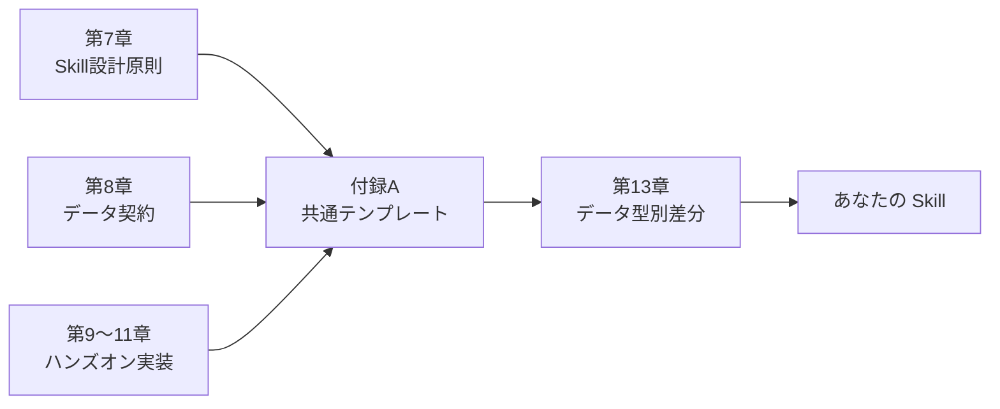

# 付録A プロンプト・Skillテンプレート集

> **本付録の到達目標**
> - ハンズオン章（第9〜11章）で使う **Skill ディレクトリ・SKILL.md・references・tests** の雛形をコピーして自分の Skill を書き始められる
> - 6 つのデータ型ごとに、**入力仕様 / 出力仕様 / 分析4ステップ / 失敗パターン** の差分テンプレートを取り出せる
> - 分析依頼・レビュー・トラブル対処に使う **プロンプトのひな型** を実務で再利用できる
> - 「My First Analysis Skill」が **完成したかどうか** をチェックリストで自己判定できる
>
> **この付録で扱わないこと**
> - 各テンプレートの理論的背景（それは第7〜13章の本文）
> - 装置ごとの物理原理（各装置マニュアルへ）
> - 具体的なライブラリの詳細（付録B「MCPカタログ」／付録C「トラブルシューティング」）

---

## A.1 本付録の位置づけと使い方

本付録は、本文（第7〜13章）で説明した設計原則を、**そのままコピーして自分の Skill に差し替えて使える形** に凝縮したものです。



### 使い方の3パターン

| いつ | どこを見るか | 何をするか |
|---|---|---|
| はじめて Skill を作る | A.2（共通テンプレート） | ディレクトリ・SKILL.md・references を丸ごとコピー |
| データ型が違う | A.3（データ型別） | 該当データ型の差分だけを共通テンプレートに上書き |
| 分析を AI エージェントに頼む | A.4（プロンプトカタログ） | 用途に合うプロンプトをコピーして値を差し替え |
| 完成したか判定したい | A.5（完成チェックリスト） | 全項目を自己チェックし、未達項目に戻る |

> [!TIP]
> 本付録のテンプレートは **「まず動かす」ことを優先** した最小構成です。組織展開や監査対応が必要になったら、第15章と付録C を参照し追加してください。

---

## A.2 ハンズオン共通テンプレート

第9〜11章のハンズオンで共通して使う **Skill ディレクトリ構造・SKILL.md・references・tests** の雛形です。データ型に依存しない部分をここに集約しています。

### A.2.1 Skill ディレクトリ構造（progressive disclosure）

```
skills/
└── my-first-analysis-skill/           ← Skill 名（ケバブケース）
    ├── SKILL.md                       ← ①エントリポイント（必須／〜300行以内）
    ├── references/                    ← ②詳細ドキュメント（必要時のみ読み込み）
    │   ├── input-schema.md            ←   入力データ契約
    │   ├── analysis-steps.md          ←   分析4ステップの詳細
    │   ├── output-schema.md           ←   出力形式（JSON/表/図の仕様）
    │   └── failure-catalog.md         ←   既知の失敗パターンと診断
    ├── scripts/                       ← ③再現用スクリプト（任意）
    │   ├── validate_input.py          ←   入力検証（第8章のデータ契約）
    │   └── run_analysis.py            ←   分析本体（第9章の4ステップ）
    ├── tests/                         ← ④セルフテスト（任意だが強く推奨）
    │   ├── fixtures/                  ←   テスト用のミニデータ
    │   │   └── sample_input.csv
    │   └── test_smoke.py              ←   スモークテスト（1件通るか）
    └── examples/                      ← ⑤使用例（任意）
        └── example_prompt.md          ←   コピペで動く実行プロンプト
```

> [!NOTE]
> **progressive disclosure（漸進的開示）**：SKILL.md はエージェントが毎回読む場所なので短く保ち、詳細は references/ に置いて必要時だけ読ませる、という設計方針です。詳細は第7章 §7.4。

### A.2.2 `SKILL.md` テンプレート（データ型非依存）

以下をコピーし、`{...}` を自分の Skill に合わせて差し替えます。

````markdown
---
name: {your-skill-name}
description: |
  {何をする Skill か 1〜2文}。
  入力: {入力データの1行説明}
  出力: {出力形式の1行説明}
version: 0.1.0
data_type: {spectral | chromatogram | image | diffraction | tabular | multimodal}
target_instruments: [{装置カテゴリ1}, {装置カテゴリ2}]
last_verified: YYYY-MM-DD
---

## ①目的
{この Skill は何のためにあるか。1段落。}

## ②入力条件（データ契約）
- ファイル形式: {CSV / JCAMP-DX / TIFF / ...}
- 必須カラム / 必須メタデータ: {列名, 単位, 装置ID, ...}
- サンプルサイズの想定: {行数 / ピクセル数 / スペクトル本数の目安}
- **前処理の前提**: {背景差引済み / 未処理 / 校正済み ...}

詳細スキーマは `references/input-schema.md` を参照。

## ③出力形式
- **主出力**: {JSON / CSV / PNG / Markdown レポート}
- **必須フィールド**: {peak_positions, area, r_squared, ...}
- **信頼度指標**: {SNR, フィット残差, 検証済みフラグ}

詳細は `references/output-schema.md`。

## ④成功条件
- {分析結果が {条件} を満たす}
- {ユーザが結果を {検証プロセス} で確認できる}
- {同一入力で同一出力（再現性）}

## ⑤禁止事項・受け付けない入力（fatal 拒否条件）
- ❌ 必須カラム不足 → 分析実行せずエラーメッセージを返す
- ❌ 装置ID・測定条件が不明 → 実行拒否
- ❌ {データ型固有の禁止条件}

## ⑥再現性条件
- 使用ライブラリ: {package_name==version}
- 乱数シード: {seed 値または「未使用」}
- 実行日時・実行者を出力に必ず記録

## 実行手順（4ステップ）
1. **入力検証**: `scripts/validate_input.py` で契約を満たすか確認
2. **前処理**: {ベースライン補正 / ノイズ除去 / ...}
3. **分析本体**: {ピーク検出 / 分類 / 定量 / ...}
4. **検証・出力**: 信頼度指標を計算し、`references/output-schema.md` の形式で出力

## 使用例（プロンプト）
```
{装置名} で測定したデータ `{sample_path}` を、
このSkillで分析して。結果は Markdown レポートで、
図表と信頼度指標を含めて。
```

## 評価基準（第9章 §9.8 の6項目）
- [ ] 正確性: {検証データで既知の正解と一致}
- [ ] 再現性: {同一入力→同一出力}
- [ ] 解釈可能性: {なぜその結果になったかを説明できる}
- [ ] データ漏洩リスク: {外部送信されるフィールドを明示}
- [ ] レビュー容易性: {人間が3分以内で妥当性判定できる}
- [ ] 転用可能性: {類似データ型に差分だけで転用可能か}
````

> [!WARNING]
> `data_type` フィールドは A.3 のデータ型別テンプレートと紐付いています。**マルチモーダル統合型を除き、1 Skill = 1 データ型** を推奨します（第7章 §7.5）。

### A.2.3 `references/input-schema.md` テンプレート

````markdown
# 入力スキーマ / データ契約

## ファイル形式
- 拡張子: {.csv / .txt / .tif ...}
- エンコーディング: {UTF-8 / Shift-JIS ...}
- 区切り: {, / \t / スペース}
- ヘッダー行: {あり / なし / N 行目}

## 必須カラム / フィールド
| フィールド名 | 型 | 単位 | 説明 | 例 |
|---|---|---|---|---|
| `x` | float | {nm / cm⁻¹ / 2θ / min} | 横軸 | 400.0 |
| `y` | float | {a.u. / counts} | 縦軸（強度） | 1234.5 |
| `sample_id` | str | - | 試料 ID | S-2026-001 |
| `instrument_id` | str | - | 装置 ID | XRD-01 |
| `measured_at` | ISO8601 | - | 測定日時 | 2026-07-01T10:00:00 |

## 任意メタデータ
- `operator`, `temperature`, `atmosphere`, `notes` など

## 事前条件（この Skill を実行して良い前提）
- [ ] 背景差引: {済 / 未実施 / 不要}
- [ ] 校正: {済 / 未実施 / 標準物質: ...}
- [ ] データ範囲: {min ≤ x ≤ max}

## fatal 拒否条件（実行前にチェック）
- 必須カラムが 1 つでも欠けている
- `sample_id` または `instrument_id` が空
- 行数が {N} 未満（統計的に意味を持たない）
- 単位が不明（コメント欄・別ファイルにも記載なし）
````

### A.2.4 `references/output-schema.md` テンプレート

````markdown
# 出力スキーマ

## 主出力（JSON）
```json
{
  "skill": "my-first-analysis-skill",
  "skill_version": "0.1.0",
  "input": {
    "sample_id": "S-2026-001",
    "instrument_id": "XRD-01",
    "file_hash_sha256": "..."
  },
  "results": {
    /* データ型ごとの中核結果（A.3 参照） */
  },
  "quality_metrics": {
    "snr": 42.0,
    "fit_r_squared": 0.987,
    "n_points": 4096
  },
  "reproducibility": {
    "executed_at": "2026-07-04T10:00:00+09:00",
    "executed_by": "nahisaho",
    "python": "3.12.1",
    "packages": {"numpy": "2.0.1", "scipy": "1.13.0"},
    "seed": 42
  },
  "review_required": false,
  "warnings": []
}
```

## 副次出力
- 図: `output/{sample_id}_summary.png`（1 枚に集約推奨）
- 表: `output/{sample_id}_peaks.csv`
- ログ: `output/{sample_id}_run.log`

## レポート（Markdown）
- 冒頭: 入力・成功条件・主要結果を **3 行以内で要約**
- 図表: 主要指標を 1 図 + 1 表
- 検証: `quality_metrics` を明示
- 末尾: 再現用の実行コマンド
````

### A.2.5 `tests/test_smoke.py` テンプレート

```python
"""スモークテスト：ミニ入力で1件通ることだけを確認"""
from pathlib import Path
import json
import subprocess

FIXTURE = Path(__file__).parent / "fixtures" / "sample_input.csv"


def test_skill_runs_on_fixture(tmp_path):
    """代表データが例外なく最後まで走ること"""
    out = tmp_path / "result.json"
    result = subprocess.run(
        ["python", "scripts/run_analysis.py",
         "--input", str(FIXTURE), "--output", str(out)],
        capture_output=True, text=True, timeout=60,
    )
    assert result.returncode == 0, result.stderr
    assert out.exists()
    payload = json.loads(out.read_text())
    assert payload["review_required"] in (True, False)
    assert "results" in payload
    assert "quality_metrics" in payload
```

> [!TIP]
> スモークテストは **1 分以内に完了する最小データ** で書きます。網羅性より「壊れていない」ことの確認が目的です。回帰・網羅テストは Skill が安定してから追加します。

---

## A.3 データ型別テンプレート（6種）

第13章で定義した 6 データ型ごとに、A.2 との **差分だけ** を列挙します。SKILL.md の `data_type` フィールドと対応します。

### A.3.1 スペクトル型（Raman / XPS / NMR / IR / MS）

**差分ポイント**：横軸単位・ピーク検出・帰属候補・背景モデル

- **入力スキーマ差分**（`references/input-schema.md`）
  - `x`: 波数 (cm⁻¹) / 結合エネルギー (eV) / 化学シフト (ppm) / m/z
  - 必須メタ: 励起波長 / X 線源 / 磁場強度 / イオン化法
- **分析ステップ差分**
  1. 背景差引: rolling ball / SNIP / polynomial fit
  2. スムージング: Savitzky–Golay（窓幅は分解能の 1/5 目安）
  3. ピーク検出: `scipy.signal.find_peaks`（prominence, distance を明示）
  4. フィット: Gaussian / Lorentzian / Voigt
- **出力 `results` 差分**
  ```json
  "peaks": [
    {"position": 1580.2, "unit": "cm-1",
     "intensity": 1234.5, "fwhm": 8.3,
     "assignment_candidate": "G-band (graphitic sp2)",
     "confidence": "review_required"}
  ]
  ```
- **fatal 拒否条件追加**：励起波長不明（Raman）、パスエネルギー不明（XPS）
- **既知の失敗**（`references/failure-catalog.md` に列挙）
  - ピーク 0 本 → prominence が高すぎる／背景モデル不適合
  - 帰属が装置感度域外 → 装置カテゴリを確認

### A.3.2 クロマトグラム・時系列型（GC / LC / TGA / DSC / プロセスログ）

**差分ポイント**：時間軸・ベースラインドリフト・ピーク積分・イベント検出

- **入力スキーマ差分**
  - `x`: 時間 (min) / 温度 (°C) / タイムスタンプ
  - 必須メタ: カラム型番 / 温度勾配 / 昇温速度 / 移動相
- **分析ステップ差分**
  1. ベースライン補正: 局所線形 / ALS
  2. ピーク検出＋積分: `scipy.integrate.trapezoid` または `pyOpenMS`
  3. 保持時間の校正（内標準がある場合）
  4. 定量: 検量線または面積比
- **出力 `results` 差分**
  ```json
  "peaks": [
    {"retention_time": 5.42, "unit": "min",
     "area": 12345.0, "height": 890.1,
     "compound_candidate": null, "quantification_ug_per_ml": null}
  ]
  ```
- **fatal 拒否条件追加**：内標準が指定されているのにデータに存在しない
- **既知の失敗**：ベースラインドリフト過大 → 積分値が装置間で比較不能

### A.3.3 画像・顕微鏡型（OM / SEM / TEM / AFM）

**差分ポイント**：スケールバー・ROI・粒子・欠陥検出

- **入力スキーマ差分**
  - ファイル: TIFF / DM3 / DM4 / PNG
  - 必須メタ: ピクセルサイズ (nm/px) / 加速電圧 / 倍率
- **分析ステップ差分**
  1. スケール校正: メタデータ or スケールバー自動抽出
  2. 前処理: ノイズ除去（median / non-local means）／シェーディング補正
  3. セグメンテーション: 閾値法 / watershed / 事前学習モデル（使うなら明記）
  4. 特徴量抽出: 粒径分布・アスペクト比・面積率
- **出力 `results` 差分**
  ```json
  "objects": {
    "count": 231,
    "size_distribution": {"mean_nm": 45.2, "std_nm": 12.1,
                           "median_nm": 43.0, "hist_bins": [10,20,30,...]}
  },
  "annotated_image": "output/S-2026-001_annotated.png"
  ```
- **fatal 拒否条件追加**：ピクセルサイズ不明・スケールバー未検出
- **既知の失敗**：セグメンテーション過剰分割 → 粒径分布の左裾が実体より短くなる

### A.3.4 回折・散乱パターン型（XRD / SAXS / 電子回折）

**差分ポイント**：ピーク位置→d 値変換・相同定候補・Rietveld 前段

- **入力スキーマ差分**
  - `x`: 2θ (deg) / q (Å⁻¹)
  - 必須メタ: X 線波長 / 入射角 / ステップ幅
- **分析ステップ差分**
  1. 背景差引（低角側の急落含む）
  2. ピーク検出（プロファイル関数：pseudo-Voigt 推奨）
  3. `d = λ / (2 sin θ)` 変換
  4. 相同定：PDF/COD 参照は Skill 内では **候補列挙まで**、確定は人間
- **出力 `results` 差分**
  ```json
  "peaks": [
    {"two_theta_deg": 26.5, "d_angstrom": 3.35,
     "intensity": 4321.0, "phase_candidates": ["Graphite (002)"],
     "confidence": "review_required"}
  ]
  ```
- **fatal 拒否条件追加**：波長不明（PDF 照合不能）
- **既知の失敗**：低角側の背景処理不備 → 存在しない小角ピークを検出

### A.3.5 表形式・プロセス条件型（成膜プロセス / リソグラフィ / 機械特性）

**差分ポイント**：スキーマ検証・欠損値・単位不整合・条件-結果対応

- **入力スキーマ差分**
  - ファイル: CSV / Excel / SQLite
  - 必須: 条件列 + 結果列を明示的に分離
  - 単位はカラム名または別シートに **必ず記載**
- **分析ステップ差分**
  1. スキーマ検証（pandera / great_expectations）
  2. 欠損値・外れ値の扱いを明示（削除 / 補完 / フラグ）
  3. 統計要約 / 単純可視化
  4. 条件-結果の関係抽出（相関・回帰は Skill では **記述統計に限定**）
- **出力 `results` 差分**
  ```json
  "summary": {"n_rows": 120, "n_columns": 15,
              "missing_pct_by_column": {...}},
  "descriptive_stats": {"deposition_rate_nm_per_min":
                          {"mean": 2.3, "std": 0.4, "n": 118}}
  ```
- **fatal 拒否条件追加**：単位カラムが不明・条件列と結果列が判別不能
- **既知の失敗**：欠損を 0 補完 → 統計量が壊れる（欠損は明示扱い）

### A.3.6 マルチモーダル統合型（例：XRD + SEM + プロセス条件）

**差分ポイント**：canonical shape・時間 / 空間対応・各モダリティの信頼度

- **入力スキーマ差分**：各モダリティのファイル群をマニフェストで束ねる
  ```yaml
  # manifest.yaml
  sample_id: S-2026-001
  modalities:
    - type: xrd
      file: xrd/S-2026-001.xy
    - type: sem
      file: sem/S-2026-001.tif
    - type: tabular
      file: process/conditions.csv
  ```
- **分析ステップ差分**
  1. 各モダリティを **単独データ型 Skill で処理**（A.3.1〜A.3.5 の出力を再利用）
  2. 共通キー（`sample_id`）で `results` を統合
  3. **canonical shape**（第11章 §11.4）に整形：`{sample_id, modality, features[], quality}`
  4. モダリティ横断の一貫性チェック（例：XRD 相と SEM 粒径の物理的整合）
- **出力 `results` 差分**
  ```json
  "modalities": {
    "xrd": {...},
    "sem": {...},
    "tabular": {...}
  },
  "cross_modal_consistency": {
    "passed": true,
    "checks": [
      {"name": "XRD phase vs SEM morphology", "result": "consistent"}
    ]
  }
  ```
- **fatal 拒否条件追加**：`sample_id` が全モダリティで一致しない
- **既知の失敗**：モダリティごとの前処理不整合（正規化基準がバラバラ）

> [!IMPORTANT]
> マルチモーダル統合型は **単独データ型 Skill を先に完成** させてから作ります。単独 Skill を統合するラッパー、という位置づけです（第11章 §11.7）。

---

## A.4 プロンプトカタログ

AIエージェントに対して分析・レビュー・診断を依頼するときに、そのままコピーして使えるプロンプトです。`{...}` を差し替えて使います。

### A.4.1 分析リクエスト（最小版）

```
Skill `{skill-name}` を使って、以下の入力を分析してください。

入力ファイル: {path/to/input.csv}
sample_id: {S-2026-001}
instrument_id: {XRD-01}

出力: Markdown レポート（output/ 配下）
含めるもの: 主要図表1枚、quality_metrics、review_required の判定理由
```

### A.4.2 分析リクエスト（安全版：第6章のルール準拠）

```
Skill `{skill-name}` を使って、以下の入力を分析してください。

【禁止事項】
- 入力ファイルの内容を外部サービスに送信しないこと
- ネットワークアクセスは、Skill が明示的に許可した MCP 経由のみ
- 未知の依存パッケージのインストール禁止

【実行条件】
- 入力: {path}
- 事前検証: scripts/validate_input.py を必ず実行
- 失敗時: エラー内容を要約し、`references/failure-catalog.md` の該当エントリを提示

【出力】
- output/{sample_id}_report.md（Markdown）
- output/{sample_id}_result.json
- 実行コマンドと環境情報を末尾に記載
```

### A.4.3 レビュー依頼プロンプト（第7章の評価6項目）

```
以下の分析結果を、6項目でレビューしてください。
各項目は Pass / Fail / Warn の3値で判定し、Fail/Warn には根拠を1行で示してください。

【対象】
- Skill: {skill-name}
- 結果ファイル: {path/to/result.json}
- レポート: {path/to/report.md}

【評価6項目】
1. 正確性: 既知の検証データと一致するか
2. 再現性: 同一入力で同一出力が得られるか（seed・パッケージ版を含む）
3. 解釈可能性: 主要な数値がなぜその値になったかを説明できるか
4. データ漏洩リスク: 外部送信されるフィールドは意図通りか
5. レビュー容易性: 人間が3分以内で妥当性を判定できるか
6. 転用可能性: 類似データ型へ差分だけで転用できる構造か

各判定の根拠は、SKILL.md または references/ の該当箇所を引用してください。
```

### A.4.4 失敗診断プロンプト（第14章のカタログを引く）

```
Skill `{skill-name}` の実行が失敗しました。次の情報から原因を診断してください。

【エラー】
{エラーメッセージまたはログの末尾50行}

【期待していたこと】
{何が起きるはずだったか}

【観測した結果】
{実際に起きたこと}

【診断手順】
1. `references/failure-catalog.md` に該当パターンがあるか確認
2. 該当なしなら、原因の仮説を3つ列挙（可能性の高い順）
3. 各仮説について、確認コマンドまたは追加調査の1手を提案
4. データ / スクリプト / 環境のどこに原因があるかを分類

【禁止】
- 「たぶん動くはず」で修正パッチを当てないこと
- 根本原因が特定できないまま Skill を書き換えないこと
```

### A.4.5 転用プロンプト（他データ型への横展開）

```
Skill `{source-skill}`（データ型: {source_type}）を、
新しいデータ型 `{target_type}` に転用したいです。

【入力する情報】
- 元 Skill の SKILL.md: 添付
- 新データ型の代表ファイル: {sample_path}
- 新データ型の既知メタ: {装置 / 単位 / スケール}

【依頼】
1. 付録A A.3 のうち、新データ型に該当するテンプレートを提示
2. 元 Skill との「差分」を SKILL.md / references / scripts の3層ごとに列挙
3. 転用時に **最小限だけ書き換える案** を1つ提案（他はそのまま流用）
4. 転用後にスモークテストが通るかを試すためのミニ入力を提案

【禁止】
- ゼロから書き直すこと（本 Skill の再利用性を殺す）
- データ型定義（付録A A.3）を無視した独自命名で置き換えること
```

---

## A.5 My First Analysis Skill 完成チェックリスト

第9章の合格ライン「動く・検証済み・再現できる の 3 拍子で Skill を 1 つ以上、自力で作成」を **項目単位で自己判定** するためのチェックリストです。

### A.5.1 動く（最低限これができれば「動く」）

- [ ] SKILL.md が A.2.2 の 6 節（目的・入力・出力・成功条件・禁止・再現性）を持つ
- [ ] `scripts/run_analysis.py` を **1 コマンド**で実行できる
- [ ] `tests/test_smoke.py` が **1 分以内に PASS** する
- [ ] 代表データ 1 件に対し、`results` と `quality_metrics` を含む JSON が出力される
- [ ] 図表 1 枚と Markdown レポートが自動生成される

### A.5.2 検証済み（第7章の評価6項目）

- [ ] **正確性**：既知データで期待値と一致する（またはズレの原因を説明できる）
- [ ] **再現性**：同一入力で 3 回実行し、`results` が bit-identical または許容誤差内
- [ ] **解釈可能性**：主要な数値ごとに根拠（前処理・パラメータ・引用元）を追える
- [ ] **データ漏洩リスク**：外部送信するフィールドを SKILL.md に明示し、意図通り
- [ ] **レビュー容易性**：第三者が Markdown レポートを見て 3 分で妥当性判定できる
- [ ] **転用可能性**：類似データ型に **差分だけの書き換え** で対応できる構造になっている

### A.5.3 再現できる

- [ ] 実行日時・実行者・入力ハッシュが出力に含まれる
- [ ] 使用パッケージのバージョンが `results.reproducibility.packages` に記録される
- [ ] 乱数を使う場合は seed が固定・出力される
- [ ] 実行環境（Python バージョン・OS）が記録される
- [ ] 同一環境で **半年後の自分** が再実行して同じ結果を得られる（心配なら実際に日をおいて試す）

### A.5.4 安全（第6・14章の予防と事例）

- [ ] fatal 拒否条件（A.2.2 の ⑤）が実装され、テストされている
- [ ] `references/failure-catalog.md` に既知失敗が最低 3 件記載されている
- [ ] 外部送信のあるフィールドが SKILL.md に明示されている
- [ ] MCP 経由の外部アクセスは Skill が明示的に許可したもののみ

### A.5.5 拡張性（余力があれば）

- [ ] 別データ型への転用手順（A.4.5 のプロンプト）を試した実績がある
- [ ] スモークテストに加え、境界値テストが 1 件以上ある
- [ ] `examples/example_prompt.md` にコピペで動く実行例がある
- [ ] 章末ワーク（第9〜11章）の演習を Skill に反映している

> [!TIP]
> **A.5.1〜A.5.3 まで揃えば「合格ライン」到達** です（第1章 §1.8）。A.5.4・A.5.5 は組織展開・長期運用に進むときに埋めます。

---

## 章末ワーク

1. **テンプレート適用ドリル**：A.2 の共通テンプレートをコピーし、あなたの実験データに合わせて `{...}` を 30 分で埋める。埋めきれなかった項目に印を付け、対応する本文章を読み返す。
2. **データ型判定演習**：手元の 3 つの装置データについて、A.3 のどのデータ型に該当するかを判定し、その理由を 1 行ずつ書く。判断に迷ったら第13章 §13.8 のマッピング表へ。
3. **プロンプト差し替え演習**：A.4.1〜A.4.5 のうち 3 つを、自分の Skill 用に `{...}` を差し替えて保存する。実際にエージェントに投げて期待通り動くかを確認する。
4. **チェックリスト自己評価**：A.5 の 4 セクション（動く／検証済み／再現できる／安全）を、いま作っている Skill に対して埋める。未達項目を 3 つ選び、対応する本文章の演習に戻る。

---

## 本付録のまとめ

- 本付録は「本文の設計原則を **コピーして差し替えるだけの雛形** にしたもの」であり、単独では設計判断の理由は説明されていない
- **A.2 の共通テンプレート**（ディレクトリ・SKILL.md・references・tests）を土台に、**A.3 のデータ型別差分**を上書きする流れが基本
- **A.4 のプロンプトカタログ**は、AI エージェントへの依頼を安定させる（禁止事項・評価6項目・診断手順をあらかじめ組み込んでいる）ためのもの
- **A.5 の完成チェックリスト**を通しで PASS することが第9章の合格ラインに対応する
- 本付録に **判断の根拠は書かれていない**。迷ったら本文（第7〜13章）に戻ること

---

## 参考資料

### 関連章
- 第7章 Skill 設計原則（progressive disclosure、評価6項目）
- 第8章 データ契約と入力検証
- 第9章 単一データ解析 Skill ハンズオン（本付録テンプレートの起点）
- 第10章 文献統合 Skill
- 第11章 マルチモーダル Skill
- 第12章 検証とレポート化
- 第13章 装置カテゴリ別テンプレート（データ型別差分の詳細）
- 第14章 失敗パターンとリスク管理（`failure-catalog.md` の原典）

### 関連付録
- 付録B MCP カタログ（使用ライブラリ・MCP サーバの選択）
- 付録C トラブルシューティング（実行時エラーの対処）

### 外部参考
- Anthropic「Progressive Disclosure in Agent Skill Design」<https://www.anthropic.com/engineering/skills>
- Model Context Protocol 仕様 <https://modelcontextprotocol.io/specification>
