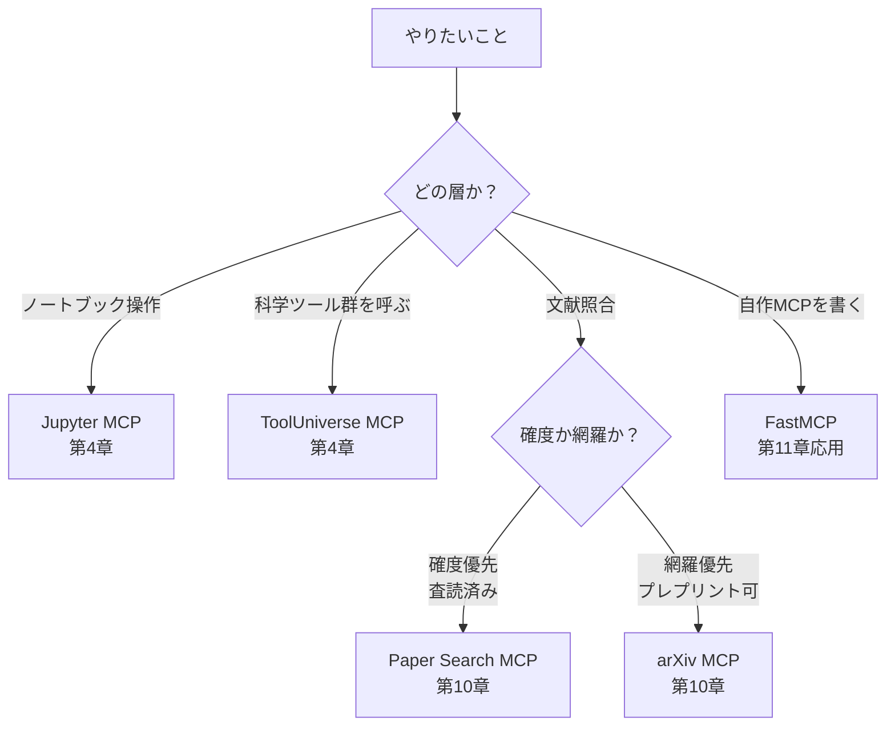
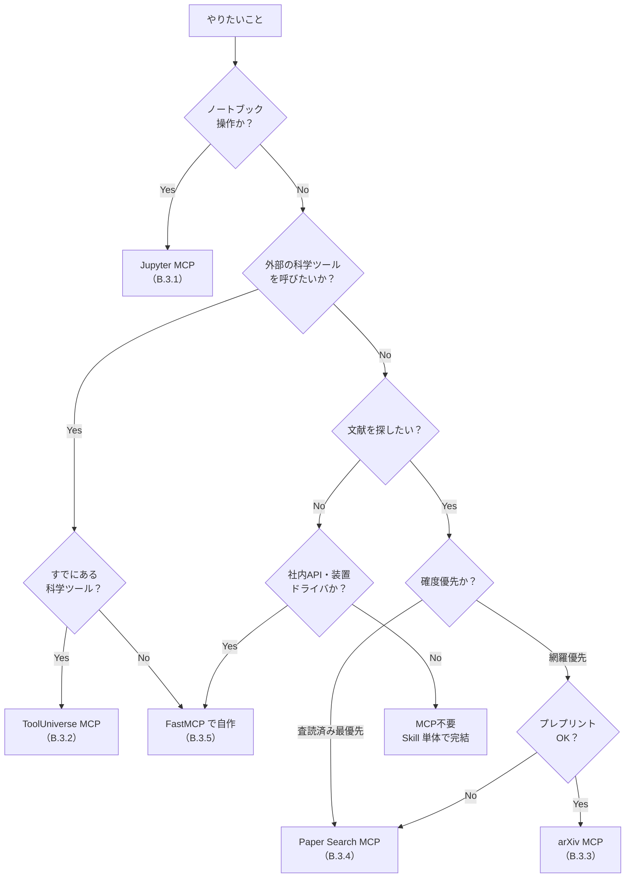

# 付録B MCPカタログ（用途別選択ガイド）

> **本付録の到達目標**
> - 本書で扱う **5 種類の MCP サーバ**（Jupyter / ToolUniverse / arXiv / Paper Search / FastMCP）の役割・使い分けを 1 表で説明できる
> - 自分がやりたいこと（用途）から、どの MCP を使うかを **フローチャートで判断**できる
> - 各 MCP の `.mcp.json` テンプレートをコピーして自分の環境で動かせる
> - API キー・秘密情報を **どこにどう置くか** の運用方針を持てる
>
> **この付録で扱わないこと**
> - 各 MCP の内部実装・拡張方法（それは各リポジトリの公式ドキュメント）
> - MCP プロトコル仕様の詳細（[MCP 仕様](https://modelcontextprotocol.io/specification) を参照）
> - 各 MCP を使ったハンズオン（第4・5・10章）
> - トラブルシューティング（付録C）

---

## B.1 本付録の位置づけと使い方

第4章で **標準5点環境**（Python + JupyterLab + Jupyter MCP + GitHub Copilot CLI + ToolUniverse MCP）を導入しました。第10章で **発展構成** として arXiv / Paper Search を追加しました。第7〜9章で自作 Skill を書き、必要に応じて FastMCP で自作 MCP を作れます。

本付録は、これらの MCP を **「いつ・どれを・どう使うか」を用途起点で引ける** ようにしたものです。



### 使い方の 3 パターン

| いつ | どこを見るか |
|---|---|
| 環境を組む前に全体像を把握したい | B.2 用途→MCP マッピング表・B.6 選択フローチャート |
| 具体的な `.mcp.json` を書きたい | B.4 `.mcp.json` テンプレート集 |
| API キーの扱いに迷った | B.5 API キーとシークレット管理 |

> [!IMPORTANT]
> 本付録の MCP バージョン・API 仕様は **本書執筆時点** のものです。各リポジトリの README で最新版を確認してください。特に MCP 仕様は活発に進化中で、`.mcp.json` のフィールド名が変わる可能性があります[[1]](#ref-1)。

---

## B.2 用途→MCP マッピング（クイック選択）

**やりたいこと → 使う MCP** の一覧表です。詳細な設定は B.3・B.4 を参照してください。

| やりたいこと | 使う MCP | 章 | 本書の位置づけ |
|---|---|---|---|
| ノートブックを AI エージェントから操作 | **Jupyter MCP** | 第4・5・9〜11章 | 標準5点 |
| セル追加・実行・カーネル再起動を自動化 | **Jupyter MCP** | 第5章 | 標準5点 |
| 1000 種類以上の科学ツール群を呼ぶ | **ToolUniverse MCP** | 第4・10・11章 | 標準5点 |
| 論文検索 API・DB 検索・生物学ツール等 | **ToolUniverse MCP** | 第10章 | 標準5点 |
| arXiv プレプリントを網羅検索 | **arXiv MCP** | 第10章 | 発展構成 |
| DOI ベースで査読付き論文を確実に取得 | **Paper Search MCP** | 第10章 | 発展構成 |
| 自分の装置ドライバ・社内 API を MCP 化 | **FastMCP**（自作） | 発展 | 発展構成 |
| 単発の Python スクリプトを MCP 化 | **FastMCP**（自作） | 発展 | 発展構成 |

> [!TIP]
> **迷ったら標準5点だけ** で第9章まで通しでハンズオンできます。arXiv / Paper Search / FastMCP は必要になってから足す発展構成です（第3章の環境切り分け方針）。

---

## B.3 MCP カタログ（詳細）

各 MCP について、**役割 / 得意なこと / 苦手なこと / 起動方法 / 依存 / 注意点** を統一フォーマットで示します。

### B.3.1 Jupyter MCP

| 項目 | 内容 |
|---|---|
| **提供元** | Datalayer（`datalayer/jupyter-mcp-server`）[[2]](#ref-2) |
| **役割** | Copilot CLI（AI エージェント）から **JupyterLab を操作** する MCP サーバ |
| **主な機能** | ノートブックの読み書き、セル追加・実行、カーネル再起動、変数取得 |
| **得意** | 自然言語→ノートブック操作、リアルタイムのセル追加・実行 |
| **苦手** | 外部データ取得・ネットワーク（担当外）／JupyterLab が停止していると動かない |
| **依存** | `jupyter-collaboration`, `pycrdt`（バージョン固定推奨、第4章 §4.4） |
| **起動** | `uvx jupyter-mcp-server`（uv 経由）／JupyterLab のポート・トークンと **一致必須** |
| **ピン推奨** | `jupyter-mcp-server==0.14.4`（本書標準環境。第4・7・11章と一致） |
| **本書での使い所** | 第4章導入、第5章の最小分析、第9〜11章のハンズオン全般 |

### B.3.2 ToolUniverse MCP

| 項目 | 内容 |
|---|---|
| **提供元** | mims-harvard（`mims-harvard/ToolUniverse`）[[3]](#ref-3) |
| **役割** | **1000 種類以上の科学ツール・データ・API** を束ねる MCP サーバ |
| **主な機能** | 文献検索・生物学 DB・化合物 DB・特許検索など多数のツール呼び出し |
| **得意** | 幅広い外部 API を 1 つの MCP でまとめて扱う／エージェントに設定を任せる導入手順もある |
| **苦手** | ツールごとに API キーが必要／未設定ツール呼び出し時にエラー／個別 API のレート制限は個別対応 |
| **依存** | Python 環境、各ツールに必要な API キー（後述 B.5） |
| **起動** | `uvx tooluniverse`（第4章 §4.7） |
| **ピン推奨** | `tooluniverse==1.4.4`（本書標準環境） |
| **本書での使い所** | 第4章導入、第10章の文献照合、第11章のマルチモーダル拡張 |

> [!NOTE]
> ToolUniverse に含まれる 1000+ ツールのうち、**個々のツールは独立した API 契約** を持ちます。ある試料の DB 検索が可能でも、別 API はキー未設定でエラー、ということが普通に起きます。使うツールを絞り、必要な API キーだけ設定するのが実用的です（B.5）。

### B.3.3 arXiv MCP

| 項目 | 内容 |
|---|---|
| **提供元** | `blazickjp/arxiv-mcp-server`[[4]](#ref-4)（同名の実装が複数あるため URL 明示） |
| **役割** | **arXiv.org のプレプリント検索** を MCP 経由で提供 |
| **主な機能** | キーワード検索、著者・カテゴリ絞り込み、アブスト取得、PDF ダウンロード |
| **得意** | 最新のプレプリント網羅（物理・材料・機械学習系に強い） |
| **苦手** | 査読前ドラフトが混ざる／書誌整合性の保証なし／プレプリントのバージョン差 |
| **依存** | Python 環境、ネットワーク接続（arxiv.org） |
| **起動** | `uvx arxiv-mcp-server`（実装によりコマンド名が異なる。README 参照） |
| **本書での使い所** | 第10章の文献照合（**Paper Search と併用してカバレッジと確度を両立**） |

> [!WARNING]
> arXiv MCP には **同名の異なる実装が複数存在** します[脚注：第10章 脚注1]。本書は `blazickjp/arxiv-mcp-server` を前提としています。別実装を使う場合は API・設定方法が異なるので、リポジトリを明示的に確認してください。

### B.3.4 Paper Search MCP

| 項目 | 内容 |
|---|---|
| **提供元** | openags（`openags/paper-search-mcp`）[[5]](#ref-5) |
| **役割** | **DOI ベースで査読付き論文** を検索する MCP |
| **主な機能** | 複数学術 DB の横断検索、DOI での一意特定、書誌情報取得 |
| **得意** | 査読付き文献の確度・引用文献リスト作成 |
| **苦手** | 収録 DB に依存（未収録ジャーナルは弱い）／プレプリントは対象外 |
| **依存** | Python 環境、ネットワーク接続、DB により API キー |
| **起動** | `uvx paper-search-mcp`（README 参照） |
| **本書での使い所** | 第10章の文献照合（arXiv と併用） |

### B.3.5 FastMCP（自作 MCP のフレームワーク）

| 項目 | 内容 |
|---|---|
| **提供元** | `jlowin/fastmcp`[[6]](#ref-6) |
| **役割** | **自作 MCP サーバを Python の関数デコレータで構築** するフレームワーク |
| **主な機能** | `@mcp.tool` デコレータで関数を MCP ツール化、リソース・プロンプトも定義可能 |
| **得意** | 装置ドライバ・社内 API・独自変換ロジックを **軽く MCP 化** できる |
| **苦手** | 大規模な多数ツールの束（ToolUniverse の役割）／認証・スケーリングは自前実装 |
| **依存** | Python 環境、必要な社内 API・装置ドライバ |
| **起動** | `python my_mcp_server.py` などスクリプト実行、または `uvx` 経由 |
| **本書での位置づけ** | 発展構成。自装置カテゴリの前処理を Skill 外に切り出したいときに検討 |

> [!TIP]
> FastMCP は **Skill と使い分けます**。Skill は「AI エージェントに読ませる説明書 + スクリプト集」、FastMCP は「装置・API を MCP プロトコルで公開するサーバ」です。装置操作や社内 API 呼び出しなど **状態を持つもの** は FastMCP、分析ロジック（無状態）は Skill が原則です（第7章 §7.3）。

---

## B.4 `.mcp.json` テンプレート集

Copilot CLI が読み込む `.mcp.json` の設定例です。プロジェクトごとにリポジトリ直下の `.mcp.json` に置きます。個人共通のものは `~/.copilot/.mcp.json` に置けます。

### B.4.1 標準5点（Jupyter + ToolUniverse）

```json
{
  "mcpServers": {
    "jupyter": {
      "command": "uvx",
      "args": ["jupyter-mcp-server==0.14.4"],
      "env": {
        "JUPYTER_URL": "http://localhost:8888",
        "JUPYTER_TOKEN": "${JUPYTER_TOKEN}"
      }
    },
    "tooluniverse": {
      "command": "uvx",
      "args": ["tooluniverse==1.4.4"]
    }
  }
}
```

- `JUPYTER_TOKEN` は JupyterLab 起動時のトークンと **必ず一致** させる（第4章 §4.6）
- `${VAR}` は環境変数展開（実装により対応状況が異なる。対応していない場合は直書きせず、`~/.copilot/.mcp.json` に個人設定で切り出す）

### B.4.2 発展構成（+ arXiv + Paper Search）

```json
{
  "mcpServers": {
    "jupyter": {
      "command": "uvx",
      "args": ["jupyter-mcp-server==0.14.4"],
      "env": {
        "JUPYTER_URL": "http://localhost:8888",
        "JUPYTER_TOKEN": "${JUPYTER_TOKEN}"
      }
    },
    "tooluniverse": {
      "command": "uvx",
      "args": ["tooluniverse==1.4.4"]
    },
    "arxiv": {
      "command": "uvx",
      "args": ["arxiv-mcp-server"]
    },
    "paper-search": {
      "command": "uvx",
      "args": ["paper-search-mcp"]
    }
  }
}
```

### B.4.3 自作 MCP（FastMCP）を追加

```json
{
  "mcpServers": {
    "jupyter": {
      "command": "uvx",
      "args": ["jupyter-mcp-server==0.14.4"],
      "env": {
        "JUPYTER_URL": "http://localhost:8888",
        "JUPYTER_TOKEN": "${JUPYTER_TOKEN}"
      }
    },
    "my-instrument": {
      "command": "python",
      "args": ["-m", "my_instrument_mcp"],
      "cwd": "/absolute/path/to/my_instrument_mcp"
    }
  }
}
```

- `cwd` を絶対パスで書くことで、Copilot CLI をどこから起動しても同じサーバが立ち上がる
- 自作 MCP は起動失敗しても Copilot CLI 全体は動くが、`mcp list` で `failed` 表示になるので確認する

### B.4.4 動作確認コマンド

```bash
# 登録済み MCP の一覧
copilot mcp list

# 個別 MCP の疎通確認（Copilot CLI 内から）
> Jupyter MCP に接続し、現在開いているノートブックのタイトルを教えて。
> ToolUniverse MCP に接続し、利用可能なツールを 5 つ列挙して。
```

登録失敗時の原因切り分けは付録C（トラブルシューティング）を参照してください。

---

## B.5 API キーとシークレット管理

MCP を経由する外部 API には API キー・トークンが必要なものがあります。**キーの扱いは第6章の安全ルールに直結** します。

### B.5.1 置き場所の優先順位

| 優先度 | 置き場所 | 用途 |
|---|---|---|
| ✅ 推奨 | 環境変数（`~/.zshrc` / `~/.bashrc` / OS のキーチェーン） | 個人利用の恒久キー |
| ✅ 推奨 | プロジェクト直下の `.env` + `.gitignore` に `.env` を必ず追加 | プロジェクト固有のキー |
| ⚠️ 注意 | `.mcp.json` の `env` フィールド | `.mcp.json` を `.gitignore` に入れる場合のみ |
| ❌ 禁止 | Skill の SKILL.md や scripts/ に直書き | 第14章の漏洩事例に該当 |
| ❌ 禁止 | ノートブック（`.ipynb`）に直書き | セル出力に残り漏洩 |
| ❌ 禁止 | チャット履歴・プロンプトに直書き | AI 側ログに残る |

### B.5.2 `.env` テンプレート

```bash
# .env（.gitignore に必ず追加）
JUPYTER_TOKEN=xxxxxxxxxxxxxxxxxxxxxxxx
ARXIV_API_KEY=（arXiv は原則不要。レート制限のみ）
PAPER_SEARCH_API_KEY=（利用 DB により必要）
TOOLUNIVERSE_OPENAI_KEY=sk-xxxx    # ToolUniverse 内で LLM ツールを使う場合
TOOLUNIVERSE_PUBMED_KEY=xxxx       # PubMed 系ツールを使う場合
```

### B.5.3 `.gitignore` 必須項目

```gitignore
# シークレット
.env
.env.*
!.env.example
*.pem
*.key

# MCP 個別
.mcp.json                     # 環境依存の設定を含む場合
.copilot/                     # ローカルキャッシュ
```

> [!WARNING]
> **`.mcp.json` を Git に含める場合は、`env` フィールドから秘密情報を必ず除去** してください。プロジェクトで共有する `.mcp.json` は「サーバ定義のみ」、秘密情報は各人の `~/.copilot/.mcp.json` または OS のシークレットストアに置く、が推奨です。

### B.5.4 漏洩事故のミニ FAQ

- **Q: 誤って API キーを push した**
  - A: 直ちに **API プロバイダ側でキーを失効** させる。Git 履歴の書き換え（`git filter-repo` 等）だけでは不十分（push 済みのものは他者に取得済みの可能性あり）
- **Q: ノートブックのセル出力にキーが表示された**
  - A: セルクリア＋保存＋履歴クリーンアップ。共有前に `nbstripout` などで出力を落とす
- **Q: プロンプトに貼ってしまった**
  - A: そのセッションの履歴を消しても、AI プロバイダ側のログに残る可能性を前提に、キー失効を優先

詳細な失敗事例は第14章、予防ルールは第6章を参照してください。

---

## B.6 選択判断フローチャート

「何をやりたいか」から出発して、使う MCP を選ぶためのフローチャートです。



### 判断のポイント

1. **ノートブック操作は Jupyter MCP 一択**（他 MCP はカーネルを触れない）
2. **既存の科学ツールがあるなら ToolUniverse を最初に探す**（自作より速い）
3. **文献検索は arXiv と Paper Search を併用**（片方だけだとカバレッジ・確度が不足、第10章 §10.2）
4. **装置ドライバ・社内 API は FastMCP**（Skill 単体では状態管理が破綻）
5. **上記に該当しなければ MCP 不要**（Skill だけで足りる）

---

## 章末ワーク

1. **自環境監査**：`copilot mcp list` を実行し、現在登録されている MCP と B.3 の対応を書き出す。未使用 MCP があれば削除、必要な MCP が抜けていれば B.4 のテンプレートで追加する。
2. **秘密情報の棚卸し**：自分のリポジトリで `git grep -Ei "api[_-]?key|token|password"` を実行し、平文で残っている情報がないか点検する（B.5.1 の禁止項目に該当していないか）。
3. **選択フロー適用**：手元の 3 つの分析タスクについて、B.6 のフローチャートで使う MCP を判定する。判定結果を SKILL.md の `description` に **「いつ使うか」** として反映する（付録A A.2.2 と対応）。
4. **FastMCP で 1 ツール自作**：装置カテゴリ固有の変換関数（例：`raman_intensity_normalize`）を FastMCP で MCP 化し、`.mcp.json` に追加する（発展課題）。

---

## 本付録のまとめ

- 本書で扱う MCP は **5 種類**：Jupyter / ToolUniverse は標準5点、arXiv / Paper Search は文献照合用の発展構成、FastMCP は自作用
- **迷ったら B.6 のフローチャート** で判定する。ノートブック操作＝Jupyter、既存ツール活用＝ToolUniverse、文献＝arXiv+Paper Search 併用、自作＝FastMCP
- `.mcp.json` は B.4 のテンプレートをコピーして差し替える。JupyterLab のポート・トークンは **必ず一致**
- API キーは **環境変数か `.env`＋`.gitignore`** に置く。SKILL.md・ノートブック・チャット直書きは禁止
- MCP 実装は活発に進化中。`.mcp.json` のフィールドや起動コマンドが変わる可能性を前提に、各 MCP の README を定期的に確認する

---

## 参考資料

<a id="ref-1">[1]</a> Model Context Protocol Specification — <https://modelcontextprotocol.io/specification> — 最終アクセス: 2026-07-04

<a id="ref-2">[2]</a> Jupyter MCP Server（Datalayer） — <https://github.com/datalayer/jupyter-mcp-server> — ドキュメント: <https://jupyter-mcp-server.datalayer.tech/>

<a id="ref-3">[3]</a> ToolUniverse（mims-harvard） — <https://github.com/mims-harvard/ToolUniverse> — ドキュメント: <https://zitniklab.hms.harvard.edu/ToolUniverse/>

<a id="ref-4">[4]</a> arXiv MCP Server — <https://github.com/blazickjp/arxiv-mcp-server> — 同名の異なる実装が複数存在するため URL 明示

<a id="ref-5">[5]</a> Paper Search MCP — <https://github.com/openags/paper-search-mcp>

<a id="ref-6">[6]</a> FastMCP — <https://github.com/jlowin/fastmcp>

### 関連章
- 第3章 AI Agent・MCP・Skill の全体像
- 第4章 環境構築（標準5点の導入）
- 第5章 Jupyter MCP で最小の自然言語分析
- 第6章 MCP の安全な使い方（本付録 B.5 と対応）
- 第10章 文献照合 Skill（arXiv / Paper Search の使い分け）
- 第14章 失敗パターン（漏洩事例）

### 関連付録
- 付録A プロンプト・Skillテンプレート集
- 付録C トラブルシューティング（MCP 接続不良の対処）
