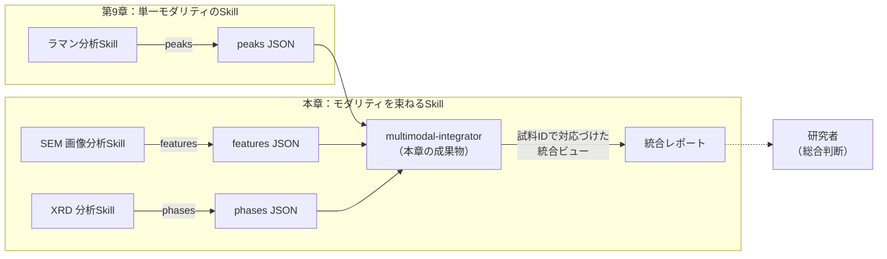
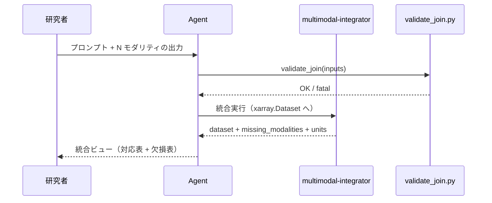

# 第11章　ハンズオン3：複数モダリティ連携Skillを作る

> **本章の到達目標**
> - 第9・10章で作った単一データ型のSkillを **横に連ねる／束ねる** ことで、複数モダリティ（分光×顕微鏡×回折など）を扱える
> - **試料ID・座標系・時刻**を共通軸として、異種データの**対応づけ**を Skill 契約として書ける
> - マルチモーダル特有の失敗モード（**単位不整合・対応ミスマッチ・部分欠損の伝播**）を検知・防止できる
> - **Skill を分けるか合わせるか**の判断基準を持てる（過剰統合の回避）
> - `xarray.Dataset` を Skill 内部表現とした最小のマルチモーダル統合Skillを1本書ける

**扱うこと**：複数モダリティ統合Skill（`multimodal-integrator`）の設計・実装・実行、モダリティ間対応づけの契約、第9・10章との**差分**。
**扱わないこと**：単一モダリティのSkill本体（第9章）、文献照合（第10章）、実行後の物理的妥当性検証（第12章）、装置カテゴリ別テンプレの全網羅（第13章）、失敗事例の体系分析（第14章）。

> [!NOTE]
> 本章は**第9・10章との差分中心**の構成です。Skill ディレクトリ構造・progressive disclosure・6評価基準・承認ゲート・データ契約の 7 要素はすべて既出のため、必要に応じて第7〜10章を参照してください。

---

## 11.1　この章で作るSkillの概要（差分）

第9章の分析Skillは 1 データ型に閉じており、第10章の文献照合Skillも入力は「単一の分析結果」でした。本章では、**複数のモダリティ**（例：ラマン分光＋SEM 画像＋XRD パターン）を **1つの試料** に紐付けて解釈する Skill を追加します。



**成果物**：`.github/skills/multimodal-integrator/` 以下の一式。第9・10章と同じ progressive disclosure（§9.3）構造を踏襲します。

### 第9・10章との主な差分

| 論点 | 第9章（単一分析） | 第10章（文献照合） | 本章（統合） |
|---|---|---|---|
| 入力 | 生データ1本 | 分析出力1本 | **分析出力 N 本** |
| 主要ツール | scipy | arXiv/Paper Search MCP | **`xarray` + 試料IDによるJOIN** |
| 主なリスク | 単位ミス | ハルシネーション | **対応ミスマッチ・単位不整合** |
| 出力の性質 | 数値 | 候補 | **モダリティ横断ビュー**（数値+候補） |
| 禁止事項の重心 | 物質同定禁止 | DOI検証・同定禁止 | **対応が取れない試料の "無理やり結合" 禁止** |

---

## 11.2　「共通軸」を決めるのが最重要

複数モダリティを結合するとき、最初に決めるのは **どの軸で対応づけるか** です。これは Skill の契約の中核をなします。

| 共通軸 | 使う場面 | 例 |
|---|---|---|
| **試料ID** | 同一試料に複数装置を当てた場合 | ラマン ＋ SEM ＋ XRD すべて同じ `sample_id="S001"` |
| **座標**（x,y） | マッピング測定・同一試料の位置対応 | ラマンマッピング ＋ SEM 画像の同一位置 |
| **時刻** | in-situ / operando 測定 | 昇温XRD ＋ 質量分析（TG-MS） |
| **エネルギー・波数など物理量** | スペクトル間の重ね合わせ | 光吸収 ＋ 光電子分光 |

> [!IMPORTANT]
> **共通軸を1つに絞る**ことが原則です。「試料IDと座標の両方で結合」しようとすると、契約が複雑になり実装ミスが増えます。試料IDで束ねてから、必要なら座標マッピングを子モダリティとして扱う、と段階を分けてください。

### 共通軸の書き方（データ契約への追記）

第8章の 7 要素データ契約に、マルチモーダル用の追記を1項目加えます。

- **⑧統合キー**：`join_key_type` = `sample_id` | `sample_id_xy` | `sample_id_t` のいずれか1つ（各値の**構造**は §11.3 参照）

契約に書いておけば、Skill は「その軸で対応が取れないデータは fatal で拒否」できます。

---

## 11.3　SKILL.md の差分

第9章 §9.4 と同じ骨格。差分のみ示します。

### Frontmatter（差分）

```yaml
---
name: multimodal-integrator
description: |
  複数モダリティ（分光・顕微鏡・回折・熱分析等）の分析出力を、
  試料IDまたは座標を共通軸として結合し、統合ビュー（xarray.Dataset相当）を返す。
  結合できないデータは fatal で拒否し、モダリティ間の解釈・帰属は行わない。
version: 1.0.0
compatibility: python>=3.11, numpy, pandas, xarray, jsonschema
tags: [multimodal, integration, xarray, join]
---
```

### 本文の差分（重要な項目のみ）

**① 目的**：N 個のモダリティの分析出力（各々が第9・10章の Skill 出力）を受け取り、`join_key_type` で対応づけた統合データセットを返す。**モダリティ間の因果関係・物理的解釈は行わない**（第12章の検証／人間の判断領域）。

**② 入力条件（データ契約）**：
- 入力は `list[dict]`。各 dict は下記の**canonical shape**に準拠する。
  ```json
  {
    "modality": "raman",
    "join_key_type": "sample_id",
    "join_key_value": "S001",
    "units":      {"raman_x": "cm-1"},
    "quantities": {"raman_x": "wavenumber"},
    "payload":    {}
  }
  ```
- 全モダリティで `join_key_type` が**一致**（`sample_id` に混ぜて `sample_id_t` を渡すのは fatal）。
- `join_key_value` の**構造は `join_key_type` に応じる**：
  - `sample_id`    → `str`（例：`"S001"`）
  - `sample_id_xy` → `[str, number, number]`（例：`["S001", 12.5, 3.0]`）
  - `sample_id_t`  → `[str, number]`（例：`["S001", 60.0]`）
- `units` は各モダリティで**名前空間つき**（`raman_x`, `xrd_x`, `sem_grain` …）にし、キーの衝突を避ける。
- `quantities` は各 `units` キーを**正規化された物理量名**にマップする（例：`raman_x → wavenumber`, `xrd_x → angle`）。**同じ物理量が異なる単位を持つ**場合は fatal。
- `payload` はモダリティごとに `references/schemas/<modality>.json` に準拠。

**③ 出力形式**：`references/output-schema.json` を新設（次節）。統合ビューは JSON では入れ子オブジェクトとして表現し、Python 側では `xarray.Dataset` にロードする。

**④ 成功条件**：
- **異なるモダリティが2種以上**（同一モダリティの複数件は1種としてカウント）
- 全モダリティが `join_key_type` で **1件以上マッチする共通キー**を持つ（マッチ 0 は fatal）
- **部分欠損（あるモダリティだけ試料 S002 が無い）は許容**するが `missing_modalities` に必ず記録
- **同じ物理量に異なる単位が混ざっている場合は fatal**（`quantities` を介して検知）
- `discussion` に「本Skillは対応づけまで、解釈は行っていない」旨を必ず1文含める

**⑤ 禁止事項・受け付けない入力（fatal 拒否条件）**：
- `join_key_type` の種類が不揃い
- `join_key_value` の構造が `join_key_type` と不一致
- 同じ `join_key_value` に同一モダリティが2件以上（重複）
- 同じ `quantity`（例：`wavenumber`）に異なる単位が混ざる（例：`cm-1` と `nm`）
- **モダリティ間の因果関係・物質同定・ピーク帰属を推測すること**（第9・10章と同じ）
- Agent のチャット応答での物質同定・帰属推測（第9・10章と同じ）
- 対応が取れないモダリティを空データで水増しして結合すること

**⑥ 再現性条件**：`join_key_type`・共通キー・モダリティごとの `version`／単位辞書／`quantities`／`missing_modalities` を、`provenance` 構造化フィールド（次節参照）に記録する。`discussion` にはこれらの要約と「対応づけまで／解釈なし」の一文を書く。

---

## 11.4　`references/output-schema.json`

```json
{
  "$schema": "http://json-schema.org/draft-07/schema#",
  "title": "multimodal-integrator output",
  "type": "object",
  "required": ["join_key_type", "modalities", "matched_keys", "missing_modalities", "units", "quantities", "dataset", "provenance", "discussion"],
  "properties": {
    "join_key_type": {"type": "string", "enum": ["sample_id", "sample_id_xy", "sample_id_t"]},
    "modalities": {
      "type": "array",
      "items": {"type": "string"},
      "minItems": 2,
      "uniqueItems": true
    },
    "matched_keys": {
      "type": "array",
      "items": {"type": ["string", "array"]},
      "minItems": 1
    },
    "missing_modalities": {
      "type": "object",
      "additionalProperties": {"type": "array", "items": {"type": "string"}}
    },
    "units": {
      "type": "object",
      "additionalProperties": {"type": "string"}
    },
    "quantities": {
      "type": "object",
      "additionalProperties": {"type": "string"}
    },
    "dataset": {
      "type": "object",
      "description": "xarray.Dataset を to_dict() で JSON 化したもの（詳細は references/xarray-format.md）"
    },
    "provenance": {
      "type": "object",
      "required": ["skill_version", "modality_versions", "run_datetime_utc"],
      "properties": {
        "skill_version":      {"type": "string"},
        "modality_versions":  {"type": "object", "additionalProperties": {"type": "string"}},
        "run_datetime_utc":   {"type": "string", "format": "date-time"}
      }
    },
    "discussion": {"type": "string"}
  }
}
```

**設計のポイント**：
- `join_key_type` は enum（プロース中の名称と一致）
- `modalities` は `uniqueItems: true` で**異なる名前2件以上**をスキーマレベルで保証
- `matched_keys` が空なら fatal（④成功条件と一致）
- `missing_modalities` は「試料 S002 で SEM 欠損」等を `{"S002": ["sem"]}` の形で記録
- `units` はキー名を **モダリティ名前空間つき**（`{"raman_x": "cm-1"}` 等）で書く。キーの衝突を避けるため
- `quantities` は `units` のキーを**正規化された物理量名**（`wavenumber`, `time`, `angle`, `length` …）にマップ。**同じ物理量に異なる単位が付いていれば fatal**
- `provenance` に Skill バージョン・各モダリティのバージョン・実行時刻を**構造化**して記録（自由テキストの `discussion` とは別に、機械可読）
- `dataset` は `required` に含める（"見せかけの空Dataset" を防ぐ）

---

## 11.5　`scripts/validate_join.py`

統合キーの一致・単位の整合を確認するスクリプト。第9・10章と同じく **決定的チェック** を Skill 本文の外に出します。

```python
import json, sys

def _shape_matches(key_type: str, val) -> bool:
    """join_key_type ごとに join_key_value の構造を検証。"""
    if key_type == "sample_id":
        return isinstance(val, str)
    if key_type == "sample_id_xy":
        return (isinstance(val, list) and len(val) == 3
                and isinstance(val[0], str)
                and all(isinstance(v, (int, float)) for v in val[1:]))
    if key_type == "sample_id_t":
        return (isinstance(val, list) and len(val) == 2
                and isinstance(val[0], str)
                and isinstance(val[1], (int, float)))
    return False

def validate_join(inputs: list[dict]) -> list[str]:
    errs = []
    # 異なるモダリティが2種以上必要（同一モダリティ複数件は 1 種とみなす）
    modalities = {i.get("modality") for i in inputs}
    if len(modalities) < 2:
        errs.append(f"fatal: at least 2 distinct modalities required (got {sorted(modalities)})")
        return errs

    # join_key_type の種類は全モダリティで一致
    key_types = {i.get("join_key_type") for i in inputs}
    if len(key_types) != 1:
        errs.append(f"fatal: inconsistent join_key_type: {key_types}")
    kt = next(iter(key_types)) if len(key_types) == 1 else None

    # join_key_value の構造チェック（key_type に応じる）
    for idx, i in enumerate(inputs):
        if kt and not _shape_matches(kt, i.get("join_key_value")):
            errs.append(f"fatal: input[{idx}] join_key_value shape does not match {kt}: "
                        f"{i.get('join_key_value')!r}")

    # 同一モダリティ×同一キー値の重複禁止
    seen = set()
    for i in inputs:
        pair = (i.get("modality"), json.dumps(i.get("join_key_value"), sort_keys=True))
        if pair in seen:
            errs.append(f"fatal: duplicate modality+key: {pair}")
        seen.add(pair)

    # 単位辞書：キーの衝突（同じ unit_key に違う unit）は fatal
    units = {}
    for i in inputs:
        for k, v in (i.get("units") or {}).items():
            if k in units and units[k] != v:
                errs.append(f"fatal: unit mismatch for {k}: {units[k]} vs {v}")
            units[k] = v

    # 物理量ベースの単位整合：同じ quantity に違う unit は fatal（M4対策）
    quantity_to_unit = {}  # {"wavenumber": "cm-1"} など
    for i in inputs:
        u_map = i.get("units") or {}
        q_map = i.get("quantities") or {}
        for unit_key, quantity in q_map.items():
            unit = u_map.get(unit_key)
            if unit is None:
                errs.append(f"fatal: quantities[{unit_key}]={quantity} but no matching units")
                continue
            prev = quantity_to_unit.get(quantity)
            if prev and prev != unit:
                errs.append(f"fatal: quantity '{quantity}' has different units: {prev} vs {unit}")
            quantity_to_unit[quantity] = unit

    # マッチ 0 の検出（同一モダリティの複数キーは union して比較）
    keys_per_modality = {}
    for i in inputs:
        keys_per_modality.setdefault(i["modality"], set()).add(
            json.dumps(i.get("join_key_value"), sort_keys=True))
    common = set.intersection(*keys_per_modality.values()) if keys_per_modality else set()
    if not common:
        errs.append("fatal: no matched keys across modalities")
    return errs

if __name__ == "__main__":
    data = json.load(open(sys.argv[1]))
    errs = validate_join(data)
    if errs:
        print("\n".join(errs)); sys.exit(1)
    print("OK")
```

---

## 11.6　使用例プロンプトと実行フロー

### 使用例プロンプト

```
以下の分析出力を multimodal-integrator で結合してください。
共通軸は sample_id、モダリティは raman, sem, xrd の3つ。
モダリティ間の因果関係・物質同定・ピーク帰属は推測せず、
対応づけと欠損の記録のみを行ってください。
```

### Agent の想定挙動



- 各モダリティのSkill出力に「物質同定なし」の契約が入っていることを Agent が事前確認
- 結合失敗時はレポートに `fatal:...` の理由を残して停止（**部分成功で "見せかけの統合" を作らない**）
- 出力ファイル書き込みは第6章の承認ゲート経由

---

## 11.7　実行例・失敗例・改善版

### 実行例（成功）— 実機検証済み

入力（3 モダリティ、`sample_id` で結合、物質同定を含まない neutral な出力）：
- raman: `[{"sample_id":"S001","peaks_cm_inv":[520,1332],"intensity":[1.0,0.6]}, {"sample_id":"S002","peaks_cm_inv":[520]}]`
- sem:   `[{"sample_id":"S001","grain_size_nm":45}]`
- xrd:   `[{"sample_id":"S001","peak_positions_2theta":[43.9],"peak_intensities":[1.0]}]`

> [!IMPORTANT]
> **物質同定は含めない**：第9・10章と同じ理由で、`xrd` の payload に `"phases":["diamond"]` のような**帰属**を含めてはいけません。本Skillは対応づけのみを行い、物質同定・相同定は第12章で人間が判断します。

Skill 出力（構造抜粋、著者が実機で検証）：
- `join_key_type = "sample_id"`
- `modalities = ["raman", "sem", "xrd"]`
- `matched_keys = ["S001"]`（S001 のみ 3モダリティ揃う）
- `missing_modalities = {"S002": ["sem", "xrd"]}`
- `units = {"raman_x":"cm-1", "sem_grain":"nm", "xrd_2theta":"deg"}`
- `quantities = {"raman_x":"wavenumber", "sem_grain":"length", "xrd_2theta":"angle"}`
- `dataset`：`xarray.Dataset` を `.to_dict()` で JSON 化したもの（実機で `xr.Dataset(data_vars={"grain_size":("sample_id",[45])}, coords={"sample_id":["S001"]})` を構築し、`json.dumps` で直列化可能を確認）
- `provenance = {"skill_version":"1.0.0", "modality_versions":{"raman":"1.0.0","sem":"1.0.0","xrd":"1.0.0"}, "run_datetime_utc":"2026-07-04T00:00:00Z"}`
- `discussion`：「S001 は 3モダリティ全て取得。S002 は raman のみ。**対応づけまで実施、解釈は行っていない**。」

> [!NOTE]
> **実機検証の要点**：本章の `validate_join.py` は「モダリティが**異なるものを**2種以上」を要求します。同一モダリティを複数件渡した場合は `output-schema.json` の `modalities.uniqueItems=true` と整合するよう、`validate_join.py` の第一チェックが早期に fatal を返します。

### 失敗例と原因

| 失敗パターン | 原因 | 検知方法 |
|---|---|---|
| **同一モダリティを複数件で「マルチモーダル」と誤解** | 使用者が「同じ raman 装置の複数試料」を渡してしまう | `validate_join.py` の distinct modalities 判定 |
| **単位キー衝突**（同じキー名に違う単位） | 単位キーに名前空間を付けていない | `validate_join.py` の unit mismatch |
| **同一物理量に異なる単位**（例：波数 cm⁻¹ と nm） | `quantities` マッピング未整備 | `validate_join.py` の quantity mismatch |
| **`join_key_type` 不揃い**（`sample_id` と `sample_id_t` を混在） | 使用者の指示が曖昧 | `validate_join.py` の key_types |
| **`join_key_value` の構造不一致**（`sample_id_xy` に文字列だけ渡した） | 使用者が構造を理解していない | `validate_join.py` の `_shape_matches` |
| **重複** | 同じ試料で2回測定した結果を両方生 payload で渡した | `validate_join.py` の duplicate |
| **モダリティ横断で物質同定**を Agent が回答 | ⑤禁止事項の未遵守 | プロンプト明示＋レビューで指摘 |
| 対応 0 でも "見せかけの空Dataset" を返す | ④成功条件の未遵守 | matched_keys 0 で fatal |

### 改善版：単位混在の修正

**Before**：raman payload の `units = {"x":"cm-1"}`、xrd payload の `units = {"x":"deg"}`。両方 `"x"` キーで衝突 → fatal。

**After**：各モダリティで単位キーに **名前空間**を付ける（`raman_x`, `xrd_x`, `sem_grain` …）。さらに `quantities` を導入し、`{"raman_x":"wavenumber", "xrd_x":"angle"}` のように**正規化物理量名**をマップする。これにより、名前空間で衝突を避けつつ、**同じ物理量に異なる単位が付いている**ケースは quantities 経由で検知できる（例：raman が `cm-1`、別のラマン処理が `nm` に変換していた場合、両者が同じ `wavenumber` にマップされるため fatal）。

---

## 11.8　Skill を「分けるか合わせるか」の判断基準

マルチモーダルは**すぐに Skill が肥大化**します。第7章の progressive disclosure の原則に照らして、**まず詳細を `references/` `scripts/` `assets/` に外出しし**、それでも SKILL.md 本文の関心事が交錯する場合に Skill 分割を検討してください。

| 状況 | 推奨 |
|---|---|
| モダリティごとに前処理・単位・欠損の扱いが違う | **Skill 分割**（目的／入力／禁止事項が異なるため）。本章の統合Skillは "結合" のみを担う |
| モダリティ間で共通の後処理（正規化・可視化）が多い | 統合Skillに後処理を寄せる（ただし物質同定は NO） |
| モダリティが増える予定がある | 分けたまま、統合Skillの入力を汎用 `list[dict]` に保つ |
| 一部モダリティが機密（社内） | **絶対に分ける**（第6章・第14章のデータ漏洩管理と直結） |

> [!WARNING]
> **過剰統合はレビュー困難**を招きます。1つの SKILL.md が **500行 / 5000トークン**を超えたら、まず progressive disclosure で details を外出しし、それでも**目的・入力・禁止事項が本質的に異なる**ようであれば機能ごとに分割してください（第7章）。

---

## 11.9　他データ型への転用

本Skillは共通軸を差し替えるだけで、以下のケースに転用**しはじめられます**。ただし後述の追加契約が必要です。

| ケース | join_key_type | 追加が必要な単位 |
|---|---|---|
| マッピング測定（ラマンマップ × SEM） | `sample_id_xy` | 位置 μm |
| operando 実験（昇温XRD × TG-MS × 光吸収） | `sample_id_t` | 時刻 s、温度 K |
| バッチ間比較（同一プロトコルで N 試料） | `sample_id` | プロセス条件（第8章表形式型） |
| 6データ型のマルチモーダル統合型（第2章） | 上記の組合せ | 全モダリティの単位辞書 |

> [!WARNING]
> **`sample_id_xy` / `sample_id_t` は "厳密一致 JOIN" では実用にならない**：座標・時刻はほぼ確実に浮動小数点で不一致になります。実運用では以下の**追加契約**が必要です。本章の validator は「厳密一致」までを検証し、以下は各Skillの `references/` に**明示的に**書いてください。
>
> - **座標系の登録**（origin / rotation / calibration）
> - **許容誤差** `tolerance_xy_um` / `tolerance_t_s`
> - **補間・再サンプル方針**（nearest / linear / cubic、境界の扱い）
> - **タイムアライメント**（測定間の遅延・同期方法）
>
> これらを書かずに `sample_id_xy` / `sample_id_t` を使うのは、事実上「一致するふりをした偽の結合」になる危険があります（第14章の失敗事例と直結）。

**転用手順**：
1. Skill 名を `multimodal-integrator-<axis>` に（例：`-xy`, `-time`）
2. `output-schema.json` の `join_key_type` 列挙値がすでに `sample_id_xy` / `sample_id_t` を含むことを確認
3. `validate_join.py` の shape チェック（`_shape_matches`）を、必要なら許容誤差ベースのマッチに拡張
4. ⑤禁止事項の「モダリティ間の物質同定推測禁止」は**全ケース共通**

---

## 章末ワーク

1. **設計**：自分の分野で扱う2〜3モダリティを挙げ、`join_key_type` を1つに絞り、`multimodal-integrator-<axis>` の Frontmatter と ⑤禁止事項を書きなさい。
2. **単位辞書と物理量**：各モダリティの主要物理量5個以上について、名前空間つきの単位キー（`<mod>_<key>`）と `quantities` マッピング（例：`raman_x → wavenumber`）を辞書化しなさい。
3. **失敗シミュレーション**：`validate_join.py` に対し、**モダリティが1種のみ／単位混在／キー種類不揃い／キー構造不一致／重複／マッチ0** の6種の異常入力を各1件ずつ作り、それぞれ fatal になることを確認しなさい。
4. **座標・時刻マッチの限界**：`sample_id_xy` / `sample_id_t` を厳密一致でマッチさせることの実務的な問題（浮動小数点誤差・測定間の同期ずれ）を1段落でまとめ、`references/` にどのような追加契約（tolerance・補間方針など）を書くべきかを列挙しなさい。
5. **統合の限界**：本Skillが**行わない**こと（因果推定・物質同定・帰属）を1段落でまとめ、第12章の実行後検証にどう引き渡すかを述べなさい。

---

## 本章のまとめ

- マルチモーダル統合Skill は **「結合」だけに専念** する（解釈は人間・第12章）
- **`join_key_type` を 1 つに絞る**：`sample_id` / `sample_id_xy` / `sample_id_t` のいずれか
- 単位は**モダリティ名前空間つきキー**、`quantities` で**正規化物理量名**にマップ。同じ quantity に違う unit は fatal
- `provenance` に Skill バージョン・モダリティバージョン・実行時刻を**構造化**して記録
- `validate_join.py` で **モダリティ数・キー種類不揃い・キー構造不一致・重複・単位/quantity 混在・マッチ0** を fatal 検知
- 過剰統合はレビュー困難を招くため、まず progressive disclosure、それでも**目的・入力・禁止事項が異なる**なら分割
- `sample_id_xy` / `sample_id_t` は**厳密一致では実用にならない**。tolerance・補間方針・座標系登録などを `references/` に必ず書く

> **次章予告**：第12章では、これまで作った Skill 群の **実行後の検証**（物理的妥当性・外れ値・再現性・既存手法との一致・可視化・研究ノート化）に踏み込みます。**総合演習として、自分の実験データ用 Skill を完成させる**ところまでを扱います。

---

## 参考資料

- [脚注1] `xarray` 公式ドキュメント：https://docs.xarray.dev/ （多次元ラベル付き配列のPythonライブラリ。マルチモーダルの内部表現に推奨）
- 第7章 §7.3「Skillの粒度」（分けるか合わせるかの判断基準）／第8章 §8.5「マルチモーダル統合型の内部表現」／第14章「失敗パターン集」と併せて読むこと。
- モダリティ増加時のディレクトリ構成テンプレートは付録A「プロンプト・Skillテンプレート集」に集約する。
