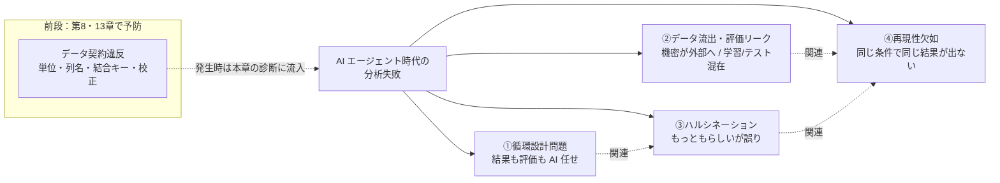
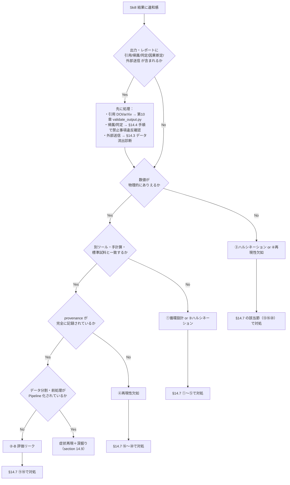

# 第14章　失敗パターンとリスク管理

> **本章の到達目標**
> - AI エージェント時代の分析でよく起きる失敗を**4 大カテゴリ**（循環設計・データ漏洩・ハルシネーション・再現性欠如）で体系的に理解する
> - 各失敗パターンについて、**症状（何が見えるか）→原因（なぜ起きるか）→診断（どう検知するか）→再発防止（どこを直すか）** を辿れるようになる
> - 装置カテゴリ別の**典型失敗事例**を、第13章のテンプレートと第12章の検証チェックリストに紐づけて理解する
> - 現場で使える **失敗チェックリスト（20 項目）** を運用し、Skill の投入前・投入後にセルフ診断できる

**扱うこと**：**事例と診断**。すでに書いた Skill が現場で失敗するパターンの分類、実例（架空だが典型的なシナリオ）、診断手順、再発防止策。装置カテゴリ別の失敗例。
**扱わないこと**：予防的な安全ルール・権限設計（第6章）、設計時の評価仕様（第7章）、実行後の検証手順そのもの（第12章）、運用・組織導入（第15章）。本章は「起きたあと・起きそうな時にどう診るか」に集中します。

> [!NOTE]
> 本章は**事後分析と診断**の章です。第6章が「事故を起こさないルール」だとすれば、本章は「起きた事故から学ぶ症例集」です。第12章の実行後検証で "怪しい" と気づいた後の**深掘り診断**にも使えます。

---

## 14.1　なぜ「失敗の体系化」が独立の章になるのか

AI エージェント時代の分析失敗は、**従来のスクリプト分析の失敗**とは性質が違います。従来は「バグ→エラー→修正」の流れが基本でした。しかし AI Agent では次の 3 つが起きます。

1. **エラーが出ない失敗**：AI が「もっともらしい答え」を返すので、間違っていても実行は成功に見える
2. **文脈依存の失敗**：同じ Skill でも、プロンプト・環境・呼び出し順が違うと結果が変わる
3. **循環による自己肯定**：AI に「結果」と「評価」の両方を任せると、間違いが**整合的に見える**

この 3 つを念頭に置いて、失敗を 4 カテゴリに分けます。

> [!IMPORTANT]
> **本章の 4 カテゴリでは扱わない：データ契約違反**
> 単位不整合（`nm` vs `cm⁻¹`）・列名の意味違い・join key 誤結合・校正済みフラグ欠落などの**データ契約違反**は、独立の失敗クラスですが、本書では**第8章（入力のデータ契約）**と**第13章（テンプレートの ⚡Δ 項目）**で先回りして予防する立場をとります。本章の 4 カテゴリと合わせて "5 番目のカテゴリ" として意識してください。§14.7 チェックリストにも直接項目化しませんが、第8章・第13章のチェック未完了は「本章に入る前段」の失敗として扱います。



各カテゴリは独立ではなく、相互に影響します。例えば「ハルシネーション」を発見できないまま報告書に載せるのは「循環設計」の失敗でもあり、また AI 環境が変わった後の再検証が抜けていれば「再現性欠如」でもあります。

---

## 14.2　失敗カテゴリ①：循環設計問題

### 定義

**AI に "結果を出す役" と "結果を評価する役" の両方を任せてしまい、間違いが検出できない状態**。第7章で最も強く警告した設計上の落とし穴。

### 典型シナリオ（架空）

> 学生 A は Raman ピーク検出 Skill を作った。動作確認のため、AI に「このピーク位置は妥当か？」と質問した。AI は「1332 cm⁻¹ は sp³ 炭素の典型的なピーク位置と一致しており妥当です」と回答。学生 A はそれを根拠に Skill が動作していると判断し、レポートに「AI による妥当性検証済み」と記載した。**ところが元データは HOPG（グラファイト＝sp²）だった。1332 cm⁻¹ ピークは自体は D バンド候補として位置レンジ内だが、"sp³ の典型" という帰属は誤り**。しかし学生 A はそれに気付けなかった。

### 症状

- レポートに「AI で検証済み」「Copilot が妥当と判断」といった記述がある
- 検証の根拠が**別の AI 応答**でしかない（別ツール・手計算・文献値・独立標準の実測いずれもない）
- 検証者と分析者が同一の AI／同一プロンプトチェーン

### 原因

- **人間側の役割設計不足**：AI に判断を委ねる線引きを事前に定義していない
- **独立参照点の未設定**：第7章「独立参照点3層」（手計算・別ツール・実測標準）を Skill 側に組み込んでいない
- **チャット応答をエビデンス扱い**：AI のチャット応答には第9〜11章で禁止した「同定・帰属」が混入しがち

### 診断手順

| Step | 確認 | Fail 条件 |
|:---:|---|---|
| 1 | 検証プロセスに**人間の判定行**があるか | 検証者欄が空 or "AI" のみ |
| 2 | 検証の根拠が**第12章の 4 観点**（物理的妥当性・外れ値・再現性・既存手法との一致）のいずれかで**数値**として書かれているか | 「AI が妥当と判断」等の**文字列**のみ |
| 3 | 独立参照点（別ツール／手計算／実測標準）の**数値** が別ファイル（Notebook のセル出力・別スクリプトのログ）に残っているか | 参照点なし |
| 4 | 検証時のプロンプトログに **"同定" "帰属" "妥当"** の文字列が Skill 側から出力されていないか | Skill 出力に含まれる（第9〜11章の禁止事項違反） |

### 再発防止

1. **役割分担表を Skill プロジェクトに置く**：`README.md` に「Skill が返すもの」「人間が判定するもの」「AI 応答で許される範囲」を明記
2. **独立参照点 3 層を第7章⑦成功条件として書き込む**：手計算チェック関数・別ツール比較・実測標準（既知試料）の 3 つを Skill の `references/` 配下に置く
3. **第12章のチェックリスト 15 項目を提出条件にする**：レビュー・投稿・学位論文の受理条件に組み込む

### 装置カテゴリ別の循環設計典型例

| データ型 | 典型パターン | 独立参照点の例 |
|---|---|---|
| スペクトル型（Raman/IR） | ピーク位置の物質同定を AI 応答で確認 | 標準試料の実測（Si 520.7 cm⁻¹）／文献の分子振動表 |
| 時系列型（TGA/DSC） | 質量減少温度の "帰属" を AI に質問 | 標準物質（CaC₂O₄·H₂O 等）の既知イベント温度 |
| 画像型（SEM/AFM） | スケールバー読み取り＋粒径推定を AI 応答で確認 | 標準格子試料の既知寸法（例：TEM グリッド） |
| 回折型（XRD） | 派生量（粒径）を AI 応答で "整合" と判断 | Si 111 の 2θ 実測＋波長からの再計算 |
| 表形式型 | "重要な変数はこれ" を AI 応答で確認 | ホールドアウトテスト・drop-column importance の独立実行 |
| マルチモーダル | 統合結果の "整合性" を AI 応答で判断 | 各モダリティ単独 Skill の出力との一致確認 |

---

## 14.3　失敗カテゴリ②：データ流出・評価リーク

### 定義

「漏洩」は**性質の異なる 2 系統**を含みます。本章では便宜上 1 カテゴリにまとめますが、A と B は**リスク主体・診断・対策がまったく別物**です。混同しないでください。

- **②-A データ流出（プライバシー漏洩）**：機密データ・未公開データが Skill の実行を通じて**意図せず外部へ送信**される。リスク主体：情報セキュリティ・NDA。
- **②-B 評価リーク**：学習データとテストデータが**独立でない**状態で分割され、性能が過大評価される。リスク主体：ML 評価設計。

### 典型シナリオ

**（②-A）データ流出の例（架空）**

> ある企業の分析者が、顧客からの分析依頼サンプル（材料組成が秘匿）の Raman スペクトルを、Copilot Chat に**貼り付けて**「このピークの解釈を教えて」と入力した。ベンダー規約上、入力内容は将来的なモデル改善に使われる可能性があった。**顧客秘匿の分析依頼データが AI ベンダー側に転送された可能性が残る**。

**（②-B）評価リークの例（架空）**

> ある研究室が、同一バッチから切り出した 5 枚のウェハーの XRD データを、ランダムに 4 枚を「訓練」1 枚を「テスト」に分けてモデルを作った。**同一バッチなので試料同士は独立ではない**。テスト精度は 99% と出たが、別バッチのウェハーに適用すると 60% しか合わなかった。

### 症状

- **②-A データ流出**：AI ベンダー規約に「入力データを学習に使わない」保証がない、あるいは Skill が外部 API を呼ぶログが残っている
- **②-B 評価リーク**：訓練とテストが**サンプル ID 単位でなくデータ点単位**で分割されている／同一バッチが両方に含まれる／時系列で未来のデータが訓練側に含まれる

### 原因

**②-A データ流出**：
- **ローカル実行 vs API 呼び出しの境界が不明**：どこまでがローカル、どこから外部通信かを Skill 設計時に整理していない
- **プロンプトへの生データ直接貼り付け**：ファイルとして扱えば読み込まないケースでも、チャットに貼るとテキストとして送られる
- **社内ポリシー・NDA の未確認**：使用中の AI 環境が学習除外契約下にあるかを確認していない

**②-B 評価リーク**：
- **分割単位の誤り**：サンプル ID や試料バッチではなく行単位で分割
- **時系列リーク**：時間順に並んだデータをシャッフル分割する
- **前処理リーク**：標準化・特徴量選択を分割前に**全データ**に対して行い、テストデータの情報が漏れる

### 診断手順

**②-A データ流出の診断**

| Step | 確認 | Fail 条件 |
|:---:|---|---|
| 1 | Skill が呼ぶ外部エンドポイントを列挙 | 意図しない外部 API 呼び出し |
| 2 | 使用中の AI 環境の**学習除外契約**の有無 | 契約なし・確認未 |
| 3 | Skill 実行前の**マスキング処理**の有無 | 生データがそのまま送られる |
| 4 | 実行ログに**通信先 URL**が記録されているか | 記録なし・監査不能 |

**②-B 評価リークの診断**（第13章 §13.6 tabular の `leakage_check == "passed"` 判定に対応）

| Step | 確認 | Fail 条件 |
|:---:|---|---|
| 1 | 分割単位が**サンプル ID・バッチ ID・時刻**のいずれかで意味を持つか | 行単位ランダム分割 |
| 2 | 標準化・特徴選択は**訓練データのみ**で fit されているか | 全データで fit |
| 3 | 時系列データで**訓練が過去・テストが未来**の順序が守られているか | 時系列シャッフル |
| 4 | ホールドアウト（別バッチ・別日・別装置）で再評価しているか | 内部 CV のみ |

### 再発防止

**②-A データ流出**：
1. **データ分類ラベル**：全データに「公開可／社内限定／機密」のタグを付け、Skill が扱う前に確認
2. **マスキング Skill を第8章のデータ契約に組み込む**：機密フィールドを ID・ハッシュに置換
3. **AI 環境の学習除外契約**：Copilot Enterprise・Azure OpenAI 等の**学習除外オプション**を採用（詳細は第6章）
4. **プロンプトに生データを貼らない**：ファイル読み込みを前提とし、必要な部分のみ Skill で加工

**②-B 評価リーク**：
1. **サンプル ID・バッチ ID・測定日**を分割キーに使う（GroupKFold / TimeSeriesSplit）
2. **Pipeline による前処理封入**：`sklearn.Pipeline` で標準化・特徴選択を CV フォールド内に閉じ込める
3. **独立ホールドアウト**：内部 CV に加え、**別バッチ・別日**のデータでの再評価を第7章の成功条件に入れる

---

## 14.4　失敗カテゴリ③：ハルシネーション

### 定義

**AI が事実に基づかない情報を、もっともらしく生成すること**。分析文脈では、存在しない文献の引用・存在しないピーク帰属・存在しない相・ありえない値の生成が典型。

### 典型シナリオ

**（A）文献捏造の例（架空）**

> 分析者が Skill 実行結果について Copilot に「参考文献を挙げて」と質問。AI は「Journal of Materials Science, 2019, 54, 12345, Yamada et al., 'Novel Raman Analysis of ...'」と回答。**論文は実在しない**。DOI を検索しても該当なし。（詳細は第10章の文献照合フローで対処済み）

**（B）ピーク帰属捏造の例（架空）**

> Raman スペクトルのピーク位置について AI に「これは何のモード？」と質問。AI は具体的な物質名と振動モードを回答した。しかし試料は AI の予想と別物質だった。**同じピーク位置でも複数物質が候補になり得るのに、AI は 1 つに絞って断定**した。分析者は「試料っぽさ」に引きずられて信用してしまう。

**（C）ありえない値の例（架空）**

> 表形式データの相関分析で AI に「最も重要な変数は？」と質問。AI は「temperature の相関係数 r=1.03 で最重要」と回答。**r > 1 は数学的にありえない**。生成の過程で数値が捏造された。

### 症状

- 引用が具体的に見えるが、DOI・arXiv ID・URL が検索でヒットしない
- 装置カテゴリの禁止事項（第9〜11章）に反する**帰属**が AI 応答に含まれる
- 数値が物理的・数学的にありえない（相関係数 > 1、粒径 < 0、確率 > 1 等）
- 「〜と一般に知られている」「〜が典型的である」等の**根拠を示せない一般化**

### 原因

- **チャット応答をそのままレポートに転記**：Skill の**構造化出力**を経由せず、自由テキスト応答を採用
- **禁止事項の未実装**：Skill の⑤禁止事項（帰属・同定・因果）が Skill 側で強制されていない
- **物理的レンジ検査の欠如**：第12章の物理的妥当性チェックが動いていない

### 診断手順

| Step | 確認 | Fail 条件 |
|:---:|---|---|
| 1 | レポート中の全ての**数値・引用・帰属**にトレース先（Skill 出力ファイル・文献 DOI・実測データファイル）があるか | 一つでも不明 |
| 2 | 文献 DOI / arXiv ID が**第10章の validate_output.py と MCP** で照合済みか | 未検証 |
| 3 | 各数値のうち第12章の**物理的妥当性 RANGES に定義済みのキー**（`position_cm_inv`, `fwhm_cm_inv`, `intensity`, `grain_size_nm`, `2theta_deg` 等）はレンジ内か。**未定義キー**については自装置用レンジを追加してあるか | 定義済みキーが範囲外／未定義キーを追加していない |
| 4 | 帰属・同定を含む文が Skill の**チャット応答**由来か（構造化出力由来ではない） | チャット応答由来 |

### 再発防止

1. **Skill の⑤禁止事項を機械的に強制**：出力スキーマに「帰属テキストを含まない」制約を入れる（例：`type_label` は enum に限定、自由テキストを含めない）
2. **第10章の MCP 照合を Skill パイプラインに組み込む**：文献引用は必ず `validate_output.py` を通す
3. **第12章の物理的妥当性チェックを Skill 出力のポストプロセスに組み込む**：`check_physical_plausibility.py` を Skill 完了後に自動実行
4. **レポートの引用は "Skill 出力 → 論文" の 2 段構え**：AI のチャット応答を直接引用しない（第10章の flow）

### 装置カテゴリ別のハルシネーション典型例

| データ型 | ハルシネーションの形 | 検知手段 |
|---|---|---|
| スペクトル型 | ピーク位置の物質・振動モード帰属 | 第9章⑤禁止事項＋標準試料実測 |
| 時系列型 | イベント種別（分解・脱水など）の推定 | 第13章 §13.3：event_label は metadata 転記のみ |
| 画像型 | 粒径・空隙率の "本材料の典型値" 主張 | 第12章物理レンジ＋別ツール比較 |
| 回折型 | ピーク帰属の相同定 | 第13章 §13.5：単結晶 Scherrer 禁止・派生量は method 明示 |
| 表形式型 | "この変数が原因" 因果断定 | 第13章 §13.6：associative_screening のみ・"重要度" 禁止 |
| マルチモーダル | 統合結果の "総合的に妥当" 判断 | 第11章③ discussion 中の帰属禁止＋人間判定 |

---

## 14.5　失敗カテゴリ④：再現性欠如

### 定義

**同じ入力・同じ Skill・同じプロンプトで、時期や環境が違うと結果が変わる状態**。研究不正ではなく**環境の非明示化**が原因。

### 典型シナリオ

**（A）パッケージバージョン差の例（架空）**

> ある学生が Skill A で得た粒径推定結果 25 nm を、半年後に**同じデータ・同じ Skill** で再計算したら 27 nm になった。原因は `scipy` のマイナーバージョン更新でピーク検出のデフォルトパラメータが変わっていたこと。**Skill の `provenance.package_versions` には `scipy` が記録されていなかった**。

**（B）プロンプト差の例（架空・設計違反例）**

> 二人の研究者が同じデータに対して Skill を呼び出したが、片方は「解析してください」、もう片方は「詳しく解析してください」とプロンプトを書いた。AI Agent の内部でパラメータ選択が変わり、片方は SG フィルタ (3, 2)、もう片方は (5, 3) で処理された。**結果が有意に異なった**。

> [!WARNING]
> このシナリオは、そもそも**第7章・第13章の設計原則に反した Skill**（AI にパラメータ推論を委ねている）が引き起こす事故です。§14.7 ⑲「Skill パラメータは AI 推論ではなく metadata / 設定ファイルで確定」が守られていれば発生しません。**準拠済み Skill の "自然な再現性事故" と混同しないでください**。純粋な再現性欠如の例は（C）と、次項の「依存バージョン差」「非決定的並列処理」「外部 API 応答変化」です。

**（C）乱数種未固定の例（架空）**

> Skill 内でクラスタリング（k-means）を使っていたが、`random_state` を固定していなかった。実行するたびにクラスタ番号が変わり、下流のレポートで「クラスタ 0 が最大」と書いても再現できない。

### 症状

- Skill 出力に `provenance` フィールドがない、または `skill_version` のみで**パッケージ・乱数種・環境**が記録されていない
- 「なぜかこの前と結果が違う」報告
- Skill の呼び出しプロンプトが**フリーフォーム**で、パラメータが AI に選ばせる設計になっている

### 原因

- **provenance 記録不足**：第7章 ⑧再現性条件が Skill に落とし込まれていない
- **パラメータの AI 委任**：Skill の入力パラメータを AI が推論して埋める設計（毎回変わる）
- **依存関係の未 pin**：`requirements.txt` にバージョン範囲指定（`>=`）を使っている
- **乱数種未指定**：確率的アルゴリズム（クラスタリング・ブートストラップ・NN）で seed を渡していない

### 診断手順

| Step | 確認 | Fail 条件 |
|:---:|---|---|
| 1 | Skill 出力の `provenance` に **skill_version・package_versions・run_datetime_utc** が揃っているか | 一つでも欠落 |
| 2 | 使用パッケージが**厳密バージョン**（`==`）で pin されているか | 範囲指定・未指定 |
| 3 | 確率的アルゴリズムに**乱数種**が渡され、provenance に記録されているか | seed 記録なし |
| 4 | Skill のパラメータが**入力 metadata や `references/` の設定ファイル**で確定しているか（AI 推論に任せていないか） | AI が動的に決めている |
| 5 | 同一データで**2 回連続実行**して bit-exact 一致するか | 差分あり |

### 再発防止

1. **Skill テンプレート（第13章）の⑥再現性条件を必ず埋める**：skill_version・package_versions・run_datetime_utc・乱数種
2. **`requirements.txt` は `==` で pin**：`pip freeze` の結果をそのまま使う
3. **パラメータは入力 metadata に落とす**：AI に選ばせず、`references/params.yaml` 等で明示
4. **確率的アルゴリズムは `random_state` 必須引数化**：Skill 引数として受け付ける
5. **Skill 実行スクリプトに `assert_bit_exact.py` を追加**：同一入力で 2 回実行して差分がないことを CI で確認

---

## 14.6　装置カテゴリ×失敗カテゴリのクロスマトリクス

第13章の 6 データ型と本章の 4 失敗カテゴリの組み合わせで、**現場で特に発生率が高い組み合わせ**を示します。

> [!NOTE]
> **⚠️⚠️（最高）の判定基準**：本表の「最高」は次の 3 軸の**総合**で決めています。
> - **frequency**：現場で頻度が高い
> - **impact**：起きたときの下流影響が大きい（研究結論そのものが変わる）
> - **detectability の低さ**：セルフレビューでは気付きにくい
>
> 例えば「スペクトル型×ハルシネーション（物質同定）」も impact は極めて高いですが、第9章⑤禁止事項＋標準試料の実測で**検知可能性が比較的高い**ため⚠️ 高としています。個別プロジェクトの状況によっては、これらのセルも「最高」に格上げすべきです（下表脚注参照）。

| データ型＼失敗 | ①循環設計 | ②-A データ流出 | ②-B 評価リーク | ③ハルシネーション | ④再現性欠如 |
|---|:---:|:---:|:---:|:---:|:---:|
| スペクトル型 | ⚠️ 高（帰属を AI 任せ） | 中（規制対象試料） | 低 | ⚠️ 高（物質同定・脚注¹） | 中（前処理差） |
| 時系列型 | ⚠️ 高（イベント帰属） | 中 | 中 | ⚠️ 高（分解・脱水の帰属） | ⚠️ 高（resample） |
| 画像型 | 中 | 中（顕微鏡画像は個人特定リスク低） | 低 | 中（粒径推定） | ⚠️ 高（前処理パラメータ） |
| 回折型 | ⚠️ 高（相同定） | 低 | 低 | ⚠️ 高（相同定・派生量・脚注¹） | 中（method 選択） |
| 表形式型 | ⚠️ 高（変数重要度） | 中 | ⚠️ **最高**（評価リーク） | 中（因果断定） | 中（CV スキーム） |
| マルチモーダル | ⚠️ **最高**（統合の "整合" 判断） | 中 | ⚠️ 高（結合キー誤り） | 中（統合帰属） | ⚠️ 高（version pin 多重） |

**印の意味**：⚠️⚠️（最高）は 3 軸すべてで高い組み合わせ。⚠️（高）は 2 軸で高い組み合わせ。中／低は残りの組み合わせ。

**脚注¹**：「スペクトル型×ハルシネーション」と「回折型×ハルシネーション」は impact / frequency が非常に高い一方、第9章⑤禁止事項＋実測標準で**検知可能性がある**ため⚠️ 高。しかし**独立参照点を実装していない Skill**を使う場合は、これらも実質⚠️⚠️（最高）扱いすべきです。

---

## 14.7　失敗チェックリスト（20 項目）

第12章のチェックリスト 15 項目が「実行後の検証項目」なら、本章のチェックリストは「**失敗しやすい設計・運用の落とし穴**」です。Skill を投入する前・投入後の**両方**で使えます。

### 最小版チェックリスト（日常クイックゲート 8 項目）

> [!TIP]
> 35 項目（第12章 15 + 本章 20）フルチェックは**論文投稿・共有・公開の前**に実施する完全版です。日常運用では下記 **8 項目のクイックゲート**でスクリーニングし、危険信号が出たときだけフルチェックに進むと形骸化を防げます。

- [ ] **Q1** 検証者と分析者が別ステップ・別ノートブックに分かれているか（循環設計）
- [ ] **Q2** 独立参照点（手計算／別ツール／実測標準）の**最低 1 層**が実行済みか（循環設計）
- [ ] **Q3** データに公開可／社内限定／機密の**分類ラベル**が付いているか（データ流出）
- [ ] **Q4** 分割単位が**サンプル ID・バッチ ID・時刻**で意味を持つか（評価リーク）
- [ ] **Q5** レポート中の**引用 DOI/arXiv ID**が MCP 照合済みか（ハルシネーション）
- [ ] **Q6** 出力の**主要数値**が第12章 RANGES または自装置レンジ内か（ハルシネーション）
- [ ] **Q7** Skill 出力の `provenance` に **skill_version・package_versions・run_datetime_utc** が揃うか（再現性）
- [ ] **Q8** Skill パラメータが AI 推論ではなく **metadata / 設定ファイル**で確定しているか（再現性）

**Q1〜Q8 のいずれかが FAIL の場合**、対応する完全版セクション（§14.7 の該当群）へ進んでください。

---

### 完全版チェックリスト 20 項目（出荷前・共有前）

#### 循環設計（5 項目）

- [ ] **①** レポートに「AI で検証済み」といった記述がないか、あるいはあっても**別の独立参照点**（手計算・別ツール・実測標準）とセットで書かれているか
- [ ] **②** 検証者と分析者を分けているか（同一人物でも別ステップ・別ノートブックで）
- [ ] **③** Skill のチャット応答から**同定・帰属テキスト**を除去する仕組みがあるか
- [ ] **④** 成功条件・評価基準を Skill 実行**後**に変更していないか。変更した場合は**再実行・再評価**しているか（第7章の設計時原則）
- [ ] **⑤** 独立参照点 3 層（手計算／別ツール／実測標準）のうち**最低 1 層**が実装されているか

#### データ流出・評価リーク（5 項目）

- [ ] **⑥** 全データに公開可／社内限定／機密の**分類ラベル**が付いているか（②-A）
- [ ] **⑦** 使用中の AI 環境が**学習除外契約**下にあるか、または機密データを渡していないか（②-A）
- [ ] **⑧** 生データを AI チャットに**貼り付けていない**か（ファイル読み込みで処理しているか）（②-A）
- [ ] **⑨** 訓練・テスト分割が**サンプル ID・バッチ ID・時刻**で意味を持つか（行単位ランダム分割になっていないか）（②-B）
- [ ] **⑩** 前処理（標準化・特徴選択）は**訓練データのみ** で fit されているか（Pipeline 化されているか）（②-B）

#### ハルシネーション（5 項目）

- [ ] **⑪** レポート中の全ての引用に**トレース先**（Skill 出力ファイル・DOI 等）があるか
- [ ] **⑫** 文献 DOI/arXiv ID は**第10章の validate_output.py と MCP**で照合済みか
- [ ] **⑬** 出力スキーマ上の**主要数値**が第12章の**物理的妥当性 RANGES 定義済みキー**についてレンジ内であり、**未定義キー**は自装置用レンジを追加してあるか
- [ ] **⑭** 帰属・同定を含む文が Skill の**構造化出力**（チャット応答ではない）由来か
- [ ] **⑮** Skill の⑤禁止事項（第9〜11章）が、**次のいずれか**で機械的／運用的に検査されているか：(a) 出力スキーマの enum / 型制約、(b) `validate_output.py` 等の禁止語・パターン検査、(c) レビューでの目視確認。（完全な JSON Schema 強制は難しいので、a〜c の**組み合わせ**を推奨）

#### 再現性欠如（5 項目）

- [ ] **⑯** Skill 出力の `provenance` に **skill_version・package_versions・run_datetime_utc**が揃っているか
- [ ] **⑰** `requirements.txt` が**厳密バージョン**（`==`）で pin されているか
- [ ] **⑱** 確率的アルゴリズムの**乱数種**が Skill 引数として渡され、記録されているか
- [ ] **⑲** Skill パラメータが **AI 推論ではなく metadata / 設定ファイル**で確定しているか
- [ ] **⑳** 同一入力で 2 回連続実行して**bit-exact 一致**するか（CI 等で確認）

> [!TIP]
> このチェックリストは Skill プロジェクトの `README.md` の「セルフレビュー」節に貼って運用してください。第12章 15 項目と併せて計 35 項目のセルフレビューで、本書の合格ラインを超えます。

---

## 14.8　診断フロー：失敗が疑われたときの動き方

Skill の結果が "何かおかしい" と感じたときの動き方を示します。第12章の 4 観点検証で違和感が出た後、または論文・報告書のレビューで指摘を受けたときに使います。



> [!IMPORTANT]
> Q0 を先頭に置く理由：**物理的にありえる数値でも、帰属・引用・因果断定・外部送信が伴えばそれ自体が失敗**です。Q1 以降の数値中心の検査だけでは、"数値レンジ内のもっともらしい誤帰属" がすり抜けます。まず出力に含まれる**言明の性質**を確認し、必要な深掘り経路（第10章 MCP 照合・§14.4 禁止事項確認・§14.3 通信ログ確認）へ分岐させてください。

---

## 14.9　症状再現と深掘り診断

診断フローで「症状再現」に到達したら、次を実施します。

1. **最小再現データセットの作成**：問題が出る最小のデータ（1〜数レコード）を切り出し、`tests/regression/` に置く
2. **タイムスタンプ付きスナップショット**：`data/`, `references/`, `requirements.txt`, `provenance.json` を tarball で保存
- **環境スナップショット**：
  - チーム運用：`snapshots/case_NNN_YYYYMMDD.tar.gz`（`data/`, `references/`, `requirements.txt`, `provenance.json` を tarball）
  - ソロ運用（軽量版）：**大容量 raw data はコピーせず**、以下のみを `snapshots/case_NNN_YYYYMMDD/` に保存
    - `provenance.json`
    - `requirements.txt`
    - `references/params.yaml`（Skill 設定）
    - `input_manifest.yaml`（入力データのパス + SHA-256 ハッシュ）

3. **同僚に独立再現を依頼**：別環境・別プロンプトで同じ結果になるかを確認
4. **失敗ログを WIKI / issue に記録**：後述の失敗ログ雛形を使う

### 失敗ログ雛形

```markdown
# 失敗ログ #NNN

## 発見日
YYYY-MM-DD

## 症状（何が見えたか）
- 出力値: ...
- 期待値または直感: ...

## 分類（§14.2〜14.5 のどれか）
- [ ] ①循環設計 / [ ] ②データ漏洩 / [ ] ③ハルシネーション / [ ] ④再現性欠如

## 診断手順（§14.2〜14.5 の該当 Step 表）
Step 1: ... → PASS / FAIL
Step 2: ... → PASS / FAIL
...

## 再現データ
`tests/regression/case_NNN/`

## 環境スナップショット
`snapshots/case_NNN_YYYYMMDD.tar.gz`

## 原因（判明後に埋める）
...

## 恒久対策（§14.7 のどの項目を強化したか）
- 追加/更新した項目: ⑯ を強化（package_versions に scikit-learn を追加）

## 関連 issue / PR
- #123, #456
```

---

## 14.10　組織運用への橋渡し

本章の失敗チェックリストは、個人 Skill だけでなく**組織運用**にも直結します。第15章では、これを踏まえた**組織導入・運用設計**を扱います。

- **個人・日常運用**：§14.7 **最小版クイックゲート 8 項目**（Q1〜Q8）でスクリーニング。FAIL があれば該当群の完全版へ
- **個人・出荷/共有/投稿前**：§14.7 **完全版 20 項目** + 第12章 15 項目 = 35 項目のフルセルフレビュー
- **チームレベル**：レビュープロセス・失敗ログ共有・共通の禁止事項辞書
- **組織レベル**：AI 環境の学習除外契約・データ分類制度・監査ログ

失敗の**個別発生**を追跡するだけでなく、**組織的な学習ループ**（同じ失敗を他のメンバーが繰り返さない仕組み）に転換するのが第15章の主題です。

---

## 章末ワーク

1. **自己診断**：自分がすでに書いた Skill（第9〜11章のいずれか）について、§14.7 の 20 項目セルフレビューを実施し、**未達項目**を 5 項目挙げ、それぞれ**どこを直せば pass するか**を書きなさい。
2. **架空事例の分類**：以下の架空シナリオを §14.2〜§14.5 のどのカテゴリに分類するか答え、**根拠**を述べなさい。
   - (a) 「Skill を実行したら、AI が『このピークは Si の 2TO モードで妥当です』と回答したのでレポートに転記した」
   - (b) 「同じデータで 2 回 Skill を回したら、粒径が 25 nm と 27 nm になった」
   - (c) 「訓練 80% テスト 20% で 95% の精度が出たが、別バッチのデータでは 60% しか合わない」
   - (d) 「文献検索を AI に依頼したら DOI 付きで 3 本挙がったが、うち 1 本が検索でヒットしない」
3. **診断フロー適用**：自分の分析結果に "何か違和感" があるケースを 1 つ想像し、§14.8 の Mermaid フローに従って**どの分岐でどう判定するか**を追跡しなさい。
4. **失敗ログ作成**：§14.9 の雛形を使い、過去に自分（または研究室仲間）が経験した失敗 1 件を記述しなさい。分類・診断手順・恒久対策まで埋めること。
5. **クロスマトリクス確認**：§14.6 のクロスマトリクスで**⚠️⚠️（最高）**印がついている 2 セル（表形式×評価漏洩、マルチモーダル×循環設計）について、**なぜその組み合わせが最も危険なのか**を第12・13章の記述に紐づけて説明しなさい。

---

## 本章のまとめ

- AI エージェント時代の分析失敗は**エラーが出ない・文脈依存・自己肯定的**という特徴があり、従来のバグ修正モデルでは対処できない
- 失敗を **4 カテゴリ**（循環設計・データ漏洩・ハルシネーション・再現性欠如）で体系化し、それぞれ**症状→原因→診断→再発防止**の 4 段構えで整理した
- 装置カテゴリ×失敗カテゴリの**クロスマトリクス**で、特に注意すべき組み合わせを可視化した
- **失敗チェックリスト 20 項目**（§14.7）に加え、**最小版クイックゲート 8 項目**を用意し、日常運用と出荷前フルレビューを分離した
- 診断フロー（§14.8）と症状再現・深掘り診断（§14.9）で、"違和感" から**恒久対策**まで辿れる
- 個人 Skill の失敗事例は**組織学習**に転換すべきであり、それが第15章の主題である

> **次章予告**：第15章（終章）では、本章までで作った Skill を**組織で運用**するための最小の設計を扱います。個人からチームへ、監査・ログ・責任分担、そして "深追いしない" 現実的な運用ラインを提示します。

---

## 参考資料

- [脚注1] 循環設計問題（AI に "評価" と "生成" の両方を任せる危険性）についての先行議論は、第7章の設計時評価仕様の節を参照。本章は事後診断の観点で補完する。
- [脚注2] 評価漏洩（data leakage）の基本文献：Kaufman, S., Rosset, S., & Perlich, C. (2011). "Leakage in Data Mining: Formulation, Detection, and Avoidance." KDD 2011. 本書では pandas/scikit-learn Pipeline を通じた実装レベルの対処に焦点を当てる。
- [脚注3] ハルシネーション対策の外部依存部分は第10章（MCP による文献 DOI/arXiv 照合）、装置固有部分は第13章（テンプレートの⑤禁止事項）を参照。
- [脚注4] 再現性の技術的側面（package pin・乱数種・provenance）については、Reproducibility in Data Science に関する各種 checklist（例：ML Reproducibility Checklist）が参考になる。本書は装置分析文脈に合わせて設計時条件（第7章⑥⑧）と実行後検証（第12章）に橋渡しする立場をとる。
- 本章の失敗チェックリスト 20 項目は、第12章の 15 項目と併せて Skill プロジェクトの `README.md` に貼付して運用することを推奨。
- 組織運用・監査・責任分担は第15章（終章）で扱う。
